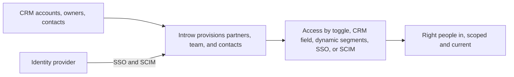
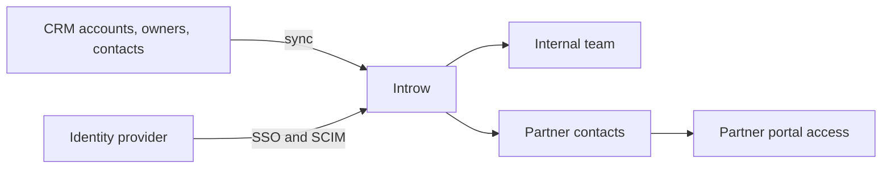

# Introw docs (docs.introw.io): features-access

Verbatim from docs.introw.io/llms-full.txt, fetched 2026-09-29. 15 pages.

# Access & Security
Source: https://docs.introw.io/features/access/index

Control who can see and do what on both sides of the partnership: internal team roles, partner team roles, and single sign-on for everyone.

> Every partner program runs on trust, and trust starts with access. Decide exactly what your internal team can do, what each partner's people can do, and how everyone signs in, all configured by your team without engineering.

## The problem it solves

<Pains>
  | Without Introw                          | With Introw                      |
  | --------------------------------------- | -------------------------------- |
  | Everyone has more access than they need | Roles grant only what is needed  |
  | Partners need access, not CRM seats     | Scoped portal users, never seats |
  | Adding a person is an IT ticket         | SSO and SCIM do it for you       |
  | Nobody knows who owns which partner     | Partner team roles, CRM-synced   |
</Pains>

## Impact

Partners notice a program that lets them run their own side of it. Adding their own colleagues and signing in with their own identity is a small thing that decides whether they use the portal at all.

<Impact>
  for your business

  * **Cost to run**
    Roles, partner team roles and SSO are configured by your own team, with no engineering and no ticket to add a person
  * **In your CRM**
    Partner and visitor access is scoped to the CRM data each partner owns, and no external user ever needs a CRM seat
  * **Trustworthy**
    Sign-in follows your identity provider and your existing policy, and the same scope governs Introw's AI agents

  for your partners

  * **Self-serve**
    A trusted partner manager adds their own teammates instead of emailing you about every new person
  * **Enabled**
    Their people sign in with their own identity provider, so nobody is blocked on another password
  * **Efficient**
    They see the accounts and records that are theirs, with no request to widen or narrow access

  [A day in the life of a distributor](/days-in-the-life/distributor)
</Impact>

<Personas>
  * **CRM Administrator** - identity and access policy in one place
  * **Partner Operations** - roles and ownership without a ticket
  * **Partner alliance managers** - adding their own colleagues
</Personas>

## How this area works

Access and security covers three capabilities. Provisioning is how people get in: partners, their
owners, and their contacts sync live from your CRM, and your own team is created, given a role, and
deactivated through single sign-on and SCIM. Team management is where you invite your internal team,
assign roles built from clear permission categories, and limit users to the partners they own. It is
also where you define partner team roles and assign the people who manage each partner. Single sign-on
lets your own team and your partners log in through your identity provider, so access follows your
existing security policies.

**Where this sits in a setup.** Access is foundation work: every [setup track](/tracks) does it before anything a partner sees, because a portal nobody can get into is not a program.

<Rail>
  * 

    [**Provisioning**](./provisioning)

    Partners, owners and contacts, live from your CRM.

    [How to · 1 guide](./provisioning/technical)

  * 

    [**Team Management**](./team-management)

    Roles from permission categories, and who owns whom.

    [How to · 4 guides](./team-management/technical)

  * 

    [**Single Sign-On**](./sso)

    SAML or OIDC, for your team and for the portal.

    [How to · 2 guides](./sso/technical)
</Rail>

All three are configured by partner operations and admins directly, with no code, and the permissions
you set apply consistently across every surface a user touches.

<Note>
  These permissions also scope Introw's AI agents. When an assistant connects over [MCP](/features/developer/mcp), its data access follows the signed-in user's partner scope - a partner's assistant reaches only that partner's data. What an agent may do on its own is governed by a vendor-configured [capability matrix](/headless#governance-and-trust), with sensitive actions kept behind human approval.
</Note>

## Introw's own access to your organisation

Security reviews ask this one, so it is worth stating plainly. Introw support can, by default, sign in as one of your users to reproduce a problem, and use internal CRM tooling against your connected CRM to diagnose a sync. Both are audited.

Either can be switched off for your organisation. Ask your Introw contact and we set it on our side, per organisation:

* **Impersonation off** means no Introw employee can sign in as one of your users or your partners' users, for any reason.
* **CRM tools off** means Introw's internal CRM tooling cannot be pointed at your connected CRM. It can also be narrowed to a named list of Introw staff instead of switched off entirely, so a nominated support contact keeps working while nobody else can.

Turning them off is a real trade-off, not a free win. With impersonation off, "can you see what my partner sees" becomes a screenshare rather than something support can check alone. Expect slower diagnosis on portal-specific issues. Regulated programs usually take that trade; most do not need to.

## Run it from your AI assistant

<Headless>
  * Reassign Acme's partner manager to another team member.
  * Who owns each of our partners?
</Headless>

---

# Provision your team with SCIM
Source: https://docs.introw.io/features/access/provisioning/guides/provision-your-team-with-scim

Connect your identity provider to Introw over SCIM to automatically create, update, and deactivate internal team members and their access.

SCIM lets your identity provider be the single place you manage who is on your Introw team. Once connected, assigning someone to Introw in your identity provider creates their team member, and unassigning or offboarding them deactivates it and ends their sessions. That removes the manual invite step and, more importantly, closes the security gap where a leaver keeps access because someone forgot to remove them.

## What you'll achieve

Your identity provider (Okta, Microsoft Entra ID, or any SCIM 2.0 provider) provisions your internal Introw team automatically: new hires assigned to Introw appear as team members with a default role, profile changes flow through, and deactivated users lose access and have their sessions revoked, all without anyone inviting or removing people by hand.

## Before you start

<Steps>
  <Step title="Confirm the add-on and permission">
    Single sign-on is a paid add-on and must be enabled on your plan; SCIM is part of it. You need single sign-on permission on your role. SCIM works whether or not you also switch your team to SSO sign-in.
  </Step>

  <Step title="Have admin access to your identity provider">
    You need to be able to add and configure a provisioning application in your identity provider (for example an Okta or Microsoft Entra ID admin).
  </Step>

  <Step title="Decide the default role">
    New team members provisioned over SCIM arrive with the org's default role. Set or confirm it in the **Default role** field of the internal SSO attribute mapping before you turn provisioning on.
  </Step>
</Steps>

## Steps

### Enable SCIM in Introw

<Steps>
  <Step title="Open the SCIM provisioning section">
    Go to [Internal SSO](https://app.introw.io/settings/developers/sso) and scroll to the **SCIM provisioning** section. It sits on the same page as internal single sign-on, but runs independently: you do not have to switch your team to SSO sign-in to use it.

    <Frame>
      
    </Frame>
  </Step>

  <Step title="Enable provisioning and generate a token">
    Turn on **Enable SCIM provisioning**, then select **Generate token**. The **Copy your SCIM token** dialog appears with the two values your identity provider needs:

    * **Base URL** - the SCIM endpoint your identity provider connects to. Copy it from the **Base URL** field.
    * **Bearer token** - the credential your identity provider authenticates with. It is shown once, so copy it now: the dialog reminds you that **This token is shown once**. Treat it like a password, and never paste it into a support chat or commit it to code.

    Provisioning stays paused until it is enabled, so nothing syncs until you finish the identity-provider side.
  </Step>
</Steps>

### Connect your identity provider

<Steps>
  <Step title="Add Introw as a provisioning app">
    In your identity provider's provisioning settings, create or open the Introw application and enable SCIM provisioning. Paste the **Base URL** as the SCIM connector base URL and the **Bearer token** as the authentication token. Enable the create, update, and deactivate user operations. Group and role push are not used: roles are assigned in Introw, not by the identity provider.
  </Step>

  <Step title="Assign the people who should have access">
    Assign the users (or the groups) in your identity provider that should have an Introw team seat. Each assigned user is provisioned as a team member with the org's **Default role**. You can change any person's role afterward on the **Roles** tab under **Settings, Team**; the identity provider cannot set or override roles, so Introw stays in control of what each person can do.
  </Step>
</Steps>

### Verify and maintain

<Steps>
  <Step title="Confirm users provisioned">
    Open the **Users** tab under **Settings, Team** and confirm the assigned people now appear as team members in the default role. Back in the **SCIM provisioning** section, **Last sync** updates to a recent time once your identity provider has pushed.
  </Step>

  <Step title="Check deactivation closes access">
    Unassign or deactivate a test user in your identity provider. Their team member moves to deactivated in Introw and their active sessions are revoked, so access ends without a manual step. This is the offboarding guarantee SCIM exists for.
  </Step>

  <Step title="Rotate or revoke the token when needed">
    If the token is exposed or you are rotating credentials, use **Rotate** to issue a new token and immediately invalidate the old one, then update your identity provider with the new value to keep provisioning working. Use **Revoke** to remove the connection entirely; after that your identity provider can no longer provision or deactivate users until you generate a new token.
  </Step>
</Steps>

## Verify it worked

A user you assign to Introw in your identity provider appears on the **Users** tab within a sync, in the default role, with no invitation sent. **Last sync** in the **SCIM provisioning** section shows a recent time. When you deactivate that user in the identity provider, their team member becomes deactivated in Introw and they can no longer sign in.

## Related

<CardGroup>
  <Card title="Set up internal SSO for your team" icon="book-open" href="/features/access/sso/guides/set-up-internal-sso">
    Add single sign-on alongside SCIM so your team also signs in through your identity provider.
  </Card>

  <Card title="Create an internal role" icon="book-open" href="/features/access/team-management/guides/create-an-internal-role">
    Build the role that provisioned users land in, or reassign them after they arrive.
  </Card>

  <Card title="Provisioning overview" icon="user-plus" href="../">
    How partners, contacts, and your team all get into Introw.
  </Card>

  <Card title="Implementation reference" icon="screwdriver-wrench" href="../technical">
    Full configuration options.
  </Card>
</CardGroup>

---

# Provisioning
Source: https://docs.introw.io/features/access/provisioning/index

Provision your team, partners, and partner contacts into Introw from your CRM and identity provider, and keep their access correct automatically.

Provisioning is how the people who run and use your program get into Introw, and how their access stays correct over time, without a list you maintain by hand.

> Getting people in should not be a project. Provisioning takes partners, their owners and their contacts from the CRM, and your own team from your identity provider, then keeps all of it current.

## The problem it solves

Getting the right people into a partner program, and out of it again, is usually manual, duplicated, and a security risk:

<Pains>
  | Without Introw                        | With Introw                     |
  | ------------------------------------- | ------------------------------- |
  | You rebuild the partner list by hand  | It arrives live from the CRM    |
  | Granting access is a per-person chore | A toggle or a CRM field does it |
  | Partners would need CRM seats         | Scoped portal users, no seats   |
  | Removing someone is a liability       | SCIM deactivates them for you   |
  | Partners email you per colleague      | They add their own teammates    |
</Pains>

## Impact

The first thing a partner experiences is getting in. When their colleagues are already there and access follows a CRM field rather than a request, the program starts with competence instead of a ticket.

<Impact>
  for your business

  * **In your CRM**
    Partners, their managers and their contacts are provisioned from CRM records, so nothing is typed twice or left to drift
  * **Live in days**
    The roster exists the moment you point Introw at your CRM filters, not after weeks of data entry
  * **Cost to run**
    No partner or contact list to maintain, and no IT ticket to add or remove one of your own people

  for your partners

  * **Self-serve**
    A trusted partner manager adds their own teammates without asking you to create an account
  * **Enabled**
    Their whole company arrives with them, because every contact on the account is imported
  * **Efficient**
    Access follows a CRM field, so nobody waits on a support request to get in or out

  [A day in the life of a distributor](/days-in-the-life/distributor)
</Impact>

<Personas>
  * **CRM Administrator** - partners in, and off CRM seats
  * **Partner Operations** - no manual roster to maintain
  * **Partner alliance managers** - adding their own team
</Personas>

## See it work

<Tour>
  * 

    **Point your directory at Introw**

    SCIM turns your identity provider into the source of truth for who has access.

  * 

    **Users arrive with a role**

    Nobody is invited by hand, and nobody keeps access after they leave.
</Tour>

## How it works

Your CRM already knows your partners, who owns them, and who works there. Introw turns that into a live roster, with no import spreadsheet and before anyone sets up SSO. The partner accounts you pick become partners. Each account's CRM owner is suggested as an internal team member: accept with one click and they become that partner's manager. Any partner managers you assign through a CRM field are matched to your team, and every contact on the partner's company is imported automatically.

Access then runs off the same live CRM data. You grant portal access with a toggle, or straight from a CRM field, and group people into dynamic segments built on CRM properties. Who can see what updates itself as the CRM changes. Importing, syncing, and access are one motion, not three. For your internal team you can layer on single sign-on and SCIM, and nothing is ever typed twice or left to drift from the system of record.

Instead of re-keying your partner org into a portal and chasing access one person at a time, you point Introw at the CRM and your identity provider once. The partner list, its ownership, and its contacts arrive on their own and stay current. Access and visibility come from four things: a toggle, a CRM field, dynamic segments built on CRM data, and - for your team - SSO or SCIM. The right people are always in with the right scope. The wrong people are out the moment the source of truth says so. Your program is staffed and accessible from day one, and it stays that way with no manual roster to maintain.

The people and their access flow straight from your systems of record into a scoped, current roster:

## Run it from your AI assistant

<Headless>
  * Who owns each of our partners?
  * Reassign Acme's partner manager to another team member.
</Headless>

## Going deeper

<CardGroup>
  <Card title="How to" icon="screwdriver-wrench" href="./technical">
    Setup, configuration, and all how-to guides.
  </Card>

  <Card title="API reference" icon="code" href="/general/introduction">
    Endpoints and code.
  </Card>
</CardGroup>

**Works with**

<CardGroup>
  <Card title="CRM" icon="plug" href="/features/integrations/crm">
    Partner accounts, their owners, and their contacts are provisioned live from your CRM.
  </Card>

  <Card title="Team Management" icon="shield-halved" href="/features/access/team-management">
    Provisioned users land in the roles and partner assignments defined here.
  </Card>

  <Card title="Single Sign-On" icon="shield-halved" href="/features/access/sso">
    Single sign-on provisions team members and partner contacts the first time they log in.
  </Card>

  <Card title="Portal Access" icon="browser" href="/features/portal/portal-access">
    Partner contacts provisioned from the CRM get their portal access managed here.
  </Card>

  <Card title="Segments" icon="users" href="/features/partners/segments">
    Dynamic segments built on synced CRM fields govern who each partner and contact can see.
  </Card>
</CardGroup>

---

# Provisioning
Source: https://docs.introw.io/features/access/provisioning/technical/index

Set up how partners, contacts, and your team get into Introw: CRM sync, portal access from a CRM field, team invites, single sign-on, and SCIM.

## Where it lives

Provisioning sits under **Settings**, at [Integrations](https://app.introw.io/settings/integrations).

<Frame>
  
</Frame>

## Before you start

| You need                    | Why                                     | Fix it                                                                            |
| --------------------------- | --------------------------------------- | --------------------------------------------------------------------------------- |
| A connected CRM             | Partners and contacts provision from it | [Connect a CRM](/features/integrations/crm/guides/connect-hubspot)                |
| Team management permission  | To invite users and define roles        | [Internal roles](/features/access/team-management/guides/create-an-internal-role) |
| SSO permission on your role | SCIM rides on the SSO add-on            | [Set up SSO](/features/access/sso/guides/set-up-internal-sso)                     |

## How it works

Provisioning is not one screen, it is four paths that put people into Introw and keep their access correct. Most of it is automatic once the CRM is connected:

* **From the CRM.** The partner accounts you select become partners. Each partner's CRM account owner is suggested as an internal team member you accept with one click, and set as the partner's manager; a new owner appears as **Requested** on the **Users** tab. Any partner managers you assign through a CRM owner property are matched to existing team members. Every contact associated with the partner's company is imported automatically under the partner's **People**. This all runs off the CRM sync, with no SSO required.
* **Partner portal access.** A partner contact can log in once you grant access, either with the **Portal access** toggle on the partner's **People** tab, or automatically from a CRM field so access is granted and revoked without touching Introw. Dynamic segments built on synced CRM fields then decide which portal tabs and content each contact sees.
* **Your internal team.** You invite colleagues on **Settings, Team**, or let them sign in through your identity provider, where a matching team member is created the first time they log in.
* **SCIM.** Your identity provider creates, updates, and deactivates internal team members on its own, so leavers lose access without a manual step.

The sources of truth stay outside Introw, and the roster inside Introw follows them:

## Settings & configuration

Provisioning is configured across a few surfaces, one per path.

### Partners and contacts from the CRM

In **Integrations** (the CRM and Data settings), **How do you store partners in your CRM?** sets the partner object, and **Find partners in your CRM** filters that object down to real partners. Turn on **Automatically sync new partners** so any future record that matches becomes a partner on its own. When a partner is created this way, Introw provisions the people around it too, all from the CRM and with no SSO required:

* **Account owner to internal team.** The partner's CRM account owner is added as the partner's manager and suggested as an internal team member. If they are not yet on your team, they appear as **Requested** on the **Users** tab under **Settings, Team**, where an admin accepts them with one click (or declines).
* **Assigned partner managers.** If you map a partner team role to a CRM owner property, the people named there are auto-assigned to that role on each partner. This matches existing team members only; it does not create new users. See [Set up partner team roles](/features/access/team-management/guides/set-up-partner-team-roles).
* **Company contacts.** Every contact associated with the partner's company is imported automatically and appears under the partner's **People**, ready to be given access, with no per-contact action needed.

Full walkthrough: [Sync partners and contacts from your CRM](/features/integrations/crm/guides/sync-partners-and-contacts) and [Detect partners from your CRM](/features/partners/partner-management/guides/detect-partners-from-your-crm).

### Partner portal access

On a partner's **People** tab (under [Partners](https://app.introw.io/partners)), the **Portal access** column toggles each contact's access, shown as **Grant access** and **Revoke access**. To let the CRM decide instead, open **Configure** and, on the portal-access property, select **Sync** to open **Sync contact fields with \[your CRM]**. There you set:

* **Access property** - the CRM contact field that controls access. A positive value keeps the contact's access active; a negative value revokes it. This makes the CRM the source of truth for who can log in.
* **Role property** - a CRM contact field used to group contacts by role, which feeds segments and reports. Optional.

Reference: [Drive contact portal access and roles from your CRM](/features/integrations/crm/guides/map-contact-portal-access).

Access is not only one contact at a time. **Dynamic segments** group partners and contacts by their synced CRM fields (tier, region, role, lifecycle stage, and more) and update themselves as the CRM changes. Segments then decide who sees which portal tabs and content, so visibility is governed by live CRM data with no separate list to maintain. This is where syncing and access management meet: the same fields that flow in from the CRM also drive who can see what. See [Segments](/features/partners/segments) and [Build dynamic segments on account and contact fields](/features/integrations/crm/guides/sync-partners-and-contacts).

### Your internal team

On **Settings, Team**, the **Users** tab is where you **Invite user** and manage seats, **Roles** defines the internal roles built from permission categories, and **Partner team roles** defines the roles people hold on a partner. See [Invite a team member](/features/access/team-management/guides/invite-a-team-member) and [Create an internal role](/features/access/team-management/guides/create-an-internal-role).

### Single sign-on and SCIM

On **Internal SSO** (Settings, Developers), turning on SSO lets your team sign in through your identity provider; on first sign-in a matching team member is created just in time, governed by the **Allowed domains** list and the **Default role** in the attribute mapping. The same page has a **SCIM provisioning** section: after you **Enable SCIM provisioning**, copy the **Base URL** and **Bearer token** into your identity provider and it will create, update, and deactivate team members automatically. **Portal SSO** provides the same sign-in for partner contacts.

<Note>
  SCIM provisions internal team members only. Partner contacts are provisioned from the CRM and, if you use partner portal SSO, created the first time they sign in. There is no SCIM for partner contacts.
</Note>

## How-to guides

<Rail>
  * [**Provision your team with SCIM**](/features/access/provisioning/guides/provision-your-team-with-scim)

    Connect your identity provider to Introw over SCIM to automatically create, update, and deactivate internal team members and their access.
</Rail>

## Troubleshooting

<Warning>
  Single sign-on and SCIM are a paid add-on and must be enabled on your plan. SCIM provisions internal team members only, not partner contacts. When you drive portal access from a CRM field, that field is the source of truth: setting it to a negative value revokes the contact's access on the next sync.
</Warning>

<AccordionGroup>
  <Accordion title="A partner's contacts are missing">
    Confirm the contacts are associated with the partner's company in the CRM, and that a sync has run since they were added.
  </Accordion>

  <Accordion title="A contact can't be toggled on">
    The partner has no portal yet, so create or assign one first.
  </Accordion>

  <Accordion title="A team member was not created on SSO login">
    Check that their email domain is in **Allowed domains** and that the attribute mapping and **Default role** are set.
  </Accordion>

  <Accordion title="The identity provider cannot provision users">
    Confirm **SCIM provisioning** is enabled and the token is current; rotate the token and update the identity provider if in doubt.
  </Accordion>
</AccordionGroup>

---

# Set up internal SSO for your team
Source: https://docs.introw.io/features/access/sso/guides/set-up-internal-sso

Connect your identity provider over SAML or OIDC, map attributes to user fields, set a default role, and switch your team to single sign-on.

Internal SSO lets your team sign in to Introw through your own identity provider using SAML or OIDC, so access is granted and revoked alongside the rest of your stack. This guide takes you all the way from registering Introw as a service provider in your identity provider, through mapping the attributes that populate each user, to switching your team over to single sign-on. Reach for it when onboarding and offboarding should run through your identity workflow instead of being a separate task in Introw.

## What you'll achieve

Your team signs in to Introw through your identity provider. New people who authenticate through SSO arrive with their name and email populated from your directory and land on a default role you choose, and once SSO is required your team can only sign in through the provider.

<Note>
  Single sign-on provisions a team member the first time they log in. To have your identity provider create and deactivate team members in advance instead, set up [SCIM provisioning](/features/access/provisioning/guides/provision-your-team-with-scim) in the **SCIM provisioning** section on this same page.
</Note>

## Before you start

<Steps>
  <Step title="Confirm SSO is on your plan">
    Single sign-on is a paid add-on and must be enabled for your organisation. If the Internal SSO page shows an upgrade prompt instead of the configuration, it is not yet on your plan.
  </Step>

  <Step title="Check your permission">
    You need the Single sign-on permission on your role to open and edit the Internal SSO page.
  </Step>

  <Step title="Get identity provider access">
    You need admin access to create and manage a SAML application in your identity provider (for example Okta, Microsoft Entra ID, or Google Workspace).
  </Step>

  <Step title="Create the default role first">
    Decide which role new SSO users should land on and make sure it exists, since you will select it during attribute mapping. See [Create an internal role](/features/access/team-management/guides/create-an-internal-role).
  </Step>
</Steps>

## Watch it

<Tabs>
  <Tab title="Video">
    <video />
  </Tab>

  <Tab title="Click through">
    <iframe />
  </Tab>
</Tabs>

## Steps

### Connect your identity provider

<Steps>
  <Step title="Open Internal SSO">
    Go to [Internal SSO](https://app.introw.io/settings/developers/sso). The page is split into the service provider details you give your identity provider on the left, and the attribute mapping on the right.

    <Frame>
      
    </Frame>
  </Step>

  <Step title="Register Introw in your identity provider">
    Create a new SAML application in your identity provider and copy in the three values shown under **Service Provider Configuration**. Each has a copy button next to it.

    * **Assertion Consumer Service (ACS) URL** - where your provider sends the SAML response after a user authenticates. Paste it into your provider's ACS / Single sign-on URL / Reply URL field.
    * **Entity ID** - the identifier your provider uses to recognise Introw as the service provider. Paste it into the Audience / Entity ID field.
    * **Metadata URL** - Introw's service provider metadata, if your provider prefers to import the service provider configuration from a URL rather than entering the two fields above by hand.
    * **Single Logout (SLO) URL** - where your provider sends logout requests, and where Introw starts logout. Paste it into the Single Logout URL / SLO field. Until this URL is registered, signing out of Introw leaves the provider session open.

    <Frame>
      
    </Frame>
  </Step>

  <Step title="Save your provider's metadata URL">
    Back in Introw, under **Identity Provider Configuration**, paste your identity provider's **Metadata URL** and select **Save**.

    Introw fetches that URL and validates it is real SAML identity provider metadata, so the address must be reachable and return the provider's metadata document. If the link cannot be fetched or is not valid metadata, Introw shows an error and nothing is saved - fix the URL in your provider and save again.

    <Frame>
      
    </Frame>
  </Step>
</Steps>

### If your provider uses OIDC

The steps above use SAML. If your identity provider uses OIDC instead, select **OIDC** at the top of the page and the fields change:

* Under **Service Provider Configuration**, copy the **Redirect URI**, **Post-logout redirect URI**, and **Back-channel logout URI** into your provider's OIDC application instead of the ACS URL and Entity ID. Register the two logout URLs so signing out of Introw also ends the provider session, and so the provider can sign the user out of Introw. Until those URLs are registered, logout stays local to Introw.
* Under **Identity Provider Configuration**, enter the **Discovery URL** (your provider's `.well-known` configuration address), the **Client ID**, and the **Client secret** (a **Saved** or **Not set** pill shows whether a secret is stored), then choose the **Scopes** to request (commonly `openid`, `profile`, and `email`). Introw validates the discovery URL as you enter it.

Everything after this, mapping attributes and a default role, testing, and enabling, is the same for both protocols.

### Map attributes and a default role

<Steps>
  <Step title="Map the SAML attributes to user fields">
    On the right under **Attribute Mapping**, enter the name of the SAML attribute (claim) your provider sends for each field, so people arrive with the correct identity instead of a blank or mismatched account. Use the exact claim names from your provider.

    * **User ID** - the stable, unique identifier for the user from your provider. This is what ties a sign-in to the right Introw user, so map it to a value that never changes (not an email that might be renamed).
    * **Email address** - the claim holding the user's email; it is how the account is matched and addressed.
    * **First name** - the claim holding the given name, used for display.
    * **Last name** - the claim holding the family name, used for display.

    <Frame>
      
    </Frame>
  </Step>

  <Step title="Set the default role">
    Still under **Attribute Mapping**, choose a **Default role**. This is the role a new user receives the first time they sign in through SSO, so it should grant the least access that still lets someone get started (for example a partner manager role rather than admin). Select **Save** to store the mapping and the default role.

    <Frame>
      
    </Frame>
  </Step>
</Steps>

### Switch your team to SSO

<Steps>
  <Step title="Test before you enable">
    Enabling internal SSO requires every team member to sign in through your identity provider, so confirm the connection is right first: the provider's metadata must be saved and valid, the application must be assigned to the people who need Introw, and the attribute claims must match what your provider actually sends. There is no email or social fallback once SSO is required, so a wrong mapping or an unassigned user locks people out.
  </Step>

  <Step title="Enable SSO">
    Once the metadata is saved, the **Enable SSO** checkbox appears under the identity provider metadata. Select it, then confirm in the dialog. The dialog states that this requires your team members to use SSO to sign in to Introw. To go back to letting people use any authentication method, clear the same checkbox and confirm.

    <Frame>
      
    </Frame>
  </Step>
</Steps>

## Verify it worked

A team member signs in to Introw through your identity provider and lands in the workspace. A brand-new user who authenticates through SSO appears with the name and email from your directory and holds the default role you selected. After enabling, password and social sign-in are no longer offered to your team.

## Related

<CardGroup>
  <Card title="Set up portal SSO" icon="book-open" href="./set-up-portal-sso">
    Do the same for partners signing in to the portal.
  </Card>

  <Card title="Create an internal role" icon="book-open" href="/features/access/team-management/guides/create-an-internal-role">
    Build the default role SSO users land on.
  </Card>

  <Card title="Provision your team with SCIM" icon="book-open" href="/features/access/provisioning/guides/provision-your-team-with-scim">
    Have your identity provider create and deactivate team members automatically.
  </Card>

  <Card title="Implementation reference" icon="screwdriver-wrench" href="../technical">
    Full configuration options.
  </Card>
</CardGroup>

---

# Set up portal SSO for partners
Source: https://docs.introw.io/features/access/sso/guides/set-up-portal-sso

Let partners sign in to your portal via their own identity provider using SAML or OIDC, with service provider URLs and an SSO-only login switch.

Some partners require their people to sign in through their own identity provider. Portal SSO lets you offer exactly that, so partner access follows their security policy and your largest partners can adopt the portal without a password exception. This guide covers registering your portal as a service provider, saving the partner-facing identity provider metadata, and switching the portal over to SSO, including the side effects you need to plan for first.

## What you'll achieve

Partners sign in to your portal through the configured identity provider. Because portal SSO is the portal's sign-in method once enabled, every partner uses single sign-on instead of email or social login.

<Note>
  The steps below use SAML. Portal SSO also supports OIDC: select **OIDC** at the top of the page, then copy the **Redirect URI**, **Post-logout redirect URI**, and **Back-channel logout URI** from **Service Provider Configuration**. Paste those copied values into the partner's identity provider. Do not rebuild them on the portal host. The Redirect URI and Back-channel logout URI stay on Introw's domain even when the portal has a custom domain. Under **Identity Provider Configuration** enter the partner's **Discovery URL**, **Client ID**, **Client secret**, and **Scopes** instead of a metadata URL. Testing and enabling work the same way. Until the logout URLs are registered with the partner's provider, logout stays local to Introw.
</Note>

## Before you start

<Steps>
  <Step title="Confirm SSO is on your plan">
    Single sign-on is a paid add-on and must be enabled for your organisation. If the Portal SSO page shows an upgrade prompt instead of the configuration, it is not yet on your plan.
  </Step>

  <Step title="Check your permission">
    You need the Single sign-on permission on your role to open and edit the Portal SSO page.
  </Step>

  <Step title="Coordinate with the partner's IdP admin">
    Portal SSO uses the partner's identity provider, so you need someone on their side with admin access to create the SAML application and provide the metadata URL.
  </Step>

  <Step title="Settle your portal address first">
    Portal SAML URLs and the OIDC post-logout redirect URI are built from your portal's address (your custom domain if you have one, otherwise your Introw subdomain). Set your custom domain before configuring SAML so those URLs do not change afterwards. Always copy the values from Settings. The portal OIDC Redirect URI and Back-channel logout URI stay on Introw's domain.
  </Step>
</Steps>

## Watch it

<Tabs>
  <Tab title="Video">
    <video />
  </Tab>

  <Tab title="Click through">
    <iframe />
  </Tab>
</Tabs>

## Steps

<Steps>
  <Step title="Open Portal SSO">
    Go to [Portal SSO](https://app.introw.io/settings/developers/portal-sso). The **Enable Portal SSO** switch sits in the header, and the service provider and identity provider configuration are below it.

    <Frame>
      
    </Frame>
  </Step>

  <Step title="Register your portal in the partner's identity provider">
    Have the partner create a SAML application in their identity provider using the three values under **Service Provider Configuration**, each with a copy button.

    * **Assertion Consumer Service (ACS) URL** - where the partner's provider posts the SAML response. Unlike internal SSO, this URL points at your portal's address, so it reflects your custom domain if one is set.
    * **Entity ID** - the identifier the partner's provider uses to recognise your portal as the service provider.
    * **Metadata URL** - your portal's service provider metadata, if their provider prefers to import the configuration from a URL.
    * **Single Logout (SLO) URL** - where the partner's provider sends logout requests, and where Introw starts logout. Until this URL is registered, signing out of the portal leaves the provider session open.

    Because these URLs are derived from your portal address, changing your custom domain later changes them: re-share the updated URLs with the partner and have them update the application if you move domains.

    <Frame>
      
    </Frame>
  </Step>

  <Step title="Save the partner's metadata URL">
    Under **Identity Provider Configuration**, paste the partner's identity provider **Metadata URL** and select **Save**. Introw fetches and validates the document is real SAML identity provider metadata, so the URL must be reachable; if it cannot be fetched or is not valid metadata, Introw shows an error and saves nothing.

    <Frame>
      
    </Frame>
  </Step>

  <Step title="Test before you enable">
    Turning on portal SSO immediately makes the partner's identity provider the portal's only sign-in method: email and social login are switched off for partners. There is no fallback once it is enabled, so confirm the metadata is saved and valid and that the partner's users are assigned to the application before you flip the switch.

    <Frame>
      
    </Frame>
  </Step>

  <Step title="Enable Portal SSO">
    Turn on the **Enable Portal SSO** switch and confirm in the dialog, which states it will enable portal SSO using the identity provider for all your partners. The portal now signs in through SSO. To revert to email and social login, turn the switch off and confirm.

    <Frame>
      
    </Frame>
  </Step>
</Steps>

## Verify it worked

A partner opens your portal and is sent to the configured identity provider to sign in, then lands in the portal. The portal sign-in screen no longer offers email or social login for partners while portal SSO is enabled.

## Related

<CardGroup>
  <Card title="Set up internal SSO" icon="book-open" href="./set-up-internal-sso">
    Do the same for your own team.
  </Card>

  <Card title="Provision people and access" icon="user-plus" href="/features/access/provisioning">
    How partner contacts get into the portal and how access is governed.
  </Card>

  <Card title="Implementation reference" icon="screwdriver-wrench" href="../technical">
    Full configuration options.
  </Card>
</CardGroup>

---

# Single Sign-On
Source: https://docs.introw.io/features/access/sso/index

Let your team and partners sign in through your identity provider with SAML or OIDC: centralized access, your security policy, fewer passwords.

> Security teams want one place to grant and revoke access, and users want one less password. Single sign-on connects Introw to your identity provider with SAML or OIDC, for both your internal team and your partner portal.

## The problem it solves

Standalone logins are a security and admin burden on both sides of the partnership:

<Pains>
  | Without Introw                     | With Introw                     |
  | ---------------------------------- | ------------------------------- |
  | Access lives outside your IdP      | Your IdP is the source of truth |
  | Offboarding means hunting tools    | Revoke there, access ends here  |
  | Partners juggle another password   | They use their own provider     |
  | Security review stalls the rollout | Standard SAML or OIDC setup     |
</Pains>

## Impact

A partner's security team can veto your portal. Portal SSO turns that from an exception request into a standard integration, which is often what decides whether their people ever log in.

<Impact>
  for your business

  * **Trustworthy**
    Sign-in follows your identity provider, so access is centralised, auditable and consistent with the rest of your stack
  * **Cost to run**
    An admin configures SAML or OIDC directly, for your team and for the portal, with no engineering involved

  for your partners

  * **Self-serve**
    Their own people sign in through their own identity provider, with no account for you to create
  * **Enabled**
    Nobody is blocked at the door, which is usually where portal adoption is actually lost
  * **Efficient**
    One less password to store, share and reset inside their own organisation

  [A day in the life of a distributor](/days-in-the-life/distributor)
</Impact>

<Personas>
  * **CRM Administrator** - identity and access policy
  * **Economic Buyer** - a de-risked, compliant rollout
  * **Partner IT** - no exception to approve
</Personas>

## See it work

<Tour>
  * 

    **Register Introw**

    The ACS URL and entity ID your provider asks for.

  * 

    **Map attributes**

    Match user ID, email and name to your IdP's attributes.

  * 

    **Set a default role**

    Everyone signing in this way lands on a known role.

  * 

    **Turn on portal SSO**

    Test with one partner, then enable it for the portal.
</Tour>

## How it works

Single sign-on lets people log in to Introw through your identity provider using SAML or OIDC. Internal
SSO covers your own team's access to Introw, and portal SSO covers how partners sign in to the portal.
In both cases, your identity provider becomes the source of truth for who can access what, and you map
the identity attributes that identify each user.

When you turn on SSO, sign-in follows your existing policies, so onboarding and offboarding a user
happens in the same place you manage the rest of your stack, no separate password to provision or
revoke.

Configure SAML or OIDC once for your team and, where partners require it, for the portal. Sign-in then
follows your identity provider for everyone, so access is centralized, auditable, and consistent with
the rest of your security posture.

## Going deeper

<CardGroup>
  <Card title="How to" icon="screwdriver-wrench" href="./technical">
    Setup, configuration, and all how-to guides.
  </Card>

  <Card title="API reference" icon="code" href="/general/introduction">
    Integration surface and code.
  </Card>
</CardGroup>

**Works with**

<CardGroup>
  <Card title="Portal Access" icon="browser" href="/features/portal/portal-access">
    Partners sign in to the portal through SSO.
  </Card>

  <Card title="Team Management" icon="shield-halved" href="/features/access/team-management">
    SSO authenticates users; roles set what they can do.
  </Card>

  <Card title="Provisioning" icon="shield-halved" href="/features/access/provisioning">
    SSO signs people in; provisioning creates and deactivates their accounts.
  </Card>

  <Card title="Custom Domains" icon="browser" href="/features/portal/custom-domains">
    Run SSO on your branded portal domain.
  </Card>
</CardGroup>

---

# Single Sign-On
Source: https://docs.introw.io/features/access/sso/technical/index

Configure SAML or OIDC single sign-on for your team and partner portal: service provider details, IdP connection, attribute mapping, and SCIM.

## Where it lives

Single Sign-On sits under **Settings**, at [Internal SSO](https://app.introw.io/settings/developers/sso).

<Frame>
  
</Frame>

## Before you start

| You need                             | Why                    | Fix it                                                                            |
| ------------------------------------ | ---------------------- | --------------------------------------------------------------------------------- |
| Single sign-on permission            | To configure it at all | [Internal roles](/features/access/team-management/guides/create-an-internal-role) |
| An identity provider supporting SAML | Introw federates to it | Outside Introw                                                                    |
| SSO enabled on your plan             | It is a paid add-on    | **Request access**                                                                |

## How it works

Introw supports single sign-on in two protocols, SAML 2.0 and OIDC, in two places. Internal SSO controls
how your own team signs in to Introw, and portal SSO controls how partners sign in to the portal. Both
follow the same core pattern: you pick the protocol, give your identity provider the service provider
details Introw shows, enter your provider's connection details back in Introw, and enable it. With SAML
you paste your provider's metadata URL; with OIDC you enter a discovery URL and client credentials.
Internal SSO also maps identity attributes and a default role so team members arrive with the right
identity and access; portal SSO maps only the email claim, since partners are matched by email. The
internal SSO page additionally hosts SCIM provisioning, where your identity provider creates and
deactivates team members on its own.

Once enabled, sign-in goes through your identity provider. Enabling portal SSO makes your identity
provider the portal's sign-in method, so partners use it instead of email or social login. Internal
SSO's service provider URLs are built on Introw's domain. On portal SSO, SAML URLs and the OIDC
post-logout redirect URI are built on your portal address (your custom domain if you have one,
otherwise your subdomain). The portal OIDC Redirect URI and Back-channel logout URI stay on Introw's
domain. Copy the values from Settings rather than reconstructing them on the portal host.

## Settings & configuration

SSO is configured under Settings, Developers, on two pages: [Internal SSO](https://app.introw.io/settings/developers/sso)
and [Portal SSO](https://app.introw.io/settings/developers/portal-sso). Each page works the same way: pick
a protocol, exchange configuration with your identity provider, then enable it.

### Protocol

At the top of each page, **SAML 2.0** and **OIDC** are the two protocols to choose between. Pick whichever
your identity provider uses; the rest of the page changes to match.

### Service provider configuration

The **Service Provider Configuration** block shows the values to enter into your identity provider. For
**SAML 2.0** these are the **Assertion Consumer Service (ACS) URL**, the **Entity ID**, the **Metadata
URL**, and the **Single Logout (SLO) URL**. For **OIDC** these are the **Redirect URI**, the
**Post-logout redirect URI**, and the **Back-channel logout URI**. Each value has a copy button. Paste
those copied values into your identity provider. Do not rebuild the URLs by hand. Register the logout
URLs in your identity provider so signing out of Introw also ends the provider session. Until those
URLs are registered, logout stays local to Introw.

On internal SSO every URL is on Introw's domain. On portal SSO, the SAML ACS, Entity ID, Metadata, and
SLO URLs, plus the OIDC **Post-logout redirect URI**, use your portal address. The portal OIDC
**Redirect URI** and **Back-channel logout URI** stay on Introw's domain, because those handlers run on
the Introw app. A dedicated portal host does not serve them.

### Identity provider configuration

The **Identity Provider Configuration** block is where you enter your provider's details. For **SAML 2.0**,
paste your provider's **Metadata URL**; Introw fetches and validates it. For **OIDC**, enter the **Discovery
URL** (your provider's `.well-known` configuration address), the **Client ID**, and the **Client secret** (a
**Saved** or **Not set** pill shows whether a secret is stored), then pick the **Scopes** to request
(commonly `openid`, `profile`, and `email`). Introw validates the discovery URL as you enter it.

### Attribute mapping

On internal SSO, the **Attribute mapping** block maps the claims your provider sends to Introw's user
fields: **User ID**, **Email address**, **First name**, and **Last name**, plus a **Default role** new
users receive the first time they sign in. Portal SSO maps only the **Email address** claim, since partner
contacts are matched by email, so it has no user-field or role mapping.

### Allowed domains (internal SSO only)

The **Allowed domains** block lists the email domains whose users may sign in through SSO and be created on
first login. Your own primary domain is always allowed; add others with **Add**.

### Test login

Before enabling, use **Test SSO Login** and select **Test login**: it opens your identity provider in a
popup, confirms the connection, and shows which attributes it returns, without creating or signing in a
user. Save your configuration first.

### SCIM provisioning (internal SSO only)

The internal SSO page also hosts a **SCIM provisioning** section, where your identity provider creates,
updates, and deactivates team members automatically. It runs independently of whether you switch your team
to SSO sign-in. For the full setup, see [Provision your team with SCIM](/features/access/provisioning/guides/provision-your-team-with-scim).

### Portal SSO and portal access

Enabling portal SSO makes your identity provider the portal's sign-in method, which replaces the other
portal sign-in methods (email and social) for partners.

## How-to guides

<Rail>
  * 

    [**Set up internal SSO for your team**](/features/access/sso/guides/set-up-internal-sso)

    Connect your identity provider over SAML or OIDC, map attributes to user fields, set a default role, and switch your team to single sign-on.

  * 

    [**Set up portal SSO for partners**](/features/access/sso/guides/set-up-portal-sso)

    Let partners sign in to your portal via their own identity provider using SAML or OIDC, with service provider URLs and an SSO-only login switch.
</Rail>

## Troubleshooting

<Warning>
  SSO is a paid add-on and must be enabled on your plan. Enabling portal SSO makes your identity provider the portal's sign-in method, replacing email and social login for partners, so confirm your partners can authenticate with it first. Run **Test login** before enabling SSO to avoid locking users out. SCIM provisions internal team members only, not partner contacts.
</Warning>

<AccordionGroup>
  <Accordion title="The Enable SSO control is unavailable">
    Save your identity provider configuration first: the SAML metadata URL, or the OIDC discovery URL and client details.
  </Accordion>

  <Accordion title="Users sign in but have the wrong details">
    Check the attribute mapping for User ID, email, and name.
  </Accordion>

  <Accordion title="OIDC will not validate">
    Confirm the discovery URL points at your provider's `.well-known` configuration and that the client ID and secret are correct.
  </Accordion>

  <Accordion title="Partners cannot log in to the portal">
    Confirm portal SSO is configured correctly and your provider is reachable.
  </Accordion>

  <Accordion title="Portal OIDC redirect or back-channel logout is not reached">
    Copy the **Redirect URI** and **Back-channel logout URI** from Settings. Those two stay on Introw's
    domain even when the portal has a custom domain. Registering them on the portal host misses the
    handler.
  </Accordion>
</AccordionGroup>

---

# Team Management
Source: https://docs.introw.io/features/access/team-management/index

Give every internal user and partner contact the right access: role-based permissions, scoped access to assigned partners, and custom partner roles.

> As a program grows, so does the list of people who touch it. Team management lets you grant precise access to your internal team and define who manages each partner, all from clear permission categories you control without engineering.

## The problem it solves

Loose access is a liability, and rigid access is a bottleneck:

<Pains>
  | Without Introw                          | With Introw                     |
  | --------------------------------------- | ------------------------------- |
  | Everyone has more access than they need | Roles grant only what is needed |
  | Reps see partners that are not theirs   | Limit a user to their partners  |
  | Adding a teammate is an IT ticket       | Partner ops invites and assigns |
  | Nobody knows who owns a partner         | Partner team roles, CRM-synced  |
</Pains>

## Impact

Every partner can name the vendor rep who actually knows their account, and the one who does not. Explicit ownership is how you stay the first kind.

<Impact>
  for your business

  * **Cost to run**
    Roles are built from readable permission categories by your own team, with nothing to deploy and no ticket to raise
  * **In your CRM**
    Partner team roles map to a CRM property or a dedicated field, so who-manages-whom is visible where sales already works

  for your partners

  * **Self-serve**
    The person who manages them is named, so a question has somewhere to go on the first try
  * **Enabled**
    Their assigned team is the team that sees their records, so context does not restart with each conversation
  * **Efficient**
    One owner rather than a shared inbox, which is the difference between an answer today and next week

  [A day in the life of a distributor](/days-in-the-life/distributor)
</Impact>

<Personas>
  * **Partner Operations** - roles and ownership, no code
  * **CRM Administrator** - scoped permissions everywhere
  * **Partners** - a named owner who knows them
</Personas>

## See it work

<Tour>
  * 

    **Start from a template**

    Admin, partner manager, sales rep, or from scratch.

  * 

    **Pick an access type**

    Admin, custom, partner manager, or CRM-only.

  * 

    **Set the permissions**

    Readable categories, granted one at a time.

  * 

    **Map ownership to the CRM**

    Point a partner team role at a CRM property, or a new field.
</Tour>

## How it works

Team management is where you invite your internal team and assign each person a role. Roles are built
from readable permission categories, partners, commissions, courses, integrations, SSO, and more, so
you grant exactly what a person needs. You can give a user full admin access, a custom permission set,
or limit them to only the partners they are assigned.

On the partner side, you define partner team roles and assign the people responsible for each partner.
That keeps ownership clear, and because roles can map to your CRM, the right relationships stay
reflected in the system of record.

Create roles once from the permission categories, invite your team into them, and assign partner team
roles to keep ownership clear. Access stays tight and current, and your team manages all of it without
waiting on engineering.

## Run it from your AI assistant

<Headless>
  * Reassign Acme's partner manager to another team member.
</Headless>

## Going deeper

<CardGroup>
  <Card title="How to" icon="screwdriver-wrench" href="./technical">
    Setup, configuration, and all how-to guides.
  </Card>

  <Card title="API reference" icon="code" href="/general/introduction">
    Integration surface and code.
  </Card>
</CardGroup>

**Works with**

<CardGroup>
  <Card title="Partner Team" icon="users" href="/features/partners/team">
    Partner team roles defined here get assigned to partners.
  </Card>

  <Card title="Single Sign-On" icon="shield-halved" href="/features/access/sso">
    SSO authenticates; roles authorize.
  </Card>

  <Card title="Provisioning" icon="shield-halved" href="/features/access/provisioning">
    Provisioned users land in the roles you define here.
  </Card>

  <Card title="Partner Management" icon="users" href="/features/partners/partner-management">
    Limit users to the partners they manage.
  </Card>
</CardGroup>

---

# Access multiple organisations
Source: https://docs.introw.io/features/access/team-management/guides/access-multiple-organisations

Use a single Introw login to create, join, and switch between multiple independent organisations, with data kept strictly siloed between them.

Some teams run more than one Introw organisation: separate legal entities (for example a US and an EU org), an agency managing several client accounts, or a sandbox alongside production. Introw lets a single user profile belong to multiple, independent organisations and switch between them instantly, while each org's data stays strictly siloed. This guide shows how to add a new organisation and move between the ones you can access, all from one login.

## What you'll achieve

One login that can create and switch between multiple Introw organisations, so you never log in and out to move between entities or client accounts, and each organisation's data stays separate and secure.

## Before you start

<Steps>
  <Step title="Be signed in to Introw">
    You switch and add organisations from inside the app, using the organisation you are currently in.
  </Step>

  <Step title="Know the new organisation's basics">
    To create one, have its company name, web domain, and the CRM it should connect to ready.
  </Step>
</Steps>

## Watch it

<Tabs>
  <Tab title="Video">
    <video />
  </Tab>

  <Tab title="Click through">
    <iframe />
  </Tab>
</Tabs>

## Steps

<Steps>
  <Step title="Open the organisation switcher">
    Go to [Introw](https://app.introw.io/) and select your organisation avatar (or organisation name) in the top-left of the navigation panel. The menu lists every organisation your profile can access and lets you add a new one.

    <Frame>
      
    </Frame>

    <Frame>
      
    </Frame>
  </Step>

  <Step title="Switch between organisations">
    Pick any organisation in the list to switch straight into it, with no second login. Introw loads that organisation's data on its own; nothing is shared across organisations.
  </Step>

  <Step title="Add a new organisation">
    Select **Add organisation** to open the **Create new organisation** screen, which mirrors the initial Introw setup. Provide:

    * **Company name** - the name of the new entity or client.
    * **Domain** - the web domain for the new organisation.
    * **CRM integration** - the CRM (HubSpot, Salesforce, and so on) this organisation connects to.

    <Frame>
      
    </Frame>

    <Frame>
      
    </Frame>
  </Step>

  <Step title="Create and start setting up">
    Select **Create organisation** and Introw provisions the new account immediately. As the creator you become its **Admin**, so you can invite team members and partners and begin configuring it right away.

    <Frame>
      
    </Frame>
  </Step>
</Steps>

## Verify it worked

The organisation switcher lists every organisation you belong to, selecting one moves you into it without a fresh login, and a newly created organisation appears in the list with you as its admin, ready to set up. Data never crosses between organisations.

## Related

<CardGroup>
  <Card title="Invite a team member" icon="user-plus" href="./invite-a-team-member">
    Add teammates to an organisation you administer.
  </Card>

  <Card title="Create an internal role" icon="shield-halved" href="./create-an-internal-role">
    Control what each teammate can do in an organisation.
  </Card>

  <Card title="Implementation reference" icon="screwdriver-wrench" href="../technical">
    Full configuration options.
  </Card>
</CardGroup>

---

# Create an internal role
Source: https://docs.introw.io/features/access/team-management/guides/create-an-internal-role

Build a reusable role from permission categories, choose an access type, scope it to assigned partners, and set notifications for assigned users.

Roles let you grant access by job rather than per person, so the next hire inherits the right permissions instantly. This guide builds a role end to end: you name it, pick how broad its access is, choose exactly which areas of the program it reaches, decide which email notifications its users get, and assign the people who hold it. It also covers the Partner manager access type, which is how you keep a user focused on only the partners assigned to them.

## What you'll achieve

A reusable role that grants a specific set of permissions, optionally limited so its users only ever see their assigned partners, with notifications configured and the right people assigned to it.

## Before you start

<Steps>
  <Step title="Have Team access">
    You need Team access to create and edit roles. Roles live on the **Roles** tab of Team settings.
  </Step>

  <Step title="List the areas this role needs">
    Decide which parts of the program the role should reach (for example Partners, Commissions, or Integrations) and whether its users should be limited to their own assigned partners.
  </Step>

  <Step title="Plan partner assignments (if scoping)">
    If you will use the Partner manager access type, make sure partners are, or will be, assigned to the right people so scoped users actually see their book.
  </Step>
</Steps>

## Watch it

<Tabs>
  <Tab title="Video">
    <video />
  </Tab>

  <Tab title="Click through">
    <iframe />
  </Tab>
</Tabs>

## Steps

### Create the role

<Steps>
  <Step title="Open Roles">
    Go to [Team](https://app.introw.io/settings/team) and open the **Roles** tab.

    <Frame>
      
    </Frame>
  </Step>

  <Step title="Create a new user role">
    Select **Create role**, then give the role a **Name** and pick a starting point under **Start from a template**. The template only seeds the initial permissions; you can change everything afterwards.

    * **Admin** - starts with every permission on all partners.
    * **Partner manager** - starts limited to the user's assigned partners, with no module permissions.
    * **Sales rep** - access tailored for sales reps based on your CRM setup (shown as a CRM-based option when HubSpot is connected).
    * **Create from scratch** - starts with all categories on and no scoping, ready for you to trim.

    Select **Create role** to open the role editor, which steps through Details, Permissions, Notifications, and Users.

    <Frame>
      
    </Frame>
  </Step>

  <Step title="Set the details">
    On the **Details** step, confirm the **Role name** and add a **Description** so colleagues understand what the role is for. Select **Continue**.

    <Frame>
      
    </Frame>
  </Step>
</Steps>

### Choose access and permissions

<Steps>
  <Step title="Pick an access type">
    On the **Permissions** step, choose an **Access type**. This decides the shape of the role before you fine-tune individual areas.

    * **Admin** - grants all permissions on all partners. Use for full administrators.
    * **Custom** - lets you turn individual permission categories on and off. Use for most roles.
    * **Partner manager** - limits the user to managing only their assigned partners. This is the scoping option: users in the role see only the partners assigned to them across the program, which keeps their view focused and protects other managers' relationships. Choose this for reps who should work only their own book.
    * **CRM only user** - limits the user to managing their partners through the CRM with no Introw configuration access (available when HubSpot or Salesforce is connected). These users never enter Introw directly.

    <Frame>
      
    </Frame>
  </Step>

  <Step title="Set the permissions">
    Below the access type, the permissions are grouped into collapsible cards - **General**, **Portal**, **Commissions**, **Track**, **Engage**, and **Settings** - each holding the individual categories (for example Partners, Journeys, Assets, Goals, Courses, Plans, Reports, Announcements, Workflows, Team, Integrations, Single sign-on). Turn on only the categories this role should reach; toggle a whole card to enable or disable its group at once.

    <Frame>
      
    </Frame>

    A few notes that affect what you see and can change:

    * With **Partner manager** selected, the user stays limited to their assigned partners even as you grant categories.
    * With **CRM only user** selected, the other permission options are disabled because those users never enter Introw directly.
    * Some categories only appear when the related add-on is on your plan (for example Single sign-on, the Commissions categories, Deal Coaching, and Workflows).
    * **Workflows** lets the role view, build, and turn on workflows. Roles created before it existed already have it on, except CRM only user roles.
    * You cannot remove the **Team** permission from the role you are currently assigned to.

    <Frame>
      
    </Frame>

    Select **Continue**.
  </Step>
</Steps>

### Set notifications and assign users

<Steps>
  <Step title="Choose notifications">
    On the **Notifications** step, choose which email notifications users with this role receive. Changes apply to everyone assigned to the role, so set them to match the role's job rather than one person's preference. Select **Continue**.

    <Frame>
      
    </Frame>
  </Step>

  <Step title="Assign users and save">
    On the **Users** step, assign the people who should hold this role. Then select **Save role** to apply it. Edits to a role apply to all users who have it.

    <Frame>
      
    </Frame>
  </Step>
</Steps>

## Verify it worked

The role appears on the **Roles** tab and can be selected when inviting or editing a user. If you chose the Partner manager access type, users in the role see only the partners assigned to them across the program; if you assigned partners after saving, those users see exactly that book.

## Related

<CardGroup>
  <Card title="Invite a team member" icon="book-open" href="./invite-a-team-member">
    Assign the new role to a person.
  </Card>

  <Card title="Set up partner team roles" icon="book-open" href="./set-up-partner-team-roles">
    Assign partners to the people who manage them.
  </Card>

  <Card title="Implementation reference" icon="screwdriver-wrench" href="../technical">
    Full configuration options.
  </Card>
</CardGroup>

---

# Invite a team member
Source: https://docs.introw.io/features/access/team-management/guides/invite-a-team-member

Add one colleague or several at once to your team in the right role, understand full Introw access vs CRM-only access, and manage their status from invited through active.

Getting a new teammate into Introw with the right access is the first step to having them contribute safely. Inviting them into a role means they land with exactly the permissions that role grants, no more and no less, from day one. This guide also covers the difference between full Introw access and CRM-only access, and how to follow an invite from sent to active.

## What you'll achieve

One colleague, or several at once, is invited into the correct role and receives an email invitation. Each one appears on the Users list as Pending and move to Active once they accept, holding the permissions of the role you chose.

## Before you start

<Steps>
  <Step title="Decide their role">
    Have the right role ready, or create one first. The role you pick controls their access. See [Create an internal role](./create-an-internal-role).
  </Step>

  <Step title="Check your seats">
    Your plan sets how many internal users you can have. If you have reached the limit, the invite dialog tells you and offers to upgrade. Inviting several people at once counts every address against the limit, so a batch that would take you past it is refused before anything is sent. The same limit applies when you reactivate someone, accept a join request, move a role off CRM-only, or let SSO and SCIM create the user, so a seat cannot arrive by a side door. CRM-only roles are available when HubSpot or Salesforce is connected, and you can keep adding CRM users when the limit is reached.
  </Step>
</Steps>

## Watch it

<Tabs>
  <Tab title="Video">
    <video />
  </Tab>

  <Tab title="Click through">
    <iframe />
  </Tab>
</Tabs>

## Steps

<Steps>
  <Step title="Open Team">
    Go to the **Users** tab of [Team](https://app.introw.io/settings/team), where your team is listed with each person's status, role, and invite date.

    <Frame>
      
    </Frame>
  </Step>

  <Step title="Start an invitation">
    Select **Invite user** in the top right of the list. The **Invite user** dialog opens with the **Email** field ready to type in. If you are at your plan's limit, the dialog shows a notice here; you can still proceed with a CRM-only role when HubSpot or Salesforce is connected.

    <Frame>
      
    </Frame>
  </Step>

  <Step title="Enter one or more emails">
    Type an address in **Email** and press **Enter** or type a semicolon, and it becomes a pill. Keep typing to add the next person. You can also paste a list separated by semicolons, commas or line breaks, and every valid address turns into its own pill. A duplicate is added once. Select the cross on a pill, or press **Backspace** in an empty field, to take someone off the list before you send.

    Everyone in one invite gets the same role and the same personal message, so invite people who need different roles in separate rounds. If any address already belongs to someone on your team, the dialog says **Email address was already invited to your team** and nobody is invited until you remove it.

    <Frame>
      
    </Frame>
  </Step>

  <Step title="Choose a role">
    Pick the **Role** for the people you are inviting. The role decides what they can do and where they work. If you select a CRM-only role, the dialog reminds you those users only have access to the CRM module and never enter Introw directly.

    <Frame>
      
    </Frame>
  </Step>

  <Step title="Add a personal message and send">
    Optionally edit the **Personal message** that goes out with the invitation, then select **Invite**. Each person receives their own email invitation and appears on the Users list as **Pending** until they accept.

    <Frame>
      
    </Frame>
  </Step>

  <Step title="Manage statuses and requests">
    Use the status filter on the **Users** tab to track people: **Active** (signed in), **Pending** (invited, not yet accepted), **Requested** (someone from your email domain asked to join and is waiting for you to accept or decline), and **Deactivated**. From a person's row menu you can **Resend invitation** or **Revoke invitation** while they are Pending, **Deactivate** or **Reactivate** them, and **Delete** them. Delete removes them from your team for good: their records stay, and their ownership, partner team memberships and sessions are cleared.
  </Step>

  <Step title="Fill in their photo and details">
    Open a person to change their **Role** or edit their name, job title, phone, and meeting link, and hover their avatar to upload a photo. Photos matter more than they look: they appear as the author on announcements and in the Introduction and Team sections of portal experiences, where a missing photo shows initials instead. Avatars sit in a square frame and are cropped to fill, so upload a square headshot around 400×400.
  </Step>
</Steps>

## Verify it worked

Everyone you invited shows on the **Users** tab, first as **Pending**, then as **Active** once they accept and sign in. Their row reflects the role you assigned.

## Related

<CardGroup>
  <Card title="Create an internal role" icon="book-open" href="./create-an-internal-role">
    Build the role first, and scope it if needed.
  </Card>

  <Card title="Set up partner team roles" icon="book-open" href="./set-up-partner-team-roles">
    Assign people to the partners they manage.
  </Card>

  <Card title="CRM vs Admin users" icon="user-shield" href="/features/integrations/crm/guides/hubspot-crm-users-vs-admin-users">
    Who works only from the cards in HubSpot, and who needs full Introw access.
  </Card>

  <Card title="Implementation reference" icon="screwdriver-wrench" href="../technical">
    Full configuration options.
  </Card>
</CardGroup>

---

# Set up partner team roles
Source: https://docs.introw.io/features/access/team-management/guides/set-up-partner-team-roles

Define the roles people hold on a partner, sync them to your CRM as a single owner or a multi-member field, and assign people one at a time or in bulk.

Partner team roles describe who does what on a partner, such as a manager or a technical contact. This guide takes the job end to end: you define the roles, optionally sync each one to a CRM property so ownership stays reflected in your system of record, and then assign people to roles on partners, both one partner at a time and in bulk. The result is a clear ownership structure that also drives scoped access for partner managers.

## What you'll achieve

Named partner team roles exist, each can be kept in sync with a CRM property, and the right people are assigned to those roles on your partners, individually or across many partners at once.

## Before you start

<Steps>
  <Step title="Have Team and Partners access">
    You need Team access to create partner team roles, and access to partners to assign people on a partner's record.
  </Step>

  <Step title="Connect your CRM (for syncing)">
    The CRM sync step only appears when a CRM is connected. Without one, you can still define roles and assign people; ownership just will not push to a CRM.
  </Step>

  <Step title="Decide your role names">
    Choose the roles people hold on a partner, for example Manager or Technical contact.
  </Step>
</Steps>

## Watch it

<Tabs>
  <Tab title="Video">
    <video />
  </Tab>

  <Tab title="Click through">
    <iframe />
  </Tab>
</Tabs>

## Steps

### Define the role

<Steps>
  <Step title="Open Partner team roles">
    Go to [Team](https://app.introw.io/settings/team) and open the **Partner team roles** tab.

    <Frame>
      
    </Frame>
  </Step>

  <Step title="Create a partner team role">
    Select **Create partner team role**, enter a **Name** that describes the job on the partner (for example Manager or Technical contact), and select **Create role**. Names must be unique. Repeat for each role your program needs.

    <Frame>
      
    </Frame>
  </Step>
</Steps>

### Sync the role to your CRM

<Steps>
  <Step title="Open the role and start the sync">
    On the **Partner team roles** tab, open the role to show its detail panel, then select the **Sync** button in the panel header (it reads **In Sync** once a mapping exists). This opens the dialog for syncing the role's members between Introw and your CRM.

    <Frame>
      
    </Frame>
  </Step>

  <Step title="Choose how the role maps to your CRM">
    Decide how members of this role are written back to the partner record in your CRM:

    * **Map to an existing property** - in the role's property field, pick a CRM owner or user property that already holds this kind of ownership. Use this when a single owner-style field should reflect the role (a single-owner mapping).
    * **Create a dedicated field** - if there is no suitable field yet (HubSpot), use **Create Introw  field**. Introw creates a dedicated multi-select property on the partner object, so several people in the role can sync to the same partner (a multi-member mapping).

    Select **Save**. Introw then keeps members of this role in sync with that CRM property for your partners.

    <Frame>
      
    </Frame>
  </Step>
</Steps>

### Assign people to the role

<Steps>
  <Step title="Assign on a single partner">
    Open a partner's detail page from [Partners](https://app.introw.io/partners) and find the **Team** card. Select **Add**, choose the **Team member** and the **Role**, and select **Add team member**. If the role already holds someone and it allows only one member, you are prompted to replace the existing member. You can later use the row menu on the **Team** card to edit a member's role or remove them.

    <Frame>
      
    </Frame>
  </Step>

  <Step title="Assign the same person across many partners">
    To put one person into a role on many partners at once, go to **Partners**, select the partners you want, and open the bulk editor. Under **Property to update**, choose the partner team role, then pick the **User** to assign and save. As with single assignment, single-member roles prompt you to replace whoever is already there. This is the fast way to seed ownership across a whole segment.

    <Frame>
      
    </Frame>
  </Step>
</Steps>

## Verify it worked

The role appears on the **Partner team roles** tab, and assigned people show under each partner's **Team** card in their role. If you mapped the role to your CRM, the assigned members appear on the matching property on the partner record in your CRM.

## Related

<CardGroup>
  <Card title="Create an internal role" icon="book-open" href="./create-an-internal-role">
    Scope a user to only their assigned partners.
  </Card>

  <Card title="Invite a team member" icon="book-open" href="./invite-a-team-member">
    Add the people you will assign to partners.
  </Card>

  <Card title="Implementation reference" icon="screwdriver-wrench" href="../technical">
    Full configuration options.
  </Card>
</CardGroup>

---

# Understand what your plan meters
Source: https://docs.introw.io/features/access/team-management/guides/understand-your-plan-limits

What Introw counts against your plan: partner portals, internal seats, reports, goals and languages, plus the modules that are on or off, and where each limit shows up.

> For the person who owns the Introw contract and keeps getting asked "can we add one more".

Most limit questions are really one question asked late: what exactly counts, and when.
This page answers it so the number is never a surprise at the moment you publish.
For what your own plan includes, and what it costs to change, see [introw.io/pricing](https://introw.io/pricing).

## What you'll achieve

A clear picture of the six things Introw counts, the rule that decides when each one is consumed, and what you see when you reach it.

## Before you start

<Steps>
  <Step title="Know that limits are per organisation">
    Everything below is counted for your whole Introw organisation, not per user or per team.
    If you run several organisations, each has its own plan.
    See [Access multiple organisations](./access-multiple-organisations).
  </Step>
</Steps>

## What is counted

<Steps>
  <Step title="Partner portals">
    This is the one that matters most, and the one worth understanding precisely.

    **A partner consumes a portal the moment you publish an experience to them**, because publishing is what creates their portal.
    A partner sitting in your partners list with no experience assigned costs nothing, however many of them there are.
    So importing a thousand partners from your CRM does not touch the limit; publishing to the eleventh one might.

    Two consequences worth planning around.
    Editing and republishing a live experience never consumes anything, because those partners already have portals: the check counts only the partners you are adding.
    And a partner whose portal you no longer need still holds it until it is removed.

    Sold as "up to N partners", counted as portals. The two are the same number in practice, since a partner with a portal is exactly what you are paying for.
  </Step>

  <Step title="Internal seats">
    Your own colleagues in Introw. Partners are metered by portals instead, and they reach the portal without a seat in your CRM, however many of their people you let in.
    The cap is checked wherever a seat can appear, not only on an invite: reactivating someone, accepting a join request, moving a role off CRM-only, and users created by SSO or SCIM all stop at the same limit. CRM-only roles stay unlimited, so a rep who only needs partner context in HubSpot or Salesforce never takes a seat.
    See [Invite a team member](./invite-a-team-member).
  </Step>

  <Step title="Reports">
    Saved reports in the report builder. Dashboards are assembled from reports, so it is the reports that are counted.
    See [Build a report](/features/reporting/report-builder/guides/build-a-report).
  </Step>

  <Step title="Goals">
    Goal and KPI definitions, not the partners enrolled in them. One goal applied to two hundred partners is one goal.
    See [Launch a partner goal](/features/reporting/goals/guides/launch-a-partner-goal).
  </Step>

  <Step title="Portal languages">
    How many languages can be active at once. Translation itself is automatic; the count is on active languages.
    See [Set up portal languages](/features/localization/multilingual/guides/set-up-portal-languages).
  </Step>

  <Step title="API credits">
    Every plan includes a free monthly allowance, with no add-on to buy first.
    This one is metered differently from the rest and has its own reference: [API credits](/general/api-credits).
  </Step>
</Steps>

<Note>
  Any of these can be set to unlimited, and unlimited is a real setting rather than a very large number. An unlimited count is never reached, so an area that has never shown you a limit may simply not have one on your plan.
</Note>

## Modules are on or off, not counted

Separately from the counts above, whole areas of Introw are switched on or off per plan: commissions, courses and certificates, goals, MDF, partner quoting, affiliate campaigns, Power BI, custom domains, sending from your own email domain, a custom font, removing the Introw mark, portal SSO, internal SSO, portal embedding, your own MCP server in the AI agent's knowledge base, Crossbeam, billing integrations, batch upload and WhatsApp among them.

The tell is consistent: **if an area shows an upgrade prompt where the feature should be, it is not on your plan.**
That is a different situation from a count you have reached, and no amount of tidying up will free one.

Two practical notes.
A module being off does not delete anything, so switching one on later finds your configuration where you left it.
And the section picker in the experience builder hides the groups your plan does not include, which is why **Marketing Funds** or **Affiliate Campaigns** may not appear for you.

## Where you meet each limit

<Steps>
  <Step title="At publish, for portals">
    Publishing an experience to more new partners than you have portals left blocks the publish with **Select fewer new partners or upgrade your plan to add more portals**.
    Nothing is half-applied: the partners you already had keep their portals and nothing changes until you either narrow the selection or add portals.

    This is the limit that lands at the worst moment, right when you are trying to go live, so it is worth checking your remaining portals before a rollout rather than during one.
    See [Launch the portal and run the first two weeks](/features/portal/portal-access/guides/launch-and-the-first-weeks).
  </Step>

  <Step title="At the point of creation, for everything else">
    Seats, reports, goals and languages stop you as you add the next one, in the area you are working in.
    Nothing already created is affected.
  </Step>

  <Step title="At the request, for API credits">
    A request beyond the monthly allowance is rejected with a `402`, and the rejected request does not itself spend a credit.
    Every metered response carries what is left, so an integration can see it coming.
    See [API credits](/general/api-credits).
  </Step>
</Steps>

## Verify it worked

Before any rollout, confirm two things: how many partners in the wave do not yet have a portal, and that every module the wave depends on is actually on your plan.
Those are the only two ways a launch gets blocked on commercials rather than on configuration.

To change any of it, see what your plan includes at [introw.io/pricing](https://introw.io/pricing).

## Related

<CardGroup>
  <Card title="Invite a team member" icon="user-plus" href="./invite-a-team-member">
    Seats and what each one can do.
  </Card>

  <Card title="Draft, published and preview" icon="eye" href="/features/portal/experiences/guides/draft-publish-and-preview">
    What publishing does, including the portal check.
  </Card>

  <Card title="Reuse an experience" icon="copy" href="/features/portal/experiences/guides/reuse-an-experience">
    Reusing content is free; giving more partners a portal is not.
  </Card>

  <Card title="Implementation reference" icon="screwdriver-wrench" href="../technical">
    Full configuration options.
  </Card>
</CardGroup>

---

# Team Management
Source: https://docs.introw.io/features/access/team-management/technical/index

Invite internal users, build roles from permission categories, scope access to assigned partners, and define partner team roles in Introw.

## Where it lives

Team Management sits under **Settings**, at [Team](https://app.introw.io/settings/team).

<Frame>
  
</Frame>

## Before you start

| You need          | Why                       | Fix it                                                                            |
| ----------------- | ------------------------- | --------------------------------------------------------------------------------- |
| Team write access | To manage users and roles | [Internal roles](/features/access/team-management/guides/create-an-internal-role) |

## How it works

Team settings has three tabs. Users is where you invite and manage your internal team. Roles is where
you define what each role can do, built from permission categories grouped into areas like General,
Portal, Commissions, Track, Engage, and Settings. Partner team roles is where you define the roles
people hold on a specific partner and keep partner ownership clear.

A role can grant everything (admin), a custom set of permissions, or be limited so a user only sees the
partners they are assigned. A CRM-only role is the exception: those users never enter Introw and work
only from the cards or panel in your CRM.

## Settings & configuration

Team management lives at [Team](https://app.introw.io/settings/team).

### Users

The **Users** tab lists your team with their name, email, status, role, and invite date. Use **Invite
user** to add people by email and assign a role. The **Email** field takes several addresses at once:
press **Enter** or type a semicolon after each one, or paste a list, and every address becomes a pill you
can remove before sending. Everyone in one invite gets the same role and personal message, and every
address counts against your plan's seat limit. The status filter separates **Active**,
**Pending**, **Requested**, and **Deactivated** users. From a user's row you can change their role,
resend an invitation, deactivate them, or delete them.

**Delete** removes the person from your team for good.
Their records stay, but ownership and access are cleared: they stop owning partners and other records, leave every partner team, lose their notification settings, and are signed out.
You cannot delete yourself, and only an admin can delete another admin.

### Roles

The **Roles** tab is where you create and edit roles. When creating a role you choose an access type:
**Admin** grants all permissions on all partners, **Custom** lets you configure individual permissions,
and **Partner manager** limits the user to managing only their assigned partners. Permissions are
toggled per category, grouped into General, Portal, Commissions, Track, Engage, and Settings, so you
grant exactly the areas a role should reach. The role editor also lets you set notifications and assign
users.

**Workflows** sits in the Engage group and appears only when Workflows is on your plan.
It lets the role view, build, and turn on [workflows](/features/automation/workflows).
Roles that existed before the category arrived got it switched on, except CRM only user roles, which stay without it.

### Partner team roles

The **Partner team roles** tab defines the roles people hold on a partner. Create a role with a name,
then assign members to it on a partner. Roles can be mapped to a CRM property so partner ownership
stays reflected in your CRM. Members are added from a partner's Team card or the role's detail panel,
and some roles allow only a single member.

A role also carries **permissions**, which is what lets a partner run its own side of the program:

| Permission                | What the role can do                                                                                                 |
| ------------------------- | -------------------------------------------------------------------------------------------------------------------- |
| Manage team members       | Invite, edit, and remove people on their own partner - the way a leaver's access is revoked without a request to you |
| Manage integrations       | Connect and manage the partner's own integrations                                                                    |
| Manage commission payouts | See and act on the partner's payout information                                                                      |
| All permissions           | Everything above                                                                                                     |

Whether partners may invite colleagues at all is a separate, organisation-level control set on your
default segment settings and overridable per segment, so you can allow self-service invites for some
tiers and keep others invite-only. Combine it with domain-restricted portal access to bound who can be
added. Whichever route a partner uses, the partner manager assigned to that partner is CC'd on the
invite email and is a reply-to address alongside the inviter, so self-service never means unseen.

## How-to guides

<Rail>
  * 

    [**Access multiple organisations**](/features/access/team-management/guides/access-multiple-organisations)

    Use a single Introw login to create, join, and switch between multiple independent organisations, with data kept strictly siloed between them.

  * 

    [**Create an internal role**](/features/access/team-management/guides/create-an-internal-role)

    Build a reusable role from permission categories, choose an access type, scope it to assigned partners, and set notifications for assigned users.

  * 

    [**Invite a team member**](/features/access/team-management/guides/invite-a-team-member)

    Add one colleague or several at once to your team in the right role, understand full Introw access vs CRM-only access, and manage their status from invited through active.

  * 

    [**Set up partner team roles**](/features/access/team-management/guides/set-up-partner-team-roles)

    Define the roles people hold on a partner, sync them to your CRM as a single owner or a multi-member field, and assign people one at a time or in bulk.

  * [**Understand what your plan meters**](/features/access/team-management/guides/understand-your-plan-limits)

    What Introw counts against your plan: partner portals, internal seats, reports, goals and languages, plus the modules that are on or off, and where each limit shows up.
</Rail>

## Troubleshooting

<Warning>
  Limiting a user to their assigned partners scopes what they see across the program, so confirm partners are assigned to them. Partner team roles that allow only a single member will prompt you to replace the existing member when you add another.
</Warning>

<AccordionGroup>
  <Accordion title="An invited user cannot do something">
    Check the permission categories enabled on their role.
  </Accordion>

  <Accordion title="A user sees partners that are not theirs">
    Confirm their role uses the Partner manager access type and partners are assigned.
  </Accordion>

  <Accordion title="A partner team role will not add a second person">
    It may be a single-member role; replace or use a different role.
  </Accordion>
</AccordionGroup>