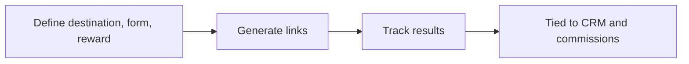
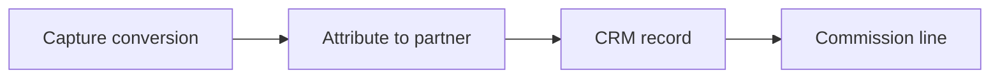
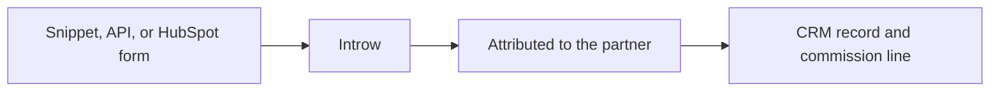
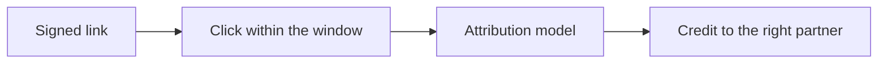

# Introw docs (docs.introw.io): features-affiliate

Verbatim from docs.introw.io/llms-full.txt, fetched 2026-09-29. 16 pages.

# Launch an affiliate campaign
Source: https://docs.introw.io/features/affiliate/campaigns/guides/launch-an-affiliate-campaign

Create a campaign, set attribution and commission, enroll partners with tracked links, install conversion tracking, and surface it to partners in Introw.

## What you'll achieve

A live affiliate campaign where every enrolled partner has their own tracked referral link, clicks and conversions are attributed inside your chosen window, the attributed partner earns a fixed amount or a commission plan reward per conversion, and partners watch their own clicks, conversions, and earnings from their portal. This guide covers the whole job: creating the campaign, setting attribution, choosing the reward, enrolling partners, installing tracking, and publishing the partner view.

## Before you start

<Steps>
  <Step title="Confirm the campaigns module is on">
    Affiliate campaigns require the campaigns module to be enabled on your plan. If the **Affiliate campaigns** area is locked, ask your admin to enable it.
  </Step>

  <Step title="Create a conversion form">
    A campaign needs a conversion form. This form is submitted automatically when a conversion is recorded, with the partner attributed, so the record lands in your CRM. Build it in Forms first if you do not have one.
  </Step>

  <Step title="Decide your reward model">
    Know whether partners earn a flat amount per conversion or rewards governed by a commission plan. If you want a plan, create it first so you can link it.
  </Step>

  <Step title="Get access to your destination site">
    You will install a small tracking snippet on the site partners send traffic to, or record conversions from your backend or a HubSpot form. Confirm you can edit the site or its tag manager.
  </Step>
</Steps>

## Watch it

<Tabs>
  <Tab title="Video">
    <video />
  </Tab>

  <Tab title="Click through">
    <iframe />
  </Tab>
</Tabs>

## Steps

### Create the campaign

<Steps>
  <Step title="Open Affiliate campaigns">
    Go to [Affiliate campaigns](https://app.introw.io/campaigns) and select **New campaign**. The campaign is where the whole referral program lives, so everything below hangs off this one record.

    <Frame>
      
    </Frame>
  </Step>

  <Step title="Fill in the new campaign details">
    In the **New affiliate campaign** dialog, set the three basics that define what is being tracked:

    * **Name** - the campaign's internal label (for example, "Q3 Affiliate Program"). It is how you and your team find the campaign in the list, so make it descriptive.
    * **Conversion form** - the form submitted automatically when a conversion is recorded, with the partner attributed. This is what writes the conversion into your CRM, so pick the form that represents the goal you are paying for (a demo request, a signup, a purchase).
    * **Destination URL** - the page a visitor lands on after clicking a partner's link (for example, your pricing or signup page). Every partner link redirects here, carrying the tracking that ties the click to the partner.

    Select **Create campaign**. The campaign opens to its configuration tabs, ready to set up.

    <Frame>
      
    </Frame>
  </Step>
</Steps>

### Set attribution

<Steps>
  <Step title="Open the General tab">
    On the campaign, open the **General** tab. This is where you confirm the basics and define how credit is assigned. The **Name**, **Conversion form**, and **Destination URL** you just set appear here and can be edited any time.
  </Step>

  <Step title="Set the attribution rules">
    Attribution decides which partner earns credit, and for how long after a click:

    * **Attribution window (days)** - how many days a click stays valid for attribution. A conversion that arrives after the window closes is not credited to the partner. Accepts 1 to 365 days; choose a window that matches how long your buying cycle realistically takes (a short window for impulse signups, a longer one for considered B2B purchases).
    * **Attribution model** - which click wins when a visitor clicks more than one affiliate link before converting. **Last click** credits the most recent partner (the one who closed the visit); **First click** credits the partner who first introduced the visitor. Last click is the common default for affiliate programs.

    Select **Save changes** to store the General tab.
  </Step>
</Steps>

### Set commission

<Steps>
  <Step title="Open the Commission tab">
    Open the **Commission** tab and turn on the **Commissions** switch. The reward is what motivates affiliates, so this connects each conversion to a payout. With commissions off, conversions are still tracked but no reward accrues.
  </Step>

  <Step title="Choose the reward type">
    Under **Reward type**, pick the model that fits your program. The two options are mutually exclusive, so a campaign pays one way or the other:

    * **Fixed amount per conversion** - a flat amount credited to the attributed partner on every conversion. Choose this for a simple bounty (for example, a set amount per qualified signup), then enter the value in **Commission per conversion** in your organization's currency.
    * **Commission plan** - rewards governed by a commission plan (for example, a percentage of invoiced revenue). Choose this for indirect or revenue-based commissions and for stronger protection against conversion fraud, then select the plan from **Commission plan**. If you have no plans yet, create one first, then return here to link it.

    Select **Save changes**. The Commission tab now reflects your model and conversions will accrue accordingly.
  </Step>
</Steps>

### Enroll partners and generate links

Most programs never have to do this by hand. Once the campaign is on a portal experience, Introw provisions each partner's link for you (see [Links are provisioned automatically](#links-are-provisioned-automatically) below). Generate links explicitly when you want partners to have a link before they ever open the portal, for example to paste into a launch email.

<Steps>
  <Step title="Open the Links tab">
    Open the **Links** tab. Partners can only drive tracked referrals once they have a link, so this step activates the campaign for the partners you choose. Each partner gets exactly one tracked link.
  </Step>

  <Step title="Generate links for partners">
    Select **Generate links**, choose the partners to enroll in the **Generate affiliate links** picker, and confirm. Introw creates a unique, signed referral link for each selected partner. Partners who already have a link are skipped, so it is safe to run again as you add more affiliates. The table then lists each partner with their link, clicks, conversions, and quality counts.
  </Step>
</Steps>

#### Links are provisioned automatically

You do not have to remember this step for a partner to get a link. Introw mints one on its own at two moments:

* **When you publish an experience** that contains the campaign's affiliate block, every partner in that publish gets a link for the campaign the block points at. There is no toggle on the block: an affiliate section a partner can see but has no link for is broken, so the block's presence is the intent.
* **When a partner first opens the campaign block** and has no link yet, Introw creates it on the spot, so campaigns and portals that existed before this behaviour heal themselves without a republish.

Both routes are safe to repeat and never issue a second link: a partner has exactly one link per campaign, and a link you **revoked** stays revoked rather than being quietly reissued. Provisioning only runs on **active** campaigns, and only for real partners, so an admin previewing an experience outside a partner room does not mint one.

If provisioning fails, the affiliate section still renders its stats and conversions and simply shows no link, rather than failing the page. Reload, or use **Generate links**.

### Install conversion tracking

<Steps>
  <Step title="Open the Install tab">
    Open the **Install** tab. Clicks and conversions only record once tracking is in place, so this is what makes the whole campaign measurable.
  </Step>

  <Step title="Add the tracking snippet">
    Copy the snippet under **Add the tracking snippet** and paste it once into the `<head>` of every page on your destination site. One snippet covers every campaign in your organization; the click cookie decides which campaign and partner a conversion belongs to. The snippet looks like this:

    ```html theme={"theme":{"light":"github-light","dark":"github-dark"}}
    <!-- Introw affiliate tracking -->
    <script
      async
      src="https://app.introw.io/affiliate.js"
      data-publishable-key="pk_aff_org_..."
    ></script>
    <!-- End Introw affiliate tracking -->
    ```

    Once it is live, the install status pill shows **Installed** when Introw detects the snippet on your destination URL. Use **Re-check** after you deploy.
  </Step>

  <Step title="Choose how conversions are tracked">
    Under **Track conversions**, pick the method that matches where your conversion happens. For full setup of each, see the conversion tracking guides; in short:

    * **Client-side** - recommended when conversions happen on your website. Call the browser tracking function when a visitor converts.
    * **Server-to-Server** - recommended when conversions happen on your backend. Post to the conversions API with a secret API key that has the **affiliate:write** scope. Most reliable.
    * **HubSpot forms** - recommended when conversions happen on a HubSpot form. Nothing else to do: once the snippet is installed, every HubSpot form submission on an allowed origin is attributed automatically.
  </Step>

  <Step title="Restrict allowed origins">
    Under **Allowed origins**, list the sites permitted to record browser conversions for this campaign, comma-separated, so only your own sites can submit conversions. This applies to HubSpot forms and client-side tracking. Leave it empty to allow any origin, but setting it is recommended to prevent spoofed conversions. Select **Save**.
  </Step>
</Steps>

### Show the campaign in the portal

<Steps>
  <Step title="Add a campaign section to an experience">
    Affiliates stay engaged when they can self-serve, so give them their own view. In **Experience builder**, open the partner experience and add a campaign section, then select this campaign. Each partner sees their own link, clicks, conversions, and earnings, and can add their own vanity alias.

    <Frame>
      
    </Frame>
  </Step>

  <Step title="Publish the experience">
    Publish the experience so the section goes live for partners. For the full builder workflow, see [Build and publish a portal experience](/features/portal/experiences/guides/build-and-publish-a-portal-experience).
  </Step>
</Steps>

## Verify it worked

Open the campaign's **Conversions** tab and confirm a test conversion appears with the right partner, value, and status. Open the **Links** tab to confirm each enrolled partner has a link with clicks and conversions counting up. Finally, open the portal as a partner and confirm the campaign section shows their own link and live stats. At that point the program is self-running: partners share, conversions attribute inside your window, and the attributed partner earns the reward you configured.

## Related

<CardGroup>
  <Card title="Set up affiliate conversion tracking" icon="book-open" href="/features/affiliate/conversion-tracking/guides/set-up-affiliate-conversion-tracking">
    Install the snippet and verify conversions land.
  </Card>

  <Card title="Protect affiliate revenue from fraud" icon="book-open" href="/features/affiliate/fraud-protection/guides/protect-affiliate-revenue-from-fraud">
    Turn on the Quality-tab fraud controls.
  </Card>

  <Card title="Create a vanity link alias" icon="book-open" href="/features/affiliate/links-attribution/guides/create-a-vanity-link-alias">
    Give partners a cleaner link to share.
  </Card>

  <Card title="Implementation reference" icon="screwdriver-wrench" href="../technical">
    Full configuration options.
  </Card>
</CardGroup>

---

# Campaigns
Source: https://docs.introw.io/features/affiliate/campaigns/index

Stand up an affiliate or referral campaign in minutes: a destination URL, conversion form, partner links, and a reward, all tracked end to end.

> A campaign is the container for a referral program: pick a destination and a conversion form, decide how partners earn, and generate the links that make it all trackable.

## The problem it solves

Referral programs usually mean untracked links and guesswork about who drove what:

<Pains>
  | Without Introw                | With Introw                         |
  | ----------------------------- | ----------------------------------- |
  | You cannot see who sent what  | A tracked link per partner          |
  | You calculate rewards by hand | A set amount per sale, or a plan    |
  | You cannot tell what works    | Clicks and sales per campaign       |
  | Partners are left in the dark | Each partner sees their own numbers |
</Pains>

## Impact

Someone promoting five products pushes the one where the link is instant, the numbers are visible and the money just arrives. A campaign is where you decide which of those you are.

<Impact>
  for your business

  * **Live in days**
    A campaign, its tracked links and its reward rules are set up in an afternoon, with no engineering beyond one snippet
  * **In your CRM**
    Partner sales land as attributed CRM records and commission lines, next to everything your direct team sells
  * **Cost to run**
    The same campaign carries ten partners or five hundred, because links and payouts are issued automatically

  for your partners

  * **Self-serve**
    Their tracked link is waiting the moment the campaign reaches them, with nobody to email and nothing to request
  * **Enabled**
    Their own clicks, sales and earnings, live, so they can tell which placements are worth repeating
  * **Efficient**
    Paid a set amount per sale or on a commission plan, with no invoice to raise

  [A day in the life of an affiliate partner](/days-in-the-life/affiliate-partner)
</Impact>

<Personas>
  * **Partner Marketing** - a channel that is live today, not next quarter
  * **Partner Operations** - tracking and payout rules, no engineering
  * **Affiliate partners** - a link and a live earnings page, self-serve
</Personas>

## See it work

<Tour>
  * 

    **Set it up**

    Pick where the link sends people, and how long a click counts.

  * 

    **Hand out links**

    One link per partner, with their clicks and sales beside it.

  * 

    **Track sales**

    Add the snippet once, or send sales from your own backend.

  * 

    **See results**

    Every campaign, with its clicks and sales, in one list.
</Tour>

## How it works

An affiliate campaign defines a referral program in one place. You set the destination partners
send traffic to, choose the conversion form that captures a result, and decide how partners are
rewarded, either a fixed amount per conversion or through a commission plan. You then generate
trackable links for the partners you enroll, and the campaign tracks clicks, conversions, and
commission from there.

Each campaign is self-contained, with tabs for its general settings, commission, links,
conversions, traffic quality, and installation. Partners can see their own campaign view in the
portal once you generate their links. The whole program is run by your team, no engineering
required beyond installing a small tracking snippet.

Campaigns make referral programs measurable. Define the destination, form, and reward, generate
links, and track everything in one place. Partners get visibility, and you get attributed results
tied to your CRM and commissions.



## Run it from your AI assistant

<Headless>
  * Show the affiliate conversions still waiting on review.
  * Which conversions were accepted last month, and which partner submitted each one?
  * What commission plan applies to our affiliate partners, and at what rate?
</Headless>

## Going deeper

<CardGroup>
  <Card title="How to" icon="screwdriver-wrench" href="./technical">
    Setup, configuration, and all how-to guides.
  </Card>

  <Card title="API reference" icon="code" href="/general/introduction">
    Integration surface and code.
  </Card>
</CardGroup>

**Works with**

<CardGroup>
  <Card title="Links & Attribution" icon="share-nodes" href="/features/affiliate/links-attribution">
    Each campaign issues tracked links.
  </Card>

  <Card title="Conversion Tracking" icon="share-nodes" href="/features/affiliate/conversion-tracking">
    Measure a campaign by the conversions it drives.
  </Card>

  <Card title="Commission Plans" icon="hand-holding-dollar" href="/features/commissions/commission-plans">
    Pay campaign conversions out on a plan.
  </Card>
</CardGroup>

---

# Campaigns
Source: https://docs.introw.io/features/affiliate/campaigns/technical/index

Create affiliate campaigns in Introw: set commission structures, enroll partners, configure conversion tracking, and surface campaigns in the portal.

## Where it lives

The **Affiliate** area is the campaigns list itself, at [Affiliate campaigns](https://app.introw.io/campaigns). A campaign is one row here, and everything about it is configured on the tabs inside it.

<Frame>
  
</Frame>

## Before you start

| You need                         | Why                                 | Fix it                                                                                                                                                                                 |
| -------------------------------- | ----------------------------------- | -------------------------------------------------------------------------------------------------------------------------------------------------------------------------------------- |
| Campaigns module on your plan    | The area is locked without it       | **Request access**                                                                                                                                                                     |
| Write access to campaigns        | To create and edit them             | [Internal roles](/features/access/team-management/guides/create-an-internal-role)                                                                                                      |
| A conversion form                | Conversions are recorded against it | [Forms](/features/forms/form-builder/guides/build-and-publish-a-form)                                                                                                                  |
| Tracking on the destination site | The sale happens off Introw         | [Snippet](/features/affiliate/conversion-tracking/guides/set-up-affiliate-conversion-tracking) or [API](/features/affiliate/conversion-tracking/guides/record-conversions-via-the-api) |

The form is optional: leave it empty and Introw provisions a minimal one. Tracking is the only requirement you satisfy outside Introw.

## How it works

You create a campaign with a name, a conversion form and a destination URL. Everything else lives on
its tabs: general, commission, links, conversions, quality and install.

A campaign pays either a fixed amount per conversion or through a commission plan, never both.
Conversions are recorded against a partner's link by the tracking snippet or the conversions API.

The links tab reports clicks, conversions and outcomes per partner, and an **affiliate campaigns**
section on a portal experience gives partners the same view of their own links and performance.

**Links provision themselves.** Publishing an experience that carries the campaign's affiliate block
gives every partner in that publish a link, and a partner who opens the block without one gets it
minted on the spot. Neither route ever issues a second link, and a revoked link stays revoked. Use
**Generate links** on the links tab to pre-provision partners who have not opened a portal yet, for
example before a launch email.

## How-to guides

<Rail>
  * 

    [**Launch an affiliate campaign**](/features/affiliate/campaigns/guides/launch-an-affiliate-campaign)

    Create a campaign, set attribution and commission, enroll partners with tracked links, install conversion tracking, and surface it to partners in Introw.
</Rail>

## Troubleshooting

<Warning>
  Automatic link provisioning only runs on **active** campaigns and only for real partners, so an
  admin previewing an experience outside a partner room mints nothing. A campaign pays either a
  fixed amount or via a commission plan, not both.
</Warning>

<AccordionGroup>
  <Accordion title="The campaigns area is locked">
    The campaigns module is not enabled on your plan.
  </Accordion>

  <Accordion title="A partner has no link">
    The campaign is not active, or the partner has never been reached by an experience carrying its
    affiliate block. Use **Generate links** to provision them directly.
  </Accordion>

  <Accordion title="A partner's affiliate section shows stats but no link">
    Provisioning failed on that read. Reload the page, or use **Generate links**.
  </Accordion>

  <Accordion title="A revoked link did not come back after a republish">
    That is intentional. Revoking is respected by both provisioning routes; restore it on the links
    tab.
  </Accordion>

  <Accordion title="Conversions are not recording">
    Tracking is not installed, or the allowed origins exclude the site.
  </Accordion>
</AccordionGroup>

---

# Record conversions via the API
Source: https://docs.introw.io/features/affiliate/conversion-tracking/guides/record-conversions-via-the-api

Track affiliate conversions server to server by posting to the Introw conversions API with a scoped secret key and campaign identifier.

## What you'll achieve

A backend that posts each affiliate conversion to the conversions API, passing the visitor's click reference so the conversion attributes to the right partner. Because the call runs on your server, it captures conversions the browser might miss and lands them reliably on the campaign's **Conversions** tab.

## Before you start

<Steps>
  <Step title="Install the tracking snippet">
    The snippet sets the click cookie that links a visit to a partner. Install it first so a click reference exists to pass to the API. See [Set up affiliate conversion tracking](./set-up-affiliate-conversion-tracking).
  </Step>

  <Step title="Create a secret API key with the affiliate:write scope">
    Server-to-server calls authenticate with a secret API key that has the **affiliate:write** scope. Create one in your developer settings before you start. Keep it on your server, never in client code.
  </Step>

  <Step title="Capture the click reference on landing">
    When a visitor lands from a referral link, the snippet stores a click reference in the `_introw_aff` cookie. Read that value and keep it with the session so you can pass it when the conversion completes.
  </Step>
</Steps>

## Watch it

<Tabs>
  <Tab title="Video">
    <video />
  </Tab>

  <Tab title="Click through">
    <iframe />
  </Tab>
</Tabs>

## Steps

<Steps>
  <Step title="Review the API method on the Install tab">
    Go to [Affiliate campaigns](https://app.introw.io/campaigns), open your campaign, select the **Install** tab, and expand **Server-to-Server** under **Track conversions**. It shows the exact request shape for your campaign, including the conversion form's fields, and a link to create a secret API key with the **affiliate:write** scope.

    <Frame>
      
    </Frame>
  </Step>

  <Step title="Store the click reference">
    On landing, read the `_introw_aff` cookie the snippet sets and persist it with the user's session or order. This reference is what ties the eventual conversion back to the partner who drove the click. Without it, the conversion cannot be attributed.
  </Step>

  <Step title="Post the conversion when the goal completes">
    When the goal completes on your backend (for example, a subscription is paid), post to the conversions API. Send the stored click reference and the converter's email; include any extra fields your conversion form expects so they flow into the created record.

    <CodeGroup>
      ```bash cURL theme={"theme":{"light":"github-light","dark":"github-dark"}}
      curl -X POST https://api.introw.io/api/v1/affiliate/conversions \
        -H "x-api-key: $INTROW_API_KEY" \
        -H "Content-Type: application/json" \
        -d '{
          "clickId": "<value of the _introw_aff cookie>",
          "email": "customer@example.com"
        }'
      ```

      ```javascript Node.js theme={"theme":{"light":"github-light","dark":"github-dark"}}
      await fetch("https://api.introw.io/api/v1/affiliate/conversions", {
        method: "POST",
        headers: {
          "x-api-key": process.env.INTROW_API_KEY,
          "Content-Type": "application/json",
        },
        body: JSON.stringify({
          clickId: introwAffCookie, // value of the _introw_aff cookie
          email: "customer@example.com",
        }),
      });
      ```

      ```python Python theme={"theme":{"light":"github-light","dark":"github-dark"}}
      import os, requests

      requests.post(
          "https://api.introw.io/api/v1/affiliate/conversions",
          headers={"x-api-key": os.environ["INTROW_API_KEY"]},
          json={
              "clickId": introw_aff_cookie,  # value of the _introw_aff cookie
              "email": "customer@example.com",
          },
      )
      ```
    </CodeGroup>
  </Step>

  <Step title="Confirm the response and the conversion">
    Confirm the API returns a success response, then open the campaign's **Conversions** tab and check the conversion appears against the correct partner with the value you sent. A conversion only attributes if the click falls inside the campaign's attribution window.
  </Step>
</Steps>

## Verify it worked

The conversion appears on the campaign's **Conversions** tab attributed to the partner whose link set the click reference, with the email and value you posted. Because the call ran server-side, it is captured even when the browser would not have fired.

## Related

<CardGroup>
  <Card title="Set up affiliate conversion tracking" icon="book-open" href="./set-up-affiliate-conversion-tracking">
    Install the snippet and verify conversions.
  </Card>

  <Card title="Track HubSpot form conversions" icon="book-open" href="./track-hubspot-form-conversions">
    Capture conversions from HubSpot forms instead.
  </Card>

  <Card title="API reference" icon="code" href="/general/introduction">
    Find the conversions endpoint.
  </Card>

  <Card title="Implementation reference" icon="screwdriver-wrench" href="../technical">
    Full configuration options.
  </Card>
</CardGroup>

---

# Set up affiliate conversion tracking
Source: https://docs.introw.io/features/affiliate/conversion-tracking/guides/set-up-affiliate-conversion-tracking

Install the Introw tracking snippet on your site, restrict allowed origins, verify a test conversion, and review recorded conversions in Introw.

## What you'll achieve

Affiliate tracking installed on your destination site, browser conversions restricted to your own origins, a verified test conversion attributed to the correct partner, and a clear view of conversions as they arrive with their partner, value, and status. This is the baseline every affiliate campaign needs before partners start driving traffic.

## Before you start

<Steps>
  <Step title="Create a campaign and enroll partners">
    Conversions attribute to a partner's tracked link, so the campaign must already exist with partners enrolled (links generated).
  </Step>

  <Step title="Get access to your destination site">
    You need to add a small script to the `<head>` of your destination site, or to your tag manager.
  </Step>
</Steps>

## Watch it

<Tabs>
  <Tab title="Video">
    <video />
  </Tab>

  <Tab title="Click through">
    <iframe />
  </Tab>
</Tabs>

## Steps

<Steps>
  <Step title="Open the Install tab">
    Go to [Affiliate campaigns](https://app.introw.io/campaigns), open your campaign, and select the **Install** tab. Everything needed to record conversions lives here: the snippet, the tracking methods, and the allowed origins.

    <Frame>
      
    </Frame>
  </Step>

  <Step title="Add the tracking snippet">
    Under **Add the tracking snippet**, copy the snippet and paste it once into the `<head>` of every page on your destination site. One snippet covers every campaign in your organization, because the visitor's click cookie, not the snippet, decides which campaign and partner a conversion belongs to. It carries your organization's publishable key:

    ```html theme={"theme":{"light":"github-light","dark":"github-dark"}}
    <!-- Introw affiliate tracking -->
    <script
      async
      src="https://app.introw.io/affiliate.js"
      data-publishable-key="pk_aff_org_..."
    ></script>
    <!-- End Introw affiliate tracking -->
    ```

    After you deploy, the status pill on this step shows **Installed** when Introw detects the snippet on your destination URL. If it shows **Not installed** or **Couldn't verify**, confirm the snippet is in the page `<head>` and the destination URL is correct in the **General** tab, then select **Re-check**.

    <Frame>
      
    </Frame>
  </Step>

  <Step title="Choose how conversions are tracked">
    Under **Track conversions**, expand the method that matches where your conversion happens. The snippet enables all three; you only act on the one you need:

    * **Client-side** - recommended when the conversion happens on your own website. Call the browser tracking function the snippet exposes at the moment a visitor converts (for example, right after signup), passing the converter's email. The org key in the snippet is used automatically.
    * **Server-to-Server** - recommended when the conversion happens on your backend. Post to the conversions API with a secret API key that has the **affiliate:write** scope. This is the most reliable method because it does not depend on the browser. See [Record conversions via the API](./record-conversions-via-the-api) for the full request.
    * **HubSpot forms** - recommended when the conversion is a HubSpot form submission. There is nothing else to configure: once the snippet is installed, every HubSpot form submission on an allowed origin is attributed automatically. See [Track HubSpot form conversions](./track-hubspot-form-conversions) for details.

    <Frame>
      
    </Frame>
  </Step>

  <Step title="Restrict allowed origins">
    Under **Allowed origins**, enter the sites permitted to record browser conversions for this campaign, comma-separated (for example, `https://acme.com, https://www.acme.com`). This guards against spoofed conversions and applies to both HubSpot forms and client-side tracking. Browser conversions from any other origin are rejected. Leaving it empty allows any origin, so setting it is strongly recommended. Select **Save**.

    <Frame>
      
    </Frame>
  </Step>

  <Step title="Drive a test conversion">
    Click a partner's referral link to land on the destination (this sets the click cookie), then complete the conversion action you are tracking. A conversion only attributes if it falls inside the campaign's attribution window after a tracked click, so do the test in one sitting.
  </Step>

  <Step title="Review conversions">
    Open the **Conversions** tab. The cards at the top show **Clicks**, **Conversions**, **Conversion rate**, and **Commission** (when commission is configured). The table below lists each conversion with its **Partner**, **Email**, **Status** (Submitted, Pending, or Failed), and **Converted at** time. Confirm your test appears against the right partner. Check this tab regularly to confirm attribution is working and rewards are accruing to the correct partners.

    <Frame>
      
    </Frame>
  </Step>
</Steps>

## Verify it worked

Your test conversion shows on the **Conversions** tab attributed to the partner whose link you clicked, with a status of Submitted, and the **Conversions** card increments. The install status pill reads **Installed**. From here, real partner traffic records and attributes the same way, with no manual reconciliation.

## Related

<CardGroup>
  <Card title="Record conversions via the API" icon="book-open" href="./record-conversions-via-the-api">
    Track conversions server to server.
  </Card>

  <Card title="Track HubSpot form conversions" icon="book-open" href="./track-hubspot-form-conversions">
    Capture conversions from HubSpot forms.
  </Card>

  <Card title="Protect affiliate revenue from fraud" icon="book-open" href="/features/affiliate/fraud-protection/guides/protect-affiliate-revenue-from-fraud">
    Filter out abuse before it accrues commission.
  </Card>

  <Card title="Implementation reference" icon="screwdriver-wrench" href="../technical">
    Full configuration options.
  </Card>
</CardGroup>

---

# Track HubSpot form conversions
Source: https://docs.introw.io/features/affiliate/conversion-tracking/guides/track-hubspot-form-conversions

Attribute affiliate conversions automatically in Introw when a tracked visitor submits a HubSpot form, with no extra code or manual mapping.

## What you'll achieve

A campaign that records a conversion automatically whenever a visitor who arrived from a partner's link submits a HubSpot form, attributing it to that partner with no code and no per-form configuration.

## Before you start

<Steps>
  <Step title="Install the tracking snippet">
    HubSpot tracking is driven by the same snippet as every other method. Install it in the `<head>` of the page that hosts the HubSpot form. See [Set up affiliate conversion tracking](./set-up-affiliate-conversion-tracking).
  </Step>

  <Step title="Confirm the form page is an allowed origin">
    The site hosting the form must be listed under **Allowed origins** on the campaign's **Install** tab (or allowed origins left empty). Submissions from other origins are rejected.
  </Step>
</Steps>

## Watch it

<Tabs>
  <Tab title="Video">
    <video />
  </Tab>

  <Tab title="Click through">
    <iframe />
  </Tab>
</Tabs>

## Steps

<Steps>
  <Step title="Open the Install tab">
    Go to [Affiliate campaigns](https://app.introw.io/campaigns), open your campaign, and select the **Install** tab.

    <Frame>
      
    </Frame>
  </Step>

  <Step title="Confirm the snippet is installed on the form page">
    Make sure the tracking snippet is in the `<head>` of the page where the HubSpot form is embedded. The install status pill reads **Installed** when Introw detects it on your destination URL. The snippet both tracks the click and listens for HubSpot form submissions, so no embed-code changes are needed.

    <Frame>
      
    </Frame>
  </Step>

  <Step title="Review the HubSpot forms method">
    Under **Track conversions**, expand **HubSpot forms**. There is nothing else to set up: once the snippet is installed, every HubSpot form submission on an allowed origin is attributed automatically. The same snippet handles both classic and v4 HubSpot forms.

    <Frame>
      
    </Frame>
  </Step>

  <Step title="Set allowed origins for the form page">
    Under **Allowed origins**, confirm the site hosting the form is listed (comma-separated), so its submissions are accepted. Leave the field empty only if you intend to allow any origin. Select **Save**.

    <Frame>
      
    </Frame>
  </Step>

  <Step title="Test a tracked submission">
    Click a partner's referral link to set the click cookie, navigate to the page with the HubSpot form, and submit it. The submission must happen inside the campaign's attribution window after the tracked click for it to attribute.
  </Step>
</Steps>

## Verify it worked

The test submission appears on the campaign's **Conversions** tab attributed to the partner whose link you clicked, with the email from the form. From then on, real HubSpot form submissions from referred visitors record the same way with no further work.

## Related

<CardGroup>
  <Card title="Set up affiliate conversion tracking" icon="book-open" href="./set-up-affiliate-conversion-tracking">
    Install the snippet and verify conversions.
  </Card>

  <Card title="Record conversions via the API" icon="book-open" href="./record-conversions-via-the-api">
    Use server-to-server tracking instead.
  </Card>

  <Card title="Implementation reference" icon="screwdriver-wrench" href="../technical">
    Full configuration options.
  </Card>
</CardGroup>

---

# Conversion Tracking
Source: https://docs.introw.io/features/affiliate/conversion-tracking/index

Record the conversions partners drive - via a snippet, the API, or a HubSpot form - and turn them into attributed CRM records and commission.

> A click is only half the story. Conversion tracking captures the outcome - a signup, a demo, a closed deal - and ties it back to the partner who drove it, your CRM, and their commission.

## The problem it solves

Tracking clicks without outcomes tells you nothing about value:

<Pains>
  | Without Introw                | With Introw                    |
  | ----------------------------- | ------------------------------ |
  | You only see clicks           | You see the sales too          |
  | Sales sit outside the CRM     | Each sale becomes a CRM record |
  | You work out payouts by hand  | Commission adds itself up      |
  | Tracking looks like a dev job | One snippet, and it is done    |
</Pains>

## Impact

Partners stop chasing a monthly report when the number updates itself. A program they can check at midnight is the one they trust with their audience.

<Impact>
  for your business

  * **In your CRM**
    Each sale becomes an attributed CRM record the moment it happens, so results live where the rest of your pipeline does
  * **Cost to run**
    Commission accrues from the sale itself, so nothing is recalculated by hand at the end of the month
  * **Live in days**
    Install once from the browser, your backend or a HubSpot form, and it confirms itself when it is working

  for your partners

  * **Self-serve**
    Their results appear on their own page without anyone having to send them a report
  * **Enabled**
    They can see which placements actually sell rather than which merely get clicks
  * **Efficient**
    Earnings move the moment a sale lands, so there is nothing to reconcile later

  [A day in the life of an affiliate partner](/days-in-the-life/affiliate-partner)
</Impact>

<Personas>
  * **Partner Operations** - installed once, then left alone
  * **RevOps** - sales reconciled against the CRM
  * **Affiliate partners** - results they can see the same day
</Personas>

## See it work

<Tour>
  * 

    **Install**

    One snippet in your site, and it confirms itself.

  * 

    **Pick a method**

    From the browser, from your backend, or from a HubSpot form.

  * 

    **HubSpot**

    HubSpot forms are tracked with no changes to the embed.

  * 

    **Lock it down**

    List the sites allowed to report, then test one sale.
</Tour>

## How it works

Conversion tracking records the result a referral produced. You install a lightweight snippet on
your destination site, call the conversions API server to server, or capture conversions from a
HubSpot form. Each conversion is matched to the partner's tracked click within the attribution
window and recorded against the campaign.

Conversions become attributed records that flow into your CRM and the submissions inbox, and they
accrue commission according to the campaign's reward model. You can review every conversion, with
its partner, value, and status, on the campaign's conversions tab.

Conversion tracking closes the loop. Capture the outcome however suits your stack, attribute it to
the right partner, and let it become a CRM record and a commission line, with full review on the
conversions tab.



## Run it from your AI assistant

<Headless>
  * List the affiliate conversions recorded this month.
  * Which partner submitted each of last week's conversions?
  * Have any conversions come in from Acme since we installed tracking?
</Headless>

## Going deeper

<CardGroup>
  <Card title="How to" icon="screwdriver-wrench" href="./technical">
    Setup, configuration, and all how-to guides.
  </Card>

  <Card title="API reference" icon="code" href="/general/introduction">
    Integration surface and code.
  </Card>
</CardGroup>

**Works with**

<CardGroup>
  <Card title="Links & Attribution" icon="share-nodes" href="/features/affiliate/links-attribution">
    Conversions trace back to the link that drove them.
  </Card>

  <Card title="Fraud Protection" icon="share-nodes" href="/features/affiliate/fraud-protection">
    Fraud screening clears conversions before payout.
  </Card>

  <Card title="Commission Lines" icon="hand-holding-dollar" href="/features/commissions/commission-lines">
    Each clean conversion becomes a commission line.
  </Card>
</CardGroup>

---

# Conversion Tracking
Source: https://docs.introw.io/features/affiliate/conversion-tracking/technical/index

Install the tracking snippet, record affiliate conversions via the API or HubSpot forms, and review conversion attribution and status in Introw.

## Where it lives

Conversion Tracking sits under **Affiliate**, at [Affiliate campaigns](https://app.introw.io/campaigns).

<Frame>
  
</Frame>

## Before you start

| You need                          | Why                               | Fix it                                                                                 |
| --------------------------------- | --------------------------------- | -------------------------------------------------------------------------------------- |
| A campaign with partners enrolled | Conversions attach to their links | [Launch a campaign](/features/affiliate/campaigns/guides/launch-an-affiliate-campaign) |
| Access to the destination site    | The snippet runs there, not here  | Outside Introw                                                                         |
| A connected HubSpot               | Only for HubSpot form tracking    | [Connect a CRM](/features/integrations/crm/guides/connect-hubspot)                     |

No site access? Post conversions from your backend with the conversions API instead.

## How it works

A campaign records conversions in one of three ways. The browser snippet drops a tracking script on
your destination site that fires a conversion event when a visitor completes the goal. The
conversions API lets you record a conversion server to server, which is the most reliable method.
HubSpot form tracking captures conversions when a tracked visitor submits a connected HubSpot form.

Each conversion is matched to the partner's click within the attribution window and shown on the
conversions tab with partner, value, and status. The install tab holds the snippet, the conversion
method, and the allowed origins for browser tracking.



## How-to guides

<Rail>
  * 

    [**Record conversions via the API**](/features/affiliate/conversion-tracking/guides/record-conversions-via-the-api)

    Track affiliate conversions server to server by posting to the Introw conversions API with a scoped secret key and campaign identifier.

  * 

    [**Set up affiliate conversion tracking**](/features/affiliate/conversion-tracking/guides/set-up-affiliate-conversion-tracking)

    Install the Introw tracking snippet on your site, restrict allowed origins, verify a test conversion, and review recorded conversions in Introw.

  * 

    [**Track HubSpot form conversions**](/features/affiliate/conversion-tracking/guides/track-hubspot-form-conversions)

    Attribute affiliate conversions automatically in Introw when a tracked visitor submits a HubSpot form, with no extra code or manual mapping.
</Rail>

## Troubleshooting

<Warning>
  Browser tracking only fires from allowed origins, so a conversion from an unlisted domain is ignored. Server to server tracking via the API is the most reliable method when you control the backend. A conversion only attributes if it falls inside the campaign's attribution window after a tracked click.
</Warning>

<AccordionGroup>
  <Accordion title="Conversions are not recording">
    The snippet is missing, or the origin is not allowed.
  </Accordion>

  <Accordion title="A conversion is unattributed">
    It arrived outside the attribution window.
  </Accordion>

  <Accordion title="HubSpot conversions are missing">
    The form is not connected, or the visitor was not tracked.
  </Accordion>
</AccordionGroup>

---

# Protect affiliate revenue from fraud
Source: https://docs.introw.io/features/affiliate/fraud-protection/guides/protect-affiliate-revenue-from-fraud

Turn on campaign Quality controls: block self-referrals, disposable emails, duplicates, and excluded domains, and monitor traffic quality in Introw.

## What you'll achieve

A campaign hardened against the common affiliate abuses: self-referrals, disposable-email signups, duplicate conversions, rewards on existing customers, and conversions from domains you never want to pay. You will also know how to read the per-partner traffic-quality signals that surface suspect partners so you can act before money is lost.

## Before you start

<Steps>
  <Step title="Have a campaign with tracking installed">
    Quality controls run as conversions arrive, so the campaign needs tracking installed and partners enrolled.
  </Step>

  <Step title="Confirm your customer records are reasonably complete">
    New-customers-only and deduplication check against your existing records, so the more complete those are, the more accurate the gating.
  </Step>
</Steps>

## Watch it

<Tabs>
  <Tab title="Video">
    <video />
  </Tab>

  <Tab title="Click through">
    <iframe />
  </Tab>
</Tabs>

## Steps

<Steps>
  <Step title="Open the Quality tab">
    Go to [Affiliate campaigns](https://app.introw.io/campaigns), open your campaign, and select the **Quality** tab. The top section, **How this campaign is protected**, lists the protections that are always on for every campaign and need no setup: signed click attribution (so events cannot be forged or replayed), commission held until the resulting lead is accepted, click-integrity controls (collapsing rapid repeat clicks and filtering bots), and lead review with duplicate detection against your CRM. Read these so you know what is already covered before adding rules.

    <Frame>
      
    </Frame>
  </Step>

  <Step title="Turn on the conversion quality rules that fit this program">
    Under **Conversion quality rules**, enable the opt-in toggles that match this program's risk. Each runs on every conversion before commission is held. All are off by default; turn on the ones you need:

    * **Block self-referrals** - rejects a conversion whose email or domain belongs to the attributed partner. This is the single most common abuse (a partner converting their own link), so turn it on for almost every program.
    * **Block disposable email addresses** - rejects conversions that use known temporary or throwaway email providers, filtering out fake signups created to inflate counts.
    * **Deduplicate by email** - rejects a conversion when the same email has already converted on this campaign, so one person cannot be rewarded repeatedly.
    * **Commission new customers only** - records the conversion but skips commission when that email has already converted anywhere in your organization, so you do not pay for business you already had.
  </Step>

  <Step title="Add excluded domains">
    Under **Excluded domains**, add any email domains whose conversions should always be rejected, one per row (for example, `example.com`). This is useful for internal, test, or competitor domains you never want to reward. Use **Add domain** for each, and remove a row to stop excluding it.

    <Frame>
      
    </Frame>
  </Step>

  <Step title="Save the controls">
    Select **Save changes**. The rules and excluded domains apply to conversions from this point forward; they do not retroactively re-judge past conversions.

    <Frame>
      
    </Frame>
  </Step>

  <Step title="Monitor per-partner traffic quality">
    Open the **Links** tab to watch quality per partner. Each row shows **Accepted**, **Declined**, **Failed**, and **Pending** counts alongside clicks and conversions, and a **Review** pill flags a partner whose traffic looks suspicious (meaningful click volume with no accepted leads, or a high declined or failed share). A **Revoked** pill marks links you have already disabled. Investigate flagged partners, and if a link is being abused, revoke it. See [Revoke or restore a link](/features/affiliate/links-attribution/guides/revoke-or-restore-a-link).

    <Frame>
      
    </Frame>
  </Step>
</Steps>

## Verify it worked

A conversion that matches an enabled rule is handled as expected: a self-referral or disposable-email conversion is rejected, a repeat email is not double-counted, an existing customer records without commission, and a conversion from an excluded domain is rejected. On the **Links** tab, the Accepted, Declined, and Failed counts give you an ongoing read on each partner's traffic quality, and the **Review** pill surfaces partners worth a closer look.

## Related

<CardGroup>
  <Card title="Revoke or restore a link" icon="book-open" href="/features/affiliate/links-attribution/guides/revoke-or-restore-a-link">
    Disable a link that is being abused.
  </Card>

  <Card title="Set up affiliate conversion tracking" icon="book-open" href="/features/affiliate/conversion-tracking/guides/set-up-affiliate-conversion-tracking">
    Confirm what is being recorded and accepted.
  </Card>

  <Card title="Implementation reference" icon="screwdriver-wrench" href="../technical">
    Full configuration options.
  </Card>
</CardGroup>

---

# Fraud Protection
Source: https://docs.introw.io/features/affiliate/fraud-protection/index

Keep referral programs honest with signed attribution, self-referral and disposable-email blocking, deduplication, and traffic-quality monitoring.

> A referral program only works if the conversions are real. Built-in fraud protection blocks the common abuse patterns - self-referrals, throwaway emails, duplicate signups - so you reward genuine business, not gamed numbers.

## The problem it solves

Affiliate programs attract gaming, and unchecked fraud erodes trust and margin:

<Pains>
  | Without Introw                      | With Introw                  |
  | ----------------------------------- | ---------------------------- |
  | Partners buy through their own link | Self-referrals are rejected  |
  | Fake signups pad the numbers        | Throwaway emails are blocked |
  | You pay twice for one customer      | Each customer counts once    |
  | Existing customers earn commission  | Only new business pays       |
</Pains>

## Impact

When a program gets gamed, most vendors tighten the rules on everyone. Filtering the abuse instead is what keeps your best partners sending their best traffic to you.

<Impact>
  for your business

  * **Cost to run**
    Self-referrals, throwaway signups and duplicates are rejected before anyone opens them, so review time goes to real exceptions
  * **In your CRM**
    Commission is held against the CRM record until the sale is accepted, then released, so nothing pays out on a guess
  * **Trustworthy**
    Every click is signed and replay-checked, so click counts and conversion rates are numbers you can put in a board deck

  for your partners

  * **Self-serve**
    Clean traffic clears on its own, with no review queue between a partner and their commission
  * **Enabled**
    They can see their own traffic quality, so they know which sources are worth their effort
  * **Efficient**
    Honest partners are paid faster because the noise is filtered out before it reaches a human

  [A day in the life of an affiliate partner](/days-in-the-life/affiliate-partner)
</Impact>

<Personas>
  * **Partner Operations** - abuse stopped before it reaches a payout
  * **Finance** - commission that only leaves once the sale is real
  * **RevOps** - pipeline integrity and margin protected
  * **Affiliate partners** - a level field, and faster payment
</Personas>

## See it work

<Tour>
  * 

    **Always on**

    Signed clicks, held commission, bot filtering, duplicate checks.

  * 

    **Add rules**

    Switch on the checks this program needs, and block domains.

  * 

    **Save**

    Every sale passes the checks before commission is released.

  * 

    **Watch it**

    Traffic quality per partner, so a bad actor shows up early.
</Tour>

## How it works

Fraud protection is built into every campaign. Click attribution is signed so referrals cannot be
spoofed. Self-referral blocking stops partners from converting their own links, and disposable-email
blocking rejects throwaway addresses used to fake signups. Deduplication prevents the same customer
from being counted twice, and new-customer gating ensures you only reward genuinely new business.

A traffic-quality view on each campaign surfaces suspicious patterns, like a spike of clicks with no
conversions or many conversions from one source, so your team can investigate and revoke links when
needed.

Fraud protection keeps the program honest without manual policing. Signed attribution, blocking
rules, deduplication, and a traffic-quality view mean you reward real conversions and catch abuse
early.

## Run it from your AI assistant

<Headless>
  * Show the affiliate conversions that were declined, and who submitted them.
  * Are any pending conversions flagged as a potential channel conflict?
  * Decline this conversion and leave the partner a comment explaining why.
</Headless>

## Going deeper

<CardGroup>
  <Card title="How to" icon="screwdriver-wrench" href="./technical">
    Setup, configuration, and all how-to guides.
  </Card>

  <Card title="API reference" icon="code" href="/general/introduction">
    Integration surface and code.
  </Card>
</CardGroup>

**Works with**

<CardGroup>
  <Card title="Conversion Tracking" icon="share-nodes" href="/features/affiliate/conversion-tracking">
    Hold suspect conversions before they count.
  </Card>

  <Card title="Links & Attribution" icon="share-nodes" href="/features/affiliate/links-attribution">
    Catch link abuse at attribution.
  </Card>
</CardGroup>

---

# Fraud Protection
Source: https://docs.introw.io/features/affiliate/fraud-protection/technical/index

Enable self-referral and disposable-email blocking, deduplication, new-customer gating, excluded domains, and traffic-quality monitoring in Introw.

## Where it lives

Fraud Protection sits under **Affiliate**, at [Affiliate campaigns](https://app.introw.io/campaigns).

<Frame>
  
</Frame>

## Before you start

| You need                           | Why                         | Fix it                                                                                                  |
| ---------------------------------- | --------------------------- | ------------------------------------------------------------------------------------------------------- |
| A campaign with tracking installed | Checks run on real traffic  | [Install tracking](/features/affiliate/conversion-tracking/guides/set-up-affiliate-conversion-tracking) |
| Write access to campaigns          | To change the quality rules | [Internal roles](/features/access/team-management/guides/create-an-internal-role)                       |

## How it works

Fraud controls are configured per campaign. Click attribution is always signed, so referrals cannot
be forged. On top of that you can enable self-referral blocking, disposable-email blocking,
deduplication, and new-customer gating, all configured on the campaign's **Quality** tab. The
campaign's **Links** tab then surfaces traffic patterns per link so you can spot abuse and revoke
links if needed.

These controls run automatically as conversions arrive, filtering or flagging suspect activity
before it accrues commission.

## Settings & configuration

Fraud controls live on the campaign at [Affiliate campaigns](https://app.introw.io/campaigns).

### Self-referral blocking

Block conversions where the converter matches the referring partner, so partners cannot game their
own links.

### Disposable-email blocking

Reject conversions whose email uses a known disposable domain, filtering out throwaway signups.

### Deduplication

Count a customer only once so repeated conversions from the same person do not over-reward a partner.

### New-customer gating

Reward only conversions from genuinely new customers, checked against existing records.

### Traffic quality

Configure the protections on the campaign's **Quality** tab, then monitor traffic on the **Links** tab, which surfaces click and conversion patterns per link (accepted, declined, and failed counts) and flags links to **Review** so you can spot anomalies and revoke abusers.

## How-to guides

<Rail>
  * 

    [**Protect affiliate revenue from fraud**](/features/affiliate/fraud-protection/guides/protect-affiliate-revenue-from-fraud)

    Turn on campaign Quality controls: block self-referrals, disposable emails, duplicates, and excluded domains, and monitor traffic quality in Introw.
</Rail>

## Troubleshooting

<Warning>
  Fraud controls reduce abuse but do not eliminate the need for review. Disposable-email blocking depends on a known list of domains, so a brand new disposable domain may slip through until the list updates. New-customer gating depends on your existing records being complete.
</Warning>

<AccordionGroup>
  <Accordion title="A legitimate conversion was blocked">
    Check whether the email matched a disposable domain or the customer already existed.
  </Accordion>

  <Accordion title="A self-referral got through">
    Confirm self-referral blocking is enabled on the campaign.
  </Accordion>

  <Accordion title="Quality looks suspicious">
    Review the link on the **Links** tab and revoke it if needed.
  </Accordion>
</AccordionGroup>

---

# Affiliate
Source: https://docs.introw.io/features/affiliate/index

Run partner referral programs with trackable links, attributed conversions, and built-in fraud protection - all reconciled to your CRM and commissions.

> Affiliate is how you run referral programs at scale: give partners trackable links, attribute the conversions they drive, reward them through commissions, and keep the whole thing honest with built-in fraud protection.

## The problem it solves

<Pains>
  | Without Introw               | With Introw                           |
  | ---------------------------- | ------------------------------------- |
  | It lives in a separate tool  | It all lands in your CRM              |
  | More partners is more admin  | Links and payouts run themselves      |
  | Fake sales eat your margin   | Checks run before you pay             |
  | You cannot prove it paid off | Partner sales report like any channel |
</Pains>

## Impact

An affiliate carries several programs at once and pushes the one with the least friction. Instant links, earnings they can check themselves and payment without an invoice is what makes yours that one.

<Impact>
  for your business

  * **Live in days**
    A tracked referral channel goes live the day you set it up, because campaigns, links and payout rules are all configuration
  * **In your CRM**
    Every click, sale and commission line is a CRM record, so partner revenue reports beside direct revenue instead of in a side tracker
  * **Cost to run**
    Links, attribution and payouts run themselves, so growing from ten partners to five hundred adds no headcount

  for your partners

  * **Self-serve**
    Their link, their numbers and their payouts are all there without asking a partner manager for anything
  * **Enabled**
    Ready-made creative they can pick up and use, and live results that tell them what is actually working
  * **Efficient**
    Paid on what sold, on a schedule they can see, with no invoice to raise and no statement to chase

  [A day in the life of an affiliate partner](/days-in-the-life/affiliate-partner)
</Impact>

<Personas>
  * **Partner Marketing** - a channel that reports like any other
  * **Partner Operations** - growth without more admin per partner
  * **RevOps** - no second set of numbers to reconcile
  * **Affiliate partners** - a link, live earnings, and payment without invoicing
</Personas>

## How this area works

You create a campaign, hand every partner their own tracked link, and record sales with a small snippet or an API call. Signed tracking ties each sale back to the right partner, rewards run through the same commissions engine as everything else, and built-in fraud checks keep the numbers honest. Partners watch their own clicks, sales and earnings in the portal.

**Where this sits in a setup.** This is the whole of the [affiliate track](/tracks/affiliate), which sequences links, conversion tracking, fraud rules and payouts in the order they depend on each other.

<Rail>
  * 

    [**Campaigns**](./campaigns)

    Where the link points, and how partners earn.

    [How to · 1 guide](./campaigns/technical)

  * 

    [**Links & Attribution**](./links-attribution)

    One link per partner, plus short branded versions.

    [How to · 2 guides](./links-attribution/technical)

  * 

    [**Conversion Tracking**](./conversion-tracking)

    Record sales from your site, your backend, or HubSpot.

    [How to · 3 guides](./conversion-tracking/technical)

  * 

    [**Fraud Protection**](./fraud-protection)

    Self-referrals, fake signups and duplicates, blocked.

    [How to · 1 guide](./fraud-protection/technical)
</Rail>

Affiliate turns partners into a referral channel. You create a campaign with a destination and a conversion form, generate trackable links for each partner, and install a small snippet or call the conversions API to record results. Clicks and conversions are attributed back to the right partner using signed tracking, so credit is accurate and tied to your CRM.

Rewards flow through the same commissions engine: a campaign can pay a fixed amount per conversion or run on a commission plan, and affiliate-driven leads land in your submissions inbox like any other. Built-in fraud controls, from signed click attribution to self-referral and disposable-email blocking, keep the program clean, while partners see their links, clicks, conversions, and earnings right in the portal.

A campaign turns partner links into attributed conversions and commission, with fraud checks along the way

## Run it from your AI assistant

<Headless>
  * Which affiliate partners drove conversions this quarter, and how much did each bring in?
  * Show the deals attributed to our affiliate partners and their current stage.
  * What commission is earned but unpaid across our affiliate partners?
  * Which affiliate partners have had no attributed activity in the last 60 days?
</Headless>

---

# Create a vanity link alias
Source: https://docs.introw.io/features/affiliate/links-attribution/guides/create-a-vanity-link-alias

Give a partner a cleaner, branded referral link by adding a custom vanity alias that still tracks clicks and attributes conversions in Introw.

## What you'll achieve

A partner referral link that resolves through a clean, custom alias you choose, sharing the same destination and the same tracking as the default link, so clicks and conversions still attribute to that partner. A single link can carry both its default code and one or more aliases.

## Before you start

<Steps>
  <Step title="Generate the partner's link first">
    Aliases attach to an existing referral link, so the partner must already be enrolled with a generated link. See [Launch an affiliate campaign](/features/affiliate/campaigns/guides/launch-an-affiliate-campaign).
  </Step>

  <Step title="Pick a clean alias">
    Decide the alias text (for example, the partner's name). It is normalized to a safe URL slug, and each alias must be unique within the campaign, so have a fallback in mind if your first choice is taken.
  </Step>
</Steps>

## Watch it

<Tabs>
  <Tab title="Video">
    <video />
  </Tab>

  <Tab title="Click through">
    <iframe />
  </Tab>
</Tabs>

## Steps

<Steps>
  <Step title="Open the Links tab">
    Go to [Affiliate campaigns](https://app.introw.io/campaigns), open the campaign, and select the **Links** tab. This lists one tracked link per enrolled partner.

    <Frame>
      
    </Frame>
  </Step>

  <Step title="Open Manage aliases for the partner">
    Find the partner whose link you want to brand, open the row's actions menu, and select **Manage aliases**. The **Manage aliases** dialog shows the partner's **Referral links**: the default link plus any aliases already in place, each with a copy button.

    <Frame>
      
    </Frame>
  </Step>

  <Step title="Add the alias">
    In **Add an alias that also attributes conversions**, type the custom text for the link (for example, `partner-name`) and select **Add**. The alias is normalized to a clean slug and must be unique on the campaign; if it is already taken, reserved, or invalid, the dialog explains why so you can pick another. The new alias appears in the **Referral links** list with its own copy button.

    <Frame>
      
    </Frame>
  </Step>

  <Step title="Share the aliased link">
    Copy the aliased link from the list and give it to the partner. It redirects to the same destination as the default link and records clicks and conversions against the same partner. Partners can also add their own alias from the campaign section in their portal, if you have surfaced it.

    <Frame>
      
    </Frame>
  </Step>
</Steps>

## Verify it worked

The new alias is listed under **Referral links** for that partner, and opening the aliased URL lands on the campaign destination with tracking intact, so a conversion through it attributes to the same partner. Both the default code and the alias keep working.

## Related

<CardGroup>
  <Card title="Launch an affiliate campaign" icon="book-open" href="/features/affiliate/campaigns/guides/launch-an-affiliate-campaign">
    Create the campaign and generate links first.
  </Card>

  <Card title="Revoke or restore a link" icon="book-open" href="./revoke-or-restore-a-link">
    Manage the link's lifecycle.
  </Card>

  <Card title="Implementation reference" icon="screwdriver-wrench" href="../technical">
    Full configuration options.
  </Card>
</CardGroup>

---

# Revoke or restore a link
Source: https://docs.introw.io/features/affiliate/links-attribution/guides/revoke-or-restore-a-link

Instantly disable a partner's affiliate link and every vanity alias in Introw, then restore access later without regenerating the underlying link.

## What you'll achieve

A partner's affiliate link (its default code and every custom alias) instantly disabled so it no longer redirects or attributes conversions, with the ability to restore it later exactly as it was. Custom aliases stay reserved while revoked, so no one else can claim them.

## Before you start

<Steps>
  <Step title="Identify the link to change">
    Know which partner's link you need to revoke or restore. The **Links** tab marks a disabled link with a **Revoked** pill, and a **Review** pill flags partners whose traffic looks suspicious.
  </Step>
</Steps>

## Watch it

<Tabs>
  <Tab title="Video">
    <video />
  </Tab>

  <Tab title="Click through">
    <iframe />
  </Tab>
</Tabs>

## Steps

<Steps>
  <Step title="Open the Links tab">
    Go to [Affiliate campaigns](https://app.introw.io/campaigns), open the campaign, and select the **Links** tab. Locate the partner's row.

    <Frame>
      
    </Frame>
  </Step>

  <Step title="Revoke the link">
    Open the row's actions menu and select **Revoke link**. The confirmation dialog explains the effect: the default code and every custom alias immediately return an error and stop attributing conversions, even for clicks already in flight. Custom aliases stay reserved while the link is revoked, so they cannot be taken by anyone else. Confirm with **Revoke link**. The row then shows a **Revoked** pill.

    A revocation sticks. Introw provisions partner links automatically when you publish an experience carrying the campaign's affiliate block, and again when a partner opens that block without a link, but neither route reissues a link you revoked: the row keeps its **Revoked** state until you restore it.

    <Frame>
      
    </Frame>
  </Step>

  <Step title="Restore the link when needed">
    To bring a link back, open the actions menu on the revoked row and select **Restore link**. The default code and all its aliases start working again immediately, with the link's history intact. No regeneration is needed and partners keep the same URLs.

    <Frame>
      
    </Frame>
  </Step>

  <Step title="Optionally free an alias">
    If you want to permanently release a specific alias rather than keep it reserved, open **Manage aliases** for the link and delete that alias. Its slug becomes available for reuse.
  </Step>
</Steps>

## Verify it worked

A revoked link no longer resolves to the destination and records no new conversions; its row carries the **Revoked** pill. After restoring, the same default code and aliases redirect and attribute again. Because revocation is reversible, you can shut off a link the moment it is misused and bring it back if the situation changes.

## Related

<CardGroup>
  <Card title="Protect affiliate revenue from fraud" icon="book-open" href="/features/affiliate/fraud-protection/guides/protect-affiliate-revenue-from-fraud">
    Spot links worth revoking.
  </Card>

  <Card title="Create a vanity link alias" icon="book-open" href="./create-a-vanity-link-alias">
    Customize active links.
  </Card>

  <Card title="Implementation reference" icon="screwdriver-wrench" href="../technical">
    Full configuration options.
  </Card>
</CardGroup>

---

# Links & Attribution
Source: https://docs.introw.io/features/affiliate/links-attribution/index

Give every partner a signed, trackable affiliate link and assign credit accurately with a configurable attribution window and attribution model.

> Every enrolled partner gets a unique, signed referral link. When a conversion happens, attribution rules decide which partner gets credit, so rewards are accurate and disputes disappear.

## The problem it solves

Without trustworthy attribution, referral programs descend into disputes:

<Pains>
  | Without Introw              | With Introw                    |
  | --------------------------- | ------------------------------ |
  | Two partners claim one sale | Signed links settle it         |
  | Old clicks still get paid   | You set how long a click lasts |
  | The link is long and ugly   | Partners get a short one       |
  | You cannot kill a bad link  | Turn it off in one click       |
</Pains>

## Impact

A partner who has once lost a commission to a disputed click never forgets it. Credit they cannot be argued out of is why they keep sending you their audience.

<Impact>
  for your business

  * **In your CRM**
    Every click is signed server-side and resolves to one partner, so the CRM never carries two claims on the same sale
  * **Cost to run**
    Attribution rules are set once per campaign, so nobody spends month-end deciding who earned what
  * **Trustworthy**
    A window you choose bounds how long a click counts, and a leaked link is dead in one click without regenerating anything

  for your partners

  * **Self-serve**
    Their link exists already, and they can add a short branded version themselves whenever they want one
  * **Enabled**
    A clean link they are willing to put their own name behind, on their own site or newsletter
  * **Efficient**
    One link to manage wherever they use it, and credit that holds up without them chasing it

  [A day in the life of an affiliate partner](/days-in-the-life/affiliate-partner)
</Impact>

<Personas>
  * **Partner Operations** - attribution nobody has to defend by hand
  * **RevOps** - one partner per sale, in the CRM
  * **Partner Marketing & Enablement** - clean branded links to hand partners
  * **Affiliate partners** - a branded link and credit they can trust
</Personas>

## See it work

<Tour>
  * 

    **One each**

    Every partner has exactly one link, with its clicks and sales.

  * 

    **Brand it**

    Add a short alias that tracks exactly like the original.

  * 

    **Share it**

    Both links point at the same partner, so nothing is lost.

  * 

    **Set the rules**

    How long a click counts, and whether first or last click wins.
</Tour>

## How it works

Each partner enrolled in a campaign gets a unique referral link. Clicks on that link are recorded
with signed tracking, so the referral cannot be spoofed, and the visitor is associated with the
partner for the campaign's attribution window. When a conversion is recorded within that window,
the campaign uses its attribution model, last click or first click, to assign credit to the right
partner.

You control the attribution window and model per campaign, can give partners cleaner vanity link
aliases, and can revoke or restore a link instantly if a partner leaves or a link is misused.

Links and attribution turn referrals into trustworthy credit. Signed links, a defined window, and a
chosen model mean every conversion is assigned to the right partner, and you keep full control over
each link's lifecycle.



## Run it from your AI assistant

<Headless />

## Going deeper

<CardGroup>
  <Card title="How to" icon="screwdriver-wrench" href="./technical">
    Setup, configuration, and all how-to guides.
  </Card>

  <Card title="API reference" icon="code" href="/general/introduction">
    Integration surface and code.
  </Card>
</CardGroup>

**Works with**

<CardGroup>
  <Card title="Conversion Tracking" icon="share-nodes" href="/features/affiliate/conversion-tracking">
    Attributed clicks become tracked conversions.
  </Card>

  <Card title="Campaigns" icon="share-nodes" href="/features/affiliate/campaigns">
    Links belong to a campaign.
  </Card>

  <Card title="Fraud Protection" icon="share-nodes" href="/features/affiliate/fraud-protection">
    Screen links for self-referral and abuse.
  </Card>
</CardGroup>

---

# Links & Attribution
Source: https://docs.introw.io/features/affiliate/links-attribution/technical/index

Configure attribution windows and models, create vanity link aliases, and manage, revoke, or restore partner referral links in Introw.

## Where it lives

Links & Attribution sits under **Affiliate**, at [Affiliate campaigns](https://app.introw.io/campaigns).

<Frame>
  
</Frame>

## Before you start

| You need                          | Why                       | Fix it                                                                                 |
| --------------------------------- | ------------------------- | -------------------------------------------------------------------------------------- |
| A campaign with partners enrolled | Links exist per partner   | [Launch a campaign](/features/affiliate/campaigns/guides/launch-an-affiliate-campaign) |
| Write access to campaigns         | To alias or revoke a link | [Internal roles](/features/access/team-management/guides/create-an-internal-role)      |

## How it works

Each partner gets exactly one unique referral link per campaign, provisioned automatically when the
campaign reaches them: publishing an experience that carries the campaign's affiliate block gives
every partner in that publish a link, and a partner who opens the block without one gets it minted
on the spot. Generate links on the campaign's links tab does the same thing on demand. Clicks are
tracked with a signed token so the partner association cannot be spoofed. Attribution is governed
per campaign by two settings: the attribution window, how long after a click a conversion still
counts, and the attribution model, last click or first click.

Links live on the campaign's links tab, where you can see per-partner clicks and conversions, set a
vanity alias, and revoke or restore a link.

## Settings & configuration

Attribution and links are managed on the campaign at [Affiliate campaigns](https://app.introw.io/campaigns).

### Attribution window

On the general tab, set how many days a click remains valid for attribution. A conversion outside
the window is not credited to the partner.

### Attribution model

On the general tab, choose last click or first click. Last click credits the most recent partner;
first click credits the partner who introduced the visitor.

### Vanity alias

On the links tab, set a custom alias for a partner's link to give them a cleaner URL to share.

### Revoke and restore

On the links tab, revoke a link to disable it immediately, or restore a previously revoked link.

## How-to guides

<Rail>
  * 

    [**Create a vanity link alias**](/features/affiliate/links-attribution/guides/create-a-vanity-link-alias)

    Give a partner a cleaner, branded referral link by adding a custom vanity alias that still tracks clicks and attributes conversions in Introw.

  * 

    [**Revoke or restore a link**](/features/affiliate/links-attribution/guides/revoke-or-restore-a-link)

    Instantly disable a partner's affiliate link and every vanity alias in Introw, then restore access later without regenerating the underlying link.
</Rail>

## Troubleshooting

<Warning>
  The attribution window only counts conversions that arrive after a tracked click. If tracking is not installed on the destination, no clicks are recorded and nothing can be attributed. Changing the model affects how future conversions are credited, not past ones.
</Warning>

<AccordionGroup>
  <Accordion title="A conversion was not attributed">
    It arrived outside the attribution window, or no click was tracked.
  </Accordion>

  <Accordion title="A vanity alias is rejected">
    The alias is already in use on the campaign.
  </Accordion>

  <Accordion title="A revoked link still works briefly">
    Allow for short caching before the link stops resolving.
  </Accordion>
</AccordionGroup>