# Introw docs (docs.introw.io): features-ai

Verbatim from docs.introw.io/llms-full.txt, fetched 2026-09-29. 25 pages.

# AI Announcements
Source: https://docs.introw.io/features/ai/announcements/index

Draft partner announcements from a URL or prompt in seconds, refine them conversationally, and receive proactive drafts from your recent content.

> Partner communication slips because writing each update is a task no one has time for. AI Announcements drafts the update for you - from a link or a prompt - and even suggests the ones you should send.

## The problem it solves

Keeping partners informed loses to everything else on the list:

<Pains>
  | Without Introw                 | With Introw                  |
  | ------------------------------ | ---------------------------- |
  | Writing each update is a chore | AI drafts it from a link     |
  | The blank page stalls it       | Presets and suggested drafts |
  | You forget to tell partners    | It recommends what to send   |
  | Editing is fiddly              | Refine it conversationally   |
</Pains>

## Impact

Partners sell what they know about, and they only know what you told them. Removing the blank page is the difference between a program that communicates and one that means to.

<Impact>
  for your business

  * **AI, not admin**
    AI drafts from a URL or a prompt, and proactively recommends announcements from your recent content
  * **Cost to run**
    Partner marketing keeps partners informed without extra headcount, and always reviews before sending

  for your partners

  * **Self-serve**
    They hear about the release, the webinar and the promotion without chasing anyone for it
  * **Enabled**
    Drafts pull from your knowledge base, so what reaches them sounds like your program
  * **Efficient**
    Regular, short updates rather than one long recap when somebody finds the time

  [A day in the life of your partners](/days-in-the-life)
</Impact>

<Personas>
  * **Partner Marketing** - informed partners, no grind
  * **Partner Operations** - updates that actually go out
  * **Partners** - hearing about it in time
</Personas>

## See it work

<Tour>
  * 

    **Start with AI**

    The draft comes first, the editing second.

  * 

    **Point it at a source**

    A webinar, a product update, or a blog post.

  * 

    **Refine it**

    Adjust the draft the way you would with a colleague.
</Tour>

## How it works

AI Announcements drafts [partner announcements](/features/engagement/announcements) for you. Start from a URL - a blog post, a release note, a webinar page - or from a prompt and a preset: product update, webinar, blog post. The AI writes the announcement, ready to refine. From there you edit it conversationally, the same way you'd tweak a draft with a colleague, then publish and target it like any other announcement.

It's also proactive: Introw watches your recent content and recommends announcements you should send, surfacing them as ready-to-review drafts on your home screen. You accept, tweak, or dismiss - the blank page is gone. Drafts pull from your [knowledge base](/features/ai/knowledge-base), so they sound like your program, and you always review before anything reaches partners.

Partner marketing used to write every update from scratch, and forget half of them. Now the AI drafts from your content and suggests what to send, so partners stay informed without the manual grind.

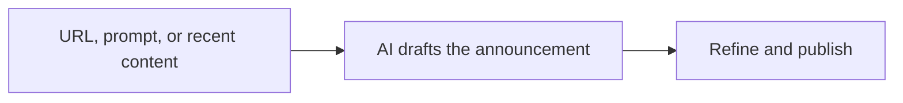

## Run it from your AI assistant

<Headless>
  * Draft a partner announcement from this release-notes URL.
  * Write a webinar invite for next month's partner enablement session.
  * What should I announce to partners based on our recent updates?
</Headless>

## Going deeper

<CardGroup>
  <Card title="How to" icon="screwdriver-wrench" href="./technical">
    How drafting and recommended announcements work.
  </Card>

  <Card title="Announcements" icon="bullhorn" href="/features/engagement/announcements">
    Publish, schedule, and target partner announcements.
  </Card>
</CardGroup>

**Works with**

<CardGroup>
  <Card title="Announcements" icon="bell" href="/features/engagement/announcements">
    Publish and target the announcement.
  </Card>

  <Card title="Knowledge Base" icon="robot" href="/features/ai/knowledge-base">
    Drafts pull from your content.
  </Card>
</CardGroup>

---

# AI Announcements
Source: https://docs.introw.io/features/ai/announcements/technical/index

How AI drafting and recommended announcements work in Introw: start from a URL, prompt, or preset, refine conversationally, and review proactive drafts.

## Where it lives

AI Announcements sits under **Engage**, at [Announcements](https://app.introw.io/announcements).

<Frame>
  
</Frame>

## Before you start

| You need                      | Why                             | Fix it                                                                                             |
| ----------------------------- | ------------------------------- | -------------------------------------------------------------------------------------------------- |
| The AI Agent module           | On by default on your plan      | **Request access**                                                                                 |
| Announcements in your portal  | The draft has to land somewhere | [Publish an experience](/features/portal/experiences/guides/build-and-publish-a-portal-experience) |
| Write access to announcements | To send what the AI drafts      | [Internal roles](/features/access/team-management/guides/create-an-internal-role)                  |

## How it works

There are two ways AI creates [announcements](/features/engagement/announcements):

* **Start with AI** - in the announcement editor, choose to start with AI and give a URL, a prompt, or a preset (product update, webinar, blog post). The AI drafts the announcement - pulling from your [knowledge base](/features/ai/knowledge-base) and adding an image where it helps - and you refine it in a chat panel before publishing, scheduling, and targeting it like any announcement.
* **Recommended announcements** - Introw watches your recent content and drafts announcements it thinks you should send, surfacing them as a highlight on your home screen. Each is a ready-to-review draft you can open and publish, adjust, or dismiss.

Both paths produce a normal announcement draft - the AI writes the first version; you own publishing, scheduling, and audience.

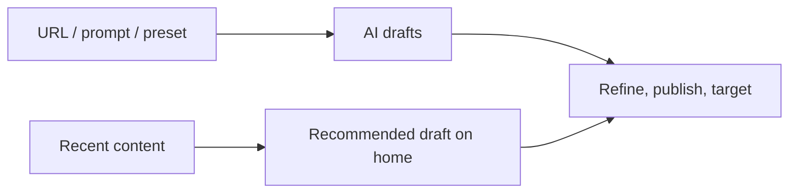

## Settings & configuration

Nothing to enable - AI drafting is built into the announcement editor, and recommended drafts appear on home automatically.

### Start with AI

In a new announcement, choose start with AI and provide a URL, prompt, or preset.

### Refine in chat

Use the chat panel to adjust tone, length, and content before publishing.

### Review recommendations

Open recommended announcements from your home screen and publish, edit, or dismiss.

## Guides

<CardGroup>
  <Card title="Generate an announcement with AI" icon="book-open" href="/features/engagement/announcements/guides/generate-an-announcement-with-ai">
    Draft a partner announcement from a URL or prompt, then refine and publish.
  </Card>

  <Card title="Announcements" icon="bullhorn" href="/features/engagement/announcements">
    Publish, schedule, and target partner announcements.
  </Card>
</CardGroup>

## Troubleshooting

<Warning>
  AI drafts are starting points - review and edit before publishing to partners. Drafts reflect your knowledge base and the source you give, so a thin source produces a thin draft. Recommended announcements are suggestions, not scheduled sends; nothing goes out until you publish it.
</Warning>

<AccordionGroup>
  <Accordion title="The draft misses the point">
    Give a more specific URL or prompt, or enrich the knowledge base.
  </Accordion>

  <Accordion title="No recommended announcements appear">
    There's little recent content to draft from yet.
  </Accordion>

  <Accordion title="The announcement won't reach a partner">
    Check its audience and targeting when you publish.
  </Accordion>
</AccordionGroup>

---

# AI Approvals
Source: https://docs.introw.io/features/ai/approvals/index

An AI reviewer that validates partner submissions - deal registrations, MDF requests, claims, leads - against your rules and escalates only the exceptions.

> Every partner submission - a registered deal, an MDF request, a claim, an invoice - waits in a queue for someone to check it. AI Approvals reviews each one against your own rules the moment it lands, clears the routine ones, and escalates only what genuinely needs judgment.

## The problem it solves

Manual approval is where partner momentum dies:

<Pains>
  | Without Introw                   | With Introw                      |
  | -------------------------------- | -------------------------------- |
  | Submissions sit in a queue       | Reviewed the moment they land    |
  | Routine cases still need a human | Cleared above your certainty bar |
  | Reviews vary between people      | Checked against written rules    |
  | Approvers drown in volume        | Only uncertain cases escalate    |
</Pains>

## Impact

Approval speed is the clearest signal a partner gets about whether you want their business. Seconds instead of days changes what they bother bringing you at all.

<Impact>
  for your business

  * **AI, not admin**
    The reviewer does the first pass on deal regs, MDF, claims, ROI, invoices and shared leads
  * **Cost to run**
    You write the rules in plain language, or let Introw draft them from the form, with no engineering
  * **Trustworthy**
    Every submission is judged on the same rules, and the reasoning is shown to your approvers

  for your partners

  * **Self-serve**
    A well-documented request comes back approved in seconds rather than waiting on a queue
  * **Enabled**
    A returned submission says what is missing, so the second attempt is the last one
  * **Efficient**
    Nothing sits unread: the review starts the moment they press submit

  [A day in the life of your partners](/days-in-the-life)
</Impact>

<Personas>
  * **Partner Operations** - the rules and the certainty bar
  * **Partner Marketing** - MDF approvals that move
  * **Partners** - an answer while it matters
</Personas>

## See it work

<Tour>
  * 

    **Put a gate in front of it**

    Nothing automated runs until a person has said yes.

  * 

    **Decide on the real thing**

    The submission, its fields and the partner behind it, in one view.
</Tour>

## How it works

AI Approvals - **Introw AI validation** in the product - puts an AI reviewer on the front of your approval workflows. You write the rules in plain language, or let Introw draft them from the form. When a partner submits, the AI checks the submission against them. Is the proof attached? Is the amount in policy? Does the deal look real? Is anything missing? It then guides the outcome - accept, decline, or return for more information - with the reasoning shown to your approvers.

Turn on auto-execution and set a certainty threshold, and the AI acts on its own above that bar, escalating only the submissions it isn't confident about to your human [acceptance steps](/features/forms/submissions-approvals). The same reviewer works across deal registrations, [MDF](/features/mdf) requests, claims, ROI, and invoices, and shared leads - anywhere partners submit a form. [Channel conflict](/features/ai/channel-conflict) screening runs alongside it as the conflict-specific check.

A partner no longer waits for a person to open their submission. The AI validates it against your rules on arrival and clears the clear cases. Your team gets only the ones that need a decision, with the facts already laid out.

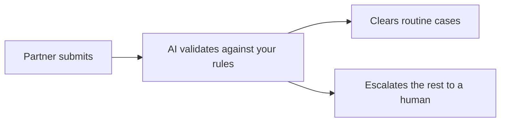

## Run it from your AI assistant

<Headless>
  * Review this MDF claim against our proof-of-spend rules.
  * Is this deal registration complete enough to approve?
  * Return the submissions that are missing required documents.
</Headless>

## Going deeper

<CardGroup>
  <Card title="How to" icon="screwdriver-wrench" href="./technical">
    Configure AI validation, instructions, and the certainty threshold.
  </Card>

  <Card title="API reference" icon="code" href="/general/introduction">
    Endpoints and code.
  </Card>
</CardGroup>

**Works with**

<CardGroup>
  <Card title="Submissions & Approvals" icon="table-list" href="/features/forms/submissions-approvals">
    Runs inside the submission approval workflow.
  </Card>

  <Card title="Deal Registration" icon="file-signature" href="/features/deal-registration/registration">
    Validates deal registrations before they sync.
  </Card>

  <Card title="Channel Conflict Resolution" icon="robot" href="/features/ai/channel-conflict">
    The conflict-specific screen alongside validation.
  </Card>
</CardGroup>

---

# AI Approvals
Source: https://docs.introw.io/features/ai/approvals/technical/index

Pick how much of a form's review Introw AI owns, write or generate the rules it judges against, set the confidence it has to clear, and let it accept, decline, or return submissions.

## Where it lives

AI Approvals sits under **Portal**, at [Forms](https://app.introw.io/forms).

<Frame>
  
</Frame>

## Before you start

| You need                     | Why                            | Fix it                                                                            |
| ---------------------------- | ------------------------------ | --------------------------------------------------------------------------------- |
| The AI Agent module          | On by default on your plan     | **Request access**                                                                |
| A form with an approval step | The AI recommends on that step | [Build a form](/features/forms/form-builder/guides/build-and-publish-a-form)      |
| Write access to the form     | To turn the recommendation on  | [Internal roles](/features/access/team-management/guides/create-an-internal-role) |

## How it works

AI Approvals is configured per form, on the **Approval gate** under **Review**. Picking **AI Assisted** or **Autonomous AI (Agentic)** puts the AI reviewer in that form's [approval workflow](/features/forms/submissions-approvals). You give it **Guidance for Introw AI** - the rules a submission has to meet, written in plain language - and **Generate with AI** drafts a first version from the form's own fields, which you then edit.

When a partner submits, the AI reads the submission and its attachments, checks it against your guidance, and produces a verdict with reasoning: accept, decline, or return for more information. On **AI Assisted** the verdict and reasoning show up for your human approvers, who make the call. On **Autonomous AI** one slider sets the confidence it has to clear (defaults to 90%) and the AI acts on its own at or above that bar, escalating anything below it to your [acceptance steps](/features/forms/submissions-approvals). Because it runs on the form layer, the same reviewer covers deal registrations, [MDF](/features/mdf) requests, claims, ROI, and invoices, and shared leads.

### How much of the review it owns

* **Manual** - every submission goes to your approvers, with no AI on it at all.
* **AI Assisted** - the AI assesses every submission and posts its verdict and reasoning; a human still accepts, declines, or returns.
* **Autonomous AI (Agentic)** - above the confidence you set, the AI accepts, declines, or returns on its own; below it, the submission escalates to a human. This is how a stack of routine, well-documented submissions clears without sitting in a queue.

### Where it fits the approval flow

The AI reviews first, then your sequential human acceptance steps handle whatever escalates. [Channel conflict](/features/ai/channel-conflict) screening runs alongside it as the conflict-specific check on deal registrations.

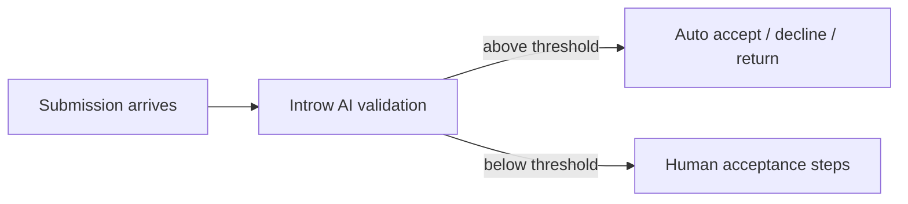

## Settings & configuration

Configured on the form editor's **Automation** tab, on the **Approval gate** block.

### Review mode

Pick **AI Assisted** to keep the AI advisory while humans decide, or **Autonomous AI (Agentic)** to let it act on the cases it is sure about. The mode in force is shown beside **Approval gate** in the automation list.

### Guidance for Introw AI

Write the rules the AI checks each submission against - policy, risk tolerance, must-have criteria - or **Generate with AI** a draft from the form's fields and edit it.

### Confidence

On **Autonomous AI**, set how confident the AI must be to act without a human (defaults to 90%). Lower it to automate more, raise it to escalate more; everything under the bar still goes to your approval steps.

## How-to guides

*None yet.*

## Troubleshooting

<Warning>
  **Autonomous AI** acts on real submissions - accepting an MDF claim or a deal registration writes to your CRM and can draw down budget. Start on **AI Assisted**, review the AI's verdicts, and only move to **Autonomous AI** once its guidance is proven. The AI reviews against your guidance only, so vague rules produce vague verdicts.
</Warning>

<AccordionGroup>
  <Accordion title="The AI isn't reviewing submissions">
    The gate is on **Manual**, or the form has no approval gate at all.
  </Accordion>

  <Accordion title="It escalates everything">
    The confidence bar is too high for the guidance you wrote, or the guidance is ambiguous.
  </Accordion>

  <Accordion title="It auto-accepted something it shouldn't">
    Tighten the guidance and raise the confidence bar; **Autonomous AI** follows the rules you gave it.
  </Accordion>
</AccordionGroup>

---

# Catch and resolve channel conflict
Source: https://docs.introw.io/features/ai/channel-conflict/guides/catch-and-resolve-channel-conflict

Turn on AI channel-conflict screening for a deal form, then review and resolve any overlap from the Submissions inbox before it syncs to your CRM.

Channel conflict is configured on the form that creates the deal, not in a global settings screen. When you turn on Channel Conflict Analysis for a deal-creating form, every submission is cross-referenced against the deals already in your CRM, and any likely overlap is held in the Submissions inbox with an AI assessment so your team can decide before the deal syncs. This is what keeps a partner deal and a direct (or another partner's) deal from quietly colliding and turning into a dispute weeks later.

## What you'll achieve

A deal-registration or lead form that automatically screens each submission for channel conflict, plus a clear review flow: flagged submissions wait in the Submissions inbox with the overlapping deals and a recommended next step, and your team approves, declines, or links the deal before any CRM record is created. Detection runs automatically; the decision stays with your team.

## Before you start

<Steps>
  <Step title="Have a form that creates a deal">
    Channel conflict analysis only runs on forms whose automations create a Deal (or Lead / Opportunity). Build or open the form partners use to register or submit deals first.
  </Step>

  <Step title="Confirm your CRM is connected">
    Detection compares each submission against the deals synced from your CRM, so a connected CRM with your deals is required.
  </Step>

  <Step title="Check your access">
    You need permission to edit forms, and reviewers need submission access to approve or decline a flagged conflict.
  </Step>
</Steps>

## Watch it

<Tabs>
  <Tab title="Video">
    <video />
  </Tab>

  <Tab title="Click through">
    <iframe />
  </Tab>
</Tabs>

## Steps

### Turn on detection for the form

<Steps>
  <Step title="Open the form's automations">
    Go to [Forms](https://app.introw.io/forms), open the form partners use to register deals, and switch to the **Automations** tab. The left column lists every automation that can run on a submission.

    <Frame>
      
    </Frame>
  </Step>

  <Step title="Make sure the form creates a deal">
    Confirm the form has a deal-creating automation (a **Deal**, **Lead**, or **Opportunity** automation). Channel conflict analysis only screens submissions that produce a deal, so without one there is nothing to cross-reference. Adding a **Create partner** automation turns channel conflict off, so keep that off on deal forms.

    <Frame>
      
    </Frame>
  </Step>

  <Step title="Open Channel Conflict Analysis">
    Select **Channel Conflict Analysis** from the automation list. If it shows a **Disabled** pill, it is not yet screening submissions.

    * **Channel Conflict Analysis** - the on/off switch for AI screening on this form. When on, every submission is checked for overlapping deals before the form's CRM automations run. Turn it on.
    * **Object** - the CRM object the analysis runs against. This is fixed to your **Deal** object and cannot be changed, because conflict only makes sense against deals.
    * **Filters** - optionally limit screening to deals that match these conditions (for example only above a certain amount, or only a specific pipeline). Leave it empty to screen every deal the form creates; add conditions when you only want larger or specific deals reviewed.
    * **Additional context** - free text that helps the agent judge what counts as a conflict for your program (for example how you treat existing open opportunities, or which regions overlap). Describe your rules of engagement here so the assessment matches how your team actually decides.

    <Frame>
      
    </Frame>
  </Step>

  <Step title="Save the form">
    Save the form so the automation goes live. New submissions to this form are now screened for conflict.
  </Step>
</Steps>

### Resolve a flagged conflict

<Steps>
  <Step title="Read the notification">
    You do not have to watch the inbox. When a submission trips a deal-level conflict, the **Form submitted** notification your reviewers already receive leads with a **Channel conflict** section carrying the assessment and recommendation, and its button reads **Resolve conflict** instead of **View submission**. Select it to land on the submission.

    This applies to the reviewers on the form's email automation and to your internal Slack or Microsoft Teams channels. A channel shared with the partner gets the ordinary notification, with no conflict section and no **Resolve conflict** button, so your assessment never leaks to the partner who submitted.
  </Step>

  <Step title="Open the Submissions inbox">
    Go to [Submissions](https://app.introw.io/submissions). A submission with detected overlap is held as pending and shows a channel conflict flag on its status.
  </Step>

  <Step title="Open the flagged submission">
    Open the submission to see the deal it would create alongside the overlapping deals the AI found, plus its assessment and recommended next step. This assessment is internal only, partners never see it.
  </Step>

  <Step title="Make the decision">
    Using the AI panel, apply your rules of engagement:

    * **Approve** to let the submission proceed and create or update the deal in your CRM.
    * **Decline** to reject the overlapping registration.
    * **Link to an existing deal** when the right move is to attach the submission to the deal that is already in flight rather than create a duplicate.

    The decision is recorded on the submission, and only then do the form's CRM automations run.
  </Step>
</Steps>

## Verify it worked

Submit a test deal that overlaps a deal already in your CRM. The submission lands in the Submissions inbox as pending with a channel conflict flag, the AI assessment lists the overlapping deal and a recommended next step, and approving or declining it records the outcome before any CRM record is created. A submission with no overlap passes straight through.

## Related

<CardGroup>
  <Card title="Implementation reference" icon="screwdriver-wrench" href="../technical">
    Settings, prerequisites, and limits for channel conflict analysis.
  </Card>

  <Card title="Deal & Lead Registration" icon="handshake" href="/features/co-selling/deal-lead-registration">
    The registration flow that feeds these submissions.
  </Card>
</CardGroup>

---

# Channel Conflict Resolution
Source: https://docs.introw.io/features/ai/channel-conflict/index

Let AI detect when a partner-registered deal overlaps with a direct or another partner's deal, and guide a fair, fast resolution before it becomes a dispute.

> Channel conflict kills trust with partners. AI spots overlapping deals the moment they appear and guides a fair resolution, before it turns into a dispute.

## The problem it solves

<Pains>
  | Without Introw               | With Introw                       |
  | ---------------------------- | --------------------------------- |
  | Conflicts surface too late   | Flagged at registration           |
  | Resolution is political      | The facts and rules, up front     |
  | Registration is distrusted   | Fair, fast handling makes it real |
  | Ops cannot police every deal | Every registration is screened    |
</Pains>

## Impact

Channel conflict is the fastest way to lose a partner's trust. Catching it at registration, with the facts attached, is what keeps the program credible on both sides.

<Impact>
  for your business

  * **AI, not admin**
    The agent screens and triages every registration, and your team keeps the decision
  * **In your CRM**
    Overlap is detected across the deals already in your CRM, not in a separate registration silo
  * **Trustworthy**
    The flag arrives with who is involved and which claim came first, so it is settled on facts

  for your partners

  * **Self-serve**
    They learn at registration whether the deal is clear, instead of finding out at close
  * **Enabled**
    A screened claim is one worth making, which is what gets deals registered early
  * **Efficient**
    One decision up front, rather than a dispute months later with revenue attached

  [A day in the life of your partners](/days-in-the-life)
</Impact>

<Personas>
  * **Chief Revenue Officer** - direct and channel aligned
  * **Partner Operations** - conflict rules without policing
  * **Partners** - a claim that is checked fairly
</Personas>

## See it work

<Tour>
  * 

    **Check the form**

    Screening runs on a form that creates a deal.

  * 

    **Turn it on**

    Pick the object to screen against, and narrow it.
</Tour>

## How it works

When a partner registers a deal, Introw's AI checks it against existing direct and partner deals to find overlap on the same account or opportunity. If it detects a likely conflict, it flags it with the context, who is involved, which deal came first, and the relevant rules, and helps your team resolve it quickly and consistently. Instead of conflicts surfacing late in a heated email thread, they are caught at registration and handled by clear rules of engagement.

The AI does the detection and triage; your team stays in control of the decision.

Instead of discovering a clash when two teams are already working the same account, the conflict is caught at registration with the full context. Your team applies clear rules of engagement and resolves it fast, so partners trust the program and the direct team stays aligned.

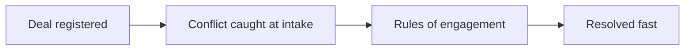

## Run it from your AI assistant

<Headless>
  * Does this new registration conflict with any direct or partner pipeline?
  * Flag registrations that overlap existing opportunities.
  * Is Globex already being worked by our direct team?
</Headless>

## Going deeper

<CardGroup>
  <Card title="How to" icon="screwdriver-wrench" href="./technical">
    Setup, configuration, and all how-to guides.
  </Card>

  <Card title="API reference" icon="code" href="/general/introduction">
    Endpoints and code.
  </Card>
</CardGroup>

**Works with**

<CardGroup>
  <Card title="Deal & Lead Registration" icon="handshake" href="/features/co-selling/deal-lead-registration">
    Screen every registration for conflict.
  </Card>

  <Card title="Deal Registration" icon="file-signature" href="/features/deal-registration/registration">
    Detect overlap with reseller claims.
  </Card>
</CardGroup>

---

# Channel Conflict Resolution
Source: https://docs.introw.io/features/ai/channel-conflict/technical/index

Turn on AI channel-conflict screening per form, detect overlapping partner deals automatically, and resolve flagged conflicts from the Submissions inbox.

## Where it lives

Channel Conflict Resolution sits under **Portal**, at [Forms](https://app.introw.io/forms).

<Frame>
  
</Frame>

## Before you start

| You need                          | Why                                     | Fix it                                                                                  |
| --------------------------------- | --------------------------------------- | --------------------------------------------------------------------------------------- |
| A form that creates deals         | Conflict only runs on those             | [Map it to your CRM](/features/forms/crm-automations/guides/connect-a-form-to-your-crm) |
| A connected CRM with deals synced | There has to be something to compare    | [Connect a CRM](/features/integrations/crm/guides/connect-hubspot)                      |
| Form edit and submission access   | One person configures, another resolves | [Internal roles](/features/access/team-management/guides/create-an-internal-role)       |

## How it works

Channel conflict screening is configured **per form**, not in a global settings screen. On any form whose automations create a deal, you can add a **Channel Conflict Analysis** automation. When it is on, each submission is cross-referenced against the deals already synced from your CRM to find overlap on the same account or opportunity, before the form's CRM automations run.

If the AI finds a likely conflict, the submission is held as pending in the **Submissions** inbox with a channel conflict flag, the overlapping deals, an assessment, and a recommended next step. A reviewer on your team approves, declines, or links the submission to an existing deal. The assessment and next steps are internal only, partners never see them. The AI handles detection and triage; the decision stays with your team.

The assessment does not wait for someone to open the inbox: it rides along on the **Form submitted** notification your reviewers already get, so the first thing they read tells them there is a conflict. See [Conflict context in the Form submitted notification](#conflict-context-in-the-form-submitted-notification).

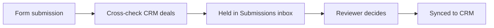

## Settings & configuration

Channel conflict lives on the **Automations** tab of a deal form, as the **Channel Conflict Analysis** automation.

**Channel Conflict Analysis** is the on/off switch for AI screening on that form. When on, every submission is checked for overlapping deals before the form's CRM automations run; a **Disabled** pill on the automation means it is off. Adding a **Create partner** automation to the same form turns channel conflict off, and it is not available on MDF forms.

**Object** is the CRM object the analysis runs against. It is fixed to your **Deal** object and cannot be changed.

**Filters** optionally limit screening to deals that match conditions you set (for example a minimum amount or a specific pipeline). Leave it empty to screen every deal the form creates.

**Additional context** is free text that tells the agent how your program judges a conflict (for example how you treat existing open opportunities or overlapping regions), so its assessment reflects your rules of engagement.

Resolution happens in **Submissions**: a flagged submission is pending and shows a channel conflict status; reviewers with submission access get an AI panel to approve, decline, or link the deal.

### Conflict context in the Form submitted notification

There is nothing to configure here; it follows from having the analysis on. When a submission trips a deal-level conflict, the **Form submitted** notification your reviewers receive changes shape:

* A **Channel conflict** section leads the message, carrying the same assessment and recommendation the Submissions inbox shows, as plain text.
* The button changes from **View submission** to **Resolve conflict**, and lands on the same submission.
* In email, the submitted fields are trimmed to the first five with a link to see the rest, so the conflict stays the headline rather than being buried under a long form.

It reaches the reviewers the form's email automation already targets, and the internal Slack or Microsoft Teams channels the notification already goes to. **Partner-facing channels never carry it**: a shared channel with the partner gets the ordinary Form submitted message with no conflict section and no Resolve conflict button.

Two limits are worth knowing. The section only appears for **deal-level** overlap, so a submission that only resembles an existing company or contact is still flagged in the inbox but adds nothing to the notification. And the assessment is written while the submission is being recorded, with a 15 second budget: if the model is slow or unavailable, the notification goes out in its normal form and the submission is still flagged in the inbox.

## How-to guides

<Rail>
  * 

    [**Catch and resolve channel conflict**](/features/ai/channel-conflict/guides/catch-and-resolve-channel-conflict)

    Turn on AI channel-conflict screening for a deal form, then review and resolve any overlap from the Submissions inbox before it syncs to your CRM.
</Rail>

## Troubleshooting

<Warning>
  Channel conflict only runs on forms that create a deal and have the analysis turned on, so a form with no deal automation is never screened. Detection compares against deals synced from your CRM, so unsynced deals are not considered. The AI flags likely overlap; the approve, decline, or link decision always stays with a reviewer.
</Warning>

<AccordionGroup>
  <Accordion title="A submission was never screened">
    The form has no deal automation, or Channel Conflict Analysis is off (shows a **Disabled** pill).
  </Accordion>

  <Accordion title="Channel Conflict Analysis is missing on a form">
    It is hidden on MDF forms and on forms with a **Create partner** automation.
  </Accordion>

  <Accordion title="No overlap is ever found">
    Confirm the comparable deals are synced from your CRM and your filters are not too narrow.
  </Accordion>

  <Accordion title="A flagged submission was not actioned">
    Confirm a reviewer with submission access is working the Submissions inbox.
  </Accordion>

  <Accordion title="A flagged submission arrived as an ordinary Form submitted notification">
    The overlap was on a company or contact rather than a deal, or the assessment did not come back in time. Open the submission; the flag and the assessment are in the inbox either way.
  </Accordion>

  <Accordion title="Nobody was notified at all">
    The form has no email automation and no chat channel receiving Form submitted. The conflict section rides on that notification; it does not create one. See [Control who gets notified](/features/engagement/notifications/guides/control-who-gets-notified).
  </Accordion>
</AccordionGroup>

---

# AI Copilot
Source: https://docs.introw.io/features/ai/copilot/index

Run your partner program in plain language: prep QBRs, find inactive partners, spot tier bumps, and update records, grounded in your CRM data.

> Your team runs the program by clicking through the CRM, the portal, and a stack of reports. The AI Copilot lets them run it in plain language instead: ask a question or give an instruction, and it reads your data, assembles the answer, and takes the action.

## The problem it solves

Running a partner program means knowing where everything lives:

<Pains>
  | Without Introw                      | With Introw                     |
  | ----------------------------------- | ------------------------------- |
  | Answers are scattered everywhere    | Ask, and it pulls them together |
  | Prep is manual and slow             | A QBR assembled in seconds      |
  | Routine updates eat the day         | It updates and comments for you |
  | Insight needs knowing where to look | It surfaces who needs attention |
</Pains>

## Impact

The partner-facing effect of a copilot is that their manager always knows their account. That is what turns a quarterly call from a status update into a plan.

<Impact>
  for your business

  * **AI, not admin**
    The copilot does the mechanical program work: prep, lookups, updates, tasks and comments
  * **In your CRM**
    It reads and writes the same CRM records, so it never creates a parallel version of reality
  * **No new tool**
    It is built into Introw, and the same actions run from your own assistant over MCP

  for your partners

  * **Self-serve**
    The same engine powers their own assistant, scoped to their own data
  * **Enabled**
    Their manager arrives at a review already knowing their numbers, not asking for them
  * **Efficient**
    A question about their commission or their tier is answered while they are still asking

  [A day in the life of your partners](/days-in-the-life)
</Impact>

<Personas>
  * **Partner Operations** - the day's work by asking
  * **Partnership Leadership** - program health, instantly
</Personas>

## How it works

The AI Copilot - **Introw AI** in the product - is a conversational assistant for your team, always a click away at the top of Introw. Ask it to prep a QBR for a partner, list partners who've gone quiet, show who's close to a tier promotion, pull a partner's commission status, or update a record. It does the work: it reads your CRM and knowledge base, composes the answer, and takes scoped actions on your behalf.

<Frame>
  
</Frame>

It runs on the same engine and the same secure toolset your team can drive from [Claude, ChatGPT, or Gemini over MCP](/features/developer/mcp). The copilot is simply that power built into Introw, so you don't have to leave the product to use it. Every answer is grounded in your data, and every action stays inside your permissions.

Instead of hunting through screens to answer "which partners need attention this week?", your team asks the copilot and gets the answer - and the next action - immediately. It turns program operations into a conversation.

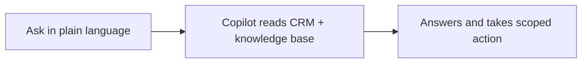

## Run it from your AI assistant

<Headless>
  * Prep a QBR for Acme - pipeline, commissions, and open tasks.
  * Which partners have had no activity in the last 30 days?
  * Who's closest to hitting the next tier, and what do they still need?
</Headless>

## Going deeper

<CardGroup>
  <Card title="How to" icon="screwdriver-wrench" href="./technical">
    Where the copilot lives, what it can do, and how it's scoped.
  </Card>

  <Card title="API reference" icon="code" href="/general/introduction">
    Integration surface and code.
  </Card>
</CardGroup>

**Works with**

<CardGroup>
  <Card title="Knowledge Base" icon="robot" href="/features/ai/knowledge-base">
    Grounds the copilot in your sources.
  </Card>

  <Card title="MCP" icon="code" href="/features/developer/mcp">
    Run the same actions from your own AI assistant.
  </Card>

  <Card title="Partner Support Agent" icon="robot" href="/features/ai/partner-support">
    The partner-facing counterpart to your copilot.
  </Card>
</CardGroup>

---

# AI Copilot
Source: https://docs.introw.io/features/ai/copilot/technical/index

Where Introw AI lives, the actions it can take, how it's grounded in your CRM and knowledge base, and how it's scoped to your team's permissions.

## Where it lives

AI Copilot lives at [Introw AI](https://app.introw.io/agent).

<Frame>
  
</Frame>

## Before you start

| You need                | Why                                    | Fix it                                                                                |
| ----------------------- | -------------------------------------- | ------------------------------------------------------------------------------------- |
| The AI Agent module     | On by default on your plan             | **Request access**                                                                    |
| A connected CRM         | The copilot reads and writes live data | [Connect a CRM](/features/integrations/crm/guides/connect-hubspot)                    |
| Knowledge sources added | So answers are grounded, not guessed   | [Fill the knowledge base](/features/ai/knowledge-base/guides/fill-the-knowledge-base) |

## How it works

The copilot ships as **Introw AI**, reachable from the top of Introw and as a full page with conversation history. Ask a question or give an instruction in plain language and it does three things: reads your live CRM and [knowledge base](/features/ai/knowledge-base), composes an answer, and - when you ask it to - takes an action on the same records.

It runs on the secure Introw toolset. In one conversation it can search partners and CRM objects, read commissions, marketing funds, goals, and tiers, gather a partner business review, search tasks and activity, and write back: update partner fields, update CRM object properties, create and update tasks, and add comments. Starter suggestions (for example a QBR, inactive partners, or partners in a given tier) get you moving in a click. This is the same toolset available over [MCP](/features/developer/mcp), so the copilot inside Introw and your own AI assistant do the same work.

### Grounding and actions

The copilot never improvises from outside knowledge. Answers come from your CRM records plus the sources in your knowledge base (websites, snippets, documents, and portal content). Actions call the same permissioned APIs your team uses in the UI, so a write from the copilot is identical to a write you'd make by hand - and it's recorded the same way.

### Security and scoping

Introw AI is scoped to your organization and the acting user's access. It reads and writes only what that user could reach in the product, and every conversation is traced. You can leave feedback on answers to tune quality over time.

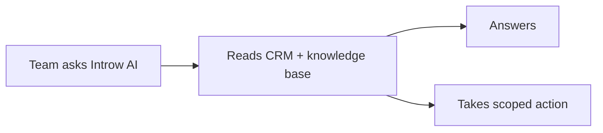

## Settings & configuration

Introw AI is available to your team out of the box - there's no separate build step. To make its answers richer:

### Fill the knowledge base

Add websites, snippets, and documents so program questions resolve against your own content. See [Fill the knowledge base](/features/ai/knowledge-base/guides/fill-the-knowledge-base).

### Connect your CRM

The copilot's reach mirrors your CRM sync - the more of your program lives in the CRM, the more the copilot can answer and do.

### Extend with MCP

Connect your own MCP server to give the copilot custom context and live tools from your systems. See [Knowledge Base](/features/ai/knowledge-base).

## How-to guides

*None yet.*

## Troubleshooting

<Warning>
  The copilot only answers and acts within the acting user's permissions and the data in your CRM and knowledge base. Thin CRM sync or an empty knowledge base means thinner answers. Writes it makes are real CRM writes - review actions the same way you'd review your own.
</Warning>

<AccordionGroup>
  <Accordion title="The copilot can't find a partner or deal">
    It isn't synced from your CRM, or the acting user can't access it.
  </Accordion>

  <Accordion title="Answers are vague">
    The knowledge base is thin; add websites, snippets, or documents.
  </Accordion>

  <Accordion title="It won't take an action">
    The acting user lacks permission for that write.
  </Accordion>
</AccordionGroup>

---

# Set up an AI deal coach
Source: https://docs.introw.io/features/ai/deal-coaching/guides/set-up-an-ai-deal-coach

Create an AI deal coach, scope it to the right partners and deals, and refine its stage guidance, objection handling, enablement, and rules.

A deal coach is a playbook scoped to the deals you choose, that surfaces stage guidance, objection handling, enablement, and rules of engagement on every matching deal, and that the partner support agent can deliver on demand. Introw drafts the first version with AI from your motion type, then you refine it. Reach for this when partners stall mid-deal because they do not know the next right move, and you want your best reps' playbook applied at scale instead of one deal at a time.

## What you'll achieve

A live deal coach: scoped to a pipeline, the right partner segments, and the right deals, with stage-by-stage objectives and guidance, objection responses, attached enablement assets, and your rules of engagement. When a partner works a deal that matches the scope, the coaching appears on the deal and the partner support agent can deliver the same guidance when asked.

## Before you start

<Steps>
  <Step title="Confirm Deal Coaching is available">
    Deal Coaching is on by default. If you do not see it under **Engage**, the module is not enabled on your plan.
  </Step>

  <Step title="Have the pipeline ready">
    Know which deal pipeline this coach covers; the coach pulls its open stages from that pipeline.
  </Step>

  <Step title="Line up segments and assets">
    Decide which partner segments the coach applies to, and have any enablement assets you want to attach already in your asset library.
  </Step>
</Steps>

## Watch it

<Tabs>
  <Tab title="Video">
    <video />
  </Tab>

  <Tab title="Click through">
    <iframe />
  </Tab>
</Tabs>

## Steps

### Create the coach

<Steps>
  <Step title="Start a new coach">
    Go to [Deal Coaching](https://app.introw.io/deal-coaching) and select **Create Deal Coach**.

    <Frame>
      
    </Frame>
  </Step>

  <Step title="Pick the pipeline and motion template">
    In the **Create Deal Coach** dialog, set:

    * **Pipeline** - the deal pipeline this coach covers. The coach builds its stage guidance from this pipeline's open stages, so choose the one partners actually work these deals in.
    * **Start from template** - the motion the coach is built for, which shapes the AI's first draft. Choose **Reselling Coach** when the partner owns the customer journey and you enable them, **Co-Selling Coach** when you and the partner run a joint sales process, or **Referral Coach** when the partner refers leads and influences your process. The default is **Reselling Coach**.

    <Frame>
      
    </Frame>
  </Step>

  <Step title="Create and let AI draft it">
    Select **Create**. Introw generates a first-draft playbook from your company details and the chosen motion, then opens the coach. Generation takes a moment; the page updates itself when the draft is ready.
  </Step>
</Steps>

### Scope who and which deals it covers

<Steps>
  <Step title="Open the configuration">
    On the coach, select **Configure** to open the **Configure Deal Coach** dialog. Scope decides which deals the coaching appears on.

    * **Name** - a clear name so the coach is easy to find in the list (for example "EMEA Reselling - Enterprise").
    * **Partner segment** - limit the coaching to partners in the selected segments. Leave it empty to apply to all partners; set it when, say, only certified or tier-1 partners should get this playbook.
    * **Deal property segmentation** - add filters on deal properties so the coach only applies to matching deals (for example a region, product line, or amount threshold). Leave it empty to cover every deal in the pipeline.
  </Step>

  <Step title="Save the scope">
    Select **Save Changes**. The coach now matches only the partners and deals you defined.
  </Step>
</Steps>

### Refine the playbook

<Steps>
  <Step title="Edit the stage guidance">
    On the **Stage Guidance** tab, work through each pipeline stage. Per stage set:

    * **What must be achieved** - the objective for that stage, the exit criteria before a deal should advance. This is what tells a partner whether they are really ready to move on.
    * **How to achieve it** - the concrete guidance on what the partner should do to hit that objective, mirroring how your best reps work the stage.
    * **Email template** (under **Show email template**) - an optional ready-to-send email for that stage, so partners are not drafting outreach from scratch. Leave it empty if you do not want a template for a stage.
  </Step>

  <Step title="Add objection handling">
    On the **Objection Handling** tab, select **Add Objection** for each common objection and fill in:

    * **Objection** - what the prospect is likely to say.
    * **Response** - how the partner should answer it.

    Capture the objections partners actually hear so they are never caught off guard and stop escalating every pushback to you.
  </Step>

  <Step title="Attach enablement">
    On the **Enablement** tab, select **Add Assets** and choose the materials partners should reach for during these deals (one-pagers, case studies, decks). They surface in the moment of need instead of partners hunting through a library.
  </Step>

  <Step title="Set the rules of engagement">
    On the **Rules of Engagement** tab, write the guardrails partners must respect, what they can promise, when to involve you, what to avoid, and stakeholder or escalation rules. This keeps partners empowered without going off-script.
  </Step>

  <Step title="Save the playbook">
    Select **Save Changes** to publish your edits. The AI draft is only a starting point, so review every tab before partners rely on it.
  </Step>
</Steps>

## Verify it worked

Open a deal that matches the coach's pipeline, segment, and deal filters. The coaching view appears on the deal with the current stage's objective and guidance, the objections, the enablement assets, and the rules of engagement, and the partner support agent returns the same guidance when a partner asks about the deal. If nothing shows, the deal does not match the coach's scope, so revisit the pipeline, partner segment, and deal filters.

## Related

<CardGroup>
  <Card title="Implementation reference" icon="screwdriver-wrench" href="../technical">
    Settings, tabs, prerequisites, and limits for deal coaching.
  </Card>

  <Card title="Asset Library" icon="folder-open" href="/features/content/asset-library">
    Manage the enablement assets a coach surfaces.
  </Card>
</CardGroup>

---

# Deal Coaching
Source: https://docs.introw.io/features/ai/deal-coaching/index

Put an AI coach in every partner deal: segment-specific stage guidance, objection handling, and enablement delivered proactively and on demand.

> You cannot put a partner development manager on every deal, but you can put a coach. Deal coaching gives partners segment-specific guidance on every deal - what to do at each stage, how to handle objections, and which content to use - and it reaches out on its own at the moments that matter.

## The problem it solves

Partners stall on deals because they are not your sales team:

<Pains>
  | Without Introw                    | With Introw                 |
  | --------------------------------- | --------------------------- |
  | Partners lack deal know-how       | Stage-by-stage instructions |
  | Objections go unhandled           | Responses ready on the deal |
  | The right content is hard to find | Assets surface on the deal  |
  | Momentum stalls between logins    | It checks in at key moments |
</Pains>

## Impact

You cannot put a partner development manager on every deal, and partners know it. A coach that arrives with the right play is how a small team feels like attentive coverage.

<Impact>
  for your business

  * **AI, not admin**
    AI drafts the playbook when you create a coach, and surfaces the coaching in context on the deal
  * **In your CRM**
    Coaching attaches to the deal in your CRM, scoped by pipeline, deal, partner and segment

  for your partners

  * **Self-serve**
    They ask what to do on this deal and get an answer that fits their motion, not generic tips
  * **Enabled**
    Stage instructions, objection handling and the right asset, on the record they are working
  * **Efficient**
    The coach reaches out on its own before a deal goes stale, so nothing waits on a login

  [A day in the life of your partners](/days-in-the-life)
</Impact>

<Personas>
  * **Partner Operations** - playbooks built and scoped
  * **Sales Leadership** - the guidance partners get
  * **Partner sales teams** - a play for the deal in front
</Personas>

## See it work

<Tour>
  * 

    **Create a coach**

    One coach per motion, not one per deal.

  * 

    **Scope the motion**

    A pipeline, and a reselling, co-selling or referral template.
</Tour>

## How it works

Deal coaching is a set of playbooks that guide partners through deals. You build a coach scoped to a
pipeline and to specific deals, partners, or segments, and define its content: instructions for each
stage, objection handling, enablement assets to surface, and rules of engagement. When a partner
works a matching deal, the coaching appears right on the deal record and through the partner support
agent when they ask "what should I do here?".

AI helps you build the playbook quickly when you create a coach, generating a first draft you refine.
Because coaches are scoped by pipeline, deal, partner, and segment, each partner gets advice that
fits their motion, referral, co-selling, or reselling, rather than generic tips.

Coaches can also check in proactively. With workflow triggers, a coach reaches out to the partner at
key moments in a deal, a set number of days after it is created, before or after its close date, or
once it has sat too long in one stage, so the guidance arrives without the partner having to open
anything.

Deal coaching scales your best sales guidance across every partner deal. Build playbooks once, scope
them to the right motions, and partners get expert, contextual advice on the deal and through the
agent, lifting win rates without adding headcount.

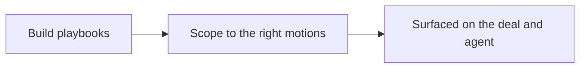

## Run it from your AI assistant

<Headless>
  * Coach me on the Acme deal: what are the risks and next steps?
  * Which of my deals need attention this week?
  * What should I do to move the Globex deal forward?
</Headless>

## Going deeper

<CardGroup>
  <Card title="How to" icon="screwdriver-wrench" href="./technical">
    Setup, configuration, and all how-to guides.
  </Card>

  <Card title="API reference" icon="code" href="/general/introduction">
    Integration surface and code.
  </Card>
</CardGroup>

**Works with**

<CardGroup>
  <Card title="Shared Pipelines" icon="handshake" href="/features/co-selling/shared-pipelines">
    Coach partners on deals in the shared pipeline.
  </Card>
</CardGroup>

---

# Deal Coaching
Source: https://docs.introw.io/features/ai/deal-coaching/technical/index

Create AI deal coaches in Introw: write stage instructions, define objection handling, attach enablement materials, and set rules of engagement.

## Where it lives

Deal Coaching lives at [Deal Coaching](https://app.introw.io/deal-coaching).

<Frame>
  
</Frame>

## Before you start

| You need                           | Why                              | Fix it                                                                            |
| ---------------------------------- | -------------------------------- | --------------------------------------------------------------------------------- |
| The Deal Coaching module           | On by default on your plan       | **Request access**                                                                |
| CRM copilot write access           | Coaching writes back to the deal | [Internal roles](/features/access/team-management/guides/create-an-internal-role) |
| A connected CRM with your pipeline | It coaches on real deals         | [Connect a CRM](/features/integrations/crm/guides/connect-hubspot)                |

## How it works

Deal coaches live under **Engage** on the **Deal Coaching** page. You create a coach scoped to a
pipeline and a motion template (Reselling, Co-Selling, or Referral). On creation, AI generates a
first-draft playbook you then refine. The coach's detail page has tabs for **Stage Guidance**,
**Objection Handling**, **Enablement**, and **Rules of Engagement**, and a **Configure** dialog where
you set the name, partner segments, and deal filters.

When a partner works a deal that matches a coach, the coaching surfaces on the deal collaboration
record as a coaching view, and the partner support agent can deliver the same guidance when asked.
Coaching matches deals automatically based on the scope you set.

Coaches can also check in **proactively**: workflow triggers reach out to the partner at set moments
in a deal, rather than waiting for them to open it. See **Workflow triggers** below.

## Settings & configuration

Deal coaches are managed at [Deal Coaching](https://app.introw.io/deal-coaching).

### Creating a coach

Use the **Create Deal Coach** dialog to set the **Pipeline** and the **Start from template** motion
(**Reselling Coach**, **Co-Selling Coach**, or **Referral Coach**; default Reselling). Creating the
coach starts AI generation of the initial playbook from your company details and the chosen motion.

### Configure (scope)

Open **Configure** on a coach to set its **Name**, **Partner segment** (which partner segments the
coach applies to, empty means all partners), and **Deal property segmentation** (deal-property
filters that limit which deals the coach matches). Finer partner-level targeting beyond segments is
only available through the API, not this dialog.

### Stage Guidance

On the **Stage Guidance** tab, set **What must be achieved** (the stage objective), **How to achieve
it** (the guidance), and an optional **Email template** for each pipeline stage.

### Objection Handling

On the **Objection Handling** tab, add common objections and the response partners should use.

### Enablement

On the **Enablement** tab, attach the assets partners should use during the deal.

### Rules of Engagement

On the **Rules of Engagement** tab, define the guardrails (what partners can promise, when to escalate,
stakeholder rules) that keep partners within bounds.

### Workflow triggers (automatic check-ins)

On the **Workflow Triggers** tab, turn on automatic check-ins that reach the partner at key moments in
a deal, instead of waiting for them to open it. Each trigger has its own on/off switch, a number of
**days**, an optional stage scope, an **Instructions for AI** field (what the check-in should cover),
and an optional **Message Template** to fix the exact wording. The trigger types are:

* **Days after deal created**
* **Days before close date**
* **Days after close date**
* **Days in stage**

New coaches start with a sensible set of triggers already enabled, generated alongside the rest of the
playbook, which you can adjust or switch off.

## How-to guides

<Rail>
  * 

    [**Set up an AI deal coach**](/features/ai/deal-coaching/guides/set-up-an-ai-deal-coach)

    Create an AI deal coach, scope it to the right partners and deals, and refine its stage guidance, objection handling, enablement, and rules.
</Rail>

## Troubleshooting

<Warning>
  Deal coaching requires the module to be enabled; with it off, the Deal Coaching nav and coaching surfaces are hidden. Coaching only appears on deals that match a coach's scope, so check your filters and segments if a deal shows no coaching. The AI-generated playbook is a starting point and should be reviewed before partners rely on it.
</Warning>

<AccordionGroup>
  <Accordion title="No coaching on a deal">
    The deal does not match any coach's pipeline, filters, or segments.
  </Accordion>

  <Accordion title="The Deal Coaching page is missing">
    The module is not enabled on your plan.
  </Accordion>

  <Accordion title="The playbook is generic">
    Refine the AI-generated stages and objections for your motion.
  </Accordion>
</AccordionGroup>

---

# AI Agents
Source: https://docs.introw.io/features/ai/index

AI across the partner lifecycle: a partner support agent, team copilot, submission approvals, deal coaching, and course and announcement authoring.

> Introw is AI-native, not AI-bolted-on. Agents run across the entire partner lifecycle: a support agent answers partners on every channel, a copilot runs the program for your team, AI reviews and approves what partners submit, a coach works every deal, and AI authors your courses and announcements. Every agent is grounded in your CRM and a knowledge base you control, and the whole program is operable in plain language from the AI assistant your team already uses.

## The problem it solves

<Pains>
  | Without Introw                     | With Introw                |
  | ---------------------------------- | -------------------------- |
  | Answers wait on your team          | The agent answers, 24/7    |
  | Submissions queue for days         | AI clears the routine ones |
  | You cannot coach every deal        | A coach on every one       |
  | Writing the content is the blocker | AI drafts it, you approve  |
</Pains>

## Impact

Partners already work with AI. Being the vendor whose program answers inside it, coaches their deals and clears their requests in seconds is not a feature comparison, it is a different experience.

<Impact>
  for your business

  * **AI, not admin**
    Agents do the mechanical work across the lifecycle, with humans in the loop wherever judgment matters
  * **In your CRM**
    Agents ground answers, coaching and reviews in your CRM data and write outcomes back to the same records
  * **No new tool**
    Every agent meets people on the surface they use: the CRM, Slack, Teams, WhatsApp, email, or their assistant

  for your partners

  * **Self-serve**
    An answer in seconds, in their language, at any hour, without a person in the loop
  * **Enabled**
    A coach on their deal tells them what to do next, and which asset to use to do it
  * **Efficient**
    Their registration or claim is reviewed the moment it lands, not when somebody gets to it

  [A day in the life of your partners](/days-in-the-life)
</Impact>

<Personas>
  * **Partner Operations** - the agents and their knowledge
  * **Partner Marketing** - tone, training and announcements
  * **Sales Leadership** - coaching and conflict rules
  * **Partners** - answers and coaching, on demand
</Personas>

## How this area works

Introw runs a set of AI systems that take the mechanical work off your team, each grounded in your CRM and knowledge base and acting with humans in the loop. They fall into four groups:

* **Conversational agents** - a [partner support agent](./partner-support) that answers partners 24/7 on every channel, and an [AI copilot](./copilot) that lets your team run the program in plain language.
* **AI that reviews and guides** - [channel-conflict screening](./channel-conflict) and [AI approvals](./approvals) that validate what partners submit before it reaches a human, and a [deal coach](./deal-coaching) on every deal.
* **AI that creates** - [AI training](./training) that authors courses, tutors learners, and grades answers, and [AI announcements](./announcements) that draft partner comms.
* **The shared brain** - a [knowledge base](./knowledge-base) that grounds every one of them, extensible with custom context and live tools over MCP.

AI is woven through the rest of the platform too, where partners register and refer deals conversationally, intake arrives by email, and content is translated automatically.

Your CRM and knowledge base ground every agent, and the AI assistant is just another way in.

**Where this sits in a setup.** AI is not a phase. Every [setup track](/tracks) leaves it on from the start, because the support agent seeds itself from your own website the moment your workspace exists.

## Talk to Introw

Two conversational agents - one for your partners, one for your team:

<Rail>
  * 

    [**Partner Support Agent**](./partner-support)

    Answers partners 24/7, on every channel, and acts.

    [How to · 2 guides](./partner-support/technical)

  * 

    [**AI Copilot**](./copilot)

    Run the program in plain language, and take action.

    [How to](./copilot/technical)
</Rail>

## AI that reviews and guides

AI checks what partners submit and coaches what your team works:

<Rail>
  * 

    [**AI Approvals**](./approvals)

    Clear the routine submissions, escalate the rest.

    [How to](./approvals/technical)

  * 

    [**Channel Conflict**](./channel-conflict)

    Screen every registration against your pipeline.

    [How to · 1 guide](./channel-conflict/technical)

  * 

    [**Deal Coaching**](./deal-coaching)

    A segment-specific coach on every deal.

    [How to · 1 guide](./deal-coaching/technical)
</Rail>

## AI that creates

AI does the content work your team used to do by hand:

<Rail>
  * 

    [**AI Training**](./training)

    Author courses, tutor learners, grade open answers.

    [How to](./training/technical)

  * 

    [**AI Announcements**](./announcements)

    Draft from a link or a prompt, and get suggestions.

    [How to](./announcements/technical)
</Rail>

## The shared brain

<Rail>
  * 

    [**Knowledge Base**](./knowledge-base)

    The sources every agent answers from, kept live.

    [How to · 2 guides](./knowledge-base/technical)
</Rail>

## AI woven through the rest of Introw

Beyond the dedicated agents, AI does the drafting and data entry inside the rest of the platform. Partners register and refer conversationally. Intake arrives by email and is parsed for you. Company records autofill, and content is translated into every partner's language automatically.

<CardGroup>
  <Card title="Register with AI" icon="file-signature" href="/features/deal-registration/registration/guides/ways-to-register">
    Resellers register deals conversationally, attributed in your CRM.
  </Card>

  <Card title="Refer with AI" icon="share-from-square" href="/features/referrals/lead-sharing/guides/ways-to-refer">
    Partners refer leads by email, chat, or an AI assistant, credited automatically.
  </Card>

  <Card title="Prep QBRs and reviews" icon="clipboard-list" href="./copilot">
    The copilot assembles a partner business review from live data.
  </Card>

  <Card title="Every language, automatically" icon="language" href="/features/localization">
    Courses, announcements, and forms translate into partners' languages.
  </Card>
</CardGroup>

## What happens to your data

Every AI feature in Introw runs through one gateway, and the data rules are enforced there rather than
in each feature. Every one of the agents above, every streamed answer, and every embedding behind
knowledge search routes only to model providers with **zero data retention** that also **do not train on
prompts or responses**. No feature can opt out of it by omission.

Practically, that means the partner data your agents reason over - CRM records, deal context, knowledge
base content, partner conversations - is used to answer the request and then not retained by the model
provider, and never becomes training data. It is the same principle as the rest of the platform: your
CRM stays the source of truth, and nothing about being [AI-native](/why/ai-native) requires handing your
data over. See [AI Security](./security) for the whole posture, in the form a security review asks for,
and [enterprise-grade](/why/enterprise-grade) for the wider governance picture.

Three questions that follow, answered plainly.
**Can you turn AI off?** Yes. The partner-facing agent does nothing until you enable it, and the
agents that assist your team are configured per feature, so a program can run with none of them on.
**Can you choose the model?** No. Model selection sits behind the gateway rather than in a
per-organisation setting, which is what lets the retention guarantee above be enforced centrally
instead of negotiated feature by feature.
**What happens when the agent cannot answer?** It says so and escalates to a human on your terms,
which you set in its instructions; a partner is never left with a confident wrong answer. See
[Partner support](./partner-support).

## Run it from your AI assistant

The whole program is operable in plain language from the AI assistant your team already uses. Introw runs a secure [MCP server](/features/developer/mcp), so Claude, ChatGPT, Gemini, or any MCP client can search partners, prep a QBR, check commissions and take scoped actions. They are the same actions the [AI copilot](./copilot) takes inside Introw. Partners get the same through [Partner Connect](/features/partner-connect) - their own assistant, scoped to their data. See the [headless vision](/headless) for the full picture.

<CardGroup>
  <Card title="Connect your AI assistant" icon="plug" href="/features/developer/mcp">
    Run Introw from Claude, ChatGPT, Gemini, or any MCP client.
  </Card>

  <Card title="The headless vision" icon="wand-magic-sparkles" href="/headless">
    Run the whole program where work already happens.
  </Card>
</CardGroup>

<Headless>
  * Answer a partner's question about our MDF claim process.
  * Prep a QBR for Acme from live CRM data.
  * Review this MDF claim against our proof-of-spend rules.
</Headless>

---

# Connect an MCP server
Source: https://docs.introw.io/features/ai/knowledge-base/guides/connect-an-mcp-server

Give the partner support agent live tools by connecting your own MCP server, so it can fetch real-time data and take actions beyond your static knowledge base.

Websites, snippets, and documents teach the agent what you already know, but some questions need a live answer: an order status, a current entitlement, the latest record in your own system. Connecting an MCP server gives the agent tools it can call in the moment, so it fetches real-time data or takes an action instead of guessing from a static document. Reach for this when partners ask the agent things only your systems can answer right now.

## What you'll achieve

A partner support agent connected to your MCP server, with its tools tested and live. When a partner asks something the server can answer, the agent calls the right tool and responds with real-time data, on top of everything already in the knowledge base, and still scoped to what that partner is allowed to see.

## Before you start

<Steps>
  <Step title="Confirm the MCP connection module">
    Connecting your own MCP server requires the MCP connection module on your plan. If the **MCP Server** tab shows an upgrade prompt instead of a connection form, the module is not enabled.
  </Step>

  <Step title="Have the server URL and token ready">
    You need the HTTPS endpoint of your MCP server and a bearer token it accepts for authentication. The server must be reachable over HTTPS with a valid certificate.
  </Step>

  <Step title="Check your access">
    You need AI agent write access to add or remove a connection.
  </Step>
</Steps>

## Watch it

<Tabs>
  <Tab title="Video">
    <video />
  </Tab>

  <Tab title="Click through">
    <iframe />
  </Tab>
</Tabs>

## Steps

<Steps>
  <Step title="Open the MCP Server tab">
    Go to [Knowledge base](https://app.introw.io/ai-agents/knowledge) and switch to the **MCP Server** tab. This is where you connect external tools to the agent. If the tab shows an upgrade prompt, the MCP connection module is not on your plan and you cannot connect a server yet.

    <Frame>
      
    </Frame>
  </Step>

  <Step title="Start a new connection">
    Select **Add MCP Server** to open the connection dialog. At the top, the authentication method is a choice between **Bearer Token** and **OAuth**:

    * **Bearer Token** is the available method, use it. You authenticate the agent to your server with a token your server issues.
    * **OAuth** is shown but listed as coming soon, so you cannot complete an OAuth connection today; stay on **Bearer Token**.

    <Frame>
      
    </Frame>
  </Step>

  <Step title="Enter the server details">
    On the **Bearer Token** tab, fill in both fields:

    * **Server URL** - the HTTPS endpoint of your MCP server (for example `https://your-mcp-server.com/mcp`). This is where the agent sends tool calls, so it must be the live, reachable endpoint over HTTPS.
    * **Bearer Token** - the authentication token your server accepts. It is sent with every call so your server can verify the request is from Introw and authorize it. Treat it like a secret; it is masked as you type.

    <Frame>
      
    </Frame>
  </Step>

  <Step title="Test the connection">
    Select **Test Connection**. Introw connects to the server and lists the tools it exposes. A successful test shows how many tools are available, and **Show available tools** lets you confirm the agent is seeing the right ones. If it fails, the error tells you what to fix (an unreachable URL, a rejected token, or an endpoint that is not a valid MCP server). You must pass this test before you can save, the **Add MCP Server** button stays disabled until the connection succeeds.
  </Step>

  <Step title="Add the server">
    Once the test passes, select **Add MCP Server**. The connection is saved and its tools become available to the agent. The connected server now appears in the list on the **MCP Server** tab with its URL and the date it was connected; use **Delete** there to disconnect it, after which the agent loses access to its tools.
  </Step>
</Steps>

## Verify it worked

The connected server shows in the list on the **MCP Server** tab with its URL and connection date. Then open the agent's test panel on **Configure & Test** and ask a question that needs a live answer the server provides, the agent should call the tool and respond with real-time data rather than a static or "I don't know" answer.

## Related

<CardGroup>
  <Card title="Fill the knowledge base" icon="book-open" href="./fill-the-knowledge-base">
    Add websites, snippets, and documents as the agent's static sources.
  </Card>

  <Card title="Launch the partner support agent" icon="book-open" href="/features/ai/partner-support/guides/launch-the-partner-support-agent">
    Turn on and test the agent that uses these tools.
  </Card>

  <Card title="Implementation reference" icon="screwdriver-wrench" href="../technical">
    Source types, portal content, the MCP module gate, and limits.
  </Card>
</CardGroup>

---

# Fill the knowledge base
Source: https://docs.introw.io/features/ai/knowledge-base/guides/fill-the-knowledge-base

Ground Introw's AI agents by connecting live-updated websites, adding text snippets for specific answers, and uploading PDF documents to reference.

The agent only answers as well as what it knows, so before you launch it you fill the knowledge base from three source types: websites you connect (searched live while the agent answers), snippets you write for exact answers, and PDF documents you upload. The same sources ground Introw's other agents too, so you curate them once. Do this whenever an agent gives thin or wrong answers, or before you turn it on for partners. Beyond what you add here, the agent also draws on portal content automatically (see how that works below), but these three sources are the part you curate.

## What you'll achieve

A knowledge base that grounds Introw's agents: your site content connected and kept live-updated, the precise answers you care about captured as snippets, and your key PDFs available as sources. Once it is populated, the agents answer partner questions from your approved material instead of improvising.

## Before you start

<Steps>
  <Step title="Check the MCP Server source is on your plan">
    Every source type is included except the **MCP Server** tab, which extends the agent's knowledge with your own MCP server and is an add-on. If that tab shows an upgrade prompt, it is not on your plan yet - check what yours includes at [introw.io/pricing](https://introw.io/pricing).
  </Step>

  <Step title="Confirm agent access">
    You need AI agent write access to manage knowledge sources.
  </Step>

  <Step title="Gather your sources">
    Have the website URLs partners ask about, the exact facts or canned answers you want the agent to use, and any PDFs (playbooks, datasheets, policy docs) ready to upload.
  </Step>
</Steps>

## Watch it

<Tabs>
  <Tab title="Video">
    <video />
  </Tab>

  <Tab title="Click through">
    <iframe />
  </Tab>
</Tabs>

## Steps

<Steps>
  <Step title="Open the knowledge base">
    Go to [Knowledge base](https://app.introw.io/ai-agents/knowledge). The source types are organized as tabs: **Websites**, **Snippets**, **Documents**, **Portal Content**, and **MCP Server**.

    <Frame>
      
    </Frame>
  </Step>

  <Step title="Connect your websites">
    On the **Websites** tab, select **Add website** and enter a **Website URL**. The site becomes a trusted domain the agent searches live while it answers, so it is the fastest way to get broad coverage from content you already maintain.

    * Point at the site that holds the answers partners ask about (your public site, help center, or product pages).
    * Only the domain is kept. Adding `https://acme.com/partners/program` allows the whole `acme.com` domain, so add the domains you trust rather than trying to scope a section of a site.
    * There is nothing to index and nothing to refresh: new and edited pages are available on the next question, as long as the page is publicly reachable.
    * Remove a site with **Delete** when its content should no longer feed the agents.
  </Step>

  <Step title="Add snippets for specific answers">
    On the **Snippets** tab, select **Add snippet** to teach the agent one precise thing that is not on your site, like a current promotion or a policy nuance. Each snippet is a short question-and-answer pair:

    * The question or topic the snippet covers (keep it short, it is capped at 125 characters).
    * The exact response you want the agent to give.

    Snippets are the right tool to override how the agent answers a frequently asked question. On a close match the response becomes the answer, translated into the language the partner wrote in, so make it complete on its own and keep one snippet per question. Phrase the question the way a partner asks it ("How do I raise a support request?") rather than as a bare topic word ("Support").

    <Frame>
      
    </Frame>
  </Step>

  <Step title="Upload documents">
    On the **Documents** tab, select **Add document** and upload a **PDF**. Only PDF files are supported, within the standard upload size limit. Introw processes the document automatically and makes its content available to the agent, so you reuse existing playbooks and datasheets without rewriting them. Use **View** to open a document or **Delete** to remove it.

    * Skip what is already in the asset hub. The agent reads each partner's own assets automatically, so re-uploading them here only duplicates them. Documents are for material that is not on a connected website and not published to partners as an asset.
    * Documents are org-wide agent knowledge, not partner-scoped content: every partner can get answers from them, so keep partner-specific material in the asset hub instead. The file itself stays internal. The agent answers from its content but never links it and never lists it under **Sources**, and the document is unreachable for a partner who tries to open it.
    * Re-upload the file when it changes. An upload is a copy, so it does not stay in sync with the original.
  </Step>
</Steps>

## Verify it worked

Each source appears in its tab: websites list the domains the agent may search, snippets list their question and response, and documents show when they were added. Then open the agent's test panel, select a partner, and ask a question your new content covers. The answer should reflect the connected page, snippet, or document, and the **Sources** row under the reply should name the linkable material it used. Uploaded documents are deliberately absent from that row.

## How portal content is used automatically

You do not add portal content here. The agent automatically uses what each partner can already see in their portal, announcements, tiers, commission, assets, CRM objects, and goals, always scoped to that partner's access, so it never leaks another partner's data. The **Portal Content** tab is a read-only summary of those sources. For the full explanation, see the [implementation reference](../technical).

## Related

<CardGroup>
  <Card title="Train and improve the agent" icon="book-open" href="/features/ai/partner-support/guides/train-and-improve-the-agent">
    Which lever to reach for when an answer comes out wrong.
  </Card>

  <Card title="Connect an MCP server" icon="book-open" href="./connect-an-mcp-server">
    Give the agent live tools beyond static content.
  </Card>

  <Card title="Launch the partner support agent" icon="book-open" href="/features/ai/partner-support/guides/launch-the-partner-support-agent">
    Turn on and test the agent once its knowledge is in place.
  </Card>

  <Card title="Implementation reference" icon="screwdriver-wrench" href="../technical">
    Source types, portal content, and limits.
  </Card>
</CardGroup>

---

# Knowledge Base
Source: https://docs.introw.io/features/ai/knowledge-base/index

The shared knowledge base behind Introw's AI agents: connect live websites, add snippets and documents, and extend with custom context over MCP.

> An agent is only as good as what it knows. The knowledge base is the single place you feed Introw's agents your websites, snippets, and documents - and connect live tools over MCP - so every answer, coaching tip, and generated draft is accurate, current, and specific to your program.

## The problem it solves

A generic agent gives generic, wrong answers:

<Pains>
  | Without Introw                   | With Introw                      |
  | -------------------------------- | -------------------------------- |
  | Answers are vague or made up     | Grounded in sources you own      |
  | Content is scattered             | One base every agent reads       |
  | Knowledge goes stale             | Connected sites stay live        |
  | Agents cannot reach live systems | Your own MCP server, called live |
</Pains>

## Impact

An agent that invents an answer costs more trust than no agent at all. Grounding every one of them in sources you control is what makes AI safe to put in front of partners.

<Impact>
  for your business

  * **AI, not admin**
    Websites, snippets and documents ground every agent, so content added once is reused everywhere
  * **Cost to run**
    Partner ops curates the sources with no engineering, and connected websites refresh themselves

  for your partners

  * **Self-serve**
    The answer they get is your answer, because it came from content you wrote and own
  * **Enabled**
    Live portal data too: their announcements, tier, commissions, assets and CRM objects
  * **Efficient**
    Nothing to correct after the fact, because the agent is not improvising

  [A day in the life of your partners](/days-in-the-life)
</Impact>

<Personas>
  * **Partner Operations** - the sources, curated
  * **Partner Marketing** - the answers that matter
  * **Partners** - answers that are actually true
</Personas>

## See it work

<Tour>
  * 

    **One place**

    Websites, snippets, documents, portal content, MCP servers.

  * 

    **Connect a website**

    It stays live-updated, so the source refreshes itself.

  * 

    **Upload documents**

    PDFs and decks become sources the agents read.

  * 

    **Add live tools**

    Your own MCP server, called at answer time.
</Tour>

## How it works

The knowledge base is where you manage everything Introw's agents draw on. Connect a website and
Introw keeps it live-updated, so the content stays current on its own. Write snippets to
teach specific facts or canned answers, and upload documents like PDFs as sources. Agents also use
live, portal-scoped data - announcements, tiers, commissions, assets (including Office files like
PPTX, DOCX, and XLSX), and CRM objects - automatically, scoped to each partner.

The same sources ground **every** agent: the partner support agent, your team's AI copilot, the deal
coach, channel-conflict screening and AI approvals, and the AI that drafts courses and announcements
all read from here, so content you add once is reused everywhere. To go beyond your own content,
**connect your own MCP server** - Introw calls its tools live at answer time, so the agents can pull
real-time data and take actions in your systems, using custom context you control. You own every
source, so you decide what the agents know and keep it current as your program changes.

The knowledge base puts you in control of the agent's brain. Add the right sources, keep them
current, and connect live tools, so the partner support agent answers like an expert on your program.

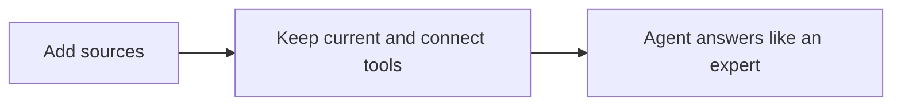

## Run it from your AI assistant

<Headless>
  * What does our partner agreement say about renewals?
  * Summarize the latest product release notes for partners.
  * Which onboarding docs cover certification?
</Headless>

## Going deeper

<CardGroup>
  <Card title="How to" icon="screwdriver-wrench" href="./technical">
    Setup, configuration, and all how-to guides.
  </Card>

  <Card title="API reference" icon="code" href="/general/introduction">
    Integration surface and code.
  </Card>
</CardGroup>

**Works with**

<CardGroup>
  <Card title="Partner Support Agent" icon="robot" href="/features/ai/partner-support">
    Grounds the partner support agent's answers.
  </Card>

  <Card title="Deal Coaching" icon="robot" href="/features/ai/deal-coaching">
    Feeds the deal coach the same curated sources.
  </Card>

  <Card title="Asset Library" icon="folder-open" href="/features/content/asset-library">
    Indexes your library so answers cite real content.
  </Card>

  <Card title="MCP" icon="code" href="/features/developer/mcp">
    Extends the agents with custom context and live tools.
  </Card>
</CardGroup>

---

# Knowledge Base
Source: https://docs.introw.io/features/ai/knowledge-base/technical/index

Add live-updated websites, snippets, and documents, and connect MCP servers to ground Introw's partner support, deal coaching, and content agents.

## Where it lives

Knowledge Base lives at [Agent knowledge base](https://app.introw.io/ai-agents/knowledge).

<Frame>
  
</Frame>

## Before you start

| You need                          | Why                              | Fix it                                                                                   |
| --------------------------------- | -------------------------------- | ---------------------------------------------------------------------------------------- |
| The partner support agent enabled | The knowledge base feeds it      | [Launch the agent](/features/ai/partner-support/guides/launch-the-partner-support-agent) |
| AI agent write access             | To add and remove sources        | [Internal roles](/features/access/team-management/guides/create-an-internal-role)        |
| The MCP module, for MCP sources   | Only needed for that source type | **Request access**                                                                       |

## How it works

The knowledge base lives on the agent's **Knowledge base** tab. It has sections for **Websites**,
**Snippets**, **Documents**, and an **MCP Server** connection, plus a read-only **Portal Content**
summary of what the agent uses automatically. A website is stored as a trusted domain and searched
live while the agent answers, so there is nothing to index and nothing to refresh; snippets are short
question-and-answer pairs; documents are PDFs marked as agent knowledge. The agent retrieves the most
relevant pieces when answering.

### How an answer is assembled

Every question runs the same path, and knowing it tells you which source to fix when an answer is
wrong.

1. **Snippets first.** If the question closely matches a snippet's question, the agent answers with
   that snippet's response, translated into the language the partner wrote in, instead of composing
   its own answer.
2. **Then retrieval.** Otherwise the agent searches your portal content, uploaded documents, and
   announcements, and at the same time runs a live search restricted to the domains on your
   **Websites** list. With no websites listed, no web results are used at all: the search never falls
   back to the open web.
3. **Then ranking.** The candidates are reranked for relevance and only the top ones are passed into
   the answer, so a source competing with better-matching content may not be used even though it is
   in the knowledge base.
4. **Then the answer.** The agent answers from what it used. Websites, portal assets and course
   sections it used appear as sources under its reply. Uploaded documents never do.

### What partners see of your sources

The agent cites its sources, and a partner can open them. A website source links to the page, a
portal asset links to the asset, and a course section names the section and its course. Uploaded
documents are the exception: the agent answers from them without naming them, linking them or saying
"according to the document", and they never appear under **Sources**. They are still org-wide agent
knowledge rather than partner-scoped content, so every partner can get answers from what they say.
Only upload material you are willing to have a partner read in an answer, and keep internal-only
wording out of it. A document's name is hidden, but a name or title repeated inside its text can still
come through.

### Portal content used automatically

Beyond what you upload, the agent automatically draws on each partner's own portal content,
announcements, tiers, commission, assets, CRM objects, and goals and KPIs, without you adding it as a
source. This data is always scoped to what the requesting partner can access, so a partner can only
ever get answers about their own program data and the agent never leaks one partner's information to
another. Segmentation counts: an asset, tab, or form hidden from that partner is hidden from the
agent too, which is also why the agent can only offer a form that is actually in that partner's
experience. The **Portal Content** tab simply shows which of these sources are in play; it is
read-only.

### Shared across agents

The sources you curate here are not limited to one agent. The same knowledge base grounds the partner
support agent and Introw's other agents (for example the agents behind deal coaching, channel
conflict, and content generation), so content you add once is reused everywhere an agent needs it.
Each agent still applies the per-partner scoping above, so broader reuse never widens what an
individual partner can see.

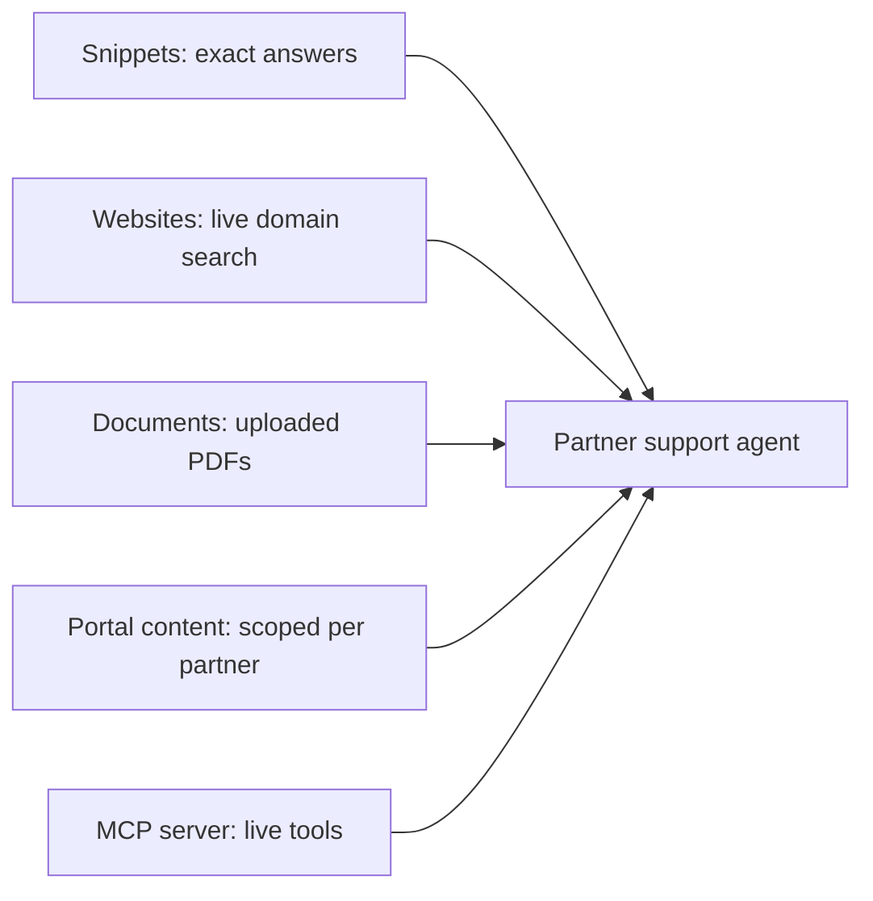

## Settings & configuration

The knowledge base is managed at [Agent knowledge base](https://app.introw.io/ai-agents/knowledge).

### Websites

Add a website URL and Introw stores its domain as a trusted source. The path is not kept: adding
`https://acme.com/partners/program` allows the whole `acme.com` domain. The agent searches those
domains live at answer time, so new and edited pages are available immediately and there is no
index to rebuild.

### Snippets

Write a snippet as the question a partner asks (up to 125 characters) and the answer you want given.
On a close match, that response becomes the answer, so keep it complete on its own and keep one
snippet per question. Snippets are also the fastest correction: add one the moment you see a bad
answer, rather than waiting for the knowledge base to catch up.

### Documents

Upload a PDF as agent knowledge, for program material that is not on a website you connected. Skip
what is already in the asset hub: the agent reads each partner's own assets automatically, so
re-uploading them here only duplicates them. Documents are available to every partner, who get answers
from them without seeing the document named or linked, so treat their content as publishable.
The agent reads the PDF's text layer. PDFs saved by current tools are read in full; a scanned PDF with
no text layer gives the agent nothing to read, so run it through OCR before you upload it.

### Portal content

The agent automatically uses portal-scoped data such as tiers, commissions, and assets; this section
explains that and is read-only.

### MCP server

Connect an MCP server to give the agent live tool access. This requires the MCP connection module.

## How-to guides

<Rail>
  * 

    [**Connect an MCP server**](/features/ai/knowledge-base/guides/connect-an-mcp-server)

    Give the partner support agent live tools by connecting your own MCP server, so it can fetch real-time data and take actions beyond your static knowledge base.

  * 

    [**Fill the knowledge base**](/features/ai/knowledge-base/guides/fill-the-knowledge-base)

    Ground Introw's AI agents by connecting live-updated websites, adding text snippets for specific answers, and uploading PDF documents to reference.
</Rail>

## Troubleshooting

<Warning>
  Websites are searched live, so a connected site is never out of date, but a page has to be publicly reachable to be found. Portal-scoped data is always restricted to what each partner can access, so the agent never leaks one partner's data through the knowledge base. Uploaded documents are the exception to per-partner scoping: they are org-wide agent knowledge. MCP connections require the MCP connection module on your plan.
</Warning>

<AccordionGroup>
  <Accordion title="A website's content is missing">
    The page is not publicly reachable, or its domain is not on the **Websites** list. Only the domain
    is stored, so check the domain rather than the exact URL you added.
  </Accordion>

  <Accordion title="The agent ignores a document">
    Confirm the PDF is marked as agent knowledge, that it has a text layer (a scanned PDF has nothing
    for the agent to read), and that better-matching content is not outranking it. Asking about a phrase
    that only appears in that document is the quickest way to tell these apart.
  </Accordion>

  <Accordion title="The agent answers from a document partners should not see">
    Uploaded documents are agent knowledge for the whole organisation. The agent does not name or link
    them, but it does answer from them. Delete it, restrict the asset, or move the content into a snippet.
  </Accordion>

  <Accordion title="A snippet is not used">
    The partner phrased the question differently from the snippet's question, or another snippet
    covers the same question. Rewrite the question the way partners ask it, and keep one snippet per
    question.
  </Accordion>

  <Accordion title="MCP cannot be connected">
    The MCP connection module is not enabled on your plan.
  </Accordion>
</AccordionGroup>

---

# Launch the partner support agent
Source: https://docs.introw.io/features/ai/partner-support/guides/launch-the-partner-support-agent

Enable the partner support agent, give it a name, instructions, welcome message, and logo, test it, surface it in the portal, and monitor real conversations.

The partner support agent answers partner questions around the clock, in their language, grounded in your knowledge base and scoped to what each partner can see. Launching it is one job: enable it, shape its identity and instructions, test it against real questions, surface it in the portal, then watch the first conversations to confirm it is helping. Do this when partner questions outpace your team and you want a consistent, on-brand first response instead of a growing inbox.

## What you'll achieve

A live partner support agent: named, branded, instructed within your guardrails, tested, visible to partners in the portal, and producing conversations you can review. Partners get instant, scoped answers; your team only handles what the agent escalates.

## Before you start

<Steps>
  <Step title="Fill the knowledge base first">
    The agent answers from your knowledge base, so populate it before launch. See [Fill the knowledge base](/features/ai/knowledge-base/guides/fill-the-knowledge-base). An agent with no knowledge gives thin answers.
  </Step>

  <Step title="Confirm the module and access">
    The AI Agent module is on by default. You need AI agent write access to configure the agent.
  </Step>

  <Step title="Have your branding ready">
    Have the agent name, a square logo image (around 200×200, up to 5MB), and a sense of the tone and rules you want before you start writing.
  </Step>
</Steps>

## Watch it

<Tabs>
  <Tab title="Video">
    <video />
  </Tab>

  <Tab title="Click through">
    <iframe />
  </Tab>
</Tabs>

## Steps

### Configure the agent

<Steps>
  <Step title="Open the agent configuration">
    Go to [Partner Support Agent](https://app.introw.io/ai-agents/partner-support/configure). This is the **Configure & Test** tab, where you set up the agent on the left and chat with it on the right.

    <Frame>
      
    </Frame>
  </Step>

  <Step title="Set identity and instructions">
    Work through each field:

    * **Enable Agent** - the master switch that turns the agent on for your organization. Turning it on (you will confirm in a dialog) is what makes the agent available to partners, so leave it off until you have tested. You can come back and enable it after the test step.
    * **Logo** - the image partners see in the chat. Upload one so the agent feels like part of your brand rather than a generic bot. It renders in a small square avatar and is cropped to fill, so use a **square image around 200×200**, PNG or JPG, up to 5MB - a wide logo loses its sides. Leave it empty and the agent falls back to your company's square logo.
    * **Agent Name** - what partners see the agent called in the chat. Use a name that fits your program (for example "Acme Partner Assistant"). If you already run an internal assistant with a name and an avatar, reuse them here so partners meet one assistant rather than two. Leave it empty and it is called "AI Agent".
    * **Instructions** - the system instructions that shape how the agent answers: its tone, what it should and should not do, when to escalate, and any house rules. This is your main lever for keeping answers on-brand and within guardrails, so be specific about scope and escalation.
    * **Welcome message** - the first message partners see when they open the chat. Use it to set expectations (what the agent can help with) and invite the first question.

    <Frame>
      
    </Frame>
  </Step>

  <Step title="Let it save">
    Configuration saves itself. Each field is written when you leave it and a toast confirms it, so there is no save button to look for.
  </Step>
</Steps>

### Test before partners do

<Steps>
  <Step title="Chat in the test panel">
    On the right side of **Configure & Test**, select a partner at the top of the panel, then ask the agent the real questions partners ask. The partner you pick decides what is in scope: their portal, their assets, their CRM records. Confirm it answers from your knowledge base, holds the tone you set, and escalates where it should.

    The panel knows you are the partnership manager, so it will not refer you to a partner manager and it will not refuse an action on permission grounds. Ask the same questions from a partner portal when you want to see exactly what a partner gets.

    <Frame>
      
    </Frame>
  </Step>

  <Step title="Refine and re-test">
    If an answer is wrong or thin, tighten the **Instructions** or add to the knowledge base, then ask again. Repeat until the agent is reliable on your common questions. [Train and improve the agent](./train-and-improve-the-agent) covers which lever to reach for, and how to pin an exact answer with a snippet.
  </Step>

  <Step title="Enable the agent">
    Once you are happy, turn on **Enable Agent** and confirm. The agent is now live for partners.
  </Step>
</Steps>

### Surface it and monitor

<Steps>
  <Step title="Confirm it appears in the portal">
    With the agent enabled, partners can reach the agent in their partner portal, no separate publishing step is required. Open a partner portal to confirm the assistant is there. Use your portal experience to position where partners discover it.
  </Step>

  <Step title="Review conversations">
    Switch to the **Conversations** tab to see real conversations: where each came from (Portal, Slack, Teams, or MCP), the questions asked, and the outcome each partner rated with a thumbs up or thumbs down. Use this to spot gaps and keep improving instructions and knowledge.
  </Step>
</Steps>

## Verify it worked

Open a partner portal as a partner: the AI assistant is available, and the agent greets them with your welcome message and answers a real question correctly and in scope. Back in **Conversations**, that conversation appears with its source and any feedback. If the assistant is missing, confirm **Enable Agent** is on; if answers are thin, add to the knowledge base.

## Related

<CardGroup>
  <Card title="Train and improve the agent" icon="book-open" href="./train-and-improve-the-agent">
    Keep its answers correct once partners are using it.
  </Card>

  <Card title="Use the agent in Slack" icon="book-open" href="./use-the-agent-in-slack">
    Let partners reach the agent from Slack.
  </Card>

  <Card title="Fill the knowledge base" icon="book-open" href="/features/ai/knowledge-base/guides/fill-the-knowledge-base">
    Ground the agent in your content.
  </Card>

  <Card title="Implementation reference" icon="screwdriver-wrench" href="../technical">
    Settings, channels, security, and limits.
  </Card>
</CardGroup>

---

# Train and improve the agent
Source: https://docs.introw.io/features/ai/partner-support/guides/train-and-improve-the-agent

Teach the partner support agent with knowledge sources, instructions, and snippets, then use partner feedback and conversation history to keep its answers correct.

Training the partner support agent is not model training.
You never tune a model, and Introw never trains one on your content or your partners' questions.
You change the sources the agent may read, the instructions it follows, and the snippets that pin an exact answer.
Every change applies to the next question a partner asks, apart from a freshly uploaded document, which takes a moment to process first.
Do this before launch to get the common questions right, then run the same loop every week or two to keep the agent accurate as your program changes.

## What you'll achieve

An agent whose answers you can predict: correct where your content covers the question, word-for-word where the wording matters, and routed to a person where it should not answer at all.
Plus a repeatable loop, based on real partner conversations and partner feedback, for fixing the answers that come out wrong.

## Before you start

<Steps>
  <Step title="The agent is configured">
    You have run through [Launch the partner support agent](./launch-the-partner-support-agent) at least once, so the agent has a name, instructions, and a welcome message.
  </Step>

  <Step title="You know the questions partners actually ask">
    Pull the last quarter of partner emails, tickets, or shared-channel threads and group them by topic.
    That list is what you are training against, and it decides which of the levers below you reach for.
  </Step>

  <Step title="You have AI agent write access">
    Managing sources and instructions needs write access on the AI agent.
    See [Internal roles](/features/access/team-management/guides/create-an-internal-role).
  </Step>
</Steps>

## The levers you have

Each lever answers a different kind of problem, and reaching for the wrong one is the usual reason an answer stays wrong.

| Lever                                                                   | Reach for it when                                                               | What the agent does with it                                                                           |
| ----------------------------------------------------------------------- | ------------------------------------------------------------------------------- | ----------------------------------------------------------------------------------------------------- |
| [Websites](/features/ai/knowledge-base/guides/fill-the-knowledge-base)  | The answer is already public on a site you maintain                             | Searches those domains live while it answers, and links the page it used                              |
| [Documents](/features/ai/knowledge-base/guides/fill-the-knowledge-base) | The answer lives in program material that is not on your site                   | Answers from the PDF's content for any partner, without naming or linking the document                |
| [Snippets](/features/ai/knowledge-base/guides/fill-the-knowledge-base)  | One question needs one exact answer, every time                                 | Replaces its own answer with your text when the question matches                                      |
| **Instructions**                                                        | The content is right but the behaviour is not: tone, scope, routing, escalation | Follows them on every conversation, on top of Introw's own rules                                      |
| [MCP server](/features/ai/knowledge-base/guides/connect-an-mcp-server)  | The answer is live data in your own systems                                     | Calls your tools while answering                                                                      |
| Portal content                                                          | Never: it is automatic                                                          | Reads each partner's own assets, announcements, tier, commission, goals, tasks, forms and CRM records |

Portal content is the one you do not curate.
The agent sees exactly what the partner asking would see if they logged in, so whatever segmentation hides from them is hidden from the agent too, without any setup on your side.
That also means a form, an asset, or a tab that is not in that partner's experience does not exist for the agent either.

## What Introw already enforces

These rules are built into the agent and hold regardless of what you write in **Instructions**, so do not spend your instructions on them:

* **It answers from your knowledge, not from the open web.** Live web results come only from the domains on your **Websites** list, and the agent names the documents and pages it used.
* **It does not invent.** Commission answers come from the commission tool rather than its own arithmetic, and a resource is only ever linked with a real URL returned by a tool.
* **It hands off instead of guessing.** When your content does not cover the question, the agent points the partner at their partner manager, whose name, email, and meeting link are already in its context.
* **It stays on your program.** Questions outside partner-program topics get one sentence saying so, plus a short list of what it can help with.
* **It answers in the partner's language**, whatever language your content is written in.

Your instructions sit on top of those rules.
They can add routing, tighten scope, and set tone.
They cannot loosen the rules above, and you cannot delete the hand-off behaviour by leaving the field empty.

<Note>
  Leave **Instructions** empty and the agent runs on Introw's default instructions: a concise, professional partner manager persona.
  Anything you write replaces that default, so write the whole persona, not a diff against it.
</Note>

## Write the instructions

Instructions are the right place for the things only you know: how you want the agent to sound, what it must never discuss, and where a question should go when the agent is not the answer.

Keep them short and specific.
A long essay competes with itself, and every extra rule is another thing the agent has to weigh mid-answer.

<CodeGroup>
  ```text Instructions theme={"theme":{"light":"github-light","dark":"github-dark"}}
  You are the partner assistant for Acme's reseller and referral partners.
  Keep answers short, factual, and focused on the next step.

  Routing:
  - Anything about pricing or discounts: point to acme.com/pricing and offer to loop in their partner manager. Never quote a price or a discount yourself.
  - Anything broken, failing, or blocking a customer: tell them to email partnersupport@acme.com, and offer to summarise the issue for them to paste in.
  - Contract, legal, or agreement questions: hand off to their partner manager.

  Never speculate about the roadmap or release dates.
  ```
</CodeGroup>

Two habits keep this maintainable.
Write routing as a rule with a destination, so the agent has somewhere to send the partner rather than a topic it must avoid.
And when you want the partner manager's actual name and email in the reply, say "their partner manager" and let the agent fill it in: that context is already there, per partner.

## Pin an exact answer with a snippet

A snippet is a question and the answer you want given to it.
When a partner's question is a close match, the agent replies with your text instead of composing its own answer, translated into the language the partner wrote in.
That makes snippets the tool for anything that has to come out the same way every time: how support is requested, what you will and will not say about pricing, a policy line your legal team approved.

How to write one that fires:

* **Phrase the question the way a partner would ask it.** The match is semantic, not keyword-based, but it is deliberately tight, so "How do I raise a support request?" matches a partner asking about support far better than a bare topic word like "Support".
* **Keep the question under 125 characters.** That is the field limit, and it keeps the match focused.
* **Make the response complete on its own.** It is the whole answer, so include the link or the address the partner needs.
* **Keep one snippet per question.** Two snippets covering the same question compete, and only one of them is used.

Snippets also fix the case where the agent answers the wrong thing confidently.
If a partner asks for a support form you do not have, the agent will reach for the nearest thing it can see, which may be an unrelated form in their portal.
A snippet on that question removes the guesswork and states the real route.

<Tip>
  Instructions or a snippet?
  Use instructions when you want flexibility and per-partner detail, like the manager's own email.
  Use a snippet when you want control of the wording.
  Doing both for the same question is fine: the snippet decides the answer, the instruction covers the phrasings that do not match it.
</Tip>

## Test it the way a partner will

The test panel on **Configure & Test** runs against a real partner.
Pick one in the selector at the top of the panel, and the agent answers with that partner's portal, assets, and CRM records in scope.
Use the reset button to start a clean conversation between attempts.

Two differences from what a partner gets, worth knowing before you trust a test:

* The agent knows you are the partnership manager, so it will not tell you to contact a partner manager and it will not refuse an action on permission grounds.
  To see the real hand-off wording, ask the same question from the partner's own portal.
* Testing as a team member gives the agent manager-only tools, such as partner performance and business reviews, that a partner never has.

Then work the loop: ask, read the answer, fix at the lever that owns the problem, ask again.
Configuration saves as soon as you leave a field, and knowledge changes apply to the next question, so there is nothing to publish between attempts.

## Improve from real conversations

Once partners are using the agent, the **Conversations** tab is where you find the answers to fix.
It counts conversations, unique partners, and positive and negative outcomes, and lists every conversation with its partner, a summary, its source (Portal, Slack, Teams, or MCP), its outcome, and its date.

Outcomes come from your partners: they mark an answer with a thumbs up or thumbs down in the chat.
That is the quality signal, so it only exists where partners bothered to rate.

<Steps>
  <Step title="Filter for negative outcomes">
    Sort out the thumbs-down conversations first, then skim the unrated ones for questions the agent clearly missed.
  </Step>

  <Step title="Diagnose which lever failed">
    A thin or hedged answer is missing content: add a website, a document, or a snippet.
    A confident wrong answer is usually competing content or a missing route: fix it with a snippet.
    An answer that is correct but sounds wrong, or that should have been handed to a person, belongs in instructions.
    An answer that needed today's data from your systems needs an MCP tool.
  </Step>

  <Step title="Fix it, then re-ask the original question">
    Ask the exact question from the conversation in the test panel, with the same partner selected, and confirm the new answer.
  </Step>

  <Step title="Review snippets on a schedule">
    Websites stay current on their own, but a snippet says whatever it said the day you wrote it.
    Re-read them quarterly and delete the ones that have aged out, such as a finished promotion.
    Re-upload a document when its PDF changes: uploading a file does not keep it in sync with the original.
  </Step>
</Steps>

<Warning>
  Documents are org-wide agent knowledge, not partner-scoped content.
  Every partner can get answers from an uploaded PDF unless you restrict the asset itself.
  The agent never names or links the document and leaves it out of the **Sources** row, but it does answer from what the document says.
  Upload only material you are willing to have a partner read in an answer, and put anything internal into a snippet as a written answer instead.
</Warning>

## Turn it off, safely

The **Enable Agent** toggle is a switch, not a reset.
Turning it off during a pilot removes the agent from your partners' portals and leaves your instructions, snippets, and sources exactly as they are, so you can keep working on answers and turn it back on when it is good enough.

## Verify it worked

Ask your ten most common partner questions in the test panel, with a real partner selected, and every answer is either correct or a clean hand-off with somewhere to go.
Then check the same questions from a partner portal, where the hand-off wording is the one partners actually see.
A week later, **Conversations** shows positive outcomes and the negative ones are questions you had not seen before rather than the ones you already fixed.

## When to ask Introw

Every conversation is traced end to end: the tools the agent called, the sources it retrieved, and the prompt it ran on.
If answers are inconsistent between two runs of the same question, or a source you added is clearly never used, send your Introw contact the partner and the question and they can read the trace and tell you which layer went wrong.

## Related

<CardGroup>
  <Card title="Fill the knowledge base" icon="book-open" href="/features/ai/knowledge-base/guides/fill-the-knowledge-base">
    Add the websites, snippets, and documents the agent answers from.
  </Card>

  <Card title="Launch the partner support agent" icon="book-open" href="./launch-the-partner-support-agent">
    Name it, instruct it, test it, and turn it on.
  </Card>

  <Card title="Connect an MCP server" icon="book-open" href="/features/ai/knowledge-base/guides/connect-an-mcp-server">
    Give it live data and actions from your own systems.
  </Card>

  <Card title="AI security" icon="shield-halved" href="/features/ai/security">
    What the agent may reach, and what happens to the data it reasons over.
  </Card>
</CardGroup>

---

# Use the agent in Slack
Source: https://docs.introw.io/features/ai/partner-support/guides/use-the-agent-in-slack

Connect Slack and map partners to shared channels so the Introw partner support agent answers partner questions where your partners already work.

Many partners live in Slack, not the portal. When Slack is connected and a partner is mapped to a shared channel, the partner support agent answers their questions right in that channel, still scoped to what that partner is allowed to see. Set this up when you want to meet partners where they already work and cut down the "can you log into the portal" friction.

## What you'll achieve

A connected Slack workspace with partners mapped to shared channels, so partners get scoped AI answers in Slack without opening the portal.

## Before you start

<Steps>
  <Step title="Connect Slack">
    The Slack integration must be connected first. See the [Slack integration](/features/integrations/chat).
  </Step>

  <Step title="Enable the partner support agent">
    The agent must be on. See [Launch the partner support agent](./launch-the-partner-support-agent).
  </Step>
</Steps>

## Steps

<Steps>
  <Step title="Open Integrations">
    Go to [Settings - Integrations](https://app.introw.io/settings/integrations) and open your connected **Slack** integration.
  </Step>

  <Step title="Map partners to shared channels">
    In the channel mapping, connect each partner to the **shared Slack channel** you use with them. Mapping is what ties a channel to a specific partner, which is how the agent knows whose data it may use when it answers there, so map every partner who should get Slack support.
  </Step>

  <Step title="Tell partners how to reach the agent">
    In a mapped shared channel, partners get partner support without a separate switch to flip. Let them know they can ask their questions in that channel and the agent will respond, scoped to their account.
  </Step>
</Steps>

<Note>
  Introw does not currently expose a separate on/off toggle for the Slack agent in Settings. Once Slack is connected and a partner is mapped to a shared channel, the agent is available in that channel by default, there is no extra control to enable.
</Note>

<Note>
  In Slack, partners reach the agent by mentioning the Introw app. The name and logo you configured apply to the portal chat; the mention in a Slack channel stays the Introw app, and aliasing it to your own brand is not possible today. Say so when you tell partners how to reach it.
</Note>

## Verify it worked

In a shared channel mapped to a partner, ask the agent a question as that partner would. It responds with a correct answer scoped to that partner's data, and the exchange shows up under the agent's **Conversation History** with Slack as the source.

<Frame>
  
</Frame>

## Related

<CardGroup>
  <Card title="Launch the partner support agent" icon="book-open" href="./launch-the-partner-support-agent">
    Enable, configure, and test the agent.
  </Card>

  <Card title="Train and improve the agent" icon="book-open" href="./train-and-improve-the-agent">
    Keep its answers correct across every channel.
  </Card>

  <Card title="Slack integration" icon="book-open" href="/features/integrations/chat">
    Connect and manage Slack.
  </Card>

  <Card title="Implementation reference" icon="screwdriver-wrench" href="../technical">
    Channels, scoping, and limits.
  </Card>
</CardGroup>

---

# Partner Support Agent
Source: https://docs.introw.io/features/ai/partner-support/index

An AI agent that answers partner questions 24/7 across the portal, Slack, Teams, WhatsApp, and email, deflecting tickets and acting in your CRM.

> Partners ask the same questions over and over, and your team answers them one at a time. The partner support agent answers instantly, around the clock, in any language, and can take action on the partner's behalf, so your team stops being a help desk.

## The problem it solves

Partner support does not scale by adding people:

<Pains>
  | Without Introw                     | With Introw                  |
  | ---------------------------------- | ---------------------------- |
  | The same questions flood your team | Answered instantly, at scale |
  | Partners wait hours for an answer  | Seconds, around the clock    |
  | Support is English-only, 9 to 5    | Any language, any hour       |
  | Answering is talk, not action      | It registers and updates too |
</Pains>

## Impact

Partners judge responsiveness above almost everything. Answering in seconds, in their language, at whatever hour they are working, is a standard most vendors simply cannot meet.

<Impact>
  for your business

  * **AI, not admin**
    The agent deflects the routine questions and takes scoped actions, so your team stops being a help desk
  * **No new tool**
    It runs in the portal, Slack, Teams, WhatsApp, email, and partners' own AI assistants over MCP

  for your partners

  * **Self-serve**
    An answer in seconds, grounded in your own content, without opening a ticket with anyone
  * **Enabled**
    It answers from your websites, snippets and documents, plus their tiers, commissions and assets
  * **Efficient**
    It can register the deal or pull their commission status, not just describe how to

  [A day in the life of your partners](/days-in-the-life)
</Impact>

<Personas>
  * **Partner Operations** - the agent configured and live
  * **Partner Marketing** - its tone and its content
  * **Partners** - answers in seconds, any hour
</Personas>

## See it work

<Tour>
  * 

    **Open the agent**

    Configure and test it in the same place.

  * 

    **Give it an identity**

    Name, logo, instructions and a welcome message.

  * 

    **Test before launch**

    Chat with it yourself, refine, and try again.
</Tour>

## How it works

The partner support agent answers partner questions using a knowledge base you control and live
portal data. It runs wherever partners already work: the partner portal, Slack, Microsoft Teams,
WhatsApp, email, and partners' own AI assistants over MCP. Partners can even run it from their own
systems through [Partner Connect](/features/partner-connect), so support meets them without a portal
login. Because it draws on your websites, snippets, documents, and portal-scoped data like tiers,
commissions, and assets, its answers are accurate and specific to your program.

It does more than answer. The agent can take action, scoped to each partner's permissions:
registering a deal, updating a CRM record, surfacing the right asset, or pulling a partner's
commission status. You configure its name, instructions, welcome message, and branding, test it
before launch, and turn it on for the portal in a few clicks.

The partner support agent turns repetitive support into self-serve. Configure it once, point it at
your knowledge, and partners get instant, accurate, actionable help wherever they are, freeing your
team for the work that needs a human.

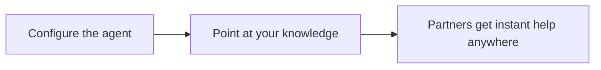

## Run it from your AI assistant

<Headless>
  * What's our deal registration process?
  * How do partners request MDF?
  * Where do I find the latest sales deck?
</Headless>

## Going deeper

<CardGroup>
  <Card title="How to" icon="screwdriver-wrench" href="./technical">
    Setup, configuration, and all how-to guides.
  </Card>

  <Card title="API reference" icon="code" href="/general/introduction">
    Integration surface and code.
  </Card>
</CardGroup>

**Works with**

<CardGroup>
  <Card title="Knowledge Base" icon="robot" href="/features/ai/knowledge-base">
    Answers come from your knowledge base.
  </Card>

  <Card title="Slack & Teams" icon="plug" href="/features/integrations/chat">
    Partners ask the agent in Slack or Teams.
  </Card>

  <Card title="MCP" icon="code" href="/features/developer/mcp">
    Give partners the agent in their own AI client.
  </Card>

  <Card title="Partner Connect" icon="circle-nodes" href="/features/partner-connect">
    Partners run the agent from their own tools and systems.
  </Card>
</CardGroup>

---

# Partner Support Agent
Source: https://docs.introw.io/features/ai/partner-support/technical/index

Enable, configure, brand, test, and surface the Introw partner support agent across the portal, Slack, Teams, WhatsApp, and email channels.

## Where it lives

Partner Support Agent lives at [Partner Support Agent](https://app.introw.io/ai-agents/partner-support/configure).

<Frame>
  
</Frame>

## Before you start

| You need                | Why                         | Fix it                                                                                |
| ----------------------- | --------------------------- | ------------------------------------------------------------------------------------- |
| The AI Agent module     | On by default on your plan  | **Request access**                                                                    |
| AI agent write access   | To configure and launch it  | [Internal roles](/features/access/team-management/guides/create-an-internal-role)     |
| Knowledge sources added | The agent answers from them | [Fill the knowledge base](/features/ai/knowledge-base/guides/fill-the-knowledge-base) |

## How it works

The partner support agent is managed under AI Agent, on the Partner Support Agent pages, which carry
four tabs. **Conversations** lists what partners have asked, with the outcome they rated. **Configure
& Test** is where you enable the agent, name it, write its instructions, set a welcome message, and
upload a logo, then chat with it to test. **Data Access & Privacy** states, source by source, what
the agent may reach. **Knowledge base** is where you manage what it knows, shared with Introw's other
agents.

Once enabled, partners see an **AI** tab in the partner portal automatically, and you use the portal
experience to position where they discover it. The same agent also answers in Slack, Teams, email, and
through MCP-connected assistants. It can take action through tools, scoped to each partner's
permissions.

When a partner asks it to change a deal, the agent goes through the custom action button you
configured on the shared pipeline, such as **Move to next stage**, and only offers a button whose
visibility conditions match that deal. The button's approvals and automations apply to the agent
exactly as they do to the partner. When no button applies, it offers to leave a comment instead. This
holds in the portal and for assistants connected through Partner Connect.

When a partner registers a deal or shares a lead through the agent on a form that accepts
submissions automatically, the agent waits for the CRM write before it replies. If your CRM rejects
the record, the partner is told it did not go through and that their partner manager can take it
from there, with a link to the submission. If the write is still running, the partner hears that the
submission was received and is still processing. A form that needs your approval first confirms the
submission straight away, because nothing reaches the CRM until you accept it.

### Channels and runtime

The agent reaches partners across several surfaces. In the portal, the AI tab appears when the agent
is enabled. In **Slack** and **Teams**, the agent answers in a shared channel once that channel is
mapped to a partner under **Settings - Integrations**; the mapping is what tells the agent whose data
it may use. There is no separate per-integration on/off toggle for the Slack agent in Settings today,
once Slack is connected and a partner is mapped, the agent is available in that channel by default.
The agent also responds over email and through assistants connected via MCP.

In Slack and Teams, partners reach the agent by mentioning the Introw app itself. The name and logo
you configure apply in the portal chat; the mention in a chat channel stays the Introw app, and
aliasing it to your own brand is not possible today.

On **WhatsApp**, partners message a shared Introw number and the agent replies, recognizing each
partner by the phone number on their CRM contact record. WhatsApp is a paid add-on: your Introw
account manager enables it and provisions the number, so there is nothing to connect yourself. It is
an inbound channel for reaching the agent, not a channel for outbound notifications or announcements.

### What it does when it cannot answer

Some behaviour is built into the agent and holds whatever you write in **Instructions**, so you do
not have to specify it: it answers from your knowledge rather than the open web, names the pages and
portal assets it used (never an uploaded knowledge-base document, which it answers from without naming), takes commission figures from the commission tool instead of calculating them,
links a resource only with a real URL, and answers in the language the partner wrote in. When your
content does not cover the question, it hands the partner to their own partner manager, whose name,
email, and meeting link are already in its context.

Your instructions are added on top of those rules. They can add routing (a support address, a form,
a different escalation path), tighten scope, and set tone, but they cannot remove the hand-off. To
send partners somewhere other than their partner manager, name that destination in **Instructions**,
or pin the exact wording with a snippet. See [Train and improve the
agent](/features/ai/partner-support/guides/train-and-improve-the-agent).

### Security and scoping

The agent is safe to put in front of partners by design. It answers only from the knowledge you give
it (websites, snippets, documents, MCP tools) plus portal content, so it does not improvise from
outside sources. Every answer and every action is scoped to the requesting partner's permissions, so a
partner can never see another partner's data through the agent, regardless of channel. Actions the
agent can take run within those same permissions, and your **Instructions** set the guardrails for
tone, scope, and when to escalate to a human. Test as a partner persona before launch to confirm the
boundaries hold.

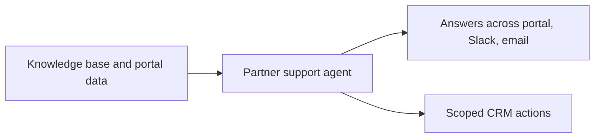

## Settings & configuration

The agent is configured at [Partner Support Agent](https://app.introw.io/ai-agents/partner-support/configure).

Configuration saves itself: every field is written when you leave it, confirmed by a toast, so there
is no save button to look for.

### Enable the agent

Use the Enable Agent toggle to turn the agent on for your organization. Turning it off removes the
agent from your partners' portals and keeps everything you configured, so a pilot can be paused and
resumed.

### Agent name

Set the agent's name; partners see this in the chat.

### Instructions

Write the system instructions that shape how the agent answers, its tone, scope, and any rules. Leave
the field empty and Introw's default instructions apply, a concise professional partner-manager
persona, so anything you write replaces that default rather than adding to it.

### Welcome message

Set the introduction message partners see when they open the chat.

### Suggested prompts

Configure the prompts the agent offers as one-click starters. Each is a label the partner sees and the
prompt it actually sends, so you steer partners toward the questions the agent answers well and phrase
the buttons in your own terms. Replace the set entirely if the defaults do not fit your program.

### Snippets

A snippet pins a curated answer to a question, and it lives on the **Knowledge base** tab rather than
here. Where the agent's own answer is wrong, thin, or has to match approved wording, write the
question (up to 125 characters) and the response you want; on a close match the agent replies with
that response, translated into the partner's language, instead of composing its own. Snippets are the
correction loop: add one the moment you spot a bad answer instead of waiting for the knowledge base
to catch up.

### Logo

Upload a logo so the agent matches your brand. It renders in a small square avatar and is
cropped to fill, so use a square image around 200×200 (PNG or JPG, up to 5MB). With no logo set,
the agent shows your organisation's square logo.

### Configure & Test

Use the test panel to chat with the agent and confirm its answers before partners do. Select a
partner at the top of the panel first: the agent answers with that partner's portal, assets, and CRM
records in scope. It also knows you are the partnership manager, so it will not refer you to a
partner manager and it will not refuse an action on permission grounds. Ask the same question from a
partner portal when you want to see the hand-off wording a partner gets.

### Conversations

Read what partners actually asked, filtered by source (Portal, Slack, Teams, MCP) and by the outcome
partners rated with a thumbs up or thumbs down, with counts for conversations, unique partners, and
positive and negative outcomes. This is the input to the improvement loop.

### Data Access & Privacy

A read-only statement of every source the agent may reach, per source type. Use it in a partner's or
a security reviewer's questions about what the agent can see.

## How-to guides

<Rail>
  * 

    [**Launch the partner support agent**](/features/ai/partner-support/guides/launch-the-partner-support-agent)

    Enable the partner support agent, give it a name, instructions, welcome message, and logo, test it, surface it in the portal, and monitor real conversations.

  * [**Train and improve the agent**](/features/ai/partner-support/guides/train-and-improve-the-agent)

    Teach the partner support agent with knowledge sources, instructions, and snippets, then use partner feedback and conversation history to keep its answers correct.

  * [**Use the agent in Slack**](/features/ai/partner-support/guides/use-the-agent-in-slack)

    Connect Slack and map partners to shared channels so the Introw partner support agent answers partner questions where your partners already work.
</Rail>

## Troubleshooting

<Warning>
  The agent only answers as well as its knowledge base, so add sources before launching. Answers and actions are scoped to each partner's permissions, so the agent never reveals data a partner cannot access. The portal AI tab appears only for partner portals when the agent is enabled.
</Warning>

<AccordionGroup>
  <Accordion title="The agent gives vague answers">
    The knowledge base is thin; add websites, snippets, or documents.
  </Accordion>

  <Accordion title="Partners do not see the agent">
    The agent is not enabled, or not added to the portal experience.
  </Accordion>

  <Accordion title="The agent will not act">
    The partner lacks permission for the action requested.
  </Accordion>

  <Accordion title="It answers with the wrong form or the wrong asset">
    The agent can only offer what is in that partner's experience, so it reaches for the nearest
    thing it can see. Add the real route as a snippet, or put the form in their experience.
  </Accordion>

  <Accordion title="An answer looks nothing like the last one">
    Ask your Introw contact to read the conversation's trace: the tools called, the sources
    retrieved, and the prompt used are recorded for every conversation.
  </Accordion>
</AccordionGroup>

---

# AI Security
Source: https://docs.introw.io/features/ai/security/index

Where Introw's AI runs, what it can reach, and what happens to the data it reasons over: prompts kept out of retention and out of training, and access scoped to the person asking.

AI Security is the answer to the questions a security review asks before your partner program is allowed to use AI at all: where it runs, what it can reach, and what happens to the data it reasons over.

> Turning AI on should not cost you a quarter of legal review.
> Introw's agents read only what the person asking may already see, and every model call leaves through one gateway that keeps your prompts out of retention and out of training.

## The problem it solves

Four questions decide whether AI ever reaches your partner data:

<Pains>
  | Without Introw                          | With Introw                         |
  | --------------------------------------- | ----------------------------------- |
  | You cannot say where prompts end up     | Prompts are not kept or trained on  |
  | A partner's question reaches other data | Each answer stops at their own data |
  | You cannot tell what the AI reads       | You choose what it reads            |
  | AI acts with nobody checking            | You approve what matters            |
</Pains>

## Impact

The AI that actually ships is the AI a reviewer can sign off in an afternoon. Everything on this page is written to be handed to that reviewer.

<Impact>
  for your business

  * **Enterprise**
    A SOC 2 Type 2 report, an ISO/IEC 27001:2022 certification, a GDPR programme, and your data hosted on AWS in Europe
  * **Trustworthy**
    Model providers must drop your prompts on completion and never train on them, enforced at one gateway rather than feature by feature
  * **In your CRM**
    The agents read your CRM through the permissions of the person asking, and write back through the same audited paths your team uses

  for your partners

  * **Self-serve**
    A partner gets their answer in seconds, and nobody else in your program sees the deal they asked about
  * **Enabled**
    Their own security team gets a straight answer too, because the same posture covers the assistant your partners talk to

  [A day in the life of your partners](/days-in-the-life)
</Impact>

<Personas>
  * **CRM Administrator** - scoped access, and no writes you did not authorise
  * **Partner Operations** - the switches that decide what AI may do
  * **Economic Buyer** - AI you can turn on without a legal project
  * **Partner Alliance Managers** - their data stays their own
</Personas>

## How it works

Introw runs on AWS in Europe, and your partner data is stored there.
The agents are part of the same application as the rest of Introw, on the same infrastructure, under the same access controls.
Introw holds a SOC 2 Type 2 report, is certified to ISO/IEC 27001:2022, and runs a GDPR compliance programme.
The report and the certificate themselves, the hosting regions, the subprocessor list and the retention detail are published in the [Introw Trust Center](https://trust.introw.io), which is the document to hand a security review.

Model calls leave through a single AI gateway, the Vercel AI Gateway, and the data rules are enforced there rather than in each feature.
Every agent answer, and every embedding behind the knowledge search they run on, routes only to model providers that delete prompts and responses on completion and do not train on them.
It holds for every agent in Introw, and no feature can opt out of it by omission.
Introw builds, trains and hosts no model of its own, runs no training or fine-tuning of any kind on your data, and uses no consumer-grade AI tooling: models are reached through the gateway under enterprise API terms.
The current vendor set is published on the live [subprocessor list](https://trust.introw.io/subprocessors).

An agent has no view of your data of its own.
It reads through the permissions of whoever is asking, which is what makes the partner-facing agent safe to put in front of a partner: their question is answered from their own records and the content you published to them, and another partner's deals are not reachable, on any channel.
Answers are grounded in your CRM and the sources in your [knowledge base](/features/ai/knowledge-base), so an agent does not improvise from the open internet.
When an agent takes an action, it runs through the same permissioned paths your team uses in the product and is recorded the same way, so the trail behind an AI-made change looks like the trail behind a human one.

What stays yours is the on switch and the judgment.
The partner-facing agent does nothing until you enable it, the agents that assist your team are configured one by one, and a program can run with none of them on.
Instructions set each agent's tone, scope, and the point where it escalates to a person instead of guessing.
[AI approvals](/features/ai/approvals) keep a human on the decisions you choose to keep, and every conversation is traced, so you can read back what was asked and what was answered.
Model selection is the one thing you do not configure: it sits behind the gateway rather than in a per-organisation setting, which is exactly what lets the retention rule be enforced centrally instead of negotiated feature by feature.

Two things a reviewer usually asks about late.
Partners are never users of your CRM, so no external seat, licence, or CRM login is involved in any of this.
And your CRM credentials are held outside the application in a dedicated vault, so an agent reaches your CRM through the same brokered connection the rest of Introw uses.

A request travels the same path whether it comes from a partner, your team, or an assistant over MCP:

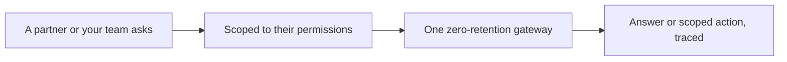

## Prompt injection and untrusted content

An agent reads text your team did not write: a partner's message, a document in the knowledge base, a page from your site, and, if you connect one, whatever your own MCP server returns.
Treating any of that as a trustworthy instruction is the actual risk, and it is the one Introw is built to remove.
An instruction hidden in content cannot widen what an agent is allowed to do, because none of the limits live in the prompt.

**The toolset is fixed.**
Each agent has one defined set of program actions: search partners, deals, tasks, submissions and activity, read commissions, funds, tiers and goals, submit a form, add a comment, create or update a task, update a CRM property, coach a deal.
There is no general-purpose web browsing and no code execution in it, and no conversation can add a tool to it.

**Authorization sits outside the model.**
Every tool call runs with the organisation, the partner, the portal and, where you scope it that way, the individual visitor's own records resolved from the authenticated session, never from anything the model or the conversation supplies.
A message that tells the agent to go and look at another partner's deals has nothing to redirect: the scope was settled before the model saw a word.

**Writes are checked again at the moment of writing.**
An agent can only change the CRM properties you made editable on that record's list.
Ask it for anything else and the write is refused with the permitted fields named, and it offers to leave a comment instead.
Submissions that need judgment sit behind [AI approvals](/features/ai/approvals), where a person decides.

**A connected MCP server stays yours.**
Introw reaches it over HTTPS with a bearer token your server issues, and your server authorizes every call, so your own rules apply on top of Introw's.
A connection cannot be saved until it passes a live test that lists the tools the server exposes, so you see exactly what you are handing the agent before you hand it over.
Delete the connection and those tools leave the agent with it.

Abuse and off-topic pressure are handled the same way, by scope rather than by a word list.
The agent's **Instructions** set what it will discuss, in what tone, and the point where it stops and escalates to a person, and you test it as a partner persona before it goes live, so you watch the boundaries hold before a partner does.

## What a security review asks

**Where does our data go?** It is stored on AWS in Europe with the rest of your Introw data. Prompts leave to a model provider through one gateway and are not kept there.

**Do you train on our data?** No. Introw runs no training or fine-tuning on your data and builds no model of its own, and the gateway routes only to providers that neither retain your prompts and responses nor train on them.

**Can one partner's question surface another partner's data?** No. Every answer and every action is scoped to the permissions of the person asking, on every channel the agent answers in.

**How do you handle prompt injection?** By containment rather than by filtering. An agent's tools are a fixed set, its scope comes from the authenticated session rather than the conversation, writes are re-checked against what you made editable, and the decisions that matter sit behind human approval. Text in a document, a message or a tool response cannot widen any of that.

**We want to connect our own MCP server. What does that expose?** Only the tools your server chooses to expose, reached over HTTPS with a token your server issues and authorizes per call. You inspect the tool list in a live test before the connection can be saved, and deleting the connection removes those tools from the agent.

**Are the conversations stored?** Yes. Conversations with the partner support agent are kept in its Conversation History, along with the feedback your team leaves on answers, and access follows your normal Introw permissions. The model provider keeps nothing.

**Can we turn AI off?** Yes. The partner-facing agent is off until you enable it, and the agents that help your team are enabled per feature.

**Can we choose the model?** No, and that is deliberate. Central model selection is what makes the retention rule enforceable in one place.

**Who is accountable for what an agent does?** You are, and the record shows it: conversations are traced, actions run through the same permissioned paths as your team's, and approvals keep a person on the decisions you choose to keep.

**Where is the paperwork?** The SOC 2 Type 2 report, the ISO/IEC 27001:2022 certificate, the subprocessor list and the retention detail all live in the [Introw Trust Center](https://trust.introw.io). For anything it does not answer, ask your Introw contact or [support](mailto:support@introw.io).

## Going deeper

<CardGroup>
  <Card title="Trust Center" icon="lock" href="https://trust.introw.io">
    Certifications, subprocessors, and the full security posture.
  </Card>

  <Card title="Choose what the AI reads" icon="book-open" href="/features/ai/knowledge-base/technical">
    The sources every agent is allowed to answer from.
  </Card>

  <Card title="Set the agent's guardrails" icon="robot" href="/features/ai/partner-support/technical">
    Instructions, scope, and when it escalates to a person.
  </Card>

  <Card title="Access & Security" icon="shield-halved" href="/features/access">
    How people get into Introw, and what they can reach.
  </Card>
</CardGroup>

**Works with**

<CardGroup>
  <Card title="Knowledge Base" icon="robot" href="/features/ai/knowledge-base">
    You choose the sources every agent is allowed to answer from.
  </Card>

  <Card title="AI Approvals" icon="robot" href="/features/ai/approvals">
    AI reviews the submission and a human keeps the decision wherever you want one.
  </Card>

  <Card title="Portal Access" icon="browser" href="/features/portal/portal-access">
    What a partner may see in the portal is the ceiling on what the agent will tell them.
  </Card>

  <Card title="MCP" icon="code" href="/features/developer/mcp">
    Your team and your partners reach the same scoped toolset from their own assistant, over OAuth.
  </Card>
</CardGroup>

---

# AI Training
Source: https://docs.introw.io/features/ai/training/index

AI across partner training: author full courses from a prompt or deck, an AI tutor that answers learner questions, and AI-graded open-ended quizzes.

> Building partner training by hand is slow, and once it's live no one's there to help a learner who's stuck. Introw's AI does three jobs: it writes the course, tutors the learner through it, and grades their answers.

## The problem it solves

Partner enablement usually loses to the effort it takes:

<Pains>
  | Without Introw                   | With Introw                   |
  | -------------------------------- | ----------------------------- |
  | Courses take weeks to build      | A full draft in minutes       |
  | Editing it is tedious            | Refine it by asking           |
  | Learners get stuck with nobody   | A tutor answers on demand     |
  | Only multiple choice auto-grades | Open answers, graded with why |
</Pains>

## Impact

Most partners are undertrained because training is expensive to make. Having real, current courses is a lower bar than it looks and it is why their reps can actually sell your product.

<Impact>
  for your business

  * **AI, not admin**
    AI drafts the outline, writes each module, adds images, and can produce a matching certificate
  * **Cost to run**
    Partner marketing ships training without a course designer, an agency, or engineering

  for your partners

  * **Self-serve**
    A tutor answers their questions about the material, so being stuck is not the end of the course
  * **Enabled**
    Grading explains why an answer was wrong and points at the right understanding
  * **Efficient**
    Training that reflects your current product, because updating it takes minutes

  [A day in the life of your partners](/days-in-the-life)
</Impact>

<Personas>
  * **Partner Marketing** - training shipped fast
  * **Partner Operations** - certifications kept current
  * **Partner learners** - help while they study
</Personas>

## See it work

<Tour>
  * 

    **Open the creator**

    Course creation starts from a prompt, not a blank editor.

  * 

    **Describe the course**

    A prompt, a preset, or a deck you already have.

  * 

    **Let it write**

    A full outline and every module, ready to refine.
</Tour>

## How it works

AI runs across the whole training lifecycle in Introw's [LMS](/features/courses):

* **Author** - generate a complete course from a prompt, a preset, or an existing deck. The AI drafts the outline, writes each module, adds images where your content has none, and can produce a matching certificate. You then refine it conversationally: "make module 3 shorter", "add a quiz here". No editing by hand.
* **Tutor** - inside a course, an AI tutor answers a learner's questions about the material and guides them through it, so a stuck partner gets help immediately instead of dropping off.
* **Grade** - the AI assesses open-ended and uploaded quiz answers, not just multiple choice: it marks the answer, explains why, and points the learner to the right understanding.

Everything is grounded in your [knowledge base](/features/ai/knowledge-base), so courses and answers reflect your product and program, not generic filler. The AI drafts and assists; your team owns and publishes the final course.

A partner-marketing team used to hand-build the course, wait on a designer for the certificate, and grade quizzes by hand. Now the AI drafts the course, an AI tutor supports the learner, and grading happens automatically. Training actually ships, and partners actually complete it.

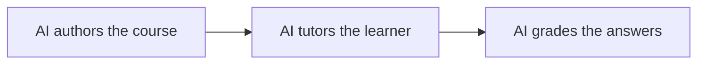

## Run it from your AI assistant

<Headless>
  * Create a partner onboarding course from our product one-pager.
  * Add a short quiz to the end of module 2.
  * Draft a certificate for the sales-fundamentals course.
</Headless>

## Going deeper

<CardGroup>
  <Card title="How to" icon="screwdriver-wrench" href="./technical">
    How authoring, the tutor, and grading work, and where to configure them.
  </Card>

  <Card title="Courses" icon="graduation-cap" href="/features/courses">
    Build, publish, and certify partner training.
  </Card>
</CardGroup>

**Works with**

<CardGroup>
  <Card title="Course Authoring" icon="graduation-cap" href="/features/courses/authoring">
    Generate a course and refine it with AI.
  </Card>

  <Card title="Quizzes" icon="graduation-cap" href="/features/courses/quizzes">
    AI grades and tutors on quiz answers.
  </Card>

  <Card title="Knowledge Base" icon="robot" href="/features/ai/knowledge-base">
    Courses are drafted from your knowledge base.
  </Card>
</CardGroup>

---

# AI Training
Source: https://docs.introw.io/features/ai/training/technical/index

How AI course authoring, the in-course AI tutor, and AI quiz grading work in Introw's LMS, and where to use each - grounded in your knowledge base.

## Where it lives

AI Training sits under **Portal**, at [Courses](https://app.introw.io/courses).

<Frame>
  
</Frame>

## Before you start

| You need                 | Why                               | Fix it                                                                                |
| ------------------------ | --------------------------------- | ------------------------------------------------------------------------------------- |
| The Courses (LMS) module | Authoring and tutoring live there | **Request access**                                                                    |
| Knowledge sources added  | They ground what AI writes        | [Fill the knowledge base](/features/ai/knowledge-base/guides/fill-the-knowledge-base) |
| Write access to Courses  | To publish what it drafts         | [Internal roles](/features/access/team-management/guides/create-an-internal-role)     |

## How it works

The three training AIs live inside the [Courses](/features/courses) area:

* **Authoring** - from the course create flow, give a prompt, pick a preset, or start from a deck. Introw runs a multi-stage pipeline: it drafts an outline against your [knowledge base](/features/ai/knowledge-base), researches and writes each module, adds illustrative images where your content has none, and reviews and optimizes the result into a draft you own. From the course builder you keep refining it conversationally, and you can generate a matching certificate from the course.
* **Tutor** - once a course is live, learners get an in-course AI tutor. It answers their questions about the material and guides them, grounded in the course content, so a stuck learner gets help without leaving the lesson.
* **Grading** - quizzes with open-ended or uploaded answers are graded by AI. It assesses the answer against the question and course content, decides pass/fail, and returns an explanation that guides the learner to the right understanding. Multiple-choice grades deterministically.

Authoring and refinement are for your team; the tutor and grading are learner-facing. Everything grounds in your knowledge base and the course's own content, so nothing is generic.

### Grounding

Course drafts and tutoring pull from your knowledge base and the course content itself, not the open web, so training reflects your product and program.

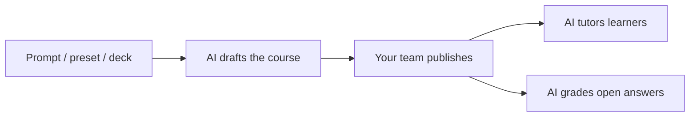

## Settings & configuration

There's nothing to switch on - the training AIs are part of the LMS. To get the most from them:

### Fill the knowledge base

Richer sources make richer courses and better tutoring. See [Fill the knowledge base](/features/ai/knowledge-base/guides/fill-the-knowledge-base).

### Author from a source

Generate from a prompt, a preset, or an uploaded deck; the closer the source, the less editing.

### Add open-ended quizzes

Use open questions where you want real understanding checked - the AI grades them with feedback.

## Guides

<CardGroup>
  <Card title="Generate a course with AI" icon="book-open" href="/features/courses/authoring/guides/generate-a-course-with-ai">
    Draft a full partner course from a prompt, preset, or deck, then refine it.
  </Card>

  <Card title="Build a course manually" icon="book-open" href="/features/courses/authoring/guides/build-a-course-manually">
    Author or edit a course by hand alongside the AI.
  </Card>
</CardGroup>

## Troubleshooting

<Warning>
  AI-authored courses are drafts - review them before publishing to partners. Authoring and tutoring reflect your knowledge base, so a thin knowledge base produces generic content. Open-answer grading is a judgment aid; spot-check it when the stakes are certification.
</Warning>

<AccordionGroup>
  <Accordion title="The generated course is generic">
    The knowledge base is thin, or the source prompt/deck was light.
  </Accordion>

  <Accordion title="The tutor won't answer a question">
    It's outside the course content and your knowledge base.
  </Accordion>

  <Accordion title="Grading seems off on open answers">
    Tighten the question and the expected answer so the AI has a clearer target.
  </Accordion>
</AccordionGroup>