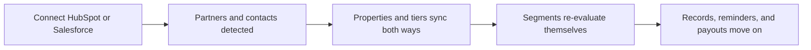
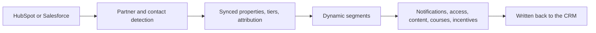
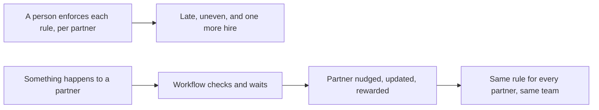
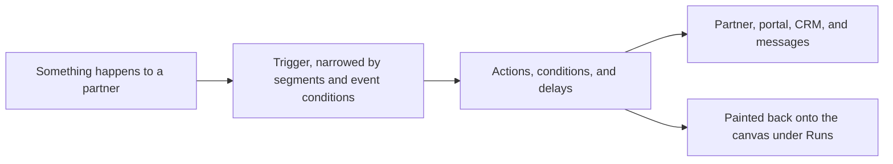

# Introw docs (docs.introw.io): features-automation

Verbatim from docs.introw.io/llms-full.txt, fetched 2026-09-29. 14 pages.

# Every automation that runs out of the box
Source: https://docs.introw.io/features/automation/built-in-automation/guides/every-automation-that-runs-out-of-the-box

A full inventory of what Introw automates without a workflow: partner detection, property and tier sync, segments, portal access, records, learning, incentives, messaging, and AI.

Most of the automation a partner program needs is already in Introw, and most of it starts working the moment your CRM is connected. This inventory lists it area by area: what each automation does, whether it is on by default or something you switch on, and where it is configured. Read it before you build anything on the [Workflows](/features/automation/workflows) canvas, because the list of rules you actually have to build yourself is shorter than it looks.

## What you'll achieve

A complete, checkable picture of Introw's out-of-the-box automation, so you can switch on the pieces your program needs, stop enforcing them by hand, and reduce your workflow backlog to the rules that are genuinely specific to how you run partnerships.

## Before you start

<Steps>
  <Step title="Connect your CRM">
    Most of this list is a consequence of the CRM connection. See [CRM integrations](/features/integrations/crm).
  </Step>

  <Step title="Know the three states">
    **Always on** needs no switch, only configuration. **Switch on** is off until you enable it, because it changes what partners receive or what happens to your data. **Build it** means there is no built-in automation and a workflow is the answer.
  </Step>
</Steps>

## Partners and their people

Everything here follows from partner detection, and it is the layer worth getting right first: it decides who your partners are and what data the rest of the program automates against.

| Automation             | What it does                                                                                                 | State     | Where                                                                                                       |
| ---------------------- | ------------------------------------------------------------------------------------------------------------ | --------- | ----------------------------------------------------------------------------------------------------------- |
| Partner detection      | A CRM object plus filters decide which records are partners; only matching records become partners in Introw | Always on | [Detect partners from your CRM](/features/partners/partner-management/guides/detect-partners-from-your-crm) |
| Automatic partner sync | New CRM records matching your filters become partners on their own, with no import to re-run                 | Switch on | CRM settings                                                                                                |
| Contact import         | The contacts on a detected partner's company arrive under the partner's **People**, ready for portal access  | Always on | [Provisioning](/features/access/provisioning)                                                               |
| Owner suggestion       | The partner's CRM account owner is suggested as a team member to accept and set as their manager             | Always on | [Wire partner ownership](/features/partners/team/guides/wire-partner-ownership)                             |
| Attributed records     | Deals, tickets, and custom objects linked to a partner appear on their record and in their portal            | Always on | [Configure deal attribution](/features/co-selling/shared-pipelines/guides/configure-deal-attribution)       |
| Two-way property sync  | Mapped partner properties travel between Introw and the CRM in the direction you set                         | Always on | [CRM integrations](/features/integrations/crm)                                                              |
| Tier sync              | A tier assigned in Introw is written to a CRM property, and a tier already set in the CRM flows in           | Switch on | [Build a tier program](/features/partners/tiers/guides/build-a-tier-program)                                |
| Partner-edited fields  | Fields you make editable are written straight back to the CRM when a partner changes them                    | Switch on | [Set up a shared pipeline](/features/co-selling/shared-pipelines/guides/set-up-a-shared-pipeline)           |

## Audiences

| Automation                   | What it does                                                                                                       | State     | Where                                                                                            |
| ---------------------------- | ------------------------------------------------------------------------------------------------------------------ | --------- | ------------------------------------------------------------------------------------------------ |
| Dynamic segments             | Conditions over live partner, contact, and CRM data are re-evaluated on a schedule, so membership follows the data | Always on | [Create a dynamic segment](/features/partners/segments/guides/create-a-dynamic-segment)          |
| Segment-driven notifications | Recipients for every notification event are decided by the organisation default and per-segment overrides          | Always on | [Control who gets notified](/features/engagement/notifications/guides/control-who-gets-notified) |
| Segment-driven access        | Portal tabs, content, and assets appear only for the segments you scope them to                                    | Switch on | [Restrict a tab to segments](/features/portal/portal-access/guides/restrict-a-tab-to-segments)   |
| Segment-driven pricing       | Tier and segment discounts apply themselves to the right partners' quotes                                          | Switch on | [Set tier-based discounts](/features/cpq/discounts/guides/set-tier-based-discounts)              |

<Note>
  Segments are the single highest-leverage automation in Introw, because so much keys off them. A dynamic segment is also the way to trigger on things no event names directly: "quiet for 30 days", "crossed a revenue threshold", "certified but not transacting". Define the segment, then point a workflow's **Segment membership** trigger at it.
</Note>

## Portal access

| Automation                 | What it does                                                                               | State     | Where                                                                                               |
| -------------------------- | ------------------------------------------------------------------------------------------ | --------- | --------------------------------------------------------------------------------------------------- |
| Access from a CRM property | A CRM contact property decides which contacts get portal access, so access follows the CRM | Switch on | [Map contact portal access](/features/integrations/crm/guides/map-contact-portal-access)            |
| Domain-based access        | Anyone on the partner's verified domain can reach the portal without an individual invite  | Switch on | [Set up portal access](/features/portal/portal-access/guides/set-up-portal-access)                  |
| Portal SSO provisioning    | A partner signing in through SSO is provisioned into the right portal on first login       | Switch on | [Set up portal SSO](/features/access/sso/guides/set-up-portal-sso)                                  |
| Team SCIM provisioning     | Your own team members are created, updated, and deactivated from your identity provider    | Switch on | [Provision your team with SCIM](/features/access/provisioning/guides/provision-your-team-with-scim) |

## Records and submissions

| Automation               | What it does                                                                                                           | State     | Where                                                                                                                 |
| ------------------------ | ---------------------------------------------------------------------------------------------------------------------- | --------- | --------------------------------------------------------------------------------------------------------------------- |
| Form to CRM              | A submission creates or updates the CRM objects behind it, from the field mapping you set                              | Switch on | [Connect a form to your CRM](/features/forms/crm-automations/guides/connect-a-form-to-your-crm)                       |
| Record matching          | Submissions are matched against existing CRM records and update them instead of creating duplicates                    | Switch on | [CRM automations](/features/forms/crm-automations)                                                                    |
| Partner attribution      | Everything a submission creates is attributed to the partner who sent it                                               | Always on | [CRM automations](/features/forms/crm-automations)                                                                    |
| Fill if empty            | Enrichment fields only write where the CRM has no value, so partner input never overwrites your data                   | Switch on | [CRM automations](/features/forms/crm-automations)                                                                    |
| Approval routing         | A submission is routed to reviewers, and accepted, declined, or returned before anything lands                         | Switch on | [Run a submission approval workflow](/features/forms/submissions-approvals/guides/run-a-submission-approval-workflow) |
| Conflict detection       | A registration overlapping a deal already in your CRM is flagged with an assessment and a recommendation               | Switch on | [Catch and resolve channel conflict](/features/ai/channel-conflict/guides/catch-and-resolve-channel-conflict)         |
| Watched-property updates | You choose which properties count as a change, so partners are told when something meaningful moves, not on every sync | Switch on | Pipeline section, **Notifications**                                                                                   |

## Journeys and tasks

| Automation            | What it does                                                                                                             | State     | Where                                                                                                                   |
| --------------------- | ------------------------------------------------------------------------------------------------------------------------ | --------- | ----------------------------------------------------------------------------------------------------------------------- |
| Journey on experience | A journey attached to an experience is applied as partners get that experience, so onboarding starts on its own          | Switch on | [Auto-apply a journey from the experience](/features/partners/journeys/guides/auto-apply-a-journey-from-the-experience) |
| Task due dates        | A journey's tasks get their due dates from days-after-assigned, so every partner's dates are right for when they started | Always on | [Build a journey from scratch](/features/partners/journeys/guides/build-a-journey-from-scratch)                         |
| Task reminders        | Partners are reminded about assigned tasks that are coming due                                                           | Switch on | [Notifications](/features/engagement/notifications)                                                                     |
| Progressive unlocking | Completing onboarding moves a partner into the segment that unlocks the next set of content and tabs                     | Switch on | [Build a progressive onboarding path](/features/partners/onboarding/guides/build-a-progressive-onboarding-path)         |

## Learning

| Automation                | What it does                                                                                                      | State     | Where                                                                                         |
| ------------------------- | ----------------------------------------------------------------------------------------------------------------- | --------- | --------------------------------------------------------------------------------------------- |
| Auto-enrollment           | Every partner in the segments you attach is enrolled in the course, including partners who join the segment later | Switch on | [Configure enrollment rules](/features/courses/enrollments/guides/configure-enrollment-rules) |
| Auto-issued certificates  | A certificate attached to a course is awarded on completion, gated on the passing score where the course sets one | Switch on | [Create a certificate](/features/courses/certificates/guides/create-a-certificate)            |
| Progress sync             | Course progress and certificates are written back to the CRM                                                      | Always on | [Progress tracking](/features/courses/progress-tracking)                                      |
| Incomplete-learner nudges | Learners who started but did not finish are reminded                                                              | Switch on | [Nudge incomplete learners](/features/courses/enrollments/guides/nudge-incomplete-learners)   |
| Certificate expiry        | A certificate with a validity period expires on its own, so recertification is visible rather than assumed        | Always on | [Certificates](/features/courses/certificates)                                                |

## Incentives and money

| Automation              | What it does                                                                                                                  | State     | Where                                                                                                                       |
| ----------------------- | ----------------------------------------------------------------------------------------------------------------------------- | --------- | --------------------------------------------------------------------------------------------------------------------------- |
| Earned commission lines | Plans generate lines from CRM and billing data as deals close and invoices are paid, against your eligibility rules and rates | Switch on | [Build and launch a commission plan](/features/commissions/commission-plans/guides/build-and-launch-a-commission-plan)      |
| Recalculation on change | A change to the CRM or billing record behind a line re-evaluates that line rather than leaving a stale amount                 | Always on | [Review and adjust commission lines](/features/commissions/commission-lines/guides/review-and-adjust-commission-lines)      |
| Automatic payout runs   | Payout batches advance on the schedule you set instead of someone starting each one                                           | Switch on | [Configure commission payout settings](/features/commissions/settings/guides/configure-commission-payout-settings)          |
| Payout status sync      | Introw Pay moves each payout's status on its own as your invoice is paid and each partner payment lands                       | Always on | [Introw Pay](/features/commissions/introw-pay/technical)                                                                    |
| Affiliate attribution   | Link clicks and conversions are attributed to the right partner and campaign, with fraud checks                               | Switch on | [Set up affiliate conversion tracking](/features/affiliate/conversion-tracking/guides/set-up-affiliate-conversion-tracking) |
| MDF lifecycle           | Requests, approvals, claims, and remaining budget move through the fund without a spreadsheet                                 | Switch on | [Funds and allocation](/features/mdf/funds-allocation)                                                                      |

## Messaging

| Automation              | What it does                                                                                             | State     | Where                                                                                                                     |
| ----------------------- | -------------------------------------------------------------------------------------------------------- | --------- | ------------------------------------------------------------------------------------------------------------------------- |
| Lifecycle notifications | Deal, task, submission, learning, and commission events reach the audiences you scoped                   | Switch on | [Every notification Introw sends](/features/engagement/notifications/guides/every-notification-introw-sends)              |
| Sleeping-deal nudges    | A deal sitting in a stage past your inactivity window prompts the responsible partner                    | Switch on | [Nudge stalled deals](/features/engagement/notifications/guides/nudge-stalled-deals)                                      |
| Off-portal delivery     | Notifications reach partners by email and in each partner's mapped Slack or Teams channel                | Switch on | [Channels](/features/engagement/channels)                                                                                 |
| Reply-by-email          | A partner replying to a notification has their reply tracked back onto the record for every collaborator | Switch on | [Configure partner notifications by email](/features/engagement/channels/guides/configure-partner-notifications-by-email) |
| Referrer updates        | The partner who referred a deal is kept up to date as it moves, with no manual status email              | Switch on | [Keep referrers updated](/features/referrals/deal-updates/guides/keep-referrers-updated)                                  |

## AI

| Automation               | What it does                                                                                      | State     | Where                                                                                                              |
| ------------------------ | ------------------------------------------------------------------------------------------------- | --------- | ------------------------------------------------------------------------------------------------------------------ |
| Partner support agent    | Partner questions are answered from your own content, wherever the partner asks                   | Switch on | [Launch the partner support agent](/features/ai/partner-support/guides/launch-the-partner-support-agent)           |
| Deal coaching            | A deal notification carries a specific next step, not just the fact that something changed        | Switch on | [Set up an AI deal coach](/features/ai/deal-coaching/guides/set-up-an-ai-deal-coach)                               |
| Announcement suggestions | Your partner-relevant LinkedIn posts arrive weekly as announcement drafts, rewritten for partners | Switch on | [Publish AI-suggested announcements](/features/engagement/announcements/guides/publish-ai-suggested-announcements) |
| Knowledge crawling       | Your public content is crawled and kept in the agent's knowledge base so answers stay current     | Switch on | [Fill the knowledge base](/features/ai/knowledge-base/guides/fill-the-knowledge-base)                              |

## What is left to build

After all of the above, the rules that still need a [workflow](/features/automation/workflows) are the ones tied to your own program design rather than to the mechanics of running a partner program:

* **Promotion on achievement.** Tier a partner up, add them to a segment, and log it in the CRM when they certify or finish onboarding. See [Reward a finished journey](/features/automation/workflows/guides/reward-a-finished-journey).
* **Deadline chases with escalation.** Remind the partner before a task is due, again after it slips, and hand it to the partner manager. See [Chase a task to its due date](/features/automation/workflows/guides/chase-a-task-to-its-due-date).
* **Fixed rewards.** A flat bonus for an action, rather than a percentage of a deal. See [Reward a finished journey](/features/automation/workflows/guides/reward-a-finished-journey).
* **Reacting to your own CRM fields.** A partner's segment, region, or program field changing in the CRM moving them onto a different experience. See [React to a CRM change on a partner](/features/automation/workflows/guides/react-to-a-crm-change-on-a-partner).
* **Multi-step re-engagement.** A sequence that nudges, waits, checks whether it worked, and only then involves a human. See [Re-engage quiet partners](/features/automation/workflows/guides/re-engage-quiet-partners).

## Verify it worked

Walk the list against your own program and you should be able to point at each row and say "on, off on purpose, or not for us". The test that the built-in layer is doing its job: new partners appear without anyone importing them, your partner list and the CRM agree, segment membership is current, submissions arrive as CRM records rather than as messages someone retypes, and the reminders your partners get are ones nobody sent.

## Related

<CardGroup>
  <Card title="Build your first workflow" icon="bolt" href="/features/automation/workflows/guides/build-your-first-workflow">
    Build the rules the built-in layer does not cover.
  </Card>

  <Card title="Every notification Introw sends" icon="bell" href="/features/engagement/notifications/guides/every-notification-introw-sends">
    The full catalog of automatic messages, with triggers and recipients.
  </Card>

  <Card title="Detect partners from your CRM" icon="users" href="/features/partners/partner-management/guides/detect-partners-from-your-crm">
    Set up the detection and sync layer everything else follows from.
  </Card>

  <Card title="Create a dynamic segment" icon="filter" href="/features/partners/segments/guides/create-a-dynamic-segment">
    Build the audiences the rest of the program keys off.
  </Card>
</CardGroup>

---

# Built-in Automation
Source: https://docs.introw.io/features/automation/built-in-automation/index

The automations Introw runs out of the box: partners and contacts detected from CRM filters, two-way property sync, self-evaluating segments, form-driven CRM writes, notifications, and earned commissions.

> Most of a partner program is already automated in Introw before you configure a single rule. Connecting your CRM is what switches it on.

## The problem it solves

<Pains>
  | Without Introw                          | With Introw                       |
  | --------------------------------------- | --------------------------------- |
  | Automation is an implementation project | It runs the week you connect      |
  | The partner list is stale on day two    | CRM filters keep finding partners |
  | Data drifts between PRM and CRM         | Tiers and fields sync both ways   |
  | Submissions become ops tickets          | The form writes the CRM record    |
  | Every reminder needs a human            | The signals go out on their own   |
</Pains>

## Impact

The programs partners rate highest are the ones where nothing goes missing. Most of that is not effort. It is what already runs by default the day your CRM is connected.

<Impact>
  for your business

  * **Live in days**
    The automation layer is on before anyone configures a rule, so a program goes live in weeks rather than after an implementation
  * **Cost to run**
    No consultants and no dev tickets to make the basics work, and everything left over is configuration
  * **In your CRM**
    Every built-in automation reads and writes HubSpot or Salesforce, so there is no second copy of the truth to reconcile

  for your partners

  * **Self-serve**
    They appear with portal access, the right experience, and their own contacts already attached
  * **Enabled**
    Deal updates, task reminders, learning nudges, and payout notices reach them without anyone sending them
  * **Efficient**
    A form they submit becomes the CRM record, deduplicated and attributed, so nothing is retyped on either side

  [A day in the life of your partners](/days-in-the-life)
</Impact>

<Personas>
  * **Partner Operations** - the mechanics running by configuring
  * **Partner Managers** - a list that stays current by itself
  * **VP Partnerships** - a program live without an implementation
</Personas>

## See it work

<Tour>
  * 

    **Data stays true**

    Tier, phase, champion, currency and language, each backed by a CRM property.

  * 

    **Audiences maintain themselves**

    Conditions decide who qualifies, and membership re-evaluates itself.

  * 

    **The program talks**

    Signals like the sleeping-deal nudge go out without anyone sending them.
</Tour>

## How it works

The usual assumption about a partner platform is that automation is a project: someone scopes the rules, someone builds them, and the program starts working a quarter later. Introw inverts that. The automations that every program needs are already in the product, and they start the moment your CRM is connected.

Partners detect themselves. You point Introw at a CRM object and a set of filters. Every record that matches becomes a partner. The contacts on that account are imported as their people, and the CRM account owner is suggested as their manager. Turn on automatic sync and any new matching record becomes a partner on its own, without anyone re-running an import.

Data stays true in both directions. Tiers map to a CRM property, so an assignment in Introw reaches the CRM and a tier already set in the CRM flows in. Partner properties, deal attribution, and the fields partners edit in the portal write straight back to HubSpot or Salesforce.

Audiences maintain themselves. A dynamic segment is a set of conditions over live partner, contact and CRM data, re-evaluated on a schedule. It drives notification recipients, portal tab visibility, content visibility, discounts and course enrollment. You define who qualifies once; membership follows the data.

Records and money follow the work. A submitted form creates or updates the CRM objects behind it, matched against existing records so you do not collect duplicates, attributed to the partner who sent it, and routed through approval. Commission plans earn lines from CRM or billing data as deals close and invoices are paid, and payout runs can advance on a schedule. Certificates issue on course completion. Journeys apply themselves when an experience is published.

And the program talks on its own: deal updates, sleeping-deal nudges, task reminders, submission outcomes, learning reminders, and payout notifications go out by email, Slack, and Teams to the audiences you scoped.

Instead of buying a platform and then paying to make it do things, the program starts automated. Partners, their people, and their data arrive and stay current from the CRM; audiences, records, reminders, and money keep moving on their own. What is left over is the handful of rules specific to how you run partnerships, and those are a canvas away in [Workflows](/features/automation/workflows) rather than a project.

## Going deeper

<CardGroup>
  <Card title="How to" icon="screwdriver-wrench" href="./technical">
    Setup, configuration, and all how-to guides.
  </Card>

  <Card title="API reference" icon="code" href="/general/introduction">
    Endpoints and code.
  </Card>
</CardGroup>

**Works with**

<CardGroup>
  <Card title="Workflows" icon="bolt" href="/features/automation/workflows">
    Build a workflow for the program-specific rules the built-in layer does not cover.
  </Card>

  <Card title="Partner Management" icon="users" href="/features/partners/partner-management">
    New partners, their contacts, and their account owner arrive from your CRM filters on their own.
  </Card>

  <Card title="CRM Automations" icon="table-list" href="/features/forms/crm-automations">
    A submitted form creates and updates the CRM records behind it, attributed to the right partner.
  </Card>

  <Card title="Notifications" icon="bell" href="/features/engagement/notifications">
    The automatic deal, task, form, learning, and commission signals are the largest group of built-in automations.
  </Card>
</CardGroup>

---

# Built-in Automation
Source: https://docs.introw.io/features/automation/built-in-automation/technical/index

Which Introw automations are on by default, which you switch on, and where each one is configured, from CRM partner detection to segments, forms, notifications, and payout runs.

## Where it lives

Built-in automation is configured in two places under **Settings**: [CRM settings](https://app.introw.io/settings/integrations) switches on the detection and sync layer, and [Segments](https://app.introw.io/settings/segments/default) holds the audiences everything else keys off.

<Frame>
  
</Frame>

## Before you start

| You need                    | Why                                  | Fix it                                                                                             |
| --------------------------- | ------------------------------------ | -------------------------------------------------------------------------------------------------- |
| A connected CRM             | Almost every automation reads it     | [Connect a CRM](/features/integrations/crm/guides/connect-hubspot)                                 |
| Integration settings access | Detection and sync switch on there   | [Internal roles](/features/access/team-management/guides/create-an-internal-role)                  |
| A published experience      | The portal-side automations need one | [Publish an experience](/features/portal/experiences/guides/build-and-publish-a-portal-experience) |

## How it works

Introw's automation comes in three layers, and knowing which layer you are in tells you where to go and how much work it is.

1. **Always on.** Things Introw does as a consequence of being connected: partner detection, contact and owner import, property sync, dedupe on submissions, attribution, segment re-evaluation, progress tracking. There is no switch, only configuration that shapes them.
2. **On by choice.** Things that are off until you enable them because they change what partners receive or what happens to your data: automatic partner sync, tier sync, auto-enrollment on a course, auto-issue of a certificate, sleeping-deal nudges, automatic payout runs, AI announcement suggestions.
3. **Built by you.** The rules specific to your program, on the [Workflows](/features/automation/workflows) canvas.

The order to set them up in follows the same logic. The CRM connection decides who your partners are and what data they carry. Segments turn that data into audiences. Almost everything else, from notification recipients to portal tab visibility to course enrollment to discounts, keys off those segments. Getting the first two right is what makes the rest configuration rather than maintenance.

## Settings & configuration

The full inventory, automation by automation, is in [Every automation that runs out of the box](/features/automation/built-in-automation/guides/every-automation-that-runs-out-of-the-box). What follows is the map: the surfaces that own the automation layer, in the order you should visit them.

### The CRM connection

**CRM settings** is where the largest group of automations lives. **Partner detection** picks the CRM object your partners are, and the filters that narrow it to the records that really are partners: only matching records become partners. Detection also brings the people, not just the account, so each partner's contacts are imported under their **People** and the CRM account owner is suggested as a team member you accept with one click.

**Automatic sync** is the switch that turns detection from an import into an automation: with it on, any new CRM record matching your filters becomes a partner on its own. Leave it off while you are still tuning filters, then turn it on once detection covers the right set. See [Detect partners from your CRM](/features/partners/partner-management/guides/detect-partners-from-your-crm).

**Field mapping** decides which properties travel and in which direction, which is what keeps partner data true on both sides without anyone reconciling it.

### Segments

Segments are the audience layer the rest of the program keys off, so they are the second thing to get right. A **dynamic** segment is a set of conditions over live partner, contact, and CRM data, re-evaluated on a schedule, so membership follows the data rather than a list someone maintains. A **static** segment is a list you curate, and it is the only kind a workflow can add a partner to.

Segment membership drives notification recipients, portal tab visibility, content and asset visibility, course auto-enrollment, tier and partner-based discounts, and announcement targeting. See [Segments](/features/partners/segments).

### Notifications and nudges

**Notification settings** is the catalog of what your program sends on its own: deal and record updates, submission outcomes, task assignments and reminders, learning and certificate signals, commissions and payouts. Recipients are set once organisation-wide on **Default settings** and overridden per segment; chat delivery is configured per platform on the chat integration. See [Notifications](/features/engagement/notifications).

Two nudges are configured on the pipeline section of an experience rather than in the catalog, and both are off until you set them: **Sleeping deal**, which emails the partner when a deal sits too long in a stage, and **Deal updated**, where you choose the properties that count as an update so partners are only told when something meaningful changes. The same setting exists per record type you sync, named after that record.

### Forms

A form's **Automation** is what makes a submission an operation rather than a message. It maps answers to CRM properties, creates or updates the CRM objects behind the submission, matches against existing records so you do not collect duplicates, attributes everything to the submitting partner, and can fill only the fields that are still empty. Approvals route the submission before any of it lands. See [CRM automations](/features/forms/crm-automations) and [Submissions and approvals](/features/forms/submissions-approvals).

### Learning

A course's **Enrollment** can auto-enroll every partner in the segments you attach, including partners who join the segment later. A course's **Certificate** can auto-issue on completion, gated on the passing score if the course has a quiz. Progress and certificates sync back to the CRM. See [Enrollments](/features/courses/enrollments) and [Certificates](/features/courses/certificates).

### Incentives

**Commission plans** earn lines on their own from CRM or billing data as deals close and invoices are paid, against the eligibility conditions and rates you set. **Payout settings** can advance payout runs on a schedule instead of someone starting each one. See [Commission plans](/features/commissions/commission-plans) and [Payout settings](/features/commissions/settings).

### Journeys and experiences

A journey attached to an experience is applied to partners as they get that experience, so onboarding starts without anyone pressing **Apply**. See [Auto-apply a journey from the experience](/features/partners/journeys/guides/auto-apply-a-journey-from-the-experience).

### AI

The AI layer runs on its own once configured: the partner support agent answers partner questions from your content, deal coaching attaches a next step to deal notifications, channel conflict detection flags overlaps on registrations, and weekly announcement suggestions arrive as drafts for review. See [AI Agents](/features/ai).

## How-to guides

<Rail>
  * [**Every automation that runs out of the box**](/features/automation/built-in-automation/guides/every-automation-that-runs-out-of-the-box)

    A full inventory of what Introw automates without a workflow: partner detection, property and tier sync, segments, portal access, records, learning, incentives, messaging, and AI.
</Rail>

## Troubleshooting

<Warning>
  Automatic partner sync only creates partners that match your filters, so a partner missing from Introw is almost always a filter question rather than a sync failure. Tier sync needs every tier mapped before it runs. Dynamic segment membership follows a schedule rather than changing the instant a CRM field does, so an automation keyed off a segment starts shortly after the data moves, not at the same moment. Auto-enrollment on a course applies while it is on and does not retroactively enroll partners for the period it was off. Certificates auto-issue only when one is attached to the course, and only to learners who meet the passing score if the course sets one.
</Warning>

<AccordionGroup>
  <Accordion title="A CRM record that should be a partner is not one">
    Check the detection filters first, then whether automatic sync is on. Only matching records become partners.
  </Accordion>

  <Accordion title="A partner's contacts are missing">
    Contacts arrive with detection from the accounts associated with the partner's company. See [Provisioning](/features/access/provisioning).
  </Accordion>

  <Accordion title="A tier set in the CRM did not reach Introw">
    The tier mapping is incomplete. Every tier has to be mapped before sync will run.
  </Accordion>

  <Accordion title="A partner is not receiving a signal others get">
    Read the notification cascade on their contact: the organisation default, the segments that override it, and their own opt-outs. See [Control who gets notified](/features/engagement/notifications/guides/control-who-gets-notified).
  </Accordion>

  <Accordion title="A segment-driven automation did not fire for a partner who qualifies">
    Confirm the partner is actually in the segment; dynamic membership is recalculated on a schedule.
  </Accordion>

  <Accordion title="A submission did not create the CRM record">
    Check the form's automation mapping and whether record matching found an existing record to update instead. See [Connect a form to your CRM](/features/forms/crm-automations/guides/connect-a-form-to-your-crm).
  </Accordion>

  <Accordion title="You are about to build a workflow">
    Check this list first. Tiering on certification, chasing a task, and rewarding onboarding are workflows; auto-enrollment, certificate issuance, and deal nudges already exist.
  </Accordion>
</AccordionGroup>

---

# Automation
Source: https://docs.introw.io/features/automation/index

Everything Introw runs on its own once the CRM is connected, plus the no-code Workflows canvas for the program-specific automations only you would think of.

> Automation is the part of your partner program that runs without anybody touching it. Most of it is already on the day you connect your CRM. Workflows is where you build the rest, on a canvas, with no code.

## The problem it solves

<Pains>
  | Without Introw                   | With Introw                        |
  | -------------------------------- | ---------------------------------- |
  | Someone has to remember it all   | The program enforces its own rules |
  | Admin is the first thing to slip | Routine work runs without anyone   |
  | Automation means a paid project  | A canvas, a rehearsal, a switch    |
  | Each new partner adds admin      | More partners, the same work       |
</Pains>

## Impact

Partners judge a program on whether things happen when they should. Rewards booked the day they are earned and nudges that arrive before a deadline are what a well-run program feels like from outside.

<Impact>
  for your business

  * **Live in days**
    The built-in automations are running the week you connect your CRM, so a new program never waits on an automation project
  * **Cost to run**
    Partner operations builds and changes the whole automation layer on a canvas, with no consultants and nothing to deploy
  * **In your CRM**
    Every automation reads live CRM data and writes back to it, so the program automates against what your sales team already trusts

  for your partners

  * **Self-serve**
    The journey, the experience, and the tier they should be on are applied to them, with nothing to request
  * **Enabled**
    The nudge, the certificate, and the next step arrive on time, on the channel they already use
  * **Efficient**
    Nobody waits on a partner manager to remember: rewards are booked and tasks appear as they are earned

  [A day in the life of your partners](/days-in-the-life)
</Impact>

<Personas>
  * **Partner Operations** - the automation layer without a project
  * **Partner Managers** - the chasing done without doing it
  * **VP Partnerships** - more partners per manager
</Personas>

## How this area works

Partner programs die of admin. Someone chases the onboarding checklist, someone remembers to move a partner up a tier, someone copies a deal update into an email, someone books the referral fee. None of that work is strategic, and all of it is the first thing to slip in a busy quarter.

The built-in layer keeps partner data, records, and signals current; a workflow watches that same data and acts on it.

**Where this sits in a setup.** Automate after the manual version works. Every [setup track](/tracks) gets the program live first, then replaces the repeated parts with a workflow.

<Rail>
  * 

    [**Workflows**](./workflows)

    Define a program rule once and it runs for every partner.

    [How to · 7 guides](./workflows/technical)

  * 

    [**Built-in Automation**](./built-in-automation)

    Everything already running the week you connect the CRM.

    [How to · 1 guide](./built-in-automation/technical)
</Rail>

Introw removes most of it before you configure anything. Connect HubSpot or Salesforce and partners appear from your CRM filters with their contacts and their account owner. Tiers and partner properties sync both ways. Segments re-evaluate themselves against live CRM data. Form submissions create and update CRM records, attributed to the right partner. Notifications and nudges go out on their own. Commission lines are earned from CRM or billing data and flow into payout runs. That is the out-of-the-box layer, and for most programs it is the majority of the automation they will ever need.

What is left is specific to how you run partnerships. Tier a partner up the moment they certify. Chase a task toward its due date, and escalate to the partner manager if it slips. Book a fixed bonus when onboarding completes. Move a partner onto a different portal experience when a field changes in the CRM. That is what Workflows is for. You define the rule once: pick a trigger, narrow it to the partners and events you mean, add conditions and waits, and pick the actions. It saves as a draft, you rehearse it against a real partner, and then you switch it on. From then on Introw enforces it for every partner, the same way every time, and adding partners adds runs rather than headcount.

---

# Build your first workflow
Source: https://docs.introw.io/features/automation/workflows/guides/build-your-first-workflow

Create a workflow that moves a partner up a tier the moment they earn a certification, from an empty canvas through a rehearsal to an enabled automation.

Tiering a partner up when they certify is the classic partner-program rule that never gets enforced: the certification lands, and the tier follows whenever somebody notices. This guide builds it as a workflow, end to end: pick the trigger, narrow it to the certificate that counts, write the tier onto the partner, tell them, rehearse the whole thing against a real partner without changing anything, and switch it on. Everything you learn here, the two-part narrowing, the write mode, the rehearsal, and the enable gate, applies to every other workflow you build.

## What you'll achieve

An enabled workflow that, from the moment you switch it on, moves any partner whose contact earns your certification onto the next tier, records it on their CRM record, and emails the partner to tell them, with a rehearsal behind you proving the flow does what you meant.

## Before you start

<Steps>
  <Step title="Confirm you can build workflows">
    **Workflows** has to be in your left-hand navigation under **Engage**, and your role needs write access to it. If the menu item is missing, ask your Introw contact to switch Workflows on for your organisation.
  </Step>

  <Step title="Have a certificate and a tier program">
    This workflow triggers on a certificate being issued and writes a tier, so both need to exist. See [Create a certificate](/features/courses/certificates/guides/create-a-certificate) and [Build a tier program](/features/partners/tiers/guides/build-a-tier-program).
  </Step>

  <Step title="Pick a real partner to rehearse against">
    The test run needs one partner and, ideally, one of their contacts. Any partner will do: nothing is written.
  </Step>
</Steps>

## Watch it

<Tabs>
  <Tab title="Video">
    <video />
  </Tab>

  <Tab title="Click through">
    <iframe />
  </Tab>
</Tabs>

## Steps

### Create the workflow

<Steps>
  <Step title="Start from scratch">
    Go to [Workflows](https://app.introw.io/workflows) and select **New workflow**. On an empty account, choose **Start from scratch** on the first-run screen. Introw creates a draft named **Untitled workflow** and opens the canvas, which is a single trigger node with a **+** under it.

    Leave the name for now. You can rename it in the page title at any time, and **Generate with AI** will name it from the finished canvas later.

    <Frame>
      
    </Frame>

    <Frame>
      
    </Frame>
  </Step>
</Steps>

### Set the trigger

<Steps>
  <Step title="Pick Certificate issued">
    Select the trigger node. The panel lists the triggers in three groups: **Tasks & journeys**, **Learning**, and **Partners**. Under **Learning**, choose **Certificate issued**. It fires when a certificate is awarded to a partner contact, and re-issuing the same certificate to the same contact does not fire it again.

    <Frame>
      
    </Frame>

    <Frame>
      
    </Frame>
  </Step>

  <Step title="Narrow it to the certificate that counts">
    The panel now shows the trigger's own narrowing and its filter. Work through them in order:

    * **Which certificates count** - the certificates that qualify. Pick your certification. Leaving it empty means any certificate, which would tier partners up for a webinar attendance badge, so this is the one narrowing you should not skip.
    * **Only for partners in** - the segments the partner has to be in. This is checked before the workflow starts, so partners outside these segments leave no run behind. Leave it empty for your first workflow, or point it at a segment of the partner types the tier program applies to if your program has several.
    * **Only for partners matching** - conditions on the partner's own Introw and CRM fields, for a check you would not keep a segment for. Leave it empty here, or use it to hold the promotion to the partners it applies to, for example **Partner tier** **is any of** Bronze or Silver so an Elite partner is not "promoted" downwards.
    * **Only for certificates matching** - conditions on the event itself, over **Certificate**, **Issued at**, and **Expires at**. You have already narrowed by certificate, so leave this empty. It is where you would add something like an expiry date more than 30 days out.

    The rule to remember: the first two blocks are about the partner, the last one is about the event, and all three are ANDed. Reach for a segment when the audience is one you already maintain or want to reuse, and for **Only for partners matching** when it is a one-off check this workflow alone cares about.

    <Frame>
      
    </Frame>

    <Frame>
      
    </Frame>
  </Step>
</Steps>

### Add the actions

<Steps>
  <Step title="Write the new tier onto the partner">
    Select the **+** under the trigger and choose **Action**, then **Update partner properties** from the **Partner** group. Each row is one property:

    * **Property** - a searchable list of everything a workflow can write: **Partner tier**, **Partner phase**, **Partner categories**, **Partner owner**, the partner's **Experience**, and every writable CRM property on their company or custom partner object. Each is marked with Introw's logo or your CRM's, so two same-named fields are distinguishable. Pick **Partner tier**.
    * **Value** - the tier to set, from your tier program's own list.
    * **Write mode** - **Overwrite** always replaces what is there; **Fill in if not known** leaves an existing value alone. This is the most consequential setting on the panel. For a promotion, **Overwrite** is right: the point is to move a partner who already has a tier. For anything a partner manager sets by hand and would not want an automation undoing, choose **Fill in if not known**.

    Select **Add property** to write a second field in the same step, with its own write mode. **Partner phase** on **Fill in if not known** is a good second row: a partner who already has a phase keeps it, and one who has none gets set. Every writable CRM property on the partner's company or custom partner object is in the same list too, so the same step can stamp the promotion onto the record your sales team is already looking at.

    <Frame>
      
    </Frame>

    <Frame>
      
    </Frame>
  </Step>

  <Step title="Tell the partner">
    Select the **+** under the action, choose **Action**, then **Send an email** from the **Messages** group.

    * **Send to** - because this trigger names a contact, the list includes **The contact this is about**, which reaches exactly the person who earned the certificate. The other options are **All contacts of the partner**, **The partner champion**, **Contacts in a segment**, and **Your partner team**, which is your own colleagues assigned to this partner rather than anyone at the partner. Choose **The contact this is about**.
    * **Email** - select the card to open the editor. It is the same editor announcements use, so variables resolve per recipient and CTA buttons point at that partner's portal. Give it a **Subject**, which stays plain text, and write the body. **Generate with AI** drafts a subject and two or three paragraphs from where this step sits in the flow, with the greeting and sign-off added for you, so you can start there and edit.

    Save the email and you are back on the canvas with a card showing the subject, who it goes to, and its opening lines.

    <Frame>
      
    </Frame>

    <Frame>
      
    </Frame>
  </Step>
</Steps>

### Rehearse it

<Steps>
  <Step title="Run a test against a real partner">
    Select the play button beside the trigger node. In **Test workflow**, pick a **Partner** and, since this flow emails the contact the trigger is about, a **Contact** as well.

    Read the card before you run it. Every test is a dry run: delays resolve instantly, nothing is written and nothing is sent, conditions are evaluated against live data, and the trigger's filter is not applied, because you chose the partner by hand. That last point matters: a test proves the shape of the flow, not the audience.

    Select **Run test**. The canvas updates as each step resolves, and nodes the run touched are badged **Simulated**.

    <Frame>
      
    </Frame>

    <Frame>
      
    </Frame>
  </Step>

  <Step title="Read the result on the canvas">
    Every node should read **Simulated**. A node badged **Failed** carries its reason, and a node that stopped the run short says why, for example that the partner has no portal contacts for the email to reach. Fix what you find and run the test again.

    <Frame>
      
    </Frame>

    <Frame>
      
    </Frame>
  </Step>
</Steps>

### Name it and switch it on

<Steps>
  <Step title="Name and describe it">
    Open **Settings**. Select **Generate with AI** to write both fields from the canvas, then edit them.

    * **Name** - what the workflow does, in a few words. It is the column your colleagues scan on the workflows list.
    * **Description** - one or two sentences for whoever reads this workflow next, including you in six months.

    <Frame>
      
    </Frame>

    <Frame>
      
    </Frame>
  </Step>

  <Step title="Enable it">
    Switch **Enable** on and select **Save**.

    If **Enable** is unavailable, **Not ready to enable yet** lists exactly what is missing: a trigger, at least one action, a value left unset on a step, or a pairing that cannot work. Clear the list and the switch becomes available.

    Enabling is not retroactive. Only partners who earn the certificate from this moment on enter the workflow; nothing replays history. If you need to catch up the partners who already certified, do that once by hand or with a bulk update.

    <Frame>
      
    </Frame>
  </Step>
</Steps>

## Verify it worked

The workflows list shows the workflow as **Active** with its trigger, its step count, and you as the owner. Issue the certificate to a test contact, then switch the canvas header to **Runs**: a run appears named after that partner, its nodes read **Ran**, and the partner's tier has moved. The contact has the email in their inbox, and the property you wrote is on the partner's record in HubSpot or Salesforce.

## Related

<CardGroup>
  <Card title="Chase a task to its due date" icon="clock" href="./chase-a-task-to-its-due-date">
    Add delays and conditions to build a nudge chain that escalates.
  </Card>

  <Card title="Test a workflow and read its runs" icon="list-check" href="./test-a-workflow-and-read-its-runs">
    What a rehearsal proves, and how to read every node outcome.
  </Card>

  <Card title="Every built-in automation" icon="arrows-rotate" href="/features/automation/built-in-automation/guides/every-automation-that-runs-out-of-the-box">
    Check what already runs before building the next one.
  </Card>

  <Card title="Workflows setup reference" icon="screwdriver-wrench" href="../technical">
    Every trigger, action, condition, and delay option.
  </Card>
</CardGroup>

---

# Chase a task to its due date and escalate
Source: https://docs.introw.io/features/automation/workflows/guides/chase-a-task-to-its-due-date

Build a nudge chain that reminds a partner three days before a task is due, again two days after it slips, and hands it to the partner manager five days after.

A task with a due date and no chase is a task that gets done late or not at all. The usual fix is a calendar of manual reminders, which is the first thing to fall over in a busy quarter. This guide builds the chase as one workflow: a reminder three days before the task is due, a second one two days after it has slipped, and an escalation to the partner manager five days after, with every step checking whether the partner has since done the work so nobody is nudged about something they finished.

## What you'll achieve

An enabled workflow that, for every partner assigned the task you name, sends the reminder before the deadline, the follow-up after it, and the escalation to your own team, all measured from that task's own due date, and stops the moment the task is marked done.

## Before you start

<Steps>
  <Step title="Have the journey and task this chases">
    The chase is worth building for a specific task, not for every task in the program. Have the journey and know the exact name of the task inside it. See [Build a journey from scratch](/features/partners/journeys/guides/build-a-journey-from-scratch).
  </Step>

  <Step title="Make sure that task has a due date">
    The whole chain is measured from the task's due date, and a task without one stops the workflow at the first wait. On a journey's task, the due date is set as days after assigned. Check it is set before you build this.
  </Step>

  <Step title="Decide who the escalation goes to">
    The escalation reaches your own colleagues assigned to the partner, optionally narrowed by the partner team role they hold. If you want it to reach only partner managers rather than the whole internal team, set up those roles first. See [Set up partner team roles](/features/access/team-management/guides/set-up-partner-team-roles).
  </Step>
</Steps>

## Watch it

<Tabs>
  <Tab title="Video">
    <video />
  </Tab>

  <Tab title="Click through">
    <iframe />
  </Tab>
</Tabs>

## Steps

### Set the trigger

<Steps>
  <Step title="Create the workflow and pick Task assigned">
    Go to [Workflows](https://app.introw.io/workflows), select **New workflow**, then select the trigger node and choose **Task assigned** under **Tasks & journeys**.

    **Task assigned** fires when a partner acquires a task, which means when it is created. Reassigning an existing task between people does not fire it, so the chain does not restart every time a manager tidies up ownership. It is also the only trigger that offers a wait anchored to the task's due date, which is what the rest of this workflow is built on. **Task completed** would be too late: the clock has to start when the work appears, not when it is done.

    <Frame>
      
    </Frame>

    <Frame>
      
    </Frame>
  </Step>

  <Step title="Narrow it to the one task you are chasing">
    Under **Only for tasks matching**, build two conditions:

    * **Journey** **is** your journey. Narrowing by journey first is what makes the next condition exact, because the **Task** list is then scoped to that journey's tasks instead of every task in the program.
    * **Task** **is** the task you are chasing, picked from that scoped list.

    Leave **Only for partners in** empty to chase every partner, or point it at a segment if only some partner types get this treatment. Leave the timestamp fields alone; **Due date** and **Assigned at** are there for narrowing by date, which you do not need here.

    Without these conditions the workflow chases every task every partner is ever given, which is a lot of email. Narrow it.

    <Frame>
      
    </Frame>

    <Frame>
      
    </Frame>
  </Step>
</Steps>

### Nudge before the deadline

<Steps>
  <Step title="Wait until three days before it is due">
    Select the **+** under the trigger and choose **Delay**.

    * **Wait** - choose **Around the task's due date**. This option only appears because the trigger is **Task assigned**. The alternative, **After the previous step**, is a plain pause and would mean "three days after the task appeared", which is not the same thing at all and drifts as soon as anyone edits a due date.
    * **How far from the due date** - enter **3**, unit **Days**, direction **Before due**. Zero would wait until the due date itself.

    The moment is read fresh when the run reaches this step, so moving the task's due date moves the nudge with it. If the task is assigned less than three days before it is due, the wait is already over and the run carries straight on, which is the honest reading of "at three days before due". Read the note under the panel: when the task has no due date at all, nothing after this step runs, and the node will say so.

    <Frame>
      
    </Frame>

    <Frame>
      
    </Frame>
  </Step>

  <Step title="Check whether they have already done it">
    Select the **+** under the delay and choose **Condition**. Under the trigger's own condition block, add:

    * **Task status right now** **is not** **Done**.

    The words "right now" are the point. Every other field on the canvas answers about the moment the workflow started, when the task was obviously not done. This one is read from the current state at the instant the condition is decided, which after a multi-day wait is a different answer. Get this wrong and you nudge every partner who has already finished.

    Leave **Partners in** and **Partner matches** empty: you narrowed the audience on the trigger, and this fork is about the task, not the partner. Those two blocks are read when the fork runs, so they are where you would put a check that has to be true *at the moment of the nudge*, for example not chasing a partner whose tier has since been downgraded.

    <Frame>
      
    </Frame>

    <Frame>
      
    </Frame>
  </Step>

  <Step title="Send the reminder on the Yes path">
    On the **Yes** path, add an **Action**, then **Send an email**.

    * **Send to** - **Whoever the task is assigned to**. This option appears only on task triggers, and it resolves when the email sends, so it reaches whoever currently owes the task rather than whoever owed it when the workflow started. Be aware it can be one of your own team if the task was assigned internally, so write the copy so it reads sensibly either way.
    * **Email** - a short, friendly reminder with the deadline in it. **Generate with AI** drafts it from this position in the flow, which means it already knows it is a pre-deadline nudge.

    Leave the **No** path empty. The partner finished on time, so there is nothing to do.

    <Frame>
      
    </Frame>

    <Frame>
      
    </Frame>
  </Step>
</Steps>

### Nudge again once it slips

<Steps>
  <Step title="Wait until two days after it was due">
    Still on the **Yes** path, under the email you just added, add another **Delay**.

    * **Wait** - **Around the task's due date** again. A second anchored wait is measured from the same due date, not from the previous step, so you express each moment in the chain absolutely rather than accumulating offsets in your head.
    * **How far from the due date** - **2**, **Days**, **After due**.

    Because the first nudge went out three days before, this wait is about five days long in practice, and it re-reads the due date, so a deadline the partner asked to move takes the whole rest of the chain with it.

    <Frame>
      
    </Frame>

    <Frame>
      
    </Frame>
  </Step>

  <Step title="Check again, then nudge harder">
    Add a **Condition** with the same **Task status right now** **is not** **Done** check. The partner may have acted on the first reminder, and this is what stops the second one reaching them.

    On its **Yes** path, add **Send an email** to **Whoever the task is assigned to** again, with copy that acknowledges the deadline has passed.

    If your partners live in Slack or Teams, this is a good place for **Send a chat message** instead of, or as well as, the email: pick **The partner's channel** to post into the shared channel mapped on the partner's page, and write `{{partner}}` where you want the partner's name. A message in a channel a partner already watches outperforms a third email. This needs a connected Slack or Microsoft Teams workspace. See [Chat integrations](/features/integrations/chat).

    <Frame>
      
    </Frame>

    <Frame>
      
    </Frame>
  </Step>
</Steps>

### Escalate to the partner manager

<Steps>
  <Step title="Wait until five days after it was due">
    Under the second nudge, add a third **Delay**: **Around the task's due date**, **5**, **Days**, **After due**. Three days after the second nudge, and still anchored to the same date.

    <Frame>
      
    </Frame>

    <Frame>
      
    </Frame>
  </Step>

  <Step title="Check one last time">
    Add a **Condition** with **Task status right now** **is not** **Done**. Two nudges have gone unanswered, so this fork is what separates a partner who needs a human from one who simply took their time.

    <Frame>
      
    </Frame>

    <Frame>
      
    </Frame>
  </Step>

  <Step title="Tell your own team">
    On the **Yes** path, add **Send an email**.

    * **Send to** - **Your partner team**, which shows as your organisation's name followed by "partner team". This is the one audience that is always internal: your own colleagues assigned to this partner. A **Roles** picker appears under it. Pick the partner manager role to reach only them; leave it empty and everyone on the partner's team gets it. Roles are resolved when the email sends.
    * **Email** - name the partner, the task, and how long it is overdue, and say the automated nudges have already gone out, so the manager knows what the partner has already heard.

    Two more steps are worth adding beside the email, both on the same **Yes** path:

    * **Give a task** with **Assignee** set to one of your own team, **Task name** something like "Call the partner about overdue onboarding", and **Due date** two days after assigned. An email is read and forgotten; a task appears on someone's list until it is done. Set **Visibility** to **Internal** so the partner never sees the escalation.
    * **Log a CRM note** so the escalation is on the partner's record in HubSpot or Salesforce for whoever picks the account up next. Write `{{partner}}` for the partner's name.

    <Note>
      A workflow that triggers on **Task assigned** and also gives a task could set itself off. Introw refuses to enable that pairing, unless the trigger is narrowed to specific journeys, because a task a workflow creates belongs to no journey and so can never re-trigger it. The **Journey** condition you set on the trigger is what makes this escalation task safe. If **Enable** complains that the workflow would give partners the task that triggers it, that condition is missing.
    </Note>

    <Frame>
      
    </Frame>

    <Frame>
      
    </Frame>
  </Step>
</Steps>

### Rehearse and enable

<Steps>
  <Step title="Test the whole chain">
    Select the play button beside the trigger, pick a partner, and select **Run test**. Delays resolve instantly in a rehearsal, so the whole chain plays out in seconds and you can see which side of each fork the run took without waiting a week. Nothing is written and nothing is sent.

    Remember the rehearsal does not apply the trigger's filter, so it will run for the partner you picked whether or not they have the task. What you are checking here is the shape: three delays, three forks, the right audiences.

    <Frame>
      
    </Frame>

    <Frame>
      
    </Frame>
  </Step>

  <Step title="Name it and switch it on">
    Open **Settings**, use **Generate with AI** to name and describe it, switch **Enable** on, and **Save**. Only tasks assigned from this moment on enter the chase; tasks already outstanding are not picked up.

    <Frame>
      
    </Frame>

    <Frame>
      
    </Frame>
  </Step>
</Steps>

## Verify it worked

Assign the task to a test partner with a due date a few days out and switch the canvas header to **Runs**. A run appears, and its first delay reads **Waiting** with the rest of the canvas **Not reached**, which is exactly right: the run is parked until three days before the due date. Mark the task done and the next condition sends the run down its **No** path, leaving the remaining nudges **Not taken**. Leave it undone and the reminder lands in the assignee's inbox on schedule, the escalation reaches the partner manager five days after the deadline, and the note is on the partner's CRM record.

## Related

<CardGroup>
  <Card title="Re-engage quiet partners" icon="users" href="./re-engage-quiet-partners">
    The same chase pattern, started by a partner going quiet instead of a deadline.
  </Card>

  <Card title="Onboard a new partner automatically" icon="route" href="./onboard-a-new-partner-automatically">
    Put the partner on the journey these tasks come from.
  </Card>

  <Card title="Nudge stalled deals automatically" icon="bell" href="/features/engagement/notifications/guides/nudge-stalled-deals">
    The built-in nudge for deals sitting too long in a stage.
  </Card>

  <Card title="Workflows setup reference" icon="screwdriver-wrench" href="../technical">
    Every delay anchor, condition field, and email audience.
  </Card>
</CardGroup>

---

# Onboard a new partner automatically
Source: https://docs.introw.io/features/automation/workflows/guides/onboard-a-new-partner-automatically

Put every new partner on the onboarding journey, welcome them, and chase the ones who stall, from the moment the partner appears from your CRM.

Partner onboarding is usually consistent for the first ten partners and improvised after that. This guide makes it the same every time: the moment a partner appears, whether someone added them or your CRM detected them, they are put on the onboarding journey, welcomed, and then checked on. Partners who have not started a week later get a nudge; partners still stalled two weeks later become their manager's problem, on purpose.

## What you'll achieve

An enabled workflow that turns a new partner into an onboarding partner without anyone setting it up: the journey is applied, the welcome email goes out, and the stall handling runs itself so a quiet partner is chased rather than forgotten.

## Before you start

<Steps>
  <Step title="Have the onboarding journey built">
    The workflow enrolls partners in a journey, so it has to exist. Give its tasks due dates as days after assigned, so each partner's dates are right for when they started. See [Build a journey from scratch](/features/partners/journeys/guides/build-a-journey-from-scratch).
  </Step>

  <Step title="Decide whether the experience is already handled">
    If your onboarding experience already has this journey attached, partners get it when the experience is published and this workflow should not enroll them again. Check [Auto-apply a journey from the experience](/features/partners/journeys/guides/auto-apply-a-journey-from-the-experience) first, and use this workflow for the cases the experience does not cover, or for the welcome and chase half only.
  </Step>

  <Step title="Know how new partners arrive">
    If partners are detected from CRM filters, this workflow runs for every newly detected partner, which is usually what you want. Confirm your filters are narrow enough that only real partners are detected. See [Detect partners from your CRM](/features/partners/partner-management/guides/detect-partners-from-your-crm).
  </Step>
</Steps>

## Watch it

<Tabs>
  <Tab title="Video">
    <video />
  </Tab>

  <Tab title="Click through">
    <iframe />
  </Tab>
</Tabs>

## Steps

### Start from the new partner

<Steps>
  <Step title="Create the workflow and pick Partner created">
    Go to [Workflows](https://app.introw.io/workflows), select **New workflow**, select the trigger node, and choose **Partner created** under **Partners**.

    **Partner created** fires when a new partner appears, whether added by hand or brought in by CRM detection. It is deliberately separate from **Partner updated**: adding a partner and editing one are different moments, and a welcome sequence must not re-run because someone corrected a company name two weeks later.

    <Frame>
      
    </Frame>

    <Frame>
      
    </Frame>
  </Step>

  <Step title="Narrow it if only some partners onboard this way">
    A create event carries very little, because there is nothing about a brand new partner to ask beyond the partner itself.

    * **Only for partners in** - the segments the partner has to be in. If your program onboards resellers differently from referral partners, this is where you split them, and you would build one workflow per path. Note that a partner has to already match the segment when the run starts, so a segment keyed off a CRM property that arrives with detection works, while one keyed off something you set later does not.
    * **Only for partners matching** - the same split without maintaining a segment, over the partner's own Introw and CRM fields. A partner detected from your CRM arrives with its company properties already synced, so **Company Type** **is** Reseller works here on the first event.

    **Partner created** shows no event-conditions block, because a brand new partner's event carries nothing to ask about beyond the partner itself. The two blocks above are the whole filter.

    <Frame>
      
    </Frame>

    <Frame>
      
    </Frame>
  </Step>
</Steps>

### Set the partner up

<Steps>
  <Step title="Enroll them in the onboarding journey">
    Select the **+** under the trigger, choose **Action**, then **Enroll in a journey** from the **Tasks & journeys** group, and pick your onboarding journey.

    This is the same operation as **Apply** on the partner page, so a partner already on the journey keeps their progress and only the steps they do not have yet are added. The tasks arrive with their due dates calculated from now, so each partner's deadlines are right for when they actually started.

    <Frame>
      
    </Frame>

    <Frame>
      
    </Frame>
  </Step>

  <Step title="Set the fields that should be true from day one">
    Add an **Action**, then **Update partner properties**, and set the defaults you would otherwise fill in by hand:

    * **Partner phase** - the starting lifecycle phase, so the partner shows correctly in your reporting from the first day. Use **Write mode** **Fill in if not known** so a partner who arrived with a phase already set is left alone.
    * **Experience** - the onboarding experience, if the partner does not get one another way. Setting this publishes the experience to the partner: their portal is created if they have none, and its content, journeys, and goals are applied. It has no write mode, and it counts against your plan's portal limit for partners who do not already have a portal.
    * **Partner owner** - only if there is a sensible default. Where ownership comes from your CRM account owner, leave this out and let the built-in owner suggestion do its job. See [Wire partner ownership](/features/partners/team/guides/wire-partner-ownership).

    <Frame>
      
    </Frame>

    <Frame>
      
    </Frame>
  </Step>

  <Step title="Welcome them">
    Add an **Action**, then **Send an email**.

    * **Send to** - **The partner champion** for a single personal welcome, or **All contacts of the partner** if several people arrived with the partner and all of them need the portal.
    * **Email** - what the partnership is, what to do first, and a button into their portal. Variables resolve per recipient and CTA buttons point at that partner's portal, exactly as in an announcement, so one email works for every partner. **Generate with AI** drafts it from this point in the flow.

    <Note>
      This is not the portal invitation. Portal access is granted separately, through your access setup or by inviting the contact, and a welcome email is a poor substitute for it. See [Invite partners and their teams](/features/portal/portal-access/guides/invite-partners-and-their-teams).
    </Note>

    <Frame>
      
    </Frame>

    <Frame>
      
    </Frame>
  </Step>
</Steps>

### Chase the ones who stall

<Steps>
  <Step title="Wait a week">
    Add a **Delay** under the email.

    * **Wait** - **After the previous step**. The due-date anchors are not offered here, because **Partner created** carries no task or course to read a due date from, and the panel only shows the choice when there is one to make.
    * **For how long** - **7**, unit **Days**. The pause survives restarts and deploys, so a week-long wait is safe.

    <Frame>
      
    </Frame>

    <Frame>
      
    </Frame>
  </Step>

  <Step title="Check whether onboarding has started">
    Add a **Condition** under the delay. There are no journey fields to ask about, because the trigger is about the partner rather than the journey. So use the two partner blocks instead:

    * **Partners in** - a static or dynamic segment of partners who have not started onboarding. The most reliable version is a dynamic segment over partner activity or a CRM field your journey's first task writes, which is a good reason to make that first task write something.
    * **Partner matches** - or skip the segment and read the partner's own fields here. This block is evaluated when the fork runs, not when the workflow started, so **Partner last activity** or the CRM field your first task writes tells you what is true a week later rather than a week ago.

    Alternatively, keep the check simple and unconditional: send a friendly "here is where to start" nudge to everyone at the one-week mark. A second email to a partner who has already started is a small cost; not chasing the ones who have not is a large one.

    <Frame>
      
    </Frame>

    <Frame>
      
    </Frame>
  </Step>

  <Step title="Nudge on the Yes path">
    On the **Yes** path, add **Send an email** to **The partner champion** with a short "shall we get started" message, and where your partners live in chat, add **Send a chat message** to **The partner's channel**. Write `{{partner}}` for the partner's name. Chat needs a connected Slack or Microsoft Teams workspace and a channel mapped on the partner's page; a partner without one stops the run at that step with a note rather than failing it.

    <Frame>
      
    </Frame>

    <Frame>
      
    </Frame>
  </Step>

  <Step title="Escalate after another week">
    Still on the **Yes** path, add a second **Delay** of **7 Days**, then **Give a task** from the **Tasks & journeys** group:

    * **Task name** - something a manager can act on, for example "Call the partner: onboarding not started after two weeks".
    * **Assignee** - one of your own team. Use a partner team role rather than a named person so the task follows whoever owns the partner.
    * **Visibility** - **Internal**, so the partner never sees the escalation. Internal visibility is only available on a task assigned to your own team.
    * **Due date** - **2** days after assigned, so it does not sit indefinitely.
    * **Description** - what has already been sent, so the manager does not repeat the automated nudges.

    Add **Log a CRM note** beside it if you want the stall visible to the account team on the partner's CRM record.

    <Frame>
      
    </Frame>

    <Frame>
      
    </Frame>
  </Step>
</Steps>

### Rehearse and enable

<Steps>
  <Step title="Test it">
    Select the play button beside the trigger, pick an existing partner, and select **Run test**. Delays resolve instantly, so the whole two-week arc plays out in seconds and you can see both paths. Nothing is written, so no journey is applied and no experience is published.

    <Frame>
      
    </Frame>
  </Step>

  <Step title="Name it and switch it on">
    Open **Settings**, name and describe it, switch **Enable** on, and **Save**. Only partners created from this moment on are onboarded by the workflow. Existing partners who never got the journey are a one-time bulk apply, not something this workflow will pick up.

    <Frame>
      
    </Frame>
  </Step>
</Steps>

## Verify it worked

Create a partner, or let your CRM detection bring one in, then switch the canvas header to **Runs**. A run appears named after that partner with the enrollment and email nodes reading **Ran**, and the delay reading **Waiting** with everything after it **Not reached**. Open the partner: the journey's tasks are on their record with due dates counted from today, their phase and experience are set, and the champion has the welcome email. A week later the run resumes and takes the path the condition decides.

## Related

<CardGroup>
  <Card title="Reward a finished journey" icon="coins" href="./reward-a-finished-journey">
    Close the loop: pay and promote when this onboarding completes.
  </Card>

  <Card title="Chase a task to its due date" icon="clock" href="./chase-a-task-to-its-due-date">
    Chase the individual onboarding tasks, not just the whole journey.
  </Card>

  <Card title="Build a progressive onboarding path" icon="stairs" href="/features/partners/onboarding/guides/build-a-progressive-onboarding-path">
    Unlock the portal in stages as onboarding advances.
  </Card>

  <Card title="Workflows setup reference" icon="screwdriver-wrench" href="../technical">
    Every trigger, action, condition, and delay option.
  </Card>
</CardGroup>

---

# Personalize workflow steps with variables
Source: https://docs.introw.io/features/automation/workflows/guides/personalize-workflow-steps-with-variables

Write a CRM note, task, commission line, email or chat message that fills in the partner, the event and earlier steps per run, with variables you pick where each value belongs.

A workflow step that writes fixed text says the same thing for every partner.
The CRM note reads "Partner finished onboarding", the task says "Call the partner", and whoever opens it has to go and find out which partner, which journey and how much.
Variables fill those specifics in per run.
You type `{` where a value belongs, pick it, and every run writes the real partner name, journey, amount or date in its place.

## What you'll achieve

A saved, rehearsed workflow whose steps write per partner: a commission line described with the partner and the journey they finished, a CRM note that records the amount the previous step booked and a follow-up date, and an email whose subject and body name the partner and the journey.
You also know what happens when a step a variable depends on is removed, and how Introw stops that workflow from going live half-empty.

## Before you start

<Steps>
  <Step title="Have Workflows on your plan and a role that can build">
    Workflows are released per organization, and your role needs the **Workflows** permission to build and test.
    A role that can only read opens the canvas but cannot type into a step.
    See [Create an internal role](/features/access/team-management/guides/create-an-internal-role).
  </Step>

  <Step title="Know which event the message is about">
    The trigger decides which values a step can use.
    A **Journey completed** workflow can name the journey, a **Task assigned** workflow the task and its assignee, a **Certificate issued** workflow the certificate and the contact who earned it.
    Pick the trigger first, then write the text.
  </Step>

  <Step title="Build the steps before the ones that read them">
    A step can only use what earlier steps on its own path produced.
    Put the commission step above the note that quotes its amount.
  </Step>
</Steps>

## Watch it

<Tabs>
  <Tab title="Video">
    <video />
  </Tab>

  <Tab title="Click through">
    <iframe />
  </Tab>
</Tabs>

## Steps

### Pick the trigger that carries the values

<Steps>
  <Step title="Create the workflow and pick its trigger">
    Go to [Workflows](https://app.introw.io/workflows), select **New workflow**, select the trigger node, and choose the event the message is about.
    This guide uses **Journey completed**, with **Which journeys count** set to the onboarding journey.

    Every trigger carries the partner.
    Most carry one more thing, and that is the group you will see under **From trigger** later:

    * **Task assigned** and **Task completed** carry the **Task**: its name, status, due date and assignee.
    * **Enrolled in journey** and **Journey completed** carry the **Journey** name.
    * **Course started** and **Course completed** carry the course, the enrollment's due date and the learner.
    * **Certificate issued** carries the certificate, when it was issued, its URL and the contact who earned it.
    * **Partner contact added** and **Partner contact updated** carry the **Contact**: name, email, job title and when they were added.
    * **Segment membership** carries the **Segment** name.
    * **CRM record updated** carries the record: its ID, type and link, and every CRM property on it.
    * **Partner created** and **Partner updated** carry the partner only.

    <Frame>
      
    </Frame>
  </Step>
</Steps>

### Insert a variable

<Steps>
  <Step title="Open a step that writes text">
    Add an action that writes something a person will read.
    Variables work in every text a step writes:

    * **Give a task**: the task name and the description.
    * **Give commission**: the description the partner sees on their commission tab and payout.
    * **Log a CRM note**: the note.
    * **Send an email**: the subject and the body.
    * **Send a chat message**: the message.

    Here, add **Give commission** and set the amount.
    Amounts, currencies and pickers take fixed values, so variables only appear in the text fields.
  </Step>

  <Step title="Type { where the value belongs">
    Click into the field, write the fixed part, and type `{` where the value goes.
    A list opens in three sections:

    * **Always available** holds what every run has: **Organization** (your name, domain, logo, time zone, country, currency and creation date) and **Date**.
    * **From trigger** holds what the event carries: **Partner**, the trigger's own group, such as **Journey**, and one group for each partner team role you have set up.
    * **From actions** holds what earlier steps on this path produced. It is empty on the first step.

    <Frame>
      
    </Frame>
  </Step>

  <Step title="Pick the value">
    Select a group to open it, then select the field.
    **Partner** lists the Introw fields first, the partner name, domain, logo, manager email, phase, tier and categories, then every property on the partner's company or custom partner object in your CRM.
    A partner team role group, such as **Partner Manager**, gives the name, email, phone, job title and LinkedIn URL of whoever holds that role on this partner.
    Type in **Search** to find a CRM property by name instead of scrolling.

    The value lands as a pill.
    Everything around it stays fixed text, so you can read at a glance what is written once and what is filled in per run.
    Add as many as the text needs: this description reads "Bonus for **Partner name**, **Journey name**".

    <Frame>
      
    </Frame>
  </Step>
</Steps>

### Use what an earlier step produced

<Steps>
  <Step title="Add the step that reads it">
    Add **Log a CRM note** below the commission step and start the note the same way, with the partner and the journey.
    Then type `{` again and look at **From actions**.
    It lists the steps that run before this one, on this path only: a step on the other side of a condition is not offered, because a run never passes through both.
  </Step>

  <Step title="Hover to see where a value comes from">
    Hover a group in the list, or a pill you already placed, and the step it comes from is outlined on the canvas.
    On a long chain with two emails and two tasks, this is how you tell **Send email 1** from **Send email 2** without counting.

    <Frame>
      
    </Frame>
  </Step>

  <Step title="Pick the output">
    Open the step's group and pick the field.
    What each step hands on:

    * **Give commission**: **Line ID**, **Amount**, **Currency**, **Description** and **Formatted amount**, which reads the amount in the line's currency.
    * **Log a CRM note**: the **Note URL**, so a later email or task can link straight to it.
    * **Give a task**: **Task ID**, **Name**, **Assignee name** and **Due date**.
    * **Send an email**: when it was queued and sent, and its **Subject**.
    * **Enroll in a journey**: **Journey name** and how many tasks it created.
    * **Issue a certificate**: the **Certificate URL**.

    Use **Formatted amount** here, so the note says the amount the partner will actually see.

    <Frame>
      
    </Frame>
  </Step>
</Steps>

### Add a date

<Steps>
  <Step title="Insert today's date">
    Under **Always available**, open **Date** and pick **Today**.
    Choose a **Format** and select **Insert**.
    The date is the day the step runs, not the day you wrote it.
  </Step>

  <Step title="Insert a date relative to the run">
    Pick **Relative date** instead for a deadline or a follow-up.
    Set **When** to **Days from now**, **Days ago**, **Hours from now**, **Hours ago**, **Minutes from now** or **Minutes ago**, and the number.
    Set **Format** to **Date**, **Date with weekday**, **Date with time**, **Date with weekday and time**, **Numeric date** or **ISO timestamp**.
    The **Example** line shows what the reader will see, then select **Insert**.
    The pill reads the offset, such as **In 7 days**.

    <Frame>
      
    </Frame>

    <Frame>
      
    </Frame>
  </Step>
</Steps>

### Personalize the email

<Steps>
  <Step title="Put a variable in the subject">
    Add **Send an email**, choose who it goes to, and open the email editor.
    The **Subject** takes the same list: type `{` and pick **Partner name**, then finish the line.

    <Frame>
      
    </Frame>
  </Step>

  <Step title="Write the body">
    The body is the announcement editor, so `/` inserts blocks and buttons and `{` opens the variable list.
    Name the journey the partner finished, and select **Done**.

    <Frame>
      
    </Frame>
  </Step>
</Steps>

### Save and rehearse

<Steps>
  <Step title="Name the workflow and save">
    Open **Settings**, give the workflow a name, and **Save**.
    The canvas only commits on **Save**.
  </Step>

  <Step title="Test it against a partner">
    Select the play button on the trigger, pick a partner, and run the test.
    A test is a dry run: nothing is booked, logged or sent, and each step the run reached is badged **Simulated**.
    See [Test a workflow and read its runs](./test-a-workflow-and-read-its-runs).

    <Frame>
      
    </Frame>
  </Step>
</Steps>

### Keep every variable reachable

<Steps>
  <Step title="Know what breaks a variable">
    A pill points at a trigger or a step.
    Remove that step, or change the trigger to one that does not carry the value, and the pill has nothing to read.
    The step that holds it gets a warning badge that reads **This step uses variables that are no longer available**.

    <Frame>
      
    </Frame>
  </Step>

  <Step title="Fix it before you enable">
    A workflow in that state cannot be switched on, and an active one cannot be saved in it.
    **Settings** lists it under **Not ready to enable yet** as **Replace variables that are no longer available**.
    Open the flagged step and replace or remove the pill, or put the step back.
    If you have not saved yet, reloading the page brings back the saved canvas.

    <Frame>
      
    </Frame>
  </Step>
</Steps>

## Verify it worked

The saved workflow shows each step's text with its pills, and the test run badges every step **Simulated**.
Once you enable it, the first real run writes the note on the partner's CRM record with their name, the journey, the booked amount and the dates filled in, and the email arrives with the partner's name in the subject.
Open a run from **Runs** to see which path it took.

## Related

<CardGroup>
  <Card title="Build your first workflow" icon="book-open" href="./build-your-first-workflow">
    Build, test and enable a workflow from an empty canvas.
  </Card>

  <Card title="Reward a partner for finishing a journey" icon="book-open" href="./reward-a-finished-journey">
    Book a bonus, issue a certificate and tell the partner.
  </Card>

  <Card title="Test a workflow and read its runs" icon="book-open" href="./test-a-workflow-and-read-its-runs">
    Rehearse against a real partner and read every run.
  </Card>

  <Card title="Workflows setup reference" icon="screwdriver-wrench" href="../technical#variables">
    Every trigger, action and the variables each one offers.
  </Card>
</CardGroup>

---

# Re-engage partners who go quiet
Source: https://docs.introw.io/features/automation/workflows/guides/re-engage-quiet-partners

Turn a dynamic segment into a trigger: nudge a partner the moment they go quiet, wait, check whether it worked, and hand the ones who stay quiet to their manager.

No event fires when a partner stops doing things. That is why partner attrition is usually discovered in a report rather than caught in the moment. A dynamic segment solves it: a segment whose audience says "no activity in 30 days" re-evaluates itself against live data, and a partner crossing into it is an event a workflow can start from. This guide uses that to build a re-engagement sequence that nudges, waits, checks whether the nudge worked, and only involves a human when it did not.

## What you'll achieve

An enabled workflow that reaches a partner in the days after they go quiet, on the channel they actually watch, checks a week later whether they came back, and puts the ones who did not on their manager's task list with the history already written down.

## Before you start

<Steps>
  <Step title="Build the quiet segment">
    This whole workflow hangs off a **dynamic** segment whose audience defines "quiet" for your program: no portal activity in 30 days, no new deal in a quarter, or a CRM field your own scoring writes. Dynamic segments re-evaluate on a schedule, which is what makes membership an event. See [Create a dynamic segment](/features/partners/segments/guides/create-a-dynamic-segment) and [Re-activate inactive partners](/features/partners/segments/guides/re-activate-inactive-partners).
  </Step>

  <Step title="Decide what counts as coming back">
    The mid-flow check needs something to test. The simplest reliable version is a second segment, or the same segment read again: a partner who has become active again is no longer in the quiet segment.
  </Step>

  <Step title="Connect chat if you want to nudge there">
    Posting to a partner's shared channel needs Slack or Microsoft Teams connected and a channel mapped on the partner's page. See [Chat integrations](/features/integrations/chat).
  </Step>
</Steps>

## Watch it

<Tabs>
  <Tab title="Video">
    <video />
  </Tab>

  <Tab title="Click through">
    <iframe />
  </Tab>
</Tabs>

## Steps

### Trigger on the segment

<Steps>
  <Step title="Create the workflow and pick Segment membership">
    Go to [Workflows](https://app.introw.io/workflows), select **New workflow**, select the trigger node, and choose **Segment membership** under **Partners**.

    This is the trigger that answers questions no other trigger can. A dynamic segment carries time constraints and partner, contact, and CRM conditions, and its membership is recalculated on a schedule, so "has not traded in 30 days", "reached Gold", and "is certified but not transacting" are all this one trigger pointed at a different segment.

    <Frame>
      
    </Frame>

    <Frame>
      
    </Frame>
  </Step>

  <Step title="Choose the direction and the segment">
    * **Entering or leaving** - choose **The partner enters the segment**. It fires when a partner starts matching, or is added. **The partner leaves the segment** is the mirror, and is what you would use to stop a sequence or to celebrate a partner who climbed out of a risk cohort.
    * **Which segments count** - pick your quiet segment. Leave it empty and any segment movement anywhere starts a run, which on an account with a dozen segments is a lot of noise. Pick one.

    The panel reminds you of one useful guarantee: segments this workflow adds partners to never re-trigger it, so a sequence that tags partners as it goes cannot set itself off.

    <Frame>
      
    </Frame>

    <Frame>
      
    </Frame>
  </Step>

  <Step title="Narrow further if only some partners are worth chasing">
    **Only for partners in** narrows the audience on top of the trigger's own segment: any of the segments you pick matching is enough. Use it to exclude the partners you do not want chased, for example by adding a segment of active-tier partners only, so a dormant affiliate does not get a reseller's re-engagement sequence.

    **Only for partners matching** reads the partner's own Introw and CRM fields instead of a segment, which is the shortest way to say "only chase the partners worth chasing": **Partner tier** **is any of** Silver, Gold, Elite, and a dormant affiliate never enters the sequence.

    **Only for segments matching** offers the event's own **Segment** field, which is useful when the trigger names several segments and you want a mid-flow fork on which one the partner joined.

    <Frame>
      
    </Frame>

    <Frame>
      
    </Frame>
  </Step>
</Steps>

### Reach the partner where they are

<Steps>
  <Step title="Nudge in chat first">
    Select the **+** under the trigger, choose **Action**, then **Send a chat message** from the **Messages** group.

    * **Provider** - **Slack** or **Microsoft Teams**. Only connected and active workspaces are offered, and with one connected there is no choice to make.
    * **Channel** - **The partner's channel** posts into the shared channel mapped on that partner's page, resolved when the message sends, so remapping a partner later moves every workflow with it. **One fixed channel** posts every run into the same place, which is for internal alerting rather than for reaching a partner.
    * **Message** - plain text, short. Write `{{partner}}` where you want the partner's name.

    Chat first is deliberate: a partner who has stopped opening the portal has probably stopped opening your emails too, and a message in a channel they already watch is the one that gets read. A partner with no mapped channel stops the run here with a note saying so rather than failing it, which is worth knowing before you make this your only nudge.

    <Frame>
      
    </Frame>

    <Frame>
      
    </Frame>
  </Step>

  <Step title="Follow with an email">
    Add **Send an email**.

    * **Send to** - **The partner champion** for a personal note, or **Contacts in a segment** if you maintain a segment of the people worth reaching at each partner. **The contact this is about** is not offered on this trigger, because a segment movement is about the partner, not one person.
    * **Email** - give the partner a reason to come back rather than an observation that they left: a new asset, an open campaign, a deal of theirs that needs attention. CTA buttons point at that partner's own portal, so a button can land them exactly where the reason is.

    <Frame>
      
    </Frame>

    <Frame>
      
    </Frame>
  </Step>

  <Step title="Give the partner something concrete to do">
    Add **Give a task** with **Assignee** left as the partner's company, or set to a partner team role if you know who to reach. A task appears in the partner's portal, is visible to both sides, and shows up in the built-in task reminders, which means the re-engagement keeps working after your email has been buried.

    Set **Due date** to a handful of days after assigned and write a **Description** that says why you are asking. Keep **Visibility** as **Public** so the partner can see it.

    <Frame>
      
    </Frame>

    <Frame>
      
    </Frame>
  </Step>
</Steps>

### Check whether it worked

<Steps>
  <Step title="Wait a week">
    Add a **Delay**: **After the previous step**, **7**, **Days**. A segment trigger carries no due date to anchor on, so a plain wait is the only option here and the panel simply says so.

    <Frame>
      
    </Frame>

    <Frame>
      
    </Frame>
  </Step>

  <Step title="Fork on whether they came back">
    Add a **Condition**. Under **Partners in**, pick your quiet segment again.

    Read it carefully, because the logic inverts: a partner still in the quiet segment takes the **Yes** path, which is the escalation path, and a partner who has become active again has dropped out of the segment and takes **No**, where there is nothing left to do. The segment is re-read when the condition is decided, not when the run started, which is exactly why this works.

    Remember that dynamic membership follows a schedule rather than changing the instant a partner acts, so leave the wait long enough for at least one re-evaluation to have happened. A week is comfortable; an hour would not be.

    <Frame>
      
    </Frame>

    <Frame>
      
    </Frame>
  </Step>
</Steps>

### Hand it to a human

<Steps>
  <Step title="Task the partner manager on the Yes path">
    On the **Yes** path, add **Give a task**:

    * **Task name** - "Call the partner: quiet for six weeks", or whatever your window adds up to.
    * **Assignee** - one of your own team, ideally a partner team role rather than a named person, so the task follows whoever owns the partner.
    * **Visibility** - **Internal**, so the partner never sees it. Internal is only available on a task assigned to your own team.
    * **Due date** - a few days after assigned.
    * **Description** - list what the partner has already received, the chat nudge, the email, and the portal task, so the manager opens the conversation knowing what has been tried.

    <Frame>
      
    </Frame>

    <Frame>
      
    </Frame>
  </Step>

  <Step title="Email the team and write it down">
    Add **Send an email** with **Send to** set to **Your partner team**, shown as your organisation's name followed by "partner team". This is the one always-internal audience: your own colleagues assigned to this partner. A **Roles** picker appears under it; pick the partner manager role to reach only them, or leave it empty for the whole team.

    Then add **Log a CRM note** so the sequence and its outcome are on the partner's CRM record. When the account team next opens the record in HubSpot or Salesforce, the history of the re-engagement attempt is there rather than in a workflow log nobody thinks to check.

    <Frame>
      
    </Frame>

    <Frame>
      
    </Frame>
  </Step>

  <Step title="Optionally move them into a watchlist">
    Add **Add to a segment** and pick a static at-risk segment. It gives you a durable list to report on and to target with announcements, and because so much keys off segments, it can also change what the partner sees. Only static segments are offered, since a dynamic segment's membership is decided by its own audience.

    <Frame>
      
    </Frame>

    <Frame>
      
    </Frame>
  </Step>
</Steps>

### Rehearse and enable

<Steps>
  <Step title="Test it">
    Select the play button beside the trigger, pick a partner, and select **Run test**. Delays resolve instantly, so both weeks pass in seconds. Conditions are evaluated against live data, so the fork tells you the truth about whether that partner is in the quiet segment right now, which makes this a genuinely useful rehearsal. Nothing is written and no message is sent.

    <Frame>
      
    </Frame>

    <Frame>
      
    </Frame>
  </Step>

  <Step title="Name it and switch it on">
    Open **Settings**, name and describe it, switch **Enable** on, and **Save**.

    Enabling is not retroactive, and on this trigger that has a specific consequence: partners already sitting in the quiet segment do not start a run, because they did not enter it after you switched the workflow on. Handle that backlog once, then let the workflow catch everyone who goes quiet from now on.

    <Frame>
      
    </Frame>

    <Frame>
      
    </Frame>
  </Step>
</Steps>

## Verify it worked

Switch the canvas header to **Runs** a day or two after enabling. Runs appear named after each partner who crossed into the quiet segment, with the chat, email, and task nodes reading **Ran** and the delay reading **Waiting**. Open one of those partners: the chat message is in their shared channel, the task is on their portal, and the champion has the email. A week later the fork resolves, and the partners who came back show the escalation branch as **Not taken** while the ones who stayed quiet have a task on their manager's list and a note on their CRM record.

## Related

<CardGroup>
  <Card title="Re-activate inactive partners" icon="users" href="/features/partners/segments/guides/re-activate-inactive-partners">
    Build the quiet segment this workflow triggers on.
  </Card>

  <Card title="Chase a task to its due date" icon="clock" href="./chase-a-task-to-its-due-date">
    The same escalation pattern, measured from a deadline.
  </Card>

  <Card title="React to a CRM change on a partner" icon="arrows-rotate" href="./react-to-a-crm-change-on-a-partner">
    Trigger on a single field instead of a whole audience.
  </Card>

  <Card title="Workflows setup reference" icon="screwdriver-wrench" href="../technical">
    Every trigger, action, condition, and delay option.
  </Card>
</CardGroup>

---

# React to a CRM change on a partner
Source: https://docs.introw.io/features/automation/workflows/guides/react-to-a-crm-change-on-a-partner

Trigger a workflow when a partner field changes in HubSpot or Salesforce, then move that partner onto a different portal experience, retag them, and log it back on the CRM record.

Your CRM is where a partner's classification actually changes: a rep updates the partner type, a program field moves from Registered to Managed, a region is corrected. In most partner tools that change reaches the portal when somebody remembers to make it again by hand. This guide wires it up so the CRM change is the thing that moves the partner: their portal experience switches, their categories are retagged, and the move is logged back on the CRM record so the account team can see it happened.

## What you'll achieve

An enabled workflow that watches one partner-level CRM property and, when it changes to the value you care about, publishes a different portal experience to that partner, updates their Introw fields, and writes a note on their CRM record. The partner's portal changes without anyone touching Introw.

## Before you start

<Steps>
  <Step title="Have a connected CRM with partner detection set up">
    The trigger reads the partner's company or custom partner object, so those properties have to be synced. See [CRM integrations](/features/integrations/crm) and [Detect partners from your CRM](/features/partners/partner-management/guides/detect-partners-from-your-crm).
  </Step>

  <Step title="Know which property and value you are reacting to">
    Pick one partner-level property in HubSpot or Salesforce, and the value that should cause the change. A property with a fixed set of options is easier to build a reliable condition on than free text.
  </Step>

  <Step title="Have the target experience published">
    The workflow publishes an experience to the partner, so it has to exist and be ready for partners. See [Build and publish a portal experience](/features/portal/experiences/guides/build-and-publish-a-portal-experience).
  </Step>

  <Step title="Check your portal allowance">
    Setting an experience creates a portal for a partner who does not have one, so it counts against your plan's portal limit. Partners who already have a portal move regardless.
  </Step>
</Steps>

## Watch it

<Tabs>
  <Tab title="Video">
    <video />
  </Tab>

  <Tab title="Click through">
    <iframe />
  </Tab>
</Tabs>

## Steps

### Trigger on the field changing

<Steps>
  <Step title="Create the workflow and pick Partner updated">
    Go to [Workflows](https://app.introw.io/workflows), select **New workflow**, select the trigger node, and choose **Partner updated** under **Partners**.

    **Partner updated** fires on a partner's field changing, whether the change was made in Introw or came in from your CRM. It is one trigger over both sources on purpose: from a partner-program point of view, "the partner's program field changed" is one event, and where the edit happened is not a distinction you should have to build around.

    <Frame>
      
    </Frame>

    <Frame>
      
    </Frame>
  </Step>

  <Step title="Choose which changes count">
    **Which changes count** is a searchable list holding **Partner tier**, **Partner phase**, **Partner categories**, **Partner owner**, and every partner-level CRM property on the company and your custom partner object. Each entry is marked with Introw's logo or your CRM's, which matters here: an Introw **Tier** and a HubSpot property also called Tier are different fields, and picking the wrong one gives you a workflow that never fires.

    Pick the one CRM property you are reacting to. Leaving the list empty means any triggerable field changing runs the workflow, which is almost never what you want on this trigger: every owner reassignment and every category edit would start a run.

    Contact properties are deliberately not in this list. A contact changing is a different object changing, and **Partner contact updated** is the trigger that carries it.

    <Frame>
      
    </Frame>
  </Step>

  <Step title="Narrow to the value you care about">
    The trigger tells you *which field* changed, not what it changed to. The value check is the next block down.

    * **Only for partners matching** - a condition builder over the partner's own Introw and CRM fields. Add your property **is** the value you care about, for example the CRM program field **is** Managed. It is read as the event arrives, so "this field changed, **and** it now holds Managed" is one trigger. A partner whose field moved to some other value leaves no run behind.
    * **Only for partners in** - segments, ANDed on top. Use it when the rule only applies to some partner types, for example resellers, and skip it otherwise. A segment is the better home for the same check when several workflows share it, or when the audience also depends on contact-level data, which this block deliberately does not offer. See [Create a dynamic segment](/features/partners/segments/guides/create-a-dynamic-segment).

    **Partner updated** shows no event-conditions block at all, and that is deliberate rather than missing: its event *is* the partner. Which fields moved is already **Which changes count** above, and everything else worth asking is a question about the partner, which the block you just filled in answers directly.

    <Frame>
      
    </Frame>

    <Frame>
      
    </Frame>
  </Step>
</Steps>

### Change what the partner sees

<Steps>
  <Step title="Publish the new experience">
    Select the **+** under the trigger, choose **Action**, then **Update partner properties**.

    Set **Property** to the partner's **Experience** and **Value** to the experience you want them on. This row behaves differently from every other one, and the panel says so: setting an experience does not patch a field, it publishes that experience to the partner. Their portal is created if they have none, and its content, journeys, and goals are applied. A partner already in another experience is moved to this one, so this is a genuine move rather than an addition.

    Because of that, the **Experience** row has no write mode. If your plan has no portals left, partners who already have a portal still move and partners without one are skipped until you free up or add portals, and the panel warns you when that is the case.

    <Frame>
      
    </Frame>

    <Frame>
      
    </Frame>
  </Step>

  <Step title="Retag the partner in the same step">
    Select **Add property** and add the Introw fields that should follow the CRM change, so the partner's classification is consistent everywhere:

    * **Partner categories** - the tags your segments, content visibility, and reporting filter on. This is a multi-value field, so give it the full set you want the partner to end up with.
    * **Partner phase** or **Partner tier** - if the CRM change also means a lifecycle move.

    For each of these, set **Write mode** deliberately:

    * **Overwrite** always replaces what is there. Correct when the CRM is the authority for that field and the whole point is to bring Introw in line.
    * **Fill in if not known** leaves an existing value alone. Correct for anything a partner manager sets by hand and would not want an automation quietly undoing.

    You can also write back the other way in this same step: any writable CRM property on the partner's company or custom partner object is in the same **Property** list, so a workflow can stamp a "portal experience applied" date onto the CRM record while it moves them.

    <Frame>
      
    </Frame>

    <Frame>
      
    </Frame>
  </Step>

  <Step title="Log the move on the CRM record">
    Add another **Action**, then **Log a CRM note** from the **Messages** group. Write a line saying which experience the partner was moved to and why. Use `{{partner}}` for the partner's name.

    The note lands on the partner's own record in HubSpot or Salesforce, their company or your custom partner object, so the rep who changed the field sees the consequence on the record they were already looking at. There is no record picker, because the partner's own record is the one record every run can name.

    <Frame>
      
    </Frame>

    <Frame>
      
    </Frame>
  </Step>

  <Step title="Tell the partner, if the change is theirs to know about">
    A portal that looks different without warning reads as a bug. If the move brings new content, a new journey, or new benefits, add **Send an email** with **Send to** set to **The partner champion** or **All contacts of the partner**, and say what has changed and what they can now do.

    **The contact this is about** is not offered here: **Partner updated** is about the partner, not about one person, so there is no contact for it to resolve to. If the option is missing from a list where you expected it, that is why.

    <Frame>
      
    </Frame>

    <Frame>
      
    </Frame>
  </Step>
</Steps>

### Rehearse and enable

<Steps>
  <Step title="Test it, carefully">
    Select the play button beside the trigger, pick a partner, and select **Run test**. Nothing is written, so the experience is not actually published and no note reaches your CRM. What the rehearsal proves is that the steps are complete and the values resolve.

    Because this workflow moves partners between portals, it is worth doing one deliberate live check after enabling rather than relying on the rehearsal alone: change the CRM field on a single test partner and read the run.

    <Frame>
      
    </Frame>

    <Frame>
      
    </Frame>
  </Step>

  <Step title="Name it and switch it on">
    Open **Settings**, name and describe it, switch **Enable** on, and **Save**.

    Two things to keep in mind. Enabling is not retroactive, so partners whose field already holds the target value are not moved; do that batch once with a bulk update. And changes the workflow makes itself never re-trigger it, so writing partner categories in a workflow that triggers on partner categories does not loop.

    <Frame>
      
    </Frame>

    <Frame>
      
    </Frame>
  </Step>
</Steps>

## Verify it worked

Change the property on one partner in HubSpot or Salesforce. Within the sync interval, switch the canvas header to **Runs**: a run appears named after that partner with its nodes reading **Ran**. Open the partner in Introw and their **Experience** is the new one; open their portal as a partner would and the new content, journeys, and goals are there. The note is on their CRM record, and the categories you wrote are on the partner, which means any segment keyed off those categories now includes them too.

## Related

<CardGroup>
  <Card title="Create a dynamic segment" icon="filter" href="/features/partners/segments/guides/create-a-dynamic-segment">
    Build the audience this workflow narrows on.
  </Card>

  <Card title="Build and publish a portal experience" icon="browser" href="/features/portal/experiences/guides/build-and-publish-a-portal-experience">
    Build the experience the workflow moves partners onto.
  </Card>

  <Card title="Re-engage quiet partners" icon="users" href="./re-engage-quiet-partners">
    Trigger on a segment instead, for the changes no single field names.
  </Card>

  <Card title="Workflows setup reference" icon="screwdriver-wrench" href="../technical">
    Every writable property, write mode, and trigger narrowing.
  </Card>
</CardGroup>

---

# Reward a partner for finishing a journey
Source: https://docs.introw.io/features/automation/workflows/guides/reward-a-finished-journey

Book a one-off commission bonus, issue a certificate, move the partner into the activated segment, and tell them, the moment they complete an onboarding journey.

A completion bonus is easy to promise and hard to deliver. Onboarding finishes, and then somebody has to notice, raise the reward with ops, tag the partner as activated, and send a congratulations note, which is four handoffs for a payment you already decided on. This guide makes the completion itself do all of it: a fixed commission line, a certificate, the activated segment, and the email, in one workflow.

## What you'll achieve

An enabled workflow that, whenever a partner completes your onboarding journey, books a one-off bonus of a fixed amount in that partner's own currency, awards them the completion certificate, moves them into the segment that unlocks the next stage of your program, and emails them, with the reward landing in your normal approval and payout run rather than beside it.

## Before you start

<Steps>
  <Step title="Have the journey partners complete">
    The trigger fires when every task of a journey is done, so the journey needs to be one that genuinely ends. See [Build a journey from scratch](/features/partners/journeys/guides/build-a-journey-from-scratch).
  </Step>

  <Step title="Agree the bonus amount and how it is paid">
    The workflow books a commission line for a fixed amount. Confirm the figure and that it should go through your usual payout process. See [Configure commission payout settings](/features/commissions/settings/guides/configure-commission-payout-settings).
  </Step>

  <Step title="Create the certificate and the segment">
    Both are picked from lists of things that already exist. The segment has to be a **static** one, because that is the only kind a workflow can add a partner to. See [Create a certificate](/features/courses/certificates/guides/create-a-certificate) and [Create a static segment](/features/partners/segments/guides/create-a-static-segment).
  </Step>
</Steps>

## Watch it

<Tabs>
  <Tab title="Video">
    <video />
  </Tab>

  <Tab title="Click through">
    <iframe />
  </Tab>
</Tabs>

## Steps

### Trigger on completion

<Steps>
  <Step title="Create the workflow and pick Journey completed">
    Go to [Workflows](https://app.introw.io/workflows), select **New workflow**, select the trigger node, and choose **Journey completed** under **Tasks & journeys**.

    **Journey completed** fires when every task of the journey is done, not when the last one happens to be ticked in isolation, so it is a real completion event rather than a task event you have to reason about.

    <Frame>
      
    </Frame>

    <Frame>
      
    </Frame>
  </Step>

  <Step title="Narrow it to the journey that earns the bonus">
    * **Which journeys count** - pick your onboarding journey. Leave it empty and finishing any journey pays the bonus, which is exactly the kind of mistake that is expensive rather than merely wrong. Pick one.
    * **Only for partners in** - the segments a partner has to be in to qualify. Use this if the bonus applies to some partner types and not others, for example resellers but not referral partners. Leave it empty to reward everyone.
    * **Only for partners matching** - the same qualification over the partner's own Introw and CRM fields, for a rule you would not keep a segment for. A bonus that only applies above a tier is **Partner tier** **is any of** Silver, Gold, Elite here.
    * **Only for journeys matching** - conditions on the event's own fields, **Journey** and **Completed at**. You have already narrowed by journey, so leave this empty.

    <Frame>
      
    </Frame>

    <Frame>
      
    </Frame>
  </Step>
</Steps>

### Pay the reward

<Steps>
  <Step title="Book the commission line">
    Select the **+** under the trigger, choose **Action**, then **Give commission** from the **Rewards** group.

    * **Amount** - the fixed figure, for example `50`. Use a positive number with at most two decimal places.
    * **Currency** - leave it on **Partner's currency** and the amount is resolved in each partner's own currency when the run happens, so one workflow stays correct across a program that bills in several. Pin a specific currency only when the bonus is genuinely the same number of the same currency for everyone.
    * **Description** - what the commission is for, for example "Onboarding completion bonus". It is shown on the partner's commission tab and on the payout, so write it for the partner reading their statement, not for yourself.

    This books a single manual line, not a plan. A plan earns lines over time from CRM or billing data, and lives under [Commission plans](/features/commissions/commission-plans); this is the "fixed amount for doing a thing" case. The line is created as pending, so it still goes through your normal approval and payout run, and nothing is paid without the usual review.

    <Frame>
      
    </Frame>

    <Frame>
      
    </Frame>
  </Step>

  <Step title="Award the certificate">
    Add another **Action**, then **Issue a certificate**.

    * **Certificate** - the onboarding completion certificate.
    * **Who earns it** - **All contacts of the partner** or **The partner champion**. On this trigger, **The contact this is about** is not offered: a journey belongs to the partner rather than to one person, so there is no contact for it to resolve to. Choose **The partner champion** when the certificate represents the partnership, and **All contacts of the partner** when everyone at the partner should be able to show it.

    Recipients are notified exactly as they are for a certificate issued by hand, so there is nothing extra to configure for the partner to receive it.

    <Frame>
      
    </Frame>

    <Frame>
      
    </Frame>
  </Step>
</Steps>

### Promote them

<Steps>
  <Step title="Move them into the activated segment">
    Add an **Action**, then **Add to a segment** from the **Partner** group, and pick your activated segment.

    Only static segments are offered. A dynamic segment's members are whoever matches its audience, so an enrollment there would be undone at the next evaluation, and the picker refuses to offer one rather than letting you build something that silently unwinds. The partner keeps every segment they are already in, and adding a partner twice does nothing.

    This step is what makes the reward compound. Portal tab visibility, content and asset visibility, course auto-enrollment, discounts, and notification recipients all key off segments, so one enrollment can unlock the whole next stage of your program at once. See [Layer segments to progressively unlock capabilities](/features/partners/segments/guides/layer-segments-to-progressively-unlock).

    <Frame>
      
    </Frame>

    <Frame>
      
    </Frame>
  </Step>

  <Step title="Consider tiering them at the same time">
    If completing onboarding also means a tier move, add **Update partner properties** and set **Partner tier**, with **Write mode** set to **Overwrite** so a partner who already holds a lower tier actually moves. If the tier is something your team also sets by hand and you do not want an automation overriding, use **Fill in if not known** instead.

    <Frame>
      
    </Frame>

    <Frame>
      
    </Frame>
  </Step>

  <Step title="Start the next journey, if there is one">
    If activated partners move onto a second program, add **Enroll in a journey** and pick it. A partner already on that journey keeps their progress, and only the steps they do not have yet are added, so re-enrollment is safe.

    Do not point this at the journey that triggers the workflow. Introw refuses to enable a workflow that enrolls partners in the journey whose completion started it, because it would cause itself.

    <Frame>
      
    </Frame>

    <Frame>
      
    </Frame>
  </Step>
</Steps>

### Tell them, then enable

<Steps>
  <Step title="Send the congratulations email">
    Add **Send an email**.

    * **Send to** - **All contacts of the partner** so everyone who worked through onboarding hears it, or **The partner champion** for a single message to the main relationship.
    * **Email** - name the bonus, the certificate, and what is now available to them. **Generate with AI** drafts it from this position in the flow, so it already knows a reward and a certificate came before it. Variables and CTA buttons behave as they do in an announcement, so a button can take the partner straight to the newly unlocked part of their portal.

    <Frame>
      
    </Frame>

    <Frame>
      
    </Frame>
  </Step>

  <Step title="Rehearse the whole reward">
    Select the play button beside the trigger, pick a partner, and select **Run test**. Nothing is written: no commission line is booked, no certificate is issued, no email is sent. Every node the run touched is badged **Simulated**. This is the rehearsal to do carefully, because this workflow spends money.

    <Frame>
      
    </Frame>

    <Frame>
      
    </Frame>
  </Step>

  <Step title="Name it and switch it on">
    Open **Settings**, name and describe it, switch **Enable** on, and **Save**. Only journeys completed from this moment on earn the bonus; partners who already finished are not paid retroactively, so handle that batch deliberately if you owe it.

    <Frame>
      
    </Frame>

    <Frame>
      
    </Frame>
  </Step>
</Steps>

## Verify it worked

Complete the journey for a test partner and switch the canvas header to **Runs**. The run reads **Completed** with every node **Ran**. On the partner's record, the commission line is there as pending with your description on it, ready for the next payout run; the certificate is issued to the recipients you chose and visible on their portal; the partner is in the activated segment, which means anything scoped to that segment has appeared in their portal; and the email is in their inbox.

## Related

<CardGroup>
  <Card title="Onboard a new partner automatically" icon="route" href="./onboard-a-new-partner-automatically">
    Enroll the partner in the journey this workflow rewards.
  </Card>

  <Card title="Add a manual commission line" icon="coins" href="/features/commissions/commission-lines/guides/add-a-manual-commission-line">
    The same kind of line, booked by hand.
  </Card>

  <Card title="Layer segments to progressively unlock" icon="layer-group" href="/features/partners/segments/guides/layer-segments-to-progressively-unlock">
    Make the segment enrollment unlock the next stage.
  </Card>

  <Card title="Workflows setup reference" icon="screwdriver-wrench" href="../technical">
    Every reward action and its options.
  </Card>
</CardGroup>

---

# Test a workflow and read its runs
Source: https://docs.introw.io/features/automation/workflows/guides/test-a-workflow-and-read-its-runs

Rehearse a workflow against a real partner without changing anything, then read every run on the canvas to see which path it took and why it stopped where it did.

An automation you cannot see is an automation you cannot trust, and "why did nothing happen" is the hardest question to answer about one. Introw gives you two ways to look: a rehearsal that runs the canvas against a real partner without writing anything, and a run log that paints every real run back onto the same canvas. This guide covers both, including what a rehearsal genuinely proves and what it does not, and how to read every outcome a node can show.

## What you'll achieve

Confidence in a workflow before you enable it, and a reliable way to answer what it did afterwards: which partners it ran for, which path each run took, what each run changed, and where and why a run stopped short.

## Before you start

<Steps>
  <Step title="Have a workflow with a trigger and at least one step">
    A blank canvas has nothing to rehearse, and the panel says so. See [Build your first workflow](./build-your-first-workflow).
  </Step>

  <Step title="Pick a partner to rehearse against">
    Any real partner works, because nothing is written. If the workflow has steps that address the contact the trigger is about, pick one of their contacts too.
  </Step>
</Steps>

## Watch it

<Tabs>
  <Tab title="Video">
    <video />
  </Tab>

  <Tab title="Click through">
    <iframe />
  </Tab>
</Tabs>

## Steps

### Rehearse it

<Steps>
  <Step title="Open Test workflow">
    Go to [Workflows](https://app.introw.io/workflows), open the workflow, and select the play button beside the trigger node. The **Test workflow** panel opens beside the canvas.

    It rehearses the canvas **as it stands in the editor**, not as it was last saved. That is deliberate: the version worth testing is the one you are looking at, so you can try a change before committing it.

    <Frame>
      
    </Frame>

    <Frame>
      
    </Frame>
  </Step>

  <Step title="Choose the partner and contact">
    * **Partner** - the partner the rehearsal is about. Every run is about exactly one partner, so this is what the steps target.
    * **Contact** - optional, and only used by steps that address "the contact this is about", such as an email to the trigger's contact, a certificate issued to them, or a task assigned to them. Leave it empty and those steps have no one to resolve to, which is itself useful to see.

    <Frame>
      
    </Frame>

    <Frame>
      
    </Frame>
  </Step>

  <Step title="Read what a dry run does before you run it">
    The card in the middle of the panel states the mode and its four consequences. All four matter:

    * **Delays resolve instantly.** A chain with three waits in it plays out in seconds, so you can see the whole arc without waiting a week.
    * **The trigger's filter is not applied.** You chose the partner by hand, so the run starts at the first step regardless of whether that partner would have qualified. This is the one thing a rehearsal cannot check for you.
    * **Nothing is written and nothing is sent.** No field is changed, no commission line is booked, no certificate is issued, no email or chat message leaves.
    * **Conditions are evaluated against live data.** The forks tell you the truth about that partner right now, which is what makes the rehearsal worth doing at all.

    **Run in live mode** is present and unavailable: every test is a dry run today. It is shown rather than hidden so you know it is not silently on.

    <Frame>
      
    </Frame>

    <Frame>
      
    </Frame>
  </Step>

  <Step title="Run it and read the badges">
    Select **Run test**. The canvas updates as each step resolves, and the panel says when it is done.

    Nodes the run executed are badged **Simulated** rather than **Ran**, in a different colour, so a rehearsal can never be mistaken for the real thing. Everything else reads exactly as it does for a live run, which is covered in the next phase.

    Select **Run again** after an edit. Two identical rehearsals are two runs, not one, so you can iterate freely.

    <Frame>
      
    </Frame>

    <Frame>
      
    </Frame>
  </Step>
</Steps>

### Read the run log

<Steps>
  <Step title="Switch the canvas to Runs">
    Switch the header from **Build** to **Runs**. The canvas stays put and a run list opens beside it. Reading a workflow's history on the workflow itself is the point: a list of step names would make you rebuild the shape of the flow in your head.

    <Frame>
      
    </Frame>

    <Frame>
      
    </Frame>
  </Step>

  <Step title="Read the list">
    Each row is one run: the partner it was about, when it started, a **Test** marker if it was a rehearsal, and a status. Rehearsals sit in the same log as live runs on purpose, because they are the same kind of evidence and hiding them would make "why did nothing happen" harder to answer.

    The statuses are:

    * **Completed** - the run finished.
    * **Failed** - a step errored. The node carries the reason.
    * **Running** - in progress.
    * **Queued** - accepted, not started yet.
    * **Waiting** - parked at a delay, which for a long chain is where most runs sit most of the time.
    * **Needs approval** - held pending an approval.
    * **Cancelled** - stopped before finishing.

    An empty list on an enabled workflow means no matching event has arrived yet, which is usually a narrowing question rather than a fault: check the trigger's segments and event conditions.

    <Frame>
      
    </Frame>
  </Step>

  <Step title="Open a run and read the canvas">
    Select a run and it is painted onto the canvas. Every node carries an outcome:

    * **Ran** - the step executed and did what it was configured to do.
    * **Simulated** - the same, in a rehearsal, with nothing written.
    * **Waited** - a delay whose wait is over, and the run carried on past it.
    * **Waiting** - a delay still counting down, or a step held for an approval.
    * **Running** - still going.
    * **Failed** - errored, with the message on the node.
    * **Not taken** - the fork above went the other way, so this side was passed over. Drawn dimmed and dashed.
    * **Not reached** - the run ended, or has not got this far yet. Drawn dimmed.

    On a condition node, the outcome also tells you which side the run took, so a chain of forks reads as a path rather than as a set of statuses. A node that changed something records what it touched, so a run is evidence of the change and not only of the attempt.

    <Frame>
      
    </Frame>

    <Frame>
      
    </Frame>
  </Step>

  <Step title="Read a node that stopped the run short">
    Some steps cannot do their job for a specific partner and stop the run rather than failing it. Those nodes carry a plain-language note, and it is usually the whole answer:

    * **No due date to wait for** - an anchored delay had no task or course due date to measure from. Normal for some partners rather than a mistake, because a due date is optional.
    * **The due date is more than a year out** - the anchored instant was implausibly far away, usually a mis-imported date.
    * **The partner has no mapped channel** - the chat step could not resolve the partner's shared Slack or Teams channel.
    * **The partner has no champion with portal access** - an audience of "the partner champion" resolved to nobody.
    * **The partner has no portal contacts** - an email audience resolved to nobody at all.

    In each case, nothing after the node ran, and the nodes below read **Not reached**. That is the honest picture: the pre-deadline nudge did not go to everyone whose task has no deadline.
  </Step>
</Steps>

### Use the two together

<Steps>
  <Step title="Rehearse for shape, enable for audience">
    Split the two questions and each becomes easy. A rehearsal answers "is the flow the one I drew, and do the steps resolve for a real partner". Only a live run answers "does the trigger fire for the partners I meant", because the rehearsal deliberately skips the trigger's filter.

    So the sequence is: rehearse until the shape is right, enable, then read the first real runs to confirm the audience. If the run list stays empty, the narrowing is wrong, not the steps.
  </Step>

  <Step title="Check the run count on the list">
    The workflows list carries a **Runs** column, so you can spot a workflow that has never fired and one that is firing far more than expected without opening either. Sort by it after a week of running.

    <Frame>
      
    </Frame>

    <Frame>
      
    </Frame>
  </Step>

  <Step title="Know the one cap that can hide runs">
    No single partner starts more than ten runs of the same workflow in an hour. It exists to stop two automations triggering each other into a loop, and beyond the cap triggers for that partner and workflow are dropped.

    If a busy partner's runs stop appearing, check whether one workflow writes a field another one triggers on. Changes a workflow makes itself never re-trigger that same workflow, but a cycle across two workflows is not something either of them can see.
  </Step>
</Steps>

## Verify it worked

You should be able to answer three questions about any workflow you own, without leaving its page: how many times it has run and for which partners, which path the most recent run took and what it changed, and if a run stopped early, which node stopped it and why. When a colleague asks whether the automation is working, the answer is a run on a canvas rather than an opinion.

## Related

<CardGroup>
  <Card title="Build your first workflow" icon="bolt" href="./build-your-first-workflow">
    Build something to rehearse.
  </Card>

  <Card title="Chase a task to its due date" icon="clock" href="./chase-a-task-to-its-due-date">
    A chain where most runs sit in Waiting, and reading the canvas matters.
  </Card>

  <Card title="Workflows setup reference" icon="screwdriver-wrench" href="../technical">
    Every trigger, action, condition, and delay option.
  </Card>
</CardGroup>

---

# Workflows
Source: https://docs.introw.io/features/automation/workflows/index

A no-code canvas where partner operations defines a program rule once and Introw enforces it for every partner, every time: pick a trigger, narrow it, add conditions and waits, and choose the actions.

> A workflow is a rule of your program that Introw enforces for you. It watches for something happening to a partner, checks whether it is the case you care about, waits if it should, and acts. You define it once by picking from a list, and it runs the same way for every partner, however many you have.

## The problem it solves

Most programs already know their rules. The cost is enforcing them by hand, for every partner, every time.

<Pains>
  | Without Introw                            | With Introw                           |
  | ----------------------------------------- | ------------------------------------- |
  | You enforce every rule by hand            | Define it once, it runs every time    |
  | More partners means more partner managers | More partners, the same team          |
  | The result depends on who remembers       | Same rule, same result, every partner |
  | Chasing is a calendar of reminders        | Nudges anchored to the due date       |
  | Rewarding a partner is a ticket           | Booked the moment it is earned        |
</Pains>

## Impact

A partner cannot tell whether your program is well run until something is late. Workflows keeps it from ever being late, at fifty partners or five thousand, with the same team.

<Impact>
  for your business

  * **Cost to run**
    Define a rule once and it runs for every partner, so going from fifty partners to five hundred adds workflows, not partner managers
  * **Live in days**
    A first workflow is a trigger, an action, a rehearsal, and a switch, with no code and nothing to deploy, so it ships the same afternoon
  * **AI, not admin**
    AI names and describes the workflow from the canvas, and writes the email body of a send step in context

  for your partners

  * **Self-serve**
    The tier, the experience, and the next journey are applied the moment they earn it, the same for every partner
  * **Enabled**
    A reminder three days before a task is due, on the channel they use, instead of a chase after it slipped
  * **Efficient**
    Their manager is pulled in only when a human is genuinely needed, so nothing sits in a queue

  [A day in the life of your partners](/days-in-the-life)
</Impact>

<Personas>
  * **Partner Operations** - the program's rules defined once, run for all
  * **Partner Managers** - escalation instead of chasing
  * **VP Partnerships** - more partners without more headcount
  * **Partners** - the right nudge at the right moment, every time
</Personas>

## See it work

<Tour>
  * 

    **Pick a trigger**

    Something happening to a partner: a task, a course, a certificate, a segment.

  * 

    **Wait for the right moment**

    A delay can hang off a due date, so 'three days before' is expressible.

  * 

    **Branch and act**

    One workflow covers the partner who acted and the one who did not.

  * 

    **Rehearse, then switch on**

    Test against one real partner without writing or sending anything.
</Tour>

## How it works

Every partner program runs on a handful of rules, and most of them are already written down. When a partner certifies, move them up a tier. When onboarding finishes, pay the sign-up bonus. When a task is about to be late, remind the partner, and if it goes late anyway, tell the partner manager. When a field changes on the partner's account in the CRM, put them on a different portal experience. The rules are not the problem. Enforcing them is. Each one has to be remembered and carried out by a person, for every partner, every time it applies. At twenty partners that is a checklist. At two hundred it is a job, and the usual answer is another partner manager.

Workflows turns each rule into something Introw does on its own, every time it applies. You start from a trigger. A task assigned or completed. A partner or contact created or updated. A journey or a course started or finished. A certificate earned. A deal or other CRM record linked to the partner changing. A partner entering or leaving a segment. You narrow it, so the workflow only runs for the partners and the events you actually mean. Then you lay out what happens. Write fields on the partner, move them to another portal experience, add them to a segment, or enroll them in a journey. Give them or your own team a task, issue a certificate, or book a commission line. Email their contacts, post a Slack or Teams nudge, or log a note on their CRM record. Every note, task, email and message can name the partner, the event and what the steps before it did, so it reads as if someone wrote it for that partner.

Between those actions you can wait and you can branch. A wait can be a plain pause, or it can be anchored to a due date. That is what makes "three days before it is due" and "two days after it was due" expressible at all. A branch splits the flow in two, so one workflow covers both the partner who did the thing and the partner who did not.

Nothing goes live by accident. A workflow saves as a draft, Introw tells you exactly what is still unfinished, you rehearse it against one real partner without writing anything, and only then do you switch it on. Every run afterwards is logged and painted back onto the same canvas, so you can see which path a partner took.

Because the rule is defined once, it is applied the same way to every partner. Same trigger, same conditions, same outcome, whether it fires once a month or two hundred times a day. No partner is tiered up late because their manager was on holiday, and no two partners get a different answer to the same situation. That consistency is what lets a program grow without the team growing with it. More partners means more runs, not more people.

Instead of a partner manager holding a checklist and a calendar of follow-ups, the program enforces itself. Introw acts on the moment worth acting on. The partner hears from you at the right time, on the right channel. The record is updated on both sides. And the manager is pulled in only when a human is genuinely needed.

## Going deeper

<CardGroup>
  <Card title="How to" icon="screwdriver-wrench" href="./technical">
    Setup, configuration, and all how-to guides.
  </Card>

  <Card title="API reference" icon="code" href="/general/introduction">
    Endpoints and code.
  </Card>
</CardGroup>

**Works with**

<CardGroup>
  <Card title="Built-in Automation" icon="bolt" href="/features/automation/built-in-automation">
    Start with what already runs, and build a workflow only for what is left.
  </Card>

  <Card title="Segments" icon="users" href="/features/partners/segments">
    A segment decides which partners a workflow is for, and entering one can start it.
  </Card>

  <Card title="Journeys" icon="users" href="/features/partners/journeys">
    Finishing a journey starts a workflow, and a workflow puts the next partner on one.
  </Card>

  <Card title="Certificates" icon="graduation-cap" href="/features/courses/certificates">
    Certify a partner the moment they finish a course, without anyone issuing it by hand.
  </Card>

  <Card title="Commission Lines" icon="hand-holding-dollar" href="/features/commissions/commission-lines">
    Book a one-off reward that still goes through your normal approval and payout run.
  </Card>

  <Card title="Tasks" icon="users" href="/features/partners/tasks">
    Chase a task to its due date, and create one for your own team when it slips.
  </Card>

  <Card title="Partner Management" icon="users" href="/features/partners/partner-management">
    Start from a partner appearing or a field changing, and write fields back.
  </Card>

  <Card title="CRM" icon="plug" href="/features/integrations/crm">
    React to a CRM change, and write properties and notes back onto the record.
  </Card>

  <Card title="Notifications" icon="bell" href="/features/engagement/notifications">
    Send the messages only your own program needs, on your own timing.
  </Card>
</CardGroup>

---

# Workflows
Source: https://docs.introw.io/features/automation/workflows/technical/index

Build a workflow in Introw: pick one of the thirteen triggers, narrow it with segments, partner conditions and event conditions, add conditions and waits, choose the actions, rehearse it, and enable it.

## Where it lives

Workflows lives at [Workflows](https://app.introw.io/workflows).

<Frame>
  
</Frame>

## Before you start

| You need                           | Why                             | Fix it                                                                              |
| ---------------------------------- | ------------------------------- | ----------------------------------------------------------------------------------- |
| Workflows switched on for your org | It is released per organisation | **Request access**                                                                  |
| A role with Workflows access       | Read shows it, write builds it  | [Internal roles](/features/access/team-management/guides/create-an-internal-role)   |
| Whatever the workflow reaches for  | A picker cannot offer nothing   | [Build a workflow](/features/automation/workflows/guides/build-your-first-workflow) |
| A connected CRM, for CRM triggers  | Only for CRM-driven workflows   | [Connect a CRM](/features/integrations/crm/guides/connect-hubspot)                  |

Not in your left-hand navigation under **Engage**? It is not enabled for your organisation yet.

## How it works

A workflow is one trigger followed by a chain of steps, drawn on a canvas. The trigger says what Introw watches for. Each step is either an **Action** (something done to the partner), a **Condition** (a Yes or No fork), or a **Delay** (a wait).

Every run is about exactly one partner. That is the single most useful thing to hold on to: whatever the trigger was, the run knows which partner it happened to, so every action targets that partner and every email goes to that partner's people. Some triggers also know which **contact**, which **task**, or which **course enrolment** they were about, and a few steps only become available on those.

Narrowing happens in three independent blocks, and mixing them up is the usual reason a workflow never fires:

* **Which partners, by segment.** You pick segments, and any one of them matching is enough. Reach for this when the audience is one you already maintain, or want to reuse.
* **Which partners, by their own fields.** A condition builder over the partner's Introw and CRM properties, for the one-off answer a segment would be overkill for. "The tier changed, and it is now Gold" is this block.
* **Which events.** Conditions on the fields the triggering event itself carries: which journey, which task, which course, which portal access state, when it happened.

The trigger's own narrowing is checked before a run exists, so partners and events outside it leave nothing behind. A condition step narrows a run that is already going, which is what lets one workflow handle both the partner who did the thing and the partner who did not.

### What workflows reach

Workflows do not add a parallel system. Every trigger is an event a feature you already
configure emits, and every action is something you can do by hand on the same feature, which
is the whole reason a workflow needs no code: the vocabulary is the product's own. This is the
map, and each feature's own reference carries the same detail from its side.

| Feature                                                     | Triggers it fires                                  | Actions that write to it                   |
| ----------------------------------------------------------- | -------------------------------------------------- | ------------------------------------------ |
| [Tasks](/features/partners/tasks)                           | Task assigned, Task completed                      | Give a task                                |
| [Journeys](/features/partners/journeys)                     | Enrolled in journey, Journey completed             | Enroll in a journey                        |
| [Segments](/features/partners/segments)                     | Segment membership                                 | Add to a segment                           |
| [Partner management](/features/partners/partner-management) | Partner created, Partner updated                   | Update partner properties                  |
| [Tiers](/features/partners/tiers)                           |                                                    | Update partner properties, on Partner tier |
| [Portal experiences](/features/portal/experiences)          |                                                    | Update partner properties, on Experience   |
| [Portal access](/features/portal/portal-access)             | Partner contact added, Partner contact updated     | Update partner contact properties          |
| [Courses](/features/courses/enrollments)                    | Course started, Course completed                   |                                            |
| [Certificates](/features/courses/certificates)              | Certificate issued                                 | Issue a certificate                        |
| [Commission lines](/features/commissions/commission-lines)  |                                                    | Give commission                            |
| [Notifications](/features/engagement/notifications)         |                                                    | Send an email                              |
| [Chat integrations](/features/integrations/chat)            |                                                    | Send a chat message                        |
| [CRM integrations](/features/integrations/crm)              | Partner updated, on any partner-level CRM property | Log a CRM note, Update partner properties  |

One gap in that table is deliberate rather than missing. There is no enroll-in-a-course action,
because course auto-enrollment is decided by segments, so **Add to a segment** is the route.

## Settings & configuration

### Creating and finding workflows

**New workflow** on [Workflows](https://app.introw.io/workflows) creates a draft called **Untitled workflow** and opens the canvas straight away. The list is the usual overview table, filterable and sortable on **Name**, **Status** (Active or Draft), **Trigger**, **Steps**, **Runs**, **Owner** (whoever saved it last), and **Last updated**, so you can answer "what do we have running, and who touched it" without opening anything. Select rows to delete several at once.

The canvas header carries the workflow's name (editable in place), a **Build** and **Runs** switch, the Active or Draft status with a tooltip explaining why it is still a draft, **Settings**, and **Save**. The canvas does not save as you type: **Save** commits it.

Who sees what follows the **Workflows** permission on the person's role. Without it, **Workflows** is not in the navigation and the page sends them home. With read access only, they open every workflow and its runs, but the canvas, the name and the step panels are read-only and there is no **Test workflow**. Building, testing, enabling and deleting need write access.

### Triggers

A workflow has exactly one trigger, picked from three groups. Every trigger also carries the two-part filter described under [Narrowing](#narrowing-which-partners-and-which-events).

#### Tasks & journeys

**Task assigned** runs when a partner acquires a [task](/features/partners/tasks), which means when the task is created. Reassigning an existing task between people does not run it, so a nudge chain does not restart every time a manager tidies up. It is the trigger to start a deadline chase from, and the only one that offers a wait anchored to the task's due date.

**Task completed** runs when a task is marked done.

**Enrolled in journey** runs once when a partner is put on a [journey](/features/partners/journeys). **Which journeys count** narrows it; pick none and any journey qualifies. Adding a task to a journey a partner is already on does not run it again.

**Journey completed** runs when every task of a journey is done. **Which journeys count** narrows it the same way.

#### Learning

**Course started** runs the first time a partner contact opens a [course](/features/courses/enrollments). Being enrolled without opening it does not run it. **Which courses count** narrows it.

**Course completed** runs when the last module is finished. Progress before that does not run it.

**Certificate issued** runs when a [certificate](/features/courses/certificates) is awarded to a partner contact. **Which certificates count** narrows it, and re-issuing the same certificate to the same contact does not run it again.

#### Partners

**Partner created** runs when a new [partner](/features/partners/partner-management) appears, whether added by hand or brought in by [CRM detection](/features/partners/partner-management/guides/detect-partners-from-your-crm).

**Partner updated** runs when a partner's field changes, in Introw or in your [CRM](/features/integrations/crm). **Which changes count** is a searchable list of **Partner tier**, **Partner phase**, **Partner categories**, **Partner owner**, and every partner-level CRM property on the company or your custom partner object. Pick none and any of them changing runs the workflow. Changes the workflow makes itself never re-trigger it.

**Partner contact added** runs when a contact appears on a partner's [portal](/features/portal/portal-access). **Which access states they arrive in** narrows it to **Invited, not signed in yet**, **Has portal access**, **Asked for access**, or **Access removed**.

**Partner contact updated** runs when an existing contact's portal access moves or one of their fields changes. It narrows on both the access state and **Which changes count**, which here lists **Portal access**, **Email address**, **First name**, **Last name**, **Job title**, **Language**, **Email deliverability**, and every CRM contact property. Portal visits and emails sent to the contact do not run it.

**CRM record updated** runs when a CRM record linked to the partner changes, such as a deal they sourced or a ticket on their account. **Which record counts** picks one record type, from the types your CRM integration attributes to partners; with no attribution mapping set up, the list is empty and says so. **Which changes count** then lists every CRM property on that record type. Pick none and any change runs the workflow, except a change where the only fields that moved are CRM bookkeeping (last modified, created or updated by, record source), because imports rewrite those without anyone editing the record. A record Introw sees for the first time, and a full CRM resync, cannot say which property moved, so they only run a workflow with no field picked. A sync that finds the record unchanged runs nothing.

**Segment membership** runs when a partner enters or leaves a [segment](/features/partners/segments): **The partner enters the segment** or **The partner leaves the segment**, then **Which segments count**. This is the most useful trigger on the canvas, because a dynamic segment re-evaluates itself against live partner, contact, and CRM data on a schedule. "Has not traded in 30 days", "crossed a revenue threshold", "is certified" are all this one trigger pointed at a different segment. Segments the workflow itself adds partners to never re-trigger it.

### Narrowing: which partners, and which events

Both the trigger panel and every condition step carry the same three blocks, in the same order.

**Segments** answers which partners, reusably. On the trigger it reads **Only for partners in**, on a condition just **Partners in**, and on the trigger it is checked before the workflow starts, so partners outside the chosen segments leave no run behind. Any one of the selected segments matching is enough. Leave it empty for every partner.

**Partner properties** answers which partners, one-off. It reads **Only for partners matching** on the trigger and **Partner matches** on a condition, and it is a condition builder over the partner's own fields: **Partner tier**, **Partner phase**, **Partner categories**, **Partner owner**, each partner team role, and every partner-level CRM property on the company or your custom partner object. Every field carries Introw's mark or your CRM's, so an Introw **Tier** and a CRM property also called Tier are distinguishable.

Use it for the check that would otherwise need a segment per value. On the trigger it is read as the event arrives, so "the tier changed, **and** it is now Gold" is one trigger rather than a trigger plus a maintained segment. On a condition it is read **when that step runs**, so after a ten-day delay a tier condition sees the tier the partner has now. The two blocks are ANDed: a partner has to be in one of the segments *and* match the conditions.

Contact and deal fields are deliberately absent from this block. A run acts on a partner, so those would offer filters the runner cannot answer; contact conditions belong in a segment.

**Event conditions** answers which events, over the fields that trigger carries. The block is labelled for the trigger (**Only for tasks matching**, **Only for certificates matching**, **Only for segments matching**), and the fields on offer change with it:

* Task triggers offer **Journey**, **Task**, and the timestamps (**Due date** and **Assigned at** on an assignment, **Completed at** on a completion). Picking a journey scopes the **Task** list to that journey's tasks.
* Journey triggers offer **Journey** and **Enrolled at** or **Completed at**.
* Course triggers offer **Course** plus **Started at** and **Completed at**.
* **Certificate issued** offers **Certificate**, **Issued at**, and **Expires at**.
* **Partner contact added** offers **Portal access**; **Partner contact updated** adds **Changed fields** and **Updated at**.
* **Segment membership** offers **Segment**.
* **CRM record updated** reads **Record matches** and offers every CRM property on the record type you picked, so "the deal is now in Closed won and over 50,000" is one condition on the record itself.
* **Partner created** and **Partner updated** offer nothing, so the block is not shown at all. Their event *is* the partner: which fields moved is already the trigger's **Which changes count** picker, and everything else worth asking is a question about the partner, which the partner-properties block answers directly.

Conditions use the usual builder: **is**, **is not**, **is any of**, **is none of**, **contains**, **is known**, **is not known**, and comparisons on numbers and dates. Date fields accept a fixed calendar date or a relative one (**Today**, **7 days ago**, **30 days from now**), which is what makes "due within the next week" a condition rather than a calculation. Rows in a group are ANDed and groups are ORed. Leave the block empty and every event of that kind qualifies.

Three fields answer about **right now** rather than about the moment the workflow started, and they are the ones that make a nudge chain honest: **Task status right now**, **Journey progress right now**, and **Course progress right now**. They are read from the current state when the condition is decided, so after a ten-day wait they tell you whether the partner has since done the thing. Every other field answers about the triggering event.

### Actions

Ten actions, in four groups on the picker.

#### Partner

**Update partner properties** writes values onto the partner, one row per property. Each row is a property, a value, and a **Write mode**: **Overwrite** always replaces what is there, **Fill in if not known** leaves an existing value alone. The write mode is the setting that decides whether an automation quietly undoes work a partner manager did by hand, so choose it deliberately. The properties on offer are **Partner tier** (from your [tier program](/features/partners/tiers)), **Partner phase**, **Partner categories**, **Partner owner**, the partner's **Experience** (from your [portal experiences](/features/portal/experiences)), and every writable CRM property on their company or custom partner object, each marked with Introw's logo or your CRM's so you can tell two same-named fields apart.

Setting the **Experience** is not an ordinary field write: it publishes that experience to the partner. Their portal is created if they have none, and its content, journeys, and goals are applied. A partner already in another experience is moved to this one. Because it can create a portal, it is subject to your plan's portal limit: partners who already have a portal still move, and partners without one are skipped until you free up or add portals. The **Experience** row has no write mode for that reason.

**Update partner contact properties** writes values onto the one contact the run is about, so it needs a trigger that names a contact: a contact added or updated, a course started or completed, or a certificate issued.
The workflow cannot be switched on until the trigger names one.
It offers two kinds of field: **Portal access** and every writable CRM contact property, with the same **Overwrite** and **Fill in if not known** write modes as the partner step.
**Portal access** takes **Active** or **Revoked** and has no write mode, because a contact always has an access state.
Setting it does exactly what the access switch on the partner's people page does, notification included.
Changes the workflow makes itself never re-trigger it.

**Add to a segment** enrolls the partner in a **static** [segment](/features/partners/segments). Only static segments are offered: a dynamic segment's members are whoever matches its audience, so an enrollment there would be undone at the next evaluation. The partner keeps every segment they are already in, and adding a partner twice does nothing.

#### Tasks & journeys

**Give a task** creates one portal [task](/features/partners/tasks), for the partner or for your own team. It is the same task detail a journey's tasks have: **Task name**, a **Due date** expressed as days after assigned (assignment being this step running, so the date is right for every run rather than only the first, and the task is due at the end of that day in the **Company timezone** set under [Company settings](https://app.introw.io/settings/company), or UTC when none is set), **Assignee**, **Visibility**, **Status**, an **Action** the partner must complete, a rich **Description**, and an attachment. On a trigger that names a contact, the assignee list also offers **The contact this is about**, resolved per run.

**Enroll in a journey** gives the partner the tasks of a [journey](/features/partners/journeys). It is the same operation as **Apply** on the partner page, so a partner already on that journey keeps their progress and only the steps they do not have yet are added.

#### Rewards

**Give commission** books a one-off [commission line](/features/commissions/commission-lines) for the partner: an **Amount**, a **Currency**, and a **Description**. Leave the currency on **Partner's currency** and it resolves per partner when the run happens, so one workflow stays correct across a program that bills in several. This is the "500 for the referral" case, not a plan: it lands as a manual line, created as pending, so it still goes through your normal approval and payout run. Plans that earn lines from CRM or billing data live under [Commission plans](/features/commissions/commission-plans).

**Issue a certificate** awards a [certificate](/features/courses/certificates) to **The contact this is about** (only on a trigger that names one), **The partner champion**, or **All contacts of the partner**. Recipients are notified exactly as they are for a certificate issued by hand.

#### Messages

**Send an email** emails the partner's contacts, alongside the [notifications](/features/engagement/notifications) Introw already sends on its own. **Send to** offers **All contacts of the partner**, **The partner champion**, **Contacts in a segment** (which narrows this partner's contacts, not other partners), and two options that appear only on the triggers that can answer them: **The contact this is about** on a contact trigger, and **Whoever the task is assigned to** on a task trigger. The task assignee is read fresh when the email sends and can be one of your own team if the task is assigned internally. **Your partner team** is the one audience that is always internal: your own colleagues assigned to this partner, optionally narrowed by the partner team roles they hold, which is how a chain escalates to the partner manager. The body is written in the announcement editor, so variables and CTA buttons behave exactly as they do in an [announcement](/features/engagement/announcements), and it is stored with the step, so it cannot be edited or deleted from under a live workflow. The **Subject** is its own one-line field and takes variables too. A workflow email is an explicit send, so it goes out even when your organization has partner announcement emails switched off in its notification defaults; a contact who unsubscribed from announcements themselves still does not get it.

**Send a chat message** posts a short plain-text nudge to Slack or Microsoft Teams. **The partner's channel** posts to the shared channel mapped on the partner's page, resolved at send time so remapping a partner moves every workflow with it; **One fixed channel** posts every run into the same place. Type `{` in the message to insert a variable, such as the partner's name. Only connected and active providers are offered, and with one connected there is no provider choice to make. See [Chat integrations](/features/integrations/chat).

**Log a CRM note** writes a note on the partner's own [CRM](/features/integrations/crm) record, their company or your custom partner object. There is no record picker, because that is the one record every run can name. The note body takes variables too.

### Variables

Any text a step writes can carry values the run resolves: the task name and description on **Give a task**, the description on **Give commission**, the note on **Log a CRM note**, the subject and body on **Send an email**, and the message on **Send a chat message**. Type `{` where the value belongs and pick it from the list. It becomes a pill in the field, so you can see at a glance what is fixed text and what is filled in per run. Amounts, currencies and pickers take fixed values only.

The list has three sections:

* **Always available** - what every run has: **Organization** (name, domain, logo, time zone, country, currency and creation date) and **Date**, with **Today** and a **Relative date** such as 7 days from now or 2 hours ago, each in the format you pick: **Date**, **Date with weekday**, **Date with time**, **Date with weekday and time**, **Numeric date** or **ISO timestamp**.
* **From trigger** - what the event carries. **Partner** is always there: the Introw fields (name, domain, logo, manager email, created at, phase, tier and categories) and every CRM property on the partner's company or custom partner object. Each partner team role you have set up is its own group, with the name, email, phone, job title and LinkedIn URL of whoever holds that role on this partner. The trigger then adds its own group: **Task** on a task trigger, **Journey** on a journey trigger, the course, enrollment due date and learner on a course trigger, the certificate and the contact who earned it on **Certificate issued**, **Contact** on a contact trigger, **Segment** on **Segment membership**, and the record with all of its CRM properties on **CRM record updated**.
* **From actions** - what earlier steps on this path produced, one group per step, numbered when the same kind of step appears twice (**Send email 1**, **Send email 2**). **Give commission** hands on the line ID, amount, currency, description and a **Formatted amount**; **Log a CRM note** the **Note URL**; **Give a task** the task ID, name, assignee name and due date; **Send an email** when it was queued and sent and its subject; **Enroll in a journey** the journey name and how many tasks it created; **Issue a certificate** the certificate URL. Steps on the other side of a condition are not offered, because a run never passes through both.

Hovering a group in the list, or a pill already in a field, outlines the trigger or step it comes from on the canvas, so a long chain stays readable.

A pill can lose its source: the step it reads from is removed, or the trigger is changed to one that does not carry the value. The step holding it then carries a warning badge, **This step uses variables that are no longer available**, and **Not ready to enable yet** lists **Replace variables that are no longer available**. A workflow in that state cannot be enabled, and a live workflow cannot be saved in it. See [Personalize workflow steps with variables](/features/automation/workflows/guides/personalize-workflow-steps-with-variables).

### Conditions

A **Condition** step splits the flow: everything matching takes the **Yes** path, everything else takes **No**, and exactly one path runs. It uses the same two-block filter as the trigger, labelled **Partners in** and the trigger's own event-condition label, so you can branch on the partner's segments, on the event's fields, or on both.

There is no merge node by design: each side runs to its own end. A condition is therefore always the last step of the chain it sits in, and both paths can hold further steps, including further conditions. Adding a condition in the middle of an existing chain moves the steps that followed it onto the **Yes** path.

### Delays

A **Delay** pauses the run and then carries on down the same path. The pause survives restarts and deploys.

**Wait** chooses what the pause is measured from:

* **After the previous step** is a plain wait: an amount and a unit of **Minutes**, **Hours**, or **Days**.
* **Around the task's due date**, offered only on **Task assigned**, waits until an offset from that task's due date.
* **Around the course's due date**, offered only on **Course started**, does the same for a course enrolment's due date.

On an anchored wait the same two inputs stop meaning "how long to pause" and start meaning **How far from the due date**, and a third control appears: **Before due** or **After due**. Zero waits until the due date itself. This is the only way to express "three days before it is due", because that instant is not knowable when the workflow is written and moves when someone edits the date. The moment is read fresh each run, so moving a due date moves the wait.

Keep a plain delay, and the offset on an anchored one, at 180 days or less.

### Workflow settings

**Settings** in the canvas header holds the **Name**, the **Description** for whoever reads the workflow next, the **Enable** switch, and **Delete workflow**.

**Enabling is not retroactive.** Only partners who meet the trigger from the moment you switch it on enter the workflow. Nothing replays history.

**Enable** is unavailable while the canvas is unfinished, and the dialog lists exactly what is missing under **Not ready to enable yet**: a trigger, at least one action, an unset value on a step, a variable the step can no longer resolve, or a pairing that cannot work, such as an email addressed to the contact the trigger is about on a trigger that does not name one. The same list is behind the **Draft** tooltip in the header.

**Generate with AI** writes the name and description from the canvas as it stands, even unsaved. There is a matching **Generate with AI** in the email editor that drafts a subject and body from where the step sits in the flow, greeting and sign-off added for you. Both leave the result in the form for you to edit before saving, and both need AI to be configured for your environment.

### Testing and run history

**Test workflow**, on the play button beside the trigger, rehearses the canvas as it stands against one partner you pick, and optionally one of their contacts. Every test is a dry run: delays resolve instantly, nothing is written and nothing is sent, conditions are evaluated against live data, and the trigger's own filter is not applied, because you chose the partner by hand. Nodes the run touched are badged **Simulated** on the canvas.

**Runs** in the header switches the canvas from building to reading. The panel lists every time the workflow fired, newest first, named by the partner it was about, with a **Test** marker on rehearsals and a status: **Completed**, **Failed**, **Running**, **Queued**, **Waiting**, **Needs approval**, or **Cancelled**. Picking a run paints it onto the canvas: each node reads **Ran**, **Failed**, **Running**, **Waited**, **Waiting**, **Not taken** (the fork went the other way), or **Not reached**, and a node that stopped the run short says why.

## How-to guides

<Rail>
  * 

    [**Build your first workflow**](/features/automation/workflows/guides/build-your-first-workflow)

    Create a workflow that moves a partner up a tier the moment they earn a certification, from an empty canvas through a rehearsal to an enabled automation.

  * 

    [**Chase a task to its due date and escalate**](/features/automation/workflows/guides/chase-a-task-to-its-due-date)

    Build a nudge chain that reminds a partner three days before a task is due, again two days after it slips, and hands it to the partner manager five days after.

  * 

    [**Onboard a new partner automatically**](/features/automation/workflows/guides/onboard-a-new-partner-automatically)

    Put every new partner on the onboarding journey, welcome them, and chase the ones who stall, from the moment the partner appears from your CRM.

  * 

    [**Re-engage partners who go quiet**](/features/automation/workflows/guides/re-engage-quiet-partners)

    Turn a dynamic segment into a trigger: nudge a partner the moment they go quiet, wait, check whether it worked, and hand the ones who stay quiet to their manager.

  * 

    [**React to a CRM change on a partner**](/features/automation/workflows/guides/react-to-a-crm-change-on-a-partner)

    Trigger a workflow when a partner field changes in HubSpot or Salesforce, then move that partner onto a different portal experience, retag them, and log it back on the CRM record.

  * 

    [**Reward a partner for finishing a journey**](/features/automation/workflows/guides/reward-a-finished-journey)

    Book a one-off commission bonus, issue a certificate, move the partner into the activated segment, and tell them, the moment they complete an onboarding journey.

  * 

    [**Personalize workflow steps with variables**](/features/automation/workflows/guides/personalize-workflow-steps-with-variables)

    Write a CRM note, task, commission line, email or chat message that fills in the partner, the event and earlier steps per run, with variables you pick where each value belongs.

  * 

    [**Test a workflow and read its runs**](/features/automation/workflows/guides/test-a-workflow-and-read-its-runs)

    Rehearse a workflow against a real partner without changing anything, then read every run on the canvas to see which path it took and why it stopped where it did.
</Rail>

## Troubleshooting

<Warning>
  Enabling is not retroactive, so a workflow never acts on partners who already met its trigger. Partner and contact properties cannot be used as conditions anywhere on the canvas: filter partners with a segment instead, and a partner filter saved in the wrong block is refused when you save. A condition is always the last step of its chain, because there is no merge node. Delays cap at 180 days, and an anchored delay stops the run when the task or course has no due date set, which is the normal case for some partners rather than a mistake. No single partner starts more than ten runs of the same workflow in an hour; beyond that, triggers are dropped to stop automations looping into each other. Changing a workflow's trigger clears the event conditions written against the old one, because they belong to that trigger's fields; segments stay.
</Warning>

<AccordionGroup>
  <Accordion title="The workflow never runs">
    Check it is **Active**, not **Draft**, and remember enabling is not retroactive. Then check the two narrowing blocks on the trigger: a segment that no longer matches the partner, or an event condition on a field the event does not carry, both produce a workflow that looks configured and fires for nobody.
  </Accordion>

  <Accordion title="Enable is greyed out">
    Open **Settings** and read **Not ready to enable yet**, or hover **Draft** in the header. It names the unfinished node.
  </Accordion>

  <Accordion title="A run stopped part-way with a note">
    The node says why. **No due date to wait for** means the task or course had none, so the anchored delay had nothing to wait on. **The partner has no mapped channel** means the chat step could not resolve the partner's shared channel. **The partner has no champion with portal access** and **The partner has no portal contacts** mean the audience resolved to nobody.
  </Accordion>

  <Accordion title="A step is marked Not taken">
    The condition above it went the other way. Open the condition node to see which path the run took.
  </Accordion>

  <Accordion title="The email went to the wrong people">
    Re-read **Send to**. **Whoever the task is assigned to** can resolve to your own team, and **Your partner team** always does.
  </Accordion>

  <Accordion title="A partner's tier or field keeps being overwritten">
    The step's **Write mode** is **Overwrite**. Switch it to **Fill in if not known** so manual values are left alone.
  </Accordion>

  <Accordion title="A test did nothing useful">
    A test does not apply the trigger's filter and writes nothing, so it proves the shape of the flow, not the audience. To check the audience, enable the workflow and read the first real runs.
  </Accordion>

  <Accordion title="Runs stop appearing for one busy partner">
    The hourly run cap for that workflow and partner has been reached, usually because two workflows are triggering each other. Check whether one workflow writes a field the other triggers on.
  </Accordion>
</AccordionGroup>