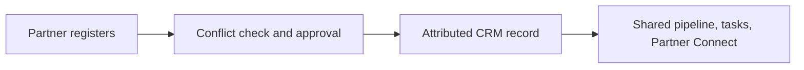
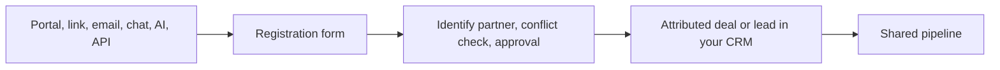
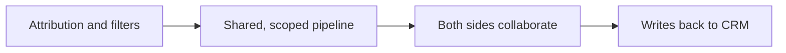
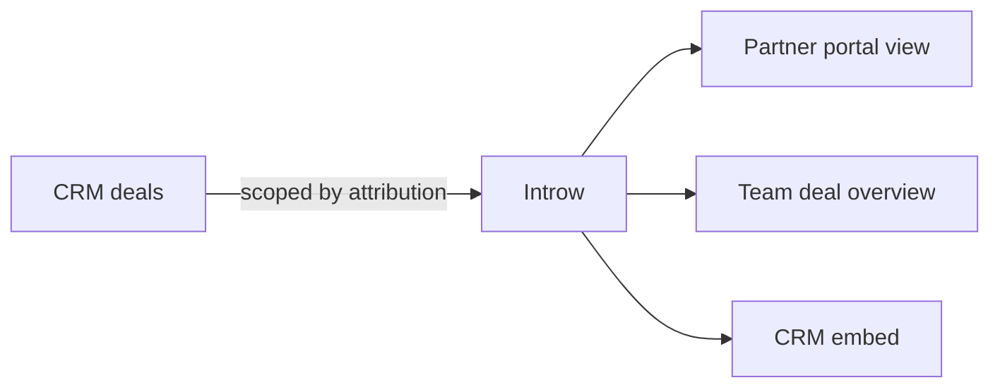
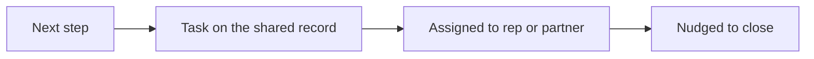

# Introw docs (docs.introw.io): features-co-selling

Verbatim from docs.introw.io/llms-full.txt, fetched 2026-09-29. 16 pages.

# Deal & Lead Registration
Source: https://docs.introw.io/features/co-selling/deal-lead-registration/index

Let partners register deals and leads, run conflict checks and approvals, then attribute each record in your CRM so both sides can co-sell.

> Every co-sell starts with a registered deal. Once a partner registers and the deal lands attributed in your CRM, the collaboration features in this domain take over.

## The problem it solves

<Pains>
  | Without Introw                  | With Introw                        |
  | ------------------------------- | ---------------------------------- |
  | A partner tells you in an email | A form, checked and routed         |
  | Two partners claim one deal     | Conflict is caught up front        |
  | Credit is argued at close       | Attribution is set at registration |
  | Registrations sit unanswered    | Approvals route and respond        |
</Pains>

## Impact

A referral partner refers again when the first one was acknowledged quickly and credited clearly. Registration is where you win or lose the second referral.

<Impact>
  for your business

  * **No new tool**
    A partner registers from the portal, from chat, from their own CRM, or over the API, whichever they already use
  * **Trustworthy**
    Channel-conflict checks and your own approval rules run before the deal lands, so credit is unambiguous
  * **In your CRM**
    The registered deal is written to HubSpot or Salesforce attributed to the partner, ready to collaborate on

  for your partners

  * **Self-serve**
    They register the opportunity themselves and see it acknowledged, without a call to their partner manager
  * **Enabled**
    Registration is what protects their investment in the deal, and they can see that it worked
  * **Efficient**
    One submission, and the collaboration surface for that deal exists from then on

  [A day in the life of a co-sell partner](/days-in-the-life/co-sell-partner)
</Impact>

<Personas>
  * **Partner Managers** - clean partner pipeline
  * **Partner sales teams** - credit locked in up front
</Personas>

## See it work

<Tour>
  * 

    **Build the form**

    The fields a partner fills in, each mapped to a CRM property.

  * 

    **Set the deal defaults**

    Pipeline, stage, owner and name are filled in for them.

  * 

    **Partners fill it in**

    From the portal, a link or an embed; the same form from chat or the API.

  * 

    **Decide on the registration**

    What they submitted, the deal it created, and the partner behind it.

  * 

    **One inbox for all of it**

    Every registration, from every channel, lands here with a status.
</Tour>

## How it works

Deal and lead registration is the front door to co-selling. A partner tells you about an
opportunity, Introw checks it for channel conflict, routes it through the approvals you define,
and writes it to your CRM attributed to the partner. From there, both sides collaborate on the
same record through shared pipelines, Partner Connect, and tasks.

Underneath, a registration is a form. You build it in the form builder, and its CRM automation
maps each answer to a deal, lead, contact, or company property and links the record to the
submitting partner. Its channel-conflict check and approval gate decide which registrations need
a human. Nothing here is bespoke: the same builder, sharing channels, submissions inbox, and AI
validation that run every other partner form run registration too. The [How to](./technical)
page maps which of those guides you need, in the order you need them.

How a partner registers depends on the motion. Referral partners share a lead and let your team
close it. Resellers register and close their own deal, with the margin protection that goes with
it. Both reuse the same form, conflict, and approval mechanics, framed for their audience.
Whichever route they take, and whichever channel they use (the portal, a link, email, Slack or
Teams, an AI assistant, or the API), registrations land in one Submissions inbox and run through
the rules you set.

## Run it from your AI assistant

<Headless>
  * Register a deal or share a lead for Acme without leaving your assistant.
  * Show my pending deal and lead submissions and their status.
</Headless>

## Going deeper

<CardGroup>
  <Card title="How to" icon="screwdriver-wrench" href="./technical">
    Setup, configuration, and the registration how-tos in order.
  </Card>

  <Card title="API reference" icon="code" href="/general/introduction">
    Integration surface and code.
  </Card>
</CardGroup>

**Works with**

<CardGroup>
  <Card title="Form Builder" icon="table-list" href="/features/forms/form-builder">
    Every registration form is built here, without code.
  </Card>

  <Card title="CRM Automations" icon="table-list" href="/features/forms/crm-automations">
    The automation that writes a registration to your CRM, attributed.
  </Card>

  <Card title="Submissions & Approvals" icon="table-list" href="/features/forms/submissions-approvals">
    Every registration runs through review and approval.
  </Card>

  <Card title="Sharing & submitting" icon="table-list" href="/features/forms/sharing-submitting">
    Link, embed, email, chat, AI, or API: every way a partner registers.
  </Card>

  <Card title="Channel Conflict Resolution" icon="robot" href="/features/ai/channel-conflict">
    Screens each registration against your pipeline before it is accepted.
  </Card>

  <Card title="Lead Sharing" icon="share-from-square" href="/features/referrals/lead-sharing">
    Referral partners share leads off-portal.
  </Card>

  <Card title="Deal Registration" icon="file-signature" href="/features/deal-registration/registration">
    Resellers register and protect their own deals.
  </Card>
</CardGroup>

---

# Deal & Lead Registration
Source: https://docs.introw.io/features/co-selling/deal-lead-registration/technical/index

Set up deal and lead registration for co-selling in Introw: build the form, map it to your CRM, add conflict checks and approvals, share it, and work the inbox.

## Where it lives

A registration is a form. You build and configure it under **Portal**, at [Forms](https://app.introw.io/forms), and every registration lands at [Submissions](https://app.introw.io/submissions).

<Frame>
  
</Frame>

## Before you start

| You need                         | Why                                             | Fix it                                                                                            |
| -------------------------------- | ----------------------------------------------- | ------------------------------------------------------------------------------------------------- |
| A connected CRM with attribution | A registration credits the partner through it   | [Configure attribution](/features/co-selling/shared-pipelines/guides/configure-deal-attribution)  |
| Write access to Forms            | Registration is form configuration              | [Internal roles](/features/access/team-management/guides/create-an-internal-role)                 |
| A shared pipeline, optionally    | So the registered deal opens as a shared record | [Set up a shared pipeline](/features/co-selling/shared-pipelines/guides/set-up-a-shared-pipeline) |

## How it works

A registration is an Introw form with a CRM automation behind it. A partner fills it in from
wherever they work: the portal, a share link, an embed on your site, an email, Slack or Teams, an
AI assistant, or the API. Introw identifies the submitter and their partner, checks the
registration against your existing pipeline for channel conflict, holds it at the approval gate
when you have one, and on accept writes the record to HubSpot or Salesforce attributed to the
partner. The record then shows up on that partner's shared pipeline, so the co-sell continues on
the same object.

Deals and leads run through the same mechanics; what differs is the object the automation
writes. A **deal registration** maps to a deal, usually with the company and contact behind it, so
credit is locked in before anyone works the opportunity. A **lead registration** maps to a lead or
contact, and your team qualifies it into a deal. When a lead later becomes a deal, a lead picker
on the deal form ties the two records together.

Because it is a form, nothing about registration is bespoke. The form builder, the CRM
automation, channel-conflict analysis, the approval gate, the sharing channels, and the
Submissions inbox are the same ones every other partner form uses. This page tells you which of
those settings matter for registration and sends you to the full reference for each.

## Settings & configuration

Everything registration-specific lives on the form: its fields on the **Form builder** tab and
its behavior on the **Automation** tab, both from [Forms](https://app.introw.io/forms). The
Automation tab lists the form's blocks in four groups, **Submission**, **Review**,
**Notifications**, and **Records written**, and opens each one in the panel beside the list. The
settings below are the ones that decide whether a registration lands clean, credited, and on the
right desk.

### Fields and CRM mapping

On the **Form builder** tab, add the fields a partner fills in and map each one to a CRM object
and property under **CRM Mapping**. A deal registration usually asks for the company name and
domain, a contact, the deal amount, the expected close date, and one free-text question about the
opportunity. Keep it short: partners register more when the form only asks what you cannot look
up yourself. Add a **CRM object** field when you want a partner to pick an existing lead, account,
or contact instead of retyping it, and use conditional fields to ask a question only when it
applies. Start from the **Deal registration** or **Lead capture** template rather than a blank
form.

Full reference: [Form Builder](/features/forms/form-builder/technical).

### The deal or lead record

Under **Records written**, add the record a registration should write: a **Deal** for deal
registration, or a **Lead**, **Contact**, or **Company** for lead sharing. The panel asks four
questions in order.

**Which deal does this write to?** **Match or create** enriches the deal Introw finds in your CRM
and creates one only when nothing matches, so a registration never duplicates a deal you already
have. **Match only** never adds a record, for forms that should only ever update an existing deal.
A CRM object picker on the form outranks matching: the record the partner picks is the record
Introw writes to.

**Form fields** map what the partner submits to CRM properties. Each row carries a **Write mode**
that defaults to **Fill in if not known**, so partner data fills gaps and never overwrites what a
rep already set.

**Default values** are what the partner never sees: the pipeline, the stage, the deal owner (a
fixed person or the partner's own manager), and a deal-name convention built from text and
variables such as the company name via the partner. The panel also shows the values Introw
resolves itself at submission time, such as the partner attribution property, so you can see what
every registered deal is created with.

<Frame>
  
</Frame>

Full reference: [CRM Automations](/features/forms/crm-automations/technical).

### Attribution

**Partner links**, on the same panel, decides how the deal Introw writes gets attached to a
partner. **Submitting partner** links the record to the partner who submitted, using the
attribution methods you already configured on your CRM connection, with no per-form wiring. This
link is what puts the deal on that partner's shared pipeline and counts it toward their revenue
and commissions. **Identify submitter**, under **Submission**, matches the standard submitter
fields to partner details, so a registration that arrives off-portal, from a link, an email, or a
chat message, is still credited.

Full reference: [Configure deal attribution](/features/co-selling/shared-pipelines/guides/configure-deal-attribution).

### Channel conflict check

**Channel conflict check**, under **Review**, cross-references each registration against your
existing deals, contacts, and companies before anything is written. Turn on **Channel Conflict
Analysis**, scope it with filters, for example excluding Closed Lost deals, and add context about
how your team defines a conflict. The analysis proposes one of three outcomes: create a new
record, link the registration to the existing deal, or decline it. Conflict cases show the
overlapping records in the inbox so the reviewer decides with full context.

Full reference: [Channel Conflict Resolution](/features/ai/channel-conflict/technical).

### Approval gate

**Approval gate**, under **Review**, holds registrations for review before the CRM writes run.
Switch it on and pick how much of the review Introw AI owns. **Manual** sends every submission to
your approvers with no AI. **AI Assisted** has Introw AI pre-check each registration and
recommend, and your approvers decide. **Autonomous AI** lets Introw AI decide when it is confident
and escalate the rest to your approvers. The mode in force shows beside the block in the list.
Without a gate, a conflict-free registration is accepted the moment it arrives.

<Frame>
  
</Frame>

Full reference: [Approval gate](/features/forms/submissions-approvals/technical#approval-gate).

### Who gets told

**Notify your team**, under **Notifications**, sets who on your team is emailed about every new
registration; this is also where a **Submission error** email goes when your CRM refuses the
record, so leave nobody out. **Reply to submitter**, shown once the approval gate is on, holds the
accept, decline, and return emails the partner receives. **Confirmation screen**, under
**Submission**, is what the partner sees right after submitting: an end screen or a redirect to
your own URL.

### Sharing the form

**Share form** on the form gives you every entry point. A **General link** is open to anyone, a
**Partner link** stamps every submission with that partner's attribution, **Embed** places the
form on your own site, and the **API** tab turns it into a request from the partner's systems. In
a portal experience, add the form as a section. With the AI agent on and the integration
connected, partners also register by forwarding an email, messaging the agent in Slack or Teams,
or asking a connected AI assistant.

Full reference: [Sharing & submitting](/features/forms/sharing-submitting/technical).

### Working the inbox

[Submissions](https://app.introw.io/submissions) lists every registration with its status. Open
one to **Accept**, **Decline**, or **Return** it for more information, and reply to the partner
on the same thread. Use **Configure** to add the mapped CRM properties you triage by, such as deal
amount and stage, as columns. **Accepted** is final: accepting is what wrote the record and told
the partner yes, so correct the record in your CRM and return the submission if you need a
change.

Full reference: [Submissions & Approvals](/features/forms/submissions-approvals/technical).

## How-to guides

Registration owns no guides of its own. It is a form, so the guides live with Forms and with the
two registration motions. Follow them in this order.

### Start with the whole recipe

<Rail>
  * [**Register and approve a reseller deal**](/features/deal-registration/registration/guides/register-and-approve-a-deal)

    Build a reseller registration form that creates an attributed CRM deal, add channel conflict checks and approvals, and work the submissions inbox.

  * 

    [**Build and share a referral form**](/features/referrals/lead-sharing/guides/build-and-share-a-referral-form)

    Build a referral form that captures attributed leads, credits the referring partner, and share it as a link, an embed, or an API call from their systems.
</Rail>

### Build the form

<Rail>
  * 

    [**Build and publish a form**](/features/forms/form-builder/guides/build-and-publish-a-form)

    Create a no-code partner form in Introw: add and configure fields, set the confirmation screen, and publish it via link, embed, portal, or the API.

  * [**Partner form templates & use cases**](/features/forms/form-builder/guides/partner-form-templates)

    Partner form templates: deal registration, lead capture, support, MDF requests, partner applications, purchase orders, events, and feedback.

  * [**Show fields conditionally**](/features/forms/form-builder/guides/show-fields-conditionally)

    Build one form that adapts: fields that appear only when they are relevant, questions that become mandatory only when they apply, and whole sections that unfold from a single answer.

  * 

    [**Link a registered deal to an existing lead**](/features/deal-registration/registration/guides/link-a-deal-to-an-existing-lead)

    Let partners pick an existing CRM lead when they register a deal, write the lead reference on the deal, and associate the two records in your CRM.
</Rail>

### Write it to your CRM

<Rail>
  * 

    [**Connect a form to your CRM**](/features/forms/crm-automations/guides/connect-a-form-to-your-crm)

    Map fields to CRM properties, control how submissions create or update records, attribute them to the partner, and prefill from known data.

  * 

    [**Configure the deal owner and name for partner deals**](/features/deal-registration/registration/guides/configure-partner-deal-owner-and-name)

    Control who owns partner-registered deals in your CRM and how those deals are named, using default fields and naming rules on the deal automation.

  * 

    [**Configure deal attribution**](/features/co-selling/shared-pipelines/guides/configure-deal-attribution)

    Link every deal to the partner who sourced or influenced it so shared pipelines, partner-attached revenue, reporting, and commissions stay accurate.
</Rail>

### Check it and approve it

<Rail>
  * 

    [**Catch and resolve channel conflict**](/features/ai/channel-conflict/guides/catch-and-resolve-channel-conflict)

    Turn on AI channel-conflict screening for a deal form, then review and resolve any overlap from the Submissions inbox before it syncs to your CRM.

  * [**Choose how submissions get approved**](/features/forms/submissions-approvals/guides/choose-an-approval-model)

    Decide who signs off on partner form submissions, what accept, decline and return each do, and what the partner sees at every step.

  * [**Run a submission approval workflow**](/features/forms/submissions-approvals/guides/run-a-submission-approval-workflow)

    Set up a form submission approval workflow with steps and AI validation, notify the right reviewers, and process every submission to a clear outcome.
</Rail>

### Put it in front of partners

<Rail>
  * [**Ways to submit a form**](/features/forms/sharing-submitting/guides/ways-to-submit-a-form)

    Every way a partner can submit an Introw form: share link, website embed, email, Slack, Teams, AI assistant, bulk CSV upload, or API from your own systems.

  * 

    [**Submit a form via the API**](/features/forms/sharing-submitting/guides/submit-a-form-via-the-api)

    Submit any Introw form from your own systems: fetch its schema for field ids and picklists, post with a scoped API key, and run the same automations.

  * 

    [**Bulk upload multiple records**](/features/forms/sharing-submitting/guides/bulk-upload-multiple-records)

    Let partners submit many records at once with a CSV bulk upload: a template, picklists and validation on every row, and a preview that blocks bad data.
</Rail>

### Test it and work the inbox

<Rail>
  * [**Test a form before partners see it**](/features/forms/form-builder/guides/test-a-form-before-partners-see-it)

    Submit a form the way a partner will, confirm the CRM record and notifications it produces, walk every outcome, and clean up the test without leaving records behind.

  * 

    [**Customize the submissions inbox**](/features/forms/submissions-approvals/guides/customize-the-submissions-inbox)

    Customize the submissions inbox in Introw: choose the columns you review form submissions by, including custom fields and mapped CRM properties.
</Rail>

## Troubleshooting

<Warning>
  Registration needs partner attribution configured on your CRM connection, or the record cannot be linked to the partner and never reaches their shared pipeline. A registration only auto-accepts when it is conflict-free and no approval gate is on, and AI acts on its own only above the certainty threshold you set. A submission in **Error** reached Introw but your CRM refused the record: it is work, not a decision, so fix the field or the permission and retry.
</Warning>

<AccordionGroup>
  <Accordion title="Registrations all sit in Pending">
    An approval gate is on, or AI validation was not confident enough. Review them in Submissions, or adjust the approval steps and the threshold on the form's Automation tab.
  </Accordion>

  <Accordion title="The registered deal is not on the partner's shared pipeline">
    Attribution is not configured on the CRM connection, or the Submitting partner link is off under Partner links on the deal record. Fix the attribution method first, then switch the link back on.
  </Accordion>

  <Accordion title="A registration created a duplicate deal">
    Matching found no existing record. Check the match keys and filters on the deal record, or switch it to Match only for a form that should only update deals.
  </Accordion>

  <Accordion title="Conflicts are not flagged">
    Channel Conflict Analysis is off on the form, or its filters exclude the records that overlap.
  </Accordion>

  <Accordion title="A submission shows no partner">
    It came in through the general link and the submitter's email matched no partner contact. Share a partner link instead, or add the contact to the partner first.
  </Accordion>
</AccordionGroup>

---

# Visibility & collaboration
Source: https://docs.introw.io/features/co-selling/index

Give partners a live view of shared deals and CRM records with no CRM seat - register, comment, update, complete tasks, and stay in sync automatically.

> This is where partners **see and act on** the CRM records that involve them. Every partner - referral, reseller, distributor, implementation, or affiliate - gets a live, transparent view of their deals and records, is nudged automatically when something changes, and can self-serve on each one, while everything writes back to your CRM and no partner ever needs a seat in it.

## The problem it solves

<Pains>
  | Without Introw                    | With Introw                      |
  | --------------------------------- | -------------------------------- |
  | Partners cannot see what happened | They see their own deals live    |
  | You reconcile status over email   | Both sides read one record       |
  | Partners would need CRM seats     | Scoped views, and no seat        |
  | Attribution is argued afterwards  | Registration settles it up front |
</Pains>

## Impact

Opacity is what kills a channel. A partner who can see what happened to the lead they sent, without asking, refers again; the one who had to chase you does not.

<Impact>
  for your business

  * **In your CRM**
    Everything happens on the CRM record and writes back to it, so there is one pipeline rather than two to reconcile
  * **No new tool**
    Your reps stay in HubSpot or Salesforce and partners stay in the portal or their own CRM, on the same record
  * **Trustworthy**
    Attribution, conflict detection and approvals decide credit before the deal moves, not after it closes

  for your partners

  * **Self-serve**
    They comment, update the fields you expose and complete tasks on the deal, without a seat in your CRM
  * **Enabled**
    An automatic nudge when a stage changes, which for a referral partner is most of the value they wanted
  * **Efficient**
    Nobody emails to ask where a deal stands, because the answer is already on the record

  [A day in the life of a co-sell partner](/days-in-the-life/co-sell-partner)
</Impact>

<Personas>
  * **Partner Managers** - records that move without chasing
  * **Your own reps** - collaboration inside the CRM
  * **Partners of every type** - their deals, visible and actionable
</Personas>

## How this area works

Partnerships stall on opacity. The partner can't see what happened to the lead they sent, the vendor can't see the partner's work, and both sides reconcile status over email. This area closes that gap. Partners get a **transparent, scoped window into your CRM** and can **self-serve** on the records that involve them. They see the deal, get nudged when its stage changes, comment, update the fields you allow, and complete tasks. It all writes back to HubSpot or Salesforce, and none of it needs a CRM seat.

**Where this sits in a setup.** The [co-sell track](/tracks/co-sell) sequences this end to end, and the [distributor track](/tracks/distributor) adds the multi-tier case where two partners are credited on one deal.

<Rail>
  * 

    [**Deal & Lead Registration**](./deal-lead-registration)

    Let partners register deals and leads, with channel-conflict checks and approvals, synced to your CRM.

    [How to · 17 guides](./deal-lead-registration/technical)

  * 

    [**Shared Pipelines**](./shared-pipelines)

    A scoped view of their attributed deals and records: you set what they see, edit and how it is labelled, with auto-nudges on every change.

    [How to · 7 guides](./shared-pipelines/technical)

  * 

    [**Tasks**](./tasks)

    The next step on the shared deal, with an owner.

    [How to · 1 guide](./tasks/technical)
</Rail>

That transparency-and-self-service value is **not** limited to co-selling - it matters for every partner type:

* **Referral partners** - transparency into what happened to their lead, and an automatic nudge when the deal moves, is often the entire value they want.
* **Resellers & distributors** - one scoped, shared pipeline of their attributed deals, collaborated on in context.
* **Implementation partners** - a clean handoff on the won deal, worked without a CRM seat.
* **Affiliates** - visibility into the conversions and deals their referrals became.

Co-selling is simply the motion where both sides push a deal to close together; it rides on the same shared records. When a partner runs their own CRM, [Partner Connect](/features/partner-connect) links the two systems on one deal.

## Run it from your AI assistant

<Headless>
  * Which shared deals are closing this quarter and what stage are they in?
  * Add a comment on the Globex deal asking the rep for next steps.
  * Create a task on the Acme deal to send the security questionnaire.
</Headless>

---

# Collaborate on a shared deal
Source: https://docs.introw.io/features/co-selling/shared-pipelines/guides/collaborate-on-a-shared-deal

Work a shared deal in one collaboration view - review the timeline, comment and @-mention the vendor, add tasks, share files, and edit allowed fields.

## What you'll achieve

A shared deal opens as a full collaboration space. You can read everything that ever happened on it, leave an update, @-mention the other side to pull them in, add tasks and files, view related contacts and quotes, and edit the fields the vendor opened up. Both sides work the same record, so context never scatters across email threads - the partner self-serves on their own deal and reaches out for an update right where the work is.

## Before you start

<Steps>
  <Step title="The deal is attributed and visible to the partner">
    Only a deal attributed to a partner shows up in their portal. Confirm attribution and visibility first - see [Set up a shared pipeline](./set-up-a-shared-pipeline).
  </Step>

  <Step title="The fields and permissions are configured on the embed">
    What a partner can see and edit - properties, related contacts, line items, quotes, and notifications - is set once on the pipeline embed. Adjust it in the [implementation reference](../technical) if you need to.
  </Step>

  <Step title="The partner has portal access">
    The partner contacts working the deal need access to the experience so they can open it and act on it.
  </Step>
</Steps>

## Open the deal room

Open the shared pipeline and click the deal you want to work. As a partner, that's the pipeline in your portal; as the vendor, start from [Deals overview](https://app.introw.io/overview/DEAL) or the partner's record. See [View a partner's pipeline](./view-partner-pipeline) for finding the right deal.

<Frame>
  
</Frame>

The deal opens in its collaboration view, laid out in three lanes:

* **Left** - the **Partner** (company, tier, website, partner manager), the deal's own properties, and any **Commission**, **Quotes**, and **Line items** attached to it.
* **Middle** - the tabbed workspace: **Activity**, the AI agent, **Deal Coaching** (deals only), **Files**, and **Tasks**, with the comment box at the bottom.
* **Right** - the **Collaborators** in the loop, the **Account** the deal belongs to, and its related **Contacts**.

The header breadcrumbs the portal name, the deal's stage, and the deal name, so you always know where you are.

## Read the activity timeline

The **Activity** tab is the deal's full history, newest first. Everything that happens on the record lands here, for both sides to see:

* **Comments** and @-mentions left by either side.
* **Property changes** - each edit shows the field and its value from → to (stage moves, amount, close date, and any other tracked property).
* **New and shared deals**, and **sleeping-deal** alerts when a deal goes quiet.
* **Tasks** created, updated, and completed.
* **Quotes** created and published, and **form submissions** (like a deal registration) with their accept, decline, and return decisions.
* **Files** viewed or downloaded, and **commission** updates and payouts.
* **Announcements** and portal visits.

A closed-won deal gets a celebration marker. The AI agent can also appear in the timeline as the author of an action. Switch to the **Files** tab to see just the file activity, or **Tasks** to see just the task list.

## Post an update and pull in the vendor

Use the comment box at the bottom of the workspace to leave an update. The conversation stays attached to the deal, so everyone in the loop sees the thread and can reply.

<Steps>
  <Step title="Start the message">
    Type your update in the composer. On a deal, quick-start chips prefill common asks - **Check progress**, **Remove blockers**, and **Plan the follow-up** - so reaching out for a status is one click.
  </Step>

  <Step title="Pull in a specific person">
    Select **Mention someone** (or type `@`) and pick from the list. It suggests both the partner contacts on this deal and the vendor's team, so a partner can @-mention their rep or partner manager to pull them in - and get notified back the same way. Mentioned people are notified.
  </Step>

  <Step title="Attach a file if you need to">
    Use **Add attachment** to share a document with the message. It stays on the deal and shows up in the timeline and the **Files** tab, so materials live with the opportunity instead of in an inbox.
  </Step>

  <Step title="Add an emoji or ask AI">
    **Add emoji** for tone, or **Ask AI** to bring in the AI agent for help drafting or answering a question about the deal.
  </Step>

  <Step title="Choose who sees it">
    As a member of your team, use the visibility control on the composer to post to **Everyone** or keep it **Internal**. **Everyone** is the default and behaves as it always has: both sides see the comment and the partner is notified. **Internal** keeps the comment on the deal for your team only - the partner never sees it on any partner-facing surface, and it never triggers a partner notification.

    Internal comments are marked in the activity log, so anyone on your team can tell at a glance whether a note was shared with the partner. Partner contacts do not get this control; everything they post is visible to both sides.

    <Tip>
      This is what lets the deal thread hold the whole story. Deal strategy, pricing latitude, and risk notes stay internal on the same record as the partner conversation, instead of living in a side channel where the next person to pick up the deal will never find them.
    </Tip>
  </Step>

  <Step title="Send">
    Select **Send** (or press Enter). An **Everyone** update posts to the timeline for both sides immediately, and you can edit it later.
  </Step>
</Steps>

This is how a partner reaches out for an update self-serve: leave a comment, @-mention the vendor, and the conversation lives on the deal - no separate email chain to chase.

## Track next steps with tasks

Turn talk into next steps without leaving the deal.

* Open the **Tasks** tab to see every task on this deal, or select **Add task** to create one with an assignee and due date. You can also add a task straight from the comment box with **Add task**.
* Tasks carry a status - **to do**, **in progress**, or **done** - and status changes show up in the timeline.
* A partner can complete tasks assigned to them or that they created; the partner manager can edit any task. Marking a task done posts to the activity feed.

For the full task workflow, see [Run tasks on a shared deal](/features/co-selling/tasks/guides/run-tasks-on-a-shared-deal).

## Work the deal's details

The left and right lanes are where you see and update the deal itself.

* **Edit what you're allowed to.** If the vendor marked any properties editable, an **Edit** button opens the deal's fields for changes; everything else is read-only. Edits sync straight back to the CRM, so the vendor's source of truth stays current.
* **See the account and contacts.** The **Account** panel shows the company on the deal, and the **Contacts** panel lists the people on it. If contact creation is enabled, partners can add a new contact to the deal.
* **View quotes and line items.** When enabled, the **Quotes** and **Line items** panels show what's attached. With the right permissions, partners can create line items and build, publish, or process quotes on the deal.
* **Check commission.** If a commission is set on the deal, the **Commission** panel breaks it down.

## Keep the right people in the loop

The **Collaborators** panel on the right is your access control for the deal. It splits into two tabs - your team and the partner company:

* **Add** puts a specific person on the deal so they see it and get updates. Choose the team, then pick from suggestions or enter an email.
* **Remove** ends someone's access immediately. The partner manager is always included and can't be removed.
* A **bell** next to a collaborator means they're subscribed to automatic updates about this deal - driven by the notification rules configured on the embed (new deal, deal updated, deal won, sleeping deal).

Partner contacts without visibility restrictions are automatically in the loop and can join the collaboration, so you only need to add people explicitly when access is otherwise restricted.

## Self-serve on your own deal

Put together, the deal room lets a partner run their opportunity end to end in one place:

* Read the timeline to see exactly where the deal stands.
* Update the fields they're allowed to, and add tasks and files to keep it moving.
* Reach out with a comment and an @-mention when they need the vendor - who's notified and replies on the record.
* Ask the AI agent, and use **Deal Coaching** on deals for AI guidance and recommended materials.

No email threads, no waiting on a status reply - the work and the conversation live on the same record, and everything syncs back to the CRM.

## Verify it worked

The deal opens in its collaboration view. A comment you post appears in the **Activity** feed for both sides, and anyone you @-mention is notified. A task you add shows in the **Tasks** tab and the timeline, an edit to an allowed field syncs to the CRM, and anyone you remove from **Collaborators** can no longer open the deal.

## Related

<CardGroup>
  <Card title="Run tasks on a shared deal" icon="list-check" href="/features/co-selling/tasks/guides/run-tasks-on-a-shared-deal">
    Add next steps with owners and due dates on the shared record.
  </Card>

  <Card title="View a partner's pipeline" icon="chart-column" href="./view-partner-pipeline">
    Find and open the deals you co-sell with a partner.
  </Card>

  <Card title="Set up a shared pipeline" icon="diagram-project" href="./set-up-a-shared-pipeline">
    Attribute deals and control the fields partners see and edit.
  </Card>

  <Card title="Collaborate from your CRM" icon="plug" href="/features/integrations/crm">
    Work the same shared deal from inside HubSpot or Salesforce.
  </Card>

  <Card title="Nudge partners at scale via the API" icon="code" href="/features/developer/api/guides/nudge-partners-at-scale-via-the-api">
    Post the same comments from your own systems or an agent.
  </Card>

  <Card title="Shared pipelines overview" icon="book-open" href="/features/co-selling/shared-pipelines">
    How shared pipelines fit the co-selling program.
  </Card>

  <Card title="Implementation reference" icon="screwdriver-wrench" href="../technical">
    Full configuration options for the pipeline embed.
  </Card>
</CardGroup>

---

# Configure deal attribution
Source: https://docs.introw.io/features/co-selling/shared-pipelines/guides/configure-deal-attribution

Link every deal to the partner who sourced or influenced it so shared pipelines, partner-attached revenue, reporting, and commissions stay accurate.

<Info>
  Attribution reads the relationship your CRM already holds, so the exact clicks differ by CRM. Jump straight to yours - [Attribution in HubSpot](/features/integrations/crm/guides/attribution-in-hubspot) or [Attribution in Salesforce](/features/integrations/crm/guides/attribution-in-salesforce) - or compare every method in one place in [Attribute deals to partners](/features/integrations/crm/attribution).
</Info>

## What you'll achieve

Deals linked to the partner who sourced or influenced them, under a clear attribution name your team and partners recognize, so attributed deals flow into the right partner's shared pipeline and partner records, partner-sourced and partner-influenced pipeline shows correctly in reporting, and commission plans pay on exactly the deals a partner earned.

## Before you start

<Steps>
  <Step title="Connect your CRM">
    Your CRM must be connected and synced, since attribution reads the relationship between a deal and a partner from it. See [Connect HubSpot](/features/integrations/crm/guides/connect-hubspot) or [Connect Salesforce](/features/integrations/crm/guides/connect-salesforce).
  </Step>

  <Step title="Have partners in Introw">
    The partners deals attribute to must exist in Introw so the link resolves to a real partner record. See [Sync partners and contacts](/features/integrations/crm/guides/sync-partners-and-contacts).
  </Step>

  <Step title="Know how deals relate to partners">
    Decide which relationship your CRM already uses: a deal property that holds the partner, an association between the deal and the partner company or object, or a Salesforce lookup or relation table. If you have none yet, Introw can create one for you. Compare every option for your CRM in [Attribute deals to partners](/features/integrations/crm/attribution).
  </Step>
</Steps>

## Watch it

<Tabs>
  <Tab title="Video">
    <video />
  </Tab>

  <Tab title="Click through">
    <iframe />
  </Tab>
</Tabs>

## Steps

### Understand what attribution drives

<Steps>
  <Step title="Know why this is the foundation">
    Attribution is the one link that answers "whose deal is this?". Before you configure it, know what reads from it, because a wrong or missing attribution silently breaks all of it:

    * **Shared pipelines and partner records** - a partner only sees a deal if it is attributed to them, so attribution is what scopes each partner to their own deals and never anyone else's.
    * **Reporting** - partner-sourced and partner-influenced pipeline and revenue are only credited to a partner when a deal resolves to them.
    * **Commissions** - a plan's eligibility can filter on partner attribution, so a partner only earns on deals actually tied to them. See [Set eligibility conditions](/features/commissions/commission-plans/guides/set-eligibility-conditions).

    You attribute the **Deal** (HubSpot) or **Opportunity** (Salesforce) object at minimum; you can attribute additional objects (contacts, companies, tickets, custom objects) the same way.
  </Step>
</Steps>

### Configure the attribution

<Steps>
  <Step title="Open Object Linking">
    Go to [Settings, then Integrations](https://app.introw.io/settings/integrations?category=crm) and open your connected CRM with **Configure**, then go to **Which objects do you link with partners?** (the **Object Linking** screen). Choose **Add object** to create a new mapping, or open the existing **Deal** or **Opportunity** mapping to edit it. This is the same attribution step the connect wizard runs, reopened so you can add or refine mappings any time.

    <Frame>
      
    </Frame>
  </Step>

  <Step title="Choose the method that matches your data">
    On **How do you attribute partners to Deal objects?**, pick the method that mirrors how your CRM already links deals to partners. Match your existing model rather than restructuring it:

    * **Custom property** - link each deal to a partner through a property you already maintain (a partner dropdown, picklist, or lookup). Best when a deal records one partner on a field.
    * **Association / relation** - attribute through a native association (HubSpot) or a lookup or relation table (Salesforce) between the deal and the partner company or object. Best when you already relate partners to deals natively, and required for many-partners-per-deal.
    * **No attribution yet** - if no link exists, Introw creates a dedicated partner property on the object for you in one click, so you can start fresh.

    Each method's exact clicks live in the CRM-specific attribution guides: [Attribution in HubSpot](/features/integrations/crm/guides/attribution-in-hubspot) and [Attribution in Salesforce](/features/integrations/crm/guides/attribution-in-salesforce).

    <Frame>
      
    </Frame>
  </Step>

  <Step title="Map values to partners if prompted">
    When the source holds coded values rather than partner names, use **Match property values to Introw partners** to line each CRM value up with the right partner record, so deals resolve to the correct partner. For an association or relation, confirm the label or keys that represent the partner relationship.

    <Frame>
      
    </Frame>
  </Step>

  <Step title="Name the attribution">
    Set **What name do you want to use for this attribution?** so the link reads clearly to your team and partners. The name is not cosmetic: it is how the credit is labeled in reporting and how you target it in commissions. Use language that reflects the role, for example **Sourced by** for the partner who created the deal and **Influenced by** for a partner who helped.

    <Frame>
      
    </Frame>
  </Step>

  <Step title="Add more attributions for sourced vs influenced">
    If a deal can involve more than one partner, add a second attribution (for example one named **Sourcing partner** and one **Influencing partner**) so a deal can credit both without them colliding. This is what lets a distributor and a reseller, or a referrer and a co-seller, share credit and visibility on the same deal. Repeat the method + name steps for each attribution you need.

    <Frame>
      
    </Frame>
  </Step>

  <Step title="Save and confirm">
    Select **Add Deal attribution** (or **Save** when editing) and confirm when Introw asks you to verify the configuration. Introw then resolves every matching deal to its partner on the next sync, and keeps new and updated deals attributed automatically.
  </Step>
</Steps>

## Verify it worked

Open a partner-influenced deal in your CRM. In Introw it now shows attributed to the right partner under your attribution name, that partner's pipeline in a shared experience includes the deal, and their sourced or influenced pipeline reflects it in reporting and commissions. If a deal is missing, confirm the deal carries the property, association, or relation your method reads, and that any coded values are mapped to a partner.

## Related

<CardGroup>
  <Card title="Attribute deals to partners" icon="link" href="/features/integrations/crm/attribution">
    Compare every attribution method across HubSpot and Salesforce in one place.
  </Card>

  <Card title="Attribution in HubSpot" icon="diagram-project" href="/features/integrations/crm/guides/attribution-in-hubspot">
    Every HubSpot attribution method - properties, association labels, custom objects - and when to use each.
  </Card>

  <Card title="Attribution in Salesforce" icon="diagram-project" href="/features/integrations/crm/guides/attribution-in-salesforce">
    Every Salesforce attribution method - picklists, lookups, relation tables, custom objects - and when to use each.
  </Card>

  <Card title="Set up a shared pipeline" icon="chart-line" href="./set-up-a-shared-pipeline">
    Put attributed deals in front of partners in the portal.
  </Card>
</CardGroup>

---

# Let partners update a deal with guardrails
Source: https://docs.introw.io/features/co-selling/shared-pipelines/guides/let-partners-update-a-deal-with-guardrails

Give partners one button that updates their own deal: the stages you allow, a mandatory reason when they close it lost, and no button at all once the deal is decided.

Partner-reported pipeline is either stale or unsafe.
Leave the deal read-only and your partner manager chases updates by email.
Mark the fields editable and a partner can quietly close a deal won, or close one lost with no reason anyone can report on.
This guide builds the middle path: instead of opening fields up on the record, you put one button on the deal that opens a short form, and the form is where the rules live.
It offers only the stages you allow, demands a closed-lost reason the moment a partner picks Closed Lost, and is not there at all once the deal is decided.

## What you'll achieve

A partner opens one of their open deals in the portal and presses **Edit**.
A form opens, already knowing which deal it is about, offering a stage list with no Closed Won in it.
Choosing Closed Lost makes a mandatory reason appear, so a deal cannot be closed lost silently.
Once the deal is Closed Won or Closed Lost the button is gone, so the record reads as settled.
Every answer writes straight to the deal in your CRM.

## Before you start

<Steps>
  <Step title="Have a shared pipeline the partner can already see">
    This guide adds control to a pipeline that exists. If partners cannot see their deals yet, build that first: deals attributed to the partner, a pipeline view on their experience, and filters that scope it. See [Set up a shared pipeline](/features/co-selling/shared-pipelines/guides/set-up-a-shared-pipeline).
  </Step>

  <Step title="Decide which fields partners should maintain">
    The stage is the usual one, and the next step is the usual companion, because between them they answer "where is this and what happens next". Close date is a common third. Keep the list short: this is a button a partner presses in passing, not a data-entry exercise.
  </Step>

  <Step title="Know the property your closed-lost reporting reads">
    Use the property your own funnel reporting already reads, not a new one, or the partner's answer will land somewhere nobody looks. A dropdown beats free text, because a reason you can group is a reason you can act on.
  </Step>
</Steps>

## Watch it

<Tabs>
  <Tab title="Video">
    <video />
  </Tab>

  <Tab title="Click through">
    <iframe />
  </Tab>
</Tabs>

## Steps

### Decide the rule before you build it

<Steps>
  <Step title="Write the rule down in one sentence">
    Every choice below follows from it, and a rule you cannot state in a sentence turns into a form nobody understands. For this guide the rule is: partners may move a deal through the open stages and may close it lost with a reason, but only your own team closes a deal won.
  </Step>

  <Step title="Know which control carries which clause">
    Four controls are involved and they are easy to confuse, so it is worth holding them apart before you touch anything:

    * **The editable properties on the view** decide whether a partner can change a field directly on the record, with no form and no rules. For this recipe you deliberately leave them off.
    * **The form's fields** decide what a partner can change, and its dropdown options decide which values they may set.
    * **The form's visibility conditions** decide what a partner has to tell you, and when that becomes mandatory.
    * **The action's visibility** decides whether the button is offered on this deal at all.
  </Step>

  <Step title="Choose whether the change is instant or reviewed">
    A submission either writes on submit or waits for approval. Instant is right when the change is low-risk and the point is fresh pipeline. An approval gate is right when the change ends the deal, because a closed-lost reason nobody read is a reason nobody acted on. You can have both by pointing one button at an ungated form for ordinary moves and a second at a gated form for the closing path.
  </Step>
</Steps>

### Make the form the only way to change the deal

<Steps>
  <Step title="Open the pipeline view's configuration">
    Go to [Experience builder](https://app.introw.io/templates), open the experience carrying the pipeline, and open the deals list configuration. Everything in this phase and the last one lives on its **Configuration** tab.

    <Frame>
      
    </Frame>
  </Step>

  <Step title="Leave the fields you want rules on as read-only">
    This is the move the whole recipe rests on, and it is the opposite of what feels natural. Under the property configuration, keep the stage **visible but not editable**, along with any other field the form is going to own.

    A field marked editable can be changed directly on the record: inline in the list, by dragging a card between stage columns on the board, and in the built-in **Edit** dialog. None of those paths can ask a follow-up question or make anything conditional, so a stage that is editable is a stage a partner can close without explaining. Leaving it read-only removes that path, and your form's own writes are unaffected. The button becomes the only way in, which is exactly what makes the rules enforceable.
  </Step>

  <Step title="Trim the stage list on the view as well, if you want belt and braces">
    Under **Configure stages** you can also remove a stage from the view entirely. A removed stage stops being a board column, stops being a drag target, and stops being an option in every stage picker on the view.

    You do not need this when the fields are read-only, but it is worth doing when the same view also exposes editable fields, or when a stage should simply never appear in a partner's world. While you are there, reorder the stages into the sequence partners read them in, and rename any of them to partner-facing wording. Renaming is display only, and your CRM's own label stays available as a tooltip. **Add stage** brings a removed stage back.
  </Step>
</Steps>

### Build the update form

<Steps>
  <Step title="Create the form">
    Go to [Forms](https://app.introw.io/forms) and create a short form. Name it for the job, such as Update deal, because the name is what you pick from when you wire the button.

    <Frame>
      
    </Frame>
  </Step>

  <Step title="Start with a deal field, so the form knows which deal it is about">
    Make the first field a **CRM object** field set to the deal object. This is the field that carries the record: when the form is opened from a button on a deal, Introw prefills it with that deal, so the partner never picks it and an answer cannot land on the wrong record.

    Do not skip it because the partner will not see it in use. Without this field the form has nothing to attach to, and the submission creates a new deal instead of updating the one on screen.

    <Frame>
      
    </Frame>
  </Step>

  <Step title="Add the fields partners may change">
    Add one field per property you decided on, each mapped to that property. This is what "editable" means in this design: a field is changeable because it is on the form, not because it is flagged on the record.

    * **Stage** - the field this whole guide is about.
    * **Next step** - the natural companion, and the one your partner manager actually wants filled in.
    * **Close date** - add it if partners are close enough to the deal to be right about it.

    Mark the stage required. A partner opening an update form has come to change something.

    Keep separate concerns in separate forms. One form for ordinary progress updates and another for a quote or order request reads better than one long form that tries to cover both, and it lets each one have its own approval setting and its own button.
  </Step>

  <Step title="Cut the stage options down to the ones partners may set">
    Open the stage field. Because it is mapped to a CRM picklist it takes its options live from your CRM, so you never maintain a second list. Then limit what this form offers: uncheck **Closed Won**.

    The list is exclusion-based, so everything is offered by default and you opt options out. That direction matters, because a stage your team adds in the CRM next quarter shows up on the form on its own instead of silently going missing. See [Dropdown options](/features/forms/form-builder/technical#dropdown-options).

    Leave **Closed Lost** checked. Partners closing their own dead deals is the outcome you want, as long as they explain it, which is the next step. Unchecking both leaves partners no way to close anything and defeats the point of the reason field.

    <Frame>
      
    </Frame>
  </Step>

  <Step title="Add the closed-lost reason, conditional and required">
    Add the field for your closed-lost reason, mapped to the property your reporting reads. Then do two things to it:

    * Add a **visibility condition**: show it when the stage field equals Closed Lost.
    * Mark it **required**.

    Those two settings together are the whole trick, and there is no separate conditionally-required setting to hunt for. A required field is only enforced while it is visible, so this field stays out of the way on every ordinary stage move and becomes unavoidable the instant a partner picks Closed Lost. See [Show fields conditionally](/features/forms/form-builder/guides/show-fields-conditionally).

    If your team reports on a sub-reason too, add it with a condition on the reason field. Conditions chain, so changing the reason collapses the sub-question with it rather than leaving an orphaned dropdown on screen.

    <Frame>
      
    </Frame>
  </Step>

  <Step title="Set the write behavior to overwrite on the fields that must change">
    On the **Automation** tab, add the CRM object automation for the deal and map each field to its property.

    Then check the write mode on each one, because the default will quietly defeat this form. Introw defaults to **Fill in if not known**, which writes only when the CRM value is blank. A deal's stage is never blank, so with the default in place the partner submits and nothing moves. Set the stage to **Overwrite**, and do the same for the next step and the closed-lost reason, which are all fields a later submission should be able to correct.

    <Frame>
      
    </Frame>
  </Step>

  <Step title="Decide the approval gate">
    Still on the **Automation** tab, enable the approval gate if you chose review earlier, and add the approver step: named users, a role, or the partnership manager. Leave it off and the submission is accepted on arrival and the deal moves immediately.

    A good default for this form is off, so ordinary stage moves are instant, with a second gated form for the closing path if your team wants a human on every lost deal.

    <Frame>
      
    </Frame>
  </Step>
</Steps>

### Put the button on the deal, and take it away when the deal is decided

<Steps>
  <Step title="Add the custom action">
    Back on the deals list configuration, scroll to the bottom of the **Configuration** tab to **Custom actions** and select **Add action button**. Pick the form you just built and give the button a label partners will understand. **Edit** is the honest label here because editing is what it does; anything clearer for your partners works just as well.
  </Step>

  <Step title="Hide the button once the deal is closed">
    Open the action's three-dots menu and choose **Configure visibility**. The panel reads `Show <your label> button when`, followed by a condition builder over the properties you exposed on this view.

    Add the conditions that keep the button off settled deals: the stage is not Closed Won, **and** the stage is not Closed Lost. An action with no conditions is always shown, so this is the step that makes a closed deal read as finished instead of inviting a partner to reopen it.

    Save it. The action list now shows a small count beside this button, so anyone opening the configuration later can see it is conditional rather than wondering why it does not appear on every deal.

    <Frame>
      
    </Frame>
  </Step>

  <Step title="Point the same mechanic the other way">
    Conditions work just as well for making a button appear as for hiding one, and this is where the pattern earns its keep. Point a second action at a purchase-order or quote-request form and show it **only** when the deal is Closed Won, so the next thing a partner is asked for arrives exactly when it is due. Point a third at a support or resource request and leave it always visible, so partners are never stuck without a way to ask.
  </Step>

  <Step title="Know that the button also works on a selection">
    In the table view, a partner can tick several deals and press the same button once from the bar above the table. The form opens with every selected deal listed and is submitted once per deal, so each one goes through your stage options, the required reason and the CRM automation on its own. See [Let partners update many records at once](/features/co-selling/shared-pipelines/guides/let-partners-update-many-records-at-once).

    <Frame>
      
    </Frame>
  </Step>

  <Step title="Know that the agent uses the same button">
    When a partner asks the AI agent to change a deal, in the portal or from an assistant connected through Partner Connect, the agent goes through this button rather than writing to the deal itself. It only offers a button whose visibility conditions match the deal, so the closed-deal rule above holds for the agent too, and the stage options, the required reason and the CRM automation apply to its change as they do to the partner's. With no matching button, it offers to leave a comment instead.
  </Step>

  <Step title="Save the configuration and publish the experience">
    Save the embed configuration, then publish the experience so the change reaches the partners assigned to it.
  </Step>
</Steps>

## Verify it worked

Open the portal as a partner, or preview it, and open one of their open deals.

* **Edit** is on the record, and pressing it opens your form with the deal already filled in.
* The stage list offers your open stages, and **Closed Won** is not among them.
* Picking **Closed Lost** makes the reason field appear, and submitting without it is refused.
* Submitting moves the deal in your CRM, and the reason lands on the property your reporting reads.
* Asking the portal's AI agent to move the deal goes through the same button, with the same stage options and the same required reason.
* The deal is not editable any other way: no inline edit on the stage, and no dragging the card between columns.
* If you do leave the stage editable and your HubSpot pipeline has rules, such as an approval stage that cannot be skipped, a card dragged past it goes back to its column and the partner is told a pipeline rule in the CRM blocks the move.
* Reopen that same deal now that it is Closed Lost, and the button is gone.

<Warning>
  Conditions on a custom action are a relevance control, not a permission.
  They decide which buttons are worth showing on a record; they do not lock the deal, its stage, or its properties, and a hidden action's form stays reachable by its own link.
  What actually constrains a partner is the set of fields you left non-editable on the view, the stage options you removed from the form, and your CRM's own validation rules.
  Build it in that order, as this guide does, and use visibility to keep the record clean.
</Warning>

## Related

<CardGroup>
  <Card title="Show fields conditionally" icon="eye" href="/features/forms/form-builder/guides/show-fields-conditionally">
    The conditional-field rules this guide leans on, in full.
  </Card>

  <Card title="Connect a form to your CRM" icon="plug" href="/features/forms/crm-automations/guides/connect-a-form-to-your-crm">
    Mapping, matching, and the write modes that decide whether an answer lands.
  </Card>

  <Card title="Set up a shared pipeline" icon="chart-line" href="./set-up-a-shared-pipeline">
    The pipeline this guide adds guardrails to.
  </Card>

  <Card title="Implementation reference" icon="screwdriver-wrench" href="../technical">
    Full configuration options.
  </Card>
</CardGroup>

---

# Let partners update many records at once
Source: https://docs.introw.io/features/co-selling/shared-pipelines/guides/let-partners-update-many-records-at-once

Partners select deals or any other CRM records in the portal's table view, then change one property on all of them or run one of your forms once per record.

A partner with thirty open deals updates them one record at a time, so the quarterly clean-up either takes an afternoon or does not happen.
In the portal's table view, partners now tick the records they mean and act on all of them at once.
They change one property on the whole selection, or run one of your forms once per record, and every write still goes through the rules you set on the view.

## What you'll achieve

A partner selects several records in the table view of a shared pipeline or any CRM section, then either sets one property on all of them, such as a new close date, or presses one of your custom action buttons and submits its form once for every selected record.
Each record is written to your CRM on its own, with your CRM's validation, your form's approval gate and your CRM automation applied per record.

## Before you start

<Steps>
  <Step title="A CRM section in a partner experience">
    A shared pipeline or another CRM section already on a partner's experience, scoped to their records. See [Set up a shared pipeline](/features/co-selling/shared-pipelines/guides/set-up-a-shared-pipeline) if you do not have one yet.
  </Step>

  <Step title="Something partners are allowed to do">
    At least one property the partner may edit, or at least one custom action on the section. With neither, there is nothing to apply to a selection, so no checkboxes appear.
  </Step>

  <Step title="Edit access to the experience">
    You need edit access to the experience to change the section's configuration and publish it.
  </Step>
</Steps>

## Watch it

<Tabs>
  <Tab title="Video">
    <video />
  </Tab>

  <Tab title="Click through">
    <iframe />
  </Tab>
</Tabs>

## Steps

### Decide what partners can do to a selection

<Steps>
  <Step title="Open the section's configuration">
    Go to [partner experiences](https://app.introw.io/templates), open the experience, go to the tab with the CRM section, and open the section's configuration. Everything a selection can do comes from this one sheet, so there is no separate bulk setting to turn on.
  </Step>

  <Step title="Mark the properties partners may change in bulk">
    Under the property list, open a property's three-dots menu and choose **Allow partner to edit**. A partner can then change that property on one record or on many.

    * **Good candidates** - close date, next step, a forecast category, an amount a partner owns. These are fields where one value applies to many records.
    * **Keep read-only** - anything that needs a reason or a review, such as the stage when a lost deal must say why. Route those through a custom action instead.
    * **Visibility conditions count** - a property hidden on one of the selected records by **Configure visibility** is not offered for that selection, so a partner never sets a field on a record where it does not show.

    <Frame>
      
    </Frame>
  </Step>

  <Step title="Add a custom action for changes that need a form">
    Under **Custom actions**, choose **Add action button**, pick the form and set the **Button label**. The same button a partner presses on one record appears above the table when they select several.

    The form is submitted once per selected record. Each submission has its own record filled in, and goes through the form's approval gate and CRM automation on its own, so an approval step reviews each deal rather than the batch. For the full recipe of stage options, required reasons and write modes, see [Let partners update a deal with guardrails](/features/co-selling/shared-pipelines/guides/let-partners-update-a-deal-with-guardrails).

    A form without a record field for this object is submitted once for the whole selection rather than per record, so give the form a CRM object field for the object the section lists.

    <Frame>
      
    </Frame>
  </Step>

  <Step title="Save and publish">
    Save the configuration and publish the experience, so the change reaches the partners assigned to it.
  </Step>
</Steps>

### Update records in bulk, as a partner

<Steps>
  <Step title="Switch to the table view">
    On a pipeline shown as a board, the partner picks **List view** in the switch at the top right. Bulk actions live in the table view only, because that is where records can be ticked. A section with one stage or none is always a table.

    <Frame>
      
    </Frame>
  </Step>

  <Step title="Select the records">
    Each row has a checkbox, and the checkbox in the header selects the whole page. The header then reads `<n> selected`, followed by the actions that apply to every selected record. A submission that is still waiting for its CRM record cannot be selected, and the actions disappear when nothing on the view applies.

    <Frame>
      
    </Frame>
  </Step>

  <Step title="Change one property on all of them">
    **Edit** opens **Bulk edit `<n>` deals** (or the name of the object). The partner picks the **Property to update**, enters the value, and presses **Update `<property>`**.

    * **Property to update** - only the editable properties that show on every selected record.
    * **The value** - the same input as on a single record: a date picker for a date, the stage list for a stage, your CRM's options for a dropdown. Your CRM's validation rules run before anything is written.
    * **The outcome** - a toast confirms `Updated <n> deals`. If some records fail, the dialog stays open and reads how many were updated and how many could not be.

    <Frame>
      
    </Frame>
  </Step>

  <Step title="Or run a custom action on all of them">
    The custom action's button opens its form. The record field lists the selection under **`<n>` deals selected**, names up to eight of them, and reads **This form is submitted once for each selected record.** The partner answers the form once and presses **Submit**.

    A toast confirms `Submitted <n> selected records`. If some submissions fail, the form stays open, says how many landed, and **Submit** again retries only the records that are still missing, so nothing is sent twice.

    <Frame>
      
    </Frame>
  </Step>
</Steps>

## Verify it worked

* In the portal, preview the experience as a partner, switch the pipeline to **List view** and tick two records: the header reads **2 selected** with **Edit** and your custom actions beside it.
* After a bulk edit, the records show the new value in the portal and in your CRM.
* After a bulk custom action, your submissions list holds one submission per selected record, each linked to its own deal.

## Limits and what to know

* **Up to 100 records per edit.** A larger selection has to be split.
* **One property per edit.** Change two fields by running two edits, or use a custom action whose form sets both.
* **A selection only offers what applies to every record in it.** An editable property hidden on one of the selected records is not offered.
* **The rules still apply per record.** A bulk edit is refused for a property that is not editable on the view, and a bulk custom action runs the same approval gate and automation as a single submission.

## Related

<CardGroup>
  <Card title="Let partners update a deal with guardrails" icon="shield-check" href="./let-partners-update-a-deal-with-guardrails">
    Build the form a custom action opens, with the rules it enforces.
  </Card>

  <Card title="Set up a shared pipeline" icon="chart-line" href="./set-up-a-shared-pipeline">
    The pipeline view partners select from.
  </Card>

  <Card title="Connect a form to your CRM" icon="plug" href="/features/forms/crm-automations/guides/connect-a-form-to-your-crm">
    How each submission writes back to the record.
  </Card>

  <Card title="Implementation reference" icon="screwdriver-wrench" href="../technical">
    Full configuration options.
  </Card>
</CardGroup>

---

# Set up a shared pipeline
Source: https://docs.introw.io/features/co-selling/shared-pipelines/guides/set-up-a-shared-pipeline

Attribute deals to partners, add a scoped pipeline view to a partner experience, and control which deals and properties partners can see and edit - end to end.

## What you'll achieve

Partners open their experience and see a live pipeline of exactly the deals attributed to them, scoped by your filters, showing only the properties you exposed, each one only on the records where it matters - and able to edit just the fields you allow (for example to move a stage or update a close date). Everything reads and writes straight to your CRM, so the portal stays in sync without anyone leaving their own tools.

## Before you start

<Steps>
  <Step title="A connected CRM">
    Your CRM (HubSpot or Salesforce) must be connected, since the pipeline reads deals from it. Some controls below are HubSpot-only and are called out where they appear.
  </Step>

  <Step title="Access to integration settings and experiences">
    You need access to your CRM connection settings to set attribution, and edit access to a partner experience to add and configure the pipeline view.
  </Step>

  <Step title="A partner experience to add it to">
    Have the experience (the portal partners see) where the pipeline should appear, so you can drop the view into its content.
  </Step>
</Steps>

## Watch it

<Tabs>
  <Tab title="Video">
    <video />
  </Tab>

  <Tab title="Click through">
    <iframe />
  </Tab>
</Tabs>

## Steps

### Attribute deals to partners

<Steps>
  <Step title="Open your CRM connection">
    Go to [Settings, then Integrations](https://app.introw.io/settings/integrations) and open your CRM connection. Attribution is the foundation of everything shared: it links each deal to the partner who sourced or works it, and until it is set there is nothing to show in a pipeline.

    <Frame>
      
    </Frame>
  </Step>

  <Step title="Define how deals relate to partners">
    Configure the attribution using the relationship your CRM already holds between a deal and a partner (for example a partner association or a property on the deal). This decides which partner each deal belongs to, so it appears for the right partner and no one else. Save it and let Introw sync; attributed deals then become available to expose in a pipeline view and on partner records.

    <Frame>
      
    </Frame>
  </Step>
</Steps>

### Add the pipeline view to a partner experience

<Steps>
  <Step title="Open the experience builder">
    Go to [partner experiences](https://app.introw.io/templates) and open the experience where the pipeline should appear. The view lives in the experience content, so partners reach it as part of their portal rather than as a separate report.

    <Frame>
      
    </Frame>
  </Step>

  <Step title="Insert a deals list and pick the pipeline">
    Add a CRM list of deals to the content, then set its core inputs:

    * **Object and pipeline** - choose the deal object and which pipeline's stages to show; this defines the columns of a board view and the stage set partners see.
    * **Stages** - keep the stages partners should see and hide any that are internal-only, so the board reflects the partner-facing process.
    * **Layout** - show the view as a board by stage or as a table. A board reads well when partners move deals through stages; a table suits a denser, read-heavy list. (A board needs more than one visible stage; otherwise it falls back to a table. HubSpot custom objects with a pipeline get the board too.) The table view is also where partners select several records and edit them together, see [Let partners update many records at once](/features/co-selling/shared-pipelines/guides/let-partners-update-many-records-at-once).
    * **Saved views** - save one or more named views with their own columns and filters when different cuts of the pipeline are useful.

    <Frame>
      
    </Frame>
  </Step>
</Steps>

### Scope which deals appear

<Steps>
  <Step title="Set the view's filters">
    Open the view's filters. Even within a partner's attributed deals, not everything belongs in the portal, and filters scope the list precisely. The view starts with a partner-attribution filter so each partner only ever sees their own deals; add further conditions (pipeline, stage, a property value) to narrow it. At least one filter is required, and the partner-attribution filter is what guarantees partners never see another partner's deals.

    <Frame>
      
    </Frame>
  </Step>
</Steps>

### Choose what partners see and edit

<Steps>
  <Step title="Open the property configuration">
    Open the deals list configuration. Properties are set per embed (and the same configuration governs the record when a partner opens a single deal), so this is where you decide the partner-facing fields.
  </Step>

  <Step title="Configure the visible properties">
    Add the properties partners should see and shape how they appear. For each property you can:

    * **Add or remove** - choose which fields are exposed; leave internal fields off entirely.
    * **Rename** - relabel a field to partner-friendly wording without touching the CRM name.
    * **Reorder** - drag to set the order partners read them in.
    * **Hide on card** - keep a property in the detail view but off the summary card, to keep cards clean.
    * **Configure visibility** - show the property only on records where it matters. **Property visibility** reads `Show <property> when`, followed by conditions on the record's other exposed properties, such as a discount field shown only once **Deal Stage** is Negotiation, or a loss reason shown only when it is Closed Lost. No conditions means always shown. The same dialog holds the **Show on card** switch. The stage, the pipeline, the header, the sort and the total property are always shown, and the menu says why.
    * **Primary** - mark the property shown as the card's headline; it defaults to the account.
    * **Sort** - set the property and direction the list sorts by (newest first by default).
    * **Notify on change** - flag properties whose changes should drive update notifications to the people watching the deal.

    <Frame>
      
    </Frame>

    <Frame>
      
    </Frame>
  </Step>

  <Step title="Mark the editable properties">
    Among the visible properties, choose which partners may edit; the rest stay read-only. Editing lets partners keep a deal current - amount, close date, next step - without a CRM seat. To let partners move deals across a board, the stage property usually needs to be editable. Leave anything partners should not change as read-only even if it is visible.

    <Frame>
      
    </Frame>
  </Step>

  <Step title="Decide related items">
    Choose what related records appear alongside the deal:

    * **Show related contacts** - expose the contacts on the deal; optionally **Include phone numbers**, and on HubSpot **Allow contact creation** so partners can add contacts.
    * **Show line items** - let partners view products and services on the deal. Viewing is available on any plan; **Allow line item editing** is HubSpot-only and requires the Product Hub add-on.
    * **Show quotes** - HubSpot-only; lets partners view quotes on the deal. **Allow quote creation** and **Allow quote publishing** require the Product Hub add-on (and quote-write permission on the HubSpot connection), and you can gate who creates or processes quotes by segment.

    <Frame>
      
    </Frame>
  </Step>

  <Step title="Set per-embed notifications">
    On the **Notifications** tab, set which events notify people for this embed - for example a **New object**, **Object updates** (on the properties you flagged), a **Sleeping object** stuck too long, or a **Deal closed won**. These overrides are per embed, so this pipeline can notify differently from another. Save the configuration when done.

    <Frame>
      
    </Frame>
  </Step>
</Steps>

## Verify it worked

Open the experience as a partner (or preview it): the partner sees a live pipeline of only their attributed deals, in the layout you chose, showing only the properties you exposed. Editing one of the fields you marked editable - moving a stage or changing a close date - writes straight back to your CRM, and your team reads the same deals from the deal overview.

<Frame>
  
</Frame>

## Related

<CardGroup>
  <Card title="Collaborate on a shared deal" icon="comments" href="./collaborate-on-a-shared-deal">
    Share a record, add collaborators, and discuss it in context.
  </Card>

  <Card title="View partner pipeline" icon="chart-line" href="./view-partner-pipeline">
    Read the same pipeline org-wide or per partner from Introw.
  </Card>

  <Card title="Collaborate from your CRM" icon="plug" href="/features/integrations/crm">
    Work the same deals from inside HubSpot or Salesforce.
  </Card>

  <Card title="Implementation reference" icon="screwdriver-wrench" href="../technical">
    Full configuration options.
  </Card>
</CardGroup>

---

# Share a lead or any CRM record with a partner
Source: https://docs.introw.io/features/co-selling/shared-pipelines/guides/share-a-crm-record-with-a-partner

Hand a lead, deal, or any other CRM record to a partner from Introw: pick the partner and the record, add context, review the email, and send. The partner gets it in their portal and inbox, and your CRM records the attribution.

A lead sits in your CRM and a reseller is the right company to work it.
**Share** hands it over in one dialog: you pick the partner and the record, add a line of context, review the email, and send.
Introw writes the partner onto the CRM record, posts the share on the record's activity, and emails the partner contacts you chose.
The record then shows up in the partner's portal, where they comment, update the fields you allow, and reply from their inbox.
The same dialog works for every record type you have linked to partners: deals, contacts, companies, tickets, and custom objects.

## What you'll achieve

A CRM record attributed to the partner in your CRM, visible in their portal, and announced by an email they can reply to.
Both sides work the record from there instead of from a forwarded email.

## Before you start

<Steps>
  <Step title="Attribution is configured for that record type">
    Sharing writes the partner onto the record with the attribution method of that record type: a property value, a HubSpot association, or a Salesforce relation.
    Set it up on the **Object Linking** screen of your CRM integration. See [Configure deal attribution](./configure-deal-attribution).
  </Step>

  <Step title="The partner has a portal with a section for that record type">
    The partner's experience needs a CRM section for the record type you share, such as a deal pipeline or a contact list.
    Sharing uses that section's properties to build the email and the portal view. See [Set up a shared pipeline](./set-up-a-shared-pipeline).
  </Step>

  <Step title="At least one partner contact has portal access">
    The dialog emails the partner's contacts who have portal access, so with none there is nobody to send to.
    Give access on the partner's **People** tab. See [Set up portal access](/features/portal/portal-access/guides/set-up-portal-access).
  </Step>
</Steps>

## Steps

<Steps>
  <Step title="Open Share">
    Go to [Deals](https://app.introw.io/overview/DEAL) and select **Share** in the top right.
    The same button sits on every record overview under **Track**, so open the Contacts, Companies, or Tickets overview to share one of those.

    Two shortcuts preselect the partner: on a partner's record, each record tab carries **Share deal** (or **Share contact**, **Share ticket**, and so on), and in HubSpot the Introw card offers the same **Share deal** action. See [Collaborate from HubSpot deals and tickets](/features/integrations/crm/guides/collaborate-from-hubspot-deals-and-tickets).

    When more than one record type is linked to partners, the dialog first asks which type you are sharing. Pick it and select **Continue**.
  </Step>

  <Step title="Select the partner">
    Under **Select Partner**, pick the partner company.
    Introw checks that this partnership can receive the record and shows **Checking availability...** while it does.
    If something is missing, the dialog names it and links to the fix:

    * **Create a portal for this partner.** The partner has no portal yet, so there is nowhere to show the record.
    * **Add a CRM Embed section on this type.** The partner's experience has no section for this record type. Add one in the experience builder, then save and publish.
    * **Give at least 1 person access.** No contact at this partner has portal access, so there is nobody to email. Fix it on the partner's **People** tab.
    * **Configure which property value represents this partner.** The attribution mapping exists for the record type but not for this partner. Complete it on the CRM integration.

    Fix the missing piece, then reopen **Share**.
  </Step>

  <Step title="Choose the attributions to apply">
    **Select attributions to apply** appears only when the record type has more than one attribution method, for example a partner property and a HubSpot association.
    The default, **All Attributions**, writes every method to the record on share.
    Narrow it when one method must stay untouched, such as a property your CRM automations key off.
    Whatever you leave selected is what your CRM shows as the partner on this record.
  </Step>

  <Step title="Pick the record">
    Under **Select Deal** (the label follows the record type), search for the record and pick it.
    When the partner's section is tied to a pipeline, the picker only offers records from that pipeline, so you cannot share a deal the partner could never see.

    Two things then appear:

    * **Already shared with** lists any partner who already has this record, so you do not hand the same lead to two resellers by accident.
    * The **Preview** card shows the record exactly as the partner's section exposes it: the same fields, labels, and values they will see in the email and in the portal. If it shows a field the partner should not see, or misses one they need, change the visible properties on the section first. See [Set up a shared pipeline](./set-up-a-shared-pipeline).
  </Step>

  <Step title="Add context">
    **Context** is optional and worth the thirty seconds.
    Write why the partner gets this record and what you expect next: who to contact, by when, what was already promised.
    It appears in the email as your personal message and on the record's **Activity** as your comment, so the partner reads it in both places and can reply to it there.
  </Step>

  <Step title="Review the email and the recipients">
    Select **Continue**. The dialog widens into a review:

    * On the left, the email exactly as it will send, in your branding, with the record's fields, the related company, and your context.
    * On the right, the partner's contacts with portal access, all ticked. The header reads **You are about to send an email to 3 people from Acme**. Untick anyone who should not receive it; the checkbox in the header toggles everyone. At least one recipient stays required.

    Select **Back** to change the record, the context, or the partner.
  </Step>

  <Step title="Share">
    Select **Share**. Introw then:

    * Writes the partner onto the CRM record with the attribution methods you chose, so your CRM is the record of the handoff.
    * Posts the share on the record's **Activity**, together with your context, as "shared this deal with Acme".
    * Emails the ticked contacts. The email carries **Respond via email**, so a reply from their inbox lands on the record as a comment and reaches everyone collaborating, and a link that opens the record in their portal.
    * Posts the share to the partner's mapped Slack or Microsoft Teams channel, when one exists.
    * Refreshes the record from your CRM and opens its collaboration view, so you can keep the conversation going right away.

    <Note>
      The shared-record email is not one of the events on **Default settings**: the recipients you tick are the whole decision. Everything that happens on the record afterwards, a stage change, a comment, a task, follows the normal notification rules. Sharing gives the ticked contacts access to the record but does not subscribe them to its updates; a contact who later submits a form on it, is added as a collaborator or is @mentioned starts receiving them. See [Every notification Introw sends](/features/engagement/notifications/guides/every-notification-introw-sends).
    </Note>
  </Step>
</Steps>

## Verify it worked

A **Successfully shared** toast confirms the send.
In your CRM, the record now carries the partner as its property value, association, or related partner.
In Introw, the record's **Activity** shows the share with your context, and the partner's portal shows the record in its section.
The partner receives the email and can reply to it; their reply appears on the record's **Activity** for both sides.

## Related

<CardGroup>
  <Card title="Collaborate on a shared deal" icon="handshake" href="./collaborate-on-a-shared-deal">
    Work the record together once it is shared.
  </Card>

  <Card title="Configure deal attribution" icon="link" href="./configure-deal-attribution">
    The attribution methods Share writes to your CRM.
  </Card>

  <Card title="Set up a shared pipeline" icon="diagram-project" href="./set-up-a-shared-pipeline">
    The section that decides what the partner sees.
  </Card>

  <Card title="Collaborate from HubSpot" icon="plug" href="/features/integrations/crm/guides/collaborate-from-hubspot-deals-and-tickets">
    Share the same record from the Introw card in HubSpot.
  </Card>

  <Card title="Every notification Introw sends" icon="bell" href="/features/engagement/notifications/guides/every-notification-introw-sends">
    What the partner hears about after the share.
  </Card>

  <Card title="Implementation reference" icon="screwdriver-wrench" href="../technical">
    Full configuration options for shared pipelines.
  </Card>
</CardGroup>

---

# Fix deals not showing in the partner portal
Source: https://docs.introw.io/features/co-selling/shared-pipelines/guides/troubleshoot-deals-not-in-portal

Understand the 'No portal yet' and 'No deal embed yet' messages on a deal and take the right action so partners can see and collaborate on it.

Introw syncs your deals and partners from the CRM automatically, but a deal is only visible to a partner once that partner has a portal experience with a matching pipeline embed. In the deal overview you may see **No portal yet** or **No deal embed yet** on a deal. Both are expected, informational messages. This guide explains what each means and the exact step that makes the deal show up for the partner.

## What you'll achieve

A clear understanding of the two messages and the fix for each, so a correctly synced deal becomes visible and collaboratable in the partner's portal.

## Before you start

<Steps>
  <Step title="Confirm the deal is attributed to a partner">
    These messages apply to deals linked to a partner. If a deal is not attributed, see [Set up a shared pipeline](./set-up-a-shared-pipeline).
  </Step>
</Steps>

## Steps

<Steps>
  <Step title="Read the message on the deal">
    Go to [Deals overview](https://app.introw.io/overview/DEAL) and open the deal. The deal details are always visible to your team; the message only tells you why the partner cannot see it yet. Note which message shows: **No portal yet** or **No deal embed yet**.

    <Frame>
      
    </Frame>
  </Step>

  <Step title="Fix 'No portal yet' by assigning an experience">
    **No portal yet** means the partner linked to the deal has no portal experience assigned, so no portal exists for them and deals cannot be embedded. In [Experiences](https://app.introw.io/templates), create or select an experience that includes a deal pipeline section, then assign it to the partner. Once assigned, Introw can show embedded content, including the deal pipeline, for that partner. See [Build and publish a portal experience](/features/portal/experiences/guides/build-and-publish-a-portal-experience).
  </Step>

  <Step title="Fix 'No deal embed yet' by matching the pipeline">
    **No deal embed yet** means the partner has an experience, but it either has no deal pipeline section, or the section is configured for a different pipeline than this deal belongs to. Open the partner's experience and add a deal pipeline section (or adjust an existing one) so it includes the pipeline this deal is on. See [Set up a shared pipeline](./set-up-a-shared-pipeline).
  </Step>

  <Step title="Publish and recheck">
    Publish the experience so the change reaches the partner, then reopen the deal. The message clears once the partner has a portal with a pipeline embed that matches the deal.
  </Step>
</Steps>

## Verify it worked

Reopen the deal in the overview: the message is gone, and previewing the partner's portal shows the deal inside its pipeline section, where the partner can view and collaborate on it.

## Related

<CardGroup>
  <Card title="Set up a shared pipeline" icon="diagram-project" href="./set-up-a-shared-pipeline">
    Add and configure the deal pipeline embed partners see.
  </Card>

  <Card title="Build and publish a portal experience" icon="table-columns" href="/features/portal/experiences/guides/build-and-publish-a-portal-experience">
    Create and assign the experience a partner needs.
  </Card>

  <Card title="Collaborate on a shared deal" icon="handshake" href="./collaborate-on-a-shared-deal">
    Work a deal with the partner once it is visible.
  </Card>
</CardGroup>

---

# View partner pipeline
Source: https://docs.introw.io/features/co-selling/shared-pipelines/guides/view-partner-pipeline

Read the shared partner pipeline in Introw org-wide or filtered per partner to track deals, stages, and partner-attached revenue at a glance.

To manage partner-attached revenue you have to see it. Reading pipeline from Introw, either
across the whole program or for one partner, gives partner managers the same visibility into
partner deals that the sales team has into direct deals.

## What you'll build

A clear read on shared pipeline, org-wide and per partner.

## Before you start

<Steps>
  <Step title="Confirm setup">
    Deal attribution should be configured so pipeline is available.
  </Step>
</Steps>

## Watch it

<Tabs>
  <Tab title="Video">
    <video />
  </Tab>

  <Tab title="Click through">
    <iframe />
  </Tab>
</Tabs>

## Steps

<Steps>
  <Step title="Open the deal overview">
    Go to [Deals](https://app.introw.io/overview/DEAL) to see attributed pipeline across the
    program.

    <Frame>
      
    </Frame>
  </Step>

  <Step title="Scope to a partner">
    Open a partner's record and view their deals to read pipeline for that partner alone.

    <Frame>
      
    </Frame>
  </Step>

  <Step title="Set the columns and filters">
    Use a view to choose the columns and filters that match how your team reads pipeline.
  </Step>
</Steps>

## Verify it worked

The deal overview shows attributed pipeline, and a partner's record shows their deals scoped
to them.

## Related

<CardGroup>
  <Card title="Set up a shared pipeline" icon="diagram-project" href="./set-up-a-shared-pipeline">
    Attribute deals and share the same pipeline with partners.
  </Card>

  <Card title="Collaborate on a shared deal" icon="comments" href="./collaborate-on-a-shared-deal">
    Work a specific deal with the partner.
  </Card>

  <Card title="Implementation reference" icon="screwdriver-wrench" href="../technical">
    Full configuration options.
  </Card>
</CardGroup>

---

# Shared Pipelines
Source: https://docs.introw.io/features/co-selling/shared-pipelines/index

Give partners and your team one CRM-drawn view of shared deals, with comments, files, and tasks scoped to exactly what partners can see and edit.

> Shared Pipelines gives both sides one view of the deals you are working together - and turns each of those deals into a shared workspace. Partners see their attributed pipeline, your team sees the same, and everyone collaborates on the actual CRM record.

## The problem it solves

Partners working blind to pipeline, and reps blind to the partner, is one of the biggest drags
on channel revenue:

<Pains>
  | Without Introw                      | With Introw                       |
  | ----------------------------------- | --------------------------------- |
  | Partners cannot see their own deals | Their attributed pipeline, live   |
  | The two pipelines drift apart       | One CRM record, both views        |
  | Updates get lost in email           | The conversation is on the record |
  | You cannot control what they see    | Per-field visible and editable    |
</Pains>

## Impact

Partners work the vendor they can see into. A live view of their own pipeline and a way to act on it is the difference between a partner who reports and a partner who sells.

<Impact>
  for your business

  * **In your CRM**
    Pipeline and collaboration are drawn from CRM-attributed records, so a stage change shows up for everyone at once
  * **No new tool**
    Reps work from HubSpot or Salesforce and partners from the portal or an embed, on the same object
  * **Trustworthy**
    Attribution, filters, collaborators and field-level visibility scope the view precisely, with no CRM seat

  for your partners

  * **Self-serve**
    They comment, add files, complete tasks and edit the properties you allow, on the real record
  * **Enabled**
    Any attributed object opens as a workspace: a deal, a contact, a company, a ticket, a custom object
  * **Efficient**
    One place to look, so nothing needs asking and nothing arrives twice

  [A day in the life of a co-sell partner](/days-in-the-life/co-sell-partner)
</Impact>

<Personas>
  * **Partner Managers** - one view per partner
  * **Your own reps** - the partner in context, in the CRM
  * **RevOps** - one pipeline, not two
  * **Partner sales teams** - their deals, and a way to act
</Personas>

## See it work

<Tour>
  * 

    **Their deals, your stages**

    Every record they are attributed to, without a CRM seat.

  * 

    **Self-serve on each one**

    Fields, files, commission, and one thread both sides post in.

  * 

    **Not only deals**

    Tickets, cases, any CRM object worth collaborating on.

  * 

    **Attribute the deal**

    A custom property or an association ties a deal to a partner.

  * 

    **Add the pipeline**

    Insert a deals list, and pick the pipeline and stages partners see.

  * 

    **Control the fields**

    Which properties partners see, rename, sort, and can edit.

  * 

    **Nudge on change**

    New, updated, sleeping, closed won: each one can notify.
</Tour>

## How it works

Shared Pipelines brings the pipeline and the record together. Partners see the deals
attributed to them in a pipeline view inside the portal, while your team sees the same
opportunities org-wide or per partner inside Introw. Because the records are drawn from your
CRM through attribution, the two views never diverge: a stage change in the CRM shows up for
everyone who should see it.

Each deal in that pipeline is also a collaboration surface. Any attributed CRM object - a
deal, contact, company, ticket, or custom object - opens with a shared activity feed for
comments, a files area, tasks, and the properties you expose. Reps work it from inside HubSpot
or Salesforce, partners from the portal or an embed, so neither side leaves the tool they live
in.

You stay in control of scope. Attribution decides which deals belong to which partner, filters
narrow the pipeline view, collaborators decide which partner contacts are in the loop on a
record, and field-level settings decide which properties partners can **see** and which they
can **edit** - all without handing out a CRM seat.

Shared Pipelines makes the CRM's pipeline a shared, scoped surface, and each record a shared
workspace. Attribution and filters decide what shows, collaborators and field-level visibility
decide who sees and edits what, and both sides read and act on the same records. Partners get
visibility and a way to contribute; your team keeps a per-partner view and full control; the
CRM stays the single source of truth.

## Run it from your AI assistant

<Headless>
  * Show all partner-attributed deals and their current stage.
  * Which shared deals have stalled with no activity in two weeks?
  * Update the amount on the Globex deal to \$95k.
</Headless>

## Going deeper

<CardGroup>
  <Card title="How to" icon="screwdriver-wrench" href="./technical">
    Setup, configuration, and all how-to guides.
  </Card>

  <Card title="API reference" icon="code" href="/general/introduction">
    Integration surface and code.
  </Card>
</CardGroup>

**Works with**

<CardGroup>
  <Card title="CRM" icon="plug" href="/features/integrations/crm">
    Collaborate from inside the CRM record.
  </Card>

  <Card title="Deal Coaching" icon="robot" href="/features/ai/deal-coaching">
    AI coaches partners on pipeline deals.
  </Card>

  <Card title="Tasks" icon="handshake" href="/features/co-selling/tasks">
    Add tasks to any shared deal.
  </Card>

  <Card title="Shared Pipeline" icon="file-signature" href="/features/deal-registration/shared-pipeline">
    Registered reseller deals work on this shared pipeline.
  </Card>

  <Card title="Form Builder" icon="table-list" href="/features/forms/form-builder">
    Put your own action buttons on a deal, so a partner update arrives as a form you can make conditional.
  </Card>
</CardGroup>

---

# Shared Pipelines
Source: https://docs.introw.io/features/co-selling/shared-pipelines/technical/index

Configure deal attribution, add a scoped pipeline view to the partner portal, and manage collaborators and record fields partners can see or edit.

## Where it lives

Shared Pipelines sits under **Track**, at [Deals](https://app.introw.io/overview/DEAL).

<Frame>
  
</Frame>

## Before you start

| You need                         | Why                             | Fix it                                                                                             |
| -------------------------------- | ------------------------------- | -------------------------------------------------------------------------------------------------- |
| A connected CRM with attribution | Partner deals are matched by it | [Configure attribution](/features/co-selling/shared-pipelines/guides/configure-deal-attribution)   |
| Access to partner experiences    | The pipeline view is a section  | [Publish an experience](/features/portal/experiences/guides/build-and-publish-a-portal-experience) |
| The Introw CRM embed             | Only to co-sell inside your CRM | [Embed the portal](/features/developer/embed/guides/embed-the-partner-portal)                      |

## How it works

A shared pipeline is the same set of CRM deals shown to both your team and your partners,
scoped by **attribution**. Attribution links each deal to the partner who should see it. Once
deals are attributed, you add a pipeline view to a partner experience so partners see their
deals in the portal, and your team reads the same deals from the deal overview, either org-wide
or filtered to a single partner.

Each deal - and any other attributed CRM object - can also be opened as a collaboration
surface, with a shared **Activity** feed for comments, a **Files** area, **Tasks**, and a set
of **properties** you decide to show. Your team opens it from an overview page, a partner
record, or the CRM embed; partners open it from the portal.

You control scope in a few places: attribution decides which deals belong to which partner, the
pipeline view's filters decide which of those deals appear, **collaborators** decide which
partner contacts are in the loop on a record, and **property visibility** decides which fields
partners can see and which they can edit.

## Settings & configuration

Attribution is configured in CRM setup; the pipeline view and embed are configured in a partner
experience; and your team reads pipeline from [Deals](https://app.introw.io/overview/DEAL).

### Deal attribution

Attribution links deals to partners so they can appear in a shared pipeline. It is set up on
your CRM connection in
[Settings, then Integrations](https://app.introw.io/settings/integrations), where you define how
deals relate to partners. Until deals are attributed, there is nothing to share.

### The pipeline view in the partner portal

In a partner experience, add a pipeline view (a CRM list of deals) and configure it: pick the
pipeline and record type, choose the properties partners see, and set the filters that scope
which deals appear. The view can be shown as a board by stage or as a table, and you can save
more than one view. Any object with more than one visible stage gets the board, HubSpot custom objects with a pipeline included; hide the stages down to one and the view is a table only.

#### Totals on the property you choose

Board columns and the pipeline bar total on the deal amount by default. Point them at a different
numeric or currency property instead - MRR, ACV, a partner-facing value that differs from the revenue
your team books - and both the stage totals and the value on each card follow it. The same setting
exists on the internal deal overview, where the property is flagged as the aggregation property on the
view.

#### Saved views and filters

One embed can carry several **named views**, each with its own filter set, so a single tab covers
"open", "closed this quarter", or one view per currency without a second embed. Filters accept any CRM
property, and every property type offers **Is known** / **Is not known**, text adds does-not-contain,
and dropdowns add **Is any of** / **Is none of**.
A filter on a property that points at another CRM record, such as the primary contact on an opportunity, lets you pick that record by name.
A filter on a date or a number compares it as a date or a number even when the property is not a column on the view, and a date filter covers the whole of its last day.

#### Which stages partners see

**Configure stages** lists the pipeline's stages in the order partners read them.
Drag to reorder, rename any stage to partner-facing wording (display only, with your CRM's own label kept as a tooltip), and remove a stage from the view entirely.

Removing a stage does two things at once, which is what makes it a guardrail rather than a cosmetic choice.
The stage stops being a column on the board, and it also stops being an option anywhere a partner changes the stage: the board's drag targets, inline editing in the list, and the stage picker on the record.
Drop **Closed Won** and partners can move a deal forward through the pipeline without being able to close it themselves.
**Add stage** brings a removed stage back.

#### Editing from the board

Partners edit the fields you marked editable **inline** in the list view, and drag a card between
stages on the board when stage editing is allowed on the view. Every edit is written straight through
to the CRM, and your CRM's own property validation rules are applied first - a value the CRM would
reject is refused in the portal with the property named, rather than failing silently later.

A card can be dropped on any visible stage column.
When a HubSpot pipeline rule refuses the move, for example an approval stage that cannot be skipped, the card goes back to where it was and the partner reads that a pipeline rule in the CRM blocks this stage change, with a pointer to their partner manager.

#### Bulk actions in the table view

In the table view, partners tick records and act on all of them at once.
A checkbox sits on every row, and the header checkbox selects the whole page.
The header then reads `<n> selected`, followed by the actions that apply to the whole selection:

* **Edit** opens **Bulk edit `<n>` deals** (or whatever the object is called). The partner picks one **Property to update**, enters one value, and **Update `<property>`** writes it to every selected record. Only properties you marked editable on this view are offered, and only those shown on every selected record. A partial failure says how many records were updated and how many were not.
* **Each custom action** on the view appears as its own button. Its form opens with every selected record listed under **`<n>` deals selected** and the note **This form is submitted once for each selected record.** On submit, Introw sends one submission per record, each with its own record filled in, so every submission runs the form's approval gate and CRM automation on its own. If some fail, the form stays open, says how many landed, and **Submit** again retries only the rest.

The bar only appears when the view has at least one editable property or one custom action.
Up to 100 records can be edited in one go, and a submission still waiting for its CRM record cannot be selected.
The same rules as a single record apply: a bulk edit is refused for a property that is not editable here, and your CRM's validation runs on every record.
See [Let partners update many records at once](/features/co-selling/shared-pipelines/guides/let-partners-update-many-records-at-once).

### Reading pipeline in Introw

Your team reads pipeline from the deal overview, which can be viewed org-wide or scoped to a
single partner from that partner's record. Saved views let you set the columns and filters your
team needs.

### Collaborating on a record

**Share**, top right on every record overview and on each record tab of a partner, hands a record to a partner: you pick the partner and the record, add context, review the email, and send.
Introw writes the partner onto the CRM record with that type's attribution method, posts the share on the record's **Activity**, emails the partner contacts you tick, and opens the collaboration view.
It is how you send a lead to a reseller, and the manual way to attribute any record.
See [Share a lead or any CRM record with a partner](/features/co-selling/shared-pipelines/guides/share-a-crm-record-with-a-partner).
**Collaborators** are the partner contacts in the loop on a record; add or remove them to
control who can see and act on the object. The **Activity** feed carries comments, **Files**
holds shared attachments, and **Tasks** tracks next steps.

**Comment visibility.** Your team members choose per comment whether it goes to **Everyone** or stays
**Internal**, using the control on the composer. Everyone is the default. An internal comment is hidden
from every partner-facing surface and never triggers a partner notification, and it is marked as
internal in the activity log so your team can tell shared notes from private ones. Partner contacts
have no such control; everything they post is visible to both sides.

**Comments from your own systems.** The same comments can be posted over the API, targeting a deal,
ticket, task, submission, payout, or the partner directly - including internal ones. See
[Nudge partners at scale via the API](/features/developer/api/guides/nudge-partners-at-scale-via-the-api).

**Which objects can be shared.** Collaboration is not limited to deals. Any CRM object type you have
mapped to partners can be opened up the same way, which is what lets a program run on the record its
business actually lives on: tickets for a support-led partnership, orders or line items for a reseller,
and **custom objects** for anything your CRM models itself. Installations, projects, sites, assets,
subscriptions and renewals are all common, and a partner sees them as a scoped list or pipeline in the
portal exactly as they see deals.

Two things to know. Custom-object collaboration is a plan module, so check what yours includes at
[introw.io/pricing](https://introw.io/pricing). And the object needs an attribution method before it can
be shared, since collaboration resolves through the partner link. See
[Configure deal attribution](/features/co-selling/shared-pipelines/guides/configure-deal-attribution) and
add the object on the **Object Linking** screen of your CRM integration.

### Visible, editable, and renamed properties

Property visibility is set on the CRM embed configuration for the object - and on the pipeline
view for deals. For each object you can:

* **Add any synced CRM field** - standard or custom, from the deal (or any attributed object) - not
  just a fixed default set.
* **Choose what partners see and edit** - mark each field visible and, independently, editable, so
  partners get the context they need without exposing internal fields.
* **Rename each field to partner-friendly terminology** - override the label a partner sees (for
  example show `dealstage` / `StageName` as "Stage" or "Where we are"). This is display-only: the
  value keeps coming live from the CRM, and the original label is kept as a tooltip. It's what lets
  the portal read in your partners' language instead of your internal property names.

#### Show a property only when it matters

A property's three-dots menu carries **Configure visibility**, which opens **Property visibility**: `Show <property> when`, followed by the same condition builder the custom actions use.
Conditions read the record's own CRM values, limited to the properties exposed on this view, and group with **and** / **or**.
A property with no conditions is always shown, which is the default, and a property with conditions shows a small count beside it.
The same dialog carries the **Show on card** switch, which keeps a property off the board card while it stays on the record.

Conditions are checked per record, so one view can show a discount field only once a deal reaches negotiation, and a loss reason only on a deal that is Closed Lost.
They apply on the board card and the record in the portal, in the table view, where a hidden cell reads as a dash, and on the HubSpot partner card.
The Salesforce embed does not apply them yet.

The properties that run the view itself are always shown, and the menu item is greyed out with the reason: the primary property that titles the card, the sorting property, the aggregation property behind the stage totals, the stage and the pipeline, and Introw's own properties.
Making a conditioned property the header, the sort or the total clears its conditions, and a toast says so.

Like custom action visibility, this is a relevance control, not a permission: it decides what is worth showing on a record, not what a partner may read through other means.

Related items like contacts and line items can be shown or hidden the same way, with line items and
quotes depending on your plan. The same add-any-field-and-rename model applies to Introw's internal
tables and object overviews too - see [Show and rename CRM fields](/features/integrations/crm/guides/show-and-rename-crm-fields).

### Custom actions

Editable properties decide what a partner can change directly on the record.
**Custom actions** put your own buttons on that record, each opening one of your forms in a dialog, already carrying the record's context so the partner does not re-pick the deal they are looking at.

The two are independent, and that is the useful part.
A form writes the properties you map on it whether or not those properties are marked editable here, so **a field can be read-only on the record and still changeable through a form**.
That is how you make a change conditional: leave the property non-editable, so inline editing, dragging a card between stage columns, and the built-in **Edit** dialog are all off the table, and route the change through a form that can narrow the options, ask a follow-up question, and make it mandatory.
Marking the same property editable as well simply reopens the unguarded path beside the guarded one.

Configure them on the embed's **Configuration** tab, under **Custom actions**.
Each action takes two things:

* **Form** - the form the button opens. Anything in your form list qualifies, so the same update form can serve several pipelines.
* **Button label** - what partners read on the button. Write the action, not the object: **Request an order**, **Update the deal**, **Ask for support**.

**Add action button** adds another, so one record can carry several actions side by side.

Because the form is a form, it brings the whole form builder with it: fields you choose, a narrowed set of dropdown options, [conditional fields](/features/forms/form-builder/technical#conditional-fields) that appear only when they are relevant, an optional [approval gate](/features/forms/submissions-approvals/technical#approval-gate), and a [CRM automation](/features/forms/crm-automations) that writes the answers back onto the same record.
That combination is how a request that needs a reason, a document, or a second pair of eyes stays a real request instead of a silent field edit.
See [Let partners update a deal with guardrails](/features/co-selling/shared-pipelines/guides/let-partners-update-a-deal-with-guardrails) for the whole recipe.

#### Show a button only when it is relevant

An action's three-dots menu carries **Configure visibility**, which opens **Custom action visibility**: `Show <label> button when`, followed by the same condition builder used elsewhere in Introw.
Conditions read that record's own properties, limited to the ones you exposed on this embed, and group with **and** / **or**.

An action with no conditions is always shown, which is the default.
Once an action has conditions, the list shows a small count beside it so you can see at a glance which buttons are conditional.
A record whose only actions are all hidden shows no empty action bar at all.

This is what turns a generic button into a stage-aware one.
**Request an order** appears only from the stage where an order makes sense, and **Update the deal** disappears once the deal is Closed Won or Closed Lost, so partners are never invited to reopen a decision that is already made.

<Warning>
  Custom action visibility is a **relevance** control, not a permission.
  It decides which buttons are worth showing on a record; it does not lock the record, its stage, or its properties, and a hidden action's form stays reachable by its own link.
  What a partner is allowed to change is governed by the editable properties on this view, the stages you left visible, and your CRM's own validation.
  Set those first, and use visibility to keep the record clean.
</Warning>

### Collaborating from the CRM

With the Introw embed installed in HubSpot or Salesforce, your reps open the same collaboration
view from inside the CRM record, so they never leave the tool they work in.

## How-to guides

<Rail>
  * [**Collaborate on a shared deal**](/features/co-selling/shared-pipelines/guides/collaborate-on-a-shared-deal)

    Work a shared deal in one collaboration view - review the timeline, comment and @-mention the vendor, add tasks, share files, and edit allowed fields.

  * 

    [**Configure deal attribution**](/features/co-selling/shared-pipelines/guides/configure-deal-attribution)

    Link every deal to the partner who sourced or influenced it so shared pipelines, partner-attached revenue, reporting, and commissions stay accurate.

  * 

    [**Let partners update a deal with guardrails**](/features/co-selling/shared-pipelines/guides/let-partners-update-a-deal-with-guardrails)

    Give partners one button that updates their own deal: the stages you allow, a mandatory reason when they close it lost, and no button at all once the deal is decided.

  * 

    [**Set up a shared pipeline**](/features/co-selling/shared-pipelines/guides/set-up-a-shared-pipeline)

    Attribute deals to partners, add a scoped pipeline view to a partner experience, and control which deals and properties partners can see and edit - end to end.

  * [**Share a lead or any CRM record with a partner**](/features/co-selling/shared-pipelines/guides/share-a-crm-record-with-a-partner)

    Hand a lead, deal, or any other CRM record to a partner from Introw: pick the partner and the record, add context, review the email, and send. The partner gets it in their portal and inbox, and your CRM records the attribution.

  * [**Fix deals not showing in the partner portal**](/features/co-selling/shared-pipelines/guides/troubleshoot-deals-not-in-portal)

    Understand the 'No portal yet' and 'No deal embed yet' messages on a deal and take the right action so partners can see and collaborate on it.

  * 

    [**View partner pipeline**](/features/co-selling/shared-pipelines/guides/view-partner-pipeline)

    Read the shared partner pipeline in Introw org-wide or filtered per partner to track deals, stages, and partner-attached revenue at a glance.
</Rail>

## Troubleshooting

<Warning>
  Pipeline views and the deal overview stay hidden until deal attribution is configured, since there is nothing to show without it. A pipeline view shows only deals attributed to the partner and matching its filters. Only objects attributed to a partner can be collaborated on. Property and related-item options depend on your plan and CRM; some quote and line-item controls are available on HubSpot with the relevant plan module. Removing a collaborator immediately ends their access.
</Warning>

<AccordionGroup>
  <Accordion title="Partners see no pipeline">
    Deals are not attributed yet, or the view's filters exclude them.
  </Accordion>

  <Accordion title="A partner cannot see a shared record">
    They are not a collaborator, or the record is not attributed to their partner.
  </Accordion>

  <Accordion title="A field is missing for partners">
    It is not set to visible on the object's embed or pipeline view configuration.
  </Accordion>

  <Accordion title="A deal shows for the wrong partner">
    Its attribution points to that partner; correct the attribution on the record.
  </Accordion>

  <Accordion title="A rep cannot collaborate from the CRM">
    The Introw embed is not installed in that CRM.
  </Accordion>

  <Accordion title="Share says the partnership is not configured">
    The dialog names the missing piece and links to it: the partner has no portal, the experience has no section for that record type, no contact has portal access, or the attribution mapping is missing for this partner. Fix it, then reopen Share. See [Share a lead or any CRM record with a partner](../guides/share-a-crm-record-with-a-partner).
  </Accordion>
</AccordionGroup>

---

# Run tasks on a shared deal
Source: https://docs.introw.io/features/co-selling/tasks/guides/run-tasks-on-a-shared-deal

Add a task to a shared deal, assign it to your rep or the partner with a due date, and turn on the notifications that keep both sides on schedule.

## What you'll achieve

A co-sold deal carries clear, owned next steps: each task names who is responsible - your rep or the partner - has a due date, and is visible to both sides on the shared record. With notifications on, owners are reminded when a task is assigned, due, or overdue, so the deal keeps moving without anyone chasing by hand.

## Before you start

<Steps>
  <Step title="The deal is shared with the partner">
    Tasks live on the shared record and are visible to its collaborators, so share the deal first. See [Collaborate on a shared deal](/features/co-selling/shared-pipelines/guides/collaborate-on-a-shared-deal).
  </Step>

  <Step title="You can collaborate on the record">
    You need permission to act on the shared deal to add and assign tasks on it.
  </Step>
</Steps>

## Steps

<Steps>
  <Step title="Open the shared deal">
    Go to [Deals overview](https://app.introw.io/overview/DEAL) and open the deal you are co-selling, or open it from the partner's record or the CRM card. Its collaboration view holds the **Tasks** section alongside the activity and files, so the task sits with the deal rather than in a separate tool.

    <Frame>
      
    </Frame>
  </Step>

  <Step title="Add a task">
    In the **Tasks** section, add a task and fill in its details:

    * **Name** - the next step in plain terms, so both sides know what done looks like.
    * **Due date** - when it is due; this is what drives the reminders, so set it whenever timing matters.
    * **Visibility** - whether the task is visible to the partner, internal to your team, or only to its assignee. Choose partner-visible for steps you want the partner to see and act on.
  </Step>

  <Step title="Assign the owner">
    Set who owns the task so responsibility is explicit:

    * **Owner side** - assign it to your organisation (your rep) or to the partner. A partner-owned task is what makes their next step theirs to complete.
    * **Assignee** - point it at the specific person, or at the partner company when any of their team can pick it up.

    Only assign a partner-owned task to a partner you have shared the deal with, since the task is visible to the record's collaborators.
  </Step>

  <Step title="Turn on task notifications">
    Go to [Default settings](https://app.introw.io/settings/segments/default), open the **Notifications** tab, and give the **Tasks** events their recipients so owners are kept informed:

    * **Task assigned / updated** - notifies the owner when a task is assigned to them or changes.
    * **Tasks nudge** - reminders when a task is due tomorrow and again if it is still open after it was due.

    These apply to both your team and partners. Chat reminders need the Slack or Teams integration connected; without it, reminders are email-based. For the full notification model and per-partner overrides, see [Partner notifications](/features/engagement/notifications).
  </Step>
</Steps>

## Verify it worked

The task appears in the deal's **Tasks** section for both you and the partner, showing its owner and due date. A partner-owned task with a due date generates a reminder to the partner, and you are notified when they complete it - so the next step is tracked end to end without manual follow-up.

## Related

<CardGroup>
  <Card title="Collaborate on a shared deal" icon="comments" href="/features/co-selling/shared-pipelines/guides/collaborate-on-a-shared-deal">
    Share the deal and set collaborators before adding tasks.
  </Card>

  <Card title="Partner tasks" icon="list-check" href="/features/partners/tasks">
    The full task model and how tasks work across partners.
  </Card>

  <Card title="Partner notifications" icon="bell" href="/features/engagement/notifications">
    Configure how and where task reminders are delivered.
  </Card>

  <Card title="Implementation reference" icon="screwdriver-wrench" href="../technical">
    Full configuration options.
  </Card>
</CardGroup>

---

# Tasks
Source: https://docs.introw.io/features/co-selling/tasks/index

Keep co-sold deals moving with tasks on the shared record - assign owners, set due dates, and make sure partners and reps always know the next step.

> Co-sold deals stall when the next step is unclear. Tasks on the shared record keep the partner and your rep aligned on what happens next and who owns it.

## The problem it solves

<Pains>
  | Without Introw                  | With Introw                      |
  | ------------------------------- | -------------------------------- |
  | Co-sold deals stall between you | An owned task keeps it moving    |
  | Next steps get lost in email    | They live on the shared record   |
  | Nobody owns the follow-up       | Every task has an owner and date |
  | Slippage goes unnoticed         | Due and overdue both notify      |
</Pains>

## Impact

Joint deals die of ambiguity about who does what next. Being the vendor whose next step is always written down is unglamorous, and it is why deals close.

<Impact>
  for your business

  * **No new tool**
    The task travels with the shared record, so it is visible in the CRM and in the portal alike
  * **In your CRM**
    The next step lives on the deal both sides already trust, not in a separate plan nobody opens

  for your partners

  * **Self-serve**
    They see exactly what is theirs to do next, and can complete it on the record
  * **Enabled**
    A task can carry an action: watch an asset, submit a form, complete a course
  * **Efficient**
    A nudge before it slips, so a deal is not lost to a forgotten follow-up

  [A day in the life of a co-sell partner](/days-in-the-life/co-sell-partner)
</Impact>

<Personas>
  * **Your own reps** - deals that keep moving
  * **Partner sales teams** - knowing what is next
</Personas>

## How it works

Tasks let you attach concrete next steps to a shared deal or CRM record during co-selling: send the proposal, schedule the demo, get the security review. Each task has an owner and a due date, and both sides see it on the record they collaborate on. As tasks complete, the deal keeps moving, and notifications keep everyone honest about due dates.

<Frame>
  
</Frame>

Tasks live alongside comments and collaborators on the shared record, so the next step is never lost in an email thread.

Instead of a co-sell motion that depends on remembering what was said on the last call, every next step is a task on the shared record. The partner and rep see the same list, own their parts, and get nudged before things slip, so deals close faster.

## Run it from your AI assistant

<Headless>
  * Create a task on the Acme deal to send pricing by Friday, assigned to me.
  * Show open tasks across my shared deals, oldest first.
  * Mark the 'send NDA' task on the Globex deal as done and comment that it's with legal.
  * Reassign the follow-up task on the Globex deal to the partner and set it due Friday.
</Headless>

## Going deeper

<CardGroup>
  <Card title="How to" icon="screwdriver-wrench" href="./technical">
    Setup, configuration, and all how-to guides.
  </Card>

  <Card title="API reference" icon="code" href="/general/introduction">
    Endpoints and code.
  </Card>
</CardGroup>

**Works with**

<CardGroup>
  <Card title="Shared Pipelines" icon="handshake" href="/features/co-selling/shared-pipelines">
    Tasks live on the shared record.
  </Card>

  <Card title="Tasks" icon="users" href="/features/partners/tasks">
    Same task model as the partner lifecycle.
  </Card>
</CardGroup>

---

# Tasks
Source: https://docs.introw.io/features/co-selling/tasks/technical/index

Add tasks to shared deals and CRM records in Introw, assign owners and due dates, and notify partners and reps automatically on every change.

## Where it lives

Tasks lives at [Tasks](https://app.introw.io/tasks).

<Frame>
  
</Frame>

## Before you start

| You need                        | Why                            | Fix it                                                                                           |
| ------------------------------- | ------------------------------ | ------------------------------------------------------------------------------------------------ |
| A shared deal with the partner  | Tasks hang off a shared record | [Configure attribution](/features/co-selling/shared-pipelines/guides/configure-deal-attribution) |
| Permission to collaborate on it | To add and complete tasks      | [Internal roles](/features/access/team-management/guides/create-an-internal-role)                |

## How it works

On a shared deal or CRM record, you add tasks that capture the next steps in the co-sell. Each task has an owner (your rep or the partner), a due date, and a status. Both sides see the tasks on the record they collaborate on, including from the CRM card, and notifications flag tasks that are due or overdue.

Tasks sit alongside comments and collaborators on the shared record, so they are part of the same collaboration surface rather than a separate tool.

## How-to guides

<Rail>
  * [**Run tasks on a shared deal**](/features/co-selling/tasks/guides/run-tasks-on-a-shared-deal)

    Add a task to a shared deal, assign it to your rep or the partner with a due date, and turn on the notifications that keep both sides on schedule.
</Rail>

## Troubleshooting

<Warning>
  Tasks on a shared record are visible to the collaborators on that record, so only assign partner-owned tasks to partners you have shared the deal with. Chat reminders require the Slack or Teams integration; without it, reminders are email-based.
</Warning>

<AccordionGroup>
  <Accordion title="The partner cannot see a task">
    Confirm the deal is shared with that partner.
  </Accordion>

  <Accordion title="No reminder was sent">
    Confirm a due date is set and notifications are enabled.
  </Accordion>

  <Accordion title="A task is on the wrong record">
    Tasks belong to the record they were created on; recreate it on the correct deal.
  </Accordion>
</AccordionGroup>