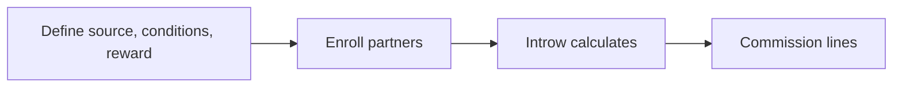
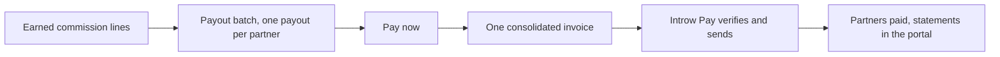
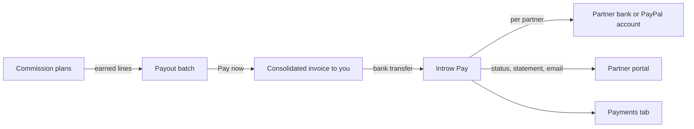
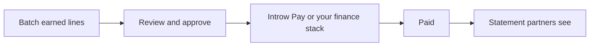
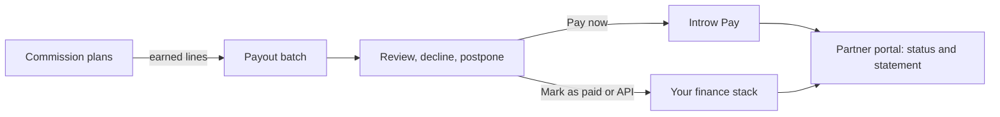

# Introw docs (docs.introw.io): features-commissions

Verbatim from docs.introw.io/llms-full.txt, fetched 2026-09-29. 24 pages.

# Add a manual commission line
Source: https://docs.introw.io/features/commissions/commission-lines/guides/add-a-manual-commission-line

Add a manual commission line to apply an adjustment, bonus, or one-off correction directly to a partner's payout without changing the plan.

Some payments do not fit any plan: a one-off correction, a goodwill bonus, a negotiated arrangement, or a true-up. Adding a manual commission line puts the right amount straight onto a partner's payout so the edge case is handled cleanly, without bending your plan rules or holding up the rest of the cycle. Reach for it when a partner is owed something the automatic calculation will never produce.

## What you'll achieve

A manual commission line on the partner's payout, with a clear amount and description, that pays out alongside their calculated lines and leaves an auditable record of why the adjustment was made.

## Before you start

<Steps>
  <Step title="Confirm access">
    You need write access to commissions.
  </Step>

  <Step title="Have a payout to add to">
    The partner should have a payout in the current cycle to attach the line to. Create one first if needed.
  </Step>
</Steps>

## Steps

<Steps>
  <Step title="Open the partner's payout">
    Go to [Payouts](https://app.introw.io/commission?section=payouts), open the relevant payout, and open the partner's payout panel. Their existing commission items are listed under **Commission items**.

    <Frame>
      
    </Frame>
  </Step>

  <Step title="Add the commission">
    Choose **Add commission** to open the manual line dialog, and fill in the details:

    * **Name** - the label for the line that appears on the partner's payout and statement, for example "Q1 goodwill bonus" or "Renewal true-up". Make it self-explanatory.
    * **Description** - optional context explaining the adjustment; use it to record why the line exists for the audit trail.
    * **Commission** - the amount payable to the partner, in your organisation currency. This is what gets paid.
    * **Source amount** - optional: the underlying deal or revenue amount the commission is based on, if the adjustment relates to one. Fill it in and the partner's statement prints the calculation, `EUR 4,200.00 x 10%`, instead of the amount alone. Leave it blank for a flat bonus or correction, which prints as a single figure.
  </Step>

  <Step title="Save the line">
    Choose **Add commission item** to save. The line is attached to the partner's payout and is included in the payable total for the cycle.
  </Step>
</Steps>

## Verify it worked

The manual line appears under the partner's **Commission items** with your name, amount, and description, and the payout total reflects the adjustment. When the payout is paid, the partner sees the line on their statement in the portal alongside their calculated commission.

## Related

<CardGroup>
  <Card title="Review and adjust commission lines" icon="book-open" href="./review-and-adjust-commission-lines">
    Check, decline, postpone, or correct calculated lines.
  </Card>

  <Card title="Run a payout cycle" icon="book-open" href="/features/commissions/payouts/guides/run-a-payout-cycle">
    Pay out the adjusted total.
  </Card>

  <Card title="Implementation reference" icon="screwdriver-wrench" href="../technical">
    Full configuration options.
  </Card>
</CardGroup>

---

# Review and adjust commission lines
Source: https://docs.introw.io/features/commissions/commission-lines/guides/review-and-adjust-commission-lines

Review calculated commission line by line, then decline, postpone, restore, or correct amounts before any partner payout is generated.

Reviewing commission before money moves is how you catch duplicates, ineligible deals, and lines that are correct but not yet ready, so payouts go out right the first time. This guide takes you through reading the calculated lines, then every adjustment you can make: decline a line to void it, restore one declined in error, postpone a line that should wait, and correct a line's amount or description. Reach for it every cycle, before you create a payout.

## What you'll achieve

A reviewed, clean set of commission lines: the ones that should pay are approved and accurate, the ones that should not are voided with a recorded reason, and anything not ready is held for a later cycle. You finish confident that the next payout reflects exactly what each partner has earned.

## Before you start

<Steps>
  <Step title="Confirm access">
    You need write access to commissions.
  </Step>

  <Step title="Have calculated lines">
    Active commission plans with enrolled partners should already have generated lines for qualifying records.
  </Step>
</Steps>

## Steps

### Phase 1 - Review what was calculated

<Steps>
  <Step title="Open the commission dashboard">
    Go to [Commission](https://app.introw.io/commission). The dashboard shows the money in motion across a few cards: **Expected commission** (earned but not yet on a payout), **Upcoming payouts** (on approved or scheduled payouts, not yet paid), **Total paid**, and **Declined commission** (lines that were declined and can be restored). These give you the totals to reconcile against before paying.
  </Step>

  <Step title="Open a card to see its lines">
    Select a card, such as **Expected commission**, to open the list of commission lines behind it. Each line carries a status pill so you know where it sits: **Potential** and **Expected** are not yet on a payout, **Approved** is attached to a payout, **Postponed** is held back, and **Declined** is voided. Use this to focus your review on the lines that still need a decision.

    <Frame>
      
    </Frame>
  </Step>

  <Step title="Inspect an individual line">
    Open a line to see its commission amount, the partner it belongs to, its status, and the source record it was calculated from. Trace anything that looks off back to its deal or billing record so you can decide whether it should pay, wait, or be voided. You can also open a partner's payout panel to review all of that partner's commission items together.
  </Step>
</Steps>

### Phase 2 - Adjust the lines

<Steps>
  <Step title="Decline a line that should not be paid">
    For a line that is wrong (a duplicate, an ineligible deal, or one already paid elsewhere), use **Decline**. Choose a reason so the decision is auditable:

    * **Duplicate commission**, **Ineligible commission**, **Already paid**, **Disputed by partner**, or **Outside commission policy** for a canned reason, or
    * **Custom**, which requires you to type the specific reason.

    Declining voids the line and detaches it from any payout, so it will never be paid. Prefer declining over deleting, because a declined line keeps the record and can be restored.
  </Step>

  <Step title="Restore a line declined in error">
    If you declined something you should not have, open it from the **Declined commission** card (or the partner's panel) and choose **Restore**. This un-voids the line and returns it to the flow so it can be approved and paid in a later payout. Restore is the correct fix rather than recreating the line by hand.
  </Step>

  <Step title="Postpone a line that is valid but not ready">
    For a line that is correct but should wait (for example while a deal is still being confirmed), use **Postpone to next cycle**. This frees the line from the current payout without voiding it, holding it for later. When it is ready, choose **Unpostpone** to make it available to the next payout again.
  </Step>

  <Step title="Correct a line's details">
    When a line is right in principle but the amount or wording needs fixing, use **Edit commission** to adjust it:

    * **Name** - the label that appears on the line and the partner's statement.
    * **Description** - optional context for the adjustment.
    * **Commission** - the amount payable to the partner, in your organisation currency.
    * **Source amount** - the optional underlying deal or revenue amount the commission is based on; clear it if it no longer applies.

    Editing is for genuine corrections; document why in the description so the change is traceable.
  </Step>
</Steps>

## Verify it worked

Each line shows the status you intended: lines to pay read **Approved** (or **Potential** / **Expected** until batched), voided lines read **Declined** with a recorded reason, and held lines read **Postponed**. The dashboard cards reconcile to those decisions, and the partner sees only the commission that should pay in their portal. Your next payout will pick up exactly the approved, unpostponed lines.

## Related

<CardGroup>
  <Card title="Add a manual commission line" icon="book-open" href="./add-a-manual-commission-line">
    Add an adjustment a plan cannot calculate.
  </Card>

  <Card title="Run a payout cycle" icon="book-open" href="/features/commissions/payouts/guides/run-a-payout-cycle">
    Turn the approved lines into paid payouts.
  </Card>

  <Card title="Build and launch a commission plan" icon="book-open" href="/features/commissions/commission-plans/guides/build-and-launch-a-commission-plan">
    Fix at the source if lines are consistently wrong.
  </Card>

  <Card title="Implementation reference" icon="screwdriver-wrench" href="../technical">
    Full configuration options.
  </Card>
</CardGroup>

---

# Commission Lines
Source: https://docs.introw.io/features/commissions/commission-lines/index

See every calculated commission line by line - review amounts, decline, postpone, and adjust each entry before it turns into a partner payout.

> Commission Lines are the calculated detail behind every payout: each qualifying record becomes a line you can review, decline, postpone, or adjust, so what partners get paid is always correct.

## The problem it solves

Paying partners on un-reviewed calculations is how disputes and overpayments happen:

<Pains>
  | Without Introw                      | With Introw                 |
  | ----------------------------------- | --------------------------- |
  | Calculations go straight to payment | Lines are reviewed first    |
  | A bad line slips through            | Decline what should not pay |
  | The timing is wrong for some        | Postpone until it is ready  |
  | Adjustments are impossible          | Add a manual line           |
</Pains>

## Impact

One wrong payment costs more trust than ten right ones earn. A reviewable line between calculation and payment is how you stay the vendor whose numbers are never questioned.

<Impact>
  for your business

  * **Cost to run**
    Partner ops sees every line before it becomes money, so a mistake is caught in review rather than clawed back
  * **In your CRM**
    Each line traces back to the CRM or billing record that created it, which is what makes it auditable

  for your partners

  * **Self-serve**
    They see what is potential, what is expected and what is approved, line by line
  * **Enabled**
    The detail behind a payout is visible, so a disagreement is about one line and not the whole statement
  * **Efficient**
    An error is corrected with a manual line instead of a payout being reversed

  [A day in the life of your partners](/days-in-the-life)
</Impact>

<Personas>
  * **Partner Operations** - every line checked first
  * **Finance** - auditable, line-level detail
</Personas>

## How it works

A commission line is a single calculated commission tied to a qualifying record and a partner.

<Frame>
  
</Frame>

Introw generates lines automatically from your plans, and each line moves through clear states,
from potential to expected to approved, with its own payment status. Your team reviews these lines
before they become payouts, so errors and edge cases are caught early rather than after a partner
is paid.

You stay in control of every line. Decline a line that should not be paid, postpone one that is
not ready, restore a line that was declined in error, or add a manual line for an adjustment. The
same line data is available through the API, so finance systems can read and act on it
programmatically.

Commission Lines give you a reviewable layer between calculation and payment. Inspect each line,
decline or postpone the ones that need it, and adjust where necessary. Partners get paid the
right amount because every line was checked first.


## Run it from your AI assistant

<Headless>
  * Show the commission lines generated for Acme this quarter and the deals behind them.
  * What's earned-but-unpaid for Acme right now?
  * Which deals drove the most commission this month across all partners?
  * Break down this quarter's commission by partner.
</Headless>

## Going deeper

<CardGroup>
  <Card title="How to" icon="screwdriver-wrench" href="./technical">
    Setup, configuration, and all how-to guides.
  </Card>

  <Card title="API reference" icon="code" href="/general/introduction">
    Integration surface and code.
  </Card>
</CardGroup>

**Works with**

<CardGroup>
  <Card title="Commission Plans" icon="hand-holding-dollar" href="/features/commissions/commission-plans">
    Lines are produced by plan rules.
  </Card>

  <Card title="Payouts" icon="hand-holding-dollar" href="/features/commissions/payouts">
    Approved lines batch into payouts.
  </Card>

  <Card title="Partner Analytics" icon="chart-line" href="/features/reporting/partner-analytics">
    Earned commission rolls into analytics.
  </Card>

  <Card title="Workflows" icon="bolt" href="/features/automation/workflows">
    Book a one-off reward automatically when a partner earns it.
  </Card>
</CardGroup>

---

# Commission Lines
Source: https://docs.introw.io/features/commissions/commission-lines/technical/index

Review commission line statuses, decline, postpone, or restore lines, and add manual commission entries for bonuses and adjustments in Introw.

## Where it lives

Commission Lines sits under **Commission**, at [Commission](https://app.introw.io/commission).

<Frame>
  
</Frame>

## Before you start

| You need                    | Why                              | Fix it                                                                                               |
| --------------------------- | -------------------------------- | ---------------------------------------------------------------------------------------------------- |
| Write access to commissions | To adjust and approve lines      | [Internal roles](/features/access/team-management/guides/create-an-internal-role)                    |
| A plan generating lines     | Lines come from an enrolled plan | [Commission plans](/features/commissions/commission-plans/guides/build-and-launch-a-commission-plan) |

## How it works

Commission lines are generated automatically from your plans and surface through the commission
dashboard and partner payout panels. Each line has a workflow status that the dashboard labels as
potential, expected, approved, or declined, and a separate payment status once it is on a payout.
You review lines in the dashboard's metric views and on each partner's payout panel, where you can
act on them.

Line actions include declining a line so it is voided and detached, postponing a line to hold it
back from a payout, restoring a previously declined line, and adding a manual line for an
adjustment. The same operations are available through the commission lines API.

## Settings & configuration

Lines are reviewed from [Commission](https://app.introw.io/commission) and within partner payout
panels.

### Understanding line status

A line's workflow status reflects where it is: potential and expected lines are not yet approved,
approved lines are attached to a payout, and declined lines are voided. Payment status tracks the
money once a line is on a payout.

### Reviewing lines

Open a dashboard metric, such as potential or expected commission, to see the lines behind it, or
open a partner's payout panel to review their commission items. A metric's list filters on the
partner, their **Partner tier** and **Partner phase**, **Close date**, **Amount**, **Commission**,
**Commission plan**, **Attribution**, **Source** (Plan, Manual, Api, Workflow or Affiliate), **Is postponed**, and the **Affiliate
campaign**, **Workflow** or **Form** a line came from; the payout panel filters on **Close date**,
**Amount**, **Commission** and **Source**. From **Forecasted** or **Expected** you can select lines and
decline them in one go, and from **Expected** also create a payout for them.

The **Plan** column names the plan a line was earned on, followed by its installment, such as `(2/5)`,
when the plan pays in several. A line with no plan behind it, added by hand, through the API, by a
workflow or by an affiliate campaign, shows the rate its own figures work out to instead, such as
`10%`, or **Fixed amount** when its commission is not a share of anything; the info icon says where it
came from. It is the same rate the commission statement prints.

### Declining and restoring

Decline a line to void it and detach it from a payout. Restore a declined line if it was declined
in error.

### Postponing

Postpone a line to free it from the current payout and hold it for later; unpostpone to make it
available again.

### Manual lines

Add a manual commission line on a payout for an adjustment, or edit an existing line where needed.

### Imported lines

Lines from a **File upload** plan arrive pending like any other, and they carry where they came from:
the file, the worksheet, the row number and the row's own ID. That is what answers "which row is this
number" without going back to the sender. Review, decline, postpone and payout all behave the same.
See [Import commissions from a file](/features/commissions/commission-plans/guides/import-commissions-from-a-file).

### Automate it with a workflow

**Give commission** is the [workflow](/features/automation/workflows/technical) action that books a line without anyone raising a ticket: an **Amount**, a **Currency**, and a **Description** the partner reads on their statement. Leave the currency on **Partner's currency** and it resolves per partner when the run happens, so one workflow stays correct across a program that bills in several. Lines it books are marked **Workflow** rather than **Manual**, so a review can tell an automation's output from a person's adjustment.

It lands as a normal manual line, created as pending, so it still goes through your usual approval and payout run: the automation removes the chasing, not the review. Plans that earn lines from CRM or billing data over time are a different tool, and live under [Commission plans](/features/commissions/commission-plans).

The triggers worth hanging it off are the ones that mark an achievement: **Journey completed**, **Certificate issued**, or a partner entering a segment. See [Reward a finished journey](/features/automation/workflows/guides/reward-a-finished-journey).

## How-to guides

<Rail>
  * [**Add a manual commission line**](/features/commissions/commission-lines/guides/add-a-manual-commission-line)

    Add a manual commission line to apply an adjustment, bonus, or one-off correction directly to a partner's payout without changing the plan.

  * [**Review and adjust commission lines**](/features/commissions/commission-lines/guides/review-and-adjust-commission-lines)

    Review calculated commission line by line, then decline, postpone, restore, or correct amounts before any partner payout is generated.
</Rail>

## Troubleshooting

<Warning>
  Declining a line voids and detaches it, so restore it rather than recreating it if you change your mind. Postponing frees a line from its current payout, so remember to unpostpone it when it is ready. Manual lines bypass plan calculation, so use them for genuine adjustments and document why.
</Warning>

<AccordionGroup>
  <Accordion title="A line is not on a payout">
    It is potential or expected, postponed, or declined.
  </Accordion>

  <Accordion title="A declined line is back">
    It was restored, which un-voids it.
  </Accordion>

  <Accordion title="A manual line is not reflected">
    Confirm it was added to the right partner's payout.
  </Accordion>
</AccordionGroup>

---

# Build and launch a commission plan
Source: https://docs.introw.io/features/commissions/commission-plans/guides/build-and-launch-a-commission-plan

Build a commission plan end to end - configure the data source, eligibility, rewards, and enrolled partners, then launch it so partners start earning.

A commission plan only rewards partners once five things are in place: where the numbers come from, which records qualify, how much partners earn and how often, and who the plan applies to. This guide walks the whole wizard end to end so qualifying deals start generating commission for the right partners, reconciled to the records your sales and finance teams already trust. Reach for it whenever you launch a new incentive, a referral fee, a revenue share, or a tiered reseller margin.

## What you'll achieve

A live commission plan that reads from your CRM or billing system, filters to the deals you actually want to reward, pays a fixed fee or a percentage on the cadence you choose, and is enrolled to the right partners, so Introw calculates each partner's commission lines automatically and they can watch their earnings build in the portal.

## Before you start

<Steps>
  <Step title="Confirm access">
    You need write access to commission plans.
  </Step>

  <Step title="Connect a data source">
    Connect the source the plan will read from: your CRM, or a billing integration like Stripe or Chargebee. The plan cannot calculate without one.
  </Step>

  <Step title="Have partners and segments ready">
    Decide which partners the plan applies to. If you want to target by segment or tier, set those up first so you can enroll and rate by them.
  </Step>
</Steps>

## Watch it

<Tabs>
  <Tab title="Video">
    <video />
  </Tab>

  <Tab title="Click through">
    <iframe />
  </Tab>
</Tabs>

## Steps

The plan builder is a five-step wizard: **General**, **Data source**, **Conditions**, **Reward**, and **Enrollment**. Work through them in order; the **Continue** button moves you forward and you can jump back with **Back** or the step list on the left at any time.

### Phase 1 - Create the plan

<Steps>
  <Step title="Start a new plan">
    Go to [Commission plans](https://app.introw.io/commission?section=plans) and choose **Create new plan**. You can start from a blank plan or pick one of the starter templates under **Or start from a template**:

    * **Fixed Fee** - a one-time flat payout for each qualifying record, good for per-lead or per-deal bounties.
    * **Revenue Share** - a one-time percentage of the closed deal value, the most common referral or co-sell reward.
    * **Tiered** - a recurring yearly percentage that can step down over time (for example 15% in year one, 10% in year two), suited to reseller or subscription margins.

    A template pre-fills the reward shape so you adjust rather than build from scratch; a blank plan starts you on a clean **General** step. Either way you land in the wizard and can change anything later.

    <Frame>
      
    </Frame>
  </Step>

  <Step title="Set the general details">
    On the **General** step, describe the plan and bound when it earns:

    * **Plan name** - the internal name you and your team recognise the plan by (for example "Referral Plan 2026"). Required.
    * **Description** - optional context on what the plan rewards and why; helpful when several plans run at once.
    * **Plan period** - the **Start date** and end date that bound which events qualify. Events qualify from the start date onward (it defaults to the plan's creation date if you leave it), and events after the end date do not qualify. Leave the end open with **No end date** for an ongoing plan, or set one for a time-boxed promotion.

    Choose **Continue** to move to the data source.
  </Step>
</Steps>

### Phase 2 - Connect the data source

<Steps>
  <Step title="Pick where the plan reads from">
    On the **Data source** step, under **Select a data source**, choose the system the plan calculates from. Only connected sources are selectable; a disconnected one shows **Connect** (or **Upgrade plan** if your plan does not include it).

    * **Your CRM** (shown as **HubSpot**, **Salesforce**, or **TeamLeader** depending on what you connected) - calculate commissions from deals and other records already in your pipeline. This is the right choice for almost every co-sell, referral, and reseller program because payouts then reconcile to the exact records sales and finance use.
    * **Stripe** - pull billing data such as customers, subscriptions, and invoices directly from Stripe. Use this when commissions track recognised or billed revenue rather than a CRM deal.
    * **Chargebee** - the same billing-based calculation sourced from Chargebee.

    Pick the source that owns the number you want to reward on. The choice drives which objects and properties you can select next.

    <Frame>
      
    </Frame>
  </Step>

  <Step title="Select the object and date">
    Tell the plan which records to read and how to time them:

    * **Select object where the commission data is stored** - the record type the plan watches. For a CRM source this is typically your deal object; for a billing source it is the billing object (for example **Subscription**, **Invoice**, or **Customer**). Every qualifying record of this type can generate a commission line.
    * **Commission date field** - the date Introw uses to decide when a commission event occurred, which determines the period a resulting line falls into. Pick the date that best represents "earned" for your program, such as the close date for deals or the billing date for invoices.

    <Frame>
      
    </Frame>
  </Step>

  <Step title="Preview the matching records">
    Open the **Data preview** (use **Show data** in the header if the panel is hidden) to sanity-check the source before you go further. It reports how many records would qualify over a baseline window you choose - **90 days**, **180 days**, or **1 year** - so you can confirm the volume looks right. Use **Configure** to pick which properties appear as columns in the preview table. If the count is zero or wildly off, revisit the object and date selections before adding conditions.
  </Step>
</Steps>

### Phase 3 - Decide which records qualify

<Steps>
  <Step title="Add eligibility conditions">
    On the **Conditions** step, narrow the source down to only the records that should earn. The step reads "A commission is earned when a record matches the following" and starts with no conditions, which means everything qualifies, so add filters to be deliberate.

    * **Add condition** - add a property filter, such as deal stage is Closed Won or amount is greater than a threshold. Stack several and they combine with **And**, so a record must meet all of them.
    * **Add 'OR' condition** - start a separate group that qualifies records meeting a different set of rules, letting you express "this set, or that set" eligibility.

    Build the conditions that match your policy exactly. Re-check the **Data preview** count as you go; it updates to reflect only the records that now qualify.

    <Frame>
      
    </Frame>
  </Step>
</Steps>

### Phase 4 - Configure the reward

<Steps>
  <Step title="Choose the reward type and frequency">
    On the **Reward** step, set what a qualifying record pays and how often:

    * **Reward type** - choose **Fixed fee** for a flat payout per qualifying event, or **Percentage** for a percentage of a CRM amount property. Fixed fee suits per-lead bounties; percentage suits revenue share and margin.
    * **Calculation property** - shown for **Percentage** rewards only: the amount property the percentage is applied to (for example the deal value). This is the base the rate multiplies.
    * **Pay-out frequency** - choose **One time** for a single payout per record, or **Every month** or **Every year** for a recurring reward that pays across periods (useful for subscription or retainer commissions). A recurring frequency turns on the period schedule below.
    * **Frequency periods** - for recurring rewards, define the **Start** and **End** months or years that the reward runs across, using **Add period** for additional bands. Leave the final period open with **Never ends** for an open-ended tail that keeps paying as long as the record qualifies.

    <Frame>
      
    </Frame>
  </Step>

  <Step title="Set the rates by audience">
    Use the rates table to set how much partners earn, and whether everyone earns the same:

    * **Type** - choose how rates are targeted: **Partner-based**, **Segment-based**, or **Tier-based**. Tier and segment targeting let you reward stronger partners or specific groups differently from the default.
    * **Reward** rate - the amount or percentage for each row. The default row labelled **All** applies to every enrolled partner who is not matched by a more specific row.
    * Add specific rows with **Add tier**, **Add segment**, or **Add partner** to override the default for those audiences. Partner-specific rates take precedence over tier and segment rates, so use them for genuine exceptions.
    * **Maximum reward** - an optional cap per row that limits how much a single rate can pay; leave it **Unlimited** unless you need to bound exposure. Set it deliberately, as a low cap can quietly shrink payouts.

    Together these rows let one plan pay a baseline to everyone and richer rates to your best partners or segments.

    <Frame>
      
    </Frame>
  </Step>
</Steps>

### Phase 5 - Enroll partners and launch

<Steps>
  <Step title="Enroll the right partners">
    On the **Enrollment** step, choose who the plan applies to. A plan only generates commission for enrolled partners, so this step is what activates it.

    * Select partners directly from the list with the checkboxes, or
    * Apply filters such as **Phase**, **Tier**, **Experience**, or **Manager** to target a group, or pick a partner **segment** to enroll many at once and keep the audience aligned with that segment.

    Enroll exactly the partners who should earn under this plan's rules and rates.

    <Frame>
      
    </Frame>
  </Step>

  <Step title="Save and launch the plan">
    Choose **Create Plan** (or **Save** when editing) to launch it. The plan becomes active for the enrolled partners and Introw begins calculating commission lines for their qualifying records.

    If you later edit a live plan, the **Update commission plan** dialog appears. By default already-earned expected commission stays as it is; turn on **Recalculate expected commission** and set the **Since** date if you want the change to reprocess pending lines from that point. Use this deliberately, since it recomputes amounts partners may already be expecting.

    <Frame>
      
    </Frame>
  </Step>
</Steps>

## Verify it worked

The plan shows as active in the plans list with the partners you enrolled. As qualifying records come in, commission lines appear on the commission dashboard and on each partner's payout panel, traceable back to their source record, and enrolled partners can see their building commission in the portal. If no lines appear, confirm enrolled partners have records that meet the conditions and that the data preview returned matching records.

## What your partners experience

Once the plan is live and you have added a commissions section to their experience, enrolled partners watch their earnings build in real time in the portal: each qualifying deal, the expected amount, and - once you run a payout - a statement they can open. This is what lets a partner self-serve "what am I earning, and when do I get paid?" without asking your team, so the work you do here shows up directly as trust on the partner side.

## Related

<CardGroup>
  <Card title="Review and adjust commission lines" icon="book-open" href="/features/commissions/commission-lines/guides/review-and-adjust-commission-lines">
    Check, decline, postpone, or correct the lines this plan generates.
  </Card>

  <Card title="Run a payout cycle" icon="book-open" href="/features/commissions/payouts/guides/run-a-payout-cycle">
    Turn approved lines into paid partner payouts.
  </Card>

  <Card title="Create a dynamic segment" icon="book-open" href="/features/partners/segments/guides/create-a-dynamic-segment">
    Enroll and rate partners by segment.
  </Card>

  <Card title="Implementation reference" icon="screwdriver-wrench" href="../technical">
    Full configuration options.
  </Card>
</CardGroup>

---

# Import commissions from a file
Source: https://docs.introw.io/features/commissions/commission-plans/guides/import-commissions-from-a-file

Set up a File upload commission plan, map a sample CSV or Excel export once, then import each period's file, resolve the rows on hold, and book the commission.

> For the revenue that arrives as a spreadsheet: distributor sell-through, marketplace statements, a usage export from billing.

Not every euro a partner earns passes through your CRM. Distributors report sell-through monthly, marketplaces settle on their own statement, and usage-based revenue often lives in a billing database nobody has connected. That money still has to be paid on the same rules as the rest of the program. A **File upload** plan is where it goes: you map the columns of one sample file, and from then on each period is an upload, a short review, and a set of commission lines that behave like every other line in Introw.

## What you'll achieve

A commission plan that reads files, a mapping saved on it so nobody re-does the column work, and this period's file imported into pending commission lines, each one traceable back to the row it came from.

## Before you start

<Steps>
  <Step title="Get write access to commission plans">
    You need permission to build plans and to run imports.
    See [Internal roles](/features/access/team-management/guides/create-an-internal-role).
  </Step>

  <Step title="Have the partners in Introw">
    Rows match against partners that already exist. A row for a partner Introw does not know goes on hold, so import your partners first.
    See [Partner management](/features/partners/partner-management/technical).
  </Step>

  <Step title="Have a representative file">
    A CSV or `.xlsx` up to 50 MB, with the columns a normal period carries. Use a real export rather than a hand-made example: the mapping you build here is the one every future file has to fit.
  </Step>
</Steps>

## Steps

### Build the plan

<Steps>
  <Step title="Create a plan on the File upload source">
    Go to [Commission plans](https://app.introw.io/commission?section=plans) and create a plan. Name it for the file it will read, such as "Distributor sell-through", then on **Data source** choose **File upload**, described as "Import commission events from a CSV or Excel file".

    A file plan skips two steps you know from CRM plans. There is no **Conditions** step, because the file is the filter: the rows you upload are the rows that earn. There is no **Enrollment** step either, because the plan's partners are whoever its rows match.
  </Step>

  <Step title="Upload a sample and map the columns">
    Upload your sample file. Introw reads it, shows the worksheet and header row it used, and lists the columns it found. Nothing is imported at this point: a sample only builds the mapping.

    Map the columns that matter:

    * **Partner** - the column that names the partner, plus **Select how to match**: **Introw partner ID**, **Partner external ID**, **Partner name**, **Partner domain**, or a CRM record through its record ID or one of its properties. Introw proposes a match field from the sample itself and shows how many sampled rows resolve, and to which partners, before you commit.
    * **Amount** - the money the row is worth. Add a **Currency** column when the file mixes currencies.
    * A date, so rows land in the right plan period.
    * **Description**, which prints on the commission line and on the partner's statement.
    * **Unique row ID** - the identifier your source system already gives each row.
  </Step>

  <Step title="Set what a row pays">
    On **Reward**, pick one of three, paid once per row:

    * **Full amount** pays the amount in the row as provided. Use it when the file already carries the commission.
    * **Percentage** takes a percentage of the row amount.
    * **Fixed amount** pays a set reward per row, whatever the row is worth.

    Rates target the default, a partner, a segment or a tier, in the same rates table as a CRM plan, and each row pays at the rate of the partner it matched: a rate for Gold partners only pays rows that matched a Gold partner. A maximum cap still applies. With **Full amount**, every rate pays 100% of the row and cannot be edited. Recurring frequencies and installments are not offered here, because an imported row is an event that already happened.
  </Step>
</Steps>

### Import a file

<Steps>
  <Step title="Upload the period's file">
    Go to [Imports](https://app.introw.io/commission?section=imports), start an import, and pick the file upload plan it belongs to. Introw uploads the file, reads it against the plan's mapping, and checks every row. It runs in the background, so you can leave the page and come back.
  </Step>

  <Step title="Work the rows on hold">
    Rows arrive as **Ready**, **On hold** or **Conflict**, and every held row says why: no partner match, an ambiguous one, no rate that applies to that partner, a date outside the plan period, a currency that cannot be converted, or an amount too large to store.

    Assign a partner to a held row, or skip it, one row at a time or over a selection. Skipped rows create nothing. **Needs attention** filters the list down to the imports that still have rows waiting on someone.
  </Step>

  <Step title="Finish the import">
    **Finish import** books the commission. You can finish with rows still unresolved, and the button says how many you are leaving behind, so it is a decision rather than an accident. Lines are created in the background, and no payment is sent by finishing an import.
  </Step>
</Steps>

## Verify it worked

The import reads **Completed**, and its rows read **Imported**. The commission lines are on [Commission lines](https://app.introw.io/commission) as pending lines against the matched partners, ready for your normal review and the next payout run, and each one carries the file, the worksheet, the row number and the row ID it came from. Partners see their share in the portal as they do for any other line.

## Good to know

* **A wrong import can be corrected.** On a completed import, select imported rows and skip them: their unpaid commission lines are voided and their row IDs are freed, so the corrected file imports them again. Rows whose commission is already paid cannot be skipped.
* **Re-uploading is safe.** With a **Unique row ID** mapped, a row that was already imported is skipped on the next file, and a row whose figures changed under an ID you already used is flagged for you rather than silently overwritten. Without one, Introw falls back to exact deduplication on the file name and row number.
* **Negative amounts are credits.** A clawback row reverses, so a correction file nets against what you already booked instead of needing a manual adjustment.
* **The mapping is the plan's, not the file's.** Editing it applies to future imports; imports that already ran keep the mapping and the rates they ran with.
* **Every import is kept.** A file that never created lines can be discarded; a completed one stays for the audit trail and for the duplicate check on the next file.

## Related

<CardGroup>
  <Card title="Build and launch a commission plan" icon="candy" href="./build-and-launch-a-commission-plan">
    The CRM and billing version of the same wizard.
  </Card>

  <Card title="Commission lines" icon="receipt" href="/features/commissions/commission-lines/technical">
    Review, adjust and approve what a plan produced.
  </Card>

  <Card title="Pay a payout cycle with Introw Pay" icon="wallet" href="/features/commissions/introw-pay/guides/pay-partners-with-introw-pay">
    Turn approved lines into money in partner accounts.
  </Card>

  <Card title="Implementation reference" icon="screwdriver-wrench" href="../technical">
    Data sources, rewards, versions and enrollment.
  </Card>
</CardGroup>

---

# Set eligibility conditions
Source: https://docs.introw.io/features/commissions/commission-plans/guides/set-eligibility-conditions

Define exactly which records earn on a commission plan using property filters, And/Or groups, partner-attributed deals, and a live data preview.

## What you'll achieve

A commission plan whose eligibility rules match your incentive policy precisely: only the records you intend generate commission lines, verified against a live count of qualifying records before the plan goes live, so partners earn on the right deals and finance has nothing to claw back.

## Before you start

<Steps>
  <Step title="Be in a plan's Conditions step">
    Eligibility conditions are the **Conditions** step of the plan wizard. Create or edit a plan and reach that step. The full wizard is covered in [Build and launch a commission plan](/features/commissions/commission-plans/guides/build-and-launch-a-commission-plan).
  </Step>

  <Step title="Have your data source and object set">
    Conditions filter the object you chose on the **Data source** step (a CRM deal, or a billing object like an invoice or subscription). The available properties come from that object, so set it first.
  </Step>

  <Step title="Know your policy">
    Write down, in plain language, which records should earn - for example "Closed Won deals over 5,000 in the New Business pipeline, sourced by the partner." You will translate that sentence into conditions.
  </Step>
</Steps>

## Watch it

<Tabs>
  <Tab title="Video">
    <video />
  </Tab>

  <Tab title="Click through">
    <iframe />
  </Tab>
</Tabs>

## Steps

<Steps>
  <Step title="Understand the matching model">
    The Conditions step reads **"A commission is earned when a record matches the following."** It starts with **no conditions**, and no conditions means **every record of the object qualifies** - so an empty step pays on everything. Adding conditions narrows that set. Be deliberate: the goal is to add exactly enough rules that only the records your policy intends remain.
  </Step>

  <Step title="Add your first property condition">
    Choose **Add condition** and build a property filter: pick the property, the operator, and the value. Typical first conditions:

    * **Deal stage is Closed Won** - only reward deals that actually closed. The most common condition on any plan.
    * **Amount is greater than a threshold** - exclude small deals from a bounty, or set a floor for a revenue share.
    * **Pipeline / deal type is a specific value** - scope the plan to the pipeline or deal type the incentive covers, so unrelated deals never earn.

    Each condition compares one property to a value; the record must satisfy it to stay eligible.

    <Frame>
      
    </Frame>
  </Step>

  <Step title="Stack conditions with And">
    Add more conditions in the same group to require **all** of them - they combine with **And**, so a record must meet every condition to qualify. Use this to express a precise policy, for example *stage is Closed Won* **and** *amount over 5,000* **and** *pipeline is New Business*. Add only the conditions your policy actually needs; every extra And narrows the set further.
  </Step>

  <Step title="Express alternatives with an Or group">
    When two different sets of records should both earn, choose **Add 'OR' condition** to start a separate group. A record qualifies if it matches **any** group, so you can express "this set, **or** that set" - for example *New Business deals over 5,000* **or** *Renewal deals over 10,000*. Keep each group internally combined with And, and use Or groups sparingly so the rule stays legible.

    <Frame>
      
    </Frame>
  </Step>

  <Step title="Target partner-attributed deals">
    To make a plan pay only on deals a partner is actually credited on - the step that turns a generic plan into a referral or reseller reward - add a condition that filters on **partner attribution**. This uses the attribution you configured on the deal object, so only deals sourced or influenced by the enrolled partner earn, not every deal the partner merely touched. Layer your other qualifiers (amount, pipeline) on top of it. Attribution itself is set up in [Configure deal attribution](/features/co-selling/shared-pipelines/guides/configure-deal-attribution); using it as a reward filter is covered in [Set up referral rewards](/features/referrals/rewards/guides/set-up-referral-rewards).
  </Step>

  <Step title="Confirm against the live data preview">
    Open the **Data preview** (use **Show data** in the header if it is hidden). It reports how many records qualify over a baseline window (**90 days**, **180 days**, or **1 year**) and updates as you edit conditions. Use it as your safety check:

    * **Count is zero** - a condition is too strict or a value is wrong (a coded picklist value, a typo). Loosen or fix it.
    * **Count looks too high** - a condition is missing or too broad; you are about to pay on records you did not intend. Add or tighten a condition.
    * **Count looks right** - spot-check a couple of the previewed records to confirm they are genuinely records that should earn.

    Only move on once the preview reflects exactly the records your policy describes.

    <Frame>
      
    </Frame>
  </Step>
</Steps>

## Verify it worked

The Conditions step shows your rules, and the data preview count matches the records you expect to reward. After the plan is live, commission lines appear only for records that meet these conditions - and each line traces back to a record that genuinely qualifies. If a line appears for a record that should not earn (or is missing for one that should), revisit the conditions and re-check the preview.

## Related

<CardGroup>
  <Card title="Build and launch a commission plan" icon="file-invoice-dollar" href="/features/commissions/commission-plans/guides/build-and-launch-a-commission-plan">
    The full plan wizard this step is part of.
  </Card>

  <Card title="Set up referral rewards" icon="share-from-square" href="/features/referrals/rewards/guides/set-up-referral-rewards">
    Use an attribution condition to pay only on sourced deals.
  </Card>

  <Card title="Configure deal attribution" icon="diagram-project" href="/features/co-selling/shared-pipelines/guides/configure-deal-attribution">
    Set the partner attribution these conditions can filter on.
  </Card>

  <Card title="Review and adjust commission lines" icon="book-open" href="/features/commissions/commission-lines/guides/review-and-adjust-commission-lines">
    Check the lines your conditions generate before payout.
  </Card>
</CardGroup>

---

# Commission Plans
Source: https://docs.introw.io/features/commissions/commission-plans/index

Define how partners earn - revenue shares, fixed fees, tiered rates, and one-time bonuses - calculated automatically from your CRM or billing data.

> Commission Plans define exactly how partners earn, and Introw does the math: set the rules once and every qualifying deal turns into a calculated commission, straight from your CRM or billing source of truth.

## The problem it solves

Spreadsheet-run incentives are slow, opaque, and constantly disputed:

<Pains>
  | Without Introw                     | With Introw                       |
  | ---------------------------------- | --------------------------------- |
  | Commissions are calculated by hand | Introw calculates every line      |
  | Your rules are hard to express     | Conditions, rates, tiers, bonuses |
  | The numbers do not reconcile       | Plans read your source of truth   |
  | Building a plan is daunting        | Start from a template             |
</Pains>

## Impact

Partners choose where to spend their week on expected return. A plan they can reason about, that pays without being chased, is how you win that comparison.

<Impact>
  for your business

  * **In your CRM**
    A plan reads deals, subscriptions or invoices from HubSpot, Salesforce or your billing system directly
  * **Live in days**
    Pick a template, set the conditions and the reward, enroll partners: a plan is live the same afternoon
  * **Cost to run**
    Partner ops builds and versions plans, and a data preview shows what would qualify before anything is live

  for your partners

  * **Self-serve**
    The rule they earn under is a rule, not a negotiation, so they can work out what a deal is worth
  * **Enabled**
    Tier-based and segment-based rates mean progressing in the program pays visibly more
  * **Efficient**
    Nothing to submit for a commission to exist: a qualifying deal creates the line

  [A day in the life of your partners](/days-in-the-life)
</Impact>

<Personas>
  * **Partner Operations** - the plans partners earn under
  * **Finance** - calculations that reconcile
  * **Partners** - a rule they can count on
</Personas>

## See it work

<Tour>
  * 

    **Start from a template**

    Fixed fee, revenue share or tiered, or from scratch.

  * 

    **Set what qualifies**

    Stack conditions, and preview which records would match.

  * 

    **Choose the reward**

    A fixed fee or a percentage, paid once or recurring.

  * 

    **Rate by audience**

    One rate for everyone, or per tier, segment or partner.
</Tour>

## How it works

A commission plan is the rulebook for partner earnings. You choose the data source, set the
conditions that make a deal or record qualify, and define the reward: a revenue share, a fixed
fee, a tiered rate, or a one-time bonus that works like a SPIFF. You then enroll the partners the
plan applies to. From that point, Introw calculates commission lines automatically as qualifying
records appear in your CRM or billing system.

Templates get you started fast with common structures like fixed fee per lead, revenue share, or
tiered annual commission. Because plans read from your source of truth, the numbers reconcile to
the same records sales already trusts, ending the spreadsheet guesswork that makes partners doubt
their payouts.

Commission Plans turn incentive rules into automatic math. Define the source, conditions, and
reward, enroll partners, and let Introw calculate. The result is trustworthy, reconciled
commission data instead of a spreadsheet nobody believes.



## Run it from your AI assistant

<Headless>
  * Explain how Acme's commission plan pays out, including rate tiers and installments.
  * Which commission plans are active, and what source object does each read from?
  * What rate applies to a new-business resale deal versus a renewal?
  * Which partners are on the referral plan versus the reseller plan?
</Headless>

## Going deeper

<CardGroup>
  <Card title="How to" icon="screwdriver-wrench" href="./technical">
    Setup, configuration, and all how-to guides.
  </Card>

  <Card title="API reference" icon="code" href="/general/introduction">
    Integration surface and code.
  </Card>
</CardGroup>

**Works with**

<CardGroup>
  <Card title="Commission Lines" icon="hand-holding-dollar" href="/features/commissions/commission-lines">
    Plans generate the commission lines.
  </Card>

  <Card title="Deal & Lead Registration" icon="handshake" href="/features/co-selling/deal-lead-registration">
    Pay partners for the deals they register.
  </Card>

  <Card title="Billing & Subscriptions" icon="plug" href="/features/integrations/billing">
    Calculate on real billing revenue.
  </Card>

  <Card title="Referral Rewards" icon="share-from-square" href="/features/referrals/rewards">
    Power referral fees and revenue share.
  </Card>
</CardGroup>

---

# Commission Plans
Source: https://docs.introw.io/features/commissions/commission-plans/technical/index

Build commission plans in Introw with a chosen data source, eligibility conditions, tiered rewards, and the partners enrolled to earn on the plan.

## Where it lives

Commission Plans sits under **Commission**, at [Commission plans](https://app.introw.io/commission?section=plans).

<Frame>
  
</Frame>

## Before you start

| You need                         | Why                                                   | Fix it                                                                            |
| -------------------------------- | ----------------------------------------------------- | --------------------------------------------------------------------------------- |
| Write access to commission plans | To build and launch one                               | [Internal roles](/features/access/team-management/guides/create-an-internal-role) |
| A connected data source          | Your CRM, a billing integration, or a file you upload | [Connect a CRM](/features/integrations/crm/guides/connect-hubspot)                |

Billing sources (Stripe, Chargebee) are connected separately, and the relevant module has to be on your plan.

## How it works

Commission plans are built in a wizard with five steps: general details, data source, conditions,
reward, and enrollment. The data source connects the plan to your CRM or a billing system, the
conditions decide which records qualify, and the reward defines how much partners earn and how
often. Once partners are enrolled, Introw calculates commission lines for qualifying records on a
schedule.

A plan can also read a file instead of a system. A **File upload** plan takes a CSV or Excel export,
matches each row to a partner, and books the commission it earns, which is how revenue that never
reaches your CRM still pays out on the same rules as everything else. See
[File upload plans](#file-upload-plans).

You can start from a template, such as a fixed fee, a revenue share, or a tiered commission, and
adjust it. Plans can be duplicated, archived, and edited, and editing can optionally recompute
pending lines.

## Settings & configuration

Plans are built at [Commission plans](https://app.introw.io/commission?section=plans); start a
new one at `/commission/plans/new`.

### General

Name the plan, describe it, and set its start and end dates.

### Data source

Choose where the plan reads from: your CRM, a billing system, or **File upload**. For a CRM source
you pick the object type and the amount and date properties; for billing you connect the relevant
integration; for a file you map the columns of a sample once and then import files against it. See
[File upload plans](#file-upload-plans).

### Conditions

Set the conditions a record must meet to qualify, using property filters, so only the right deals
or records generate commission.

### Reward

Choose a fixed fee or a percentage, set the frequency (one-time, monthly, quarterly, or yearly), and define
the rate, tiers, and any maximum cap. You can target rates by partner, segment, or tier, and set
installment amounts for recurring rewards.

### Versions and duration

A plan is a chain of **versions**. Editing rates or conditions creates a new version, and every
commission line records the version it was priced on - so changing a plan never re-prices lines that
were already generated, and a deal keeps the terms that were in force when it was registered.

A version's **end date is optional**. Leave it empty and the plan runs open-ended; combine that with a
recurring plan and its frequency and the plan keeps generating lines for the life of the customer
rather than stopping on a fixed date.

### Enrollment

Enroll the partners the plan applies to, individually or via filters and segments.

### File upload plans

**File upload** reads commissionable rows out of a CSV or Excel file instead of a system. It is the
plan type for revenue Introw cannot see: a distributor's monthly sell-through report, a marketplace
statement, a usage export from your own billing database.

A file plan has three wizard steps rather than five. **Conditions** is gone, because the file is the
filter: the rows you upload are the rows that earn. **Enrollment** is gone too, because a file plan's
partners are whoever its rows match.

On **Data source**, upload a sample file (CSV or XLSX, up to 50 MB) and build the mapping the plan
keeps:

* **Worksheet** and the header row, for a workbook with more than one sheet.
* **Partner** - the column that names the partner, plus **Select how to match**: **Introw partner
  ID**, **Partner external ID**, **Partner name**, **Partner domain**, or a CRM record through its
  record ID or one of its properties. Introw proposes a match field from the sample and shows how
  many of the sampled rows resolve, and to which partners, before you save anything.
* **Amount**, and optionally **Currency**, a date, a **Description** that lands on the commission
  line, and a **Unique row ID**.
* **Unique row ID** is what makes a re-upload safe. With it, a row that was already imported is
  skipped, and a row whose figures changed under an ID you already used is flagged rather than
  silently overwritten. Without it, Introw falls back to exact row deduplication on the file name and
  row number.

Inspecting a sample never creates commission lines. The mapping is saved on the plan and reused by
every import that runs against it, so the person uploading next month's file does not repeat this.

On **Reward**, a file plan pays one of three ways, one time per row: **Full amount** pays the amount
in the row as provided, **Percentage** takes a percentage of it, and **Fixed amount** pays a set
reward per row. Rates target the default, a partner, a segment or a tier exactly as on a CRM plan, in the
same rates table, and each imported row is paid at the rate that applies to the partner it matched. A
maximum cap still applies. With **Full amount**, every rate you add pays 100% of the row and cannot be
edited.
Recurring frequencies and installments are not offered, because a row is an event that already
happened.

Editing the mapping or the rates applies to future imports. Imports that already ran keep the mapping
and the reward rules they were run with, exactly as CRM plans keep their version.

### Importing a file

Imports live on their own tab, at [Imports](https://app.introw.io/commission?section=imports), with
**All imports** and **Needs attention** and a row per file: **File**, **Plan**, **Status**, **Rows**,
**On hold**, **Commission** and **Uploaded at**, all filterable and sortable.

Uploading runs in stages you can watch and leave: the file uploads, Introw reads it against the
plan's mapping, and every row is checked. Rows land as **Ready**, **On hold**, or **Conflict**, and
each held row says why: no partner match, an ambiguous one, no rate that applies to that partner, a
date outside the plan period, a currency that cannot be converted, or an amount the ledger cannot
store. Assign a partner to a held row, or skip it, one at a time or over a selection. Finishing with
rows still unresolved is allowed and the button says so, and skipped rows create nothing.

**Finish import** books the lines in the background. They are ordinary commission lines from there:
pending, visible on the partner, and carried into the next payout run. Each one keeps its provenance,
the file, the worksheet, the row number and the row ID, so a partner asking "where does this number
come from" is one click rather than an investigation. A negative amount is a credit and reverses, so
a clawback file nets against what you already booked.

An import that has not created lines yet can be discarded. A completed one stays for the audit trail
and for the duplicate check on the next file, and its imported rows can still be skipped: skipping
voids the unpaid commission lines they created and frees their row IDs, so a corrected file can be
uploaded in their place. A row whose commission is already paid cannot be skipped.

## How-to guides

<Rail>
  * 

    [**Build and launch a commission plan**](/features/commissions/commission-plans/guides/build-and-launch-a-commission-plan)

    Build a commission plan end to end - configure the data source, eligibility, rewards, and enrolled partners, then launch it so partners start earning.

  * [**Import commissions from a file**](/features/commissions/commission-plans/guides/import-commissions-from-a-file)

    Set up a File upload commission plan, map a sample CSV or Excel export once, then import each period's file, resolve the rows on hold, and book the commission.

  * 

    [**Set eligibility conditions**](/features/commissions/commission-plans/guides/set-eligibility-conditions)

    Define exactly which records earn on a commission plan using property filters, And/Or groups, partner-attributed deals, and a live data preview.
</Rail>

## Troubleshooting

<Warning>
  Billing data sources require the relevant integration to be connected and enabled. Editing a live plan can change future calculations, and recomputing pending lines reprocesses them, so review before saving. A maximum cap limits reward per rate, so set it deliberately to avoid unexpectedly small payouts.
</Warning>

<AccordionGroup>
  <Accordion title="No commission lines are appearing">
    No enrolled partners have qualifying records yet, or the conditions exclude them.
  </Accordion>

  <Accordion title="A billing source is unavailable">
    The billing integration is not connected or the module is off.
  </Accordion>

  <Accordion title="A reward is smaller than expected">
    A maximum cap or tier targeting is limiting it.
  </Accordion>
</AccordionGroup>

---

# Commissions & SPIFFs
Source: https://docs.introw.io/features/commissions/index

Calculate, review, and pay partner incentives from your CRM or billing source of truth, with Introw Pay settling every partner from one consolidated invoice and partners watching their earnings in real time.

> Commissions & SPIFFs is how you reward partners without spreadsheets: define plans, let Introw calculate what each partner earns from your CRM or billing data, review the results, and pay everyone from one invoice through Introw Pay. Partners see their earnings any time.

## The problem it solves

<Pains>
  | Without Introw                             | With Introw                      |
  | ------------------------------------------ | -------------------------------- |
  | Incentives run on a spreadsheet            | Introw does the math             |
  | 500 payments keyed in by finance           | One invoice, every partner paid  |
  | Tax forms and bank details chased by email | Partners verify themselves       |
  | Partners keep a mirror spreadsheet         | They see the same numbers you do |
  | A new SPIFF takes a quarter                | A plan is live in a day          |
</Pains>

## Impact

Nothing decides whether a partner keeps selling for you like being paid correctly and on time. A number they can check themselves, tracing back to a real deal and landing in their account without a chase, is what makes the program credible.

<Impact>
  for your business

  * **In your CRM**
    Commission calculates from the CRM or billing records finance already trusts, with no export-and-recalculate step
  * **Live in days**
    Model a plan from a template and run the first payout in a day, so a new incentive is live while it still matters
  * **Cost to run**
    Partner ops builds plans and reviews batches; finance pays one consolidated invoice per cycle and Introw Pay does the rest
  * **No new tool**
    Finance that prefers its own stack pulls the same data as CSV or through the API, and status flows back

  for your partners

  * **Self-serve**
    Forecasted, expected, upcoming and paid earnings are visible in the portal, or by asking an AI assistant
  * **Enabled**
    They see which deals earned what, so the plan is something they can sell against and never have to reconstruct
  * **Efficient**
    Verified once, paid in their own currency with a statement per payout, without writing an invoice

  [A day in the life of your partners](/days-in-the-life)
</Impact>

<Personas>
  * **Partner Operations** - plans and payouts, no spreadsheet
  * **Finance** - one invoice a cycle, lines that reconcile to source
  * **VP Partnerships** - incentives partners believe
  * **Partners** - what they earned, any time, paid without a chase
</Personas>

## How this area works

Partner incentives are usually run in fragile spreadsheets that nobody trusts, and then paid by hand. This area replaces both. You define commission plans, including revenue shares, fixed fees and one-time bonuses, and Introw calculates commission lines from your CRM or billing source of truth. On your cadence the lines become a payout batch, and Introw Pay settles the whole batch from one invoice to you. Revenue that never reaches those systems, a distributor's sell-through report or a marketplace statement, comes in as a file upload and earns on the same rules.

Incentives flow from a plan to a paid partner, reconciled to your source of truth and settled with a single payment.

**Where this sits in a setup.** Commissions come after attribution is right, since a plan pays on the deals attribution resolves. The [reseller](/tracks/reseller), [referral](/tracks/referral) and [affiliate](/tracks/affiliate) tracks each place it at that point.

<Rail>
  * 

    [**Commission Plans**](./commission-plans)

    How partners earn: shares, fees, bonuses, recurring rewards.

    [How to · 2 guides](./commission-plans/technical)

  * 

    [**Commission Lines**](./commission-lines)

    Review, decline, postpone, and adjust calculated commission line items.

    [How to · 2 guides](./commission-lines/technical)

  * 

    [**Payouts**](./payouts)

    One payout per partner per period, with a statement, tracked to paid.

    [How to · 3 guides](./payouts/technical)

  * 

    [**Introw Pay**](./introw-pay)

    Pay every partner from one consolidated invoice; verification and tax handled.

    [How to · 3 guides](./introw-pay/technical)

  * [**Settings**](./settings)

    Payout method, schedule, minimums, currency and billing details.

    [How to · 1 guide](./settings/technical)
</Rail>

From there, your team reviews the calculated lines, and each partner's payout carries the statement behind it. Choose **Pay now** and Introw Pay issues one invoice to your company for the whole batch, verifies each partner, collects the tax documentation and bank details their country requires, and sends every partner their money in their own currency. If your finance stack owns payments, keep manual invoicing instead: the same data leaves as CSV or through the API, and status flows back so the portal stays right. Partners see their forecasted, expected, upcoming and paid earnings in the portal and can ask an AI assistant about commission status, so the constant "where's my commission?" questions disappear. Global settings control the payout method, schedule, minimums, currency and billing details so the whole program runs predictably.

## Run it from your AI assistant

<Headless>
  * What's our total earned-but-unpaid commission, and what's due to be paid next month?
  * How much commission has Acme earned this quarter, and on which deals?
  * Explain how Acme's commission plan pays out - rates, tiers, and installments.
  * Show the most recent payouts across all partners and their stage.
  * Which partners have the most pipeline commission at stake this quarter?
</Headless>

---

# Activate Introw Pay
Source: https://docs.introw.io/features/commissions/introw-pay/guides/activate-introw-pay

Switch partner payouts to Introw Pay: complete billing info, confirm your company currency, switch Introw Pay on with a schedule, and make sure partners can set themselves up from the portal.

Today a payout cycle ends with a spreadsheet: partner ops exports the earned commission, finance keys in a transfer per partner, and both sides reconcile afterwards. Introw Pay replaces that tail with one invoice. This guide makes the switch end to end. It covers the company details that print on statements and your invoice, the currency your invoice is issued in, the Introw Pay option in Payout Settings and its cadence, and the portal section partners use to set themselves up. Do it once, then every cycle is a review and one payment.

## What you'll achieve

Payouts run on Introw Pay. The Commission area shows a **Payments** tab, every batch offers **Pay now**, and statements carry your billing details. Partners with money waiting see a prompt in the portal to link a bank account and get verified. Finance pays one invoice per cycle and Introw Pay does the rest.

## Before you start

<Steps>
  <Step title="Confirm Introw Pay is switched on">
    Introw Pay is included in every plan. Introw charges a percentage fee on the transactions it processes, so there is nothing extra on your subscription. If the **Introw Pay** option in Payout Settings still shows an **Upgrade** pill, ask your Introw account manager to switch it on for your account first.
  </Step>

  <Step title="Confirm access">
    You need write access to commissions and admin access to company settings.
  </Step>

  <Step title="Gather billing details">
    Have your legal company name, address, finance email address, company number and VAT number ready. They print on every partner statement and on your consolidated invoice.
  </Step>
</Steps>

## Watch it

<Tabs>
  <Tab title="Video">
    <video />
  </Tab>

  <Tab title="Click through">
    <iframe />
  </Tab>
</Tabs>

## Steps

### Phase 1 - Complete the details your invoice depends on

<Steps>
  <Step title="Set your company currency">
    Go to [Company settings](https://app.introw.io/settings/company) and check **Company currency**. Your consolidated invoice is issued in this currency, and Introw Pay currently issues invoices in **EUR** and **USD**. In any other currency **Pay now** stays disabled, so confirm this before switching the method. Partners are still paid in their own currency; this setting only governs what you pay.

    While you are here, confirm **Fiscal year start date** if you intend to pay every fiscal quarter, because that schedule is anchored on it.

    <Frame>
      
    </Frame>
  </Step>

  <Step title="Complete billing info">
    Open the **Billing Info** tab, or go to [Billing info](https://app.introw.io/settings/company/billing-info), and fill in every field:

    * **Company Name** - your legal entity, exactly as it should appear on statements and your invoice.
    * **Address Line 1**, **Address Line 2**, **Postal Code**, **City** and **Country** - your billing address.
    * **Finance Email Address** - where partners direct billing questions, and who is copied on payout emails.
    * **Company Number** and **VAT Number** - your registration and tax numbers. Introw validates the VAT number when you save, so a rejected number is caught here rather than on an invoice.

    Choose **Save**. Until billing info is complete, **Pay now**, **Request partner invoice** and statement generation are blocked with **Billing info required**.

    <Frame>
      
    </Frame>
  </Step>
</Steps>

### Phase 2 - Switch the payout method

<Steps>
  <Step title="Choose Introw Pay">
    Go to [Payout Settings](https://app.introw.io/commission?section=settings). Under **How will payments be sent to partner?**, select **Introw Pay**: you send a single payment to Introw, Introw Pay distributes it to all your partners, and verification is performed per partner. The other option, **Manual invoicing**, keeps Introw emailing statements while your team pays outside Introw and marks payouts paid.

    <Frame>
      
    </Frame>
  </Step>

  <Step title="Set the payout schedule">
    Set **Payout schedule** to the rhythm you pay on:

    * **Every month** or **Every quarter** - a batch is created on the first day after each calendar period closes, covering that period.
    * **Every fiscal quarter** - the same, anchored on your fiscal year start.
    * **Manual** - no automatic batches; you choose **Create payout** when you are ready, for example once a year.

    A scheduled cadence is what removes the last manual step: the batch is waiting for you, and your only job is to review it and pay.

    <Frame>
      
    </Frame>
  </Step>

  <Step title="Set the minimum payout amount">
    On any schedule other than **Manual**, **Minimum payout amount** is required and must be above zero:

    * **Minimum payout amount** - balances below it roll forward to a later cycle instead of creating a tiny payout.
    * **Per partner** applies the minimum to each partner's own balance. **Organisation total** applies it to the whole batch, so either everyone is paid or the cycle is skipped.

    A per-partner minimum in the range of a typical small commission keeps the invoice free of trivial lines. Choose **Save** in the page header; the confirmation reads **Payout settings saved**.

    <Frame>
      
    </Frame>
  </Step>
</Steps>

### Phase 3 - Make sure partners can set themselves up

<Steps>
  <Step title="Add the Commission and Payout setup sections to your experience">
    Partners set up how they get paid and follow their payouts from two sections of your partner portal. Open the [Experience builder](https://app.introw.io/templates), edit the experience your partners use, and add both from **Smart sections** if they are not there yet. **Commission** shows their **Forecasted**, **Expected**, **Upcoming payouts** and **Total paid** amounts, the list of payouts, and the **Choose payout method** prompt as soon as a payout is waiting for them. **Payout setup** walks them through **Business details**, **Payout method** and **Verification**, and shows the account they are paid to once they are verified. See [Choose what partners see in the Commissions section](/features/commissions/payouts/guides/choose-what-partners-see-in-the-commissions-section) for both sections and their columns.

    <Frame>
      
    </Frame>

    <Frame>
      
    </Frame>
  </Step>

  <Step title="Set each partner's currency">
    Introw Pay pays each partner in the currency on their partner record. Open a partner and set **Currency** in the partner info card, or set it for many partners at once from the partner list. Partners without a currency are paid in your company currency. The field shows when [Multi-currency](/features/localization/multi-currency) is enabled on your plan.

    <Frame>
      
    </Frame>
  </Step>
</Steps>

## Verify it worked

The **Commission** area shows a **Payments** tab next to **Payouts**, **Commission Plans** and **Payout Settings**. Open any payout batch: the header offers **Pay now** instead of the **Manual Payout** pill, and each partner's payout carries a **Payment details** indicator that reads **Not connected** on hover until they set up. In the partner portal, a partner with a payable payout sees **Unlock** their amount **from** your company, with a **Choose payout method** button. Continue with [Pay a payout cycle with Introw Pay](./pay-partners-with-introw-pay).

## Related

<CardGroup>
  <Card title="Pay a payout cycle with Introw Pay" icon="book-open" href="./pay-partners-with-introw-pay">
    Run the first cycle from batch to paid partners.
  </Card>

  <Card title="Get partners ready to be paid" icon="book-open" href="./get-partners-ready-to-be-paid">
    What partners do once, and how to nudge the ones who have not.
  </Card>

  <Card title="Configure commission and payout settings" icon="book-open" href="/features/commissions/settings/guides/configure-commission-payout-settings">
    Schedule, minimum and billing info in full.
  </Card>

  <Card title="Implementation reference" icon="screwdriver-wrench" href="../technical">
    Every setting, status and failure state.
  </Card>
</CardGroup>

---

# Get partners ready to be paid
Source: https://docs.introw.io/features/commissions/introw-pay/guides/get-partners-ready-to-be-paid

What a partner does once to receive money through Introw Pay, the verification statuses you see on your side, and how to remind the partners who have not finished.

Collecting a partner's bank details, identity documents and tax forms used to be an email thread per partner, and a folder somewhere that nobody wanted to own. With Introw Pay the partner does it themselves, once per vendor, inside your portal, and your team only ever sees a status. In most countries a partner can also skip the documents entirely and get paid to PayPal, with nothing but their PayPal email. This guide walks the partner's side so you can explain it to them, then your side: the readiness statuses on every payout, the reminder that gets a partner unstuck, and the currency they are paid in.

## What you'll achieve

Every partner with money waiting knows exactly what to do, picks bank transfer or PayPal, does it in a few minutes, and shows **Verified** on your side. Partners who have not finished are reminded automatically with a link straight to the step they left, and nobody on your team ever handles a bank detail or a tax form.

## Before you start

<Steps>
  <Step title="Introw Pay is active">
    **Introw Pay** is your payout method. See [Activate Introw Pay](./activate-introw-pay).
  </Step>

  <Step title="Partners can reach the Payout setup and Commission sections">
    Your partner portal experience includes the **Payout setup** section, where partners set themselves up, and the **Commission** section, where they follow their payouts, and the partner's contacts have access to the portal. See [Choose what partners see in the Commissions section](/features/commissions/payouts/guides/choose-what-partners-see-in-the-commissions-section).
  </Step>

  <Step title="Each partner has a champion">
    Payout reminders go to the partner champion. Set one on the partner record if it is empty, or the reminder cannot be sent.
  </Step>
</Steps>

## Watch it

<Tabs>
  <Tab title="Video">
    <video />
  </Tab>

  <Tab title="Click through">
    <iframe />
  </Tab>
</Tabs>

## Steps

### Phase 1 - What the partner does, once

<Steps>
  <Step title="They see what is left to do">
    The **Payout setup** section shows the partner a **Getting paid** card with the three steps, **Business details**, **Payout method** and **Verification**, each marked **To do**, **In progress** or **Done**, and a **Choose payout method** button, or **Continue setup** when they stopped halfway. When money is waiting, the card leads with it: **Unlock** the amount **from** your company. **Learn more** opens **How payouts work**, which walks the same steps, compares the payout methods their country allows on cost and speed, and says that your team never sees their bank details.

    <Frame>
      
    </Frame>
  </Step>

  <Step title="They see the money waiting">
    As soon as a payout is payable, the **Commission** section of your portal shows the partner a banner: **Unlock** the amount **from** your company, with the note that this is a one-time setup, usually a few minutes. The button reads **Choose payout method**, or **Continue setup** when they stopped halfway. The same prompt appears when they open the payout and in the payout list's empty state, so they cannot miss it. Until then the section already shows their **Forecasted**, **Expected**, **Upcoming payouts** and **Total paid** amounts and every payout with its status.

    <Frame>
      
    </Frame>
  </Step>

  <Step title="They enter their business details">
    **Choose payout method** opens a two-step dialog. Step 1, **Your business details**, asks for the **Legal business name**, **Country**, **VAT number**, an optional **Company number**, the address (**Street and number**, **Postal code**, **City**) and a **Finance email**, then a tick to confirm the details and accept the partner payout terms. The fields are prefilled from what you have on the partner where Introw has it. This is the legal entity the money goes to, and the **Country** decides which payout methods they can pick, so it is worth telling partners to check both. They choose **Continue**.
  </Step>

  <Step title="They choose how to get paid">
    Step 2, **Choose how to get paid**, shows the payout methods side by side, with a **Not available in** their country pill on any method their country does not support:

    * **Bank transfer via Stripe** arrives in two to five business days and needs identity verification. The button reads **Continue to Stripe**.
    * **PayPal** usually arrives within minutes and needs only their PayPal email. PayPal deducts its receiving fee. The button reads **Log in with PayPal**.

    PayPal is offered in the 93 countries PayPal pays out to, including the US, Canada, the UK, every EU country, Australia, Japan and India. When no method covers their country, the dialog says so and tells them their approved payout stays waiting, so you and the partner can agree on another way to pay.
  </Step>

  <Step title="They verify">
    What happens next depends on the method they picked.

    * **Bank transfer**: Introw Pay verifies the identity of the person setting up, and the business details and ownership where the country requires them. It collects the tax documentation for their country, such as a W-9 for US partners or a W-8BEN or W-8BEN-E elsewhere, and confirms the bank account the money should land in. Verification can take up to seven days; most partners are approved much faster. None of these details are stored in Introw or visible to your team.
    * **PayPal**: they log in to PayPal, and PayPal confirms their email. That email must already be verified in PayPal, and one PayPal account can be connected to only one of your partners. There are no identity documents or tax forms, and nothing to wait for: they are ready to be paid the moment they log in.

    Either way they are returned to your portal when they are done.
  </Step>

  <Step title="They come back to a status">
    Back in the portal, a bank-transfer partner's **Payment details** row on their payout reads **Verification in progress** and then **Verified**. If something is still missing the row reads **More information needed** with a **Continue setup** button that resumes exactly where they left off. A PayPal partner's row reads **PayPal** with their PayPal email and **Verified** straight away. From then on they can **Change bank details** or **Change PayPal account**, or **Switch payment method**, at any time from the same row, and every future payout from you is paid without another step. In the **Payout setup** section the card now reads **Verified**, shows the account they are paid to and when each step was finished, lists the payouts **Paid to this account**, and offers **Change payout method** and **Edit business details**. If their payout provider puts payouts on hold or the account is unlinked, the card says only they can resolve it, keeps their approved commission waiting, and offers the button that fixes it.
  </Step>
</Steps>

### Phase 2 - What you see and do

<Steps>
  <Step title="Read the readiness status">
    Go to [Payouts](https://app.introw.io/commission?section=payouts), open a batch, and open a partner's payout. When the payout is ready to pay and the partner has not set up payouts, it opens with a banner that says so, **UnitedHealth Group hasn't set up payouts** (or **hasn't finished payout setup** once they started), and a **Remind partner** button. Otherwise the **Payment details** row shows their readiness as a status indicator, with the state and what resolves it in its tooltip. The batch table can be filtered on **Introw Pay Ready** either way:

    * **Not connected** - they have not chosen a payout method. Remind them.
    * **Incomplete** - they started a bank transfer setup, but verification details or a usable bank account are still missing. Remind them; the link resumes their setup.
    * **Verified** - Introw Pay can pay them. Nothing to do. For a PayPal partner the row reads **PayPal** with the email they are paid to.
    * **Restricted** - payouts to their bank account are on hold until they provide more details. Remind them.
    * **Deauthorized** - their payout method is no longer linked. Remind them; they choose **Reconnect payout method**.

    A partner who is not **Verified** is never blocked from seeing their earnings; they are only left out of a payment run until they are.

    <Frame>
      
    </Frame>
  </Step>

  <Step title="Send a reminder">
    Select one or more partners and choose **Remind to set up payouts** (or **Remind partners to set up payouts**), then **Send reminder**. Each partner champion gets an email with a **Set up payouts** link that lands them on the setup step, and your partner owner as the contact for questions. To avoid noise, a reminder goes out at most once per payout recipient per day; partners already **Verified** are skipped. You can also send it from the **Pending payout setup** group in the **Pay commissions** dialog, so a reminder never delays paying the partners who are ready.

    <Frame>
      
    </Frame>
  </Step>

  <Step title="Set the currency they are paid in">
    Introw Pay pays each partner in the currency on their partner record. Open the partner and set **Currency** in the partner info card, or set it for many at once from the partner list; the field shows when [Multi-currency](/features/localization/multi-currency) is on your plan. Their statement and the payout email use that currency too. A partner without one is paid in your company currency.

    <Frame>
      
    </Frame>
  </Step>
</Steps>

## Verify it worked

The partner's **Payment details** indicator reads **Verified** on your side and in their portal, the **Introw Pay Ready** filter includes them, and they no longer appear under **Pending payout setup** when you choose **Pay now**. On the next run they are paid without any action from you or them, and they receive the payout email with the statement in their currency.

## Related

<CardGroup>
  <Card title="Pay a payout cycle with Introw Pay" icon="book-open" href="./pay-partners-with-introw-pay">
    Pay the ready partners, hold the rest for next time.
  </Card>

  <Card title="Activate Introw Pay" icon="book-open" href="./activate-introw-pay">
    The one-time switch, including the Commissions section partners need.
  </Card>

  <Card title="Multi-currency" icon="language" href="/features/localization/multi-currency">
    Show and pay partners in their own currency.
  </Card>

  <Card title="Implementation reference" icon="screwdriver-wrench" href="../technical">
    Every status and what resolves it.
  </Card>
</CardGroup>

---

# Pay a payout cycle with Introw Pay
Source: https://docs.introw.io/features/commissions/introw-pay/guides/pay-partners-with-introw-pay

Take a payout batch from review to paid partners with one invoice: check the batch, choose Pay now, pay the consolidated invoice, and watch Introw Pay send every partner their share.

This is the cycle Introw Pay was built to shorten. A batch is waiting, one payout per partner, with the earned lines and a statement behind each. You review it, choose **Pay now**, and pay one invoice. Introw Pay sends every partner their money in their own currency, moves each payout to **Paid**, and emails them. This guide runs that job end to end, including the partners who are not ready yet and the rare payment that bounces, so you finish every cycle with a clean batch and a matching record on the **Payments** tab.

## What you'll achieve

A payout batch settled with a single payment. Every ready partner is paid in their own currency, and every payout sits at **Paid** with a statement the partner can download. Partners who were not ready are reminded and held for the next run. The invoice and each partner payment are visible on the **Payments** tab for finance.

## Before you start

<Steps>
  <Step title="Introw Pay is active">
    **Introw Pay** is your payout method and billing info is complete. See [Activate Introw Pay](./activate-introw-pay).
  </Step>

  <Step title="Confirm access">
    You need write access to commissions to choose **Pay now**.
  </Step>

  <Step title="Have a batch to pay">
    On a scheduled cadence the batch is created for you when the period closes. On a manual schedule, choose **Create payout** on the Payouts list and select the period; see [Run a payout cycle](/features/commissions/payouts/guides/run-a-payout-cycle) for the batch itself.
  </Step>
</Steps>

## Watch it

<Tabs>
  <Tab title="Video">
    <video />
  </Tab>

  <Tab title="Click through">
    <iframe />
  </Tab>
</Tabs>

## Steps

### Phase 1 - Review the batch

<Steps>
  <Step title="Open the batch">
    Go to [Payouts](https://app.introw.io/commission?section=payouts) and open the batch for the period you are paying. The **Payout details** page lists one row per partner with **Amount**, **Commission**, **Status**, **Last modified** and **Invoice**. Use the **All**, **Pending**, **Paid** and **Declined** tabs to see what is still open.

    <Frame>
      
    </Frame>
  </Step>

  <Step title="Clean up what should not pay">
    Open a partner's payout to see the lines behind it. **Decline** a line with a reason, such as **Duplicate commission** or **Disputed by partner**, to void it; **Postpone to next cycle** to hold a valid line back without voiding it; **Restore** anything declined in error. A partner whose lines are all declined drops to **Declined** and is left out of the run. Whole payouts can be declined or postponed the same way from the row actions.

    <Frame>
      
    </Frame>
  </Step>

  <Step title="Check who is ready to be paid">
    Filter the table on **Introw Pay Ready** to see which partners Introw Pay can pay. Hover the **Payment details** indicator on a partner's payout: it reads **Verified** when they can be paid. Anyone at **Not connected**, **Incomplete**, **Restricted** or **Deauthorized** cannot receive money yet. Select them and choose **Remind partners to set up payouts**, then **Send reminders**: each partner champion gets a **Set up payouts** email, at most once per payout per day. See [Get partners ready to be paid](./get-partners-ready-to-be-paid) for what they do next.

    <Frame>
      
    </Frame>
  </Step>
</Steps>

### Phase 2 - Pay the batch

<Steps>
  <Step title="Choose Pay now">
    Choose **Pay now** in the batch header to pay every ready partner, or select partners and use the bulk **Pay now** action to pay a subset. The **Pay commissions** dialog shows exactly what is about to happen:

    * **Total commission** - the sum of the ready partners' payouts, in your company currency.
    * **Introw Platform fee** - the fee your arrangement bills to you, if any. When your arrangement deducts the fee from partners instead, this line is zero and partners receive the commission net of it.
    * **Total due** - what your invoice will say.
    * **Pending payout setup** - partners who are not **Verified**. They are left out of this invoice and stay in the batch. Nudge them from here; the dialog previews the reminder email.

    If nobody in the batch is verified yet, the dialog holds the whole amount under **Pending payout setup**, notes that no funds will be collected yet, and offers **Nudge N partners** or **Postpone and nudge N partners** instead of a payment.

    Confirm with **Pay** the amount **now**. Introw Pay locks the lines it covers and issues one invoice to your company, with one line per partner.

    <Frame>
      
    </Frame>
  </Step>

  <Step title="Pay the invoice">
    The header now reads **Waiting for payment**, and **View and pay invoice** opens your invoice. Pay it by bank transfer from your own bank, as you would any supplier invoice. On the **Payments** tab it appears as a **Customer Collection** at **Open** until the funds arrive. If you need to stop the run before paying, choose **Void invoice** in the dialog; the lines are released back into the batch and nothing is owed.
  </Step>
</Steps>

### Phase 3 - Let Introw Pay settle it

<Steps>
  <Step title="Watch the money go out">
    When your payment lands, the header switches to **Processing**. Introw Pay creates one payment per partner, in the partner's currency, and each payout moves from **Pending payment** through **Scheduled** to **Paid** on its own. On the **Payments** tab your collection reads **Completed** and each **Partner Disbursement** moves from **Processing** to **Completed**. Every partner gets an email that the money is on its way, naming the masked bank account it went to, with the statement regenerated in their currency.
  </Step>

  <Step title="Handle an Action required">
    If a partner's bank rejects the payment, the header reads **Action required** and that payout shows **Blocked** or **Failed** with the reason, most often bank details that need updating. The partner corrects them from the **Payment details** row in the portal; then you choose **Retry transfer** (or **Retry transfers**) on the batch. Nothing else in the batch is held up by one partner. If the invoice was only partially paid, every payout on it stays blocked until finance settles the remainder.
  </Step>
</Steps>

## Verify it worked

The batch moves into the **Paid** tab on the Payouts list and **Total paid** on the commission dashboard reflects the run. Each partner's payout reads **Paid** with a **Commission Statement** they can download from the portal, and they have received the payout email. On the **Payments** tab, the **Customer Collection** for the run and every **Partner Disbursement** read **Completed**, which is the record finance reconciles against your one bank transfer.

## Related

<CardGroup>
  <Card title="Get partners ready to be paid" icon="book-open" href="./get-partners-ready-to-be-paid">
    What partners do once, and how to nudge the ones who have not.
  </Card>

  <Card title="Run a payout cycle" icon="book-open" href="/features/commissions/payouts/guides/run-a-payout-cycle">
    Creating the batch, and the stages a payout moves through.
  </Card>

  <Card title="Feed your finance stack" icon="book-open" href="/features/commissions/payouts/guides/export-commission-data-to-your-finance-stack">
    Export the run, or read it through the API.
  </Card>

  <Card title="Implementation reference" icon="screwdriver-wrench" href="../technical">
    Every setting, status and failure state.
  </Card>
</CardGroup>

---

# Introw Pay
Source: https://docs.introw.io/features/commissions/introw-pay/index

Pay every partner from one consolidated invoice. Introw Pay verifies each partner, collects their tax and bank details, and sends the money, so finance settles one payment per cycle instead of hundreds.

> Introw Pay is the payment engine behind commissions. At the end of the month, quarter or year you pay one consolidated invoice, and Introw Pay verifies each partner, collects their tax and bank details, and sends every partner their money in their own currency.

## The problem it solves

Paying partners is where a commission program turns into headcount. The math is done, and then somebody spends the week moving money:

<Pains>
  | Without Introw                             | With Introw                         |
  | ------------------------------------------ | ----------------------------------- |
  | 500 partner payments, one by one           | One invoice, every partner paid     |
  | A spreadsheet goes to finance each cycle   | Finance pays once and is done       |
  | Tax forms and bank details chased by email | Partners verify themselves          |
  | Partners keep a mirror spreadsheet         | They see the same numbers you do    |
  | Nobody knows when the money lands          | A status and a statement per payout |
</Pains>

## Impact

Partners keep selling for the vendor who pays correctly, on time, without making them chase. Introw Pay makes that the default, whether you have five partners or five hundred.

<Impact>
  for your business

  * **Cost to run**
    One consolidated invoice per cycle replaces hundreds of transfers, a spreadsheet handed to finance, and the reconciliation that followed it
  * **Trustworthy**
    Every amount on the invoice traces to a partner, a statement and the lines behind it, so finance and partners reconcile to one record
  * **Enterprise**
    Identity checks, tax documentation and bank verification run per partner inside Introw Pay, with nothing for your team to collect or store

  for your partners

  * **Self-serve**
    Forecasted, expected, upcoming and paid earnings sit in the portal, with a statement per payout and a status on each
  * **Enabled**
    They verify once, link a bank account, and every future payout from you lands without an invoice or a follow-up email
  * **Efficient**
    Paid in their own currency, with a statement that matches their books, so the mirror spreadsheet is retired

  [A day in the life of your partners](/days-in-the-life)
</Impact>

<Personas>
  * **Finance** - one invoice per cycle, not hundreds of transfers
  * **Partner Operations** - no spreadsheet handed over each month
  * **VP Partnerships / Chief Partner Officer** - partners paid on time, every time
  * **Partners** - see it, verify once, get paid
</Personas>

## See it work

<Tour>
  * 

    **Pay every ready partner at once**

    One Pay now, one invoice. Partners not set up yet stay in the batch and get nudged.

  * 

    **See who can be paid**

    Each payout carries the partner's verification status, so finance never asks.

  * 

    **Reconcile on one tab**

    Your invoice in, each partner payment out, on the Payments tab.
</Tour>

## How it works

Commission plans calculate what each partner earned from your CRM or billing data. On the cadence you choose, every month, every quarter or every fiscal quarter, or whenever you decide, Introw groups the earned lines into a payout batch: one payout per partner, with the statement behind it. You review the batch, hold back or decline what should not pay, and choose **Pay now**. Introw Pay turns the whole batch into one invoice to your company, with one line per partner. You pay that invoice by bank transfer, once. Introw Pay then sends each partner their share, in their own currency, and marks every payout paid.

Partners set themselves up once per vendor. The first time you have money waiting for them, the portal shows the amount and asks them to link a bank account. Introw Pay verifies their identity and business, collects the tax documentation their country requires, such as a W-9 for US partners or a W-8BEN or W-8BEN-E elsewhere, and confirms the bank account. Year-end tax reporting, such as 1099 forms, is handled by Introw Pay as well. From then on partners see every payout, its status and a downloadable statement in the portal, and they get an email the moment the money is sent. The mirror spreadsheet a partner used to keep to check your numbers has nothing left to check.

There is nothing for you to connect. Introw Pay is not the Stripe integration under [Billing & Subscriptions](/features/integrations/billing): that one only reads your invoices so commission plans can calculate on real revenue, and it moves no money at all. Introw Pay is the other side, the payment itself, and it is Introw's own product end to end, from the invoice you pay to the statement your partner downloads. You complete your billing info, choose Introw Pay, and pay one invoice a cycle. Your partners link a payout destination once, and neither of you needs a Stripe account for any of it.

Introw Pay is included in every plan, and Introw charges a percentage fee on the transactions it processes. It is one of two ways to settle. If your finance stack owns payments, keep manual invoicing: Introw still calculates, batches, produces statements and tracks status, and your team pays from a CSV export or through the API and marks payouts paid. Either way you can book one-off rewards along the way, from a workflow or the API, and they join the next batch like any other line.



## Run it from your AI assistant

<Headless>
  * What was paid out to partners last quarter, and to whom?
  * How much commission is on upcoming payouts right now?
  * Show Acme's most recent payouts and where each one stands.
  * Which payouts are still waiting on payment?
</Headless>

## Going deeper

<CardGroup>
  <Card title="How to" icon="screwdriver-wrench" href="./technical">
    Activation, the payment run, partner readiness, and all how-to guides.
  </Card>

  <Card title="API reference" icon="code" href="/general/commission-overview">
    Read payouts and commission lines, or book rewards from your own systems.
  </Card>
</CardGroup>

**Works with**

<CardGroup>
  <Card title="Payouts" icon="hand-holding-dollar" href="/features/commissions/payouts">
    Pay now settles a whole payout batch.
  </Card>

  <Card title="Settings" icon="hand-holding-dollar" href="/features/commissions/settings">
    Switch the payout method to Introw Pay.
  </Card>

  <Card title="Commission Lines" icon="hand-holding-dollar" href="/features/commissions/commission-lines">
    Every amount paid traces to a line and a record.
  </Card>

  <Card title="Multi-currency" icon="language" href="/features/localization/multi-currency">
    Partners are paid in their own currency.
  </Card>

  <Card title="Billing & Subscriptions" icon="plug" href="/features/integrations/billing">
    Billing data feeds the calculation, never the payment.
  </Card>
</CardGroup>

---

# Introw Pay
Source: https://docs.introw.io/features/commissions/introw-pay/technical/index

Activate Introw Pay in Introw, pay a whole payout batch from one consolidated invoice, get partners verified and payout-ready, and track every payment on the Payments tab.

## Where it lives

Introw Pay is switched on from [Payout Settings](https://app.introw.io/commission?section=settings), where it is the option labeled **Introw Pay** under **How will payments be sent to partner?**. Once it is on, the **Commission** area gains a **Payments** tab and every payout batch gets a **Pay now** action.

<Frame>
  
</Frame>

Partners meet Introw Pay inside your partner portal, in two sections you add from **Smart sections** in the experience builder. **Payout setup** is where they set up and check how they get paid: the steps left, what is waiting to be collected, and, once they are verified, the account they are paid to and what it has received. **Commission** lists every payout with its status and statement, and shows a **Choose payout method** prompt on the first payable payout of a partner who has not set up yet. Partners see nothing in **Payout setup** while you pay by manual invoicing. See [Choose what partners see in the Commissions section](/features/commissions/payouts/guides/choose-what-partners-see-in-the-commissions-section).

## Before you start

| You need                                                        | Why                                                                                            | Fix it                                                                                                               |
| --------------------------------------------------------------- | ---------------------------------------------------------------------------------------------- | -------------------------------------------------------------------------------------------------------------------- |
| Introw Pay switched on                                          | Introw Pay is included in every plan; it stays locked until it is switched on for your account | Ask your Introw account manager                                                                                      |
| Company currency in EUR or USD                                  | Your consolidated invoice is issued in your company currency                                   | [Company settings](https://app.introw.io/settings/company)                                                           |
| Complete billing info                                           | Prints on every statement and on your invoice                                                  | [Billing info](https://app.introw.io/settings/company/billing-info)                                                  |
| Write access to commissions                                     | To change payout settings and choose **Pay now**                                               | [Internal roles](/features/access/team-management/guides/create-an-internal-role)                                    |
| **Payout setup** and **Commission** sections in your experience | Partners set up and track payouts from them                                                    | [Choose what partners see](/features/commissions/payouts/guides/choose-what-partners-see-in-the-commissions-section) |

## How it works

Three things move, and Introw Pay connects them.

**Your payout batch.** Commission plans turn CRM or billing records into earned lines. On your schedule, or when you choose **Create payout**, Introw groups the earned lines into a batch with one payout per partner. That batch is what you review: decline what should not pay, postpone what is not ready, and remind partners who have not finished their payout setup.

**One invoice to you.** **Pay now** locks the ready payouts in the batch and issues one invoice to your company, in your company currency: one line per partner, plus an **Introw Platform fee** line when your fee arrangement bills the fee to you. You pay it by bank transfer. Nothing moves to partners until that payment lands.

**Many payments to partners.** When your payment arrives, Introw Pay sends each partner their share in their own currency, moves their payout through **Pending payment** and **Scheduled** to **Paid**, regenerates the statement in the partner's currency, and emails them. The person who chose **Pay now**, and the partner managers of the partners on that invoice, also get a vendor email that the invoice was paid. Turn that email on or off under [Notification settings](https://app.introw.io/settings/notifications) as **Payout invoice paid**. Every movement, yours in and theirs out, is a row on the **Payments** tab. A bank transfer takes three to seven days to reach a partner's account, and that time depends on the banks involved, not on where the partner is based. A PayPal payout usually arrives within minutes.



Partners only ever see the stages that concern them: **Pending Partner Invoice**, **Pending payment**, **Scheduled**, **Paid**, **Declined**, **Failed** and **Postponed**. Draft, approval and blocked stages stay on your side.

### What you connect, and what you do not

Nothing on your side connects to a payment provider. You complete your billing info, select **Introw Pay** as the payout method, and pay one invoice a cycle by bank transfer. That is the whole setup.

The Stripe tile under [Billing & Subscriptions](/features/integrations/billing) is a different thing entirely, and the name is all the two share. That one is a read-only import of your Stripe customers, subscriptions and invoices so a commission plan can calculate on invoiced revenue; it moves no money, and Introw Pay never reads it. Run Introw Pay with no billing integration at all, or import Stripe billing data and still pay your partners by hand. The test is one word: **calculating** what a partner earned is the billing integration's side, **sending** it is Introw Pay's.

Partners connect one thing, and it is theirs, not yours: a payout method, set up once from the **Payout setup** section of your portal, or from the prompt on their first payable payout. They enter their business details, including the country, and the country decides which payout methods they can pick:

* **Bank transfer.** Introw Pay verifies their identity and business, collects the tax documentation their country requires, and confirms the bank account the money should land in.
* **PayPal**, in the countries PayPal pays out to. The partner logs in with PayPal and Introw Pay only takes their PayPal email, which PayPal must already have verified. There are no identity documents, tax forms or bank details to collect, and the partner is ready to be paid as soon as they log in.

A partner needs no account with you and nothing from your billing integration. Bank, identity and tax details are not stored in Introw or visible to your team; for a PayPal partner, your team sees the PayPal email they are paid to.

## Settings & configuration

### Payout method

**How will payments be sent to partner?** on [Payout Settings](https://app.introw.io/commission?section=settings) has two options. **Manual invoicing** means Introw emails partners their statement and invoice instructions, and your team pays outside Introw and marks payouts paid. **Introw Pay**: you pay one invoice and Introw Pay distributes it to every partner, with verification done per partner. It is included in every plan and stays locked, showing an **Upgrade** pill, until it is switched on for your account. Choose **Save** in the page header; the confirmation reads **Payout settings saved**.

### Payout schedule and minimum

**Payout schedule** sets when batches are created: **Every month**, **Every quarter**, **Every fiscal quarter**, or **Manual**. On any schedule other than manual, **Minimum payout amount** is required and must be above zero. It holds small balances back until they are worth paying, either **Per partner** or as an **Organisation total**. Both settings are shared with manual invoicing and are covered in full in [Configure commission and payout settings](/features/commissions/settings/guides/configure-commission-payout-settings).

### Billing info

[Billing info](https://app.introw.io/settings/company/billing-info) holds your legal company name, address, **Finance Email Address**, **Company Number** and **VAT Number**. It prints on every partner statement and is used to issue your consolidated invoice. Introw validates the VAT number when you save it, so a rejected number never reaches an invoice. Until billing info is complete, **Pay now**, **Request partner invoice** and statement generation are all blocked with **Billing info required**.

### Company currency

Your consolidated invoice is issued in your company currency, set in [Company settings](https://app.introw.io/settings/company). Introw Pay currently issues invoices in **EUR** and **USD**. In another currency, **Pay now** is disabled with a **Currency not supported** message; contact support to discuss other currencies. Partners are paid in their own currency regardless, taken from the **Currency** field on their partner record.

### Fee arrangement

Introw Pay is included in every plan. Introw charges a percentage fee on the transactions it processes, and there is nothing extra on your subscription. How that fee is applied is agreed with Introw when Introw Pay is activated and is not a setting you change yourself. Either the platform fee is billed to you on top of the commission, as a single **Introw Platform fee** line on the invoice so partners receive their full commission, or it is deducted from what partners receive. The **Pay commissions** dialog shows **Total commission**, **Introw Platform fee** and **Total due** before you confirm, so there is never a surprise on the invoice.

### The Pay now action

On a batch, **Pay now** is available in the header, as a bulk action over selected partners, and in the footer of a single partner's payout, where the dialog it opens is titled **Pay partner commission**. The button reflects where the run stands:

| Label                   | Means                                                           |
| ----------------------- | --------------------------------------------------------------- |
| **Pay now**             | Ready partners can be paid                                      |
| **Waiting for payment** | Your invoice is issued; **View and pay invoice** opens it       |
| **Processing**          | Your payment landed and partner payments are on their way       |
| **Action required**     | A partner payment failed or the invoice was only partially paid |

Partners who have not finished their payout setup appear in the dialog under **Pending payout setup**. They are left out of this invoice, stay in the batch, and can be reminded from the same dialog. When nobody in the batch is verified yet, the dialog holds the whole amount there, says no funds will be collected yet, and offers **Nudge N partners** or **Postpone and nudge N partners** instead of a payment.

### The Payments tab

[Payments](https://app.introw.io/commission?section=payments) lists every money movement on Introw Pay. **Customer Collection** rows are your invoices; **Partner Disbursement** rows are the payments to partners. Columns are **Source**, **Type**, **Amount**, **Status**, **Date**, **Actor** and **Details**.

| Status             | Means                                                                |
| ------------------ | -------------------------------------------------------------------- |
| **Open**           | Invoice issued and waiting for payment                               |
| **Partially paid** | Some of the invoice amount has been received                         |
| **Processing**     | Payment is in progress, including partner payouts after a collection |
| **Completed**      | Payment has settled                                                  |
| **Voided**         | Invoice was canceled before it was paid                              |
| **Disputed**       | Payment is under dispute                                             |
| **Reversed**       | A settled payment was reversed                                       |
| **Failed**         | Payment did not go through                                           |

### Partner readiness

Each partner's payout shows a **Payment details** row with a status indicator; hover it to read the state and what resolves it. The batch table can be filtered on **Introw Pay Ready**. The states are:

| Status            | Means                                                     | What happens next                                                               |
| ----------------- | --------------------------------------------------------- | ------------------------------------------------------------------------------- |
| **Not connected** | The partner has not chosen a payout method                | Remind them; they choose **Choose payout method**                               |
| **Incomplete**    | Verification details or a usable bank account are missing | They choose **Continue setup**                                                  |
| **Verified**      | Introw Pay can pay this partner                           | Nothing; they can **Change bank details** or **Change PayPal account** any time |
| **Restricted**    | Payouts are on hold until more details are provided       | They provide the missing details                                                |
| **Deauthorized**  | The payout method is no longer linked                     | They choose **Reconnect payout method**                                         |

**Payment details** names the method once it is set: **PayPal** with the partner's PayPal email, or the partner's business name and country for a bank transfer. A PayPal partner goes straight from **Not connected** to **Verified**, because PayPal has already verified the email. **Incomplete** and **Restricted** only apply to bank transfers.

For a bank transfer, verification, including identity, business details, tax documentation and the bank account, happens inside Introw Pay. It can take up to seven days and is usually much faster. Your team never sees or stores those details. For PayPal there is no verification wait: the partner is **Verified** the moment they log in with a PayPal account whose email PayPal has verified. **Remind to set up payouts** emails the partner champion a **Set up payouts** link, at most once per payout per day.

### Statements and emails

A **Commission Statement** PDF is generated for every payout from your billing info and the lines it covers, always in the partner's currency on Introw Pay. Partners get an email when a payout is sent to them, with the statement attached, and another when the money is on its way, naming the masked bank account it went to. Your team is emailed when a partner uploads an invoice.

## How-to guides

<Rail>
  * 

    [**Activate Introw Pay**](/features/commissions/introw-pay/guides/activate-introw-pay)

    Switch partner payouts to Introw Pay: complete billing info, confirm your company currency, switch Introw Pay on with a schedule, and make sure partners can set themselves up from the portal.

  * 

    [**Get partners ready to be paid**](/features/commissions/introw-pay/guides/get-partners-ready-to-be-paid)

    What a partner does once to receive money through Introw Pay, the verification statuses you see on your side, and how to remind the partners who have not finished.

  * 

    [**Pay a payout cycle with Introw Pay**](/features/commissions/introw-pay/guides/pay-partners-with-introw-pay)

    Take a payout batch from review to paid partners with one invoice: check the batch, choose Pay now, pay the consolidated invoice, and watch Introw Pay send every partner their share.
</Rail>

## Troubleshooting

<Warning>
  **Pay now** issues a real invoice, so review the batch first: decline or postpone what should not pay, and remind partners who are not ready. Partners left out of a run are not lost; they stay in the batch for the next one. Once Introw Pay owns a payment, **Mark as unpaid** is unavailable on that payout.
</Warning>

<AccordionGroup>
  <Accordion title="Do I need to connect Stripe for Introw Pay?">
    No. Introw Pay has nothing for you to connect. The Stripe tile under **Settings → Integrations → Billing** is a billing data source for commission calculations and has no part in paying partners.
  </Accordion>

  <Accordion title="I connected Stripe billing, so why can I not pay partners?">
    Those are two different systems. Select **Introw Pay** in [Payout Settings](https://app.introw.io/commission?section=settings) and complete your billing info; the billing integration plays no part in a payment run.
  </Accordion>

  <Accordion title="The Payments tab is missing">
    Your payout method is **Manual invoicing**. Select **Introw Pay** in Payout Settings and save.
  </Accordion>

  <Accordion title="Introw Pay is locked">
    The **Introw Pay** option shows an **Upgrade** pill. Introw Pay is included in every plan but is not switched on for your account yet. Ask your Introw account manager.
  </Accordion>

  <Accordion title="Pay now is disabled with a currency message">
    Your company currency is not EUR or USD. Contact support to discuss other currencies.
  </Accordion>

  <Accordion title="Billing info required, or Invalid VAT number">
    Complete your billing info, or correct the VAT number, then try again.
  </Accordion>

  <Accordion title="A partner is listed under Pending payout setup">
    They are not **Verified** yet. Remind them from the dialog; they are paid in a later run.
  </Accordion>

  <Accordion title="A partner cannot choose PayPal">
    PayPal is only offered for the countries PayPal pays out to, and the partner's card reads **Not available in** their country otherwise. The country is the one in their business details, so a partner who entered the wrong one fixes it under **Edit business details**.
  </Accordion>

  <Accordion title="A partner's PayPal login is rejected">
    PayPal has not verified that email yet, or the same PayPal account is already connected to another of your partners. They verify the email in PayPal, or log in with a different PayPal account.
  </Accordion>

  <Accordion title="A batch shows Action required">
    A partner's bank rejected the payment, usually because their bank details are wrong. They update them from the portal, then you choose **Retry transfer**.
  </Accordion>

  <Accordion title="Payouts are blocked after I paid the invoice">
    The invoice was only partially paid. Payouts stay blocked until finance reviews and settles it.
  </Accordion>

  <Accordion title="I need to cancel a run">
    While the invoice is unpaid, choose **Void invoice** in the Pay commissions dialog. The lines are released back to the batch.
  </Accordion>
</AccordionGroup>

---

# Choose what partners see in the Commissions section
Source: https://docs.introw.io/features/commissions/payouts/guides/choose-what-partners-see-in-the-commissions-section

Add the Commission section to a portal experience, choose which payout and commission item columns partners see and what they are called, add the Payout setup section on Introw Pay, and publish.

> **Use case:** you want partners to read their payouts in your words, see only the fields that mean something to them, and download their statement themselves. For partner managers and partner operations.

Partners check their commission in the portal more than anywhere else, and every column they do not understand becomes an email to you. This guide puts the **Commission** section on a tab, picks the columns partners see per payout and per commission item, renames them to the words your program already uses, and publishes it. On Introw Pay it also adds the **Payout setup** section, so partners set up how they get paid on the same tab they check their money on.

## What you'll achieve

Every partner on the experience opens a Commissions tab that shows their totals, their payouts with only the columns you chose, under the names you chose, and a statement they can download per payout. Opening a payout lists each commission item with the detail columns you kept. On Introw Pay, the same tab shows them how far their payout setup is and what is left to do.

## Before you start

<Steps>
  <Step title="Edit access to experiences">
    You need a role that can edit experiences. The **Configure** button on the section only shows for it.
  </Step>

  <Step title="An experience partners already have">
    The experience is published to the partners who should see it. Changes reach them when you publish again.
  </Step>

  <Step title="Introw Pay, for the Payout setup section">
    The **Payout setup** section only shows partners anything while **Introw Pay** is your payout method. See [Activate Introw Pay](/features/commissions/introw-pay/guides/activate-introw-pay). The **Commission** section works on either payout method.
  </Step>
</Steps>

## Watch it

<Tabs>
  <Tab title="Video">
    <video />
  </Tab>

  <Tab title="Click through">
    <iframe />
  </Tab>
</Tabs>

## Steps

### Phase 1 - Put the Commission section on a tab

<Steps>
  <Step title="Open the experience">
    Go to [Experience builder](https://app.introw.io/templates) and open the experience your partners use. If one of its tabs already holds a **Commission** section, open that tab and skip to Phase 2.
  </Step>

  <Step title="Add a tab for payouts">
    Choose **Add**, keep **Tab** as the **Type**, and give it a **Name** partners recognise, such as **Payouts** or **Get paid**. A tab of its own makes earnings one click from anywhere in the portal. Choose **Add tab**.
  </Step>

  <Step title="Add the Commission section">
    On the empty tab, open **Smart sections** and choose **Commission**. Smart sections fill themselves with each partner's own data, so you add the section once and every partner sees their own figures. It lands with the heading **Commissions** and a line under it that you can rewrite like any other text.

    The section shows four totals, **Forecasted**, **Expected**, **Upcoming payouts** and **Total paid**, each of which lists the lines behind it when a partner clicks it. Under them sits a table with one row per payout. In the builder the table reads **No payouts yet**, because an experience has no partner of its own; partners see their payouts once it is published.

    <Frame>
      
    </Frame>
  </Step>
</Steps>

### Phase 2 - Choose the columns

<Steps>
  <Step title="Open Configure">
    Choose **Configure** above the payouts table. A side panel opens with two lists, and each list starts with every column the section can show.

    <Frame>
      
    </Frame>
  </Step>

  <Step title="Pick the payouts table columns">
    **Payouts table** decides what partners see per payout:

    * **Amount** - what the payout pays, in the partner's currency.
    * **Owner** - the person on your team the payout came from, with their avatar.
    * **Period** - the dates the payout covers.
    * **Status** - where the payout stands, from **Pending Partner Invoice** to **Paid**. Partners never see your internal stages.
    * **PO Number** - the purchase order number, once you set one. Remove it if your program does not use them.
    * **Invoice link** - a **Download invoice** link once the partner has uploaded their invoice.
    * **Commission statement** - a **Download statement** link on every payout. The statement is rendered from the payout's current lines when the partner clicks, so the file is never older than the payout. A payout with no commission items on it says **No statement yet**.

    To rename a column, type over its label and press Enter; hover the info icon to see its original name. Use the words your partners use: **Payout amount**, **Your contact**, **Statement**. To remove a column, choose its bin icon. To reorder, drag a column by its handle; partners read the table left to right in this order. **Add column** brings back a column you removed. Keep at least one column, or **Save** stays unavailable.

    <Frame>
      
    </Frame>
  </Step>

  <Step title="Pick the payout details columns">
    **Payout details** decides what partners see per commission item when they open a payout:

    * **Commission item** - the deal, or the description of the line. It always shows, first, because it names each row and carries the **Total** line. You can rename it, to **Deal** for example, but not remove or move it.
    * **Close date** - the close date of the deal behind the item, or the date of the line.
    * **Amount** - the value the commission was calculated on, such as the deal amount.
    * **Commission** - what the partner earns on it.
    * **Plan** - the plan and rate it was paid under, or the rate a manual or API line works out to.

    Rename, remove, reorder and add work the same way as in the payouts table. Remove **Plan** when your plans carry internal names you would rather partners did not read.

    <Frame>
      
    </Frame>
  </Step>

  <Step title="Save">
    Choose **Save**. The columns are saved on this section only, so another experience, or a second Commission section, can show partners a different set. A section you never configure keeps showing every column in the default order, including **Commission statement**.

    Columns are presentation, not permissions: hiding one changes what the table shows. Contacts who only see the deals they collaborate on get a narrower view either way, see [What partners see in the Commissions section](/features/commissions/payouts/technical#what-partners-see-in-the-commissions-section).
  </Step>
</Steps>

### Phase 3 - Add Payout setup and publish

<Steps>
  <Step title="Add the Payout setup section">
    On Introw Pay, hover the Commission section, choose **Add Section**, open **Smart sections** and choose **Payout setup**. It lands under the Commission section with the heading **Payout setup** and the line **Choose how you want to get paid and follow your setup below.**, both of which you can rewrite.

    Each partner sees their own card, titled **Getting paid**:

    * Until they are set up, it lists the three steps, **Business details**, **Payout method** and **Verification**, each marked **To do**, **In progress** or **Done**, with **Choose payout method** or **Continue setup** under them. When money is waiting it says so first: **Unlock** the amount **from** your company. **Learn more** opens **How payouts work**, which explains the steps, what each payout method costs and how fast it lands, and that your team never sees their bank details.
    * When their payout provider needs something only they can give, the card asks for it and keeps their approved commission waiting for them.
    * Once they are **Verified**, it shows the account they are paid to, when each step was finished, the payouts **Paid to this account** with **View all payouts**, and **Change payout method** and **Edit business details**.

    You never see a partner's card. In the builder and in a portal preview you see the same card greyed out, under **This is a preview of the partner experience**. While you pay by manual invoicing, partners see nothing in this section, and the preview tells you so.

    <Frame>
      
    </Frame>
  </Step>

  <Step title="Publish">
    Choose **Publish**. The partners already on this experience are selected; add any others who should get it. Choose **Publish without email** to update their portals quietly, or **Publish and notify** to tell them. Their Commissions tab changes the moment you publish.

    <Frame>
      
    </Frame>
  </Step>
</Steps>

## Verify it worked

Open a partner with a payout, choose **View portal**, and open the tab. The payouts table carries your columns under your names, and **Download statement** returns the statement for that payout. Open a payout: each commission item is a row with the detail columns you kept, and a **Total** line under them.

<Frame>
  
</Frame>

<Frame>
  
</Frame>

## Related

<CardGroup>
  <Card title="Payouts" icon="screwdriver-wrench" href="../technical">
    Stages, statements, and what each partner contact can see.
  </Card>

  <Card title="Get partners ready to be paid" icon="book-open" href="/features/commissions/introw-pay/guides/get-partners-ready-to-be-paid">
    What partners do in the Payout setup section, and how you remind them.
  </Card>

  <Card title="Run a payout cycle" icon="book-open" href="./run-a-payout-cycle">
    Build the payouts partners read here.
  </Card>

  <Card title="Build and publish a portal experience" icon="book-open" href="/features/portal/experiences/guides/build-and-publish-a-portal-experience">
    Tabs, sections and publishing in full.
  </Card>
</CardGroup>

---

# Feed your finance stack from Introw
Source: https://docs.introw.io/features/commissions/payouts/guides/export-commission-data-to-your-finance-stack

Get commission and payout data into your ERP or accounting tool as CSV or through the API, write payment status back, and book one-off rewards from workflows or the API so they join the next payout.

Introw is the source of truth for what each partner earned; your finance stack may still be the source of truth for what was paid. This guide covers the hand-offs in both directions, with no spreadsheet in between. Export commission lines and payouts as CSV, or pull the same data through the API. Write payment status and PO numbers back when your ERP pays. Book one-off rewards from a workflow or any system, and they land in the next payout like any other line. Reach for it when you keep **Manual invoicing** as your payout method, or when you run Introw Pay and finance still wants the detail in its own system.

## What you'll achieve

Your finance system holds the commission detail for every period, in the columns it needs, with statuses that match Introw. Payouts you settle elsewhere read **Paid** in Introw and in the partner portal, with the PO number on the statement. Rewards decided outside a commission plan, a bonus for finishing onboarding or a spiff booked by an agent, arrive as normal commission lines and are paid in the next run.

## Before you start

<Steps>
  <Step title="Confirm access">
    You need read access to commissions for exports, write access to advance payouts, and an API key with the **commissions:read** or **commissions:write** scope for the API steps. See [Create and manage API keys](/features/developer/api/guides/create-and-manage-api-keys).
  </Step>

  <Step title="Know which direction you need">
    Exporting and reading need nothing else. Writing status back assumes your payout method is **Manual invoicing**; on Introw Pay the stages advance on their own once you pay the consolidated invoice.
  </Step>
</Steps>

## Steps

### Phase 1 - Export commission lines as CSV

<Steps>
  <Step title="Build a commissions report">
    Go to [Reports](https://app.introw.io/reports) and create a report with **Commissions** as its data source. Each row is one commission line, and the default columns are **Partner**, **Commission Item**, **Commission Plan**, **Amount**, **Currency**, **Status**, **Origin**, **Source** and **Date**. **Commission Item** is the deal or description the partner reads on their statement. **Commission Plan** carries the installment after the plan name, such as `(2/5)`, and a line with no plan shows how it was made instead, such as **Manual**. **Origin** says how the line was made: **Plan**, **Manual**, **Api**, **Workflow** or **Affiliate**. **Source** says where its figures came from, such as **CRM**, **Stripe**, **Chargebee**, **File upload**, **Manual** or **API**. Add partner CRM properties as extra columns when your finance system keys partners on a CRM id or a supplier number. Filter on **Status** and **Date** to match the period you are booking, and on **Commission Item**, **Origin** or **Source** to split a file import or the manual adjustments out of a run. **Potential** is forecast on open pipeline, **Expected** is earned but not yet on a payout, **In Payout** is on a payout, **Paid** is settled and **Voided** was declined.
  </Step>

  <Step title="Export the rows">
    Open the report's **Data** tab and export the rows to CSV. Money columns carry a matching currency column so multi-currency programs import cleanly. The same tab works on any saved commissions report, so save one per period or per finance entity and re-export it each cycle. See [Export report data to CSV](/features/reporting/report-builder/guides/export-report-data-to-csv) for the export itself.
  </Step>

  <Step title="Or export straight from the Payouts page">
    For a quick pull, go to [Payouts](https://app.introw.io/commission?section=payouts) and click a metric card such as **Expected**, **Upcoming payouts**, **Total paid** or **Declined**. The dialog lists the lines behind that figure with **Partner**, **Commission item**, **Close date**, **Amount**, **Commission** and **Plan**, plus **Status** and **Description** for declined or postponed lines, and exports them to CSV named after the metric.
  </Step>
</Steps>

### Phase 2 - Read and write through the API

<Steps>
  <Step title="Read payouts and the lines behind them">
    List payouts for a period or a stage, then the commission lines on each. A payout carries the partner, the period, the amount in your company currency, its stage and the PO number. A line carries the partner, the amount and currency, the plan it came from, its status and the payout it sits on, if any. This is the same data as the CSV, without the export step, and it is how an ERP polls for new payouts to book.

    ```bash theme={"theme":{"light":"github-light","dark":"github-dark"}}
    curl "https://api.introw.io/api/v1/payouts?stage=PENDING_REVIEW" \
      -H "x-api-key: $INTROW_API_KEY"
    ```
  </Step>

  <Step title="Write status, PO numbers and statement notes back">
    When your ERP approves or pays a payout, update its stage and PO number in Introw so the partner sees the same status in the portal and the statement carries the PO. Advance through **APPROVED** and **PENDING\_PAYMENT** to **PAID** as your process moves.

    Send `metadata` to print your own free text on the statement PDF, below the commission table: a remittance reference, the account the money left, or who to contact about it. Newlines in the value become line breaks on the PDF, up to 2000 characters, and passing `null` clears it. The statement is regenerated when the PO number or the statement note changes, so the partner's next download carries the new text.

    ```bash theme={"theme":{"light":"github-light","dark":"github-dark"}}
    curl -X PATCH "https://api.introw.io/api/v1/payouts/{payoutId}" \
      -H "x-api-key: $INTROW_API_KEY" \
      -H "Content-Type: application/json" \
      -d '{
            "stage": "PAID",
            "poNumber": "PO-2026-Q3-0042",
            "metadata": "Remittance reference: ACME-Q3-0042\nPaid from our EUR account\n\nQuestions? finance@yourcompany.com"
          }'
    ```

    The full walkthrough and every stage value are in the [Commissions API](/general/commission-overview).
  </Step>
</Steps>

### Phase 3 - Book rewards along the way

<Steps>
  <Step title="From a workflow">
    Open [Workflows](https://app.introw.io/workflows) and add the **Give commission** action under **Rewards** to any trigger that marks an achievement, such as **Journey completed** or **Certificate issued**. Set **Amount**, leave **Currency** on **Partner's currency** unless the bonus is fixed in one currency, and write a **Description** the partner will read on their statement. The line is created as pending and joins the next payout batch, so it still goes through your normal review. See [Reward a partner for finishing a journey](/features/automation/workflows/guides/reward-a-finished-journey).
  </Step>

  <Step title="From any other system">
    Create a commission line through the API when the decision lives elsewhere: a spiff approved in your CRM, a bonus from a sales contest tool, or an agent acting on your rules. Give it the partner, an amount, a currency and a description; leave the payout out and it waits in the pending pool for the next batch, or pass a payout to attach it straight away. Lines created this way are labeled **Api** in the source column, so finance can tell them from plan-calculated lines.

    ```bash theme={"theme":{"light":"github-light","dark":"github-dark"}}
    curl -X POST "https://api.introw.io/api/v1/commission-lines" \
      -H "x-api-key: $INTROW_API_KEY" \
      -H "Content-Type: application/json" \
      -d '{ "partnerId": "{partnerId}", "amount": "500.00", "currency": "USD", "description": "Q3 onboarding bonus" }'
    ```
  </Step>
</Steps>

### Phase 4 - Build a whole payout over the API

<Steps>
  <Step title="Open the payout">
    Create the payout for one partner and one period. It opens empty and in **Draft**, so you decide what goes on it. Pass `metadata` to write the statement note in the same call, or set it later with `PATCH /api/v1/payouts/{id}`. Pass `attachPendingLines: true` instead if you want the partner's pending lines for that period pulled in, the way creating a payout in the app does.

    ```bash theme={"theme":{"light":"github-light","dark":"github-dark"}}
    curl -X POST "https://api.introw.io/api/v1/payouts" \
      -H "x-api-key: $INTROW_API_KEY" \
      -H "Content-Type: application/json" \
      -d '{
            "partnerId": "{partnerId}",
            "periodStart": "2026-01-01T00:00:00.000Z",
            "periodEnd": "2026-03-31T23:59:59.000Z",
            "metadata": "Remittance reference: ACME-Q1-2026"
          }'
    ```
  </Step>

  <Step title="Keep a multi-partner run in one batch">
    A payout covers one partner. The **batch** is the run around them: one period holding one payout per partner, which is what the Payouts page lists as a period. A payout created on its own gets a batch of its own, so paying ten partners for the same quarter that way leaves ten separate runs.

    Open the batch first when the run covers several partners. Pass `partnerIds` to open every partner's payout in that one call, then fill each one with lines as usual. Each partner still gets their own commission statement.

    ```bash theme={"theme":{"light":"github-light","dark":"github-dark"}}
    curl -X POST "https://api.introw.io/api/v1/payout-batches" \
      -H "x-api-key: $INTROW_API_KEY" \
      -H "Content-Type: application/json" \
      -d '{
            "periodStart": "2026-01-01T00:00:00.000Z",
            "periodEnd": "2026-03-31T23:59:59.000Z",
            "partnerIds": ["{partnerId}", "{otherPartnerId}"]
          }'
    ```

    To add a partner to a run that already exists, create their payout with the batch's id. The batch dates the payout, and a partner already on it keeps the payout they have rather than gaining a second.

    ```bash theme={"theme":{"light":"github-light","dark":"github-dark"}}
    curl -X POST "https://api.introw.io/api/v1/payouts" \
      -H "x-api-key: $INTROW_API_KEY" \
      -H "Content-Type: application/json" \
      -d '{
            "partnerId": "{partnerId}",
            "periodStart": "2026-01-01T00:00:00.000Z",
            "periodEnd": "2026-03-31T23:59:59.000Z",
            "batchId": "{batchId}"
          }'
    ```
  </Step>

  <Step title="Attach the lines">
    Post each commission line against the payout id the create call returned. Send `sourceAmount` alongside `amount` when the commission came off a deal value: the statement then prints the calculation, `EUR 4,200.00 x 10%`, instead of the amount alone.

    ```bash theme={"theme":{"light":"github-light","dark":"github-dark"}}
    curl -X POST "https://api.introw.io/api/v1/commission-lines" \
      -H "x-api-key: $INTROW_API_KEY" \
      -H "Content-Type: application/json" \
      -d '{
            "partnerId": "{partnerId}",
            "payoutId": "{payoutId}",
            "amount": "420.00",
            "sourceAmount": "4200.00",
            "currency": "EUR",
            "description": "Acme Corp renewal"
          }'
    ```
  </Step>

  <Step title="Generate the statement">
    Render the commission statement PDF and get a link to it. The PDF is rebuilt only when something on it changed, so you can call this after every edit and it stays cheap. The link is signed and expires in an hour; `expiresAt` tells you when.

    ```bash theme={"theme":{"light":"github-light","dark":"github-dark"}}
    curl -X POST "https://api.introw.io/api/v1/payouts/{payoutId}/statement" \
      -H "x-api-key: $INTROW_API_KEY"
    ```

    You need complete commission billing information and at least one line on the payout, or the call answers `422` with `NO_BILLING_INFO` or `NO_COMMISSION_LINES`. When someone has uploaded their own statement in the app, that PDF is returned untouched and `isUploaded` is true.
  </Step>
</Steps>

## Verify it worked

Your finance system shows one row per commission line for the period, and its totals match the batch **Total** on the Payouts page. Payouts you settled elsewhere read **Paid** in Introw and in the partner portal, with the PO number printed on the statement. A reward booked from a workflow or the API appears as a pending line on the partner, then inside the next batch, with its description on the partner's statement.

## Related

<CardGroup>
  <Card title="Run a payout cycle" icon="book-open" href="./run-a-payout-cycle">
    The batch and stages your exports and writes refer to.
  </Card>

  <Card title="Pay a payout cycle with Introw Pay" icon="book-open" href="/features/commissions/introw-pay/guides/pay-partners-with-introw-pay">
    Let Introw Pay settle the batch instead of your ERP.
  </Card>

  <Card title="Commissions API" icon="code" href="/general/commission-overview">
    Endpoints, stages and request examples.
  </Card>

  <Card title="Implementation reference" icon="screwdriver-wrench" href="../technical">
    Full configuration options.
  </Card>
</CardGroup>

---

# Request a partner invoice
Source: https://docs.introw.io/features/commissions/payouts/guides/request-a-partner-invoice

Follow the invoice-first payout path - generate a commission statement, request a partner's invoice, and collect it for approval before you pay.

Many programs on manual invoicing cannot pay a partner until they have the partner's invoice on file. (On Introw Pay the consolidated invoice replaces per-partner invoices, so this step is not needed.) Requesting one in Introw generates the commission statement, moves the payout to pending the partner's invoice, and emails the partner to upload it, so the paperwork is gathered in a single clear step instead of a back-and-forth email thread. Reach for this when invoice collection is a required gate before payment in your payout cycle.

## What you'll achieve

A payout sitting at **Pending Partner Invoice** with the partner notified and a statement generated, ready to continue to payment as soon as their invoice arrives, with finance holding the documentation it needs.

## Before you start

<Steps>
  <Step title="Confirm access">
    You need write access to payouts.
  </Step>

  <Step title="Have a payout in the cycle">
    The partner should have a payout in the current batch with approved commission to invoice against.
  </Step>

  <Step title="Set commission billing info">
    Your commission billing info should be set so the generated statement is complete and tells the partner what to put on their invoice.
  </Step>
</Steps>

## Steps

<Steps>
  <Step title="Open the partner's payout">
    Go to [Payouts](https://app.introw.io/commission?section=payouts), open the batch, and open the partner's payout. You can also request invoices for several partners at once from the batch view.

    <Frame>
      
    </Frame>
  </Step>

  <Step title="Request the invoice">
    Choose **Request partner invoice**, then confirm with **Request invoice**. This generates the commission statement, moves the payout to **Pending Partner Invoice**, and emails the partner asking them to upload their invoice. The statement reflects your commission billing info, so the partner knows exactly what amount and details to invoice for.
  </Step>

  <Step title="Confirm the stage and wait for upload">
    Check the payout now reads **Pending Partner Invoice**. The partner uploads their invoice from the portal (they see **Upload invoice** on their payout), or simply replies to the statement email with the invoice attached. Once it is attached the payout moves to **Pending payment** on its own and your team is emailed, so you can continue toward **Paid**.
  </Step>
</Steps>

## Verify it worked

The payout shows **Pending Partner Invoice**, the partner has received the request email with the statement attached, and a statement is available on the payout. When the partner uploads or replies with their invoice, it appears on the payout at **Pending payment**, ready for you to pay and mark paid.

## Related

<CardGroup>
  <Card title="Run a payout cycle" icon="book-open" href="./run-a-payout-cycle">
    Continue the payout through to paid once the invoice arrives.
  </Card>

  <Card title="Configure commission and payout settings" icon="book-open" href="/features/commissions/settings/guides/configure-commission-payout-settings">
    Set the billing info that appears on statements.
  </Card>

  <Card title="Implementation reference" icon="screwdriver-wrench" href="../technical">
    Full configuration options.
  </Card>
</CardGroup>

---

# Run a payout cycle
Source: https://docs.introw.io/features/commissions/payouts/guides/run-a-payout-cycle

Run a payout cycle from a new batch of earned commission to partners marked paid, generating and sharing partner statements at each stage, and hand the payment itself to Introw Pay or your finance stack.

A payout cycle is what turns earned commission into money in partners' accounts. This guide runs the whole job: create a batch for a period, watch each partner's payout move through its stages, generate statements, handle the lines that should be declined or held, and get every payout to paid so finance has a clean trail and partners can see they have been settled. Reach for it on every pay run, whether you trigger it manually or it is created on a schedule. The payment itself is either one **Pay now** on [Introw Pay](/features/commissions/introw-pay/guides/pay-partners-with-introw-pay) or a **Mark as paid** after your finance stack has paid.

## What you'll achieve

A payout batch taken end to end: per-partner payouts built from earned lines, statements produced for partners' records, exceptions declined or postponed, and each payout advanced to **Paid**, so the partner sees their commission as paid in the portal and your finance records reconcile.

## Before you start

<Steps>
  <Step title="Confirm access">
    You need write access to payouts.
  </Step>

  <Step title="Review the lines first">
    A line is batched as soon as it is earned, shown as **Expected**; there is no separate approval on a line. Decline or postpone what should not pay before you batch, or from inside the batch.
  </Step>

  <Step title="Set commission billing info">
    Your commission billing info should be set so statements are complete.
  </Step>
</Steps>

## Steps

### Phase 1 - Create the payout batch

<Steps>
  <Step title="Open payouts">
    Go to [Payouts](https://app.introw.io/commission?section=payouts). The list groups batches into **All**, **Upcoming**, **Paid**, and **Declined** so you can see what is in flight versus settled.

    <Frame>
      
    </Frame>
  </Step>

  <Step title="Create a new payout">
    Choose **Create payout** to open the **Create new payout** dialog, then define the run:

    * **Select period** - the date range the batch covers. Earned lines not yet on a payout whose date falls in this period are eligible, plus any earned backlog from before it, so set it to the cycle you are paying (for example last month or last quarter). The dialog proposes the period your payout schedule implies.
    * Partner scope - leave the default **All partners** to include everyone with eligible commission, or apply a **segment** filter to pay a specific group. The table previews each partner and their commission total.
    * Selection - tick the partners to include; the footer shows how many are selected and the running **Total**.

    Choose **Create payout** to build the batch. Introw attaches each partner's eligible lines into a per-partner payout inside the batch, at **Draft**.
  </Step>
</Steps>

### Phase 2 - Move payouts through their stages

<Steps>
  <Step title="Understand the stage ladder">
    Open the batch to see each partner's payout and its stage. The typical path is **Draft**, **Pending Partner Invoice**, **Pending payment**, **Paid**; teams that add an internal gate use **Pending approval** and **Approved** before sending, and **Scheduled** appears while funds are about to land. Exceptions show as **Declined**, **Postponed**, **Blocked**, or **Failed**. Partners see nothing until a payout leaves **Draft**, **Pending approval**, **Approved** or **Blocked**. The stage tells you what each payout is waiting on; you advance it as the real-world steps complete, or Introw Pay advances it for you.
  </Step>

  <Step title="Generate statements and request invoices">
    Produce the documentation partners and finance need. Use **Request partner invoice** on a payout (or in bulk) to generate a commission statement, move the payout to **Pending Partner Invoice**, and email the partner to upload their invoice. You can also produce the statement and **Send to partner** directly, or **Download** and **Regenerate** it from the partner panel. Statements use your commission billing info, so they double as the partner's earnings breakdown.
  </Step>

  <Step title="Handle exceptions in the batch">
    Clean up anything that should not pay in this run. From a partner's payout panel you can **Decline** a line with a reason, **Restore** one declined in error, or **Postpone to next cycle** to hold a valid line back without voiding it (then **Unpostpone** when it is ready). Whole partner payouts can likewise be declined, postponed, and restored. This keeps the batch paying only what should be paid now.
  </Step>
</Steps>

### Phase 3 - Pay, and mark payouts paid

<Steps>
  <Step title="Pay with Introw Pay">
    If your payout method is **Introw Pay**, choose **Pay now** on the batch. Introw Pay issues one invoice to your company for every ready partner; when you pay it, each partner is paid in their own currency and their payout advances to **Paid** on its own. Partners who have not finished their payout setup stay in the batch for the next run. The full run is in [Pay a payout cycle with Introw Pay](/features/commissions/introw-pay/guides/pay-partners-with-introw-pay); skip the remaining steps in this phase.
  </Step>

  <Step title="Record payment details">
    As you settle each payout, record the supporting detail. Enter the **PO number** where your finance process needs one, and make sure any requested partner invoice has been received and attached.
  </Step>

  <Step title="Mark as paid">
    Once your finance team has paid a partner, advance the payout to its final stage with **Mark as paid**, or let your ERP do it through the API. The payout reads **Paid**, and the partner sees it as paid in the portal. If you ever need to reverse a mistake, **Mark as unpaid** returns it for correction.
  </Step>
</Steps>

### Scheduled batches

If you set a non-manual **Payout schedule** in settings (every month, every quarter, or every fiscal quarter), Introw creates the payout batches for you when each period closes, applying your minimum payout amount, rather than you starting each one. You still review, document, and pay each batch using the same stages above. See [Configure commission and payout settings](/features/commissions/settings/guides/configure-commission-payout-settings) to set the cadence.

## Verify it worked

The batch shows its per-partner payouts at **Paid**, the batch moves into the **Paid** tab, and the **Total paid** figure on the commission dashboard reflects the run. Each partner sees their payout marked paid in the portal with a statement available, and your finance records reconcile to the documented amounts and PO numbers.

## Related

<CardGroup>
  <Card title="Pay a payout cycle with Introw Pay" icon="book-open" href="/features/commissions/introw-pay/guides/pay-partners-with-introw-pay">
    Settle the whole batch with one invoice.
  </Card>

  <Card title="Request a partner invoice" icon="book-open" href="./request-a-partner-invoice">
    Collect an invoice before you pay, the invoice-first variant.
  </Card>

  <Card title="Review and adjust commission lines" icon="book-open" href="/features/commissions/commission-lines/guides/review-and-adjust-commission-lines">
    Approve and clean lines before batching.
  </Card>

  <Card title="Configure commission and payout settings" icon="book-open" href="/features/commissions/settings/guides/configure-commission-payout-settings">
    Set the schedule, minimum, and billing info.
  </Card>

  <Card title="Implementation reference" icon="screwdriver-wrench" href="../technical">
    Full configuration options.
  </Card>
</CardGroup>

---

# Payouts
Source: https://docs.introw.io/features/commissions/payouts/index

Turn earned commission into partner payouts: one payout per partner per period, with a statement, tracked from draft to paid, whether Introw Pay settles the batch or your finance stack does.

> Payouts turn earned commission lines into money in partners' hands: one payout per partner per period, moved through clear stages to paid, with a statement partners can read in the portal. Introw Pay settles the whole batch from one invoice, or your finance stack pays and marks it paid.

## The problem it solves

Paying partners from spreadsheets is slow, opaque, and error-prone:

<Pains>
  | Without Introw                     | With Introw                    |
  | ---------------------------------- | ------------------------------ |
  | Payments are assembled by hand     | Earned lines batch themselves  |
  | Approval is ad hoc                 | Clear, auditable stages        |
  | Partners chase you for status      | They track it in the portal    |
  | Statements are manual              | Generated with the payout      |
  | Paying means hundreds of transfers | One invoice, or your own stack |
</Pains>

## Impact

Late and unexplained payments are the most common reason a partner quietly stops selling. Visible stages and a statement they can read keep the relationship boring, which is the goal.

<Impact>
  for your business

  * **Cost to run**
    Partner ops runs batching, review, statements and payment end to end, with no engineering anywhere in it
  * **No new tool**
    Partners track what is upcoming and what is paid in the portal, or by asking an AI assistant; finance pays from Introw Pay or its own system

  for your partners

  * **Self-serve**
    Forecasted, expected, upcoming and paid, all visible without emailing anyone to ask
  * **Enabled**
    They upload an invoice and set a PO where you ask for one, so their finance team is not blocked
  * **Efficient**
    One statement per payout, so their books reconcile without a reconstruction exercise

  [A day in the life of your partners](/days-in-the-life)
</Impact>

<Personas>
  * **Partner Operations** - payouts run end to end
  * **Finance** - an auditable trail
  * **Partners** - what is coming, and when
</Personas>

## How it works

A payout groups a partner's earned commission lines for a period into one amount to be paid. A batch holds one payout per partner.

<Frame>
  
</Frame>

Batches are created on your schedule, every month, every quarter or every fiscal quarter, or by hand for a period you choose. You review each partner's payout, decline or postpone what should not pay, and move it through clear stages from draft to paid. Along the way Introw generates the statement, you can request the partner's invoice and record a purchase order number, and partners are notified at the moments that matter to them.

How the money moves is your choice. With [Introw Pay](/features/commissions/introw-pay), **Pay now** turns the batch into one consolidated invoice to your company and Introw Pay sends every partner their share, in their own currency, and marks the payouts paid. With manual invoicing, your finance stack pays from a CSV export or through the API and marks each payout paid in Introw, so partners see the same status either way.

Partners are not left guessing. They see their forecasted, expected, upcoming, and paid amounts in the portal, can upload an invoice and set a PO when asked, and can ask an AI assistant where a payout stands. Finance gets a documented, auditable trail, and the same payout data is available through the API for downstream systems.

<Frame>
  
</Frame>



## Run it from your AI assistant

<Headless>
  * Show my most recent payouts and their stage.
  * What commission is due to be paid out next month, and to whom?
  * How much has been paid to Acme year to date?
  * Which payouts are still in review?
</Headless>

## Going deeper

<CardGroup>
  <Card title="How to" icon="screwdriver-wrench" href="./technical">
    Setup, configuration, and all how-to guides.
  </Card>

  <Card title="API reference" icon="code" href="/general/commission-overview">
    Read payouts, write status back, book commission lines.
  </Card>
</CardGroup>

**Works with**

<CardGroup>
  <Card title="Commission Lines" icon="hand-holding-dollar" href="/features/commissions/commission-lines">
    Payouts batch the earned lines.
  </Card>

  <Card title="Introw Pay" icon="hand-holding-dollar" href="/features/commissions/introw-pay">
    Settle a whole batch from one invoice.
  </Card>

  <Card title="Billing & Subscriptions" icon="plug" href="/features/integrations/billing">
    Reconcile payouts to invoices.
  </Card>

  <Card title="Multi-currency" icon="language" href="/features/localization/multi-currency">
    Pay each partner in their currency.
  </Card>
</CardGroup>

---

# Payouts
Source: https://docs.introw.io/features/commissions/payouts/technical/index

Create payout batches in Introw, review each partner's payout, request invoices, move payouts through their stages to paid, and settle the batch with Introw Pay or your own finance stack.

## Where it lives

Payouts sit under **Commission**, at [Payouts](https://app.introw.io/commission?section=payouts). Each row is one batch for a pay period; the tabs filter batches into **All**, **Upcoming**, **Paid** and **Declined**, and the metric cards above them show **Forecasted**, **Expected**, **Upcoming payouts**, **In review**, **Total paid** and **Declined** commission.

<Frame>
  
</Frame>

## Before you start

| You need                | Why                                           | Fix it                                                                                               |
| ----------------------- | --------------------------------------------- | ---------------------------------------------------------------------------------------------------- |
| Write access to payouts | To create a batch and advance it              | [Internal roles](/features/access/team-management/guides/create-an-internal-role)                    |
| Earned commission lines | Only lines at **Expected** are batched        | [Commission lines](/features/commissions/commission-lines/guides/review-and-adjust-commission-lines) |
| Commission billing info | Statements and invoices are generated from it | [Payout settings](/features/commissions/settings/guides/configure-commission-payout-settings)        |
| A payout method         | Introw Pay, or manual invoicing               | [Activate Introw Pay](/features/commissions/introw-pay/guides/activate-introw-pay)                   |

## How it works

A payout batch holds one payout per partner, and each partner's payout holds their earned
commission lines for the period. A line is earned, shown as **Expected**, once its record meets the
plan's conditions; it needs no separate approval to be batched. You review at the payout instead:
open a partner's payout, decline lines with a reason, postpone lines to the next cycle, or hold the
whole payout.

Batches are created for you when your **Payout schedule** is every month, every quarter or every
fiscal quarter, covering the period that just closed and applying your minimum payout amount. On a
manual schedule you choose **Create payout**, pick the period, and Introw attaches each partner's
eligible lines, including any backlog from earlier periods.

Along the way you can **Request partner invoice**, which generates the statement and emails the
partner with it attached, record **PO number**s, write a **Statement note** that prints on the
statement PDF, and mark payouts paid. Partners upload their invoice and set a PO from the portal,
or reply to the statement email with the invoice attached.

How a payout gets paid depends on your payout method. With [Introw Pay](/features/commissions/introw-pay/technical), **Pay now** on the batch issues one invoice to your company and Introw Pay pays every ready partner and advances their payouts to **Paid** on its own. With manual invoicing, your team pays outside Introw and chooses **Mark as paid**, or your finance system does the same through the API.



### The stages a payout moves through

Worth knowing in full, because a payout that will not budge is almost always sitting in one of the
later ones. Partners see only the stages from **Pending Partner Invoice** onward; **Draft**,
**Pending approval**, **Approved** and **Blocked** stay on your side.

| Stage                       | Means                                                      |
| --------------------------- | ---------------------------------------------------------- |
| **Draft**                   | Built, not sent; you prepare lines, PO and statement       |
| **Pending approval**        | Waiting on an internal decision                            |
| **Approved**                | Cleared internally, not yet sent                           |
| **Pending Partner Invoice** | Sent to the partner; they can see it and upload an invoice |
| **Pending payment**         | Approved and being paid; payment checks in progress        |
| **Scheduled**               | Funds are about to land for this partner                   |
| **Paid**                    | Money out, statement final                                 |
| **Postponed**               | Moved to a later period, deliberately                      |
| **Declined**                | Rejected for this batch, deliberately                      |
| **Blocked**                 | Payment cannot proceed until a problem is resolved         |
| **Failed**                  | The payment did not complete                               |

Uploading an invoice on a **Draft** or **Pending Partner Invoice** payout moves it to **Pending payment** automatically. A statement is generated the first time a payout reaches any paying stage, and regenerated whenever the lines, the PO number or the statement note change.

### What the commission statement shows

The statement is the document the partner invoices you against, so it opens with who to bill.
Your logo sits top left, under it the title and the period the payout covers, and beside it an
**Invoice to** block carrying your commission billing info: your company, its address and its VAT
number, or the registration number when you have no VAT one. The **PO Number** prints under it once
you set one.

Then one row per commission line: the deal or the description on the left, the calculation in the
middle, the commission on the right. A line that was earned on a deal value prints that calculation
in full, `EUR 4,200.00 x 10%`, so the partner can check the number rather than take it. The rate is
read back out of the line's own two figures, so a line prints what it actually paid whether it came
from a plan, a file import, a manual adjustment or the API. A fixed reward has no proportion to
show and prints its amount alone, and so does a line carrying no source revenue. **Amount to be
invoiced** closes the table, and your statement note prints under it.

Declined and postponed lines are left off, so the statement always adds up to what you are paying
this period.

### Using your own statement instead

**Upload your own** on the statement's menu, or **Replace with your own** once one exists, files
your PDF as the payout's statement. Introw then serves that file everywhere the generated one went,
to the partner portal and the invoice request included, and stops regenerating it. Pick **Use the
generated statement** to go back to the rendered one. Both need write access to payouts.

### The statement note

Free text you write per payout, printed below the commission table on the statement PDF under a
**Note** label. Up to 2000 characters. Set it on the payout in **Statement note**, or through the API
as `metadata` on `PATCH /api/v1/payouts/{id}`. Partners read it on the statement; they cannot edit it.
A note that opens with its own heading, such as `# Appendix`, prints that heading in place of the
label. A payout without a note prints no label and no empty space.

Line breaks are kept, so remittance references, bank details or a contact address each sit on their
own line, and the note is read as Markdown: `#`, `##` and `###` headings, `-` bullets and `1.`
numbered lists, `*bold*` or `**bold**`, and `[label](https://example.com)` links, which stay
clickable in the PDF.
A `#` heading prints at the size of the statement's own title, and the two levels under it step down
towards body size.
There is no italic face on the statement, so one asterisk and two both print bold.
Anything that is not one of those prints exactly as you typed it.

### What partners see in the Commissions section

Partners follow their payouts in the **Commission** section of your portal, which you add to an
experience from the **Smart sections** in the section picker. The section opens on four totals,
**Forecasted**, **Expected**, **Upcoming payouts** and **Total paid**, each of which lists the lines
behind it when clicked, and a table with one row per payout. Clicking a payout opens its detail,
with one row per commission item.

You decide which columns both tables show and what they are called. In the experience builder, the
section carries a **Configure** button above the table, visible to anyone who can edit experiences,
and it opens a side panel with two lists:

* **Payouts table** decides the columns partners see per payout: **Amount**, **Owner**, **Period**,
  **Status**, **PO Number**, **Invoice link** and **Commission statement**.
* **Payout details** decides the columns partners see per commission item when they open a payout:
  **Commission item**, **Close date**, **Amount**, **Commission** and **Plan**.

In each list you can **rename** a column by typing over its label, **remove** it with the bin icon,
**reorder** it by dragging its handle, and bring a removed one back with **Add column**. Hover the
info icon beside a label to see its original name. **Commission item** always stays first in the
payout details, because it names each row and carries its menu and the **Total** line; you can rename
it but not remove or move it. The payouts table needs at least one column before **Save** is
available. The choice is saved on that section, so two experiences, or two sections on one
experience, can show partners different columns. Publish the experience to put it in front of
partners.

A section you have never configured shows every column in the order above. That includes
**Commission statement**, which gives every payout a **Download statement** link. It renders the
statement from the payout's current lines at the moment the partner clicks, so the file they get is
never older than the payout, and a payout with no commission items on it answers **No statement
yet** instead of an empty PDF. Hiding a column only changes what the table shows; it is not a
permission.

Partner contacts who only see the records they collaborate on, because **See all shared records** is
off on their [segment](/features/partners/segments/technical), get a narrower view. Their payout
list and payout detail only carry the lines from their own deals, and the statement and invoice
columns read `-` for them, since both documents cover the whole partner. Lines with no deal behind
them, such as manual adjustments, stay visible to them. An AI assistant answering that contact reads
the same narrowed view.

When you pay with [Introw Pay](/features/commissions/introw-pay/technical), add the **Payout setup**
section beside it, so partners can set up and check how they get paid in one place. See
[Choose what partners see in the Commissions section](/features/commissions/payouts/guides/choose-what-partners-see-in-the-commissions-section).

### Building a payout over the API

A payout can be assembled end to end without opening Introw: `POST /api/v1/payouts` opens one for a
partner and a period, `POST /api/v1/commission-lines` attaches each line to it, and
`POST /api/v1/payouts/{id}/statement` renders the statement PDF and returns a signed link to it.

A payout covers one partner, and the batch is the run around them, which is what the Payouts page
lists as a period. A payout created on its own opens a batch of its own, so a run that covers
several partners starts at `POST /api/v1/payout-batches` instead: it opens the period once and a
draft payout for every partner you name. Pass that batch id when you add a partner to a run that
already exists.

All four need the **commissions:write** scope. See
[Feed your finance stack from Introw](/features/commissions/payouts/guides/export-commission-data-to-your-finance-stack).

## How-to guides

<Rail>
  * 

    [**Choose what partners see in the Commissions section**](/features/commissions/payouts/guides/choose-what-partners-see-in-the-commissions-section)

    Add the Commission section to a portal experience, choose which payout and commission item columns partners see and what they are called, add the Payout setup section on Introw Pay, and publish.

  * [**Feed your finance stack from Introw**](/features/commissions/payouts/guides/export-commission-data-to-your-finance-stack)

    Get commission and payout data into your ERP or accounting tool as CSV or through the API, write payment status back, and book one-off rewards from workflows or the API so they join the next payout.

  * [**Request a partner invoice**](/features/commissions/payouts/guides/request-a-partner-invoice)

    Follow the invoice-first payout path - generate a commission statement, request a partner's invoice, and collect it for approval before you pay.

  * [**Run a payout cycle**](/features/commissions/payouts/guides/run-a-payout-cycle)

    Run a payout cycle from a new batch of earned commission to partners marked paid, generating and sharing partner statements at each stage, and hand the payment itself to Introw Pay or your finance stack.
</Rail>

## Troubleshooting

<Warning>
  Only lines at **Expected** are batched, so a line at **Potential** is not on any payout until its record qualifies. A payout cannot always be deleted depending on its stage, so decline or postpone it instead where that applies. Statements use your commission billing info, so set that before generating them. Once Introw Pay has paid a payout, **Mark as unpaid** is unavailable.
</Warning>

<AccordionGroup>
  <Accordion title="A partner is missing from a batch">
    They had no earned lines for the period, or their balance was below the minimum payout amount and rolled forward.
  </Accordion>

  <Accordion title="A statement looks incomplete">
    Your commission billing info is not fully set.
  </Accordion>

  <Accordion title="A payout will not delete">
    Its stage prevents deletion. Decline or postpone it instead.
  </Accordion>

  <Accordion title="A payout is Blocked or Failed">
    On Introw Pay, the partner's bank rejected the payment or the invoice was only partially paid. See [Introw Pay troubleshooting](/features/commissions/introw-pay/technical#troubleshooting).
  </Accordion>
</AccordionGroup>

---

# Configure commission and payout settings
Source: https://docs.introw.io/features/commissions/settings/guides/configure-commission-payout-settings

Configure commission and payout settings - the payout method, payout schedule, minimum amount, billing details, and the currency and fiscal year every calculation uses.

Before you run payouts, a handful of settings decide how and when partners get paid and what their statements say. This guide configures them end to end: the payout method that decides who moves the money, the payout schedule that sets the rhythm, the minimum amount that avoids tiny payments, the company billing info printed on statements, and the currency and fiscal year that commission amounts and schedules depend on. Set these once and every payout cycle runs predictably on top of them.

## What you'll achieve

A fully configured commissions program: a payout method your finance team has chosen, payouts that run on a cadence partners can rely on, balances below your minimum roll forward instead of generating trivial payments, statements carry complete and invoice-ready company details, and amounts and fiscal-quarter timing use the right currency and fiscal year.

## Before you start

<Steps>
  <Step title="Confirm access">
    You need admin access to commission settings and company settings.
  </Step>

  <Step title="Gather billing details">
    Have your company name, address, finance email, and tax or company registration numbers ready for the statement billing info.
  </Step>
</Steps>

## Watch it

<Tabs>
  <Tab title="Video">
    <video />
  </Tab>

  <Tab title="Click through">
    <iframe />
  </Tab>
</Tabs>

## Steps

### Phase 1 - Choose the method, schedule and minimum

<Steps>
  <Step title="Choose the payout method">
    Go to [Payout Settings](https://app.introw.io/commission?section=settings). Under **How will payments be sent to partner?**, pick who moves the money:

    * **Manual invoicing** - Introw emails partners their statement and invoice instructions. Your team pays outside Introw, from a CSV export or through the API, and marks payouts paid.
    * **[Introw Pay](/features/commissions/introw-pay)** - you pay one consolidated invoice per cycle and Introw Pay distributes it to every partner, with verification performed per partner. It is included in every plan, with a percentage fee on the transactions Introw Pay processes. If Introw Pay is still locked for your account, ask your Introw account manager to switch it on, and see [Activate Introw Pay](/features/commissions/introw-pay/guides/activate-introw-pay) for the extra checks it needs.

    Start with manual invoicing if finance has not decided yet; you can switch later without touching plans or existing payouts.

    <Frame>
      
    </Frame>
  </Step>

  <Step title="Choose the payout schedule">
    Set **Payout schedule** to the rhythm your program pays on:

    * **Every month** or **Every quarter** - a batch is created when each calendar period closes, covering that period.
    * **Every fiscal quarter** - align payouts to your fiscal calendar instead of the calendar year (this relies on your fiscal year start, set later).
    * **Manual** - no automatic batches; you create each payout yourself when you are ready.

    A non-manual schedule lets Introw create payout batches automatically on the chosen cadence, so payments happen on time without someone remembering to start them.

    <Frame>
      
    </Frame>
  </Step>

  <Step title="Set a minimum payout amount">
    When the schedule is not manual, **Minimum payout amount** is required and must be above zero, so small balances are not paid until they are worth the admin:

    * **Minimum payout amount** - the threshold a balance must reach before it is paid. Balances below it roll forward to a later cycle.
    * Basis - choose **Per partner** to apply the minimum to each partner's own balance, or **Organisation total** to apply it across the program.

    The minimum is hidden and does not apply when the schedule is **Manual**. Choose **Save** in the page header; the confirmation reads **Payout settings saved**.

    <Frame>
      
    </Frame>
  </Step>
</Steps>

### Phase 2 - Set the currency and fiscal year

<Steps>
  <Step title="Confirm currency and fiscal year">
    Go to [Company settings](https://app.introw.io/settings/company) and confirm the values commissions depend on:

    * **Company currency** - your default currency, used for batch totals, the minimum payout amount and, on Introw Pay, the consolidated invoice you pay. Introw Pay currently issues invoices in EUR and USD.
    * **Fiscal year start date** - when your fiscal year begins. This drives the **Every fiscal quarter** schedule and the year-to-date analytics on plans, so a wrong start date misaligns fiscal-quarter payouts.

    <Frame>
      
    </Frame>
  </Step>
</Steps>

### Phase 3 - Set the commission billing info

<Steps>
  <Step title="Open billing info">
    Go to [Billing info](https://app.introw.io/settings/company/billing-info) (the **Billing Info** tab in company settings). These details appear on every generated commission statement and tell partners what to put on their invoices.
  </Step>

  <Step title="Enter the company details">
    Fill in the billing fields so statements are complete and invoice-ready:

    * **Company Name** - your legal entity name as it should appear on statements.
    * **Address Line 1** and **Address Line 2** - your billing address.
    * **Postal Code**, **City**, and **Country Code** - the rest of the address.
    * **Finance Email Address** - the contact partners use for billing questions.
    * **Company Number** and **VAT Number** - your registration and tax numbers, needed for partners to invoice you correctly. Introw validates the VAT number when you save.

    Choose **Save**. Incomplete details produce incomplete statements, so fill in everything your partners need to raise a valid invoice.
  </Step>
</Steps>

## Verify it worked

Payout settings show your chosen method, schedule and minimum, and on a non-manual schedule Introw begins creating batches on that cadence. On Introw Pay the Commission area gains a **Payments** tab. Company settings show the right currency and fiscal year start, and a generated commission statement displays your complete billing details, ready for a partner to invoice against.

## Related

<CardGroup>
  <Card title="Run a payout cycle" icon="book-open" href="/features/commissions/payouts/guides/run-a-payout-cycle">
    Use these settings to run and pay a batch.
  </Card>

  <Card title="Activate Introw Pay" icon="book-open" href="/features/commissions/introw-pay/guides/activate-introw-pay">
    The extra checks Introw Pay needs before the first run.
  </Card>

  <Card title="Request a partner invoice" icon="book-open" href="/features/commissions/payouts/guides/request-a-partner-invoice">
    Generate a statement that uses this billing info.
  </Card>

  <Card title="Implementation reference" icon="screwdriver-wrench" href="../technical">
    Full configuration options.
  </Card>
</CardGroup>

---

# Settings
Source: https://docs.introw.io/features/commissions/settings/index

Run partner commissions predictably: choose Introw Pay or manual invoicing as the payout method, set the payout schedule, minimum amounts, currency, fiscal year, and the billing details used on statements and invoices.

> Commission Settings make the whole program run on autopilot the way you want: choose whether Introw Pay or your own finance stack pays partners, how often payouts happen, hold small balances until they are worth paying, and set the billing details that appear on every statement and invoice.

## The problem it solves

Inconsistent payout rules create confusion and extra work:

<Pains>
  | Without Introw                   | With Introw                   |
  | -------------------------------- | ----------------------------- |
  | Who pays partners is a debate    | One payout method, set once   |
  | Payout timing is ad hoc          | A schedule you set once       |
  | Tiny balances clog it up         | A minimum rolls them forward  |
  | Statements lack the details      | Your billing info on each one |
  | Currency and periods are unclear | Aligned to your fiscal year   |
</Pains>

## Impact

Predictability is the whole point. A partner who knows payouts run on the first of the quarter stops asking, and starts planning around it.

<Impact>
  for your business

  * **Cost to run**
    The rules are set once and every cycle follows them, so nobody re-decides the cadence each month
  * **Trustworthy**
    Statements carry your real billing details, and minimums keep the run free of trivial payments

  for your partners

  * **Self-serve**
    They know when payouts run, so nobody has to ask when the next one is
  * **Enabled**
    A statement carrying the right billing details is one their finance team can process
  * **Efficient**
    Small balances roll forward instead of arriving as payments not worth banking

  [A day in the life of your partners](/days-in-the-life)
</Impact>

<Personas>
  * **Partner Operations** - the rules set once
  * **Finance** - billing details and minimums
</Personas>

## How it works

Commission Settings define how your payout program behaves by default. You choose the payout
method: Introw Pay, which settles every partner from one consolidated invoice, or manual invoicing,
where Introw emails statements and your team pays outside Introw. You choose a payout schedule,
monthly, quarterly, fiscal quarterly, or manual, so payouts happen on a predictable cadence. You set a minimum payout amount so tiny balances roll forward instead of generating
trivial payments. And you set the company billing information that appears on the statements
partners receive and on the invoice Introw Pay issues to you.

These settings, together with your organisation's currency and fiscal year, keep the commission
program consistent run after run. Once configured, your team spends its time reviewing and paying
rather than re-deciding the rules each cycle.

Commission Settings turn one-off decisions into standing rules. Configure the payout method,
schedule, minimums, and billing details once, and every payout cycle follows them. The program runs predictably, and
your team focuses on review and payment.

## Run it from your AI assistant

<Headless>
  * How is commission calculated for referrals versus resale?
  * What currency are our commissions reported in?
  * What rate tiers and installments does each active plan use?
</Headless>

## Going deeper

<CardGroup>
  <Card title="How to" icon="screwdriver-wrench" href="./technical">
    Setup, configuration, and all how-to guides.
  </Card>

  <Card title="API reference" icon="code" href="/general/introduction">
    Integration surface and code.
  </Card>
</CardGroup>

**Works with**

<CardGroup>
  <Card title="Introw Pay" icon="hand-holding-dollar" href="/features/commissions/introw-pay">
    Switch the payout method to Introw Pay.
  </Card>

  <Card title="Commission Plans" icon="hand-holding-dollar" href="/features/commissions/commission-plans">
    Defaults every plan inherits.
  </Card>

  <Card title="Payouts" icon="hand-holding-dollar" href="/features/commissions/payouts">
    Set how and when payouts run.
  </Card>

  <Card title="Multi-currency" icon="language" href="/features/localization/multi-currency">
    Define the currencies partners are paid in.
  </Card>
</CardGroup>

---

# Settings
Source: https://docs.introw.io/features/commissions/settings/technical/index

Configure the payout method (Introw Pay or manual invoicing), the payout schedule, minimum amounts, currency, fiscal year, and the billing info used on statements and invoices in Introw.

## Where it lives

Settings sits under **Commission**, at [Payout Settings](https://app.introw.io/commission?section=settings). Currency, fiscal year and billing info live in [Company settings](https://app.introw.io/settings/company).

## Before you start

| You need                         | Why                                           | Fix it                                                                            |
| -------------------------------- | --------------------------------------------- | --------------------------------------------------------------------------------- |
| Write access to commissions      | Payout method, cadence and minimum live there | [Internal roles](/features/access/team-management/guides/create-an-internal-role) |
| Admin access to company settings | Currency, fiscal year and billing info        | [Internal roles](/features/access/team-management/guides/create-an-internal-role) |

## How it works

Commission behavior is controlled in a few places. **Payout Settings** decides how partners are paid, when batches are created, and the minimum a balance must reach. Your company settings define the currency and fiscal year that payouts and plan analytics use. Your billing info, also in company settings, prints on the statements partners receive and, on Introw Pay, on the consolidated invoice Introw issues to you.

When the payout schedule is not manual, Introw creates payout batches on the chosen cadence for the period that just closed, and the minimum holds small balances back until they are worth paying.

## Settings & configuration

### Payout method

**How will payments be sent to partner?** offers two options:

* **Manual invoicing** - Introw emails partners their statement and invoice instructions. Your team can still edit payouts, pay outside Introw, and mark them as paid.
* **[Introw Pay](/features/commissions/introw-pay)** - you send a single payment to Introw, and Introw Pay distributes it to all your partners automatically, with verification performed per partner. It is included in every plan, with a percentage fee on the transactions Introw Pay processes; it stays locked until it is switched on for your account.

### Payout schedule

**Payout schedule** sets when batches are created: **Every month**, **Every quarter**, **Every fiscal quarter**, or **Manual**. On a non-manual schedule, Introw creates the batch when the period closes, covering that month, quarter or fiscal quarter. **Manual** means you create every batch yourself with **Create payout**; the dialog still proposes a period for you. **Every fiscal quarter** depends on your fiscal year start.

### Minimum payout amount

Shown for every schedule except **Manual**, and required to be above zero to save. **Minimum payout amount** is the balance a payout must exceed before it is created; smaller balances roll forward to a later cycle. **Per partner** applies it to each partner's own balance; **Organisation total** applies it to the whole batch, so either everyone is paid or the cycle is skipped. The amount is in your company currency.

### Currency and fiscal year

Set **Company currency** at [Company settings](https://app.introw.io/settings/company); it is the currency of batch totals, the minimum, and your Introw Pay invoice. Introw Pay currently issues invoices in **EUR** and **USD**. Set **Fiscal year start date** on the same page; it drives the **Every fiscal quarter** schedule and the year-to-date figures on plans.

### Commission billing info

Set your company details at [Billing info](https://app.introw.io/settings/company/billing-info): **Company Name**, **Address Line 1**, **Address Line 2**, **Postal Code**, **City**, **Country**, **Finance Email Address**, **Company Number** and **VAT Number**. They print on every partner statement and tell partners what to put on their invoices. Introw validates the VAT number when you save. Until billing info is complete, statements cannot be generated and **Request partner invoice**, **Mark as paid** and **Pay now** are blocked.

## How-to guides

<Rail>
  * 

    [**Configure commission and payout settings**](/features/commissions/settings/guides/configure-commission-payout-settings)

    Configure commission and payout settings - the payout method, payout schedule, minimum amount, billing details, and the currency and fiscal year every calculation uses.
</Rail>

## Troubleshooting

<Warning>
  The minimum payout amount is hidden and does not apply when the schedule is **Manual**, and must be above zero on any other schedule. Fiscal-quarter schedules depend on your fiscal year start being set correctly. Statements and invoices rely on complete billing info.
</Warning>

<AccordionGroup>
  <Accordion title="Payouts are not created automatically">
    The schedule is set to **Manual**.
  </Accordion>

  <Accordion title="Introw Pay is locked">
    Introw Pay is included in every plan but is not switched on for your account yet. Ask your Introw account manager.
  </Accordion>

  <Accordion title="Save is rejected on the minimum">
    Enter a minimum payout amount greater than zero, or switch the schedule to **Manual**.
  </Accordion>

  <Accordion title="A fiscal-quarter schedule runs at the wrong time">
    The fiscal year start is not set correctly.
  </Accordion>

  <Accordion title="Statements are missing company details">
    Commission billing info is incomplete.
  </Accordion>
</AccordionGroup>