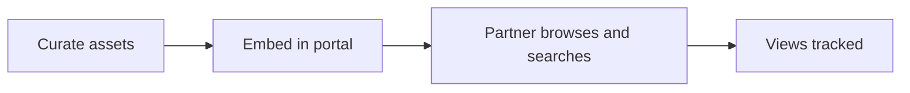
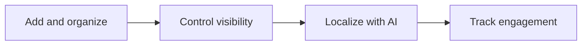
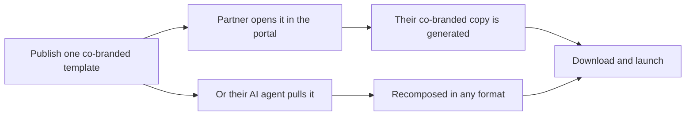
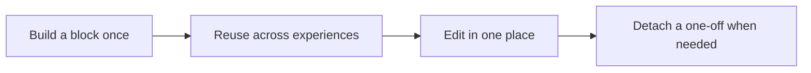
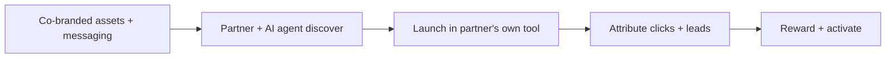
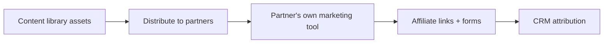

# Introw docs (docs.introw.io): features-content

Verbatim from docs.introw.io/llms-full.txt, fetched 2026-09-29. 23 pages.

# Add and configure an Asset Hub in the portal
Source: https://docs.introw.io/features/content/asset-hub/guides/add-and-configure-an-asset-hub

Add and configure an Asset Hub in a partner portal experience - insert the block, curate assets, set the layout, and publish it for partners to browse.

Partners use content far more when they can browse it in context instead of digging through email. An Asset Hub embeds your library directly in a partner experience as a searchable, filterable list, so enablement is always one click away. This guide takes you from adding the block to curating, laying out, scoping per partner, and publishing it.

## What you'll achieve

A published partner experience with an Asset Hub that shows exactly the assets you intend, in a layout partners can scan, search, and filter, with each partner seeing only the content they are allowed to. For partner-specific hubs, every partner sees the assets tied to them in the same layout.

## Before you start

<Steps>
  <Step title="Have assets in the library">
    Add the content you want to surface to the library first, ideally sorted into folders so you can include or exclude whole groups. See [Build the asset library](/features/content/asset-library/guides/build-the-asset-library).
  </Step>

  <Step title="Confirm write access">
    You need write access to experiences to add and configure a hub.
  </Step>
</Steps>

## Watch it

<Tabs>
  <Tab title="Video">
    <video />
  </Tab>

  <Tab title="Click through">
    <iframe />
  </Tab>
</Tabs>

## Steps

### Add the hub

<Steps>
  <Step title="Open the experience">
    Go to [Experience builder](https://app.introw.io/templates) and open the experience where the hub should live. Pick a stage and tab that fits enablement content, so partners find it where they expect it.

    <Frame>
      
    </Frame>
  </Step>

  <Step title="Add an Asset Hub block">
    Open the section picker and add a hub block. Choose the type up front, because it changes what the hub shows:

    * **General Asset Hub** - lists your organisation library, scoped to the folders you include. Use this for shared collateral every partner in the experience should see.
    * **Partner Specific Asset Hub** - shows only the assets tied to the partner viewing the portal, such as signed agreements, NDAs, or documents you generated for them upfront. You configure its layout the same way as a general hub. To create the documents it lists, see [Share an asset with one partner only](/features/content/asset-library/guides/share-an-asset-with-one-partner).

    <Note>
      A general hub already handles co-branding. When a partner opens a [co-branded template](/features/content/co-branded-assets) listed in it, Introw generates and serves that partner's own co-branded copy on the spot. You do not need a partner-specific hub for that.
    </Note>

    <Frame>
      
    </Frame>
  </Step>
</Steps>

### Configure the layout

<Steps>
  <Step title="Choose how the hub displays">
    Open the hub's configuration and set how it presents content so partners can scan it quickly:

    * **Layout** - choose a table layout for dense, property-rich lists, or a thumbnail layout for visual, image-led content. Pick the one that matches how partners recognise your assets.
    * **Thumbnails per row** - when using the thumbnail layout, set how many tiles appear per row to balance preview size against how much fits on screen. Tiles are 16:9 and draw the thumbnail set on each asset in the library, so if the hub is your shop window, set those thumbnails first (see [Build the asset library](/features/content/asset-library/guides/build-the-asset-library) - 16:9, 1200×675).
    * **Search** - turn on search so partners can jump straight to an asset by name instead of scrolling. Recommended for any hub with more than a handful of items.
    * **Filters** - turn on filters so partners can narrow by property such as type or category. Recommended whenever the hub spans multiple content types.

    <Frame>
      
    </Frame>
  </Step>

  <Step title="Set properties and default sort">
    Decide which columns partners see and how the list is ordered by default:

    * **Properties** - choose the columns shown, such as name, type, categories, and last updated. Show only what helps a partner pick the right asset; extra columns add noise.
    * **Default sort** - set the starting order, for example most recently updated first so fresh content surfaces at the top.
  </Step>

  <Step title="Add saved views">
    Create named views, each with its own filters and sorting, so partners can switch between curated slices instead of rebuilding a filter every time. For example, a view per product line or per stage. Give each view a clear, short name partners will recognise.
  </Step>
</Steps>

### Curate which assets appear

<Steps>
  <Step title="Open the hub's asset visibility settings">
    In the hub's configuration, open the asset visibility settings that control which folders and assets the hub draws from.
  </Step>

  <Step title="Include and exclude folder paths">
    Scope the hub so it stays relevant rather than showing the whole library:

    * **Included paths** - add the folders the hub should show. Including a folder surfaces its assets in the hub, so partners see a tight, purposeful set tied to this experience.
    * **Excluded paths** - remove specific folders or assets that fall inside an included folder but should not appear here. Use this to hide a subset without restructuring the library.

    Library-level visibility still applies on top of this, so an included asset stays hidden from any partner who is not allowed to see it.
  </Step>
</Steps>

### Publish

<Steps>
  <Step title="Publish the experience">
    Publish the experience so the hub and all of its configuration reach partners. Nothing you changed is visible to partners until the experience is published.

    <Frame>
      
    </Frame>
  </Step>

  <Step title="Preview as a partner">
    For a partner-specific hub especially, view the portal as a partner to confirm they see only the assets tied to them, in the layout you set.

    <Frame>
      
    </Frame>
  </Step>
</Steps>

## Verify it worked

Open the published portal as a partner: the Asset Hub appears with your chosen layout, search, filters, and saved views, and it lists only the included folders and assets that partner is allowed to see. A partner-specific hub shows only that partner's assets, and views inside the hub are tracked so engagement appears alongside your other asset analytics.

## Related

<CardGroup>
  <Card title="Build the asset library" icon="book-open" href="/features/content/asset-library/guides/build-the-asset-library">
    Add and organize the assets the hub surfaces.
  </Card>

  <Card title="Review asset engagement" icon="book-open" href="/features/content/asset-library/guides/review-asset-engagement">
    See which hub assets partners actually use.
  </Card>

  <Card title="Publish an experience" icon="book-open" href="/features/portal/experiences/guides/build-and-publish-a-portal-experience">
    Push the experience and hub live to partners.
  </Card>

  <Card title="Implementation reference" icon="screwdriver-wrench" href="../technical">
    Full Asset Hub configuration options.
  </Card>
</CardGroup>

---

# Share assets at scale with audience filters
Source: https://docs.introw.io/features/content/asset-hub/guides/share-assets-at-scale-with-filters

Embed your asset library once and use audience filters to show each partner only the content relevant to their tier, phase, role, or CRM data.

When you want to get content in front of a broad partner audience while still controlling who sees what, audience filters do the work for you. Instead of sharing assets partner by partner, you embed your library once and apply filters that automatically make each asset available to the right partners based on their tier, phase, experience, role, or CRM data. This guide covers the whole job: get the assets into an experience, then apply audience filters so distribution updates itself as partners qualify.

## What you'll achieve

An asset library embedded in your partner experience where each asset is governed by audience filters, so partners automatically see only the content relevant to them and new partners gain access the moment they meet the criteria, with no manual re-sharing.

## Before you start

<Steps>
  <Step title="Have assets in your library">
    You need assets to distribute. See [Build the asset library](/features/content/asset-library/guides/build-the-asset-library).
  </Step>

  <Step title="Have segments or CRM data to filter on">
    Filters read partner attributes (tier, phase, category, experience, role) and CRM properties, so make sure the data you want to filter on is maintained.
  </Step>
</Steps>

## Steps

<Steps>
  <Step title="Embed the assets in an experience first">
    Filters only apply once assets live in an experience, so add your asset library or an asset hub section to the partner experience where partners should reach the content. See [Add and configure an asset hub](./add-and-configure-an-asset-hub). Placing assets here lets filters apply dynamically as partners qualify, with no re-sharing.
  </Step>

  <Step title="Open the asset and add an audience filter">
    Go to [Asset library](https://app.introw.io/assets/library), open the asset you want to control, and select **Add filter** next to **Available to**. Filters combine Introw attributes and CRM data.
  </Step>

  <Step title="Choose the Introw audience conditions">
    Use the Introw filter options to target on data maintained in Introw:

    * **Partner phase** - share based on where a partner is in their journey, such as Onboarding, Activation, or Growth.
    * **Partner tier** - limit content to tiers like Silver, Gold, or Platinum.
    * **Partner categories** - use your own custom groupings, for example Reseller, Distributor, or a regional focus.
    * **Experience** - show the asset only to partners in a given partner experience.
    * **Partner role** - target contacts by role, such as Sales, Marketing, or Solution Architect, so each role gets the right materials.
  </Step>

  <Step title="Add CRM conditions if you need them">
    Layer on CRM-synced properties to refine further, for example region or country, partner type, account status, or any custom CRM field specific to your program. This lets you target on data your sales team already maintains.
  </Step>

  <Step title="Save the filter">
    Save. The asset is now available only to partners who meet the conditions, and access updates automatically as partners' attributes or CRM data change. Repeat for each asset you want to govern.
  </Step>
</Steps>

## Verify it worked

Preview the experience as a partner who meets an asset's filter and confirm the asset appears; check a partner who does not qualify and confirm it is hidden. When a partner's tier, phase, role, or CRM data changes to match, the asset becomes available to them automatically, with no re-sharing on your side.

## Related

<CardGroup>
  <Card title="Add and configure an asset hub" icon="folder-tree" href="./add-and-configure-an-asset-hub">
    Embed assets into the partner experience.
  </Card>

  <Card title="Build the asset library" icon="folder-open" href="/features/content/asset-library/guides/build-the-asset-library">
    Organize the content you distribute.
  </Card>

  <Card title="Create a dynamic segment" icon="users" href="/features/partners/segments/guides/create-a-dynamic-segment">
    Group partners on the attributes filters read.
  </Card>
</CardGroup>

---

# Asset Hub
Source: https://docs.introw.io/features/content/asset-hub/index

Embed a curated, branded asset library directly in the partner portal, with audience filters that control exactly which assets each partner can see.

> The Asset Hub puts a curated, searchable library right inside the partner portal, so partners find the content they need without leaving the portal, and you control exactly which assets each one sees.

## The problem it solves

Sending assets one at a time does not scale, and a dump of everything is worse:

<Pains>
  | Without Introw                   | With Introw                   |
  | -------------------------------- | ----------------------------- |
  | Partners hunt across links       | One curated hub in the portal |
  | You cannot control what they see | Curate folders per hub        |
  | A long list is unusable          | Search, filters and a layout  |
  | Some assets are partner-specific | A hub with only their assets  |
</Pains>

## Impact

The moment a partner has to ask you for a file, you have lost the week. A searchable hub in their own portal is how enablement becomes something they use rather than receive.

<Impact>
  for your business

  * **Cost to run**
    Partner marketing curates a hub and publishes it, with library visibility carried through automatically
  * **No new tool**
    The hub lives inside the partner portal, so there is no separate destination to send anyone to

  for your partners

  * **Self-serve**
    They browse, search and filter to what they need rather than asking for a link
  * **Enabled**
    A co-branded template in the hub opens as their own copy, not yours
  * **Efficient**
    A partner-specific hub means their documents are not mixed into everyone else's

  [A day in the life of a reseller](/days-in-the-life/reseller)
</Impact>

<Personas>
  * **Partner Marketing** - the in-portal content experience
  * **Partner Operations** - hub visibility matching the library
  * **Partners** - finding it themselves
</Personas>

## See it work

<Tour>
  * 

    **What partners browse**

    Stories, decks and video, with the views counted per asset.

  * 

    **Add a hub**

    A general hub, or one that shows only a partner's own assets.

  * 

    **Make it findable**

    Layout, thumbnails per row, search and filters.

  * 

    **Publish it**

    The hub goes live for the partners on that experience.

  * 

    **Check it as a partner**

    Preview what a partner actually sees before you leave.
</Tour>

## How it works

The Asset Hub is a content block you embed in a portal experience that surfaces assets from your
library. Instead of sending one-off links, you give partners a browsable, searchable hub right in
their portal. You curate which folders and assets appear, choose a table or thumbnail layout, and
turn on search and filters so partners can find what they need fast.

Visibility carries through from the library, and a partner-specific hub can show only the assets
tied to an individual partner. Co-branded templates in the hub personalize themselves: a partner
who opens one gets their own co-branded copy, not the template. Views are tracked, so you can see
what partners engage with inside the portal. The result is a self-serve enablement experience that
stays governed and on-brand.

The Asset Hub makes the portal a self-serve enablement surface. Curate the assets, set the
layout, and let partners browse and search in their portal. Visibility stays governed and views are
tracked, so partners help themselves while you keep control and insight.

## Run it from your AI assistant

<Headless>
  * What content has Acme viewed recently?
  * Which assets are getting the most partner engagement?
</Headless>

## Going deeper

<CardGroup>
  <Card title="How to" icon="screwdriver-wrench" href="./technical">
    Setup, configuration, and all how-to guides.
  </Card>

  <Card title="API reference" icon="code" href="/general/introduction">
    Integration surface and code.
  </Card>
</CardGroup>

**Works with**

<CardGroup>
  <Card title="Asset Library" icon="folder-open" href="/features/content/asset-library">
    Embed governed library assets anywhere.
  </Card>

  <Card title="Co-branded Assets" icon="folder-open" href="/features/content/co-branded-assets">
    Partners open their own co-branded copy from the hub.
  </Card>

  <Card title="Embed" icon="code" href="/features/developer/embed">
    Embed assets outside Introw too.
  </Card>
</CardGroup>

---

# Asset Hub
Source: https://docs.introw.io/features/content/asset-hub/technical/index

Embed an Asset Hub in a portal experience, curate its assets, set the layout, and use audience filters to show partner-specific content in Introw.

## Where it lives

Asset Hub sits under **Portal**, at [Experience builder](https://app.introw.io/templates).

<Frame>
  
</Frame>

## Before you start

| You need                    | Why                               | Fix it                                                                              |
| --------------------------- | --------------------------------- | ----------------------------------------------------------------------------------- |
| Write access to experiences | The hub is a portal section       | [Internal roles](/features/access/team-management/guides/create-an-internal-role)   |
| Assets organised in folders | The hub includes or excludes them | [Build the library](/features/content/asset-library/guides/build-the-asset-library) |

## How it works

An Asset Hub is a block you add to a portal experience that lists assets from your library.
There are two kinds: a general Asset Hub that shows org library assets filtered by the folders
you include, and a partner-specific Asset Hub that shows only the assets tied to the partner
viewing it. You configure the hub in a sheet that controls layout, visible properties, sorting,
saved views, and which asset folders are included.

Library visibility still applies, so partners only see assets they are allowed to. Views inside
the hub are tracked, so engagement appears alongside your other asset analytics.

A general hub also personalizes on open: when a partner opens a
[co-branded template](/features/content/co-branded-assets) listed in it, Introw generates and
serves that partner's own co-branded copy instead of the template. A partner-specific hub is only
needed for assets that are already tied to one partner.

## Settings & configuration

Asset Hubs are configured from within an experience in the experience builder.

### Adding a hub

In an experience, add an Asset Hub block (general) or a partner-specific Asset Hub block from
the section picker.

### Layout

Choose a table or thumbnail layout, set how many thumbnails per row, and toggle search and
filters so partners can find assets. Thumbnail tiles are 16:9 and render each asset's library
thumbnail, so the hub inherits whatever is set there - upload 16:9 artwork at 1200×675 on the
assets that matter ([asset thumbnails](/features/content/asset-library/technical)).

### Properties and sorting

Choose which properties partners see, such as name, type, categories, and last updated, and set
a default sort.

### Views

Create named views with their own filters and sorting so partners can switch between curated
slices of the hub.

### Asset visibility

Use the asset visibility settings to include or exclude folder paths, controlling exactly which
assets appear in this hub. Library-level visibility restrictions still apply on top.

## How-to guides

<Rail>
  * 

    [**Add and configure an Asset Hub in the portal**](/features/content/asset-hub/guides/add-and-configure-an-asset-hub)

    Add and configure an Asset Hub in a partner portal experience - insert the block, curate assets, set the layout, and publish it for partners to browse.

  * [**Share assets at scale with audience filters**](/features/content/asset-hub/guides/share-assets-at-scale-with-filters)

    Embed your asset library once and use audience filters to show each partner only the content relevant to their tier, phase, role, or CRM data.
</Rail>

## Troubleshooting

<Warning>
  A hub never overrides library visibility, so an included asset still stays hidden from partners who lack access. Partner-specific hubs only show assets actually tied to a partner, so confirm assets are linked to the right partner. Publish the experience after configuring the hub for partners to see changes.
</Warning>

<AccordionGroup>
  <Accordion title="An included asset is missing for a partner">
    The asset's library visibility excludes them.
  </Accordion>

  <Accordion title="The partner-specific hub is empty">
    No assets are tied to that partner yet.
  </Accordion>

  <Accordion title="A configuration change is not visible">
    The experience was not published.
  </Accordion>
</AccordionGroup>

---

# Build the asset library
Source: https://docs.introw.io/features/content/asset-library/guides/build-the-asset-library

Build the asset library - upload content, organize it into folders and categories, set access permissions, and give AI the context to answer on it.

A content library only delivers value when partners can find the right asset and only the people who should see it can. This guide covers the whole setup: adding content, structuring it into folders and categories, setting visibility per asset, and giving AI the context to answer partner questions from your content. Do it once and every downstream surface, hubs, experiences, and share links, draws from a clean, governed library.

## What you'll achieve

A structured library where assets live in clear folders, are tagged for filtering, carry the right access level, and are ready to surface anywhere in the portal. Public collateral stays open, sensitive material is limited to the portal or specific segments, and AI can answer partner questions accurately from the content you added.

## Before you start

<Steps>
  <Step title="Confirm write access">
    You need write access to assets to add and manage content.
  </Step>

  <Step title="Define segments if restricting access">
    If you plan to restrict any asset to specific partners, create those segments first so they are ready to apply. See [Create a dynamic segment](/features/partners/segments/guides/create-a-dynamic-segment).
  </Step>
</Steps>

## Watch it

<Tabs>
  <Tab title="Video">
    <video />
  </Tab>

  <Tab title="Click through">
    <iframe />
  </Tab>
</Tabs>

## Steps

### Add and organize content

<Steps>
  <Step title="Open Assets">
    Go to [Assets](https://app.introw.io/assets/library), the home of your content library.

    <Frame>
      
    </Frame>
  </Step>

  <Step title="Create folders that match how partners think">
    Build a folder structure before bulk-loading content, so assets land in the right place. Name folders the way partners search, for example by product, use case, or stage. Folders can be nested, and they are what hubs include or exclude later, so a clean structure pays off across the portal.
  </Step>

  <Step title="Add content">
    Use the add menu to bring content in. Choose the type that fits the source:

    * **Upload a file** - add a document, slide deck, spreadsheet, image, or PDF stored as a file. Office files (PPTX, DOCX, XLSX) are converted to a browser preview so partners read them without downloading, and their content is indexed so the agents can answer on them. Use this for collateral you own and want hosted in Introw.
    * **Import a folder** - bring in a whole folder tree at once, from a chosen folder or a ZIP. Optionally keep it syncing from its source so the library stays current as the source changes; turn syncing on when the content is maintained elsewhere.
    * **Add a web page URL** - add a link or an embed for hosted content such as a video or a Google document. Introw recognises common providers, including Loom and YouTube watch, Shorts and live links, and embeds them inline. A site that refuses to be embedded shows its preview image with **Open in a new tab** instead.

    <Frame>
      
    </Frame>

    <Frame>
      
    </Frame>
  </Step>

  <Step title="Set thumbnails on what partners see">
    Introw gives every asset and folder a thumbnail on its own: images, videos, PDFs, and Office files are previewed from the file, and anything else gets a generated card with the asset name and your logo. Replace the ones that matter - a hub in thumbnail layout is mostly thumbnails.

    Hover an asset's thumbnail in its detail panel to upload your own, and use **Set folder thumbnail** in a folder's row menu (or its detail panel) for folders. Introw crops both to **16:9** with a crop-and-zoom step, so upload landscape artwork: 1200×675 matches what Introw generates, and 20 MB is the cap. Language variants carry their own thumbnail on the **Languages** tab.

    No artwork to hand? Select **Generate with AI** under either thumbnail. It reads the asset (or the folder and what it holds) together with your brand colors and produces an on-brand 16:9 image about that content. Add a line of direction if you want something specific, and regenerate until it fits.
  </Step>

  <Step title="Tag assets with categories">
    Categories are shared, filterable tags.
    Partners filter on them in the library and inside Asset Hub embeds, so keep the set small and consistent rather than inventing a label per asset.
    Folders take categories of their own, so a whole folder is filterable without tagging each file inside it.

    **One asset or folder at a time.** Open it and find **Categories** in its detail panel.
    Pick from the existing categories or type a new one (25 characters max) and press Enter.
    The menu on a category pill lets you remove it from this asset, or rename or remove the category everywhere it is used.

    **Several at once.** In the library table, tick the checkbox on each asset and folder you want to tag, or tick **Select all** in the header.
    The header turns into a bulk-action bar showing the selected count with **Edit**, **Archive**, and **Move**.
    Click **Edit**, keep **Categories** as the property to update, pick or create the categories, and click **Update items**.
    The categories you pick replace whatever each selected asset and folder had before.
    Leave the selection empty and click **Clear categories** to strip every category from the selected items.
    Bulk edit is not available in the **Archived** view, where the bar offers **Restore** and **Delete permanently** instead.
  </Step>
</Steps>

### Set who can see each asset

<Steps>
  <Step title="Open the Access tab">
    Open an asset and go to its **Access** tab. Access is set per asset, so you can keep public collateral open while locking sensitive material down.
  </Step>

  <Step title="Choose an access level">
    Pick the level that matches the sensitivity of the asset:

    * **Public access** - anyone with the link can view the asset. Use for openly shareable collateral such as brochures.
    * **Portal access** - only partner users with portal access can view it. Use for standard enablement meant for your partners but not the public.
    * **Restricted access** - only a subset of partner users can view it. Choose this for sensitive material, then add the segments that should have access in the **Segments** selector. Restricted access depends on accurate segments, so confirm them before relying on it.
  </Step>
</Steps>

### Give AI the context to answer

<Steps>
  <Step title="Open the AI tab">
    Open an asset and go to its **AI** tab. What you add here helps AI features answer partner questions accurately from this asset.
  </Step>

  <Step title="Add context and supporting files">
    Provide the background AI needs so its answers are grounded in your content:

    * **Context description** - a plain-text or Markdown note describing what the asset is and when it applies. Use it to give AI background the file itself does not spell out, so answers are accurate.
    * **Supporting files** - upload PDF, TXT, or MD files that are indexed alongside the asset to improve AI answers about it. Add reference material that complements the main asset.
  </Step>
</Steps>

## Verify it worked

Assets appear in their folders and can be filtered by category. Each asset's **Access** tab reflects the level you set, and a restricted asset is visible only to partners in the chosen segments. With AI context added, AI features can answer partner questions using that content. The library is now ready to surface in hubs, experiences, and share links.

## Related

<CardGroup>
  <Card title="Share an asset with a link" icon="book-open" href="./share-an-asset-with-a-link">
    Send a trackable link to a single asset.
  </Card>

  <Card title="Translate a document" icon="book-open" href="./translate-a-document">
    Add language variants for a global partner base.
  </Card>

  <Card title="Add an Asset Hub" icon="book-open" href="/features/content/asset-hub/guides/add-and-configure-an-asset-hub">
    Surface library assets in a partner portal.
  </Card>

  <Card title="Implementation reference" icon="screwdriver-wrench" href="../technical">
    Full asset library configuration options.
  </Card>
</CardGroup>

---

# Review asset engagement
Source: https://docs.introw.io/features/content/asset-library/guides/review-asset-engagement

Review asset engagement to see which assets partners open, how interest trends over time, and which partner companies and people engage most.

Enablement only works if partners use the content, and the only way to know is to measure it. The engagement view shows how often an asset is viewed, how interest trends over a period you choose, and which partners and people are engaging, so you can double down on what works and retire what does not. This guide walks the engagement screen end to end so you can turn content into a measurable program.

## What you'll achieve

A clear read on how an asset is performing: total views, a trend over your chosen date range, and a breakdown of which people and partners viewed it and when. That is enough to decide what to promote, what to refresh, and what to drop.

## Before you start

<Steps>
  <Step title="Confirm there is activity">
    Engagement appears once the asset has been shared or embedded and viewed. If it is brand new, share it first so views can accrue. See [Share an asset with a link](./share-an-asset-with-a-link).
  </Step>
</Steps>

## Watch it

<Tabs>
  <Tab title="Video">
    <video />
  </Tab>

  <Tab title="Click through">
    <iframe />
  </Tab>
</Tabs>

## Steps

<Steps>
  <Step title="Open the Engagement tab">
    Go to [Assets](https://app.introw.io/assets/library), open an asset, and select its **Engagement** tab.

    <Frame>
      
    </Frame>
  </Step>

  <Step title="Set the date range">
    Use the date range picker to scope the view to the period you care about. Pick a preset for a quick window, or set a custom range to line engagement up with a campaign or quarter. The trend and breakdowns below update to match.
  </Step>

  <Step title="Read the views-over-time trend">
    Review the views-over-time chart to see whether interest is rising, flat, or fading across the selected range. A spike after a send or launch tells you the content landed; a flat line on important collateral is a signal to promote or refresh it.
  </Step>

  <Step title="Break down by people and partners">
    Switch between the two breakdowns to see who is engaging:

    * **People** - individual viewers, with their last viewed date and total views. Use it to spot the specific champions engaging with the asset.
    * **Partners** - engagement grouped by partner organisation, with last viewed and total views. Use it to see which partner accounts are actually using the content versus ignoring it.
  </Step>
</Steps>

## Verify it worked

You can see total views, a trend across your chosen range, and per-person and per-partner engagement for the asset. That view is your evidence for which content to invest in and which to retire.

## Related

<CardGroup>
  <Card title="Share an asset with a link" icon="book-open" href="./share-an-asset-with-a-link">
    Drive more tracked views to an asset.
  </Card>

  <Card title="Add an Asset Hub" icon="book-open" href="/features/content/asset-hub/guides/add-and-configure-an-asset-hub">
    Surface assets in the portal to grow engagement.
  </Card>

  <Card title="Implementation reference" icon="screwdriver-wrench" href="../technical">
    Full asset library configuration options.
  </Card>
</CardGroup>

---

# Share an asset with a trackable link
Source: https://docs.introw.io/features/content/asset-library/guides/share-an-asset-with-a-link

Share a single asset with a partner using a trackable link, control who can open it, and see when it was viewed and by which person or company.

Sometimes a partner just needs one asset, fast, without logging into the portal. A trackable share link lets you send it by email or chat, control who is allowed to open it, and record views so you can tell whether the partner actually opened it, which a plain attachment can never tell you. This guide covers choosing the access level, copying the link, and confirming the view lands.

## What you'll achieve

A shareable link to a single asset, scoped to the right audience, that you can drop into an email or chat. When the partner opens it, the view is recorded against the asset so you can see engagement without chasing for confirmation.

## Before you start

<Steps>
  <Step title="Confirm the asset's access fits">
    The asset's access level must allow the people you are sharing with. If it is restricted, the recipients need to fall inside the allowed segments. See [Build the asset library](/features/content/asset-library/guides/build-the-asset-library) to set access.
  </Step>
</Steps>

## Watch it

<Tabs>
  <Tab title="Video">
    <video />
  </Tab>

  <Tab title="Click through">
    <iframe />
  </Tab>
</Tabs>

## Steps

<Steps>
  <Step title="Open the asset">
    Go to [Assets](https://app.introw.io/assets/library) and open the asset you want to share.

    <Frame>
      
    </Frame>
  </Step>

  <Step title="Open the share dialog and set access">
    Use the share action to open the **Share asset** dialog, then set who can open the link under **General access**:

    * **Public access** - anyone with the link can view it. Use for openly shareable collateral.
    * **Portal access** - only partner users with portal access can view it. Use when the asset is for your partners but not the public.
    * **Restricted access** - only a subset of partner users can view it. Choose the **Segments** that should have access. Use this for sensitive material so the link only works for the right partners.

    Activity is tracked on the link regardless of which level you choose, so you can measure engagement either way. Save the access change.

    <Frame>
      
    </Frame>
  </Step>

  <Step title="Copy the link">
    Copy the general share link from the dialog. This is the single URL you will hand to the partner; it respects the access level you just set.

    <Frame>
      
    </Frame>
  </Step>

  <Step title="Send it to the partner">
    Send the link to the partner by email or chat. They open it directly, with no portal login needed when the asset allows it.
  </Step>
</Steps>

## Verify it worked

The link opens the asset for an allowed recipient, and the view appears in the asset's **Engagement** tab against the person who opened it. If a recipient cannot open it, check that the asset's access level includes them.

## Related

<CardGroup>
  <Card title="Review asset engagement" icon="book-open" href="./review-asset-engagement">
    See who opened the asset and how often.
  </Card>

  <Card title="Build the asset library" icon="book-open" href="./build-the-asset-library">
    Set the access level that controls who can open the link.
  </Card>

  <Card title="Implementation reference" icon="screwdriver-wrench" href="../technical">
    Full asset library configuration options.
  </Card>
</CardGroup>

---

# Share an asset with one partner only
Source: https://docs.introw.io/features/content/asset-library/guides/share-an-asset-with-one-partner

Give one partner a document no other partner can see, such as a signed agreement or a joint business plan, and surface it in their portal automatically.

Not all partner content is program content. A signed NDA, a countersigned reseller agreement, a joint business plan, a pricing addendum: each of these belongs to exactly one partner and must never surface to another. A partner-specific asset covers that case. Rather than controlling who may open a shared file, you make the file the partner's own, then let their portal pick it up through a section that fills itself. This guide takes you from creating the asset to the partner opening it in their portal.

## What you'll achieve

A document tied to a single partner, visible to that partner and your own team and to nobody else, listed in their portal in a section that populates itself for every partner you do this for. No segment to maintain, and no separate portal to build per partner.

<Note>
  This is a different mechanism from audience filters. A filter decides which partners may open a **shared** library asset, so one file reaches a group and access changes as partners qualify. A partner-specific asset is **owned** by one partner: it never appears in the general library or a general Asset Hub, and it carries no access settings at all, because ownership is the access. Use filters for content that goes to many partners (see [Share assets at scale](/features/content/asset-hub/guides/share-assets-at-scale-with-filters)); use this guide for content that belongs to one.
</Note>

## Before you start

<Steps>
  <Step title="Have the partner in Introw">
    The document is attached to a partner record, so the partner must exist before you upload. The partner also needs a portal experience if you want them to see the asset there.
  </Step>

  <Step title="Confirm write access">
    You need write access to assets to add the document. Deciding where it appears in the portal additionally needs write access to experiences; without it you can still upload, and the placement field is read-only.
  </Step>

  <Step title="Decide where it belongs in their portal">
    Partner-specific assets appear in a Partner Specific Asset Hub section. Pick the stage and section that fits, for example a Contracts or Legal tab rather than the general enablement tab, so the partner finds it where they expect it.
  </Step>
</Steps>

## Steps

### Create the asset for the partner

<Steps>
  <Step title="Open the partner's assets">
    Go to [Partners](https://app.introw.io/partners), open the partner, and select the **Assets** tab. This is that partner's own library. Everything you add here belongs to them, and it is where their documents collect alongside any co-branded copies Introw generated for them.

    You can also start from the **Asset library** and switch to the **Partner assets** view, which lists every partner-owned asset across your program. Start there when you are handling documents for several partners in one sitting; start from the partner when you are working one account.
  </Step>

  <Step title="Add the document">
    Use **Add asset** and pick how the content arrives:

    * **Upload** - a file from your machine, for example the countersigned PDF. This is the usual path for agreements.
    * **Import folder** - a whole folder at once, for a partner who arrives with a set of documents rather than one.
    * **Web page URL** - a link instead of a file, for example a shared plan that lives in another system and must stay editable there.
    * **Create folder** - a container first, when the partner will accumulate documents and you want them grouped, for example Contracts and Business plans. On the **Partner assets** view the folder dialog asks which **Partner** the folder belongs to; on the partner's own **Assets** tab it is already theirs.
  </Step>

  <Step title="Set the type and the owner">
    In the dialog, work down the fields:

    * **Name** - what the partner will see in their portal. Name it for them, not for your filing system: "Reseller agreement 2026" reads better than "MSA\_v3\_final".
    * **Type** - choose between **Regular**, an asset for your shared library, and **Partner Specific**, an asset owned by one partner. Started from the partner's **Assets** tab, this is already **Partner Specific**. Started from the **Asset library**, set it yourself.
    * **Partner** - the owner. It is prefilled when you started from the partner, and you pick it when you started from the library. Only this partner will ever be able to open the asset.
    * **Include in partner experience** - where the asset shows up in that partner's portal, listed as stage and section. Set it now if the experience already has a Partner Specific Asset Hub; otherwise leave it and come back after the next phase.
    * **Categories** - optional tags. Useful once a partner holds more than a handful of documents, because they drive the filters in the hub.
    * **Language** and **Variants** - the document's language, and optionally a file per additional language when your program runs multilingual portals.

    Save. The asset now belongs to that partner: it is listed on their **Assets** tab and in the **Partner assets** view of the library, and it is absent from the general library and from every general Asset Hub.
  </Step>
</Steps>

<Note>
  A partner-specific asset has no **Access** tab. Segments, portal-wide, and public visibility apply to shared assets only. Here the partner link is the access rule, which is exactly why it suits contracts and other one-to-one documents.
</Note>

### Surface it in their portal

<Steps>
  <Step title="Add a Partner Specific Asset Hub to the experience">
    The asset stays internal until the partner's experience has somewhere to show it. In the experience builder, open the stage that should carry it and add a section: **Smart sections**, then **Asset hub**, which asks whether you want to share general or partner-specific assets. Choose **Partner Specific Asset Hub**, the one described for NDAs, agreements, and co-branded material. Its sibling, the **General Asset Hub**, lists your shared library and will never show partner-owned documents.

    The hub is dynamic. It shows each viewing partner only their own assets, so you add it once to the experience and every partner using that experience gets their own list. Layout, search, filters, and columns work exactly as they do for a general hub; see [Add and configure an Asset Hub](/features/content/asset-hub/guides/add-and-configure-an-asset-hub) for those options.
  </Step>

  <Step title="Point the asset at the hub">
    Back on the partner's **Assets** tab, open the asset and go to its **Include** tab. Pick the placement, listed as stage and section, and the asset is added to that hub for this partner. An asset with no placement stays internal, which is a useful default while a contract is still being negotiated.

    If the tab offers no placements, the partner's experience has no partner-specific hub yet: it links you straight to the experience so you can add one, then come back.
  </Step>

  <Step title="Publish and check the partner's view">
    Publish the experience so the section reaches partners. From the asset's **Include** tab, use the link to view the asset in the partner experience and confirm it lands in the right stage, under the right heading, with a readable name.
  </Step>
</Steps>

### Repeat without repeating the setup

<Steps>
  <Step title="Add the next partner's document">
    For every other partner on the same experience, only the first phase repeats: upload on their **Assets** tab and set the placement. The hub is already there and fills itself, so the portal work is done once for the whole program.
  </Step>
</Steps>

## Verify it worked

Open the portal as the partner who owns the document: the hub lists it, and they can preview and download it. Open the portal as a different partner on the same experience: the same section is there and their own documents are in it, with no trace of the first partner's file. In the library, the asset appears under **Partner assets** and not in the general library, and views are recorded on it like any other asset, so you can tell whether the partner actually opened their agreement.

## Related

<CardGroup>
  <Card title="Add and configure an Asset Hub" icon="book-open" href="/features/content/asset-hub/guides/add-and-configure-an-asset-hub">
    Configure the hub that lists each partner's own assets.
  </Card>

  <Card title="Share assets at scale" icon="book-open" href="/features/content/asset-hub/guides/share-assets-at-scale-with-filters">
    Use audience filters when content goes to many partners instead of one.
  </Card>

  <Card title="Create and share co-branded assets" icon="book-open" href="/features/content/co-branded-assets/guides/create-and-share-co-branded-assets">
    Generated copies land as partner-specific assets automatically.
  </Card>

  <Card title="Implementation reference" icon="screwdriver-wrench" href="../technical">
    Full asset library configuration options.
  </Card>
</CardGroup>

---

# Track and restore asset versions
Source: https://docs.introw.io/features/content/asset-library/guides/track-and-restore-asset-versions

Use asset version history to review every change made to an asset and roll back to any previous version in one click without losing existing links.

As your library grows, a wrong file upload, an accidental rename, or an access change flipped from public to restricted can quietly break partner-facing content. Introw logs every change to an asset automatically and lets you roll back to any previous version in one click, so you get both an audit trail and a safe undo. This guide shows how to read an asset's history and restore an earlier version without losing the record of what happened.

## What you'll achieve

Confidence that any change to an asset can be reviewed and reversed: you can open an asset's history, see who changed what and when, and restore a previous version instantly, with the restore itself logged so the audit trail stays intact.

## Before you start

<Steps>
  <Step title="Have an asset with history">
    Version history builds up as an asset changes. See [Build the asset library](./build-the-asset-library) if you are still setting content up.
  </Step>

  <Step title="Know what is tracked">
    History captures name changes, file replacements, access changes (Public, Portal, Restricted, including audience filters), category moves, thumbnail updates, and archiving or restoring. Any of these becomes a restore point.
  </Step>
</Steps>

## Steps

<Steps>
  <Step title="Open the asset">
    Go to [Asset library](https://app.introw.io/assets/library) and open the asset you want to review. The detail view opens with tabs for its access, engagement, and history.
  </Step>

  <Step title="Open the History tab">
    Select the **History** tab. You see a chronological log of every change since the asset was created, so you can trace exactly what happened and when, and identify the version you want back.

    <Frame>
      
    </Frame>
  </Step>

  <Step title="Restore a previous version">
    Find the entry you want to return to and select **Restore** next to it. The asset reverts to that version immediately. The restore is logged as a new entry, so nothing before or after it is deleted and you can always roll forward again. Because the log is preserved, you can safely restore without losing the record of what changed.
  </Step>
</Steps>

## Verify it worked

After restoring, the asset shows the previous version's file, name, access, or thumbnail as expected, and the **History** tab now includes a new entry recording the restore, with all earlier entries still present. Partners immediately reach the restored version wherever the asset is shared.

## Related

<CardGroup>
  <Card title="Restore a previous experience version" icon="clock-rotate-left" href="/features/portal/experiences/guides/restore-a-previous-experience-version">
    The same one-click rollback for a partner portal experience.
  </Card>

  <Card title="Build the asset library" icon="folder-open" href="./build-the-asset-library">
    Organize and manage the content that versioning protects.
  </Card>

  <Card title="Review asset engagement" icon="chart-line" href="./review-asset-engagement">
    See how partners interact with your assets.
  </Card>
</CardGroup>

---

# Translate a document into partner languages
Source: https://docs.introw.io/features/content/asset-library/guides/translate-a-document

Translate a document into multiple partner languages with AI, generating localized variants so every partner reads content in their own language.

Partners engage far more with content they can actually read. Introw can generate language variants of a document with AI, so you localize from the same asset instead of commissioning a translation vendor and managing separate files. This guide covers selecting the target languages, running the translation, and reviewing the result, plus the one dependency to be aware of: automatic translation must be enabled for your workspace.

## What you'll achieve

A single document asset that carries language variants, each held against its locale, so a partner is served the version in their language while you maintain one asset. Translations preserve the document's formatting and fill only the language slots that are still empty.

## Before you start

<Steps>
  <Step title="Have a supported document">
    You need a document asset that supports translation. Very large files are not eligible, so keep the source within the document translation size limit.
  </Step>

  <Step title="Confirm automatic translation is enabled">
    Automatic document translation depends on a translation provider being configured for your workspace. If it is not enabled, the generate action reports that automatic translation is not configured, and you will need it turned on before you can continue.
  </Step>
</Steps>

## Steps

<Steps>
  <Step title="Open the Languages tab">
    Go to [Assets](https://app.introw.io/assets/library), open the document, and select its **Languages** tab. This tab lists the base language and any existing variants, and is where you add or generate more.

    <Frame>
      
    </Frame>
  </Step>

  <Step title="Choose the target languages">
    Open the generate translations action and pick the languages you want variants for. Use the select-all control to fill every empty language at once, or check individual languages for a subset. Only languages without an existing variant are offered, since translation fills empty slots rather than overwriting work you already have.
  </Step>

  <Step title="Generate the translations">
    Start the translation. It runs as a background job that preserves the document's formatting, so you can keep working while it completes; large files can take a few minutes. You are notified when the variants are ready.
  </Step>

  <Step title="Review each variant">
    Once the job completes, open each new variant from the **Languages** tab and check it for accuracy before relying on it with partners. If you would rather supply your own translation for a language, you can add a variant manually instead of generating one.
  </Step>
</Steps>

## Verify it worked

The new language variants appear under the asset's **Languages** tab, each tied to its locale. A partner in that language is served the matching variant from the same asset, and the base document and its variants stay together as one item.

## Related

<CardGroup>
  <Card title="Build the asset library" icon="book-open" href="./build-the-asset-library">
    Add the documents you localize.
  </Card>

  <Card title="Review asset engagement" icon="book-open" href="./review-asset-engagement">
    See which language variants partners use.
  </Card>

  <Card title="Implementation reference" icon="screwdriver-wrench" href="../technical">
    Full asset library configuration options.
  </Card>
</CardGroup>

---

# Asset Library
Source: https://docs.introw.io/features/content/asset-library/index

One governed home for every partner-facing asset - organized in folders, access-controlled, multilingual, and tracked for partner engagement.

> The Asset Library is the single source of truth for partner content: every file, link, and embed in one place, with the right partners seeing the right thing and a clear view of what they actually use.

## The problem it solves

Scattered, stale content is the quiet killer of partner enablement:

<Pains>
  | Without Introw                       | With Introw                   |
  | ------------------------------------ | ----------------------------- |
  | Content lives in too many places     | One governed library          |
  | Partners get stale versions          | One source, always current    |
  | Everyone sees everything, or nothing | Visibility set per asset      |
  | A contract belongs to one partner    | Tie the asset to that partner |
  | You cannot tell what works           | Views tracked per asset       |
</Pains>

## Impact

Enablement content is only worth what partners can find. One governed library that reaches them in the portal, in a link and in the CRM is what makes yours the deck they present.

<Impact>
  for your business

  * **Live in days**
    Upload or import what you already have and it powers the portal, share links and CRM surfaces immediately
  * **Cost to run**
    Partner marketing runs folders, categories, versions and visibility, with no engineering anywhere in it
  * **AI, not admin**
    AI generates language variants of a document, and your PPTX, DOCX and XLSX files feed the agents as context

  for your partners

  * **Self-serve**
    They reach the current version, in their own language, without asking anyone to send it
  * **Enabled**
    PowerPoint, Word and Excel open in the browser, so nothing has to be downloaded to be read
  * **Efficient**
    A signed agreement is visible to exactly them, so nothing private sits in a shared folder

  [A day in the life of a reseller](/days-in-the-life/reseller)
</Impact>

<Personas>
  * **Partner Marketing** - content curated and localised
  * **Partner Operations** - folders, categories and access
  * **Partners** - the current version, in their language
</Personas>

## See it work

<Tour>
  * 

    **Add the content**

    Upload a file, import a folder, or add a web page.

  * 

    **Organise it**

    Folders that match how partners actually think.

  * 

    **Govern who sees it**

    Public, portal-only, or restricted to named segments.

  * 

    **See what gets used**

    Views per asset, over the period you pick.
</Tour>

## How it works

The Asset Library holds everything partners need: documents, presentations, links, and embeds,
organized into folders and tagged with categories. You upload or import content once and manage
it centrally, so partners always reach the current version instead of a stale copy floating in
someone's inbox. Visibility controls let you decide per asset whether it is public, portal-only,
restricted to specific segments, or owned outright by a single partner, which is how signed
agreements and other one-to-one documents stay private to that partner. Office files work
natively: upload a PowerPoint, Word, or Excel
file (PPTX, DOCX, XLSX) and partners view it right in the browser with no download, and the same
files feed Introw's agents as context, so partner support and the deal coach answer from your decks
and documents, not only PDFs.

The library is built for partner enablement at scale. You can generate language variants of
documents so partners read content in their own language, produce co-branded versions for
partners to use, and track engagement to see which assets get viewed. Because the same library
feeds the portal, share links, and CRM surfaces, your content reaches partners wherever they
work.

Visibility is set per asset across the full range, from public to segment-restricted, so a
pricing sheet can reach every partner while a signed agreement reaches exactly one.

The Asset Library turns content chaos into a governed system. Organize once, control visibility,
localize with AI, and watch engagement. Enablement becomes a managed, measurable program instead
of a pile of files nobody can find.

## Run it from your AI assistant

<Headless>
  * Which assets are partners viewing most?
  * Has Acme downloaded the security whitepaper?
  * Upload these partner one-pagers to the Sales folder.
</Headless>

For an upload, your assistant gives you one drag-and-drop page for up to 15 files.
Files you already uploaded through that page are skipped.

## Going deeper

<CardGroup>
  <Card title="How to" icon="screwdriver-wrench" href="./technical">
    Setup, configuration, and all how-to guides.
  </Card>

  <Card title="API reference" icon="code" href="/general/introduction">
    Integration surface and code.
  </Card>
</CardGroup>

**Works with**

<CardGroup>
  <Card title="Experiences" icon="browser" href="/features/portal/experiences">
    Assets surface in portal experiences.
  </Card>

  <Card title="Co-branded Assets" icon="folder-open" href="/features/content/co-branded-assets">
    Co-brand assets from the library.
  </Card>

  <Card title="Synced Sections" icon="folder-open" href="/features/content/synced-sections">
    Reuse library content in synced sections.
  </Card>
</CardGroup>

---

# Asset Library
Source: https://docs.introw.io/features/content/asset-library/technical/index

Upload and organize partner assets in Introw, set folder visibility and permissions, localize content into partner languages, and track engagement.

## Where it lives

Asset Library lives at [Assets](https://app.introw.io/assets/library).

<Frame>
  
</Frame>

## Before you start

| You need                     | Why                           | Fix it                                                                            |
| ---------------------------- | ----------------------------- | --------------------------------------------------------------------------------- |
| Write access to assets       | To add and manage content     | [Internal roles](/features/access/team-management/guides/create-an-internal-role) |
| Segments, to restrict access | Only if some assets are gated | [Create a segment](/features/partners/segments/guides/create-a-dynamic-segment)   |

## How it works

The Asset Library lives under **Assets** and is organized into folders. Each item is an asset:
an uploaded file, a web link, or an embed. You add assets, sort them into folders, and tag them
with categories so they are easy to find. Every asset has visibility settings that control who
can see it, and a detail panel with tabs for access, languages, engagement, history, and AI.

The library has built-in views for active assets, partner assets, and archived assets, and you
can create custom views with your own filters and layout. Archived assets are kept for a
retention window before they are permanently removed.

An asset is either shared or owned by one partner. A shared asset lives in the general library
and its access tab decides who may open it. A **Partner Specific** asset belongs to a single
partner: it is listed on that partner's **Assets** tab and in the **Partner assets** view, never
in the general library, and it has no access tab because the partner link is the access rule.
Use it for signed agreements, NDAs, and anything else that is one partner's alone. See
[Share an asset with one partner only](/features/content/asset-library/guides/share-an-asset-with-one-partner).

## Settings & configuration

The library is managed at [Assets](https://app.introw.io/assets/library).

### Adding assets

Use the add menu to upload a file, import a folder, add a web page URL, or create a folder.
Imported folders can keep syncing from their source so the library stays current.

The add dialog carries a **Type** switch: **Regular** for a shared asset, or **Partner Specific**
for one owned by a single partner, which then asks for the **Partner** and, optionally,
**Include in partner experience** to place it in that partner's portal straight away. Folders can
be partner-owned in the same way.

### Web links and embeds

**Add a web page URL** takes a link to hosted content. When the site allows it, the asset plays or
shows inline, in the library and in the portal. A Loom share link plays inline, and a YouTube watch,
Shorts or live link is turned into its embed, so you can paste the link from the address bar. A site
that refuses to be embedded shows the page's preview image instead, with **Open in a new tab**, so a
partner still reaches it in one click rather than seeing a blank frame.

### Folders and categories

Organize assets into nested folders and tag them with categories. Categories act as filterable
tags across the library and Asset Hub embeds. Folders take categories of their own, so a whole
folder is filterable without tagging each file inside it.

On a partner's **Assets** tab, the table adds two columns you can filter and sort on: **Included in
portal** (Yes or No) and **Included in**, the portal section that shows the asset to that partner. Use
them to see exactly what one partner's portal embeds. Every view sorts and filters on **Date added**,
the day the asset was first added, which does not move when the asset is later edited.

Assets also move, re-categorize, archive, restore, and delete **in bulk** - select several and act on
them once, rather than opening each asset. Tick the rows, then choose **Edit** in the bulk-action bar to
set **Categories** on every selected asset and folder in one go. The set you pick replaces what each
item had; an empty set clears them. See [Build the asset library](../guides/build-the-asset-library)
for the step-by-step.

### Thumbnails

Every asset and folder gets a thumbnail without you doing anything. Images, videos, PDFs, and
Office files are previewed from the file itself; anything else falls back to a generated
**1200×675 (16:9)** card carrying the asset name and your logo on your brand color. Override
either when the automatic one is unhelpful:

| Thumbnail        | Where to set it                                                  | Ratio                   | Recommended | Cap   |
| ---------------- | ---------------------------------------------------------------- | ----------------------- | ----------- | ----- |
| Asset            | Asset detail panel, hover the thumbnail                          | 16:9, cropped on upload | 1200×675    | 20 MB |
| Language variant | Asset detail panel, **Languages** tab                            | 16:9, cropped on upload | 1200×675    | 20 MB |
| Folder           | Folder detail panel, or **Set folder thumbnail** in the row menu | 16:9, cropped on upload | 1200×675    | 20 MB |

Each upload opens a crop-and-zoom step and is saved at exactly 16:9, so a portrait image loses
its sides. Thumbnails are served downscaled to 1080px wide, so there is nothing to gain from
uploading more than about 1920×1080. Thumbnails are what the Asset Hub's thumbnail layout shows
partners, so they are worth setting on anything customer-facing.

**Generate with AI** sits next to both uploads. It reads the asset (name, description,
categories) or the folder (name and what it holds) plus your brand colors, and produces a 16:9
image at 1200×675 - so the artwork is about the content rather than generic stock. Add an
optional line of direction before generating, and regenerate as often as you like. Generated
images never contain text, since image models render text unreliably.

### Visibility and access

Access is set **per asset and per folder**. A folder carries its own audience - the same partner,
contact, and deal conditions a segment uses - so restricting a folder restricts everything in it and
hides the folder itself from partners outside that audience. That is how you keep one library for the
whole program while a tier, a region, or a single partner sees only its own shelf, without maintaining
per-partner copies. Sub-folders carry their own audience on top.

Each asset's access tab controls visibility: public for anyone with the link, portal for
partner portal users, or restricted to specific segments. Share settings let you set link
expiry and whether downloads are allowed. Partner-specific assets show an **Include** tab
instead of an access tab, holding the portal placement rather than an audience.

### Languages

The languages tab manages locale variants. You can add variants manually or generate document
translations with AI, which run as a background job.

### Engagement and history

The engagement tab shows views over time and breakdowns by people and partners. The history tab
shows versions and uploads, and you can restore a previous version.

### AI context

The AI tab holds a context description and supporting files that help AI features answer
partner questions accurately from your content.

## How-to guides

<Rail>
  * 

    [**Build the asset library**](/features/content/asset-library/guides/build-the-asset-library)

    Build the asset library - upload content, organize it into folders and categories, set access permissions, and give AI the context to answer on it.

  * 

    [**Review asset engagement**](/features/content/asset-library/guides/review-asset-engagement)

    Review asset engagement to see which assets partners open, how interest trends over time, and which partner companies and people engage most.

  * 

    [**Share an asset with a trackable link**](/features/content/asset-library/guides/share-an-asset-with-a-link)

    Share a single asset with a partner using a trackable link, control who can open it, and see when it was viewed and by which person or company.

  * [**Share an asset with one partner only**](/features/content/asset-library/guides/share-an-asset-with-one-partner)

    Give one partner a document no other partner can see, such as a signed agreement or a joint business plan, and surface it in their portal automatically.

  * [**Track and restore asset versions**](/features/content/asset-library/guides/track-and-restore-asset-versions)

    Use asset version history to review every change made to an asset and roll back to any previous version in one click without losing existing links.

  * [**Translate a document into partner languages**](/features/content/asset-library/guides/translate-a-document)

    Translate a document into multiple partner languages with AI, generating localized variants so every partner reads content in their own language.
</Rail>

## Troubleshooting

<Warning>
  Restricted visibility depends on your segments being accurate, so review them before relying on segment-based access. Archived assets are removed permanently after the retention window, so restore anything you still need in time. Generated translations run as a background job and may take a little while to appear.
</Warning>

<AccordionGroup>
  <Accordion title="A partner cannot see an asset">
    Its visibility is set to restricted or portal and they are not in scope.
  </Accordion>

  <Accordion title="A partner-specific asset is missing from the portal">
    It has no placement on its **Include** tab, or the partner's experience has no Partner Specific Asset Hub to hold it.
  </Accordion>

  <Accordion title="A translation has not appeared">
    The generation job is still running.
  </Accordion>

  <Accordion title="A deleted asset is gone">
    It was past the archive retention window when removed.
  </Accordion>
</AccordionGroup>

---

# Create and share co-branded assets
Source: https://docs.introw.io/features/content/co-branded-assets/guides/create-and-share-co-branded-assets

Upload a co-branded PDF template, publish it in an Asset Hub, and let every partner open their own copy with their logo and details merged in.

Co-marketing stalls when every partner needs a one-off design with their logo dropped in.
A co-branded asset solves that: you upload one PDF with form fields for the partner's name and logo, publish it like any other asset, and each partner gets their own copy the moment they open it.
This guide takes you from building the PDF to publishing it in an Asset Hub, plus the optional bulk run for when the copies need to exist upfront.

## What you'll achieve

A single co-branded PDF in your library that every partner opens as their own personalized, on-brand copy, with no per-partner work from your team.
Your branding stays fixed; only the partner name and logo change per copy.

## Before you start

<Steps>
  <Step title="Prepare a PDF with co-branding form fields">
    Build your PDF as a form whose fields are named for the partner details to merge, a partner name field and a partner logo field. Introw recognises these field names and fills them per partner; everything else in the PDF stays fixed as your branding.
  </Step>

  <Step title="Confirm partner branding is captured">
    The merge pulls each partner's name and logo from their record. If a partner has no logo, Introw falls back to a logo resolved from their domain, and to a lettermark if none exists there. Capture real logos first for a fully co-branded result: upload a square image around 200×200 on the partner record. The logo is scaled to fit inside your PDF's logo field and keeps its shape, so size that field for a square mark unless your partners' logos are all wide.
  </Step>

  <Step title="Confirm permission to manage content">
    You need write access to assets to upload the template.
  </Step>
</Steps>

## Steps

### Create the co-branded asset

<Steps>
  <Step title="Upload the PDF to the library">
    Go to [Assets](https://app.introw.io/assets/library) and upload your co-branding PDF as a file. It lives in the Asset Library alongside the rest of your content, with the same access controls.

    Upload it as a new asset rather than replacing the file on an existing one. Introw reads the form fields on first upload, so a replaced file is never picked up as a co-branded template.
  </Step>

  <Step title="Confirm the co-branding fields">
    Open the asset and check its detail panel. Introw reads the PDF form fields and lists what it will personalize under **Co-Branding fields**:

    * **Partner name** - the text field that will be filled with each partner's name.
    * **Partner logo** - the image field that will be filled with each partner's logo.

    If a field you expected is missing, the PDF's form field is not named in a way Introw recognises; rename it in the source PDF and upload it again as a new asset. Anything that is not a co-branding field stays exactly as you designed it, so lock in your branding by leaving it as static PDF content.

    <Frame>
      
    </Frame>
  </Step>
</Steps>

### Publish it to partners

This is all it takes. Partners get their co-branded copy on open, so the template goes out like any other asset.

<Steps>
  <Step title="Add it to an Asset Hub">
    Add the asset to a regular [Asset Hub](/features/content/asset-hub/guides/add-and-configure-an-asset-hub) in a portal experience, in whatever folder fits your enablement structure. You do not need a partner-specific hub.
  </Step>

  <Step title="Publish the experience">
    Publish so partners see the hub. Set the asset's visibility first if only some segments should get it.
  </Step>
</Steps>

When a partner clicks the asset in the hub, Introw generates their co-branded copy right then, merges in their name and logo, and shows them that copy to preview and download.
The copy is saved to their assets and reused every time they open it, so each partner is generated once.
Nothing changes for you: you manage one template, and the per-partner versions take care of themselves.

<Note>
  This works on any path that opens the asset in a partner context, not only the Asset Hub: an asset link you share, an asset attached to a task, or an asset embedded elsewhere in the portal.
</Note>

### Optional: generate copies upfront

Pre-generate copies when they need to exist before a partner opens the template, for example to attach them to a task, mail them out, or list them in a partner-specific Asset Hub.

<Steps>
  <Step title="Open the generate dialog">
    With the asset open, use the **Generate for your partners** action to open the **Generate co-branded assets** dialog.
  </Step>

  <Step title="Choose the partners">
    Decide the audience for this run:

    * **All partners** - generate a copy for every partner at once. Use this for broadly relevant collateral.
    * **Selected partners** - pick specific partners from the selector when only some should receive it, for example a campaign aimed at one tier or region.
  </Step>

  <Step title="Generate">
    Introw creates one personalized PDF per partner. Each copy is saved as a partner-specific asset under **Partner Assets** in the library and on that partner's assets page, so it belongs to that partner and no one else. Any partner whose PDF could not be produced is reported back so you can fix the source and retry.
  </Step>
</Steps>

<Warning>
  This run does not check for copies that already exist, so partners who have already opened the asset get a second copy. Pre-generate before you publish, not after.
</Warning>

## Verify it worked

Open the portal as a partner and click the asset in the hub: it shows your fixed branding with that partner's name and logo merged in, ready to download.
Back in the library, the same copy now appears under **Partner Assets** and on that partner's assets page, and no other partner can see it.

## What your partners experience

Partners browse the hub and open what looks like a normal asset.
What they get is their own version, with their logo and details already merged into the template you control, ready to download and use.
There is no request, no waiting, and nothing to configure, so the template you set up here becomes on-brand collateral the whole program self-serves on demand.

## Generate co-branded versions with AI

The portal flow above is not the only way partners co-brand.
Because the asset lives in the governed library, a partner can pull it straight into their own AI assistant over Introw's [MCP server](/features/developer/mcp) and ask the agent to generate a co-branded version, recomposed with their branding and voice rather than just stamped with a logo, and exported in whatever format they need (PDF, DOCX, JPEG).

This is the agentic co-branding motion: partners (and their agents) turn your enablement into ready-to-use, fully co-branded collateral without a design request or a portal login.
It ships as drop-in Claude Code skills, one for your team and one for partners.

<CardGroup>
  <Card title="Co-branded Collateral Generator" icon="wrench" href="/headless/skills/vendor/cobranded-collateral-generator">
    Vendor skill: generate per-partner co-branded PDF, DOCX, or JPEG at scale.
  </Card>

  <Card title="Co-brand My Collateral" icon="wrench" href="/headless/skills/partner/cobrand-my-collateral">
    Partner skill: self-serve fully co-branded assets across every vendor portal.
  </Card>
</CardGroup>

## Related

<CardGroup>
  <Card title="Add and configure an Asset Hub" icon="book-open" href="/features/content/asset-hub/guides/add-and-configure-an-asset-hub">
    Surface the co-branded template in the portal.
  </Card>

  <Card title="Build the asset library" icon="book-open" href="/features/content/asset-library/guides/build-the-asset-library">
    Manage access on the source asset and its copies.
  </Card>

  <Card title="Through-Channel Marketing" icon="megaphone" href="/features/content/tcma">
    Distribute co-branded assets in attributed partner campaigns.
  </Card>

  <Card title="Implementation reference" icon="screwdriver-wrench" href="../technical">
    Full co-branded asset configuration options.
  </Card>
</CardGroup>

---

# Co-branded Assets
Source: https://docs.introw.io/features/content/co-branded-assets/index

Let partners generate marketing assets that carry both your brand and theirs, so co-marketing scales without your team designing one-offs.

> Co-marketing stalls when every asset needs your design team, and a logo stitched on a deck was never really co-branding. Partners, and their AI agents, pull your enablement and generate fully co-branded versions themselves, in any format, in minutes.

## The problem it solves

<Pains>
  | Without Introw                     | With Introw                    |
  | ---------------------------------- | ------------------------------ |
  | Every asset is a design request    | Partners get their own copy    |
  | A logo on a deck is not co-brand   | Fully recomposed documents     |
  | Partners go off-brand on their own | The template holds both brands |
  | Co-marketing does not scale        | Hundreds self-serve at once    |
</Pains>

## Impact

Partners market with what they have. Giving them fully co-branded material they generate themselves, in the format they need, is the difference between a logo on your deck and their campaign.

<Impact>
  for your business

  * **Cost to run**
    You publish one template and there is nothing to prepare per partner, however many partners you have
  * **No new tool**
    It sits in a normal Asset Hub and behaves like any other asset, except each partner opens their own
  * **AI, not admin**
    A partner's own agent pulls the asset over MCP and recomposes it as PDF, DOCX or JPEG in their voice

  for your partners

  * **Self-serve**
    They open the asset and their co-branded copy is generated, with nothing queued or requested
  * **Enabled**
    Ready-to-use material carrying their own branding, which is what actually reaches a customer
  * **Efficient**
    Minutes instead of a design ticket, in whatever format their campaign needs

  [A day in the life of a reseller](/days-in-the-life/reseller)
</Impact>

<Personas>
  * **Partner Marketing** - templates, not per-partner work
  * **Partners** - material with their own brand
</Personas>

## How it works

Co-branded assets are templates that combine your branding with each partner's, automatically. A partner takes a one-pager, a slide or a campaign asset and gets it personalized with their logo and details, with no design work.

<Frame>
  
</Frame>

You publish the template once.
Every partner gets their own copy, generated the moment they open the asset in their portal.

There is nothing to prepare per partner.
Put the template in a normal Asset Hub and it behaves like any other asset in the list, except each partner opens their own co-branded version instead of yours.
The rest of the document is your design and cannot be changed, so both brands stay consistent across the whole program.

Co-branding goes well beyond dropping in a logo.
Partners can pull an asset into their own AI assistant over Introw's [MCP server](/features/developer/mcp) and generate a fully co-branded version. It is recomposed with their branding, details and voice, and exported in whatever format they need: PDF, DOCX, JPEG.

The assets live in the same library that powers the rest of your enablement, so they are governed, versioned, and easy to distribute.

Instead of your team producing a custom asset for each partner, you publish one co-branded template.
A partner opens it in their portal and gets their own co-branded document, ready to download.
Nothing is queued, requested, or prepared per partner, so co-marketing scales to the whole program at once.

## Run it from your AI assistant

<Headless>
  * Generate a co-branded version of the launch one-pager with our branding
  * Which co-branded assets can I personalize?
</Headless>

## Going deeper

<CardGroup>
  <Card title="How to" icon="screwdriver-wrench" href="./technical">
    Setup, configuration, and all how-to guides.
  </Card>

  <Card title="API reference" icon="code" href="/general/introduction">
    Endpoints and code.
  </Card>
</CardGroup>

**Works with**

<CardGroup>
  <Card title="Asset Library" icon="folder-open" href="/features/content/asset-library">
    Co-brand straight from the library.
  </Card>

  <Card title="Branding & White-label" icon="browser" href="/features/portal/branding">
    Apply partner and vendor branding.
  </Card>

  <Card title="Certificates" icon="graduation-cap" href="/features/courses/certificates">
    Co-brand certificates the same way.
  </Card>

  <Card title="Through-Channel Marketing (TCMA)" icon="folder-open" href="/features/content/tcma">
    Distribute co-branded assets in partner campaigns.
  </Card>
</CardGroup>

---

# Co-branded Assets
Source: https://docs.introw.io/features/content/co-branded-assets/technical/index

Upload a co-branded PDF template to the Asset Library and let every partner get their own co-branded copy, generated the moment they open it in the portal.

## Where it lives

Co-branded Assets lives at [Assets](https://app.introw.io/assets/library).

<Frame>
  
</Frame>

## Before you start

| You need                              | Why                                 | Fix it                                                                            |
| ------------------------------------- | ----------------------------------- | --------------------------------------------------------------------------------- |
| The Asset Library on your plan        | Co-branding builds on it            | **Request access**                                                                |
| A source PDF built as a form          | Introw fills its named fields       | [Build a form](/features/forms/form-builder/guides/build-and-publish-a-form)      |
| Partner logos, or a resolvable domain | The logo has to come from somewhere | [Sync partners](/features/integrations/crm/guides/sync-partners-and-contacts)     |
| Permission to manage assets           | To publish the template             | [Internal roles](/features/access/team-management/guides/create-an-internal-role) |

## How it works

A co-branded asset is a normal PDF in your Asset Library, built as a PDF form whose fields are named for the partner details Introw should fill in.
Introw reads those field names when you upload the file and lists them on the asset as **Co-Branding fields**.
Everything else in the PDF is your design and never changes.

Partners never see the template.
The moment a partner opens the asset in their portal, Introw generates their co-branded copy on the spot, merges in their name and logo, and serves that copy for preview and download.
This happens on any path that opens the asset in a partner context: clicking it in a regular [Asset Hub](/features/content/asset-hub), following an asset link, or opening it from a task or announcement.
You do not need a partner-specific hub and you do not need to pre-generate anything.

The copy is saved as a partner-specific asset and reused on every later open, so each partner is generated once.
Generated copies show up under **Partner Assets** in the library and on that partner's assets page, and only that partner can open theirs.

You can also pre-generate copies in bulk with **Generate for your partners** on the asset, for all partners or a selected set.
That is optional. Use it when you want the copies to exist before anyone opens the template, for example to attach them to a task or surface them in a partner-specific Asset Hub.

Partners can also pull the asset into their own AI assistant over Introw's [MCP server](/features/developer/mcp) and have the agent produce a co-branded version recomposed with their branding and voice, exported in the format they need (PDF, DOCX, JPEG).
That path is a new document generated by the agent, not the PDF form merge described here.
It ships as drop-in skills: [Co-branded Collateral Generator](/headless/skills/vendor/cobranded-collateral-generator) for vendors and [Co-brand My Collateral](/headless/skills/partner/cobrand-my-collateral) for partners.

## Settings & configuration

There is no separate co-branding configuration screen. What the merge does is driven by the source PDF and the partner record.

### Co-Branding fields

Introw recognises two fields, matched case-insensitively on the PDF form field name:

* **Partner name** - a text field whose name contains `partner.name`, `partner-name`, `partnername`, or the `company` equivalent (`company.name`, `company-name`, `companyname`). Filled with the partner's name.
* **Partner logo** - a field whose name contains `partner.logo`, `partner-logo`, `partnerlogo`, or the `company` equivalent. Filled with the partner's logo image.

The asset detail panel lists the fields Introw found, so you can confirm the template before publishing it.
Any other form field in the PDF is not filled and is flattened away empty, so remove fields you do not want in the output.

### Where the partner logo comes from

Introw resolves the logo in this order:

1. The logo on the partner record.
2. A logo fetched from the partner's domain. If none exists, this returns a lettermark built from the domain.
3. Nothing, leaving the logo field empty.

Logos are converted to PNG before they are placed, so SVG and other web formats work. The logo is
scaled to fit the field and keeps its aspect ratio, so shape your logo field to the logos you
expect - square, if partner logos come from the partner record, where the recommended upload is
200×200.

### What partners can change

Nothing. The generated PDF is flattened, so it is a fixed document: your design plus the partner's name and logo.
Partners download it, they do not edit it.

### Visibility

The source asset uses the same visibility controls as the rest of the library, and that decides who can see it and therefore co-brand it.
Each generated copy belongs to exactly one partner and is only ever visible to them.

## How-to guides

<Rail>
  * [**Create and share co-branded assets**](/features/content/co-branded-assets/guides/create-and-share-co-branded-assets)

    Upload a co-branded PDF template, publish it in an Asset Hub, and let every partner open their own copy with their logo and details merged in.
</Rail>

## Troubleshooting

<Warning>
  Co-branding is PDF only, and only the partner name and logo are merged. Introw reads the form fields when the file is first uploaded, so replacing the file on an existing asset does not turn it into a co-branded template - upload it as a new asset instead. Replacing the source file also does not regenerate copies partners already have.
</Warning>

* **A partner context is required.** Internal users previewing the asset, and visitors Introw cannot resolve to a partner, get the template. Partners always open the asset from their portal, so this only shows up in internal previews.
* **No logo and no usable domain** leaves the logo area empty. A domain with no logo on file gives a lettermark instead of a real logo.
* **Locale variants and document translation do not apply to co-branded copies.** The copy is generated from the source asset's default file, and translated variants cannot be added to a generated copy.
* **Bulk generation does not de-duplicate.** Running **Generate for your partners** for partners who already have a copy creates a second one.

<AccordionGroup>
  <Accordion title="Co-Branding fields are not listed on the asset">
    The PDF form field names are not recognised. Rename them in the source PDF and upload it as a new asset.
  </Accordion>

  <Accordion title="A partner sees the template instead of their copy">
    The asset was opened without a partner context, for example an internal preview or a link that carries no portal or room.
  </Accordion>

  <Accordion title="The logo is missing or shows initials">
    There is no logo on the partner record and none could be resolved from their domain.
  </Accordion>

  <Accordion title="The copy still shows the old design">
    Existing copies are not regenerated when you replace the source file. Delete the partner's copy so it regenerates on their next open.
  </Accordion>

  <Accordion title="A partner cannot find the asset">
    Check the source asset's visibility for their segment.
  </Accordion>
</AccordionGroup>

---

# Content & Enablement
Source: https://docs.introw.io/features/content/index

Manage every partner-facing asset in one place - organized, co-branded, embedded into the partner portal, and tracked for engagement across partners.

> Content & Enablement is the central, governed library behind every partner-facing surface: store and organize assets once, control who sees what, embed them into the portal, and see what partners actually use.

## The problem it solves

<Pains>
  | Without Introw                       | With Introw                |
  | ------------------------------------ | -------------------------- |
  | Content is scattered across drives   | One governed library       |
  | Partners get the stale version       | One source, always current |
  | Everyone sees everything, or nothing | Visibility set per asset   |
  | You cannot tell what gets used       | Views tracked per asset    |
</Pains>

## Impact

Partners sell with whatever is easiest to find. Being the vendor whose current, co-branded, on-brand material is one click away in their own portal is how you get sold.

<Impact>
  for your business

  * **Live in days**
    Upload what you already have and it powers every partner surface immediately, with no content migration first
  * **Cost to run**
    Partner marketing runs the library, its versions and its visibility rules without engineering
  * **AI, not admin**
    AI translates documents into partner languages, and your decks and docs become the answers the agents give

  for your partners

  * **Self-serve**
    They browse and search a curated hub in their own portal, instead of asking for the latest deck
  * **Enabled**
    Co-branded templates open as their own version, ready to use, with no design request to raise
  * **Efficient**
    Office files open in the browser with nothing to download, in their own language

  [A day in the life of a reseller](/days-in-the-life/reseller)
</Impact>

<Personas>
  * **Partner Marketing** - one library behind every surface
  * **Partner Operations** - visibility governed in one place
  * **VP Partnerships** - enablement you can measure
  * **Partners** - current material, one click away
</Personas>

## How this area works

Partner enablement falls apart when content is scattered across drives, decks, and email threads. This area gives you one home for every asset partners need: upload files, add links and embeds, organize them into folders and categories, and serve the same governed content everywhere. You control visibility per asset, from fully public to portal-only to segment- restricted, and you keep one source of truth instead of stale copies.

Content is governed once, surfaced in the portal, and measured.

**Where this sits in a setup.** Content is what makes a portal worth opening twice. The [co-sell](/tracks/co-sell) and [reseller](/tracks/reseller) tracks bring it in once the portal is live rather than before.

<Rail>
  * 

    [**Asset Library**](./asset-library)

    Every file, link and embed, governed in one place.

    [How to · 6 guides](./asset-library/technical)

  * 

    [**Synced Sections**](./synced-sections)

    One block, reused across every experience.

    [How to · 1 guide](./synced-sections/technical)

  * 

    [**Asset Hub**](./asset-hub)

    A curated, searchable hub inside the portal.

    [How to · 2 guides](./asset-hub/technical)

  * 

    [**Co-branded Assets**](./co-branded-assets)

    One template, and each partner opens their own.

    [How to · 1 guide](./co-branded-assets/technical)

  * 

    [**Through-Channel Marketing**](./tcma)

    Arm partners with AI-ready, co-branded campaign assets and attribute the demand they drive.

    [How to · 2 guides](./tcma/technical)
</Rail>

From that library, you build reusable content blocks and surface assets in the partner portal. Synced sections let you maintain a block once and reuse it across experiences, and Asset Hub embeds put curated assets directly in partner portals. Engagement tracking then shows which assets partners view, so enablement becomes something you measure and improve rather than guess at. AI helps along the way, from translating documents to powering partner-facing answers from your content.

Content is governed once, surfaced in the portal, and measured.

## Run it from your AI assistant

<Headless>
  * Which assets are partners viewing most this month?
  * Has Acme opened the latest pricing deck?
</Headless>

---

# Synced Sections
Source: https://docs.introw.io/features/content/synced-sections/index

Build a content block once and reuse it across every partner portal experience - edit it in one place and updates flow out everywhere it appears.

> Synced Sections are reusable content blocks you maintain once and reuse across every portal experience, so a single edit updates content everywhere it appears.

## The problem it solves

Copy-pasted portal content goes stale the moment it is duplicated:

<Pains>
  | Without Introw                       | With Introw                    |
  | ------------------------------------ | ------------------------------ |
  | The same block lives in many portals | Maintained in one place        |
  | Updates get repeated everywhere      | Edit once, it updates all      |
  | Copies drift out of sync             | Every instance stays identical |
  | One portal needs it different        | Detach that instance           |
</Pains>

## Impact

Partners lose faith fast when two pages of yours say different things. A single maintained block is an unglamorous way to look like one company.

<Impact>
  for your business

  * **Cost to run**
    Shared portal content is maintained in one place, so a change is one edit rather than a sweep
  * **Live in days**
    A new portal experience reuses proven blocks instead of rebuilding them from scratch

  for your partners

  * **Self-serve**
    The terms, the welcome and the enablement block they read are the current ones, everywhere
  * **Enabled**
    Every partner type sees the same standard content, so nothing depends on which portal they landed in
  * **Efficient**
    No contradictory copies to reconcile between one portal and another

  [A day in the life of a reseller](/days-in-the-life/reseller)
</Impact>

<Personas>
  * **Partner Marketing** - shared content in one place
  * **Partner Operations** - portals that stay consistent
</Personas>

## See it work

<Tour>
  * 

    **Open synced sections**

    The blocks every experience can draw on.

  * 

    **Build or capture one**

    Create it from scratch, or sync a section you already built.

  * 

    **Drop it in**

    It appears in the section picker of every experience.
</Tour>

## How it works

A synced section is a content block, built from rich text, documents, CRM views, forms, and
other elements, that you save once and drop into any portal experience. When the same content
needs to appear in multiple portals, such as a standard welcome, program terms, or an
enablement block, you maintain it in one place instead of copying it everywhere. Edit the synced
section and the change flows to every experience that uses it.

This keeps your portal content consistent and removes the drift that creeps in when teams paste
copies around. Partner marketing manages shared content centrally and trusts that every partner
sees the same, current version.

Synced Sections give your portal a content layer that stays consistent. Build a block once,
reuse it broadly, and edit in one place. When a single portal needs something different, detach
just that instance. Shared content stays current without manual upkeep.

## Going deeper

<CardGroup>
  <Card title="How to" icon="screwdriver-wrench" href="./technical">
    Setup, configuration, and all how-to guides.
  </Card>

  <Card title="API reference" icon="code" href="/general/introduction">
    Integration surface and code.
  </Card>
</CardGroup>

**Works with**

<CardGroup>
  <Card title="Experiences" icon="browser" href="/features/portal/experiences">
    Reuse one section across experiences.
  </Card>

  <Card title="Asset Library" icon="folder-open" href="/features/content/asset-library">
    Compose sections from library content.
  </Card>
</CardGroup>

---

# Reuse content across portals with synced sections
Source: https://docs.introw.io/features/content/synced-sections/guides/reuse-content-with-synced-sections

Reuse content across portals with synced sections - build a section once, insert it into many experiences, update everywhere, and detach one-offs.

When the same content belongs in several partner portals, a legal notice, a program update, a standard intro, maintaining a separate copy in each one is slow and drifts out of sync. A synced section is a single saved block you insert into many experiences; edit the saved section once and every place it is used updates. This guide covers creating a synced section, reusing it, updating it everywhere, and the detach exception for a portal that needs to differ.

## What you'll achieve

One reusable content block that appears across multiple partner experiences and stays consistent: a single edit to the saved section propagates to every linked instance, so all portals show current content without you touching each one. When a single portal needs a different version, you can detach just that instance.

## Before you start

<Steps>
  <Step title="Confirm write access">
    You need write access to experiences and sections to create, insert, and edit synced sections.
  </Step>

  <Step title="Know where the content should appear">
    Have a sense of which experiences will use the block, since editing the saved section later affects all of them.
  </Step>
</Steps>

## Watch it

<Tabs>
  <Tab title="Video">
    <video />
  </Tab>

  <Tab title="Click through">
    <iframe />
  </Tab>
</Tabs>

## Steps

### Create the synced section

<Steps>
  <Step title="Open Synced sections">
    Go to [Synced sections](https://app.introw.io/sections), the central home for reusable blocks. You can build one here from scratch, or save an existing section from an experience (covered in the next step).

    <Frame>
      
    </Frame>
  </Step>

  <Step title="Build it from scratch, or save one from an experience">
    Choose the path that fits where the content already lives:

    * **Create synced section** - start an empty section here and build its content, adding the rich text, documents, CRM views, or other blocks it should hold. Use this when the content does not exist yet.
    * **Sync an existing section** - in an experience, hover the section you want to reuse, choose **Sync**, give it a clear **Saved section name**, and choose **Save synced section**. Use this when you have already built the block in one portal and want to reuse it.
  </Step>

  <Step title="Name it clearly">
    Give the saved section a name that describes its purpose, since that is how you and your team will find it in the picker later. A vague name makes it hard to reuse the right block.

    <Frame>
      
    </Frame>
  </Step>
</Steps>

### Insert it into experiences

<Steps>
  <Step title="Add it from the section picker">
    In an experience, open the section picker, choose **Synced sections**, and add the saved section into a stage. The inserted instance stays linked to the saved section, which is what lets a central edit reach it later.
  </Step>

  <Step title="Repeat across the portals that need it">
    Add the same synced section to every other experience that should show it. Each instance carries a **Synced** badge so you can tell at a glance it is shared rather than a local copy.
  </Step>
</Steps>

### Update it everywhere

<Steps>
  <Step title="Open the saved section">
    Edit the source, not a copy: open the saved section from **Synced sections**, or from any instance choose **Click here to edit synced section** to jump to it. Editing the source is what propagates the change to every linked instance.

    <Frame>
      
    </Frame>
  </Step>

  <Step title="Make and save your edit">
    Update the content and save. Because every instance is linked, review where the section is used before changing it, so you do not surprise a portal you forgot about. The edit reaches all linked instances.
  </Step>

  <Step title="Publish the affected experiences">
    Saving propagates the content, but partners only see it once each experience is published. Publish every experience that uses the section so the update goes live. See [Publish an experience](/features/portal/experiences/guides/build-and-publish-a-portal-experience).

    <Frame>
      
    </Frame>
  </Step>
</Steps>

### Detach a one-off exception

<Steps>
  <Step title="Detach the instance">
    When a single portal needs a version the others should not get, open that experience, find the instance, and choose **Detach instance**. This keeps a local copy in that experience and breaks its link to the saved section.
  </Step>

  <Step title="Edit and publish the local copy">
    Edit the now-local section for that portal and publish the experience. Detaching is one-way for that instance: it no longer receives updates from the saved section, while every other instance stays synced. If you later duplicate a section that embeds CRM views, those references are remapped so the copy works on its own.

    <Frame>
      
    </Frame>
  </Step>
</Steps>

## Verify it worked

The same synced section appears in each experience you added it to, each marked **Synced**. After you edit the saved section and publish, the change shows in every linked portal. A detached instance keeps its own content and stops changing when the saved section is edited.

<Frame>
  
</Frame>

## Related

<CardGroup>
  <Card title="Add sections and blocks" icon="book-open" href="/features/portal/experiences/guides/build-and-publish-a-portal-experience">
    Build the content a synced section can hold.
  </Card>

  <Card title="Publish an experience" icon="book-open" href="/features/portal/experiences/guides/build-and-publish-a-portal-experience">
    Push synced updates live to partners.
  </Card>

  <Card title="Implementation reference" icon="screwdriver-wrench" href="../technical">
    Full synced section configuration options.
  </Card>
</CardGroup>

---

# Synced Sections
Source: https://docs.introw.io/features/content/synced-sections/technical/index

Create reusable synced sections in Introw, insert them into portal experiences, update them everywhere from one place, and detach one-offs when needed.

## Where it lives

Synced Sections lives at [Synced sections](https://app.introw.io/sections).

<Frame>
  
</Frame>

## Before you start

| You need                                 | Why                             | Fix it                                                                            |
| ---------------------------------------- | ------------------------------- | --------------------------------------------------------------------------------- |
| Write access to experiences and sections | A synced section is edited once | [Internal roles](/features/access/team-management/guides/create-an-internal-role) |

## How it works

Synced sections live alongside experiences in the experience builder. A synced section is a
saved content block you can insert into any experience. You can create one from scratch or save
an existing section from an experience as a synced section. Once inserted, an instance stays linked to
the saved section, so editing the saved section updates every place it is used.

When a single experience needs a different version, you detach that instance, which keeps a
local copy and breaks the link so further edits to the saved section no longer affect it.

## Settings & configuration

Synced sections are managed under [Synced sections](https://app.introw.io/sections).

### Creating a synced section

Create an empty synced section and build it in the editor, or save an existing section from an
experience as a synced section so its content becomes reusable.

### Inserting into an experience

In an experience, add a synced section from the section picker. The inserted instance is linked
to the saved section.

### Editing

Open the saved section at its editor and edit it; changes propagate to the linked instances.
A linked instance in an experience points back to the saved section for editing.

### Detaching

Detach an instance to break its sync link and keep a local, independently editable copy in that
experience.

### Duplicating

Duplicating a section copies its content; if it embeds CRM views, those references are remapped
so the copy works on its own.

## How-to guides

<Rail>
  * 

    [**Reuse content across portals with synced sections**](/features/content/synced-sections/guides/reuse-content-with-synced-sections)

    Reuse content across portals with synced sections - build a section once, insert it into many experiences, update everywhere, and detach one-offs.
</Rail>

## Troubleshooting

<Warning>
  Editing a saved section changes every linked instance, so review where it is used before making changes. Detaching is one-way for that instance: it no longer receives updates from the saved section. Publishing the experiences that use a section is still required for partners to see updates.
</Warning>

<AccordionGroup>
  <Accordion title="An edit did not appear in a portal">
    The instance was detached, or the experience was not published.
  </Accordion>

  <Accordion title="A change affected an unexpected portal">
    The section is synced across more experiences than expected.
  </Accordion>

  <Accordion title="A duplicated section shows wrong CRM data">
    Confirm the CRM references were remapped on duplication.
  </Accordion>
</AccordionGroup>

---

# Enable partners with a campaign kit
Source: https://docs.introw.io/features/content/tcma/guides/enable-partners-with-a-campaign-kit

Assemble messaging, email templates, and co-branded collateral into one discoverable kit partners and their AI agents can launch from.

Partners that drive revenue already have marketing tooling; what they lack is ready-to-use, on-message material. A campaign kit solves that: you package the narrative, positioning, email templates, and co-branded collateral into one governed bundle partners discover in the portal or pull through their own AI assistant, then launch in Mailchimp, HubSpot, or wherever they already work. This guide takes you from assembling the kit to making it discoverable.

## What you'll achieve

A single discoverable campaign kit in your content library, holding the messaging, templates, and co-branded assets a partner needs to run a campaign in their own tooling, visible to the right partners and usable by both people and AI agents.

## Before you start

<Steps>
  <Step title="Confirm your messaging and templates are ready">
    Have the narrative, positioning points, and email templates written so they can be reused as-is by partners.
  </Step>

  <Step title="Prepare co-branded templates">
    Build any collateral partners will personalize as co-branded assets, so their branding merges in automatically. See [Create and share co-branded assets](/features/content/co-branded-assets/guides/create-and-share-co-branded-assets).
  </Step>

  <Step title="Confirm permission to manage content">
    You need write access to assets to build the kit and set its visibility.
  </Step>
</Steps>

## Watch it

<Tabs>
  <Tab title="Video">
    <video />
  </Tab>

  <Tab title="Click through">
    <iframe />
  </Tab>
</Tabs>

## Steps

### Assemble the kit

<Steps>
  <Step title="Create a folder for the campaign">
    Go to [Assets](https://app.introw.io/assets/library) and create a folder for the campaign so every piece lives together and stays governed.
  </Step>

  <Step title="Add the messaging and templates">
    Add the narrative, positioning, and email templates as assets. Write them so a partner can use them without edits, this is also what a partner's AI agent reads when it turns the kit into a campaign.
  </Step>

  <Step title="Add the co-branded collateral">
    Add the co-branded assets so partners can generate their own branded versions in the format they need.
  </Step>
</Steps>

### Make it discoverable

<Steps>
  <Step title="Set visibility">
    Choose which partners or segments can see the kit, using the same access controls as the rest of the library.

    <Frame>
      
    </Frame>
  </Step>

  <Step title="Surface it in the portal">
    Add an Asset Hub to a portal experience so partners find the kit where they already work, then publish. See [Add and configure an Asset Hub](/features/content/asset-hub/guides/add-and-configure-an-asset-hub).

    <Frame>
      
    </Frame>
  </Step>
</Steps>

## Verify it worked

Open the portal as a partner in a targeted segment: the campaign kit appears with its messaging, templates, and co-branded collateral, ready to launch. The same assets are reachable by the partner's AI assistant through Introw's MCP server.

<Frame>
  
</Frame>

## What your partners experience

Partners open the kit, pick up the messaging and templates, generate their co-branded collateral, and launch the campaign in their own marketing tool, no portal campaign builder required. Their AI agent can do the same, assembling a campaign from the kit automatically.

## Related

<CardGroup>
  <Card title="Create and share co-branded assets" icon="book-open" href="/features/content/co-branded-assets/guides/create-and-share-co-branded-assets">
    Build the co-branded collateral inside the kit.
  </Card>

  <Card title="Track partner campaign attribution" icon="book-open" href="/features/content/tcma/guides/track-partner-campaign-attribution">
    Attribute the clicks and leads the kit drives.
  </Card>

  <Card title="Implementation reference" icon="screwdriver-wrench" href="../technical">
    Full through-channel marketing configuration options.
  </Card>
</CardGroup>

---

# Track partner campaign attribution
Source: https://docs.introw.io/features/content/tcma/guides/track-partner-campaign-attribution

Wire affiliate links and end-user forms so partner-driven clicks, leads, and conversions attribute back to each partner in your CRM.

A partner campaign is only worth running if you can see what it drove. This guide wires the attribution behind a through-channel campaign: affiliate links that tag every click to the partner, end-user forms that capture leads, and the tie-in to a commission plan and announcement that turns attribution into activation. The result is a closed loop from partner outreach to attributed revenue in your CRM.

## What you'll achieve

Partner-driven clicks and form submissions attributed to the right partner in your CRM, feeding reporting on the pipeline and revenue a campaign generated, with the campaign tied to an incentive so partners are rewarded for the demand they create.

## Before you start

<Steps>
  <Step title="Have a campaign kit ready to distribute">
    The assets partners will launch with should already exist. See [Enable partners with a campaign kit](/features/content/tcma/guides/enable-partners-with-a-campaign-kit).
  </Step>

  <Step title="Confirm affiliate and forms are available">
    You need affiliate links and forms on your plan to capture attributed traffic and leads.
  </Step>

  <Step title="Confirm permission to manage commissions">
    You need access to commissions if you tie the campaign to a dedicated plan.
  </Step>
</Steps>

## Steps

### Wire attribution

<Steps>
  <Step title="Create partner-attributed affiliate links">
    Generate affiliate links so each partner's traffic is tagged to them. See [Affiliate Links & Attribution](/features/affiliate/links-attribution).
  </Step>

  <Step title="Add an end-user form to capture leads">
    Attach a form to the campaign destination so end-user submissions are captured and mapped to the partner. See [Set up affiliate conversion tracking](/features/affiliate/conversion-tracking/guides/set-up-affiliate-conversion-tracking).
  </Step>

  <Step title="Include the links and form in the kit">
    Add the attributed links and form to the campaign assets so partners launch with attribution built in.
  </Step>
</Steps>

### Activate and reward

<Steps>
  <Step title="Tie the campaign to a commission plan">
    Enroll participating partners in a dedicated commission plan so they earn on the demand the campaign drives. See [Commissions & SPIFFs](/features/commissions).
  </Step>

  <Step title="Announce the campaign">
    Send an announcement so partners know the campaign is live and incentivized. See [Send an announcement](/features/engagement/announcements/guides/send-an-announcement).
  </Step>
</Steps>

## Verify it worked

Launch a test through the attributed link and submit the form: the click and submission appear attributed to the partner in your CRM. As conversions land, they roll up under that partner, ready for reporting on campaign-sourced pipeline.

## What your partners experience

Partners launch the campaign in their own tooling using the attributed links and form. Every click and lead they drive is credited to them automatically, and they earn through the commission plan tied to the campaign, no manual reporting or claims.

## Related

<CardGroup>
  <Card title="Affiliate Links & Attribution" icon="link" href="/features/affiliate/links-attribution">
    Generate the partner-attributed links behind the campaign.
  </Card>

  <Card title="Set up affiliate conversion tracking" icon="book-open" href="/features/affiliate/conversion-tracking/guides/set-up-affiliate-conversion-tracking">
    Capture end-user conversions from partner campaigns.
  </Card>

  <Card title="Implementation reference" icon="screwdriver-wrench" href="../technical">
    Full through-channel marketing configuration options.
  </Card>
</CardGroup>

---

# Through-Channel Marketing (TCMA)
Source: https://docs.introw.io/features/content/tcma/index

Equip partners with discoverable, AI-ready marketing assets they launch in their own tooling, and attribute every click, lead, and conversion back to them.

> Partners that drive revenue already own marketing automation tooling. Through-channel marketing meets them there: distribute the assets, messaging, and co-branding, then attribute every campaign back to the partner.

## The problem it solves

<Pains>
  | Without Introw                     | With Introw                     |
  | ---------------------------------- | ------------------------------- |
  | Partners must campaign in your PRM | They launch in their own tool   |
  | Content is made and never used     | Assets partners and AI can find |
  | Co-branding is a design queue      | They generate it themselves     |
  | Partner campaigns are invisible    | Clicks and leads attribute back |
</Pains>

## Impact

Partners that drive real revenue already own marketing tooling. Arming them where they work, instead of asking them to campaign in your portal, is why their demand shows up as yours.

<Impact>
  for your business

  * **No new tool**
    Partners run the campaign in Mailchimp or HubSpot, whatever they already own, and you supply the assets
  * **In your CRM**
    Affiliate links and form submissions tie every click, lead and conversion back to the partner, in your CRM
  * **AI, not admin**
    Assets are structured so a partner's agent can turn them into a campaign rather than a download

  for your partners

  * **Self-serve**
    They pull the kit, co-brand it and launch, with no design request and no approval step
  * **Enabled**
    Messaging, positioning, email templates and collateral, so the campaign is already thought through
  * **Efficient**
    One campaign kit, rather than assembling their own version of your positioning

  [A day in the life of a reseller](/days-in-the-life/reseller)
</Impact>

<Personas>
  * **Partner Marketing** - assets out, attribution back
  * **Partner Operations** - attribution on every asset
  * **Partner marketers** - a kit they launch themselves
</Personas>

## See it work

<Tour>
  * 

    **Make a campaign kit**

    One folder holds everything a partner needs to launch.

  * 

    **Fill it**

    Messaging, email templates, and the co-branded collateral.

  * 

    **Put it in the portal**

    An asset hub on its own tab, general or partner-specific.
</Tour>

## How it works

Through-channel marketing automation (TCMA) is how a vendor turns indirect partners into a demand-generation channel at scale. Instead of forcing partners into a PRM to build a campaign, you distribute what they actually need, email templates, messaging, narratives, positioning, and co-branded collateral, as governed, discoverable assets. Partners (and their AI agents) pull those assets and launch campaigns in the tooling they already run, like Mailchimp or HubSpot.

Every asset carries attribution: affiliate links and end-user form submissions tie each click, lead, and conversion back to the partner who drove it, straight into your CRM. Co-branding is first-class, not a logo stitched onto a deck, but fully co-branded documents in any format (PDF, DOCX, JPEG). Tie a campaign to a dedicated commission plan and an announcement, and you activate partners at exactly the moment it pays off.

Rather than making partners rebuild campaigns inside a portal, you publish reusable, co-brandable, AI-ready assets and let partners run them where they already work. Attribution flows back automatically, so partner-driven demand becomes measurable revenue you can reward.

## Run it from your AI assistant

<Headless>
  * What campaign assets can partners launch, and which folders are they in?
  * Find our positioning and messaging material so I can build a partner campaign.
  * Add this co-branded one-pager to the partner library under Campaigns.
</Headless>

## Going deeper

<CardGroup>
  <Card title="How to" icon="screwdriver-wrench" href="./technical">
    Setup, configuration, and all how-to guides.
  </Card>

  <Card title="API reference" icon="code" href="/general/introduction">
    Endpoints and code.
  </Card>
</CardGroup>

**Works with**

<CardGroup>
  <Card title="Co-branded Assets" icon="folder-open" href="/features/content/co-branded-assets">
    Co-brand the assets partners launch.
  </Card>

  <Card title="Links & Attribution" icon="share-nodes" href="/features/affiliate/links-attribution">
    Attribute partner-driven clicks and leads.
  </Card>

  <Card title="Commissions & SPIFFs" icon="hand-holding-dollar" href="/features/commissions">
    Tie campaigns to dedicated incentive plans.
  </Card>

  <Card title="Announcements" icon="bell" href="/features/engagement/announcements">
    Activate partners when a campaign launches.
  </Card>
</CardGroup>

---

# Through-Channel Marketing (TCMA)
Source: https://docs.introw.io/features/content/tcma/technical/index

Assemble co-branded, AI-ready campaign assets, distribute them to partners, and attribute the clicks and leads their campaigns drive.

## Where it lives

Through-Channel Marketing (TCMA) lives at [Assets](https://app.introw.io/assets/library).

<Frame>
  
</Frame>

## Before you start

| You need                             | Why                                | Fix it                                                                                 |
| ------------------------------------ | ---------------------------------- | -------------------------------------------------------------------------------------- |
| The content library on your plan     | Campaign kits are built from it    | **Request access**                                                                     |
| Co-branded templates, to personalise | Only for collateral partners adapt | [Build the library](/features/content/asset-library/guides/build-the-asset-library)    |
| Affiliate links or forms             | So partner traffic is attributed   | [Launch a campaign](/features/affiliate/campaigns/guides/launch-an-affiliate-campaign) |
| Permission to manage content         | To publish the kit                 | [Internal roles](/features/access/team-management/guides/create-an-internal-role)      |

## How it works

Through-channel marketing works by keeping campaign creation in the partner's hands while the vendor supplies governed, attributable building blocks. You publish assets in the content library, messaging, positioning, email templates, and co-branded collateral, and control who can see each one. Partners discover those assets in the portal or through their own AI assistant over Introw's MCP server, and launch campaigns in whatever tool they already use.

Attribution is what closes the loop. Affiliate links and end-user forms carry each partner's identity, so clicks, submissions, and conversions map back to the partner and land in your CRM. From there, campaigns can trigger an announcement and enroll partners into a dedicated commission plan.

## Settings & configuration

Through-channel marketing is assembled from existing building blocks in Introw.

**Campaign assets** are the messaging, templates, positioning, and co-branded collateral you publish in the content library for partners to launch with.

**Distribution** controls how partners reach the assets, portal experiences, share links, or their own AI assistant over the MCP server.

**Attribution** links each campaign to a partner through affiliate links and end-user forms, so clicks and conversions reconcile to the CRM.

**Activation** ties a campaign to a commission plan and an announcement, so partners are incentivized and notified when the campaign goes live.

## How-to guides

<Rail>
  * 

    [**Enable partners with a campaign kit**](/features/content/tcma/guides/enable-partners-with-a-campaign-kit)

    Assemble messaging, email templates, and co-branded collateral into one discoverable kit partners and their AI agents can launch from.

  * [**Track partner campaign attribution**](/features/content/tcma/guides/track-partner-campaign-attribution)

    Wire affiliate links and end-user forms so partner-driven clicks, leads, and conversions attribute back to each partner in your CRM.
</Rail>

## Troubleshooting

<Warning>
  Attribution only works when partners launch with the affiliate links or forms you provide; a partner who sends a campaign without them generates traffic you cannot attribute. Co-branded output depends on partner branding being captured, a partner missing a logo gets collateral without their brand.
</Warning>

<AccordionGroup>
  <Accordion title="Partner campaigns aren't attributed">
    Confirm the partner launched with the affiliate link or form carrying their attribution.
  </Accordion>

  <Accordion title="A partner cannot find the assets">
    Check the asset's visibility for their segment.
  </Accordion>

  <Accordion title="Co-branded collateral looks off-brand">
    Lock the template areas that must stay fixed.
  </Accordion>

  <Accordion title="Partners aren't activating">
    Confirm the campaign's announcement was sent and the commission plan is live.
  </Accordion>
</AccordionGroup>