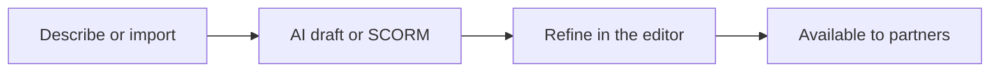
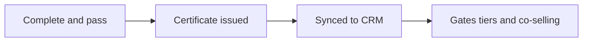
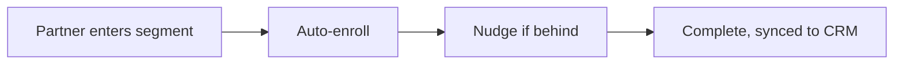
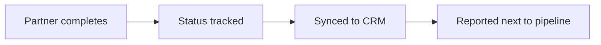
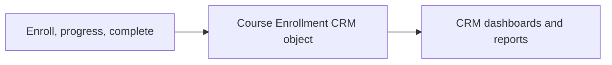
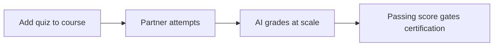

# Introw docs (docs.introw.io): features-courses

Verbatim from docs.introw.io/llms-full.txt, fetched 2026-09-29. 25 pages.

# Build a partner course from scratch
Source: https://docs.introw.io/features/courses/authoring/guides/build-a-course-manually

Structure modules and chapters, add rich content and assessments, configure the AI tutor, and make the course available to partners.

> For enablement teams that want full control over a course's structure, content, assessments, and AI tutor.

AI generation and SCORM imports get you a course fast, but a flagship certification, a tiering path, or content that has to follow a specific narrative is worth building by hand. Building manually lets you decide the module order, how lessons break down, what each chapter teaches, where you test understanding, and how the in-course AI tutor greets learners. This guide takes you from an empty course all the way to one partners can take.

## What you'll achieve

A complete partner course built from scratch: ordered modules, ordered chapters with rich content (text, images, video, embeds) and assessments, a configured AI tutor, course-wide rules (due date, passing score, button labels), and the course made available so partners can enroll and start learning.

## Before you start

<Steps>
  <Step title="Confirm Courses is on your plan">
    Courses are a plan feature. If the Courses area shows an upgrade prompt instead of the builder, it is not on your plan yet - check what yours includes at [introw.io/pricing](https://introw.io/pricing).
  </Step>

  <Step title="Confirm access">
    You need a team role with write access to Courses. For the AI tutor and the in-builder AI assistant, AI features must be enabled for your organisation.
  </Step>

  <Step title="Have your material ready">
    Gather the lessons, images, and videos you want to include. You can also paste a rough outline and let the in-builder AI assistant draft chapters for you.
  </Step>
</Steps>

## Watch it

<Tabs>
  <Tab title="Video">
    <video />
  </Tab>

  <Tab title="Click through">
    <iframe />
  </Tab>
</Tabs>

## Steps

### Create the course

<Steps>
  <Step title="Create an empty course">
    Go to [Courses](https://app.introw.io/courses) and select **Create course**, then choose **Start from scratch**. Give the course a name (you can refine the title, description, and banner later) and create it. Introw opens the new course in the builder, ready for you to add content.

    <Frame>
      
    </Frame>
  </Step>
</Steps>

### Build the structure and content

<Steps>
  <Step title="Add modules for each major topic">
    In the builder, use the **Add** button in the left rail and choose **Add module** for each major topic. Modules are the top-level chapters of the course: learners finish a module by completing all of its chapters, and finish the course by completing all modules.

    * **Module name** - the topic title learners see in the course outline. Name modules around outcomes (for example, "Position the product", "Run a demo") so the path reads as a journey. Drag modules to set the order learners progress through.
  </Step>

  <Step title="Add chapters within each module">
    From the **Add** button choose **Add chapter** (or use a module's row menu), then pick a content type in the **Create chapter** dialog. A chapter is a single lesson; keep each one focused so it is easy to complete and easy to attach a relevant assessment. The dialog groups content into three categories:

    * **Content** - text, image, collapsible content, product overview, columns layouts, and a call to action button. Use these to write the lesson itself.
    * **Video** - embed a Loom, YouTube, or Vimeo video, or upload your own. Use video for demos and walkthroughs where showing beats telling.
    * **Assessment** - add a quiz to test understanding (see [Assess learners with a quiz](../../quizzes/guides/assess-learners-with-a-quiz)).

    Each new chapter gets a default name like "Chapter 1"; rename it from its row menu so the outline is readable. Drag chapters to reorder them within a module.
  </Step>

  <Step title="Fill each chapter with content">
    Open a chapter to edit it in the content editor. Type to write, or use the slash command to insert blocks (headings, images, columns, callouts, video). Mix a short lesson with a question at the end to keep learners active rather than just scrolling. If you enabled AI features, open the **AI Assistant** panel on the right to draft or expand a chapter's content from a prompt, then edit what it produces.

    Images inside a chapter are shown at whatever ratio you upload, so match the slot: a **3:1 landscape** image (around 1536×512) for one that spans the full content width, and a **square** image (around 1024×1024) for one sitting next to text in a columns block. Those are the sizes the AI assistant generates too, so hand-made and generated visuals line up.
  </Step>
</Steps>

### Add assessments (optional)

<Steps>
  <Step title="Add a quiz where it matters">
    From the **Add** button choose **Add quiz**, or add a quiz chapter from the **Assessment** category. Within a quiz you can mix multiple-choice, open-ended (AI-graded), and upload (reviewed) questions. Assessments are what turn "watched every chapter" into a real signal of competency, and they are what a passing score and certificate are built on. The full setup, grading, and review flow is in [Assess learners with a quiz](../../quizzes/guides/assess-learners-with-a-quiz).
  </Step>
</Steps>

### Configure the course

<Steps>
  <Step title="Open Configure">
    With the course open in edit mode, select **Configure** to open the **Update course** dialog. Its left navigation holds every course-wide setting, grouped into tabs. Walk each tab so the course behaves the way you want before partners see it.
  </Step>

  <Step title="Set the basics, branding, and AI tutor">
    Work through the tabs that shape the learner experience:

    * **Basic** - the **Thumbnail banner** (artwork on the course card and header), **Name** (the course title), and **Description** (the short summary shown on the course). These are the first things a partner sees, so make them clear and on-brand. The thumbnail banner is cropped to **3:1**, so upload a wide image - 1200×400 is a good size - and you get a crop-and-zoom step to pick the part that shows. **Generate with AI** under the banner creates one instead, from the course name, description and module list plus your brand colors.
    * **AI Agent** - **Enable AI Agent** is on by default and gives the course an in-course AI tutor that answers learner questions from the course material and coaches them on quizzes with hints instead of answers. Edit the **welcome message** (the first thing the tutor says) to set the tone and point learners at what to do first. Turn the tutor off only for a course that should run without help, such as a short policy acknowledgment.
    * **Advanced** - **Due date** sets a completion deadline (off by default) and **Minimum score to pass** sets the bar a learner must reach (off by default). Both are covered in depth in [Configure enrollment rules](../../enrollments/guides/configure-enrollment-rules) and [Assess learners with a quiz](../../quizzes/guides/assess-learners-with-a-quiz).
    * **Button Labels** - customize the wording learners see on the course buttons: **Next Section** (default Continue), **Finish Course** (default Finish), **Next Question** (default Next), **Answer Question** (default Submit), and **View Certificate** (default View Certificate). Change these to match your voice or to translate them.
    * **Enrollment** - **Enable automatic enrollment** and pick the segments to auto-enroll. See [Configure enrollment rules](../../enrollments/guides/configure-enrollment-rules).
    * **Certificate** - attach a certificate so it auto-issues on completion, or generate one with AI. See [Create and auto-issue a certificate](../../certificates/guides/create-a-certificate).

    Select **Save Changes** when you are done. Then select **Save** in the course header to leave edit mode.
  </Step>
</Steps>

### Make it available to partners

<Steps>
  <Step title="Preview as a partner">
    Use **Preview** in the course header to experience the course exactly as a partner will: chapter by chapter, with the AI tutor and any assessments live. Fix anything that reads awkwardly before partners see it.
  </Step>

  <Step title="Enroll partners to take it live">
    A course shows as **Draft** until it has its first enrollment or automatic enrollment is turned on, at which point it automatically becomes **Active**. There is no separate publish button: enroll a cohort by hand (see [Manually enroll partners](../../enrollments/guides/manually-enroll-partners)) or turn on auto-enrollment by segment (see [Configure enrollment rules](../../enrollments/guides/configure-enrollment-rules)) to make the course live and start partners learning.
  </Step>
</Steps>

## Verify it worked

The course shows the expected module and chapter counts, every chapter renders its content in **Preview**, the AI tutor greets learners with your welcome message, and once a partner is enrolled the course status flips to **Active** and the partner can work through it.

## What your partners experience

Once the course is published and surfaced in a partner experience, partners open it from their portal, work through the modules and chapters, take any quiz, and - on passing - receive their certificate to view, download, and share. They see their own progress and pick up where they left off, so the enablement you author here becomes a self-serve learning path partners complete without waiting on you.

## Related

<CardGroup>
  <Card title="Assess learners with a quiz" icon="circle-check" href="../../quizzes/guides/assess-learners-with-a-quiz">
    Add questions, set a passing score, and review uploads.
  </Card>

  <Card title="Configure enrollment rules" icon="users" href="../../enrollments/guides/configure-enrollment-rules">
    Auto-enroll segments and set a completion deadline.
  </Card>

  <Card title="Create and auto-issue a certificate" icon="award" href="../../certificates/guides/create-a-certificate">
    Reward completion with a branded credential.
  </Card>

  <Card title="Implementation reference" icon="screwdriver-wrench" href="../technical">
    Full configuration options.
  </Card>
</CardGroup>

---

# Duplicate a course
Source: https://docs.introw.io/features/courses/authoring/guides/duplicate-a-course

Duplicate a proven partner course as a starting point for a new variant, then adapt only the modules, questions, or settings that differ.

> For teams building a family of similar courses - for example, per region or per partner tier - from a proven template.

Once you have a course that works, rebuilding a near-identical one from scratch is wasted effort. Duplicating lets you treat a proven course as a template: clone it, then tweak the parts that differ (a region's pricing, a tier's requirements, a localized example) while leaving the original untouched. It is the fastest way to keep a consistent structure across many courses.

## What you'll achieve

A copy of an existing course, including its modules, chapters, and content, that you can adapt without touching the original, then make available to a new audience.

## Before you start

<Steps>
  <Step title="Confirm Courses is on your plan">
    Courses are a plan feature. If the Courses area shows an upgrade prompt instead of the builder, it is not on your plan yet - check what yours includes at [introw.io/pricing](https://introw.io/pricing).
  </Step>

  <Step title="Confirm access">
    You need a team role with write access to Courses. A duplicate counts against your course limit if the LMS module is not enabled.
  </Step>
</Steps>

## Watch it

<Tabs>
  <Tab title="Video">
    <video />
  </Tab>

  <Tab title="Click through">
    <iframe />
  </Tab>
</Tabs>

## Steps

<Steps>
  <Step title="Find the course to clone">
    On [Courses](https://app.introw.io/courses), find the course you want to use as a template and open its row menu. Pick the version that is closest to what the new course needs so you change as little as possible afterwards.

    <Frame>
      
    </Frame>
  </Step>

  <Step title="Duplicate it">
    Choose **Duplicate**. Introw copies the whole course - modules, chapters, and content - into a new course in **Draft** so the original stays live and unchanged. The copy is independent: edits to it never affect the source.

    <Frame>
      
    </Frame>
  </Step>

  <Step title="Adapt the copy">
    Open the new course and edit only what differs for this variant: rename it, swap the localized examples, adjust the passing score, or change the certificate. Leave the shared structure in place so the family of courses stays consistent.
  </Step>

  <Step title="Make it available to partners">
    Enroll a cohort by hand or turn on automatic enrollment to take the variant live. Like any course it stays **Draft** until its first enrollment or auto-enrollment is on, then automatically becomes **Active**.
  </Step>
</Steps>

## Verify it worked

A new draft course appears with the same module and chapter structure as the original, edits to the copy do not affect the source course, and once a partner is enrolled the copy becomes **Active**.

## Related

<CardGroup>
  <Card title="Build a partner course from scratch" icon="book-open" href="./build-a-course-manually">
    Adapt the copy's structure and content.
  </Card>

  <Card title="Configure enrollment rules" icon="users" href="../../enrollments/guides/configure-enrollment-rules">
    Auto-enroll the right segment for the new variant.
  </Card>

  <Card title="Implementation reference" icon="screwdriver-wrench" href="../technical">
    Course model and statuses.
  </Card>
</CardGroup>

---

# Generate a partner course with AI
Source: https://docs.introw.io/features/courses/authoring/guides/generate-a-course-with-ai

Generate a partner course with AI - turn a prompt or an uploaded deck into a full draft, then refine, configure modules, and make it available.

> For enablement teams who want a complete first draft of a reseller or technical course without building it chapter by chapter.

Building a course the traditional way takes weeks of outlining, writing, and sourcing artwork, and that is the single biggest reason partner education stalls. Generating with AI collapses that into roughly an hour: you describe the goal and audience (and optionally hand over a deck or PDF you already have), Introw drafts the whole course, and you refine and configure it. This guide takes you from a prompt to a course partners can take.

## What you'll achieve

A full course - outline, modules, chapters, banner image, and description - drafted by AI from a short prompt and an optional attachment, then refined in the builder, configured (AI tutor, passing score, certificate), and made available so partners can enroll.

## Before you start

<Steps>
  <Step title="Confirm Courses is on your plan">
    Courses are a plan feature. If the Courses area shows an upgrade prompt instead of the builder, it is not on your plan yet - check what yours includes at [introw.io/pricing](https://introw.io/pricing).
  </Step>

  <Step title="Confirm access">
    You need write access to Courses, and AI features must be enabled for your organisation.
  </Step>

  <Step title="Prepare your input">
    Write a one-paragraph prompt describing the course goal and audience. Optionally have a source file ready to upload (a deck, PDF, or document up to 10MB).
  </Step>
</Steps>

## Watch it

<Tabs>
  <Tab title="Video">
    <video />
  </Tab>

  <Tab title="Click through">
    <iframe />
  </Tab>
</Tabs>

## Steps

<Steps>
  <Step title="Open the AI course creator">
    Go to [Courses](https://app.introw.io/courses) and select **Create course**. The create screen opens with the AI course creator front and center.

    <Frame>
      
    </Frame>
  </Step>

  <Step title="Describe the course">
    Tell the AI what to build. You have two ways to start, and you can combine them:

    * **Prompt** - write what the course should teach, for whom, and what good looks like. For example: "A course that teaches resellers how to pitch our platform, handle the top three objections, and run a 10-minute demo." The more specific the audience and outcomes, the better the draft.
    * **Preset** - pick a starter like **Sales Training**, **Technical Support**, or **Product Training** to pre-fill a detailed prompt about your organisation that you can then edit.
    * **Attachment** - optionally attach a deck or document (PDF, text, markdown, CSV, or JSON, up to 10MB) so the AI grounds the course in material you already have.

    <Frame>
      
    </Frame>
  </Step>

  <Step title="Start generation">
    Submit. Introw creates the course immediately and shows a **Generating** status while it drafts the outline, modules, chapters, banner image, and description in the background. Larger attachments take a little longer; the status updates on its own when it finishes.
  </Step>

  <Step title="Refine the draft in the builder">
    When generation finishes, the course opens in the builder. Select **Edit** in the course header to make changes, then review every module and chapter, edit the content, reorder or remove anything that does not fit, and add your own chapters, videos, or assessments. The draft is a starting point, not a finished course; treat it as one. See [Build a partner course from scratch](./build-a-course-manually) for the full builder reference.
  </Step>

  <Step title="Configure the course">
    With the course open in edit mode, select **Configure** to open the **Update course** dialog and set the course-wide options: the **AI Agent** tab (the in-course AI tutor and its welcome message, on by default), the **Advanced** tab (a due date and minimum passing score), the **Certificate** tab (auto-issue a credential on completion), and the **Enrollment** tab (auto-enroll segments). Select **Save Changes**.
  </Step>

  <Step title="Make it available to partners">
    Preview the course as a partner, then enroll a cohort by hand or turn on automatic enrollment to take it live. A course stays **Draft** until it has its first enrollment or auto-enrollment is on, at which point it automatically becomes **Active** - there is no separate publish step.
  </Step>
</Steps>

## Verify it worked

The course leaves **Generating** and shows generated modules and chapters, a thumbnail banner, and a one-line description. The AI tutor can immediately answer learner questions about the new material, and once a partner is enrolled the course status flips to **Active**.

One thing worth fixing by hand: the generated thumbnail banner reuses the first illustration from the course, which is square, and the course card and header show it in a **3:1** slot - so it is cropped top and bottom. Open **Configure** and upload a wide banner (1200×400) if the card matters to you. Chapter images are shown at the ratio they have, so keep full-width images wide (around 1536×512) and images beside text square (around 1024×1024).

## Related

<CardGroup>
  <Card title="Build a partner course from scratch" icon="book-open" href="./build-a-course-manually">
    Refine the draft and configure every setting.
  </Card>

  <Card title="Create and auto-issue a certificate" icon="award" href="../../certificates/guides/create-a-certificate">
    Reward completion with a branded credential.
  </Card>

  <Card title="Implementation reference" icon="screwdriver-wrench" href="../technical">
    Course statuses, generation flow, and settings.
  </Card>
</CardGroup>

---

# Import a SCORM course
Source: https://docs.introw.io/features/courses/authoring/guides/import-a-scorm-course

Import a SCORM or Articulate Rise course into Introw to reuse existing training, then configure it and make it available in the partner portal.

> For teams that already invested in SCORM training (including Articulate Rise and Google Slides exports) and want to reuse it instead of rebuilding.

Many teams already have polished training built in tools like Articulate Rise, and rebuilding it inside a new platform would throw away real work. Importing SCORM brings that content into Introw as-is: it plays in the built-in player exactly as authored, so partners take it alongside your other courses and progress still tracks back to your CRM.

## What you'll achieve

An Introw course created from a SCORM package you upload, played in the built-in player so it runs exactly as it was authored, and made available so partners can enroll and have their progress tracked.

## Before you start

<Steps>
  <Step title="Confirm Courses is on your plan">
    Courses are a plan feature. If the Courses area shows an upgrade prompt instead of the builder, it is not on your plan yet - check what yours includes at [introw.io/pricing](https://introw.io/pricing).
  </Step>

  <Step title="Confirm access">
    You need a team role with write access to Courses.
  </Step>

  <Step title="Export your package">
    Have a valid SCORM `.zip` ready, 2 GB or smaller, with its `imsmanifest.xml` at the top level of the zip rather than inside a folder. SCORM 1.2 and SCORM 2004 packages are supported, including Articulate Rise and Google Slides exports.
  </Step>
</Steps>

## Watch it

<Tabs>
  <Tab title="Video">
    <video />
  </Tab>

  <Tab title="Click through">
    <iframe />
  </Tab>
</Tabs>

## Steps

<Steps>
  <Step title="Start a SCORM import">
    Go to [Courses](https://app.introw.io/courses) and select **Create course**, then choose **Start from SCORM**. This opens the upload for an existing package rather than the AI creator or the empty builder.

    <Frame>
      
    </Frame>
  </Step>

  <Step title="Upload the package">
    Choose your SCORM `.zip` to upload.

    * **Package file** - the exported `.zip` from your authoring tool, up to 2 GB. The file goes straight to storage from your browser, then Introw reads the manifest and unpacks the content in a background job. The course shows a **Generating** status in the list and **Importing SCORM package…** on the course while it processes, and the page updates on its own when it is done. A larger package takes longer.

    If the file cannot be used, a **Couldn't import this SCORM package** message says why before anything is created: the file is empty, it is over 2 GB, or the upload did not finish.

    <Frame>
      
    </Frame>
  </Step>

  <Step title="Review the imported course">
    When processing finishes, open the course and confirm it launches in the built-in player and plays as authored. Because the content lives in the uploaded package, you edit it in your original authoring tool and replace the package on the course (see below) rather than editing chapters inside Introw.
  </Step>

  <Step title="Configure course-wide settings">
    Select **Edit** in the course header, then **Configure** to open the **Update course** dialog and set the options that apply around the imported content: the name, description, and **Thumbnail banner** on the **Basic** tab, a due date or passing requirement on the **Advanced** tab, a certificate on the **Certificate** tab, and auto-enrollment on the **Enrollment** tab. Select **Save Changes**. The thumbnail banner is cropped to **3:1**, so upload a wide image such as 1200×400 - an imported package never supplies one. **Generate with AI** next to it creates one from the course name and description, which is usually faster than finding artwork.
  </Step>

  <Step title="Make it available to partners">
    Enroll a cohort by hand or turn on automatic enrollment to take the course live. A course stays **Draft** until it has its first enrollment or auto-enrollment is on, at which point it automatically becomes **Active** - there is no separate publish step.
  </Step>
</Steps>

## Update the package later

When you iterate on the course in your authoring tool (new content, reordered modules, fixed chapters), you don't recreate the course. Open the course and select **Replace SCORM package**, then upload the new `.zip`. Introw processes it in the background and swaps it in place:

* The course keeps its id, link, enrollments, and settings, so nothing changes for how partners find it.
* Learners keep the current version until the new package is fully live, so a replacement never breaks an open session.
* Completions and issued certificates stand. Learners who were mid-course start the new package fresh (their bookmarks belonged to the old version).

If you author with AI tools (Claude, Lovable, or anything that exports SCORM), the same create-and-replace flow is available to agents over MCP.
When the zip is on your computer, `create_scorm_upload` gives you an upload page to drop it on, for packages up to 2 GB.
`upsert_course` then creates the course from that upload or from a hosted zip URL, including thumbnail, due date, passing score, certificate, and auto-enrollment.
Calling `upsert_course` again with the `courseId` replaces the package.
See [AI partner training](/headless/agentic-use-cases/training) for the full workflow.

## When an import fails

Introw checks the package while it imports. If it cannot be read, for example the manifest is missing, is not at the top level, is not a SCORM manifest, or points at no file that can be launched, the course is kept rather than deleted:

* In the course list it is named **Course generation failed**.
* On the course, the panel reads **Couldn't import this SCORM package**, and **Version** reads **Not imported**.
* Select **Replace SCORM package** and upload a corrected `.zip`. When it imports, the course takes the package's own title and plays like any other.

A course that is still generating after two hours is marked the same way, so a stuck import never spins forever.

## Verify it worked

The course leaves **Generating**, its panel shows the **Version** it detected (**SCORM 1.2** or **SCORM 2004**), opening a chapter launches the original package in the built-in player, progress reports back to Introw automatically, and once a partner is enrolled the course status flips to **Active**. After a replacement, opening the course launches the new package.

## Related

<CardGroup>
  <Card title="Configure enrollment rules" icon="users" href="../../enrollments/guides/configure-enrollment-rules">
    Auto-enroll segments and set a completion deadline.
  </Card>

  <Card title="Monitor course progress" icon="chart-line" href="../../progress-tracking/guides/monitor-course-progress">
    Track completion and sync it to your CRM.
  </Card>

  <Card title="Implementation reference" icon="screwdriver-wrench" href="../technical">
    SCORM import and playback.
  </Card>
</CardGroup>

---

# Course Authoring
Source: https://docs.introw.io/features/courses/authoring/index

Author partner courses in minutes - build from scratch, generate a full draft from a prompt with AI, or import existing SCORM and Articulate Rise training.

> Course Authoring lets your enablement team create rich partner training - modules, lessons, video, quizzes, and a built-in AI tutor - without an instructional designer or a separate LMS.

## The problem it solves

Most partner programs stall at the idea of training their partners, because building the training is the hard part:

<Pains>
  | Without Introw                   | With Introw                    |
  | -------------------------------- | ------------------------------ |
  | Courses take weeks to build      | A first draft in about an hour |
  | Scaling education means hiring   | Generation, not headcount      |
  | Training goes stale on a repitch | Enablement edits it in minutes |
  | Partners wait on you to learn    | A course-aware tutor, 24/7     |
</Pains>

## Impact

Most partner programs never train anyone, because building the training is the hard part. Being the vendor with real, current training is a lower bar than it sounds and a large advantage.

<Impact>
  for your business

  * **Live in days**
    A complete draft from one prompt or an uploaded deck, ready to refine and publish the same day
  * **AI, not admin**
    AI authors the course and then tutors every learner, so a small team runs a large catalog
  * **Cost to run**
    Enablement builds and edits courses with no instructional designer, no agency and no engineering

  for your partners

  * **Self-serve**
    A course-aware tutor answers their questions from the material, at any hour, while they study
  * **Enabled**
    The tutor coaches them through a quiz answer without handing it over, so they actually learn it
  * **Efficient**
    The course reflects the current pitch, because updating it takes minutes rather than a quarter

  [A day in the life of a reseller](/days-in-the-life/reseller)
</Impact>

<Personas>
  * **Partner Marketing** - a catalog they own end to end
  * **Partner technical teams** - deep courses, plus a tutor
</Personas>

## See it work

<Tour>
  * 

    **Describe it**

    A prompt, a preset, or a deck you already have.

  * 

    **Let AI draft it**

    A complete first draft, ready to refine.

  * 

    **Shape the modules**

    One module per major topic, sections inside each.

  * 

    **Or bring your own**

    Upload a SCORM package and keep the training you have.
</Tour>

## How it works

Course Authoring is the builder behind every partner course. You structure a course into modules and sections, fill each section with rich content - text, images, video, embeds, and quiz questions - and publish. The same builder gives you three on-ramps. Start from a blank course. Generate a complete first draft with AI, from a short prompt or an uploaded deck. Or import training you already have as a SCORM package.

Every course can carry a built-in AI tutor: a course-aware assistant that learners chat with while they study. It answers their questions from the course material and coaches them through quiz answers - without ever handing over the solution.

The enablement team owns authoring end to end. A course that used to be a quarter-long project becomes an afternoon: describe the course and let AI draft it, or paste in your existing SCORM training, then refine in the editor. When positioning shifts, the same team updates the course themselves - no engineering, no agency, no waiting.

## Run it from your AI assistant

<Headless>
  * Create a course from this SCORM zip and give it a 30-day due date.
  * Replace the SCORM package on our reseller onboarding course.
  * Set the passing score on our certification course to 80.
</Headless>

## Going deeper

<CardGroup>
  <Card title="How to" icon="screwdriver-wrench" href="./technical">
    Setup, configuration, and all how-to guides.
  </Card>

  <Card title="API reference" icon="code" href="/general/introduction">
    Integration surface and code.
  </Card>
</CardGroup>

**Works with**

<CardGroup>
  <Card title="Quizzes" icon="graduation-cap" href="/features/courses/quizzes">
    Add quizzes inside a course.
  </Card>

  <Card title="Certificates" icon="graduation-cap" href="/features/courses/certificates">
    Award a certificate on completion.
  </Card>

  <Card title="Knowledge Base" icon="robot" href="/features/ai/knowledge-base">
    Draft course content with AI from your knowledge.
  </Card>
</CardGroup>

---

# Course Authoring
Source: https://docs.introw.io/features/courses/authoring/technical/index

Set up and configure partner courses in Introw - build modules, add questions and certificates, generate drafts with AI, and import SCORM training.

## Where it lives

Course Authoring sits under **Portal**, at [Courses](https://app.introw.io/courses).

<Frame>
  
</Frame>

## Before you start

| You need                 | Why                                 | Fix it                                                                            |
| ------------------------ | ----------------------------------- | --------------------------------------------------------------------------------- |
| The Courses (LMS) module | Without it a freemium limit applies | **Request access**                                                                |
| Write access to Courses  | To author and publish               | [Internal roles](/features/access/team-management/guides/create-an-internal-role) |
| AI features enabled      | Only for AI drafting and tutoring   | **Request access**                                                                |

## How it works

A course is organized into **modules** (major topics), and each module holds
ordered **sections** (individual lessons). Learners move through sections in
order; finishing a module's sections completes the module, and finishing all
modules completes the course.

On the **Courses** list, each course shows a status:

* **Draft** - still being built; not yet available to partners.
* **Generating** - AI is drafting the course (you'll see this briefly after an AI create).
* **Active** - published and available to enroll.

You create a course from **Courses → Create course**, with three options:

1. **Start from scratch** - an empty course you fill in the builder.
2. **Generate with AI** - describe the course (and optionally upload a deck or PDF); Introw drafts the outline, modules, sections, a banner, and a description for you.
3. **Upload SCORM** - import an existing SCORM package (including Articulate Rise and Google Slides exports).

Each course can include an **AI tutor** - an in-course assistant that answers
learner questions about the material and coaches them on quizzes without giving
answers away.

## Settings & configuration

Most course settings live in the **Update course** dialog, organized into tabs.

### Basic tab

**Name** is the course title shown to learners; AI generation fills it in
automatically when you create a course with AI. **Description** is the short
summary shown on the course, and AI drafts it for you too. **Thumbnail banner** is
the artwork on the course card and header - upload your own, or let AI set one.

### Image sizes

| Image                            | Where          | Ratio                  | Recommended |
| -------------------------------- | -------------- | ---------------------- | ----------- |
| Thumbnail banner                 | Basic tab      | 3:1, cropped on upload | 1200×400    |
| Full-width chapter image         | Content editor | 3:1                    | 1536×512    |
| Chapter image in a columns block | Content editor | 1:1                    | 1024×1024   |

The thumbnail banner opens a crop-and-zoom step and is saved at exactly 3:1, so a
tall or square upload loses its top and bottom. **Generate with AI** next to it
creates a 3:1 banner at 1200×400 from the course name, description and modules plus
your brand colors, which is the quickest way to give an imported SCORM course a
proper card. Chapter images are rendered at the
ratio you upload, and the AI assistant generates them at the sizes above, so
hand-made and generated visuals stay consistent. Two exceptions worth knowing: a
course generated with AI takes its banner from the first illustration in the
generated content, which is square and therefore cropped in the 3:1 slot - replace
it with a wide image if the card matters. And over MCP, `upsert_course` takes the
banner as a `thumbnailUrl` (a hosted 3:1 https image), stored as-is and never
cropped.

### AI Agent tab

**Enable AI Agent** is **on** by default and turns the per-course AI tutor on or
off. **AI tutor welcome message** is the first thing the tutor says to a learner
when they start the course, so use it to set the tone and point them at what to do
first.

### At import (SCORM)

**SCORM playback** runs an uploaded SCORM package in the built-in **SCORM player**,
which preserves the original authored experience and reports progress back to
Introw. A package can be up to 2 GB, needs its `imsmanifest.xml` at the top level of the zip, and
can be SCORM 1.2 or SCORM 2004. The player launches the first item in the manifest that points at a
file. A package Introw cannot read keeps its course, named **Course generation failed** and marked
**Couldn't import this SCORM package**, and **Replace SCORM package** on the course is how you retry.

A package is third-party code, so Introw serves it from its own host, `scorm.introw.io`, rather than
from the app or the portal. The player nests that host in the page and the package can never reach
the session of whoever is watching. It is invisible in normal use, but worth knowing in two places:
a strict network allowlist, yours or a partner's, has to allow that host as well as your portal
address, and a package that loads everywhere except behind one customer's firewall is almost always
this.

## How-to guides

<Rail>
  * 

    [**Build a partner course from scratch**](/features/courses/authoring/guides/build-a-course-manually)

    Structure modules and chapters, add rich content and assessments, configure the AI tutor, and make the course available to partners.

  * 

    [**Duplicate a course**](/features/courses/authoring/guides/duplicate-a-course)

    Duplicate a proven partner course as a starting point for a new variant, then adapt only the modules, questions, or settings that differ.

  * 

    [**Generate a partner course with AI**](/features/courses/authoring/guides/generate-a-course-with-ai)

    Generate a partner course with AI - turn a prompt or an uploaded deck into a full draft, then refine, configure modules, and make it available.

  * 

    [**Import a SCORM course**](/features/courses/authoring/guides/import-a-scorm-course)

    Import a SCORM or Articulate Rise course into Introw to reuse existing training, then configure it and make it available in the partner portal.
</Rail>

## Troubleshooting

<Warning>
  AI generation runs in the background - a new course stays **Generating** until it finishes, and larger attachments take longer. Deleting a course while it's generating cancels it. SCORM uploads play in the built-in SCORM player, which preserves the original package; edit the source in your authoring tool and use **Replace SCORM package** on the course to change it.
</Warning>

<AccordionGroup>
  <Accordion title="Course stuck on Generating">
    Generation is still running. A course that is still generating after two hours is renamed **Course generation failed** and the spinner stops. Generate it again, or for a SCORM course use **Replace SCORM package** with a corrected file.
  </Accordion>

  <Accordion title="SCORM content looks wrong after import">
    Check the package is a valid SCORM export with its `imsmanifest.xml` at the top level of the zip, then re-export from your authoring tool and use **Replace SCORM package** on the course.
  </Accordion>

  <Accordion title="A SCORM course shows a blank player for one partner only">
    Their network blocks `scorm.introw.io`, the separate host packages play from. Ask them to allow it alongside your portal address.
  </Accordion>

  <Accordion title="No AI tutor in the course">
    Check **Update course → AI Agent** is enabled, and that AI features are on for your organisation.
  </Accordion>
</AccordionGroup>

## FAQ

<AccordionGroup>
  <Accordion title="We already have an LMS. Do we have to rebuild our training in Introw?" icon="graduation-cap">
    No, and there are three ways to keep what you have. Export the course as SCORM and [import it](../guides/import-a-scorm-course), which keeps your authoring tool as the source and plays the original package here. Or leave the course where it is and link or embed it from a portal section, so partners reach it from the portal without you moving anything. Or, if the completions themselves are what matters, keep them where they are and bring the status in: a CRM property carrying "certified" drives [segments](/features/partners/segments), tier requirements and reporting exactly like a native enrollment. There is no native connector to third-party LMS platforms, so anything beyond SCORM runs through the [API](/features/developer/api) or your CRM.
  </Accordion>

  <Accordion title="Can courses be taken without a portal login?" icon="link">
    No. A course lives in the portal because progress, quiz results and certificates are tied to the partner contact taking it, which is also what makes completion reportable and what a certificate attests to. Reaching partners off-portal is the [notification](/features/engagement/notifications)'s job: the reminder arrives in their inbox or chat and links straight into the course.
  </Accordion>
</AccordionGroup>

---

# Create and auto-issue a certificate
Source: https://docs.introw.io/features/courses/certificates/guides/create-a-certificate

Design a branded, time-bound certificate template with custom colors and badge, then attach it to a course so it is awarded automatically on completion.

> For enablement teams standing up a credential partners will be proud to display and that issues itself.

A certificate is more than a completion receipt: it is a credential partners display to win trust with their own customers, and a signal you use to decide who is qualified to sell or deliver. That only works if it looks the part, means something, and arrives the moment a partner earns it. This guide builds a branded, time-bound template and then attaches it to a course so it is awarded automatically, with no manual issuance step.

## What you'll achieve

A reusable certificate template - branded with a name, description, colors or background image, and issuer, with a validity period that controls when it expires - attached to a course so any learner who completes (and passes, if a score is set) is certified automatically.

## Before you start

<Steps>
  <Step title="Confirm Certificates is on your plan">
    Certificates are a plan feature. If the Certificates area shows an upgrade prompt instead of the builder, it is not on your plan yet - check what yours includes at [introw.io/pricing](https://introw.io/pricing).
  </Step>

  <Step title="Confirm access">
    You need a team role with write access to Certificates, and to Courses for the auto-issue step.
  </Step>

  <Step title="Have a course ready (optional)">
    To wire up auto-issue, have the course you want to certify already built. If you also want to gate certification on a score, plan to set a minimum passing score (see [Assess learners with a quiz](../../quizzes/guides/assess-learners-with-a-quiz)).
  </Step>
</Steps>

## Watch it

<Tabs>
  <Tab title="Video">
    <video />
  </Tab>

  <Tab title="Click through">
    <iframe />
  </Tab>
</Tabs>

## Steps

### Create the template

<Steps>
  <Step title="Start a new certificate">
    Go to [Certificates](https://app.introw.io/certificates) and select **Create certificate**. This is the reusable design you attach to courses and award, not a one-off.

    <Frame>
      
    </Frame>
  </Step>

  <Step title="Name it, set validity, and choose the issuer">
    Fill in the create dialog:

    * **Name** - the credential title shown on the certificate and in your list (for example, "Certified Reseller"). Make it specific so partners and your team can tell credentials apart.
    * **Validity** - how long the credential stays valid: a number plus a period (**Days**, **Weeks**, **Months**, or **Years**), or choose **Unlimited** so it never expires. Pick a real window when certification should be refreshed periodically, so a lapsed partner shows up as needing a refresh; choose Unlimited only for one-time acknowledgments.
    * **Issued by** - the issuer name shown on the credential. Default this to your company or program name so the certificate reads as official.

    Create the certificate to open its detail page.

    <Frame>
      
    </Frame>
  </Step>

  <Step title="Brand the certificate">
    On the certificate's detail page, refine how it looks. The preview updates as you edit:

    * **Description** - a short line describing what the credential represents. This appears on the verifiable certificate page partners share.
    * **Background image** - upload artwork to use as the certificate background, or select **Generate with AI** to create one from a prompt (see below). Use this for a fully designed credential; when an image is set, the **Background color** picker is hidden because the image defines the background. The certificate is rendered at **16:9**, so upload artwork at that ratio - **1920×1080 is the recommended size**, up to 20 MB - and Introw offers a crop-and-zoom step to fit anything else. Leave the middle clear: the logo, name, and recipient are drawn over it.
    * **Generate with AI** - open the prompt, which is pre-filled with your organisation's name and domain, and edit it if you like. Introw generates an on-brand background and sets it as the certificate background automatically. Regenerate until you're happy, or upload your own instead.
    * **Text color** - the color of the text rendered on the certificate; set it to stay readable against your background image or color.
    * **Background color** - shown only when no background image is set; choose a color that matches your brand.
    * **Hide logo** - toggle on to render the certificate without the organisation logo. Use this when your background image already includes branding, so the logo isn't duplicated. This applies to both the preview and every issued certificate.

    <Frame>
      
    </Frame>
  </Step>
</Steps>

### Auto-issue it on course completion

<Steps>
  <Step title="Open the course's Certificate tab">
    Open the course you want to certify, select **Configure**, and go to the **Certificate** tab. This is where you link a credential so completion issues it automatically.
  </Step>

  <Step title="Attach the certificate">
    Choose the template you just built (or generate one with AI if you skipped the design step). Attaching it means every learner who completes this course is issued this credential, no manual step required.
  </Step>

  <Step title="Gate on a passing score (optional)">
    If certification should require proof of competency, set a **Minimum score to pass** on the **Advanced** tab. With a score set, the certificate issues only to learners who complete and pass; without one, completion alone certifies them. See [Assess learners with a quiz](../../quizzes/guides/assess-learners-with-a-quiz).
  </Step>

  <Step title="Save changes">
    Select **Save Changes**. From now on, any qualifying completion issues the certificate automatically, gives the partner a verifiable certificate page, and syncs the issuance to your CRM.
  </Step>
</Steps>

## Verify it worked

The certificate appears in your certificate list and is selectable when configuring a course. After attaching it, a learner who completes the course (and meets the passing score, if set) receives the credential, gets a verifiable certificate page, and the issuance syncs to the CRM.

## Related

<CardGroup>
  <Card title="Generate a certificate with AI" icon="sparkles" href="./generate-a-certificate-with-ai">
    Skip the design step and let AI draft it.
  </Card>

  <Card title="Issue a certificate" icon="user-plus" href="./issue-a-certificate-to-a-segment">
    Award a credential automatically on completion or by hand.
  </Card>

  <Card title="Revoke a certificate" icon="ban" href="./revoke-a-certificate">
    Remove a credential when it no longer applies.
  </Card>

  <Card title="Implementation reference" icon="screwdriver-wrench" href="../technical">
    Certificate model, validity, and issuance.
  </Card>
</CardGroup>

---

# Generate a certificate with AI
Source: https://docs.introw.io/features/courses/certificates/guides/generate-a-certificate-with-ai

Use AI to generate a polished, course-matched certificate template in one step, then refine the wording, colors, and badge and attach it to a course.

> For teams that want a polished certificate without doing design work.

Designing a certificate (wording, colors, layout) is the kind of small task that quietly delays a course launch, especially without a designer on hand. Generating one with AI removes that step: Introw creates a certificate matched to the course in a single action, ready to refine, attach, and issue.

## What you'll achieve

A certificate tailored to a specific course, generated by AI and set as that course's credential, ready to refine and auto-issue on completion.

## Before you start

<Steps>
  <Step title="Confirm Certificates is on your plan">
    Certificates are a plan feature. If the Certificates area shows an upgrade prompt instead of the builder, it is not on your plan yet - check what yours includes at [introw.io/pricing](https://introw.io/pricing).
  </Step>

  <Step title="Confirm access">
    You need a team role with write access to Certificates and Courses, and AI features must be enabled for your organisation.
  </Step>

  <Step title="Pick the course">
    Decide which course the certificate is for, since the AI tailors the credential to that course.
  </Step>
</Steps>

## Watch it

<Tabs>
  <Tab title="Video">
    <video />
  </Tab>

  <Tab title="Click through">
    <iframe />
  </Tab>
</Tabs>

## Steps

<Steps>
  <Step title="Open the course's Certificate tab">
    Open the course from [Courses](https://app.introw.io/courses), select **Configure**, and go to the **Certificate** tab, where you attach or create the course's credential.

    <Frame>
      
    </Frame>
  </Step>

  <Step title="Generate with AI">
    Choose **Generate with AI**. Introw drafts a certificate tailored to this course, including its name, supporting text, and styling, so you start from a finished design rather than a blank one. The generated background is artwork only: no text, logo, seal or mock certificate of its own, and a quiet center and lower third, so the text Introw prints on top, such as the learner's name, stays readable.

    <Frame>
      
    </Frame>
  </Step>

  <Step title="Review, refine, and attach">
    Review the generated certificate. Open it from **Certificates** to adjust the name, description, validity, colors, or background image if you want. **Regenerate with AI** on the background, with a line in **Describe the certificate background...**, draws a new one under the same rules (see [Create and auto-issue a certificate](./create-a-certificate) for each field). It is already set as the course's certificate, so it auto-issues to learners who complete and pass, if a passing score is set.

    <Frame>
      
    </Frame>
  </Step>
</Steps>

## Verify it worked

A new certificate appears matched to the course, a preview renders in the settings panel, and it is set as the course's certificate so qualifying completions issue it automatically.

## Related

<CardGroup>
  <Card title="Create and auto-issue a certificate" icon="award" href="./create-a-certificate">
    Build and brand one by hand instead.
  </Card>

  <Card title="Issue a certificate" icon="user-plus" href="./issue-a-certificate-to-a-segment">
    Award a credential automatically on completion or by hand.
  </Card>

  <Card title="Implementation reference" icon="screwdriver-wrench" href="../technical">
    Generation, validity, and issuance.
  </Card>
</CardGroup>

---

# Issue a certificate
Source: https://docs.introw.io/features/courses/certificates/guides/issue-a-certificate-to-a-segment

Award a partner credential automatically on course completion, or issue certificates manually to individual partners or a whole segment in bulk.

> For awarding a credential the moment a partner earns it through a course, or by hand when they earned it another way.

A certificate is only worth something once it reaches the partner who earned it. There are two ways to award one, and most programs use both: **automatically**, so any partner who completes a course (and passes, if you require a score) is certified with no manual step, and **manually**, so you can recognize partners who earned a credential offline - one at a time, or a whole cohort at once. This guide covers both, so whichever path fits, the partner ends up with the same verifiable credential, synced to your CRM.

## What you'll achieve

Partners awarded a credential either automatically on course completion or by hand, each with a verifiable certificate page, optionally notified, and synced to your CRM.

## Before you start

<Steps>
  <Step title="Confirm Certificates is on your plan">
    Certificates are a plan feature. If the Certificates area shows an upgrade prompt instead of the builder, it is not on your plan yet - check what yours includes at [introw.io/pricing](https://introw.io/pricing).
  </Step>

  <Step title="Confirm access">
    You need a team role with write access to Certificates, plus write access to Courses to wire up automatic issuance.
  </Step>

  <Step title="Have the certificate ready">
    Build the credential first (see [Create and auto-issue a certificate](./create-a-certificate)). For manual issuance, also decide whether you are awarding specific partners or a whole segment, such as "Bootcamp attendees".
  </Step>
</Steps>

## Watch it

<Tabs>
  <Tab title="Video">
    <video />
  </Tab>

  <Tab title="Click through">
    <iframe />
  </Tab>
</Tabs>

## Issue automatically on course completion

Attach a certificate to a course once, and every qualifying completion issues it for you - no manual step, no chasing.

<Steps>
  <Step title="Open the course's Certificate tab">
    Go to [Courses](https://app.introw.io/courses), open the course you want to certify, select **Configure**, and go to the **Certificate** tab. This is where a credential is linked to the course so completion awards it.

    <Frame>
      
    </Frame>
  </Step>

  <Step title="Attach the certificate">
    Choose the certificate to award. From now on, every learner who completes this course is issued this credential automatically, with a verifiable certificate page and a CRM sync - the same outcome as a manual award, without the manual work.

    <Frame>
      
    </Frame>
  </Step>

  <Step title="Gate on a passing score (optional)">
    If certification should prove competency, set a **Minimum score to pass** on the **Advanced** tab. With a score set, the certificate issues only to learners who complete and pass; without one, completing the course is enough. See [Assess learners with a quiz](../../quizzes/guides/assess-learners-with-a-quiz).

    <Frame>
      
    </Frame>
  </Step>

  <Step title="Save changes">
    Select **Save Changes**. Qualifying completions now issue the certificate on their own.
  </Step>
</Steps>

## Issue manually to individuals or a segment

Not all certification comes from a course. Sometimes one partner earns a credential through a one-off review, and sometimes a whole group earns it through a live session or bootcamp. Manual issuance awards the same verifiable credential to specific individuals or an entire segment in a single action.

<Steps>
  <Step title="Open the certificate to award">
    Go to [Certificates](https://app.introw.io/certificates), open the credential you want to award, and select **Give Certificate**. This opens the audience picker for a manual issuance of this template.

    <Frame>
      
    </Frame>
  </Step>

  <Step title="Choose who receives it">
    Pick the recipients in the audience table. You can award the credential two ways:

    * **Individual partners** - search the table and select specific partners and contacts. Use this for one-off recognition or to award a few people who finished an offline assessment.
    * **A whole segment** - add a **Segment** filter to narrow the table to a segment's members, then select them all. Use this to recognize a whole cohort, such as bootcamp attendees, in one pass. The **Partner** and **Tier** filters narrow the audience the same way.

    <Frame>
      
    </Frame>
  </Step>

  <Step title="Preview the email and issue">
    Select **Next** to preview the certification email, then finish with the option that fits:

    * **Issue and notify** - awards the credential and emails each recipient to let them know they have been certified. Review the preview before sending.
    * **Issue without email** - awards it silently, for when you will announce the credential another way.

    Every selected partner is awarded the credential, each gets a verifiable certificate page, and the issuance syncs to your CRM.

    <Frame>
      
    </Frame>
  </Step>
</Steps>

## Verify it worked

For automatic issuance, a learner who completes the course (and meets the passing score, if set) appears on the certificate's certified list. For manual issuance, the partners you chose appear there right away. Either way, each certified partner gets a verifiable certificate page and the issuance syncs to the CRM.

## Related

<CardGroup>
  <Card title="Create and auto-issue a certificate" icon="award" href="./create-a-certificate">
    Design the branded template you attach to a course.
  </Card>

  <Card title="Post a certificate on LinkedIn" icon="linkedin" href="./post-a-certificate-on-linkedin">
    Help partners broadcast the credential they earned.
  </Card>

  <Card title="Revoke a certificate" icon="ban" href="./revoke-a-certificate">
    Pull a credential when it no longer applies.
  </Card>

  <Card title="Implementation reference" icon="screwdriver-wrench" href="../technical">
    Issuance, validity, and notifications.
  </Card>
</CardGroup>

---

# Post a certificate on LinkedIn
Source: https://docs.introw.io/features/courses/certificates/guides/post-a-certificate-on-linkedin

Let partners add the credential they earned to their LinkedIn profile in one click, with a link back to the verifiable certificate page.

> For turning an earned credential into reach: partners post it to LinkedIn, and every view links back to a verifiable page that names you as the issuer.

Every certificate a partner earns is a marketing asset you do not have to make. When a partner adds it to LinkedIn, their network sees they are certified by you, and each credential links back to a verifiable page that names your program as the issuer. This is a partner action with no setup on your side: the option sits on every issued certificate. This guide walks the flow so you can point partners to it and know exactly what gets shared.

## What you'll achieve

A certified partner's credential added to the **Licenses & certifications** section of their LinkedIn profile, prefilled from the certificate and linked back to its verifiable page.

## Before you start

<Steps>
  <Step title="Confirm Certificates is on your plan">
    Certificates are a plan feature. If the Certificates area shows an upgrade prompt instead of the builder, it is not on your plan yet - check what yours includes at [introw.io/pricing](https://introw.io/pricing).
  </Step>

  <Step title="Have an issued certificate">
    The partner must already hold the credential, whether it was issued automatically on course completion or by hand (see [Issue a certificate](./issue-a-certificate-to-a-segment)).
  </Step>
</Steps>

## Watch it

<Tabs>
  <Tab title="Video">
    <video />
  </Tab>

  <Tab title="Click through">
    <iframe />
  </Tab>
</Tabs>

## Steps

<Steps>
  <Step title="Open the earned certificate">
    A partner reaches their credential from the **Congratulations** screen shown the moment they complete a course, or from the certificate on their portal. To preview what they see, go to [Certificates](https://app.introw.io/certificates), open the certificate, and view a certified partner's issued copy. The issued certificate shows two actions: **Share on LinkedIn** and **Download certificate**.

    <Frame>
      
    </Frame>
  </Step>

  <Step title="Select Share on LinkedIn">
    Selecting **Share on LinkedIn** opens LinkedIn's add-to-profile flow in a new tab, already filled in from the certificate:

    * **Name** - the certificate's name, so the credential reads correctly on the profile.
    * **Issuing organization** - your organisation, so the partner's network sees who certified them.
    * **Credential ID** and **Credential URL** - the certificate's identifier and its verifiable page, so anyone can confirm the credential is real.
    * **Issue and expiration dates** - taken from when it was awarded and its validity period; a credential with no expiry is added without an end date.

    <Frame>
      
    </Frame>
  </Step>

  <Step title="Confirm on LinkedIn">
    The partner reviews the prefilled details and saves, which adds the credential to the **Licenses & certifications** section of their LinkedIn profile. Prefer a visual post instead? **Download certificate** saves the credential as an image the partner can attach to a normal LinkedIn update.
  </Step>
</Steps>

## Verify it worked

The credential appears in the **Licenses & certifications** section of the partner's LinkedIn profile, showing your organisation as the issuer, and its **Show credential** link opens the verifiable certificate page.

## Related

<CardGroup>
  <Card title="Issue a certificate" icon="award" href="./issue-a-certificate-to-a-segment">
    Award the credential partners go on to share.
  </Card>

  <Card title="Create and auto-issue a certificate" icon="paintbrush" href="./create-a-certificate">
    Brand the certificate so it looks the part on a profile.
  </Card>

  <Card title="Implementation reference" icon="screwdriver-wrench" href="../technical">
    Issued certificates, verifiable pages, and sharing.
  </Card>
</CardGroup>

---

# Revoke a certificate
Source: https://docs.introw.io/features/courses/certificates/guides/revoke-a-certificate

Decertify partners and pull back a credential when it no longer applies, updating certification status in Introw and keeping your CRM in sync.

> For when a credential must be pulled - a partner left the program, or a certification is no longer valid.

A certification is only trustworthy if it can be taken back when it no longer holds. A partner might leave the program, fail a re-check, or have been certified in error, and in each case you do not want them still showing as qualified to sell or deliver. Revoking pulls the credential and pushes that change through to your CRM, so internal teams stop treating the partner as certified.

## What you'll achieve

A revoked credential: the issued certificate is no longer valid, the partner stops showing as certified, and the change reflects downstream in your CRM.

## Before you start

<Steps>
  <Step title="Confirm Certificates is on your plan">
    Certificates are a plan feature. If the Certificates area shows an upgrade prompt instead of the builder, it is not on your plan yet - check what yours includes at [introw.io/pricing](https://introw.io/pricing).
  </Step>

  <Step title="Confirm access">
    You need a team role with write access to Certificates.
  </Step>

  <Step title="Know who to decertify">
    Identify the partner or partners whose credential you need to pull.
  </Step>
</Steps>

## Watch it

<Tabs>
  <Tab title="Video">
    <video />
  </Tab>

  <Tab title="Click through">
    <iframe />
  </Tab>
</Tabs>

## Steps

<Steps>
  <Step title="Open the certificate's certified list">
    Go to [Certificates](https://app.introw.io/certificates), open the credential, and view its **Certified** list, which shows the partners who currently hold it.

    <Frame>
      
    </Frame>
  </Step>

  <Step title="Select the recipients to revoke">
    Choose the issued certificate or certificates you need to pull. You can revoke a single partner or several at once from the certified list.

    <Frame>
      
    </Frame>
  </Step>

  <Step title="Confirm the revocation">
    Confirm to decertify. The selected partners immediately stop showing as certified, and the change syncs to your CRM so downstream teams see it too.

    <Frame>
      
    </Frame>
  </Step>
</Steps>

## Verify it worked

The selected recipients no longer appear as certified, and the revoked status propagates to the synced CRM certification record.

## Related

<CardGroup>
  <Card title="Issue a certificate" icon="user-plus" href="./issue-a-certificate-to-a-segment">
    Award a credential automatically on completion or by hand.
  </Card>

  <Card title="Monitor course progress" icon="chart-line" href="../../progress-tracking/guides/monitor-course-progress">
    Track readiness and CRM sync across courses.
  </Card>

  <Card title="Implementation reference" icon="screwdriver-wrench" href="../technical">
    Issuance, validity, and revocation.
  </Card>
</CardGroup>

---

# Certificates
Source: https://docs.introw.io/features/courses/certificates/index

Award branded, time-bound certificates that prove partner competency, unlock tier benefits, and sync issuance and revocation to your CRM.

> Certificates make "certified partner" mean something - a branded, verifiable, time-bound credential that proves competency and unlocks program benefits.

## The problem it solves

Programs love to call partners certified, but without a real credential it is just a word:

<Pains>
  | Without Introw                      | With Introw                    |
  | ----------------------------------- | ------------------------------ |
  | Certified is just a word            | A verifiable credential        |
  | Credentials never expire            | A validity period retires them |
  | Certification lives outside the CRM | Issuance syncs to the record   |
  | Design and renewal do not scale     | Auto-issue, and AI design      |
  | Partners want proof to show         | A shareable, verifiable page   |
</Pains>

## Impact

A certificate is the one thing in your program a partner will voluntarily put in front of their own customers. Making it real, and making it theirs, is marketing you cannot buy.

<Impact>
  for your business

  * **AI, not admin**
    A course-matched certificate design in one click, including an on-brand background from a prompt
  * **In your CRM**
    Issuance and revocation sync to the partner record, where they can gate tier, margin or deal-reg priority
  * **Trustworthy**
    Verifiable and time-bound, so certified means passed recently rather than passed once

  for your partners

  * **Self-serve**
    They add the credential to their LinkedIn profile in one click, linking back to a verifiable page
  * **Enabled**
    A credential prospects can check is worth something commercially, not just internally
  * **Efficient**
    It arrives on completion, with nobody to remind and nothing to request

  [A day in the life of a reseller](/days-in-the-life/reseller)
</Impact>

<Personas>
  * **Partner Marketing** - credentials tied to benefits
  * **Partner technical teams** - certified, and staying current
  * **Partner alliance managers** - their team's certifications
</Personas>

## See it work

<Tour>
  * 

    **Set the terms**

    Name it, choose the issuer, and set how long it lasts.

  * 

    **Brand it**

    Colours, badge and background, or generate one with AI.

  * 

    **Decide who gets it**

    Named partners, or a whole segment or tier at once.

  * 

    **Let them show it**

    One click onto their LinkedIn profile.
</Tour>

## How it works

Certificates are the credential layer on top of training. Design a branded certificate: name, description, colors, badge and background. Then award it automatically when a learner completes a course and passes its quiz, in bulk to a whole segment, or to individuals by hand. Each certificate carries a **validity period**, so credentials expire and partners re-certify as your product evolves. Every issued certificate has a shareable, verifiable page, and issuance syncs to your CRM so certification status sits on the partner record.

You can even generate a certificate for a course with AI in one click, with no design work. Generate an on-brand background image from a prompt too, or hide the logo when your background already carries your branding.

Certification becomes automated and trustworthy. Completion plus a passing score issues the certificate automatically; validity periods expire it on schedule; and issuance flows to the CRM, where it can gate tiers, margins, or co-selling. The credential is branded, shareable, and verifiable - something partners are proud to display and prospects can trust.

## Run it from your AI assistant

<Headless>
  * Attach our reseller certificate to the sales onboarding course.
  * Which of our courses do not award a certificate yet?
</Headless>

## Going deeper

<CardGroup>
  <Card title="How to" icon="screwdriver-wrench" href="./technical">
    Setup, configuration, and all how-to guides.
  </Card>

  <Card title="API reference" icon="code" href="/general/introduction">
    Integration surface and code.
  </Card>
</CardGroup>

**Works with**

<CardGroup>
  <Card title="Progress Tracking" icon="graduation-cap" href="/features/courses/progress-tracking">
    Course completion triggers issuance.
  </Card>

  <Card title="Quizzes" icon="graduation-cap" href="/features/courses/quizzes">
    Gate certificates behind a passing score.
  </Card>

  <Card title="Tiers" icon="users" href="/features/partners/tiers">
    Make certification a tier requirement.
  </Card>

  <Card title="Partner Team" icon="users" href="/features/partners/team">
    Show the assigned manager as the issuer.
  </Card>

  <Card title="Workflows" icon="bolt" href="/features/automation/workflows">
    Award a certificate from a workflow, and act on the partner the moment one is earned.
  </Card>
</CardGroup>

---

# Certificates
Source: https://docs.introw.io/features/courses/certificates/technical/index

Design certificate templates, configure automatic and manual issuance, set validity periods, and revoke partner course certificates in Introw.

## Where it lives

Certificates sits under **Portal**, at [Certificates](https://app.introw.io/certificates).

<Frame>
  
</Frame>

## Before you start

| You need                     | Why                                    | Fix it                                                                            |
| ---------------------------- | -------------------------------------- | --------------------------------------------------------------------------------- |
| Write access to Certificates | Separate from Courses access           | [Internal roles](/features/access/team-management/guides/create-an-internal-role) |
| AI features enabled          | Only to generate one for a course      | **Request access**                                                                |
| A connected CRM              | Certification lands on partner records | [Connect a CRM](/features/integrations/crm/guides/connect-hubspot)                |

## How it works

A **certificate** is a reusable, branded template - name, description, colors,
badge image, issuer, and how long it stays valid. When you award it to a partner,
they get an **issued certificate**: a shareable, verifiable page with an expiry
date based on the template's validity. From that page a partner can add the
credential to their LinkedIn profile in one click with **Share on LinkedIn**, which
opens LinkedIn's add-to-profile flow prefilled with the certificate name, your
organisation as the issuer, the credential ID, and the issue and expiry dates, or
save it as an image with **Download certificate**.

There are several ways to award one:

* **Auto-issue on course completion** - attach a certificate to a course; learners who complete it (and meet the passing score, if set) receive it automatically.
* **Manually** - award it to selected partners.
* **By segment** - issue it to everyone in a segment at once.
* **By workflow** - issue it as a step in an Introw workflow (including the HubSpot "issue certificate" action).

If a credential needs to be pulled, you can **revoke** it. Issuance and revocation
also reflect in your CRM when one is connected.

## Settings & configuration

Certificate settings live in two places: the reusable **certificate template**, and
a course's **Certificate** tab where you attach one.

### Certificate template

**Name & description** are the title and supporting text shown on the certificate.
**Validity period** controls how long the credential stays valid - a number of
**Days / Weeks / Months / Years**, or **Unlimited** (never expires), which is the
default. **Background image & colors** are the artwork plus background and text
colors that brand the certificate, and **Issued by** is the team member shown as the
issuer on the credential.

**Background image** can be uploaded, or generated with AI: **Generate with AI**
opens a prompt pre-filled with your organisation's name and domain, produces an
on-brand image, and sets it as the background automatically. **Hide logo** renders
the certificate without the organisation logo - useful when the background image
already carries your branding - and applies to every issued certificate, since the
setting is stored on the template and read by the certificate image renderer.

The certificate canvas is a fixed **1920×1080 (16:9)**, so the background is
uploaded at 16:9 too: the upload field states `16:9 · recommended 1920×1080` and
opens a crop-and-zoom step for anything that does not match, with a 20 MB cap.
AI-generated backgrounds are produced and cropped to the same 16:9. Keep the center
of the artwork quiet - the renderer draws the logo (320×72 for a horizontal logo,
124×124 for a square one), the certificate name, and the recipient over it.

### Course Certificate tab

**Certificate** is where you attach a template to a course so it's auto-issued when
a learner completes (and meets the passing score, if one is set).

### When issuing

**Notify recipients** is **off** by default and controls whether partners get a
notification when a certificate is awarded.

### Automate it with a workflow

A certificate is a [workflow](/features/automation/workflows/technical) trigger and a workflow action. **Certificate issued** runs when one is awarded to a partner contact, and re-issuing the same certificate to the same contact does not run it again, so it is safe to hang a reward off. It is a contact-scoped trigger, which means the steps after it can address the person who earned it: an email to **The contact this is about**, or a task assigned to them.

**Issue a certificate** goes the other way, awarding one to **The contact this is about**, **The partner champion**, or **All contacts of the partner**. Recipients are notified exactly as they are for a certificate issued by hand.

See [Build your first workflow](/features/automation/workflows/guides/build-your-first-workflow), which tiers a partner up on certification, and [Reward a finished journey](/features/automation/workflows/guides/reward-a-finished-journey), which awards one on completion.

## How-to guides

<Rail>
  * 

    [**Create and auto-issue a certificate**](/features/courses/certificates/guides/create-a-certificate)

    Design a branded, time-bound certificate template with custom colors and badge, then attach it to a course so it is awarded automatically on completion.

  * 

    [**Generate a certificate with AI**](/features/courses/certificates/guides/generate-a-certificate-with-ai)

    Use AI to generate a polished, course-matched certificate template in one step, then refine the wording, colors, and badge and attach it to a course.

  * 

    [**Issue a certificate**](/features/courses/certificates/guides/issue-a-certificate-to-a-segment)

    Award a partner credential automatically on course completion, or issue certificates manually to individual partners or a whole segment in bulk.

  * 

    [**Post a certificate on LinkedIn**](/features/courses/certificates/guides/post-a-certificate-on-linkedin)

    Let partners add the credential they earned to their LinkedIn profile in one click, with a link back to the verifiable certificate page.

  * 

    [**Revoke a certificate**](/features/courses/certificates/guides/revoke-a-certificate)

    Decertify partners and pull back a credential when it no longer applies, updating certification status in Introw and keeping your CRM in sync.
</Rail>

## Troubleshooting

<Warning>
  Certificates use a separate write permission from Courses, so a course author may not be able to manage them. A course only auto-issues when a certificate is attached and (if set) the learner meets the passing score. Validity is locked in at the moment of issuance - changing a template's validity later doesn't re-date certificates already awarded.
</Warning>

<AccordionGroup>
  <Accordion title="No certificate after completion">
    No certificate is attached to the course, or the learner didn't meet the passing score.
  </Accordion>

  <Accordion title="Certificate not on the partner's CRM record">
    Confirm the CRM is connected and the partner's contact is linked.
  </Accordion>

  <Accordion title="Can't issue">
    You may lack Certificates write access (distinct from Courses).
  </Accordion>
</AccordionGroup>

---

# Configure enrollment rules for a course
Source: https://docs.introw.io/features/courses/enrollments/guides/configure-enrollment-rules

Auto-enroll the right partner segments into a course and set a completion deadline so required training targets itself and lands on time.

> For ops and enablement teams that want training to target itself as partners join, and to land inside a deadline instead of drifting.

Manually enrolling partners does not scale, and it quietly breaks onboarding: every new partner who joins after you set up a course gets missed. Training with no deadline tends to slip to the bottom of everyone's list. This guide sets both rules on a course at once: auto-enrollment so the right segments are always enrolled, and a due date so completion lands inside a window you can nudge against.

## What you'll achieve

A course that automatically enrolls every partner in the segments you choose (now and as new partners qualify) and carries a completion deadline, either relative to each partner's enrollment date or a fixed calendar date, stamped on every enrollment and synced to your CRM.

## Before you start

<Steps>
  <Step title="Confirm access">
    You need a team role with write access to Courses.
  </Step>

  <Step title="Define your segments">
    Have the target segments ready (for example, "New resellers"). Auto-enrollment is driven by segment membership.
  </Step>
</Steps>

## Watch it

<Tabs>
  <Tab title="Video">
    <video />
  </Tab>

  <Tab title="Click through">
    <iframe />
  </Tab>
</Tabs>

## Steps

### Auto-enroll the right segments

<Steps>
  <Step title="Open the Enrollment tab">
    Open the course from [Courses](https://app.introw.io/courses), select **Configure**, and go to the **Enrollment** tab, where automatic enrollment is configured.

    <Frame>
      
    </Frame>
  </Step>

  <Step title="Turn on automatic enrollment and pick segments">
    Set up who gets enrolled:

    * **Enable automatic enrollment** - switches the course from manual-only to segment-driven. With it on, Introw keeps the enrollment list in sync with the segments you choose.
    * **Segments** - select one or more segments whose partners should take the course. Everyone who matches now is enrolled, and anyone who joins those segments later is enrolled automatically. Before you save, check the reach preview so you know how many partners this will enroll.

    One important behavior: removing a partner from a segment, or removing a segment from the course, does not unenroll partners who are already enrolled. Auto-enrollment only ever adds; to take someone out of a course you unenroll them directly. This protects in-progress learners from losing their place.

    <Frame>
      
    </Frame>
  </Step>
</Steps>

### Set a completion deadline

<Steps>
  <Step title="Open the Advanced tab">
    Still in the **Update course** dialog, go to the **Advanced** tab, where course-wide rules like the due date and passing score live.

    <Frame>
      
    </Frame>
  </Step>

  <Step title="Enable a due date and choose its type">
    Turn the due date on, then choose how the deadline is calculated:

    * **Relative** - set an amount and unit (**Days**, **Weeks**, **Months**, or **Years**) measured from each partner's enrollment date. Use this so every partner's onboarding runs on the same clock no matter when they join. This pairs naturally with auto-enrollment, where partners enroll on a rolling basis.
    * **Fixed date** - pick a single calendar deadline that applies to everyone. Use this when the whole cohort needs to be ready for the same moment, like a product launch or a partner kickoff.
  </Step>

  <Step title="Save changes">
    Select **Save Changes**. Matching partners are enrolled right away, future joiners are enrolled automatically, and the due date is stamped on each enrollment and synced to your CRM so deadlines are visible to sales and partner managers too.
  </Step>
</Steps>

## Verify it worked

The **Auto enroll** column on the Courses list shows **Enabled**, partners in the selected segments appear as enrollments, each enrollment shows the computed due date, and the due date appears on the synced Course Enrollment record in your CRM.

## Related

<CardGroup>
  <Card title="Manually enroll partners" icon="user-plus" href="./manually-enroll-partners">
    Add a hand-picked cohort on top of the rules.
  </Card>

  <Card title="Nudge incomplete learners" icon="bell" href="./nudge-incomplete-learners">
    Remind partners approaching or past the deadline.
  </Card>

  <Card title="Monitor course progress" icon="chart-line" href="../../progress-tracking/guides/monitor-course-progress">
    Track who is on track against the deadline.
  </Card>

  <Card title="Implementation reference" icon="screwdriver-wrench" href="../technical">
    Auto-enrollment, reach previews, and due dates.
  </Card>
</CardGroup>

---

# Manually enroll partners in a course
Source: https://docs.introw.io/features/courses/enrollments/guides/manually-enroll-partners

Enroll a hand-picked cohort of partners into a course, with an optional enrollment notification, for one-off training assignments in Introw.

> For a fixed cohort - a launch group or a specific partner you want trained now.

Not every enrollment fits a segment rule. Sometimes you need a specific, known set of partners in a course right now: a launch cohort, a single reseller prepping for a deal, or a pilot group for new content. Manual enrollment gives you that direct control, and the notify option lets you decide whether to announce it or stage the course quietly first.

## What you'll achieve

A set of partners enrolled in a course by hand, appearing immediately in the course's tracking view, optionally notified that they have been enrolled.

## Before you start

<Steps>
  <Step title="Confirm Courses is on your plan">
    Courses are a plan feature. If the Courses area shows an upgrade prompt instead of the builder, it is not on your plan yet - check what yours includes at [introw.io/pricing](https://introw.io/pricing).
  </Step>

  <Step title="Confirm access">
    You need a team role with write access to Courses.
  </Step>

  <Step title="Know your cohort">
    Decide exactly which partners (and partner contacts) should be enrolled.
  </Step>
</Steps>

## Watch it

<Tabs>
  <Tab title="Video">
    <video />
  </Tab>

  <Tab title="Click through">
    <iframe />
  </Tab>
</Tabs>

## Steps

<Steps>
  <Step title="Open the enroll dialog">
    Open the course from [Courses](https://app.introw.io/courses) and select **Enroll**. This opens the enrollment wizard where you pick who to add.

    <Frame>
      
    </Frame>
  </Step>

  <Step title="Select the partners">
    Choose who to enroll in the audience step:

    * **Partners and partner contacts** - search for and select the exact partners (and their contacts) you want in the course. Use the filters to narrow a long list. This is the precise cohort that will be enrolled, so review the selection before continuing.

    <Frame>
      
    </Frame>
  </Step>

  <Step title="Preview the email">
    Select **Next** to move to the email preview. Review the enrollment email partners will receive so you can check the wording and confirm the audience before anyone is contacted.

    <Frame>
      
    </Frame>
  </Step>

  <Step title="Enroll, with or without a notification">
    Finish the enrollment with the option that fits how you want partners to find out:

    * **Enroll and notify** - enrolls the selected partners and sends each of them the enrollment email. Use this when you want partners to know the course is ready for them.
    * **Enroll without email** - enrolls them silently, with no notification. Use this to stage the course before you announce it, or when you will tell partners another way.

    Either way, the selected partners are added as enrollments and appear in the course's tracking view immediately. If the course was in **Draft**, its first enrollment flips it to **Active**.

    <Frame>
      
    </Frame>
  </Step>
</Steps>

## Verify it worked

The enrolled partners appear in the course's tracking view, and if you chose **Enroll and notify** they receive an enrollment email.

## Related

<CardGroup>
  <Card title="Configure enrollment rules" icon="users" href="./configure-enrollment-rules">
    Auto-enroll segments and set a deadline.
  </Card>

  <Card title="Nudge incomplete learners" icon="bell" href="./nudge-incomplete-learners">
    Remind partners who have not finished.
  </Card>

  <Card title="Implementation reference" icon="screwdriver-wrench" href="../technical">
    Manual vs automatic enrollment.
  </Card>
</CardGroup>

---

# Nudge incomplete learners
Source: https://docs.introw.io/features/courses/enrollments/guides/nudge-incomplete-learners

Remind partners who have not finished a course in a couple of clicks, sending reminder nudges through the channels they already use to drive completion.

> For channel managers fighting completion drop-off without sending manual chase emails.

Enrolling partners is easy; getting them to actually finish is the hard part. Courses lose people in the middle, and chasing them one by one over email does not scale. Nudging lets you remind everyone who has stalled in a couple of clicks, through the channels partners already use. It is the difference between a course people start and a course people complete.

## What you'll achieve

A reminder sent to the learners you choose who have not completed a course, delivered through Introw's notification channels, repeatable as completions trickle in.

## Before you start

<Steps>
  <Step title="Confirm access">
    You need access to the course's tracking view, and notification channels must be configured for your organisation.
  </Step>
</Steps>

## Watch it

<Tabs>
  <Tab title="Video">
    <video />
  </Tab>

  <Tab title="Click through">
    <iframe />
  </Tab>
</Tabs>

## Steps

<Steps>
  <Step title="Open course tracking">
    Open the course from [Courses](https://app.introw.io/courses) and go to its tracking view. Use the **Not started** or **In progress** tabs to see exactly who has not finished.

    <Frame>
      
    </Frame>
  </Step>

  <Step title="Select the learners to remind">
    Choose who to nudge:

    * **Learners** - pick a few specific partners from the filtered list, or select everyone in the tab for a broad reminder. Targeting the **Not started** and **In progress** tabs keeps the reminder relevant and avoids messaging partners who already completed.

    <Frame>
      
    </Frame>
  </Step>

  <Step title="Send the nudge">
    Send the reminder. You can review the email preview before sending. Selected learners get the nudge through your configured channels, and you can repeat this as completions come in - for example, once a week in the run-up to a due date.

    <Frame>
      
    </Frame>
  </Step>
</Steps>

## Verify it worked

The nudged learners receive a reminder notification, and the relevant tracking tabs shrink as partners complete the course over the following days.

## Related

<CardGroup>
  <Card title="Monitor course progress" icon="chart-line" href="../../progress-tracking/guides/monitor-course-progress">
    Find who still needs a nudge.
  </Card>

  <Card title="Configure enrollment rules" icon="users" href="./configure-enrollment-rules">
    Set the deadline you are nudging against.
  </Card>

  <Card title="Implementation reference" icon="screwdriver-wrench" href="../technical">
    Nudges and notification channels.
  </Card>
</CardGroup>

---

# Enrollments
Source: https://docs.introw.io/features/courses/enrollments/index

Get the right partners into the right courses automatically - enroll by segment, set completion due dates, and nudge stalled learners to finish.

> Enrollments decide who takes what, when - so resellers get the selling course and referrers get the ICP course, automatically, with deadlines and reminders.

## The problem it solves

Training only pays off when the right partners actually start it, and assigning that by hand falls apart as the program grows:

<Pains>
  | Without Introw                    | With Introw                   |
  | --------------------------------- | ----------------------------- |
  | Manual enrollment does not scale  | Auto-enroll a whole segment   |
  | Chasing completions eats time     | Due dates and nudges do it    |
  | Unassigned training is not taken  | Rules target the right course |
  | Partners do not know what to take | The right course finds them   |
</Pains>

## Impact

Training that has to be requested does not happen. A course that shows up with a deadline, in the channel a partner already uses, is the difference between a catalog and a trained channel.

<Impact>
  for your business

  * **Cost to run**
    Enrollment is a segment rule, so a channel manager is not also a manual enrollment desk
  * **No new tool**
    Enrollment notices and nudges reach partners by email and Slack, wherever they already work
  * **In your CRM**
    Enrollment and progress are written back as Course Enrollment records on the partner

  for your partners

  * **Self-serve**
    The course they need is already assigned when they qualify, with nothing to go and find
  * **Enabled**
    A reseller lands in the selling course and a referrer in the short ICP course, not both
  * **Efficient**
    A deadline they can see and a nudge if they slip, instead of a chase from their manager

  [A day in the life of a reseller](/days-in-the-life/reseller)
</Impact>

<Personas>
  * **Partner Marketing** - the right training, targeted
  * **Partner Operations** - enrollment as a segment rule
  * **Partners** - what to take, and by when
</Personas>

## See it work

<Tour>
  * 

    **Enroll a segment**

    Every partner who matches is placed automatically.

  * 

    **Set a deadline**

    Relative to enrollment, or a fixed calendar date.

  * 

    **Or hand-pick**

    A named cohort of partners and contacts, one off.

  * 

    **Nudge the stragglers**

    Everyone not started or in progress, in a couple of clicks.
</Tour>

## How it works

A course only creates value when the right partners actually start it. Enrollments is how you make that happen at scale. Enroll individual partners by hand, or auto-enroll entire **segments** so every partner who matches a rule is placed into the course the moment they qualify. Add a **due date** - relative to enrollment ("30 days after they join") or a fixed calendar date - and Introw reminds learners who fall behind with a nudge.

Because enrollment is tied to your CRM-driven segments, training targets itself. New resellers land in the sales course, technical partners in the certification course, referral partners in the short ICP course. Nobody maintains a spreadsheet of who-should-take-what.

Set the rule once and enrollment runs itself. A partner who enters a segment is auto-enrolled; a partner who's behind their due date gets nudged automatically. Channel managers stop being a manual enrollment desk and get back the time the industry says they should be spending on coaching and co-selling.

## Run it from your AI assistant

<Headless>
  * Which courses auto-enroll partners, and which are marked required?
  * What is the due date on each of our required courses?
</Headless>

## Going deeper

<CardGroup>
  <Card title="How to" icon="screwdriver-wrench" href="./technical">
    Setup, configuration, and all how-to guides.
  </Card>

  <Card title="API reference" icon="code" href="/general/introduction">
    Integration surface and code.
  </Card>
</CardGroup>

**Works with**

<CardGroup>
  <Card title="Progress Tracking" icon="graduation-cap" href="/features/courses/progress-tracking">
    Track each enrollee's progress.
  </Card>

  <Card title="Journeys" icon="users" href="/features/partners/journeys">
    Make a course a journey step.
  </Card>

  <Card title="Segments" icon="users" href="/features/partners/segments">
    Enroll a whole segment at once.
  </Card>

  <Card title="Workflows" icon="bolt" href="/features/automation/workflows">
    Trigger on a course being started or finished.
  </Card>
</CardGroup>

---

# Enrollments
Source: https://docs.introw.io/features/courses/enrollments/technical/index

Set up manual and automatic partner course enrollment, configure completion due dates, and send reminder nudges to incomplete learners in Introw.

## Where it lives

Enrollments sits under **Portal**, at [Courses](https://app.introw.io/courses).

<Frame>
  
</Frame>

## Before you start

| You need                      | Why                                    | Fix it                                                                                           |
| ----------------------------- | -------------------------------------- | ------------------------------------------------------------------------------------------------ |
| Write access to Courses       | To enroll and nudge                    | [Internal roles](/features/access/team-management/guides/create-an-internal-role)                |
| Segments, for auto-enrollment | Rules enroll a segment, not a list     | [Create a segment](/features/partners/segments/guides/create-a-dynamic-segment)                  |
| Notifications configured      | Enrollment alerts and nudges ride them | [Control who gets notified](/features/engagement/notifications/guides/control-who-gets-notified) |

A role limited to "own partners only" auto-enrolls just the partners that user manages.

## How it works

An **enrollment** puts a partner into a course. There are two ways to create them:

* **Manually** - pick specific partners and enroll them, optionally notifying them.
* **Automatically** - turn on auto-enrollment for a course and attach one or more **segments**; every partner in those segments is enrolled, and new partners are enrolled as they join the segment. Before you save, you can preview how many partners a segment will reach.

Each course can carry a **due date**, and you can **nudge** learners who haven't
finished from the course's tracking view. Enrollment and progress flow back to
your CRM automatically (see [Progress Tracking](../../progress-tracking)).

## Settings & configuration

Enrollment settings live in the **Update course** dialog, plus a notify option in
the manual enroll dialog.

### Enrollment tab

**Enable automatic enrollment** is **off** by default; when you turn it on,
partners in the segments you choose are enrolled automatically and stay enrolled
as new partners join those segments. **Segments** is where you pick which
segments' partners get auto-enrolled - it only applies while automatic enrollment
is on, and you can preview the reach before saving.

### Advanced tab

**Due date** is **off** by default and sets a completion deadline. Choose
**Relative** - a number of **Days / Weeks / Months / Years after enrollment**, so
each partner gets the same window from when they start - or a **Fixed date** that's
the same for everyone.

### When enrolling manually

**Notify** is **off** by default and controls whether each partner gets an
enrollment notification when you enroll them by hand.

### Automate it with a workflow

Course progress is a [workflow](/features/automation/workflows/technical) trigger. **Course started** runs the first time a partner contact opens a course, and **Course completed** when the last module is finished; being enrolled without opening it runs neither. Both are contact-scoped, so the steps after them can email or certify the person who did the learning.

**Course started** is also the only trigger that offers a wait anchored to the course's own due date, so "remind them a week before the course is due" is expressible, and a fork can read **Course progress right now** to stop a nudge reaching someone who has since finished.

There is no enroll-in-a-course action, because auto-enrollment is decided by segments rather than one-off writes. The route from a workflow is **Add to a segment**, which is why a static segment is worth keeping for each course cohort. See [Configure enrollment rules](/features/courses/enrollments/guides/configure-enrollment-rules).

## How-to guides

<Rail>
  * 

    [**Configure enrollment rules for a course**](/features/courses/enrollments/guides/configure-enrollment-rules)

    Auto-enroll the right partner segments into a course and set a completion deadline so required training targets itself and lands on time.

  * 

    [**Manually enroll partners in a course**](/features/courses/enrollments/guides/manually-enroll-partners)

    Enroll a hand-picked cohort of partners into a course, with an optional enrollment notification, for one-off training assignments in Introw.

  * 

    [**Nudge incomplete learners**](/features/courses/enrollments/guides/nudge-incomplete-learners)

    Remind partners who have not finished a course in a couple of clicks, sending reminder nudges through the channels they already use to drive completion.
</Rail>

## Troubleshooting

<Warning>
  Auto-enrollment is based on segment membership - removing a partner from a segment does not unenroll them from courses they were already placed in. Users restricted to "own partners only" will auto-enroll just their partners, so the reach preview differs by role. Enrollment emails and nudges need notification channels configured.
</Warning>

<AccordionGroup>
  <Accordion title="Partners not auto-enrolling">
    Confirm automatic enrollment is on, the right segments are attached, and the partners actually match.
  </Accordion>

  <Accordion title="No enrollment email">
    Notify was off when enrolling, or notification channels aren't set up.
  </Accordion>

  <Accordion title="Reach count looks low">
    The acting user may be scoped to their own partners only.
  </Accordion>
</AccordionGroup>

---

# Courses & Training
Source: https://docs.introw.io/features/courses/index

Author, enroll, quiz, track, and certify partner training in one place - so resellers can sell your solution and referrers know your ICP and value prop.

> Courses & Training is how you turn a signed partner into a productive one - build the training, enroll the right people, test understanding, track readiness, and award certificates, all reconciled to your CRM.

## The problem it solves

<Pains>
  | Without Introw                       | With Introw                    |
  | ------------------------------------ | ------------------------------ |
  | Building the training is the blocker | A first draft in about an hour |
  | Scaling education means hiring       | Generation, not headcount      |
  | Nobody knows who is trained          | Readiness is a CRM number      |
  | Untrained partners guess your pitch  | They learn it before they sell |
</Pains>

## Impact

An untrained partner guesses at your pitch and your ICP. Being the vendor whose training is short, in their language and actually finishable is why their reps lead with your product.

<Impact>
  for your business

  * **Live in days**
    Generate a course from a prompt or a deck, or import SCORM you already own, and publish it the same day
  * **AI, not admin**
    AI drafts courses and certificates, grades open questions, and tutors every learner without a marking backlog
  * **In your CRM**
    Enrolling, progressing, passing and certifying all write back, so readiness reports next to pipeline

  for your partners

  * **Self-serve**
    The right course finds them, and a course-aware tutor answers their questions while they study
  * **Enabled**
    Resellers learn to sell it and referrers learn who to send, which is what makes a partner productive
  * **Efficient**
    Training in their own language, with a deadline and a nudge instead of a chase

  [A day in the life of a reseller](/days-in-the-life/reseller)
</Impact>

<Personas>
  * **Partner Marketing** - a catalog a small team can run
  * **Partner technical teams** - certified to deliver
  * **VP Partnerships** - readiness as a leading indicator
  * **Resellers** - learning to sell it, fast
</Personas>

## How this area works

A partner who hasn't been trained is a partner who guesses - at your pitch, at your ideal customer, at when to bring you in. Courses & Training removes the guesswork. Partner marketing and enablement teams build structured courses, decide who should take them, verify that learners actually understood the material, and issue certificates that prove competency. No separate LMS to stand up, and no line of code to write.

A partner moves from enrolled to certified, with every step synced to your CRM.

**Where this sits in a setup.** Deliberately not part of a first go-live. The [reseller](/tracks/reseller), [distributor](/tracks/distributor) and [implementation](/tracks/implementation) tracks add certification once partners are active, because certification gates who may sell or deliver.

<Rail>
  * 

    [**Course Authoring**](./authoring)

    Modules, video, quizzes, and a built-in AI tutor.

    [How to · 4 guides](./authoring/technical)

  * 

    [**Enrollments**](./enrollments)

    Manually enroll partners or auto-enroll whole segments, set due dates, and nudge anyone who falls behind.

    [How to · 3 guides](./enrollments/technical)

  * 

    [**Quizzes**](./quizzes)

    Multiple choice, open-ended and upload, AI-graded.

    [How to · 1 guide](./quizzes/technical)

  * 

    [**Progress Tracking**](./progress-tracking)

    See who's enrolled, in progress, and complete - with every status synced to your CRM as a Course Enrollment object.

    [How to · 1 guide](./progress-tracking/technical)

  * 

    [**Certificates**](./certificates)

    Branded, time-bound credentials on completion.

    [How to · 5 guides](./certificates/technical)
</Rail>

Two outcomes drive everything here. **Resellers learn to sell your solution** - your value proposition, objection handling, competitive positioning, and demo motion. **Referral partners learn your ideal customer profile** - who to send your way and, just as importantly, who to walk away from. Both turn a vague "we have partners" into a channel that sources qualified pipeline.

Because Introw lives on top of your CRM, everything a partner does in a course - enrolling, progressing, passing a quiz, earning a certificate - flows back to HubSpot or Salesforce automatically. Readiness becomes a number your team can report on next to pipeline, not an anecdote.

## Run it from your AI assistant

<Headless>
  * List our courses with their settings and whether the SCORM package imported cleanly.
  * Create a course from this SCORM zip and link the partner certification certificate to it.
  * Which certificates do we issue, and which course awards each one?
  * Show course activity for Acme over the last quarter.
  * Enroll Acme's technical contact in the onboarding course and create a task to finish it by Friday.
</Headless>

---

# Monitor course progress and sync it to your CRM
Source: https://docs.introw.io/features/courses/progress-tracking/guides/monitor-course-progress

Read completion status in the tracking view, drill into individual learners, and surface partner training progress on HubSpot and Salesforce records.

> For enablement, leadership, and RevOps who need to know who is ready, who is stalled, and who can see it in the CRM.

A training program is only as good as your ability to see whether it is working, and that visibility cannot stop at the LMS. Enablement needs to know who is certified and who stalled; sales and partner managers need that same readiness next to the deals they are working, inside HubSpot or Salesforce. This guide covers both: reading the tracking view and confirming progress lands on your CRM records.

## What you'll achieve

A clear read on a course's progress (enrollments grouped by status, completion metrics over a date range, and per-learner detail) plus confirmation that Course Enrollment records in your CRM stay current with each partner's training.

## Before you start

<Steps>
  <Step title="Confirm Courses is on your plan">
    Courses are a plan feature. If the Courses area shows an upgrade prompt instead of the builder, it is not on your plan yet - check what yours includes at [introw.io/pricing](https://introw.io/pricing).
  </Step>

  <Step title="Confirm access">
    You need access to the course's tracking view.
  </Step>

  <Step title="Connect a CRM for the sync (optional)">
    To surface progress in your CRM, have a HubSpot or Salesforce integration connected, the Course Enrollment object available, and partners' contacts and companies linked to their CRM records.
  </Step>
</Steps>

## Watch it

<Tabs>
  <Tab title="Video">
    <video />
  </Tab>

  <Tab title="Click through">
    <iframe />
  </Tab>
</Tabs>

## Steps

### Read progress in the tracking view

<Steps>
  <Step title="Open course tracking">
    Open the course from [Courses](https://app.introw.io/courses) and go to its tracking view, the home for everything about who is taking it and how far they have gotten.

    <Frame>
      
    </Frame>
  </Step>

  <Step title="Switch between status tabs">
    Move between the status tabs to see each group of learners:

    * **Enrolled** - everyone in the course, the full population you are tracking.
    * **Not started** - enrolled partners who have not opened the course yet. This is your first follow-up list.
    * **In progress** - partners part way through. Your second follow-up list, and the right place to nudge before a deadline.
    * **Completed** - partners who finished (and passed, if a score is set). This is your "ready to sell or deliver" list.
  </Step>

  <Step title="Scope the metrics to a date range">
    Use the date picker to summarize completion over a period - a month, a quarter, a launch window - so you can report on the trend rather than just the current snapshot.
  </Step>

  <Step title="Drill into a learner">
    Open an individual enrollment to see exactly where that partner is, including per-module detail and timestamps, so you know whether they are stuck or simply have not started. From here you can act on stalled learners (see [Nudge incomplete learners](../../enrollments/guides/nudge-incomplete-learners)).

    <Frame>
      
    </Frame>
  </Step>
</Steps>

### Confirm progress in your CRM

<Steps>
  <Step title="Let the sync run">
    There is nothing to toggle per course. Once a CRM is connected and partners are linked, the enrollment sync runs automatically on a schedule and updates only the enrollments that changed. It is eventually consistent, so allow a short lag after a partner progresses.
  </Step>

  <Step title="Open the partner's record and report on it">
    Confirm progress is landing where your revenue teams work, then build reports on the Course Enrollment object (completion, due dates, progress percentage) so readiness shows up alongside pipeline. The object and association differ slightly by CRM:

    <Tabs>
      <Tab title="HubSpot">
        Open the partner's company or contact and find its associated Course Enrollment records. Build HubSpot lists and reports on the Course Enrollment object so partner readiness sits next to deal and company data.
      </Tab>

      <Tab title="Salesforce">
        Open the partner's Account or Contact and find its related Course Enrollment records. Build Salesforce reports and dashboards on the Course Enrollment object so readiness is visible next to opportunities.
      </Tab>
    </Tabs>
  </Step>
</Steps>

## Verify it worked

Each status tab shows the expected learners and the metrics reflect completions in the chosen range. A partner who enrolled or progressed shows an up-to-date Course Enrollment record in the CRM within a sync cycle, with dates and module counts populated.

## Related

<CardGroup>
  <Card title="Nudge incomplete learners" icon="bell" href="../../enrollments/guides/nudge-incomplete-learners">
    Follow up with stalled partners.
  </Card>

  <Card title="Configure enrollment rules" icon="users" href="../../enrollments/guides/configure-enrollment-rules">
    Set the deadlines you are tracking against.
  </Card>

  <Card title="Implementation reference" icon="screwdriver-wrench" href="../technical">
    Tracking views and the CRM sync.
  </Card>
</CardGroup>

---

# Progress Tracking
Source: https://docs.introw.io/features/courses/progress-tracking/index

See which partners are enrolled, in progress, and certified on each course - reported inside Introw and synced to your CRM, next to pipeline.

> Progress Tracking turns training into a leading indicator - readiness you can see per partner and report on in the CRM, alongside the pipeline it drives.

## The problem it solves

Training only counts if you can see it. When progress is trapped in a separate LMS, the questions that matter go unanswered:

<Pains>
  | Without Introw                    | With Introw                   |
  | --------------------------------- | ----------------------------- |
  | Nobody can say who is ready       | Live readiness per partner    |
  | Training is stuck in an LMS       | Every enrollment syncs across |
  | Enablement is not tied to revenue | It reports beside pipeline    |
  | RevOps distrusts a second system  | Standard CRM objects only     |
</Pains>

## Impact

Partner readiness is a leading indicator of partner-attached pipeline, and a partner can tell whether you know theirs. Tracking it is how coaching stops being generic.

<Impact>
  for your business

  * **In your CRM**
    Every enrollment lands as a Course Enrollment record with progress, dates and module counts, no middleware
  * **Trustworthy**
    Readiness is measured in the same source of truth as pipeline, so it reports in the same dashboards

  for your partners

  * **Self-serve**
    They can see how far through they are and what is left, without asking anyone
  * **Enabled**
    Their alliance manager can see the team's readiness and coach the gap rather than guess at it
  * **Efficient**
    Nothing to report back manually: finishing a module is the report

  [A day in the life of a reseller](/days-in-the-life/reseller)
</Impact>

<Personas>
  * **VP Partnerships** - readiness as a leading indicator
  * **Partner Marketing** - completion, and where to push
  * **RevOps** - training on standard objects
</Personas>

## See it work

<Tour>
  * 

    **Open tracking**

    Every enrollment on a course, in one view.

  * 

    **Read by status**

    Enrolled, not started, in progress, completed.

  * 

    **Scope the period**

    Completion metrics over whatever range you care about.

  * 

    **Drill into a learner**

    Exactly where one person got to.
</Tour>

## How it works

Progress Tracking gives you a live view of every course's enrollments, grouped by status - enrolled, not started, in progress, and completed - with completion metrics over any date range. Drill into a single learner to see exactly where they are. And because Introw is CRM-native, every enrollment is written back to HubSpot or Salesforce as a Course Enrollment record, with progress, dates and module counts. Partner readiness lives next to deals, not in a side dashboard.

Readiness becomes measurable and reportable. Enablement watches completion roll in by status. Leadership reports certification and completion as leading indicators of partner-attached pipeline. And RevOps gets the data on standard CRM objects, so partner training shows up in the same dashboards as everything else. No duplicate system, no manual reconciliation.

## Going deeper

<CardGroup>
  <Card title="How to" icon="screwdriver-wrench" href="./technical">
    Setup, configuration, and all how-to guides.
  </Card>

  <Card title="API reference" icon="code" href="/general/introduction">
    Integration surface and code.
  </Card>
</CardGroup>

**Works with**

<CardGroup>
  <Card title="Certificates" icon="graduation-cap" href="/features/courses/certificates">
    Completion triggers a certificate.
  </Card>

  <Card title="Enrollments" icon="graduation-cap" href="/features/courses/enrollments">
    Tracks the partners you enrolled.
  </Card>
</CardGroup>

---

# Progress Tracking
Source: https://docs.introw.io/features/courses/progress-tracking/technical/index

Read learner course progress in Introw, drill into individual enrollments, and keep completion status flowing to HubSpot and Salesforce records.

## Where it lives

Progress Tracking sits under **Portal**, at [Courses](https://app.introw.io/courses).

<Frame>
  
</Frame>

## Before you start

| You need                            | Why                              | Fix it                                                                            |
| ----------------------------------- | -------------------------------- | --------------------------------------------------------------------------------- |
| Access to the course tracking views | To read progress at all          | [Internal roles](/features/access/team-management/guides/create-an-internal-role) |
| A connected CRM                     | Progress syncs onto records      | [Connect a CRM](/features/integrations/crm/guides/connect-hubspot)                |
| Contacts linked to the CRM          | Progress needs somewhere to land | [Sync partners](/features/integrations/crm/guides/sync-partners-and-contacts)     |

## How it works

Every course has a **tracking view** that lists its learners and where each one
stands. You filter by status tab:

* **Enrolled** - everyone placed in the course.
* **Not started** - enrolled but hasn't begun.
* **In progress** - started but not finished.
* **Completed** - passed and finished.

Open any learner to see their per-module detail and timestamps. At the catalog
level, a **metrics** summary shows activity over a date range you choose, so you
can report on completion across all courses.

Progress also flows to your CRM **automatically**. When a CRM is connected and a
partner's contact/company are linked, each learner's course enrollment and
completion appear on the partner's records - so sales and partner managers see
training status without leaving HubSpot or Salesforce. The exact objects and
fields are covered in the [API reference](/general/introduction).

## Settings & configuration

Tracking is mostly a reporting surface, so there's little to switch on per course -
the controls are about how you read and where progress lands.

**Status tab** is the filter at the top of a course's tracking view; switch between
**Enrolled**, **Not started**, **In progress**, and **Completed** to focus on the
learners you care about.

**Date range** sits on the catalog-level metrics and sets the period completion is
summarized over, so you can report on a month, a quarter, or any window you pick.

**CRM connection** lives in [**Settings → Integrations**](https://app.introw.io/settings/integrations). Connecting HubSpot or
Salesforce is what turns on progress sync - there's no per-course sync toggle, so
once a CRM is connected and a partner is linked, their progress flows
automatically.

## How-to guides

<Rail>
  * 

    [**Monitor course progress and sync it to your CRM**](/features/courses/progress-tracking/guides/monitor-course-progress)

    Read completion status in the tracking view, drill into individual learners, and surface partner training progress on HubSpot and Salesforce records.
</Rail>

## Troubleshooting

<Warning>
  Progress only reaches the CRM when the partner's contact and company are linked. Sync runs on a schedule and is eventually consistent, so the CRM can lag the tracking view in Introw by a short while. Unreviewed upload answers can hold a learner just short of "Completed" even when every module is done.
</Warning>

<AccordionGroup>
  <Accordion title="Progress missing in the CRM">
    The partner's contact/company isn't linked, or the CRM isn't connected.
  </Accordion>

  <Accordion title="Completion looks stuck">
    There may be unreviewed upload answers holding the learner below complete.
  </Accordion>

  <Accordion title="Counts don't match">
    Confirm you're on the intended status tab and date range.
  </Accordion>
</AccordionGroup>

---

# Assess learners with a quiz
Source: https://docs.introw.io/features/courses/quizzes/guides/assess-learners-with-a-quiz

Add quiz questions to a course, require a passing score for certification, and review the AI-graded answers that need a human, end to end.

> For authors who want a course to prove competency, not just present content.

A course that only presents content cannot tell you whether a partner actually learned anything, and a "completed" with no bar behind it is not a signal you can trust when deciding who is ready to sell or deliver. This guide builds a real assessment end to end: add questions that test understanding, set a passing score so completion means something, and review the upload answers that need a human.

## What you'll achieve

A course with quiz questions (multiple-choice, open-ended, and upload), a minimum passing score that gates completion and certification, and a review flow for upload answers that release completion once graded.

## Before you start

<Steps>
  <Step title="Confirm Courses is on your plan">
    Courses are a plan feature. If the Courses area shows an upgrade prompt instead of the builder, it is not on your plan yet - check what yours includes at [introw.io/pricing](https://introw.io/pricing).
  </Step>

  <Step title="Confirm access">
    You need a team role with write access to Courses, and reviewer access to enrollments for grading uploads. For AI grading of open-ended questions, AI features must be enabled for your organisation.
  </Step>

  <Step title="Have a course to assess">
    Have the course built (see [Build a partner course from scratch](../../authoring/guides/build-a-course-manually)) so you have chapters to attach questions to.
  </Step>
</Steps>

## Watch it

<Tabs>
  <Tab title="Video">
    <video />
  </Tab>

  <Tab title="Click through">
    <iframe />
  </Tab>
</Tabs>

## Steps

### Add quiz questions

<Steps>
  <Step title="Open the chapter to test">
    Open the course from [Courses](https://app.introw.io/courses), enter the builder, and select the chapter where the question belongs. Questions sit inside a chapter's content, so pick the lesson the question should follow.

    <Frame>
      
    </Frame>
  </Step>

  <Step title="Insert a quiz and write the prompt">
    Add a quiz in the chapter editor and type the question prompt. Keep each question focused on a single idea so the result is easy to interpret and easy to act on.

    <Frame>
      
    </Frame>
  </Step>

  <Step title="Choose the question type">
    Pick the type that matches what you are testing:

    * **Multiple choice** - define the options and mark the correct one. Use this for recall and clear right-or-wrong checks; it grades instantly.
    * **Open-ended** - a free-text answer the AI grades against the course material. Use this to test understanding in the learner's own words. Run the preview grader on a sample answer to confirm the AI scores it the way you expect, and refine the prompt or expected answer if it does not.
    * **Upload** - a file or written response a reviewer marks by hand. Use this for applied work like a demo recording or a worked example. Note that a course with upload questions cannot reach **Completed** until every upload is reviewed.

    <Frame>
      
    </Frame>
  </Step>

  <Step title="Save the chapter">
    Save the chapter. The question becomes part of the course and appears the next time you preview it.
  </Step>
</Steps>

### Require a passing score

<Steps>
  <Step title="Open the Advanced tab">
    Select **Configure** to open the **Update course** dialog, then go to the **Advanced** tab, where course-wide rules like the passing score and due date live.
  </Step>

  <Step title="Enable and set the score">
    Set the bar learners must clear:

    * **Minimum score to pass** - turn it on to require a score. It starts at 70%; enter any value from 0 to 100. Choose a bar that reflects how critical the material is: higher for must-get-right topics, lower for general awareness. With a score set, "completed" means the learner demonstrated understanding, and any attached certificate only issues once they pass.
  </Step>

  <Step title="Save changes">
    Select **Save Changes**. The threshold applies going forward, so learners who finish after this point must meet it to pass.
  </Step>
</Steps>

### Review upload answers

<Steps>
  <Step title="Open the learner's enrollment">
    From the course's tracking view, find the learner and open their enrollment detail. The **In progress** tab is usually where learners with pending uploads sit.
  </Step>

  <Step title="Open the submission and grade it">
    Find the upload question, open the submitted file or written response, and assess it against what the question asked for:

    * **Verdict** - mark the answer **correct** or **incorrect**. This feeds the learner's course score.
    * **Reviewer feedback** - optionally add a note (up to 2000 characters) explaining the decision. This is useful when the learner needs to know what to fix.
  </Step>

  <Step title="Save the review">
    Save your review. The learner is notified, the course score updates, and if this was the last unreviewed upload, the enrollment can move to **Completed** (and earn its certificate if the passing score is met).
  </Step>
</Steps>

## Verify it worked

Previewing the course shows each question and learners must answer to progress: open-ended answers receive an AI assessment and upload answers wait for review. Learners who score below the threshold are not marked as passed, a graded upload shows your verdict and feedback, and marking the last outstanding upload lets the enrollment reach **Completed**.

## Related

<CardGroup>
  <Card title="Build a partner course from scratch" icon="book-open" href="../../authoring/guides/build-a-course-manually">
    Add the chapters these questions live in.
  </Card>

  <Card title="Create and auto-issue a certificate" icon="award" href="../../certificates/guides/create-a-certificate">
    Reward a passing score with a credential.
  </Card>

  <Card title="Monitor course progress" icon="chart-line" href="../../progress-tracking/guides/monitor-course-progress">
    Track scores and completion across learners.
  </Card>

  <Card title="Implementation reference" icon="screwdriver-wrench" href="../technical">
    Question types, scoring, and review gating.
  </Card>
</CardGroup>

---

# Quizzes
Source: https://docs.introw.io/features/courses/quizzes/index

Prove partners actually learned the material with AI-graded quiz questions and a minimum passing score that gates course completion and certification.

> Quizzes turn "they watched the course" into "they understood it" - with AI grading and a passing bar that gates certification.

## The problem it solves

A completion checkbox proves attendance, not competence:

<Pains>
  | Without Introw                  | With Introw                  |
  | ------------------------------- | ---------------------------- |
  | Completion does not prove much  | A passing score gates it     |
  | Open questions are unmarkable   | AI grades free text at scale |
  | Certified signals nothing       | A real bar to clear          |
  | Partners cannot prove readiness | They demonstrate it to pass  |
</Pains>

## Impact

A partner who was certified without being tested knows it, and so do their prospects. A real passing bar is what makes the badge worth putting on a slide.

<Impact>
  for your business

  * **AI, not admin**
    Free-text answers are graded automatically, so real assessment scales without a marking backlog
  * **Trustworthy**
    A minimum passing score makes certified a defensible claim rather than a completion checkbox

  for your partners

  * **Self-serve**
    The tutor offers hints and feedback during a quiz without handing over the answer
  * **Enabled**
    The quiz teaches as well as tests, so even a failed attempt is progress
  * **Efficient**
    Multiple choice, free text or an upload, graded without waiting on a human to mark it

  [A day in the life of a reseller](/days-in-the-life/reseller)
</Impact>

<Personas>
  * **Partner Marketing** - assessments that prove readiness
  * **Partner technical teams** - a credential that counts
</Personas>

## See it work

<Tour>
  * 

    **Pick the chapter**

    A quiz sits inside the section it tests.

  * 

    **Write the question**

    The prompt the learner has to answer to move on.

  * 

    **Choose the type**

    Multiple choice, open-ended, or an upload.
</Tour>

## How it works

Quizzes let you embed questions directly inside course sections and require learners to answer them to progress. Questions can be multiple-choice, open-ended (free text), or upload-based (the learner submits a file or written response). Open-ended answers are graded by AI against the course material; upload answers can be reviewed by a human. Set a **minimum passing score** and a learner only passes - and earns the certificate - if they clear it.

The course AI tutor reinforces learning here too. While a learner works through a quiz, it offers hints and feedback that steer them toward the right answer without giving it away. The quiz teaches as well as tests.

Quizzes make competency measurable. Partners have to demonstrate understanding to pass, AI grades free-text answers at scale so you're not hand-marking hundreds of submissions, and the passing score becomes the gate for certification. "Certified" starts to mean something your team - and your partners' prospects - can trust.

## Going deeper

<CardGroup>
  <Card title="How to" icon="screwdriver-wrench" href="./technical">
    Setup, configuration, and all how-to guides.
  </Card>

  <Card title="API reference" icon="code" href="/general/introduction">
    Integration surface and code.
  </Card>
</CardGroup>

**Works with**

<CardGroup>
  <Card title="Course Authoring" icon="graduation-cap" href="/features/courses/authoring">
    Quizzes are built inside the course.
  </Card>

  <Card title="Certificates" icon="graduation-cap" href="/features/courses/certificates">
    A passing score can gate the certificate.
  </Card>
</CardGroup>

---

# Quizzes
Source: https://docs.introw.io/features/courses/quizzes/technical/index

Set up course quiz questions, configure AI-assisted grading, and set the minimum passing score that gates certification for partner learners in Introw.

## Where it lives

Quizzes sits under **Portal**, at [Courses](https://app.introw.io/courses).

<Frame>
  
</Frame>

## Before you start

| You need                | Why                           | Fix it                                                                            |
| ----------------------- | ----------------------------- | --------------------------------------------------------------------------------- |
| Write access to Courses | Quizzes are part of a course  | [Internal roles](/features/access/team-management/guides/create-an-internal-role) |
| AI features enabled     | Only for grading open answers | **Request access**                                                                |
| Reviewer access         | Someone marks upload answers  | [Internal roles](/features/access/team-management/guides/create-an-internal-role) |

## How it works

You add quiz questions **inside a course section** using the section editor. A
section can hold one or more questions, and learners must answer them to move on.
Each question is one of three types:

* **Multiple choice** - the learner picks from options you define.
* **Open-ended** - the learner writes a free-text answer, graded automatically by AI against the course material. You can preview how a sample answer would be graded before publishing.
* **Upload** - the learner submits a file or written response that a reviewer marks by hand.

Scores combine across questions into a module score and an overall course score.
If you set a **minimum passing score**, a learner must reach it to pass the course
(and earn its certificate). When a course contains upload questions, completion
waits until those answers are reviewed.

## Settings & configuration

Quiz behavior is controlled in two places: per-question settings in the section
editor, and course-wide settings in the **Update course** dialog.

**Question type** is set per question in the section editor. Each question is
either **Multiple choice** (the learner picks from options you define),
**Open-ended** (free text, graded by AI), or **Upload** (a file or written
response a person reviews). Pick the type that matches what you're really testing.

**Minimum score to pass** lives on the **Advanced** tab and is **off** by default.
When you turn it on it sets a 70% bar that you can adjust to any percentage from 0
to 100; a learner must reach it to pass the course and earn its certificate. While
it's off, any completion counts as a pass.

**Correct answers** are set per option on a multiple-choice question, and **more than one option can
be correct**. Tick every option that should count and the learner has to select all of them for the
answer to be marked right, which is how you test "which three of these apply" rather than a single pick.

**Attempts** are limited per question. Set the number of retries a learner gets; once they are used up
the question locks and the learner sees that no attempts remain. Leave it unset for unlimited attempts.

**Reviewer feedback** is the optional note a reviewer leaves when marking an upload
answer correct or incorrect, so the learner understands the decision.

**Quiz button labels** live on the **Button Labels** tab and let you customize the
**Next** and **Submit** wording learners see while answering.

## How-to guides

<Rail>
  * 

    [**Assess learners with a quiz**](/features/courses/quizzes/guides/assess-learners-with-a-quiz)

    Add quiz questions to a course, require a passing score for certification, and review the AI-graded answers that need a human, end to end.
</Rail>

## Troubleshooting

<Warning>
  A course with upload questions can't be marked complete until every upload answer is reviewed, even if all modules are otherwise done. Open-ended grading is AI-assisted - spot-check important assessments using the preview grader. Changing the passing score affects who counts as passed going forward, not retroactively.
</Warning>

<AccordionGroup>
  <Accordion title="Learner stuck just short of complete">
    There are unreviewed upload answers; mark them to release completion.
  </Accordion>

  <Accordion title="Unexpected grade on an open-ended answer">
    Use the preview grader to calibrate the question and its expected answer.
  </Accordion>

  <Accordion title="Everyone passes regardless of score">
    The minimum passing score is off; enable it in **Advanced**.
  </Accordion>
</AccordionGroup>