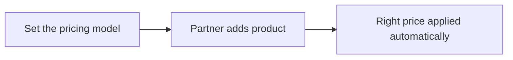
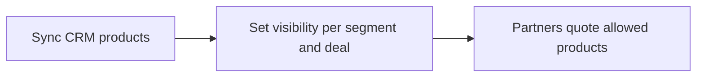
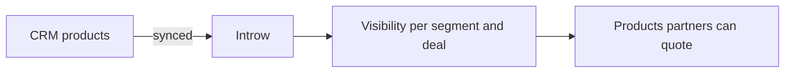
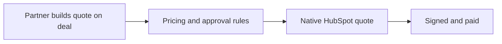
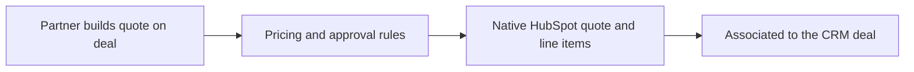

# Introw docs (docs.introw.io): features-cpq

Verbatim from docs.introw.io/llms-full.txt, fetched 2026-09-29. 13 pages.

# Let trusted partners set their own price
Source: https://docs.introw.io/features/cpq/discounts/guides/allow-custom-pricing

Enable custom pricing on a product so trusted resellers can set their own unit price when they add the product to a partner quote in Introw.

Some deals need a price set in the moment, and some partners have earned that trust. Custom pricing
lets a partner set the unit price when they add the product as a line item, so they can close
flexible deals without coming back to your team for every adjustment. Reach for this on products
where the price is genuinely negotiable and only for partners you trust.

## What you'll achieve

A product whose unit price is editable by the partner on the quote. When a trusted partner adds it as
a line item, they type the price they have agreed, so they self-serve flexible deals while your fixed
rules still govern every other product.

## Before you start

<Steps>
  <Step title="Decide who should get this flexibility">
    Custom pricing hands price control to the partner, so reserve it for trusted partners. Pair it
    with product visibility so only the right partners can see and price the product.
  </Step>
</Steps>

## Watch it

<Tabs>
  <Tab title="Video">
    <video />
  </Tab>

  <Tab title="Click through">
    <iframe />
  </Tab>
</Tabs>

## Steps

<Steps>
  <Step title="Open the product">
    Go to [CPQ](https://app.introw.io/products), stay on the Products tab, and click the product you
    want to make negotiable to open its detail panel. Scroll to the **Discount** section. Changes
    save automatically, so there is no separate Save button.

    <Frame>
      
    </Frame>
  </Step>

  <Step title="Choose Custom price">
    In the **Discount** switcher, select **Custom price**. A product uses one discount model at a
    time, so this clears any partner-based or tier-based rule on the product. The option spells out
    what it grants: partners set their own unit price when adding this product.

    <Frame>
      
    </Frame>
  </Step>

  <Step title="Confirm custom pricing is on">
    The selection saves immediately and **Custom price** stays marked on the switcher, so the partner
    can edit the unit price when adding the product to a quote. Moving the product back to **No
    discount** removes that flexibility while keeping it listed.

    <Frame>
      
    </Frame>
  </Step>
</Steps>

## Verify it worked

Open a deal as a partner who can see the product, add it as a line item, and confirm the unit price
field is editable so the partner can set their own price.

## Related

<CardGroup>
  <Card title="Set tier-based discounts" icon="layer-group" href="./set-tier-based-discounts">
    Use a fixed per-tier rule instead.
  </Card>

  <Card title="Govern product visibility" icon="eye" href="/features/cpq/product-catalog/guides/govern-product-visibility">
    Limit which partners see the product.
  </Card>

  <Card title="Implementation reference" icon="screwdriver-wrench" href="../technical">
    Full pricing configuration options.
  </Card>
</CardGroup>

---

# Apply each partner's negotiated discount from your CRM
Source: https://docs.introw.io/features/cpq/discounts/guides/set-a-partner-based-discount

Price a product from a numeric CRM property on the partner company so each reseller's negotiated discount flows automatically into every partner quote.

When discounts are negotiated per partner, the cleanest place to keep them is the CRM. Partner-based
pricing reads a numeric discount property from each partner's CRM record and applies it
automatically, so an agreed discount flows into every quote that partner builds with nothing to
maintain in Introw. Reach for this when each partner has their own contracted percentage.

## What you'll achieve

A product whose discount is driven by a value on the partner's CRM record. Each partner is priced by
their own property value at quote time, so updating a partner's negotiated rate in the CRM updates
their pricing everywhere, with no per-product editing in Introw.

## Before you start

<Steps>
  <Step title="Create a numeric discount property on the partner">
    The discount must live in a numeric or currency property on the partner record in your CRM. Only
    numeric and currency properties can be selected, because the value is read as a percentage.
  </Step>

  <Step title="Populate the property for your partners">
    A partner only receives a discount once their property holds a value. A partner whose property is
    empty gets no discount, so fill it in for the partners who should be priced this way.
  </Step>
</Steps>

## Watch it

<Tabs>
  <Tab title="Video">
    <video />
  </Tab>

  <Tab title="Click through">
    <iframe />
  </Tab>
</Tabs>

## Steps

<Steps>
  <Step title="Open the product">
    Go to [CPQ](https://app.introw.io/products), stay on the Products tab, and click the product you
    want to discount to open its detail panel. Scroll to the **Discount** section. Changes save
    automatically, so there is no separate Save button.

    <Frame>
      
    </Frame>
  </Step>

  <Step title="Choose Partner based">
    In the **Discount** switcher, select **Partner based**. A product uses one discount type at a
    time, so this replaces any tier-based or custom pricing previously set. A **Discount Property**
    selector then appears.

    <Frame>
      
    </Frame>
  </Step>

  <Step title="Pick the discount property">
    Choose the partner property that holds the discount:

    * **Discount Property** - the numeric or currency property on the partner record whose value is
      used as the discount percentage (the selector only lists eligible numeric and currency
      properties). Pick the property your team uses to store each partner's negotiated rate. Its
      value is applied directly as the percentage off list price at quote time.

    <Frame>
      
    </Frame>
  </Step>

  <Step title="Confirm the rule is saved">
    The selection saves automatically. The **Discount** switcher stays on **Partner based** with your
    chosen property, confirming the product now prices from each partner's CRM value.

    <Frame>
      
    </Frame>
  </Step>
</Steps>

## Verify it worked

Add the product to a quote as a partner whose discount property holds a value, and confirm the
discount is applied to the line item. Try a partner with an empty value and confirm they receive no
discount, which proves the price is being read from the property.

## Related

<CardGroup>
  <Card title="Set tier-based discounts" icon="layer-group" href="./set-tier-based-discounts">
    Price by partner tier instead.
  </Card>

  <Card title="Allow custom pricing" icon="dollar-sign" href="./allow-custom-pricing">
    Let trusted partners set the price.
  </Card>

  <Card title="Implementation reference" icon="screwdriver-wrench" href="../technical">
    Full pricing configuration options.
  </Card>
</CardGroup>

---

# Reward partner tiers with automatic discounts
Source: https://docs.introw.io/features/cpq/discounts/guides/set-tier-based-discounts

Set a discount percentage per partner tier in the product catalog so resellers are automatically priced by the program tier they have earned.

Tiers should come with real benefits, and pricing is one of the most tangible. Tier-based discounts
set a percentage per tier on a product, so partners are automatically priced by the tier they have
earned, with no manual quoting decisions and no per-partner upkeep. Reach for this when your program
rewards Gold or Platinum partners with better margins.

## What you'll achieve

A product that prices itself by partner tier. When a partner builds a quote, the line-item price
reflects their tier's discount automatically, so the same product quietly carries different margins
for Silver, Gold, and Platinum partners without anyone editing the quote.

<Tip>
  **Alternative: give tiers different SKUs, not just different percentages.** Instead of discounting
  one product per tier, you can restrict products to partner segments so each tier sees its own
  catalog, for example a volume SKU only Platinum partners can quote. Add deal filters on top and the
  SKU also has to fit the deal. Use tier discounts when everyone sells the same product at different
  margins, and
  [product visibility](/features/cpq/product-catalog/guides/govern-product-visibility) when the tiers
  should sell different products. The two combine.
</Tip>

## Before you start

<Steps>
  <Step title="Define your tiers">
    Tiers must exist in Settings before you can set a per-tier discount. Create them first if you
    have not.
  </Step>

  <Step title="Assign partners to tiers">
    A partner only receives a tier discount once they belong to that tier, so make sure partners are
    assigned. A partner with no tier gets no tier discount.
  </Step>
</Steps>

## Watch it

<Tabs>
  <Tab title="Video">
    <video />
  </Tab>

  <Tab title="Click through">
    <iframe />
  </Tab>
</Tabs>

## Steps

<Steps>
  <Step title="Open the product">
    Go to [CPQ](https://app.introw.io/products), stay on the Products tab, and click the product you
    want to discount to open its detail panel. Scroll to the **Discount** section. Changes save
    automatically, so there is no separate Save button.

    <Frame>
      
    </Frame>
  </Step>

  <Step title="Choose Tier based">
    In the **Discount** switcher, select **Tier based**. A product uses one discount type at a time,
    so choosing this replaces any partner-based or custom pricing previously set on the product. The
    **Tier Discounts** table then appears, pre-filled with one row per tier at 0%.

    <Frame>
      
    </Frame>
  </Step>

  <Step title="Set a discount per tier">
    In the **Tier Discounts** table, enter the discount for each tier:

    * **Tier** - each row is one of your defined tiers (shown with its tier color). Every tier gets a
      row so you can decide its margin explicitly.
    * **Discount** - the percentage off the product's list price for partners in that tier, from 0 to
      100\. Leave a tier at 0 for no discount, or raise it to reward higher tiers. If the table shows
      "No tiers configured", create tiers in Settings first, then return.

    <Frame>
      
    </Frame>
  </Step>

  <Step title="Confirm the rule is saved">
    Each percentage saves as you enter it. The **Discount** switcher stays on **Tier based**, which
    confirms the product now prices by tier.

    <Frame>
      
    </Frame>
  </Step>
</Steps>

## Verify it worked

Add the product to a quote as partners in different tiers and confirm each tier gets the discount you
set: a Gold partner's line item reflects the Gold percentage, a Silver partner's reflects the Silver
percentage, and a partner with no tier gets no discount.

## Related

<CardGroup>
  <Card title="Set a partner-based discount" icon="user-tag" href="./set-a-partner-based-discount">
    Price each partner from a CRM property instead.
  </Card>

  <Card title="Configure tiers" icon="layer-group" href="/features/partners/tiers/technical">
    Define the tiers to price against.
  </Card>

  <Card title="Govern product visibility" icon="eye" href="/features/cpq/product-catalog/guides/govern-product-visibility">
    Give each tier its own SKUs instead of a percentage.
  </Card>

  <Card title="Implementation reference" icon="screwdriver-wrench" href="../technical">
    Full pricing configuration options.
  </Card>
</CardGroup>

---

# Pricing & Discounts
Source: https://docs.introw.io/features/cpq/discounts/index

Govern the price partners quote - drive discounts from a CRM property, set them by partner tier, or let trusted partners price custom deals.

> Partners should never have to guess at price. Pricing rules per product mean the right discount is applied automatically based on the partner, their tier, or your custom-pricing policy, so margin is protected and quotes are always correct.

## The problem it solves

Inconsistent partner pricing erodes margin and creates disputes:

<Pains>
  | Without Introw                    | With Introw                        |
  | --------------------------------- | ---------------------------------- |
  | Discounts get negotiated ad hoc   | Rules apply the discount for you   |
  | Tier benefits are not enforced    | Each tier prices consistently      |
  | Partner-specific deals are manual | The discount reads from the CRM    |
  | One percentage cannot fit all     | Scope the SKUs, not just the price |
</Pains>

## Impact

Partners can tell the difference between a program that prices them and one that negotiates with them every time. Rules that apply their price automatically are what make yours the easy one.

<Impact>
  for your business

  * **In your CRM**
    A partner's negotiated discount is a property on their CRM record, so pricing follows the record you already maintain
  * **Cost to run**
    Partner ops sets the model per product and changes it the day the policy changes, with no engineering in between

  for your partners

  * **Self-serve**
    The price they see is already their price, so a quote does not start with an email asking what it costs
  * **Enabled**
    Moving up a tier shows up as a better price on the next quote, which is what makes a tier worth earning
  * **Efficient**
    Trusted partners set the unit price themselves wherever your policy allows it

  [A day in the life of a reseller](/days-in-the-life/reseller)
</Impact>

<Personas>
  * **Partner Operations** - pricing policy set per product
  * **RevOps** - margin protected by rule, not by review
  * **Resellers** - their price, already applied
</Personas>

## See it work

<Tour>
  * 

    **Price by tier**

    A discount per tier, so Gold prices better than Silver.

  * 

    **Price by partner**

    Read a partner's negotiated discount straight from the CRM.

  * 

    **Let them set it**

    Trusted partners can enter the unit price themselves.
</Tour>

## How it works

For each product, you choose how it is priced for partners. Partner-based pricing reads a numeric
discount property from the partner's CRM record, so a partner's negotiated discount flows straight
into their quotes. Tier-based pricing sets a discount per partner tier, so Gold partners
automatically price better than Silver. Custom pricing lets trusted partners set the unit price
themselves when adding a line item.

These rules apply automatically when a partner builds a quote, so the price is always governed by
your policy rather than left to negotiation in the moment. Because partner-based discounts read from
the CRM, your existing partner records drive pricing with nothing extra to maintain in Introw.

A discount percentage is not the only margin lever. You can also control **which SKUs a partner sees
at all**, by scoping each product to partner segments and to deals matching CRM criteria. A
high-volume reseller segment gets the volume SKUs, new partners get the starter SKUs, and an
enterprise SKU only surfaces on deals above a threshold, so the right margin is built into the
catalog rather than applied on top of it. Reach for this when the correct answer is a different
product rather than a different percentage. See
[Govern which products a partner can quote](/features/cpq/product-catalog/guides/govern-product-visibility).

Pricing and discounts make every partner quote follow your policy. Set the model per product,
partner, tier, or custom, and the right price is applied automatically, protecting margin while
keeping partners fast.

## Going deeper

<CardGroup>
  <Card title="How to" icon="screwdriver-wrench" href="./technical">
    Setup, configuration, and all how-to guides.
  </Card>

  <Card title="API reference" icon="code" href="/general/introduction">
    Integration surface and code.
  </Card>
</CardGroup>

**Works with**

<CardGroup>
  <Card title="Quotes & Line Items" icon="file-invoice-dollar" href="/features/cpq/quotes">
    Discounts apply on the quote.
  </Card>

  <Card title="Product Catalog" icon="file-invoice-dollar" href="/features/cpq/product-catalog">
    Limit which SKUs a partner can quote.
  </Card>

  <Card title="Tiers" icon="users" href="/features/partners/tiers">
    Set discounts by partner tier.
  </Card>
</CardGroup>

---

# Pricing & Discounts
Source: https://docs.introw.io/features/cpq/discounts/technical/index

Configure partner-based, tier-based, and custom pricing on products so reseller discounts and margins flow automatically into every quote in Introw.

## Where it lives

Pricing & Discounts sits under **CPQ**, at [CPQ](https://app.introw.io/products).

<Frame>
  
</Frame>

## Before you start

| You need                             | Why                              | Fix it                                                                            |
| ------------------------------------ | -------------------------------- | --------------------------------------------------------------------------------- |
| A connected CRM with products synced | Discounts hang off real products | [Product catalog](/features/cpq/product-catalog/guides/govern-product-visibility) |
| CPQ write access                     | To change a product's pricing    | [Internal roles](/features/access/team-management/guides/create-an-internal-role) |
| Tiers, for tier-based pricing        | Only for that discount model     | [Build a tier program](/features/partners/tiers/guides/build-a-tier-program)      |
| A partner discount property          | Only for partner-based pricing   | [Connect a CRM](/features/integrations/crm/guides/connect-hubspot)                |

## How it works

Pricing is set per product in the product's detail panel under CPQ. A discount method selector lets you
choose No discount, Partner based, Tier based, Custom price, or Custom discount. Partner-based pricing
maps a numeric or currency CRM property on the partner to a discount percentage. Tier-based pricing uses
a per-tier discount table, with tiers defined in Settings. The two custom methods hand the decision to
the partner as they add a line item: **Custom price** lets them set the unit price, while **Custom
discount** keeps your unit price and lets them set a discount percentage against it.

When a partner builds a quote, the configured rule is applied automatically to the line item price.
Every method resolves through one shared rule, and partner-based and tier-based discounts are calculated
server-side as line items are added, so the quote always reflects your policy no matter where the line
item was added from.

## Settings & configuration

Pricing rules are set per product at [CPQ](https://app.introw.io/products).

### Discount method

In the product's detail panel, the discount method selector offers five mutually exclusive options,
each with its own inline configuration:

| Method              | What partners get                                                                  |
| ------------------- | ---------------------------------------------------------------------------------- |
| **No discount**     | Partners see this product at its list price.                                       |
| **Partner based**   | The discount % is read from a CRM property on the partner.                         |
| **Tier based**      | You set a discount % for each partner tier.                                        |
| **Custom price**    | Partners set their own unit price when adding this product.                        |
| **Custom discount** | Partners set a discount % when adding this product. The unit price stays the same. |

The same selector is used in the **bulk edit** modal, so you can apply a method across many products at
once instead of product by product.

<Note>
  The discount method is not the only way to control margin. The **Segments** and **Deal filters**
  sections in the same product panel decide whether a partner sees the product at all, so you can
  give different partners different SKUs instead of the same SKU at different percentages. See
  [Govern which products a partner can quote](/features/cpq/product-catalog/guides/govern-product-visibility).
</Note>

### Partner-based discount

Choose the CRM discount property on the partner record that holds the discount percentage. Each
partner's value drives their price for the product.

### Tier-based discount

Fill in the Tier Discounts table with a percentage per tier. Partners are priced by the tier they
belong to.

### Custom price versus custom discount

Both hand the decision to the partner, but they record it differently, and that difference matters
downstream.

* **Custom price** lets the partner overwrite the unit price. The list price is gone from the line
  item, so the margin they took is implicit.
* **Custom discount** keeps your unit price and records a discount percentage against it. The line item
  carries both numbers, so the discount is explicit and reportable.

Prefer **Custom discount** when you want to see how much partners are actually discounting, and
**Custom price** when the partner genuinely sets their own price (their own currency, bundles, or local
market pricing) and your list price is not the reference.

## How-to guides

<Rail>
  * 

    [**Let trusted partners set their own price**](/features/cpq/discounts/guides/allow-custom-pricing)

    Enable custom pricing on a product so trusted resellers can set their own unit price when they add the product to a partner quote in Introw.

  * 

    [**Apply each partner's negotiated discount from your CRM**](/features/cpq/discounts/guides/set-a-partner-based-discount)

    Price a product from a numeric CRM property on the partner company so each reseller's negotiated discount flows automatically into every partner quote.

  * 

    [**Reward partner tiers with automatic discounts**](/features/cpq/discounts/guides/set-tier-based-discounts)

    Set a discount percentage per partner tier in the product catalog so resellers are automatically priced by the program tier they have earned.
</Rail>

## Troubleshooting

<Warning>
  A product uses one discount method at a time; the methods are mutually exclusive. Partner-based discounts depend on the chosen CRM property being populated on each partner, so a missing value means no discount. Tier-based discounts require partners to be assigned to a tier. Custom price and Custom discount both hand the decision to the partner, so use them for trusted partners only. Partners can only set a price or discount at all when **Show pricing** is on for the deal's line items.
</Warning>

<AccordionGroup>
  <Accordion title="A discount is not applied">
    The partner discount property is empty, or the partner has no tier.
  </Accordion>

  <Accordion title="A partner cannot edit price">
    The product is not on **Custom price**, or **Show pricing** is off on the deal embed.
  </Accordion>

  <Accordion title="A partner cannot set a discount %">
    The product is on Custom price rather than **Custom discount**, which is the method that keeps your unit price and lets them discount it.
  </Accordion>

  <Accordion title="The price looks off">
    Confirm the correct discount method and that the base price in the CRM is current.
  </Accordion>
</AccordionGroup>

---

# CPQ & Products
Source: https://docs.introw.io/features/cpq/index

Let partners build accurate quotes from your CRM product catalog, with governed pricing, discounts, and approval - all synced to HubSpot.

> CPQ in Introw lets partners build quotes from your real CRM product catalog, with pricing and discounts you control. Quotes and line items are native HubSpot objects, so everything reconciles back to your CRM automatically.

## The problem it solves

<Pains>
  | Without Introw                      | With Introw                      |
  | ----------------------------------- | -------------------------------- |
  | Partners quote in a spreadsheet     | They quote on the deal itself    |
  | Every quote needs re-entering       | The quote is a CRM record        |
  | Discounts are decided in the moment | Your rules set the price         |
  | Partners quote what they should not | They see only what they can sell |
</Pains>

## Impact

A reseller's margin is their business, and the vendor who lets them quote it themselves in minutes is the one they lead with. Quoting on your CRM's own catalog is how you become that vendor.

<Impact>
  for your business

  * **In your CRM**
    Quotes and line items are native HubSpot objects on the deal, so the deal team sees the partner's quote without anyone re-entering it
  * **Live in days**
    Partners quote from the CRM catalog you already have, so no pricing engine has to be stood up before the channel can sell
  * **Cost to run**
    Partner ops governs catalog visibility, tier discounts and approval rules, and changes them the day a promotion does

  for your partners

  * **Self-serve**
    They build and send the quote themselves, at the price your rules give them, without waiting on your deal desk
  * **Enabled**
    The catalog they see is the one they are allowed to sell, so a compliant quote is the only quote they can build
  * **Efficient**
    Signature and payment finish inside the quote, so the deal closes without a second round trip

  [A day in the life of a reseller](/days-in-the-life/reseller)
</Impact>

<Personas>
  * **Partner Operations** - catalog and pricing policy, no engineering
  * **RevOps** - quotes that reconcile to the CRM
  * **Deal Desk** - approval on the quotes that need it
  * **Resellers** - a compliant quote they can send today
</Personas>

## How this area works

Your product catalog syncs from your CRM into Introw, where you decide which partners and deals each product is available for and how it is priced. On a deal, partners can add line items and build quotes directly, choosing from products they are allowed to sell at the price your discount rules dictate. You control whether partners can publish a quote themselves or whether it needs approval, and you can require e-signatures and collect payment.

Governed products become partner-built quotes that land as CRM objects.

**Where this sits in a setup.** Only for programs where the partner closes. The [reseller](/tracks/reseller) and [distributor](/tracks/distributor) tracks set it up after the shared pipeline exists.

<Rail>
  * 

    [**Product Catalog**](./product-catalog)

    Which products each segment and deal can quote.

    [How to · 2 guides](./product-catalog/technical)

  * 

    [**Quotes & Line Items**](./quotes)

    Partners build the quote on the deal; HubSpot stores it.

    [How to · 1 guide](./quotes/technical)

  * 

    [**Pricing & Discounts**](./discounts)

    Partner, tier, or custom pricing, set per product.

    [How to · 3 guides](./discounts/technical)
</Rail>

Quotes and line items are native HubSpot objects associated to the deal, so there is nothing to reconcile. Pricing is governed by partner-based, tier-based, or custom pricing rules you set per product, keeping margin protected while still letting partners move fast.

Governed products become partner-built quotes that land as CRM objects.

---

# Bulk edit product configuration
Source: https://docs.introw.io/features/cpq/product-catalog/guides/bulk-edit-product-configuration

Apply the same partner visibility rule and discount configuration across many catalog products at once, without editing each product line by line.

Setting visibility or discounts product by product does not scale for a big catalog. Bulk edit
applies the same segment access and the same discount rule to many products in one action, so you can
roll out a partner restriction or a tier discount across a whole product line in seconds and keep the
catalog consistent.

## What you'll achieve

Every product you selected ends up with the same segment access and the same discount rule applied at
once. Partners then see a consistent set of products and consistent pricing across that product line,
without you touching each product individually.

## Before you start

<Steps>
  <Step title="Confirm products have synced">
    Products only appear in the catalog once they have synced from your CRM.
  </Step>

  <Step title="Plan the shared change">
    Decide which products should share the same visibility or pricing rule, and which rule that is.
    Bulk edit applies one set of values to all selected products, so group products that genuinely
    belong together.
  </Step>

  <Step title="Prepare prerequisites for the discount type">
    For a tier discount, tiers must be defined in Settings. For a partner discount, a numeric or
    currency discount property must exist on the partner record in your CRM.
  </Step>
</Steps>

## Watch it

<Tabs>
  <Tab title="Video">
    <video />
  </Tab>

  <Tab title="Click through">
    <iframe />
  </Tab>
</Tabs>

## Steps

<Steps>
  <Step title="Open the catalog">
    Go to [CPQ](https://app.introw.io/products) and stay on the Products tab.

    <Frame>
      
    </Frame>
  </Step>

  <Step title="Select the products">
    Tick the checkbox on every product that should get the same configuration. Use the column filters
    first if you need to narrow a large catalog down to one product line before selecting.

    <Frame>
      
    </Frame>
  </Step>

  <Step title="Open bulk edit">
    With products selected, open the bulk edit action. The dialog is titled with the number of
    products you are editing, so you can confirm the selection before applying anything.

    <Frame>
      
    </Frame>
  </Step>

  <Step title="Set the shared visibility and discount">
    Fill in the values you want to apply to every selected product:

    * **Segments** - the partner segments allowed to see these products. Add segments to restrict the
      products to those partners, or leave it empty to clear segment restrictions on all of them
      (the empty state reads "All partners"). Because this applies to every selected product, an
      empty value will remove any existing segment restriction those products had.
    * **Discount** - choose **Partner based** or **Tier based** for the whole set,
      or leave it unset to leave pricing untouched. Bulk edit covers these two rule types; custom
      pricing and deal filters are set per product.
    * **Discount property** (Partner based) - the numeric or currency CRM property on the partner
      record whose value becomes each partner's discount percentage.
    * **Tier Discounts** (Tier based) - a percentage per tier (0 to 100) that prices partners by the
      tier they belong to. If no tiers exist yet, create them in Settings first.

    <Frame>
      
    </Frame>
  </Step>

  <Step title="Save the changes">
    Apply the configuration to all selected products. The change is written to every product in the
    selection at once.

    <Frame>
      
    </Frame>
  </Step>
</Steps>

## Verify it worked

Reopen any of the products you edited and confirm its **Segments** and **Discount** match what you
applied. In the Products list, each edited product's **Visibility** column reflects the new segment
restriction, and a partner building a quote sees the products and pricing exactly as configured.

## Related

<CardGroup>
  <Card title="Govern product visibility" icon="eye" href="./govern-product-visibility">
    Scope a single product by segment and deal.
  </Card>

  <Card title="Set tier-based discounts" icon="layer-group" href="/features/cpq/discounts/guides/set-tier-based-discounts">
    Discount partners by tier.
  </Card>

  <Card title="Implementation reference" icon="screwdriver-wrench" href="../technical">
    Full catalog configuration options.
  </Card>
</CardGroup>

---

# Govern which products a partner can quote
Source: https://docs.introw.io/features/cpq/product-catalog/guides/govern-product-visibility

Scope a product to the right partners and the right opportunities using partner segments and deal filters so resellers only quote what they should sell.

Not every partner should be able to quote every product, and some products only belong on certain
deals. Governing visibility scopes a product by partner segment, by deal criteria, or both, so
partners only ever see and quote the products that fit them and the deal in front of them. This
protects strategic or restricted SKUs and keeps partners on the right catalog without manual policing.

This is also a pricing lever, not only a compliance one. Scoping SKUs by segment and deal is the
alternative to discounting a single product differently for everyone: give high-volume resellers the
volume SKUs, new partners the starter SKUs, and surface an enterprise SKU only on deals above a
threshold, and the right margin is built into the catalog each partner sees. It combines with the
[discount rules](/features/cpq/discounts) set on each product.

## What you'll achieve

A product that is visible only to the partner segments you choose and only on deals whose CRM
properties match your filters. Partners outside those segments never see it, and it stays hidden on
deals that do not match, so the catalog a partner browses on a deal reflects exactly what you allow
them to sell.

## Before you start

<Steps>
  <Step title="Confirm CPQ is on your plan">
    The product catalog is a plan feature. If the CPQ area shows an upgrade prompt, it is not on your plan yet - check what yours includes at [introw.io/pricing](https://introw.io/pricing).
  </Step>

  <Step title="Confirm products have synced">
    Products only appear in the catalog once they have synced from your CRM. Core fields like name,
    SKU, and price are maintained in the CRM, not in Introw.
  </Step>

  <Step title="Create the segments you need">
    To restrict by partner, define the segments first in Settings. A segment groups partners (for
    example by tier, region, or type) so you can scope the product to them.
  </Step>

  <Step title="Know the deal properties to gate on">
    To restrict by deal, decide which CRM deal properties should allow the product, for example a
    region, deal type, or amount threshold.
  </Step>
</Steps>

## Watch it

<Tabs>
  <Tab title="Video">
    <video />
  </Tab>

  <Tab title="Click through">
    <iframe />
  </Tab>
</Tabs>

## Steps

<Steps>
  <Step title="Open the product">
    Go to [CPQ](https://app.introw.io/products) and stay on the Products tab. Click the product you
    want to scope to open its detail panel. The panel shows the read-only CRM details at the top,
    then the **Segments**, **Deal filters**, and **Discount** sections you control. Changes save
    automatically as you make them, so there is no separate Save button.

    <Frame>
      
    </Frame>
  </Step>

  <Step title="Restrict to partner segments">
    In the **Segments** section, choose the segments allowed to see and quote this product.

    * **Segments** - the partner groups that can use the product. Only partners in a selected segment
      see it when building a quote, so use this to keep restricted or strategic SKUs with the right
      partners. Leave it empty to make the product **Available to all partners**; add one or more
      segments to scope it. If your role only manages a subset of partners, segment previews and
      counts reflect the partners you manage.

    <Frame>
      
    </Frame>
  </Step>

  <Step title="Restrict to matching deals">
    In the **Deal filters** section, limit the product to deals whose CRM properties match your
    criteria. This is independent of segments: a partner in an allowed segment still only sees the
    product on deals that pass the filter.

    * **Deal filters** - one or more conditions on CRM deal properties (for example region equals
      EMEA, or amount is greater than a threshold). The product only appears on deals that match
      every condition you add. Leave it empty to allow the product on any deal the partner can
      access. Add filters when a product is region-specific, tier-specific, or otherwise only valid
      on certain deals.

    <Frame>
      
    </Frame>
  </Step>

  <Step title="Confirm the visibility status">
    With segments or deal filters set, the product's **Visibility** in the catalog list changes from
    "Available to all partners" to "Restricted by segments or deal filters" (an amber dot). This is
    your at-a-glance confirmation that the product is now scoped.

    <Frame>
      
    </Frame>
  </Step>
</Steps>

## Verify it worked

In the Products list, the product's **Visibility** column reads "Restricted by segments or deal
filters". To confirm the partner experience, open a deal as a partner: a partner inside an allowed
segment sees the product in the line-item picker on a matching deal, while a partner outside the
segments, or any partner on a deal that fails the filter, does not see it at all.

## Related

<CardGroup>
  <Card title="Bulk edit product configuration" icon="layer-group" href="./bulk-edit-product-configuration">
    Apply the same visibility to many products at once.
  </Card>

  <Card title="Create a static segment" icon="users" href="/features/partners/segments/guides/create-a-static-segment">
    Define the partner segments to scope to.
  </Card>

  <Card title="Pricing & Discounts" icon="tags" href="/features/cpq/discounts">
    Set the discount rule on the products you scoped.
  </Card>

  <Card title="Implementation reference" icon="screwdriver-wrench" href="../technical">
    Full catalog configuration options.
  </Card>
</CardGroup>

---

# Product Catalog
Source: https://docs.introw.io/features/cpq/product-catalog/index

Your CRM product catalog, governed for partners - decide which products each partner segment and deal can use, without duplicating data.

> The catalog partners sell from is your real CRM catalog, not a copy. You decide which products each segment and deal can use, so partners only ever quote what they are allowed to.

## The problem it solves

Letting partners quote freely leads to errors and off-strategy deals:

<Pains>
  | Without Introw                    | With Introw                      |
  | --------------------------------- | -------------------------------- |
  | Partners quote the wrong products | They see only what they can sell |
  | The catalog drifts from the CRM   | Products sync from the CRM       |
  | Pricing exposure is uncontrolled  | Rules decide who sees what       |
  | Updating many products is tedious | Bulk edit changes them together  |
</Pains>

## Impact

Getting a quote wrong costs a partner the deal and the week. A catalog that only ever offers them what they can actually sell is a quiet reason they keep coming back.

<Impact>
  for your business

  * **In your CRM**
    Products come from HubSpot or Salesforce, so there is no second catalog to maintain and no stale copy to explain
  * **Cost to run**
    Partner ops scopes a product to segments or to deals matching CRM criteria, one product at a time or in bulk

  for your partners

  * **Self-serve**
    The catalog in front of them is already the one they are entitled to sell from, with nothing to check first
  * **Enabled**
    Segment and deal scoping puts the volume SKUs in front of volume partners and the starter SKUs in front of new ones
  * **Efficient**
    They never quote something they were not allowed to sell and have to build it again

  [A day in the life of a reseller](/days-in-the-life/reseller)
</Impact>

<Personas>
  * **Partner Operations** - visibility per segment and per deal
  * **RevOps** - one catalog, reconciled to the CRM
  * **Resellers** - only the products they can sell
</Personas>

## See it work

<Tour>
  * 

    **Open a product**

    Every product carries its own visibility and pricing rules.

  * 

    **Scope to segments**

    Restrict a SKU to the partner segments it is meant for.

  * 

    **Scope to deals**

    Or surface it only on deals that match your CRM criteria.

  * 

    **Change many at once**

    Set shared visibility and discounts across products together.
</Tour>

## How it works

Products sync from your CRM into Introw, where the CPQ Products tab shows the full catalog with SKU,
price, type, and term. Because products come from the CRM, there is nothing to maintain twice and
no risk of a stale copy. For each product, you govern visibility: restrict it to specific partner
segments, or use deal filters so a product only appears on deals that match certain CRM properties.

This means partners building a quote only see products they are entitled to sell, on the deals where
they apply. You can update visibility one product at a time or in bulk, and the partner-facing
result updates immediately.

The product catalog turns your CRM products into a governed selling surface. Sync once, set
visibility per segment and deal, and partners quote only what they should, with no duplicate catalog
to maintain.

## Going deeper

<CardGroup>
  <Card title="How to" icon="screwdriver-wrench" href="./technical">
    Setup, configuration, and all how-to guides.
  </Card>

  <Card title="API reference" icon="code" href="/general/introduction">
    Integration surface and code.
  </Card>
</CardGroup>

**Works with**

<CardGroup>
  <Card title="Quotes & Line Items" icon="file-invoice-dollar" href="/features/cpq/quotes">
    Quotes draw line items from the catalog.
  </Card>

  <Card title="Pricing & Discounts" icon="file-invoice-dollar" href="/features/cpq/discounts">
    Govern catalog pricing with discounts.
  </Card>

  <Card title="CRM" icon="plug" href="/features/integrations/crm">
    Sync products from your CRM.
  </Card>
</CardGroup>

---

# Product Catalog
Source: https://docs.introw.io/features/cpq/product-catalog/technical/index

Review CRM-synced products, govern which partners can quote them by segment and deal filters, and manage the reseller product catalog in Introw.

## Where it lives

Product Catalog sits under **CPQ**, at [CPQ](https://app.introw.io/products).

<Frame>
  
</Frame>

## Before you start

| You need                             | Why                              | Fix it                                                                            |
| ------------------------------------ | -------------------------------- | --------------------------------------------------------------------------------- |
| A connected CRM with products synced | The catalog mirrors your CRM     | [Connect a CRM](/features/integrations/crm/guides/connect-hubspot)                |
| CPQ write access                     | To govern visibility and pricing | [Internal roles](/features/access/team-management/guides/create-an-internal-role) |
| Segments, to restrict by segment     | Only if some products are gated  | [Create a segment](/features/partners/segments/guides/create-a-dynamic-segment)   |

## How it works

The catalog lives under CPQ on the Products tab. Products are synced from your CRM, so you do not
create or price them in Introw; you govern who can sell them and how they are discounted. Core
fields like name, SKU, and price are maintained in the CRM and are read-only here.

### Browse the catalog

The Products tab lists every synced product so you can see what partners could quote and how each
one is currently scoped. Scan the columns to get oriented:

* **Product** - the product name from your CRM.
* **Visibility** - "Available to all partners" (a green dot) when unrestricted, or "Restricted by
  segments or deal filters" (an amber dot) once you scope it.
* **SKU** - the product code from your CRM.
* **Unit Price** - the list price from your CRM, in your organisation currency.
* **Billing Term** - the billing period, such as 1 month or 1 year.
* **Description** - the product description from your CRM.

You can filter the list by name, SKU, unit price, billing term, or description to find products in a
large catalog.

### Govern a product

Clicking a product opens its detail panel, which shows the read-only CRM details (image, SKU, price,
term, description) with a link back to the product in your CRM, then the sections you control:
**Segments** and **Deal filters** for visibility, and **Discount** for pricing. You can govern one
product at a time in the panel, or select several rows and bulk edit visibility and discount across
all of them at once.

## Settings & configuration

The catalog is managed under CPQ on the Products tab at [CPQ](https://app.introw.io/products).

### Segments

In a product's detail panel, set the segments that can see and use the product. With no segments
set, the product is available to all partners.

### Deal filters

Add deal filters to a product so it only appears on deals whose CRM properties match, for example a
product limited to deals in a certain region or above a certain size.

### Bulk edit

Select multiple products and apply visibility or discount configuration to all of them at once.

### CRM link

Use the link in the detail panel to open the product in your CRM, where its core fields like name,
SKU, and price are maintained.

## How-to guides

<Rail>
  * 

    [**Bulk edit product configuration**](/features/cpq/product-catalog/guides/bulk-edit-product-configuration)

    Apply the same partner visibility rule and discount configuration across many catalog products at once, without editing each product line by line.

  * 

    [**Govern which products a partner can quote**](/features/cpq/product-catalog/guides/govern-product-visibility)

    Scope a product to the right partners and the right opportunities using partner segments and deal filters so resellers only quote what they should sell.
</Rail>

## Troubleshooting

<Warning>
  Products are managed in your CRM, so core fields like name, SKU, and price are edited there, not in Introw. Introw governs visibility and pricing rules on top. A product with no segments set is available to all partners, so restrict deliberately.
</Warning>

<AccordionGroup>
  <Accordion title="A product is missing">
    Confirm it is active in your CRM and has synced.
  </Accordion>

  <Accordion title="A partner cannot see a product">
    The product is restricted to segments they are not in, or a deal filter excludes the deal.
  </Accordion>

  <Accordion title="A price looks wrong">
    Core prices come from the CRM; check the product there.
  </Accordion>
</AccordionGroup>

---

# Let partners build and send quotes on a deal
Source: https://docs.introw.io/features/cpq/quotes/guides/enable-partner-quoting

Enable partner quoting end to end: line items and quotes, who can create them, templates, e-signatures, payment, expiration, and approval.

Letting partners build quotes on their own deals removes a slow back-and-forth and keeps quoting
inside your CRM, while your templates, pricing rules, and approval keep every quote on-brand and
correct. This guide takes you the whole way: turning on line items and quotes, choosing who can
create them, standardizing how they look, requiring signatures and payment, setting expiration, and
deciding whether quotes publish straight away or route through review.

## What you'll achieve

A deal embed in a partner experience where the partners you choose get a guided quote builder: they
add line items at your governed prices, produce a quote on your template with a locked title,
optionally require an e-signature and collect payment, and either publish the quote themselves or
submit it to your team for approval. The quote is written as a native HubSpot object on the deal, so
everything stays in your CRM.

## Before you start

<Steps>
  <Step title="Confirm the Product Hub module">
    Viewing line items and quotes works on any plan, but creating and editing them requires the
    Product Hub module on your plan. Without it, the creation toggles show an upgrade prompt instead.
  </Step>

  <Step title="Connect HubSpot with quote write access">
    Quote and line-item creation is HubSpot only, and HubSpot must be connected with quote write
    permissions. On Salesforce, partners can view line items but cannot create quotes, so this guide
    applies to HubSpot deals.
  </Step>

  <Step title="Have a deal experience ready">
    You need a portal experience that includes a deal collaboration embed (a CRM list of deals).
    Create or open that experience before you begin.
  </Step>
</Steps>

## Watch it

<Tabs>
  <Tab title="Video">
    <video />
  </Tab>

  <Tab title="Click through">
    <iframe />
  </Tab>
</Tabs>

## Steps

### Turn on line items and quotes

<Steps>
  <Step title="Open the deal embed">
    Go to [Experience builder](https://app.introw.io/templates) and open the experience your partners
    use. Select the deal collaboration embed and open its configuration. The quoting controls live in
    the **Quotes & Line Items** section of the **Configuration** tab.

    <Frame>
      
    </Frame>
  </Step>

  <Step title="Show line items and allow editing">
    Decide what partners can do with products on the deal:

    * **Show line items** - lets partners view the products and services on the deal. Turn this on as
      the foundation for quoting; on its own it is view-only and works on any plan.
    * **Show pricing** - lets partners see each line item's unit price and total. Leave it on for
      quoting. Turn it off and no monetary values reach partners at all, which also switches off
      partner quote and line-item editing, since there is nothing to quote. Use that only for programs
      where partners should see which products are on the deal but not what they cost.
    * **Allow line item editing** - lets partners add, modify, or remove line items. This requires
      the Product Hub module; with it on, partners can build the line items a quote is made of.

    <Note>
      If the quote controls below read "Enable Show pricing on the line items above to let partners
      create or publish quotes", that is the gate: quoting needs pricing visible.
    </Note>

    <Frame>
      
    </Frame>
  </Step>

  <Step title="Show quotes and allow creation">
    Turn on the quote permissions partners need:

    * **Show quotes** - lets partners view quotes linked to the deal. This is the base quote
      visibility and is HubSpot only.
    * **Allow quote creation** - lets partners create new quotes on the deal, which reveals the
      builder and the configuration below. Requires Product Hub and HubSpot quote write access.
    * **Allow quote publishing** - lets partners publish their own quotes. Leave it on for fully
      self-serve quoting, or turn it off to hold quotes for manual approval (covered in the last
      phase).
  </Step>
</Steps>

### Control who can quote and how it looks

<Steps>
  <Step title="Choose who can create quotes">
    Use **Who can create quotes** to limit quoting to specific partner segments. Leave it empty to
    allow every partner who sees the embed, or select segments to restrict creation to, for example,
    certified or higher-tier partners. This keeps quoting in the hands of partners you trust to send
    pricing to a customer.
  </Step>

  <Step title="Decide whose name the quote goes out in">
    Use **Seller** to set whose company details appear as the seller on the quote. **Us (the
    organisation)** is the default: the quote goes out under your company. Choose **The partner** and
    the partner's own linked CRM company is used instead.

    Set it to the partner for a reseller motion, where the partner sells to their customer in their own
    name and a vendor-branded quote would expose the relationship. The seller is resolved from the
    partner's linked CRM company on the server, so the setting holds wherever the quote is created.

    <Frame>
      
    </Frame>
  </Step>

  <Step title="Pick a quote template">
    Use **Quote template** to choose the HubSpot template every partner quote is built on, so output
    stays on-brand and consistent. Templates marked "(CPQ)" are HubSpot's CPQ templates, which
    support signing and payment collection; plain templates are the legacy quote format. Choose a CPQ
    template if you plan to require e-signatures or collect payment.
  </Step>

  <Step title="Lock the quote title">
    Standardize naming with the **Quote title** controls:

    * **Lock quote title** - prevents partners from changing the quote title, so every quote follows
      your convention and is easy to find.
    * **Title template** - the naming pattern used when the title is locked. Type `{` to insert deal
      property variables, for example "Quote for ", so each title is generated from the
      deal.

    <Frame>
      
    </Frame>
  </Step>
</Steps>

### Add signing, payment, and expiration

<Steps>
  <Step title="Require e-signatures">
    In **E-signatures**, turn on **Require e-signatures** so partners must select signers when
    creating the quote and the quote must be signed before it can be accepted. This gives you a clean
    record of agreement without a separate signing tool. (Signing and payment require a CPQ
    template.)

    <Frame>
      
    </Frame>
  </Step>

  <Step title="Collect payment">
    In **Payment collection**, decide whether the customer can pay from the quote:

    * **Enable payment collection** - turns on paying directly through the quote, shortening the path
      from accepted quote to revenue.
    * **Processor** - choose **HubSpot Payments** or **Stripe** to process the payment.
    * **Accepted methods** - enable **Card**, **ACH**, or both, depending on how you want customers
      to pay.

    <Frame>
      
    </Frame>
  </Step>

  <Step title="Set an expiration">
    In **Expiration**, control how long a quote stays valid:

    * **Lock expiration date** - stops partners from changing the expiration, so quotes expire on
      your schedule.
    * **Automatically expire ... days after creation** - the number of days (1 to 365) until a
      locked quote expires, for example 30. This keeps stale pricing from lingering.

    <Frame>
      
    </Frame>
  </Step>
</Steps>

### Decide on approval, then publish

<Steps>
  <Step title="Choose self-serve or approval">
    Decide how quotes go out, using **Allow quote publishing** from the first phase together with the
    review controls:

    * For fully self-serve quoting, leave **Allow quote publishing** on. Partners create and publish
      quotes themselves.
    * For reviewed quoting, turn **Allow quote publishing** off so partner quotes stay as drafts
      until someone on your side approves them.
  </Step>

  <Step title="Set up the approval form">
    If you want review, configure the approval route:

    * **Process quote form** - the form partners submit to send a quote for processing; it receives
      the deal and quote context so your team can act on it. Leave it as None for pure self-serve.
    * **Who can process quotes** - the segments allowed to process and publish quotes once a form is
      set, so only authorized reviewers can push a quote live.
  </Step>

  <Step title="Save and publish">
    Save the embed configuration, then publish the experience so the quoting setup goes live for
    partners.
  </Step>
</Steps>

## Verify it worked

Open the deal as a partner in an allowed segment and confirm the guided quote builder is available:
they can add line items, create a quote on your template with the locked title, and see the signing,
payment, and expiration behavior you configured. If you required approval, confirm the partner can
only submit a draft and that an authorized reviewer is the one who publishes it. The published quote
appears on the deal as a native HubSpot object.

## Related

<CardGroup>
  <Card title="Govern product visibility" icon="eye" href="/features/cpq/product-catalog/guides/govern-product-visibility">
    Control which products partners can add to a quote.
  </Card>

  <Card title="Reward partner tiers with discounts" icon="layer-group" href="/features/cpq/discounts/guides/set-tier-based-discounts">
    Apply governed pricing to quoted products.
  </Card>

  <Card title="Implementation reference" icon="screwdriver-wrench" href="../technical">
    Full quoting configuration options.
  </Card>
</CardGroup>

---

# Quotes & Line Items
Source: https://docs.introw.io/features/cpq/quotes/index

Let partners build accurate quotes and add line items directly on a deal, with templates, e-signatures, payment, and approval - all as native HubSpot objects.

> Partners build quotes where the deal lives, choosing from products they are allowed to sell at the price your rules dictate. Quotes and line items are native HubSpot objects, so there is nothing to reconcile.

## The problem it solves

Quoting through partners is usually slow, error-prone, and disconnected from the CRM:

<Pains>
  | Without Introw            | With Introw                     |
  | ------------------------- | ------------------------------- |
  | Partners quote off-system | They build it on the deal       |
  | Quotes skip review        | Approval holds it as a draft    |
  | Quotes look inconsistent  | Templates standardise every one |
  | Closing drags on          | Signature and payment finish it |
</Pains>

## Impact

A partner who can quote your product without asking you is a partner who can close this week. That is often the whole reason they picked you over the vendor whose deal desk owns the price.

<Impact>
  for your business

  * **In your CRM**
    The result is a native HubSpot quote with line items on the deal, not a document somebody has to re-enter
  * **Live in days**
    Partners quote from the CRM catalog you already have, with no pricing engine to stand up first
  * **No new tool**
    They build the quote in the portal or inside your CRM, wherever they already work the deal

  for your partners

  * **Self-serve**
    They add line items, build the quote and publish it, as far as your rules let them go unaided
  * **Enabled**
    A guided builder walks them through their details, the end user, the line items and signature
  * **Efficient**
    E-signature and payment happen inside the quote, so closing needs no second round trip

  [A day in the life of a reseller](/days-in-the-life/reseller)
</Impact>

<Personas>
  * **Partner Operations** - how much partners can do unaided
  * **Deal Desk** - review only where it is needed
  * **Resellers** - a quote they can send today
</Personas>

## See it work

<Tour>
  * 

    **The deal is theirs to work**

    Line items, quotes and their own commission, on the shared record.

  * 

    **You set the guardrails**

    Who may quote, whose name it goes out in, and who publishes.
</Tour>

## How it works

On a deal, partners can add line items and build quotes directly in the collaboration surface, in
the portal or embedded in your CRM. They pick from the governed product catalog, and pricing follows
your discount rules automatically. A guided quote builder walks them through their info, the end
user, line items, and signature or contacts, then a review step.

You decide how much partners can do: whether they can edit line items, create quotes, and publish
them, or whether a quote needs approval first. You can apply a quote template, lock the title to a
template, require e-signatures, and collect payment through HubSpot Payments or Stripe. Everything
is written back as native HubSpot quote and line-item objects associated to the deal.

Quotes and line items bring partner quoting into your CRM. Partners build accurate quotes on the
deal, your rules govern pricing and approval, and the result is a native HubSpot quote, signed and
paid if you choose, with no reconciliation.

## Going deeper

<CardGroup>
  <Card title="How to" icon="screwdriver-wrench" href="./technical">
    Setup, configuration, and all how-to guides.
  </Card>

  <Card title="API reference" icon="code" href="/general/introduction">
    Integration surface and code.
  </Card>
</CardGroup>

**Works with**

<CardGroup>
  <Card title="Product Catalog" icon="file-invoice-dollar" href="/features/cpq/product-catalog">
    Line items come from the catalog.
  </Card>

  <Card title="Pricing & Discounts" icon="file-invoice-dollar" href="/features/cpq/discounts">
    Partner and tier discounts apply on the quote.
  </Card>

  <Card title="Shared Pipeline" icon="file-signature" href="/features/deal-registration/shared-pipeline">
    Resellers build quotes on their shared deals.
  </Card>
</CardGroup>

---

# Quotes & Line Items
Source: https://docs.introw.io/features/cpq/quotes/technical/index

Configure quote and line-item creation on deal embeds with quote templates, e-signatures, payment collection, and approval workflows in Introw.

## Where it lives

Quotes & Line Items lives at [Experience builder](https://app.introw.io/templates).

<Frame>
  
</Frame>

## Before you start

| You need                              | Why                           | Fix it                                                                                             |
| ------------------------------------- | ----------------------------- | -------------------------------------------------------------------------------------------------- |
| The Product Hub module                | Quoting is locked without it  | **Request access**                                                                                 |
| A connected HubSpot with quote access | Quotes are written back there | [Connect a CRM](/features/integrations/crm/guides/connect-hubspot)                                 |
| An experience with a deal embed       | Partners quote from the deal  | [Publish an experience](/features/portal/experiences/guides/build-and-publish-a-portal-experience) |

## How it works

Partner quoting is configured on a deal embed in a portal experience. When you add a CRM entity
list for deals, its Quotes & Line Items settings control whether partners can see and edit line
items, create quotes, and publish them. With creation enabled, partners get a guided quote builder
on the deal: their info, the end user, line items, and a signature or contacts step, then review.

Quotes and line items are written as native HubSpot objects associated to the deal. Quote creation
and line-item editing require the Product Hub module and a HubSpot connection. You can choose a quote
template, lock the title to a template, require e-signatures, collect payment, and gate publishing
behind approval.

## Settings & configuration

Quoting is configured in the deal embed's Quotes & Line Items settings, reached from
[Experience builder](https://app.introw.io/templates).

### Visibility

Use Show line items and Show quotes to control what partners see on the deal.

**Show pricing** sits under Show line items and decides whether partners see any money at all. With it
on, they see each line item's unit price and total. With it off, no monetary values are sent to
partners, and partner quote and line-item editing is switched off with it, since there is no way to
quote without prices. Use it for programs where partners should see *what* is on the deal (which
products, which quantities) but not what it costs, for example when a distributor owns the commercial
conversation with the end customer.

<Note>
  Quote creation and publishing depend on **Show pricing** being on. If the quote controls read
  "Enable Show pricing on the line items above to let partners create or publish quotes", that is
  why.
</Note>

### Creation

With Product Hub and HubSpot connected, enable Allow line item editing, Allow quote creation, and
Allow quote publishing. Turning publishing off holds quotes for manual approval.

### Seller

**Seller** decides whose company details appear as the seller on the quote. **Us (the organisation)**
is the default and keeps today's behaviour: the quote goes out under your company. Choose **The
partner** and the partner's own linked CRM company is used instead, so the quote reads as coming from
them.

This is what a reseller motion needs. A reseller sells to their customer in their own name, on their
own paper, and a quote branded with the vendor exposes the relationship and confuses the buyer. The
seller is resolved server-side from the partner's linked CRM company, so the setting holds no matter
where the quote was created from.

### Audience

Use Who can create quotes to limit quoting to specific partner segments.

### Template and title

Choose a quote template, then optionally Lock quote title and set a title template so every quote
follows the same naming.

### E-signatures

Enable Require e-signatures so a quote must be signed before it can be accepted.

### Payment collection

Enable payment collection, choose a processor (HubSpot Payments or Stripe), and set accepted methods
such as card or ACH.

### Approval workflow

Configure a Process quote form and Who can process quotes to route quotes through review before they
go out.

## How-to guides

<Rail>
  * 

    [**Let partners build and send quotes on a deal**](/features/cpq/quotes/guides/enable-partner-quoting)

    Enable partner quoting end to end: line items and quotes, who can create them, templates, e-signatures, payment, expiration, and approval.
</Rail>

## Troubleshooting

<Warning>
  Quote and line-item creation is HubSpot only. On Salesforce, line items can be viewed but quotes cannot be created in Introw. Quote creation requires the Product Hub module and HubSpot quote write access; without it, partners can view but not build. CPQ quotes require at least one contact or signer. Turning **Show pricing** off also disables partner quote and line-item editing, because there is nothing to quote on. Setting **Seller** to the partner needs that partner linked to a CRM company; without one there are no seller details to use.
</Warning>

<AccordionGroup>
  <Accordion title="Partners cannot create quotes">
    The Product Hub module is off, HubSpot quote write access is missing, or **Show pricing** is off on the line items.
  </Accordion>

  <Accordion title="The quotes section is hidden">
    The deal is on Salesforce, where quote creation is not available.
  </Accordion>

  <Accordion title="A quote will not publish">
    Publishing is disabled for approval, the quote is missing a required contact, or a CPQ quote has no line items yet: it reads **This quote requires at least one line item before it can be published.** Add a line item and publish again.
  </Accordion>

  <Accordion title="HubSpot will not let the connection change a quote">
    When Introw's HubSpot connection lacks quote permission, creating, editing, publishing, recalling or deleting a quote says so and names the action, for example that the connection is not allowed to delete quotes, and tells the partner to ask their partner manager. A published quote is archived rather than deleted. Give the connection quote permission in HubSpot, or make the change in HubSpot yourself.
  </Accordion>

  <Accordion title="The quote template is inactive">
    The quote template on the embed is inactive in your CRM, and creating a quote says so. Activate it in HubSpot, or pick an active template in the embed settings.
  </Accordion>

  <Accordion title="Partners see no prices">
    **Show pricing** is off. That is deliberate: with it off, no monetary values reach partners at all.
  </Accordion>

  <Accordion title="The quote shows the wrong seller">
    Check **Seller**. On **The partner**, the details come from the partner's linked CRM company, so fix the link rather than the quote.
  </Accordion>
</AccordionGroup>