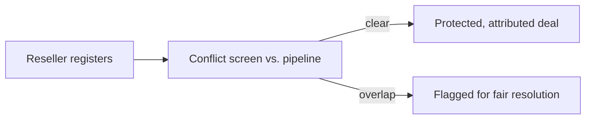
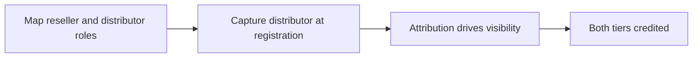
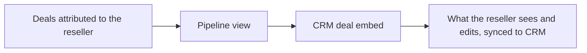

# Introw docs (docs.introw.io): features-deal-registration

Verbatim from docs.introw.io/llms-full.txt, fetched 2026-09-29. 15 pages.

# Channel Conflict
Source: https://docs.introw.io/features/deal-registration/channel-conflict/index

AI-powered channel conflict screening checks every reseller claim against direct and partner pipeline before approval, so registered deals stay protected.

> A registration is only worth something if it actually protects the deal. Channel conflict screening is what makes that promise real: before a reseller's claim is approved, Introw checks it against your direct and partner pipeline, so the reseller knows their investment is safe and your channel stays fair.

## The problem it solves

Registration without conflict screening is a promise you can't keep:

<Pains>
  | Without Introw                    | With Introw                       |
  | --------------------------------- | --------------------------------- |
  | They register, you already had it | Caught at registration, not close |
  | Two partners claim one account    | Who came first is surfaced        |
  | Disputes surface late and hot     | The facts are on the table first  |
  | Resellers stop trusting it        | Fair, fast handling every time    |
</Pains>

## Impact

Registration is only worth something if it actually protects the deal. Screening is what turns your promise into something a reseller will stake a quarter's capacity on.

<Impact>
  for your business

  * **Trustworthy**
    Conflicts are caught on facts, with who is involved and which claim came first, before anyone is credited
  * **In your CRM**
    Screening runs against the deals already in HubSpot or Salesforce, so nothing slips past in a registration silo

  for your partners

  * **Self-serve**
    They find out where they stand at registration, rather than at close
  * **Enabled**
    A screened claim is a claim worth making, which is what gets deals registered early
  * **Efficient**
    One decision up front instead of an escalation months later

  [A day in the life of a reseller](/days-in-the-life/reseller)
</Impact>

<Personas>
  * **Partner Managers** - clean claims without policing
  * **Chief Revenue Officer** - direct and channel kept aligned
  * **Resellers** - a claim that holds
</Personas>

## See it work

<Tour>
  * 

    **Turn on the screen**

    Pick the object to check against, and narrow it with filters.

  * 

    **On the registration form**

    It runs on the form resellers register through.
</Tour>

## How it works

Channel conflict screening is the gate between a reseller registering a deal and that deal becoming protected, attributed pipeline. The moment a registration comes in, Introw cross-references your CRM for an existing deal on the same account or opportunity - your direct team's, or another partner's. Any overlap is flagged with the full context: who's involved, which claim came first, and the rules that apply. Clean registrations flow through; overlapping ones are surfaced for a fast, fair decision before anyone is credited.

This is the same [AI channel-conflict engine](/features/ai/channel-conflict) that runs across every submission motion, applied here to the reseller registration flow. The detection and resolution work the same way; what's specific to deal registration is what's at stake - a reseller's margin and their trust in the program.

Screening turns registration from a hopeful form submission into a real guarantee. The reseller registers, Introw checks the claim against your pipeline, and only a conflict-free (or fairly resolved) deal becomes their protected, attributed opportunity.

## Run it from your AI assistant

<Headless>
  * Does this registration conflict with any direct or partner pipeline?
  * Which registrations overlap an existing opportunity?
  * Is Globex already being worked by our direct team?
</Headless>

## Going deeper

<CardGroup>
  <Card title="Set up conflict screening" icon="robot" href="/features/ai/channel-conflict">
    Configure detection and resolution on the AI channel-conflict page.
  </Card>

  <Card title="Catch and resolve channel conflict" icon="book-open" href="/features/ai/channel-conflict/guides/catch-and-resolve-channel-conflict">
    Turn on screening for a deal form and work conflicts from the inbox.
  </Card>
</CardGroup>

**Works with**

<CardGroup>
  <Card title="Channel Conflict Resolution" icon="robot" href="/features/ai/channel-conflict">
    The AI engine that detects and resolves conflict.
  </Card>

  <Card title="Deal Registration" icon="file-signature" href="/features/deal-registration/registration">
    Every registration is screened before approval.
  </Card>

  <Card title="Submissions & Approvals" icon="table-list" href="/features/forms/submissions-approvals">
    Flagged registrations route through approval.
  </Card>
</CardGroup>

---

# Deal Registration
Source: https://docs.introw.io/features/deal-registration/index

Protect partner-owned deals end to end - resellers register opportunities, edit CRM fields they own, and share credit with distributors via multi-tier.

> Deal registration is how partners who own the sale protect their investment in a deal. Resellers register to lock in conflict-free credit, work the fields they own on the live CRM record, and where a distributor sits above them, both tiers share attribution and visibility on the same opportunity.

## The problem it solves

<Pains>
  | Without Introw                    | With Introw                     |
  | --------------------------------- | ------------------------------- |
  | Partners fear losing their deal   | Registration locks the claim    |
  | Registering is too slow to bother | Seconds, from wherever they are |
  | Approvals are opaque              | Configurable steps, with AI     |
  | Partners would need CRM seats     | They work the deal without one  |
</Pains>

## Impact

A reseller decides where to put their sales capacity. Being the vendor whose registration actually protects their deal is the reason they put it with you.

<Impact>
  for your business

  * **Trustworthy**
    Conflict checks and approvals run before the deal is credited, so a reseller's margin is protected up front
  * **In your CRM**
    Registration, field edits and multi-tier credit all live on the HubSpot or Salesforce record, reconcilable like any deal
  * **No new tool**
    Partners register and update from the portal, their own CRM, email, chat or an AI assistant

  for your partners

  * **Self-serve**
    They register, edit the fields you open, manage line items and quote, without a CRM seat
  * **Enabled**
    The claim is what makes investing in the deal rational, and they can see it was honoured
  * **Efficient**
    No email to the vendor for a field change, because the field is theirs to change

  [A day in the life of a reseller](/days-in-the-life/reseller)
</Impact>

<Personas>
  * **Partner Managers** - the rules that protect resellers
  * **Partner Ops / RevOps** - multi-tier credit that holds up
  * **Resellers** - deals they can claim and run
</Personas>

## How this area works

Deal registration is the motion where the partner, not the vendor, closes the deal. A reseller registers an opportunity to claim it, which checks for channel conflict and routes through your approvals so their margin is protected from the direct team and other partners. Once a deal is shared, resellers can edit the specific fields you allow on the CRM record, manage line items, and create quotes, all without a CRM seat.

The pieces chain from the partner's claim to a credited, shared deal.

**Where this sits in a setup.** Registration is the first thing most partners actually do, so it lands early. The [reseller](/tracks/reseller), [co-sell](/tracks/co-sell) and [distributor](/tracks/distributor) tracks sequence it with attribution and conflict checks.

<Rail>
  * 

    [**Deal Registration**](./registration)

    Claim the deal, checked and approved.

    [How to · 4 guides](./registration/technical)

  * 

    [**Channel Conflict**](./channel-conflict)

    Screened against direct and partner pipeline.

    [Read more](./channel-conflict)

  * 

    [**Shared Pipeline**](./shared-pipeline)

    Give resellers a CRM-drawn view of every deal they own.

    [How to · 2 guides](./shared-pipeline/technical)

  * 

    [**Self-serve quoting**](/features/cpq/quotes)

    Let resellers assemble line items and build quotes on their deal.

    [How to · 1 guide](/features/cpq/quotes/technical)

  * 

    [**Multi-tier Attribution**](./multi-tier)

    One deal, a reseller and a distributor.

    [How to · 1 guide](./multi-tier/technical)
</Rail>

For two-tier channels, the same deal can carry both a reseller and a distributor through multi-tier attribution in your CRM. Both partners get credit, and the visibility they need on the same opportunity. Everything writes back to HubSpot or Salesforce, so partner-owned pipeline stays real and reconcilable.

The pieces chain from the partner's claim to a credited, shared deal.

## Run it from your AI assistant

<Headless>
  * Register a deal for Acme: \$120k ARR, closing end of Q3, contact [jane@acme.com](mailto:jane@acme.com).
  * Show every deal registration pending approval or in channel conflict.
  * Approve the registration from Globex and link it to the existing CRM deal.
</Headless>

---

# Register a two-tier deal
Source: https://docs.introw.io/features/deal-registration/multi-tier/guides/register-a-two-tier-deal

Credit both a distributor and reseller on one CRM deal - map each role's attribution, capture the tier at registration, and give each partner scoped view.

In a two-tier channel a distributor sits behind the reseller who closes, and both deserve credit on the same opportunity. This guide sets that up end to end: you map each partner role's attribution on the deal, capture the relationship at registration, and give each tier a scoped view of the shared deal. You reach for it when a distributor recruits and supports resellers who register deals, and it saves you from reconstructing the tier relationship or double-counting credit later.

## What you'll achieve

A registered deal that carries both a distributor and a reseller as independent attributions on one CRM record, captured at registration and visible to each partner in their own portal, scoped to what each should see. Credit reconciles because it lives on the CRM record, not on a form field.

<Note>
  Introw represents tiers as multiple partner attributions on the same CRM deal, not a parent-child partner hierarchy. There is no automatic roll-up reporting across a reseller network: each partner reports through their own attribution. A picker on the form captures the relationship, but the credit that counts always comes from the CRM attribution mapping, not the picker alone.
</Note>

## Before you start

<Steps>
  <Step title="Confirm your CRM supports multiple partner roles per deal">
    Your CRM attribution mapping must be able to link more than one partner role (for example reseller and distributor) to a single deal.
  </Step>

  <Step title="Have a registration form ready">
    A reseller registration form with its CRM deal automation should already exist. Build it in [Register and approve a deal](/features/deal-registration/registration/guides/register-and-approve-a-deal) first.
  </Step>
</Steps>

## Steps

### Map both partner roles on the deal

<Steps>
  <Step title="Open the deal attribution mapping">
    Go to [Integrations](https://app.introw.io/settings/integrations) and open your CRM connection's property mapping for the deal object. This mapping is what tells Introw how a deal links to a partner, and it is the source of truth for credit.

    <Frame>
      
    </Frame>
  </Step>

  <Step title="Map the reseller and distributor roles">
    Add an attribution mapping for each partner role you want credited on a deal:

    * **Reseller mapping** - map how the deal links to the reseller partner so the reseller is attributed. This is the partner who closes.
    * **Distributor mapping** - add a second mapping for the distributor role so the distributor is attributed on the same deal. Both attributions coexist; neither overwrites the other.

    With both roles mapped, a single deal can carry both partners independently, which is what makes two-tier credit possible.
  </Step>
</Steps>

### Capture the tier at registration

<Steps>
  <Step title="Open the form builder">
    Open the registration form in [Forms](https://app.introw.io/forms) for editing. You will add a picker so the reseller records the related distributor (or vice versa) as they register.
  </Step>

  <Step title="Add the Distributor or Reseller field">
    In the **Add field** dialog, choose the preset that matches the tier you want to capture:

    * **Distributor** - drops in a partner picker pre-labeled for the reseller to select the distributor standing behind the deal.
    * **Reseller** - the mirror preset, for a distributor-led form where the distributor names the reseller.

    Add the one that fits your motion (or both if each side registers). The picker records the chosen partner on the submission so the relationship is captured up front.
  </Step>

  <Step title="Scope the picker options">
    Use the field's audience filters so the reseller only sees the right set of distributors to choose from, rather than every partner. Mark the field required if the tier relationship must be recorded on every registration.
  </Step>

  <Step title="Publish the form">
    Save the form so the picker appears at registration. Remember the picker captures the relationship; the credit that reconciles still comes from the attribution mapping you set above.
  </Step>
</Steps>

### Give each tier scoped visibility

<Steps>
  <Step title="Add the deal pipeline to each partner's experience">
    Because attribution drives portal visibility, a deal pipeline embed shows each partner the deals attributed to them. In the **Experience builder**, add a CRM deal pipeline to each tier's experience so a deal attributed to both the reseller and the distributor appears for each one in their own portal.
  </Step>

  <Step title="Tighten visibility where a tier should see less">
    If a tier should only see the specific deals they actively work rather than every attributed deal, open that tier's segment, switch on **Override the default for this segment** on its **Permissions** tab, and turn **See all shared records** off. Use it, for example, to stop a distributor from seeing every reseller deal when they should only see the ones they are involved in. Overrides merge most-permissive, so also check those contacts are not in another override segment that grants full visibility, which would win.
  </Step>
</Steps>

## Verify it worked

Submit a test two-tier registration with both partners captured, then open the resulting CRM deal and confirm both the reseller and the distributor appear as attributions on the record. Sign in as each partner and confirm the shared deal shows in their pipeline, scoped as you intended.

## Related

<CardGroup>
  <Card title="Register and approve a deal" icon="book-open" href="/features/deal-registration/registration/guides/register-and-approve-a-deal">
    Build the registration form behind the two-tier capture.
  </Card>

  <Card title="Map partner attribution" icon="book-open" href="/features/integrations/crm/attribution">
    The full attribution mapping setup.
  </Card>

  <Card title="Control which deals partners see" icon="book-open" href="/features/co-selling/shared-pipelines/guides/set-up-a-shared-pipeline">
    Scope the pipeline view per partner.
  </Card>

  <Card title="Implementation reference" icon="screwdriver-wrench" href="../technical">
    Full configuration options.
  </Card>
</CardGroup>

---

# Multi-tier Attribution
Source: https://docs.introw.io/features/deal-registration/multi-tier/index

Credit both a reseller and a distributor on the same deal - map partner roles onto one CRM record so each tier gets attribution and its own portal view.

> In a two-tier channel, a single deal often belongs to more than one partner: the reseller who closes it and the distributor who stands behind them. Multi-tier attribution credits both on the same CRM record and shows each tier the deal in their own portal.

## The problem it solves

Two-tier channels lose clarity when only one partner can be credited:

<Pains>
  | Without Introw                       | With Introw                         |
  | ------------------------------------ | ----------------------------------- |
  | Only one partner can be credited     | Both tiers, on one deal             |
  | Distributors lose sight of resellers | Each tier sees the shared deal      |
  | Tier roles are captured loosely      | A distributor field at registration |
  | Credit cannot be reconciled          | Each tier's credit is a CRM field   |
</Pains>

## Impact

Two-tier channels run on demand signal. Crediting both tiers on one record is what lets a distributor do its job without you building a second reporting system for it.

<Impact>
  for your business

  * **In your CRM**
    Both roles attach to the same opportunity through your CRM attribution mapping, not a separate ledger
  * **Trustworthy**
    Each tier's attribution is explicit on the record, so a distributor's rebate and a reseller's margin both reconcile
  * **Fits together**
    Attribution drives portal visibility, so crediting a tier is the same act as giving it sight of the deal

  for your partners

  * **Self-serve**
    A distributor sees its resellers' deals in its own pipeline, without asking anyone for a report
  * **Enabled**
    The reseller keeps its own credit while the distributor above it keeps sell-through visibility
  * **Efficient**
    The relationship is recorded at registration, so nobody reconstructs it at payout

  [A day in the life of a distributor](/days-in-the-life/distributor)
</Impact>

<Personas>
  * **Partner Ops / RevOps** - tier roles that hold up
  * **Partner Managers** - the distributor relationship
  * **Distributors** - their network's deals, visible
</Personas>

## How it works

Multi-tier attribution lets one CRM deal carry more than one partner with distinct roles, such

<Frame>
  
</Frame>

as a reseller and the distributor above them. You map each role to the deal through your CRM
attribution mapping, so each partner is credited in their own right on the same opportunity.
Because attribution drives portal visibility, each partner sees that deal in their own pipeline,
giving a distributor and its reseller shared sight of the same record.

You can also capture the distributor at the moment of registration with a distributor field on
the form. The credit itself always lives on the CRM record, so it is reportable and reconcilable
like any other attributed deal.

Map reseller and distributor roles onto your CRM deals, capture the distributor at registration,
and let attribution drive who sees what. Both tiers get credit and shared visibility on the same
opportunity, on your CRM's terms.

## Run it from your AI assistant

<Headless>
  * Register a deal on behalf of our distributor's sub-reseller.
  * Show registrations submitted through second-tier partners.
  * Which multi-tier registrations are waiting on approval?
</Headless>

## Going deeper

<CardGroup>
  <Card title="How to" icon="screwdriver-wrench" href="./technical">
    Setup, configuration, and all how-to guides.
  </Card>

  <Card title="API reference" icon="code" href="/general/introduction">
    Integration surface and code.
  </Card>
</CardGroup>

**Works with**

<CardGroup>
  <Card title="Deal Registration" icon="file-signature" href="/features/deal-registration/registration">
    Built on registered deals.
  </Card>

  <Card title="Commission Plans" icon="hand-holding-dollar" href="/features/commissions/commission-plans">
    Split commission across tiers.
  </Card>
</CardGroup>

---

# Multi-tier Attribution
Source: https://docs.introw.io/features/deal-registration/multi-tier/technical/index

Map multiple partner roles onto one CRM deal, capture the distributor at registration, and let attribution drive shared visibility, in Introw.

## Where it lives

Multi-tier Attribution sits under **Settings**, at [Integrations](https://app.introw.io/settings/integrations).

<Frame>
  
</Frame>

## Before you start

| You need                             | Why                                | Fix it                                                                                           |
| ------------------------------------ | ---------------------------------- | ------------------------------------------------------------------------------------------------ |
| A CRM attribution mapping with roles | Two partners per deal needs it     | [Configure attribution](/features/co-selling/shared-pipelines/guides/configure-deal-attribution) |
| A form with a partner picker         | Only for capturing the second tier | [Build a form](/features/forms/form-builder/guides/build-and-publish-a-form)                     |

## How it works

Multi-tier attribution is built on your CRM's partner attribution mapping. A single deal can
carry more than one partner role, for example a reseller and a distributor, each mapped through
its own attribution. Introw reads these links from the CRM, so each partner is credited
independently on the same deal.

Attribution also drives portal visibility: a partner's pipeline embed shows the deals attributed
to that partner, so when both a reseller and a distributor are attributed to one deal, each can
see it in their own portal. To capture the relationship up front, you can add a distributor or
reseller picker to the registration form. The credit always lives on the CRM record.

<Note>
  Introw represents tiers through multiple partner attributions on the same CRM deal, not a
  parent-child partner hierarchy. There is no automatic roll-up reporting across a reseller
  network; each partner's deals report through their own attribution.
</Note>

## Settings & configuration

Attribution mapping lives in [Integrations](https://app.introw.io/settings/integrations) on the
connection's property mapping; visibility is driven by the experience's CRM embed and segment
permissions.

### Partner attribution mapping

In the integration's property mapping, you map how a CRM deal links to a partner. To support two
tiers, map both partner roles, such as reseller and distributor, so each is attributed on the
deal. This is what lets one deal carry more than one partner.

### Distributor and reseller form fields

The form builder offers partner picker presets, including **Distributor** and **Reseller**, which
let a partner choose the related distributor or reseller at registration. Use these to capture the
tier relationship as the deal is registered. The picker records the choice; the attribution itself
still comes from your CRM mapping.

### Per-partner visibility

A deal pipeline embed in a partner's portal shows the deals attributed to that partner. When both
tiers are attributed to one deal, the reseller and distributor each see it in their own portal.
Configure the embed to include the pipelines and attribution each partner should see.

### Collaboration-restricted visibility

For tighter control, switch the segment permission **See all shared records** off on a tier's
segment, which limits its partners to the deals they actively collaborate on rather than every
attributed deal. Use it when a tier should only see the specific deals they are working. Overrides merge
most-permissive, so also check the tier's partners are not in another override segment that grants full
visibility, which would win.

## How-to guides

<Rail>
  * [**Register a two-tier deal**](/features/deal-registration/multi-tier/guides/register-a-two-tier-deal)

    Credit both a distributor and reseller on one CRM deal - map each role's attribution, capture the tier at registration, and give each partner scoped view.
</Rail>

## Troubleshooting

<Warning>
  Multi-tier attribution depends on your CRM mapping supporting more than one partner role per deal; map each role explicitly. Introw does not maintain a distributor-to-reseller hierarchy or roll-up reporting across a reseller network. A partner picker on a form captures the relationship, but credit comes from CRM attribution, not the picker alone.
</Warning>

<AccordionGroup>
  <Accordion title="Only one tier is credited">
    Both partner roles must be mapped in the integration's attribution mapping.
  </Accordion>

  <Accordion title="A tier cannot see the shared deal">
    Confirm the partner is attributed and their embed includes that pipeline.
  </Accordion>

  <Accordion title="A distributor sees too many deals">
    Switch **See all shared records** off on the distributor segment.
  </Accordion>
</AccordionGroup>

---

# Configure the deal owner and name for partner deals
Source: https://docs.introw.io/features/deal-registration/registration/guides/configure-partner-deal-owner-and-name

Control who owns partner-registered deals in your CRM and how those deals are named, using default fields and naming rules on the deal automation.

Deals your partners register should look and route like the ones your own sales team creates: assigned to the right owner and named to your convention. Introw sets both automatically when it creates the deal in your CRM, using default fields on the deal automation of your registration form. This guide configures the deal owner and the deal name so every partner-registered deal lands correctly.

## What you'll achieve

A deal registration form that, on each submission, creates the CRM deal with the owner you intend (a fixed person or the partner's manager) and a name built to your convention, so partner deals route to the right rep and stay consistent with the rest of your pipeline.

## Before you start

<Steps>
  <Step title="Have a deal registration form connected to your CRM">
    You need a form with a deal automation. See [Connect a form to your CRM](/features/forms/crm-automations/guides/connect-a-form-to-your-crm).
  </Step>

  <Step title="Decide your conventions">
    Know who should own partner deals (a fixed person, or the partner's manager) and the naming pattern you want, so you can build it from text and variables.
  </Step>
</Steps>

## Watch it

<Tabs>
  <Tab title="Video">
    <video />
  </Tab>

  <Tab title="Click through">
    <iframe />
  </Tab>
</Tabs>

## Steps

<Steps>
  <Step title="Open the deal automation">
    Go to [Forms](https://app.introw.io/forms), open your registration form's configuration, and select the **Deal automation**. Its **Default values** set fixed values on every deal the form creates (values the submitter never sees or fills in).

    <Frame>
      
    </Frame>

    <Frame>
      
    </Frame>
  </Step>

  <Step title="Set the deal owner">
    Under **Default values**, add **Deal owner** as the CRM property and choose how it is set:

    * **A fixed individual** - always assign the same team member, useful when one person triages all partner deals.
    * **Partner manager (dynamic)** - assign whoever manages the registering partner, so a deal from Amazon goes to Amazon's manager and a deal from Tesla goes to Tesla's manager, automatically.

    <Frame>
      
    </Frame>

    <Frame>
      
    </Frame>
  </Step>

  <Step title="Set the deal name">
    Add **Deal name** as another default value and build the name from free text combined with variables from the partner or form fields, so partner deals match your convention. For example `New deal - [end customer company]` or `Opportunity via [Partner] for [amount] licences`.

    <Frame>
      
    </Frame>
  </Step>

  <Step title="Save the form">
    Save. From now on, every partner-registered deal is created in your CRM with the owner and name convention you set.
  </Step>
</Steps>

## Verify it worked

Submit a test registration for a partner that has a manager assigned. The resulting CRM deal is owned by the person you configured (or the partner's manager) and its name follows your pattern with the variables filled in.

## Related

<CardGroup>
  <Card title="Register and approve a deal" icon="clipboard-check" href="./register-and-approve-a-deal">
    The core registration flow these defaults apply to.
  </Card>

  <Card title="Connect a form to your CRM" icon="plug" href="/features/forms/crm-automations/guides/connect-a-form-to-your-crm">
    Map and attribute the rest of the deal's fields.
  </Card>

  <Card title="Wire partner ownership" icon="user-gear" href="/features/partners/team/guides/wire-partner-ownership">
    Set the partner managers the dynamic owner option uses.
  </Card>
</CardGroup>

---

# Link a registered deal to an existing lead
Source: https://docs.introw.io/features/deal-registration/registration/guides/link-a-deal-to-an-existing-lead

Let partners pick an existing CRM lead when they register a deal, write the lead reference on the deal, and associate the two records in your CRM.

When a partner registers a deal that started as a lead, you want the deal and the lead connected in your CRM so nothing about the origin is lost. Introw supports this in three stages: a lead picker on the registration form, a form automation that records the chosen lead on the deal, and a CRM workflow that formally associates the two records. This guide walks the Introw setup and hands off to the CRM workflow that completes the link.

## What you'll achieve

A deal registration form on which partners can select the lead their deal relates to, so each new deal carries a reference to that lead and your CRM associates the deal and lead automatically, keeping attribution and history intact.

## Before you start

<Steps>
  <Step title="Have a deal registration form">
    You need a form that registers deals. See [Build and publish a form](/features/forms/form-builder/guides/build-and-publish-a-form) and [Connect a form to your CRM](/features/forms/crm-automations/guides/connect-a-form-to-your-crm).
  </Step>

  <Step title="Prepare a deal property for the lead reference">
    In your CRM, have (or create) a property on the deal object to hold the linked lead's identifier, so the automation has somewhere to write it.
  </Step>
</Steps>

## Watch it

<Tabs>
  <Tab title="Video">
    <video />
  </Tab>

  <Tab title="Click through">
    <iframe />
  </Tab>
</Tabs>

## Steps

<Steps>
  <Step title="Add a lead picker to the form">
    Go to [Forms](https://app.introw.io/forms) and open your deal registration form. Add a CRM embed list bound to the lead object, so partners can select the existing lead their deal relates to while registering. This is what captures which lead each deal should link to.

    <Frame>
      
    </Frame>

    <Frame>
      
    </Frame>
  </Step>

  <Step title="Write the selected lead onto the deal">
    On the form's **Automation** tab, configure the deal automation to write the selected lead's identifier into the deal property you prepared. Now every submitted deal carries a reference to its lead, which the CRM uses to make the association.

    <Frame>
      
    </Frame>

    <Frame>
      
    </Frame>
  </Step>

  <Step title="Save and publish the form">
    Save and publish so partners get the lead picker and new registrations start recording the linked lead. Test with a submission and confirm the deal in your CRM shows the lead reference populated.
  </Step>

  <Step title="Associate the records with a CRM workflow">
    Finish the link in your CRM: create a workflow that triggers on new deals carrying the lead reference and associates the deal with that lead. In HubSpot, see [Use Introw workflow actions in HubSpot](/features/integrations/crm/guides/use-introw-workflow-actions-in-hubspot) for building the workflow. This step runs in your CRM, not in Introw.
  </Step>
</Steps>

## Verify it worked

Submit a test registration and pick a lead. The new deal appears in your CRM with the lead reference filled in, and once the workflow runs, the deal and lead are associated so you can navigate between them, with the deal's partner attribution intact.

## Related

<CardGroup>
  <Card title="Register and approve a deal" icon="clipboard-check" href="./register-and-approve-a-deal">
    The core deal registration flow this extends.
  </Card>

  <Card title="Connect a form to your CRM" icon="plug" href="/features/forms/crm-automations/guides/connect-a-form-to-your-crm">
    Map and attribute form submissions to CRM records.
  </Card>

  <Card title="Use Introw workflow actions in HubSpot" icon="diagram-project" href="/features/integrations/crm/guides/use-introw-workflow-actions-in-hubspot">
    Build the workflow that associates the deal and lead.
  </Card>
</CardGroup>

---

# Register and approve a reseller deal
Source: https://docs.introw.io/features/deal-registration/registration/guides/register-and-approve-a-deal

Build a reseller registration form that creates an attributed CRM deal, add channel conflict checks and approvals, and work the submissions inbox.

A reseller will only invest in a deal they know is protected. This guide builds the whole registration surface end to end: a form that creates a CRM deal credited to the reseller, a channel conflict check that defends the claim, an approval gate that lets routine deals flow while escalating the rest, and the inbox where you accept, decline, or return each submission. You reach for it when you are standing up deal registration for resellers, and it saves your team from reconstructing attribution or refereeing channel disputes after the fact.

## What you'll achieve

A live reseller registration form whose accepted submissions become CRM deals attributed to the reseller, with channel conflict surfaced before acceptance and an approval gate (optionally AI-assisted) governing what auto-accepts versus what a human reviews. Resellers submit, the right deals flow through fast, and every registered deal lands in your CRM credited correctly.

## Before you start

<Steps>
  <Step title="Connect your CRM with partner attribution">
    A CRM connection with partner attribution configured is required, or registered deals cannot be credited to the reseller. Attribution is what locks in a reseller's claim.
  </Step>

  <Step title="Confirm write access to Forms">
    You need access to build a form and edit its **Automation** tab, and access to the **Submissions** inbox to review registrations.
  </Step>
</Steps>

## Steps

### Build the registration form

<Steps>
  <Step title="Create the form">
    Go to [Forms](https://app.introw.io/forms) and create a new form. This is the front door resellers fill in to register a deal, so give it a clear name and a short intro that tells resellers what registering does for them.
  </Step>

  <Step title="Add the fields resellers fill in">
    In the form builder, open the **Add field** dialog and add the inputs you need to qualify and create the deal. Walk each input you add:

    * **Input field / Text area** - single-line or multi-line text for details like the end customer name, deal description, or expected value. Use these for the qualifying detail your team needs to judge a registration.
    * **File upload** - lets the reseller attach supporting documents (a proposal, an email thread). Add it when evidence helps you approve faster.
    * **CRM Object** - lets the reseller pick an existing CRM record (for example their own company) so the deal links to it instead of creating a duplicate. Add it when resellers should choose from records they already own.
    * **Checkbox** - for terms acceptance or a yes/no qualifier; mark it required when it must be agreed before submitting.

    Mark the fields you must have as required so a registration cannot arrive half-complete.
  </Step>

  <Step title="Add the Deal automation">
    On the **Automation** tab, add a **Deal automation** (choose Deal from the add-automation menu). This is what turns an accepted submission into a real CRM deal. Configure each section:

    * **Enrich or create deal** - Introw scans your CRM for a deal matching the submitted fields and enriches it, or creates a new one when none matches, so you avoid duplicates. If you added a CRM Object picker, you can also turn on **Create a new deal when one is selected** to always create a fresh deal even when the reseller picks an existing record.
    * **Auto-link your partners** - keep this on so the deal is attributed to the reseller. Under **Submitting Partner**, choose which attribution mapping(s) credit the submitter. If you see a notice that no partner attribution is configured, set it on the CRM connection first, or registered deals will not be credited.
    * **Form fields** - map each form field to the CRM property it should write to, using the **Add field mapping** rows (CRM Property, Form Field, Write Mode). The write mode controls whether the value overwrites or only fills empty properties.
    * **Default values** - use **Add default value** for fixed values the submitter never sees, such as a deal type, lead source, or the pipeline and stage a registered deal should land in.
    * **Advanced** - turn on **Disable net new deal creation** only when you want Introw to attach to an existing deal and never create a new one. Leave it off for standard registration where new deals are expected.
  </Step>
</Steps>

### Protect the claim with channel conflict checks

<Steps>
  <Step title="Enable Channel Conflict Analysis">
    On the **Automation** tab, open **Channel Conflict Analysis** and turn it on. Each submission is then cross-referenced against your existing pipeline before any CRM automation runs, so a reseller's claim cannot quietly collide with the direct team or another partner. The assessment and suggested next steps are visible to your team only, never to the submitter.
  </Step>

  <Step title="Scope what counts as a conflict">
    Conflict analysis runs against deals by default. Narrow it with the filters so it only compares against the records that matter:

    * **Filters** - add conditions (for example a stage, owner, or deal type) so the check looks only at relevant pipeline. Leaving it broad checks everything; scoping it cuts false positives.
    * **Context** - in the additional-context box, describe how your team defines a conflict (for example "an open deal on the same account within 90 days"). This guides the assessment so it matches your channel rules.
  </Step>
</Steps>

### Gate registrations with approvals

<Steps>
  <Step title="Enable the Approval Gate">
    Open **Approval Gate** and turn on **Enable Approval Gate**. Registrations now wait for review before their CRM automation runs, so you keep control of what becomes an attributed deal. With it off, conflict-free registrations that need no review can flow straight through.
  </Step>

  <Step title="Add Introw AI validation">
    Optionally turn on **Enable Introw AI validation** to have Introw AI assess each submission against your rules before it reaches a person. Configure it:

    * **Instructions** - tell the agent your policy, risk tolerance, and must-have criteria (for example "decline submissions missing a timeline, return submissions without target-account fit"). Use **Generate with AI** to draft instructions from the form's fields, then refine.
    * **Allow Introw AI to execute confident decisions autonomously** - when on, the agent can accept, decline, or return a submission on its own once it is confident enough. Set the certainty threshold with the slider: the default is 90%, lower is more autonomous, higher is more cautious. Anything below the threshold still escalates to your approval steps.
  </Step>

  <Step title="Set the approval steps">
    Under **Approval steps**, build the ordered chain that must sign off. Submissions are approved sequentially: each step approves before the next is asked.

    * Use **Add approval step** to add a step, then choose the approver: a specific team member, a **partner team role**, or **Anyone** (any team member can approve). A new gate starts with a single **Anyone** step.
    * Order steps from first reviewer to final sign-off; remove a step to simplify the chain.
  </Step>

  <Step title="Personalize the submitter's accept and decline messages">
    Still on the Approval Gate, set the **Accept** and **Decline** context so the reseller gets a clear next step either way: write what an accepted reseller should do next, and how to guide a declined one. You can always edit these per submission at review time.
  </Step>

  <Step title="Notify your team on every submission">
    Add the **Inform partner team** automation so the right people hear about new registrations as they land. Keep the partnership manager included and add any extra recipients (a deal desk, a regional lead) so no registration sits unseen.
  </Step>
</Steps>

### Confirm, share, and go live

<Steps>
  <Step title="Set the submission confirmation">
    Open **Submission confirmation** to customize the screen a reseller sees after they submit. Replace the default thank-you with a message that sets expectations (for example "We review registrations within two business days"), so the reseller knows their claim is in.
  </Step>

  <Step title="Share the form with resellers">
    Save and publish, then get the form in front of resellers. You can share it by link or embed, drop it into their portal, or let them register off-portal by email, Slack, Microsoft Teams, or an AI assistant. See the channel guides below for each method.
  </Step>
</Steps>

### Review and approve submissions

<Steps>
  <Step title="Work the Submissions inbox">
    Open [Submissions](https://app.introw.io/submissions) to see registrations by status. For each one you can **Accept** to run the deal automation and attribute the reseller, **Decline** to reject it, or **Return** it to the reseller for more information. Conflict cases show the overlapping records so you can decide with full context, and you can tailor the accept or decline message before sending.

    <Frame>
      
    </Frame>
  </Step>
</Steps>

## Verify it worked

Submit a test registration. Confirm it appears in [Submissions](https://app.introw.io/submissions) with the right status: held for approval if the gate is on, flagged if it overlaps existing pipeline, or auto-accepted when it is conflict-free and needs no review. On accept, open the CRM and confirm a deal was created or enriched and attributed to the reseller, and that the reseller received your confirmation message.

## Related

<CardGroup>
  <Card title="Ways to register" icon="book-open" href="./ways-to-register">
    Every channel a reseller can register from - link, embed, email, Slack, Teams, or AI.
  </Card>

  <Card title="Channel Conflict" icon="shield-halved" href="/features/deal-registration/channel-conflict">
    How each registration is screened for overlap.
  </Card>

  <Card title="Run a submission approval workflow" icon="book-open" href="/features/forms/submissions-approvals/guides/run-a-submission-approval-workflow">
    The full approval configuration.
  </Card>

  <Card title="Implementation reference" icon="screwdriver-wrench" href="../technical">
    Full configuration options.
  </Card>
</CardGroup>

---

# Ways to register a deal
Source: https://docs.introw.io/features/deal-registration/registration/guides/ways-to-register

Every way a reseller can register a deal - link, embed, email, Slack, Teams, AI assistant, or the API - all feeding one form so deals land CRM-ready.

> A reseller will only register if it takes seconds. Build the registration form once, then hand each reseller whichever entry point fits how they work - a link, an embed on your site, email, Slack, Teams, their AI assistant, or a call from their own systems. Every channel feeds the same form, so the deal always lands attributed and CRM-ready.

You build one registration form - with its CRM deal automation, partner attribution, conflict checks, and approval - and then expose it through as many channels as you like. This guide covers each one. Pick the channels that match where your resellers already are; you don't need all of them.

## Before you start

<Steps>
  <Step title="Build the registration form">
    A reseller registration form that creates an attributed CRM deal should already exist - every channel below feeds it. Build it in [Register and approve a deal](./register-and-approve-a-deal).
  </Step>
</Steps>

## Choose a channel

<AccordionGroup>
  <Accordion title="Share a link" icon="link">
    The lowest-friction way for a reseller to register is a link they open and fill in anywhere. A **partner-specific link** attributes every registration to that reseller automatically, so their claim is locked in and you never reconcile who submitted what.

    <Tabs>
      <Tab title="Video">
        <video />
      </Tab>

      <Tab title="Click through">
        <iframe />
      </Tab>
    </Tabs>

    <Steps>
      <Step title="Open the form's share dialog">
        In [Forms](https://app.introw.io/forms), open your  form and open its **Share form** dialog.
      </Step>

      <Step title="Copy the link">
        On the **Link** tab, copy the general link to share with anyone, or the partner link to attribute every submission to a specific partner.
      </Step>

      <Step title="Send it to partners">
        Drop the link into an email, a portal message, a Slack channel, or anywhere your partners already are. A partner link credits that partner every time they  a deal.
      </Step>
    </Steps>
  </Accordion>

  <Accordion title="Embed on your site" icon="window-maximize">
    Many resellers arrive on your own pages. Embedding the form there lets them register in context, with your branding, without leaving the page. Embedding requires a custom domain on your plan; without one, share the link instead.

    <Tabs>
      <Tab title="Video">
        <video />
      </Tab>

      <Tab title="Click through">
        <iframe />
      </Tab>
    </Tabs>

    <Steps>
      <Step title="Open the share dialog">
        In [Forms](https://app.introw.io/forms), open your  form and open its **Share form** dialog.
      </Step>

      <Step title="Switch to the Embed tab">
        On the **Embed** tab, copy the generated HTML snippet.
      </Step>

      <Step title="Paste it on your page">
        Add the snippet to the page where you want partners to , such as a partner landing page or a website footer.
        The snippet includes a hosted `form-embed.js` script that resizes the iframe as the form grows or shrinks, including after submit.
      </Step>

      <Step title="Retrofit an existing bare iframe">
        If you already pasted a bare `<iframe src="…/forms/…/embed">`, add one script tag for `https://app.introw.io/form-embed.js` (or the same origin as your form). Existing embeds start resizing without changing the iframe markup.
      </Step>

      <Step title="Attribute where possible">
        Where you know the partner, use an attributed embed so each submission credits the right partner instead of arriving anonymous.
      </Step>
    </Steps>
  </Accordion>

  <Accordion title="Register by email" icon="envelope">
    A reseller often spots an opportunity mid email thread. Letting them forward that email captures the deal, with the AI agent filling in the registration form so it still lands attributed and CRM-ready. The [AI agent](/features/ai/partner-support) must be enabled for your program.

    <Steps>
      <Step title="Set up the partner support email">
        Confirm your partner support email address is active. Partners forward a lead to it, and the AI agent reads the email and submits the  for them.
      </Step>

      <Step title="Tell partners they can email">
        Share the address and a short note that they can forward a prospect with a sentence of context to  a deal, no portal needed.
      </Step>

      <Step title="Let the agent fill the form">
        The agent maps the email into your  form, so the deal still lands attributed and CRM-ready.
      </Step>
    </Steps>
  </Accordion>

  <Accordion title="Register from Slack" icon="slack">
    If your resellers live in Slack, bringing the Introw agent into the channel lets them register in the same place they already talk to your team. Connect your workspace first - see [Connect Slack](/features/integrations/chat/guides/connect-slack).

    <Steps>
      <Step title="Connect Slack">
        Connect your Slack workspace so the Introw agent can take s from chat. See [Connect Slack](/features/integrations/chat/guides/connect-slack).
      </Step>

      <Step title="Bring the agent into a channel">
        Add the Introw agent to the partner channel where deals come up.
      </Step>

      <Step title="Let partners submit from a message">
        Partners give the agent the deal details in a message, and it submits the  through the same form flow so they can  without leaving Slack.
      </Step>
    </Steps>
  </Accordion>

  <Accordion title="Register from Microsoft Teams" icon="microsoft">
    Same as Slack, for Teams-first channels. Connect your tenant first - see [Connect Microsoft Teams](/features/integrations/chat/guides/connect-microsoft-teams).

    <Steps>
      <Step title="Connect Microsoft Teams">
        Connect your Teams tenant so the Introw agent can take s from chat. See [Connect Microsoft Teams](/features/integrations/chat/guides/connect-microsoft-teams).
      </Step>

      <Step title="Bring the agent into a channel">
        Add the Introw agent to the partner channel where deals come up.
      </Step>

      <Step title="Let partners submit from a message">
        Partners give the agent the deal details in a message, and it submits the  through the same form flow so they can  without leaving Teams.
      </Step>
    </Steps>
  </Accordion>

  <Accordion title="Register with an AI assistant (MCP)" icon="robot">
    When a reseller already works in an AI assistant, the lowest-friction path is to just ask it. An assistant connected to Introw over MCP fills in the registration form and submits it, so the deal lands attributed without switching tools. See [Connect an MCP client](/features/developer/mcp/guides/connect-an-mcp-client) and, for partners running their own assistant, [Partner Connect](/features/partner-connect).

    <Steps>
      <Step title="Enable the AI agent">
        The AI agent powers assistant submissions. Confirm it is enabled for your program.
      </Step>

      <Step title="Connect an AI assistant">
        Where partners use an AI assistant connected to Introw through the [MCP server](/features/developer/mcp), they can ask it to  a deal in plain language.
      </Step>

      <Step title="Share an example prompt">
        Give partners a short example prompt so they know they can  a deal straight from their assistant, which calls the same  form flow.
      </Step>
    </Steps>
  </Accordion>

  <Accordion title="Register over the API" icon="code">
    Large resellers and distributors usually already hold the deal in their own system, and re-keying it into a form is the step that kills registration volume. The API registers the deal directly, from anywhere, with no browser and no login: their portal, your internal tooling, a backfill script, or an agent posts the same registration form. The deal is attributed to the reseller you name and runs the same automation, conflict checks, and approval as a hand-filled form. See [Submit a form via the API](/features/forms/sharing-submitting/guides/submit-a-form-via-the-api).

    <Steps>
      <Step title="Create an API key with Forms - Write">
        In [API keys](https://app.introw.io/settings/developers/api-keys), create a key with the **Forms - Write** permission and copy the secret once. Add **Forms - Read** if your code should also fetch the form's field schema. See [Create and manage API keys](/features/developer/api/guides/create-and-manage-api-keys).
      </Step>

      <Step title="Copy the request from the API tab">
        In [Forms](https://app.introw.io/forms), open your  form, open **Share form**, and switch to the **API** tab. The cURL snippet there already carries this form's id and every field id, and the **Fields** table below it marks which ones are required.
      </Step>

      <Step title="Post it from your own system">
        Call the endpoint from your product, your internal tooling, a script, or an agent. Send `partnerId` so the  is attributed to the right partner, and Introw runs the same automation, checks, and approval flow as a partner filling in the form. See [Submit a form via the API](/features/forms/sharing-submitting/guides/submit-a-form-via-the-api).
      </Step>
    </Steps>
  </Accordion>
</AccordionGroup>

## Verify it worked

Use whichever channel you set up to submit a test registration, then confirm it appears in [Submissions](https://app.introw.io/submissions) attributed to the right reseller. Where you used a partner-specific link or an authenticated assistant, confirm the credit lands on the expected partner.

## Related

<CardGroup>
  <Card title="Register and approve a deal" icon="book-open" href="./register-and-approve-a-deal">
    Build the form, attribution, and approval behind every channel.
  </Card>

  <Card title="Channel Conflict" icon="shield-halved" href="/features/deal-registration/channel-conflict">
    How each registration is screened for overlap.
  </Card>

  <Card title="Shared Pipeline" icon="handshake" href="/features/deal-registration/shared-pipeline">
    Let resellers work the deals they register.
  </Card>

  <Card title="Connect an MCP client" icon="plug" href="/features/developer/mcp/guides/connect-an-mcp-client">
    Let assistants submit through Introw's MCP server.
  </Card>

  <Card title="Submit a form via the API" icon="code" href="/features/forms/sharing-submitting/guides/submit-a-form-via-the-api">
    Let a reseller's own system, your tooling, or an agent register headlessly.
  </Card>
</CardGroup>

---

# Deal Registration
Source: https://docs.introw.io/features/deal-registration/registration/index

Partners register a deal from any channel; Introw screens it for channel conflict, applies your approval rules, and writes a structured, attributed deal into HubSpot or Salesforce.

> When a partner owns the sale, deal registration is how they protect the investment they are about to make in an opportunity. They register from whichever tool is already open, Introw screens the claim for conflict and applies your approval rules, and what lands in your CRM is a structured deal attributed to them that no one else can claim.

## The problem it solves

Partners will not invest in a deal they might lose:

<Pains>
  | Without Introw                     | With Introw                            |
  | ---------------------------------- | -------------------------------------- |
  | Registering is too slow to bother  | Seconds, from the portal, chat or AI   |
  | A peer or your team takes the deal | Each claim is screened for conflict    |
  | Approvals are inconsistent         | Configurable steps, with AI review     |
  | Partner-submitted data lands messy | Mapped fields and defaults each time   |
  | Credit is argued after the fact    | Attribution is written at registration |
</Pains>

## Impact

No partner invests in a deal they might lose. Registration is the promise that makes the investment rational, and what you get back for making it is deal data your RevOps team can actually report on.

<Impact>
  for your business

  * **No new tool**
    They register from the portal, a link, Slack or Teams, email, or an AI assistant, and your own systems can post one over the API
  * **Trustworthy**
    Each claim is screened against open pipeline first, and the ones that need judgment reach an approver rather than your CRM
  * **In your CRM**
    Fields map to your CRM properties, and pipeline, stage, deal name and owner are set the same way on every registration
  * **Fits together**
    The partner behind the registration is written onto the deal, and a distributor above them is credited on the same record

  for your partners

  * **Self-serve**
    They claim the opportunity themselves and get an answer without a call to their partner manager
  * **Enabled**
    The registration is what makes it rational to invest in the deal at all
  * **Efficient**
    Seconds to register, from whichever tool is already open, so it happens while the conversation is live

  [A day in the life of a reseller](/days-in-the-life/reseller)
</Impact>

<Personas>
  * **Partner Managers** - the rules that protect the claim
  * **Partner Ops / RevOps** - clean, structured deal data
  * **Resellers** - a deal nobody else can take
</Personas>

## See it work

<Tour>
  * 

    **Build the form**

    The fields a partner fills in, each mapped to the CRM property it writes to.

  * 

    **Screen it for conflict**

    With the check on, each claim is checked against open pipeline before acceptance.

  * 

    **Gate it on approval**

    Introw AI clears the routine ones and routes the rest to the approvers you name.

  * 

    **Write the deal**

    Pipeline, stage, deal name, owner and partner attribution are set on the way in.

  * 

    **Or register from chat**

    One sentence in the shared channel runs the same form and the same checks.
</Tour>

## How it works

Deal registration lets a partner claim an opportunity before they invest in working it.
You build one form, and every channel feeds it: the partner portal, a share link, an embed on your own site, an email they forward, a message in a shared Slack or Teams channel, their own AI assistant over MCP, or a call from their systems to the [forms API](/features/developer/api/technical).
Whichever route they take, the same checks and the same CRM write run behind it.

Add the [channel conflict](/features/deal-registration/channel-conflict) check and the approval gate to the form, and a registration is screened against your open pipeline and held at the gate before anything reaches your CRM.
You choose how much of that review Introw AI owns - nothing, a recommendation, or a decision above a confidence you set - and which approvers the rest routes to, in order.
A form without an approval gate accepts a registration on submit, and the deal is written to your CRM a few seconds later.

What lands is structured, not free text.
Each form field maps to a CRM property with a write mode, and the values your RevOps team needs but a partner should never pick - pipeline, stage, the deal-name convention, the owner - are set as defaults on every registration.
One registration a week or a thousand a month produce the same record shape, so partner-sourced pipeline reports beside the rest of it.

Attribution is written in the same moment.
The submitting partner is linked to the deal through your CRM attribution mapping, with nobody typing a partner name, and where a distributor sits above the reseller both tiers are credited on the one record - see [Multi-tier attribution](/features/deal-registration/multi-tier).
From there the registered deal is something both companies can work on a [shared pipeline](/features/deal-registration/shared-pipeline).

## Run it from your AI assistant

<Headless>
  * Register a new deal with Globex worth €80k, closing next month.
  * Which registrations are pending, and which overlap our direct pipeline?
  * Accept Acme's registration and link it to the existing HubSpot deal.
</Headless>

## Going deeper

<CardGroup>
  <Card title="How to" icon="screwdriver-wrench" href="./technical">
    Setup, configuration, and all how-to guides.
  </Card>

  <Card title="API reference" icon="code" href="/general/introduction">
    Integration surface and code.
  </Card>
</CardGroup>

**Works with**

<CardGroup>
  <Card title="Channel Conflict Resolution" icon="robot" href="/features/ai/channel-conflict">
    Each claim is screened for conflict.
  </Card>

  <Card title="Submissions & Approvals" icon="table-list" href="/features/forms/submissions-approvals">
    Claims run through approval.
  </Card>

  <Card title="Shared Pipeline" icon="file-signature" href="/features/deal-registration/shared-pipeline">
    Resellers work the deals they register on a shared pipeline.
  </Card>

  <Card title="Multi-tier Attribution" icon="file-signature" href="/features/deal-registration/multi-tier">
    Share credit across the channel.
  </Card>
</CardGroup>

---

# Deal Registration
Source: https://docs.introw.io/features/deal-registration/registration/technical/index

Set up a reseller deal registration form with channel-conflict checks and approval workflows, then review and manage submissions from the inbox in Introw.

## Where it lives

Deal Registration sits under **Submissions**, at [Submissions](https://app.introw.io/submissions).

<Frame>
  
</Frame>

## Before you start

| You need                         | Why                                        | Fix it                                                                                           |
| -------------------------------- | ------------------------------------------ | ------------------------------------------------------------------------------------------------ |
| A connected CRM with attribution | Registrations credit the reseller          | [Configure attribution](/features/co-selling/shared-pipelines/guides/configure-deal-attribution) |
| Write access to Forms            | Registration and approvals are form config | [Internal roles](/features/access/team-management/guides/create-an-internal-role)                |

## How it works

A reseller deal registration is an Introw form whose automation creates or links a CRM deal. A
reseller fills the form, Introw runs the checks you have turned on, and the submission lands in
your Submissions inbox with a status. With channel conflict analysis on, the registration is
checked against existing pipeline so a reseller's claim is protected. With an approval gate on,
it waits for the approvers you choose.

When you accept a registration, its automation creates or links the CRM deal and attributes the
reseller, so their margin is locked in. You build the form in the Forms area; this page covers
the registration-specific settings. The mechanics are shared with co-selling deal registration,
framed here for the reseller motion.

## Settings & configuration

A registration form's behavior is set on the form's **Automation** tab from
[Forms](https://app.introw.io/forms); submissions are handled from
[Submissions](https://app.introw.io/submissions).

### Channel conflict analysis

**Channel Conflict Analysis** compares each registration against your existing pipeline so a
reseller's claim does not collide with the direct team or another partner. Scope it to the
records that matter and add context about how your team defines conflict.

Detection is not deal-only. It runs against **deals, contacts, and companies**, so a registration
collides on the account even when no deal exists yet.

**Match keys are yours to set.** By default a company is matched on name plus domain or website and a
contact on email address. Nominate your own properties instead - a company domain, a customer number, a
civic address, any unique identifier you maintain - and only those are used. Filters narrow which
existing records count as a conflict at all, so closed-lost history or out-of-scope pipelines stop
raising false alarms.

The analysis returns one of three outcomes: create a new record, link the submission to the existing
deal, or decline it. With AI validation and auto-execution enabled, confident cases are actioned
without a human.

### Approval gate

**Enable Approval Gate** makes registrations wait for review. **Approval steps** are the ordered
approvers, who can be team members, partner team roles, or anyone. **Introw AI validation** can
check a submission against your instructions and, above a certainty threshold you set, act on
confident decisions on its own.

### CRM automation

The registration's automation decides what happens on accept, such as creating a new CRM deal or
linking an existing one and attributing the reseller. Set this so an accepted registration
becomes the right attributed CRM record.

### Reviewing submissions

The **Submissions** inbox lists registrations by status. From a submission you can **Accept**,
**Decline**, or **Return** it for more information. Conflict cases show the overlapping records so
you can decide with full context.

## How-to guides

<Rail>
  * 

    [**Configure the deal owner and name for partner deals**](/features/deal-registration/registration/guides/configure-partner-deal-owner-and-name)

    Control who owns partner-registered deals in your CRM and how those deals are named, using default fields and naming rules on the deal automation.

  * 

    [**Link a registered deal to an existing lead**](/features/deal-registration/registration/guides/link-a-deal-to-an-existing-lead)

    Let partners pick an existing CRM lead when they register a deal, write the lead reference on the deal, and associate the two records in your CRM.

  * [**Register and approve a reseller deal**](/features/deal-registration/registration/guides/register-and-approve-a-deal)

    Build a reseller registration form that creates an attributed CRM deal, add channel conflict checks and approvals, and work the submissions inbox.

  * [**Ways to register a deal**](/features/deal-registration/registration/guides/ways-to-register)

    Every way a reseller can register a deal - link, embed, email, Slack, Teams, AI assistant, or the API - all feeding one form so deals land CRM-ready.
</Rail>

## Troubleshooting

<Warning>
  Deal-scoped registration needs partner attribution configured on your CRM connection, or registrations cannot attribute deals to the reseller. A registration only auto-accepts when it is conflict-free and needs no approval. AI acts autonomously only above the certainty threshold you set.
</Warning>

<AccordionGroup>
  <Accordion title="Registrations all sit in pending">
    An approval gate is on; review them in Submissions or adjust the steps.
  </Accordion>

  <Accordion title="A registered deal has no reseller attribution">
    Partner attribution is not configured on the CRM connection.
  </Accordion>

  <Accordion title="Conflicts are not flagged">
    Conflict analysis is off or scoped too narrowly.
  </Accordion>
</AccordionGroup>

---

# Quote on a reseller deal
Source: https://docs.introw.io/features/deal-registration/shared-pipeline/guides/quote-on-a-reseller-deal

Let resellers build their own deal economics - turn on line-item editing and quote creation so they assemble products and publish quotes from the portal.

Resellers who own the deal usually own its numbers too, and waiting on your team to add products or assemble a quote slows them down. This guide lets resellers manage line items and create quotes directly on the shared deal, so the economics stay on the CRM record and quoting stays out of email. You reach for it once a reseller can see and work their deals and now needs to drive the commercial detail themselves.

## What you'll achieve

A shared deal where the reseller can add and edit line items and create and publish quotes from the portal, with everything written back to the CRM record, no CRM seat required.

## Before you start

<Steps>
  <Step title="Set up the reseller pipeline first">
    The reseller must already see and work the deal. Set that up in [Set up a reseller pipeline](./set-up-a-reseller-pipeline).
  </Step>

  <Step title="Confirm CRM and module support">
    Line item and quote editing depend on your CRM and the relevant module on your plan. They are available on HubSpot deals where the product and quote tools are in use; without that, the line item and quote controls will not apply.
  </Step>
</Steps>

## Watch it

<Tabs>
  <Tab title="Video">
    <video />
  </Tab>

  <Tab title="Click through">
    <iframe />
  </Tab>
</Tabs>

## Steps

<Steps>
  <Step title="Open the deal embed properties">
    Go to [Experience builder](https://app.introw.io/templates), open the reseller experience, then open the CRM deal embed and go to its **Properties** configuration. The line item and quote controls live here, alongside the field visibility settings.

    <Frame>
      
    </Frame>
  </Step>

  <Step title="Turn on line items">
    Enable the line item controls so resellers can build the deal's products:

    * **Show line items** - displays the deal's products to the reseller. Turn it on so they can see what is on the deal.
    * **Allow line item editing** - lets the reseller add, change, and remove products. Turn it on for resellers who assemble their own deal economics; leave it off to keep line items view-only.

    <Frame>
      
    </Frame>
  </Step>

  <Step title="Turn on quotes">
    Where supported, enable the quote controls so resellers can produce a quote from the deal:

    * **Show quotes** - surfaces quotes on the deal.
    * **Allow quote creation** - lets the reseller build a quote from the deal's line items.
    * **Allow quote publishing** - lets the reseller publish the finished quote to their customer.

    Turn these on for resellers who quote their own customers; leave any off you want to keep with your team.

    <Frame>
      
    </Frame>
  </Step>

  <Step title="Publish the experience">
    Publish so resellers can manage line items and build quotes on the deal in the portal.
  </Step>
</Steps>

## Verify it worked

Sign in as the reseller, open a shared deal, and confirm they can add or change a line item and create a quote from it, and that the changes appear on the deal in your CRM. If you enabled publishing, publish a test quote and confirm it reaches the expected output.

## Related

<CardGroup>
  <Card title="Set up a reseller pipeline" icon="book-open" href="./set-up-a-reseller-pipeline">
    Give resellers the pipeline and field access first.
  </Card>

  <Card title="Enable quote creation on a deal" icon="book-open" href="/features/cpq/quotes/guides/enable-partner-quoting">
    The canonical quote setup and internals.
  </Card>

  <Card title="Quotes" icon="file-invoice-dollar" href="/features/cpq/quotes">
    The full quoting capability.
  </Card>

  <Card title="Implementation reference" icon="screwdriver-wrench" href="../technical">
    Full configuration options.
  </Card>
</CardGroup>

---

# Set up a reseller pipeline
Source: https://docs.introw.io/features/deal-registration/shared-pipeline/guides/set-up-a-reseller-pipeline

Give resellers a CRM-drawn pipeline of the deals they own, then control which fields they can see and edit from the partner portal, with no CRM seat.

Resellers who own their deals need to work them without waiting on your team or getting a CRM seat. This guide gives them a pipeline of the deals attributed to them and sets exactly what they can view and change on each one, so they keep their deals current while your internal fields stay private. This is the same shared-pipeline engine co-selling uses; here it is framed for a reseller working a deal they own, so for the underlying attribution and collaboration mechanics see the [co-selling shared pipelines](/features/co-selling/shared-pipelines) pages and add only the reseller specifics below.

## What you'll achieve

A reseller experience where resellers open a live pipeline of the deals attributed to them, see only the fields you intend, and edit only the fields they own, with every change writing straight back to your CRM and everything else read-only.

## Before you start

<Steps>
  <Step title="Attribute deals to the reseller">
    Deals must be attributed to the reseller so they appear in the reseller's pipeline. See [Configure deal attribution](/features/co-selling/shared-pipelines/guides/configure-deal-attribution).
  </Step>

  <Step title="Have a reseller experience">
    An experience shared with resellers should already exist in the **Experience builder**.
  </Step>
</Steps>

## Watch it

<Tabs>
  <Tab title="Video">
    <video />
  </Tab>

  <Tab title="Click through">
    <iframe />
  </Tab>
</Tabs>

## Steps

### Add the reseller pipeline view

<Steps>
  <Step title="Open the reseller experience">
    Go to [Experience builder](https://app.introw.io/templates) and open the experience shared with resellers. This is where you add the pipeline and configure the deal embed resellers will use.

    <Frame>
      
    </Frame>
  </Step>

  <Step title="Add a deal pipeline and filter it">
    Add a CRM deal pipeline to the experience so resellers see the deals attributed to them. Then narrow it so the view is focused:

    * **Pipeline** - choose the deal pipeline resellers work from. Attribution decides which deals each reseller sees, so a reseller only ever sees their own.
    * **Filters** - limit the view to the right records, for example a deal stage or deal type, so resellers see the deals that need action rather than everything.

    <Frame>
      
    </Frame>
  </Step>
</Steps>

### Choose what resellers can see

<Steps>
  <Step title="Open the deal embed properties">
    Open the CRM deal embed and go to its **Properties** configuration. This is where you pick the fields a reseller sees on each deal. A field must be visible here before it can ever be made editable, so visibility is where scoping starts.
  </Step>

  <Step title="Set the visible properties">
    Choose the fields resellers should see and remove anything internal or sensitive:

    * **Visible fields** - add the properties a reseller needs for context (next steps, close date, amount, stage) and leave out internal notes, margins, or forecast fields.
    * **Related items** - decide whether related records such as contacts or line items appear, keeping internal detail out of view.

    Anything you do not make visible stays hidden, so the reseller can never see fields you have not opened up.
  </Step>
</Steps>

### Choose what resellers can edit

<Steps>
  <Step title="Allow editing per field">
    Still on the deal embed's **Properties** configuration, each visible field carries a control to **Allow partner to edit** or keep it view-only. Mark the fields a reseller owns as editable:

    * **Editable fields** - turn on **Allow partner to edit** for the fields the reseller should keep current (next steps, close date, partner-specific fields). Their edits write back to your CRM.
    * **Read-only fields** - leave everything else view-only so sensitive fields stay protected even though the reseller can see them.
  </Step>

  <Step title="Publish the experience">
    Publish so resellers see their pipeline, the fields you chose, and the editable fields in the portal.

    <Frame>
      
    </Frame>
  </Step>
</Steps>

## Verify it worked

Sign in as the reseller and open the portal. Confirm the pipeline shows only the deals attributed to them, each deal opens to show only the fields you made visible, and only the fields you marked editable can be changed. Edit one editable field and confirm the change appears on the deal in your CRM.

<Frame>
  
</Frame>

## Related

<CardGroup>
  <Card title="Quote on a reseller deal" icon="book-open" href="./quote-on-a-reseller-deal">
    Let resellers run line items and quotes on the deal.
  </Card>

  <Card title="View the partner pipeline" icon="book-open" href="/features/co-selling/shared-pipelines/guides/view-partner-pipeline">
    The canonical shared-pipeline setup.
  </Card>

  <Card title="Comment on a record" icon="book-open" href="/features/co-selling/shared-pipelines/guides/collaborate-on-a-shared-deal">
    Collaborate with the reseller on the deal.
  </Card>

  <Card title="Implementation reference" icon="screwdriver-wrench" href="../technical">
    Full configuration options.
  </Card>
</CardGroup>

---

# Shared Pipeline
Source: https://docs.introw.io/features/deal-registration/shared-pipeline/index

Give resellers a CRM-drawn view of the deals they own and work each live record - see exposed fields, edit allowed ones, and manage line items and quotes.

> A reseller who owns the sale needs more than a read-only deal - they need to run it. Shared pipeline gives resellers a CRM-drawn view of every deal they own and turns each one into a workspace where they update the fields you allow, manage line items, and build quotes, while you keep full control and your team keeps its CRM seats.

## The problem it solves

Resellers stall when they can see a deal but cannot work it:

<Pains>
  | Without Introw                     | With Introw                       |
  | ---------------------------------- | --------------------------------- |
  | They cannot see the deals they own | Their pipeline, in the portal     |
  | They email you for every change    | They edit the fields you open     |
  | CRM seats are costly and risky     | No seat, at any point             |
  | Quoting goes back and forth        | Line items and quotes on the deal |
</Pains>

## Impact

A reseller who owns the sale needs to run it, not watch it. Handing them the fields, the line items and the quote on your own record is what makes you easier to sell than the alternative.

<Impact>
  for your business

  * **In your CRM**
    Pipeline, field edits, line items and quotes are all read from and written to the CRM record, with no seat
  * **Cost to run**
    You choose field by field what a reseller sees and changes, and anything you do not open stays read-only
  * **Trustworthy**
    Attribution decides which deals are theirs, so the two views never diverge and credit is never guessed

  for your partners

  * **Self-serve**
    They run the commercial side of their own deal: the fields, the line items, and a quote to their customer
  * **Enabled**
    Each deal is a workspace rather than a row, so there is somewhere to actually do the work
  * **Efficient**
    Their edit lands on your CRM record directly, so your team stops being a data-entry relay

  [A day in the life of a reseller](/days-in-the-life/reseller)
</Impact>

<Personas>
  * **Partner Managers** - what resellers see and edit
  * **RevOps** - attribution and field-level scope
  * **Resellers** - a deal they can actually run
</Personas>

## See it work

<Tour>
  * 

    **What the reseller works**

    Their own pipeline, in your stages, in their portal.

  * 

    **Open the experience**

    The reseller pipeline is part of their portal experience.

  * 

    **Add the pipeline**

    Pick the pipeline, and filter it to what they should see.

  * 

    **Open the fields**

    Decide which properties they can see, and which they can edit.

  * 

    **Publish it**

    The pipeline is live for every reseller on that experience.
</Tour>

## How it works

Shared pipeline is the reseller-applied version of [co-selling's shared pipelines](/features/co-selling/shared-pipelines): the same CRM-drawn pipeline and record collaboration, scoped to the deals a reseller owns. After a reseller registers a deal and it lands attributed in your CRM, it appears in their pipeline view in the portal. Your team sees the same opportunities org-wide or per partner inside Introw, and because the records are CRM-drawn the two views never diverge.

Each deal in that pipeline is a workspace, not just a row. You decide which properties the reseller can **see** and which they can **edit**, and your changes write back to the CRM under your rules. For deals, the embed adds commercial controls: resellers can manage line items and, where supported, create and publish quotes, so a reseller can run the full commercial side of their own opportunity. None of it requires a CRM seat for the partner.

You stay in control of scope. Attribution decides which deals belong to the reseller. Visible properties decide what they see, and editable properties what they can change. Line item and quote settings decide how far their commercial control extends. Anything you do not explicitly open stays read-only.

Put registered deals on a shared pipeline, expose the fields a reseller owns as visible and editable, and optionally enable line items and quotes. The reseller runs their deal on your CRM record: viewing pipeline, updating fields, assembling line items, quoting their customer. Your team stops being a data-entry relay. And the data stays clean, because every change writes back to the CRM under your rules.

## Run it from your AI assistant

<Headless>
  * Show the partner-attributed deals closing this quarter and their stage.
  * Which registered deals haven't been updated in 30 days?
  * Update the close date on the Globex deal to end of Q3.
</Headless>

## Going deeper

<CardGroup>
  <Card title="How to" icon="screwdriver-wrench" href="./technical">
    Setup, configuration, and all how-to guides.
  </Card>

  <Card title="API reference" icon="code" href="/general/introduction">
    Integration surface and code.
  </Card>
</CardGroup>

**Works with**

<CardGroup>
  <Card title="Deal Registration" icon="file-signature" href="/features/deal-registration/registration">
    Registered deals land on the shared pipeline.
  </Card>

  <Card title="Quotes & Line Items" icon="file-invoice-dollar" href="/features/cpq/quotes">
    Resellers build quotes on their shared deals.
  </Card>

  <Card title="Shared Pipelines" icon="handshake" href="/features/co-selling/shared-pipelines">
    The cross-motion shared pipeline this builds on.
  </Card>
</CardGroup>

---

# Shared Pipeline
Source: https://docs.introw.io/features/deal-registration/shared-pipeline/technical/index

Put registered reseller deals on a CRM-drawn pipeline and configure what resellers can see, edit, line-item, and quote on each shared deal in Introw.

## Where it lives

Shared Pipeline sits under **Track**, at [Deal overview](https://app.introw.io/overview/DEAL).

<Frame>
  
</Frame>

## Before you start

| You need                              | Why                                 | Fix it                                                                                             |
| ------------------------------------- | ----------------------------------- | -------------------------------------------------------------------------------------------------- |
| An experience sharing a deal pipeline | That view is what the reseller sees | [Publish an experience](/features/portal/experiences/guides/build-and-publish-a-portal-experience) |
| Deals attributed to the reseller      | Only attributed deals appear        | [Configure attribution](/features/co-selling/shared-pipelines/guides/configure-deal-attribution)   |

Line item and quote editing depend on your CRM and the relevant module on your plan.

## How it works

A reseller's shared pipeline is built from two pieces: a **pipeline view** of the deals
attributed to them, and a **CRM deal embed** on each deal that controls what they can see and do.
You configure both in the **Experience builder**.

The pipeline view shows resellers the deals attributed to them and lets them open each one. On the
deal embed, every property has a visibility and an edit setting: you choose which fields the
reseller can view and, among those, which they can edit. Editable fields write the reseller's
changes back to your CRM; everything else stays read-only. For deals, the embed adds commercial
controls - show and allow editing of line items and, where supported, let resellers create and
publish quotes. None of this requires a CRM seat for the partner.

Because this is the reseller-applied version of [co-selling's shared pipelines](/features/co-selling/shared-pipelines),
the underlying attribution, visibility, and collaboration mechanics are the same - here they are
framed for a reseller working a deal they own.

## How-to guides

<Rail>
  * 

    [**Quote on a reseller deal**](/features/deal-registration/shared-pipeline/guides/quote-on-a-reseller-deal)

    Let resellers build their own deal economics - turn on line-item editing and quote creation so they assemble products and publish quotes from the portal.

  * 

    [**Set up a reseller pipeline**](/features/deal-registration/shared-pipeline/guides/set-up-a-reseller-pipeline)

    Give resellers a CRM-drawn pipeline of the deals they own, then control which fields they can see and edit from the partner portal, with no CRM seat.
</Rail>

## Troubleshooting

<Warning>
  Only properties you mark visible appear to resellers, and only those you mark editable can be changed; everything else is hidden or read-only. Line item and quote editing depend on your CRM and the relevant module on your plan. Property and pipeline settings are configured per embed in the **Experience builder**, so a field made editable in one experience is not automatically editable everywhere.
</Warning>

<AccordionGroup>
  <Accordion title="A reseller cannot see their deals">
    The deals are not attributed to them, or the pipeline view is not added to their experience.
  </Accordion>

  <Accordion title="A reseller cannot edit a field">
    It is not marked **Allow partner to edit** on that embed, or it is not visible.
  </Accordion>

  <Accordion title="Line item editing is missing">
    The relevant module is not enabled, or your CRM does not support it on this embed.
  </Accordion>

  <Accordion title="An edit did not reach the CRM">
    Confirm the field is editable and the embed is connected to the right CRM object.
  </Accordion>
</AccordionGroup>