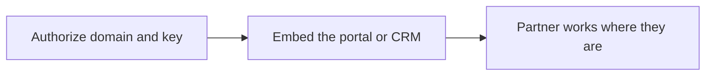
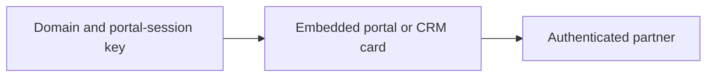
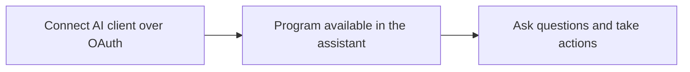

# Introw docs (docs.introw.io): features-developer

Verbatim from docs.introw.io/llms-full.txt, fetched 2026-09-29. 12 pages.

# Embed Introw in your CRM
Source: https://docs.introw.io/features/developer/embed/guides/embed-introw-in-your-crm

Meet partners on the record inside HubSpot and Salesforce with the Introw CRM embed - the canonical home for setting up partner context on CRM records.

The iframe embed on this feature puts the Introw portal inside *your* product. To put partner context inside *your CRM* instead, so your team and partners co-sell on the HubSpot or Salesforce record they already use, the setup lives in the CRM embed feature. That feature is the single, canonical home for the CRM embed, so this page points you there rather than duplicating the steps.

## What you'll achieve

Introw partner context (the partner connect card, shared deals, and collaboration) shown directly on your HubSpot and Salesforce records, set up from the CRM embed feature.

## Before you start

<Steps>
  <Step title="Confirm the embed is on your plan">
    Embedding the portal in your own product is a plan feature. If the Embed page shows an upgrade prompt, it is not on your plan yet - check what yours includes at [introw.io/pricing](https://introw.io/pricing).
  </Step>
</Steps>

## Where to set it up

<CardGroup>
  <Card title="CRM embed" icon="window-maximize" href="/features/integrations/crm">
    The canonical home: embed Introw in HubSpot and Salesforce, end to end.
  </Card>

  <Card title="Connect HubSpot" icon="book-open" href="/features/integrations/crm/guides/connect-hubspot">
    Connect HubSpot first, then add the embed.
  </Card>

  <Card title="Connect Salesforce" icon="book-open" href="/features/integrations/crm/guides/connect-salesforce">
    Connect Salesforce first, then add the embed.
  </Card>

  <Card title="Embed the partner portal" icon="code" href="./embed-the-partner-portal">
    Put the portal in your own product instead.
  </Card>
</CardGroup>

---

# Embed the partner portal
Source: https://docs.introw.io/features/developer/embed/guides/embed-the-partner-portal

Authorize a domain, create a portal-session key, and render the authenticated Introw partner portal inside your own product using an iframe embed.

Embedding the portal lets partners get the full Introw experience without leaving your app, which is the surest way to drive adoption. This guide walks the whole three-step embed setup: authorize the domains that may load the portal, create an API key scoped to portal sessions, and use the code samples to create an authenticated session and render the portal in an iframe. By the end, a logged-in user lands straight in the portal with no second sign-in.

## What you'll achieve

The partner portal embedded inside your product, loaded in an authenticated iframe so a user who is already signed in to your app opens directly into their portal, with no extra login. Only the domains you authorize can load it, and the session is minted server-side so your secret never reaches the browser.

## Before you start

<Steps>
  <Step title="Confirm embed is on your plan">
    Embedding the portal is a paid add-on and must be enabled on your plan.
  </Step>

  <Step title="Have the Integrations permission">
    You need the Integrations permission to manage the allowed domains.
  </Step>

  <Step title="Know your embedding domains">
    Gather every domain where your product runs (including subdomains) and have a backend you can run server-side code from.
  </Step>
</Steps>

## Watch it

<Tabs>
  <Tab title="Video">
    <video />
  </Tab>

  <Tab title="Click through">
    <iframe />
  </Tab>
</Tabs>

## Steps

<Steps>
  <Step title="Open the embed setup">
    Go to [Embed](https://app.introw.io/settings/developers/embed) under Developers and select **Configure** to open the embed setup. It walks through the three things needed to embed the portal: allowed domains, a portal-session key, and the integration code.

    <Frame>
      
    </Frame>
  </Step>

  <Step title="Allow the domains that can embed the portal">
    In **Allow your domains to embed Introw**, add each domain where your product runs (for example `app.yourcompany.com`) and select **Add domain**. The portal only loads inside an iframe on these domains, so anything not on the list is blocked, which is what stops other sites from framing your portal.

    * Add every domain and subdomain your product is served from; a domain that is missing here will show a blank or blocked frame.
    * Remove a domain from its row when it no longer needs access, so the allow-list stays tight.

    <Frame>
      
    </Frame>
  </Step>

  <Step title="Create a portal-session API key">
    Create a secret API key with the **Portal sessions** write permission. Your backend uses this key to mint authenticated portal session links (the next step), so it must stay server-side and never be exposed in the browser. Follow [Create and manage API keys](/features/developer/api/guides/create-and-manage-api-keys), granting only the portal sessions scope, and copy the secret when it is shown.

    <Frame>
      
    </Frame>
  </Step>

  <Step title="Integrate the code into your product">
    From your backend, create an authenticated session for the signed-in user by sending their email and your key to the session endpoint, then render the returned URL in an iframe. Pick the sample that matches your stack from the embed setup and drop it in.

    * **Session call** - send a `POST` to `https://api.introw.io/api/v1/auth/session` with the `x-api-key` header set to your portal-session key and a JSON body of `{ "email": "partner@example.com" }`. The response contains a `url` for that user's portal session.
    * **Keep the key on the server** - in browser frameworks, call the endpoint from your own backend route and proxy the result to the client; the key must never ship to the browser. In Next.js, set `INTROW_API_KEY` in your server environment variables.
    * **Render** - load the returned `url` in an `<iframe>` sized to your layout.

    <CodeGroup>
      ```jsx Next.js theme={"theme":{"light":"github-light","dark":"github-dark"}}
      export default async function Home() {
        const request = await fetch('https://api.introw.io/api/v1/auth/session', {
          body: JSON.stringify({ email: 'email@partner.com' }),
          headers: {
            'Content-Type': 'application/json',
            'x-api-key': process.env.INTROW_API_KEY,
          },
          method: 'POST',
        });
        const result = await request.json();
        return (
          <iframe src={result.url} className="h-full w-full" />
        );
      }
      ```

      ```jsx React theme={"theme":{"light":"github-light","dark":"github-dark"}}
      export default function IntrowEmbed() {
        const [iframeUrl, setIframeUrl] = useState('');

        useEffect(() => {
          fetch('/api/introw-session', {
            body: JSON.stringify({ email: 'email@partner.com' }),
            headers: { 'Content-Type': 'application/json' },
            method: 'POST',
          })
            .then(request => request.json())
            .then(result => setIframeUrl(result.url));
        }, []);

        if (!iframeUrl) return null;
        return <iframe src={iframeUrl} className="h-full w-full" />;
      }
      ```

      ```html Vanilla JS theme={"theme":{"light":"github-light","dark":"github-dark"}}
      <!-- Add this to your HTML -->
      <div id="introw-embed"></div>

      <script>
      // This browser code calls your backend /api/introw-session endpoint.
      // Keep INTROW_API_KEY on the server and proxy the session request from there.
      async function initIntrowEmbed() {
        const request = await fetch('/api/introw-session', {
          body: JSON.stringify({ email: 'email@partner.com' }),
          headers: { 'Content-Type': 'application/json' },
          method: 'POST',
        });
        const result = await request.json();

        const iframe = document.createElement('iframe');
        iframe.src = result.url;
        iframe.style.width = '100%';
        iframe.style.height = '100%';
        iframe.style.border = 'none';

        document.getElementById('introw-embed').appendChild(iframe);
      }

      initIntrowEmbed();
      </script>
      ```

      ```bash cURL theme={"theme":{"light":"github-light","dark":"github-dark"}}
      curl -X POST \
        'https://api.introw.io/api/v1/auth/session' \
        -H 'x-api-key: YOUR_INTROW_API_KEY' \
        -H 'Content-Type: application/json' \
        -d '{"email":"email@partner.com"}'
      ```
    </CodeGroup>
  </Step>
</Steps>

## Verify it worked

A logged-in user opens your product and lands directly in the embedded portal with no second sign-in, on a domain you authorized. The session call returns a `url`, and the iframe renders the portal. On a domain that is not on the allow-list, the frame is blocked, which confirms the allow-list is doing its job.

## Related

<CardGroup>
  <Card title="Create and manage API keys" icon="key" href="/features/developer/api/guides/create-and-manage-api-keys">
    Create the portal sessions key this flow needs.
  </Card>

  <Card title="Embed Introw in your CRM" icon="window-maximize" href="./embed-introw-in-your-crm">
    Meet partners inside HubSpot and Salesforce instead.
  </Card>

  <Card title="Implementation reference" icon="screwdriver-wrench" href="../technical">
    Embed settings, limits, and troubleshooting.
  </Card>

  <Card title="Embed overview" icon="code" href="/general/embed-overview">
    The session endpoint and iframe pattern.
  </Card>
</CardGroup>

---

# Embed
Source: https://docs.introw.io/features/developer/embed/index

Bring the partner experience to where partners already are - embed the portal in your product via iframe, or meet partners on HubSpot and Salesforce.

> Partners adopt what is in front of them. Embed lets you put Introw where partners already work: inside your own product through an iframe, or directly on the record in HubSpot and Salesforce, so partnerships happen without a separate destination.

## The problem it solves

A standalone portal is one more place people have to remember to visit:

<Pains>
  | Without Introw                     | With Introw                       |
  | ---------------------------------- | --------------------------------- |
  | Partners will not adopt a new tool | Embed it in the one they use      |
  | Reps want context on the record    | CRM embeds put it there           |
  | A bare iframe is not secure        | An allow-list and signed sessions |
  | An integrated build takes months   | A guided setup and one endpoint   |
</Pains>

## Impact

Adoption is decided by where something lives, not by how good it is. Putting the portal inside the product or the CRM a partner already opens is the cheapest adoption you will ever buy.

<Impact>
  for your business

  * **No new tool**
    Partners use Introw inside the product or the CRM record they already know, so nothing new has to be learned
  * **Fits together**
    Embed is one block you place into your own surface, rather than a destination you have to send people to
  * **Live in days**
    An iframe and a session endpoint, so an embedded portal ships in minutes with minimal glue code

  for your partners

  * **Self-serve**
    They land in the portal already signed in, from a product they were already logged into
  * **Enabled**
    Partner context sits on the deal in HubSpot or Salesforce, where their conversation is happening
  * **Efficient**
    No second login, no second tab, and no second place to remember to check

  [A day in the life of your partners](/days-in-the-life)
</Impact>

<Personas>
  * **Developers** - the portal inside your product
  * **CRM Administrators** - Introw on the record
  * **Partners** - no new destination to learn
</Personas>

## See it work

<Tour>
  * 

    **Open the setup**

    Portal embedding is configured in one place.

  * 

    **Allow your domains**

    Only the domains you list can embed the portal.

  * 

    **Create a session key**

    A portal-session key signs each user straight in.
</Tour>

## How it works

Embed comes in two forms. Portal embed lets you load the partner portal inside your own product through
an iframe: you authorize the domains allowed to embed it, create a key for portal sessions, and generate
an authenticated session so a logged-in user lands straight in the portal. CRM embed brings Introw onto
the record in HubSpot and Salesforce, so your team and partners see partner context where they already
sell.

Both keep partners in a familiar surface instead of asking them to learn a new tool, which is what
actually drives adoption.

Authorize your domains, create a portal-session key, and embed the portal in your product, or connect
your CRM to surface Introw on the record. Partners stay where they already work, and adoption follows.



## Going deeper

<CardGroup>
  <Card title="How to" icon="screwdriver-wrench" href="./technical">
    Setup, configuration, and all how-to guides.
  </Card>

  <Card title="API reference" icon="code" href="/general/embed-overview">
    The embed session endpoint and code.
  </Card>
</CardGroup>

**Works with**

<CardGroup>
  <Card title="API Keys & REST API" icon="code" href="/features/developer/api">
    Pairs embeds with API data.
  </Card>

  <Card title="CRM" icon="plug" href="/features/integrations/crm">
    Embed Introw inside the CRM.
  </Card>

  <Card title="Experiences" icon="browser" href="/features/portal/experiences">
    Embed a portal experience anywhere.
  </Card>
</CardGroup>

---

# Embed
Source: https://docs.introw.io/features/developer/embed/technical/index

Embed the partner portal in your product with an allow-list and authenticated sessions, and set up CRM embeds for HubSpot and Salesforce in Introw.

## Where it lives

Embed sits under **Settings**, at [Embed](https://app.introw.io/settings/developers/embed).

<Frame>
  
</Frame>

## Before you start

| You need                        | Why                             | Fix it                                                                            |
| ------------------------------- | ------------------------------- | --------------------------------------------------------------------------------- |
| Integrations permission         | Embed domains are managed there | [Internal roles](/features/access/team-management/guides/create-an-internal-role) |
| Embedding enabled on your plan  | It is a paid add-on             | **Request access**                                                                |
| A connected CRM, for CRM embeds | Only for the in-CRM embed       | [Connect a CRM](/features/integrations/crm/guides/connect-hubspot)                |

## How it works

Portal embed is configured on the Embed page under Developers, through a short setup. First you authorize
the domains allowed to load the portal in an iframe. Then you create an API key with the portal sessions
permission. Finally you use the provided code samples to create an authenticated session for a
logged-in user and render the portal in your product.

CRM embed is set up from your CRM integration: once HubSpot or Salesforce is connected, partner context
appears on the relevant records through the Introw CRM app, so partners and your team work on the record
rather than in a separate portal.



## Settings & configuration

Portal embed is configured at [Embed](https://app.introw.io/settings/developers/embed); CRM embeds are
set up from [Integrations](https://app.introw.io/settings/integrations).

### Allowed domains

In the embed setup, **Allow your domains to embed Introw** is where you list the domains permitted to
load the portal in an iframe. Add each domain where your product runs; the portal only loads inside these.

### Portal session key

The setup links you to create an API key with the portal sessions permission. This key is used by your
backend to create an authenticated session so a user opens directly into the portal.

### Integration code

The setup provides code samples for common frameworks, including Next.js, React, and plain JavaScript,
showing how to create a session and render the iframe. Copy the sample that matches your stack.

### CRM embeds

With HubSpot or Salesforce connected, Introw surfaces partner context on the record through its CRM app.
Set up and configure the connection from your CRM integration; partners then engage from the CRM.

## How-to guides

<Rail>
  * [**Embed Introw in your CRM**](/features/developer/embed/guides/embed-introw-in-your-crm)

    Meet partners on the record inside HubSpot and Salesforce with the Introw CRM embed - the canonical home for setting up partner context on CRM records.

  * 

    [**Embed the partner portal**](/features/developer/embed/guides/embed-the-partner-portal)

    Authorize a domain, create a portal-session key, and render the authenticated Introw partner portal inside your own product using an iframe embed.
</Rail>

## Troubleshooting

<Warning>
  Embedding the portal is a paid add-on and must be enabled on your plan. The portal only loads inside the domains you have authorized, so add every domain your product uses. Authenticated sessions are created server-side with a portal sessions key; never expose that key in the browser.
</Warning>

<AccordionGroup>
  <Accordion title="The portal will not load in the iframe">
    Confirm the embedding domain is on the allow-list.
  </Accordion>

  <Accordion title="Users see a login screen instead of the portal">
    Your backend must create an authenticated session for them.
  </Accordion>

  <Accordion title="CRM context is missing on the record">
    Confirm the CRM integration is connected and configured.
  </Accordion>
</AccordionGroup>

## API reference

<CardGroup>
  <Card title="Embed overview" icon="window-maximize" href="/general/embed-overview">
    The session endpoint and iframe pattern.
  </Card>

  <Card title="API reference" icon="code" href="/general/introduction">
    Endpoints and code.
  </Card>
</CardGroup>

---

# Developer Platform
Source: https://docs.introw.io/features/developer/index

Build on and embed Introw - a REST API with scoped keys, portal and CRM embeds, and an MCP server that exposes your partner program to Claude and ChatGPT.

> Introw is building blocks, not a monolith. Use the API to read and write program data, embed the portal in your product or your CRM, and connect AI clients over MCP, so partnerships fit into the stack and the surfaces you already run.

## The problem it solves

<Pains>
  | Without Introw                      | With Introw                    |
  | ----------------------------------- | ------------------------------ |
  | You get a monolith, not pieces      | API, embed and MCP, separately |
  | Partners will not adopt a new tool  | Put it inside the one they use |
  | An integration means a custom build | A documented REST API and keys |
  | AI cannot reach your program        | An OAuth-protected MCP server  |
</Pains>

## Impact

The surface a partner will actually use is the one they already have open. Being able to put your program inside it is what separates a program partners use from one they were merely given.

<Impact>
  for your business

  * **Fits together**
    API, embed and MCP are separate building blocks, so you adopt the one surface you need instead of the whole platform
  * **No new tool**
    Embeds and MCP put partnerships inside your product, your CRM and your assistant, where the work already happens
  * **Live in days**
    An iframe or a documented REST call, with minimal glue code, so an integration ships without a project

  for your partners

  * **Self-serve**
    The portal can live inside a product they already log into, so there is no second destination
  * **Enabled**
    Partner MCP gives their own assistant access to their own deals, commissions and submissions
  * **Efficient**
    Partner context sits on the CRM record their reps already have open

  [A day in the life of your partners](/days-in-the-life)
</Impact>

<Personas>
  * **Developers** - building blocks, not a platform
  * **RevOps** - Introw wired into the stack
  * **CRM Administrators** - partner context on the record
</Personas>

## How this area works

The Developer Platform exposes Introw as composable pieces. The public REST API lets you read and write partners, commissions, and payouts with scoped API keys. Embed lets you drop the partner portal into your own product through an iframe, or meet partners inside HubSpot and Salesforce with CRM embeds. MCP exposes your program to AI clients over an OAuth-protected server, so assistants like Claude, ChatGPT, and Cursor can work with your partner data on your behalf.

Three building blocks take Introw into your product, CRM, and AI tools.

**Where this sits in a setup.** None of the [setup tracks](/tracks) need any of it to go live. This is the surface you reach for once the program works and you want it inside your own systems.

<Rail>
  * 

    [**API Keys & REST API**](./api)

    Read and write program data with scoped keys.

    [How to · 2 guides](./api/technical)

  * 

    [**Embed**](./embed)

    Put the portal in your product, or on the CRM record.

    [How to · 2 guides](./embed/technical)

  * 

    [**MCP**](./mcp)

    Connect Claude, ChatGPT or Cursor to your program.

    [How to · 5 guides](./mcp/technical)
</Rail>

Each capability is a way to take Introw beyond its own surfaces, into your product, your CRM, and your AI tools, while the CRM stays the source of truth.

Three building blocks take Introw into your product, CRM, and AI tools.

## Run it from your AI assistant

<Headless>
  * Connect an assistant over MCP and ask which partners are at risk.
  * Register a deal or prepare a QBR from Claude.
  * Give partners their own scoped AI assistant.
</Headless>

---

# Connect an MCP client
Source: https://docs.introw.io/features/developer/mcp/guides/connect-an-mcp-client

Connect a major MCP client - Cursor, Gemini, Windsurf, Notion AI, Lovable, Langdock, Zapier, and more - to Introw with the generic MCP connector.

Beyond the dedicated Claude and ChatGPT connectors, the major MCP clients connect to Introw with the generic MCP connector: Cursor, Gemini, Windsurf, Notion AI, Lovable, Langdock, and Zapier. This is the canonical guide for all of them, the setup is the same in Introw (copy one server URL), and the per-client section below covers where each tool adds a remote MCP server. The connection uses the same secure OAuth sign-in and acts only within your own access.

<Note>
  Only known AI clients can register with Introw: Claude, ChatGPT, Cursor, Windsurf, Notion AI, Lovable, Langdock, Gemini, Zapier, and desktop clients that sign in on a local address. A hosted client that is not on that list is refused at sign-in. If you need another client, ask your Introw contact.
</Note>

## Why connect&#x20;

The fastest interface to your partner program is the assistant you already use. Once  is
connected to Introw over MCP, your program becomes something you query and act on in plain language -
no extra tab, no portal hunt. The work stays where you already are, every answer is read live from your
CRM source of truth, and  acts only within your own access.

<CardGroup>
  <Card title="Stay where you already work" icon="share-nodes">
    Ask questions and take action inside , under the same rules as your portal, so you never break focus to switch tools.
  </Card>

  <Card title="Let the agent do the busywork" icon="robot">
    Hand the mechanical work - data pulls, follow-ups, drafting - to , and stay in the loop where judgment matters.
  </Card>

  <Card title="Answers you can trust" icon="arrows-rotate">
    Every answer is read live from your CRM source of truth, so attribution and numbers stay accurate and auditable.
  </Card>

  <Card title="One secure, scoped connection" icon="shield-halved">
    Connect once over OAuth.  acts only within your own access, and you can disconnect at any time.
  </Card>
</CardGroup>

## What you can do from&#x20;

Connecting  turns these agentic use cases into something you run conversationally, in seconds,
without leaving the assistant.

<CardGroup>
  <Card title="Prep a QBR in seconds" icon="presentation-screen" href="/headless/agentic-use-cases/qbrs-meeting-prep">
    Ask  to assemble pipeline, goals, activity, and commissions into a ready-to-edit QBR - 2-4 hours of prep collapsed into \~10 seconds.
  </Card>

  <Card title="Register a deal conversationally" icon="file-signature" href="/headless/agentic-use-cases/deal-registration">
    Register a deal in about 90 seconds straight from , with clean writeback to your CRM.
  </Card>

  <Card title="Query ecosystem health" icon="chart-line" href="/headless/agentic-use-cases/ecosystem-performance">
    Ask "which Gold partners are at risk?" in plain language and get the answer in seconds - no RevOps ticket.
  </Card>

  <Card title="Check commissions and tiers" icon="hand-holding-dollar" href="/headless/agentic-use-cases/commissions-and-incentives">
    Look up commission status, tier progress, and projections on demand, without a finance request.
  </Card>

  <Card title="Answer enablement questions" icon="headset" href="/headless/agentic-use-cases/enablement-support">
    Get instant, sourced answers to routine partner and program questions, 24/7 and in any language.
  </Card>

  <Card title="Segment partners live" icon="layer-group" href="/headless/agentic-use-cases/partner-segmentation">
    Build live, multi-axis segments on the fly instead of static Gold, Silver, and Bronze tiers.
  </Card>
</CardGroup>

## Prompts to try in&#x20;

Once connected, paste one of these into  to see it work against your own program:

* "Which Gold partners haven't registered a deal this quarter?"
* "Prepare a QBR for my top partner - pipeline, goals, activity, and commissions."
* "Register a new deal for Acme: \~\$40k, closing next month, sourced by our reseller."
* "What's this partner's commission status and how far are they from the next tier?"

## What you'll achieve

Your MCP-capable client connected to your Introw partner program over OAuth, authenticated as you. The client can read live program data from your CRM source of truth and take the actions your access allows, and the connector page shows the connection as active.

## Before you start

<Steps>
  <Step title="No add-on needed">
    Connecting an MCP client is included on every plan. There is no MCP add-on to buy for it.
  </Step>

  <Step title="Have a client that supports remote MCP servers">
    Use a client that can add a custom or remote MCP server over OAuth.
  </Step>

  <Step title="Be signed in to Introw">
    Complete the OAuth step while signed in to Introw so the client connects as you.
  </Step>
</Steps>

## Watch it

<Tabs>
  <Tab title="Video">
    <video />
  </Tab>

  <Tab title="Click through">
    <iframe />
  </Tab>
</Tabs>

## Steps

<Steps>
  <Step title="Open the MCP connector">
    Go to the [MCP connector](https://app.introw.io/settings/integrations/mcp) under Integrations. This generic connector works with any MCP-compatible tool and shows the connection status and quick-setup steps.

    <Frame>
      
    </Frame>
  </Step>

  <Step title="Copy the MCP Server URL">
    Select **Copy MCP Server URL**. This single address is what every MCP client connects to; copy it from the page rather than typing it.

    <Frame>
      
    </Frame>
  </Step>

  <Step title="Add Introw as a remote MCP server in your client">
    In your client, add a remote (or custom) MCP server and paste the **MCP Server URL** you copied. The exact place this lives differs per client, see the per-client notes below. This points the client at your program.
  </Step>

  <Step title="Complete the OAuth sign-in">
    The client opens an Introw sign-in to authorize the connection. Complete it while signed in to Introw so the client connects as you, scoped to your own access. There is no API key or secret to paste.
  </Step>
</Steps>

## Connect a specific client

The Introw side is identical for every client: copy the **MCP Server URL** above. What differs is where each tool adds a remote MCP server. After adding the URL in any of these, complete the OAuth sign-in to finish.

### Cursor

Add Introw as a custom MCP server in Cursor's MCP settings, paste the **MCP Server URL**, then complete the OAuth sign-in.

### Gemini

In Gemini, add Introw as a remote MCP server using the **MCP Server URL**, then complete the OAuth sign-in.

### Windsurf

In Windsurf, add Introw as a remote MCP server using the **MCP Server URL**, then complete the OAuth sign-in.

### Notion AI

In Notion AI, add Introw as a remote MCP server using the **MCP Server URL**, then complete the OAuth sign-in.

### Lovable

In Lovable, add Introw as a remote MCP server using the **MCP Server URL**, then complete the OAuth sign-in.

### Langdock

In Langdock, add Introw as a remote MCP server using the **MCP Server URL**, then complete the OAuth sign-in.

### Zapier

In Zapier, add a connection for **MCP Client by Zapier**, paste the **MCP Server URL** as the server URL, answer **Yes** when Zapier asks whether the server requires OAuth, then complete the OAuth sign-in. Introw's tools are then available as Zap actions.

## Verify it worked

The MCP connector page shows **Connection is active**, and your client can use Introw's tools, asking it about your program returns live data. To revoke access later, select **Disconnect** on the connector page; the client loses access immediately and must reconnect.

## Related

<CardGroup>
  <Card title="Connect Claude" icon="book-open" href="./connect-claude">
    Use the dedicated Claude connector.
  </Card>

  <Card title="Connect ChatGPT" icon="book-open" href="./connect-chatgpt">
    Use the dedicated ChatGPT connector.
  </Card>

  <Card title="Implementation reference" icon="screwdriver-wrench" href="../technical">
    MCP connectors, scoping, and troubleshooting.
  </Card>
</CardGroup>

---

# Connect ChatGPT
Source: https://docs.introw.io/features/developer/mcp/guides/connect-chatgpt

Connect ChatGPT to Introw over the MCP protocol so you can query partner data and take action on your partner program from inside ChatGPT conversations.

Connecting ChatGPT to Introw brings your partner program into the assistant you already use, so you can ask about partners and commissions and take quick actions without switching tools. Introw is published in the ChatGPT plugin directory, so connecting is one install on the listing plus a one-time OAuth sign-in: there is no MCP server URL to copy and paste. Once connected, ChatGPT reads live data from your CRM source of truth and acts only within your own access, and you can disconnect at any time.

## Why connect&#x20;

The fastest interface to your partner program is the assistant you already use. Once  is
connected to Introw over MCP, your program becomes something you query and act on in plain language -
no extra tab, no portal hunt. The work stays where you already are, every answer is read live from your
CRM source of truth, and  acts only within your own access.

<CardGroup>
  <Card title="Stay where you already work" icon="share-nodes">
    Ask questions and take action inside , under the same rules as your portal, so you never break focus to switch tools.
  </Card>

  <Card title="Let the agent do the busywork" icon="robot">
    Hand the mechanical work - data pulls, follow-ups, drafting - to , and stay in the loop where judgment matters.
  </Card>

  <Card title="Answers you can trust" icon="arrows-rotate">
    Every answer is read live from your CRM source of truth, so attribution and numbers stay accurate and auditable.
  </Card>

  <Card title="One secure, scoped connection" icon="shield-halved">
    Connect once over OAuth.  acts only within your own access, and you can disconnect at any time.
  </Card>
</CardGroup>

## What you can do from&#x20;

Connecting  turns these agentic use cases into something you run conversationally, in seconds,
without leaving the assistant.

<CardGroup>
  <Card title="Prep a QBR in seconds" icon="presentation-screen" href="/headless/agentic-use-cases/qbrs-meeting-prep">
    Ask  to assemble pipeline, goals, activity, and commissions into a ready-to-edit QBR - 2-4 hours of prep collapsed into \~10 seconds.
  </Card>

  <Card title="Register a deal conversationally" icon="file-signature" href="/headless/agentic-use-cases/deal-registration">
    Register a deal in about 90 seconds straight from , with clean writeback to your CRM.
  </Card>

  <Card title="Query ecosystem health" icon="chart-line" href="/headless/agentic-use-cases/ecosystem-performance">
    Ask "which Gold partners are at risk?" in plain language and get the answer in seconds - no RevOps ticket.
  </Card>

  <Card title="Check commissions and tiers" icon="hand-holding-dollar" href="/headless/agentic-use-cases/commissions-and-incentives">
    Look up commission status, tier progress, and projections on demand, without a finance request.
  </Card>

  <Card title="Answer enablement questions" icon="headset" href="/headless/agentic-use-cases/enablement-support">
    Get instant, sourced answers to routine partner and program questions, 24/7 and in any language.
  </Card>

  <Card title="Segment partners live" icon="layer-group" href="/headless/agentic-use-cases/partner-segmentation">
    Build live, multi-axis segments on the fly instead of static Gold, Silver, and Bronze tiers.
  </Card>
</CardGroup>

## Prompts to try in&#x20;

Once connected, paste one of these into  to see it work against your own program:

* "Which Gold partners haven't registered a deal this quarter?"
* "Prepare a QBR for my top partner - pipeline, goals, activity, and commissions."
* "Register a new deal for Acme: \~\$40k, closing next month, sourced by our reseller."
* "What's this partner's commission status and how far are they from the next tier?"

## What you'll achieve

ChatGPT connected to your Introw partner program over MCP, authenticated as you, installed from Introw's directory listing rather than as an anonymous custom endpoint. ChatGPT can read your program data and take the actions your access allows, and the connector page shows the connection as active.

## Before you start

<Steps>
  <Step title="No add-on needed">
    Connecting an MCP client is included on every plan. There is no MCP add-on to buy for it.
  </Step>

  <Step title="Have a ChatGPT plan that supports plugins">
    Use a ChatGPT plan that can install plugins from the directory. In a workspace, installing may be restricted to workspace admins.
  </Step>

  <Step title="Be signed in to Introw">
    The ChatGPT connector is available on all plans. Complete the OAuth step while signed in to Introw so ChatGPT connects as you.
  </Step>
</Steps>

## Watch it

<Tabs>
  <Tab title="Video">
    <video />
  </Tab>

  <Tab title="Click through">
    <iframe />
  </Tab>
</Tabs>

## Steps

<Steps>
  <Step title="Open the ChatGPT connector">
    Go to the [ChatGPT connector](https://app.introw.io/settings/integrations/chatgpt) under Integrations. The page shows the connection status, carries the **Install in ChatGPT** button, and is where you confirm the connection once it is live.

    <Frame>
      
    </Frame>
  </Step>

  <Step title="Open the Introw listing in ChatGPT">
    Select **Install in ChatGPT**, which opens Introw's [listing in the ChatGPT plugin directory](https://chatgpt.com/plugins/plugin_asdk_app_69f48b88c8e081918d23136b35a0b9eb). The listing already points at Introw's MCP server, so there is nothing to copy or configure.

    <Frame>
      
    </Frame>
  </Step>

  <Step title="Select Install plugin">
    On the listing, select **Install plugin**. ChatGPT adds Introw by name, with its description and tools, and keeps it up to date from the listing.

    <Frame>
      
    </Frame>
  </Step>

  <Step title="Complete the OAuth sign-in">
    ChatGPT opens an Introw sign-in to authorize the connection. Complete it while signed in to Introw so ChatGPT connects as you, scoped to your own access. There is no API key or secret to paste.

    <Frame>
      
    </Frame>
  </Step>
</Steps>

## Add Introw by hand instead

If you are wiring up a client other than ChatGPT, or a setup where you add the endpoint yourself, select **Copy MCP Server URL** on the [ChatGPT connector](https://app.introw.io/settings/integrations/chatgpt) page and paste it wherever the client asks for a remote MCP server. The OAuth sign-in and the resulting access are identical either way.

## Verify it worked

The ChatGPT connector page shows **Connection is active**, and asking ChatGPT a question about your program returns live data. Introw PRM appears as the source on the answer, so you can see the data came from your program and not from the model.

<Frame>
  
</Frame>

To revoke access later, select **Disconnect** on the connector page; ChatGPT loses access immediately and must reconnect.

## Related

<CardGroup>
  <Card title="Connect Claude" icon="book-open" href="./connect-claude">
    Do the same for Claude.
  </Card>

  <Card title="Connect an MCP client" icon="book-open" href="./connect-an-mcp-client">
    Connect Cursor, Gemini, Notion, and other clients.
  </Card>

  <Card title="Implementation reference" icon="screwdriver-wrench" href="../technical">
    MCP connectors, scoping, and troubleshooting.
  </Card>
</CardGroup>

---

# Connect Claude
Source: https://docs.introw.io/features/developer/mcp/guides/connect-claude

Connect Claude to Introw over MCP so you can query partners, deals, and program data and take action on your partner program from inside Claude.

Connecting Claude to Introw lets you ask about partners, commissions, and goals, and take quick actions, right inside Claude. Introw is published in Claude's connector directory, so connecting is one click on the listing plus a one-time OAuth sign-in: there is no MCP server URL to copy and paste. Once it is set up your partner program becomes something you query conversationally instead of opening the app. The connection acts only within your own access and can be disconnected at any time.

## Why connect&#x20;

The fastest interface to your partner program is the assistant you already use. Once  is
connected to Introw over MCP, your program becomes something you query and act on in plain language -
no extra tab, no portal hunt. The work stays where you already are, every answer is read live from your
CRM source of truth, and  acts only within your own access.

<CardGroup>
  <Card title="Stay where you already work" icon="share-nodes">
    Ask questions and take action inside , under the same rules as your portal, so you never break focus to switch tools.
  </Card>

  <Card title="Let the agent do the busywork" icon="robot">
    Hand the mechanical work - data pulls, follow-ups, drafting - to , and stay in the loop where judgment matters.
  </Card>

  <Card title="Answers you can trust" icon="arrows-rotate">
    Every answer is read live from your CRM source of truth, so attribution and numbers stay accurate and auditable.
  </Card>

  <Card title="One secure, scoped connection" icon="shield-halved">
    Connect once over OAuth.  acts only within your own access, and you can disconnect at any time.
  </Card>
</CardGroup>

## What you can do from&#x20;

Connecting  turns these agentic use cases into something you run conversationally, in seconds,
without leaving the assistant.

<CardGroup>
  <Card title="Prep a QBR in seconds" icon="presentation-screen" href="/headless/agentic-use-cases/qbrs-meeting-prep">
    Ask  to assemble pipeline, goals, activity, and commissions into a ready-to-edit QBR - 2-4 hours of prep collapsed into \~10 seconds.
  </Card>

  <Card title="Register a deal conversationally" icon="file-signature" href="/headless/agentic-use-cases/deal-registration">
    Register a deal in about 90 seconds straight from , with clean writeback to your CRM.
  </Card>

  <Card title="Query ecosystem health" icon="chart-line" href="/headless/agentic-use-cases/ecosystem-performance">
    Ask "which Gold partners are at risk?" in plain language and get the answer in seconds - no RevOps ticket.
  </Card>

  <Card title="Check commissions and tiers" icon="hand-holding-dollar" href="/headless/agentic-use-cases/commissions-and-incentives">
    Look up commission status, tier progress, and projections on demand, without a finance request.
  </Card>

  <Card title="Answer enablement questions" icon="headset" href="/headless/agentic-use-cases/enablement-support">
    Get instant, sourced answers to routine partner and program questions, 24/7 and in any language.
  </Card>

  <Card title="Segment partners live" icon="layer-group" href="/headless/agentic-use-cases/partner-segmentation">
    Build live, multi-axis segments on the fly instead of static Gold, Silver, and Bronze tiers.
  </Card>
</CardGroup>

## Prompts to try in&#x20;

Once connected, paste one of these into  to see it work against your own program:

* "Which Gold partners haven't registered a deal this quarter?"
* "Prepare a QBR for my top partner - pipeline, goals, activity, and commissions."
* "Register a new deal for Acme: \~\$40k, closing next month, sourced by our reseller."
* "What's this partner's commission status and how far are they from the next tier?"

## What you'll achieve

Claude connected to your Introw partner program over MCP, authenticated as you, added from Introw's directory listing rather than as an anonymous custom endpoint. Claude can read live program data from your CRM source of truth and take the actions your access allows, and the connector page shows the connection as active.

## Before you start

<Steps>
  <Step title="No add-on needed">
    Connecting an MCP client is included on every plan. There is no MCP add-on to buy for it.
  </Step>

  <Step title="Have a Claude plan that supports connectors">
    Use a Claude client that supports connectors. On Claude Team, members who cannot enable connectors themselves see **Request** on the listing instead of **Connect**, which sends it to a workspace admin to enable.
  </Step>

  <Step title="Be signed in to Introw">
    The Claude connector is available on all plans. Complete the OAuth step while signed in to Introw so Claude connects as you.
  </Step>
</Steps>

## Watch it

<Tabs>
  <Tab title="Video">
    <video />
  </Tab>

  <Tab title="Click through">
    <iframe />
  </Tab>
</Tabs>

## Steps

<Steps>
  <Step title="Open the Claude connector">
    Go to the [Claude connector](https://app.introw.io/settings/integrations/claude) under Integrations. The page shows the connection status, carries the **Connect in Claude** button, and is where you confirm the connection once it is live.

    <Frame>
      
    </Frame>
  </Step>

  <Step title="Open the Introw listing in Claude">
    Select **Connect in Claude**, which opens Introw's [listing in Claude's connector directory](https://claude.ai/directory/introw-prm). The listing already points at Introw's MCP server, so there is nothing to copy or configure.

    <Frame>
      
    </Frame>
  </Step>

  <Step title="Select Connect on the listing">
    On the listing, select **Connect**. Because Introw is a directory connector, Claude shows it by name with its description and tools, and keeps it up to date from the listing.

    <Frame>
      
    </Frame>
  </Step>

  <Step title="Complete the OAuth sign-in">
    Claude opens an Introw sign-in to authorize the connection. Complete it while signed in to Introw so Claude connects as you, scoped to your own access. This is the step that links your account, no API key or secret to paste.
  </Step>
</Steps>

## Add Introw by hand instead

Some setups do not go through the directory: an MCP client other than Claude, or a workspace where you add the endpoint yourself. On the [Claude connector](https://app.introw.io/settings/integrations/claude) page, select **Copy MCP Server URL**, then in Claude open **Customize**, **Connectors**, add a custom connector, and paste the URL. The OAuth sign-in and the resulting access are identical either way.

## Verify it worked

The Claude connector page shows **Connection is active**, and asking Claude a question about your program (for example "Which Gold partners haven't registered a deal this quarter?") returns live data, with Claude naming Introw as the integration it used.

<Frame>
  
</Frame>

To revoke access later, select **Disconnect** on the connector page; Claude loses access immediately and must reconnect.

## Related

<CardGroup>
  <Card title="Connect ChatGPT" icon="book-open" href="./connect-chatgpt">
    Do the same for ChatGPT.
  </Card>

  <Card title="Connect an MCP client" icon="book-open" href="./connect-an-mcp-client">
    Connect Cursor, Gemini, Notion, and other clients.
  </Card>

  <Card title="Implementation reference" icon="screwdriver-wrench" href="../technical">
    MCP connectors, scoping, and troubleshooting.
  </Card>
</CardGroup>

---

# Partner MCP use cases
Source: https://docs.introw.io/features/developer/mcp/guides/explore-partner-mcp-use-cases

What partners can do once they connect their own AI assistant (Claude, ChatGPT, Cursor) to the partner MCP - use cases and how to drive adoption.

Once a partner connects their AI client to the partner MCP, they can ask about and act on their own program data in plain language, everything scoped to what their account can see. Knowing the common use cases helps you explain the value and drive adoption, so partners actually turn it on. These map to the real tools the partner MCP exposes, so each one works the moment a partner connects.

## What you'll achieve

A clear picture of the jobs partners get done from their own assistant, so you can pitch the partner MCP in onboarding, QBRs, and enablement, and partners self-connect and use it.

## Before you start

<Steps>
  <Step title="No add-on needed">
    Connecting an MCP client is included on every plan. There is no MCP add-on to buy for it.
  </Step>

  <Step title="Make sure partners can self-connect">
    Partners connect the assistant themselves from their portal, no vendor toggle needed. See [Give partners their own AI assistant](./give-partners-their-own-ai-assistant) for the steps to share.
  </Step>
</Steps>

## Steps

<Steps>
  <Step title="Check their pipeline">
    A partner asks their assistant about their open and registered deals, including stage, amount, and recent activity, without opening the portal.
  </Step>

  <Step title="Track their earnings">
    A partner asks about their commission status, what they have earned, and upcoming payouts, so they can self-serve finance questions.
  </Step>

  <Step title="Register a deal or share a lead">
    A partner submits a deal registration or shared lead through their assistant; the assistant discovers the right form, collects the fields, and submits it, scoped to their account.
  </Step>

  <Step title="Update a record or add a comment">
    A partner updates an editable field on one of their deals or posts a comment, and the change flows back through Introw the same as if they had done it in the portal.
  </Step>

  <Step title="Get answers">
    A partner asks program and enablement questions and gets sourced answers in plain language, in any language, without logging in.
  </Step>
</Steps>

## Verify it worked

A partner completes one of these jobs through their own AI client and sees the result reflected in their portal (a registered deal, an updated field, a posted comment), confirming the assistant is acting within their access.

## Related

<CardGroup>
  <Card title="Partner AI assistant" icon="book-open" href="./give-partners-their-own-ai-assistant">
    The steps partners follow to connect.
  </Card>

  <Card title="Partner support agent" icon="book-open" href="/features/ai/partner-support">
    The in-portal AI assistant.
  </Card>

  <Card title="Implementation reference" icon="screwdriver-wrench" href="../technical">
    MCP connectors and how the server is scoped.
  </Card>
</CardGroup>

---

# Give partners their own AI assistant
Source: https://docs.introw.io/features/developer/mcp/guides/give-partners-their-own-ai-assistant

Partners connect their own AI client to the partner MCP from their portal and work with only their own scoped data - no vendor setup required.

Partners can connect their own AI client to Introw and work with their own data: their deals, tasks, commissions, and submissions, all scoped to what their partner account is allowed to see. There is nothing for you to switch on as the vendor: the partner connector lives in the partner's own Introw account at **[partners.introw.io](https://partners.introw.io)**, separate from your admin connectors, and partners connect it themselves. Your job is simply to point partners there. The steps below are the ones a partner follows, so you can share them as-is.

<Note>
  partners.introw\.io is the partner's own account, not your portal, and it spans every vendor they work with. One connection there covers all of them, so a partner who already connected for another vendor is already connected to you. See [Get started as a partner](/features/partner-connect/partner-crm/guides/get-started-at-partners-introw-io).
</Note>

## What you'll achieve

A partner connects their own AI assistant to their partner portal and can query and act on only their own scoped data in plain language, without logging into the portal for routine questions. Because the partner connector is separate from your internal MCP connectors, it never exposes anything beyond that partner's access.

## Before you start

<Steps>
  <Step title="No add-on needed">
    Connecting an MCP client is included on every plan. There is no MCP add-on to buy for it.
  </Step>

  <Step title="No vendor toggle is needed">
    The partner connector is available to partners by default. You do not enable a partner MCP from your admin settings; partners self-connect.
  </Step>

  <Step title="The partner needs an account at partners.introw.io">
    That is where the Integrations page lives. Signing up takes a minute with Google, Microsoft, or an emailed verification code, costs the partner nothing, and needs no admin rights on their side.
  </Step>

  <Step title="The partner needs access to your experience">
    Your portal only appears for them once you have invited their email address or allowed their email domain, which is also what scopes everything the assistant can reach.
  </Step>

  <Step title="The partner has a compatible AI client">
    The partner uses an AI client that supports custom MCP connectors (for example Claude).
  </Step>
</Steps>

## Steps

<Steps>
  <Step title="Open Integrations at partners.introw.io">
    As the partner, sign in at [partners.introw.io](https://partners.introw.io), go to **Settings**, then [Integrations](https://partners.introw.io/integrations), and open the **MCP** category. Find the **Claude** card and select **Configure**. This connector only exposes the vendor portals available to your partner account.
  </Step>

  <Step title="Copy the MCP Server URL">
    On the connector page, select **Copy MCP Server URL**. This partner connector is separate from the vendor's admin connector, so use the URL shown here, not one from anywhere else.
  </Step>

  <Step title="Add Introw in your AI client">
    In Claude, open **Customize**, then **Connectors**, and add an **Introw** custom connector using the **MCP Server URL** you copied. This points your assistant at your partner portal data.
  </Step>

  <Step title="Complete the OAuth sign-in">
    Authorize the connection through the Introw sign-in so the assistant connects as you. Access is scoped to your partner account, so the assistant can only see and act on data your account already has.
  </Step>
</Steps>

## Verify it worked

The partner's connector page shows **Connection is active**, and the partner can ask their assistant about their own pipeline, commissions, or tasks and get live answers, without anything appearing that is outside their access. The partner can select **Disconnect** to revoke the assistant at any time.

## Related

<CardGroup>
  <Card title="Partner MCP use cases" icon="book-open" href="./explore-partner-mcp-use-cases">
    What partners can do with their assistant.
  </Card>

  <Card title="Partner support agent" icon="book-open" href="/features/ai/partner-support">
    The in-portal AI assistant.
  </Card>

  <Card title="Implementation reference" icon="screwdriver-wrench" href="../technical">
    MCP connectors and how the server is scoped.
  </Card>
</CardGroup>

---

# MCP
Source: https://docs.introw.io/features/developer/mcp/index

Connect Claude, ChatGPT, Cursor, and other MCP clients to an OAuth-protected server so AI assistants can query and act on your partner data.

> The fastest interface to your partner program is the AI assistant you already use. Introw's MCP server lets Claude, ChatGPT, Cursor, and other MCP clients securely read and act on your partner data, so you can ask questions and take action in plain language.

## The problem it solves

Answers and actions that should take seconds get buried in screens and exports:

<Pains>
  | Without Introw                  | With Introw                  |
  | ------------------------------- | ---------------------------- |
  | Simple questions mean digging   | Ask, and get the answer      |
  | Routine updates interrupt work  | The assistant does them      |
  | Context lives in a tool to open | It comes into your assistant |
  | Granting AI access feels risky  | OAuth, scoped to your access |
</Pains>

## Impact

Partners already run AI clients. Being the vendor whose program answers inside them, on their own scoped data, is a genuinely new reason to work with you rather than the vendor next door.

<Impact>
  for your business

  * **AI, not admin**
    Search partners, read commissions and goals, review submissions, update a partner or create a task, by asking
  * **No new tool**
    The program becomes usable from Claude, ChatGPT or Cursor, so there is no dashboard to learn first

  for your partners

  * **Self-serve**
    Partner MCP gives each partner their own assistant, scoped to only their own data
  * **Enabled**
    They ask about their deals, commissions and submissions in the client they already use
  * **Efficient**
    An answer in seconds, with no login, no export and no question to their partner manager

  [A day in the life of your partners](/days-in-the-life)
</Impact>

<Personas>
  * **Partner Managers** - questions answered conversationally
  * **Developers** - MCP clients connected over OAuth
  * **Partners** - their own data in their own assistant
</Personas>

## See it work

<Tour>
  * 

    **Copy the server URL**

    One URL, for any MCP-capable client.

  * 

    **Connect Claude**

    A one-click connector, then an OAuth sign-in.

  * 

    **Or ChatGPT**

    The same for ChatGPT, and for Cursor.

  * 

    **Then just ask**

    Live program data, answered in the assistant.
</Tour>

## How it works

MCP, the Model Context Protocol, is how AI clients connect to tools. Introw runs an OAuth-protected MCP
server that exposes your partner program to AI clients. Once connected, an assistant can search
partners, look up commissions and goals, review form submissions, prepare a business review, and take
actions like updating a partner or creating a task, all scoped to your access.

There is no separate dashboard to learn: you connect your AI client once through a secure sign-in, and
your partner program becomes something you can query and act on conversationally.

You can also extend MCP to your partners. With the partner MCP, each partner connects their own AI
client and works with their own data, like their deals, commissions, and submissions, scoped to what
they are allowed to see. That gives partners an AI assistant for the relationship, in the tools they
already use.

Connect your AI client to Introw once over a secure OAuth sign-in. From then on, your partner program is
available inside the assistant you already work in, for both questions and actions, without opening the
app.



### What you can ask it

Reads first: partners and their tiers, CRM deals and companies, commissions, MDF budgets and claims, form submissions, tasks, courses and certificates, portal activity. Then the actions. Register a deal, submit or process a form, create or update a task. Post a partner-facing comment, update partner fields or CRM properties, upload an asset, prepare a partner business review. The [prompt library](/headless/prompts) lists every prompt the server can answer.

### Governance and the capability matrix

MCP access is not all-or-nothing. Every action runs through a vendor-configured **capability matrix**, and every action is scoped to the connected user's own permissions.

* **Permission-scoped reads** - an assistant inherits the exact access the signed-in user already has, so it can never return data that user could not see. A partner's assistant reaches only that partner's data.
* **Per-action control** - each MCP action is set to Read-only, Allowed, Approval Required, Write/Delete, or Blocked, so you decide which actions auto-execute and which wait for a human.
* **Auditable by design** - every read, write, and command is logged and, where it changes data, written back to the CRM system of record.

See [Governance and trust](/headless#governance-and-trust) for the full capability-matrix model, and [Access & Security](/features/access) for the roles and permissions reads are scoped to.

## Run it from your AI assistant

<Headless>
  * Which Gold partners haven't registered a deal this quarter?
  * Show partners in EMEA with no activity in the last 60 days.
  * Prepare a QBR for Acme with pipeline, goals, and commission status.
  * What commission is pending for Acme, and when is the next payout?
  * Register a deal for Acme: contact [john@acme.com](mailto:john@acme.com), \$40k, closing next quarter.
  * Approve the deal registration Globex submitted yesterday.
  * Create a task for Acme to complete their security review, due Friday.
  * Move Acme up to the Gold tier and sync it to our CRM.
</Headless>

## Going deeper

<CardGroup>
  <Card title="Prompt library" icon="sparkles" href="/headless/prompts">
    Every prompt across the product, grouped by area and ready to copy.
  </Card>

  <Card title="How to" icon="screwdriver-wrench" href="./technical">
    Setup, configuration, and all how-to guides.
  </Card>

  <Card title="API reference" icon="code" href="/general/introduction">
    Integration surface and code.
  </Card>

  <Card title="Skill library" icon="wand-magic-sparkles" href="/headless/skills">
    Turn a repeated prompt into a named play your assistant runs end to end.
  </Card>
</CardGroup>

**Works with**

<CardGroup>
  <Card title="Partner Support Agent" icon="robot" href="/features/ai/partner-support">
    Powers partner-facing AI assistants.
  </Card>

  <Card title="API Keys & REST API" icon="code" href="/features/developer/api">
    Built on the public API surface.
  </Card>

  <Card title="Knowledge Base" icon="robot" href="/features/ai/knowledge-base">
    Exposes your knowledge to AI clients.
  </Card>
</CardGroup>

---

# MCP
Source: https://docs.introw.io/features/developer/mcp/technical/index

Connect AI clients like Claude, ChatGPT, and Cursor to the Introw MCP server over OAuth, and find the server URL and connection steps in Introw.

## Where it lives

MCP sits under **Settings**, at [Integrations](https://app.introw.io/settings/integrations?category=agentic).

<Frame>
  
</Frame>

## Before you start

| You need              | Why                                | Fix it                                                                        |
| --------------------- | ---------------------------------- | ----------------------------------------------------------------------------- |
| An MCP-capable client | Claude, ChatGPT, Cursor or similar | [Connect an MCP client](/features/developer/mcp/guides/connect-an-mcp-client) |

## How it works

Introw exposes an OAuth-protected MCP server that AI clients connect to. You do not flip a switch to
turn MCP on; instead, you connect each AI client by pointing it at the Introw MCP server and completing
a secure sign-in. Once connected, the client can use Introw's tools, scoped to your access.

The MCP category in Integrations gives you a connector per client, Claude, ChatGPT, and a generic MCP
option, each with quick-setup steps and the server URL to copy. The connection uses OAuth, so the client
authenticates as you and can be disconnected at any time.


## Settings & configuration

MCP connectors live under the MCP category of [Integrations](https://app.introw.io/settings/integrations?category=agentic).

### Connectors

Each connector, **Claude**, **ChatGPT**, and **MCP**, opens a configure page with quick-setup steps for
that client.

Introw is published in Claude's connector directory and in the ChatGPT plugin directory, so those two
configure pages lead with a deeplink to the listing (**Connect in Claude**, **Install in ChatGPT**).
Connecting from a listing takes one click plus the OAuth sign-in, and the client shows Introw by name
with its description and tools instead of an anonymous custom endpoint.

### HubSpot agents

HubSpot is the one client you do not connect from Introw. The Introw HubSpot app ships its own MCP
server, so **Introw MCP** appears in the **Connectors** tab when a HubSpot admin adds an action to an
agent in Agent Hub, and the authorization happens there. Nothing in the MCP category has to be
configured for it. See [HubSpot Agent Hub](/headless/agentic-use-cases/hubspot-agent-hub) for what to
build on it.

### MCP server URL

The configure page also provides the **MCP Server URL**. This is the address your AI client connects to;
copy it from the page rather than typing it. It is the only route for the generic **MCP** connector,
which covers clients without a directory listing, and it stays available on the Claude and ChatGPT pages
for setups that add the endpoint by hand.

### Connection status

After you complete the OAuth sign-in in your client, the connector shows whether the connection is
active. You can disconnect a connector here to revoke a client's access.

## How-to guides

<Rail>
  * 

    [**Connect an MCP client**](/features/developer/mcp/guides/connect-an-mcp-client)

    Connect a major MCP client - Cursor, Gemini, Windsurf, Notion AI, Lovable, Langdock, Zapier, and more - to Introw with the generic MCP connector.

  * 

    [**Connect ChatGPT**](/features/developer/mcp/guides/connect-chatgpt)

    Connect ChatGPT to Introw over the MCP protocol so you can query partner data and take action on your partner program from inside ChatGPT conversations.

  * 

    [**Connect Claude**](/features/developer/mcp/guides/connect-claude)

    Connect Claude to Introw over MCP so you can query partners, deals, and program data and take action on your partner program from inside Claude.

  * [**Partner MCP use cases**](/features/developer/mcp/guides/explore-partner-mcp-use-cases)

    What partners can do once they connect their own AI assistant (Claude, ChatGPT, Cursor) to the partner MCP - use cases and how to drive adoption.

  * [**Give partners their own AI assistant**](/features/developer/mcp/guides/give-partners-their-own-ai-assistant)

    Partners connect their own AI client to the partner MCP from their portal and work with only their own scoped data - no vendor setup required.
</Rail>

## Troubleshooting

<Warning>
  The Claude, ChatGPT and generic MCP connectors are included on every plan, with no add-on. The connection authenticates as you over OAuth, so the assistant acts within your own access; disconnect a connector to revoke it. Tool actions that change data take effect in your program, so review what an assistant proposes before confirming.
</Warning>

<AccordionGroup>
  <Accordion title="The connection shows as not active">
    Complete the OAuth sign-in in your AI client while logged in to Introw.
  </Accordion>

  <Accordion title="An assistant cannot see expected data">
    It is scoped to your access; confirm you can see that data in Introw.
  </Accordion>
</AccordionGroup>