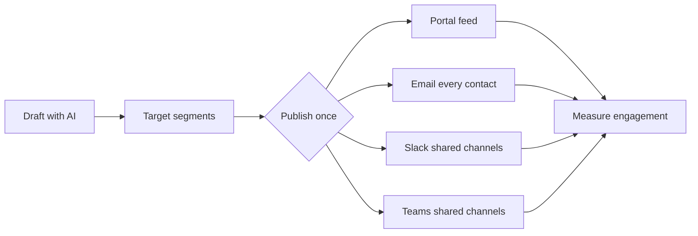
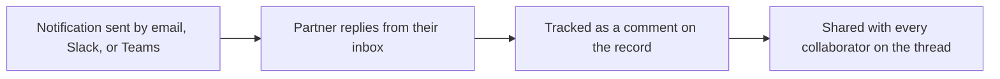
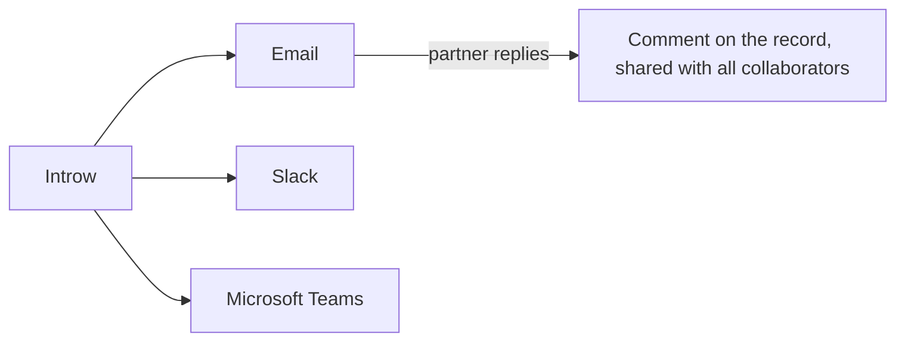
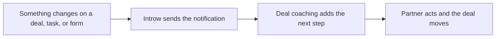
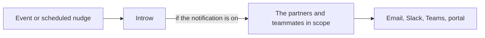

# Introw docs (docs.introw.io): features-engagement

Verbatim from docs.introw.io/llms-full.txt, fetched 2026-09-29. 18 pages.

# Generate an announcement with AI
Source: https://docs.introw.io/features/engagement/announcements/guides/generate-an-announcement-with-ai

Draft a partner announcement in seconds from a URL or text prompt using an AI preset, then refine the copy, target segments, and send it.

When you already have the source material, a webinar, a product update, a blog post, AI can turn it into a partner-ready announcement in seconds. You give it a starting point, it drafts the message, and you refine the wording before sending. This keeps partners updated without doubling your writing.

## What you'll achieve

A drafted announcement generated by AI from your source, ready for you to refine, target, and publish, so a piece of content you already produced reaches partners in the portal with minimal extra writing.

## Before you start

<Steps>
  <Step title="Confirm access">
    You need access to announcements to create one.
  </Step>

  <Step title="Have your source ready">
    Have the link or the key points for the webinar, product update, or post you want to announce.
  </Step>
</Steps>

## Watch it

<Tabs>
  <Tab title="Video">
    <video />
  </Tab>

  <Tab title="Click through">
    <iframe />
  </Tab>
</Tabs>

## Steps

<Steps>
  <Step title="Start with AI">
    Go to [Announcements](https://app.introw.io/announcements), create a new announcement, and choose to start with AI rather than from scratch.

    <Frame>
      
    </Frame>
  </Step>

  <Step title="Pick a preset and give it a source">
    Choose the preset that matches your update so the draft uses the right tone and structure:

    * **Webinar** - announce an upcoming or recorded webinar.
    * **Product update** - announce a release or new capability.
    * **Blog post** - turn a published post into a partner update.

    Then provide the source, a URL to the page or a short prompt describing the update, and let AI generate the draft.

    <Frame>
      
    </Frame>
  </Step>

  <Step title="Refine the draft">
    Review the generated announcement and edit it to your voice: tighten the title, adjust the body, and make sure the action you want partners to take is clear. AI gives you a strong starting point, not the final word.

    <Frame>
      
    </Frame>
  </Step>

  <Step title="Target, choose channels, and publish">
    Continue with the rest of the send: set the author and replies, target the right segments, pick channels, and publish. See [Send an announcement](./send-an-announcement) for each of those steps.
  </Step>
</Steps>

## Verify it worked

AI produces an announcement draft from your source that you can edit, and once you target and publish it, it reaches partners exactly like one written from scratch.

## Related

<CardGroup>
  <Card title="Send an announcement" icon="book-open" href="./send-an-announcement">
    Target, choose channels, and publish the draft.
  </Card>

  <Card title="Review announcement engagement" icon="book-open" href="./review-announcement-engagement">
    See how the AI-drafted update performed.
  </Card>

  <Card title="Implementation reference" icon="screwdriver-wrench" href="../technical">
    Full announcement configuration options.
  </Card>
</CardGroup>

---

# Publish AI-suggested announcements from LinkedIn
Source: https://docs.introw.io/features/engagement/announcements/guides/publish-ai-suggested-announcements

Introw turns your company's partner-relevant LinkedIn posts into weekly announcement drafts rewritten for partners - review, edit, publish, or dismiss.

> For keeping partners in the loop on your company news without watching your own LinkedIn feed or rewriting a single post.

Your company already announces its news on LinkedIn, but partners rarely see it, and rewriting each post for a partner audience is work nobody has time for. So Introw does it for you: every week it reads your company's LinkedIn page, keeps the posts that actually matter to partners, and drafts an announcement for each - already rewritten to speak to partners, not the public. You review the drafts, adjust anything, and publish the ones worth sending. This guide covers how the suggestions arrive and how you turn them into published announcements.

## What you'll achieve

Partner-ready announcement drafts, generated from your latest LinkedIn news and adapted for partners, reviewed and published across the portal, email, Slack, and Teams - or dismissed if they are not a fit.

## How the suggestions are made

You do not trigger this - it runs on its own for customers once your company's LinkedIn page is connected to Introw (set during onboarding; if you never see suggestions, ask your Introw contact to confirm your LinkedIn page is on file). Each week Introw:

* **Reads your recent LinkedIn posts** from your company page.
* **Keeps only the partner-relevant ones** - product updates and launches, new features, integrations, partner-program news, case studies, certifications and training, pricing changes, milestones, new partnerships, and events partners could join. It skips posts partners do not need, such as hiring, culture, personal notes, and reshares.
* **Groups posts about the same news** so one launch becomes one announcement, not three.
* **Drafts up to a few announcements** and rewrites each for a partner audience - written as your own announcement rather than "we posted on LinkedIn", carrying over the post's images.
* **Never repeats itself** - a post it has already drafted an announcement from is not suggested again.

The drafts are exactly that: nothing is sent until you publish it.

## Steps

<Steps>
  <Step title="Get notified when drafts are ready">
    When new drafts are generated, Introw emails everyone on your team with access to announcements, with a link straight to them. You do not have to check for them.
  </Step>

  <Step title="Open the suggested drafts">
    Go to [Announcements](https://app.introw.io/announcements). A banner shows how many announcements were generated from recent content, and each suggested draft carries an **AI Generated** badge while it is still a draft, so you can tell them apart from ones your team wrote.

    <Frame>
      
    </Frame>
  </Step>

  <Step title="Review and edit the draft">
    Open a draft. It is already written for partners, so read it through and adjust the wording, title, or images to fit your voice. Because it starts as a normal draft, everything on it is editable - it is a starting point, not a locked message.
  </Step>

  <Step title="Target and choose channels">
    Set who the announcement is for and how it goes out, exactly as with any announcement: pick the partner **segments** to target, and enable the delivery **channels** - portal feed, email, Slack, and Microsoft Teams. See [Send an announcement](./send-an-announcement) for the full targeting and channel options.
  </Step>

  <Step title="Publish or dismiss">
    Publish the draft to fan it out across the channels you chose, the same as any announcement. If a suggestion is not a fit, delete the draft, or dismiss the banner to hide that batch. Only the drafts you publish ever reach partners.
  </Step>
</Steps>

## Verify it worked

A published suggestion appears in the portal feed and goes out on the channels you enabled, and the count of pending AI drafts on the Announcements banner drops. You can then track who opened and clicked it like any announcement (see [Review announcement engagement](./review-announcement-engagement)).

## Related

<CardGroup>
  <Card title="Generate an announcement with AI" icon="sparkles" href="./generate-an-announcement-with-ai">
    Draft an announcement on demand from a URL or prompt.
  </Card>

  <Card title="Send an announcement" icon="paper-plane" href="./send-an-announcement">
    Target segments, choose channels, and publish.
  </Card>

  <Card title="Review announcement engagement" icon="chart-line" href="./review-announcement-engagement">
    See who opened and clicked, then nudge the rest.
  </Card>

  <Card title="Implementation reference" icon="screwdriver-wrench" href="../technical">
    Composing, channels, and publishing.
  </Card>
</CardGroup>

---

# Review announcement engagement
Source: https://docs.introw.io/features/engagement/announcements/guides/review-announcement-engagement

Review announcement engagement in Introw: see who it was sent to, who opened, and who clicked, then follow up with partners who need a nudge.

Sending an announcement is only half the job; knowing it was seen is the other half. Engagement data shows who was sent the update, who opened it, and who clicked, so you can follow up with the right partners and learn which kinds of updates resonate. This guide reads that data and turns it into a follow-up.

## What you'll achieve

A clear read on how an announcement performed, sent, opened, and clicked figures down to the partner, and a decision on whether to nudge the partners who have not engaged.

## Before you start

<Steps>
  <Step title="Confirm it was published">
    Engagement only accrues after an announcement is published, so send it first. See [Send an announcement](./send-an-announcement).
  </Step>
</Steps>

## Watch it

<Tabs>
  <Tab title="Video">
    <video />
  </Tab>

  <Tab title="Click through">
    <iframe />
  </Tab>
</Tabs>

## Steps

<Steps>
  <Step title="Open the published announcement">
    Go to [Announcements](https://app.introw.io/announcements) and open the announcement you want to review.

    <Frame>
      
    </Frame>
  </Step>

  <Step title="Read delivery and opens">
    Review who the announcement was **sent** to and who **opened** it. A high sent count with low opens usually points to channel or subject-line issues rather than content.

    <Frame>
      
    </Frame>
  </Step>

  <Step title="Check clicks">
    Review who **clicked** the links in the announcement. Clicks are the strongest signal of real engagement, since they show partners acted, not just glanced.

    <Frame>
      
    </Frame>
  </Step>

  <Step title="Decide on a nudge">
    Use the gap between sent and engaged to decide whether to nudge non-responders. Nudging reminds only the partners who have not engaged, so it is a low-cost way to lift reach without spamming everyone.
  </Step>
</Steps>

## Verify it worked

You can see sent, opened, and clicked figures for the announcement and identify the specific partners who have not engaged, ready to nudge.

## Related

<CardGroup>
  <Card title="Send an announcement" icon="book-open" href="./send-an-announcement">
    Apply what you learned to the next send and nudge non-responders.
  </Card>

  <Card title="Generate an announcement with AI" icon="book-open" href="./generate-an-announcement-with-ai">
    Draft the next update quickly.
  </Card>

  <Card title="Implementation reference" icon="screwdriver-wrench" href="../technical">
    Full announcement configuration options.
  </Card>
</CardGroup>

---

# Send an announcement
Source: https://docs.introw.io/features/engagement/announcements/guides/send-an-announcement

Compose an announcement, set who it comes from and who handles replies, target the right segments, choose channels, and publish or nudge.

An announcement is how you reach partners with news, launches, and reminders. This guide covers the whole job end to end: write the message, set who it comes from and who fields replies, target the segments who should get it, choose the channels that reach them, and publish, then nudge the partners who have not engaged. Done well, the update lands in the portal and the inbox and chat tools partners already use.

## What you'll achieve

A published announcement delivered to the partner segments you chose, across the portal feed and any other channels you picked, attributed to the right author with replies routed to the right person. You can then see who engaged and nudge the rest.

## Before you start

<Steps>
  <Step title="Confirm access">
    You need access to announcements to create and send them.
  </Step>

  <Step title="Define your audience segments">
    Targeting uses segments, so create the segments for the partners you want to reach before you send.
  </Step>

  <Step title="Connect chat if you will use it">
    To deliver into Slack and/or Microsoft Teams, connect that integration first; otherwise that channel is unavailable.
  </Step>
</Steps>

## Watch it

<Tabs>
  <Tab title="Video">
    <video />
  </Tab>

  <Tab title="Click through">
    <iframe />
  </Tab>
</Tabs>

## Steps

### Compose the announcement

<Steps>
  <Step title="Start a new announcement">
    Go to [Announcements](https://app.introw.io/announcements) and create one. You can start from scratch, or [generate a draft with AI](./generate-an-announcement-with-ai) and refine it here.

    <Frame>
      
    </Frame>
  </Step>

  <Step title="Write the message">
    Give the announcement a clear title and write the body in the editor. Add headings, links, and media so the update is scannable and the action is obvious. Edits save as you go.

    <Frame>
      
    </Frame>
  </Step>

  <Step title="Set attribution and a thumbnail">
    These details shape how the announcement feels to partners:

    * **From** - the team member the announcement appears to come from. Choose someone partners recognise so the message feels personal rather than system-generated. The email itself goes out from your verified sending domain when you have one, and from the shared Introw address when you do not.
    * **Assign replies to** - the user who receives and handles partner replies. Set this to whoever owns follow-up so responses do not go unanswered.
    * **Thumbnail** - the image on the announcement card in the portal feed. It appears under **Portal configuration** once **Portal** is one of the channels, and it is optional. Introw crops it to **16:9**, so upload a landscape image (1200×675 is a safe size) and use the crop-and-zoom step to pick the part that shows. Or select **Generate with AI**: Introw reads this announcement's title and body plus your brand colors and creates a 16:9 image about what you just wrote. The thumbnail is card artwork only: it is not inserted at the top of the announcement body, and it is not used in the email version, so keep anything essential in the content itself.
  </Step>

  <Step title="Add categories">
    Under **Categories**, below the segments it targets, select **Add** and tag the announcement with the topics it belongs to, such as Product releases, Events or Partner program. Pick from the categories your team already uses, or type a new one and press Enter to create it. Pick from the list where you can: a different spelling or capitalisation makes a second category.

    The announcements list filters on categories, and a portal announcements section can be pointed at them, so partners read a Product feed and an Events feed side by side. Leave it empty and the announcement still shows in every section that is not filtered, and in sections that tick **Without a category**.

    <Frame>
      
    </Frame>
  </Step>
</Steps>

### Target and choose channels

<Steps>
  <Step title="Target recipients">
    Choose the partner **Segments** that should receive the announcement. Targeting keeps updates relevant rather than blasting every partner with everything, so pick the segments the news actually applies to.

    <Frame>
      
    </Frame>
  </Step>

  <Step title="Pick delivery channels">
    Select where the announcement is delivered. A single publish fans it out across every channel you pick, at the same time, so combining channels increases the chance partners see it:

    * **Portal** - posts to the portal feed of every targeted partner. This is the always-available channel.
    * **Email** - emails every contact at the targeted partners, reaching them off-portal where much of their attention is.
    * **Slack** - posts into each targeted partner's connected shared Slack channel(s). Available when Slack is connected.
    * **Microsoft Teams** - posts into each targeted partner's connected Teams channel(s). Available when Teams is connected.

    Slack and Teams are separate toggles - enable both and a partner receives the announcement in both, in every shared channel mapped to them. Across all your targeted partners, one publish distributes the update into every mapped shared channel in their ecosystem.

    <Frame>
      
    </Frame>
  </Step>

  <Step title="Decide on a pop-up">
    Optionally turn on the **pop-up** option so the announcement appears as a prominent pop-up the next time targeted partners open the portal. Reserve it for updates that genuinely need immediate attention so it keeps its impact.
  </Step>
</Steps>

### Publish and follow up

<Steps>
  <Step title="Send yourself a test">
    Select **Test** in the header to see the email before partners do. **Send test email to** starts with your own address; press Enter or type a semicolon after each extra address and it becomes a pill, so a reviewer and a colleague get the same test. Under **Preview the test email as**, pick a partner and one of their contacts to fill the variables with that contact's details. Then select **Send**. A test goes only to the addresses you entered, never to partners.

    <Frame>
      
    </Frame>
  </Step>

  <Step title="Publish">
    Select **Publish** to send it across the channels you selected to the targeted segments. The dialog shows the email as partners receive it. Email and chat delivery reach partners off-portal and cannot be unsent, so proofread once more before publishing.

    <Frame>
      
    </Frame>
  </Step>

  <Step title="Nudge non-responders">
    After it is out, send a **nudge** to remind the targeted partners who have not engaged yet, without resending to everyone. Use it once engagement plateaus rather than immediately after sending. The announcement's page shows under **To** how many partners and people it reaches. That count leaves out contacts who turned announcements off, exactly as the send does, and counts a person in several partner portals once.
  </Step>
</Steps>

## Verify it worked

The announcement shows as published and appears in the portal feed for targeted partners, with the sender and thumbnail you set. Partners on the chosen channels receive it by email or chat, replies route to the assigned user, and the announcement's engagement view begins recording who was sent it, opened it, and clicked.

## Related

<CardGroup>
  <Card title="Generate an announcement with AI" icon="book-open" href="./generate-an-announcement-with-ai">
    Draft an announcement fast from a URL or prompt.
  </Card>

  <Card title="Review announcement engagement" icon="book-open" href="./review-announcement-engagement">
    See who was sent, opened, and clicked.
  </Card>

  <Card title="Brand email notifications" icon="book-open" href="/features/portal/branding/guides/brand-email-notifications">
    Make the emailed announcement on-brand.
  </Card>

  <Card title="Implementation reference" icon="screwdriver-wrench" href="../technical">
    Full announcement configuration options.
  </Card>
</CardGroup>

---

# Announcements
Source: https://docs.introw.io/features/engagement/announcements/index

Publish partner announcements once and fan out across the portal, email, and shared Slack and Microsoft Teams channels, with AI to help draft and target.

> Announcements keep partners informed wherever they work. Publish once and it fans out at the same time across the portal feed, email, and every shared Slack and Microsoft Teams channel connected to the partners you target - with AI helping you draft and target the right partners.

## The problem it solves

Partner updates that only live in a portal mostly go unseen:

<Pains>
  | Without Introw                   | With Introw                          |
  | -------------------------------- | ------------------------------------ |
  | Partners do not check the portal | It also lands in inbox and chat      |
  | Writing every update is slow     | AI drafts it from a source           |
  | Updates reach the wrong partners | Target the segments it is for        |
  | You cannot tell what landed      | Sent, opened and clicked per partner |
</Pains>

## Impact

Partners sell what they know about. Reaching their whole team on the channel they already watch is the difference between an update that becomes revenue and one that becomes an unread post.

<Impact>
  for your business

  * **No new tool**
    One publish fans out to the portal feed, email, and every connected Slack and Teams channel at the same time
  * **AI, not admin**
    AI drafts from a webinar, product update or blog post, and turns your LinkedIn posts into partner drafts weekly
  * **Cost to run**
    Partner marketing runs the whole thing, from draft to engagement report, with no engineering

  for your partners

  * **Self-serve**
    The news arrives where they already are, so staying current costs them no deliberate effort
  * **Enabled**
    A product update or a promotion reaches the reps who need it, not just the alliance manager
  * **Efficient**
    One message in the channel their team already uses, instead of a portal visit to find out

  [A day in the life of your partners](/days-in-the-life)
</Impact>

<Personas>
  * **Partner Marketing** - one publish, every channel
  * **VP Partnerships** - partners who are actually informed
  * **Partner sales teams** - news where they already are
</Personas>

## See it work

<Tour>
  * 

    **Where it lands**

    On the partner's own stage, beside everything else they use.

  * 

    **Target the audience**

    Pick the segments the update is actually for.

  * 

    **Pick the channels**

    Portal, email, Slack and Teams, all from one publish.

  * 

    **Or start with AI**

    Point AI at a webinar, a product update or a blog post.

  * 

    **See what landed**

    Who it reached, who opened it, who clicked.
</Tour>

## How it works

Announcements broadcast updates to your partners across the channels they actually check. You
compose an announcement once and target the partner segments it is for; publishing then fans it
out across every channel you enable, all at once:

* **Portal feed** - an entry in the portal of every targeted partner.
* **Email** - to every contact at those partners.
* **Slack** - into each targeted partner's connected shared channel(s).
* **Microsoft Teams** - into each targeted partner's connected channel(s).

So one message travels across the partner's whole ecosystem. Slack and Teams are independent, so
a partner can receive it in both. Partners do not have to live in the portal to stay informed,
which fits how partner attention is split across many tools.

In the portal, categories decide what lands where. Tag an announcement Product or Events, and a
portal section can show that category alone, so a partner reads a Product feed beside an Events
feed instead of one list everything falls into.

AI helps you move faster. Instead of writing every update from a blank page, you can generate
announcement drafts and shape them to the audience, then send. After it goes out, you can see
who was reached, who opened, and who clicked, and nudge the partners who missed it.

AI drafting reaches outside Introw too: connect your LinkedIn and Introw turns your
partner-relevant posts into announcement drafts each week, rewritten for a partner
audience, so news you have already published does not have to be written twice.

Announcements meet partners off-portal. Draft with AI, target the right segments, and publish
once - the update fans out across the portal, email, and every shared Slack and Teams channel of
the targeted partners at the same time. Then measure engagement and follow up, so important
updates actually get through instead of sitting unread.

## Run it from your AI assistant

<Headless>
  * Which announcements have partners seen recently?
  * Show partner engagement with our latest announcement.
</Headless>

## Going deeper

<CardGroup>
  <Card title="How to" icon="screwdriver-wrench" href="./technical">
    Setup, configuration, and all how-to guides.
  </Card>

  <Card title="API reference" icon="code" href="/general/introduction">
    Integration surface and code.
  </Card>
</CardGroup>

**Works with**

<CardGroup>
  <Card title="Segments" icon="users" href="/features/partners/segments">
    Target announcements by segment.
  </Card>

  <Card title="Slack & Teams" icon="plug" href="/features/integrations/chat">
    Deliver into Slack and Teams.
  </Card>

  <Card title="Notifications" icon="bell" href="/features/engagement/notifications">
    Ride the notification system.
  </Card>
</CardGroup>

---

# Announcements
Source: https://docs.introw.io/features/engagement/announcements/technical/index

Compose partner announcements, target segments, choose channels (portal, email, Slack, Teams), publish, and review engagement analytics in Introw.

## Where it lives

Announcements sits under **Engage**, at [Announcements](https://app.introw.io/announcements).

<Frame>
  
</Frame>

## Before you start

| You need                          | Why                           | Fix it                                                                                                                                   |
| --------------------------------- | ----------------------------- | ---------------------------------------------------------------------------------------------------------------------------------------- |
| Access to announcements           | To write and send one         | [Internal roles](/features/access/team-management/guides/create-an-internal-role)                                                        |
| Segments, to target an audience   | Otherwise it goes to everyone | [Create a segment](/features/partners/segments/guides/create-a-dynamic-segment)                                                          |
| Slack or Teams, for chat delivery | Only to deliver into chat     | [Connect Slack](/features/integrations/chat/guides/connect-slack) or [Teams](/features/integrations/chat/guides/connect-microsoft-teams) |

## How it works

An announcement is a message you compose, target to partner segments, and deliver across
channels. You write it in a rich editor, or generate a draft with AI and refine it, choose
which partner segments should receive it, and pick the delivery channels: the portal feed,
email, Slack, and Microsoft Teams. A single publish fans the announcement out across every
channel you enable at once - into the portal, every targeted contact's inbox, and each targeted
partner's connected shared Slack and Teams channels. After publishing, Introw tracks delivery and
engagement so you can see who saw it and nudge the rest.

Introw can also **suggest announcements for you**: each week it reads your company's LinkedIn page,
picks the posts most relevant to partners, and drafts an announcement for each - rewritten for a
partner audience. The drafts land in your Announcements list with an **AI Generated** badge for you
to review, edit, and publish or discard; nothing is sent until you publish it. See [Publish
AI-suggested announcements from LinkedIn](../guides/publish-ai-suggested-announcements).

## Settings & configuration

Announcements are managed at [Announcements](https://app.introw.io/announcements).

### Composing

Write the announcement in the editor, adding formatting, links, and media. You can generate a
draft with AI from a preset, Webinar, Product update, or Blog post, using a source URL or
prompt, then edit it to fit your voice. You also set **From**, the team member the announcement
comes from, **Assign replies to**, the user replies go to, and an optional **Thumbnail** under
**Portal configuration** (shown once **Portal** is a selected channel).

The email goes out from your own verified sending domain once you have set one up, and from the
shared Introw address until then. A published announcement's page shows that same sender on its
**From** line, so what you read there is what partners see in their inbox. See
[Email domain](/features/portal/email-domain/technical).

The thumbnail is the card artwork in the portal feed, in every view mode (grid, list, table).
It is cropped to **16:9** on upload, so a landscape image around 1200×675 is a safe size, and
**Generate with AI** produces one at that size from the announcement's own title and body plus
your brand colors (text-free by design, so nothing renders garbled). It is
not rendered inside the announcement body or in the email version, so keep essential visuals in
the content. AI-drafted announcements built from a source URL reuse that page's image as the
thumbnail at whatever ratio it has; the card still shows it in a 16:9 frame, filling and
trimming the overflow, so replace it by hand if the crop cuts something important.

### What the editor holds

The announcement editor carries the same writing blocks as the rest of Introw: headings, bullet and
numbered lists, **tables**, dividers, images, call-to-action buttons, and video embeds (YouTube, Loom,
Vimeo, Vidyard, or any other provider through **Embed other**).

Animated GIFs upload like any other image, up to 2 megapixels per frame (a frame of about 1414×1414).
A larger animation, such as a screen recording made on a Retina display, is refused at upload with
the frame size and the limit, so resize it or upload a still image instead.

It also carries **dynamic variables**. Type `{` and insert any property of your partner object from the
CRM, the Introw tier, partner champion or partner manager, a partner team role, or the reading contact's
own first name, last name, email, or company. One announcement then reads per partner - see
[Dynamic variables](/features/portal/experiences/technical#dynamic-variables) for the full list.

An existing announcement **duplicates** from its row in the list, which is the quickest way to run a
recurring format without rebuilding it.

### Categories

An announcement can carry **Categories**: short labels such as Product, Events or Partner program.
You set them in the editor, under the segments it targets. The picker offers every category already
in use, and typing a new one creates it. Pick from the list where you can, because a different
capitalisation makes a second category. A category is at most 25 characters, and one announcement
holds at most 25 of them.

Categories do two things. The announcements list gets a **Categories** column, and **Add filter**
offers **Categories** with **Equals**, **Is any of**, **Is none of** and the known and not-known
checks, so you can pull up every product update you have sent. And an announcements section in the portal can be
limited to the categories it should show, so partners read a feed per topic instead of one list
everything lands in.
See [The announcements section in the portal](#the-announcements-section-in-the-portal).

### Recipients

Target the announcement to specific partner segments so the right partners receive it. This
keeps updates relevant rather than blasting every partner with everything.

A published announcement's page shows its **reach** on the **To** line: how many partners and how
many people the targeting resolves to. Check it before you nudge, to catch a segment that is
narrower or wider than you intended.

Reach counts the people the email actually goes to, not everyone the targeting touches. A contact
who has turned announcements off, or whose segment or organization default suppresses them, is left
out of the count as well as out of the send. A person who is a contact at several partners gets one
email and is counted once. The partner count still includes a partner with no one to email, because
that partner still gets the announcement in their portal.

### Channels

Choose which channels the announcement is delivered on. Enable any combination - publishing fans
it out across all of them at the same time:

* **Portal feed** - posts to the portal of every targeted partner. Always available.
* **Email** - emails every contact at the targeted partners, reaching them off-portal.
* **Slack** - posts into each targeted partner's connected shared Slack channel(s), when Slack is connected.
* **Microsoft Teams** - posts into each targeted partner's connected Teams channel(s), when Teams is connected.

Slack and Teams are independent toggles: enable both and a partner gets the announcement in both,
in every shared channel mapped to them. Across all your targeted partners, that one publish
distributes the update into every mapped shared channel in their ecosystem. Combining channels
improves the chance partners actually see it, and you can show the announcement as a pop-up the
next time targeted partners open the portal.

### The announcements section in the portal

The **Announcements** section you drop into an experience has its own **Configure** panel, so the
same announcements can read differently on two tabs:

* **Layout** - **List**, **Cards** or **Posts**.
* **Categories** - **Filter by category** is off by default, so the section shows every
  announcement the partner may see. Turning it on ticks every category in use today plus
  **Without a category** for the ones nobody tagged, so the section changes nothing until you
  untick what it should leave out. A category someone creates later is not added to a filtered
  section on its own: tick it here when it should show. Tick nothing and the section shows nothing,
  which the builder warns you about.
* **Configure visibility** - **Limit visibility** caps how many announcements the section lists.
* **Author and date** - **Show author** and **Show timestamp**, both on by default. Turn them off
  where the update comes from the program rather than from a person; opening the announcement
  follows the same setting.

Two sections on one tab, each on its own categories, give a partner a Product feed and an Events
feed side by side. A section you published before categories existed keeps showing everything.

### Sending a test

**Test** in the editor header opens **Send a test announcement**. **Send test email to** starts with
your own address, and each extra address becomes a pill when you press Enter or type a semicolon, so
you can paste a list such as `one@company.com; two@company.com`. Under **Preview the test email as**,
pick a partner and one of their contacts to fill the variables with that contact's details. A test
goes only to the addresses you entered, is sent by email only, and does not count as the
announcement being published.

### Publishing and nudges

Publish to send the announcement. After it is out, you can send a nudge to remind partners who
have not engaged yet.

### Engagement

Review delivery and engagement to see who was sent the announcement, who opened it, and who
clicked, so you can follow up where it matters.

Engagement is recorded per contact and per channel, so a portal-only announcement is measured the same
way an emailed one is - you see which contacts opened it in the portal and which clicked through, not
just email statistics.

## How-to guides

<Rail>
  * 

    [**Generate an announcement with AI**](/features/engagement/announcements/guides/generate-an-announcement-with-ai)

    Draft a partner announcement in seconds from a URL or text prompt using an AI preset, then refine the copy, target segments, and send it.

  * [**Publish AI-suggested announcements from LinkedIn**](/features/engagement/announcements/guides/publish-ai-suggested-announcements)

    Introw turns your company's partner-relevant LinkedIn posts into weekly announcement drafts rewritten for partners - review, edit, publish, or dismiss.

  * 

    [**Review announcement engagement**](/features/engagement/announcements/guides/review-announcement-engagement)

    Review announcement engagement in Introw: see who it was sent to, who opened, and who clicked, then follow up with partners who need a nudge.

  * 

    [**Send an announcement**](/features/engagement/announcements/guides/send-an-announcement)

    Compose an announcement, set who it comes from and who handles replies, target the right segments, choose channels, and publish or nudge.
</Rail>

## Troubleshooting

<Warning>
  Slack and Teams delivery requires those integrations to be connected first. Targeting depends on your segments being accurate, so review the audience before sending. Email and chat delivery reach partners off-portal, so proofread carefully since you cannot unsend a delivered announcement.
</Warning>

<AccordionGroup>
  <Accordion title="An announcement did not reach Slack or Teams">
    The integration is not connected.
  </Accordion>

  <Accordion title="The wrong partners received it">
    The targeted segment was broader than intended.
  </Accordion>

  <Accordion title="Engagement looks low">
    Try a nudge and confirm you used multiple channels.
  </Accordion>
</AccordionGroup>

## FAQ

<AccordionGroup>
  <Accordion title="Do we still need our marketing automation tool for partners?" icon="paper-plane">
    For partner-program communication, no. Announcements broadcast to the segments you target across portal, email, Slack and Teams; [notifications](/features/engagement/notifications) send the event-driven messages on their own; and a [workflow](/features/automation/workflows) can send a written email to a segment, a team role, or the contact a trigger was about, with delays and conditions between steps, which is what a partner onboarding sequence needs. Keep your marketing platform for what it is built for: campaigns to audiences that are not partner records, landing pages, and lead capture. The line to hold is that partner communication should run off partner data, and that data lives here and in your CRM.
  </Accordion>

  <Accordion title="Can we test an announcement before partners get it?" icon="flask">
    Yes. Select **Test** in the editor to email the announcement to one or more addresses of your own, previewed as a real partner contact so the variables fill in. A test never reaches partners. A delivered announcement cannot be unsent, so check the reach on the announcement's page before you nudge.
  </Accordion>

  <Accordion title="Can we send to one partner, or one person?" icon="user">
    Yes, through targeting rather than a separate feature. A static segment can hold a single partner, and a [workflow](/features/automation/workflows) email can address the partner champion, a specific team role, or the contact its trigger was about. For a one-to-one exchange about a record, a [comment on the record](/features/co-selling/shared-pipelines/guides/collaborate-on-a-shared-deal) reaches the people on it and their reply lands back on the record.
  </Accordion>

  <Accordion title="Can partners reply, and where does the reply go?" icon="reply">
    They can reply straight from their inbox. The reply is tracked back to the record or thread it came from and shared with everyone on it, so a broadcast can turn into a conversation without the partner logging in. Set **Assign replies to** so the right person owns follow-up.
  </Accordion>
</AccordionGroup>

---

# Configure partner notifications by email
Source: https://docs.introw.io/features/engagement/channels/guides/configure-partner-notifications-by-email

Choose which partner notifications go out by email, scope them to the right partners, and turn on reply-by-email so partners respond from their inbox.

## What you'll achieve

Partner notifications delivered by email for the events you care about, scoped to the right partners, with reply-by-email turned on so partners can respond from their inbox. Partners stay engaged off-portal and their replies land back in Introw.

## Before you start

<Steps>
  <Step title="Confirm partner emails">
    Partners need valid email addresses on their contacts. See [Troubleshoot partner email delivery](./troubleshoot-partner-email-delivery) if someone is missing messages.
  </Step>
</Steps>

## Watch it

<Tabs>
  <Tab title="Video">
    <video />
  </Tab>

  <Tab title="Click through">
    <iframe />
  </Tab>
</Tabs>

## Steps

<Steps>
  <Step title="Open your default settings">
    Go to [Default settings](https://app.introw.io/settings/segments/default) and open the **Notifications** tab. Events are grouped by area, **Pipeline**, **Portal activity**, **Submissions**, **Tasks**, and **Learning**, so you can scan them by section.

    <Frame>
      
    </Frame>
  </Step>

  <Step title="Set the recipients for each event">
    Give every event the audience it deserves: **All partners**, **Collaborating only** for events attached to a CRM record, or **Disabled**. Pipeline (deal and object updates), announcements, submission outcomes, and task assignments are common starting points. Leave lower-value events disabled until partners need them, since too many emails overwhelm rather than engage.

    This one value is the whole email decision for that event. There is no separate channel checkbox: email is available for every partner notification, so anything not disabled reaches every eligible partner with a valid address.

    <Frame>
      
    </Frame>
  </Step>

  <Step title="Narrow it for one audience">
    To send a program-specific email only to the partners it applies to, open that audience's segment, go to its **Notifications** tab, and switch on **Override the default for this segment**. The override replaces the default for that segment's members, so it can hold an event back as well as open it up.

    Each partner contact resolves against the same three-layer cascade (organisation default, then override segments they match, then the contact's own opt-outs), so see [Control who gets notified](/features/engagement/notifications/guides/control-who-gets-notified) to check why a specific contact is or is not receiving an email.

    <Frame>
      
    </Frame>
  </Step>

  <Step title="Use reply-by-email">
    Collaboration emails, comments, deal and object updates, and submission outcomes, include **Respond via email**. Partners can reply from their inbox and the response appears in Introw. For commission payouts, partners can reply with their invoice attached.
  </Step>

  <Step title="Set the sender">
    To route replies to a real person, send from each partner's assigned manager, see [Wire partner ownership](/features/partners/team/guides/wire-partner-ownership).
  </Step>

  <Step title="Send from your own domain">
    By default these emails send from an Introw address. To have them send from your own authenticated domain, so they arrive as your brand and land in the inbox instead of spam, set up a custom sending domain. See [Send notifications from your own domain](/features/portal/email-domain/guides/send-notifications-from-your-own-domain).
  </Step>

  <Step title="Monitor delivery">
    [Notification settings](https://app.introw.io/settings/notifications) is the report on what your program sends. The **Last sent** column updates after the next real event, and **Insights** shows emails sent and opened, so you can confirm the channel is firing.

    <Frame>
      
    </Frame>
  </Step>
</Steps>

## Verify it worked

**Insights** shows emails sent and opened, and **Last sent** updates on the row after the next event on any event you left enabled.

## Related

<CardGroup>
  <Card title="In Slack" icon="book-open" href="./configure-partner-notifications-in-slack">
    Deliver notifications in Slack instead of or alongside email.
  </Card>

  <Card title="In Microsoft Teams" icon="book-open" href="./configure-partner-notifications-in-microsoft-teams">
    Deliver notifications in Teams.
  </Card>

  <Card title="Troubleshoot email delivery" icon="book-open" href="./troubleshoot-partner-email-delivery">
    Fix missing partner emails.
  </Card>

  <Card title="Send from your own domain" icon="at" href="/features/portal/email-domain/guides/send-notifications-from-your-own-domain">
    Authenticate a custom sending domain so notifications come from your brand.
  </Card>

  <Card title="Implementation reference" icon="screwdriver-wrench" href="../technical">
    Full configuration options for partner notifications.
  </Card>
</CardGroup>

---

# Configure partner notifications in Microsoft Teams
Source: https://docs.introw.io/features/engagement/channels/guides/configure-partner-notifications-in-microsoft-teams

Choose which partner events Introw posts to each partner's mapped Microsoft Teams channel, on the Teams integration's Partner channels tab, and how chat differs from email.

## What you'll achieve

The partner events that suit a chat feed delivered to each partner's mapped Microsoft Teams channel, so partners and your team see high-signal updates without leaving Teams.

## Before you start

<Steps>
  <Step title="Connect Microsoft Teams">
    Install the Introw app in your tenant, see [Connect Microsoft Teams](/features/integrations/chat/guides/connect-microsoft-teams).
  </Step>

  <Step title="Map partner channels">
    Partners need a mapped Teams channel to receive chat notifications, see [Map a partner channel](/features/integrations/chat/guides/configure-the-chat-integration).
  </Step>
</Steps>

## Steps

<Steps>
  <Step title="Open your Teams integration">
    Go to **Settings → Integrations** and open **Microsoft Teams**. Which partner events reach partner channels is configured here, on the integration that owns those channels, not on the notifications page.
  </Step>

  <Step title="Go to Partner channels">
    On the right, select the **Partner channels** tab. **Internal channels** beside it controls what your own team sees, and the two are configured separately.
  </Step>

  <Step title="Switch on the events you want posted">
    Turn on the partner events that suit a chat feed. Changes save as you make them. Every event is on unless you switch it off, so start by removing the ones that would be noise in a channel.
  </Step>

  <Step title="Pick chat-ready events">
    Chat carries deal and object updates, announcements, comments and mentions, form submission outcomes, and task assignments. Task reminder nudges, learning emails, and system messages are email-only, so they never appear here.
  </Step>

  <Step title="Know how chat differs from email">
    A Teams channel belongs to a whole partner organisation, so chat has no per-contact preference and cannot be targeted per segment. It is a switch per event, per platform. Email is the one that runs through the three-layer cascade of organisation default, override segments, and the contact's own opt-outs. See [Control who gets notified](/features/engagement/notifications/guides/control-who-gets-notified) to work out why a specific contact is or is not receiving an email.
  </Step>
</Steps>

<Note>
  Because the configuration lives on the integration, an organisation running Teams **and** Slack configures each one separately. If you only have Teams, this reads exactly like an organisation-wide setting, and it is already correct on the day you add Slack.
</Note>

## Verify it worked

Trigger a test event for a mapped partner and confirm the message appears in their Teams channel. Switching an event off for chat does not affect its email, and the reverse is also true, so check the channel rather than the notification's email metrics.

## Related

<CardGroup>
  <Card title="By email" icon="book-open" href="./configure-partner-notifications-by-email">
    Reach every partner in their inbox.
  </Card>

  <Card title="In Slack" icon="book-open" href="./configure-partner-notifications-in-slack">
    Deliver notifications in Slack instead.
  </Card>

  <Card title="Connect Microsoft Teams" icon="book-open" href="/features/integrations/chat/guides/connect-microsoft-teams">
    Link your tenant.
  </Card>

  <Card title="Implementation reference" icon="screwdriver-wrench" href="../technical">
    Full configuration options for partner notifications.
  </Card>
</CardGroup>

---

# Configure partner notifications in Slack
Source: https://docs.introw.io/features/engagement/channels/guides/configure-partner-notifications-in-slack

Choose which partner events Introw posts to each partner's mapped Slack channel, on the Slack integration's Partner channels tab, and how chat differs from email.

## What you'll achieve

The partner events that suit a chat feed delivered to each partner's mapped Slack channel, so partners and your team see high-signal updates without leaving Slack.

## Before you start

<Steps>
  <Step title="Connect Slack">
    Install the Introw app in your workspace, see [Connect Slack](/features/integrations/chat/guides/connect-slack).
  </Step>

  <Step title="Map partner channels">
    Partners need a mapped Slack channel to receive chat notifications, see [Map a partner channel](/features/integrations/chat/guides/configure-the-chat-integration).
  </Step>
</Steps>

## Steps

<Steps>
  <Step title="Open your Slack integration">
    Go to **Settings → Integrations** and open **Slack**. Which partner events reach partner channels is configured here, on the integration that owns those channels, not on the notifications page.
  </Step>

  <Step title="Go to Partner channels">
    On the right, select the **Partner channels** tab. **Internal channels** beside it controls what your own team sees, and the two are configured separately.
  </Step>

  <Step title="Switch on the events you want posted">
    Turn on the partner events that suit a chat feed. Changes save as you make them. Every event is on unless you switch it off, so start by removing the ones that would be noise in a channel.
  </Step>

  <Step title="Pick chat-ready events">
    Chat carries deal and object updates, announcements, comments and mentions, form submission outcomes, and task assignments. Task reminder nudges, learning emails, and system messages are email-only, so they never appear here.
  </Step>

  <Step title="Know how chat differs from email">
    A Slack channel belongs to a whole partner organisation, so chat has no per-contact preference and cannot be targeted per segment. It is a switch per event, per platform. Email is the one that runs through the three-layer cascade of organisation default, override segments, and the contact's own opt-outs. See [Control who gets notified](/features/engagement/notifications/guides/control-who-gets-notified) to work out why a specific contact is or is not receiving an email.
  </Step>
</Steps>

<Note>
  Because the configuration lives on the integration, an organisation running Slack **and** Teams configures each one separately. If you only have Slack, this reads exactly like an organisation-wide setting, and it is already correct on the day you add Teams.
</Note>

## Verify it worked

Trigger a test event for a mapped partner and confirm the message appears in their Slack channel. Switching an event off for chat does not affect its email, and the reverse is also true, so check the channel rather than the notification's email metrics.

<Frame>
  
</Frame>

## Related

<CardGroup>
  <Card title="By email" icon="book-open" href="./configure-partner-notifications-by-email">
    Reach every partner in their inbox.
  </Card>

  <Card title="In Microsoft Teams" icon="book-open" href="./configure-partner-notifications-in-microsoft-teams">
    Deliver notifications in Teams instead.
  </Card>

  <Card title="Connect Slack" icon="book-open" href="/features/integrations/chat/guides/connect-slack">
    Link your workspace.
  </Card>

  <Card title="Implementation reference" icon="screwdriver-wrench" href="../technical">
    Full configuration options for partner notifications.
  </Card>
</CardGroup>

---

# Troubleshoot partner email delivery
Source: https://docs.introw.io/features/engagement/channels/guides/troubleshoot-partner-email-delivery

Find out why a partner is not getting Introw emails and fix it: the address and its bounce status, the notification settings, spam and allowlisting on their side, and a suppressed or unsubscribed address.

A partner tells you the invite never came, or that they stopped hearing from you.
The cause is almost always one of five things: a wrong or bounced address, an event nobody receives, a spam filter on their side, a mail server that blocks the sender, or an address that unsubscribed.
This guide works through them in the order that finds the cause fastest, first in Introw and then with the partner, so you fix the right one and the partner keeps receiving Introw emails afterwards.

## What you'll achieve

You know which of the five causes stopped the email, you have fixed it, and the partner receives Introw invites and notifications from now on.

## Before you start

<Steps>
  <Step title="Get the details">
    Note which email the partner expected, which address is on their record, and roughly when it should have arrived.
  </Step>

  <Step title="Know what they are looking for">
    Until you send from your own domain, Introw emails arrive with your organization's name as the sender and `ecosystem@mail.introw.io` as the address.
    If you already send from your own domain, the partner looks for that address instead.
    See [Send notifications from your own domain](/features/portal/email-domain/guides/send-notifications-from-your-own-domain).
  </Step>
</Steps>

## Watch it

<Tabs>
  <Tab title="Video">
    <video />
  </Tab>

  <Tab title="Click through">
    <iframe />
  </Tab>
</Tabs>

## Steps

### Check in Introw

<Steps>
  <Step title="Check the address and its status">
    In [Partners](https://app.introw.io/partners), open the partner and go to the **People** tab.
    Confirm the contact's address is spelled correctly. A typo is the most common cause, and Introw only emails a valid address.

    Then read the **Nudge status** column for that contact:

    * **Nudged via ...** with a date means Introw sent the email. The problem is on the receiving side, so continue with the partner-side checks below.
    * **Email bounced, check receiver** in red means the last email to this address bounced or the mailbox reported it as spam. Introw cannot deliver to the address until that clears. The **Portal access** column shows **Inactive recipient** for the same contact. Fix a wrong address by correcting it on the contact; for a correct address, jump to [Check for a suppressed or unsubscribed address](#still-nothing).
    * Any other red message is the mailbox provider's own reason, such as an invalid address. Correct the address and resend.

    <Tip>
      The bounce status clears on its own the next time that address opens an Introw email, so a partner who fixes their side does not need you to reset anything.
    </Tip>
  </Step>

  <Step title="Confirm the event has recipients">
    Go to [Default settings](https://app.introw.io/settings/segments/default), open the **Notifications** tab, and find the event.
    Each event carries a recipients value rather than an on/off switch, and two of the three values stop an email: **Disabled** sends nothing, and **Collaborating only** sends only to the contacts assigned as collaborators on that record.
    Set it to **All partners** if everyone should hear about it.

    Then check whether a segment overrides it.
    The **Notifications** column on [Segments](https://app.introw.io/settings/segments) reads **Default** for every segment that follows your baseline and spells out the difference for every segment that does not, so one screen tells you whether an override is in play.

    Finally, open the contact's own **Notifications** tab on the **People** tab.
    The layer that owns each event is badged there, so you can tell your default from a segment override from the contact's own choice.
    A contact who switched an event off themselves has unsubscribed from that event.
    Flip the row back on with their agreement, or leave it, since a bulk enable never re-subscribes a contact who opted out.

    <Note>
      [Notification settings](https://app.introw.io/settings/notifications) is a report, not a switch. It shows what was sent, opened, clicked and bounced; it cannot turn an event on.
    </Note>
  </Step>
</Steps>

### Check on the partner's side

<Steps>
  <Step title="Ask them to look in Spam or Junk">
    Have the partner open their **Spam** or **Junk** folder and look for messages from `ecosystem@mail.introw.io`, or from your own sending address if you use one.
    If they find one, they select **Not spam** or move it back to the inbox. That trains their filter for the next email.

    Gmail often shows a banner on these messages that reads "Why is this message in spam? Similar to messages that were identified as spam." It means the filter guessed, not that the address is blocked.
  </Step>

  <Step title="Ask them to check the Promotions or Other tab">
    Gmail files automated mail under **Promotions** and Outlook under **Other**.
    Dragging one Introw email to **Primary** or **Focused** tells the mailbox where the rest belong.
  </Step>

  <Step title="Ask them to allowlist the sender">
    Allowlisting is what makes future emails arrive every time, so do it even after a single email was rescued from spam.

    **Gmail.** Open **Settings**, then **See all settings**, then **Filters and Blocked Addresses**. Select **Create a new filter**, enter `ecosystem@mail.introw.io` in the **From** field, select **Create filter**, tick **Never send it to Spam**, and save.

    **Outlook.** Open **Settings**, then **Mail**, then **Junk email**. Add `ecosystem@mail.introw.io` under **Safe senders and domains** and save.

    **Company mail.** A partner on Google Workspace, Microsoft 365, or their own mail server may have a corporate filter or security gateway in front of the mailbox. Their IT team allowlists the domain `introw.io` together with its subdomains, at minimum `mail.introw.io`, and the sending address itself. That is what stops the gateway from quarantining Introw mail before the partner ever sees it.

    If you send from your own domain, give the partner your sending address instead. Your domain's DNS records already authenticate the mail, so mailbox providers trust it more than a shared sender.

    <Tip>
      Spam and quarantine problems that hit many partners at once are a sign to [send from your own authenticated domain](/features/portal/email-domain/guides/send-notifications-from-your-own-domain), so every partner sees your brand as the sender and none of them needs to allowlist an Introw address.
    </Tip>
  </Step>
</Steps>

### Still nothing

<Steps>
  <Step title="Check for a suppressed or unsubscribed address">
    Introw notification emails carry an unsubscribe link.
    When a partner uses it, when their mailbox reports an Introw email as spam, or when the address bounces, the address is suppressed and Introw can no longer deliver to it.
    Introw shows this as **Email bounced, check receiver** on the **People** tab, and the **Bounced** column on [Notification settings](https://app.introw.io/settings/notifications) counts it.

    Ask the partner whether they unsubscribed at some point.
    Then email [support@introw.io](mailto:support@introw.io) with the partner's address.
    Support checks why the address is suppressed and restores delivery where the mailbox provider's rules allow it, and tells you when the partner has to opt back in themselves.
  </Step>

  <Step title="Resend">
    Once the address, the settings, and the partner's filter are right, send the email again.
    On the **People** tab, select the contact and choose **Send invite** to resend the invite; a notification goes out again at the next event on the record.

    <Frame>
      
    </Frame>
  </Step>
</Steps>

## Verify it worked

The partner receives the resent email.
On the **People** tab, the contact's **Nudge status** reads **Nudged via ...** with today's date instead of a red message, and on [Notification settings](https://app.introw.io/settings/notifications) the event's **Last sent** column updates while **Bounced** stays flat.

## Related

<CardGroup>
  <Card title="By email" icon="book-open" href="./configure-partner-notifications-by-email">
    Turn on Mail and reply-by-email.
  </Card>

  <Card title="Control who gets notified" icon="book-open" href="/features/engagement/notifications/guides/control-who-gets-notified">
    The three-layer cascade that decides each recipient.
  </Card>

  <Card title="Send from your own domain" icon="at" href="/features/portal/email-domain/guides/send-notifications-from-your-own-domain">
    Authenticate a custom sending domain so notifications come from your brand.
  </Card>

  <Card title="Verify partner emails" icon="book-open" href="/features/portal/portal-access/guides/set-up-portal-access">
    Email verification for access.
  </Card>

  <Card title="Implementation reference" icon="screwdriver-wrench" href="../technical">
    Full configuration options for partner notifications.
  </Card>
</CardGroup>

---

# Channels
Source: https://docs.introw.io/features/engagement/channels/index

Deliver notifications and announcements off-portal by email, Slack, and Teams, and let partners reply from their inbox with responses tracked back.

> Introw reaches partners where they already work, by email and in Slack or Teams, so engagement never depends on a portal login. And when a partner replies to an email, the reply is tracked and shared with everyone on the thread.

## The problem it solves

<Pains>
  | Without Introw                   | With Introw                     |
  | -------------------------------- | ------------------------------- |
  | Portal-only updates go unseen    | They land in inbox and chat     |
  | Replying needs a portal login    | They reply from their inbox     |
  | Replies scatter across inboxes   | Every reply lands on the record |
  | A generic sender looks like spam | Send from your own domain       |
</Pains>

## Impact

Most partner programs lose the conversation at the login screen. Answering from your own inbox and having it land on the deal is a large part of why partners keep talking to you.

<Impact>
  for your business

  * **No new tool**
    Every notification and announcement can go by email, Slack or Teams, so reaching a partner never depends on them opening a portal
  * **Cost to run**
    Operations connects a workspace once and every message afterwards uses it, with nothing to build

  for your partners

  * **Self-serve**
    They answer from the inbox they already had open, and the thread stays whole without a login
  * **Enabled**
    Their whole team sees the reply, because it is shared back to every collaborator on the thread
  * **Efficient**
    An attachment they reply with is filed on the record, so an invoice is sent once and lands right

  [A day in the life of your partners](/days-in-the-life)
</Impact>

<Personas>
  * **Partner Operations** - channels connected once
  * **Partner sales teams** - reply from where they are
</Personas>

## See it work

<Tour>
  * 

    **Connect the workspace**

    Slack and Teams connect once, from Communication integrations.

  * 

    **Choose where it goes**

    Any message can travel by portal, email, Slack and Teams.

  * 

    **Scope the audience**

    Each signal carries its own channel and its own recipients.
</Tour>

## How it works

Every notification and announcement Introw sends can be delivered off-portal: by email, and in Slack or Teams once those workspaces are connected. Partners get updates in the inbox and chat they already live in, so they stay engaged without opening a separate tool.

The channel is two-way. A partner can reply to a notification email straight from their inbox. Introw tracks the reply and threads it onto the right deal or record as a comment. Everyone collaborating on that thread sees it on their own channel - the partner's team and your internal owners alike. Attachments come along too: a document a partner replies with is saved to the record, and an invoice replied to a payout email is attached to that payout. A one-way alert becomes a real conversation, on the record, with no one logging in.

Introw meets partners on their channel and keeps the thread whole. The notification goes out by email, Slack, or Teams. The partner replies where they are. The response is captured on the record and fanned back to every collaborator, so the conversation stays complete and visible without a single login.

## Going deeper

<CardGroup>
  <Card title="How to" icon="screwdriver-wrench" href="./technical">
    Setup, configuration, and all how-to guides.
  </Card>

  <Card title="API reference" icon="code" href="/general/introduction">
    Endpoints and code.
  </Card>
</CardGroup>

**Works with**

<CardGroup>
  <Card title="Notifications" icon="bell" href="/features/engagement/notifications">
    Carry every notification and nudge to the partner's channel.
  </Card>

  <Card title="Slack & Teams" icon="plug" href="/features/integrations/chat">
    Connect Slack or Microsoft Teams so Introw can post to shared channels.
  </Card>

  <Card title="Email Domain" icon="browser" href="/features/portal/email-domain">
    Send these emails from your own authenticated domain.
  </Card>
</CardGroup>

---

# Channels
Source: https://docs.introw.io/features/engagement/channels/technical/index

Set up off-portal delivery for notifications and announcements: email, Slack, and Teams, reply-by-email, and your own sending domain.

## Where it lives

Channels sits under **Settings**, at [Integrations](https://app.introw.io/settings/integrations).

<Frame>
  
</Frame>

## Before you start

| You need                          | Why                          | Fix it                                                                                                                                   |
| --------------------------------- | ---------------------------- | ---------------------------------------------------------------------------------------------------------------------------------------- |
| Partners synced with valid emails | Email is the default channel | [Sync partners](/features/integrations/crm/guides/sync-partners-and-contacts)                                                            |
| Slack or Teams, with a channel    | Only for chat delivery       | [Connect Slack](/features/integrations/chat/guides/connect-slack) or [Teams](/features/integrations/chat/guides/connect-microsoft-teams) |
| DNS access for your own domain    | Introw generates the records | [Sending domain](/features/portal/email-domain/guides/send-notifications-from-your-own-domain)                                           |

## How it works

Introw delivers every notification and announcement on up to three off-portal channels. **Email** is always available and reaches any partner with a valid address. **Slack** and **Microsoft Teams** become available once you connect that workspace, and Introw then posts updates into the shared channel mapped to each partner and, optionally, into your own internal channels.

Email is two-way. Collaboration emails carry a reply address, so when a partner replies from their inbox, Introw captures the reply, adds it as a comment on the deal or record, and sends it on to everyone collaborating on that thread. Attachments are saved to the record. Email and chat are configured in different places: email recipients on your organisation default and per segment, chat on each chat integration. This page is about connecting and configuring the channels themselves.

## Settings & configuration

Channel setup spans three places: the **Integrations** area (connect Slack and Teams), **Default settings** in the segments area (who receives each event by email), and each chat integration's **Partner channels** tab (which events reach partner chat channels). Email and chat are configured separately.

### Email

Email delivery is decided by the **recipients** value on each event: **All partners**, **Collaborating only**, or **Disabled**. Set it on [Default settings](https://app.introw.io/settings/segments/default), and override it for one audience on that segment's **Notifications** tab. There is no separate email channel toggle, because email is available for every notification type, so anything not disabled sends. See [Control who gets notified](/features/engagement/notifications/guides/control-who-gets-notified).

**Reply-by-email** is built into collaboration emails (comments, deal and object updates, submission outcomes) as **Respond via email**; a partner's reply threads back onto the record and reaches all collaborators. Commission payout emails accept a reply with an invoice attached.

**Sending domain** controls the address partners see. By default emails send with your organization's name as the sender and `ecosystem@mail.introw.io` as the address, which is what a partner allowlists when their filter blocks Introw; connect your own authenticated domain so they send as your brand and land in the inbox. See [Send notifications from your own domain](/features/portal/email-domain/guides/send-notifications-from-your-own-domain).

### Slack, Microsoft Teams, and WhatsApp

**Connect the workspace** from **Integrations**. Once connected, the integration gains a **Partner channels** tab listing every partner event, so you choose per platform what reaches partner channels. WhatsApp gets the same panel, since a partner's mapped phone number receives partner notifications the same way a channel does. An organisation running more than one platform configures each separately, and chat cannot be targeted per segment.

**Partner channels** map a shared Slack or Teams channel to each partner, so partner-facing notifications post into the channel that partner is in.

**Internal channels** are your own team channels; point notifications about a partner into them so your team sees partner activity without leaving chat.

## How-to guides

<Rail>
  * 

    [**Configure partner notifications by email**](/features/engagement/channels/guides/configure-partner-notifications-by-email)

    Choose which partner notifications go out by email, scope them to the right partners, and turn on reply-by-email so partners respond from their inbox.

  * [**Configure partner notifications in Microsoft Teams**](/features/engagement/channels/guides/configure-partner-notifications-in-microsoft-teams)

    Choose which partner events Introw posts to each partner's mapped Microsoft Teams channel, on the Teams integration's Partner channels tab, and how chat differs from email.

  * [**Configure partner notifications in Slack**](/features/engagement/channels/guides/configure-partner-notifications-in-slack)

    Choose which partner events Introw posts to each partner's mapped Slack channel, on the Slack integration's Partner channels tab, and how chat differs from email.

  * 

    [**Troubleshoot partner email delivery**](/features/engagement/channels/guides/troubleshoot-partner-email-delivery)

    Find out why a partner is not getting Introw emails and fix it: the address and its bounce status, the notification settings, spam and allowlisting on their side, and a suppressed or unsubscribed address.
</Rail>

## Troubleshooting

<Warning>
  Chat delivery requires the Slack or Teams integration connected and a channel mapped to the partner; without a mapped channel, chat notifications for that partner do not send. Email is the only channel that reaches partners with no connected workspace. A reply only threads back when the partner replies to the original notification email, not a forwarded copy.
</Warning>

<AccordionGroup>
  <Accordion title="A partner gets no email">
    See [Troubleshoot partner email delivery](../guides/troubleshoot-partner-email-delivery).
  </Accordion>

  <Accordion title="A partner shows Email bounced, check receiver">
    Their address bounced, was reported as spam, or unsubscribed, so Introw cannot deliver to it. The status clears when that address opens an Introw email again; otherwise ask support to check the suppression. See [Troubleshoot partner email delivery](../guides/troubleshoot-partner-email-delivery#still-nothing).
  </Accordion>

  <Accordion title="Chat notifications are not arriving">
    Confirm the workspace is connected and the partner has a mapped channel.
  </Accordion>

  <Accordion title="Replies are not showing on the record">
    Confirm the partner replied to the original email and that reply-by-email is on for that notification.
  </Accordion>
</AccordionGroup>

---

# Engagement
Source: https://docs.introw.io/features/engagement/index

Every nudge, notification, and announcement Introw sends on its own to keep partners engaged and deals moving, across the portal, email, Slack, and Teams.

> Engagement is everything Introw sends on its own to keep partners and your team in the loop and deals moving: automatic signals when something changes, delivery to the channels people actually use, and broadcasts when you have news to share.

## The problem it solves

<Pains>
  | Without Introw                      | With Introw                     |
  | ----------------------------------- | ------------------------------- |
  | Updates depend on someone sending   | The program sends them itself   |
  | Partners do not open the portal     | It reaches their inbox and chat |
  | A reply lands in one inbox          | Every collaborator sees it      |
  | Blasting everything trains them out | You pick the signals that send  |
</Pains>

## Impact

The vendor a partner hears from at the right moment, on the channel they already have open, is the vendor whose deals they work first. Silence between logins is how a channel goes quiet.

<Impact>
  for your business

  * **No new tool**
    Partners are reached by email, Slack and Teams, so engagement never depends on somebody logging into a portal
  * **AI, not admin**
    AI drafts announcements, and deal coaching turns a bare alert into a concrete next step for the partner
  * **Cost to run**
    Partner ops configures every signal, channel and audience with no code, and the outreach then runs itself

  for your partners

  * **Self-serve**
    They act on a deal or a task from the message itself, without opening anything else first
  * **Enabled**
    The update says what to do next, not only that something changed
  * **Efficient**
    They reply from their inbox and it lands on the record, so nothing is re-entered anywhere

  [A day in the life of your partners](/days-in-the-life)
</Impact>

<Personas>
  * **Partner Operations** - which signals send, and to whom
  * **Partner Marketing** - announcements that reach everyone
  * **Partner sales teams** - updates without living in a portal
</Personas>

## How this area works

A partner program goes quiet the moment it depends on someone remembering to send an update. Introw runs the outreach for you. When a deal moves, a form is approved, a task comes due, or a course is finished, Introw sends the right message to the right people, automatically. Those messages reach partners where they already work, by email and in Slack or Teams, not only in a portal they may not open for days. When a partner replies to an email, the reply is tracked and shared back with everyone on the thread, so a notification turns into a real conversation without anyone logging in.

An event becomes a message, the message reaches the partner on their channel, and their response comes back to the record.

**Where this sits in a setup.** Notifications and announcements come with launch, not before it. Every [setup track](/tracks) settles who hears what in the same step as inviting partners.

<Rail>
  * 

    [**Notifications**](./notifications)

    Automatic signals on deals, tasks, forms and payouts.

    [How to · 3 guides](./notifications/technical)

  * 

    [**Channels**](./channels)

    Email, Slack and Teams, with replies tracked back.

    [How to · 4 guides](./channels/technical)

  * 

    [**Announcements**](./announcements)

    Broadcast once, out across every channel at once.

    [How to · 4 guides](./announcements/technical)
</Rail>

The same system carries your deliberate outreach too. Announcements broadcast a product update, a promotion, or a program change to the partners it is for, drafted with AI and measured so you can see what landed. Under it all runs one set of controls: you decide which signals send, on which channels, and to whom, so partners get useful signal instead of noise.

## Reach, subscribe, act

A message only works if it arrives, and most programs lose partners at three steps before anyone acts. Introw removes the drop-off at each one.

1. **Reach.** The right contact was never given access, the invite went to one person, the password was forgotten, adding a colleague took a support ticket. Here, partner contacts arrive from your CRM, and access follows a CRM field or a switch on the partner record, or a trusted partner email domain ([Provisioning](/features/access/provisioning)). Signing in is a one-time code by email or the Google, Microsoft, or SSO identity they already have, with no password to reset ([Portal Access](/features/portal/portal-access)). Partners invite their own colleagues.
2. **Subscribe.** A partner who gets everything learns to ignore it, and one who gets nothing forgets you. [Announcements](./announcements) and email [notifications](./notifications) are targeted by [segment](/features/partners/segments), so each contact hears what applies to their motion, tier, and role, and each partner's shared Slack or Teams channel gets the events you choose for chat ([Channels](./channels)). Enrolling those same people in a course or a goal is a segment rather than an import.
3. **Act.** Partners act from the email, the Slack or Teams message, or the portal, whichever they have open. A reply from their inbox lands on the record, and a button in the message takes them straight to the deal or task.

That is the unglamorous half of engagement. Every step removed between "we sent something" and "a partner acted on it" is a drop-off you never have to chase.

### Why it runs on autopilot

Partner marketing is usually a part-time role, or shared with other marketing work. So the program keeps partners current without a dedicated team: [announcements](./announcements) publish once to every channel, AI drafts them for you, including weekly drafts from your company LinkedIn page (set up with Introw), [notifications](./notifications) and [automatic deal updates](/features/referrals/deal-updates) go out on their own, and [workflows](/features/automation/workflows) send the nudges when something happens or stalls.

## Engagement is bigger than this domain

Engagement is a category rather than a single feature, and the three features above are its delivery half. What you engage partners with, and what makes a message worth opening, is owned elsewhere and points back here.

<CardGroup>
  <Card title="Workflows" icon="bolt" href="/features/automation/workflows">
    The nudges that fire when something happens, or fails to: a task past due, a partner gone quiet, a certification about to expire.
  </Card>

  <Card title="Goals & KPIs" icon="chart-line" href="/features/reporting/goals">
    What makes a nudge specific. Pace against the target tells you who to chase and who to recognise.
  </Card>

  <Card title="Courses & Training" icon="graduation-cap" href="/features/courses">
    The enablement you engage partners with, auto-enrolled by segment rather than chased by email.
  </Card>

  <Card title="Content & Enablement" icon="folder-open" href="/features/content">
    The assets and collateral a message points at, governed once and filtered per partner.
  </Card>

  <Card title="Deal Coaching" icon="robot" href="/features/ai/deal-coaching">
    Turns a deal alert into a concrete next step instead of a notice that something changed.
  </Card>

  <Card title="Portal Access" icon="key" href="/features/portal/portal-access">
    Who can be reached at all, and how they get in without a password or a ticket.
  </Card>
</CardGroup>

## Run it from your AI assistant

<Headless>
  * What have we announced to partners this quarter?
  * Which partners engaged with our most recent announcement?
  * Find what we have already told partners about our pricing change.
</Headless>

---

# Control who gets notified
Source: https://docs.introw.io/features/engagement/notifications/guides/control-who-gets-notified

Scope each notification to the right partners and teammates using segments, per-channel toggles, and internal role and user settings to cut noise.

## What you'll achieve

Each notification scoped to the partners and teammates it applies to, on the channels you choose, so partners receive only relevant updates and your team sees only the partner activity they own.

## Before you start

<Steps>
  <Step title="Know the catalog">
    Decide which events matter to your program before you tune who receives them. See [Every notification Introw sends](./every-notification-introw-sends) for the full list.
  </Step>

  <Step title="Have your segments ready">
    Anything narrower than your organisation-wide baseline is expressed with a segment, and an overriding segment needs at least one condition. Build them first if needed. See [Segments](/features/partners/segments).
  </Step>
</Steps>

## Steps

<Steps>
  <Step title="Set the baseline for every partner">
    Go to [Default settings](https://app.introw.io/settings/segments/default) and open the **Notifications** tab. Give each event its recipients:

    * **All partners** - everyone the event applies to.
    * **Collaborating only** - just the contacts assigned as collaborators on the record. Offered only for events attached to a CRM record, where collaboration means something.
    * **Disabled** - the event does not send.

    This is the floor of your program. A brand-new partner, and any partner who matches no segment, gets exactly what you set here.

    <Frame>
      
    </Frame>
  </Step>

  <Step title="Override it for one audience">
    Open the segment that audience is defined by, go to its **Notifications** tab, and switch on **Override the default for this segment**. Until you do, the segment changes nothing, so creating a segment to target an announcement has no notification side effects.

    * **When to override** - program-specific messages that should not reach every partner, such as a tier-only update or a region-specific deal notification.
    * **Both directions** - an override replaces the default for that segment's members, so it can hold an event back as well as open it up.
    * **It has to target a subset** - a dynamic segment with no conditions matches everyone, so it cannot override. Add at least one condition, or keep using it purely for targeting.
  </Step>

  <Step title="Set chat separately">
    Recipients above govern **email**. Which partner events reach a partner's chat channel is set per platform on that chat integration, on its **Partner channels** tab, because a channel belongs to a whole partner rather than to a person. Chat cannot be targeted per segment. Some notifications are email-only. See [Channels](/features/engagement/channels).
  </Step>

  <Step title="Decide which of your team is copied">
    For notifications that also reach internal users, role and user settings decide who on your team is notified. Choose the reach that fits each role:

    * **All partners** - the person is notified about every partner.
    * **Only their own partners** - limited to partners they own or manage.
    * **Only where they collaborate** - limited to the specific deals or records they are a collaborator on.
    * **Off** - the person is not notified for that type.

    Set a sensible default at the role level, then let individuals fine-tune their own preferences.
  </Step>

  <Step title="Know what happens when overrides overlap">
    When a contact matches several override segments that disagree on the same event, the most permissive one wins, so an event enabled in any of them reaches the contact and the wider audience applies. Anything no override segment mentions falls through to the default.
  </Step>

  <Step title="Read a contact's cascade">
    Open a partner contact's **Notifications** tab and Introw shows the three-layer cascade that decides each event, top to bottom:

    1. **All partners · Default** - the organisation default from [Default settings](https://app.introw.io/settings/segments/default), with a link to edit it.
    2. **Matched override segments** - each segment the contact belongs to that overrides at least one event, named and linked, with the number of events that segment decides.
    3. **This contact** - the events this contact has opted out of themselves.

    Every row on the tab is badged with the layer that decided it, so you can see at a glance whether a value comes from the default, a segment override, or the contact's own opt-out, and where to go to change it.
  </Step>

  <Step title="Opt a contact out (opt-out only)">
    On the contact's **Notifications** tab, turn off any event the layers above leave available. Contact-level toggles can only opt out of an event that is available; they cannot re-enable one a higher layer has locked to off. If a row is locked, use the links on the cascade card to edit the default or the matching segment.

    The rule is enforced when the change is saved rather than only hidden in the interface, so an opt-out recorded against a locked event is stripped before it is stored. No screen can claim an opinion the organisation default or a segment owns.
  </Step>

  <Step title="Respect partner opt-outs">
    Partners can also opt out of non-essential emails from their own settings, and Introw honors that alongside the cascade. Keep essential, action-driving notifications on and avoid enabling low-value ones, so partners stay opted in to the messages that matter.
  </Step>
</Steps>

## Verify it worked

On [Segments](https://app.introw.io/settings/segments), the **Notifications** column reads **Default** for every segment that follows your baseline and shows the exact difference for every segment that does not, so your whole setup is one screen. Then open a contact in the audience you scoped and confirm their cascade names the layer you expect. After the next real event, the **Last sent** time updates and **Insights** on [Notification settings](https://app.introw.io/settings/notifications) shows who it reached.

## Related

<CardGroup>
  <Card title="Every notification Introw sends" icon="list" href="./every-notification-introw-sends">
    The full catalog of what you can turn on.
  </Card>

  <Card title="Segments" icon="users" href="/features/partners/segments">
    Build the partner audiences you scope notifications to.
  </Card>

  <Card title="Channels" icon="paper-plane" href="/features/engagement/channels">
    Set up email, Slack, and Teams delivery.
  </Card>

  <Card title="Implementation reference" icon="screwdriver-wrench" href="../technical">
    Full configuration options for notifications.
  </Card>
</CardGroup>

---

# Every notification Introw sends
Source: https://docs.introw.io/features/engagement/notifications/guides/every-notification-introw-sends

Full reference of automatic emails, chat messages, and nudges Introw sends across the partner lifecycle: triggers, recipients, and deal coaching.

## What you'll achieve

A clear picture of everything Introw sends automatically, grouped by area, so you can choose which notifications to turn on, which channels they use, and who receives them, and explain to partners exactly what to expect.

## Before you start

<Steps>
  <Step title="Know where to configure these">
    Every notification below is turned on, channelled, and scoped from **Notification settings**. This page is the catalog; [Control who gets notified](./control-who-gets-notified) covers targeting and [Channels](/features/engagement/channels) covers delivery.
  </Step>
</Steps>

## How to read this

Unless a row says email-only, a notification can be delivered by **email** and, where the workspace is connected, in **Slack** or **Teams**, and it also appears on the partner's portal timeline. Recipients depend on the segments and scopes you set. "Your team" means internal Introw users rather than partners.

<Frame>
  
</Frame>

Whether a specific partner contact actually receives one of these is decided by a three-layer cascade: the organisation default, then any override segments the contact matches, then the contact's own opt-outs. Only the contact's own opt-outs are editable per contact, and only for events the layers above leave available. See [Control who gets notified](./control-who-gets-notified).

## Deal and pipeline

The heartbeat of a co-sell program: Introw watches your CRM and signals every meaningful change on a partner-attached deal.

| Notification    | When it sends                                                    | Who it reaches                           |
| --------------- | ---------------------------------------------------------------- | ---------------------------------------- |
| New deal        | A partner-attached deal is created in your CRM                   | The partner and their manager            |
| Deal update     | A tracked field on a shared deal changes                         | The partner and the deal's collaborators |
| Deal closed won | A shared deal is marked won                                      | The partner and their manager            |
| Sleeping deal   | A deal sits in a stage longer than the inactivity window you set | The partner responsible for the deal     |
| Shared record   | You share a CRM deal, company, or contact with a partner         | The partner it is shared with            |
| Quote created   | A quote is created on a deal related to the partner              | The partner and your team                |
| Quote published | A quote is published on a deal related to the partner            | The partner and your team                |

A deal Introw sees for the first time only counts as new when your CRM last changed it in the past day.
Widening a sync scope, connecting a CRM or backfilling attribution therefore does not tell partners about deals that closed years ago, while a deal that is really new still announces itself.

<Note>
  Deal notifications carry a **coached next step**. Instead of only telling a partner that a deal changed or went quiet, deal coaching adds what to do next, why it moves the customer forward, and how, including a ready-to-send message. See [Deal coaching](/features/ai/deal-coaching).
</Note>

## Portal activity

| Notification | When it sends                                      | Who it reaches                   |
| ------------ | -------------------------------------------------- | -------------------------------- |
| Announcement | You publish an announcement to an audience         | The targeted partners            |
| Comment      | Someone comments on a shared record, task, or form | The collaborators on that thread |
| Mention      | Someone mentions a person in a comment             | The mentioned person             |

## Submissions

Covers deal registrations, shared leads, MDF requests and claims, and any partner form.

| Notification        | When it sends                                            | Who it reaches               |
| ------------------- | -------------------------------------------------------- | ---------------------------- |
| Form submitted      | A partner submits a form                                 | Your internal reviewers      |
| Submission accepted | You approve a partner's submission                       | The partner who submitted it |
| Submission declined | You decline a submission                                 | The partner who submitted it |
| Submission returned | You send a submission back for changes                   | The partner who submitted it |
| Submission error    | Your CRM refuses the record a submission tried to create | Your internal reviewers      |

**Submission error is internal, and it follows the form.** It goes to the recipients configured under **Inform partner team** on that form's **Automation** tab, never to the partner, and a form with no recipients there sends nothing. Configure recipients on every form that writes to your CRM, or a failed submission waits in the inbox unnoticed. When a form has several email automations, each one sends on its own: one that resolves to nobody, such as a partner manager role on a partner with no manager, is skipped and the others still send. What the error means and how to fix it: [Every CRM error Introw logs](/features/integrations/crm/guides/every-crm-error-introw-logs).

**Form submitted carries channel conflict.** When the submission overlaps a deal already in your CRM and the form runs [Channel Conflict Analysis](/features/ai/channel-conflict/technical), the notification leads with a **Channel conflict** section holding the AI's assessment and recommendation, and its button reads **Resolve conflict** rather than **View submission**. This is internal only: partner-facing channels get the ordinary message with neither.

## Tasks and onboarding

| Notification              | When it sends                                   | Who it reaches            |
| ------------------------- | ----------------------------------------------- | ------------------------- |
| Task assigned             | A task is assigned to a partner or teammate     | The assignee              |
| Onboarding tasks assigned | A journey assigns a batch of tasks to a partner | The partner               |
| Task completed            | A task is marked complete                       | The internal owner        |
| Task reminder             | A task is due soon or overdue                   | The assignee (email-only) |

## Learning and goals

| Notification                | When it sends                           | Who it reaches           |
| --------------------------- | --------------------------------------- | ------------------------ |
| Course enrollment           | A partner is enrolled in a course       | The partner              |
| Course started or completed | A learner starts or finishes a course   | Your team                |
| Course reminder             | A course is left incomplete             | The learner (email-only) |
| Certificate awarded         | A partner earns a certificate           | The partner              |
| Goal reminder               | A partner's goal or KPI needs attention | The partner              |

## Commissions and funds

| Notification           | When it sends                                    | Who it reaches                |
| ---------------------- | ------------------------------------------------ | ----------------------------- |
| Payout ready           | A commission payout is ready                     | The partner owner and manager |
| Invoice uploaded       | A partner uploads an invoice for a payout        | The internal owner            |
| Commission line change | A commission line is added, updated, or declined | The partner                   |
| MDF invoice forwarded  | An MDF invoice is forwarded on                   | The recipient                 |

## Activity and engagement signals

Mostly for your team, to show which partners are active.

| Notification               | When it sends                                                | Who it reaches         |
| -------------------------- | ------------------------------------------------------------ | ---------------------- |
| Portal visit               | A partner opens their portal                                 | Your team              |
| Website visit              | A tracked website visit happens                              | Your team              |
| Asset viewed               | A partner opens a shared asset                               | Your team              |
| AI conversation started    | A partner starts an AI chat in the portal                    | Your team              |
| Monthly engagement summary | Once a month                                                 | Your team (email-only) |
| Partner Connect nudge      | A partner has not yet connected their CRM or attached a deal | The partner            |

## Account and access

Transactional messages that keep people able to log in and work: portal and app invitations, email verification codes, and internal team invitations and join-request outcomes. These always send so people can get in.

## Turn these on and target them

<Steps>
  <Step title="Set the ones that drive action">
    On [Default settings](https://app.introw.io/settings/segments/default), give each event above its recipients and set the rest to **Disabled**.
  </Step>

  <Step title="Narrow it for one audience">
    Override the default on the segment that audience is defined by. See [Control who gets notified](./control-who-gets-notified).
  </Step>

  <Step title="Choose chat separately">
    Which events reach a partner's Slack, Teams, or WhatsApp channel is set per platform on that chat integration. See [Channels](/features/engagement/channels).
  </Step>
</Steps>

## Verify it worked

On **Notification settings**, each enabled notification shows a **Last sent** time after its next real event, and **Insights** shows what was sent and opened, so you can confirm the ones you turned on are firing.

## Related

<CardGroup>
  <Card title="Control who gets notified" icon="users" href="./control-who-gets-notified">
    Scope notifications to the right partners and teammates.
  </Card>

  <Card title="Nudge stalled deals" icon="bell" href="./nudge-stalled-deals">
    Set up the sleeping-deal reminder.
  </Card>

  <Card title="Channels" icon="paper-plane" href="/features/engagement/channels">
    Deliver these by email, Slack, and Teams.
  </Card>

  <Card title="Deal coaching" icon="robot" href="/features/ai/deal-coaching">
    Add a coached next step to deal notifications.
  </Card>
</CardGroup>

---

# Nudge stalled deals automatically
Source: https://docs.introw.io/features/engagement/notifications/guides/nudge-stalled-deals

Set up the Sleeping deal notification so partners are automatically reminded when a deal sits too long in a stage, keeping your pipeline moving.

Deals stall when they sit too long in the same stage. The **Sleeping deal** notification keeps partners accountable by automatically emailing them when a deal has been inactive in a stage longer than you allow, prompting action before momentum is lost. This guide sets it up on a deal pipeline in your partner portal so the reminders run on their own.

## What you'll achieve

An automatic reminder that reaches partners when a deal has sat in a stage past the number of days you define, so partners act before deals go cold, your pipeline keeps moving, and your forecast reflects reality, with no manual chasing.

## Before you start

<Steps>
  <Step title="Have a deal pipeline in an experience">
    The Sleeping deal notification is configured on a deal pipeline section in a partner portal experience. See [Set up a shared pipeline](/features/co-selling/shared-pipelines/guides/set-up-a-shared-pipeline).
  </Step>

  <Step title="Decide your inactivity thresholds">
    Plan how many days a deal may sit in each stage. A good pattern is shorter limits in early qualification stages to keep momentum, and longer limits in later stages like negotiation.
  </Step>
</Steps>

## Watch it

<Tabs>
  <Tab title="Video">
    <video />
  </Tab>

  <Tab title="Click through">
    <iframe />
  </Tab>
</Tabs>

## Steps

<Steps>
  <Step title="Open the pipeline section's configuration">
    Go to [Experiences](https://app.introw.io/templates), open the experience with your deal pipeline, and on the deal pipeline section select **Configure**. This opens the section's settings, where notifications for the pipeline live.

    <Frame>
      
    </Frame>

    <Frame>
      
    </Frame>
  </Step>

  <Step title="Open Notifications and the Sleeping deal setting">
    Select **Notifications**, then the gear icon next to **Sleeping deal**. This is the automatic reminder for deals that go inactive.

    <Frame>
      
    </Frame>

    <Frame>
      
    </Frame>
  </Step>

  <Step title="Set the inactivity conditions">
    Define the conditions and the number of days a deal can remain within a stage (or stages) before the partner is notified. Use shorter windows for early stages and longer ones for later stages, so the nudge matches how long each stage should realistically take.

    <Frame>
      
    </Frame>
  </Step>

  <Step title="Save">
    Select **Save**. From now on, when a deal exceeds your threshold in a stage, Introw automatically emails the partner to prompt action.
  </Step>
</Steps>

## Verify it worked

The **Sleeping deal** notification shows as configured on the pipeline section with your day thresholds. When a deal sits in a stage past the limit, the responsible partner receives the sleeping-deal reminder email, and the deal reappears in their attention without anyone sending a manual status chase.

## Related

<CardGroup>
  <Card title="Configure partner notifications by email" icon="envelope" href="/features/engagement/channels/guides/configure-partner-notifications-by-email">
    Control the other automatic emails partners receive.
  </Card>

  <Card title="Collaborate on a shared deal" icon="handshake" href="/features/co-selling/shared-pipelines/guides/collaborate-on-a-shared-deal">
    Keep the deal conversation on the record as partners act.
  </Card>

  <Card title="Set up a shared pipeline" icon="diagram-project" href="/features/co-selling/shared-pipelines/guides/set-up-a-shared-pipeline">
    Build the pipeline the notification runs on.
  </Card>
</CardGroup>

---

# Notifications
Source: https://docs.introw.io/features/engagement/notifications/index

The automatic signals Introw sends when deals, tasks, forms, learning, and commissions change, with deal coaching turning each one into a concise next step.

> Introw watches the partner lifecycle and sends the right update the moment something changes, so partners and your team act without anyone chasing. Deal coaching goes one step further and tells the partner what to do next.

## The problem it solves

<Pains>
  | Without Introw                    | With Introw                      |
  | --------------------------------- | -------------------------------- |
  | Partners disengage between logins | The updates come to them         |
  | Deals stall and nobody is nudged  | A quiet deal triggers a nudge    |
  | An alert does not say what to do  | Deal coaching adds the next step |
  | Chasing by hand does not scale    | The signals run on their own     |
  | Every event trains them to ignore | You choose which signals send    |
</Pains>

## Impact

Partners rate a program on whether it tells them things in time. Automatic nudges with the next step attached are how you become the vendor whose deals move rather than the one they forget.

<Impact>
  for your business

  * **No new tool**
    Every signal can arrive by email, Slack or Teams, so a partner stays current without opening the portal
  * **AI, not admin**
    Deal coaching attaches the play: what to do, why it moves the customer, and a message ready to send
  * **Cost to run**
    One partner manager covers more partners, because the reminders and updates are not theirs to send

  for your partners

  * **Self-serve**
    The deal, the task or the approval reaches them without them having to go looking for it
  * **Enabled**
    A stalled deal arrives with a suggested next step, so they act instead of wondering
  * **Efficient**
    Only the signals that matter to them, which is what makes the ones they get worth opening

  [A day in the life of your partners](/days-in-the-life)
</Impact>

<Personas>
  * **Partner Operations** - which signals send, to whom
  * **Partner sales teams** - deals and approvals, in time
</Personas>

## See it work

<Tour>
  * 

    **Open the settings**

    Notifications are configured per portal section.

  * 

    **Switch on a nudge**

    The sleeping-deal nudge then reaches the partner on its own.
</Tour>

## How it works

Introw sends notifications automatically across the whole partner lifecycle. A new partner deal appears. A deal moves stage or goes quiet. A registration is approved, a task comes due, a course is finished, a payout is ready. Each event reaches the people it matters to, partners and their managers, without anyone writing an email.

Deal notifications do more than announce that something happened. Deal coaching adds a concise, deal-specific next step to the update: what to do, why it moves the customer forward, and how, including a ready-to-send message. So a partner does not just learn a deal went quiet, they see the play to run.

You control the whole catalog. Every notification can be turned on or off, sent on the channels you choose, and scoped to the partners it applies to. Partners get signal that drives action, not noise that trains them to ignore you.

Instead of a partner manager manually sending status updates and reminders, Introw watches the CRM and the portal and sends the right signal at the right moment, with the next step already attached. Partners act on live deals, approvals and payouts land without a follow-up email, and the whole program keeps moving while the team focuses on the partners that need a human.

## Run it from your AI assistant

<Headless>
  * Show recent partner portal activity - comments, visits, and task updates - this week.
  * Which partners have been active in the last 7 days?
</Headless>

## Going deeper

<CardGroup>
  <Card title="How to" icon="screwdriver-wrench" href="./technical">
    Setup, configuration, and all how-to guides.
  </Card>

  <Card title="API reference" icon="code" href="/general/introduction">
    Endpoints and code.
  </Card>
</CardGroup>

**Works with**

<CardGroup>
  <Card title="Channels" icon="bell" href="/features/engagement/channels">
    Deliver every notification off-portal by email, Slack, and Teams.
  </Card>

  <Card title="Deal Coaching" icon="robot" href="/features/ai/deal-coaching">
    Turn a deal update into a concise, contextual next step, not just an alert.
  </Card>

  <Card title="Announcements" icon="bell" href="/features/engagement/announcements">
    Broadcasts ride the same notification system and controls.
  </Card>

  <Card title="Workflows" icon="bolt" href="/features/automation/workflows">
    Send the messages only your own program needs.
  </Card>
</CardGroup>

---

# Set up partner and team notifications in Introw
Source: https://docs.introw.io/features/engagement/notifications/technical/index

Choose which partner and team notifications send, on which channels (email, Slack, Teams), and to whom, and turn on automatic deal nudges in Introw.

## Where it lives

Notifications sit in two places under **Settings**: [Default settings](https://app.introw.io/settings/segments/default) is where recipients are set, and [Notification settings](https://app.introw.io/settings/notifications) reports what your program actually sent.

<Frame>
  
</Frame>

## Before you start

| You need                           | Why                              | Fix it                                                                                                                                   |
| ---------------------------------- | -------------------------------- | ---------------------------------------------------------------------------------------------------------------------------------------- |
| Partners synced with valid emails  | Email delivery needs an address  | [Sync partners](/features/integrations/crm/guides/sync-partners-and-contacts)                                                            |
| Slack or Teams, for chat delivery  | Only for the chat channel        | [Connect Slack](/features/integrations/chat/guides/connect-slack) or [Teams](/features/integrations/chat/guides/connect-microsoft-teams) |
| Permission to manage notifications | The matrix is a settings surface | [Internal roles](/features/access/team-management/guides/create-an-internal-role)                                                        |

## How it works

Introw sends a notification whenever something relevant happens across the partner lifecycle. Some are event-driven (a deal moves, a registration is approved, a task is assigned, a course is finished), and some are automatic nudges Introw sends on a schedule (a deal that has gone quiet, a task coming due, a course left incomplete). Deal notifications also carry a coached next step so the partner knows what to do, not just that something changed.

For every notification you control three things: whether it is **on**, which **channels** it goes out on, and **who** receives it. Turn a notification on here; set up where it lands (email, Slack, Teams) under [Channels](/features/engagement/channels); and control the audience with segments and scopes in [Control who gets notified](/features/engagement/notifications/guides/control-who-gets-notified).

## Settings & configuration

Partner notification recipients live in the segments area: one organisation-wide default plus per-segment overrides. **Notification settings** is where you read what your program sends and how each event performs. Notifications are grouped by area so you can scan them by section.

**Notification events** are grouped so you can review or change a whole area at once:

* **Pipeline** - deal and object updates for matched partners, grouped per CRM object you sync (for example new deals, deal updates, closed-won, and the sleeping-deal nudge).
* **Portal activity** - announcements, comments, and mentions.
* **Submissions** - form submission outcomes: accepted, declined, and returned.
* **Tasks** - task assignments and reminder nudges.
* **Learning** - course enrollment, certificates, and goal nudges.

**Recipients** sets who receives each partner event, as one value per event: **All partners**, **Collaborating only** (just the contacts assigned as collaborators on the record, offered only for events attached to a CRM record), or **Disabled**. Set the organisation-wide value on [Default settings](https://app.introw.io/settings/segments/default), and change it for a specific audience on that segment's **Notifications** tab.

**Email and chat are configured separately.** The Recipients value above governs **email**. Which partner events reach a partner's Slack, Teams, or WhatsApp channel is set per platform on that chat integration, on its **Partner channels** tab. Some notifications (task reminder nudges, learning emails, and system messages) are email-only. See [Channels](/features/engagement/channels) for the full setup.

**Automatic deal nudges** remind partners about open deals that have gone quiet; you configure the stages and the number of inactive days that trigger a reminder. See [Nudge stalled deals](/features/engagement/notifications/guides/nudge-stalled-deals).

**Nudges from your own systems.** When the rule you want to nudge on lives outside Introw - your own health score, a certification expiry, an unsigned order form, or an agent's judgment - post a comment over the API instead of configuring a notification. It lands on the record and reaches the partner through these same channels and audience rules. Comments your team marks **Internal** are never delivered to partners at all. See [Nudge partners at scale via the API](/features/developer/api/guides/nudge-partners-at-scale-via-the-api).

Opening an individual notification gives you one tab bar: **Email** for a full-width preview of the message partners receive, then **Sent**, **Opened**, **Clicked**, and **Issues** carrying their counts, with the date range in the page header so it applies to every tab. There is nothing to configure there: recipients are set once on the default and per segment. Role and user settings scope internal recipients. See [Control who gets notified](/features/engagement/notifications/guides/control-who-gets-notified).

### How granular the catalog is

Two splits are worth knowing about, because they are what most "we get too much" requests turn out to
need:

* **Comments and mentions are separate events.** Turn general comment notifications off and leave
  mention notifications on, and a partner or a partner manager hears only when they are actually tagged.
* **CRM-object events split per object type.** New record, record update, and comment each resolve per
  mapped object, so deal comments can be on while ticket comments are off, rather than one global
  switch. Deals additionally carry sleeping-deal and closed-won events.

Each event's partner setting is a scope rather than a boolean - **All partners**, **Collaborating only**,
or **Disabled** - so narrowing is usually a better first move than switching an event off.

### When a CRM record counts as new

**New record** events, such as a new deal, fire when Introw sees a record being created in your CRM.
A record Introw only now sees for the first time is treated as new only if it changed in your CRM in the
last 24 hours. So widening a sync scope, connecting a new pipeline or backfilling attribution adds the
older records to partners' pipelines without telling partners about deals that closed years ago. A change
Introw sees happen on a record it already knows still notifies, however old the record is, and a record
whose CRM has no last-modified date is treated as recent, so nothing new goes out silently.

The person a CRM notification names is the person who made the change: a new lead that came from a
partner's form submission names that partner contact, not the user your CRM connection runs as, and a
lookup field in the email shows the linked record's name instead of its ID.

### How a contact's notifications are decided

Every partner contact's notification tab renders the same three-layer cascade so it is obvious which layer owns each event and where to change it:

1. **All partners · Default** - the organisation default, set on [Default settings](https://app.introw.io/settings/segments/default) in the segments area, with a link to edit it. This is the floor, and it is a layer of its own rather than a segment.
2. **Matched override segments** - each segment the contact belongs to that overrides at least one event, named and linked, with the number of events it decides. When several matched segments overlap on the same event, the widest scope wins (see [Layer segments to progressively unlock capabilities](/features/partners/segments/guides/layer-segments-to-progressively-unlock)).
3. **This contact** - the events the contact has opted out of themselves.

Each event row is badged with the layer that decided it. Contact-level toggles are opt-out only: they can turn an available event off, but they cannot re-enable an event a higher layer has locked to off. The rule is enforced when the change is saved rather than only hidden in the interface, so an opt-out recorded against a locked event is stripped before it is stored and no derived surface can claim an opinion the organisation default or a segment owns.

### Delivery and engagement

Turn on **Insights** to see how each notification is performing without leaving the catalog. Each row then shows **Sent**, **Opened**, **Clicked**, **Bounced**, and **Last sent**, scoped to your organisation. Open a notification to drill into the partners behind each number, with **Sent**, **Opened**, **Clicked**, and **Bounced** views and an engagement-over-time chart, so you can see which partners received an email, who read and clicked it, and which addresses bounced.

### Automate it with a workflow

The built-in notifications cover the moments every program shares. A [workflow](/features/automation/workflows/technical) email covers the ones specific to yours, and the two are meant to be used together rather than instead of each other.

**Send an email** reaches **All contacts of the partner**, **The partner champion**, **Contacts in a segment**, and, on the triggers that can answer them, **The contact this is about** and **Whoever the task is assigned to**. **Your partner team** is the one always-internal audience: your own colleagues assigned to this partner, optionally narrowed by the partner team roles they hold, which is how a chase escalates rather than repeating itself. The body is written in the announcement editor, so variables resolve per recipient and buttons point at that partner's own portal.

The difference from a notification is timing you control: a workflow email can sit behind a wait anchored to a due date and behind a fork that checks whether the thing still needs saying. See [Chase a task to its due date and escalate](/features/automation/workflows/guides/chase-a-task-to-its-due-date).

## How-to guides

<Rail>
  * [**Control who gets notified**](/features/engagement/notifications/guides/control-who-gets-notified)

    Scope each notification to the right partners and teammates using segments, per-channel toggles, and internal role and user settings to cut noise.

  * [**Every notification Introw sends**](/features/engagement/notifications/guides/every-notification-introw-sends)

    Full reference of automatic emails, chat messages, and nudges Introw sends across the partner lifecycle: triggers, recipients, and deal coaching.

  * 

    [**Nudge stalled deals automatically**](/features/engagement/notifications/guides/nudge-stalled-deals)

    Set up the Sleeping deal notification so partners are automatically reminded when a deal sits too long in a stage, keeping your pipeline moving.
</Rail>

## Troubleshooting

<Warning>
  Chat notifications require the Slack or Teams integration to be connected; without it, only email is available. Partners only receive email if they have a valid, verified address. Turning on too many notifications can overwhelm partners, so enable the ones that drive action.
</Warning>

<AccordionGroup>
  <Accordion title="A partner receives no emails">
    Confirm the address is valid and verified, and see [Troubleshoot partner email delivery](/features/engagement/channels/guides/troubleshoot-partner-email-delivery).
  </Accordion>

  <Accordion title="Chat notifications are not arriving">
    Confirm the Slack or Teams integration is connected and the partner is mapped. See [Channels](/features/engagement/channels).
  </Accordion>

  <Accordion title="The wrong partners receive a notification">
    Check the recipients value on your default, then any segment that overrides that event. See [Control who gets notified](/features/engagement/notifications/guides/control-who-gets-notified).
  </Accordion>

  <Accordion title="One partner is missing a notification everyone else gets">
    Open their contact's **Notifications** tab and read the cascade: the default, the override segments they match, and their own opt-outs.
  </Accordion>

  <Accordion title="Too many notifications">
    Turn off lower-value types and keep the action-driving ones.
  </Accordion>
</AccordionGroup>