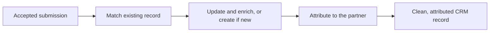
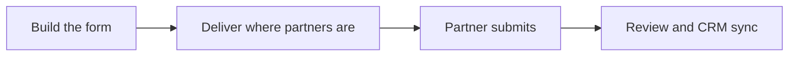
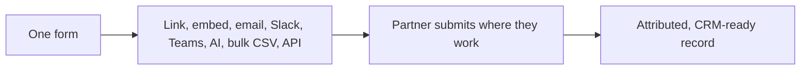
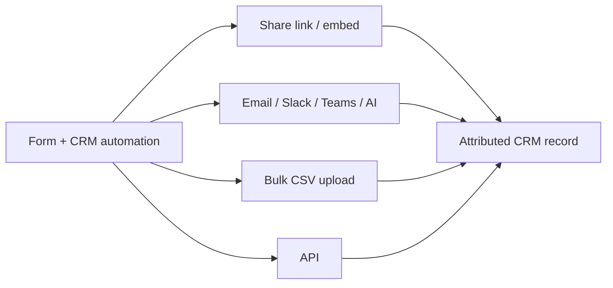
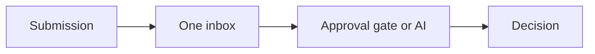

# Introw docs (docs.introw.io): features-forms

Verbatim from docs.introw.io/llms-full.txt, fetched 2026-09-29. 21 pages.

# Connect a form to your CRM
Source: https://docs.introw.io/features/forms/crm-automations/guides/connect-a-form-to-your-crm

Map fields to CRM properties, control how submissions create or update records, attribute them to the partner, and prefill from known data.

> For partner ops or a CRM admin turning partner submissions into clean, attributed CRM records.

A form only pays off when its data lands in the CRM correctly, with no re-keying and no duplicates. This guide wires a form to your CRM end to end: map each field to a property, decide whether a submission creates or updates records and how it fills each property, tie every record back to the submitting partner, and prefill known data so partners confirm instead of retype. It works with HubSpot and Salesforce, with the CRM-specific differences called out where they matter.

## What you'll achieve

A form whose submissions write straight into your CRM the way you intend - creating or updating the right objects, filling properties without clobbering good data, attributed to the correct partner, and prefilled from a known record when the form is opened in context. Partner-attached pipeline and reporting stay accurate without manual cleanup.

## Before you start

<Steps>
  <Step title="Connect your CRM">
    A CRM integration (HubSpot or Salesforce) must be connected and synced. Without it, the mapping controls do not appear.
  </Step>

  <Step title="Have a form with fields">
    The form should already have its fields (see [Build and publish a form](/features/forms/form-builder/guides/build-and-publish-a-form)).
  </Step>

  <Step title="Know your target objects">
    Decide which CRM objects each submission should affect and which properties matter, so you map deliberately.
  </Step>
</Steps>

## Watch it

<Tabs>
  <Tab title="Video">
    <video />
  </Tab>

  <Tab title="Click through">
    <iframe />
  </Tab>
</Tabs>

## Steps

### Map fields to CRM properties

<Steps>
  <Step title="Map each field to an object and property">
    Go to [Forms](https://app.introw.io/forms), open the form on the **Form builder** tab, and select a field. In its **CRM Mapping** section, choose the CRM object the field belongs to and the property its value should write to. A mapped field carries the property's name and type, so the submitted value goes to exactly the right place. Map every field whose answer belongs in the CRM; leave purely informational fields unmapped.
  </Step>
</Steps>

### Configure what each submission writes

<Steps>
  <Step title="Add a CRM object automation">
    Open the **Automation** tab. The column beside the form lists everything a submission does, in four groups: **Submission**, **Review**, **Notifications** and **Records written**. Every CRM record the form writes is an entry under **Records written**, such as **Company**, **Contact** and **Deal**, with a count of the fields it maps. Choose **Add automation** at the bottom to add one for another object, and select an entry to open it.

    <Frame>
      
    </Frame>
  </Step>

  <Step title="Choose which record it writes to">
    The automation opens on **Which `<object>` does this write to?**. Introw resolves the record first, then writes the fields below onto it.

    * **Match or create** (the default) - enrich the matching record, or create one when nothing matches.
    * **Match only** - only enrich a matching record, never add a new one. Use it for a form that must never create duplicates.
    * **Partner's own company** or **Submitter's own contact** - on company and contact automations, always write to the submitting partner's company or the submitter's own contact.

    When the form has a CRM object field for the same object, the record the partner picks wins, and **Create a new `<object>` anyway** makes a fresh record instead.

    <Frame>
      
    </Frame>
  </Step>

  <Step title="Pick the fields that identify an existing record">
    Under **Match on these fields**, choose the form fields that identify an existing record, so a submission updates the right one instead of creating a duplicate. With none set, Introw uses standard matching: name plus domain or website for companies, email for contacts. When nothing on the form can identify an existing record, the automation says so, because every submission then creates a new one, or, with **Match only**, writes nothing.
  </Step>

  <Step title="Set how each property is filled">
    Inside the automation, configure values in two places:

    * **Form fields** - pair a **CRM property** with a **Form field**, so the submitted value fills it.
    * **Default values** - set a fixed **Value** for a CRM property regardless of what the partner submits. Use this for constants like the pipeline, the stage, a deal-name pattern, the owner or, on Salesforce, the **Record Type**.

    For each row, set the **Write mode**:

    * **Fill in if not known** - only writes when the property is empty, so you add missing data without touching existing values. This is the safe default for updates.
    * **Overwrite** - always replaces the current value. Use it only when the form is the authoritative source for that property.

    <Frame>
      
    </Frame>

    Below your own default values, locked rows show what Introw fills itself when the form is submitted, such as the link to the partner behind the submission. Hover a row to see what it points at, or map the same property yourself to override it.

    <Frame>
      
    </Frame>
  </Step>
</Steps>

### Attribute submissions to the partner

<Steps>
  <Step title="Choose how the record is linked to the partner">
    In the automation's **Partner links** block, keep **Submitting partner** on and pick the methods Introw uses to link the record to them, such as **Partner Attribution**. The methods are the ones you already defined on your CRM connection, so there is no per-form wiring. This is what keeps partner-sourced pipeline attributed in the CRM rather than landing as orphaned records.

    <Frame>
      
    </Frame>
  </Step>

  <Step title="Make sure the form knows the partner">
    Share the form with a **Partner link** so submissions are related to that partner, or capture the partner with a partner picker field. Without a known partner, attribution has nothing to write.
  </Step>
</Steps>

### Prefill from a known CRM record

<Steps>
  <Step title="Open the form in record context">
    When a form is opened with a CRM record's context - for example from a CRM embed on that record - its mapped fields prefill with the record's current values. Partners then confirm or correct known data instead of retyping it, which speeds up submission and keeps values consistent. Prefill relies entirely on the field mapping from the first phase, so any field you want pre-populated must be mapped to a property.
  </Step>
</Steps>

### Create a partner from a submission (optional)

<Steps>
  <Step title="Add the Partner automation">
    For forms that onboard brand-new partners (a partner application, for example), choose **Add automation** and add **Partner automation** to create a partner directly from a submission. In its panel you map the **Partner name** and **Partner domain** from form fields, optionally set the new partner's **Tier**, **Phase**, and **Partner manager**, choose the portal **Experience** and **Partner portal access** (**Restricted to invited users** or **Restricted to partner domain**), and optionally turn on **Auto-invite submitter** with a **Welcome message** so the submitter is invited automatically. Note that adding this automation turns off channel-conflict analysis on the form, since the submission is creating a partner rather than registering against an existing one.
  </Step>
</Steps>

### CRM-specific differences

<Steps>
  <Step title="HubSpot: set association labels">
    On HubSpot, a CRM object automation has an **Association labels** section, so created records are linked with the right labeled association (for example which company a contact belongs to). Leave **Use default association label** on unless your HubSpot setup uses specific labeled associations.
  </Step>

  <Step title="Salesforce: map to the matching object and fields">
    On Salesforce, pick the Salesforce object each automation targets and map fields to the matching Salesforce fields. The create/update, write-mode, attribution, and deduplication behavior is the same; only the object and field names differ by CRM.
  </Step>
</Steps>

## Verify it worked

Submit a test through a partner link. In your CRM, the expected records are created or updated with the right values, existing data is preserved where you chose fill-if-empty, no duplicate is created for a matching record, and each record is attributed to the submitting partner. Opening the form from a record's context shows its fields prefilled.

## Related

<CardGroup>
  <Card title="Build and publish a form" icon="pen-ruler" href="/features/forms/form-builder/guides/build-and-publish-a-form">
    Create the form and fields you map here.
  </Card>

  <Card title="Run a submission approval workflow" icon="clipboard-check" href="/features/forms/submissions-approvals/guides/run-a-submission-approval-workflow">
    Review and approve submissions before they act.
  </Card>

  <Card title="Implementation reference" icon="screwdriver-wrench" href="../technical">
    Full configuration options.
  </Card>
</CardGroup>

---

# CRM Automations
Source: https://docs.introw.io/features/forms/crm-automations/index

On submit, Introw forms map fields to CRM properties, attribute to the partner, match existing records to prevent duplicates, and enrich with partner data.

> A form is only as good as what it does with the answer. Introw's CRM automations turn an accepted submission into the right CRM records - mapped, attributed, and deduplicated - without anyone re-keying. The result flips the usual worry about partner-submitted data: instead of a pile of duplicates, Introw matches what already exists and enriches it.

## The problem it solves

<Pains>
  | Without Introw                 | With Introw                      |
  | ------------------------------ | -------------------------------- |
  | Someone re-keys the submission | It writes the CRM record         |
  | Partner data brings duplicates | It matches and updates instead   |
  | Existing records get clobbered | Gaps filled, nothing overwritten |
  | Attribution is wired per form  | Configured once, reused by all   |
</Pains>

## Impact

Partners stop submitting when nothing seems to happen with what they send. A submission that becomes a real CRM record their vendor acts on is what keeps the pipe full.

<Impact>
  for your business

  * **In your CRM**
    A company, contact, lead, deal, ticket or custom object, written with the attribution you already defined
  * **Cost to run**
    Mapping, match keys and write modes are configured per form by partner ops, with no engineering
  * **AI, not admin**
    Matching feeds channel-conflict detection, and AI can validate a submission before it writes anything

  for your partners

  * **Self-serve**
    Their answers identify them automatically, so there is no account matching for anyone to do by hand
  * **Enabled**
    What they submit enriches the record your sales team already owns, which is why it gets used
  * **Efficient**
    They submit once and it exists everywhere, rather than being re-entered and diverging

  [A day in the life of a referral partner](/days-in-the-life/referral-partner)
</Impact>

<Personas>
  * **Partner Operations** - mapping, attribution, match rules
  * **RevOps** - duplicate policy and write modes
</Personas>

## See it work

<Tour>
  * 

    **Add an automation**

    Each form carries its own automations on the Automation tab.

  * 

    **Link to the CRM**

    Auto-link to the CRM, then add company and contact automations.

  * 

    **Set the write mode**

    Starting values, and whether they fill gaps or overwrite.
</Tour>

## How it works

When a submission is accepted, its automation runs a full sequence against your CRM, all configured no-code per form:

* **Field mapping** - each form field maps to a CRM property on the object you choose (company, contact, lead, deal, ticket, or a custom object), writing the submitted value or a fixed value.
* **Auto-attribution** - Introw attaches the partner to the created or updated record using the **attribution method you already defined** on Object Linking. That can be a property, a HubSpot association, a Salesforce lookup, or a relation-table row. You configure attribution once; every form reuses it. See [how to attribute deals to partners](/features/integrations/crm/attribution).
* **Default identity fields** - standard submitter fields (email, first and last name, company) map out of the box, so a partner is identified and their company and contact resolved without custom wiring.
* **Deduplicate, don't duplicate** - before creating anything, Introw looks for the existing record and **updates it instead of making a copy**. It matches a company by name and domain, a contact by email, a deal by its account and contacts. RevOps can tune the exact match keys per object.
* **Enrich the match** - when it finds an existing record, Introw fills the gaps from the submission without clobbering what is already there. The partner's answers become a **second-party enrichment source** for records your sales team already owns.

The flip worth naming: normally a form is where CRM data goes to rot, because someone retypes what the CRM already knows and gets it slightly wrong. Here the form is where the CRM gets cleaner. Prefilled fields come from the live record, so the partner confirms rather than retypes. Mapped answers write straight back to the properties that drive reporting. And an automation can create the follow-up work the moment the answer lands. The partner does less and your data ends up better than before they submitted.

That is why partner-submitted data does not frighten RevOps here. A submission matches the existing company, contact and deal and updates them, so a form never spawns a second copy of a record you already have. On a match the partner's answers fill missing fields - fill-if-empty by default - which makes every submission second-party enrichment rather than noise. You choose the match keys, which fields write, and whether each fills-if-empty or overwrites, so the automation obeys your data model. And when a submission matches an existing *deal*, that is [channel conflict](/features/ai/channel-conflict): Introw flags it for review instead of silently writing.



## Run it from your AI assistant

<Headless>
  * When Acme submits a lead, does it update the existing company or create a new one?
  * Which fields does the deal-registration form write back to the CRM?
</Headless>

## Going deeper

<CardGroup>
  <Card title="How to" icon="screwdriver-wrench" href="./technical">
    Configure mapping, attribution, matching, enrichment, and approval.
  </Card>

  <Card title="API reference" icon="code" href="/general/introduction">
    Integration surface and code.
  </Card>
</CardGroup>

**Works with**

<CardGroup>
  <Card title="Form Builder" icon="table-list" href="/features/forms/form-builder">
    Automations are configured per form.
  </Card>

  <Card title="Sharing & submitting" icon="table-list" href="/features/forms/sharing-submitting">
    Runs on every submission, from any channel.
  </Card>

  <Card title="CRM" icon="plug" href="/features/integrations/crm">
    Writes back using your attribution method.
  </Card>

  <Card title="Channel Conflict Resolution" icon="robot" href="/features/ai/channel-conflict">
    Matching screens submissions against existing pipeline.
  </Card>
</CardGroup>

---

# CRM Automations
Source: https://docs.introw.io/features/forms/crm-automations/technical/index

Configure what a form does on submit: map fields to CRM properties, attribute to the partner, match records to avoid duplicates, and enrich fill-if-empty.

## Where it lives

CRM Automations sits under **Portal**, at [Forms](https://app.introw.io/forms).

<Frame>
  
</Frame>

## Before you start

| You need                              | Why                         | Fix it                                                                            |
| ------------------------------------- | --------------------------- | --------------------------------------------------------------------------------- |
| A connected CRM                       | Automations write into it   | [Connect a CRM](/features/integrations/crm/guides/connect-hubspot)                |
| Write access to forms                 | Automations are form config | [Internal roles](/features/access/team-management/guides/create-an-internal-role) |
| The objects and properties you target | You map onto what exists    | [Connect a CRM](/features/integrations/crm/guides/connect-hubspot)                |

## How it works

Mapping happens in two linked places. In the form builder, each field can be mapped to a CRM
object and property, so the submitted value knows where it belongs. In the form's Automation
tab, CRM object automations decide what happens on submit: which object is created or updated,
how each property is filled, and how the record is attributed to the partner.

Two things run automatically on top of mapping. First, Introw **matches an existing record** before it creates one, so a submission updates the company, contact, or deal you already have instead of duplicating it. Second, it **attributes** the record to the partner using the method you configured on [Object Linking](/features/integrations/crm/attribution) - no per-form attribution wiring. A submission that matches an existing deal is treated as [channel conflict](/features/ai/channel-conflict) and held for review rather than written blind.

Forms can also prefill mapped fields from an existing CRM record when opened with that record's
context, so partners confirm known data instead of retyping it.

## Settings & configuration

Mapping is configured in the form builder and the form's Automation tab.

### Field-level mapping

In a field's settings, map it to a CRM object and property. The field then carries the property
name and type so its value writes to the right place.

A field mapped to a picklist also inherits that picklist's **options**, live from the CRM, so the
values partners choose are always ones the CRM accepts. You can limit which of them this form
offers by unchecking options in the field's configuration: an opt-out list, so options added in the
CRM later still appear automatically. See
[Dropdown options](/features/forms/form-builder/technical#dropdown-options).

### CRM object automations

In the Automation tab, add a CRM object automation for each object a submission should affect.
Configure how each property is set, either from a form field or a fixed value, and the write
behavior, such as filling only if empty or overwriting.

A few properties need a word:

* **Record Type** (Salesforce) - set it under **Default values** to pick the record type the record is created with. **All pipelines** leaves it to the connected user's default record type.
* **Lookups to another record from the same form** - under **Default values**, a lookup can be set **From another automation**, so a deal points at the contact another automation on this form creates. Introw runs the automations in the order those links need, and warns when two automations point at each other.
* **Stage fields** - a stage property offers the stages of the pipeline you chose, and shows **Select pipeline first** until you choose one. On a HubSpot custom object with a pipeline, the stage offers that object's own stages. Salesforce stage and status fields never wait on a pipeline or record type.

### Create versus update

Automations control whether a submission creates a new record, updates an existing one, or skips
creation. When a partner selects an existing CRM object in a field, you can choose whether to
still create a new record.

### Matching and deduplication

Before creating, Introw looks for the record that already exists so a form never spawns a duplicate: a **company** matches on name and domain (including the domain of the submitter's email), a **contact** on its email addresses, and a **deal** on its associated account and contacts within a recent window. When a match is found, Introw updates that record instead. You can tune the match keys per object, so the identity rule fits your data model.

### Identify the submitter

Standard submitter fields - email, first and last name, company - map out of the box, so Introw resolves who submitted and links their contact and company without custom setup. This is what lets attribution and matching work from a plain form.

### Enrichment as a second-party source

Because matched records are updated with **fill-if-empty** by default, the partner's answers fill the gaps you are missing without touching values a rep already set. That turns every submission into a clean second-party enrichment of the records you own, rather than a source of conflicting duplicates.

### Write behavior and safety

Each mapped property carries a write mode, and Introw defaults to the safe one:

* **Fill in if not known** (the default) - Introw re-reads the live CRM value and writes only when it is blank, so it never overwrites a value a rep already entered.
* **Overwrite** - always set the value, for the few fields you want a submission to be authoritative on.

Empty or unmapped values are skipped rather than written, so a submission can never blank out a field. And only fields you have marked **editable** can be written from Introw at all - the same allowlist governs writes from a form, the partner portal, and an AI agent, so a field you did not expose is never touched.

### When records are written

A submission that needs no review is accepted on submit, and its CRM automation runs straight after, in the background.
The partner sees the confirmation screen right away instead of waiting on the CRM, and a pipeline section in their portal adds the new record by itself a few seconds later, without a reload.
Your team's submission notification goes out once the records exist, and a CRM write that fails reaches your team as a submission error instead.
A submission held at an approval gate writes when it is accepted.

### Partner attribution

Created or updated records are attributed to the submitting partner using the **method you already defined** on Object Linking - a property, a HubSpot association, a Salesforce lookup, or a relation-table row - so you never wire attribution per form. A partner chosen in a partner-select field can be attributed as a secondary partner the same way. See [how to attribute deals to partners](/features/integrations/crm/attribution).

The automation's **Partner links** block is where that lands per form, and **Default values** shows the result rather than hiding it: the attribution property, and any lookup your CRM will not create the record without, sit there as locked rows you can hover to see what they point at. Map the same property yourself to override one.
When a default value you set already sends the attribution, Introw skips its own write for it, and **Partner links** says so: `<method> is set as a default value, so it is not listed as a partner link.`

### Prefill

When a form is opened with a CRM record's context, mapped fields can prefill from that record so
partners confirm rather than retype.

A CRM object field's filters bind the partner too.
A field limited to one pipeline only offers records in that pipeline, a prefilled record outside the filters is dropped, and the submit checks the choice again.
A partner whose record fell out of the filters meanwhile reads: `One of the records you selected is no longer available on this form. Refresh the page and pick again.`
The same rule applies over the [forms API](/features/developer/api/technical), which refuses such a submission.

## How-to guides

<Rail>
  * 

    [**Connect a form to your CRM**](/features/forms/crm-automations/guides/connect-a-form-to-your-crm)

    Map fields to CRM properties, control how submissions create or update records, attribute them to the partner, and prefill from known data.
</Rail>

## Troubleshooting

<Warning>
  Mapping depends on a connected CRM integration, so connect HubSpot or Salesforce first. Write behavior matters: overwrite can replace existing CRM values, so use fill-if-empty when you only want to add missing data. Attribution requires the right mappings, or records may sync without being tied to the partner.
</Warning>

<AccordionGroup>
  <Accordion title="A submission did not write to the CRM">
    The field is not mapped, or no CRM automation targets that object.
  </Accordion>

  <Accordion title="An existing record was overwritten">
    The write behavior was set to overwrite instead of fill-if-empty.
  </Accordion>

  <Accordion title="A record is not attributed to the partner">
    The attribution mappings are missing or incomplete.
  </Accordion>
</AccordionGroup>

---

# Build and publish a form
Source: https://docs.introw.io/features/forms/form-builder/guides/build-and-publish-a-form

Create a no-code partner form in Introw: add and configure fields, set the confirmation screen, and publish it via link, embed, portal, or the API.

> For partner ops or partner marketing standing up a new way to collect structured partner input.

Every partner motion that captures input - deal registration, referrals, MDF requests, onboarding, event signups - runs on a form. This guide takes you from an empty form all the way to a live one partners can fill in, covering every field type, the confirmation a partner sees after submitting, and the four ways to deliver the form. Build it once here and reuse the same form across links, your portal, an embed, and the API.

## What you'll achieve

A published, branded form with the exact fields you need, a clear confirmation screen or redirect, and a way for partners to reach it - a general link, a partner-specific link, a section in a partner portal, an embed on your own website, or an API call from your own systems. Submissions flow straight into your **Submissions** inbox.

## Before you start

<Steps>
  <Step title="Confirm access">
    You need write access to forms.
  </Step>

  <Step title="Decide what you are collecting">
    Know the information each submission must capture and, if relevant, which CRM objects it should feed, so you pick the right field types as you build.
  </Step>

  <Step title="Set up a portal domain (only for website embeds)">
    Embedding the form on your own website needs a verified custom domain. A general or partner link and a portal section work without one.
  </Step>
</Steps>

## Watch it

<Tabs>
  <Tab title="Video">
    <video />
  </Tab>

  <Tab title="Click through">
    <iframe />
  </Tab>
</Tabs>

## Steps

### Create the form

<Steps>
  <Step title="Create and name the form">
    Go to [Forms](https://app.introw.io/forms) and create a form. Give it a clear, purpose-led name (for example "Deal registration" or "MDF request") - the name is how you and your team find it later and what partners see at the top of the form. The form opens on the **Form builder** tab, where you add fields and lay out the page. Forms automatically use your portal branding, so the header, colors, and button already match your portal and there is nothing extra to style.

    <Frame>
      
    </Frame>
  </Step>
</Steps>

### Build the fields

<Steps>
  <Step title="Add the fields you need">
    On the **Form builder** tab, use **Add to form** to insert each input, or type `/` in the body to reach the same menu. Choose the type that matches the data you want, so submissions come in structured rather than as free text:

    * **Input field** - a single-line text box for short answers like a name or reference number.
    * **Text area** - a multi-line box for longer notes or context.
    * **File upload** - lets a partner attach documents such as proof of certification, an invoice, or a signed agreement. Use this whenever you need an artifact, not just text.
    * **Checkbox** - a single tick box, ideal for consent or terms acceptance (it defaults to a terms-and-conditions label you can rewrite).
    * **CRM Object** - a picker that lets the partner select an existing record from your CRM (for example a deal or company), so the submission attaches to the right object.
    * **Quote Selector** - shows quotes from a selected deal, for motions where the partner picks a quote.
    * A partner picker (added as **Distributor** or **Reseller**) - lets the submitter choose the partner the submission relates to, which you can use for attribution.
    * **Batch Upload** - lets a partner submit many records at once by CSV. For that whole job, see [Bulk upload multiple records](/features/forms/sharing-submitting/guides/bulk-upload-multiple-records).

    A form is not only fields. The same menu adds content blocks that make a long form easier to complete:

    * **Subtitle** headings, a **Columns layout**, and **Image** break the form into readable sections.
    * **Videos** embed a **YouTube**, **Loom**, **Vimeo**, or **Vidyard** clip straight into the form, with **Embed other** for any other provider. Paste the share URL and it renders inline. Use one to explain what a deal registration needs before the partner starts filling it in, or to walk through the fields of an application form, so the explanation sits with the form instead of in an email nobody opens.

    <Frame>
      
    </Frame>
  </Step>

  <Step title="Configure each field">
    Select a field to open its settings on the right, then set:

    * **Label** - the question or prompt the partner reads. Keep it specific so answers are consistent; you can enable **Label (supports bold, underline, links)** for richer formatting.
    * Placeholder - the greyed-out example text inside the input that hints at the expected format.
    * **Make this field required** - turn this on for any field a submission cannot be without. Required fields block submission until filled, which is what keeps your data complete.
    * **CRM Mapping** - optionally link the field to a CRM object and property so its value writes straight to your CRM with no re-keying. This is optional here; the full create/update behavior is covered in [Connect a form to your CRM](/features/forms/crm-automations/guides/connect-a-form-to-your-crm).

    Specialized fields add their own settings: a **CRM Object** field has **CRM Object Configuration** (its **Object Type**, **Label Property**, and **Filters** for which records appear), and a partner picker has **Partner Filters** (which partners show in the dropdown) and **Attribution Configuration**.

    <Frame>
      
    </Frame>
  </Step>

  <Step title="Limit a CRM dropdown to the options partners should see">
    When a field is mapped to a CRM picklist, its options are synced live from your CRM, so you never maintain a second list. Under **Options (n/m shown)**, uncheck the values this form should not offer - internal-only lead sources, stages partners have no business setting, regions this form does not cover. **Select all** and **Clear all** reset the list.

    This is opt-out on purpose: everything is shown unless you hide it, so a new option your team adds in the CRM shows up on the form automatically rather than quietly going missing. You keep the CRM as the source of the list and still give partners a short, relevant set of choices.

    <Tip>
      Prefer hiding options here over building a separate unmapped dropdown with typed-in **preset options**. A preset list is yours to maintain forever and drifts from the CRM the moment someone adds a value; a limited CRM list cannot drift.
    </Tip>
  </Step>

  <Step title="Lay out and order the form">
    Arrange fields top to bottom in the order you want partners to complete them, and drop in **Subtitle** headings or a **Columns layout** to group related questions. A clear, well-sectioned form is finished more often than a long unbroken list. The submit button reads **Submit** by default.
  </Step>
</Steps>

### Set the confirmation

<Steps>
  <Step title="Choose what partners see after submitting">
    Open the **Automation** tab and select **Submission confirmation** - this controls the moment right after a partner submits, which is what reassures them it worked. Pick one behavior:

    * **End screen** - show a thank-you message inside the form. Use this when the submission is the end of the journey; personalize the wording so the partner knows what happens next.
    * **Redirect to URL** - send the partner to another page after submitting. Choose this to route them onward (for example to a resource or scheduling page), and enter the destination in the **Redirect URL** field.

    If you set nothing, partners see a generic thank-you screen by default, so configure this whenever the next step matters.
  </Step>
</Steps>

### Share and publish

<Steps>
  <Step title="Open the share options">
    Choose **Share form** in the editor. The dialog has a **Link** tab, an **Embed** tab, and an **API** tab, covering the four delivery options below. A banner notes that submissions from the link and the embed are secured with reCAPTCHA to keep out spam - this is automatic, with nothing to configure.

    <Frame>
      
    </Frame>
  </Step>

  <Step title="Send a share link">
    On the **Link** tab, copy one of:

    * **General link** - works for anyone you send it to. Introw attributes the submission on a best-effort basis, so use this for broad or unknown audiences.
    * **Partner link** - tied to a specific partner, so every submission through it is automatically related to that partner. Use this whenever you want clean attribution without asking the partner to identify themselves.

    Send the copied link by email or chat.

    <Frame>
      
    </Frame>
  </Step>

  <Step title="Add the form to a partner portal">
    To collect input where partners already are, add the form as a section in a portal experience. Go to [Experience builder](https://app.introw.io/templates), open the experience, add a form section in the stage you want, and pick this form. Partners then submit in context as part of the portal rather than chasing a separate link.
  </Step>

  <Step title="Embed the form on your website (optional)">
    On the **Embed** tab, copy the HTML snippet to place the form on your own site. This option needs a verified custom domain; if you have not set one up, the dialog prompts you with **Configure custom domain** first.
  </Step>

  <Step title="Let your systems submit it over the API (optional)">
    Not every submission needs a person at a form. On the **API** tab, copy the cURL snippet: it already carries this form's id and every field id, and the **Fields** table below marks which ones are required. Your own product, an internal tool, a script, or an agent can then submit this form from anywhere, running the same automations and approval flow. Full setup is in [Submit a form via the API](/features/forms/sharing-submitting/guides/submit-a-form-via-the-api).

    <Frame>
      
    </Frame>
  </Step>
</Steps>

## Verify it worked

The form appears on [Forms](https://app.introw.io/forms) and opens correctly from each link you shared. Submit a test: required fields block until filled, the confirmation behaves as you set it (end screen or redirect), and the submission lands in your [Submissions](https://app.introw.io/submissions) inbox - attributed to the partner when you used a partner link.

## What your partners experience

After you publish it, partners open the form from the portal (or your shared link), fill it in, and submit. Where you added an approval step, they can see where their submission stands - pending, accepted, declined, or returned for changes - and resubmit if you return it. So the form you build here is not just intake for you; it is a status a partner can track themselves without emailing for an update.

## Related

<CardGroup>
  <Card title="Bulk upload multiple records" icon="layer-group" href="/features/forms/sharing-submitting/guides/bulk-upload-multiple-records">
    Let partners submit many records in one form.
  </Card>

  <Card title="Connect a form to your CRM" icon="arrows-rotate" href="/features/forms/crm-automations/guides/connect-a-form-to-your-crm">
    Write submissions back to your CRM, attributed to the partner.
  </Card>

  <Card title="Run a submission approval workflow" icon="clipboard-check" href="/features/forms/submissions-approvals/guides/run-a-submission-approval-workflow">
    Review, approve, and notify on what comes in.
  </Card>

  <Card title="Implementation reference" icon="screwdriver-wrench" href="../technical">
    Full configuration options.
  </Card>
</CardGroup>

---

# Partner form templates & use cases
Source: https://docs.introw.io/features/forms/form-builder/guides/partner-form-templates

Partner form templates: deal registration, lead capture, support, MDF requests, partner applications, purchase orders, events, and feedback.

> For partner ops deciding what to build first. Introw forms are one engine behind many partner motions, so most of what you need is a recipe, not a new tool. This gallery shows the common partner forms, the fields each needs, and the CRM automation that turns a submission into a clean record, with a link to the full guide for each.

A form is never just a form: on submit it runs a CRM automation that maps fields to your objects, attributes the record to the partner, matches existing records so it enriches instead of duplicating, and routes through the approval you set. That is why the same builder produces a deal registration, a support request, an MDF claim, or a partner application. Pick the recipe closest to your need and start from its guide; the pattern is the same underneath.

## What you'll achieve

A clear starting point for whichever partner form you need, and an understanding of the automation that makes each one land as attributed, deduplicated CRM data rather than a row in a form silo.

## Before you start

<Steps>
  <Step title="Know the builder basics">
    Each recipe below assumes you can add fields and map them to your CRM. If you are new to the builder, start with [Build and publish a form](./build-and-publish-a-form) and [Connect a form to your CRM](/features/forms/crm-automations/guides/connect-a-form-to-your-crm), then come back and pick a recipe.
  </Step>
</Steps>

## Pick a form to build

<AccordionGroup>
  <Accordion title="Deal registration" icon="file-signature">
    **Goal:** let a partner register a deal so it is credited to them and screened for overlap before it reaches your pipeline.

    <Frame>
      
    </Frame>

    **Key fields:** end-customer company and contact, deal name, amount, expected close, and a partner picker (or a partner-specific link) for attribution.

    **The automation that makes it work:** creates the opportunity, account, and contact in your CRM, attributes them to the partner, and runs channel-conflict screening so a registration is only credited once.

    **Start here:** [Deal Registration](/features/deal-registration).
  </Accordion>

  <Accordion title="Lead sharing / referral" icon="share-nodes">
    **Goal:** let a partner pass you a referral that lands attributed, even before it is qualified.

    **Key fields:** prospect company and contact, a short context note, and partner attribution.

    **The automation that makes it work:** creates an attributed lead (and, when partner-qualified, the opportunity, account, and contact), matching existing records so referrals enrich your CRM instead of duplicating it.

    **Start here:** [Lead Sharing](/features/referrals/lead-sharing) and [Ways to refer a deal](/features/referrals/lead-sharing/guides/ways-to-refer).
  </Accordion>

  <Accordion title="Partner application" icon="user-plus">
    **Goal:** a self-serve application that turns an applicant into a partner in one step.

    **Key fields:** company details, primary contact, and any qualifying questions you screen on.

    **The automation that makes it work:** creates the partner in Introw, links the company and contact records in your CRM, and invites the applicant to their portal, so onboarding starts the moment they are accepted. This is the one recipe with a partner-creation automation, which is why it has its own guide.

    **Start here:** [Set up a partner application form](./set-up-a-partner-application-form).
  </Accordion>

  <Accordion title="MDF request, claim & ROI" icon="sack-dollar">
    **Goal:** run the marketing-development-fund lifecycle - request funds, claim spend, and report outcomes - as a sequence of forms.

    **Key fields:** activity name and type (a picklist), requested amount, dates, and supporting detail; later stages capture proof of spend and results.

    **The automation that makes it work:** each stage is a form with its own approval gate, tied to a fund budget so allocations, claims, and ROI reconcile against it.

    **Start here:** [MDF](/features/mdf).
  </Accordion>

  <Accordion title="Support or ticket request" icon="life-ring">
    **Goal:** give partners a structured way to raise a support request instead of an unstructured email.

    **Key fields:** subject, description, priority (a picklist), and the related company or deal.

    **The automation that makes it work:** creates a ticket in your CRM attributed to the partner, so it enters the same queue your team already works.

    **Start here:** [Build and publish a form](./build-and-publish-a-form), then map the fields to your ticket object in [Connect a form to your CRM](/features/forms/crm-automations/guides/connect-a-form-to-your-crm).
  </Accordion>

  <Accordion title="Purchase order or quote request" icon="file-invoice">
    **Goal:** capture PO or quote details tied to a specific deal.

    **Key fields:** the related deal (a CRM object picker), line-item or amount detail, and any reference numbers.

    **The automation that makes it work:** attaches the details to the deal in your CRM so quoting and fulfilment stay on the same record.

    **Start here:** [Quotes](/features/cpq/quotes).
  </Accordion>

  <Accordion title="Event or webinar registration" icon="calendar-check">
    **Goal:** collect partner sign-ups for an event, webinar, or program.

    **Key fields:** attendee name and email, company, and any session or preference choices (picklists).

    **The automation that makes it work:** creates or updates the contact and records the registration, attributed to the partner who drove it.

    **Start here:** [Build and publish a form](./build-and-publish-a-form).
  </Accordion>

  <Accordion title="Feedback or NPS" icon="comment-dots">
    **Goal:** hear from partners with a lightweight satisfaction or feedback form.

    **Key fields:** a score or rating, a comment, and the partner (via a partner-specific link).

    **The automation that makes it work:** stores the response against the partner so you can track sentiment over time.

    **Start here:** [Build and publish a form](./build-and-publish-a-form).
  </Accordion>

  <Accordion title="Bulk record upload" icon="table-list">
    **Goal:** let a partner submit a whole list - leads, end customers, or assets - in one pass rather than one entry at a time.

    **Key fields:** the same per-record fields as the single-entry form, plus a batch upload field.

    **The automation that makes it work:** each CSV row runs through the form's automation like an individual submission, validated against your picklists and rules before it lands.

    **Start here:** [Bulk upload multiple records](/features/forms/sharing-submitting/guides/bulk-upload-multiple-records).
  </Accordion>
</AccordionGroup>

## Verify it worked

Whichever recipe you build, submit a test entry and confirm it lands in [Submissions](https://app.introw.io/submissions) and creates or updates the expected record in your CRM, attributed to the partner.

## Related

<CardGroup>
  <Card title="Build and publish a form" icon="pen-ruler" href="./build-and-publish-a-form">
    The builder basics behind every recipe.
  </Card>

  <Card title="Connect a form to your CRM" icon="arrows-rotate" href="/features/forms/crm-automations/guides/connect-a-form-to-your-crm">
    Map fields, attribute, and match records for any form.
  </Card>

  <Card title="Ways to submit a form" icon="paper-plane" href="/features/forms/sharing-submitting/guides/ways-to-submit-a-form">
    Get any of these forms in front of partners.
  </Card>

  <Card title="Set up a partner application form" icon="user-plus" href="./set-up-a-partner-application-form">
    The full walkthrough for the application recipe.
  </Card>
</CardGroup>

---

# Set up a partner application form
Source: https://docs.introw.io/features/forms/form-builder/guides/set-up-a-partner-application-form

Turn a form into a self-serve partner application that auto-creates the partner, links company and contact records in your CRM, and invites the portal.

> For partner ops or partner marketing who want a self-serve on-ramp that recruits partners and sets them up without manual data entry.

A partner application form is how new partners join your program on their own. This guide takes the whole job end to end: build (or open) the application form, add the **Partner automation** action so a submission creates a fully populated partner in Introw, link company and contact records back to your CRM, assign each applicant a starting tier, phase, manager, and portal experience, and optionally invite them to their portal automatically. Set it up once and every accepted application becomes a real, attributed partner with a linked CRM record, no CRM workflow required.

## What you'll achieve

A published application form that, on each submission, creates the partner in Introw, links a company and contact in your CRM, applies your default tier, phase, manager, and experience, and (optionally) emails the applicant a portal invitation. You can also surface the form on your portal login page and add a human review step before anyone is created.

## Before you start

<Steps>
  <Step title="Connect your CRM (recommended)">
    To auto-create linked company and contact records, a CRM must be connected. See [Connect HubSpot](/features/integrations/crm/guides/connect-hubspot) or [Connect Salesforce](/features/integrations/crm/guides/connect-salesforce). The partner is still created in Introw without a CRM, you just skip the CRM linking.
  </Step>

  <Step title="Have an experience to assign (recommended)">
    Assigning a portal **Experience** in the automation is what lets you auto-invite applicants. See [Build and publish a portal experience](/features/portal/experiences/guides/build-and-publish-a-portal-experience).
  </Step>

  <Step title="Know your starting defaults">
    Decide the tier, lifecycle phase, and partner manager every new applicant should start with, so onboarding and attribution are correct from day one.
  </Step>
</Steps>

## Watch it

<Tabs>
  <Tab title="Video">
    <video />
  </Tab>

  <Tab title="Click through">
    <iframe />
  </Tab>
</Tabs>

## Steps

### Build the application form

<Steps>
  <Step title="Open or create the form">
    Go to [Forms](https://app.introw.io/forms) and open an existing partner application form, or create a new one. This form is what applicants fill in, so include the fields you need to qualify and create a partner, such as company name, website, and the applicant's contact details.

    <Frame>
      
    </Frame>

    <Frame>
      
    </Frame>
  </Step>

  <Step title="Set up the terms and conditions checkbox (optional)">
    A partner application form includes a terms and conditions checkbox by default, so applicants explicitly agree before they are created. Two things make it work for you:

    * **Link to your terms** - in the field label, replace the placeholder URL with the link to your own terms and conditions page so applicants can read them before agreeing.
    * **Record acceptance in your CRM (optional)** - map the checkbox to a CRM property in the automation later, so you keep a clean compliance record of who accepted and when. Map it to a boolean property to record acceptance and, if you like, a date/time property to capture the moment.

    If terms acceptance is not relevant for your program, remove the field.
  </Step>
</Steps>

### Add the Partner automation

<Steps>
  <Step title="Open the Automation tab and add Partner automation">
    Open the form's **Automation** tab (the second tab of the form editor), select **Add automation**, and choose **Partner automation**. This is the action that turns a submission into a real partner, everything below is configured inside it.

    <Frame>
      
    </Frame>

    <Frame>
      
    </Frame>
  </Step>

  <Step title="Review Enrich Partner">
    At the top of the **Partner automation** block, **Enrich Partner** matches each submission against existing partners using the form fields provided and enriches the match instead of creating a duplicate. This keeps partner data accurate and attribution clean. There is nothing to switch on, it is how the action behaves.

    <Frame>
      
    </Frame>
  </Step>

  <Step title="Auto-link to CRM">
    Under **Auto-link to CRM**, select **Add** for each record type you want created and linked in your CRM:

    * **Company automation** - creates the partner company in your CRM and enables deal attribution, so you always know which partner sourced each record.
    * **Contact automation** - saves the applicant as a contact in your CRM, linked to the partner company.

    Both are optional but recommended for a fully linked setup. After adding each, use **Configure** to map which form fields fill which CRM properties.

    <Frame>
      
    </Frame>

    <Frame>
      
    </Frame>
  </Step>
</Steps>

### Populate and set up the partner

<Steps>
  <Step title="Map form fields to partner properties">
    Under **Form fields**, map each form field to the matching partner property. At minimum map **Partner name** to your company-name field; **Partner domain** is optional. For each mapping, set a **Write Mode**:

    * **Fill in if not known** - only writes when the property is empty, so you never overwrite existing data. This is the safe default for enrichment.
    * **Overwrite** - always replaces the current value with the submission.
  </Step>

  <Step title="Set the partner's starting values">
    Under **Partner setup**, define fixed values applied to every partner this form creates, so applicants start correctly placed:

    * **Tier** - the tier a new applicant starts in.
    * **Phase** - the lifecycle stage, for example a "Potential partner" phase, so the applicant enters your funnel at the right point.
    * **Partner manager** - the team member made responsible for the partner from the start.

    Each also has a **Write Mode** so you control whether these overwrite an enriched partner's existing values.

    <Frame>
      
    </Frame>

    <Frame>
      
    </Frame>
  </Step>
</Steps>

### Give access and go live

<Steps>
  <Step title="Assign the portal experience and access">
    Under **Portal settings**, choose the **Experience** every new partner should land in, so their portal is ready on day one. Set **Partner portal access** to control who can open it: **Restricted to invited users** (only the people you invite) or **Restricted to partner domain** (anyone on the partner's email domain).
  </Step>

  <Step title="Auto-invite the applicant (optional)">
    Turn on **Auto-invite submitter** to email the applicant a portal invitation once their application is processed. Add an optional **Welcome message** that appears in the invitation email, and use **Preview email** to see exactly what the partner will receive before going live. Auto-invite requires an assigned experience.
  </Step>

  <Step title="Require review before creation (optional)">
    By default every application is processed automatically. If your program has a vetting step, enable approval on the form so submissions land in your approval queue first: no partner and no CRM records are created until you approve. See [Run a submission approval workflow](/features/forms/submissions-approvals/guides/run-a-submission-approval-workflow).
  </Step>

  <Step title="Save and publish">
    Save your changes and publish the form. From now on, every accepted application instantly creates a fully populated partner in Introw and the linked records in your CRM.
  </Step>
</Steps>

### Put it in front of applicants

<Steps>
  <Step title="Add it to your portal login page">
    Anyone who reaches your partner portal without an account is a potential applicant, so the login page is the one place the form has to be.

    Go to [Portal settings](https://app.introw.io/settings/portal) and open the **Become a partner** tab, beside **Login**, **Verification** and **No Access**. Pick your application form, then write the two lines a visitor reads: **Prompt text**, the question above the link, which defaults to "Don't have a partner account?", and **Link text**, the link itself, such as "Become a partner". Save the portal settings.
  </Step>

  <Step title="Know what the visitor gets">
    The link sits under the sign-in box, and only for someone who has no portal access yet, so partners who already have a portal never see an invitation to apply again. Opening it launches the form in a dialog on the login page, prefilled with the email address they just typed, so applying never means leaving your portal or waiting for a link.
  </Step>

  <Step title="Share it anywhere else you recruit">
    The same form has a general link, an embed for your website, and an API endpoint, so a partner page, a campaign or your own product can feed the same application. See [Ways to submit a form](/features/forms/sharing-submitting/guides/ways-to-submit-a-form).
  </Step>
</Steps>

## Verify it worked

Submit a test application. A new partner appears in Introw enriched with the mapped fields and your default tier, phase, and manager; the linked company and contact show up in your CRM; and, if you enabled it, the applicant receives the portal invitation email for the experience you assigned. With approval enabled, the submission instead waits in your approval queue and nothing is created until you approve it.
Open your portal login page in a private window to confirm the **Become a partner** link is there and opens the form.

## Related

<CardGroup>
  <Card title="Build and publish a form" icon="book-open" href="./build-and-publish-a-form">
    Create the form and its fields before wiring the automation.
  </Card>

  <Card title="Connect a form to your CRM" icon="plug" href="/features/forms/crm-automations/guides/connect-a-form-to-your-crm">
    Map form fields to CRM properties and attribute submissions.
  </Card>

  <Card title="Run a submission approval workflow" icon="user-check" href="/features/forms/submissions-approvals/guides/run-a-submission-approval-workflow">
    Add a human review step before partners are created.
  </Card>

  <Card title="Implementation reference" icon="screwdriver-wrench" href="../technical">
    Full configuration options.
  </Card>
</CardGroup>

---

# Show fields conditionally
Source: https://docs.introw.io/features/forms/form-builder/guides/show-fields-conditionally

Build one form that adapts: fields that appear only when they are relevant, questions that become mandatory only when they apply, and whole sections that unfold from a single answer.

A form that asks everyone everything is the fastest way to lose a submission.
The usual escape is to split it into four near-identical forms, which then drift apart and multiply the CRM mapping you have to maintain.
Conditional fields let you keep one form and let it adapt: each field can carry rules about when it appears, so a partner sees the three questions their case needs and never the twelve it does not.
This guide builds those rules, including the pattern most people come looking for, a field that is mandatory only in one case.

## What you'll achieve

One form whose questions follow the answers.
A reason field that appears only for the outcome that needs explaining and is required the moment it appears, a whole block of follow-up questions that unfolds from a single choice, and a cascade that collapses cleanly when the partner changes their mind.
The same rules apply in the portal, in the validation that runs on submit, and in the CSV batch-upload path, so a hidden question is never submitted and never written to your CRM.

## Before you start

<Steps>
  <Step title="Have the form and its fields">
    Conditions point at other fields on the same form, so add the fields first and wire the rules second. See [Build and publish a form](/features/forms/form-builder/guides/build-and-publish-a-form).
  </Step>

  <Step title="Know which answer drives the branch">
    Every rule needs a field to read. Dropdowns and checkboxes make the best drivers because their values are a fixed set. Free text works but ages badly: a rule on typed text breaks the day someone types it differently.
  </Step>
</Steps>

## Steps

### Plan the branches before you build them

<Steps>
  <Step title="List the cases your form actually has">
    Write down the two or three real cases the form covers and, for each, the questions only that case needs. This is the whole design. A form with one driver field and three short branches reads well; a form where nine fields each carry their own unrelated rule reads like a puzzle, and nobody can tell what it does six months later.
  </Step>

  <Step title="Decide what is genuinely mandatory">
    Mark a question required only when you cannot act on the submission without it. Required is enforced only while a field is visible, so you can be strict inside a branch without punishing the partners that branch does not apply to.
  </Step>
</Steps>

### Make a field appear only when it is relevant

<Steps>
  <Step title="Open the field that should be conditional">
    Go to [Forms](https://app.introw.io/forms), open your form and its builder, and select the field that should not always show. The rules live on the field that appears, not on the field that drives it, which is worth remembering when you go looking for them later.

    <Frame>
      
    </Frame>
  </Step>

  <Step title="Add a visibility condition">
    Add a condition and point it at another field on the form, then choose how to compare its value. A field with no conditions is always visible, so the first condition you add is what makes it conditional.

    The operators are the same ones Introw uses everywhere: equals, does not equal, contains, does not contain, starts with, ends with, greater than, less than, is any of, is none of, and is unknown. **Is any of** is the one to reach for when several answers should reveal the same field, because it keeps one rule where you would otherwise write three.
  </Step>

  <Step title="Combine rules when one is not enough">
    Add further conditions and join them with **and** or **or**, and nest groups when a rule genuinely needs both, such as an amount over a threshold in either of two regions. Keep the nesting shallow: if you cannot read the rule aloud, the partner will not be able to predict the form either.

    For a multi-select field, a rule is tested against each selected value, so a condition on one option keeps matching after the partner picks a second one.
  </Step>

  <Step title="Confirm the field is marked as conditional">
    A field with conditions shows a **Conditional** pill in the builder. Use it to read the branching at a glance and to spot the field that was supposed to be conditional and never got its rule.
  </Step>
</Steps>

### Make a question mandatory only in the case that needs it

<Steps>
  <Step title="Mark the field required and give it a condition">
    There is no separate conditionally-required setting, and this is the part worth internalising: **required is only enforced while the field is visible**. Mark the field required, then give it the visibility condition for the case it belongs to. Outside that case the field is not on screen and not enforced; inside it, the partner cannot submit without it.

    The classic shape is an outcome and its explanation. Show a reason field when the outcome field equals the outcome that needs explaining, mark it required, and the reason becomes unavoidable exactly when it matters.
  </Step>

  <Step title="Use the same mechanic for either/or">
    When you need one of two answers but do not care which, give the second field the condition "the first field is unknown" and mark the second required. Answering the first hides the second; leaving the first empty makes the second mandatory. One of the two always gets answered, and the partner never sees both demanded at once.
  </Step>
</Steps>

### Unfold a whole section from one answer

<Steps>
  <Step title="Put the driver question first">
    Lead with the dropdown or checkbox that decides the case, so the partner makes one choice and the form shapes itself around it rather than reshuffling as they scroll.
  </Step>

  <Step title="Give every field in the block the same condition">
    Apply the identical condition to each follow-up question and they appear and disappear together as a block. Headings and other content blocks are not fields and carry no rules, so keep a heading that belongs to one branch short, or word it so it reads sensibly whichever branch is open.
  </Step>

  <Step title="Chain a cascade where the answers narrow">
    Point a third field at the second field's answer and you get a cascade: outcome, then reason, then sub-reason. Conditions chain and collapse together, so flipping the first answer hides everything below it in one step instead of leaving a stale sub-question on screen off a value the partner can no longer see.
  </Step>
</Steps>

### Check it the way a partner will meet it

<Steps>
  <Step title="Preview the form and walk each branch">
    Open the form as a partner sees it and walk every case you planned. Watch for the two failures that matter: a question that should have appeared and did not, and a required question stranded in a branch nobody reaches.
  </Step>

  <Step title="Try to submit an incomplete branch">
    Open a branch, leave its required field empty, and submit. The submission is refused, because the same rules run in the validation on submit rather than only in the browser.
  </Step>

  <Step title="Check the batch path if partners use it">
    If this form accepts CSV batch upload, the same rules apply there too, so a row that does not open a branch is not asked for that branch's columns. See [Share and submit a form](/features/forms/sharing-submitting).
  </Step>
</Steps>

## Verify it worked

Submit the form once per case and open the submissions inbox.

* Each submission carries only the fields its branch actually showed. A hidden field is never submitted, never validated, and never written to your CRM, so your reports are not full of blank columns from branches nobody opened.
* The required field inside a branch is filled on every submission that opened it.
* Your CRM records carry the branch's answers on the properties you mapped, and nothing on the properties belonging to branches that stayed closed.

<Warning>
  Conditional visibility is a relevance feature, not an access-control or security one.
  It decides which questions are worth asking; it is not a way to hide sensitive content from a partner who has the form's link.
  What a partner is allowed to see and do is governed by [segments and permissions](/features/partners/segments/technical).
</Warning>

## Limits & gotchas

* **Rules point at fields, so deleting a field breaks the rules that read it.** A condition whose field no longer exists stops matching, which hides the field that depended on it. If a question disappears after an edit, check whether its driver field was removed or replaced.
* **A malformed rule fails open.** A condition Introw cannot read is ignored rather than applied, so a field is shown rather than silently hidden. Broken rules cost you a stray question, never a lost answer.
* **Keep the driver's options stable.** A rule matches a value, so renaming the option a rule depends on means revisiting the rule.

## Related

<CardGroup>
  <Card title="Let partners update a deal with guardrails" icon="chart-line" href="/features/co-selling/shared-pipelines/guides/let-partners-update-a-deal-with-guardrails">
    These rules put to work on a shared deal, behind a button that hides itself.
  </Card>

  <Card title="Connect a form to your CRM" icon="plug" href="/features/forms/crm-automations/guides/connect-a-form-to-your-crm">
    Where the answers land, and the write modes that decide whether they stick.
  </Card>

  <Card title="Build and publish a form" icon="pen-to-square" href="./build-and-publish-a-form">
    The form itself, end to end.
  </Card>

  <Card title="Implementation reference" icon="screwdriver-wrench" href="../technical">
    Full configuration options.
  </Card>
</CardGroup>

---

# Test a form before partners see it
Source: https://docs.introw.io/features/forms/form-builder/guides/test-a-form-before-partners-see-it

Submit a form the way a partner will, confirm the CRM record and notifications it produces, walk every outcome, and clean up the test without leaving records behind.

> For anyone about to hand a form to partners who wants to see it work first.

A form is the only part of a partner program where a silent failure is invisible until a partner is already annoyed.
It renders fine, it accepts a submission, and the record writes nowhere because one field is not mapped or a CRM validation rule rejected the value.
The fix is five minutes of dry run, once, before anyone external sees it.
This guide is that dry run, including the cleanup, so the test does not leave a fake deal in your pipeline.

## What you'll achieve

One test submission taken all the way through: the form as a partner sees it, the submission in your inbox, the record in your CRM with the right owner and the right partner attributed, the notifications that fired, every outcome exercised, and both the test submission and its CRM record removed afterwards.

## Before you start

<Steps>
  <Step title="Finish the form and its automation">
    Test after the CRM automation is configured, not before.
    A form with no automation will pass this test and still be useless.
    See [Build and publish a form](./build-and-publish-a-form) and [Connect a form to your CRM](/features/forms/crm-automations/guides/connect-a-form-to-your-crm).
  </Step>

  <Step title="Pick a partner to test as">
    Use an internal partner record, or a real partner you have an actual relationship with, not your largest one.
    You are about to create and delete a record attributed to them.
    See [Create a partner manually](/features/partners/partner-management/guides/create-a-partner-manually).
  </Step>
</Steps>

## Steps

### Submit it the way a partner will

<Steps>
  <Step title="Take the partner link, not the general link">
    Go to [Forms](https://app.introw.io/forms), open the form and choose **Share form**.
    On the **Link** tab there are two links, and the difference matters for the test.

    * **General link** is anonymous. Nobody is attributed, and the submitter has to type their own details.
    * **Partner link** is scoped to one partner you select. The submission arrives already attributed to them, and the standard submitter fields resolve their contact and company on their own.

    Test with the **Partner link**, because that is what a real partner uses from their portal, and attribution is most of what you are testing.
    If you plan to share the form publicly, test the general link too: it exercises a genuinely different path.
  </Step>

  <Step title="Open it in a fresh browser session">
    Open the link in a private window or a different browser, so you see it as an outside visitor rather than as a signed-in admin.
    Check the obvious things while you are there: does the form explain itself, is the field count something a partner will actually finish, and does every required field deserve to be required.
    A field you cannot justify out loud is a field to cut, since every one of them costs you submissions.
  </Step>

  <Step title="Submit realistic values, then submit bad ones">
    Fill it as a partner would and submit.
    Then submit a second time on purpose badly: leave a conditionally required field blank, put a value in a picklist-backed field that is not one of your CRM's options, and use a date or amount format your CRM is fussy about.

    You are looking for two behaviours.
    A validation error the partner can act on is the good outcome.
    A submission that lands in **Error** means it reached Introw but your CRM refused to write it, which is almost always a required property or a validation rule on the object.
    Better to find that now than on a partner's first registration.
  </Step>
</Steps>

### Follow it all the way through

<Steps>
  <Step title="Confirm it landed with the status you expect">
    Go to [Submissions](https://app.introw.io/submissions) and find it.
    Check the status is the one your configuration implies: **Pending** if you set an approval gate, **Auto accepted** if you did not, or **Accepted** once you approve it.
    Check the partner column names your test partner rather than being empty, since an unattributed submission cannot be bulk accepted and will not credit anyone.
  </Step>

  <Step title="Open the record in your CRM">
    This is the step people skip and the one that catches real problems.
    Open the record the submission created and check it field by field:

    * Every field the partner filled arrived, in the right property, in a usable format.
    * The record is on the object and pipeline you intended, at the stage you intended.
    * The owner is the person who should be working it, not whoever the CRM defaults to.
    * The name follows your convention rather than reading as an ID.
    * The partner is attributed by whichever method you configured, so reporting and commissions will resolve.

    See [Configure partner deal owner and name](/features/deal-registration/registration/guides/configure-partner-deal-owner-and-name) and [Configure deal attribution](/features/co-selling/shared-pipelines/guides/configure-deal-attribution).
  </Step>

  <Step title="Check who got told">
    A form nobody is alerted about is a form that waits.
    Confirm the on-submit alert reached your team, including the partnership-manager fallback if no team member could be resolved, and that it arrived on the channel you expect rather than only by email.
    See [Configure the chat integration](/features/integrations/chat/guides/configure-the-chat-integration).
  </Step>
</Steps>

### Exercise every outcome

<Steps>
  <Step title="Return it and check the partner's side">
    Return the test submission with a specific comment, then reopen the form as the partner.
    Their previous answers should be prefilled and your comment shown with them, and their edit should update the same submission rather than creating a second one.
    This is the outcome worth rehearsing, because a returned submission with a vague comment is the one that never comes back.
  </Step>

  <Step title="Decline it, then reopen it">
    Decline it and confirm the partner receives your decline message rather than a bare status change.
    Then use **Reopen** at the top of the declined submission and confirm it returns to **Pending** and re-enters the approval gate from the first step.
  </Step>

  <Step title="Accept it last">
    Accept it only when you are done, because accepting is the one outcome you cannot undo.
    It runs the CRM automations and tells the partner yes.
    See [Choose how submissions get approved](/features/forms/submissions-approvals/guides/choose-an-approval-model).
  </Step>
</Steps>

### Clean up properly

<Steps>
  <Step title="Delete the test submission">
    Select it in the inbox and choose **Delete**.
    This permanently removes the submission and tells no partner anything, which is exactly what you want for a test.
    It is not a decline, and it cannot be undone.
  </Step>

  <Step title="Delete the CRM record separately">
    Deleting the submission does not delete the record it created in your CRM.
    That record is real, it is in someone's pipeline, and it will show up in a forecast if you leave it.
    Delete it in your CRM as a second, deliberate step.

    <Warning>
      This is the step that gets forgotten. A test deal registration that was accepted leaves a live deal attributed to a real partner, which can also flow into commission calculations. Delete it in the CRM before you move on.
    </Warning>
  </Step>
</Steps>

## Verify it worked

You have seen the form render as an outsider, one submission arrive attributed to the right partner, one clean record in your CRM with the right owner and name, an alert reach your team, and a return arrive back with the partner's prior answers intact.
Nothing is left in the inbox and nothing is left in the pipeline.

Do this again after any change to the form's fields or its CRM automation.
It is the cheapest test in the product and the only one that covers the whole path.

## Related

<CardGroup>
  <Card title="Build and publish a form" icon="pen-ruler" href="./build-and-publish-a-form">
    The build this test verifies.
  </Card>

  <Card title="Connect a form to your CRM" icon="database" href="/features/forms/crm-automations/guides/connect-a-form-to-your-crm">
    The mapping most test failures come back to.
  </Card>

  <Card title="Choose how submissions get approved" icon="circle-check" href="/features/forms/submissions-approvals/guides/choose-an-approval-model">
    What each outcome does to the partner.
  </Card>

  <Card title="Implementation reference" icon="screwdriver-wrench" href="../technical">
    Full configuration options.
  </Card>
</CardGroup>

---

# Form Builder
Source: https://docs.introw.io/features/forms/form-builder/index

Build no-code, on-brand partner forms in minutes and put them in front of partners through share links, website embeds, and portal sections in Introw.

> The Form Builder lets your team create on-brand forms without code and deliver them anywhere partners are: a share link, an embed, or a section in the portal.

## The problem it solves

Collecting partner information usually means messy spreadsheets and email back-and-forth:

<Pains>
  | Without Introw                    | With Introw                       |
  | --------------------------------- | --------------------------------- |
  | Building a form needs engineering | Your team builds it themselves    |
  | Forms look off-brand              | They inherit your portal branding |
  | Partners cannot reach the form    | A link, an embed or a section     |
  | Input arrives unstructured        | Defined fields, every time        |
</Pains>

## Impact

Partners judge you on the first form they fill in. One that looks like your product, asks only what it needs and offers their own records to pick from is a small thing they remember.

<Impact>
  for your business

  * **Cost to run**
    Anyone on your team assembles fields, layout and branding, so a new field never waits on engineering
  * **Live in days**
    A form is built, branded and collecting in minutes, not after a design and development cycle

  for your partners

  * **Self-serve**
    They fill it in with no CRM seat, and pickers offer them your real CRM records to choose from
  * **Enabled**
    Required fields, instructions and headings tell them what good looks like as they type
  * **Efficient**
    A quote selector or an object picker, instead of retyping something you already have

  [A day in the life of a referral partner](/days-in-the-life/referral-partner)
</Impact>

<Personas>
  * **Partner Operations** - forms without engineering
  * **Partner Marketing** - on-brand forms in journeys
  * **Partners** - a form that is quick to finish
</Personas>

## See it work

<Tour>
  * 

    **What the partner fills in**

    The finished form, opened where they already are and already knowing who they are.

  * 

    **Create the form**

    Start from the builder and name it.

  * 

    **Add the fields**

    Text, uploads, checkboxes, CRM pickers, quote selectors.

  * 

    **Map to the CRM**

    Each field carries its own label, rules and CRM mapping.

  * 

    **Decide the ending**

    A confirmation, an end screen, or a redirect of your own.
</Tour>

## How it works

The Form Builder is a no-code editor for the forms partners fill in. You add the fields you
need, from text and file uploads to CRM object pickers, set which are required, and lay them out
with headings, columns, and instructions. Forms inherit your portal branding, so they look like
your product without extra design work.

Once built, a form goes wherever partners work. Share a general or partner-specific link, embed
it on a page, or drop it into a portal experience as a section. Partners submit without a CRM
seat, and the structured data flows into your review and CRM-sync workflows. Because anyone on
your team can build a form, capturing new partner information never waits on engineering.

The Form Builder turns partner data capture into a self-serve, on-brand workflow. Build the
form, choose the fields, and deliver it wherever partners are. Structured submissions flow
straight into review and CRM sync, with no engineering and no messy spreadsheets.



## Run it from your AI assistant

<Headless>
  * Which forms can I submit for Acme?
  * Start a project submission form for Acme and tell me which fields are required.
</Headless>

## Going deeper

<CardGroup>
  <Card title="How to" icon="screwdriver-wrench" href="./technical">
    Setup, configuration, and all how-to guides.
  </Card>

  <Card title="API reference" icon="code" href="/general/introduction">
    Integration surface and code.
  </Card>
</CardGroup>

**Works with**

<CardGroup>
  <Card title="Sharing & submitting" icon="table-list" href="/features/forms/sharing-submitting">
    Share and submit the built form through every channel.
  </Card>

  <Card title="Submissions & Approvals" icon="table-list" href="/features/forms/submissions-approvals">
    Submissions run through approval.
  </Card>

  <Card title="CRM Automations" icon="table-list" href="/features/forms/crm-automations">
    Map fields to CRM properties.
  </Card>

  <Card title="Experiences" icon="browser" href="/features/portal/experiences">
    Embed a form in the portal.
  </Card>
</CardGroup>

---

# Form Builder
Source: https://docs.introw.io/features/forms/form-builder/technical/index

Create partner forms in Introw: add and configure fields, set the confirmation screen, and share via link or embed the form for partners to submit.

## Where it lives

Forms are their own area, at [Forms](https://app.introw.io/forms). Each form is built on a canvas of fields and content blocks, then shared by link, embed, portal or API.

<Frame>
  
</Frame>

## Before you start

| You need              | Why                            | Fix it                                                                                            |
| --------------------- | ------------------------------ | ------------------------------------------------------------------------------------------------- |
| Write access to forms | To build and publish a form    | [Internal roles](/features/access/team-management/guides/create-an-internal-role)                 |
| A portal domain       | Only the embed route needs one | A subdomain, or a [Custom domain](/features/portal/custom-domains/guides/connect-a-custom-domain) |

Link, portal and API sharing work without a domain.

## How it works

Forms are managed under **Forms**. You create a form, then build it in an editor with three
tabs: **Form builder** for the fields and layout, **Automation** for what happens on submit, and
**Workflow** for a visual view of the submission flow. Forms inherit your organisation's portal
branding, so the header, colors, and button match your portal.

A form reaches partners through a share link, an embed, or a section in a portal experience.
General links work for anyone, while partner-specific links tie a submission to a known partner.
Embedding a form requires a portal domain (a subdomain or verified custom domain).

## Settings & configuration

Forms are built at [Forms](https://app.introw.io/forms) and edited at
`/forms/{org}/{formId}/edit`.

### Fields

Add fields from the **Add to form** menu, or by typing `/` in the form body. Field types include
text input, text area, file upload, checkbox, partner select, CRM object, quote selector, and
batch (CSV) upload. For each field you set a label, placeholder, and whether it is required, plus
any CRM mapping.

A field's handle menu has **Duplicate**, which adds a copy of the field right below it with its configuration kept, so a second address or contact block does not start from scratch.

#### How many fields to ask for, and which ones to require

The most common form problem is not a missing capability, it is a form nobody finishes. Two rules keep
it honest.

**Ask only for what you cannot get another way.** Every field a partner has to type is a field you
could have resolved, defaulted or inferred instead. Before adding one, check whether it is already
available:

* **The submitter and their company** resolve on their own when the partner arrives through their own portal or through the partner-specific link from the **Share form** dialog. Asking a partner to type their own name and company is the clearest signal a form was never tested.
* **Anything on the partner record** is already yours. Region, tier, manager and program type do not need asking; they are on the partner and can be written by the automation rather than by the partner.
* **Anything your team decides** does not belong on a partner's form. Owner, stage, source and internal classifications are set by the CRM automation.

**Require a field only when a submission is genuinely unusable without it.** A required field that a
partner cannot answer confidently is where they abandon the form, and a nice-to-have that is required
costs you the whole submission rather than the field. Where a field only matters in some cases, make it
conditionally required instead of always required, so it is enforced exactly when it applies (see
[Conditional fields](#conditional-fields)).

A practical target for a deal registration is four to six fields the partner types. Anything beyond
that should be earning its place, and each one is worth checking against the two rules above.

### Content blocks

The same menu adds blocks that are not inputs: **Subtitle** headings, a **Columns layout**,
**Image**, and **Videos**. A video block embeds **YouTube**, **Loom**, **Vimeo**, or **Vidyard**
from its share URL, with **Embed other** for any other provider, so an explainer can sit inside
the form rather than alongside it.

### Dropdown options

A field mapped to a CRM picklist gets its options **live from your CRM**, so you never re-type or
maintain a second list. Introw adds one control on top of that: you can limit which of those options
the form offers.

The limiting is **exclusion-based**. Every synced option is checked by default, and you uncheck the ones
this form should not show. That direction matters: because you are opting options *out* rather than
picking them *in*, an option your team adds in the CRM later appears on the form automatically instead
of silently going missing. You get both halves - your CRM stays the source of the list, and partners only
see the subset that makes sense for them.

The field's configuration shows **Options (n/m shown)** with a checkbox per option, plus **Select all**
and **Clear all**. A value you hid is remembered even if it later disappears from the CRM, so it stays
hidden if it comes back. Unmapped dropdown fields work differently: they carry your own **preset
options**, typed on the field.

On the form itself, a multi-select dropdown carries **Select all** at the top of its list, so a
partner picking most of a long list ticks one box instead of twenty. Typing in the search narrows
the control to **Select all matching**, which takes only the options on screen, so searching
`EMEA` and selecting all picks the EMEA options and leaves the rest alone.

### Conditional fields

Any field can be shown only when other answers on the same form match a rule. Open the field and add
one or more **visibility conditions**; each condition points at another field on the form and compares
its value. A field with no conditions is always visible, and a field that has them shows a
**Conditional** pill in the builder so you can see the branching at a glance.

Conditions use the same operator set as the rest of Introw: equals, does not equal, contains, does not
contain, starts with, ends with, greater/less than, is any of, is none of, and is unknown. Group them
with **and** / **or**, and nest the groups when a rule needs both. A multi-select field is compared per
selected value, so a rule on one option keeps matching after a second option is picked.

Conditions chain. Hiding a field also hides anything that depended on its answer, so a
stage -> reason -> sub-reason cascade collapses in one step rather than leaving orphaned questions on
screen.

**Required follows visibility.** A field marked required is only enforced while it is visible, which is
what makes the two most-asked patterns work:

| Pattern                 | How to build it                                                                                                                                         |
| ----------------------- | ------------------------------------------------------------------------------------------------------------------------------------------------------- |
| Conditionally mandatory | Mark the field required and give it a visibility condition. It is only required when the condition matches (State is required only when Country is US). |
| Required A **or** B     | Give B the condition "A is unknown" and mark B required. Answering A hides B; leaving A empty makes B mandatory.                                        |
| Conditional section     | Put a checkbox or dropdown first, then give every follow-up question the same condition, so a whole block of questions appears together.                |

The same rules run in three places: the form as the partner sees it, the validation that runs on submit,
and the CSV batch-upload path. A hidden field is never submitted, never validated, and never written to
the CRM.

### Helper text

Each field takes an optional **description**. It renders as an info icon next to the label, so you can
explain what a field means or how the value is used without adding a paragraph to the form body.

### Validation

Two layers of validation run before a submission is accepted.

**Your CRM's own rules.** For every field mapped to a CRM property, Introw reads that property's
validation rules from HubSpot or Salesforce and applies them at submit time - number ranges and the
constraints the CRM enforces on its own writes. Submissions that would be rejected by the CRM are caught
in the form instead of failing later, and the message names the property that blocked it.

**Introw's own rules.** Required fields, field types (a number field only accepts numbers, a date field
only a date), and the visibility rules above. Date and date-time fields do not need a CRM mapping - an
unmapped date field is a plain question with a date picker.

### Layout

Structure the form with headings, lists, columns, tables, images, and call-to-action links so it
reads clearly.

### Confirmation

In the automation tab, set the submission confirmation: show an end screen or redirect partners
to a URL after they submit.

### Sharing and embedding

Use **Share form** to get a general link or a partner-specific link, or to embed the form.
Embedding requires a portal domain. You can also add the form to a portal experience as a
section.

### Branding

Forms automatically use your portal branding, so there is no separate per-form branding to set.

## How-to guides

<Rail>
  * 

    [**Build and publish a form**](/features/forms/form-builder/guides/build-and-publish-a-form)

    Create a no-code partner form in Introw: add and configure fields, set the confirmation screen, and publish it via link, embed, portal, or the API.

  * [**Partner form templates & use cases**](/features/forms/form-builder/guides/partner-form-templates)

    Partner form templates: deal registration, lead capture, support, MDF requests, partner applications, purchase orders, events, and feedback.

  * 

    [**Set up a partner application form**](/features/forms/form-builder/guides/set-up-a-partner-application-form)

    Turn a form into a self-serve partner application that auto-creates the partner, links company and contact records in your CRM, and invites the portal.

  * [**Show fields conditionally**](/features/forms/form-builder/guides/show-fields-conditionally)

    Build one form that adapts: fields that appear only when they are relevant, questions that become mandatory only when they apply, and whole sections that unfold from a single answer.

  * [**Test a form before partners see it**](/features/forms/form-builder/guides/test-a-form-before-partners-see-it)

    Submit a form the way a partner will, confirm the CRM record and notifications it produces, walk every outcome, and clean up the test without leaving records behind.
</Rail>

## Troubleshooting

<Warning>
  Embedding a form requires a portal domain (subdomain or verified custom domain). Batch (CSV) upload has a per-submission row limit, so very large imports must be split. Forms use your portal branding, so update branding centrally rather than per form.
</Warning>

<AccordionGroup>
  <Accordion title="The embed option is unavailable">
    Set up a portal domain first.
  </Accordion>

  <Accordion title="A partner-specific link does not attribute the submission">
    Use the partner link from the share dialog, not the general link.
  </Accordion>

  <Accordion title="A required field is being skipped">
    Confirm it is marked required in the field settings.
  </Accordion>
</AccordionGroup>

---

# Forms
Source: https://docs.introw.io/features/forms/index

No-code partner forms that capture structured input and run CRM automations on submit: map fields, attribute to partners, dedupe, enrich, and approve.

> Forms are the engine behind much of Introw. A no-code form captures structured input from a partner, and on submit its CRM automation does the real work: it maps to your objects, attributes the record to the partner, matches what already exists so it enriches instead of duplicating, and routes through the approval you set. Deal registration, lead sharing, MDF, partner applications, purchase orders - they are all forms underneath, which is why partner input lands as clean, attributed CRM data instead of duplicates in a form silo.

## The problem it solves

<Pains>
  | Without Introw                 | With Introw                     |
  | ------------------------------ | ------------------------------- |
  | Partner input lands in a silo  | It lands in your CRM            |
  | Partner data brings duplicates | It matches and enriches instead |
  | Approvals stall for days       | AI clears the routine ones      |
  | A new field needs engineering  | Partner ops adds it themselves  |
</Pains>

## Impact

Every partner interaction that matters is a form: registering a deal, asking for funds, applying to the program. Making those quick and answerable is most of what a partner means by easy to work with.

<Impact>
  for your business

  * **In your CRM**
    Every submission maps to CRM objects and properties and is attributed to the partner, so nothing is re-keyed
  * **AI, not admin**
    AI reviews routine submissions against your instructions and clears the obvious ones, keeping humans on judgment calls
  * **Cost to run**
    Forms, mappings and approval flows are all no-code, so a new automation never waits on a release

  for your partners

  * **Self-serve**
    They submit from a link, the portal, email, Slack, Teams, an assistant, or a CSV of a thousand rows
  * **Enabled**
    The same form takes a deal registration, an MDF request or an application, so there is one thing to learn
  * **Efficient**
    Validation happens before they submit, so a request comes back approved rather than returned

  [A day in the life of a referral partner](/days-in-the-life/referral-partner)
</Impact>

<Personas>
  * **Partner Operations** - forms, mappings and approvals, no code
  * **Partner Marketing** - forms inside portals and journeys
  * **RevOps** - clean, attributed CRM data
  * **Partners** - submit from wherever they are
</Personas>

## How this area works

Forms are not a side feature: they are the intake layer the rest of Introw runs on. Deal registration, lead sharing, MDF requests and claims, onboarding steps, course enrollment, feedback and partner applications are all forms. That is why one set of field types, conditional logic, approval chains and CRM mappings covers every one of them. Build the mechanics once and every motion inherits them.

A submission is not just stored - it runs an automation that lands attributed, deduplicated CRM data.

**Where this sits in a setup.** Forms are core, not optional: they are how a partner sends you anything. The [referral](/tracks/referral), [reseller](/tracks/reseller) and [co-sell](/tracks/co-sell) tracks each build theirs before the portal is published.

<Rail>
  * 

    [**Form Builder**](./form-builder)

    Fields, layout and branding, with no code.

    [How to · 4 guides](./form-builder/technical)

  * 

    [**Sharing & Submitting**](./sharing-submitting)

    Link, embed, portal, chat, assistant, CSV, or API.

    [How to · 3 guides](./sharing-submitting/technical)

  * 

    [**Submissions & Approvals**](./submissions-approvals)

    One inbox, with approval gates and AI review.

    [How to · 2 guides](./submissions-approvals/technical)

  * 

    [**CRM Automations**](./crm-automations)

    Map, attribute, match and enrich on accept.

    [How to · 1 guide](./crm-automations/technical)
</Rail>

Whenever you need structured input from a partner, a form captures it - and a form is four things working together:

* **A no-code builder** - assemble fields (text, uploads, partner and CRM-object pickers, quote selectors, checkboxes, CSV batch upload) and brand it. Partners fill it in with no CRM seat.
* **Every way to submit** - deliver the form by share link, embed, or portal section. Partners can also submit from email, Slack, Teams, or an AI assistant, and whole lists go through a bulk CSV upload. Your own systems or an agent can submit it over the API. Every channel feeds the same form.
* **A submissions inbox with approval** - every submission lands in one place to accept, decline, or return, behind optional **multi-step human approval** and an **AI review** that clears routine cases automatically.
* **A CRM automation** - on accept, the submission becomes CRM records. Fields map to properties and the record is attributed to the partner by your defined method. Existing records are matched and enriched rather than duplicated, and channel conflict is flagged.

Because that automation is the real payload, forms are not a side tool - they are the mechanism a large part of Introw runs on. The same platform captures a deal registration, a shared lead, an MDF project and its claims, a partner application, or a purchase order. Each one lands as a clean, attributed record in your CRM.

<CardGroup>
  <Card title="Deal registration" icon="file-signature" href="/features/deal-registration">
    Register partner deals with attribution and channel-conflict screening.
  </Card>

  <Card title="Lead sharing" icon="share-nodes" href="/features/referrals/lead-sharing">
    Partners share referrals that land attributed in your CRM.
  </Card>

  <Card title="MDF projects & claims" icon="sack-dollar" href="/features/mdf">
    Every step of the MDF lifecycle is a form with its own approval.
  </Card>

  <Card title="Partner applications" icon="user-plus" href="/features/forms/form-builder/guides/set-up-a-partner-application-form">
    A self-serve application that creates the partner and invites them.
  </Card>

  <Card title="Purchase orders & quotes" icon="file-invoice" href="/features/cpq/quotes">
    Capture PO and quote details tied to the deal.
  </Card>

  <Card title="Affiliate conversions" icon="link" href="/features/affiliate/conversion-tracking">
    Reconcile conversions that feed affiliate commission.
  </Card>
</CardGroup>

## Run it from your AI assistant

<Headless>
  * Submit a co-marketing request form for Acme.
  * Show all pending form submissions across every form.
  * Approve Globex's submission and notify them.
</Headless>

---

# Bulk upload multiple records
Source: https://docs.introw.io/features/forms/sharing-submitting/guides/bulk-upload-multiple-records

Let partners submit many records at once with a CSV bulk upload: a template, picklists and validation on every row, and a preview that blocks bad data.

> For partner ops collecting batches of records - lists of leads, end customers, deals, or assets - from partners who work in a spreadsheet, not one entry at a time.

Sometimes the unit of work is a whole list, not a single record. A batch upload field lets a partner hand over many rows in one CSV, and each row flows into your CRM exactly like a single submission would: mapped, attributed, deduplicated, and routed through the same approval. The difference is scale, and the safeguards that come with it. Partners download a template that already knows your fields and your allowed values, and a preview validates every row before anything is submitted, so a spreadsheet full of typos never becomes a CRM full of bad data.

## What you'll achieve

A form with a batch upload field where a partner downloads a ready-made CSV template, fills in up to 1000 rows, and uploads them in one pass. Before submission, a preview validates every row against the same rules a single submission obeys - required fields, picklist options, and the validation rules on your mapped CRM properties - and highlights any cell that fails. The partner can only submit once every row is clean, and each row then lands as its own created or updated CRM record, attributed to the partner.

## Before you start

<Steps>
  <Step title="Confirm access">
    You need edit access to forms.
  </Step>

  <Step title="Have a form with its CRM automation mapped">
    Batch upload reuses the form's CRM automation, so each row needs somewhere to land. Map the per-record fields to your CRM objects and properties first, in [Connect a form to your CRM](/features/forms/crm-automations/guides/connect-a-form-to-your-crm). The template columns, the allowed picklist values, and the validation rules all come from that mapping.
  </Step>
</Steps>

## Watch it

<Tabs>
  <Tab title="Video">
    <video />
  </Tab>

  <Tab title="Click through">
    <iframe />
  </Tab>
</Tabs>

## Steps

### Add and configure the batch upload field

<Steps>
  <Step title="Open the form builder">
    Go to [Forms](https://app.introw.io/forms) and open the form partners will submit records to, on its **Form builder** tab. Use an existing form or build one first (see [Build and publish a form](/features/forms/form-builder/guides/build-and-publish-a-form)).

    <Frame>
      
    </Frame>
  </Step>

  <Step title="Add a Batch Upload field">
    Use **Add field** and choose **Batch Upload**. This replaces single-entry inputs with one control that accepts a CSV of many rows, so a partner submits a list instead of one record at a time. One batch field per form is enough: the template is built from the form's other fields, and those fields define every column.

    <Frame>
      
    </Frame>
  </Step>

  <Step title="Configure the Batch Upload settings">
    Open **Batch Upload Settings** for the field. These four labels are what the partner sees, so make them action-led:

    * **Label** - the title on the upload card. Name the thing being uploaded, for example "Upload your leads" or "Upload end customers".
    * **Subtext** - the helper line under the label. Use it to set expectations on format and size. The default notes a CSV upload with a maximum of 1000 rows; keep that limit visible so partners split larger lists themselves.
    * **Download Template** - the label for the action that hands the partner the ready-made CSV. Leave it recognizable so partners always start from the template rather than an empty sheet.
    * **Upload Data** - the label for the action where the partner picks their completed CSV file.

    <Frame>
      
    </Frame>
  </Step>

  <Step title="Map each per-record field to your CRM">
    On the **Automation** tab, confirm every per-record field maps to the right CRM object and property, and set the write behavior (create new, or match and update) exactly as you would for a single submission. This is the same create/update, attribution, and duplicate-matching model described in [Connect a form to your CRM](/features/forms/crm-automations/guides/connect-a-form-to-your-crm). It is also what makes the template and the validation smart: mapped picklist properties become dropdown columns with fixed options, and any validation rules on those properties apply to every row.

    File upload fields are the one thing a CSV can't carry, so they are left out of the template and ignored on a batch. If a per-record field must include a file, collect it through a single submission instead.
  </Step>
</Steps>

### The template partners download

The template is the contract between you and the partner. It is generated from the form's fields the moment the partner chooses **Download Template**, so it always matches the current form, and it is self-documenting:

* **One column per field, in form order.** Every field becomes a column headed by its exact label. Because two fields can legitimately share a label (a company email and a contact email), columns are matched to fields by position, so duplicate headers never collapse onto one field.
* **Required columns are flagged.** Each required field's example cell is prefixed with `[Required]`, so the partner can see at a glance which columns cannot be left blank.
* **Picklist columns spell out their allowed values.** This is the important part. For a field mapped to a CRM picklist (a dropdown or multi-select property), a pipeline stage, or a partner picker, the example cell lists the actual allowed values, for example `One of: Gold | Silver | Bronze`. A multi-select field reads `Any of (separate multiple with ;): ...` so the partner knows to separate several values with a semicolon. Long option lists are truncated to the first ten with a `+N more` hint. Partners no longer guess your labels: the vocabulary is shared in the template itself.

Tell partners to fill in the template rather than build a sheet from scratch, and to replace the example cells with real values, keeping the exact allowed values for picklist columns. Everything downstream keys off these columns.

<Frame>
  
</Frame>

### What the partner sees when they upload

<Steps>
  <Step title="Upload the completed CSV">
    The partner opens the form, opens the batch upload card, chooses **Upload Data**, and picks their file. Introw reads it in the browser and immediately opens a preview - nothing is submitted yet.

    <Frame>
      
    </Frame>
  </Step>

  <Step title="Review the preview and fix any flagged rows">
    The preview shows the file name, the row count, and a table of the rows to be submitted, then validates every row before anything is sent. Validation runs the same three checks a single submission passes, cell by cell:

    * **Required values must be present.** A required column left empty is flagged.
    * **Picklist values must be allowed.** Every value in a dropdown, multi-select, pipeline-stage, or partner column must be one of that column's allowed options (matched case-insensitively; multi-select values split on `;`). A value that isn't in the set is rejected, and the message lists what is allowed. The options shared in the template are enforced on the batch, not merely suggested.
    * **Validation rules must pass.** The full set of rules your form applies on a single submission runs on every row too: number and date formats, email format, and any validation rules configured on the mapped CRM properties. A row that would have been blocked in the single-entry form is blocked here for the same reason.

    Offending cells are highlighted in red with the reason on hover, and a summary reports how many rows have invalid values. The **Submit** button stays disabled while any row is invalid or a required column is missing entirely, so a partner cannot push a partly-broken list through. When everything checks out, the preview turns green and confirms all rows are ready. The partner fixes the highlighted cells in their sheet, re-uploads, and submits once the preview is clean.
  </Step>

  <Step title="Submit the batch">
    On a clean file, the partner submits and sees a confirmation that the records were received. Large lists must be split: a file over the 1000-row limit, an empty file, or a non-CSV file is rejected up front with a clear message rather than partly imported.

    <Frame>
      
    </Frame>
  </Step>
</Steps>

### What happens after submit

Each row becomes its own submission and flows through the form's automation exactly like a single entry: fields map to your CRM objects and properties, the record is attributed to the partner, existing records are matched and enriched instead of duplicated, and the batch runs through the same approval you configured (auto-accepted, or held for human or AI review, per row).

Introw re-validates every row on the server as it processes the batch, so the browser preview is a fast first pass, not the only gate. On the server, picklist entries are canonicalized to the values your CRM stores (a partner can type the label they saw, and it resolves correctly), and any row that still fails validation is skipped and reported rather than written, so a bad row can never quietly land as malformed CRM data. Rows are processed in chunks, so a large batch lands steadily without overwhelming your CRM.

## Verify it worked

Upload a test CSV that mixes clean rows with a couple of deliberate mistakes: a made-up picklist value and a blank required cell. The preview should highlight exactly those cells and keep **Submit** disabled. Fix them, re-upload, and submit. Each row then appears as its own created or updated record in your CRM, attributed to the partner, and the batch shows in your [Submissions](https://app.introw.io/submissions) inbox under **Form submissions**.

## Related

<CardGroup>
  <Card title="Ways to submit a form" icon="paper-plane" href="./ways-to-submit-a-form">
    Every other channel a partner can submit through: link, embed, email, Slack, Teams, AI, or the API.
  </Card>

  <Card title="Connect a form to your CRM" icon="arrows-rotate" href="/features/forms/crm-automations/guides/connect-a-form-to-your-crm">
    Map each record to the right CRM object, and set the picklists and rules the batch enforces.
  </Card>

  <Card title="Build and publish a form" icon="pen-ruler" href="/features/forms/form-builder/guides/build-and-publish-a-form">
    Create the form and its fields first.
  </Card>

  <Card title="Run a submission approval workflow" icon="circle-check" href="/features/forms/submissions-approvals/guides/run-a-submission-approval-workflow">
    Review and approve what a batch brings in.
  </Card>
</CardGroup>

---

# Submit a form via the API
Source: https://docs.introw.io/features/forms/sharing-submitting/guides/submit-a-form-via-the-api

Submit any Introw form from your own systems: fetch its schema for field ids and picklists, post with a scoped API key, and run the same automations.

> Some submissions should never require a human to open a form. A partner's own portal writes a deal into your system, an internal tool has the lead already, a script backfills 400 registrations, an agent has just gathered the details. The API makes those a first-class submission: same automation, same attribution, same approval queue as a partner filling in the form by hand.

This guide takes you from a form you already built to your first API submission, and shows you where the ids come from so you never have to guess them.

## What you'll achieve

Any of your systems able to submit an Introw form over HTTP, from anywhere, with no browser and no portal login. The submission is attributed to the right partner, runs through the form's CRM automation, and, when the form has an approval step, waits in your submissions inbox exactly like a portal submission.

## Before you start

<Steps>
  <Step title="Build and publish the form">
    The API submits an existing form, it does not define one. Build it in [Build and publish a form](/features/forms/form-builder/guides/build-and-publish-a-form) and map its automation in [Connect a form to your CRM](/features/forms/crm-automations/guides/connect-a-form-to-your-crm).
  </Step>

  <Step title="Know your credit allowance">
    Every plan includes API access with a monthly allowance of [API credits](/general/api-credits). One submission spends one credit, and the allowance resets on the first of the month.
  </Step>

  <Step title="Create a key with forms:write">
    Create an API key with the **Forms - Write** permission and copy the secret once. Add **Forms - Read** too if you want to fetch the form's schema from code (see the next section). See [Create and manage API keys](/features/developer/api/guides/create-and-manage-api-keys).
  </Step>
</Steps>

## Watch it

<Tabs>
  <Tab title="Video">
    <video />
  </Tab>

  <Tab title="Click through">
    <iframe />
  </Tab>
</Tabs>

## Steps

### Get the form id and its field ids

You have two ways to discover a form's fields: fetch its schema from the API (recommended when your code needs to react to form changes), or copy them out of the Share dialog (fine for a one-off script).

#### Option A: fetch the schema from the API

<Steps>
  <Step title="Grab the form id">
    Open [Forms](https://app.introw.io/forms), open the form, and copy the form id from its URL or from **Share form → API**.

    <Frame>
      
    </Frame>
  </Step>

  <Step title="Call GET /api/v1/forms/{formId}/schema">
    Use a key with the `forms:read` scope (or `forms:write`), and call `GET /api/v1/forms/{formId}/schema` to read the field ids.

    ```bash theme={"theme":{"light":"github-light","dark":"github-dark"}}
    curl "https://api.introw.io/api/v1/forms/$FORM_ID/schema" \
      -H "x-api-key: $INTROW_API_KEY"
    ```

    The response lists every submittable field with its `id` (the key to use in the submission's `fields` map), `label`, `isRequired`, `dataType` (what value shape to send: `STRING`, `NUMBER`, `EMAIL`, `DATE`, `DROPDOWN`, `PARTNER_SELECT`, and so on), and, for `DROPDOWN`, `DROPDOWN_MULTI`, and `PARTNER_SELECT`, the resolved `options` you can send as `value`. Field ids are opaque strings like `qkzv8h2m4t6r1yc9pd3sxf70` and stable across form edits. The full value-shape table is in [Form submissions](/general/forms-overview#what-to-send-per-field).

    The Share dialog spells out this call for the form you are looking at, so you can copy the exact path:

    <Frame>
      
    </Frame>
  </Step>

  <Step title="Re-fetch when the form may have changed">
    The schema is resolved live, so don't cache it indefinitely. Re-fetch it whenever the form's fields might have changed, or whenever a picklist behind a `DROPDOWN` has been synced from the CRM. Both change what a valid submission looks like.

    <Warning>
      Do not hand-write field ids from labels. Read them from the schema (or the Share dialog), and re-check them whenever the form changes.
    </Warning>
  </Step>
</Steps>

#### Option B: copy from the Share dialog

<Steps>
  <Step title="Open the form's Share dialog">
    Go to [Forms](https://app.introw.io/forms), open the form, and select **Share form**.

    <Frame>
      
    </Frame>
  </Step>

  <Step title="Switch to the API tab">
    Select **API**. This tab turns the form into a request: it shows the endpoint, the header to authenticate with, and a runnable cURL snippet already carrying this form's id and every one of its field ids. **Manage API keys** links straight to where you create the key.

    <Frame>
      
    </Frame>

    <Frame>
      
    </Frame>
  </Step>

  <Step title="Read the Fields table">
    Below the snippet, the **Fields** table lists each field's **id**, its **label**, and whether it is **required**, the same information the schema endpoint returns. Each id has a copy button. The note under the table points at `GET /api/v1/forms/{formId}/schema` for the same list in code, with value types and allowed dropdown values.

    <Frame>
      
    </Frame>

    <Frame>
      
    </Frame>
  </Step>

  <Step title="Optionally pick a partner first">
    Pick a partner on the **Link** tab before switching back, and the snippet comes back with that partner's `partnerId` already filled in. Handy for testing against a real partner.
  </Step>
</Steps>

### Post your first submission

<Steps>
  <Step title="Copy the snippet and add your key">
    Select **Copy cURL**, then set `INTROW_API_KEY` to the key you created. Swap the placeholder values for real ones.

    ```bash theme={"theme":{"light":"github-light","dark":"github-dark"}}
    curl -X POST "https://api.introw.io/api/v1/forms/$FORM_ID/submissions" \
      -H "x-api-key: $INTROW_API_KEY" \
      -H "Content-Type: application/json" \
      -d '{
        "email": "jamie@partner.example",
        "partnerId": "ptn_01HVK6Y8Z8Q7J8J8J8J8J8J8J8",
        "fields": {
          "qkzv8h2m4t6r1yc9pd3sxf70": "Globex Corporation",
          "b3n7wq1k5rt9x2ycp8ds4hf6": "45000"
        }
      }'
    ```
  </Step>

  <Step title="Attribute it to the right partner">
    Send `partnerId` whenever your system knows which partner it is acting for. It takes the Introw partner id **or** the partner's CRM external id, so pass whichever you already store; an unknown value comes back as `404` instead of quietly landing unattributed. With only `email`, Introw resolves the submitter and applies the form's identification automations. With neither, the submission is accepted but unattributed, just like a general share link.
  </Step>

  <Step title="Read the status you get back">
    A `201` returns the submission id and its status. `AUTO_ACCEPTED` means the form has no approval step and the automation has already run. `PENDING` means it is waiting in your inbox for review. Keep the returned `id` if you want to comment on the submission later.
  </Step>
</Steps>

### Link the partner's own CRM records

<Steps>
  <Step title="Send partnerObjects">
    When the submitting partner runs their own CRM and you have the record ids, attach them so both sides point at the same deal:

    ```json theme={"theme":{"light":"github-light","dark":"github-dark"}}
    {
      "partnerObjects": [
        { "objectType": "deal", "objectId": "9840193344" }
      ]
    }
    ```
  </Step>
</Steps>

## Verify it worked

Open [Submissions](https://app.introw.io/submissions). The submission appears under **Form submissions** with the partner you attributed it to, indistinguishable from a portal submission apart from its source. If the form auto-accepts, the mapped record already exists in your CRM. If it has an approval step, the submission sits as **Pending** and your reviewers are notified as usual.

## Limits & gotchas

<Warning>
  Keep the call server-side: it authenticates with a secret key, and the reCAPTCHA that protects the public link and embed does not apply here. Unknown keys in `fields` are ignored, but a missing required field returns `422`. A `404` on the form itself usually means the form has no CRM automation configured yet, not that the id is wrong.
</Warning>

* **120 requests per minute per key.** Every response carries `x-ratelimit-remaining-minute`; over the limit you get `429`. For a backfill, submit sequentially with a small delay and retry after the minute rolls over.
* **One request per submission.** A batch upload field is the portal's bulk-CSV control and carries no value over the API, so loop instead. See [Bulk upload multiple records](./bulk-upload-multiple-records) for the partner-facing path.
* **Picklist labels are tolerated.** `"Qualified to buy"` resolves to `qualifiedtobuy` case-insensitively, and a `PARTNER_SELECT` field accepts a partner name, but send `value` when you have it. A value matching no option is passed through as sent.
* **Nothing is deduplicated by the API.** Keep the returned submission id against your source record so a retried run does not submit twice.

## Troubleshooting

* **`403 Forbidden`** - the key is valid but lacks `forms:write`, or the submitter is not allowed to process quotes on this form.
* **`404 FORM_NOT_FOUND`** - the id is wrong, or the form has no automation configured.
* **`404 PARTNER_NOT_FOUND`** - `partnerId` matched neither an Introw id nor a CRM external id.
* **`422 VALIDATION_ERROR`** - a value failed the form's own validation, or a required field was missing. Re-check the **Fields** table.
* **`422 MDF_FUND_EXPIRED`** - the marketing fund behind this form is no longer active.
* **`429 RATE_LIMIT_EXCEEDED`** - more than 120 requests in the current minute on this key.
* **The submission arrived unattributed** - you sent neither `partnerId` nor a resolvable `email`.

## Related

<CardGroup>
  <Card title="Form submissions API" icon="code" href="/general/forms-overview">
    The full reference: value shapes, attribution, statuses, errors, rate limits, and code samples.
  </Card>

  <Card title="Ways to submit a form" icon="share-nodes" href="./ways-to-submit-a-form">
    Every other channel the same form is reachable through.
  </Card>

  <Card title="Create and manage API keys" icon="key" href="/features/developer/api/guides/create-and-manage-api-keys">
    Create the scoped key this guide uses.
  </Card>
</CardGroup>

---

# Ways to submit a form
Source: https://docs.introw.io/features/forms/sharing-submitting/guides/ways-to-submit-a-form

Every way a partner can submit an Introw form: share link, website embed, your portal login page, email, Slack, Teams, AI assistant, bulk CSV upload, or API from your own systems.

> Every step between a partner's intent and the data landing in your CRM costs you submissions. Build the form once, then let partners submit through whichever entry point fits how they work: a link, an embed, email, Slack, Teams, an AI assistant, a bulk CSV, or a call from their own systems. Every channel feeds the same form and the same CRM automation, so the submission always lands attributed and clean.

You build one form, with its CRM automation, attribution, and duplicate checks, and then expose it through as many channels as you like. This guide covers each one. Pick the channels where your partners already are; you don't need all of them. Deal registration, lead sharing, and MDF have their own channel guides that reuse these same routes for those specific motions.

## What you'll achieve

The same form reachable through every channel your partners use, so participation no longer depends on a portal login. Each submission, wherever it started, runs through the form's automation and lands attributed to the right partner in your CRM.

## Before you start

<Steps>
  <Step title="Confirm batch upload is on your plan">
    Batch upload is a plan feature. If the option is missing from the share dialog, it is not on your plan yet - check what yours includes at [introw.io/pricing](https://introw.io/pricing).
  </Step>

  <Step title="Build the form">
    A published form with its CRM automation, attribution, and duplicate checks should already exist, and every channel below feeds it. Build it in [Build and publish a form](/features/forms/form-builder/guides/build-and-publish-a-form) and map it in [Connect a form to your CRM](/features/forms/crm-automations/guides/connect-a-form-to-your-crm).
  </Step>
</Steps>

## Choose a channel

<AccordionGroup>
  <Accordion title="Share a link" icon="link">
    The lowest-friction way to submit is a link the partner opens and fills in anywhere. A **partner-specific link** attributes every submission to that partner automatically, so credit is never in question; a **general link** is open to anyone and arrives unattributed. Prefer the partner link whenever you send the form to a known partner.

    <Steps>
      <Step title="Open the form's share dialog">
        In [Forms](https://app.introw.io/forms), open your form and choose **Share form**.

        <Frame>
          
        </Frame>
      </Step>

      <Step title="Copy the right link">
        On the **Link** area, copy the **General link** to share with anyone, or the **Partner link** to attribute every submission to a specific partner.
      </Step>

      <Step title="Send it to partners">
        Drop the link into an email, a portal message, or a Slack channel - anywhere your partners already are.
      </Step>
    </Steps>
  </Accordion>

  <Accordion title="Embed on your site" icon="window-maximize">
    Some partners and prospects arrive on your own pages. Embedding the form there captures submissions in context, with your branding. Where the page is partner-specific, use an attributed embed so each submission credits the right partner. Embedding requires a custom domain; without one, share the link instead.

    <Steps>
      <Step title="Open the Embed tab">
        In the **Share form** dialog, switch to the **Embed** tab and copy the generated snippet. The embedded form resizes to fit as it grows or shrinks, including the confirmation after submit, so your page never shows a scrollbar inside the form or a gap below it. A snippet copied before this resizing arrived is a plain frame with a fixed height; copy it again to get the resizing one.
      </Step>

      <Step title="Paste it on your page">
        Add the snippet to the page where you want partners to submit, such as a partner landing page or a website footer.
      </Step>
    </Steps>
  </Accordion>

  <Accordion title="Your portal login page" icon="right-to-bracket">
    Everyone who reaches your partner portal without an account is already at the door, so put the form on the login page itself. This is how a partner application form recruits: a visitor applies without leaving the portal, and nobody has to hand them a link first.

    <Steps>
      <Step title="Pick the form in Portal settings">
        Go to [Portal settings](https://app.introw.io/settings/portal) and open the **Become a partner** tab, beside **Login**, **Verification** and **No Access**. Select the form, then set **Prompt text**, the question above the link, and **Link text**, the link itself.
      </Step>

      <Step title="Know who sees it">
        The link shows under the sign-in box, and only to a visitor with no portal access yet, so existing partners never see it. It opens the form in a dialog on the login page, prefilled with the email address they just typed.
      </Step>
    </Steps>

    For the whole setup, see [Set up a partner application form](/features/forms/form-builder/guides/set-up-a-partner-application-form).
  </Accordion>

  <Accordion title="Submit by email" icon="envelope">
    A partner often has the details mid email thread. Letting them forward that email captures the submission, with the AI agent reading it and filling in the form so it still lands attributed and CRM-ready. The [AI agent](/features/ai/partner-support) must be enabled for your program.
  </Accordion>

  <Accordion title="Submit from Slack" icon="slack">
    If your partners live in Slack, bringing the Introw agent into the channel lets them submit in the same place they already talk to your team: they give the agent the details in a message and it submits the form for them. Connect your workspace first, see [Connect Slack](/features/integrations/chat/guides/connect-slack).

    <Frame>
      
    </Frame>
  </Accordion>

  <Accordion title="Submit from Microsoft Teams" icon="microsoft">
    Same as Slack, for Teams-first partners. Connect your tenant first, see [Connect Microsoft Teams](/features/integrations/chat/guides/connect-microsoft-teams).
  </Accordion>

  <Accordion title="Submit with an AI assistant (MCP)" icon="robot">
    When a partner already works in an AI assistant, the lowest-friction path is to just ask it. An assistant connected to Introw over MCP fills in the form and submits it, attributed to the partner, without switching tools. See [Connect an MCP client](/features/developer/mcp/guides/connect-an-mcp-client) and, for partners running their own assistant, [Partner Connect](/features/partner-connect).
  </Accordion>

  <Accordion title="Bulk upload a CSV" icon="table-list">
    When a partner has a whole list rather than a single record, a batch upload field takes up to 1000 rows from one CSV. Partners download a template that already lists your allowed values, and a preview validates every row before submission. See [Bulk upload multiple records](./bulk-upload-multiple-records).
  </Accordion>

  <Accordion title="Submit over the API" icon="code">
    Sometimes no human should be filling in a form at all: a large partner's own portal already holds the deal, an internal tool has the lead, a script is backfilling history, or an agent has just gathered the details. The API submits the same form directly, attributed to the partner you name, and runs the same automation and approval flow. Get the form id and field ids from the **API** tab of the **Share form** dialog. See [Submit a form via the API](./submit-a-form-via-the-api).
  </Accordion>
</AccordionGroup>

## Verify it worked

Use whichever channel you set up to submit a test entry, then confirm it appears in [Submissions](https://app.introw.io/submissions) under **Form submissions**, attributed to the right partner, with the matching record synced to your CRM.

## Related

<CardGroup>
  <Card title="Bulk upload multiple records" icon="table-list" href="./bulk-upload-multiple-records">
    Submit a whole list at once from a validated CSV.
  </Card>

  <Card title="Connect a form to your CRM" icon="arrows-rotate" href="/features/forms/crm-automations/guides/connect-a-form-to-your-crm">
    Set up the automation, attribution, and checks every channel feeds.
  </Card>

  <Card title="Submit a form via the API" icon="code" href="./submit-a-form-via-the-api">
    Let your own systems or an agent submit the form directly.
  </Card>

  <Card title="Ways to refer a deal" icon="share-nodes" href="/features/referrals/lead-sharing/guides/ways-to-refer">
    The same channels, applied to the referral motion.
  </Card>

  <Card title="Connect an MCP client" icon="plug" href="/features/developer/mcp/guides/connect-an-mcp-client">
    Let assistants submit through Introw's MCP server.
  </Card>
</CardGroup>

---

# Sharing & submitting
Source: https://docs.introw.io/features/forms/sharing-submitting/index

Every way an Introw form reaches partners and returns attributed, CRM-ready submissions: share links, website embeds, email, Slack, Teams, AI, CSV, API.

> A form is only as good as the partners who actually fill it in. Sharing & Submitting is every way a form gets to a partner and back: a link, an embed, an email, a Slack or Teams message, an AI assistant, a bulk CSV upload, or a call from your own systems. Every channel feeds the same form, so the submission always lands attributed and CRM-ready, wherever the partner started.

## The problem it solves

Most partner data never arrives because the form is one more place partners have to go:

<Pains>
  | Without Introw                      | With Introw                     |
  | ----------------------------------- | ------------------------------- |
  | Partners will not log in for a form | They submit from where they are |
  | A form with no submissions is waste | Every channel feeds one form    |
  | A long list, one row at a time      | One CSV of up to 1000 rows      |
  | Big partners want system-to-system  | The same form over the API      |
</Pains>

## Impact

The form is not the product, the submission is. Being reachable in the channel a partner already has open is the whole difference between a form you built and data you actually have.

<Impact>
  for your business

  * **No new tool**
    Link, embed, portal, email, Slack, Teams, an AI assistant, a CSV or the API, all into one form
  * **Live in days**
    Switching on a channel is a setting, so submissions start arriving in days rather than quarters

  for your partners

  * **Self-serve**
    Templates, bulk upload and pre-submit validation let them get it right without a round trip
  * **Enabled**
    They start where the deal came up, in chat or their inbox, not in a tool they had to remember
  * **Efficient**
    One CSV instead of a hundred submissions, and their own systems can submit on their behalf

  [A day in the life of a referral partner](/days-in-the-life/referral-partner)
</Impact>

<Personas>
  * **Partner Operations** - the channels to switch on
  * **Partner Marketing** - forms in sites and journeys
  * **Partners** - one record or a whole list
  * **Developers** - intake over the API
</Personas>

## See it work

<Tour>
  * 

    **One at a time, from the portal**

    The form opens where the partner already is, already knowing who they are.

  * 

    **Allow a batch**

    A Batch Upload field turns one form into a list intake.

  * 

    **Take the CSV**

    Partners hand over a whole book of business in one file.

  * 

    **Validate before it lands**

    Required values, picklists and rules are checked row by row.

  * 

    **Or system to system**

    The same form is callable over the API, with its own key.
</Tour>

## How it works

Once a form is built, you deliver it through whatever channel fits how your partners work. Send a general or partner-specific link, embed it on your own site, or drop it into a portal experience. Partners can also submit straight from email, Slack, Teams, or an AI assistant that fills the form for them. When a partner has a whole list rather than a single record, a batch upload lets them submit up to 1000 rows from one CSV. And when the submission should not involve a human at all, your own product, an internal tool, or an agent can submit the form over the API.

Every one of these routes feeds the same form and the same CRM automation, so it does not matter where a partner starts. The submission is attributed to the right partner, checked, and turned into clean CRM records the same way each time. Meeting partners where they already work, instead of forcing them into a portal, is what turns a form from a thing you built into submissions you actually receive.

Sharing & Submitting turns a built form into submissions you receive. Publish it through the channels your partners already live in, add a bulk path for lists, and let every route converge on the same attributed, CRM-synced record. Adoption stops being a portal-login problem and becomes a question of which channels you switch on.



## Run it from your AI assistant

<Headless>
  * Which forms can I submit for Acme, and what are the ways to submit them?
  * Share the deal registration form with Globex as a partner-specific link.
  * Submit a batch of leads for Acme from a CSV.
</Headless>

## Going deeper

<CardGroup>
  <Card title="How to" icon="screwdriver-wrench" href="./technical">
    Setup, channels, and all how-to guides.
  </Card>

  <Card title="API reference" icon="code" href="/general/introduction">
    Integration surface and code.
  </Card>
</CardGroup>

**Works with**

<CardGroup>
  <Card title="Form Builder" icon="table-list" href="/features/forms/form-builder">
    Build the form once, then share it through every channel.
  </Card>

  <Card title="CRM Automations" icon="table-list" href="/features/forms/crm-automations">
    Each submission maps and syncs to the CRM on the way in.
  </Card>

  <Card title="Submissions & Approvals" icon="table-list" href="/features/forms/submissions-approvals">
    Every submission lands in one inbox to review.
  </Card>

  <Card title="Partner Support Agent" icon="robot" href="/features/ai/partner-support">
    Partners submit by email, Slack, Teams, or AI and the agent fills the form.
  </Card>
</CardGroup>

---

# Sharing & submitting
Source: https://docs.introw.io/features/forms/sharing-submitting/technical/index

Set up how partners reach and submit your forms with share links, embeds, off-portal channels like email, Slack, and Teams, bulk CSV upload, and the API.

## Where it lives

Sharing & submitting sits under **Portal**, at [Forms](https://app.introw.io/forms).

<Frame>
  
</Frame>

## Before you start

| You need                     | Why                                | Fix it                                                                                   |
| ---------------------------- | ---------------------------------- | ---------------------------------------------------------------------------------------- |
| A published form, CRM-mapped | Submissions need somewhere to land | [Map it to your CRM](/features/forms/crm-automations/guides/connect-a-form-to-your-crm)  |
| A custom domain, to embed    | Only for embedding on your pages   | [Custom domain](/features/portal/custom-domains/guides/connect-a-custom-domain)          |
| The AI agent and a chat app  | Only for chat and assistant sends  | [Launch the agent](/features/ai/partner-support/guides/launch-the-partner-support-agent) |
| An API key, Forms - Write    | Only for API submissions           | [API keys](/features/developer/api/guides/create-and-manage-api-keys)                    |

Every plan includes API access with a monthly API credit allowance, so there is no add-on to enable.

## How it works

A form in Introw has one definition and one CRM automation, and many ways in. You build the form once, then decide how partners reach it: copy a link, embed it, place it in a portal experience, turn on off-portal channels, or expose a bulk upload for lists. Whichever route a partner takes, the submission runs through the same automation, so it is attributed and synced to your CRM identically every time.

Two ideas are worth holding onto. First, a **general link** is open to anyone, while a **partner-specific link** stamps every submission with that partner's attribution automatically. Second, the channels are not separate forms: they are entry points onto one form, so you configure the form and its automation once and switch channels on or off freely.



## Settings & configuration

### Share form dialog

Open a form and choose **Share form** to get its entry points.

**General link** is the open link anyone can open and submit. Use it for broad, unattributed capture (a public sign-up, an event form).

**Partner link** is a partner-specific link that credits every submission to the chosen partner. Prefer it over the general link whenever you send a form to a known partner, so attribution is never in question.

**Embed** provides the code to drop the form onto your own site under your branding, on the **Embed** tab. The snippet resizes the form to its content, including after submit. Embedding requires a custom domain; until one is set, the tab points you to **Configure custom domain** and you should share the link instead.

**API** turns the form into a request. The tab gives you a runnable cURL snippet already carrying this form's id and every field id, plus a **Fields** table listing each field's id, label, and whether it is required. Field ids are opaque generated strings, so never type them from labels: read them here, or fetch them from `GET /api/v1/forms/{formId}/schema`, which the note under the table links to. Pick a partner in the dialog before copying and the snippet comes back with that partner's `partnerId` pre-filled. API submissions run the same automations and acceptance flow as portal submissions, from any system, with no browser and no portal login. The tab is available on every plan; each submission spends one [API credit](/general/api-credits) from your monthly allowance. Full setup is in [Submit a form via the API](../guides/submit-a-form-via-the-api), and the complete contract is in [Form submissions](/general/forms-overview).

### Off-portal channels

Partners can also submit without opening the form at all. With the AI agent enabled and the matching integration connected, a partner can forward an email, message the agent in Slack or Microsoft Teams, or ask a connected AI assistant, and the agent fills in and submits the same form. These channels are covered end to end in [Ways to submit a form](../guides/ways-to-submit-a-form).

### Batch upload

For lists rather than single records, add a **Batch Upload** field to the form. Its **Batch Upload Settings** control the four labels a partner sees (the upload **Label** and **Subtext**, the **Download Template** action, and the **Upload Data** action), and the field accepts a CSV of up to 1000 rows. The downloaded template is built from the form's fields, so it lists your allowed picklist values and marks required columns, and a preview validates every row before submission. Full setup is in [Bulk upload multiple records](../guides/bulk-upload-multiple-records).

## How-to guides

<Rail>
  * 

    [**Bulk upload multiple records**](/features/forms/sharing-submitting/guides/bulk-upload-multiple-records)

    Let partners submit many records at once with a CSV bulk upload: a template, picklists and validation on every row, and a preview that blocks bad data.

  * 

    [**Submit a form via the API**](/features/forms/sharing-submitting/guides/submit-a-form-via-the-api)

    Submit any Introw form from your own systems: fetch its schema for field ids and picklists, post with a scoped API key, and run the same automations.

  * [**Ways to submit a form**](/features/forms/sharing-submitting/guides/ways-to-submit-a-form)

    Every way a partner can submit an Introw form: share link, website embed, your portal login page, email, Slack, Teams, AI assistant, bulk CSV upload, or API from your own systems.
</Rail>

## Troubleshooting

<Warning>
  A batch upload takes at most 1000 rows per file; larger lists must be split. A general link is open to anyone with the URL and its submissions are unattributed unless you use a partner-specific link. Embedding needs a custom domain. Off-portal (email, Slack, Teams, AI) submissions depend on the AI agent and the relevant integration being enabled. API submissions spend one [API credit](/general/api-credits) each from your monthly allowance and authenticate with a secret key rather than the reCAPTCHA that guards the link and embed, and adding or removing fields changes which field ids a valid payload carries, so re-fetch the schema after editing a form.
</Warning>

<AccordionGroup>
  <Accordion title="A submission is not attributed to the partner">
    It likely came through the general link. Send the partner-specific link instead, or pass `partnerId` on the API call.
  </Accordion>

  <Accordion title="An embedded form is cut off or leaves a gap">
    The snippet on the page predates auto-resizing. Copy it again from the **Embed** tab and replace the old one.
  </Accordion>

  <Accordion title="The embed code is unavailable">
    Configure a custom domain first, then re-open the **Embed** tab.
  </Accordion>

  <Accordion title="An AI or chat submission did nothing">
    Confirm the AI agent is enabled and the Slack or Teams integration is connected for your program.
  </Accordion>

  <Accordion title="API submissions return 402">
    This month's API credit allowance is spent; it resets on the first of the month.
  </Accordion>

  <Accordion title="An API submission returns 422">
    A required field was missing or a value failed the form's validation. Re-check the ids in the **Fields** table.
  </Accordion>
</AccordionGroup>

---

# Choose how submissions get approved
Source: https://docs.introw.io/features/forms/submissions-approvals/guides/choose-an-approval-model

Decide who signs off on partner form submissions, what accept, decline and return each do, and what the partner sees at every step.

> For partner ops and partner managers deciding how a registration, referral or request gets signed off before it counts.

[Run a submission approval workflow](./run-a-submission-approval-workflow) shows you where the controls are.
This guide is the decision in front of that: how many approvers a submission really needs, who they should be, and what each outcome does to the partner on the other end.
Getting it wrong in either direction is expensive.
Too loose and unqualified deals land in your pipeline with a partner already told yes.
Too tight and partners wait days for an answer, which is the fastest way to teach them not to register the next one.

## What you'll achieve

An approval model you can defend: the right number of steps, the right approver on each one, outcome messages that tell a partner what to do next, and a clear view of what this model can and cannot express, so you find out here rather than three weeks into a rollout.

## Before you start

<Steps>
  <Step title="Know who actually owns the decision">
    Approval is a business decision before it is a setting.
    Write down who is accountable for saying yes to this form: a named person, whoever manages that partner, or anyone on the team.
    That answer maps directly onto the options below.
  </Step>

  <Step title="Have partner ownership wired, if you plan to route by it">
    Two of the four approver options resolve per partner rather than to a fixed person, and both need ownership set on the partner record.
    See [Wire partner ownership](/features/partners/team/guides/wire-partner-ownership) and [Set up partner team roles](/features/access/team-management/guides/set-up-partner-team-roles).
  </Step>
</Steps>

## Steps

### Decide how much of a gate you need

<Steps>
  <Step title="Start from what the submission triggers">
    A submission with no gate is accepted the moment it arrives, and its CRM automations run immediately.
    That is the right answer more often than teams expect: a referral you would never turn down, an event registration, a support request.
    Add a gate only where a wrong yes costs you something, because every gate you add is latency a partner feels.

    On the form's **Automation** tab, **Approval gate** under **Review** is what holds submissions as **Pending** instead.
    Switching it on lands the review on **AI Assisted** and seeds a first step set to **Anyone**, so the gate starts permissive and you tighten it from there.
  </Step>

  <Step title="Pick the approver for each step">
    Steps run in order, and each step carries exactly one approver. Your options:

    * **Anyone** - any team member in your organisation can approve. Use it when speed matters more than who signs, and for the first step of a queue your ops team works together.
    * **A specific team member** - one named person. Precise, and the only option that stalls when they are on holiday, so keep it for genuinely personal sign-off.
    * **A partner team role** - resolves per partner to whoever holds that role on the submitting partner. This is how one form serves a hundred partners without a hundred rules.
    * **Fund owner** - on MDF forms only, resolves to the owners of the fund the request is routed to. See [Set up an MDF program](/features/mdf/funds-allocation/guides/set-up-an-mdf-program).

    The two dynamic options are what make a gate scale.
    A step set to a partner team role reads as "the person responsible for this partner" rather than a name, so onboarding a new partner manager changes nothing about the form.
  </Step>

  <Step title="Add a second step only for a genuinely different judgment">
    A second step is worth its latency when the second approver is deciding something the first cannot: a discount beyond policy, a fund commitment, a strategic account.
    It is not worth it when the second approver is just double-checking the first.
    Chain the steps in the order the decision actually travels, since each one must approve before the next is asked.

    Removing the last step switches the gate off entirely, which is the quickest way back to auto-acceptance.
  </Step>

  <Step title="Let AI take the routine volume">
    On a high-volume, rule-based form, most submissions are decided by criteria you can write down.
    One question on the gate sets how much of that Introw AI owns: **Manual**, **AI Assisted** while you learn what its verdicts look like, then **Autonomous AI (Agentic)** once they hold up.
    Describe the policy under **Guidance for Introw AI** in plain language, or generate a first draft from the form's own fields and edit it.
    On **Autonomous AI** it accepts, declines or returns on its own only above the confidence you set, and everything below it still reaches a human.

    <Frame>
      
    </Frame>

    This is the one lever that shortens the queue without loosening the rules, and it is why a two-step gate is survivable at volume.
    See [AI approvals](/features/ai/approvals/technical).
  </Step>
</Steps>

### Know what each outcome does

<Steps>
  <Step title="Read the six statuses">
    Every submission sits in exactly one state, and the state decides what can still happen to it.

    | Status            | What it means                                                              | Can it still be edited?    |
    | ----------------- | -------------------------------------------------------------------------- | -------------------------- |
    | **Pending**       | Waiting on an approver step, or on AI that was not confident enough        | Yes                        |
    | **Accepted**      | Approved. CRM automations have run and the partner has been told           | No                         |
    | **Auto accepted** | Accepted without a human, either with no gate or by AI above its threshold | No                         |
    | **Declined**      | Rejected, with your decline message sent                                   | No, but it can be reopened |
    | **Returned**      | Sent back to the partner for more information                              | Yes, by the partner        |
    | **Error**         | Something failed on the way to your CRM, usually a validation rule         | Yes                        |

    An **Error** is not a decision.
    It means the submission could not be written, so treat it as work rather than an outcome: fix the value it tripped on and resubmit.
  </Step>

  <Step title="Choose between decline and return deliberately">
    They read very differently to a partner, and only one of them is reversible on your side.

    * **Decline** ends it with your decline message. If circumstances change, **Reopen** at the top of a declined submission sends it back to **Pending**, where it re-enters the gate from the first step and AI validation runs again.
    * **Return** keeps it alive and hands it back. Use it whenever the answer is "not like this" rather than "no".

    Return is per submission by design, because it asks one partner for something specific.
    A bulk decision can only accept or decline.
  </Step>

  <Step title="Write the outcome messages once">
    Set the **Accept** and **Decline** messages on the form so every partner gets a reason rather than a status change, and edit them per submission when a case deserves it.
    A decline that explains what would have qualified is the difference between a partner registering again and a partner giving up.
  </Step>

  <Step title="Treat accept as final">
    An accepted submission cannot be un-accepted, because accepting is what created the record in your CRM and told the partner yes.
    If you accept one in error, correct the record in your CRM and use **Return** to ask the partner for a corrected submission.
    On forms where a wrong yes is costly, that is the argument for a gate rather than for an undo.
  </Step>
</Steps>

### Show the partner where their submission stands

<Steps>
  <Step title="Put their submissions in their portal">
    Partners chase you for status because nothing shows it to them.
    Add the **Form submissions** section to the portal experience from the **Forms** group in the section picker.
    It lists that partner's own submissions with a **Status** column, so "where is my registration" answers itself.
    See [Every section you can add to a portal](/features/portal/experiences/guides/every-portal-section).
  </Step>

  <Step title="Understand what a returned submission looks like to them">
    A partner who reopens the form finds their previous answers already filled in and your reviewer's return comment shown alongside them, and their edit resubmits the same submission rather than creating a second one.
    That is why **Return** does not fragment your inbox, and why a returned submission is worth a specific comment: the comment is the instruction they act on.
  </Step>

  <Step title="Confirm the outcome emails have recipients">
    Outcome emails are org-level, not per-form.
    On [Default settings](https://app.introw.io/settings/segments/default), open the **Notifications** tab and give **Form submission accepted**, **Form submission declined** and **Form submission returned** their recipients under the **Submissions** group.
    See [Control who gets notified](/features/engagement/notifications/guides/control-who-gets-notified).
  </Step>
</Steps>

## What this model cannot express

Worth knowing before you design around it, because each of these has a route that gets you most of the way.

| What teams ask for                                       | Where it stands                                 | What to do instead                                                                                                                                                                                      |
| -------------------------------------------------------- | ----------------------------------------------- | ------------------------------------------------------------------------------------------------------------------------------------------------------------------------------------------------------- |
| Two approvers on one step, either of whom can approve    | A step carries one approver                     | Set the step to **Anyone**, or to a partner team role several people hold                                                                                                                               |
| Route by a field value, like territory or deal size      | Not available                                   | Use a partner team role so routing follows the partner, or split into two forms with their own gates                                                                                                    |
| An SLA that auto-accepts after N days                    | No timers                                       | Use AI validation to clear the routine cases so a queue does not form                                                                                                                                   |
| Accept or decline from Slack or Teams                    | The chat message links to the submission        | Review in Introw; chat gets you there in one click. See [Configure the chat integration](/features/integrations/chat/guides/configure-the-chat-integration)                                             |
| Auto-decline a duplicate or an existing customer         | The AI flags and recommends, a reviewer decides | Shape what it screens with channel-conflict filters and context. See [Catch and resolve channel conflict](/features/ai/channel-conflict/guides/catch-and-resolve-channel-conflict)                      |
| Accept a registration from a partner not yet in your CRM | It will not auto-accept                         | Put an application form in front, which creates the partner and their CRM records first. See [Set up a partner application form](/features/forms/form-builder/guides/set-up-a-partner-application-form) |

## Verify it worked

Submit a test through the form and follow it end to end.
It should arrive as **Pending** (or **Auto accepted** if AI cleared it), name the approver you expect on its current step, and change status as each step signs off.
Decline it and confirm the partner receives your decline message and that **Reopen** puts it back to **Pending**.
Return a second test and confirm the partner's form comes back prefilled with the return comment attached.
See [Test a form before partners see it](/features/forms/form-builder/guides/test-a-form-before-partners-see-it).

## Related

<CardGroup>
  <Card title="Run a submission approval workflow" icon="list-check" href="./run-a-submission-approval-workflow">
    Where every control in this guide lives.
  </Card>

  <Card title="Customize the submissions inbox" icon="table-columns" href="./customize-the-submissions-inbox">
    Review by the columns you decide on.
  </Card>

  <Card title="Register and approve a deal" icon="handshake" href="/features/deal-registration/registration/guides/register-and-approve-a-deal">
    The same model applied to deal registration.
  </Card>

  <Card title="Implementation reference" icon="screwdriver-wrench" href="../technical">
    Full configuration options.
  </Card>
</CardGroup>

---

# Customize the submissions inbox
Source: https://docs.introw.io/features/forms/submissions-approvals/guides/customize-the-submissions-inbox

Customize the submissions inbox in Introw: choose the columns you review form submissions by, including custom fields and mapped CRM properties.

> For partner ops who triage submissions at a glance instead of opening each one.

The right columns make review fast. Surfacing the fields you actually decide on - including custom fields and CRM data - lets you scan and act on a queue without opening every submission, which keeps the inbox moving. This is a quick, one-time setup that pays off on every review session.

## What you'll achieve

A **Submissions** inbox that shows the columns most useful to your review - status, partner, the dates you track, and any custom or CRM fields you decide by - so you can prioritize and triage at a glance.

## Before you start

<Steps>
  <Step title="Confirm access">
    You need access to the **Submissions** inbox.
  </Step>

  <Step title="Know what you decide by">
    Decide which fields drive your triage (deal value, region, a qualifying field) so you know which columns to add.
  </Step>
</Steps>

## Watch it

<Tabs>
  <Tab title="Video">
    <video />
  </Tab>

  <Tab title="Click through">
    <iframe />
  </Tab>
</Tabs>

## Steps

<Steps>
  <Step title="Open Submissions">
    Go to [Submissions](https://app.introw.io/submissions). By default the inbox shows core columns such as the form, partner, dates, status, and who submitted.

    <Frame>
      
    </Frame>
  </Step>

  <Step title="Open Configure">
    Choose **Configure** to open the column configuration. This is where you decide which properties appear as columns across every submission in the inbox.

    <Frame>
      
    </Frame>
  </Step>

  <Step title="Choose the columns to show">
    Add the columns you review by and remove the ones you do not need:

    * Core fields - form, partner, the submitted and accepted dates, status, and submitter - keep the ones that drive your triage.
    * Custom and CRM fields - add fields captured by the form or synced from your CRM, so values like deal size or region show inline. These are the columns that let you decide without opening a submission.

    Order them so the most important sits left, where you read first.

    <Frame>
      
    </Frame>
  </Step>

  <Step title="Save the configuration">
    Save so the inbox shows your chosen columns for every submission going forward.

    <Frame>
      
    </Frame>
  </Step>
</Steps>

## Verify it worked

The inbox shows your chosen columns - including any custom or CRM fields - for every submission, so you can triage and prioritize without opening each one.

## Related

<CardGroup>
  <Card title="Run a submission approval workflow" icon="clipboard-check" href="./run-a-submission-approval-workflow">
    Review and resolve the submissions you triage.
  </Card>

  <Card title="Connect a form to your CRM" icon="arrows-rotate" href="/features/forms/crm-automations/guides/connect-a-form-to-your-crm">
    Surface CRM data in the inbox columns.
  </Card>

  <Card title="Implementation reference" icon="screwdriver-wrench" href="../technical">
    Full configuration options.
  </Card>
</CardGroup>

---

# Run a submission approval workflow
Source: https://docs.introw.io/features/forms/submissions-approvals/guides/run-a-submission-approval-workflow

Set up a form submission approval workflow with steps and AI validation, notify the right reviewers, and process every submission to a clear outcome.

> For partner ops and partner managers who need every submission reviewed, signed off by the right people, and answered.

Some submissions cannot be accepted on the spot - they need sign-off, the right people alerted, and the partner told what happened. This guide builds that whole loop: an approval gate with ordered steps, optional AI that clears the routine cases, notifications to your team and the partner, and the day-to-day review where you accept, decline, return, or reopen each submission. The result is consistent, auditable handling instead of submissions waiting on whoever happens to notice them.

## What you'll achieve

A form where every submission routes through the approvers you choose, AI optionally handles confident cases on its own, your team is alerted on submit, and partners receive a clear outcome - all reviewed from one **Submissions** inbox. Nothing stalls unseen and nothing is rubber-stamped.

## Before you start

<Steps>
  <Step title="Confirm access">
    You need access to the **Submissions** inbox and write access to the form you configure.
  </Step>

  <Step title="Know your approvers and recipients">
    Decide who must approve (specific team members, partner team roles, or anyone) and who should be alerted when a submission arrives.
  </Step>
</Steps>

## Steps

### Set up the approval gate

<Steps>
  <Step title="Enable the approval gate">
    Go to [Forms](https://app.introw.io/forms), open the form, and on the **Automation** tab select **Approval Gate**. Turn on **Enable Approval Gate** so submissions are held as pending until they are approved, rather than accepted automatically. Use a gate whenever a submission needs a human (or AI) decision before it counts.
  </Step>

  <Step title="Add ordered approval steps">
    Under **Approval steps**, choose **Add approval step** for each level of sign-off. Steps run in order: each must approve before the next is asked, which is how you model a two-stage review (for example a reviewer then a manager). For each step:

    * Name the step so approvers understand its purpose.
    * Pick the approvers - specific team members, a partner team role, or **Anyone** in your organisation. If you add no steps at all, any team member can approve, so add steps when you need specific sign-off.
  </Step>

  <Step title="Write the partner outcome messages">
    Set the **Accept** and **Decline** messages partners receive, so each outcome guides them on what happens next instead of being a bare status change. You can still edit these per submission at review time.
  </Step>
</Steps>

### Let AI clear the routine cases (optional)

<Steps>
  <Step title="Enable Introw AI validation">
    In the **Introw AI Agent** section of the gate, turn on **Enable Introw AI validation** to have AI review each submission against your rules before it reaches a person. This is what collapses approval time on high-volume, rule-based forms.
  </Step>

  <Step title="Give the AI instructions">
    Enter the policy the AI should apply - what to accept, decline, or return. Use **Generate with AI** to draft instructions from the form's fields, then refine them to your risk tolerance and must-have criteria (for example, decline submissions missing timeline details, return ones without target-account fit).
  </Step>

  <Step title="Set how autonomously it acts">
    Turn on **Allow Introw AI to execute confident decisions autonomously** to let AI act on its own, and set the threshold between **More cautious** and **More autonomous**. AI only auto-executes when its confidence clears the threshold; everything less certain still routes to a human. Start cautious, watch the results, then loosen it as you build trust.
  </Step>
</Steps>

### Notify the right people

<Steps>
  <Step title="Alert your team on submit">
    Still on the **Automation** tab, open **Inform partner team**. Turn on **To all partner team members** to email the partner's team on submit, and use the fallback section (**Add partnership manager fallback**) so an alert still goes out when no team member can be determined. Add anyone else who should know with **Add recipient**. This is what keeps response time short - a submission no one is told about waits.
  </Step>

  <Step title="Confirm partner outcome emails">
    Partner emails for outcomes are managed centrally, not on the form. Go to [Default settings](https://app.introw.io/settings/segments/default), open the **Notifications** tab, and under the **Submissions** group give **Form submission accepted**, **Form submission declined**, and **Form submission returned** their recipients, so partners are automatically told when their submission is resolved.

    Each event takes one value rather than an on/off switch: **All partners**, **Collaborating only**, or **Disabled**. Outcome emails go to the person who submitted, so **All partners** is the setting that answers them. To vary it for one audience, override the event on that segment's own **Notifications** tab.

    <Note>
      [Notification settings](https://app.introw.io/settings/notifications) is the report on what your program sent, not the place to change it. Recipients are set on the default and per segment.
    </Note>
  </Step>
</Steps>

### Review and resolve submissions

<Steps>
  <Step title="Open the inbox">
    Go to [Submissions](https://app.introw.io/submissions) to see incoming submissions with their status - **Pending**, **Accepted**, **Auto accepted**, **Declined**, or **Returned** - alongside the form, partner, and submitter.

    <Frame>
      
    </Frame>
  </Step>

  <Step title="Open a submission and choose an outcome">
    Open a pending submission to see its full detail and act:

    * **Accept** - approve it; the partner is notified and any CRM automations run.
    * **Decline** - reject it with your decline message.
    * **Return** - send it back asking for more information; the partner can edit and resubmit.

    Add a note so the partner understands the outcome. Where an approval gate has multiple steps, the submission advances only as each approver signs off.
  </Step>

  <Step title="Clear a batch that deserves the same answer">
    When a run of submissions gets the same decision - a distributor's weekly order forms, a backlog after a campaign - handle them together instead of one at a time. Select them with the checkbox on each row (the checkbox in the selection bar takes every row loaded in the table, so filter or search first to scope the batch), then choose **Accept** or **Decline**.

    One dialog covers the batch: write the **Message to partners** once, prefilled with the form's accept or decline message, and every partner in it gets that message. Each submission still runs its own automations and notifications, and on a form with an approval gate your bulk accept counts as your approval on the current step rather than skipping the gate.

    Introw processes only what qualifies and tells you what it skipped - anything not pending, and for **Accept**, anything with no partner linked yet. Handle those individually. **Return** is deliberately per submission, since it asks one partner for something specific.
  </Step>

  <Step title="Reopen a declined submission (if needed)">
    A decline is not final. Open a **declined** submission and choose **Reopen** at the top of the submission to send it back to **Pending** for another decision - it re-enters the approval gate from the first step, and AI validation runs again if enabled. Add a note explaining why, then review it to a fresh outcome. Use this when something changes after you declined.
  </Step>
</Steps>

## Verify it worked

Submit a test: it arrives as **Pending** (or **Auto accepted** if AI cleared it), your team receives the on-submit alert, and stepping it through approval changes its status. When you accept, decline, or return it, the partner receives the matching email and the inbox reflects the new status. Returned submissions reappear once the partner resubmits.

## Related

<CardGroup>
  <Card title="Customize the submissions inbox" icon="table-columns" href="./customize-the-submissions-inbox">
    Review by the columns you care about.
  </Card>

  <Card title="Build and publish a form" icon="pen-ruler" href="/features/forms/form-builder/guides/build-and-publish-a-form">
    Create the form this workflow reviews.
  </Card>

  <Card title="Implementation reference" icon="screwdriver-wrench" href="../technical">
    Full configuration options.
  </Card>
</CardGroup>

---

# Submissions & Approvals
Source: https://docs.introw.io/features/forms/submissions-approvals/index

Every partner form submission in one inbox: review, approve through gates you define, and let AI handle routine cases with automated validation in Introw.

> Submissions & Approvals gives every form submission a home: one inbox to review, accept, decline, or return, with optional approval gates and AI that clears the routine cases so your team handles only the judgment calls.

## The problem it solves

Manual review of partner submissions is slow, inconsistent, and easy to drop:

<Pains>
  | Without Introw                     | With Introw                  |
  | ---------------------------------- | ---------------------------- |
  | Submissions scatter across inboxes | One place to review them     |
  | Approvals stall for days           | AI clears the routine ones   |
  | Review is inconsistent             | Accept, decline or return    |
  | A backlog is cleared one by one    | Accept a whole batch at once |
</Pains>

## Impact

How fast you answer a registration is the clearest signal a partner gets about how much you want their business. Seconds instead of days is the whole game.

<Impact>
  for your business

  * **Cost to run**
    Review and multi-step approval flows are configured rather than built, so adding an approver is a setting
  * **AI, not admin**
    AI reviews routine submissions against your instructions, collapsing approval from days to seconds

  for your partners

  * **Self-serve**
    They get a clear answer, and a returned submission says what to add rather than just failing
  * **Enabled**
    A declined submission can be reopened, so a changed circumstance does not mean starting again
  * **Efficient**
    The routine cases come back in seconds, which is what makes registering worth doing at all

  [A day in the life of a referral partner](/days-in-the-life/referral-partner)
</Impact>

<Personas>
  * **Partner Operations** - one inbox and the gates
  * **VP Partnerships** - fast, auditable approvals
  * **Partners** - an answer, quickly
</Personas>

## See it work

<Tour>
  * 

    **One inbox**

    Every submission, with who sent it and where it stands.

  * 

    **Review your way**

    Pick the columns your team actually decides on.
</Tour>

## How it works

Every form submission lands in one inbox where your team can review it and accept, decline, or
return it for more information. You see who submitted, which partner it belongs to, and its
status at a glance, and you can tailor the columns you review by. No submission falls through the
cracks, and partners get a clear answer. A decline is not final: if circumstances change, you can
reopen a declined submission and send it back into review.

Volume does not have to mean volume of clicks. Where a run of submissions deserves the same answer,
select them and accept or decline the whole batch with one message to the partners behind it - each
submission still runs its own CRM automations, notifications, and approval steps.

For workflows that need sign-off, you add an approval gate, including multi-step approvers, so a
submission is only accepted once the right people agree. AI can review routine submissions
against your instructions and auto-handle the obvious ones, collapsing approval time from days to
seconds while keeping humans in the loop where judgment matters.

Submissions & Approvals turns review into a fast, consistent workflow. Submissions land in one
inbox, gates route the ones that need sign-off, and AI handles the routine majority. Your team
spends its time on the decisions that actually need a human.



## Run it from your AI assistant

<Headless>
  * Show all pending submissions across every form.
  * Approve Acme's submission and notify them.
  * Return Globex's registration for missing fields.
</Headless>

## Going deeper

<CardGroup>
  <Card title="How to" icon="screwdriver-wrench" href="./technical">
    Setup, configuration, and all how-to guides.
  </Card>

  <Card title="API reference" icon="code" href="/general/introduction">
    Integration surface and code.
  </Card>
</CardGroup>

**Works with**

<CardGroup>
  <Card title="Sharing & submitting" icon="table-list" href="/features/forms/sharing-submitting">
    Submissions from every channel land here to review.
  </Card>

  <Card title="Form Builder" icon="table-list" href="/features/forms/form-builder">
    Approvals are configured per form.
  </Card>

  <Card title="Deal & Lead Registration" icon="handshake" href="/features/co-selling/deal-lead-registration">
    Approve registrations submitted via forms.
  </Card>

  <Card title="Partner Team" icon="users" href="/features/partners/team">
    Route approvals to the partner's manager.
  </Card>
</CardGroup>

---

# Submissions & Approvals
Source: https://docs.introw.io/features/forms/submissions-approvals/technical/index

Review partner form submissions, configure approval gates and AI validation, customize the inbox columns, and set reviewer notifications in Introw.

## Where it lives

Submissions & Approvals sits under **Submissions**, at [Submissions](https://app.introw.io/submissions).

<Frame>
  
</Frame>

## Before you start

| You need                          | Why                           | Fix it                                                                            |
| --------------------------------- | ----------------------------- | --------------------------------------------------------------------------------- |
| Access to submissions             | The inbox is where you decide | [Internal roles](/features/access/team-management/guides/create-an-internal-role) |
| Approvers defined, for multi-step | Only for staged approval      | [Internal roles](/features/access/team-management/guides/create-an-internal-role) |

## How it works

Submissions land in the **Submissions** inbox. Each submission holds one of six statuses and shows
the form, partner, submitter, and dates. From a submission you can accept, decline, return for more
information, or reopen it.

| Status            | What it means                                                                        | Still editable?            |
| ----------------- | ------------------------------------------------------------------------------------ | -------------------------- |
| **Pending**       | Waiting on an approver step, or on AI that was not confident enough                  | Yes                        |
| **Accepted**      | Approved: CRM automations have run and the partner has been told                     | No                         |
| **Auto accepted** | Accepted with no human, either with no gate or by AI above its threshold             | No                         |
| **Declined**      | Rejected, with your decline message sent                                             | No, but it can be reopened |
| **Returned**      | Sent back to the partner for more information                                        | Yes, by the partner        |
| **Error**         | The write to your CRM failed, almost always a required property or a validation rule | Yes                        |

**Error is not a decision.** It means the submission reached Introw but your CRM refused the record, so
treat it as work rather than an outcome. **Accepted is final**: an accepted submission cannot be
un-accepted, because accepting is what created the CRM record and told the partner yes. Correct the
record in your CRM and use **Return** to ask for a corrected submission.

**Reading an Error.** Open the submission and the object that failed carries a red **Could not create**
panel with the reason in plain language, rewritten from your CRM's own refusal so it names what
happened rather than a status code. A submission that failed on several objects reports each one
against its own object. Where the cause is the submitted data, a required property left empty or a
value your CRM validates, the panel says **Edit the submitted fields to retry** and the automation
runs again on your correction. Where the cause is a permission, fix it in your CRM first: Introw does
not retry a permission refusal, because the same call fails the same way every time. Once the cause
is fixed in your CRM, you can also accept an Error submission again, from the **Accept** dialog or by
sending the message the channel conflict chat drafts for you: either one reruns the CRM create, sends
the acceptance email and marks the submission Accepted. The chat replies before the CRM create
finishes, so if it fails again the chat still says the submission was accepted: the red panel and the
**Submission error** email are where the new failure shows. See
[Every CRM error Introw logs](/features/integrations/crm/guides/every-crm-error-introw-logs).

**Someone has to be told.** Introw emails a **Submission error** notification to the internal
recipients configured under **Inform partner team** on that form's **Automation** tab, and to nobody
else. A form with no recipients there sends no error email, so its failed submissions wait in the
inbox until someone looks. Configure recipients on every form that writes to your CRM.

Approval behavior is set per form in the form's Automation tab. You can require an approval gate
with one or more approver steps, and optionally enable AI validation that reviews a submission
against instructions and, if you allow it, auto-executes when it is confident enough. Org-level
notifications control which emails go out on submit and on each outcome.

## Settings & configuration

The inbox is at [Submissions](https://app.introw.io/submissions); approval gates are set per form
in the Automation tab.

### Reviewing submissions

Open a submission to see its details and act on it: accept, decline, or return. Returned
submissions can be edited and resubmitted by the partner. A declined submission can be reopened
from the top of the submission, which returns it to pending for another decision - it re-enters
the approval gate from the first step and re-runs AI validation if enabled.

### Inbox columns

Use the configure option to choose the columns shown in the inbox, including custom and CRM
fields, so you review by what matters to you.

### Bulk accept, decline, and delete

Select submissions with the checkbox on the left of each row. The column headers are replaced by a
bar reading **N selected** with **Accept**, **Decline**, and **Delete**, and the checkbox in that bar
selects every row currently loaded in the table - so filter or search first, then select, when you
want a batch that is scoped to one form or partner.

**Accept** and **Decline** open one dialog for the whole batch with an optional **Message to
partners**. It is prefilled with the form's accept or decline message when the selection has one, and
the same message is sent to every partner in the batch and posted on each submission, so the partner
still gets a reason rather than a bare status change.

Every submission in the batch runs the same path as accepting or declining it on its own: CRM
automations, partner and team notifications, and timeline events. Where the form has an approval
gate, a bulk accept records your approval on the current step (and on any later step you are an
approver for) rather than force-accepting - the submission is accepted once the last step is
satisfied.

Only what qualifies is processed, and the rest is skipped rather than blocking the batch. Introw
reports how many were processed and how many were skipped:

* **Not pending** - already accepted, declined, or returned. Both actions only touch pending submissions.
* **No partner linked** - bulk accept skips a submission Introw could not tie to a partner, since attribution is the point of accepting it. Link the partner, or open the submission and accept it there.
* **Not yours to approve** - you are not an approver on the submission's current step, or you already approved it.
* **An MDF request with no fund** - route it to a fund first, since acceptance is what creates the fund-linked request.

**Accept** and **Decline** are greyed out until the selection holds at least one pending submission
with a partner linked, so a selection of only partnerless or already-decided submissions offers
neither. **Delete** stays available for any selection and permanently removes those submissions: it
is not a decline, no partner is told, and it cannot be undone.

### Approval gate

In a form's **Automation** tab, switch on **Approval gate** to hold submissions as pending rather than
accepting them on arrival. One question then sets how much of the review Introw AI owns: **Manual**
sends every submission to your approvers with no AI, **AI Assisted** has the AI pre-check and recommend
while your approvers decide, and **Autonomous AI** lets it accept, decline or return on its own above
the confidence you set, escalating everything below. Switching the gate on lands on **AI Assisted** and
seeds one step set to **Anyone**, so it starts permissive and you tighten it from there. Steps run in
order: each must approve before the next is asked.

<Frame>
  
</Frame>

**Each step carries exactly one approver**, chosen from:

| Approver                   | Resolves to                                                         |
| -------------------------- | ------------------------------------------------------------------- |
| **Anyone**                 | Any team member in your organisation                                |
| A **partner team role**    | Whoever holds that role on the submitting partner, per submission   |
| A **specific team member** | That one person                                                     |
| **Fund owner**             | The owners of the fund an MDF request is routed to (MDF forms only) |

The two dynamic options are what let one form serve every partner without a rule per partner. Removing
the last step switches the gate off entirely.

**What the model does not express**, since these are the questions it raises most: two approvers on one
step where either may approve, routing by a field value such as territory or deal size, an SLA that
auto-accepts after a number of days, and accepting or declining from Slack or Teams (the chat message
deep-links to the submission instead). See
[Choose how submissions get approved](/features/forms/submissions-approvals/guides/choose-an-approval-model)
for what to do instead in each case.

### What the partner sees

Nothing about the gate is visible to a partner unless you show it, which is why "where is my
registration" is a common question.

* **Their own submissions, with status.** Add the **Form submissions** section to the portal experience, from the **Forms** group in the section picker. It lists that partner's submissions with a **Status** column.
* **A returned submission comes back prefilled.** When a partner reopens the form after a return, their previous answers are already filled in and the reviewer's return comment is shown with them. Their edit resubmits the same submission rather than creating a second one, so a return does not fragment the inbox.
* **Outcome emails are org-level.** Accepted, declined and returned emails are configured on [Default settings](https://app.introw.io/settings/segments/default), on the **Notifications** tab, under the **Submissions** group.

### AI validation

Both AI modes are steered from the same box on the gate. Under **Guidance for Introw AI**, write the
rules a submission has to meet in plain language, or **Generate with AI** a first draft from the
form's own fields and edit it. On **Autonomous AI**, one slider sets the confidence the AI has to
clear before it accepts, declines or returns by itself (it defaults to 90%); anything below that bar
still goes to your approval steps. See [AI Approvals](/features/ai/approvals/technical).

### Notifications

Per-form, set who is informed on submit. Org-level notification settings control partner emails
for accepted, declined, and returned outcomes.

## How-to guides

<Rail>
  * [**Choose how submissions get approved**](/features/forms/submissions-approvals/guides/choose-an-approval-model)

    Decide who signs off on partner form submissions, what accept, decline and return each do, and what the partner sees at every step.

  * 

    [**Customize the submissions inbox**](/features/forms/submissions-approvals/guides/customize-the-submissions-inbox)

    Customize the submissions inbox in Introw: choose the columns you review form submissions by, including custom fields and mapped CRM properties.

  * [**Run a submission approval workflow**](/features/forms/submissions-approvals/guides/run-a-submission-approval-workflow)

    Set up a form submission approval workflow with steps and AI validation, notify the right reviewers, and process every submission to a clear outcome.
</Rail>

## Troubleshooting

<Warning>
  AI auto-execution only acts when it meets your certainty threshold; less certain cases still route to a human. Returned submissions wait on the partner to resubmit, so track them so they do not stall. The form-submitted notification is managed per form, while outcome notifications are managed at the org level. Spam protection (reCAPTCHA) is applied automatically to public forms, so there is no toggle to enable and nothing to configure. Bulk accept and decline send one shared message to every partner in the batch, so keep batches to submissions that deserve the same answer, and note that **Return** is per submission only - returning asks that partner for something specific.
</Warning>

<AccordionGroup>
  <Accordion title="A submission is stuck pending">
    It is waiting on an approver step, or AI was not confident enough to auto-execute.
  </Accordion>

  <Accordion title="AI is not auto-handling cases">
    The certainty threshold is higher than its confidence, or auto-execution is off.
  </Accordion>

  <Accordion title="A partner did not get an outcome email">
    Check the org-level notification settings for that outcome.
  </Accordion>

  <Accordion title="Accept and Decline are greyed out with rows selected">
    No selected submission is both pending and linked to a partner. Both buttons hinge on that, so a partnerless submission has to be handled from the submission itself.
  </Accordion>

  <Accordion title="A bulk action skipped some submissions">
    They were not pending, had no partner linked, were on an approval step you are not an approver for, or were MDF requests not yet routed to a fund. Open those individually to see which.
  </Accordion>

  <Accordion title="The bulk bar's select-all missed rows">
    It selects the rows loaded in the table, not every match behind the filter. Scroll to load more, or narrow the filter and repeat.
  </Accordion>
</AccordionGroup>