# Introw docs (docs.introw.io): features-integrations

Verbatim from docs.introw.io/llms-full.txt, fetched 2026-09-29. 49 pages.

# API
Source: https://docs.introw.io/features/integrations/api/index

Build on Introw programmatically with the REST API and API keys. The full API documentation lives in the API Reference and Developer Platform.

> Everything Introw does is available programmatically. Use the REST API to integrate Introw with the rest of your stack.

The API is documented in full in the **API Reference** tab and the **Developer Platform**. This page points you there so there's a single, maintained source.

<CardGroup>
  <Card title="API Reference" icon="code" href="/general/introduction">
    Browse every endpoint, with request and response schemas.
  </Card>

  <Card title="API overview" icon="book-open" href="/features/developer/api">
    How the API fits into the Introw platform.
  </Card>

  <Card title="Create and manage API keys" icon="key" href="/features/developer/api/guides/create-and-manage-api-keys">
    Generate and rotate the keys that authorize API calls.
  </Card>

  <Card title="Submit a form via the API" icon="paper-plane" href="/features/forms/sharing-submitting/guides/submit-a-form-via-the-api">
    Let your own systems or an agent submit any Introw form.
  </Card>

  <Card title="Nudge partners at scale via the API" icon="comment" href="/features/developer/api/guides/nudge-partners-at-scale-via-the-api">
    Post comments on partners, deals, tasks, submissions, and payouts.
  </Card>

  <Card title="Zapier" icon="bolt" href="/features/integrations/zapier">
    Prefer no-code? Automate Introw with Zapier instead.
  </Card>
</CardGroup>

---

# Connect your billing data to partners
Source: https://docs.introw.io/features/integrations/billing/guides/connect-billing-data

Choose which billing objects to import from Stripe or Chargebee, identify the partner on each, and auto-link records so revenue attributes correctly.

A connected billing system only powers commissions once the right records are imported and tied to partners. Authorizing Stripe or Chargebee imports nothing on its own, which is the single most common reason a billing setup looks finished and produces no commissions.

This guide takes a connected integration the rest of the way: choose which billing objects to import, tell Introw which property identifies the partner on each, auto-link records to partners in bulk, and then use that data in a commission plan. The steps are the same for Stripe and Chargebee; only the object and field names differ.

## What you'll achieve

Imported billing objects (customers, subscriptions, invoices, and more) linked to the right partners, and a commission plan that can select that provider as its source, pick the mapped object, and condition on real billing fields, so partners are paid on invoices that were actually collected rather than on every invoice raised.

## Before you start

<Steps>
  <Step title="Connect a billing system">
    Stripe or Chargebee must be connected. See [Connect Stripe billing](./connect-stripe) or [Connect Chargebee billing](./connect-chargebee).
  </Step>

  <Step title="Know your partner identifier">
    Decide which billing field tells you the partner, for example a custom field or metadata value that holds a partner id, so Introw can match records to partners.
  </Step>
</Steps>

## Steps

### Import the billing objects

<Steps>
  <Step title="Open the billing configuration">
    Go to [Integrations](https://app.introw.io/settings/integrations?category=billing) and select **Configure** on the connected provider to reach its billing configuration page. The header shows the connection state (**Connected by** whoever authorized it, or **Syncing** while an import runs), a **Sync now** button, and the option to disconnect.

    The left panel is **Object Linking**: the list of billing objects Introw imports and attributes to partners. On a fresh connection it is empty and says so. Nothing at all is imported until you add an object here, which is the step most setups miss.
  </Step>

  <Step title="Add an object to import">
    Select **Add object** and complete the three fields:

    * **Which object do you want to import?** - the billing object to bring in. **Stripe** offers Customer, Subscription, Invoice, Product, and Price. **Chargebee** offers Subscription, Customer, and Invoice, plus **Plan** on product catalog v1 or **Item** and **Item Price** on v2 (Introw reads your catalog version and only offers the ones that apply). For revenue commissions, **Invoice** is the usual answer, because an invoice is what proves the customer was actually billed. Choose Subscription when you pay on recurring contract value instead of collected invoices.
    * **Which property identifies the partner?** - the provider API field Introw reads to decide which partner a record belongs to. The dropdown lists the fields Introw knows for that object, so on a Stripe invoice you can attribute through **Customer**, **Customer Email**, or **Customer Name**. If your partner id lives somewhere Introw cannot enumerate, select **Can't find your field? Use manual input** and type the exact API field name; the placeholder shows the shape expected per provider (`metadata.partner_id` for Stripe, `cf_partner_id` for Chargebee).
    * **Display label** - what this property is called in Introw, for example "Partner ID". Your team sees this label on the mapping screen and on imported records, so name it after what it means, not after the API field.

    <Tip>
      Pick a property that points at the **customer**, not at the invoice itself, unless you genuinely stamp a partner id on every invoice. Customer-level attribution survives new invoices automatically; per-invoice attribution has to be right on every future record.
    </Tip>
  </Step>

  <Step title="Save and let it sync">
    Select **Add object**. Introw confirms with "A full sync has been triggered" and starts importing that object; the header switches to **Syncing** while it runs. Repeat for each object your commissions need, and use **Sync now** any time you want to refresh on demand rather than wait for the scheduled sync.

    Removing an object later is also here: the trash icon on a row deletes the mapping and, with it, all partner-related objects of that type from your partner portals. It can be added back, but the partner-facing records disappear in the meantime.
  </Step>
</Steps>

### Link records to partners

Importing tells Introw *which* records to read. Linking tells it *whose* they are. Until a partner has a value here, their billing records are imported but unattributed, and a commission plan will calculate nothing for them.

<Steps>
  <Step title="Open the selected object's mapping">
    Select an imported object in **Object Linking** to open its panel on the right. Two things are on it:

    * **Attribution property** - a read-only confirmation of the field you chose, shown as the display label with the API field name beside it. This is what every match below is keyed on.
    * **Match property values to Introw partners** - a table of every partner in your account with an editable value column, titled with your display label. The value you put on a partner's row is the billing value that resolves to them. Use the search box to work a long partner list.

    Two states in this table stop a row from being set, and both are worth knowing before you start:

    * **"Partner not linked to a CRM object"** on an amber row - that partner has no CRM record behind it, so it cannot carry a billing link. The row links straight to the partner so you can fix it; the value field only becomes editable afterwards.
    * **"This value is already assigned to `<partner>`"** in red - a billing value maps to exactly one partner. Introw refuses the duplicate rather than splitting revenue across two partners silently.

    If the property you mapped is a fixed-option field, the cell becomes a picker of the real values rather than a free-text box, and values already taken by another partner are marked as such.
  </Step>

  <Step title="Auto-detect partner links">
    Typing a value per partner does not scale past a handful, so select **Auto-detect** to open **Auto-detect partner links**. Introw scans the imported billing records, compares them against your partners, and proposes only the matches it is confident about. Four counters frame the result: **Scanned** records, **Candidates** found in the billing data, **Missing** partners it could not place, and links **Found**.

    What it actually matches on, so you can predict its answers:

    * **It scans the object your property points at.** Map a Stripe invoice through **Customer** and it compares Stripe *customers* against your partners; map a property on the record itself and it compares those records.
    * **It matches on identifiers, domains, and names**, in that order of trust. A domain match scores highest, an exact name next, a close name lower.
    * **It only proposes matches above 80% confidence**, and each suggestion carries its reason and score (for example "Domain match · 95%"), so you can see why before accepting.
    * **It only fills gaps.** Partners who already have a value are skipped and existing manual links are never overwritten. Billing values already claimed by another partner are excluded too.
    * **It skips partners with no CRM record**, the same amber rows above, which is the most common reason a partner shows up under **Missing**.

    If it returns nothing, it tells you to sync more data or map a property that points at customers. Both are usually the real fix; re-running will not help on its own.
  </Step>

  <Step title="Apply the links">
    Every suggestion starts selected. Deselect anything you disagree with, then choose **Apply selected**; Introw writes them in bulk and confirms with the count of partner links added. Set the rest by hand in the match table, and expect a tail: partners with no billing footprint yet, and partners whose billing account name looks nothing like their partner record.
  </Step>
</Steps>

### Use it in a commission plan

This is where the setup pays off, and where a half-finished mapping shows up:

<Steps>
  <Step title="Pick the billing source">
    In the commission plan wizard's **Connect your data** step, **Stripe** and **Chargebee** sit alongside your CRM as data sources. An unconnected provider is shown but not selectable: it offers **Connect** instead, or **Upgrade plan** when the billing integrations module is not on your plan.
  </Step>

  <Step title="Pick the object and the date field">
    **Select object where the commission data is stored** lists **only the objects you mapped above**. If you skipped Object Linking, this dropdown is empty and points you back to billing settings; nothing else in the wizard can rescue that. Introw preselects **Invoice** when it is mapped, since that is what most plans pay on.

    **Commission date field** decides which period a commission falls in, and defaults to the object's created date (`created` on Stripe objects). Change it when you recognize revenue on a different date, for example a Stripe invoice's **Period Start** for subscription revenue or **Due Date** for collections-based payouts.
  </Step>

  <Step title="Condition on the billing data">
    The **Conditions** step then filters on the imported provider fields, which is how you keep a plan honest. On a Stripe invoice you can gate on **Status** (draft, open, paid, uncollectible, void), **Paid**, **Amount Paid**, **Total**, **Subtotal**, **Tax**, **Currency**, **Billing Reason**, **Collection Method**, and the date fields. The condition nearly every revenue plan wants is **Status is paid** (or **Paid is true**), so partners are credited on money collected rather than on invoices that were later voided or written off.

    The wizard's data preview runs your conditions against real imported records over a 90, 180, or 365 day window, so you can confirm the filter selects what you expect before the plan generates a single commission line. See [Build and launch a commission plan](/features/commissions/commission-plans/guides/build-and-launch-a-commission-plan) and [Set eligibility conditions](/features/commissions/commission-plans/guides/set-eligibility-conditions).
  </Step>
</Steps>

## Verify it worked

Three checks, in the order they fail:

1. **Object Linking** lists each object you added with its partner property underneath, and the header is back to **Connected** rather than **Syncing**.
2. The **Match property values to Introw partners** table shows a value on every partner you expect to pay, with no amber "not linked to a CRM object" rows left among them.
3. In the commission plan wizard, selecting **Stripe** or **Chargebee** offers your mapped objects in **Select object where the commission data is stored**, and the data preview returns real records once your conditions are set. That last one is the real proof: it means imported, attributed, and filterable, so partners are credited for the revenue they drove.

## Related

<CardGroup>
  <Card title="Connect Stripe billing" icon="book-open" href="./connect-stripe">
    Connect Stripe before mapping.
  </Card>

  <Card title="Connect Chargebee billing" icon="book-open" href="./connect-chargebee">
    Connect Chargebee before mapping.
  </Card>

  <Card title="Build and launch a commission plan" icon="book-open" href="/features/commissions/commission-plans/guides/build-and-launch-a-commission-plan">
    Pay partners on the linked billing data.
  </Card>

  <Card title="Set eligibility conditions" icon="filter" href="/features/commissions/commission-plans/guides/set-eligibility-conditions">
    Gate a plan on paid invoices instead of every invoice raised.
  </Card>

  <Card title="Implementation reference" icon="screwdriver-wrench" href="../technical">
    Full configuration options.
  </Card>
</CardGroup>

---

# Connect Chargebee billing
Source: https://docs.introw.io/features/integrations/billing/guides/connect-chargebee

Connect Chargebee with your site name and API key so Introw can import subscriptions, customers, and invoices to power partner commissions.

Connecting Chargebee brings subscription, customer, and invoice data into Introw so commissions calculate on what customers are actually billed, not just CRM deal amounts. This is the right source when recurring revenue drives partner payouts. Unlike Stripe's OAuth, Chargebee connects with your site name and an API key. This guide gets Chargebee importing and points you to mapping and linking the data so commissions can use it. The integration is import-only and never charges customers.

## What you'll achieve

A connected Chargebee site importing billing data into Introw, ready to map and link to partners so commission plans can pay on actual recurring revenue.

## Before you start

<Steps>
  <Step title="Enable the billing module">
    Billing integrations are a paid add-on. If the Chargebee tile shows **Upgrade plan**, the billing integrations module is not enabled on your plan; contact Introw to add it.
  </Step>

  <Step title="Get your Chargebee credentials">
    Have your Chargebee site name (the subdomain in your-site-name.chargebee.com) and a Chargebee API key. You need permission to connect integrations in Introw; credentials are stored encrypted.
  </Step>
</Steps>

## Steps

<Steps>
  <Step title="Open the Billing integrations">
    Go to [Integrations](https://app.introw.io/settings/integrations?category=billing) and stay on the **Billing** category.

    <Frame>
      
    </Frame>
  </Step>

  <Step title="Enter your credentials">
    On the **Chargebee** tile select **Connect** to open the **Chargebee Integration** dialog, then fill in the **Credentials**:

    * **Chargebee Site** - your Chargebee site name, entered between the shown https\:// and .chargebee.com (for example "your-site-name"). This tells Introw which Chargebee account to read from.
    * **API Key** - a Chargebee API key with read access. Introw uses it to import billing data; it is stored encrypted.
  </Step>

  <Step title="Connect">
    Select **Connect**. Introw validates the credentials against Chargebee and confirms the connection. If you see an invalid-key or site-not-found message, recheck the site name and API key; if the site is already linked to another organisation, it cannot be connected twice.
  </Step>

  <Step title="Map and link the data">
    The configuration page opens on an **Object Linking** panel that is **empty**, and that is the important part: validating credentials imports nothing on its own. Until you add at least one object and tell Introw which property identifies the partner, no subscriptions, customers, or invoices come in, no partner is attributed, and Chargebee cannot be used by a commission plan.

    Follow [Connect your billing data](./connect-billing-data) for that step. Note that Introw reads your **product catalog version** and offers the matching objects: **Plan** on catalog v1, **Item** and **Item Price** on v2, with Subscription, Customer, and Invoice on both.
  </Step>
</Steps>

## Verify it worked

Chargebee shows as **Connected** on the Billing integrations page, and its configuration page opens with **Connected by** you in the header and an empty **Object Linking** panel ready for mapping. Treat that empty panel as "connected, not finished": the Chargebee source only becomes selectable when [building a commission plan](/features/commissions/commission-plans/guides/build-and-launch-a-commission-plan) after you have mapped an object and linked partners to it.

## Related

<CardGroup>
  <Card title="Connect your billing data" icon="book-open" href="./connect-billing-data">
    Map billing objects and link records to partners.
  </Card>

  <Card title="Connect Stripe billing" icon="book-open" href="./connect-stripe">
    Use Stripe instead of Chargebee.
  </Card>

  <Card title="Build and launch a commission plan" icon="book-open" href="/features/commissions/commission-plans/guides/build-and-launch-a-commission-plan">
    Pay partners on the imported billing data.
  </Card>

  <Card title="Implementation reference" icon="screwdriver-wrench" href="../technical">
    Full configuration options.
  </Card>
</CardGroup>

---

# Connect Stripe billing
Source: https://docs.introw.io/features/integrations/billing/guides/connect-stripe

Authorize Stripe in live or test mode so Introw can import customers, subscriptions, and invoices, and use that billing data to power partner commissions.

Connecting Stripe lets Introw import your customers, subscriptions, and invoices so commission plans calculate on recognized revenue instead of estimated deal value. This guide covers the connect decision that matters most, live versus test mode, and gets Stripe importing, then points you to mapping the data and linking it to partners so commissions can use it. The integration is import-only: Introw reads billing data and never charges customers or moves money. It is also not how partners get paid; that is [Introw Pay](/features/commissions/introw-pay), a separate setting with no Stripe account to connect.

## What you'll achieve

A connected Stripe account importing billing data into Introw, ready to map and link to partners so commission plans can pay on actual revenue.

## Before you start

<Steps>
  <Step title="Enable the billing module">
    Billing integrations are a paid add-on. If the Stripe tile shows **Upgrade plan**, the billing integrations module is not enabled on your plan; contact Introw to add it.
  </Step>

  <Step title="Confirm access">
    You need permission to connect integrations in Introw and admin access to the Stripe account you are connecting.
  </Step>
</Steps>

## Steps

<Steps>
  <Step title="Open the Billing integrations">
    Go to [Integrations](https://app.introw.io/settings/integrations?category=billing) and stay on the **Billing** category, where the Stripe and Chargebee tiles live.

    <Frame>
      
    </Frame>
  </Step>

  <Step title="Choose live or test mode">
    On the **Stripe** tile select **Connect** to open the **Connect Stripe** dialog, then decide the mode:

    * **Use Test Mode** - toggle this on to connect Stripe test data (useful for setup and QA, and it never affects your live Stripe account), or leave it off to connect your live production account where synced customers, subscriptions, and invoices reflect real billing. The connect button reads **Connect Test Mode** or **Connect Live** to match. Use test mode to validate the setup, but run real commissions on live data.

    One account per mode is the practical rule: a test-mode connection imports only your Stripe test data, so nothing you map or link against it carries over to live records. Plan on redoing the object mapping when you switch.
  </Step>

  <Step title="Authorize Stripe">
    Select the connect button and complete Stripe's authorization in Stripe's own consent screen. Introw returns with Stripe shown as **Connected** and drops you on the billing configuration page.
  </Step>

  <Step title="Map and link the data">
    The configuration page opens on an **Object Linking** panel that is **empty**, and that is the important part: authorizing Stripe imports nothing on its own. Until you add at least one object and tell Introw which property identifies the partner, no customers, subscriptions, or invoices come in, no partner is attributed, and Stripe cannot be used by a commission plan.

    Follow [Connect your billing data](./connect-billing-data) for that step. It also covers the payoff: once **Invoice** is mapped, a commission plan can select Stripe as its source and condition on real Stripe fields, so partners are paid on invoices whose **Status** is `paid` rather than on every invoice raised.
  </Step>
</Steps>

## Verify it worked

Stripe shows as **Connected** on the Billing integrations page, and its configuration page opens with **Connected by** you in the header and an empty **Object Linking** panel ready for mapping. Treat that empty panel as "connected, not finished": the Stripe source only becomes selectable when [building a commission plan](/features/commissions/commission-plans/guides/build-and-launch-a-commission-plan) after you have mapped an object and linked partners to it.

## Related

<CardGroup>
  <Card title="Connect your billing data" icon="book-open" href="./connect-billing-data">
    Map billing objects and link records to partners.
  </Card>

  <Card title="Connect Chargebee billing" icon="book-open" href="./connect-chargebee">
    Use Chargebee instead of Stripe.
  </Card>

  <Card title="Build and launch a commission plan" icon="book-open" href="/features/commissions/commission-plans/guides/build-and-launch-a-commission-plan">
    Pay partners on the imported billing data.
  </Card>

  <Card title="Implementation reference" icon="screwdriver-wrench" href="../technical">
    Full configuration options.
  </Card>
</CardGroup>

---

# Billing & Subscriptions
Source: https://docs.introw.io/features/integrations/billing/index

Sync billing data from Stripe or Chargebee into Introw - customers, subscriptions, invoices - and calculate partner commissions on recognized revenue.

> Commissions should be paid on real revenue, not estimates. The billing integration brings your Stripe or Chargebee data into Introw so commission plans calculate against actual customers, subscriptions, and invoices.

## The problem it solves

Commissions calculated outside billing data drift from reality:

<Pains>
  | Without Introw                   | With Introw                       |
  | -------------------------------- | --------------------------------- |
  | Commissions use estimates        | They calculate on real revenue    |
  | Billing lives in another system  | Its objects import into Introw    |
  | Records are not tied to partners | Property mapping links them       |
  | Reconciliation is manual         | A scheduled sync keeps it current |
</Pains>

## Impact

Partners can tell an estimate from a payment. Calculating on the invoice, not the deal value, is what makes a revenue-share plan something they trust enough to build on.

<Impact>
  for your business

  * **In your CRM**
    Billing data joins your CRM as a commission source, so a payout traces back to a real invoice
  * **Trustworthy**
    Customers, subscriptions, invoices, products and prices, imported so plans pay on recognised revenue

  for your partners

  * **Self-serve**
    What they earned is computed from what was actually invoiced, so the number holds up
  * **Enabled**
    A revenue-share plan can pay on recurring invoices rather than a one-off deal value
  * **Efficient**
    No dispute to open, because the line traces to an invoice they can be shown

  [A day in the life of a co-sell partner](/days-in-the-life/co-sell-partner)
</Impact>

<Personas>
  * **RevOps** - Stripe connected and mapped
  * **Finance** - commissions on real revenue
</Personas>

## How it works

The billing integration connects Stripe or Chargebee to Introw and imports billing objects, customers,

<Frame>
  
</Frame>

subscriptions, invoices, products, and prices, so they are available as a data source for commissions.
You map billing properties to link records to the right partner, and the imported data becomes a
commission plan source, letting you pay partners on actual recognized revenue.

You connect in live or test mode, define which billing objects and properties to bring in, and link
billing records to partners. Imports run on a schedule, and you can trigger a sync manually. This is
an import into Introw, billing data flows in to power commissions, while Stripe remains the system
that actually charges customers.

The Stripe integration grounds commissions in actual revenue. Import billing data, link it to
partners, and use it as a commission source, so what a partner earns is calculated from what the
customer actually paid.

Stripe shows up twice in Introw, and the two are unrelated. This integration is the **calculation**
side: Introw reads your Stripe account so commission plans run on invoiced revenue. Paying partners
is [Introw Pay](/features/commissions/introw-pay), a separate part of the product with nothing for
you to connect. Connecting Stripe here pays nobody, and Introw Pay needs no Stripe account from you,
so you can run either one without the other.

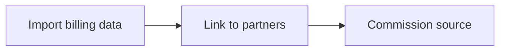

## Going deeper

<CardGroup>
  <Card title="How to" icon="screwdriver-wrench" href="./technical">
    Setup, configuration, and all how-to guides.
  </Card>

  <Card title="API reference" icon="code" href="/general/introduction">
    Integration surface and code.
  </Card>
</CardGroup>

**Works with**

<CardGroup>
  <Card title="Commission Plans" icon="hand-holding-dollar" href="/features/commissions/commission-plans">
    Commissions calculate on billing revenue.
  </Card>

  <Card title="Payouts" icon="hand-holding-dollar" href="/features/commissions/payouts">
    Reconcile payouts to invoices.
  </Card>

  <Card title="Introw Pay" icon="hand-holding-dollar" href="/features/commissions/introw-pay">
    Paying partners is a separate thing entirely.
  </Card>
</CardGroup>

---

# Billing & Subscriptions
Source: https://docs.introw.io/features/integrations/billing/technical/index

Connect Stripe or Chargebee to Introw, map billing objects and partner links, sync customers and invoices, and use billing data in partner commissions.

## Where it lives

Billing & Subscriptions sits under **Settings**, at [Integrations](https://app.introw.io/settings/integrations?category=billing).

<Frame>
  
</Frame>

## Before you start

| You need                            | Why                            | Fix it                                                                            |
| ----------------------------------- | ------------------------------ | --------------------------------------------------------------------------------- |
| The billing integrations module     | The area is locked without it  | **Request access**                                                                |
| Admin access to Stripe or Chargebee | You authorise it on their side | Outside Introw                                                                    |
| Integrations write access           | To connect it in Introw        | [Internal roles](/features/access/team-management/guides/create-an-internal-role) |

## How it works

Stripe and Chargebee appear as tiles on the Billing tab. You connect your billing system, then define
which billing objects, customers, subscriptions, invoices, products, and prices, to import and how
their properties map. You link billing records to partners so revenue is attributed correctly, and a
background import keeps the data current; you can also trigger a sync manually.

Once imported, billing data becomes a data source you can select when building a commission plan, so
commissions calculate on real revenue. This is import-only into Introw; your billing system continues
to charge customers.

**Stripe and Chargebee are the two billing systems with a native integration.** There is no connector
for NetSuite, QuickBooks, Bill.com or any other billing or ERP system, and it is worth saying so plainly
because it is a common question. If yours is not one of the two, you have two routes that reach the same
outcome:

* **Commission on CRM data instead.** A commission plan can run on the deal or any mapped CRM object, so if your closed-won amount is already correct in HubSpot or Salesforce you do not need billing data at all. This is what most programs do.
* **Push the numbers in yourself.** Where recognised revenue genuinely differs from the deal amount, write it onto a CRM property from your billing system or over the API and commission on that property. See [Create and manage API keys](/features/developer/api/guides/create-and-manage-api-keys).

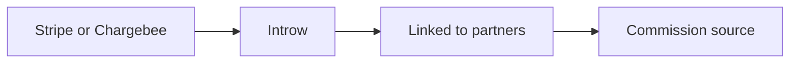

### Stripe here is not how partners get paid

Stripe carries two unrelated jobs in Introw and they share nothing but the name. This integration
calculates; [Introw Pay](/features/commissions/introw-pay) pays.

|                       | Billing integration                                   | Introw Pay                                                     |
| --------------------- | ----------------------------------------------------- | -------------------------------------------------------------- |
| What it is for        | Calculating commissions on invoiced revenue           | Sending partners the commission they earned                    |
| Where it lives        | **Settings → Integrations → Billing**                 | **Commission → Payout Settings**                               |
| What you connect      | Your own Stripe account, by OAuth, read-only          | Nothing. You complete billing info and pay one invoice a cycle |
| What partners connect | Nothing                                               | Their own payout destination, once, from your portal           |
| Money movement        | None. Stripe keeps charging your customers            | Introw Pay collects one invoice and pays every partner         |
| Needed?               | Only to commission on invoices instead of CRM records | Only if you want Introw to send the money                      |

Neither one needs the other, in either direction. Commission on CRM data and still pay through
Introw Pay, or import Stripe invoices and pay your partners by hand. Introw Pay never reads the
Stripe account you connect here, and this integration never moves money.

## Settings & configuration

Stripe is managed at [Integrations](https://app.introw.io/settings/integrations?category=billing).

### Connect a billing system

Use the Stripe tile to connect via OAuth (choosing live or test mode), or the Chargebee tile to
connect your Chargebee site.

### Billing object mappings

**Object Linking** on the provider's configuration page is where you declare what gets imported, and
it starts empty on every new connection. Nothing syncs until a row exists here. Per row you choose the
object, the provider property that identifies the partner, and a display label; saving triggers a full
sync of that object.

The object catalog is provider-specific: **Stripe** offers Customer, Subscription, Invoice, Product,
and Price. **Chargebee** offers Subscription, Customer, and Invoice, plus **Plan** on product catalog
v1 or **Item** and **Item Price** on v2, resolved from the connected site's catalog version.

Deleting a row removes the mapping **and** all partner-related objects of that type from partner
portals. It is re-addable, but treat it as a partner-visible change, not a config tweak.

### Partner links

The selected row's panel pairs a read-only **Attribution property** with a per-partner match table.
Two rules to know before a rollout:

* **A partner needs a CRM record** to hold a billing link. Partners without one render an amber
  "Partner not linked to a CRM object" row and cannot be given a value until that is fixed.
* **A billing value maps to exactly one partner.** A duplicate is rejected inline rather than
  splitting revenue silently.

**Auto-detect** scans imported records and bulk-proposes links. It resolves the object your property
points at (a `customer` reference on an invoice means it compares Stripe customers), scores candidates
on identifier, then domain, then name, and only surfaces suggestions **above 80% confidence** with the
reason and score shown. It fills gaps only: partners that already have a value, values already claimed
by another partner, and partners with no CRM record are all skipped, so existing manual links are never
overwritten.

### Sync

Imports run on a schedule; **Sync now** in the header refreshes on demand and the header reads
**Syncing** while one is in flight.

### Use in commissions

In the commission plan wizard's **Connect your data** step, Stripe and Chargebee sit beside the CRM.
The critical coupling: **Select object where the commission data is stored** lists *only* the objects
mapped in Object Linking, so an unmapped provider yields an empty dropdown and an inline pointer back
to billing settings. Introw preselects **Invoice** when mapped and defaults **Commission date field**
to the object's created date.

The **Conditions** step then filters on real provider fields. On a Stripe invoice those include
**Status** (draft, open, paid, uncollectible, void), **Paid**, **Amount Paid**, **Total**, **Subtotal**,
**Tax**, **Currency**, **Billing Reason**, **Collection Method**, and the date fields (**Created**,
**Due Date**, **Period Start**, **Period End**). Gating on **Status is paid** is what makes a plan pay
on collected revenue rather than on every invoice raised.

## How-to guides

<Rail>
  * [**Connect your billing data to partners**](/features/integrations/billing/guides/connect-billing-data)

    Choose which billing objects to import from Stripe or Chargebee, identify the partner on each, and auto-link records so revenue attributes correctly.

  * 

    [**Connect Chargebee billing**](/features/integrations/billing/guides/connect-chargebee)

    Connect Chargebee with your site name and API key so Introw can import subscriptions, customers, and invoices to power partner commissions.

  * 

    [**Connect Stripe billing**](/features/integrations/billing/guides/connect-stripe)

    Authorize Stripe in live or test mode so Introw can import customers, subscriptions, and invoices, and use that billing data to power partner commissions.
</Rail>

## Troubleshooting

<Warning>
  Billing integrations require the module to be enabled on your plan. The integration imports billing data into Introw; it does not charge customers or execute payouts. Test mode is useful for setup, but commissions should run on live data. Records only contribute to commissions once linked to a partner.
</Warning>

<AccordionGroup>
  <Accordion title="Does connecting Stripe here pay my partners?">
    No. This integration only reads billing data. Partner payments run on [Introw Pay](/features/commissions/introw-pay), switched on in **Commission → Payout Settings**, which needs no Stripe account from you.
  </Accordion>

  <Accordion title="Do I need this integration to use Introw Pay?">
    No. Introw Pay pays out whatever your commission plans calculated, whether that came from your CRM or from billing data. The two are configured independently.
  </Accordion>

  <Accordion title="The Stripe tile shows an upgrade prompt">
    The billing integrations module is not enabled.
  </Accordion>

  <Accordion title="Connected, but nothing imported">
    Object Linking is empty. Authorizing a provider imports nothing on its own; add an object first.
  </Accordion>

  <Accordion title="The commission plan's object dropdown is empty">
    The same cause. The wizard only offers objects that have a partner mapping, so map one in billing settings and reopen the wizard.
  </Accordion>

  <Accordion title="Revenue is not attributed">
    Billing records are not linked to a partner.
  </Accordion>

  <Accordion title="Auto-detect finds nothing">
    Either too little data has synced, or the mapped property does not point at customers. Both are what the empty state tells you to check; re-running unchanged will not help.
  </Accordion>

  <Accordion title="A partner cannot be given a billing value">
    They have no CRM record behind them; fix the partner record and the field becomes editable.
  </Accordion>

  <Accordion title="Data is stale">
    Trigger a manual sync, or check the scheduled import status.
  </Accordion>
</AccordionGroup>

---

# Configure Slack or Teams for partner activity
Source: https://docs.introw.io/features/integrations/chat/guides/configure-the-chat-integration

Map internal channels to keep your team informed, choose which partner events post, and open shared channels with each partner for collaboration.

A connected Slack or Microsoft Teams workspace does nothing until you tell Introw where partner activity should go. This guide turns the connection into a working notification and collaboration setup: an internal channel (or several) so your team hears about partner activity, the specific event types that should post, and a shared channel per partner so you and that partner can collaborate in chat. Do this once and the right people see the right partner updates without anyone checking Introw. The setup is identical for Slack and Teams; only the workspace differs.

## What you'll achieve

Internal channels that surface the partner events you choose, and shared partner channels where you and each partner collaborate, so partner activity reaches your team and your partners in the chat tool they already use.

## Before you start

<Steps>
  <Step title="Connect Slack or Teams">
    The chat integration must be connected first. See [Connect Slack](./connect-slack) or [Connect Microsoft Teams](./connect-microsoft-teams).
  </Step>

  <Step title="Confirm your Introw permission">
    You need permission to manage integrations in Introw to edit channel mappings and notification settings.
  </Step>

  <Step title="Create the channels you need">
    Create the internal and shared channels in Slack or Teams first. For a shared partner channel, invite the partner in your chat tool so the channel exists before you map it.
  </Step>
</Steps>

## Steps

### Inform your team with internal channels

<Steps>
  <Step title="Open the connected integration">
    Go to [Integrations](https://app.introw.io/settings/integrations?category=communication), then open the connected **Slack** or **Microsoft Teams** tile to reach its configuration page. The header shows **Connected by** and a green status when healthy.

    <Frame>
      
    </Frame>
  </Step>

  <Step title="Add an internal channel">
    Under **Internal channels**, map a channel that should receive notifications about your partners. Each row pairs a partner scope with a channel:

    * **Partner scope** - choose **All partners** to post every partner's activity to this channel, or pick one or more specific partners to keep a channel focused on just them. Use all partners for a general partnerships channel and specific partners for a high-touch account.
    * **Channel** - the internal Slack or Teams channel the activity posts to. Only non-shared (internal) channels appear here. If a private channel is missing, add the Introw app to that channel in your chat tool first, then reopen the list.

    Select **Add channel** to map more than one, for example a broad channel for all partners plus a dedicated channel for a strategic partner.
  </Step>

  <Step title="Choose which events post">
    On the right, **Notification Settings** controls which internal notifications are sent to your chat tool. Toggle the event types your team cares about, grouped by the kind of activity:

    * **Pipeline and deal updates** - turn on to post when a partner-linked deal changes stage or value, so your team sees movement in real time.
    * **Form submissions** - turn on to post when a partner submits a form, such as a deal or lead registration, so submissions are actioned quickly.
    * **Tasks** - turn on to post when partner tasks are created or change, so nothing is dropped.
    * **Other partner activity** - additional event types appear here based on your CRM object setup; enable the ones worth a notification and leave the rest off to avoid noise.

    Changes save automatically as you toggle them, and Introw confirms with a success message. These toggles control your team's internal notifications only; what posts in shared partner channels is managed in [Partner notifications](/features/engagement/notifications).
  </Step>
</Steps>

### Open shared channels with partners

<Steps>
  <Step title="Add a partner channel">
    Under **Partner channels**, map a shared channel for collaboration and shared notifications with a specific partner. Each row pairs a partner with a shared channel:

    * **Partner** - the partner this channel belongs to. Pick the partner you collaborate with there.
    * **Shared channel** - the shared Slack or Teams channel that connects you and the partner. The partner must already be in the channel in your chat tool. This is where shared updates and partner-facing actions post for that partner.

    Select **Add channel** to map a shared channel for each partner you collaborate with in chat.
  </Step>

  <Step title="Confirm the mappings saved">
    Mappings save automatically as you set them, with a success message on each change. Review the **Internal channels** and **Partner channels** lists to confirm each row has both a partner (or scope) and a channel selected, since rows without a channel are ignored.
  </Step>
</Steps>

## Ask Introw in&#x20;

Introw runs two AI agents inside , so partners and your team get answers
and take action without leaving chat. Both read live from your CRM source of truth
and act only within each person's own access - partners stay scoped to their portal,
your team stays scoped to theirs.

<CardGroup>
  <Card title="Partner support agent - shared channels" icon="robot" href="/features/ai/partner-support">
    In a shared partner channel, partners just **@-mention Introw** to ask the same questions they could in the portal - deal status, commissions, tiers, content, or even registering a deal - and get an instant, scoped answer.
  </Card>

  <Card title="Internal agent - internal channels" icon="chart-line" href="/headless/agentic-use-cases/ecosystem-performance">
    In your internal channels, your team **@-mentions Introw** to get insight on the partner ecosystem and act on it - handle open form submissions, surface best-performing partners, check pipeline, and update partner records.
  </Card>
</CardGroup>

### Partners self-serve in shared channels

@-mention Introw in a shared partner channel and the [partner support agent](/features/ai/partner-support)
answers from your knowledge base and live portal data, scoped to that partner. It is the
same agent partners use in the portal, now in : it can answer questions in any
language and take action on the partner's behalf - register a deal, update a record, or
surface the right asset - without anyone on your team being pulled in.

### Your team gets ecosystem insight in internal channels

@-mention Introw in an internal channel and the internal agent answers questions about
your whole program and acts on it, scoped to your access - no portal hunt and no RevOps
ticket. For example:

* **Handle open work** - "Show me open form submissions," then approve, reject, or follow up on [deal and lead registrations](/features/forms/submissions-approvals) right from chat.
* **Spot what's working** - "Who are my best-performing partners this quarter?" to pull [ecosystem performance](/headless/agentic-use-cases/ecosystem-performance) on demand.
* **Update partners** - "Move Acme to Gold" or "add a note to this partner" to change partner records on the fly.
* **Check the numbers** - "What's this partner's pipeline and commission status?" for a live readout.

<Note>
  Both agents depend on the [partner support agent](/features/ai/partner-support) being
  enabled. Each agent only ever sees and does what the person talking to it is allowed to -
  partners are scoped to their own portal data, your team to your program.
</Note>

## Verify it worked

Trigger a partner event that matches an enabled notification, for example move a partner-linked deal to a new stage, and confirm the message posts to the mapped internal channel. For a partner channel, post or take a shared action and confirm it lands in the shared channel with that partner. The configuration page keeps your channel rows and event toggles as you left them.

## Related

<CardGroup>
  <Card title="Connect Slack" icon="book-open" href="./connect-slack">
    Connect Slack before configuring it.
  </Card>

  <Card title="Connect Microsoft Teams" icon="book-open" href="./connect-microsoft-teams">
    Connect Teams before configuring it.
  </Card>

  <Card title="Partner notifications" icon="bell" href="/features/engagement/notifications">
    Choose what partners receive in shared channels.
  </Card>

  <Card title="Implementation reference" icon="screwdriver-wrench" href="../technical">
    Full configuration options.
  </Card>
</CardGroup>

---

# Connect Microsoft Teams to run partnerships in chat
Source: https://docs.introw.io/features/integrations/chat/guides/connect-microsoft-teams

Authorize Microsoft Teams so Introw can post partner notifications, run shared partner channels, and keep your team in the loop without leaving Teams.

If your organization runs on Microsoft Teams, that is where partnerships should surface too. Connecting Teams lets Introw post partner activity to your team's channels, open shared channels with partners, and bring Introw's AI agents into chat, so relationship owners see what is happening in the tool they already use. This guide gets Teams connected, then points you to mapping channels and choosing which events post. The integration is read and post only: it never changes anything in your CRM.

## Ask Introw in&#x20;

Introw runs two AI agents inside , so partners and your team get answers
and take action without leaving chat. Both read live from your CRM source of truth
and act only within each person's own access - partners stay scoped to their portal,
your team stays scoped to theirs.

<CardGroup>
  <Card title="Partner support agent - shared channels" icon="robot" href="/features/ai/partner-support">
    In a shared partner channel, partners just **@-mention Introw** to ask the same questions they could in the portal - deal status, commissions, tiers, content, or even registering a deal - and get an instant, scoped answer.
  </Card>

  <Card title="Internal agent - internal channels" icon="chart-line" href="/headless/agentic-use-cases/ecosystem-performance">
    In your internal channels, your team **@-mentions Introw** to get insight on the partner ecosystem and act on it - handle open form submissions, surface best-performing partners, check pipeline, and update partner records.
  </Card>
</CardGroup>

### Partners self-serve in shared channels

@-mention Introw in a shared partner channel and the [partner support agent](/features/ai/partner-support)
answers from your knowledge base and live portal data, scoped to that partner. It is the
same agent partners use in the portal, now in : it can answer questions in any
language and take action on the partner's behalf - register a deal, update a record, or
surface the right asset - without anyone on your team being pulled in.

### Your team gets ecosystem insight in internal channels

@-mention Introw in an internal channel and the internal agent answers questions about
your whole program and acts on it, scoped to your access - no portal hunt and no RevOps
ticket. For example:

* **Handle open work** - "Show me open form submissions," then approve, reject, or follow up on [deal and lead registrations](/features/forms/submissions-approvals) right from chat.
* **Spot what's working** - "Who are my best-performing partners this quarter?" to pull [ecosystem performance](/headless/agentic-use-cases/ecosystem-performance) on demand.
* **Update partners** - "Move Acme to Gold" or "add a note to this partner" to change partner records on the fly.
* **Check the numbers** - "What's this partner's pipeline and commission status?" for a live readout.

<Note>
  Both agents depend on the [partner support agent](/features/ai/partner-support) being
  enabled. Each agent only ever sees and does what the person talking to it is allowed to -
  partners are scoped to their own portal data, your team to your program.
</Note>

## What you'll achieve

A connected Microsoft Teams tenant shown as **Connected** in Introw, ready to map internal and partner channels and start posting partner activity to Teams.

## Before you start

<Steps>
  <Step title="Confirm your Introw permission">
    You need permission to connect integrations in Introw to authorize Teams and manage its settings.
  </Step>

  <Step title="Confirm Teams admin access">
    You need permission to authorize an app in the Microsoft Teams tenant you are connecting.
  </Step>

  <Step title="Know how the app gets into Teams">
    While the Teams app store listing is pending, you add Introw to Teams by uploading its app package as a custom app. That needs **Upload custom apps** allowed in the [Teams admin center](https://admin.teams.microsoft.com/policies/manage-apps) under Manage apps → Setup policies.
  </Step>
</Steps>

## Watch it

<Tabs>
  <Tab title="Video">
    <video />
  </Tab>

  <Tab title="Click through">
    <iframe />
  </Tab>
</Tabs>

## Steps

<Steps>
  <Step title="Open the Communication integrations">
    Go to [Integrations](https://app.introw.io/settings/integrations?category=communication) and stay on the **Communication** category, where the Slack, Microsoft Teams, and Zapier tiles live.

    <Frame>
      
    </Frame>
  </Step>

  <Step title="Start the Teams connection">
    On the **Microsoft Teams** tile select **Connect**. That opens the **Link Microsoft Teams channel** dialog, which walks three steps: download the app package, upload it to Microsoft Teams, then connect your tenant.

    <Frame>
      
    </Frame>
  </Step>

  <Step title="Add Introw to Microsoft Teams">
    In the dialog, select **Download** on the first step to get `introw-teams.zip`. Then in Teams go to **Apps** → **Manage your apps** → **Upload an app** → **Upload a custom app** and pick that file. This is a one-time step per tenant. Afterwards **Open in Teams** in the Introw dialog opens the installed app directly.

    Download the package from the dialog rather than reusing a copy someone sent you: Introw serves the package that matches the app registration your Introw environment talks to. If **Upload an app** is missing, ask your Teams admin to allow custom app uploads in the [Teams admin center](https://admin.teams.microsoft.com/policies/manage-apps).

    <Frame>
      
    </Frame>
  </Step>

  <Step title="Authorize and pick the tenant">
    Back in the Introw dialog, select **Continue with Microsoft**. Sign in to Microsoft, choose the tenant to connect, and approve the requested access so Introw can list channels and post messages. Introw returns with Microsoft Teams shown as **Connected by** you, with the connection date.
  </Step>

  <Step title="Configure channels and notifications">
    Connecting only links the tenant. Next, map your internal and partner channels and choose which events post by following [Configure the chat integration](./configure-the-chat-integration).
  </Step>
</Steps>

## Verify it worked

Microsoft Teams shows as **Connected** on the Communication integrations page with a green status and **Connected by** your name. Opening the Teams integration shows the **Internal channels** and **Partner channels** sections, ready to map.

## Related

<CardGroup>
  <Card title="Configure the chat integration" icon="book-open" href="./configure-the-chat-integration">
    Map channels and choose which events post.
  </Card>

  <Card title="Connect Slack" icon="book-open" href="./connect-slack">
    Use Slack instead of Teams.
  </Card>

  <Card title="Implementation reference" icon="screwdriver-wrench" href="../technical">
    Full configuration options.
  </Card>
</CardGroup>

---

# Connect Slack to run partnerships in chat
Source: https://docs.introw.io/features/integrations/chat/guides/connect-slack

Authorize Slack so Introw can post partner notifications, run shared partner channels, and keep your team in the loop without leaving Slack.

Connecting Slack is the first step to running partner collaboration, notifications, and Introw's AI agents in chat instead of only inside Introw. Authorizing the integration lets Introw post partner activity to your team's channels and open shared channels with partners, so the people who own relationships see what is happening where they already work. This guide gets Slack connected, then points you to mapping channels and choosing which events post. The integration is read and post only: it never changes anything in your CRM.

## Ask Introw in&#x20;

Introw runs two AI agents inside , so partners and your team get answers
and take action without leaving chat. Both read live from your CRM source of truth
and act only within each person's own access - partners stay scoped to their portal,
your team stays scoped to theirs.

<CardGroup>
  <Card title="Partner support agent - shared channels" icon="robot" href="/features/ai/partner-support">
    In a shared partner channel, partners just **@-mention Introw** to ask the same questions they could in the portal - deal status, commissions, tiers, content, or even registering a deal - and get an instant, scoped answer.
  </Card>

  <Card title="Internal agent - internal channels" icon="chart-line" href="/headless/agentic-use-cases/ecosystem-performance">
    In your internal channels, your team **@-mentions Introw** to get insight on the partner ecosystem and act on it - handle open form submissions, surface best-performing partners, check pipeline, and update partner records.
  </Card>
</CardGroup>

### Partners self-serve in shared channels

@-mention Introw in a shared partner channel and the [partner support agent](/features/ai/partner-support)
answers from your knowledge base and live portal data, scoped to that partner. It is the
same agent partners use in the portal, now in : it can answer questions in any
language and take action on the partner's behalf - register a deal, update a record, or
surface the right asset - without anyone on your team being pulled in.

### Your team gets ecosystem insight in internal channels

@-mention Introw in an internal channel and the internal agent answers questions about
your whole program and acts on it, scoped to your access - no portal hunt and no RevOps
ticket. For example:

* **Handle open work** - "Show me open form submissions," then approve, reject, or follow up on [deal and lead registrations](/features/forms/submissions-approvals) right from chat.
* **Spot what's working** - "Who are my best-performing partners this quarter?" to pull [ecosystem performance](/headless/agentic-use-cases/ecosystem-performance) on demand.
* **Update partners** - "Move Acme to Gold" or "add a note to this partner" to change partner records on the fly.
* **Check the numbers** - "What's this partner's pipeline and commission status?" for a live readout.

<Note>
  Both agents depend on the [partner support agent](/features/ai/partner-support) being
  enabled. Each agent only ever sees and does what the person talking to it is allowed to -
  partners are scoped to their own portal data, your team to your program.
</Note>

## What you'll achieve

A connected Slack workspace shown as **Connected** in Introw, ready to map internal and partner channels and start posting partner activity to Slack.

## Before you start

<Steps>
  <Step title="Confirm your Introw permission">
    You need permission to connect integrations in Introw to authorize Slack and manage its settings.
  </Step>

  <Step title="Confirm Slack admin access">
    You need permission to install an app in the Slack workspace you are connecting.
  </Step>
</Steps>

## Watch it

<Tabs>
  <Tab title="Video">
    <video />
  </Tab>

  <Tab title="Click through">
    <iframe />
  </Tab>
</Tabs>

## Steps

<Steps>
  <Step title="Open the Communication integrations">
    Go to [Integrations](https://app.introw.io/settings/integrations?category=communication) and stay on the **Communication** category, where the Slack, Microsoft Teams, and Zapier tiles live.

    <Frame>
      
    </Frame>
  </Step>

  <Step title="Start the Slack connection">
    On the **Slack** tile select **Connect** to open Slack's authorization screen.

    <Frame>
      
    </Frame>
  </Step>

  <Step title="Authorize and pick the workspace">
    Sign in to Slack, choose the workspace to connect, and approve the requested access so Introw can list channels and post messages. Introw returns with Slack shown as **Connected by** you, with the connection date.
  </Step>

  <Step title="Configure channels and notifications">
    Connecting only links the workspace. Next, map your internal and partner channels and choose which events post by following [Configure the chat integration](./configure-the-chat-integration).
  </Step>
</Steps>

## Verify it worked

Slack shows as **Connected** on the Communication integrations page with a green status and **Connected by** your name. Opening the Slack integration shows the **Internal channels** and **Partner channels** sections, ready to map.

## Related

<CardGroup>
  <Card title="Configure the chat integration" icon="book-open" href="./configure-the-chat-integration">
    Map channels and choose which events post.
  </Card>

  <Card title="Connect Microsoft Teams" icon="book-open" href="./connect-microsoft-teams">
    Use Teams instead of Slack.
  </Card>

  <Card title="Implementation reference" icon="screwdriver-wrench" href="../technical">
    Full configuration options.
  </Card>
</CardGroup>

---

# Set up WhatsApp
Source: https://docs.introw.io/features/integrations/chat/guides/set-up-whatsapp

Enable WhatsApp so partners text your Introw number and get the same agent experience they would get in Slack, with no app to install and no login.

WhatsApp is the lowest-friction surface Introw has: there is nothing for the partner to install, no channel to be invited to, and no login. They text a number and get the same agent that runs everything else. This guide turns it on and covers the one piece of data hygiene it depends on.

## What you'll achieve

A WhatsApp number your partners can text to ask about their deals, register a lead, and get instant answers, with every action attributed to the right partner contact and written back to your CRM.

## Before you start

<Steps>
  <Step title="WhatsApp is on your plan">
    WhatsApp is a paid add-on. If the WhatsApp block shows an upgrade message instead of an enable button, contact your account manager to have it added.
  </Step>

  <Step title="You can manage integrations">
    You need integration permissions in Introw.
  </Step>

  <Step title="Your partner contacts have phone numbers in your CRM">
    This is the one that decides whether it works. Introw identifies an incoming message purely by the sender's phone number, matched against the phone number on their synced contact record. A contact with no phone number, or a different one, will not be recognized.
  </Step>
</Steps>

<Info>
  You do not need a Twilio account, a Meta Business account, or a number of your own. WhatsApp runs on Introw's managed Business messaging.
</Info>

## Steps

<Steps>
  <Step title="Open the communication integrations">
    Go to [Integrations](https://app.introw.io/settings/integrations?category=communication) and find the **WhatsApp** block.
  </Step>

  <Step title="Enable WhatsApp">
    Select **Enable WhatsApp**. There is nothing to configure: no OAuth redirect, no scopes, no app to authorize. Introw provisions the messaging side for you and takes you to the WhatsApp settings page.
  </Step>

  <Step title="Copy your number">
    The settings page shows **Your WhatsApp number** with a copy button. This is the number partners message, and you can come back for it any time. If it says the number is not configured yet, provisioning has not finished; contact your Introw account manager to complete it.
  </Step>

  <Step title="Map partner numbers where you want notifications too">
    On the channels screen you can map each partner to the WhatsApp number used for shared notifications and agent conversations, and add internal recipients who should get partner notifications on WhatsApp. Use international format, for example +32 followed by the number. This is optional for inbound conversations, which work from CRM contact matching alone.
  </Step>

  <Step title="Share the number with partners">
    Send it to the partner contacts you want using it. There is nothing for them to set up, so this is the entire partner-side effort. Point them at [Introw for partners](/features/partner-connect/partner-crm/guides/introw-for-partners) if they want to know what the agent can see.
  </Step>
</Steps>

## What partners can do once they have the number

The same agent, so the same capabilities as Slack, Teams, or a connected AI assistant, scoped to that contact's access:

* Ask where their deals stand and what is pending
* Register a deal or share a lead, with the agent collecting your form's required fields in the conversation before it submits. See [Register a deal from chat](/features/partner-connect/communication-tools/guides/register-a-deal-from-chat)
* Ask what commission is owed, or what is left to reach the next tier
* Get product and process answers, in their own language, at any hour

## Verify it worked

Text the number from a phone whose number is on a contact record synced into your CRM, and ask something specific to that partner, for example which deals are open. A correct, partner-scoped answer confirms both the messaging path and the contact matching. A generic non-answer, or no recognition at all, almost always means the phone number on that contact does not match the sender.

## Limits and gotchas

<Warning>
  Recognition is phone-number based and exact. Partners messaging from a personal phone that is not on their contact record will not be recognized, and a shared or reassigned number will resolve to whoever holds that contact record. Keep phone numbers current on the contacts you want using WhatsApp.
</Warning>

* WhatsApp is inbound-first: partners start the conversation by texting the number, and the agent replies in the thread.
* The number is provisioned by Introw, so it is not a number you already own or advertise elsewhere.
* Everything the agent does is scoped to the matched contact's portal access, exactly as it is on every other surface.

## Related

<CardGroup>
  <Card title="Register a deal from chat" icon="comments" href="/features/partner-connect/communication-tools/guides/register-a-deal-from-chat">
    What the agent asks for before it submits.
  </Card>

  <Card title="Connect Slack" icon="slack" href="./connect-slack">
    The shared-channel surface.
  </Card>

  <Card title="Configure the chat integration" icon="sliders" href="./configure-the-chat-integration">
    Map channels and choose which events post.
  </Card>

  <Card title="Communication Tools" icon="circle-nodes" href="/features/partner-connect/communication-tools">
    What chat means for the partner.
  </Card>
</CardGroup>

---

# Slack & Teams
Source: https://docs.introw.io/features/integrations/chat/index

Meet partners and your team in chat: post activity to Slack and Teams, run shared partner channels, and let the support agent answer where they work.

> Partners and reps live in chat, not in a portal. The Slack and Teams integrations bring partner activity, shared channels, and Introw's AI agents into the tools your team and partners already use every day.

## The problem it solves

Important partner activity gets lost when it lives only in a portal:

<Pains>
  | Without Introw                | With Introw                     |
  | ----------------------------- | ------------------------------- |
  | Updates go unseen in a portal | They post to Slack and Teams    |
  | Collaboration is fragmented   | One shared channel per partner  |
  | Partners log in to get help   | The support agent answers there |
  | Your team misses key events   | Internal notifications post too |
</Pains>

## Impact

Partners and reps live in chat. Being present in the channel they already have open, with an agent that can actually answer, is worth more than a notification they have to go and find.

<Impact>
  for your business

  * **No new tool**
    Shared external channels, one per partner, so collaboration happens where the conversation already is
  * **Cost to run**
    Partner ops maps channels and picks which notifications post where, with no engineering

  for your partners

  * **Self-serve**
    They ask the support agent in the shared channel and get an answer without logging in
  * **Enabled**
    Pipeline updates, submissions and tasks arrive in the channel their team already watches
  * **Efficient**
    One channel per partnership, so nothing is scattered across personal messages

  [A day in the life of a co-sell partner](/days-in-the-life/co-sell-partner)
</Impact>

<Personas>
  * **Partner Operations** - channels and notifications mapped
  * **Partner Marketing** - partners engaged in chat
  * **Partners** - help in the channel they use
</Personas>

## See it work

<Tour>
  * 

    **Open Communication**

    Slack and Teams are connected from the same place.

  * 

    **Connect Slack**

    One authorization for the workspace.

  * 

    **Or Teams**

    The same for a Microsoft Teams tenant.

  * 

    **Work in the channel**

    Partners register deals and get answers where they already talk.
</Tour>

## How it works

The Slack and Teams integrations connect your workspace or tenant to Introw. You can run shared
external channels, one per partner, so collaboration happens in chat, and post internal notifications
to your own channels when partner activity occurs, like pipeline updates, form submissions, and tasks.
Introw's AI agents also work in chat: partners ask the support agent in shared channels, and your team
asks the internal agent in internal channels, so answers and actions happen without leaving Slack or Teams.

You map which channel belongs to which partner, choose which notifications to post and where, and
scope internal notifications by partner or filter. The result is partner work that flows into chat
automatically, keeping everyone in the loop where they already collaborate.

<ChatAiAgents />

Slack and Teams bring partnerships into the flow of work. Connect once, map channels, and partner
activity, collaboration, and support all happen in chat, off the portal and in the open.

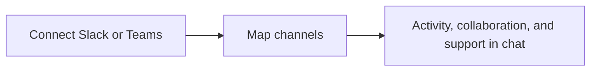

## Run it from your AI assistant

<Headless>
  * Register a deal for Acme from Slack.
  * Ask from Teams which partners haven't registered a deal this quarter.
  * Share a lead with the vendor straight from Slack.
</Headless>

## Going deeper

<CardGroup>
  <Card title="How to" icon="screwdriver-wrench" href="./technical">
    Setup, configuration, and all how-to guides.
  </Card>

  <Card title="API reference" icon="code" href="/general/introduction">
    Integration surface and code.
  </Card>
</CardGroup>

**Works with**

<CardGroup>
  <Card title="Notifications" icon="bell" href="/features/engagement/notifications">
    Deliver notifications to Slack and Teams.
  </Card>

  <Card title="Partner Support Agent" icon="robot" href="/features/ai/partner-support">
    Partners ask the AI agent in chat.
  </Card>

  <Card title="Announcements" icon="bell" href="/features/engagement/announcements">
    Broadcast announcements into chat.
  </Card>

  <Card title="Workflows" icon="bolt" href="/features/automation/workflows">
    Post a partner nudge into Slack or Teams from a workflow.
  </Card>
</CardGroup>

---

# Slack & Teams
Source: https://docs.introw.io/features/integrations/chat/technical/index

Connect Slack and Microsoft Teams to Introw, map shared partner channels, and configure internal notifications for partner activity and updates.

## Where it lives

Slack & Teams sits under **Settings**, at [Integrations](https://app.introw.io/settings/integrations?category=communication).

<Frame>
  
</Frame>

## Before you start

| You need                       | Why                         | Fix it                                                                            |
| ------------------------------ | --------------------------- | --------------------------------------------------------------------------------- |
| Admin access to Slack or Teams | You authorise the app there | Outside Introw                                                                    |
| Integrations write access      | To connect it in Introw     | [Internal roles](/features/access/team-management/guides/create-an-internal-role) |

## How it works

Slack and Microsoft Teams appear as tiles on the Communication tab. You connect via OAuth, then
configure the integration on its page. External channels map a Slack or Teams channel to a specific
partner for collaboration; internal channels post org notifications when partner activity occurs,
optionally scoped by partner or filter. Both of Introw's AI agents also answer in these channels:
partners @-mention the support agent in shared channels, and your team @-mentions the internal agent
in internal channels.

Notification event types, pipeline updates, form submissions, tasks, and more, mirror the patterns in
the Notifications settings. You map a channel per partner and choose which events post where.

## Ask Introw in&#x20;

Introw runs two AI agents inside , so partners and your team get answers
and take action without leaving chat. Both read live from your CRM source of truth
and act only within each person's own access - partners stay scoped to their portal,
your team stays scoped to theirs.

<CardGroup>
  <Card title="Partner support agent - shared channels" icon="robot" href="/features/ai/partner-support">
    In a shared partner channel, partners just **@-mention Introw** to ask the same questions they could in the portal - deal status, commissions, tiers, content, or even registering a deal - and get an instant, scoped answer.
  </Card>

  <Card title="Internal agent - internal channels" icon="chart-line" href="/headless/agentic-use-cases/ecosystem-performance">
    In your internal channels, your team **@-mentions Introw** to get insight on the partner ecosystem and act on it - handle open form submissions, surface best-performing partners, check pipeline, and update partner records.
  </Card>
</CardGroup>

### Partners self-serve in shared channels

@-mention Introw in a shared partner channel and the [partner support agent](/features/ai/partner-support)
answers from your knowledge base and live portal data, scoped to that partner. It is the
same agent partners use in the portal, now in : it can answer questions in any
language and take action on the partner's behalf - register a deal, update a record, or
surface the right asset - without anyone on your team being pulled in.

### Your team gets ecosystem insight in internal channels

@-mention Introw in an internal channel and the internal agent answers questions about
your whole program and acts on it, scoped to your access - no portal hunt and no RevOps
ticket. For example:

* **Handle open work** - "Show me open form submissions," then approve, reject, or follow up on [deal and lead registrations](/features/forms/submissions-approvals) right from chat.
* **Spot what's working** - "Who are my best-performing partners this quarter?" to pull [ecosystem performance](/headless/agentic-use-cases/ecosystem-performance) on demand.
* **Update partners** - "Move Acme to Gold" or "add a note to this partner" to change partner records on the fly.
* **Check the numbers** - "What's this partner's pipeline and commission status?" for a live readout.

<Note>
  Both agents depend on the [partner support agent](/features/ai/partner-support) being
  enabled. Each agent only ever sees and does what the person talking to it is allowed to -
  partners are scoped to their own portal data, your team to your program.
</Note>

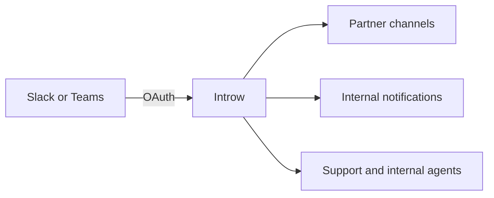

## Settings & configuration

Chat integrations are managed at [Integrations](https://app.introw.io/settings/integrations?category=communication).

### Connect

Use the Slack or Microsoft Teams tile to authorize via OAuth.

### Partner channels

Map an external channel to each partner for collaboration; override per partner where needed.

### Internal notifications

Post org notifications to internal channels, scoped by partner or filter, for events like pipeline
updates, forms, and tasks.

### Notification events

Choose which event types post; these follow the patterns in your Notifications settings.

### Automate it with a workflow

Once a workspace is connected, **Send a chat message** is a [workflow](/features/automation/workflows/technical) action: a short plain-text nudge into Slack or Microsoft Teams, with `{{partner}}` standing in for the partner's name. **The partner's channel** posts into the shared channel mapped on that partner's page, resolved when the message sends, so remapping a partner later moves every workflow with it. **One fixed channel** posts every run into the same place, which is for internal alerting rather than for reaching a partner.

Only connected and active providers are offered, and with one connected there is no provider choice to make. A run for a partner with no mapped channel stops at that step with a note saying so rather than failing, which is worth knowing before chat becomes your only nudge.

Reaching a quiet partner where they already are, rather than in a third email, is the point. See [Re-engage quiet partners](/features/automation/workflows/guides/re-engage-quiet-partners).

## How-to guides

<Rail>
  * [**Configure Slack or Teams for partner activity**](/features/integrations/chat/guides/configure-the-chat-integration)

    Map internal channels to keep your team informed, choose which partner events post, and open shared channels with each partner for collaboration.

  * 

    [**Connect Microsoft Teams to run partnerships in chat**](/features/integrations/chat/guides/connect-microsoft-teams)

    Authorize Microsoft Teams so Introw can post partner notifications, run shared partner channels, and keep your team in the loop without leaving Teams.

  * 

    [**Connect Slack to run partnerships in chat**](/features/integrations/chat/guides/connect-slack)

    Authorize Slack so Introw can post partner notifications, run shared partner channels, and keep your team in the loop without leaving Slack.

  * [**Set up WhatsApp**](/features/integrations/chat/guides/set-up-whatsapp)

    Enable WhatsApp so partners text your Introw number and get the same agent experience they would get in Slack, with no app to install and no login.
</Rail>

## Troubleshooting

<Warning>
  External channels are mapped one per partner for collaboration; internal channels are for your own team. Notification event types follow your Notifications settings, so review those to avoid noise. Both AI agents in chat depend on the partner support agent being enabled, and each agent is scoped to the access of whoever @-mentions it - partners to their portal, your team to your program.
</Warning>

<AccordionGroup>
  <Accordion title="Notifications are not posting">
    Confirm the channel mapping and that the event type is enabled.
  </Accordion>

  <Accordion title="A partner's messages are in the wrong channel">
    Check the per-partner channel override.
  </Accordion>

  <Accordion title="The connection dropped">
    Re-authorize the Slack or Teams integration.
  </Accordion>
</AccordionGroup>

---

# Capture partner file uploads in HubSpot
Source: https://docs.introw.io/features/integrations/crm/guides/allow-partner-attachments-in-hubspot

Have files partners upload on a shared deal in Introw automatically pushed to the HubSpot deal's attachments, keeping partner documents in your CRM.

When you collaborate on a deal with a partner, the documents they share (a purchase order, a signed proposal) belong in your CRM alongside the rest of the deal. Introw automatically pushes files a partner uploads on a shared deal to the HubSpot deal's attachments, so nothing relevant lives only in the portal. This guide shows how it works and how to confirm it.

## What you'll achieve

Files uploaded by a partner on a shared deal in Introw appear automatically on the corresponding HubSpot deal, added to its attachments with a note, so all partner-supplied documents are captured in your CRM without manual re-uploading.

## Before you start

<Steps>
  <Step title="Connect HubSpot">
    File sync to attachments requires the Introw app connected to HubSpot. See [Connect HubSpot](./connect-hubspot).
  </Step>

  <Step title="Share the deal for collaboration">
    Files flow from a shared deal, so the deal must be shared with the partner. See [Collaborate on a shared deal](/features/co-selling/shared-pipelines/guides/collaborate-on-a-shared-deal).
  </Step>
</Steps>

## Steps

<Steps>
  <Step title="Open the shared deal in Introw">
    Go to [Deals overview](https://app.introw.io/overview/DEAL) and open the shared deal the partner is collaborating on. Its collaboration view has a **Files** area where the partner's uploads live.
  </Step>

  <Step title="Have the partner upload their file">
    On the shared deal, the partner adds their document (for example a purchase order) in **Files**. This is the moment Introw captures the file for the CRM.
  </Step>

  <Step title="Let Introw push it to HubSpot">
    Introw automatically adds the uploaded file to the **Attachments** card on the matching HubSpot deal and logs a note, so the document is captured in your CRM with context. No configuration is needed beyond a connected HubSpot and a shared deal.
  </Step>
</Steps>

## Verify it worked

Open the corresponding deal in HubSpot: the file the partner uploaded appears in the deal's **Attachments** card, and a note records the upload, so the partner-supplied document is now part of the CRM record.

## Related

<CardGroup>
  <Card title="Collaborate on a shared deal" icon="handshake" href="/features/co-selling/shared-pipelines/guides/collaborate-on-a-shared-deal">
    Share a deal and keep files and comments on the record.
  </Card>

  <Card title="Collaborate from HubSpot deals and tickets" icon="plug" href="./collaborate-from-hubspot-deals-and-tickets">
    Work the same shared record from inside HubSpot.
  </Card>

  <Card title="Connect HubSpot" icon="plug" href="./connect-hubspot">
    Connect the Introw app to enable the sync.
  </Card>
</CardGroup>

---

# Partner attribution in HubSpot
Source: https://docs.introw.io/features/integrations/crm/guides/attribution-in-hubspot

Every way to attribute HubSpot deals to partners - custom properties, association labels, and custom objects - with mechanics, trade-offs, and setup.

Attribution is the link between a HubSpot record and the partner who sourced or influenced it. It is what makes partner-attached pipeline, reporting, and commissions trustworthy - so it deserves to match how your CRM is actually modelled, not the other way around.

HubSpot lets you model that link in three fundamentally different ways. **Introw supports all three out of the box.**

There is no RevOps project, no schema rebuild, no code, and no consultant. You keep your existing model; you simply tell Introw *how a record is linked to a partner*, and from there Introw does the rest:

<CardGroup>
  <Card title="Reads it in" icon="arrow-right-to-bracket">
    Introw pulls every matching record, even old ones, and attributes each correctly.
  </Card>

  <Card title="Embeds it" icon="table-cells">
    Attributed records appear in portals, dashboards, commissions, and reporting under your name.
  </Card>

  <Card title="Writes it back" icon="arrow-right-from-bracket">
    A form submission is attached with the *exact method* you configured, so the record is born compliant.
  </Card>
</CardGroup>

<Note>
  The whole point: **you match your system to Introw once, and Introw matches every record to your system forever.** Historic records become attributable, and new partner-created records are born correctly attributed. That is the backwards-compatibility and data-hygiene win - and it holds for whichever method below you already use.
</Note>

## The three methods at a glance

<CardGroup>
  <Card title="Custom property" icon="tag">
    A property on the deal holds the partner. Simplest; works on **every HubSpot plan**.
  </Card>

  <Card title="Association label" icon="building">
    A labelled deal-to-company association marks the partner. Native and scalable; needs **Professional or Enterprise**.
  </Card>

  <Card title="Custom object" icon="cubes">
    A dedicated Partner object is associated to deals. Richest partner data; needs **Enterprise**.
  </Card>
</CardGroup>

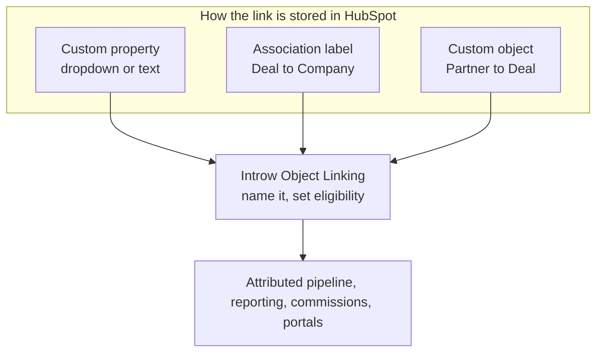

<Note>
  Configure **Deal** attribution at minimum - it is what reporting and commissions run on. You can attribute contacts, companies, tickets, and custom objects to partners the same way.
</Note>

***

## Method 1 - Custom property

**Best for:** simpler programs where a deal has one partner (or a small fixed set), and teams that want attribution live on the HubSpot plan they already pay for.

A custom deal property holds the partner. Most commonly a **dropdown (enumeration) property** - one option per partner - but a text or multiple-checkbox property works too.

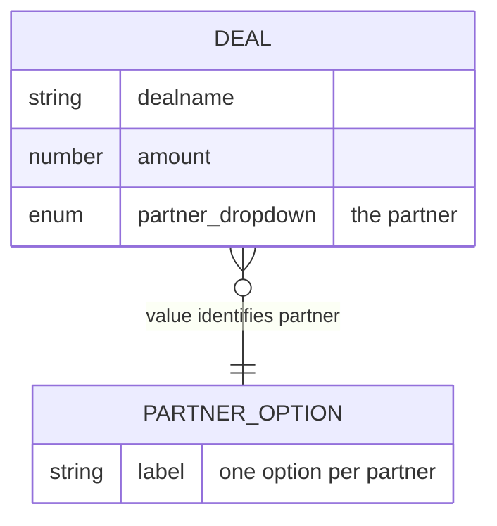

<AccordionGroup>
  <Accordion title="How it works in HubSpot" icon="gear">
    A HubSpot **dropdown select** property stores a defined set of options; each deal carries one value. Reps pick the partner from the dropdown on the deal record. Because the value lives directly on the deal, it is trivial to filter, list, and report on with native HubSpot tools.
  </Accordion>

  <Accordion title="How Introw configures it" icon="sliders">
    On **Object Linking → How do you attribute partners to Deal objects?**, choose **Custom properties** and select the property. If the property stores coded values (IDs or abbreviations rather than partner names), use **Match property values to Introw partners** to line each value up with the right partner record, so deals resolve correctly.
  </Accordion>

  <Accordion title="Introw-managed dropdown - options stay in sync" icon="arrows-rotate">
    Introw can **own the dropdown's options** and keep them synced to your live partner list - one option per active partner. Add a partner in Introw, the option appears; the picklist never drifts into stale names or typo'd free text. That is the difference between a property that decays and one that stays clean.

    If you have no link yet, pick **No attribution yet** and Introw creates a managed partner dropdown on the Deal object in one click.
  </Accordion>
</AccordionGroup>

| Pros                                                 | Cons                                                                 |
| ---------------------------------------------------- | -------------------------------------------------------------------- |
| Works on **every HubSpot plan** - no upgrade         | One partner per property - add a property per role for multi-partner |
| Simplest to set up and explain                       | Free-text variants drift without an owner                            |
| Native HubSpot filtering, lists, and reports         | No place to store per-partner relationship context                   |
| Introw can manage the options so they never go stale | Coded values need a one-time value-to-partner map                    |

***

## Method 2 - Association label

**Best for:** scalable programs that already associate the partner company to the deal natively, and teams that want to distinguish *how* a partner was involved (sourced vs. influenced).

A **custom association label** between the Deal and the partner **Company** marks which associated company is the partner - for example "Partner sourced" or "Partner influenced".

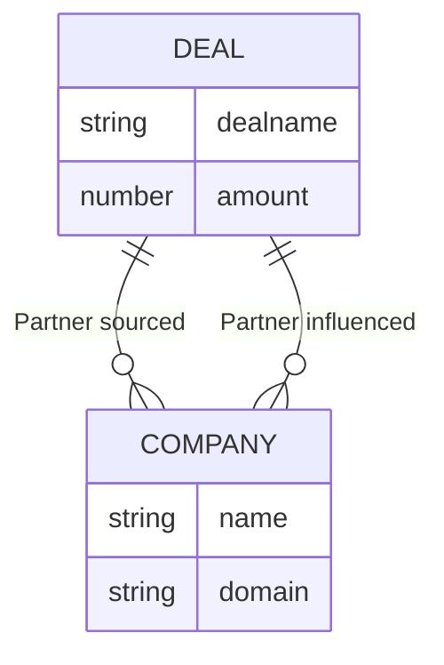

<AccordionGroup>
  <Accordion title="How it works in HubSpot" icon="gear">
    HubSpot associations connect records; an **association label** describes *how* they're related. Labels come in two forms: a **single** label that reads the same from both sides ("Partner"), or a **paired** label with a different word per side ("Referrer" / "Referred by"). You can create up to **50 labels per object pair**, so one deal can carry several partner relationships at once - each under its own label.
  </Accordion>

  <Accordion title="How Introw configures it" icon="sliders">
    Choose **Associations** and pick the association label that represents the partner relationship. Introw reads the labelled association to attribute the deal to the associated partner company. No value mapping is needed - the association *is* the partner record.
  </Accordion>

  <Accordion title="Plan requirement" icon="lock">
    Custom association labels require **Marketing, Sales, Service, Content, or Data Hub Professional or Enterprise**, and a Super Admin creates them. On a Starter plan, use a custom property (Method 1) instead - Introw supports both identically.
  </Accordion>
</AccordionGroup>

| Pros                                          | Cons                                                  |
| --------------------------------------------- | ----------------------------------------------------- |
| Native, scalable HubSpot pattern              | Requires **Professional or Enterprise**               |
| Points at the real partner Company record     | Reps must associate the company, not just type a name |
| Distinguish sourced vs. influenced via labels | Super Admin needed to create the labels               |
| Multiple partners per deal, each labelled     | Up to 50 labels per object pair (rarely a real limit) |

<Tip>
  Association labels are the sweet spot for most growing programs: native to HubSpot, no data drift, and they carry the *relationship type* natively - which powers the multi-tier attribution described below.
</Tip>

***

## Method 3 - Custom object

**Best for:** large programs that model partners as a first-class entity, with tier, region, focus, and program data living on a dedicated record rather than on a Company.

A HubSpot **custom object** (e.g. "Partner") is associated to deals - optionally with association labels to distinguish sourced vs. influenced - and Introw treats that object as the partner.

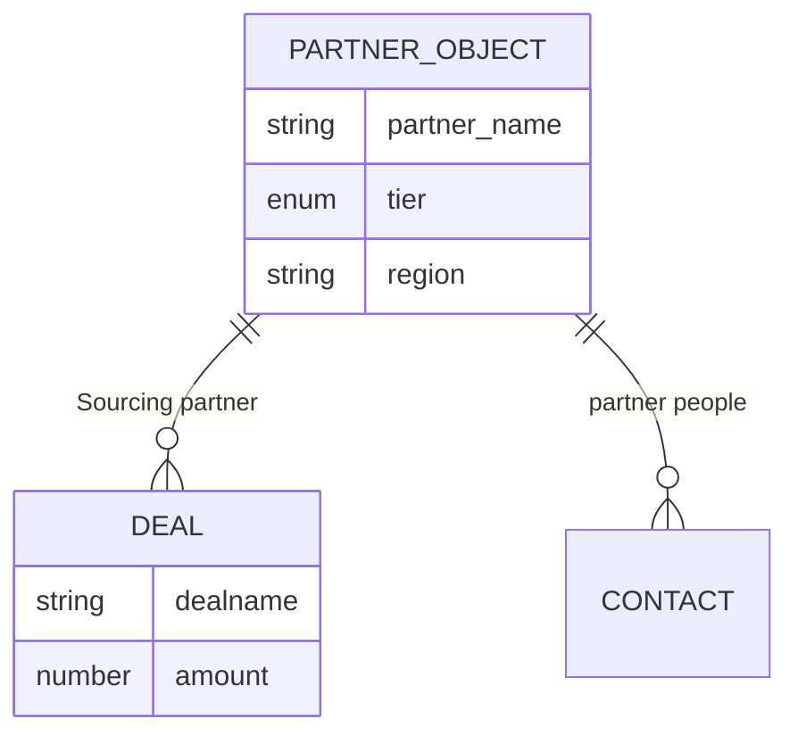

<AccordionGroup>
  <Accordion title="How it works in HubSpot" icon="gear">
    A custom object is your own CRM object with its own properties and associations. You model partners on it, associate it to deals (and contacts, companies, tickets, custom objects), and use association labels on those links just as you would with a Company.
  </Accordion>

  <Accordion title="How Introw configures it" icon="sliders">
    Set the **partner object** to your custom object during connect (the "How do you store partners in your CRM?" step). Then attribute deals via **Associations**, selecting the label that links a deal to that partner object. Introw reads the partner object's properties for tier, region, and more - so your rich model flows straight into segments, portals, and reporting.
  </Accordion>

  <Accordion title="Plan requirement" icon="lock">
    Custom objects require a **HubSpot Enterprise** subscription on at least one Hub (Marketing, Sales, Service, Content, or Operations). Enterprise allows up to 10 custom object definitions.
  </Accordion>
</AccordionGroup>

| Pros                                                    | Cons                          |
| ------------------------------------------------------- | ----------------------------- |
| Partners are a first-class object with their own schema | Requires **Enterprise**       |
| Rich per-partner data (tier, region, focus, program)    | Upfront schema design         |
| Clean separation of partners from customer Companies    | More moving parts to maintain |
| Full label support for sourced vs. influenced           | Overkill for small programs   |

***

## Multi-tier attribution - more than one partner on a deal

Real ecosystems rarely have exactly one partner per deal. A referrer surfaces it, a reseller closes it, an implementation partner delivers it. Introw models this natively: **you can define several named attributions on the same object**, each with its own name. This is not limited to associations or a custom object - **every method here can be repeated, including a plain property**: add one property (or label) per role, map each as its own attribution, and one deal credits several partners across tiers.

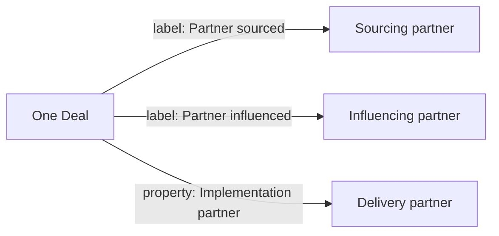

You can mix and match the mechanisms to express roles:

<CardGroup>
  <Card title="Multiple association labels" icon="tags">
    One label per role - "Partner sourced", "Partner influenced" - each its own named attribution.
  </Card>

  <Card title="Multiple properties" icon="tag">
    Separate dropdowns like "Referring partner" and "Delivery partner" on the same deal, each mapped independently.
  </Card>

  <Card title="Custom object roles" icon="cubes">
    Several partner-object records on one deal, each under a role label.
  </Card>
</CardGroup>

<Note>
  Each named attribution is **independently reportable**, so several partners can be credited on one record - a sourcing partner and an influencing partner side by side - and your commission plans run on whichever attribution(s) you scope them to. Name each attribution clearly and it reads that way in reporting, in the portal, and to partners.
</Note>

***

## Two-way by design - read *and* write

Attribution isn't only about reading what exists. Introw also **writes attribution the same way you defined it**, so the model holds no matter who creates the record.

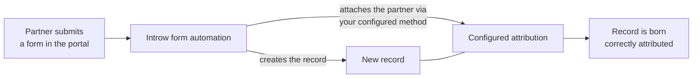

<CardGroup>
  <Card title="Backwards compatibility" icon="clock-rotate-left">
    Point Introw at your existing model and every historic record becomes attributable, in the right partner's pipeline. Nothing to backfill.
  </Card>

  <Card title="Data hygiene going forward" icon="broom">
    A partner registering through a form is attached with the **exact method you configured** - compliant from creation, not reconciled later.
  </Card>

  <Card title="No RevOps work either way" icon="circle-check">
    You never restructure your CRM. Tell Introw once how objects link to partners; reading old records and writing new ones follow that one definition.
  </Card>
</CardGroup>

***

## Choosing a method

| Your situation                       | Recommended method                        | Plan needed         |
| ------------------------------------ | ----------------------------------------- | ------------------- |
| Starter plan, one partner per deal   | Custom property (Introw-managed dropdown) | Any                 |
| Growing program, native associations | Association label                         | Professional+       |
| Distinguish sourced vs. influenced   | Association labels (one per role)         | Professional+       |
| Multiple partners / roles per deal   | Multiple labels or properties             | Any / Professional+ |
| Large program, rich partner data     | Custom object + labels                    | Enterprise          |

<Tip>
  Whichever you choose, configuration is the same shape: open **Object Linking**, pick the method, name the attribution, decide if it's commission-eligible, save. Introw handles the rest - no code, no consultant.
</Tip>

## Set it up

Whichever method you chose, you configure it in the same place: the **Object Linking** screen. This is the same attribution step the connect wizard runs, reopened any time to add or refine a mapping.

<Tabs>
  <Tab title="Video">
    <video />
  </Tab>

  <Tab title="Click through">
    <iframe />
  </Tab>
</Tabs>

<Steps>
  <Step title="Open Object Linking">
    Go to [Integrations](https://app.introw.io/settings/integrations?category=crm), open the connected HubSpot connection with **Configure**, and go to **Which objects do you link with partners?**. Select **Add object** to create a mapping, or open the existing **Deal** mapping to edit it. Configure **Deal** at minimum, since deal attribution is what reporting and commissions run on.
  </Step>

  <Step title="Choose how deals attribute to partners">
    On **How do you attribute partners to Deal objects?**, pick the method that matches your data: **Custom properties**, **Associations**, or **No attribution yet** (Introw creates a managed partner property on the Deal object in one click). This mirrors the three methods above.
  </Step>

  <Step title="Configure the method and map values">
    Fill in the detail: for a **property**, select the one that holds the partner; for an **association**, confirm the label that represents the partner relationship. If a property stores coded values rather than partner names, use **Match property values to Introw partners** to line each value up with the right partner record.
  </Step>

  <Step title="Name the attribution and save">
    Set **What name do you want to use for this attribution?** so the link reads clearly to your team and partners (for example "Influencing partner"), then select **Add Deal attribution** (or **Save** when editing). Confirm when Introw asks you to verify. To credit **more than one partner on the same deal**, add another Deal attribution with a different property or label (for example a "Delivery partner" alongside a "Referring partner") - each is its own named attribution. Repeat **Add object** to credit other record types too (contacts, companies, tickets).
  </Step>
</Steps>

## Verify it worked

Open a partner-influenced record in your CRM. In Introw it shows attributed to the right partner under your attribution name, and that partner's sourced/influenced pipeline reflects it in reporting and commissions. For a partner-created record, confirm the attribution (association, field, or relation row) was written on the CRM record itself.

## Related

<CardGroup>
  <Card title="Connect HubSpot" icon="book-open" href="./connect-hubspot">
    Set up the connection and run this attribution step inside the wizard.
  </Card>

  <Card title="Partner attribution in Salesforce" icon="book-open" href="./attribution-in-salesforce">
    The same depth for Salesforce - lookups, relation tables, and roles.
  </Card>

  <Card title="Show & rename CRM fields" icon="table-columns" href="./show-and-rename-crm-fields">
    Put any HubSpot field on your Introw tables, overviews, and partner views - renamed to partner-friendly labels.
  </Card>
</CardGroup>

---

# Partner attribution in Salesforce
Source: https://docs.introw.io/features/integrations/crm/guides/attribution-in-salesforce

Every way to attribute Salesforce opportunities to partners - picklists, Account lookup, OpportunityPartner junction, and custom objects - with setup.

Attribution is the link between a Salesforce record and the partner who sourced or influenced it. It is what makes partner-attached pipeline, reporting, and commissions trustworthy - so it deserves to match how your org is actually modelled, not the other way around.

Salesforce orgs model that link in four different ways, from a single field to a full junction object. **Introw supports all four out of the box.**

There is no RevOps project, no schema rebuild, no code, and no consultant. You keep your existing model; you simply tell Introw *how a record is linked to a partner*, and from there Introw does the rest:

<CardGroup>
  <Card title="Reads it in" icon="arrow-right-to-bracket">
    Introw pulls every matching record, even old ones, and attributes each correctly.
  </Card>

  <Card title="Embeds it" icon="table-cells">
    Attributed records appear in portals, dashboards, commissions, and reporting under your name.
  </Card>

  <Card title="Writes it back" icon="arrow-right-from-bracket">
    A form submission is attached with the *exact method* you configured, so the record is born compliant.
  </Card>
</CardGroup>

<Note>
  The whole point: **you match your system to Introw once, and Introw matches every record to your system forever.** Historic records become attributable, and new partner-created records are born correctly attributed. That is the backwards-compatibility and data-hygiene win - and it holds for whichever method below you already use.
</Note>

## The four methods at a glance

<CardGroup>
  <Card title="Picklist field" icon="list">
    A picklist on the Opportunity names the partner. Simplest; no relationships needed.
  </Card>

  <Card title="Lookup to an Account" icon="link">
    A lookup field points the Opportunity at the real partner Account. Clean and reportable.
  </Card>

  <Card title="Relation (junction) table" icon="diagram-project">
    A junction object (e.g. OpportunityPartner) links many partners to one opportunity, with roles.
  </Card>

  <Card title="Custom object" icon="cubes">
    A dedicated Partner object relates to opportunities, accounts, and contacts. Richest data model.
  </Card>
</CardGroup>

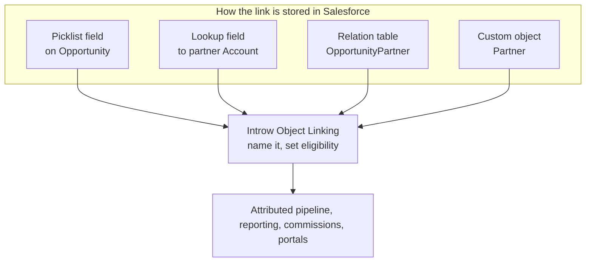

<Note>
  Configure **Opportunity** attribution at minimum - it is what reporting and commissions run on. You can attribute contacts, accounts, cases, and custom objects to partners the same way.
</Note>

***

## Method 1 - Picklist field

**Best for:** simpler programs with one partner per opportunity, and teams that want attribution with no relationships to design.

A **picklist** field on the Opportunity (e.g. "Partner Name") holds a predefined set of partner values reps select from.

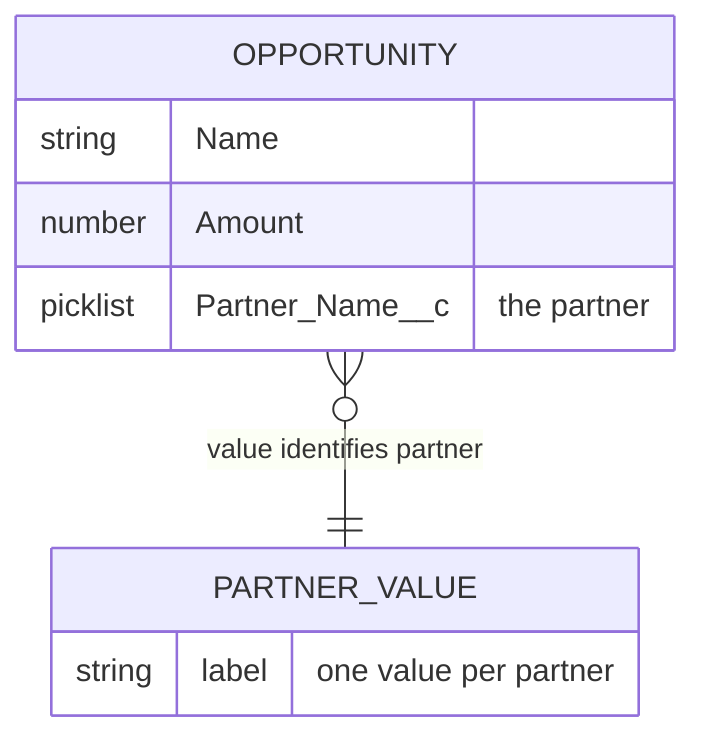

<AccordionGroup>
  <Accordion title="How it works in Salesforce" icon="gear">
    A picklist stores a fixed list of values on the record. Reps choose the partner from the dropdown on the Opportunity. It's the lightest-weight option - no relationship, no junction - and easy to report on with standard Salesforce reports.
  </Accordion>

  <Accordion title="How Introw configures it" icon="sliders">
    Choose **Custom properties** and select the picklist. If the values are coded (IDs or abbreviations rather than partner names), use **Match property values to Introw partners** to line each value up with the right partner record.
  </Accordion>

  <Accordion title="Trade-off" icon="triangle-exclamation">
    A picklist is text, not a relationship - it doesn't point at the real Account, and values can drift if hand-maintained. Great to start; consider a lookup or relation table as the program scales.
  </Accordion>
</AccordionGroup>

| Pros                                      | Cons                                                                 |
| ----------------------------------------- | -------------------------------------------------------------------- |
| Simplest possible setup, no relationships | One partner per picklist - add a picklist per role for multi-partner |
| Standard Salesforce reporting             | Not linked to the real Account record                                |
| Works in any edition                      | Values drift without governance                                      |
| Fast to roll out                          | Coded values need a one-time value-to-partner map                    |

***

## Method 2 - Lookup field to an Account

**Best for:** clean one-to-one attribution where you want to reference the real partner Account and pull its data.

A **lookup relationship** from the Opportunity to the partner **Account** stores the actual partner record, not a text label.

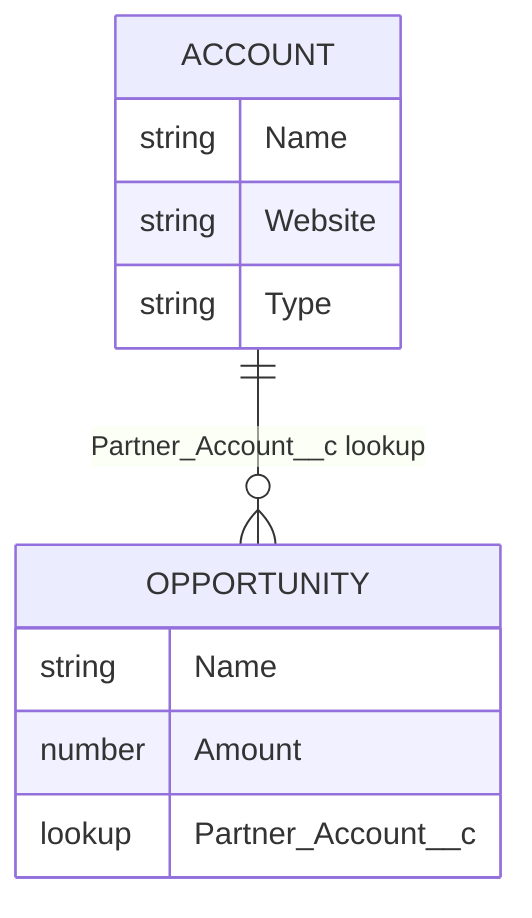

<AccordionGroup>
  <Accordion title="How it works in Salesforce" icon="gear">
    A lookup is a loosely-coupled relationship connecting one object to another. A custom lookup field on the Opportunity (e.g. "Partner Account") points at the partner Account record. Because it references the real Account, you get the partner's data, clean roll-up reporting, and no duplicated names. An object can hold up to 40 relationship fields, so adding a partner lookup is no strain.
  </Accordion>

  <Accordion title="How Introw configures it" icon="sliders">
    Choose **Custom properties** and select the lookup field that points to the partner Account. Introw resolves the lookup to the partner record automatically - no value mapping needed, because the field already references the real Account.
  </Accordion>

  <Accordion title="Using the standard AccountId" icon="link">
    You are not restricted to a custom lookup: the Opportunity's **standard `AccountId`** can be selected as the attribution property too. That fits programs where the Account on the opportunity *is* the partner rather than the end customer - a distributor or reseller model where you sell to the partner and they resell onward. For programs where `AccountId` holds the end customer, keep it as the customer and add a separate partner lookup, so the two are never conflated.
  </Accordion>

  <Accordion title="Multiple partners? Add more lookups" icon="triangle-exclamation">
    A single lookup holds one partner, but you are not limited to one lookup. Add a lookup field per role - "Sourcing Partner", "Delivery Partner", "Implementation Partner" - and map **each as its own named attribution** in Introw, so one opportunity credits several partners across tiers. A relation table (Method 3) is the alternative when the set of partners or roles is open-ended rather than a fixed few.
  </Accordion>
</AccordionGroup>

| Pros                                | Cons                                                             |
| ----------------------------------- | ---------------------------------------------------------------- |
| References the real Account record  | One partner per lookup - add a lookup per role for multi-partner |
| Clean, reportable, no name drift    | Requires the partner to exist as an Account                      |
| Pulls partner data straight through | -                                                                |
| Easy for reps to set                | -                                                                |

<Tip>
  The lookup-to-Account is the recommended default for most Salesforce programs running one partner per deal: it's clean, native, reportable, and Introw reads it with zero mapping.
</Tip>

***

## Method 3 - Relation (junction) table

**Best for:** multiple partners per opportunity, revenue splits, or programs that track the *role* each partner plays.

A **junction object** between Opportunities and partner Accounts creates a true many-to-many relationship. Salesforce even ships one for exactly this: the standard **OpportunityPartner** object, surfaced as the **Partners** related list on the Opportunity.

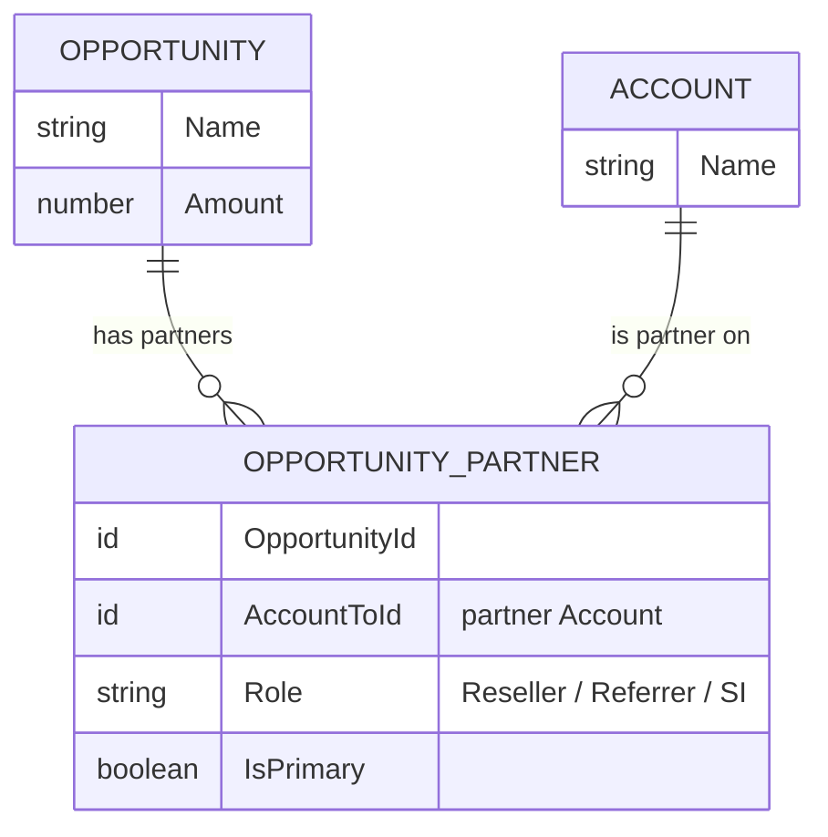

<AccordionGroup>
  <Accordion title="How it works in Salesforce" icon="gear">
    A junction object is a child of two parents, connecting them many-to-many. Each row links one opportunity to one partner account, and carries a **Role** (Reseller, Referrer, System Integrator, ...) and an **IsPrimary** flag. So one opportunity can credit several partners at once, each in a distinct role. Salesforce's built-in **OpportunityPartner** is a legacy object that can't be customized, but you can also use your own custom junction object if you've built one.
  </Accordion>

  <Accordion title="How Introw configures it" icon="sliders">
    Choose **Relation table**, point Introw at the junction object, and confirm the two keys that connect the opportunity to the partner account. Optionally add a **filter** that scopes which rows count. The defaults match the standard Opportunity Partner relation, so most orgs change nothing.
  </Accordion>

  <Accordion title="Roles power multi-partner attribution" icon="users">
    Because each row carries a Role, you can create **one named Introw attribution per role** - filter the relation to `Role = Reseller` for a "Reseller partner" attribution, `Role = Referrer` for a "Referring partner" attribution - all reading the same junction. See multi-tier attribution below.
  </Accordion>

  <Accordion title="On write-back" icon="pen">
    When a partner registers an opportunity through an Introw form, Introw writes a junction row attributing the submitting partner (for the standard object, `Role = "Partner"`, `IsPrimary = true`) - so the record is compliant with your relation model the moment it's created.
  </Accordion>
</AccordionGroup>

| Pros                                                 | Cons                                            |
| ---------------------------------------------------- | ----------------------------------------------- |
| True many-to-many: multiple partners per opportunity | More technical to set up and report on          |
| Carries **roles** and a primary flag                 | Standard OpportunityPartner can't be customized |
| Ideal for resellers, distributors, revenue splits    | A junction is another object to understand      |
| Standard **OpportunityPartner** works out of the box | -                                               |

***

## Method 4 - Custom object

**Best for:** large programs that treat partners as a core part of the data model, with tier, region, focus, and program data on a dedicated record.

A dedicated **Partner** custom object relates to Opportunities, Accounts, and Contacts, and Introw treats it as the partner.

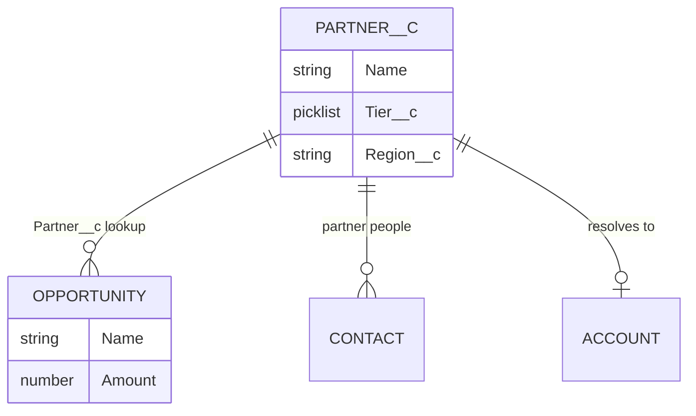

<AccordionGroup>
  <Accordion title="How it works in Salesforce" icon="gear">
    A custom object is your own object with its own fields and relationships. You model partners on it, relate it to opportunities via a lookup (or a junction for many-to-many), and hold tier, region, focus, and program data on the record itself.
  </Accordion>

  <Accordion title="How Introw configures it" icon="sliders">
    Set the **partner object** to your custom object during connect (the "How do you store partners in your CRM?" step). Then attribute opportunities via the lookup or relation that connects them to it. Introw resolves the custom object to the partner and reads its fields into segments, portals, and reporting.
  </Accordion>

  <Accordion title="Trade-off" icon="triangle-exclamation">
    Fully flexible and scalable, but it needs upfront schema design. Best when a single Account or lookup can't capture how you run partners.
  </Accordion>
</AccordionGroup>

| Pros                                                    | Cons                          |
| ------------------------------------------------------- | ----------------------------- |
| Partners are a first-class object with their own schema | Upfront schema design         |
| Rich per-partner data (tier, region, focus, program)    | More moving parts to maintain |
| Relates to opportunities, accounts, and contacts        | Overkill for small programs   |
| Scales to the largest ecosystems                        | -                             |

***

## Multi-tier attribution - more than one partner on an opportunity

Real ecosystems rarely have exactly one partner per opportunity. A referrer surfaces it, a reseller closes it, an implementation partner delivers it. Introw models this natively: **you can define several named attributions on the same object**, each with its own name. You do not need a relation table for this - **every method here can be repeated, including the single-value ones**: add a lookup or picklist per role and map each as its own attribution, so one opportunity credits several partners across tiers.

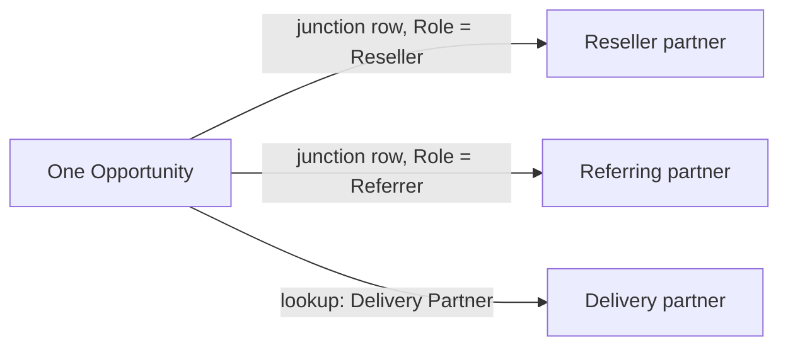

You can mix and match the mechanisms to express roles:

<CardGroup>
  <Card title="Relation-table roles" icon="users">
    One attribution per **Role** on the junction - Reseller, Referrer, SI.
  </Card>

  <Card title="Multiple lookups" icon="link">
    Separate lookups like "Sourcing Partner" and "Delivery Partner", each mapped independently.
  </Card>

  <Card title="Multiple picklists" icon="list">
    Distinct picklists per role when you're not using relationships yet.
  </Card>
</CardGroup>

<Note>
  Each named attribution is **independently reportable**, so several partners can be credited on one record - a sourcing partner and an influencing partner side by side - and your commission plans run on whichever attribution(s) you scope them to. Name each attribution clearly and it reads that way in reporting, in the portal, and to partners.
</Note>

***

## Two-way by design - read *and* write

Attribution isn't only about reading what exists. Introw also **writes attribution the same way you defined it**, so the model holds no matter who creates the record.


<CardGroup>
  <Card title="Backwards compatibility" icon="clock-rotate-left">
    Point Introw at your existing model and every historic record becomes attributable, in the right partner's pipeline. Nothing to backfill.
  </Card>

  <Card title="Data hygiene going forward" icon="broom">
    A partner registering through a form is attached with the **exact method you configured** - compliant from creation, not reconciled later.
  </Card>

  <Card title="No RevOps work either way" icon="circle-check">
    You never restructure your CRM. Tell Introw once how objects link to partners; reading old records and writing new ones follow that one definition.
  </Card>
</CardGroup>

***

## Choosing a method

| Your situation                                 | Recommended method                             | Relationship needed |
| ---------------------------------------------- | ---------------------------------------------- | ------------------- |
| Simplest start, one partner per opp            | Picklist field                                 | None                |
| Clean 1:1 with real partner data               | Lookup to Account                              | Lookup              |
| A fixed few partner roles (sourcing, delivery) | One lookup or picklist per role                | Lookup / none       |
| Many or open-ended partners, or revenue splits | Relation table (OpportunityPartner)            | Junction            |
| Track the role each partner plays              | A field per role, or a filtered relation table | Lookup / junction   |
| Large program, rich partner data               | Custom object                                  | Lookup or junction  |

<Tip>
  Whichever you choose, configuration is the same shape: open **Object Linking**, pick the method, name the attribution, decide if it's commission-eligible, save. Introw handles the rest - no code, no consultant, no RevOps project.
</Tip>

## Set it up

Whichever method you chose, you configure it in the same place: the **Object Linking** screen. This is the same attribution step the connect wizard runs, reopened any time to add or refine a mapping.

<Steps>
  <Step title="Open Object Linking">
    Go to [Integrations](https://app.introw.io/settings/integrations?category=crm), open the connected Salesforce connection with **Configure**, and go to **Which objects do you link with partners?**. Select **Add object**, or open the existing **Opportunity** mapping to edit it. Configure **Opportunity** at minimum, since it is what reporting and commissions run on.
  </Step>

  <Step title="Choose how opportunities attribute to partners">
    On **How do you attribute partners to Opportunity objects?**, pick the method that matches your org: **Custom properties** (a picklist or lookup field on the opportunity) or **Relation table** (a junction object such as an Opportunity Partner relation). This mirrors the methods above.
  </Step>

  <Step title="Configure the method and map values">
    For **Custom properties**, select the field that identifies the partner. For a **Relation table**, point Introw at the relation object and confirm the keys that connect the opportunity to the partner account, and optionally a filter that scopes which rows count. The defaults match a standard Opportunity Partner relation, so adjust only if your org differs. If a field holds coded values rather than partner names, use **Match property values to Introw partners**.
  </Step>

  <Step title="Name the attribution and save">
    Set **What name do you want to use for this attribution?** so the link reads clearly to your team and partners, then select **Add Opportunity attribution** (or **Save** when editing). Confirm when Introw asks you to verify. To credit **more than one partner on the same opportunity**, add another Opportunity attribution with a different lookup, picklist, or relation-table role (for example a "Delivery partner" alongside a "Sourcing partner") - each is its own named attribution. Repeat **Add object** to credit other record types too.
  </Step>
</Steps>

## Verify it worked

Open a partner-influenced record in your CRM. In Introw it shows attributed to the right partner under your attribution name, and that partner's sourced/influenced pipeline reflects it in reporting and commissions. For a partner-created record, confirm the attribution (association, field, or relation row) was written on the CRM record itself.

## Related

<CardGroup>
  <Card title="Connect Salesforce" icon="book-open" href="./connect-salesforce">
    Set up the connection and run this attribution step inside the wizard.
  </Card>

  <Card title="Partner attribution in HubSpot" icon="book-open" href="./attribution-in-hubspot">
    The same depth for HubSpot - properties, association labels, and roles.
  </Card>

  <Card title="Show & rename CRM fields" icon="table-columns" href="./show-and-rename-crm-fields">
    Put any Salesforce field on your Introw tables, overviews, and partner views - renamed to partner-friendly labels.
  </Card>
</CardGroup>

---

# Collaborate from HubSpot deals and tickets
Source: https://docs.introw.io/features/integrations/crm/guides/collaborate-from-hubspot-deals-and-tickets

Use the Introw card on a HubSpot deal or ticket to share the record with a partner and exchange comments and updates without ever leaving your CRM.

The **Introw Collaboration** app card on a HubSpot deal or ticket lets a rep share the record with the partner and exchange comments right where they already work. The partner sees the shared record and replies from their portal, so the back-and-forth stays attached to the deal instead of scattering across email threads. This guide walks a rep through collaborating from the card end to end, so the partner becomes an active collaborator on the record.

## What you'll achieve

A live collaboration thread between your rep and a partner, anchored to a HubSpot deal or ticket: the partner is a collaborator, comments flow both ways, and the partner can open the related portal, all without anyone leaving their own tool.

## Before you start

<Steps>
  <Step title="Add the Introw app card">
    The **Introw Collaboration** app card must be on the deal and ticket record layout. See [Set up Introw inside HubSpot](./set-up-the-hubspot-partner-connect-card).
  </Step>

  <Step title="Have a partner to share with">
    The partner you want to collaborate with should exist in Introw so you can select them.
  </Step>
</Steps>

## Steps

<Steps>
  <Step title="Open the record and find the Introw card">
    In HubSpot, open the deal or ticket and find the **Introw Collaboration** card in the sidebar. If a partner is already linked, the card shows the partner, their tier, the collaborators, and the champion or manager. If none is linked yet, the card offers to share the record so you can bring a partner in.
  </Step>

  <Step title="Share the record with a partner">
    Select **Share** (the **Share deal** or **Share ticket** action) and choose the partner to collaborate with. Sharing is what gives the partner visibility of this record in their portal and adds them as a collaborator. Choose deliberately, since the partner will see the record you share.
  </Step>

  <Step title="Collaborate and comment">
    Select **Collaborate** to open the conversation, then post a comment from the card. The partner is notified and replies from their portal, and their replies appear back on the card, so the thread stays attached to the HubSpot record. Use **Ask AI** if you want a quick summary or draft, and **View portal** to jump to the partner's portal for the record.
  </Step>
</Steps>

## Verify it worked

The partner appears as a collaborator on the **Introw Collaboration** card, your comment shows in the thread, and when the partner replies from their portal the reply appears on the HubSpot record without anyone leaving their own tool.

## Related

<CardGroup>
  <Card title="Register a deal from HubSpot" icon="book-open" href="./register-a-deal-from-hubspot">
    Register or link a partner deal from the card.
  </Card>

  <Card title="Shared Pipelines" icon="book-open" href="/features/co-selling/shared-pipelines">
    The full co-selling collaboration model.
  </Card>

  <Card title="Implementation reference" icon="screwdriver-wrench" href="../technical">
    Full configuration options.
  </Card>
</CardGroup>

---

# Collaborate from Salesforce opportunities and cases
Source: https://docs.introw.io/features/integrations/crm/guides/collaborate-from-salesforce-opportunities-and-cases

Use the Introw collaboration panel on a Salesforce opportunity or case to share the record with a partner and exchange comments and updates without ever leaving your CRM.

The **Introw collaboration** panel on a Salesforce opportunity or case lets a rep share the record with the partner and exchange comments right where they already work. It is the Salesforce equivalent of the Introw app card on a HubSpot deal, with the same partner tile, the same actions, and the same conversation underneath, so a rep who moves between the two CRMs works the same way in both. The partner sees the shared record and replies from their portal, so the back-and-forth stays attached to the opportunity instead of scattering across email threads.

<Frame>
  
</Frame>

## What you'll achieve

A live collaboration thread between your rep and a partner, anchored to a Salesforce opportunity or case: the partner is a collaborator, comments flow both ways, and your rep drives all of it from the Salesforce record, without opening Introw.

## Before you start

<Steps>
  <Step title="Add the Introw collaboration panel">
    The panel must be on the opportunity and case record page, and you must hold the **Introw Collaboration User** permission set. See [Embed Introw in Salesforce](./embed-introw-in-salesforce).
  </Step>

  <Step title="Have a partner to share with">
    The partner you want to collaborate with should exist in Introw so you can select them.
  </Step>
</Steps>

## Steps

<Steps>
  <Step title="Open the record and find the panel">
    In Salesforce, open the opportunity or case and find **Introw collaboration** on the record page. If a partner is already attributed, the panel shows the partner, their tier, your own team on the account, the collaborators, and the champion. If none is linked yet, it reads **No partner involved yet** and offers to share the record so you can bring a partner in.
  </Step>

  <Step title="Share the record with a partner">
    Select **Share opportunity** (or **Share case**) and choose the partner to collaborate with. Sharing is what gives the partner visibility of this record in their portal and adds them as a collaborator. Choose deliberately, since the partner will see the record you share.
  </Step>

  <Step title="Collaborate and comment">
    Select **Collaborate** to open the conversation in a window on top of the record, then post a comment. The partner is notified and replies from their portal, and their replies appear back on the panel, so the thread stays attached to the Salesforce record. Use **Ask AI** for a summary or a draft, **View portal** to jump to the partner's portal for this record, and **Create portal** if the partner has no portal yet.
  </Step>
</Steps>

## Verify it worked

The partner appears under **Collaborators** on the **Introw collaboration** panel, your comment shows in the thread, and when the partner replies from their portal the reply appears on the Salesforce record without anyone leaving their own tool.

## Troubleshooting

| What you see                                          | Why                                                                                                            | What to do                                                                                                                |
| ----------------------------------------------------- | -------------------------------------------------------------------------------------------------------------- | ------------------------------------------------------------------------------------------------------------------------- |
| **Request access** instead of partner data            | You are a Salesforce user but not yet an Introw user, so there is nothing to show you.                         | Select it. Your Introw admin is notified and approves you, and the panel fills in.                                        |
| **No partner involved yet**                           | Nothing attributes this record to a partner.                                                                   | Share it with a partner from the panel, or fix attribution. See [Attribution in Salesforce](./attribution-in-salesforce). |
| The panel is missing from the record page             | The component is not placed, or the record page it is on is not active for your app, record type or profile.   | See [Embed Introw in Salesforce](./embed-introw-in-salesforce).                                                           |
| The panel loads but a partner shows no action buttons | You do not have access to that partner in Introw. Links are withheld per partner rather than hidden wholesale. | Ask your Introw admin to widen your partner access.                                                                       |
| An action opens an empty window                       | Your org has not allowed Introw as a trusted site for framing.                                                 | The managed package ships the CSP trusted site. Check it survived the install with your Salesforce admin.                 |

## Related

<CardGroup>
  <Card title="Embed Introw in Salesforce" icon="book-open" href="./embed-introw-in-salesforce">
    Install the package and place the panel on record pages.
  </Card>

  <Card title="Collaborate from HubSpot" icon="book-open" href="./collaborate-from-hubspot-deals-and-tickets">
    The same motion on the HubSpot app card.
  </Card>

  <Card title="Shared Pipelines" icon="book-open" href="/features/co-selling/shared-pipelines">
    The full co-selling collaboration model.
  </Card>

  <Card title="Implementation reference" icon="screwdriver-wrench" href="../technical">
    Full configuration options.
  </Card>
</CardGroup>

---

# Connect HubSpot as your source of truth
Source: https://docs.introw.io/features/integrations/crm/guides/connect-hubspot

Connect HubSpot in three questions: which object holds your partners, which records are partners, and how deals link to them.

Connecting HubSpot is the first thing you do in Introw, and it takes about ten minutes. You sign in once, then Introw asks you three questions: which HubSpot object holds your partners, which of those records are partners, and how deals link to them. Answer those and your partners, deals, and contacts are in Introw, with partner attribution written back onto your HubSpot records.

## What you'll achieve

The right companies show up as partners in Introw, new matching companies arrive on their own, and every partner-influenced deal is credited to the partner behind it. That last one is what partner revenue reporting and commissions run on.

## Before you start

<Steps>
  <Step title="You can authorize a HubSpot app">
    HubSpot grants access at portal level, so you need an account that can approve an app and accept every permission it asks for.
  </Step>

  <Step title="No other CRM is connected">
    Introw holds one CRM at a time. If Salesforce is connected, [disconnect it](./disconnect-a-crm) first, and check you have permission to manage integrations in Introw.
  </Step>
</Steps>

## Watch it

<Tabs>
  <Tab title="Video">
    <video />
  </Tab>

  <Tab title="Click through">
    <iframe />
  </Tab>
</Tabs>

## Steps

### Sign in to HubSpot

<Steps>
  <Step title="Open Integrations">
    Go to [Integrations](https://app.introw.io/settings/integrations?category=crm) and stay on **CRM & Data**, where the HubSpot and Salesforce tiles live.

    <Frame>
      
    </Frame>
  </Step>

  <Step title="Select Connect on the HubSpot tile">
    A greyed-out tile means another CRM is already connected. Once HubSpot is connected the same tile reads **Configure**, which is how you come back to any of the answers below.

    <Frame>
      
    </Frame>
  </Step>

  <Step title="Approve the connection in HubSpot">
    Sign in, pick the HubSpot account, and **accept every permission**. Decline one and HubSpot sends you back with a message that all permissions are required, and nothing connects.

    Your security team can review the list first in [HubSpot permissions and scopes](./hubspot-permissions-and-scopes).
  </Step>
</Steps>

### Answer three questions

HubSpot is connected and the setup opens on one screen: the three questions down the left, the answer for the one you are on to the right. Answer them in order the first time. After that, select any question to change your answer.

<Info>
  Nothing here is permanent. You can widen a filter, add another object, or come back through **Configure** on the HubSpot tile whenever your program changes.
</Info>

#### 1. How do you store partners in your CRM?

<Steps>
  <Step title="Pick the object your partners live on">
    This is the one answer everything else hangs off, because it tells Introw what a partner *is*.

    * **Company** is right for almost every program. Your partners are companies in HubSpot alongside your customers, and a filter separates them in the next question.
    * **A custom object** is right when you already run partners on their own object. Pick it and Introw never mistakes a customer company for a partner.

    Only objects that can hold partners appear, so a short list is normal.

    <Frame>
      
    </Frame>
  </Step>

  <Step title="Select Next and confirm">
    Introw shows you what it heard, for example "Company objects", and asks you to confirm with **Yes, that is correct**.

    Confirming a *different* object later clears the filter and the object links below, so those two questions start over. That is the point of confirming.
  </Step>
</Steps>

#### 2. Find partners in your CRM

<Steps>
  <Step title="Filter down to the partners">
    Not every company in HubSpot is a partner, so narrow the list here. Select **Add filter**, pick a property, and set the value. The count beside **Partners** updates as you go.

    **Add filter** lists every property on the object, searchable, so filter on whatever you already use to mark partners. Most programs land on the obvious one, such as **Type is any of Partner or Reseller**. Lifecycle stage, country, owner, and your own custom fields all work too, and a second filter lets you import one program at a time: resellers now, referral partners later.

    <Frame>
      
    </Frame>
  </Step>

  <Step title="Select the partners to import">
    Take everything the filter found with the select-all banner, or tick individual rows to start with a pilot group. **Search** narrows the visible rows without touching your selection.
  </Step>

  <Step title="Import them">
    Select **Continue with \[N] partners** and confirm. Introw creates the partners, then starts a full sync for their contacts, deals, and mapped properties. Larger selections take up to a minute.

    Two things to know about this dialog:

    * **Automatically sync new partners** appears when a filter is set and every matching record is selected. Turn it on and any company that later matches the filter becomes a partner on its own, with nobody re-importing. This is the setting you want.
    * If Introw says you have exceeded the maximum number of partners, tighten the filter and try again.
  </Step>
</Steps>

#### 3. Which objects do you link with partners?

This question is why the connection is worth making. Linking says *this deal came through this partner*, and it is what partner revenue reporting, goals, and commissions read.

<Steps>
  <Step title="Open Object Linking">
    The right pane lists the links you have. Select **Add object** to create one.

    <Frame>
      
    </Frame>
  </Step>

  <Step title="Choose the object to credit">
    **Start with Deal.** It is the object reporting and commissions run on, and the setup treats it as the one that completes this question. Come back for **Contact**, **Company**, **Ticket**, or **Lead** afterwards.

    <Frame>
      
    </Frame>
  </Step>

  <Step title="Choose how partners attach to it">
    Three ways, and the right one is whichever matches what your team already does in HubSpot:

    * **Custom properties** reads the partner off a property on the deal. Pick this when you already tag deals with a partner, usually a dropdown.
    * **Associations** reads a HubSpot association between the deal and the partner company. Pick this when your team already associates partners to deals, and choose the association label on the next screen.
    * **No attribution yet** is for starting fresh. Introw creates a partner property on the object in HubSpot for you, in one click, and links your partners to its values.

    Comparing them properly, with the trade-offs of each: [Partner attribution in HubSpot](./attribution-in-hubspot).

    <Frame>
      
    </Frame>
  </Step>

  <Step title="Name it and add it">
    **What name do you want to use for this attribution?** is the label your team and your partners read on the deal, so write it the way you'd say it: "Influencing partner", "Reseller". Then select **Add deal attribution**.

    Repeat **Add object** for every other record you want credited. A program that shares support work links **Ticket** too; one that runs on referrals links **Contact**.
  </Step>
</Steps>

### Finish

<Steps>
  <Step title="Select Finish">
    With a **Deal** link in place, select **Finish**. Introw starts pulling your partner data and lands you on your home view.

    <Frame>
      
    </Frame>
  </Step>
</Steps>

## Verify it worked

The HubSpot tile reads **Connected**, and your filtered companies are in [Partners](https://app.introw.io/partners). Open a partner and its deals are there, credited through the link you configured.

The sync runs both ways once you say what should go back: [map tiers and managers to a CRM property](./map-tiers-to-a-crm-property) pushes a partner's tier, program, and manager onto the company in HubSpot, and Introw can create those properties for you in one click.

If the tile shows a status other than **Connected**, [troubleshoot a CRM connection](./troubleshoot-a-crm-connection) covers every state, including the **Install update** prompt HubSpot raises when it needs new permissions.

## Related

<CardGroup>
  <Card title="Partner attribution in HubSpot" icon="diagram-project" href="./attribution-in-hubspot">
    Compare every attribution method - property, association label, custom object - and its trade-offs before you choose.
  </Card>

  <Card title="Set up Introw inside HubSpot" icon="id-card" href="./set-up-the-hubspot-partner-connect-card">
    Add the Introw cards so reps work with partners from the record.
  </Card>

  <Card title="Sync partners & contacts" icon="users" href="./sync-partners-and-contacts">
    How the sync keeps partners and their contacts current after setup.
  </Card>

  <Card title="HubSpot permissions & scopes" icon="lock" href="./hubspot-permissions-and-scopes">
    Every scope Introw requests, and what happens when one is missing.
  </Card>

  <Card title="Troubleshoot a CRM connection" icon="book-open" href="./troubleshoot-a-crm-connection">
    Fix a sync that shows a needs-attention status.
  </Card>

  <Card title="Connect Salesforce as your source of truth" icon="book-open" href="./connect-salesforce">
    The same three questions, for Salesforce.
  </Card>
</CardGroup>

---

# Connect Salesforce as your source of truth
Source: https://docs.introw.io/features/integrations/crm/guides/connect-salesforce

Connect a Salesforce org in three questions: which object holds your partners, which records are partners, and how opportunities link to them.

Connecting Salesforce makes your org the source of truth for the partner program. You authorize once, install the managed package, then Introw asks you three questions: which object holds your partners, which of those records are partners, and how opportunities link to them. Answer those and your accounts, opportunities, and contacts are in Introw, with partner attribution written back onto your Salesforce records.

## What you'll achieve

The right accounts show up as partners in Introw, new matching accounts arrive on their own, and every partner-influenced opportunity is credited to the partner behind it. That last one is what partner revenue reporting and commissions run on.

## Before you start

<Steps>
  <Step title="Create the integration user first">
    Introw runs as the Salesforce user who authorizes it, and inherits exactly that user's access: CRUD, field-level security, and sharing, nothing more. Connect as a **dedicated integration user** with a scoped permission set rather than someone's own login. [Salesforce permissions & scopes](./salesforce-permissions-and-scopes) has the user setup and the access it needs.
  </Step>

  <Step title="Allow the Introw connected app">
    Salesforce refuses to authorize a connected app that is not installed in the org, and it exempts system administrators only. That means an admin's test connection works and your integration user is refused on the same org. Sort this out before you start: [Allow the Introw connected app](./salesforce-permissions-and-scopes#allow-the-introw-connected-app).
  </Step>

  <Step title="Decide production or sandbox">
    Sandbox connects a test org and never touches production data. Production connects your live records.
  </Step>

  <Step title="No other CRM is connected">
    Introw holds one CRM at a time. If HubSpot is connected, [disconnect it](./disconnect-a-crm) first, and check you have permission to manage integrations in Introw.
  </Step>
</Steps>

## Steps

### Authorize the org

<Steps>
  <Step title="Open Integrations">
    Go to [Integrations](https://app.introw.io/settings/integrations?category=crm) and stay on **CRM & Data**. A greyed-out Salesforce tile means another CRM is connected; disconnect it first.

    <Frame>
      
    </Frame>
  </Step>

  <Step title="Choose production or sandbox">
    On the **Salesforce** tile select **Connect**. The **Connect Salesforce** dialog asks which environment to use, and the button renames itself to match:

    * Leave **Use Sandbox Environment** off to connect production (`login.salesforce.com`). The button reads **Connect Production**.
    * Turn it on to connect a sandbox or developer org (`test.salesforce.com`). The button reads **Connect Sandbox**.
  </Step>

  <Step title="Sign in and install the managed package">
    Select the connect button. Salesforce asks you to sign in even if you already have a session in this browser, so you can choose the dedicated integration user rather than a personal account. When prompted, **install the managed package** into the org: it carries the objects, the permission sets, and the Lightning component behind the in-CRM embed. It is the same package as the [Introw listing on Salesforce AgentExchange](https://appexchange.salesforce.com/appxListingDetail?listingId=54d27313-9aa0-4e9f-9ec6-3f9dae7a6a6e), so a security team that needs to review it before you connect can start there.

    If Salesforce shows an OAuth error instead of the approval screen, the org has not allowed the connected app yet. That is the expected first result, and [Allow the Introw connected app](./salesforce-permissions-and-scopes#allow-the-introw-connected-app) fixes it in a few clicks.
  </Step>
</Steps>

### Answer three questions

Salesforce is connected and the setup opens on one screen: the three questions down the left, the answer for the one you are on to the right. Answer them in order the first time. After that, select any question to change your answer.

<Info>
  Nothing here is permanent. You can widen a filter, add another object, or come back through **Configure** on the Salesforce tile whenever your program changes.
</Info>

#### 1. How do you store partners in your CRM?

<Steps>
  <Step title="Pick the object your partners live on">
    This is the one answer everything else hangs off, because it tells Introw what a partner *is*.

    * **Account** is right for almost every program. Your partners are accounts alongside your customers, and a filter separates them in the next question.
    * **A custom object** is right when you already run partners on their own object. Pick it and Introw never mistakes a customer account for a partner.

    Only objects that can hold partners appear, so a short list is normal.
  </Step>

  <Step title="Select Next and confirm">
    Introw shows you what it heard, for example "Account objects", and asks you to confirm with **Yes, that is correct**.

    Confirming a *different* object later clears the filter and the object links below, so those two questions start over. That is the point of confirming.
  </Step>
</Steps>

#### 2. Find partners in your CRM

<Steps>
  <Step title="Filter down to the partners">
    Not every account in Salesforce is a partner, so narrow the list here. Select **Add filter**, pick any field on the object, and set the value. The count beside **Partners** updates as you go.

    Most programs filter on what they already mark partners with: a record type, a partner-type picklist, or a checkbox. Add a second filter to import one program at a time, resellers now and referral partners later.
  </Step>

  <Step title="Select the partners to import">
    Take everything the filter found with the select-all banner, or tick individual rows to start with a pilot group. **Search** narrows the visible rows without touching your selection.
  </Step>

  <Step title="Import them">
    Select **Continue with \[N] partners** and confirm. Introw creates the partners, then starts a full sync for their contacts, opportunities, and mapped fields. Larger selections take up to a minute.

    Two things to know about this dialog:

    * **Automatically sync new partners** appears when a filter is set and every matching record is selected. Turn it on and any account that later matches the filter becomes a partner on its own, with nobody re-importing. This is the setting you want.
    * If Introw says you have exceeded the maximum number of partners, tighten the filter and try again.
  </Step>
</Steps>

#### 3. Which objects do you link with partners?

This question is why the connection is worth making. Linking says *this opportunity came through this partner*, and it is what partner revenue reporting, goals, and commissions read.

<Steps>
  <Step title="Open Object Linking">
    The right pane lists the links you have. Select **Add object** to create one.
  </Step>

  <Step title="Choose the object to credit">
    **Start with Opportunity.** It is the object reporting and commissions run on, and the setup treats it as the one that completes this question. Come back for **Contact**, **Account**, **Case**, or a custom object afterwards.
  </Step>

  <Step title="Choose how partners attach to it">
    Two ways in Salesforce, and the right one is whichever matches what your team already does:

    * **Custom properties** reads the partner off a field on the opportunity. Pick this when you already record a partner there, usually a picklist or an Account lookup.
    * **Relation table** reads a junction object between the opportunity and the partner account, such as **Opportunity Partner**. Pick this when partners are tracked in a junction rather than a single field, especially when one opportunity can involve several partners. Introw then asks which field is the foreign key for the opportunity, which is the foreign key for the partner, and optionally a filter, so you can attribute on a specific partner role only.

    Comparing them properly, with roles and multi-partner deals: [Partner attribution in Salesforce](./attribution-in-salesforce).
  </Step>

  <Step title="Name it and add it">
    **What name do you want to use for this attribution?** is the label your team and your partners read on the opportunity, so write it the way you'd say it: "Influencing partner", "Reseller". Then select **Add opportunity attribution**.

    Repeat **Add object** for every other record you want credited. A program that shares support work links **Case** too; one that runs on referrals links **Contact**.
  </Step>
</Steps>

### Finish

<Steps>
  <Step title="Select Finish">
    With an **Opportunity** link in place, select **Finish**. Introw starts pulling your partner data and lands you on your home view.
  </Step>

  <Step title="Add the embed while you're here">
    The managed package ships the Lightning component, but someone still has to put it on a record page. [Embed Introw in Salesforce](./embed-introw-in-salesforce) is the ten-minute follow-up that gets your reps working with partners without leaving Salesforce.
  </Step>
</Steps>

## Verify it worked

The Salesforce tile reads **Connected**, and your filtered accounts are in [Partners](https://app.introw.io/partners). Open a partner and its opportunities are there, credited through the link you configured.

The sync runs both ways once you say what should go back: [map tiers and managers to a CRM property](./map-tiers-to-a-crm-property) pushes a partner's tier, program, and manager onto the account in Salesforce.

If the tile shows a status other than **Connected**, [troubleshoot a CRM connection](./troubleshoot-a-crm-connection) covers every state, including the **Install package** and **Install update** prompts that appear when the org needs the latest managed package.

## Related

<CardGroup>
  <Card title="Salesforce permissions & scopes" icon="lock" href="./salesforce-permissions-and-scopes">
    The integration user, the OAuth scopes, and how to allow the Introw connected app.
  </Card>

  <Card title="Partner attribution in Salesforce" icon="diagram-project" href="./attribution-in-salesforce">
    Compare every attribution method - picklist, lookup, relation table, custom object - and its trade-offs before you choose.
  </Card>

  <Card title="Embed Introw in Salesforce" icon="id-card" href="./embed-introw-in-salesforce">
    Add the Introw component to Salesforce record pages.
  </Card>

  <Card title="Sync partners & contacts" icon="users" href="./sync-partners-and-contacts">
    How the sync keeps partner accounts and their contacts current after setup.
  </Card>

  <Card title="Troubleshoot a CRM connection" icon="book-open" href="./troubleshoot-a-crm-connection">
    Fix a sync that shows a needs-attention status.
  </Card>

  <Card title="Connect HubSpot as your source of truth" icon="book-open" href="./connect-hubspot">
    The same three questions, for HubSpot, with a full click-through walkthrough.
  </Card>
</CardGroup>

---

# Create a partner portal from HubSpot
Source: https://docs.introw.io/features/integrations/crm/guides/create-a-portal-from-hubspot

Spin up an Introw partner portal for a company without leaving HubSpot, using the Introw workflow action or the Introw Copilot card.

If a new or existing partner has no Introw portal yet, you can create one without leaving HubSpot, either automatically with the Introw workflow action or on demand from the Introw Copilot card on a company record. This guide covers both paths so you can onboard partners from the tools your team already works in.

## What you'll achieve

An Introw partner portal created for a HubSpot company, either automatically as part of a workflow or with one click from the company record, so partners get a portal without you switching tools.

## Before you start

<Steps>
  <Step title="Connect the Introw app in HubSpot">
    The workflow action and Copilot card require the Introw app connected to HubSpot. See [Connect HubSpot](./connect-hubspot).
  </Step>

  <Step title="Add the Copilot card (for the manual path)">
    To create portals from a record, the Introw Copilot card must be pinned to your company records. See [Set up the HubSpot Partner Connect card](./set-up-the-hubspot-partner-connect-card).
  </Step>

  <Step title="Have an experience to assign">
    A portal is created from a partner experience, so have one ready. See [Build and publish a portal experience](/features/portal/experiences/guides/build-and-publish-a-portal-experience).
  </Step>
</Steps>

## Steps

<Steps>
  <Step title="Choose your path">
    Decide whether to create portals automatically for many companies (workflow action) or on demand for the company you are looking at (Copilot card). Both run inside HubSpot.
  </Step>

  <Step title="Create portals automatically with the workflow action">
    In a HubSpot workflow, add the Introw PRM action and configure it to create the partner and portal, so qualifying companies get a portal without manual work. See [Use Introw workflow actions in HubSpot](./use-introw-workflow-actions-in-hubspot) for building the workflow.
  </Step>

  <Step title="Create a portal on demand from the Copilot card">
    On a company record with the Introw Copilot card, select **Create partner portal**. Introw creates the portal for that company directly, so you can onboard a single partner while working the record.
  </Step>
</Steps>

## Verify it worked

The company now has a partner portal in Introw: it appears on the partner in Introw, and (for the manual path) the Copilot card reflects the created portal instead of prompting you to create one. You can then assign or refine the experience and invite the partner.

## Related

<CardGroup>
  <Card title="Use Introw workflow actions in HubSpot" icon="diagram-project" href="./use-introw-workflow-actions-in-hubspot">
    Automate partner and portal creation in a workflow.
  </Card>

  <Card title="Set up the HubSpot Partner Connect card" icon="id-card" href="./set-up-the-hubspot-partner-connect-card">
    Pin the Introw card that offers "Create partner portal".
  </Card>

  <Card title="Build and publish a portal experience" icon="table-columns" href="/features/portal/experiences/guides/build-and-publish-a-portal-experience">
    Build the experience each new portal is based on.
  </Card>
</CardGroup>

---

# Disconnect a CRM
Source: https://docs.introw.io/features/integrations/crm/guides/disconnect-a-crm

Safely disconnect a HubSpot or Salesforce integration from Introw and understand exactly what data and sync activity stops flowing.

Disconnecting stops the two-way sync between Introw and your CRM and removes the CRM data Introw has imported. You do this when you are switching CRMs, decommissioning an org, or pausing the program. Because the CRM is the source of truth, it is worth understanding precisely what disconnecting removes before you confirm, so you do not lose partner context you still need.

## What you'll achieve

A cleanly disconnected CRM: the sync stops, imported CRM data is removed from Introw, and the tile returns to a connectable state so you can link a different CRM when you are ready. Only one CRM can be connected at a time, so disconnecting is also the prerequisite for switching CRMs.

## Before you start

<Steps>
  <Step title="Confirm your permission">
    You need permission to manage integrations in Introw.
  </Step>

  <Step title="Understand the impact">
    Disconnecting removes the data Introw imported from the CRM and stops any new updates from syncing in either direction. Partners and attribution that depend on the CRM sync will no longer update. Export or note anything you need before continuing.
  </Step>
</Steps>

## Watch it

<Tabs>
  <Tab title="Video">
    <video />
  </Tab>

  <Tab title="Click through">
    <iframe />
  </Tab>
</Tabs>

## Steps

<Steps>
  <Step title="Open the connected CRM">
    Go to [Integrations](https://app.introw.io/settings/integrations?category=crm) and open the connected CRM by selecting **Configure** on its tile to reach the connection detail page.

    <Frame>
      
    </Frame>
  </Step>

  <Step title="Start the disconnect">
    In the detail header, open the three-dots **More integration actions** menu at the far right and select **Disconnect**. Introw opens a confirmation dialog titled **Disconnect \[HubSpot / Salesforce]** that spells out the impact: it will remove all the data Introw has imported from your CRM and prevent any new updates from syncing to Introw and your partners.

    <Tip>
      The same menu holds **Reconnect**. If you are disconnecting to fix a broken connection or to move it to a different CRM user, reconnect instead: it re-runs consent without removing the data Introw already imported. See [Troubleshoot a CRM connection](./troubleshoot-a-crm-connection).
    </Tip>

    <Frame>
      
    </Frame>
  </Step>

  <Step title="Confirm">
    Read the warning, then confirm the disconnect. Introw shows a success message and the tile returns to a **Connect** state.
  </Step>
</Steps>

## Verify it worked

The CRM tile on the Integrations page shows **Not connected**, the sync has stopped, and you can now connect a different CRM if you are switching.

## Related

<CardGroup>
  <Card title="Troubleshoot a CRM connection" icon="book-open" href="./troubleshoot-a-crm-connection">
    Try fixing a connection before you disconnect it.
  </Card>

  <Card title="Connect HubSpot as your source of truth" icon="book-open" href="./connect-hubspot">
    Reconnect or switch to a new CRM.
  </Card>

  <Card title="Implementation reference" icon="screwdriver-wrench" href="../technical">
    Full configuration options.
  </Card>
</CardGroup>

---

# Embed Introw in Salesforce
Source: https://docs.introw.io/features/integrations/crm/guides/embed-introw-in-salesforce

Install the Introw managed package, add the Introw collaboration panel to record pages, and grant access so reps work with partners from Salesforce.

Introw ships as a Lightning Web Component inside a managed package. Once installed, a Salesforce admin drops the **Introw collaboration** panel onto the Opportunity or Case record page, giving both your sales reps and your partnership team a full in-Salesforce experience: they see the linked partner and partner intel, collaborate, and share the record straight from Salesforce - without ever logging into Introw. This guide covers the full admin setup, installing the package, placing and activating the component, and granting access, so the embed is live for the right users.

<Note>
  The collaboration panel ships in **IntrowPRM 1.15.0**. Orgs on an older version see **Install update** on the Salesforce integration page in Introw, which opens the install link for the current version in the right environment. An org where Introw has no package version on record sees **Install package** instead, and orgs already on it see no button.
</Note>

## What you'll achieve

The Introw component placed and activated on your Salesforce record pages and visible to the sales reps and partnership team who need it, so partner context, intel, and actions live inside Salesforce - with no one having to log into a separate tool.

## Before you start

<Steps>
  <Step title="Connect Salesforce">
    Salesforce must be connected. See [Connect Salesforce as your source of truth](/features/integrations/crm/guides/connect-salesforce). The connect flow may prompt you to install the managed package.
  </Step>

  <Step title="Be a Salesforce admin">
    You need admin rights to install a managed package, edit record pages in the Lightning App Builder, and assign permission sets.
  </Step>
</Steps>

## Steps

<Steps>
  <Step title="Install the Introw managed package">
    Install the Introw managed package into the org (production or sandbox, matching how you connected), either from the prompt in the connect flow or from the [Introw listing on Salesforce AgentExchange](https://appexchange.salesforce.com/appxListingDetail?listingId=54d27313-9aa0-4e9f-9ec6-3f9dae7a6a6e). Installing it adds the Introw component and the supporting objects, and it assigns the **Introw API Access** and **Introw Collaboration User** permission sets to the installing user automatically.
  </Step>

  <Step title="Add the component in the Lightning App Builder">
    Open the **Lightning App Builder** and edit the record page for the object you want, **Opportunity** or **Case**. Drag the **Introw collaboration** component onto the page where reps should see it (a sidebar region or a tab).
  </Step>

  <Step title="Activate and assign the page">
    Save and **activate** the record page for the right Lightning apps, record types, and profiles, so the component appears for the intended users. Repeat for each object whose records should show Introw.
  </Step>

  <Step title="Grant access to other users">
    The managed package only assigns its permission sets to the installer. Assign **Introw Collaboration User** to every rep who should see the panel, otherwise it will not load partner data for them. **Introw API Access** is for the integration user behind the connection and does not grant the panel.
  </Step>
</Steps>

## Verify it worked

Open an opportunity linked to a partner as a user who has the **Introw Collaboration User** permission set: the panel loads the linked partner, their tier and champion, your team, and the partner contacts collaborating on the record, with **Ask AI**, **Collaborate**, **View portal**, **Create portal** and **Share opportunity**. A user who is not an Introw user sees a **Request access** button instead, and a record with no linked partner shows no partner data, both of which are expected.

<Frame>
  
</Frame>

## Related

<CardGroup>
  <Card title="Collaborate from Salesforce" icon="handshake" href="./collaborate-from-salesforce-opportunities-and-cases">
    What a rep does with the panel once it is live.
  </Card>

  <Card title="Set up Introw inside HubSpot" icon="book-open" href="./set-up-the-hubspot-partner-connect-card">
    The equivalent setup for HubSpot.
  </Card>

  <Card title="Shared Pipelines" icon="book-open" href="/features/co-selling/shared-pipelines">
    The co-selling collaboration model the embed supports.
  </Card>

  <Card title="Embed" icon="book-open" href="/features/developer/embed">
    The embed model across CRMs.
  </Card>

  <Card title="Implementation reference" icon="screwdriver-wrench" href="../technical">
    Full configuration options.
  </Card>
</CardGroup>

---

# Every CRM error Introw logs, and where to read it
Source: https://docs.introw.io/features/integrations/crm/guides/every-crm-error-introw-logs

The four places Introw reports a CRM failure: the connection, one broken mapping, what the connection is not allowed to do, and a record your CRM refused.

> For the admin or CS engineer holding a report that something did not sync, and needing to know which screen holds the answer.

"It did not sync" is four different failures wearing one sentence.
Introw reports each of them in a different place, on purpose: a broken connection belongs on the integration, a field nobody can write belongs on the screen where you were about to map it, and a record your CRM refused belongs on the submission that tried to create it.
This guide is the map, so you open the right screen first instead of working through all four.

## What you'll achieve

You can name the layer a failure lives in, read Introw's own words for it, and act on the cause rather than guessing: a reconnect, a permission in your CRM, a remapped property, or a corrected submission.

## Before you start

<Steps>
  <Step title="Know which CRM you are on">
    Salesforce and HubSpot fail differently because their permission models differ, and the guide says so per layer.
  </Step>

  <Step title="Confirm your permission">
    Reading these surfaces needs access to Integrations, Forms, and Submissions in Introw. Fixing most of them needs admin access in your CRM.
  </Step>
</Steps>

## The four layers

Work top down. Each layer only makes sense once the one above it is healthy.

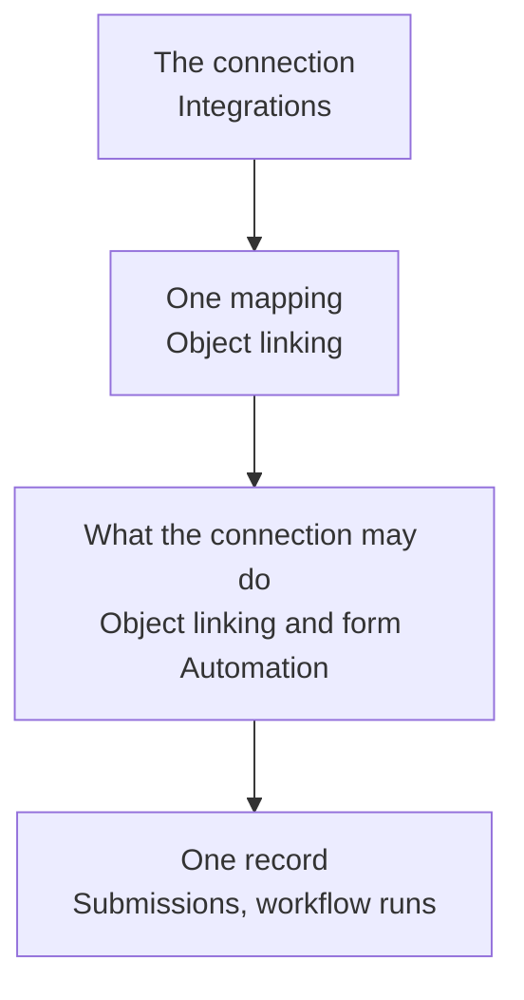

## Steps

### Layer 1: the connection

<Steps>
  <Step title="Read the status pill">
    Go to [Integrations](https://app.introw.io/settings/integrations?category=crm) and read the tile's pill: **Connected**, **Update available**, **Needs attention**, **Rate limited**, **Interrupted**, or **Not connected**.

    A pill is a whole-connection verdict, so it is the fastest way to rule the layer out. **Interrupted** means authorization broke and nothing is flowing. **Rate limited** means your CRM throttled the sync and it will clear itself. **Update available** means new scopes are waiting on a CRM admin, and only the data behind those scopes has stopped.

    [Troubleshoot a CRM connection](./troubleshoot-a-crm-connection) walks each pill to its fix. Come back here when the pill reads **Connected** or **Needs attention** and something is still missing.

    <Note>
      A broken connection does not email your team. Introw's own on-call is alerted so support can reach out, but nothing lands in your inbox, so the Integrations page is the surface to check.
    </Note>
  </Step>
</Steps>

### Layer 2: one mapping

<Steps>
  <Step title="Find the mapping carrying a warning pill">
    Open the CRM via **Configure**, then **Object linking**. A **Needs attention** connection is usually one mapping, not the whole sync: Introw isolates the failing object link, keeps syncing everything else, and marks just that row with a red warning pill.

    Select the row to read what broke. Introw names the likely CRM-side cause per CRM and per mapping method:

    | Where it broke                | What Introw says                                                                                                          |
    | ----------------------------- | ------------------------------------------------------------------------------------------------------------------------- |
    | HubSpot, a property mapping   | The selected property no longer exists in HubSpot. Verify the object type and property configuration.                     |
    | HubSpot, an association label | The association label no longer exists in HubSpot. Verify the label is still configured.                                  |
    | Salesforce, any mapping       | Permissions are incorrect, or the object or property no longer exists. Verify your permissions and mapping configuration. |
    | Salesforce, a relation table  | Permissions are incorrect, or the relation table, object, or property no longer exists.                                   |

    Every one of these notices also says that Introw retries the mapping automatically on the next sync, which is the part people miss: you fix the CRM side and the flag clears itself. There is no button to press.
  </Step>

  <Step title="Trust the pill: transient failures never raise one">
    A warning pill means a configuration or permission problem, never a bad moment on the network. Rate limits, row locks, query timeouts, gateway blips, and dropped connections are all classified as transient and leave mapping health untouched, so they never produce a flag you would have to interpret and dismiss.

    The consequence is worth stating plainly: if a mapping is flagged, something in your CRM really did change.
  </Step>

  <Step title="Check the marketing funds mapping too">
    Marketing funds carry their own **Object linking** card, on your CRM's mapping tab at [Marketing Funds](https://app.introw.io/marketing-funds), with the same warning pill and the same meaning. A fund request or claim that stopped reaching your CRM is flagged there, not on the integration.
  </Step>
</Steps>

### Layer 3: what the connection is allowed to do

This is the layer that most often reads as an Introw bug, because nothing failed.
Introw runs as a CRM identity, so a mapping can be configured perfectly and still deliver less than it says: a partner count that is short, a submission that saved without half its values.
Introw checks the connection's actual access and marks the shortfall on the screen where you would otherwise wire up something that cannot work.

<Steps>
  <Step title="Read the access summary on Object linking">
    Still on **Object linking**, the panel opens with one line about the connection itself.

    * **"Introw has full access to these objects"** closes the layer. Move to layer 4.
    * **"Introw acts as the CRM user behind this connection and cannot do everything here"** means at least one object is limited, and the limits are marked per object below.
    * **"Introw could not check what this CRM connection is allowed to do"** is not a clean bill of health. It means the check itself did not run, so anything below may silently do less than it says.

    Collapsed, the step carries a shorter version: **Introw cannot see or change everything on** the named objects, **open this step for details**.
  </Step>

  <Step title="Read the per-object verdict">
    Each linked object carries a two or three word pill, with the full reasoning on hover. This is the vocabulary to learn, because it is the same wording on every screen that shows it.

    | Verdict                  | What it means                                                                                                                                                                                 | Usual fix                                                  |
    | ------------------------ | --------------------------------------------------------------------------------------------------------------------------------------------------------------------------------------------- | ---------------------------------------------------------- |
    | **Not in CRM**           | Introw cannot find the object at all. It was renamed or removed.                                                                                                                              | Repoint the mapping, or restore the object.                |
    | **No access**            | The connection can neither read nor write the object.                                                                                                                                         | Grant that user access, or reconnect as a user who has it. |
    | **No read access**       | Nothing syncs in, however the mapping is configured.                                                                                                                                          | Grant read on the object.                                  |
    | **Cannot read back**     | Introw can create records but never see them again. They exist in your CRM and stay invisible in Introw and to partners, attribution never lands, and each resubmission creates another copy. | Grant read on the object. Treat this as urgent.            |
    | **Cannot create**        | Enriching records that already exist works; anything creating a new one fails.                                                                                                                | Grant create on the object.                                |
    | **Read-only**            | The connection can never write the object.                                                                                                                                                    | Grant create and edit, or drop the automation.             |
    | **Cannot update**        | New records work; enriching existing ones does not.                                                                                                                                           | Grant edit on the object.                                  |
    | **Partly visible**       | The object is not shared org-wide, or field-level security hides fields. Counts, attribution, and duplicate detection cover the visible subset, not your whole CRM.                           | Widen sharing, or accept the subset knowingly.             |
    | **Fields read-only**     | Named fields can be read but not written.                                                                                                                                                     | Grant field-level edit on those fields.                    |
    | **Record types limited** | Record types exist that are not assigned to this user, so Introw cannot set them.                                                                                                             | Assign the record type to the user.                        |
    | **Visibility unknown**   | Introw could not confirm whether sharing rules hide records from this user. If they do, Introw cannot see them either.                                                                        | Check your sharing settings for that object.               |

    <Note>
      **Partly visible** is one-sided by design. Your CRM cannot report records the connection is not allowed to see, so Introw can tell you the view is partial but never how much is missing.
    </Note>
  </Step>

  <Step title="Re-check after changing permissions">
    The access answer is cached, so an admin who has just granted the missing permission would otherwise keep reading the old warning and conclude the fix did not work. Use **Re-check after changing permissions** on the panel to re-probe immediately.
  </Step>

  <Step title="Read the write verdicts on a form">
    Reads are only half of it. Open a form at [Forms](https://app.introw.io/forms) and go to its **Automation** tab, where the same check runs against writes.

    * Each **CRM object** automation in the list carries a warning pill when the connection cannot write that object, so you know which one to open without checking each.
    * Inside the automation, a **Permission limitations** notice lists everything that will not work, in the same wording as the table above.
    * In the property picker, every property the connection cannot write is struck through with the reason beside it.

    The reasons are worth separating, because only one of them is yours to fix:

    | Reason shown                                   | What it is                                                                                               |
    | ---------------------------------------------- | -------------------------------------------------------------------------------------------------------- |
    | **No write permission for this connection**    | A permission gap. Grant field-level edit and it becomes writable.                                        |
    | **Calculated in your CRM**                     | A formula or rollup. Nobody writes it, including you.                                                    |
    | **Managed by your CRM**                        | A system field your CRM owns.                                                                            |
    | **Can only be set when the record is created** | Writable on create, never on update. Introw also warns that on an existing record the value is left out. |
    | **Already mapped on another line**             | Not a permission problem. The property is in use elsewhere in this automation.                           |

    Before this existed, a field the connecting user simply lacked permission on looked identical to a formula field. Reading the reason is what turns "why can I not pick this" into a permission set change.
  </Step>
</Steps>

### Layer 4: one record

<Steps>
  <Step title="Open the submission your CRM refused">
    Go to [Submissions](https://app.introw.io/submissions). A submission whose CRM write failed carries the **Error** status, and Error is work rather than an outcome: the submission reached Introw and your CRM refused the record.

    Open it. Above the object that failed, a red panel reads **Could not create** followed by the object's name, and under it a plain-language reason. The panel is internal: the partner who submitted never sees it. Introw rewrites the raw CRM refusal into a sentence a partner manager can act on, so you are reading what happened rather than a status code. The raw message is kept with the submission for support.

    A submission can fail on more than one object, and each failure is reported against the object it belongs to. Partner creation is reported the same way when a form was set to create the partner and could not.
  </Step>

  <Step title="Read a permission refusal for what it is">
    When your CRM refused the write on permissions rather than on data, Introw says so directly instead of paraphrasing. These are the sentences to recognise:

    | What you read on the submission                           | What your CRM refused                                      |
    | --------------------------------------------------------- | ---------------------------------------------------------- |
    | Not allowed to write this record or one of its fields     | Record or field-level write access.                        |
    | Cannot access a record this one links to                  | A linked record the connection may not see.                |
    | One of the fields Introw tried to write cannot be written | A field that is not writable for this connection.          |
    | No access to this object type                             | The object itself.                                         |
    | One of the values Introw tried to write is not available  | A picklist value or record type the user does not have.    |
    | The record no longer exists, or is not visible            | A deleted record, or one outside the connection's sharing. |
    | Not allowed to perform this action                        | The operation itself.                                      |

    Introw does not retry these. The same call fails the same way every time, and retrying only delays the truth reaching you. Fix the permission in your CRM, then resubmit.
  </Step>

  <Step title="Fix and retry from the submission">
    Where the cause is the submitted data, a required property left empty or a value your CRM validates, the submission stays editable and the panel tells you so: **Edit the submitted fields to retry**. Correct the values on the submission and the automation runs again.

    Where the cause is a permission or a mapping, fix that first, then use **Return** to ask the partner for a corrected submission. An accepted submission cannot be un-accepted, because accepting is what created the record.
  </Step>

  <Step title="Make sure someone hears about it">
    Introw emails a **Submission error** notification when a submission's CRM write fails. It reaches the same internal recipients you configured under **Inform partner team** on that form's **Automation** tab, and it is internal only: no partner ever receives it.

    That dependency is the operational catch. A form with no **Inform partner team** recipients configured sends nobody an error email, and its failed submissions wait in the inbox until someone looks. Configure recipients on every form that writes to your CRM.
  </Step>

  <Step title="Read a workflow's own CRM step">
    A CRM write from a workflow rather than a form is reported on the run. Open the workflow, read the run, and the failed node carries the reason on the node itself. See [Test a workflow and read its runs](/features/automation/workflows/guides/test-a-workflow-and-read-its-runs).
  </Step>
</Steps>

### Errors your CRM shows, not Introw

<Steps>
  <Step title="Read the Introw card in HubSpot">
    The Introw cards on HubSpot records report connection problems where the rep is standing, which is often where a problem is noticed first.

    * **Something went wrong**, with "trouble with the connection, please try again later", is a transient failure reaching Introw. It clears on its own.
    * **Connection lost**, with "Introw is not connected to HubSpot anymore", means authorization broke. The card carries its own **Reconnect** button, so a HubSpot admin can fix it without opening Introw.
  </Step>

  <Step title="Read the action history in a HubSpot workflow">
    An Introw action inside a HubSpot workflow reports its failure to HubSpot, so the reason appears in that workflow's own action history alongside every other step. Check there when a HubSpot workflow was supposed to create a partner, enroll a journey, or issue a certificate and nothing happened. See [Use Introw workflow actions in HubSpot](./use-introw-workflow-actions-in-hubspot).
  </Step>
</Steps>

## What Introw does not tell you

Knowing the blind spots is half of diagnosing quickly. Four are worth planning around.

<AccordionGroup>
  <Accordion title="A field the connection cannot write is left out, and the record still saves" icon="triangle-exclamation">
    On Salesforce, a field the connecting user has no write permission for is left out of the write, and the record saves without it. Nothing is marked on the record afterwards, which is why the value simply looks absent.

    Catch it before it happens rather than after: the **Fields read-only** verdict on the object and the struck-through properties in the form's property picker both name these fields while you are still configuring. If every mapped property is unwritable, the write does fail loudly, reporting that none of the properties could be written to that object.
  </Accordion>

  <Accordion title="No one is emailed when the connection itself breaks" icon="envelope">
    There is no notification for an integration going into **Interrupted** or for a mapping needing attention. Introw's own team is alerted so support can reach out, but the surface your team watches is the Integrations page, plus the Introw card inside HubSpot.
  </Accordion>

  <Accordion title="Introw cannot count what your CRM hides" icon="eye-slash">
    Salesforce will not report records the connecting user may not see, so **Partly visible** is as precise as the answer gets. If a partner count looks short and the object is marked partly visible, widen sharing or grant View All on that object and re-check.
  </Accordion>
</AccordionGroup>

## How the two CRMs differ

The same screens, a genuinely different cause behind them.

|                           | Salesforce                                                                               | HubSpot                                         |
| ------------------------- | ---------------------------------------------------------------------------------------- | ----------------------------------------------- |
| What limits Introw        | The connecting user's object CRUD, field-level security, sharing rules, and record types | The app's OAuth scopes, granted portal-wide     |
| Record visibility         | Can be partial, and Introw says so                                                       | Always complete within a granted scope          |
| A read-only property      | Can be read-only for this connection only                                                | Read-only for everyone, including your own team |
| The fix for most verdicts | A permission set on the integration user                                                 | Re-authorizing the app for the missing scope    |
| Where the fix lands       | Immediately, once you re-check                                                           | On **Install update**, done by a HubSpot admin  |

Full detail per CRM: [Salesforce permissions, scopes, and the integration user](./salesforce-permissions-and-scopes) and [HubSpot permissions and scopes](./hubspot-permissions-and-scopes).

## Verify it worked

The integration reads **Connected** with no warning pill on any mapping, the access summary on **Object linking** reads that Introw has full access to those objects, the form's **Automation** tab carries no **Permission limitations** notice, and a fresh submission on that form reaches **Accepted** with its record in your CRM carrying every mapped value.

## Related

<CardGroup>
  <Card title="Troubleshoot a CRM connection" icon="wrench" href="./troubleshoot-a-crm-connection">
    Layer 1 end to end: every status pill and its fix.
  </Card>

  <Card title="Salesforce permissions, scopes, and the integration user" icon="shield-halved" href="./salesforce-permissions-and-scopes">
    The access Introw needs, and the integration user that bounds it.
  </Card>

  <Card title="HubSpot permissions and scopes" icon="lock" href="./hubspot-permissions-and-scopes">
    Every scope, and what breaks when one is missing.
  </Card>

  <Card title="Connect a form to your CRM" icon="plug" href="/features/forms/crm-automations/guides/connect-a-form-to-your-crm">
    Configure the writes whose failures land on the submission.
  </Card>

  <Card title="Test a workflow and read its runs" icon="flask" href="/features/automation/workflows/guides/test-a-workflow-and-read-its-runs">
    Read a failed CRM step inside a workflow run.
  </Card>

  <Card title="Implementation reference" icon="screwdriver-wrench" href="../technical">
    Full CRM configuration options.
  </Card>
</CardGroup>

---

# CRM users vs Admin users in HubSpot
Source: https://docs.introw.io/features/integrations/crm/guides/hubspot-crm-users-vs-admin-users

The two kinds of Introw access for your own team: a CRM user who works only from the Introw cards in HubSpot, and a full Introw user such as an Admin. What each one can do, and which to give.

> For the person adding colleagues to Introw and deciding how much of it each colleague should get.

Introw has two kinds of access for your own team, and the difference is where the person works.
A **CRM user** works only inside HubSpot, on the Introw app cards.
An **Admin** gets the full Introw application: every module and every setting.

Both are set on the **role** you give the person, so the same colleague can move from one to the other later.

## What you'll achieve

A rule you can apply per colleague: which access type they get, and what changes for them on day one.

## CRM user and Admin, side by side

|                                                                                                 | **CRM user**                                                   | **Admin**                                           |
| ----------------------------------------------------------------------------------------------- | -------------------------------------------------------------- | --------------------------------------------------- |
| Where they work                                                                                 | Only in HubSpot, on the Introw app cards                       | Anywhere in Introw, and on the cards in HubSpot too |
| Signing in to Introw                                                                            | Lands on a short screen that points them back to HubSpot       | Full application                                    |
| Configuration (mappings, experiences, tiers, commissions, goals, courses, forms, reports, team) | None. Every permission category is off and cannot be turned on | All of it                                           |
| Partner scope                                                                                   | Every partner in the program                                   | Every partner in the program                        |
| Email notifications                                                                             | CRM object updates only                                        | Anything you switch on for the role                 |
| Available when                                                                                  | HubSpot is your connected CRM                                  | Always                                              |

<Note>
  Admin is not the only counterpart. Introw has four access types, and three of them are full Introw users who work inside the application. **CRM only user** is the one that is not.
</Note>

## The four access types

You pick one of these when you build a role on the **Roles** tab of [Team](https://app.introw.io/settings/team).

| Access type         | What it grants                                                                | Where they work                  |
| ------------------- | ----------------------------------------------------------------------------- | -------------------------------- |
| **Admin**           | Every permission on every partner, including Team, Integrations and Billing   | Introw, and the cards in HubSpot |
| **Custom**          | The permission categories you switch on, one by one, on all partners          | Introw, and the cards in HubSpot |
| **Partner manager** | The categories you switch on, limited to the partners assigned to that person | Introw, and the cards in HubSpot |
| **CRM only user**   | Nothing inside Introw                                                         | Only the cards in HubSpot        |

See [Create an internal role](/features/access/team-management/guides/create-an-internal-role) for how to build one.

## What a CRM user can do

A CRM user gets the full in-HubSpot experience: whatever the Introw app cards offer on the record they have open.
For a seller, that is the whole job.

* See the linked partner on a deal or ticket, with their tier, their collaborators, and the champion or partner manager.
* Share the deal or ticket with a partner, which is what gives the partner visibility of it in their portal.
* Comment back and forth with the partner's sellers, with the thread staying attached to the HubSpot record. See [Collaborate from HubSpot deals and tickets](./collaborate-from-hubspot-deals-and-tickets).
* Register or link a partner deal from the card. See [Register a deal from HubSpot](./register-a-deal-from-hubspot).
* Open the partner's portal from the card to see what the partner sees.
* Follow partner activity and engagement on the record.

The cards have to be on your record layouts for any of this to be visible.
See [Set up Introw inside HubSpot with app cards](./set-up-the-hubspot-partner-connect-card).

## What a CRM user cannot do

<Steps>
  <Step title="Open Introw itself">
    Any link into Introw sends a CRM user to a short screen that explains their access is limited and points them back to HubSpot. Only the in-HubSpot pages are reachable.
  </Step>

  <Step title="Configure anything">
    Every permission category is off for a CRM-only role, and the role editor disables them, because these users never enter Introw. That covers CRM mapping, experiences and portals, tiers, journeys, commissions, goals, courses, forms, reports, announcements, workflows, team and roles.
  </Step>

  <Step title="Create a partner">
    Creating a partner needs partner write permission, which a CRM-only role does not carry. Leave partner creation to a full Introw user, or to the automatic partner sync. See [Sync partners and contacts](./sync-partners-and-contacts).
  </Step>

  <Step title="Be limited to their own partners">
    A CRM-only role always covers every partner in the program. If a rep should only ever see the partners assigned to them, that is the **Partner manager** access type, which is a full Introw user.
  </Step>

  <Step title="Receive most notifications">
    A CRM-only role can only receive notifications for CRM object updates. Every other notification type is off, and the Notifications step of the role editor hides them.
  </Step>

  <Step title="Work from another CRM">
    **CRM only user** follows the CRM your organisation connected. On a HubSpot organisation it means the Introw app cards in HubSpot, and it appears as an option only when HubSpot is your connected CRM. For the same access type on Salesforce, see [CRM users vs Admin users in Salesforce](./salesforce-crm-users-vs-admin-users).
  </Step>
</Steps>

## How to give someone each kind of access

<Steps>
  <Step title="Use the CRM User role that already exists">
    Connecting HubSpot creates a **CRM User** role in your organisation, so it is in the role list from the start and you do not have to build it. If you build your own, pick the **CRM only user** access type, or start from the **Sales rep** template, which is a CRM-only role when HubSpot is your CRM.
  </Step>

  <Step title="Invite the person into that role">
    On the **Users** tab of [Team](https://app.introw.io/settings/team), select **Invite user**, enter their email, and pick the role. The role is what decides their access. See [Invite a team member](/features/access/team-management/guides/invite-a-team-member).
  </Step>

  <Step title="Or let them ask from HubSpot">
    A HubSpot user who opens an Introw card without an Introw account sees a **Request access** action. They appear on your **Users** tab as **Requested**, and you accept them and set their role from there. This is the path most reps take, because they meet Introw on a deal rather than in an invite email.
  </Step>

  <Step title="Change the role later if the job changes">
    Change the role on the person's row on the **Users** tab. Nothing is lost: it is the same user with the same history, gaining or losing access to Introw.
  </Step>
</Steps>

<Note>
  A new CRM user signs in to Introw once, from the invitation, to activate their account. Until they do, the Introw card in HubSpot tells them to complete their registration at [app.introw.io/login](https://app.introw.io/login) first. Every visit after that lands on the limited-access screen and points them back to HubSpot.
</Note>

<Warning>
  Only an Admin can create an Admin role or assign one. A colleague without Admin can rename an Admin role and change its notifications, but cannot grant, strip or edit its permissions, and cannot hand Admin to anyone. Keep at least two Admins so you are never locked out.
</Warning>

## Which one to give

| Their job                                                    | Give them                                 |
| ------------------------------------------------------------ | ----------------------------------------- |
| An AE or SDR who co-sells with partners on their own deals   | **CRM only user**                         |
| A support rep who works partner tickets                      | **CRM only user**                         |
| A partner manager who owns a book of partners                | **Partner manager**                       |
| Partner ops running parts of the program                     | **Custom**, with the categories they need |
| The program owner who configures Introw and manages the team | **Admin**                                 |

The default for a sales team is a CRM-only role.
Reps get partner context on the record they already have open, and the program stays configured by the few people who own it.

## Verify it worked

Open the **Users** tab of [Team](https://app.introw.io/settings/team).
The person shows the role you assigned.
Then check it from their side.
On a HubSpot deal linked to a partner, the Introw card loads for them and they can share and comment.
A visit to Introw shows them the limited-access screen instead of the application.

## Related

<CardGroup>
  <Card title="Invite a team member" icon="user-plus" href="/features/access/team-management/guides/invite-a-team-member">
    Add the person and pick the role.
  </Card>

  <Card title="Create an internal role" icon="lock" href="/features/access/team-management/guides/create-an-internal-role">
    Build the role and its access type.
  </Card>

  <Card title="Set up Introw inside HubSpot" icon="id-card" href="./set-up-the-hubspot-partner-connect-card">
    The app cards a CRM user works from.
  </Card>

  <Card title="Collaborate from HubSpot" icon="comments" href="./collaborate-from-hubspot-deals-and-tickets">
    The job a CRM user does all day.
  </Card>

  <Card title="CRM vs Admin users in Salesforce" icon="book-open" href="./salesforce-crm-users-vs-admin-users">
    The same access model on Salesforce.
  </Card>

  <Card title="Implementation reference" icon="screwdriver-wrench" href="../technical">
    Full configuration options.
  </Card>
</CardGroup>

---

# HubSpot permissions and scopes
Source: https://docs.introw.io/features/integrations/crm/guides/hubspot-permissions-and-scopes

Exactly what Introw asks for in HubSpot: every required, conditional and optional OAuth scope, how HubSpot's permission model differs from Salesforce, and what happens when a scope is missing.

> For the HubSpot admin or security reviewer being asked to approve the connection.

"Accept all requested permissions" is a reasonable thing to hesitate over, and the hesitation is usually where a CRM connection stalls.
This page is the honest answer: every scope Introw asks for, what each group of them is actually for, how HubSpot's permission model works (it is genuinely different from Salesforce), and what happens when something is not granted.

## What you'll achieve

Enough detail to approve or refuse the connection on the facts: the full scope list, the model that governs it, and a clear statement of where the boundary of Introw's access sits.

## How HubSpot's permission model works

This is the part worth understanding before reading the list, because it is not the same as Salesforce.

**Scopes are granted portal-wide, to the app.** They are not the connecting user's permissions. HubSpot has no per-user field-level security an app is subject to, and no record-level sharing that applies to an app. So connecting as a restricted HubSpot user does not restrict Introw, and there is no HubSpot equivalent of the dedicated integration user we recommend for Salesforce.

**The consequence, stated plainly:** within the scopes you grant, Introw's record visibility is complete. A property that is read-only in HubSpot is read-only for everyone, including Introw, but there is no way to hide a subset of companies or deals from the app while granting the scope. If you need that boundary, it has to be a scope you do not grant rather than a permission you narrow.

**What limits Introw instead:**

* **The scopes themselves.** An object with no granted scope is invisible: Introw does not offer it, cannot read it and cannot write it.
* **Your own configuration.** Which companies become partners is a filter you set, which objects link to a partner is a mapping you set, and which fields a partner can see or edit in the portal is a per-field choice. That configuration, not the scope list, is what decides what leaves HubSpot for a partner.
* **Write protection.** Introw defaults to never overwriting a value your team already set, and only fields you have marked editable can be written from the partner side.

<Note>
  Your HubSpot tokens are not stored in Introw's own application. They are held in a separate, dedicated credential vault, and every request is signed and scoped to your organisation alone. See [How the sync stays accurate and secure](../technical#how-the-sync-stays-accurate-and-secure).
</Note>

## The scopes Introw requests

HubSpot splits an app's scopes into three kinds, and the split matters: only the first group is non-negotiable.

### Required

Declining any of these ends the connection, because the core of the product cannot run without them. HubSpot returns you to Introw with a message that all permissions are required.

| Scope                                                                                 | Why Introw needs it                                                                                                                                                  |
| ------------------------------------------------------------------------------------- | -------------------------------------------------------------------------------------------------------------------------------------------------------------------- |
| `crm.objects.companies.read` / `.write`                                               | Companies are the default partner object: read to detect partners and keep them current, write to push a partner's tier, manager and team roles back onto the record |
| `crm.schemas.companies.read` / `.write`                                               | Read the company property list to map fields; write is what lets Introw create the attribution property for you instead of asking RevOps for one                     |
| `crm.objects.deals.read` / `.write`                                                   | Deals are what a partner program is measured on: read for partner pipeline, attribution and commissions, write for deal registration and partner-side updates        |
| `crm.schemas.deals.read` / `.write`                                                   | The same property mapping and one-click attribution property, for deals                                                                                              |
| `crm.objects.owners.read`                                                             | Resolve deal and company owners, so a registration can be assigned to the right rep                                                                                  |
| `crm.objects.line_items.read` / `.write`, `crm.schemas.line_items.read`, `e-commerce` | Line items on a deal, which is what a reseller quoting on their own deal writes                                                                                      |
| `crm.objects.quotes.read`, `crm.schemas.quotes.read`                                  | Read quotes attached to a deal                                                                                                                                       |
| `tickets`                                                                             | Tickets, so a partner can collaborate on a support case as well as a deal                                                                                            |
| `settings.currencies.read`                                                            | Your portal's currencies and exchange rates, so commission amounts are correct rather than converted by us                                                           |

### Conditionally required

Requested only for the capabilities that need them. If your program does not use the feature, the scope does no work.

| What you turn on                                                                                           | Scopes it needs                                                                                                    |
| ---------------------------------------------------------------------------------------------------------- | ------------------------------------------------------------------------------------------------------------------ |
| Partner contacts, portal access from a CRM field, contact-level sync                                       | `crm.objects.contacts.read` / `.write`, `crm.schemas.contacts.read` / `.write`                                     |
| A custom object as your partner object, or a custom object shared with partners                            | `crm.objects.custom.read` / `.write`, `crm.schemas.custom.read`                                                    |
| Partner file uploads landing on the HubSpot record                                                         | `files`                                                                                                            |
| Partners building or sending quotes                                                                        | `crm.objects.quotes.write`                                                                                         |
| Commerce objects in a reseller or distributor program: orders, invoices, subscriptions, listings, services | The matching `crm.objects.*` and `crm.schemas.*` pairs, plus `crm.pipelines.orders.read`                           |
| Course enrollments and certificates as real HubSpot records                                                | The `crm.app.objects.*` and `crm.app.schemas.*` scopes for **Introw Course Enrollment** and **Introw Certificate** |
| Reading email engagement on a shared record                                                                | `sales-email-read`                                                                                                 |

### Optional

| Scope                               | What it unlocks                                                                              |
| ----------------------------------- | -------------------------------------------------------------------------------------------- |
| `crm.objects.leads.read` / `.write` | HubSpot leads: a lead list in the portal, and referrals that land as leads rather than deals |

Leads are genuinely optional. Decline them and everything else works; you simply cannot use HubSpot leads as a referral target or show a lead list to partners, and Introw says so where you would otherwise map lead properties.

## What happens when a scope is missing

Nothing fails silently, which is the behaviour to check for in a review.

<Steps>
  <Step title="Objects you cannot read are not offered">
    Introw only lists objects whose read scope is granted, so the setup wizard and the section picker show what is genuinely reachable in your portal rather than everything HubSpot defines.
  </Step>

  <Step title="Missing write access is reported where it matters">
    Where a scope blocks a read or a write, Introw shows a **Permission limitations** notice on the screen that depends on it: the **Object linking** step on the integration, a form's **Automation** tab, and a form field's CRM mapping, where it used to show an empty property list. Each affected object carries a verdict pill with the reasoning on hover, reading **No access**, **No read access**, **Read-only**, **Cannot create**, or **Cannot update** depending on which half of the scope pair is missing.
  </Step>

  <Step title="Read-only properties are named too">
    In a form's property picker, every property HubSpot will not accept a value for is struck through with the reason beside it: **Calculated in your CRM** for a calculation property, **Managed by your CRM** for a property HubSpot owns. Unlike Salesforce, these are never a permission you can grant: a read-only HubSpot property is read-only for your own team as well.
  </Step>

  <Step title="Fix it and re-check without reconnecting">
    After changing a user's permissions in HubSpot, use **Re-check** on that notice. Introw re-probes rather than making you tear down the connection.

    Introw records the scopes HubSpot actually granted when you connected, not the ones it asked for. If you declined an optional scope, such as leads, the notice says the connection was never granted permission for that object. Re-checking cannot fix that: reconnect HubSpot from Settings and approve access to the object.
  </Step>
</Steps>

[Every CRM error Introw logs](./every-crm-error-introw-logs) maps these notices against the other three places a CRM failure is reported, including a record HubSpot refused and what the Introw card says on a HubSpot record when the connection breaks.

## Scope updates over time

Introw ships support for new HubSpot objects, and new objects need new scopes. When that happens the HubSpot tile in Introw shows **Update available** and the integration header shows **Install update**.

Re-authorizing is a HubSpot admin action, and until it is done the affected data stops syncing while everything else continues.
Treat the update prompt as maintenance rather than an error: it is the mechanism by which a connection you approved once stays limited to what you approved, instead of an app quietly widening its own access.

## Verify it worked

Open the HubSpot integration in Introw and confirm the objects you expect are listed and carry no **Permission limitations** notice.
Then check it from the HubSpot side: the connected app lists the scopes actually granted, which is the record to attach to a security review rather than this page.

## Related

<CardGroup>
  <Card title="Connect HubSpot" icon="plug" href="./connect-hubspot">
    The connection itself, end to end.
  </Card>

  <Card title="Salesforce permissions and scopes" icon="shield-halved" href="./salesforce-permissions-and-scopes">
    The equivalent, and a genuinely different model.
  </Card>

  <Card title="Troubleshoot a CRM connection" icon="wrench" href="./troubleshoot-a-crm-connection">
    When sync shows needs attention.
  </Card>

  <Card title="Every CRM error Introw logs" icon="triangle-exclamation" href="./every-crm-error-introw-logs">
    Where a scope gap or a refused write is reported.
  </Card>

  <Card title="Implementation reference" icon="screwdriver-wrench" href="../technical">
    Full configuration options.
  </Card>
</CardGroup>

---

# Drive contact portal access and roles from your CRM
Source: https://docs.introw.io/features/integrations/crm/guides/map-contact-portal-access

Map partner portal access and contact roles to CRM properties so your CRM controls who logs in to Introw and how partner contacts are grouped.

Deciding who gets portal access is easier when a CRM field your sales team already maintains drives it. Mapping contact portal access to a CRM property lets the CRM grant or revoke logins automatically, so access stays consistent with the records sales owns and nobody manages a second list by hand. In the same place you can map a contact role property, which groups partner contacts for segments and reports. This guide sets both up end to end so access and roles stay in sync with the CRM in both directions.

## What you'll achieve

A two-way mapping where setting the access property to a positive value in the CRM grants a contact active portal access (and a negative value revokes it), and where each contact's role comes from a CRM field, so segments and reports group contacts correctly without manual upkeep.

## Before you start

<Steps>
  <Step title="Connect your CRM">
    A CRM must be connected and syncing partner contacts.
  </Step>

  <Step title="Create the CRM properties">
    On the contact in your CRM, create an **access** property that is either a checkbox or a Yes/No dropdown (the values "Yes/true" grant access and "No/false" revoke it), and, if you want roles, a **role** property as a dropdown or text field. The properties must be writable, not read-only.
  </Step>
</Steps>

## Steps

<Steps>
  <Step title="Open a partner's People">
    Go to [Partners](https://app.introw.io/partners), open a partner, and go to the **People** tab where its contacts are listed.

    <Frame>
      
    </Frame>
  </Step>

  <Step title="Open the field sync">
    Select **Configure** to open the people properties, then on the **Portal access** or **Contact role** row select **Sync** (the CRM logo button). This opens **Sync contact fields with \[your CRM]**, where you map portal access and the CRM property used for contact roles. The button reads **In Sync** once a mapping exists.
  </Step>

  <Step title="Map the access property">
    Set **Access property** to the CRM contact property that controls portal access. Only eligible properties appear: a checkbox property, or a dropdown whose options are exactly Yes and No. This is the field the CRM uses to decide who logs in: a positive value keeps the contact's access active, and a negative value revokes it.
  </Step>

  <Step title="Map the role property">
    Set **Role property** to the CRM contact field used for partner contact roles in segments and reports. Eligible fields are a dropdown or a plain text field with no relationship to another object. This groups contacts (for example by their job or function) so your segments and reports can target them. Leave it unset if you only want to drive access.
  </Step>

  <Step title="Save">
    Select **Save**. Introw confirms the contact field mappings have been updated.
  </Step>
</Steps>

## Verify it worked

Set the access property to its positive value on a contact in the CRM: after the next sync that contact has active portal access in Introw. Set it to the negative value and the contact's access is revoked. If you mapped a role, each contact shows its CRM role value, and your segments and reports group contacts by it.

## Related

<CardGroup>
  <Card title="Sync partner tiers and roles to your CRM" icon="book-open" href="./map-tiers-to-a-crm-property">
    Push tiers, programs, and team roles back to the CRM.
  </Card>

  <Card title="Manage portal access" icon="book-open" href="/features/portal/portal-access/technical">
    Learn about all the ways access is granted.
  </Card>

  <Card title="Implementation reference" icon="screwdriver-wrench" href="../technical">
    Full configuration options.
  </Card>
</CardGroup>

---

# Sync partner tiers, programs, and roles to your CRM
Source: https://docs.introw.io/features/integrations/crm/guides/map-tiers-to-a-crm-property

Push partner tiers, tier programs, partnership managers, and team roles back to CRM properties so sales sees them without leaving the CRM.

Your sales team works in the CRM, so a partner's tier, program, partnership manager, and team roles should be visible there too. Mapping each to a CRM property pushes the value back automatically, so reps see who is Gold or Silver and who owns the relationship without opening Introw, and any tier-based or owner-based logic in the CRM has the data it needs. This guide covers the full set of partner-to-CRM mappings end to end, including the one-click property creation HubSpot offers.

## What you'll achieve

Changing a partner's tier, program, manager, or team role in Introw writes the mapped value back to the partner record in your CRM, so sales and CRM automations always see current partner standing without anyone maintaining it by hand.

## Before you start

<Steps>
  <Step title="Connect your CRM and define tiers">
    A CRM must be connected, and you need at least one tier program defined. For tier sync you also need both Tiers and Integrations permission in Introw.
  </Step>

  <Step title="Prepare the CRM properties (or let Introw create them)">
    Each value writes to a property on the partner object in the CRM, so those properties must exist and be writable. On HubSpot, Introw can create the dedicated tier, manager, and role fields for you in one click, so you can skip manual setup there.
  </Step>
</Steps>

## Watch it

<Tabs>
  <Tab title="Video">
    <video />
  </Tab>

  <Tab title="Click through">
    <iframe />
  </Tab>
</Tabs>

## Steps

### Sync tiers and programs

<Steps>
  <Step title="Open Tier Programs">
    Go to [Tier Programs](https://app.introw.io/settings/tiers). In the header, select **Sync** (the CRM logo button). It reads **In Sync** once a mapping exists. This opens **Sync tiers with \[your CRM]**.

    <Frame>
      
    </Frame>
  </Step>

  <Step title="Pick the tier property (and program property)">
    Choose the CRM properties that hold partner standing:

    * **Tier property** - the CRM property that stores a partner's tier (for example Gold or Silver). This is the core mapping and is always shown.
    * **Tier program property** - shown only if you run more than one tier program. Map it so the CRM also records which program a partner belongs to, which keeps tiers meaningful when several programs share the same tier names.

    <Frame>
      
    </Frame>
  </Step>

  <Step title="Let Introw create the fields on HubSpot">
    On HubSpot, if you have not created the properties yet, the dialog shows **No field in \[your CRM] yet?**. Select **Create Introw Partner Tier** and Introw adds the dedicated tier and tier-program fields to the partner object for you, then maps to them automatically.
  </Step>

  <Step title="Match each tier to a CRM value">
    Once a property is selected, a table maps **Tier** to **CRM Value**. For each tier (and each program, if mapped), set the value to write into the CRM: pick an option for a dropdown property, or type the value for a text property. Introw pre-fills sensible values (the tier or program name) that you can adjust.

    <Frame>
      
    </Frame>
  </Step>

  <Step title="Save the tier sync">
    Select **Save**. Introw confirms the tier CRM sync is updated and writes current tier values back to the partner records.
  </Step>
</Steps>

### Sync managers and team roles

<Steps>
  <Step title="Open Partner team roles">
    In Introw, go to **Settings**, then **Team**, then **Partner team roles**. Open a role to see its detail panel. The partnership manager is the primary partner team role, so mapping that role is how the partner's owner flows to the CRM; map any other roles you want reflected too.

    <Frame>
      
    </Frame>
  </Step>

  <Step title="Open the role sync">
    In the role's detail header, select **Sync** (the CRM logo button), which opens **Sync \[role name] with \[your CRM]**. The button reads **In Sync** once mapped, and only appears when a CRM is connected.
  </Step>

  <Step title="Map the role property">
    Set the **\[role name] property** to the CRM field that should hold this role's members. Only owner or user-type CRM fields are eligible, since roles map to people. On HubSpot, if no field exists, select **Create Introw \[role name] field** and Introw creates a dedicated multi-select field on the partner object and maps to it.
  </Step>

  <Step title="Save the role sync">
    Select **Save**. Introw confirms the role CRM sync is updated. Repeat for each role you want in the CRM; saving the primary role also keeps the partnership manager value in sync.
  </Step>
</Steps>

## Verify it worked

Change a partner's tier in Introw and the mapped CRM property updates on the partner record after the sync. Assign a partnership manager or team role and the mapped CRM field reflects it, so reps see current tier, program, and ownership directly on the CRM record.

## Related

<CardGroup>
  <Card title="Drive contact portal access and roles from your CRM" icon="book-open" href="./map-contact-portal-access">
    Let the CRM govern who logs in and how contacts are grouped.
  </Card>

  <Card title="Configure tiers" icon="book-open" href="/features/partners/tiers/technical">
    Define your tiers and programs first.
  </Card>

  <Card title="Implementation reference" icon="screwdriver-wrench" href="../technical">
    Full configuration options.
  </Card>
</CardGroup>

---

# Register or link a partner deal from HubSpot
Source: https://docs.introw.io/features/integrations/crm/guides/register-a-deal-from-hubspot

Use the Introw card on a HubSpot deal to register a new partner deal or link the deal to an existing partner, keeping attribution accurate.

When a rep is on a HubSpot deal that a partner sourced or is involved in, the Introw card lets them register or link it to the partner on the spot. That keeps partner attribution accurate without anyone re-entering the deal in a separate tool, so partner-attached pipeline is captured the moment it appears. This guide walks a rep through linking a deal from the card so the deal shows in the partner's pipeline and feeds attribution.

## What you'll achieve

A HubSpot deal linked to the right partner, with attribution captured in Introw, so the deal appears in the partner's pipeline and counts toward partner-attached revenue and commissions, with no duplicate data entry.

## Before you start

<Steps>
  <Step title="Add the Introw card">
    The Introw card must be on the deal record. See [Set up Introw inside HubSpot](./set-up-the-hubspot-partner-connect-card).
  </Step>

  <Step title="Know the partner">
    Know which partner sourced or is involved in the deal so you can select them.
  </Step>
</Steps>

## Steps

<Steps>
  <Step title="Open the deal and find the Introw card">
    In HubSpot, open the deal and find the **Introw Collaboration** card. If no partner is linked, the card shows that no partner is involved yet and offers the action to bring one in.
  </Step>

  <Step title="Register or link the deal to a partner">
    From the card, choose to register the deal as a partner deal or link it to an existing partner. Register when this is a new partner-attached deal that should be captured; link when the deal already exists and you only need to attach the partner. This is the step that creates the partner attribution on the deal.
  </Step>

  <Step title="Select the partner and confirm">
    Pick the partner the deal belongs to and confirm. The card then shows the deal as linked to that partner, and the link is what carries attribution into reporting.
  </Step>
</Steps>

## Verify it worked

The Introw card shows the deal linked to the partner, and the deal appears in that partner's pipeline in Introw, so it counts toward partner-attached revenue and any commission that depends on it.

## Related

<CardGroup>
  <Card title="Link a partner deal" icon="book-open" href="/features/partner-connect/partner-crm/guides/enable-partner-connect-and-link-a-deal">
    Two-way deal linking with partners who run their own CRM.
  </Card>

  <Card title="Collaborate from HubSpot deals and tickets" icon="book-open" href="./collaborate-from-hubspot-deals-and-tickets">
    Share and comment with the partner on the record.
  </Card>

  <Card title="Implementation reference" icon="screwdriver-wrench" href="../technical">
    Full configuration options.
  </Card>
</CardGroup>

---

# Report on partner engagement in HubSpot with app events
Source: https://docs.introw.io/features/integrations/crm/guides/report-on-partner-engagement-in-hubspot

Introw writes partner activity to the HubSpot contact and company timeline as app events, so you can report on portal visits, form submissions, and content views next to your direct pipeline.

Partner engagement usually lives in the partner tool, which means leadership never sees it next to direct pipeline.
Introw closes that gap by writing partner activity to HubSpot as **app events** - HubSpot's term for timeline events a connected app publishes.
Portal visits, form submissions, content views, and comments land on the partner's contact and company timeline, so they report, segment, and score exactly like any other HubSpot activity.

The events fire automatically whenever HubSpot is connected with current scopes.
There is no toggle in Introw to switch them on.

## What you'll achieve

Partner engagement as numbers on the dashboard your team already reviews: visits per partner, submissions per form, views per asset, sourced from the same system as your direct reporting.

## The app events you can report on

Six events, each written twice: once against the partner's **contact** and once against their **company**, so you can work at either grain.

| App event           | Fires when                                                            | What the event carries                             |
| ------------------- | --------------------------------------------------------------------- | -------------------------------------------------- |
| **Portal visit**    | A partner opens your portal                                           | Who visited, a link to the partner in Introw       |
| **Comment**         | A partner comments on a shared record, task, or thread                | Who commented, the comment, which kind of record   |
| **Asset viewed**    | A partner opens or downloads a piece of content                       | Who viewed it, the asset name, a link to the asset |
| **Object update**   | A partner changes a field on a shared record                          | Who changed it, which kind of record               |
| **Form submitted**  | A form is submitted: deal registration, lead, MDF request, onboarding | Who submitted, the form name, a link to it         |
| **Deal closed won** | A partner marks a shared deal won from the portal                     | Who changed it, which kind of record               |

Those carried values are the event's properties, and they are what HubSpot lets you filter and group on.
Each card also shows a detail block - every submitted field on **Form submitted**, the before and after values on **Object update** and **Deal closed won**.
Read that on the timeline, but treat it as display data: HubSpot does not expose it to filters, lists, or reports.

Five of the six are partner-initiated by design.
Your own team working a record in HubSpot writes no event, because that activity is already in HubSpot.
**Form submitted** is the exception: it fires for any submission, including one your team files on a partner's behalf, and lands on the submitter's contact plus the partner's company.

Repeat activity is grouped rather than counted per click: one portal visit per partner contact per portal in a four-hour window, one event for a view and a download of the same asset inside 30 minutes, one event for several field changes on the same record inside 30 minutes.
Previewing a portal as a partner writes nothing at all, so your own testing stays out of both the timeline and the numbers.

Two consequences for your numbers.
Counts are actions, not clicks, because of the grouping above - **Portal visit** answers "how many times did this partner come back", not "how many pages did they open".
And because five of the six are partner-initiated, an engagement report is genuinely partner activity, never your own team's work on the record.

## Before you start

<Steps>
  <Step title="Connect HubSpot with current scopes">
    Go to [Integrations](https://app.introw.io/settings/integrations?category=crm) and confirm HubSpot shows as **Connected**.
    If the tile shows **Update available**, or the header shows **Install update**, run it and re-authorize so the app holds the scopes it needs to write timeline events.
    See [Connect HubSpot as your source of truth](/features/integrations/crm/guides/connect-hubspot).
  </Step>

  <Step title="Check your HubSpot subscription">
    Event enrollment triggers and the custom report builder both need a **Professional** or **Enterprise** subscription, on any hub.
    Below those tiers the events still land on the timeline for people to read; they just cannot drive a workflow or a custom report.
  </Step>

  <Step title="Expect nothing to switch on in Introw">
    App events are governed by the HubSpot app being installed, not by an Introw setting.
    There is no toggle and nothing to configure per event: let a partner act once, and the first events appear.
  </Step>
</Steps>

## Steps

<Steps>
  <Step title="Confirm the activity lands on the timeline">
    In HubSpot, open a partner company or contact and read the record timeline.
    The Introw events appear there as activity, each card carrying its detail block: the submitted fields, the asset name, the before and after values.
    If a card is missing, the event had nothing to attach to - see [when an event does not appear](#when-an-event-does-not-appear).
  </Step>

  <Step title="Build the reports">
    In the custom report builder, report on the events the way you report on any other activity.
    Three that earn their place:

    * **Portal visits per partner over time** - the accounts going quiet, before the renewal call.
    * **Form submissions by form** - registration volume as a number rather than a feeling.
    * **Asset views by asset** - the content partners actually open.

    Filter and group on the event's own properties, for example submissions split by form name, or asset views split by asset.
  </Step>

  <Step title="Put partner activity next to direct activity">
    Add those reports to the dashboard your team already reviews.
    That is the point of pushing the events into HubSpot rather than keeping them in Introw: partner engagement and **Deal closed won** sit in the same view as direct pipeline, from one system, with no export step.
  </Step>

  <Step title="Segment and score on the same events">
    The events also drive dynamic lists (partner contacts with no portal visit in 90 days) and lead scoring, so engagement raises or lowers a score without anyone maintaining it.
    The same events are available in datasets and customer journey analytics, and they show in HubSpot's custom events dashboard next to your own custom events.
  </Step>

  <Step title="Report on the rest of the program in Introw">
    HubSpot sees the activity, not the program.
    Tier progress, goal attainment, commissions, and course completion live in [partner analytics](/features/reporting/partner-analytics), and the metrics you want on the CRM record - last activity, tier, partnership manager - are pushed there as partner properties instead.
  </Step>
</Steps>

## When an event does not appear

* **The contact is not in HubSpot.** Introw matches the event to the contact by the email that acted, and to the company by the partner's linked HubSpot company, falling back to the partner's domain.
* **The app is out of date.** If the Integrations tile shows **Update available**, re-authorize: the app needs current scopes to write timeline events.
* **The activity was yours, not the partner's.** Five of the six events only fire for partner-initiated activity.
* **It was a preview.** Previewing a portal as a partner writes nothing.
* **You are on Salesforce.** App events are a HubSpot surface; partner engagement reporting there stays in [partner analytics](/features/reporting/partner-analytics).

## Verify it worked

Have a partner open their portal and submit a form.
The linked HubSpot contact and company show both events on the timeline within seconds, and a custom report on **Form submitted** counts the submission the next time it runs.

## Related

<CardGroup>
  <Card title="Trigger HubSpot workflows from partner engagement" icon="bolt" href="./trigger-hubspot-workflows-from-partner-engagement">
    The same events, automated: enroll a workflow the moment a partner acts.
  </Card>

  <Card title="Partner analytics" icon="chart-line" href="/features/reporting/partner-analytics">
    Program reporting inside Introw: tiers, goals, commissions, engagement.
  </Card>

  <Card title="Show course progress in HubSpot" icon="graduation-cap" href="./show-course-progress-in-hubspot">
    The app objects that track certifications inside HubSpot.
  </Card>

  <Card title="Set up Introw inside HubSpot" icon="id-card" href="./set-up-the-hubspot-partner-connect-card">
    The app cards that put partner collaboration on the record itself.
  </Card>

  <Card title="Read a partner's analytics" icon="users" href="/features/reporting/partner-analytics/guides/read-a-partners-analytics">
    Engagement per partner, inside Introw.
  </Card>

  <Card title="Implementation reference" icon="screwdriver-wrench" href="../technical">
    Full configuration options.
  </Card>
</CardGroup>

---

# CRM users vs Admin users in Salesforce
Source: https://docs.introw.io/features/integrations/crm/guides/salesforce-crm-users-vs-admin-users

The two kinds of Introw access for your own team: a CRM user who works only from the Introw collaboration panel in Salesforce, and a full Introw user such as an Admin. What each one can do, and which to give.

> For the person adding colleagues to Introw and deciding how much of it each colleague should get.

Introw has two kinds of access for your own team, and the difference is where the person works.
A **CRM user** works only inside Salesforce, on the Introw collaboration panel.
An **Admin** gets the full Introw application: every module and every setting.

Both are set on the **role** you give the person, so the same colleague can move from one to the other later.

## What you'll achieve

A rule you can apply per colleague: which access type they get, and what changes for them on day one.

## Access in Salesforce has two gates

On Salesforce, two separate things have to be true before a colleague sees partner data on a record.
Getting one without the other is the most common reason a rep tells you the panel is empty.

| Gate                                             | Where you set it                                                            | What it decides                         |
| ------------------------------------------------ | --------------------------------------------------------------------------- | --------------------------------------- |
| The **Introw Collaboration User** permission set | Salesforce                                                                  | Whether the panel loads for them at all |
| Their Introw role                                | Introw, on the **Roles** tab of [Team](https://app.introw.io/settings/team) | What the panel lets them do             |

The permission set is per Salesforce user and the managed package only assigns it to whoever installed it.
See [Embed Introw in Salesforce](./embed-introw-in-salesforce) for placing the panel and assigning the permission set.

## CRM user and Admin, side by side

|                                                                                                 | **CRM user**                                                   | **Admin**                                              |
| ----------------------------------------------------------------------------------------------- | -------------------------------------------------------------- | ------------------------------------------------------ |
| Where they work                                                                                 | Only in Salesforce, on the Introw collaboration panel          | Anywhere in Introw, and on the panel in Salesforce too |
| Signing in to Introw                                                                            | Lands on a short screen that points them back to Salesforce    | Full application                                       |
| Salesforce permission set                                                                       | **Introw Collaboration User**                                  | **Introw Collaboration User**                          |
| Configuration (mappings, experiences, tiers, commissions, goals, courses, forms, reports, team) | None. Every permission category is off and cannot be turned on | All of it                                              |
| Partner scope                                                                                   | Every partner in the program                                   | Every partner in the program                           |
| Email notifications                                                                             | CRM object updates only                                        | Anything you switch on for the role                    |
| Available when                                                                                  | Salesforce is your connected CRM                               | Always                                                 |

<Note>
  Admin is not the only counterpart. Introw has four access types, and three of them are full Introw users who work inside the application. **CRM only user** is the one that is not.
</Note>

## The four access types

You pick one of these when you build a role on the **Roles** tab of [Team](https://app.introw.io/settings/team).

| Access type         | What it grants                                                                | Where they work                     |
| ------------------- | ----------------------------------------------------------------------------- | ----------------------------------- |
| **Admin**           | Every permission on every partner, including Team, Integrations and Billing   | Introw, and the panel in Salesforce |
| **Custom**          | The permission categories you switch on, one by one, on all partners          | Introw, and the panel in Salesforce |
| **Partner manager** | The categories you switch on, limited to the partners assigned to that person | Introw, and the panel in Salesforce |
| **CRM only user**   | Nothing inside Introw                                                         | Only the panel in Salesforce        |

See [Create an internal role](/features/access/team-management/guides/create-an-internal-role) for how to build one.

## What a CRM user can do

A CRM user gets the full in-Salesforce experience: whatever the Introw collaboration panel offers on the record they have open.
For a seller, that is the whole job.

* See the linked partner on an opportunity or case, with their tier, their collaborators, and the champion or partner manager.
* Share the opportunity or case with a partner, which is what gives the partner visibility of it in their portal.
* Comment back and forth with the partner's sellers, with the thread staying attached to the Salesforce record. See [Collaborate from Salesforce opportunities and cases](./collaborate-from-salesforce-opportunities-and-cases).
* Ask AI for a summary of the partner relationship or a draft reply, without leaving the record.
* Open the partner's portal from the panel to see what the partner sees, or create one if the partner has no portal yet.
* Follow partner activity and engagement on the record.

The panel has to be on your record pages, and the person needs the **Introw Collaboration User** permission set, for any of this to be visible.
See [Embed Introw in Salesforce](./embed-introw-in-salesforce).

## What a CRM user cannot do

<Steps>
  <Step title="Open Introw itself">
    Any link into Introw sends a CRM user to a short screen that explains their access is limited and points them back to Salesforce. Only the in-Salesforce pages are reachable.
  </Step>

  <Step title="Configure anything">
    Every permission category is off for a CRM-only role, and the role editor disables them, because these users never enter Introw. That covers CRM mapping, experiences and portals, tiers, journeys, commissions, goals, courses, forms, reports, announcements, workflows, team and roles.
  </Step>

  <Step title="Reconnect Salesforce">
    If the connection to Salesforce drops, a CRM user sees a message telling them to contact their administrator. Reconnecting needs integration permissions, which a CRM-only role does not carry. See [Troubleshoot a CRM connection](./troubleshoot-a-crm-connection).
  </Step>

  <Step title="Create a partner">
    Creating a partner needs partner write permission, which a CRM-only role does not carry. Leave partner creation to a full Introw user, or to the automatic partner sync. See [Sync partners and contacts](./sync-partners-and-contacts).
  </Step>

  <Step title="Be limited to their own partners">
    A CRM-only role always covers every partner in the program. If a rep should only ever see the partners assigned to them, that is the **Partner manager** access type, which is a full Introw user.
  </Step>

  <Step title="Receive most notifications">
    A CRM-only role can only receive notifications for CRM object updates. Every other notification type is off, and the Notifications step of the role editor hides them.
  </Step>

  <Step title="Work from another CRM">
    **CRM only user** follows the CRM your organisation connected. On a Salesforce organisation it means the Introw collaboration panel in Salesforce, and it appears as an option only when Salesforce is your connected CRM.
  </Step>
</Steps>

## How to give someone each kind of access

<Steps>
  <Step title="Assign the Salesforce permission set">
    In Salesforce, assign **Introw Collaboration User** to the person. Without it the panel will not load partner data for them, whatever their Introw role says. **Introw API Access** is for the integration user behind the connection and does not grant the panel. See [Embed Introw in Salesforce](./embed-introw-in-salesforce).
  </Step>

  <Step title="Use the CRM User role that already exists">
    Connecting Salesforce creates a **CRM User** role in your organisation, so it is in the role list from the start and you do not have to build it. If you build your own, pick the **CRM only user** access type, or start from the **Sales rep** template, which is a CRM-only role when Salesforce is your CRM.
  </Step>

  <Step title="Invite the person into that role">
    On the **Users** tab of [Team](https://app.introw.io/settings/team), select **Invite user**, enter their email, and pick the role. The role is what decides their access. See [Invite a team member](/features/access/team-management/guides/invite-a-team-member).
  </Step>

  <Step title="Or let them ask from Salesforce">
    A Salesforce user who opens the panel without an Introw account sees a **Request access** button instead of partner data. They appear on your **Users** tab as **Requested**, and you accept them and set their role from there. This is the path most reps take, because they meet Introw on an opportunity rather than in an invite email.
  </Step>

  <Step title="Change the role later if the job changes">
    Change the role on the person's row on the **Users** tab. Nothing is lost: it is the same user with the same history, gaining or losing access to Introw.
  </Step>
</Steps>

<Note>
  A new CRM user signs in to Introw once, from the invitation, to activate their account. Until they do, the Introw collaboration panel in Salesforce tells them to complete their registration at [app.introw.io/login](https://app.introw.io/login) first. Every visit after that lands on the limited-access screen and points them back to Salesforce.
</Note>

<Warning>
  Only an Admin can create an Admin role or assign one. A colleague without Admin can rename an Admin role and change its notifications, but cannot grant, strip or edit its permissions, and cannot hand Admin to anyone. Keep at least two Admins so you are never locked out.
</Warning>

## Which one to give

| Their job                                                          | Give them                                 |
| ------------------------------------------------------------------ | ----------------------------------------- |
| An AE or SDR who co-sells with partners on their own opportunities | **CRM only user**                         |
| A support rep who works partner cases                              | **CRM only user**                         |
| A partner manager who owns a book of partners                      | **Partner manager**                       |
| Partner ops running parts of the program                           | **Custom**, with the categories they need |
| The program owner who configures Introw and manages the team       | **Admin**                                 |

The default for a sales team is a CRM-only role.
Reps get partner context on the record they already have open, and the program stays configured by the few people who own it.

## Verify it worked

Open the **Users** tab of [Team](https://app.introw.io/settings/team).
The person shows the role you assigned.
Then check it from their side.
On a Salesforce opportunity linked to a partner, the **Introw collaboration** panel loads for them and they can share and comment.
A visit to Introw shows them the limited-access screen instead of the application.

## Related

<CardGroup>
  <Card title="Invite a team member" icon="user-plus" href="/features/access/team-management/guides/invite-a-team-member">
    Add the person and pick the role.
  </Card>

  <Card title="Create an internal role" icon="lock" href="/features/access/team-management/guides/create-an-internal-role">
    Build the role and its access type.
  </Card>

  <Card title="Embed Introw in Salesforce" icon="id-card" href="./embed-introw-in-salesforce">
    The panel and permission set a CRM user works from.
  </Card>

  <Card title="Collaborate from Salesforce" icon="comments" href="./collaborate-from-salesforce-opportunities-and-cases">
    The job a CRM user does all day.
  </Card>

  <Card title="Implementation reference" icon="screwdriver-wrench" href="../technical">
    Full configuration options.
  </Card>
</CardGroup>

---

# Salesforce permissions, scopes, and the integration user
Source: https://docs.introw.io/features/integrations/crm/guides/salesforce-permissions-and-scopes

What access Introw needs in Salesforce: OAuth scopes, why to use a dedicated integration user, and the minimal object and field permissions required.

Introw runs in Salesforce under the identity of the **user who authorizes the connection**. It has exactly that user's access - no more. Whatever objects, fields, and records that user can read or edit, Introw can; anything gated by their profile, permission sets, field-level security, or sharing rules is gated for Introw too.

That is the important part for security review: **you control everything Introw can touch by controlling one Salesforce user.** This guide covers the OAuth scopes Introw requests, why we recommend a dedicated integration user, and the minimal object and field access - read versus write - your partner program actually needs.

<Note>
  Introw honours Salesforce security at every layer. Reads and writes run in the user's context (CRUD, field-level security, and sharing all apply), so Introw can never reach data the connecting user can't.
</Note>

## Use a dedicated integration user

Because Introw inherits the connecting user's permissions, **connect with a dedicated Salesforce integration user** rather than a person's own login. We recommend this to every customer, and it's the cleanest way to run the integration:

<CardGroup>
  <Card title="Least privilege" icon="lock">
    A permission set scoped to exactly the objects and fields your program uses is the boundary of what Introw can touch.
  </Card>

  <Card title="Survives staff changes" icon="anchor">
    The connection isn't tied to a person, so it doesn't break when someone changes roles or leaves.
  </Card>

  <Card title="Auditable" icon="clipboard-check">
    Every Introw change is attributed to one clearly-named user in your Salesforce audit trail.
  </Card>
</CardGroup>

Create the user (a Salesforce or Salesforce Integration license is typically enough), assign a permission set with the access below, and authorize Introw while logged in as that user.

<Warning>
  A scoped integration user is also the user most likely to be **refused at the OAuth screen**. Since September 2025 Salesforce blocks authorization of any connected app that is not installed in the org, exempting only users who hold **Approve Uninstalled Connected Apps** - which system administrators have by default and a purpose-built integration user does not. So an admin's test connection succeeds, and the integration user you actually want to run on fails. Allow the app first: see [Allow the Introw connected app](#allow-the-introw-connected-app).
</Warning>

## Allow the Introw connected app

This is the most common blocker on a first Salesforce connection, and it is worth planning for rather than discovering. Since September 2025 Salesforce refuses OAuth authorization for any connected app that is not installed in the org, unless the authorizing user holds a permission that exempts them. System administrators hold that permission by default, which is why an admin's own quick test succeeds while **the dedicated integration user we recommend fails on the same org**.

Already-connected orgs are unaffected. Salesforce keeps honouring an authorization completed before the restriction, so this only bites a new connection or a new connecting user. Switching an existing integration to a fresh integration user counts as new.

<Warning>
  This is not the AgentExchange package. Two separate Introw artifacts land in Salesforce, and each solves a different problem. The **Introw managed package**, the one listed on [Salesforce AgentExchange](https://appexchange.salesforce.com/appxListingDetail?listingId=54d27313-9aa0-4e9f-9ec6-3f9dae7a6a6e), carries the objects, the permission sets, and the Lightning component behind the in-CRM embed. The **Introw connected app** is the OAuth client the connection itself runs through, and it is a standalone app rather than part of the package. Installing the package does not allow the connected app, and allowing the connected app does not install the package. A complete setup needs both.
</Warning>

Expect the first attempt to fail, and let it. Salesforce only lists a connected app for your org once the org has actually received a request for it, so there is nothing to install until someone has tried to connect.

When the attempt is refused, Salesforce ends the flow on its own page and never redirects back, so Introw records nothing at all: no connection, no error, no half-finished integration to clean up. What you see is Salesforce's message, **"We can't authorize you because of an OAuth error. For more information, contact your Salesforce administrator."**, with `error=invalid_client` and `error_description=app+must+be+installed+into+org` in the URL.

<Steps>
  <Step title="Attempt the connection once and let it fail">
    Run the connect flow in Introw ([Connect Salesforce](./connect-salesforce)) as the user Introw should run as. The refusal is what puts the app on your org's radar.
  </Step>

  <Step title="Open Connected Apps OAuth Usage">
    In Salesforce, open **Setup** and search Quick Find for `OAuth`, then select **Connected Apps OAuth Usage** (under **Apps > Connected Apps**). The page lists every connected app the org has seen a request for, installed or not, which is why the failed attempt had to happen first.
  </Step>

  <Step title="Read the Introw row">
    Find the row named **Introw**. Your refused attempts are counted under **Denied Attempts Due to Usage Restriction**, with a timestamp in **Last Denied Attempt Due to Usage Restriction**, and **User Count** stays at **0** because nobody completed authorization. **App Status** still reads **Allowed**, which trips people up: nobody blocked Introw, the restriction applies because the app is not installed. The available actions on the row are **Block** and **Install**.
  </Step>

  <Step title="Install the app, or exempt the connecting user">
    Both routes below unblock the connection. Installing is the better default. Pick one, then authorize again from Introw.
  </Step>
</Steps>

### Option A: install the app (recommended)

Select **Install** on the Introw row and confirm. Salesforce converts it into an installed connected app in your org, which means the app now sits under your own access controls instead of Salesforce's blanket restriction.

Then decide who may authorize it. Open **Setup > Manage Connected Apps**, select **Introw**, and set the **Permitted Users** OAuth policy:

| Permitted Users                             | What it means                                                                 | When to pick it                                                                                                                                      |
| ------------------------------------------- | ----------------------------------------------------------------------------- | ---------------------------------------------------------------------------------------------------------------------------------------------------- |
| **Admin approved users are pre-authorized** | Only the profiles and permission sets you assign to the app can authorize it. | The tighter choice, and the natural pairing with a dedicated integration user: assign that user's permission set and nobody else can connect Introw. |
| **All users may self-authorize**            | Any user in the org can complete the Introw OAuth flow.                       | Simpler, and fine if you are comfortable with any user being able to authorize Introw under their own permissions.                                   |

If you choose **Admin approved users are pre-authorized**, assign the integration user's profile or permission set to the app before reconnecting, or the authorization is refused again for a different reason.

Prefer this route: the decision is recorded on the app itself, it survives staff changes, it does not widen what anyone can authorize elsewhere in Salesforce, and it is the version a security reviewer will accept.

### Option B: grant the connecting user the permission

Enable **Approve Uninstalled Connected Apps** for the user who authorizes Introw, under **System Permissions** on a profile or, better, a permission set assigned only to that user. They can then authorize Introw without the app being installed in the org.

<Warning>
  **Approve Uninstalled Connected Apps** is not Introw-specific. It lets that user authorize **any** uninstalled connected app, which is exactly the exposure Salesforce's restriction exists to close. Keep it on a permission set assigned to the integration user alone, never on a broadly-shared profile. Salesforce's **Use Any API Client** permission also bypasses the restriction, but it is far broader still: do not use it for this.
</Warning>

### Verify the app is allowed

Reconnect from Introw. The Salesforce approval screen now appears, the connection completes, and back on **Connected Apps OAuth Usage** the **Introw** row shows **User Count** at **1** (your integration user) with the denied-attempt counter no longer climbing. If you installed the app, it also appears under **Setup > Manage Connected Apps**, where you can revoke it at any time.

## OAuth scopes

Introw connects via OAuth (a modern External Client App, or a connected app). It requests three scopes:

| Scope                              | What it lets Introw do                                                                                             |
| ---------------------------------- | ------------------------------------------------------------------------------------------------------------------ |
| **Api**                            | Read and write Salesforce data through the API - the core two-way sync, within the integration user's permissions. |
| **Refresh token (offline access)** | Keep the connection alive without asking someone to log in again. Refresh tokens rotate for security.              |
| **Lightning**                      | Render the Introw component inside your Lightning record pages (the in-Salesforce embed).                          |

The connection uses **PKCE** and a **rotating refresh token**. Scopes define what the token *can* do at the API level; the integration user's permissions still decide which objects and fields are actually reachable.

<Note>
  The managed package ships **two permission sets, and they are not interchangeable**. **Introw API Access** is for the integration user behind the connection and grants the LMS write-back objects; it does not show anyone the collaboration panel. **Introw Collaboration User** is what a sales rep needs to see the panel on a record. Installing assigns both to the installer only, so assign **Introw Collaboration User** to your reps. See [Embed Introw in Salesforce](./embed-introw-in-salesforce).
</Note>

## What access Introw needs

The principle is simple: **Introw only needs access to the objects you embed in the portal or report on** - nothing else. Read and write are managed separately per object and field (through the permission set and field-level security), so you can grant read-only broadly and write only where you need it.

### Minimal baseline (read)

To identify partners and their people, Introw reads a small set of standard fields:

| Object                        | Fields (read)                                                                                                                    | Why                                                                                                                  |
| ----------------------------- | -------------------------------------------------------------------------------------------------------------------------------- | -------------------------------------------------------------------------------------------------------------------- |
| **Account** (partner company) | `Name`, `Website`, `Industry`, `Description`, `NumberOfEmployees`, `AnnualRevenue`, `Phone`, `Billing*` address, `OwnerId`, `Id` | Populate the partner profile; `Website` also drives domain-based portal access.                                      |
| **Contact** (portal users)    | `FirstName`, `LastName`, `Email`, `Title`, `Phone`, `MobilePhone`, `AccountId`, `Id`                                             | Identify and match the people who log into the portal. `AccountId` is required to pull a partner company's contacts. |
| **User** (owners/managers)    | `Id`, `FirstName`, `LastName`, `Email`, `SmallPhotoUrl`                                                                          | Resolve owners and partner managers to Introw users by email.                                                        |
| **Event** (meetings)          | `AccountId`, `Id`                                                                                                                | Link meetings to partner accounts. Hidden `AccountId` skips meeting sync.                                            |

Any other standard or custom Account/Contact field you want in Introw (for segments, reports, portal columns) just needs read access on that field.

### Per object you collaborate on or include

For each additional object you want in the portal or in reporting - **Opportunity, Case, a custom object, ...** - Introw needs two things:

1. **Read on the object and the fields you pull in** - the properties you display in Introw or expose to partners.
2. **Read on whatever links it to a partner** - the attribution, whether that's the **OpportunityPartner** junction, or a lookup/picklist field on the record. See [Attribution in Salesforce](./attribution-in-salesforce).

If you never surface Cases, Introw never needs access to Case. Access tracks exactly the surface area of your program.

## When Introw needs write access

Reads cover most of the program. Introw needs **write** access only for the specific, opt-in actions you configure:

| Action                                 | Write access needed                                                                                                                                                                                                                                                         |
| -------------------------------------- | --------------------------------------------------------------------------------------------------------------------------------------------------------------------------------------------------------------------------------------------------------------------------- |
| **Forms create records**               | If a partner form creates Opportunities, Leads, Accounts, Contacts, Cases, or a custom object, the integration user needs **Create** on that object and **edit** on the mapped fields. On a new Opportunity, Salesforce also requires `Name`, `CloseDate`, and `StageName`. |
| **Partners edit fields in the portal** | Any field you let partners edit needs **field-level edit** for the integration user, since the edit writes back as that user.                                                                                                                                               |
| **Attribution on form-created deals**  | If attribution uses the junction, Introw writes an **OpportunityPartner** row (`Role`, `IsPrimary`) - so it needs create on that relationship.                                                                                                                              |
| **Write-back mappings**                | Pushing tier, partner manager, contact role, or portal access to Salesforce needs **edit** on those (usually Introw-created) fields.                                                                                                                                        |
| **LMS (managed package)**              | Course-enrollment and certificate objects are written by Introw; the managed package's **Introw API Access** permission set grants this.                                                                                                                                    |

Everywhere else, Introw follows a safe default: it only writes fields you've mapped or a form is set to write, defaults to never overwriting a value that's already set, and never mass-edits records. See [CRM field mapping](/features/forms/crm-automations).

## How Introw shows you what it is missing

Least privilege only works if a gap is visible.
Because Introw inherits the connecting user's access, a shortfall does not look like an error: it looks like Introw being wrong.
A partner count comes back short, a mapped field never lands, a submission saves without half its values.

So Introw checks what the connection is actually allowed to do and marks the shortfall on the screen where you would otherwise configure something that cannot work.

* **On the integration's Object linking step**, every linked object carries a verdict pill with the reasoning on hover: **Read-only**, **Partly visible**, **Fields read-only**, **Record types limited**, **Cannot read back**, and the rest. The panel opens with one line naming the connection and whether the check ran at all.
* **On a form's Automation tab**, each CRM object automation the connection cannot write carries a warning, and every unwritable property is struck through in the picker with its reason. **No write permission for this connection** is the one you can fix; **Calculated in your CRM** and **Managed by your CRM** are not.
* **Re-check after changing permissions** re-probes on demand, so a permission set you just assigned shows up immediately rather than after the cache expires.

What Introw checks is the union of the profile and every permission set assigned to the connecting user: object CRUD, field-level security, the object's sharing model and any View All grant, and which record types that user holds.
Where it cannot check, it says so rather than reporting a clean result.

[Every CRM error Introw logs](./every-crm-error-introw-logs) is the full map, including what each verdict means and where a refused write is reported.

<Note>
  Two Salesforce facts shape what you will read there. A field Salesforce refuses field-level security on, such as a formula or a derived field, is reported as **Managed by your CRM** rather than as a missing permission, so a full admin connection stays quiet. And Salesforce will not report records the connecting user may not see, so **Partly visible** can tell you the view is partial but never how much is missing.
</Note>

## In short

<Steps>
  <Step title="Create a dedicated integration user">
    A named Salesforce user Introw connects as.
  </Step>

  <Step title="Grant a scoped permission set">
    Read on Account, Contact, and User baseline fields; read on each object (and its partner link) you embed or report on; write only where forms create records or partners edit fields.
  </Step>

  <Step title="Authorize Introw as that user">
    Introw then operates strictly within that permission set - your one, auditable boundary.
  </Step>

  <Step title="Confirm which user it actually connected as">
    On [Integrations](https://app.introw.io/settings/integrations?category=crm), open Salesforce: the detail header names the Salesforce user the connection authenticates as, with their username and the instance in the tooltip. If it names an admin rather than your integration user, select **Reconnect** from the three-dots menu and authorize again while logged in as the integration user.
  </Step>
</Steps>

## Related

<CardGroup>
  <Card title="Connect Salesforce" icon="book-open" href="./connect-salesforce">
    The end-to-end connection and setup flow.
  </Card>

  <Card title="Attribution in Salesforce" icon="diagram-project" href="./attribution-in-salesforce">
    How objects link to partners - the access Introw needs to read attribution.
  </Card>

  <Card title="Show & rename CRM fields" icon="table-columns" href="./show-and-rename-crm-fields">
    Choose which fields to pull in and expose - each needs read (and edit, if editable).
  </Card>

  <Card title="Embed Introw in Salesforce" icon="book-open" href="./embed-introw-in-salesforce">
    Place the Introw component on record pages (the Lightning scope).
  </Card>

  <Card title="Every CRM error Introw logs" icon="triangle-exclamation" href="./every-crm-error-introw-logs">
    Where a permission gap is reported, and what each verdict means.
  </Card>
</CardGroup>

---

# Set up Introw inside HubSpot with app cards
Source: https://docs.introw.io/features/integrations/crm/guides/set-up-the-hubspot-partner-connect-card

Authorize the Introw app in HubSpot and add the Introw app cards to deal, ticket, and company records so reps work with partners without leaving the CRM.

Introw ships **app cards**, HubSpot's term for the UI a connected app renders on a record, and they bring partner context directly onto HubSpot records: a rep sees the linked partner, the collaborators, and the actions to share, collaborate, register, or link a deal, all without leaving the CRM. That is the point of them. Sellers and partner managers get a fully native in-HubSpot experience and never have to open another tool to work with a partner. This guide takes you from connecting the Introw app in HubSpot through adding the cards to your deal, ticket, and company records, so the embed is live for your whole team and partner work happens where sales already is.

## What you'll achieve

The Introw app cards pinned to your HubSpot deal, ticket, and company records, so every rep opening a partner-linked record sees the partner, can collaborate and share, and can register or link the deal in place. This is the foundation for the in-CRM collaboration, registration, and reporting jobs.

## The app cards Introw ships

| App card                     | Where it goes                                                    | What it does                                                                                                                                                       |
| ---------------------------- | ---------------------------------------------------------------- | ------------------------------------------------------------------------------------------------------------------------------------------------------------------ |
| **Introw Collaboration**     | Deal and ticket sidebar                                          | Shows the linked partner, tier, collaborators, and champion or manager. Share the record, comment, register or link a deal, ask AI, and open the partner's portal. |
| **Introw Partner**           | Company sidebar, and your partner object if you use one          | Shows and creates the partner, invites contacts, and opens the partner portal from the account record.                                                             |
| **Introw Collaboration tab** | A full record tab on companies, tickets, and your partner object | The same collaboration surface with room to work in, for people who live on the record rather than glancing at the sidebar.                                        |

App cards are the one Introw HubSpot surface a HubSpot admin has to place by hand. [App events](./report-on-partner-engagement-in-hubspot) and [app objects](./show-course-progress-in-hubspot) flow on their own once the app is installed.

## Before you start

<Steps>
  <Step title="Be a HubSpot admin">
    You need HubSpot admin rights to authorize the app and to edit the record customization that controls which cards appear.
  </Step>

  <Step title="Have permission in Introw">
    You need permission to manage integrations in Introw.
  </Step>
</Steps>

## Steps

### Authorize the Introw app in HubSpot

<Steps>
  <Step title="Connect HubSpot">
    Go to [Integrations](https://app.introw.io/settings/integrations?category=crm) and confirm HubSpot is connected. If it is not, connect it first: see [Connect HubSpot as your source of truth](/features/integrations/crm/guides/connect-hubspot). Authorizing HubSpot is what installs the Introw app in your portal and registers its cards, so there is no separate marketplace install step.
  </Step>

  <Step title="Accept every requested scope">
    During the HubSpot authorization, accept all requested permission scopes. The cards rely on access to deals, tickets, companies, and related objects; if any scope is declined the cards cannot load that data.
  </Step>

  <Step title="Install scope updates when prompted">
    If the HubSpot tile later shows **Update available** or the connection header shows **Install update**, run it and re-authorize. HubSpot requires this when the app adds permissions (for example for quotes or certificates), and the cards and events stay current once you do.
  </Step>
</Steps>

### Add the app cards to HubSpot records

<Steps>
  <Step title="Open a record and edit its customization">
    In HubSpot, open any deal, then use HubSpot's record customization (the option to customize the record's cards or sidebar). You add a card once per object type and it appears on every record of that type for the assigned users.
  </Step>

  <Step title="Add the Introw card from the card library">
    In HubSpot's card library, search for **Introw** and add the Introw app card to the record:

    * On **deals** and **tickets**, add the **Introw Collaboration** card. This is the card reps use to see the linked partner, collaborate, share the record, and register or link a deal.
    * On **companies**, add the **Introw Partner** card so reps can see and create the partner, invite contacts, and open the partner portal from the company record.
    * On **companies**, **tickets**, and your partner object, you can also add the **Introw Collaboration tab** as a full record tab, for teams that work the partner relationship rather than glancing at it.
  </Step>

  <Step title="Save the customization for everyone">
    Save the record customization (and assign it to the right teams or views) so the card shows for all the reps who need it. Repeat for each object type you want covered: deals, tickets, and companies.
  </Step>
</Steps>

## Verify it worked

Open a HubSpot deal that is linked to a partner: the **Introw Collaboration** card loads the partner, collaborators, and actions. Open a partner company and the **Introw Partner** card loads partner context. An unlinked record instead offers the option to share or create the partner, which is expected.

## Related

<CardGroup>
  <Card title="Collaborate from HubSpot deals and tickets" icon="book-open" href="./collaborate-from-hubspot-deals-and-tickets">
    Share and comment with partners from the record.
  </Card>

  <Card title="Register a deal from HubSpot" icon="book-open" href="./register-a-deal-from-hubspot">
    Register or link a partner deal in the CRM.
  </Card>

  <Card title="Embed Introw in Salesforce" icon="book-open" href="./embed-introw-in-salesforce">
    The equivalent setup for Salesforce.
  </Card>

  <Card title="Report engagement with app events" icon="chart-line" href="./report-on-partner-engagement-in-hubspot">
    Partner activity on the HubSpot timeline, counted in your reports.
  </Card>

  <Card title="Trigger workflows from app events" icon="bolt" href="./trigger-hubspot-workflows-from-partner-engagement">
    Enroll a HubSpot workflow the moment a partner acts.
  </Card>

  <Card title="Show course progress with app objects" icon="graduation-cap" href="./show-course-progress-in-hubspot">
    Certifications and enrollments as real HubSpot records.
  </Card>

  <Card title="Implementation reference" icon="screwdriver-wrench" href="../technical">
    Full configuration options.
  </Card>
</CardGroup>

---

# Show CRM fields everywhere, and rename them for partners
Source: https://docs.introw.io/features/integrations/crm/guides/show-and-rename-crm-fields

Add any CRM field to Introw's partner, contact, and object lists, edit values inline, and rename fields to partner-friendly labels on partner-facing views.

Introw's views are never limited to Introw's own fields like tier and segment. **Any field that syncs from your CRM - standard or custom - can be shown as a column** wherever a record appears: the partner list, the contact list, and each object's overview. It can also be **edited from Introw**, on the list and on the record itself, writing straight back to the CRM. And on the **partner-facing** views, every field you expose can be **renamed to partner-friendly terminology** - so partners see "Deal stage" as "Where we are", not your internal property name. The value stays live from the CRM; only the label is yours.

## Watch it

<Tabs>
  <Tab title="Video">
    <video />
  </Tab>

  <Tab title="Click through">
    <iframe />
  </Tab>
</Tabs>

## The three moves

<CardGroup>
  <Card title="Add any CRM field" icon="table-columns">
    On any Introw view, add columns for any synced field from the partner Account/Company, its contacts, deals, or a custom object. No field is off-limits, no re-modelling needed.
  </Card>

  <Card title="Edit it from Introw" icon="pen-line">
    Any editable CRM field can be changed inline, wherever it appears: the partner list and a partner's own record, the People list and a contact's own record, and object overviews. The write goes straight to the CRM.
  </Card>

  <Card title="Rename it for partners" icon="pen-to-square">
    On the partner-facing views (portal pipelines and CRM lists), give each exposed field a display label that fits your partners' language. The original label stays as a tooltip, and the CRM value never changes.
  </Card>
</CardGroup>

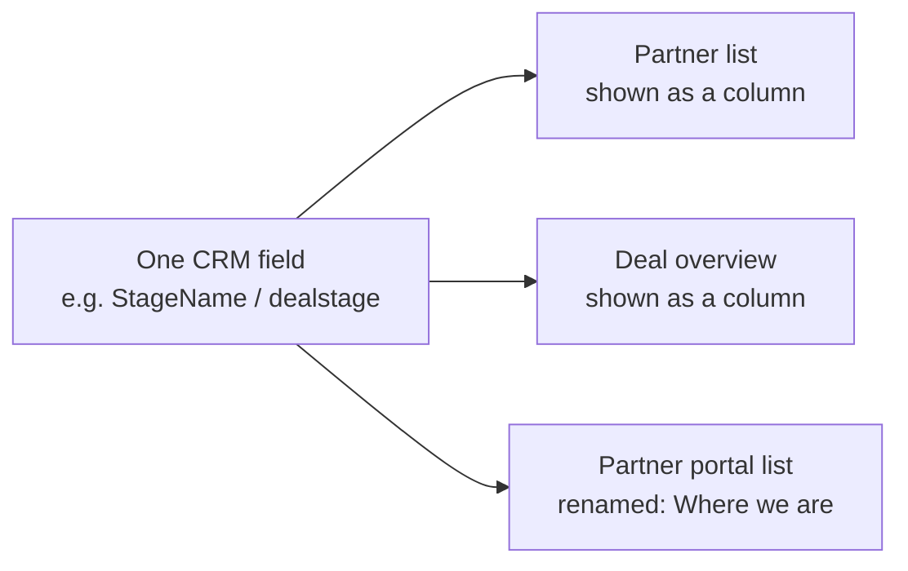

<Note>
  Renaming is **display-only relabeling, not data duplication.** You are not creating a new CRM field or copying values - Introw stores a label override for the view and keeps reading the live value from the CRM. Change your mind, change the label; the data is untouched.
</Note>

## Internal views - add any CRM field

Introw's internal tables let you add any synced CRM field as a column, alongside Introw's own properties.

<CardGroup>
  <Card title="The partner list" icon="users">
    In the partner list's **configure panel**, use **Add property** to add any built-in or CRM-backed field (account owner, region, health score, renewal date, a custom field), then save it into shared or private views. Full walkthrough: [Organize the partners list](/features/partners/partner-management/guides/organize-the-partners-list).
  </Card>

  <Card title="The contact (People) list" icon="address-book">
    On a partner's **People** tab, select **Configure → Add property** to add any synced Contact field (job title, seniority, country, a custom field).
  </Card>
</CardGroup>

### Object overview pages

Every mapped object has a team-side overview at **`/overview/{object}`** - [Deals](https://app.introw.io/overview/DEAL), Contacts, Companies, Tickets, or a custom object. These are full tables of the CRM object: use **Add property** to add any CRM field as a column, save more than one view, and set the filters your team needs.

## Manage CRM fields, don't just display them

Showing a field is half the job. Anywhere a CRM field appears in Introw's internal views, an **editable** field can be changed **inline** and the write goes straight to the CRM. Your team never has to leave the partner record to fix a region, move a lifecycle stage, or set a renewal date.

The columns you configure are the fields you manage, on both the list and the individual record:

| Where                                                                             | Which fields appear                                | What you can do                                          |
| --------------------------------------------------------------------------------- | -------------------------------------------------- | -------------------------------------------------------- |
| **Partner list**                                                                  | The `crm__` columns on the partner overview view   | Edit any editable field inline, in the cell              |
| **A partner's record** - the **Partner Info** card                                | The same partner-overview columns, stacked as rows | Edit inline on the record, without opening the list      |
| **People list** on a partner                                                      | The CRM columns on the people overview view        | Edit any editable Contact field inline                   |
| **A contact's record** - the&#x20;**&#x20;fields** section on the person's detail | The same people-overview columns                   | Edit inline, plus an **open in CRM** link to the contact |
| **Object overviews** (`/overview/{object}`)                                       | The columns you configure per object               | Edit inline on deals, tickets, companies, custom objects |

Because both record views read the *same* configuration as their list, you set the columns once and they follow you from the table into the record. A field flagged to hide on the card is left off the **Partner Info** card while staying in the table.

<Note>
  **What stays read-only.** Introw only offers an inline editor where the CRM itself allows a write:
  read-only properties, owner and other record-reference lookups, and picklists whose options have not
  synced are rendered as values, not inputs. You also need write access to Partners, and the record has
  to be CRM-backed - a partner or contact that exists only in Introw has nothing to write to.
</Note>

<Tip>
  This is the CRM-native bet in its smallest form. There is no Introw copy of the field to reconcile:
  the value you see is the CRM's, and the value you type becomes the CRM's. Your partner team gets a
  purpose-built surface, and your CRM admin keeps a single source of truth.
</Tip>

## Partner-facing views - add *and* rename

This is where the field controls matter most, because partners should never meet your internal property names. On a **pipeline view or CRM object list** inside a partner experience you can:

* **Choose which fields partners see and edit** - expose only the properties that make sense for partners.
* **Rename each to a partner-friendly label** - the configurator lets you edit the displayed label per field (the original is kept as a tooltip), so `dealstage` reads as "Stage" or "Where we are".
* **Do the same on partner profile fields** - choose which partner-object fields show on a partner's profile and override each label.

<Tip>
  Renaming for partners is the difference between a portal that feels built-for-them and one that leaks your internal jargon. "hs\_deal\_stage" becomes "Stage"; "Partner\_Tier\_\_c" becomes "Your level" - all without touching the CRM. Configure it on the pipeline/CRM list in a partner experience: [Shared pipelines](/features/co-selling/shared-pipelines).
</Tip>

## Custom partner objects work the same way

If you model partners on a **custom object** rather than the standard Account/Company, its fields sync too - so the same **Add property** flows surface your custom object's fields on every view above, and the partner-facing relabeling works identically. Object and field labels sync from the CRM, so Introw already speaks your terminology before you rename anything.

## Verify it worked

Open the partner list (or an object overview): the CRM columns you added appear with live values, and editing an editable one updates the record in your CRM. Open a single partner and the same fields appear on the **Partner Info** card, editable there too; open one of their people and the&#x20;**&#x20;fields** section shows the contact's columns with the same inline editing and a link through to the contact in your CRM. Change a value in Introw, refresh the record in HubSpot or Salesforce, and the new value is there. In a partner experience's pipeline/CRM list, the fields you exposed show to partners under the partner-friendly names you set, with everything else hidden.

## Related

<CardGroup>
  <Card title="Organize the partners list" icon="book-open" href="/features/partners/partner-management/guides/organize-the-partners-list">
    The full walkthrough for partner-list views, columns, filters, and phases.
  </Card>

  <Card title="Shared pipelines" icon="book-open" href="/features/co-selling/shared-pipelines">
    Configure the partner-facing pipeline/CRM list: visible, editable, and renamed fields.
  </Card>

  <Card title="Sync partners & contacts" icon="book-open" href="./sync-partners-and-contacts">
    Get partners and their contacts (and all their fields) into Introw first.
  </Card>

  <Card title="Attribution in HubSpot / Salesforce" icon="diagram-project" href="./attribution-in-hubspot">
    Link those partners' deals and opportunities back to them.
  </Card>
</CardGroup>

---

# Show course progress in HubSpot with app objects
Source: https://docs.introw.io/features/integrations/crm/guides/show-course-progress-in-hubspot

Surface Introw partner course enrollments and certificates in HubSpot as app objects, so certification status is live on your company and contact records.

Your team lives in HubSpot, so a partner's training progress should be visible there too. Introw ships two **app objects** for this: **Introw Course Enrollments** and **Introw Certificates**. App objects are HubSpot's term for real CRM objects a connected app defines, so these are not read-only widgets. Each enrollment and each certificate is an actual HubSpot record with its own record page and properties, associated to the partner's contact and company. Everyone can see who is certified and who is trained on your product, inside the CRM, without opening Introw. This guide surfaces them on the record layouts you care about.

## What you'll achieve

Introw **Course Enrollments** and **Certificates** on the HubSpot records you choose (companies, contacts, deals, or custom objects), kept current from Introw, so training and certification status is visible right where your team works.

## What each app object carries

| App object                   | Properties you get                                                                                                                                               | Kept current by                            |
| ---------------------------- | ---------------------------------------------------------------------------------------------------------------------------------------------------------------- | ------------------------------------------ |
| **Introw Course Enrollment** | Course name, status (not started, in progress, completed), progress percentage, completed and total modules, and the enrolled, started, completed, and due dates | Introw, on a rolling sync every 15 minutes |
| **Introw Certificate**       | Certificate name, status (active or expired), issue and expiry dates, validity period, badge image, and a link to the certificate itself                         | Introw, on a rolling sync every 15 minutes |

Because they are real objects, HubSpot treats them like any other: filter on them, build list views and reports on certification coverage, and enroll workflows on them. Introw owns the records, so nobody creates or edits them by hand in HubSpot; status, progress, and expiry are calculated and stay accurate on their own.

## Before you start

<Steps>
  <Step title="Install or reconnect the Introw app in HubSpot">
    The Introw app must be installed in HubSpot. Installations created before January 1, 2026 must be reconnected once, so HubSpot grants the extra scopes these cards need. New installations already include them. See [Connect HubSpot](./connect-hubspot).
  </Step>

  <Step title="Have HubSpot permission to customize records">
    Adding or replacing cards on a record layout requires permission to edit HubSpot record views.
  </Step>

  <Step title="Enroll partners and issue certificates in Introw">
    The cards show real data once partners are enrolled and certificates issued. See [Manually enroll partners](/features/courses/enrollments/guides/manually-enroll-partners) and [Create a certificate](/features/courses/certificates/guides/create-a-certificate).
  </Step>
</Steps>

## Steps

<Steps>
  <Step title="Confirm the Introw connection in Introw">
    Go to [Integrations](https://app.introw.io/settings/integrations?category=crm) and confirm HubSpot is connected. If your app was installed before January 1, 2026, reconnect it here so the course and certificate cards have the scopes they need. This is the only step inside Introw; the rest happens in HubSpot.
  </Step>

  <Step title="Open record customization in HubSpot">
    In HubSpot, go to **Settings**, open **Objects**, and select the object you want to show progress on (for example **Companies**). Open **Record customization** and select the view you want to edit.
  </Step>

  <Step title="Add the Introw course cards">
    In the layout editor, select **Add card**, choose the **Introw Course Enrollments** and/or **Introw Certificates** cards, place them in the middle panel or right sidebar, and save. Repeat for each object and view where you want the cards, such as companies, contacts, and deals.
  </Step>

  <Step title="Use them beyond the record page">
    Because these are app objects rather than a display widget, the data is also available everywhere HubSpot uses objects. Build a list view of contacts holding an expired certificate, report on certification coverage per partner account, or enroll a workflow when an enrollment reaches completed.
  </Step>
</Steps>

## Verify it worked

Open a HubSpot record for a partner who has enrollments or certificates in Introw. The **Introw Course Enrollments** card lists their courses and completion status, and the **Introw Certificates** card shows earned certificates, both matching what you see in Introw. At the company level you see aggregate learning activity; at the contact level you see per-person detail. Open one of the records itself and you get a full HubSpot record page with every property on it.

Newly issued certificates and fresh course progress take up to 15 minutes to appear, since both objects are synced on a rolling schedule rather than per event.

## Related

<CardGroup>
  <Card title="Show course progress in Salesforce" icon="book-open" href="./show-course-progress-in-salesforce">
    The same visibility on Salesforce Account and Contact records.
  </Card>

  <Card title="Manually enroll partners" icon="graduation-cap" href="/features/courses/enrollments/guides/manually-enroll-partners">
    Get partners into courses so the cards have data.
  </Card>

  <Card title="Connect HubSpot" icon="plug" href="./connect-hubspot">
    Install or reconnect the Introw app.
  </Card>

  <Card title="Set up Introw inside HubSpot" icon="id-card" href="./set-up-the-hubspot-partner-connect-card">
    The app cards that put partner collaboration on the record.
  </Card>

  <Card title="Report engagement with app events" icon="chart-line" href="./report-on-partner-engagement-in-hubspot">
    Partner activity on the HubSpot timeline, counted in your reports.
  </Card>
</CardGroup>

---

# Show course progress in Salesforce
Source: https://docs.introw.io/features/integrations/crm/guides/show-course-progress-in-salesforce

Surface Introw partner course enrollments and certificates on Salesforce Account and Contact records by adding Introw's related lists to your page layouts.

Introw syncs partner course enrollments and certificates into Salesforce, so your team can track a partner's learning progress and earned certificates without leaving the CRM. This guide adds Introw's related lists to your Account and Contact page layouts so that synced data appears on the records your team already uses. The sync is automatic; you add the related lists once per layout.

## What you'll achieve

Introw course enrollment and certificate related lists showing on your Salesforce **Account** and **Contact** page layouts, kept current from Introw, so training and certification status is visible on the records your team works in.

## Before you start

<Steps>
  <Step title="Connect or reconnect the Introw app to Salesforce">
    Introw must be connected to Salesforce. Connections created before January 1, 2026 must be reconnected once so Introw can sync the course enrollment and certificate objects into your org. New connections already include the required permissions. See [Connect Salesforce](./connect-salesforce).
  </Step>

  <Step title="Have Salesforce admin permission to edit page layouts">
    Adding related lists to Account and Contact layouts requires Salesforce admin access.
  </Step>

  <Step title="Enroll partners and issue certificates in Introw">
    The related lists show real data once partners are enrolled and certificates issued. See [Manually enroll partners](/features/courses/enrollments/guides/manually-enroll-partners) and [Create a certificate](/features/courses/certificates/guides/create-a-certificate).
  </Step>
</Steps>

## Steps

<Steps>
  <Step title="Confirm the Salesforce connection in Introw">
    Go to [Integrations](https://app.introw.io/settings/integrations?category=crm) and confirm Salesforce is connected. If your connection predates January 1, 2026, reconnect it here so the course and certificate objects sync into Salesforce. This is the only step inside Introw; the rest happens in Salesforce Setup.
  </Step>

  <Step title="Add the related lists to the Account layout">
    In Salesforce, go to **Setup**, open **Object Manager**, select **Account**, open **Page Layouts**, and edit the layout your team uses. Drag Introw's course enrollment and certificate related lists onto the layout, then save. This shows partner learning at the account level.
  </Step>

  <Step title="Add the related lists to the Contact layout">
    Repeat on the **Contact** object: open **Object Manager**, select **Contact**, open **Page Layouts**, add Introw's course enrollment and certificate related lists, and save. This shows per-person progress for each partner contact.
  </Step>
</Steps>

## Verify it worked

Open a Salesforce Account for a partner with training activity in Introw: the Introw related lists show their course enrollments and certificates, matching Introw. Open a Contact for one of that partner's people and confirm their individual enrollments and certificates appear too.

## Related

<CardGroup>
  <Card title="Show course progress in HubSpot" icon="book-open" href="./show-course-progress-in-hubspot">
    The same visibility on HubSpot records.
  </Card>

  <Card title="Embed Introw in Salesforce" icon="plug" href="./embed-introw-in-salesforce">
    Bring the full Introw experience into Salesforce.
  </Card>

  <Card title="Connect Salesforce" icon="plug" href="./connect-salesforce">
    Connect or reconnect the Introw app.
  </Card>
</CardGroup>

---

# Sync partners & contacts from your CRM
Source: https://docs.introw.io/features/integrations/crm/guides/sync-partners-and-contacts

Pull partner accounts and contacts live from your CRM into Introw, drive portal access from a CRM field, and build dynamic segments on that data.

Your partner accounts and the people inside them already live in your CRM. This guide makes Introw mirror them live - every partner account and its contacts are pulled in and kept current - so onboarding, access management, and segmentation run off CRM data instead of a separate spreadsheet you have to reconcile. The result: add a contact in the CRM and they show up in Introw; flip a field and their portal access changes; and you can target groups dynamically using the same account and contact fields your sales team already maintains.

## What you'll achieve

All partner accounts and their contacts synced from the CRM and kept up to date automatically, portal access granted and revoked by a CRM field, and dynamic segments built on live account and contact properties - with no manual partner or contact list to maintain.

## Before you start

<Steps>
  <Step title="Connect your CRM">
    A CRM must be connected and syncing. See [Connect HubSpot](./connect-hubspot) or [Connect Salesforce](./connect-salesforce).
  </Step>

  <Step title="Decide how partners are identified">
    Know which CRM object represents partners (Company/Account or a custom object) and the property or list that marks a record as a partner.
  </Step>

  <Step title="Create the access and role properties (optional)">
    If you want the CRM to drive access, create a writable **portal access** property on the contact (a checkbox or a Yes/No dropdown) and, optionally, a **contact role** property (dropdown or text).
  </Step>
</Steps>

## How the live sync works

When your CRM is connected, Introw pulls partner records and their associated contacts continuously - on a schedule and through webhooks - so the two stay in step:

* **Partner accounts** that match your filter import as partners. Turn on **automatically sync new partners** and any future CRM record that matches becomes a partner without a re-import.
* **Owners** on the partner account become the partner's manager in Introw, added to the partner's team, so ownership carries over without reassigning anyone by hand. An owner who is not yet on your team is suggested as a team member you accept with one click, shown as **Requested** under **Settings, Team**. None of this needs SSO.
* **Contacts** associated with each partner account are pulled in with it and kept current. New contacts in the CRM appear under the partner; changes flow through on the next sync.
* **Fields** on both accounts and contacts sync too, which is what powers access management and segments below.

This is a live mirror, not a one-time import - so the partner and contact lists in Introw are always a reflection of the CRM, with nothing to maintain by hand.

## Steps

### Import partners with their contacts

<Steps>
  <Step title="Open the partner storage and filter steps">
    In [Integrations → CRM & Data](https://app.introw.io/settings/integrations?category=crm), open the connected CRM with **Configure** and confirm the partner object on **How do you store partners in your CRM?**.
  </Step>

  <Step title="Filter which records are partners">
    On **Find partners in your CRM**, narrow the partner object by a CRM property so only real partners import. The count updates as you filter.
  </Step>

  <Step title="Turn on automatic sync and import">
    With all matching records selected, enable **Automatically sync new partners**, then **Continue with \[N] partner(s)**. Introw imports the partners, sets each partner's manager from its CRM account owner, and pulls their contacts in with them.
  </Step>
</Steps>

### Drive portal access from a CRM field

<Steps>
  <Step title="Open a partner's People">
    Go to [Partners](https://app.introw.io/partners), open a partner, and open the **People** tab.
  </Step>

  <Step title="Open the contact field sync">
    Select **Configure**, then on the **Portal access** (or **Contact role**) row select **Sync** (the CRM logo button) to open **Sync contact fields with \[your CRM]**.
  </Step>

  <Step title="Map the access property">
    Set **Access property** to the CRM contact property that controls access. A positive value (checked / Yes) keeps the contact's access active; a negative value revokes it - so access is governed entirely from the CRM.
  </Step>

  <Step title="Map the role property (optional)">
    Set **Role property** to a CRM contact field used to group contacts (for example by job or function). This feeds segments and reports. Leave it unset if you only want to drive access.
  </Step>

  <Step title="Save">
    Select **Save**. From now on the CRM field decides who can log in. For the full reference, see [Drive contact portal access and roles from your CRM](./map-contact-portal-access).
  </Step>
</Steps>

### Build dynamic segments on account and contact fields

Because account *and* contact fields sync live, you can group partners and people by CRM data and let the group update itself as the CRM changes.

<Steps>
  <Step title="Create a dynamic segment">
    Go to [Segments](https://app.introw.io/settings/segments) and create a segment with rules on synced fields - account fields (tier, region, partner type, lifecycle stage) and contact fields (role, seniority, country).
  </Step>

  <Step title="Use it everywhere">
    Target the segment for onboarding journeys, content sharing, notifications, course enrollment, and commission assignment. As CRM data changes, membership updates automatically. See [Segments](/features/partners/segments).
  </Step>
</Steps>

### Show more CRM fields on your tables

Segments aren't the only place synced fields appear. Any partner or contact CRM field - standard or custom, from the Account/Company, the contacts, or a custom partner object - can be added as a column on the partner and contact tables (and object overviews), and renamed to a friendly label. So the tables your team works in show exactly the fields you care about, not just tier and segment. See [Show and rename CRM fields](./show-and-rename-crm-fields).

## Verify it worked

A filtered set of CRM companies appears as partners with their contacts populated under **People**. Add a contact in the CRM and it appears under the partner after the next sync. Set the access property to its positive value and the contact gains portal access; set it to negative and access is revoked. A dynamic segment built on a CRM field lists the expected partners or contacts and updates when the field changes.

## Related

<CardGroup>
  <Card title="Drive contact portal access from your CRM" icon="book-open" href="./map-contact-portal-access">
    The full reference for access and role mapping.
  </Card>

  <Card title="Show & rename CRM fields" icon="table-columns" href="./show-and-rename-crm-fields">
    Put any CRM field on your partner and contact tables - renamed to partner-friendly labels.
  </Card>

  <Card title="Attribute deals to partners" icon="diagram-project" href="./attribution-in-hubspot">
    Link those partners' deals back to them (HubSpot; see also Salesforce).
  </Card>

  <Card title="Create a dynamic segment" icon="book-open" href="/features/partners/segments/guides/create-a-dynamic-segment">
    Build segments on synced CRM fields.
  </Card>

  <Card title="Provision people and access" icon="user-plus" href="/features/access/provisioning">
    How owners, contacts, and your team get into Introw, and how access is governed.
  </Card>

  <Card title="Implementation reference" icon="screwdriver-wrench" href="../technical">
    Full configuration options.
  </Card>
</CardGroup>

---

# Trigger HubSpot workflows from partner engagement
Source: https://docs.introw.io/features/integrations/crm/guides/trigger-hubspot-workflows-from-partner-engagement

Enroll a HubSpot workflow the moment a partner submits a form, visits the portal, comments, or updates a shared record, using the app events Introw writes to the contact and company timeline.

Yes, a HubSpot workflow can run off a partner action, and it does not have to wait for a CRM record to appear first.
Introw writes partner activity to HubSpot as **app events** - HubSpot's term for timeline events a connected app publishes - and HubSpot can enroll a record on one.
So a deal registration routes itself to the right AE the second a partner files it, a quiet partner triggers a check-in task, and a comment on a shared deal pings the owner.

The events fire automatically whenever HubSpot is connected with current scopes.
There is no toggle in Introw to switch them on.

## What you'll achieve

A live HubSpot workflow that enrolls on a real partner action - a form submitted, a portal visit, a comment, a shared record updated - runs the follow-up your team would otherwise do by hand, and can write the result back into Introw.

## The app events you can trigger on

Six events, each written twice: once against the partner's **contact** and once against their **company**, so you can work at either grain.

| App event           | Fires when                                                            | What the event carries                             |
| ------------------- | --------------------------------------------------------------------- | -------------------------------------------------- |
| **Portal visit**    | A partner opens your portal                                           | Who visited, a link to the partner in Introw       |
| **Comment**         | A partner comments on a shared record, task, or thread                | Who commented, the comment, which kind of record   |
| **Asset viewed**    | A partner opens or downloads a piece of content                       | Who viewed it, the asset name, a link to the asset |
| **Object update**   | A partner changes a field on a shared record                          | Who changed it, which kind of record               |
| **Form submitted**  | A form is submitted: deal registration, lead, MDF request, onboarding | Who submitted, the form name, a link to it         |
| **Deal closed won** | A partner marks a shared deal won from the portal                     | Who changed it, which kind of record               |

Those carried values are the event's properties, and they are what HubSpot lets you filter and group on.
Each card also shows a detail block - every submitted field on **Form submitted**, the before and after values on **Object update** and **Deal closed won**.
Read that on the timeline, but treat it as display data: HubSpot does not expose it to filters, lists, or reports.

Five of the six are partner-initiated by design.
Your own team working a record in HubSpot writes no event, because that activity is already in HubSpot.
**Form submitted** is the exception: it fires for any submission, including one your team files on a partner's behalf, and lands on the submitter's contact plus the partner's company.

Repeat activity is grouped rather than counted per click: one portal visit per partner contact per portal in a four-hour window, one event for a view and a download of the same asset inside 30 minutes, one event for several field changes on the same record inside 30 minutes.
Previewing a portal as a partner writes nothing at all, so your own testing stays out of both the timeline and the numbers.

## Before you start

<Steps>
  <Step title="Connect HubSpot with current scopes">
    Go to [Integrations](https://app.introw.io/settings/integrations?category=crm) and confirm HubSpot shows as **Connected**.
    If the tile shows **Update available**, or the header shows **Install update**, run it and re-authorize so the app holds the scopes it needs to write timeline events.
    See [Connect HubSpot as your source of truth](/features/integrations/crm/guides/connect-hubspot).
  </Step>

  <Step title="Check your HubSpot subscription">
    Event enrollment triggers and the custom report builder both need a **Professional** or **Enterprise** subscription, on any hub.
    Below those tiers the events still land on the timeline for people to read; they just cannot drive a workflow or a custom report.
  </Step>

  <Step title="Expect nothing to switch on in Introw">
    App events are governed by the HubSpot app being installed, not by an Introw setting.
    There is no toggle and nothing to configure per event: let a partner act once, and the first events appear.
  </Step>
</Steps>

## Steps

<Steps>
  <Step title="Pick the object the workflow runs on">
    Introw writes each event to both the partner's contact and their company, so build a **contact-based** or **company-based** workflow.
    Choose by what the follow-up needs.
    A contact workflow gives you the person who acted, which is what you want for routing a submission or emailing the partner rep.
    A company workflow gives you the partner account, which is what you want for account-level scoring, lifecycle, or alerting the account owner.
    A deal-based or ticket-based workflow has nothing to enroll on here, because Introw does not write these events to deals or tickets.
  </Step>

  <Step title="Add the event as the enrollment trigger">
    In the workflow's enrollment triggers, choose **When an event occurs**, open the **Integrations** category, and select **Integration event occurs**.
    The Introw events are listed there once the app is installed; pick the one you want, for example **Form submitted**.
    HubSpot enrolls the record each time that event arrives, so the workflow runs per action rather than per property state.
  </Step>

  <Step title="Narrow the trigger to the activity you care about">
    An unfiltered **Form submitted** trigger enrolls on every form: registrations, MDF requests, onboarding questionnaires.
    Select **+ Add criteria to further define your trigger** and filter on the event's own properties - most often the form name, so only deal registrations enroll.
    Do the same for the other events: a specific asset on **Asset viewed**, the kind of record on **Object update**.

    Add the enrollment filters you would use anywhere else (partner tier on the company, owner, country) in the same trigger group.
    HubSpot evaluates those filters at the exact moment the event arrives, so a property set a second later is invisible to them.
  </Step>

  <Step title="Add the actions the activity should set off">
    Build the branch you would build for any other trigger: notify the partner manager, create a task for the AE who owns the account, rotate the record to an owner, set a property, start a sequence, or wait and check whether anyone responded.
    For a deal registration, the useful shape is usually: enroll on **Form submitted**, filter to the registration form, then alert the partner manager and the AE who owns the account.
  </Step>

  <Step title="Act back in Introw from the same workflow">
    The workflow can finish the round trip inside Introw.
    Introw ships custom workflow actions - create or update a partner, enroll a partner in a journey, issue a certificate - so a workflow triggered by partner activity writes the consequence straight back into the partner's world.
    See [Use Introw workflow actions in HubSpot](./use-introw-workflow-actions-in-hubspot).
  </Step>

  <Step title="Turn it on and test with a real action">
    Activate the workflow, then have a partner (or your own test contact) take the action from the portal.
    An event trigger only fires when the event actually arrives, so generate one by taking the action; editing a property will not enroll the record.
    Open the workflow's **History** and confirm the record enrolled and the actions ran.
  </Step>
</Steps>

## Which trigger should you use

A partner action often writes a CRM record too, and that record is a trigger in its own right.
The two are not interchangeable.

| You want to act on                                                   | Use                                                                        |
| -------------------------------------------------------------------- | -------------------------------------------------------------------------- |
| The submission itself, the moment it lands                           | The Introw **Form submitted** app event                                    |
| The deal or lead the submission created                              | HubSpot's own **Object created** or property-change trigger on that record |
| A submission only once your team has accepted it                     | The record the acceptance writes, not the event                            |
| Activity that writes no record at all: visits, asset views, comments | App events - nothing else in HubSpot can see that activity                 |

Timing decides most of these.
On a form that accepts submissions automatically, Introw writes the CRM records first and the app event after, so a workflow enrolling on the event can already read the deal it created.
On a form with an approval gate, the event fires when the partner submits, before any record exists - the acceptance is what writes the record later.

## What you cannot automate this way

* **Branching on an individual answer.** The submitted fields are display data on the card, not filterable properties. To branch on what a partner answered, map that field to a CRM property in the form's [CRM automation](/features/forms/crm-automations/guides/connect-a-form-to-your-crm) and trigger on the record instead.
* **Enrolling a deal or a ticket.** The events are written to the contact and the company only.
* **Firing on approval.** **Form submitted** fires at submission, whether the form auto-accepts or waits for an approver.
* **Catching every click.** Repeat activity is grouped, so a workflow enrolling on **Portal visit** fires once per partner contact per four-hour window, not on every page they open.
* **Running in Salesforce.** App events are a HubSpot surface. Salesforce automation runs the other way around, from [Introw's own workflows](/features/automation/workflows) writing into the CRM.

## Verify it worked

Have a partner submit a form from their portal.
Within seconds the linked HubSpot contact and company show a **Form submitted** card, and the workflow you built lists that record in its **History** with every action marked as run.

## Related

<CardGroup>
  <Card title="Report on partner engagement in HubSpot" icon="chart-line" href="./report-on-partner-engagement-in-hubspot">
    The same events, counted: reports, lists, and lead scoring.
  </Card>

  <Card title="Use Introw workflow actions in HubSpot" icon="gear" href="./use-introw-workflow-actions-in-hubspot">
    The other half of the round trip: HubSpot workflows acting back into Introw.
  </Card>

  <Card title="Connect a form to your CRM" icon="arrows-rotate" href="/features/forms/crm-automations/guides/connect-a-form-to-your-crm">
    What a submission writes into HubSpot, and the records you can trigger on.
  </Card>

  <Card title="Introw workflows" icon="diagram-project" href="/features/automation/workflows">
    Automation that runs inside Introw, on the same partner activity.
  </Card>

  <Card title="Set up Introw inside HubSpot" icon="id-card" href="./set-up-the-hubspot-partner-connect-card">
    The app cards that put partner collaboration on the record itself.
  </Card>

  <Card title="Implementation reference" icon="screwdriver-wrench" href="../technical">
    Full configuration options.
  </Card>
</CardGroup>

---

# Troubleshoot a CRM connection
Source: https://docs.introw.io/features/integrations/crm/guides/troubleshoot-a-crm-connection

Diagnose and fix a CRM sync that shows a needs-attention status, from expired authorization to missing scopes and over-tight filters.

When a CRM connection shows a needs-attention status, records can stop flowing or attribution can break, which quietly affects partner reporting and commissions. Most issues come down to one of three things: authorization that expired, a new permission scope HubSpot or Salesforce now requires, or a sync filter that excludes the records you expect. This guide walks the checks in order so you can restore a healthy sync fast.

## What you'll achieve

A healthy, syncing CRM connection: the status returns to connected, the records you expect appear as partners again, and attribution resumes flowing to the CRM.

## Before you start

<Steps>
  <Step title="Read the connection status">
    On the Integrations page, note the tile's status pill: **Connected**, **Update available**, **Needs attention**, **Rate limited**, **Interrupted**, or **Not connected**. The pill points you at the likely cause.
  </Step>

  <Step title="Confirm your permission">
    You need permission to manage integrations in Introw to re-authorize or change sync settings.
  </Step>
</Steps>

## Watch it

<Tabs>
  <Tab title="Video">
    <video />
  </Tab>

  <Tab title="Click through">
    <iframe />
  </Tab>
</Tabs>

## Steps

<Steps>
  <Step title="Open the connection detail">
    Go to [Integrations](https://app.introw.io/settings/integrations?category=crm), then open the CRM via **Configure** to see the detail header. The header answers three questions in one line: a **status pill**, the **CRM user** the connection authenticates as, and the one action worth taking right now.

    The status pill reads **Connected**, **Syncing** (a sync is running, which is normal and not a problem), **Rate limited**, **Interrupted** (authorization broke), or **Disconnected**.

    <Frame>
      
    </Frame>
  </Step>

  <Step title="Check which CRM user the connection runs as">
    Next to the status pill, the header names the CRM user behind the OAuth grant, which is the identity every Introw call to your CRM runs under. Hover it for the **User ID**, the **Portal** (HubSpot) or **Instance** (Salesforce) it points at, and the date it was connected.

    Check this first whenever an object or field syncs for some records and not others, or a write-back silently does nothing: the usual cause is that the connection runs as a user who lacks access to that object, field, or record. It is also how you confirm a connection is on your dedicated integration user rather than whichever admin happened to click connect.

    <Info>
      This is the CRM user, not the Introw user who set the integration up. If the chip reads **CRM user** followed by an id and shows no avatar, the CRM did not return a name for that user; the id in the tooltip is still enough to look them up in your CRM.
    </Info>

    <Frame>
      
    </Frame>
  </Step>

  <Step title="Reconnect or install updates">
    The header carries a single call to action, and everything else lives behind the three-dots **More integration actions** menu beside it.

    * When the connection is **Interrupted** or **Rate limited**, the call to action is **Reconnect**. Select it and complete the OAuth flow again, accepting every requested scope.
    * Otherwise the call to action is your CRM's install prompt: **Install update** for HubSpot when it needs re-authorizing for new scopes such as quotes or certificates, **Install package** or **Install update** for Salesforce when it needs the latest managed package.
    * **Reconnect** is always available in the three-dots menu, even on a healthy connection. Use it to move the connection to a different CRM user, or to re-run consent after changing that user's permissions, without waiting for something to break first.

    Missing scopes are the most common reason a specific object stops syncing.
  </Step>

  <Step title="Fix a Salesforce authorization that never returns to Introw">
    If Salesforce sign-in ends on a Salesforce error page reading "We can't authorize you because of an OAuth error." and you land back nowhere, the org has not allowed the **Introw connected app**. Salesforce blocks authorization of connected apps that are not installed in the org, exempting only users with **Approve Uninstalled Connected Apps** (system administrators have it; a dedicated integration user does not), so this typically appears the moment you switch from an admin to the integration user. The URL carries `error=invalid_client` and `error_description=app+must+be+installed+into+org`. Fix it in Salesforce under **Setup > Connected Apps OAuth Usage** by selecting **Install** on the **Introw** row, or by granting that one user the permission. This is separate from the managed package: installing the package does not allow the connected app. Full walkthrough: [Allow the Introw connected app](./salesforce-permissions-and-scopes#allow-the-introw-connected-app).
  </Step>

  <Step title="Check the partner object and filters">
    If authorization is healthy but specific records are missing, the sync scope is usually the cause. Open the connection's setup and confirm the **partner object** is the one those records live on, and that your **filters** actually include them - a too-narrow property filter or a hand-picked selection silently leaves matching records out. Widen the filter or select the missing records.

    <Frame>
      
    </Frame>
  </Step>

  <Step title="Fix a single failing mapping">
    A **Needs attention** pill no longer means the whole sync is down. When one field or association stops working, Introw isolates it, keeps syncing everything else, and flags just that mapping. Open the connection, go to **Object Linking**, and find the mapping with a red warning pill. Select it to see what broke, usually a property or association that no longer exists in your CRM, or a missing permission. Fix the mapping (repick the property or association, or restore the permission) and Introw clears the flag on the next sync. Transient errors like rate limits or timeouts never mark a mapping failed; they retry on their own.
  </Step>

  <Step title="Wait out a rate limit">
    A **Rate limited** pill means the CRM temporarily throttled the sync. It clears itself, so waiting is the fix: watch the status return to **Connected**. The header promotes **Reconnect** while the pill is up so you can act if it turns out to be authorization rather than throttling, but reconnecting does not lift a rate limit. If it persists, contact support.
  </Step>

  <Step title="Rule out a permission gap rather than a break">
    A healthy connection can still do less than it says. Introw runs as a CRM identity, so an object the connecting user can only partly see, or a field they cannot write, produces a short partner count or a record saved without its values while every status stays green.

    On **Object linking**, the panel names the connection and marks each linked object with a verdict: **Read-only**, **Partly visible**, **Fields read-only**, **Cannot read back**, and the rest. A form's **Automation** tab does the same for writes. Read [Every CRM error Introw logs](./every-crm-error-introw-logs) for what each verdict means and where a refused record is reported.
  </Step>

  <Step title="Confirm health">
    Watch the status pill return to **Connected** and confirm the previously missing records now appear as partners.
  </Step>
</Steps>

## Verify it worked

The integration shows a healthy **Connected** status, the records you expected appear as partners, and attribution resumes syncing to the CRM.

## Related

<CardGroup>
  <Card title="Connect HubSpot as your source of truth" icon="book-open" href="./connect-hubspot">
    Review the connect flow, scopes, and attribution setup.
  </Card>

  <Card title="Connect Salesforce as your source of truth" icon="book-open" href="./connect-salesforce">
    The connect flow, the environment choice, and the managed package.
  </Card>

  <Card title="Disconnect a CRM" icon="book-open" href="./disconnect-a-crm">
    Reset a connection that cannot be recovered.
  </Card>

  <Card title="Every CRM error Introw logs" icon="triangle-exclamation" href="./every-crm-error-introw-logs">
    The other three layers: a mapping, a permission gap, a refused record.
  </Card>

  <Card title="Implementation reference" icon="screwdriver-wrench" href="../technical">
    Full configuration options.
  </Card>
</CardGroup>

---

# Use Introw workflow actions in HubSpot
Source: https://docs.introw.io/features/integrations/crm/guides/use-introw-workflow-actions-in-hubspot

Drop Introw actions into HubSpot workflows to create or update partners, enroll them in a journey, or issue a certificate automatically.

Introw ships custom actions that a HubSpot admin can drop into any HubSpot workflow, so partner steps run automatically off the triggers you already use. When a company reaches a stage or a property changes, a workflow can create the partner in Introw, update their tier, enroll them in a journey, or issue a certificate, with no manual handoff. This guide shows how to add and configure an Introw action and covers the full action catalog so you pick the right one.

## What you'll achieve

A HubSpot workflow that calls an Introw action as part of its automation, so partner onboarding and lifecycle steps happen automatically from CRM triggers instead of someone doing them by hand in Introw.

## Before you start

<Steps>
  <Step title="Connect HubSpot with current scopes">
    HubSpot must be connected and the app authorized with current scopes. See [Set up Introw inside HubSpot](./set-up-the-hubspot-partner-connect-card). If actions are missing in HubSpot, re-authorize via **Install update**.
  </Step>

  <Step title="Know your trigger">
    Decide which HubSpot workflow (and enrollment trigger) should run the partner step, for example a company reaching a partner stage.
  </Step>
</Steps>

## Steps

<Steps>
  <Step title="Open or create the workflow">
    In HubSpot, open the workflow where you want partner automation, or create one with the enrollment trigger that should fire the step (most partner actions enroll on the company).
  </Step>

  <Step title="Add an Introw action">
    Add an action step and choose the Introw integration action. The actions available in a HubSpot workflow are:

    * **Create partner** - creates an Introw partner from the enrolled company. Use this to onboard a partner the moment a company qualifies. You can set the partner's experience, partner manager, and portal access as part of the action.
    * **Update partner** - updates an existing partner's experience, tier, phase, or manager. Use this to keep partner standing in step with CRM changes.
    * **Enroll partner in journey** - starts an Introw journey (onboarding or enablement checklist) for the partner, so the right tasks kick off automatically.
    * **Issue certificate** - issues a certificate to a contact or company, with an option to notify the recipient. Use this to recognize completion as part of a flow.
  </Step>

  <Step title="Configure the action's inputs">
    Set the action's inputs for your case (for example the experience and partner manager on **Create partner**, or whether **Issue certificate** notifies the recipient). Map the inputs from the enrolled record's properties where the action allows it, so each record runs with the right values.
  </Step>

  <Step title="Turn the workflow on and test">
    Activate the workflow and let a record enroll, or test with a sample record, to confirm the Introw action runs and the result appears in Introw.
  </Step>
</Steps>

<Note>
  Introw also exposes a broader set of tools to HubSpot's AI agent (Breeze), including adding comments and tasks, updating CRM objects, submitting partner forms, and searching partners, commissions, tasks, form submissions, marketing funds, goals, and tier information. Those run inside the AI agent rather than as workflow steps; the four actions above are the ones you drop into a classic HubSpot workflow.
</Note>

## Verify it worked

Let an enrolled record run the workflow and confirm the Introw result: the partner is created or updated, the journey starts, or the certificate is issued, exactly as the action specifies.

## Related

<CardGroup>
  <Card title="Trigger HubSpot workflows from partner engagement" icon="bolt" href="./trigger-hubspot-workflows-from-partner-engagement">
    The other half of the round trip: partner activity enrolling a HubSpot workflow.
  </Card>

  <Card title="Set up Introw inside HubSpot" icon="book-open" href="./set-up-the-hubspot-partner-connect-card">
    Authorize the app and add the cards.
  </Card>

  <Card title="Implementation reference" icon="screwdriver-wrench" href="../technical">
    Full configuration options.
  </Card>
</CardGroup>

---

# CRM
Source: https://docs.introw.io/features/integrations/crm/index

Run your partner program on HubSpot or Salesforce with two-way sync of partners, contacts, deals, and attribution - no RevOps changes.

> Your CRM is the source of truth, and Introw runs on top of it - not beside it. You don't restructure RevOps to adopt Introw. It plugs into how you already store partners and attribute revenue, works with any object including custom ones, and keeps partners, contacts, deals, and attribution flowing both ways.

## The problem it solves

<Pains>
  | Without Introw                        | With Introw                      |
  | ------------------------------------- | -------------------------------- |
  | You would have to redo RevOps         | It reads your existing model     |
  | Your partners live on a custom object | Any object works, either side    |
  | Managing portal access is a chore     | A CRM field grants and revokes   |
  | Partner data drifts between tools     | One connection, synced both ways |
</Pains>

## Impact

Every partner has worked with a vendor whose portal contradicted the vendor's own CRM. Running the program on the CRM itself means there is only one version of the deal to disagree about.

<Impact>
  for your business

  * **In your CRM**
    HubSpot and Salesforce stay the system of record, and Introw writes tiers, managers and access back
  * **Live in days**
    Connect once and the program populates from records you already have: no middleware, nothing to migrate
  * **Cost to run**
    RevOps configures attribution, objects and mappings in the UI, with no engineering and no object of ours

  for your partners

  * **Self-serve**
    Their people appear and their access follows a CRM field, so nobody waits on an account being made
  * **Enabled**
    Their reps see the partner story on the record, with course and certificate status right there
  * **Efficient**
    A rep shares, comments and registers from the Introw card, without opening a second tool

  [A day in the life of a co-sell partner](/days-in-the-life/co-sell-partner)
</Impact>

<Personas>
  * **RevOps** - your model, not a re-platform
  * **Partner Operations** - attribution configured once
  * **Your own reps** - the partner on the record
  * **Partners** - no CRM seat, full context
</Personas>

## See it work

<Tour>
  * 

    **Authorize once**

    Accept the scopes and the connection is live.

  * 

    **Say where partners live**

    Company, account, or a custom partner object of your own.

  * 

    **Find them**

    Filters decide which records become partners.

  * 

    **Keep it current**

    New matching records become partners on their own.
</Tour>

## How it works

Most PRMs make you rebuild your partner data in a second system and reconcile it forever. Introw does the opposite: it reads your CRM as it is today, mirrors it live, and writes the partner context back. There is no migration and no parallel database.

It helps to see the CRM integration as **one connection with four jobs**, not three separate products:

<CardGroup>
  <Card title="1. Connect & sync" icon="arrows-rotate" href="./technical">
    Authorize HubSpot or Salesforce once. Records flow in on a schedule and through webhooks; key Introw data flows back. Nothing to migrate.
  </Card>

  <Card title="2. Pull partners & contacts" icon="users" href="./guides/sync-partners-and-contacts">
    Every partner account and its contacts are pulled live, so access management and segments stay current without a second list to maintain.
  </Card>

  <Card title="3. Attribute revenue" icon="diagram-project" href="./attribution">
    Introw matches whichever method you already use to link deals to partners - property, association, lookup, relation table, or custom object.
  </Card>

  <Card title="4. Run the program inside your CRM" icon="window-restore" href="./guides/collaborate-from-hubspot-deals-and-tickets">
    Collaborate on the record from the Introw card in HubSpot or the Introw panel in Salesforce, get partner engagement on the CRM timeline for reports and workflows, and see course and certificate status right on both CRMs' records.
  </Card>
</CardGroup>

## What makes it different

### You don't change your RevOps structure

Introw adapts to the most common attribution methods **out of the box - no extra configuration or code**. However your team already records partners on a deal - a custom property, an association label, a lookup, a relation table, or a dedicated partner object - Introw reads it and attributes correctly. Sales keeps working exactly as they do today.

### It works with any object, including custom objects

Partners don't have to live on the standard Company/Account object. Point Introw at whatever object you use to model partners, including a **custom object** built for a large program. From there, attribute **any** object back to those partners: deals, opportunities, contacts, companies, tickets, custom objects. Object and field labels sync from the CRM, so Introw always speaks your terminology.

### Partners and contacts are pulled live, so access management is trivial

Introw pulls in **all your partner accounts and their contacts** straight from the CRM and keeps them current. New contact in the CRM → it appears in Introw. A field flips → portal access is granted or revoked automatically. Because the same fields sync for accounts *and* contacts, you can build [segments](/features/partners/segments) dynamically on CRM data: tier, region, lifecycle stage, contact role. Target onboarding, content and notifications from those, with no separate list to maintain. See [Sync partners & contacts from your CRM](./guides/sync-partners-and-contacts).

### Two-way by design

The CRM stays authoritative, but Introw writes context back. Partner tiers, partnership managers, team roles, contact portal access and partner engagement events all flow into it. Your revenue team sees the partner story on the records they already trust.

### Hyperscaler co-sell and marketplace pipeline counts too

Deals that originate in a hyperscaler's program reach your CRM through the hyperscaler's own
connectors: AWS ACE opportunities, ACE leads, and AWS Marketplace private offers via the AWS
Partner CRM Connector for Salesforce, Microsoft Partner Center co-sell referrals via its
Salesforce and Dynamics 365 connectors, or all three clouds via a marketplace platform syncing
into HubSpot or Salesforce. Because Introw reads the CRM as it is, those records become
first-class partner deals the moment you attribute them to the hyperscaler - reported,
collaborated on, and automated like any other deal. See the
[hyperscaler partner type](/partner-types#hyperscaler) for the full motion.

### You run the whole program inside the CRM

This is the difference most legacy PRMs can't match. They bolt a portal *beside* your CRM; Introw lives *inside* it as native HubSpot UI extensions and a Salesforce Lightning component, so your team never leaves the record. **Both CRMs get the same experience**, built on the same partner data and the same collaboration view: the Introw app card on a HubSpot deal, ticket or company, and the **Introw collaboration** panel on a Salesforce opportunity or case. Introw is listed on [Salesforce AgentExchange](https://appexchange.salesforce.com/appxListingDetail?listingId=54d27313-9aa0-4e9f-9ec6-3f9dae7a6a6e) and is a [HubSpot certified app partner](https://www.introw.io/blog/introw-becomes-a-hubspot-certified-app-partner), so on either CRM you install a reviewed, listed app rather than a bespoke integration.

<Frame>
  
</Frame>

* **Your reps never leave the CRM to work with a partner.** The Introw card on a HubSpot deal, ticket or company, or the Introw collaboration panel on a Salesforce opportunity or case, shows the linked partner with their tier, your team on the account, and the contacts already collaborating. From there an AE shares the record, comments back and forth with the partner, asks the AI for a summary, opens the partner's portal, and registers or links a deal. No second tab, no Introw login, no asking the partner manager to go and check something.
* **Co-sell live on the opportunity.** The record both sides work is the CRM record, in two-way sync, so the stage, amount and close date a partner sees are the ones your rep sees. There is no export, no reconciliation, and no second version of the deal to argue about.
* **Run the lifecycle and onboarding from the same place.** Tiers, partner managers, contact roles and portal access are CRM fields, so onboarding journeys, enablement and permissions all target groups your CRM already defines, and a field change moves a partner through the program on its own.
* **Track performance on CRM data.** Partner-sourced and partner-influenced revenue, top partners and partner activity are reported off the records your revenue team already trusts, in Introw's dashboards or in your CRM's own reports.
* **Report and automate on partner engagement.** Every partner action is written to the CRM timeline: portal visits, comments, asset views, form submissions, deal moves. So you can build native CRM reports on it, and trigger workflows off it. In HubSpot you can also drop Introw actions into a workflow to create a partner, enroll them in a journey, or issue a certificate.
* **See training on the record.** Partner course enrollments and certificates surface as cards and related lists on HubSpot and Salesforce records, so sales and CS see who is certified without leaving the CRM.
* **Give your CRM's agents a partner program.** The Introw HubSpot app ships an MCP server, so a custom agent or agentic workflow in [HubSpot Agent Hub](/headless/agentic-use-cases/hubspot-agent-hub) can act on partners, registrations, tasks, tiers, and commissions as native actions.

That is what CRM-native really means: not a sync into a separate app, but the whole partner program running on the CRM surface your team already lives in.

It also means you keep the model you already have. However you attribute a deal to a partner today, Introw matches it rather than asking you to re-platform onto ours. A lookup on the deal, a custom object, a property your team maintains: all fine.

### Trustworthy and secure by design

The sync is built to be trusted without babysitting. Your CRM credentials are **isolated** - Introw never holds your raw OAuth tokens in its application, and every call is cryptographically scoped to your organisation. Partner attribution survives the messy realities of a live CRM. Merge two duplicate companies and the partner's credit, comments and history follow the surviving record. A deal never silently drops off a partner's view. Changes are picked up in **near-real-time**, so partners are nudged the moment a deal moves, and write-backs default to **never overwriting** a value your team already set.

## How it connects to the rest of Introw

The CRM connection is the foundation other features build on - they read and write the same synced data, so you configure attribution once and everything downstream stays accurate.

* **Segments** are built on live CRM data. Any standard or custom field on your partner accounts *and* their contacts becomes a filter: tier, region, lifecycle stage, industry, contact role. Membership updates itself as the CRM changes. That one capability powers targeting everywhere else. Onboarding journeys, content sharing, notifications, course enrollment and commission eligibility all aim at groups your CRM defines, so there is no separate list to maintain. See [Segments](/features/partners/segments).
* **Forms** map directly to CRM fields. A partner submission can prefill from and write back to the same properties Introw syncs, so deal/lead registration lands in the CRM with the right partner attribution already attached. See [CRM field mapping for forms](/features/forms/crm-automations).
* **Shared pipelines** are the synced deals/opportunities, presented to partners. You choose which objects, pipelines and fields partners see, and rename fields and stages for a partner-friendly view. You decide what they can edit, nudge or notify on changes, and sync the resulting activity back to CRM notes/chatter. See [Shared pipelines](/features/co-selling/shared-pipelines).
* **Commissions** calculate on the revenue Introw attributes from the CRM, so payouts trace back to the original record. See [Commission plans](/features/commissions/commission-plans).

## Run it from your AI assistant

<Headless>
  * Show Acme's open deals from HubSpot with their stage and amount.
  * Update the close date on the Globex deal and sync it to Salesforce.
  * Which CRM deals are linked to partners but have no recent activity?
</Headless>

## Going deeper

Setup is the same four jobs on every CRM; only the mechanics differ. Start with your CRM, then reach for the jobs that work the same everywhere.

<CardGroup>
  <Card title="On HubSpot" icon="plug" href="./guides/connect-hubspot">
    Connect, attribute with properties or associations, and work partners from the record.
  </Card>

  <Card title="On Salesforce" icon="cloud" href="./guides/connect-salesforce">
    Connect an org, attribute with lookups or relation tables, and embed Introw on record pages.
  </Card>
</CardGroup>

<CardGroup>
  <Card title="How to set it all up" icon="screwdriver-wrench" href="./technical">
    The full setup arc and every how-to guide, grouped by CRM.
  </Card>

  <Card title="Sync partners & contacts" icon="users" href="./guides/sync-partners-and-contacts">
    Works the same on every CRM: live partner and contact sync, access management, and dynamic segments.
  </Card>

  <Card title="Attribute revenue" icon="diagram-project" href="./attribution">
    Compare every attribution method for HubSpot and Salesforce, and pick the one that matches your model.
  </Card>

  <Card title="API reference" icon="code" href="/general/introduction">
    Programmatic access to the same data.
  </Card>
</CardGroup>

**Works with**

<CardGroup>
  <Card title="Partner Management" icon="users" href="/features/partners/partner-management">
    Partners are pulled live from your CRM records.
  </Card>

  <Card title="Segments" icon="users" href="/features/partners/segments">
    Segment partners and contacts on any synced CRM field.
  </Card>

  <Card title="CRM Automations" icon="table-list" href="/features/forms/crm-automations">
    Forms read and write the same CRM fields.
  </Card>

  <Card title="Shared Pipelines" icon="handshake" href="/features/co-selling/shared-pipelines">
    Co-sell on the deals already synced from the CRM.
  </Card>

  <Card title="Commission Plans" icon="hand-holding-dollar" href="/features/commissions/commission-plans">
    Commissions run on attributed CRM revenue.
  </Card>

  <Card title="Workflows" icon="bolt" href="/features/automation/workflows">
    React to a CRM change, and write notes and properties back.
  </Card>
</CardGroup>

---

# CRM
Source: https://docs.introw.io/features/integrations/crm/technical/index

Connect HubSpot or Salesforce: set the partner object, import records, configure attribution, map fields, and embed Introw in your CRM.

## Where it lives

CRM sits under **Settings**, at [Integrations → CRM & Data](https://app.introw.io/settings/integrations?category=crm).

<Frame>
  
</Frame>

## Before you start

| You need                            | Why                                  | Fix it                                                                                                                        |
| ----------------------------------- | ------------------------------------ | ----------------------------------------------------------------------------------------------------------------------------- |
| Admin access to your CRM            | You authorise the app and its scopes | Outside Introw                                                                                                                |
| Integrations write access in Introw | To start the connection here         | [Internal roles](/features/access/team-management/guides/create-an-internal-role)                                             |
| The Introw connected app allowed    | Salesforce refuses it by default     | [Allow the connected app](/features/integrations/crm/guides/salesforce-permissions-and-scopes#allow-the-introw-connected-app) |
| Writable target properties          | Only for write-back mappings         | [Connect a CRM](/features/integrations/crm/guides/connect-hubspot)                                                            |

For Salesforce, know up front whether you are connecting a sandbox or a production org.

## How it works

The CRM integration is one connection that does four jobs. You set it up in this order:

1. **Connect & sync** - authorize HubSpot or Salesforce via OAuth. Only one CRM can be connected at a time. Records then sync in on a schedule and through near-real-time change detection (contacts, companies, deals, leads, plus owners, pipelines, and currency rates), with webhooks for deletions and merges, and select Introw data is pushed back.
2. **Store & import partners and contacts** - tell Introw which object represents partners, filter which records count, and import them with their contacts. New matches can sync automatically.
3. **Attribute** - tell Introw how deals/objects link to partners. It supports whichever method you already use, no code required.
4. **Map back & embed** - push tiers, managers, roles, and contact access to the CRM, and add the Introw cards/components so reps work from the record.

Status pills show whether the integration is connected, syncing, or needs attention. The connection's detail header also names the **CRM user** the OAuth grant authenticates as, which is the identity every Introw call to your CRM runs under, and keeps **Reconnect** and **Disconnect** in a three-dots actions menu beside the one action worth taking now. See [Troubleshoot a connection](/features/integrations/crm/guides/troubleshoot-a-crm-connection).

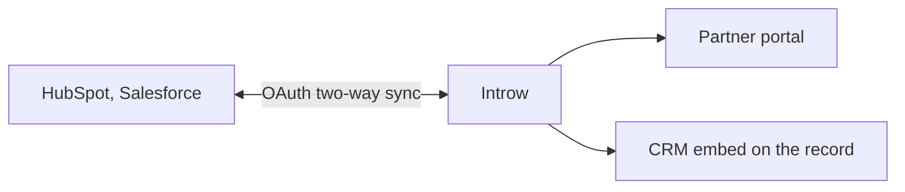

## How the sync stays accurate and secure

Two-way sync is only worth having if you can trust it. A few things Introw handles for you, none of which you configure:

* **Your CRM credentials stay isolated.** Introw never stores your CRM's login tokens in its own application. They are held in a separate, dedicated credential vault, and every request to your CRM is cryptographically signed and scoped to your organisation alone - so even a breach of Introw would expose no usable access to your CRM, and no customer's connection can ever reach another's. This is the guarantee that makes connecting your CRM safe.
* **Changes show up in near-real-time.** Beyond the scheduled sync, Introw notices CRM changes within about a minute and knows who made them - so partners are nudged the moment their deal moves, not hours later.
* **The sync keeps itself healthy.** Each object syncs independently, so one misconfigured field never stalls the rest; rate limits are handled as a normal, self-clearing pause rather than an error; and when something does break, Introw pinpoints the CRM-side cause (a deleted custom object, a renamed property, a removed label) instead of just failing. Re-syncs never spam duplicate notifications, and a deal never silently drops off a partner's view.
* **Your history comes in on connect.** Introw pulls your full partner-relevant history - including deals closed long before you adopted Introw - plus the records behind them, so the program populates itself with nothing to migrate.

Write-backs are just as careful: Introw defaults to never overwriting a value your team already set, and only fields you have marked editable can ever be written. See [CRM field mapping](/features/forms/crm-automations).

### Which way each thing flows, and how fast

The question behind most "is it synced yet" moments. Nothing here is configurable; it is how the sync behaves.

| What moves                                                                | Direction                  | When                                                          |
| ------------------------------------------------------------------------- | -------------------------- | ------------------------------------------------------------- |
| A change on a partner-linked record: deal, ticket, lead, company, contact | Your CRM into Introw       | Detected within about a minute, with the CRM user who made it |
| The full record import for a connection                                   | Your CRM into Introw       | Roughly every 15 minutes, plus a complete pass on connect     |
| Deletions and merges                                                      | Your CRM into Introw       | On a webhook, as they happen                                  |
| Owners, pipelines and stages, currency rates                              | Your CRM into Introw       | On the scheduled import                                       |
| A record a form submission creates                                        | Introw into your CRM       | The moment the submission is accepted                         |
| Partner tier, partnership manager, partner team roles                     | Introw into your CRM       | As the change is made, where you have mapped a property       |
| Contact portal access and role                                            | Introw into your CRM       | As the change is made, where you have mapped a property       |
| Course enrollments and certificates, as CRM records                       | Introw into your CRM       | Every 15 minutes                                              |
| Partner activity on the HubSpot timeline                                  | Introw into your CRM       | As the activity happens                                       |
| Comments, tasks, files and field edits on a shared record                 | Both ways                  | As they are made, on the record itself                        |
| Anything a workflow writes                                                | Introw into your CRM       | When that step runs                                           |
| Segment membership                                                        | Recalculated inside Introw | As the underlying partner or contact data changes             |
| Goal and KPI progress                                                     | Recalculated inside Introw | Nightly                                                       |

Two consequences worth planning around.
A field your team edits in the CRM is visible to a partner within about a minute, so there is no safe window to make a change quietly on a record a partner can see.
And a certificate you issue shows in Introw immediately but takes up to 15 minutes to appear as a CRM record, so a rep checking Salesforce or HubSpot straight after can legitimately not see it yet.

## Settings & configuration

Everything lives under [Integrations → CRM & Data](https://app.introw.io/settings/integrations?category=crm), plus a few partner/settings screens for write-back mappings.

### Connect the CRM

Use the HubSpot or Salesforce tile to authorize via OAuth. Accept **all** requested scopes - declining any blocks the connection. Salesforce supports sandbox or production login and may install a managed package. On Salesforce, expect the first authorization to be refused until the org allows the Introw connected app: attempt it once, then install the app from **Connected Apps OAuth Usage** (or grant the connecting user **Approve Uninstalled Connected Apps**) and reconnect.

### How partners are stored

In the wizard, choose the CRM object that represents partners - Company/Account by default, or **any custom object** you use to manage partners at scale.

### Filter & import (with contacts)

Filter the partner object by CRM property, choose all matches or specific records, and enable **automatically sync new partners** so future matches import on their own. A partner's contacts are pulled in with it and kept current. See [Sync partners & contacts](../guides/sync-partners-and-contacts).

### Attribution

Configure how each object links to partners on the **Object Linking** screen. Methods include a custom property, a HubSpot association label, a Salesforce lookup or relation table, or a one-click property Introw creates for you. Configure **Deal/Opportunity** at minimum. See [how to attribute deals to partners](../attribution) for your CRM's methods.

### Map Introw data back to the CRM

* **Tiers & managers** - at [Tiers](https://app.introw.io/settings/tiers), map a partner's tier and partnership manager to CRM properties.
* **Partner team roles** - at [Partner roles](https://app.introw.io/settings/team/partner-roles), map roles to CRM properties.
* **Contact portal access & role** - from a partner's **People** dialog at [Partners](https://app.introw.io/partners), map access and role to CRM contact properties.

### Embed Introw in the CRM

Add the **Partner Connect card** (HubSpot) or **Introw component** (Salesforce) to record pages, drop **workflow actions** into HubSpot workflows, and rely on **app events** to post partner activity to the CRM timeline. See the embed guides below.

#### What the Introw HubSpot app puts in your portal

Authorizing HubSpot installs the Introw app, and with it five kinds of HubSpot extension. They are worth naming, because these are the terms HubSpot uses and the ones your admin will search for:

| HubSpot surface      | What Introw ships                                                                                                                                                                          | What it gets you                                                                                                                                                                                                                                                                                                                                                                          |
| -------------------- | ------------------------------------------------------------------------------------------------------------------------------------------------------------------------------------------ | ----------------------------------------------------------------------------------------------------------------------------------------------------------------------------------------------------------------------------------------------------------------------------------------------------------------------------------------------------------------------------------------- |
| **App cards**        | **Introw Collaboration** on deals and tickets, **Introw Partner** on companies and your partner object, and an **Introw Collaboration tab** on companies, tickets, and your partner object | A fully native in-HubSpot experience. Sellers and partner managers collaborate with partners, share a record, and register or link a deal without leaving the CRM. See [Set up Introw inside HubSpot](/features/integrations/crm/guides/set-up-the-hubspot-partner-connect-card).                                                                                                         |
| **App events**       | Six partner activity events, each written to both the contact and the company timeline: portal visit, comment, asset viewed, object update, form submitted, and deal closed won            | Partner engagement lands on the HubSpot timeline as first-class activity, so you can build **HubSpot reports** on it and **enroll workflows** off it. See [reporting on app events](/features/integrations/crm/guides/report-on-partner-engagement-in-hubspot) and [triggering workflows from them](/features/integrations/crm/guides/trigger-hubspot-workflows-from-partner-engagement). |
| **App objects**      | **Introw Course Enrollments** and **Introw Certificates**, each a real HubSpot object with its own record page, associated to the partner's contact and company                            | Live course and certification tracking inside HubSpot, so everyone can see who is certified and who is trained on your product without opening Introw. See [Show course progress in HubSpot](/features/integrations/crm/guides/show-course-progress-in-hubspot).                                                                                                                          |
| **Workflow actions** | Create or update a partner, enroll a partner in a journey, issue a certificate, add tasks and comments, and search partners, deals, commissions, tasks, and marketing funds                | Introw becomes a step inside the HubSpot workflows your team already runs. See [Use Introw workflow actions in HubSpot](/features/integrations/crm/guides/use-introw-workflow-actions-in-hubspot).                                                                                                                                                                                        |
| **MCP server**       | **Introw MCP**, an OAuth-protected server listed in the **Connectors** tab when you add an action to a HubSpot agent                                                                       | Introw becomes an action a custom agent or agentic workflow can take, so Agent Hub can read direct-side CRM data and write the result into the partner's world. See [HubSpot Agent Hub](/headless/agentic-use-cases/hubspot-agent-hub).                                                                                                                                                   |

App events and app objects flow on their own once the app is installed with current scopes; there is no switch to turn them on. App cards are the one surface a HubSpot admin has to place on a record layout, and the MCP server is the one a HubSpot admin has to connect on an agent.

### Automate it with a workflow

A connected CRM is what makes most [workflows](/features/automation/workflows/technical) worth building, in both directions.

Reading: **Partner updated** fires on any partner-level CRM property changing on the company or your custom partner object, so a rep editing a program field in HubSpot or Salesforce is an event Introw can act on. The partner-conditions block on every trigger and fork reads those same properties, so "the field changed, and it now holds Managed" is one trigger.

Writing: **Update partner properties** writes back to any writable CRM property in the same step that updates Introw, and **Log a CRM note** puts a note on the partner's own record, their company or your custom partner object, so the rep who made the change sees the consequence on the record they were already looking at. There is no record picker, because the partner's own record is the one record every run can name.

See [React to a CRM change on a partner](/features/automation/workflows/guides/react-to-a-crm-change-on-a-partner).

## Set it up for your CRM

The four jobs are the same on every CRM; the mechanics differ, so follow your CRM end to end. Connect first, set up attribution, then bring Introw onto the record where your team works. The jobs below the divider run the same way everywhere.

<Tabs>
  <Tab title="HubSpot">
    <CardGroup>
      <Card title="Connect HubSpot" icon="plug" href="/features/integrations/crm/guides/connect-hubspot">
        Authorize, set the partner object, filter, and import.
      </Card>

      <Card title="Attribution in HubSpot" icon="diagram-project" href="/features/integrations/crm/guides/attribution-in-hubspot">
        Properties, association labels, or a custom object.
      </Card>

      <Card title="Permissions & scopes" icon="lock" href="/features/integrations/crm/guides/hubspot-permissions-and-scopes">
        Every scope Introw asks for, and what happens when one is missing.
      </Card>

      <Card title="Set up Introw inside HubSpot" icon="id-card" href="/features/integrations/crm/guides/set-up-the-hubspot-partner-connect-card">
        Add the cards, then collaborate, register, run workflow actions, and report from the record.
      </Card>

      <Card title="CRM vs Admin users" icon="user-shield" href="/features/integrations/crm/guides/hubspot-crm-users-vs-admin-users">
        Who works only from the cards in HubSpot, and who needs full Introw access.
      </Card>
    </CardGroup>
  </Tab>

  <Tab title="Salesforce">
    <CardGroup>
      <Card title="Connect Salesforce" icon="plug" href="/features/integrations/crm/guides/connect-salesforce">
        Choose production or sandbox, install the package, filter, and import.
      </Card>

      <Card title="Attribution in Salesforce" icon="diagram-project" href="/features/integrations/crm/guides/attribution-in-salesforce">
        Picklists, lookups, relation tables, or a custom object.
      </Card>

      <Card title="Permissions & scopes" icon="lock" href="/features/integrations/crm/guides/salesforce-permissions-and-scopes">
        The integration user and least-privilege access.
      </Card>

      <Card title="Embed Introw in Salesforce" icon="window-restore" href="/features/integrations/crm/guides/embed-introw-in-salesforce">
        Place the Introw collaboration panel on record pages.
      </Card>

      <Card title="Collaborate from Salesforce" icon="handshake" href="/features/integrations/crm/guides/collaborate-from-salesforce-opportunities-and-cases">
        Share an opportunity or case with a partner and comment both ways.
      </Card>

      <Card title="Show course progress in Salesforce" icon="graduation-cap" href="/features/integrations/crm/guides/show-course-progress-in-salesforce">
        Enrollments and certificates as related lists on Account and Contact.
      </Card>
    </CardGroup>
  </Tab>
</Tabs>

### Across every CRM

These jobs work identically whichever CRM you connected:

<CardGroup>
  <Card title="Sync partners & contacts" icon="users" href="/features/integrations/crm/guides/sync-partners-and-contacts">
    Pull partner accounts and their contacts live, and keep them current.
  </Card>

  <Card title="Sync tiers, programs & roles back" icon="arrow-right-from-bracket" href="/features/integrations/crm/guides/map-tiers-to-a-crm-property">
    Push partner standing and ownership onto the CRM record.
  </Card>

  <Card title="Drive access from the CRM" icon="key" href="/features/integrations/crm/guides/map-contact-portal-access">
    Let a CRM field grant and revoke portal access.
  </Card>

  <Card title="Show & rename CRM fields" icon="table-columns" href="/features/integrations/crm/guides/show-and-rename-crm-fields">
    Put any CRM field on your Introw views, renamed for partners.
  </Card>

  <Card title="Disconnect a CRM" icon="link-slash" href="/features/integrations/crm/guides/disconnect-a-crm">
    Safely stop the sync and switch CRMs.
  </Card>

  <Card title="Troubleshoot a connection" icon="wrench" href="/features/integrations/crm/guides/troubleshoot-a-crm-connection">
    Fix a sync that needs attention.
  </Card>

  <Card title="Every CRM error Introw logs" icon="triangle-exclamation" href="/features/integrations/crm/guides/every-crm-error-introw-logs">
    Read the four places a CRM failure is reported.
  </Card>
</CardGroup>

## How-to guides

<Rail>
  * [**Capture partner file uploads in HubSpot**](/features/integrations/crm/guides/allow-partner-attachments-in-hubspot)

    Have files partners upload on a shared deal in Introw automatically pushed to the HubSpot deal's attachments, keeping partner documents in your CRM.

  * [**Partner attribution in HubSpot**](/features/integrations/crm/guides/attribution-in-hubspot)

    Every way to attribute HubSpot deals to partners - custom properties, association labels, and custom objects - with mechanics, trade-offs, and setup.

  * [**Partner attribution in Salesforce**](/features/integrations/crm/guides/attribution-in-salesforce)

    Every way to attribute Salesforce opportunities to partners - picklists, Account lookup, OpportunityPartner junction, and custom objects - with setup.

  * [**Collaborate from HubSpot deals and tickets**](/features/integrations/crm/guides/collaborate-from-hubspot-deals-and-tickets)

    Use the Introw card on a HubSpot deal or ticket to share the record with a partner and exchange comments and updates without ever leaving your CRM.

  * [**Collaborate from Salesforce opportunities and cases**](/features/integrations/crm/guides/collaborate-from-salesforce-opportunities-and-cases)

    Use the Introw collaboration panel on a Salesforce opportunity or case to share the record with a partner and exchange comments and updates without ever leaving your CRM.

  * 

    [**Connect HubSpot as your source of truth**](/features/integrations/crm/guides/connect-hubspot)

    Connect HubSpot in three questions: which object holds your partners, which records are partners, and how deals link to them.

  * 

    [**Connect Salesforce as your source of truth**](/features/integrations/crm/guides/connect-salesforce)

    Connect a Salesforce org in three questions: which object holds your partners, which records are partners, and how opportunities link to them.

  * [**Create a partner portal from HubSpot**](/features/integrations/crm/guides/create-a-portal-from-hubspot)

    Spin up an Introw partner portal for a company without leaving HubSpot, using the Introw workflow action or the Introw Copilot card.

  * 

    [**Disconnect a CRM**](/features/integrations/crm/guides/disconnect-a-crm)

    Safely disconnect a HubSpot or Salesforce integration from Introw and understand exactly what data and sync activity stops flowing.

  * [**Embed Introw in Salesforce**](/features/integrations/crm/guides/embed-introw-in-salesforce)

    Install the Introw managed package, add the Introw collaboration panel to record pages, and grant access so reps work with partners from Salesforce.

  * [**Every CRM error Introw logs, and where to read it**](/features/integrations/crm/guides/every-crm-error-introw-logs)

    The four places Introw reports a CRM failure: the connection, one broken mapping, what the connection is not allowed to do, and a record your CRM refused.

  * [**CRM users vs Admin users in HubSpot**](/features/integrations/crm/guides/hubspot-crm-users-vs-admin-users)

    The two kinds of Introw access for your own team: a CRM user who works only from the Introw cards in HubSpot, and a full Introw user such as an Admin. What each one can do, and which to give.

  * [**HubSpot permissions and scopes**](/features/integrations/crm/guides/hubspot-permissions-and-scopes)

    Exactly what Introw asks for in HubSpot: every required, conditional and optional OAuth scope, how HubSpot's permission model differs from Salesforce, and what happens when a scope is missing.

  * [**Drive contact portal access and roles from your CRM**](/features/integrations/crm/guides/map-contact-portal-access)

    Map partner portal access and contact roles to CRM properties so your CRM controls who logs in to Introw and how partner contacts are grouped.

  * 

    [**Sync partner tiers, programs, and roles to your CRM**](/features/integrations/crm/guides/map-tiers-to-a-crm-property)

    Push partner tiers, tier programs, partnership managers, and team roles back to CRM properties so sales sees them without leaving the CRM.

  * [**Register or link a partner deal from HubSpot**](/features/integrations/crm/guides/register-a-deal-from-hubspot)

    Use the Introw card on a HubSpot deal to register a new partner deal or link the deal to an existing partner, keeping attribution accurate.

  * [**Report on partner engagement in HubSpot with app events**](/features/integrations/crm/guides/report-on-partner-engagement-in-hubspot)

    Introw writes partner activity to the HubSpot contact and company timeline as app events, so you can report on portal visits, form submissions, and content views next to your direct pipeline.

  * [**CRM users vs Admin users in Salesforce**](/features/integrations/crm/guides/salesforce-crm-users-vs-admin-users)

    The two kinds of Introw access for your own team: a CRM user who works only from the Introw collaboration panel in Salesforce, and a full Introw user such as an Admin. What each one can do, and which to give.

  * [**Salesforce permissions, scopes, and the integration user**](/features/integrations/crm/guides/salesforce-permissions-and-scopes)

    What access Introw needs in Salesforce: OAuth scopes, why to use a dedicated integration user, and the minimal object and field permissions required.

  * [**Set up Introw inside HubSpot with app cards**](/features/integrations/crm/guides/set-up-the-hubspot-partner-connect-card)

    Authorize the Introw app in HubSpot and add the Introw app cards to deal, ticket, and company records so reps work with partners without leaving the CRM.

  * [**Show CRM fields everywhere, and rename them for partners**](/features/integrations/crm/guides/show-and-rename-crm-fields)

    Add any CRM field to Introw's partner, contact, and object lists, edit values inline, and rename fields to partner-friendly labels on partner-facing views.

  * [**Show course progress in HubSpot with app objects**](/features/integrations/crm/guides/show-course-progress-in-hubspot)

    Surface Introw partner course enrollments and certificates in HubSpot as app objects, so certification status is live on your company and contact records.

  * [**Show course progress in Salesforce**](/features/integrations/crm/guides/show-course-progress-in-salesforce)

    Surface Introw partner course enrollments and certificates on Salesforce Account and Contact records by adding Introw's related lists to your page layouts.

  * [**Sync partners & contacts from your CRM**](/features/integrations/crm/guides/sync-partners-and-contacts)

    Pull partner accounts and contacts live from your CRM into Introw, drive portal access from a CRM field, and build dynamic segments on that data.

  * [**Trigger HubSpot workflows from partner engagement**](/features/integrations/crm/guides/trigger-hubspot-workflows-from-partner-engagement)

    Enroll a HubSpot workflow the moment a partner submits a form, visits the portal, comments, or updates a shared record, using the app events Introw writes to the contact and company timeline.

  * 

    [**Troubleshoot a CRM connection**](/features/integrations/crm/guides/troubleshoot-a-crm-connection)

    Diagnose and fix a CRM sync that shows a needs-attention status, from expired authorization to missing scopes and over-tight filters.

  * [**Use Introw workflow actions in HubSpot**](/features/integrations/crm/guides/use-introw-workflow-actions-in-hubspot)

    Drop Introw actions into HubSpot workflows to create or update partners, enroll them in a journey, or issue a certificate automatically.
</Rail>

## Troubleshooting

<Warning>
  Only one CRM can be connected at a time. The CRM is the source of truth, so most fields are edited in the CRM, not Introw - and a write-back target property must exist in the CRM first. Attribution mechanics differ by CRM (HubSpot uses associations; Salesforce uses lookups/relation tables). Object and property labels sync from the CRM, so rename them there. The Salesforce component must be added to each record page layout by an admin.
</Warning>

Introw reports a CRM failure in four different places, one per layer: the connection on Integrations, one broken object link on **Object linking**, what the connection is not allowed to do on the screen where you would configure it, and a record your CRM refused on the submission that tried to create it. [Every CRM error Introw logs](/features/integrations/crm/guides/every-crm-error-introw-logs) is the map, and it is the page to open when a status says **Connected** and something is still missing.

<AccordionGroup>
  <Accordion title="Records are not appearing">
    Check the partner object and filters, and confirm the sync is healthy.
  </Accordion>

  <Accordion title="Everything is green and a value is still missing">
    Not every shortfall is a failure. Introw runs as a CRM identity, so an object it can only partly see, or a field it cannot write, delivers less than the mapping promises with no error anywhere. Read the verdict pills on **Object linking** and on a form's **Automation** tab.
  </Accordion>

  <Accordion title="A submission shows Error">
    Your CRM refused the record. Open the submission: a red panel names the object and the reason in plain language, and where the cause is the submitted data the fields stay editable so the automation can retry.
  </Accordion>

  <Accordion title="The integration needs attention">
    Re-authorize; for HubSpot, missing scopes require **Install update**.
  </Accordion>

  <Accordion title="A deal is not attributed">
    Revisit the Object Linking configuration and the selected property/association/relation.
  </Accordion>

  <Accordion title="A tier or role is not writing back">
    Confirm the mapped CRM property exists and is writable.
  </Accordion>

  <Accordion title="A card is blank or missing">
    Confirm the app/component is installed and added to the record layout, and that the record is linked to a partner.
  </Accordion>
</AccordionGroup>

## FAQ

<AccordionGroup>
  <Accordion title="What happens to partner attribution when I merge records in my CRM?" icon="code-merge">
    Nothing is lost. When you merge two companies or deals in HubSpot or Salesforce, Introw follows the merge and re-points the partner attribution, collaborators, comments, and timeline history onto the surviving record - so a routine dedupe never drops a partner's credit or their conversation on the deal.
  </Accordion>

  <Accordion title="Where do my CRM credentials live - is connecting safe?" icon="shield-halved">
    Introw never stores your CRM's login tokens in its own application. They sit in a separate, dedicated credential vault, and every call to your CRM is cryptographically signed and scoped to your organisation alone - so even a breach of Introw would expose no usable access to your CRM, and one customer's connection can never reach another's.
  </Accordion>

  <Accordion title="Where is our data stored, and what is your security posture?" icon="shield-check">
    Hosting, certifications, subprocessors, retention and the rest of the security posture are published in the [Introw Trust Center](https://trust.introw.io), which is the right document to hand a security review. What is worth knowing before you get there: partners are never CRM users, so no external seat or licence is involved, and your CRM's credentials are held outside the application in a dedicated vault. See [Enterprise-grade](/why/enterprise-grade).
  </Accordion>

  <Accordion title="How live is the sync?" icon="bolt">
    Records sync on a schedule and, on top of that, Introw detects changes in near-real-time - within about a minute - and knows which CRM user made each one, so partners are notified the moment a deal moves. Deletions and merges arrive via webhooks.
  </Accordion>
</AccordionGroup>

---

# Connect Crossbeam
Source: https://docs.introw.io/features/integrations/crossbeam/guides/connect-crossbeam

Authorize Crossbeam in Introw and watch your record export quota, so your team sees who else in the ecosystem works an account without leaving the record.

Your reps decide how to approach an account faster when they know who else in the ecosystem already sells into it. This guide connects Crossbeam to Introw and confirms your record export quota, so that intelligence sits on the account your team is already looking at. Crossbeam is a paid add-on layered onto Introw, not a CRM sync, so it sits alongside your CRM rather than replacing it.

## What you'll achieve

A connected Crossbeam account with your record export usage visible, and ecosystem overlap showing on the accounts your team works, so they can act on it without opening Crossbeam.

## Before you start

<Steps>
  <Step title="Enable Crossbeam on your plan">
    Crossbeam is a paid add-on. If the Crossbeam tile shows an upgrade prompt instead of **Connect**, the module is not enabled on your plan; contact Introw to add it.
  </Step>

  <Step title="Confirm Crossbeam admin access">
    You need admin access to the Crossbeam account you are connecting so you can authorize the integration.
  </Step>

  <Step title="Confirm your Introw permission">
    You need permission to connect integrations in Introw to authorize Crossbeam.
  </Step>
</Steps>

## Watch it

<Tabs>
  <Tab title="Video">
    <video />
  </Tab>

  <Tab title="Click through">
    <iframe />
  </Tab>
</Tabs>

## Steps

### Connect the account

<Steps>
  <Step title="Open the Integrations">
    Go to [Integrations](https://app.introw.io/settings/integrations?category=crm) and stay on the **CRM & Data** category, where the Crossbeam tile lives alongside your CRM tiles.

    <Frame>
      
    </Frame>
  </Step>

  <Step title="Start the Crossbeam connection">
    On the **Crossbeam** tile select **Connect** to open Crossbeam's authorization screen.

    <Frame>
      
    </Frame>
  </Step>

  <Step title="Authorize Crossbeam">
    Sign in to Crossbeam, choose the account, and approve access. Introw returns with Crossbeam shown as **Connected by** you, with the connection date, and opens the Crossbeam page.
  </Step>
</Steps>

### Check your usage and quota

<Steps>
  <Step title="Review the Overview">
    At the top of the Crossbeam page, the **Overview** shows your **Crossbeam Plan** and **Record Export Usage**: how many of your record exports are consumed against your limit, the percentage used, and how many days until the term resets. Watch this so you do not exhaust your Crossbeam quota; the bar turns orange as you approach the limit and red when it is reached. Use **View in Crossbeam** to manage the plan itself in Crossbeam.
  </Step>
</Steps>

## Verify it worked

Crossbeam shows as **Connected** on the integrations page, and the **Overview** shows your current plan and record export usage. Open an account your ecosystem is likely to know in a collaboration view: an **Overlap** block lists the partners Crossbeam reports on it, with the populations they hold it in. There is no partner-by-partner setup to do; overlap is matched on the account's domain. The block is internal, so partners never see it.

## Related

<CardGroup>
  <Card title="Collaborate on shared pipeline" icon="handshake" href="/features/co-selling/shared-pipelines">
    Act on overlap in your collaboration views and co-sell.
  </Card>

  <Card title="Implementation reference" icon="screwdriver-wrench" href="../technical">
    Full configuration options.
  </Card>
</CardGroup>

---

# Crossbeam
Source: https://docs.introw.io/features/integrations/crossbeam/index

Bring partner ecosystem overlap into Introw - see shared accounts and prospects with each partner, right where you collaborate and segment.

> Knowing where you and a partner overlap is the start of every good co-sell. The Crossbeam integration brings ecosystem overlap into Introw, so shared accounts and prospects show up where you collaborate and segment partners.

## The problem it solves

Ecosystem data is powerful but usually lives in a separate tool:

<Pains>
  | Without Introw               | With Introw                   |
  | ---------------------------- | ----------------------------- |
  | Overlap lives in another tab | It surfaces where you work    |
  | Partners are matched by hand | Overlap resolves per account  |
  | Signals are not actionable   | Overlap becomes a filter      |
  | Co-sell starts blind         | You see shared accounts first |
</Pains>

## Impact

The best co-sell call starts with a named account you both know. Having the overlap already sitting next to the deal is what turns a quarterly check-in into a pipeline conversation.

<Impact>
  for your business

  * **In your CRM**
    Ecosystem overlap sits beside your CRM-sourced partner data, in the collaboration views you already use
  * **Cost to run**
    Connect it once, with no engineering and no partner-by-partner setup

  for your partners

  * **Self-serve**
    The shared accounts are already known, so a co-sell conversation starts from a list
  * **Enabled**
    You bring them accounts you actually overlap on, which is a better call than a check-in
  * **Efficient**
    No spreadsheet exchange to work out who you have in common

  [A day in the life of a co-sell partner](/days-in-the-life/co-sell-partner)
</Impact>

<Personas>
  * **Partner Operations** - Crossbeam connected in one step
  * **RevOps** - overlap for prioritisation
</Personas>

## How it works

The Crossbeam integration connects your Crossbeam account to Introw and reads the overlap on the

<Frame>
  
</Frame>

accounts your team works. Shared customers and prospects with each ecosystem partner surface inside
Introw's collaboration views, matched on the account itself, so you can act on ecosystem signals
without switching tools.

This is ecosystem intelligence, not a CRM sync: Crossbeam tells you who you have in common with a
partner, and Introw puts that insight next to the deals, rooms, and segments where it is useful. The
integration is a paid add-on and respects your Crossbeam record export usage.

### Where Crossbeam ends and Introw begins

The most common question about this integration is not how to set it up, it is whether the two tools
overlap. They do not, and the boundary is clean.

| The job                                                         | Crossbeam                   | Introw |
| --------------------------------------------------------------- | --------------------------- | ------ |
| Find out which accounts you and a partner have in common        | Yes, this is what it is for | No     |
| Discover which of a partner's customers could be your prospects | Yes                         | No     |
| Give the partner a portal, content and training                 | No                          | Yes    |
| Take a deal registration and write it to your CRM, attributed   | No                          | Yes    |
| Run approvals, tiers, commissions and payouts                   | No                          | Yes    |
| Show the overlap next to the deal your team is working          | Only in Crossbeam           | Yes    |

Crossbeam answers **who to work with**. Introw is **the program you run with them**: registration,
enablement, and the money. That is why the integration exists rather than a copy of it, and why
Crossbeam customers keep Crossbeam.

**Do you need Crossbeam to use Introw?** No. Nothing in Introw depends on it, and partner-attached
pipeline, deal registration and channel-conflict screening all work without any overlap data. Add
Crossbeam when account mapping is already part of how your team sells, and you want that signal beside
the deal instead of in a second tab. Note that it is a paid add-on on both sides: you need the module
on your Introw plan and a Crossbeam plan that allows record exports.

The Crossbeam integration brings ecosystem overlap to where you work. Connect it, and shared-account
signals show up on the accounts in Introw, turning ecosystem data into co-sell action.

```mermaid theme={"theme":{"light":"github-light","dark":"github-dark"}}
flowchart LR
  connect["Connect Crossbeam"] --> account["Account in Introw"]
  account --> overlap["Shared-account overlap beside the deal"]
```

## Going deeper

<CardGroup>
  <Card title="How to" icon="screwdriver-wrench" href="./technical">
    Setup, configuration, and all how-to guides.
  </Card>

  <Card title="API reference" icon="code" href="/general/introduction">
    Integration surface and code.
  </Card>
</CardGroup>

**Works with**

<CardGroup>
  <Card title="Partner CRM" icon="circle-nodes" href="/features/partner-connect/partner-crm">
    Connect on overlapping accounts.
  </Card>

  <Card title="Shared Pipelines" icon="handshake" href="/features/co-selling/shared-pipelines">
    Surface co-sell overlap in the pipeline.
  </Card>
</CardGroup>

---

# Crossbeam
Source: https://docs.introw.io/features/integrations/crossbeam/technical/index

Connect Crossbeam to Introw and read ecosystem overlap on the accounts your team works, to prioritize co-selling and account mapping.

## Where it lives

Crossbeam sits under **Settings**, at [Integrations](https://app.introw.io/settings/integrations?category=crm).

<Frame>
  
</Frame>

## Before you start

| You need                              | Why                           | Fix it                                                                            |
| ------------------------------------- | ----------------------------- | --------------------------------------------------------------------------------- |
| The Crossbeam module                  | The area is locked without it | **Request access**                                                                |
| A Crossbeam account with admin access | You authorise it there        | Outside Introw                                                                    |
| Integrations write access             | To connect it in Introw       | [Internal roles](/features/access/team-management/guides/create-an-internal-role) |

## How it works

Crossbeam appears as a tile on the CRM & Data tab, and connects over OAuth. From then on, when your
team opens an account in a collaboration view, Introw asks Crossbeam who else in your ecosystem
already works with that account and shows the answer there. Matching runs on the account's own
domain, so there is nothing to align by hand.

Crossbeam is a paid module, and the integration page shows your Crossbeam plan and record export
usage so you can manage your quota. It is ecosystem intelligence layered onto Introw, not a CRM sync.

```mermaid theme={"theme":{"light":"github-light","dark":"github-dark"}}
flowchart LR
  crossbeam["Crossbeam"] -->|"OAuth"| introw["Introw"]
  introw --> account["Account in a collaboration view"]
  account --> overlap["Overlap: who else works with them"]
```

## Settings & configuration

Crossbeam is managed at [Integrations](https://app.introw.io/settings/integrations?category=crm).

### Connect Crossbeam

Use the Crossbeam tile to authorize via OAuth.

### Usage

Review your Crossbeam plan and record export usage on the integration page. There is nothing else to
configure: overlap resolves per account, so no partner-by-partner setup stands between connecting and
using it.

### Overlap in Introw

Open an account in a collaboration view, or a form submission's collaboration panel, and an
**Overlap** block lists the ecosystem partners Crossbeam reports on that account, each with the
**Populations** they hold it in and the owner on their side. It is internal: the block says so, and
partners never see it.

## How-to guides

<Rail>
  * 

    [**Connect Crossbeam**](/features/integrations/crossbeam/guides/connect-crossbeam)

    Authorize Crossbeam in Introw and watch your record export quota, so your team sees who else in the ecosystem works an account without leaving the record.
</Rail>

## Troubleshooting

<Warning>
  Crossbeam requires the module to be enabled on your plan. Overlap is resolved per account, so an account Crossbeam has no data on shows nothing. Record export usage is bounded by your Crossbeam plan.
</Warning>

<AccordionGroup>
  <Accordion title="The Crossbeam tile shows an upgrade prompt">
    The module is not enabled on your plan.
  </Accordion>

  <Accordion title="An account shows no overlap">
    Crossbeam reports no ecosystem partner on that account, or the account carries no domain to match on.
  </Accordion>

  <Accordion title="Overlap looks incomplete">
    Check your Crossbeam record export usage and plan.
  </Accordion>
</AccordionGroup>

---

# Integrations
Source: https://docs.introw.io/features/integrations/index

Keep your CRM as the single source of truth and connect the rest of your stack - HubSpot and Salesforce, Crossbeam, Stripe, Slack, and Teams.

> Introw runs on your CRM, not beside it. Connect HubSpot or Salesforce as the source of truth, layer on ecosystem and billing data, and fan partner activity out to Slack and Teams - so everything stays in sync and partners get reached where they already work.

## The problem it solves

<Pains>
  | Without Introw                   | With Introw                    |
  | -------------------------------- | ------------------------------ |
  | A PRM means a second database    | Your CRM stays the source      |
  | Migrating data comes first       | It reads what you already have |
  | Partners only hear in the portal | It fans out to Slack and Teams |
  | Commissions run on estimates     | Real billing data feeds them   |
</Pains>

## Impact

The CRM is where your team already works, and your partner's team too. Building the program there instead of beside it is the difference between a portal they are sent to and a program they are in.

<Impact>
  for your business

  * **In your CRM**
    HubSpot and Salesforce stay the system of record, two-way synced, so nothing important drifts into a second database
  * **Live in days**
    Connect the CRM once and the program populates itself from records you already have, with no middleware to build
  * **No new tool**
    The same connections fan activity out to Slack, Teams and email, so nobody opens a portal to stay in the loop

  for your partners

  * **Self-serve**
    Their access follows a CRM field, so getting in and staying in does not need a request
  * **Enabled**
    Their reps get partner context on the CRM record they already have open, and the agent in chat
  * **Efficient**
    One shared reality: their update and yours are the same record, not two to reconcile

  [A day in the life of a co-sell partner](/days-in-the-life/co-sell-partner)
</Impact>

<Personas>
  * **RevOps** - the CRM stays authoritative
  * **Partner Operations** - mapping and channels, no code
  * **IT & Admins** - connections they can authorise
  * **Partners** - reached where they already are
</Personas>

## How this area works

The **CRM** connection is the foundation - one integration that connects HubSpot or Salesforce,
pulls in partners and their contacts live, attributes deals to partners using whatever
method you already use, and embeds Introw on the CRM record. It writes tiers, managers, roles, and
portal access back, so the CRM stays the single source of truth in both directions.

The CRM stays authoritative while the rest of the stack connects around Introw.

**Where this sits in a setup.** First, always. Every [setup track](/tracks) starts by connecting and mapping the CRM, because almost nothing downstream resolves without it.

<Rail>
  * 

    [**CRM**](./crm)

    HubSpot or Salesforce, two-way.

    [How to · 23 guides](./crm/technical)

  * 

    [**Chat**](./chat)

    Partner activity and the agent in Slack or Teams.

    [How to · 4 guides](./chat/technical)

  * 

    [**Billing**](./billing)

    Stripe and Chargebee revenue behind commission calculations.

    [How to · 3 guides](./billing/technical)

  * 

    [**Crossbeam**](./crossbeam)

    Ecosystem overlap, where you collaborate.

    [How to · 1 guide](./crossbeam/technical)

  * 

    [**Zapier**](./zapier)

    Introw events, out to thousands of apps.

    [How to · 1 guide](./zapier/technical)

  * 

    [**MCP**](./mcp)

    Connect AI clients like Claude and ChatGPT.

    [Read more](/features/developer/mcp)

  * 

    [**API**](./api)

    Build on Introw programmatically.

    [Read more](/features/developer/api)
</Rail>

Beyond the CRM, **Chat** posts partner activity and runs the support agent in Slack or Teams,
**Billing** syncs Stripe and Chargebee data that powers commissions, **Crossbeam** brings in partner
ecosystem overlap, and **Zapier**, **MCP**, and the **API** let you automate and build on Introw
programmatically. Every integration reinforces the same principle: the CRM stays authoritative, and
partner work happens in the tools people already use.

One clarification worth making early, because it comes up in nearly every rollout: the **Billing**
integration reads Stripe or Chargebee so commissions can be *calculated* on invoiced revenue. It is
not how partners get *paid*. That is [Introw Pay](/features/commissions/introw-pay), part of
Commissions rather than an integration, and it has no payment account for you to connect.

## When your tool is not on this list

The most common integration question is about a tool that has no tile: a ticketing system, an ERP,
a finance suite, a marketing automation platform, a data warehouse, a quoting or e-signature tool.
The answer is almost never "no", and it is usually not a new connector either.

| What you want                                       | The route                                | Why this one                                                                                                                                                                                                                                                                                                                                   |
| --------------------------------------------------- | ---------------------------------------- | ---------------------------------------------------------------------------------------------------------------------------------------------------------------------------------------------------------------------------------------------------------------------------------------------------------------------------------------------- |
| Read data your other tool already writes to the CRM | Nothing to build                         | Your ERP, billing, or support tool most likely syncs to HubSpot or Salesforce already. Introw reads CRM properties, so that data can drive [commission plans](/features/commissions/commission-plans), [segments](/features/partners/segments), [forms](/features/forms), and [reports](/features/reporting) without touching the other system |
| Push partner events into another tool               | [Zapier](./zapier)                       | Introw events out, thousands of apps in, no code                                                                                                                                                                                                                                                                                               |
| Two-way, on your own terms                          | [Public API](/features/developer/api)    | Every partner, form, deal, task, commission and payout object, with scoped keys                                                                                                                                                                                                                                                                |
| Let an assistant do the work                        | [MCP](/features/developer/mcp)           | Claude, ChatGPT, and HubSpot agents act on the program directly                                                                                                                                                                                                                                                                                |
| Show partners a dashboard from your BI stack        | [Power BI](/features/reporting/power-bi) | Embed a real report in the portal                                                                                                                                                                                                                                                                                                              |

Two things follow from this. Because the CRM is the source of truth, a tool that integrates with your
CRM effectively integrates with Introw, which is why the list of native connectors stays deliberately
short. And where a route needs building, it is the [API](/features/developer/api) or
[Zapier](./zapier) rather than a professional-services project.

The native connectors are HubSpot and Salesforce for the CRM, Stripe and Chargebee for
billing, Slack, Microsoft Teams and WhatsApp for chat, Crossbeam for ecosystem overlap, Power BI for
embedded reporting, and MCP for AI clients. Everything else runs through the four routes above.

## Run it from your AI assistant

<Headless>
  * Show Acme's open deals synced from HubSpot.
  * Update a deal property and sync it back to Salesforce.
  * Register a deal for Acme from Slack or your CRM.
</Headless>

---

# MCP
Source: https://docs.introw.io/features/integrations/mcp/index

Connect Introw to Claude, ChatGPT, and other AI assistants over the Model Context Protocol so they can securely read and act on your partner data.

> Introw exposes your partner program over the Model Context Protocol (MCP), so AI clients like Claude and ChatGPT can read and act on partner data securely.

The MCP integration is documented in full under the **Developer Platform**, where it lives alongside the rest of Introw's programmatic surface. This page points you there so there's a single, maintained source.

<CardGroup>
  <Card title="MCP overview" icon="robot" href="/features/developer/mcp">
    What the MCP server exposes and how access works.
  </Card>

  <Card title="Connect Claude" icon="plug" href="/features/developer/mcp/guides/connect-claude">
    Connect Introw to Claude over MCP.
  </Card>

  <Card title="Connect ChatGPT" icon="plug" href="/features/developer/mcp/guides/connect-chatgpt">
    Connect Introw to ChatGPT over MCP.
  </Card>

  <Card title="Give partners their own AI assistant" icon="users" href="/features/developer/mcp/guides/give-partners-their-own-ai-assistant">
    Let partners query their data through an MCP client.
  </Card>
</CardGroup>

## Headless

<Headless />

---

# Automate Introw with Zapier
Source: https://docs.introw.io/features/integrations/zapier/guides/automate-introw-with-zapier

Generate a Zapier API key, connect the Introw app in Zapier, and build a Zap from a partner event so onboarding, notifications, and syncs run automatically.

Zapier lets you turn an Introw partner event into an automated action in hundreds of other apps without writing code. This guide takes the whole job end to end: generate a Zapier API key in Introw, connect the Introw app in Zapier, and build a Zap that fires from a partner event. Do this once and onboarding tasks, notifications, and record syncs run automatically every time the event happens. The key you generate here is dedicated to the Zapier connection and is separate from a general developer API key you would create for calling the Introw API directly.

## What you'll achieve

A live Zap that reacts to an Introw partner event, such as a new partner or a portal visit, and runs an action in another app, so a partner workflow happens automatically with no manual step.

## Before you start

<Steps>
  <Step title="Confirm your Introw permission">
    You need permission to manage integrations in Introw to generate the Zapier API key.
  </Step>

  <Step title="Have a Zapier account">
    You need a Zapier account where you can create Zaps.
  </Step>
</Steps>

## Watch it

<Tabs>
  <Tab title="Video">
    <video />
  </Tab>

  <Tab title="Click through">
    <iframe />
  </Tab>
</Tabs>

## Steps

### Generate a key and connect the Introw app

<Steps>
  <Step title="Open the Zapier integration">
    Go to [Integrations](https://app.introw.io/settings/integrations?category=communication) and stay on the **Communication** category, then select the **Zapier** tile to open the **Zapier Integration** dialog.

    <Frame>
      
    </Frame>
  </Step>

  <Step title="Copy your Zapier API key">
    The dialog generates a **Zapier API key** for your organization. Select **Copy Zapier API Key** to copy it. This key authenticates Zapier to Introw and is specific to this connection. It is not the same as a developer API key you create for direct API calls; for that, see [Create and manage API keys](/features/developer/api/guides/create-and-manage-api-keys).

    <Frame>
      
    </Frame>
  </Step>

  <Step title="Open the Introw app in Zapier">
    In the same dialog select **Connect** to open the Introw app on Zapier. In Zapier, add Introw to a Zap and, when prompted to connect your account, paste the Zapier API key you copied. Zapier confirms the Introw account is connected.

    <Frame>
      
    </Frame>
  </Step>
</Steps>

### Build a Zap from a partner event

<Steps>
  <Step title="Choose an Introw trigger">
    Start a Zap in Zapier, pick Introw as the trigger app, and choose one of the three partner events Introw can start a Zap from. Pick the one that matches the workflow you want to automate:

    * **New partner** - fires when a new partner is added in Introw. It provides the partner's name, domain, logo, CRM id, and partner manager email, so you can automate onboarding, for example creating a project, sending a welcome email, or adding a row to a tracker.
    * **Portal visitor** - fires when a partner contact visits their portal. It provides the visitor's name and email, the partner name and tier, the partner manager email, and the CRM ids for the company and contact, so you can alert the partner manager or log engagement.
    * **Access changed** - fires when a partner contact's portal access changes. It provides the same visitor and partner details plus whether access was revoked, so you can keep an access log or notify the right people on grant or removal.
  </Step>

  <Step title="Add the action and map the fields">
    Add the app and action you want to run, for example posting to a chat channel, creating a CRM record, or adding a spreadsheet row. Map the Introw event fields (the fields listed above for your trigger) into the action's inputs so the downstream record carries the partner context. The connected Introw app can also be used as an action to create or update records in Introw; those actions run with the permissions of the Zapier API key you connected.
  </Step>

  <Step title="Test and turn the Zap on">
    Use Zapier's test step to pull a recent sample event from Introw and confirm the action runs as expected, then turn the Zap on so it fires automatically from then on.
  </Step>
</Steps>

## Verify it worked

Trigger the event in Introw, for example add a new partner or visit a partner portal, and confirm the Zap runs in Zapier's history and the downstream action completes in your other app. Back in Introw, the Zapier tile shows as connected.

## Related

<CardGroup>
  <Card title="Create and manage API keys" icon="key" href="/features/developer/api/guides/create-and-manage-api-keys">
    Scope a developer key for direct API calls.
  </Card>

  <Card title="The Introw API" icon="code" href="/features/developer/api">
    Automate beyond Zapier with the API.
  </Card>

  <Card title="Implementation reference" icon="screwdriver-wrench" href="../technical">
    Full configuration options.
  </Card>
</CardGroup>

---

# Zapier
Source: https://docs.introw.io/features/integrations/zapier/index

Connect Introw to thousands of apps with no code, so partner events trigger actions across your stack and external systems can push data into Introw.

> Wire Introw into the rest of your stack without engineering. Zapier connects partner events to thousands of apps, both ways, so your program automates end to end.

## The problem it solves

<Pains>
  | Without Introw                  | With Introw                   |
  | ------------------------------- | ----------------------------- |
  | Partner events stay in one tool | Zapier fans them anywhere     |
  | A niche app needs engineering   | Partner ops wires it up       |
  | Copying between systems by hand | The events sync themselves    |
  | The API is overkill for a sync  | Zapier covers the common ones |
</Pains>

## Impact

Every program has one tool the vendor cannot drop. Being able to wire it in without engineering is what keeps the partner experience from degrading into a manual copy-paste.

<Impact>
  for your business

  * **Fits together**
    Introw appears as triggers and actions, so it becomes a block in a wider automated stack
  * **Cost to run**
    Partner ops builds and changes these automations without a developer or the public API

  for your partners

  * **Self-serve**
    Their submission can land in whatever system your team actually watches
  * **Enabled**
    An event about them can reach a tool you use that Introw does not integrate with directly
  * **Efficient**
    Nothing is copied by hand between systems, so nothing arrives a day late

  [A day in the life of a co-sell partner](/days-in-the-life/co-sell-partner)
</Impact>

<Personas>
  * **Partner Operations** - integrations without code
  * **RevOps** - partner data in the stack
</Personas>

## How it works

The Zapier integration exposes Introw as triggers and actions in Zapier. Something happens in your program: a new partner, a registered deal, a submitted form. Zapier fans that event out to the tools you already run - spreadsheets, messaging, marketing automation, ticketing, and more. It works the other way too, so external systems can create or update records in Introw.

<Frame>
  
</Frame>

Because it is no-code, partner operations can build and change these automations themselves, without waiting on a developer or the public API.

Instead of filing an engineering ticket for every integration, partner operations connect Introw to the rest of the stack themselves. A new partner can kick off an onboarding sequence; a closed-won partner deal can post to a finance sheet; an external signup can create a partner. The program becomes automated without adding headcount.

```mermaid theme={"theme":{"light":"github-light","dark":"github-dark"}}
flowchart LR
  event["Partner event"] --> zap["Zap"]
  zap --> action["Action across your stack"]
```

## Going deeper

<CardGroup>
  <Card title="How to" icon="screwdriver-wrench" href="./technical">
    Setup, configuration, and all how-to guides.
  </Card>

  <Card title="API reference" icon="code" href="/general/introduction">
    Endpoints and code.
  </Card>
</CardGroup>

**Works with**

<CardGroup>
  <Card title="API Keys & REST API" icon="code" href="/features/developer/api">
    Runs on the public API.
  </Card>

  <Card title="Notifications" icon="bell" href="/features/engagement/notifications">
    Fan partner events out to any tool.
  </Card>
</CardGroup>

---

# Zapier
Source: https://docs.introw.io/features/integrations/zapier/technical/index

Connect the Introw Zapier integration and build no-code automations triggered by partner events - deals, forms, tasks - across thousands of apps.

## Where it lives

Zapier sits under **Settings**, at [Integrations](https://app.introw.io/settings/integrations).

<Frame>
  
</Frame>

## Before you start

| You need                          | Why                          | Fix it                                                                            |
| --------------------------------- | ---------------------------- | --------------------------------------------------------------------------------- |
| A Zapier account                  | The Zap runs on their side   | Outside Introw                                                                    |
| An Introw API key                 | Zapier authenticates with it | [API keys](/features/developer/api/guides/create-and-manage-api-keys)             |
| Permission to manage integrations | To issue the key             | [Internal roles](/features/access/team-management/guides/create-an-internal-role) |

## How it works

Introw connects to Zapier through an API key. In Zapier, you create a Zap that either starts from an Introw **trigger** (something happened in your program) or ends in an Introw **action** (create or update something in Introw). Each Zap pairs an Introw step with steps in your other apps, so events flow automatically once the Zap is turned on.

You manage the connection from Introw's integration settings, and you build the automations themselves in Zapier.

```mermaid theme={"theme":{"light":"github-light","dark":"github-dark"}}
flowchart LR
  trigger["Introw trigger"] --> zapier["Zapier"]
  zapier --> apps["Your other apps"]
  apps --> action["Introw action"]
```

## Settings & configuration

The connection is managed under **Integrations** in Introw and inside Zapier.

**API key** is how Zapier authenticates to Introw. Create a key with the right permissions in Introw, then paste it when Zapier asks you to connect your Introw account.

**Triggers** are the Introw events a Zap can start from, such as a new partner or a registered deal. You pick the trigger when you build the Zap in Zapier.

**Actions** are the operations a Zap can run in Introw, such as creating or updating a record. You configure the action's fields in the Zap.

## How-to guides

<Rail>
  * 

    [**Automate Introw with Zapier**](/features/integrations/zapier/guides/automate-introw-with-zapier)

    Generate a Zapier API key, connect the Introw app in Zapier, and build a Zap from a partner event so onboarding, notifications, and syncs run automatically.
</Rail>

## Troubleshooting

<Warning>
  Zapier actions run with the permissions of the API key you connect, so scope the key to only what the automation needs. If a key is revoked, every Zap using it stops until you reconnect with a new key.
</Warning>

<AccordionGroup>
  <Accordion title="Zapier cannot connect">
    Confirm the API key is valid and has the needed permissions.
  </Accordion>

  <Accordion title="A trigger never fires">
    Re-test the Zap in Zapier and confirm the event actually occurs in Introw.
  </Accordion>

  <Accordion title="An action fails">
    Check that the required fields are mapped in the Zap.
  </Accordion>
</AccordionGroup>