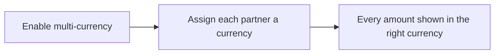
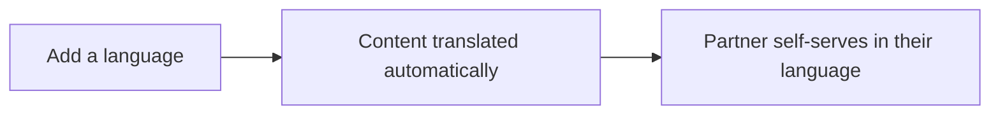

# Introw docs (docs.introw.io): features-localization

Verbatim from docs.introw.io/llms-full.txt, fetched 2026-09-29. 10 pages.

# Localization
Source: https://docs.introw.io/features/localization/index

Serve every partner in their own language and currency - auto-translate portal content and show deals, commissions, and analytics in local currency.

> A partner program is only as good as the experience it gives each partner. Localization lets you run one program that meets partners in their language and their currency, so a reseller in Tokyo and a referral partner in Berlin both feel like the program was built for them.

## The problem it solves

<Pains>
  | Without Introw                   | With Introw                       |
  | -------------------------------- | --------------------------------- |
  | You run one program per region   | One program, every language       |
  | You translate everything by hand | Content translates as you publish |
  | Partners do the currency math    | Each side sees its own currency   |
  | Your brand reads wrong in German | Protected terms stay untranslated |
</Pains>

## Impact

A partner working in your language and your currency is doing unpaid translation before they can start. Take that away and yours is the program they open first.

<Impact>
  for your business

  * **Cost to run**
    One program covers every language and currency, so a new region costs a language setting, not a second content set
  * **Trustworthy**
    Amounts convert on the same exchange rates as your CRM, and protected terms keep your product names intact in every language

  for your partners

  * **Self-serve**
    They pick their language in the portal and every surface follows it, with no translated copy to request from anyone
  * **Enabled**
    Courses, forms and announcements arrive in the language they sell in, which is the difference between started and finished
  * **Efficient**
    Their pipeline and their earnings are already in their own currency, so nothing needs converting before it makes sense

  [A day in the life of your partners](/days-in-the-life)
</Impact>

<Personas>
  * **Partner Operations** - one program that covers every region
  * **Partner Marketing** - brand terms that survive translation
  * **Finance** - converted amounts that reconcile to the CRM
  * **Partners** - their own language, their own currency
</Personas>

## How this area works

Localization is two settings that follow the partner everywhere. Multi-lingual adds the languages your partners speak, from 98 supported, with one default as the fallback. Portal experiences and stages, courses and modules, forms, announcements, certificates, reports, tiers and the emails partners receive are all translated into every active language. A brand glossary holds the terms that must never change. Multi-currency turns on conversion, sets your company base currency and assigns each partner theirs. Deals, commissions, payouts, KPIs and analytics then show both amounts where they differ, converted on rates synced from your CRM.

**Where this sits in a setup.** Add it when a second region joins. Every [setup track](/tracks) can be run in one language and translated later without rebuilding anything.

<Rail>
  * 

    [**Multi-lingual**](./multilingual)

    98 languages, translated as you publish and kept on brand.

    [How to · 4 guides](./multilingual/technical)

  * 

    [**Multi-currency**](./multi-currency)

    Each partner sees their currency, converted from your base.

    [How to · 1 guide](./multi-currency/technical)
</Rail>

Localization covers two capabilities. Multi-lingual lets you add the languages your partners speak, from 98 supported, and set a default. Portal content, courses, forms and emails then appear in each partner's language, translated automatically and kept consistent with a brand glossary. Multi-currency lets you enable currency conversion, set your company base currency, and assign each partner a currency, so deals, commissions, and analytics display in the amounts each side expects.

Both features work the same way operationally: you configure them once, and the right language or currency follows the partner across every surface they touch, on or off the portal.

## Run it from your AI assistant

<Headless>
  * Set Acme's language to French and currency to EUR.
  * Answer this partner's question in Spanish.
</Headless>

---

# Run your program in multiple currencies
Source: https://docs.introw.io/features/localization/multi-currency/guides/enable-multi-currency

Set your base currency, turn on multi-currency, confirm CRM-synced exchange rates, and assign each partner the local currency they work in.

International programs hit the same friction: your team reports in one currency, but partners invoice and get paid in their own. Multi-currency closes that gap end to end - you set the base your team reports in, turn conversion on, confirm the rates Introw pulls from your CRM, then assign each partner the currency they actually use. The result is dual display across pipeline, commissions, and analytics, so every audience sees the number that makes sense to them, all reconciling back to one base.

## What you'll achieve

A program where monetary values show in your base currency and, wherever a partner's currency differs, in the partner's currency too. Conversions use the rates synced from your connected CRM, and each partner sees their pipeline and earnings in the currency they work in.

## Before you start

<Steps>
  <Step title="Confirm you can edit Company settings">
    You need company write access to change the base currency and the multi-currency setting.
  </Step>

  <Step title="Connect your CRM">
    Conversion rates are synced from your connected CRM, not entered by hand. Without a connected CRM there are no rates to convert with.
  </Step>

  <Step title="Decide your base currency">
    Choose the currency your finance team reports and reconciles in. It is the basis for every conversion, so settle it before turning conversion on.
  </Step>
</Steps>

## Watch it

<Tabs>
  <Tab title="Video">
    <video />
  </Tab>

  <Tab title="Click through">
    <iframe />
  </Tab>
</Tabs>

## Steps

### Set your base currency

<Steps>
  <Step title="Open Company settings">
    Go to the **General** tab of [Company settings](https://app.introw.io/settings/company).
  </Step>

  <Step title="Set the company currency">
    Choose your base under **Company currency**.

    * **What it is** - the default currency your program reports in and the basis for every conversion. It anchors analytics and commission rollups.
    * **Why it matters** - changing it later changes the basis for all conversions, so it should be the currency your finance team closes the books in.
    * **How to set it** - pick the reporting currency and save. You can also change the base later from the **Currencies** tab by opening a currency's row menu and choosing **Set as company currency**; the **Default** pill marks whichever currency is current.
  </Step>
</Steps>

### Turn on conversion

<Steps>
  <Step title="Open the Currencies tab">
    From Company settings, open the **Currencies** tab.

    <Frame>
      
    </Frame>
  </Step>

  <Step title="Enable multi-currency support">
    Turn on **Enable multi-currency support**, then choose **Save changes**.

    * **What it is** - the switch that turns on currency conversion and dual-currency display across your program.
    * **Why it matters** - with it off, every value shows in your base currency only; with it on, values also show in a partner's currency wherever it differs from the base.
    * **How to set it** - enable it once your base currency is correct. The setting only persists when you choose **Save changes**.

    <Frame>
      
    </Frame>
  </Step>
</Steps>

### Confirm the CRM-synced rates

<Steps>
  <Step title="Review the rate table">
    With multi-currency on, the **Currencies** tab shows a rate table. Each row lists a **Currency**, its **Conversion rate** from your base, and **Last updated**.

    * **Conversion rate** - the rate Introw uses to convert that currency from your base. It is synced from your connected CRM and is read-only here, so any converted value traces back to the same rate your CRM uses. Hover a rate to see it expressed as one unit of base to the target currency.
    * **Last updated** - when that rate last refreshed from the CRM, so you can judge how current a converted figure is.
    * **Availability** - only currencies that have a rate from your base appear here, and only those can be assigned to partners. A missing currency means your CRM has no rate for it yet.
  </Step>
</Steps>

### Assign each partner a currency

<Steps>
  <Step title="Set a currency on one partner">
    Open a partner from [Partners](https://app.introw.io/partners) and use the **Currency** field on the **Partner Details** card.

    * **What it is** - the currency this partner sees across their pipeline and earnings. The choices are the currencies that have a conversion rate from your base.
    * **Why it matters** - it lets a partner review deals and commissions in the currency they invoice and get paid in, removing guesswork and building trust in the numbers.
    * **How to set it** - choose the partner's currency, or clear it to leave them on the base. When a partner's currency matches the base, no separate partner-currency value is shown.
  </Step>

  <Step title="Set currencies in bulk">
    To assign many partners at once, select partners on the **Partners** list and open the bulk editor, then choose the **Currency** property and the currency to apply.

    * **What it is** - the same partner-currency assignment applied to every selected partner in one action.
    * **Why it matters** - it saves setting each partner individually when a group shares a currency (for example all partners in one region).
    * **How to set it** - pick **Currency** as the property to edit, choose the value, and confirm. The choices are again limited to currencies that have a rate from your base.
  </Step>
</Steps>

## Verify it worked

On the **Currencies** tab, the toggle is on and the rate table lists your available currencies with recent **Last updated** times. Open a partner whose currency differs from the base: their deals and commissions now display in their assigned currency alongside your base currency, and aggregated figures like revenue and commission totals show the converted amount.

## Related

<CardGroup>
  <Card title="Set up portal languages" icon="book-open" href="/features/localization/multilingual/guides/set-up-portal-languages">
    Serve partners in their language too.
  </Card>

  <Card title="Implementation reference" icon="screwdriver-wrench" href="../technical">
    Full configuration options, rates, and limits.
  </Card>
</CardGroup>

---

# Multi-currency
Source: https://docs.introw.io/features/localization/multi-currency/index

Show partners deals, commissions, and analytics in their local currency while your team reports in one base currency, converted with CRM-synced rates.

> A global partner program runs on many currencies. Multi-currency lets each partner see amounts in their own currency while you report in one base currency, with conversions driven by the same rates as your CRM, so the numbers always reconcile.

## The problem it solves

Operating in one currency forces everyone else to do mental math, and mental math erodes trust:

<Pains>
  | Without Introw                      | With Introw                     |
  | ----------------------------------- | ------------------------------- |
  | Partners cannot tell what they earn | Earnings read in their currency |
  | Regional numbers mix currencies     | One base currency to report on  |
  | You convert amounts by hand         | Rates come from your CRM        |
  | Every region keeps a spreadsheet    | One program, both amounts       |
</Pains>

## Impact

Nothing costs a partner's trust faster than a number they have to convert before they believe it. Their currency, on your CRM's rates, is how the earnings conversation stops being an argument.

<Impact>
  for your business

  * **Trustworthy**
    The rate behind a converted amount is the rate finance and sales already use, so a partner's earnings figure survives being checked
  * **In your CRM**
    Exchange rates sync from HubSpot or Salesforce rather than a separate rate table nobody owns

  for your partners

  * **Self-serve**
    Pipeline, commissions, and payouts already read in their currency, with nothing to convert before they can act
  * **Enabled**
    They forecast in the currency they sell in and still see your base amount beside it, so both sides quote the same deal
  * **Efficient**
    No spreadsheet and no rate lookup between reading a number and trusting it

  [A day in the life of your partners](/days-in-the-life)
</Impact>

<Personas>
  * **Finance** - converted commissions that reconcile
  * **Partner sales teams** - earnings in the currency they think in
</Personas>

## See it work

<Tour>
  * 

    **Open settings**

    Currency is one setting, on your company's General tab.

  * 

    **Set your base**

    Pick the one currency your own team reports in.
</Tour>

## How it works

Multi-currency lets you turn on currency conversion, set your company's base currency, and assign each
partner a currency. With it on, monetary values across the program, deal pipeline, commissions,
payouts, KPIs, and analytics, display in both your base currency and the partner's currency where they
differ. Conversions use exchange rates synced from your CRM, so the rate behind a converted number is
the same rate your finance and sales teams already trust.

Partners see their earnings and pipeline in the currency they think in, and your team keeps a single
base currency for consistent reporting, without anyone doing manual conversion in a spreadsheet.

Enable multi-currency, set your base currency, and give each partner a currency. From then on, every
monetary surface shows the right amount to the right audience, converted with rates that match your
CRM, so partners trust their numbers and finance trusts the rollup.

## Run it from your AI assistant

<Headless>
  * Set Acme's currency to EUR.
  * Show Acme's commissions in their local currency.
</Headless>

## Going deeper

<CardGroup>
  <Card title="How to" icon="screwdriver-wrench" href="./technical">
    Setup, configuration, and all how-to guides.
  </Card>

  <Card title="API reference" icon="code" href="/general/introduction">
    Integration surface and code.
  </Card>
</CardGroup>

**Works with**

<CardGroup>
  <Card title="Payouts" icon="hand-holding-dollar" href="/features/commissions/payouts">
    Pay partners in their own currency.
  </Card>

  <Card title="Quotes & Line Items" icon="file-invoice-dollar" href="/features/cpq/quotes">
    Quote in local currency.
  </Card>
</CardGroup>

---

# Multi-currency
Source: https://docs.introw.io/features/localization/multi-currency/technical/index

Enable multi-currency, set your company base currency, assign partner currencies, and understand how conversion rates stay in sync in Introw.

## Where it lives

Multi-currency sits under **Settings**, at [Currencies](https://app.introw.io/settings/company/currency).

<Frame>
  
</Frame>

## Before you start

| You need             | Why                              | Fix it                                                                            |
| -------------------- | -------------------------------- | --------------------------------------------------------------------------------- |
| Company write access | Currencies are a company setting | [Internal roles](/features/access/team-management/guides/create-an-internal-role) |
| A connected CRM      | It supplies the exchange rates   | [Connect a CRM](/features/integrations/crm/guides/connect-hubspot)                |

## How it works

You set your company's base currency in Company settings, then enable multi-currency on the Currencies
tab. Once on, you assign each partner a currency on their partner record. Across the program, monetary
values display in your base currency and, where a partner's currency differs, in the partner's currency
too.

Conversion rates are synced from your connected CRM rather than entered by hand, so the rate behind any
converted value matches what your CRM uses. The Currencies tab shows the rates that are available and
when they were last updated. The partner currencies you can choose from are the ones that have a
conversion rate from your base currency.

### How conversion rates work

Rates are read-only in Introw: you cannot type or override them here, because they are pulled from your
connected CRM. That is deliberate, so converted commissions and pipeline always reconcile back to the
same source your finance and sales teams already trust. To check a rate, open the Currencies tab and
read the rate table: each row shows a currency, its conversion rate from your base, and when it last
refreshed from the CRM. Hovering a rate expresses it as one unit of your base currency in the target
currency, and the Last updated time tells you how current a converted figure is. A currency only
becomes available, both in the table and for assigning to partners, once your CRM has a rate from your
base currency to it; if a currency is missing, the CRM simply has no rate for it yet. To trace any
converted value, match it to the rate shown for that currency on this table.

## Settings & configuration

Currency is managed on the Currencies tab of [Company settings](https://app.introw.io/settings/company/currency),
with the base currency on the General tab.

### Company currency

On the General tab of Company settings, **Company currency** sets your default base currency. This is
the currency your program reports in and the basis for every conversion. Changing it updates the base
used across analytics and commissions.

### Enable multi-currency support

On the Currencies tab, **Enable multi-currency support** turns conversion and dual-currency display on.
With it off, all values show in your base currency only. With it on, values also show in a partner's
currency wherever it differs from the base.

### Conversion rates

The Currencies tab lists currencies with their **Conversion rate** and **Last updated** time. These
rates are synced from your connected CRM and are not edited here; the table is a read-only view so you
can confirm which currencies are available and how current the rates are. The **Default** pill marks
your base currency.

### Partner currency

Each partner's currency is set on their record, on the partner detail page or the partners list, and
can be updated in bulk. The currencies you can assign are those with a conversion rate from your base
currency. When a partner's currency matches the base, no separate partner-currency value is shown.

## How-to guides

<Rail>
  * 

    [**Run your program in multiple currencies**](/features/localization/multi-currency/guides/enable-multi-currency)

    Set your base currency, turn on multi-currency, confirm CRM-synced exchange rates, and assign each partner the local currency they work in.
</Rail>

## Troubleshooting

<Warning>
  Conversion rates come from your connected CRM and are not edited in Introw, so a missing currency usually means the CRM has no rate for it. Conversions apply to aggregated figures like revenue and commission totals; individual records display in their own native currency. Changing your base currency changes the basis for all conversions, so do it deliberately.
</Warning>

<AccordionGroup>
  <Accordion title="A currency is not available to assign to a partner">
    It needs a conversion rate from your base currency, which is synced from the CRM.
  </Accordion>

  <Accordion title="Converted values look stale">
    Check the Last updated time on the rate table; rates refresh from the CRM.
  </Accordion>

  <Accordion title="Partner currency is not showing">
    Confirm multi-currency is enabled and the partner's currency differs from the base.
  </Accordion>
</AccordionGroup>

---

# Control which experiences get translated
Source: https://docs.introw.io/features/localization/multilingual/guides/enable-multilingual-for-an-experience

Turn automatic translation on or off for a specific partner portal experience so you control which audiences see localized content in their language.

Once you have active languages, every partner-facing experience is translated by default. That is usually what you want, but some portals, like a region-specific experience that should stay in one language, need to opt out. This guide shows how to flip translation on or off for a single experience, so you translate broadly while keeping control exactly where it matters.

## What you'll achieve

A specific portal experience that either participates in your program's translation (arriving in each partner's language) or is deliberately held to a single language, decided independently of every other experience.

## Before you start

<Steps>
  <Step title="Add your languages first">
    Languages must be active before an experience can be translated into them. Set them up under [Languages](https://app.introw.io/settings/languages) (see [Set up portal languages](./set-up-portal-languages)).
  </Step>

  <Step title="Have the experience built">
    You need an experience to configure. Create one in the [Experience builder](https://app.introw.io/templates) first.
  </Step>
</Steps>

## Steps

<Steps>
  <Step title="Open the experience">
    Go to the [Experience builder](https://app.introw.io/templates) and open the experience you want to configure.
  </Step>

  <Step title="Open its settings">
    Open the experience's settings dialog from the builder. This is where per-experience behavior, including translation participation, is controlled.
  </Step>

  <Step title="Set the multilingual toggle">
    Use **Enable multilingual for this experience** to decide whether this experience is translated.

    * **What it is** - a per-experience switch that includes or excludes this single experience from your program's automatic translation. When on, the experience is translated into the languages configured in your **Languages** settings; when off, it stays in one language regardless of how many locales are active.
    * **Why it matters** - it lets you keep most portals multilingual while pinning a specific one (for example a single-market or single-language partner experience) to one language, without touching your org-wide language list.
    * **How to set it** - leave it on for partner-facing portals that should follow each partner's language; turn it off only for an experience that must stay single-language. The change saves as you toggle it.
  </Step>
</Steps>

## Verify it worked

Preview the experience in another language. With the toggle on, partner-facing content appears translated; with it off, the experience stays in its single language even for partners whose language differs.

## Related

<CardGroup>
  <Card title="Set up portal languages" icon="book-open" href="./set-up-portal-languages">
    Add the languages to translate into.
  </Card>

  <Card title="Build and publish a portal experience" icon="book-open" href="/features/portal/experiences/guides/build-and-publish-a-portal-experience">
    Create the experience first.
  </Card>

  <Card title="Implementation reference" icon="screwdriver-wrench" href="../technical">
    Full configuration options.
  </Card>
</CardGroup>

---

# Keep your brand correct in every language
Source: https://docs.introw.io/features/localization/multilingual/guides/manage-the-brand-glossary

Define protected terms in the brand glossary so product names, trademarks, and key vocabulary are never mistranslated across your partner portal languages.

Automatic translation is fast, but product names, feature names, and trademarks should never be translated, or should always use one approved wording. The brand glossary enforces that across every language at once, so partners never see a mangled product name and your brand reads the way you intend in each locale. Set it up once and it applies to all future translations.

## What you'll achieve

A list of protected terms that automatic translation always honors: each term is either kept exactly as-is in every language, or replaced with the specific wording you supply per language. Your brand stays consistent everywhere partners read it.

## Before you start

<Steps>
  <Step title="Add your languages first">
    Glossary rules apply across your active languages, so add them under [Languages](https://app.introw.io/settings/languages) first (see [Set up portal languages](./set-up-portal-languages)).
  </Step>

  <Step title="List your protected terms">
    Gather the product names, feature names, and trademarks that must stay consistent, plus any term that needs a specific approved translation per language.
  </Step>
</Steps>

## Watch it

<Tabs>
  <Tab title="Video">
    <video />
  </Tab>

  <Tab title="Click through">
    <iframe />
  </Tab>
</Tabs>

## Steps

<Steps>
  <Step title="Open the brand glossary">
    Go to [Languages](https://app.introw.io/settings/languages) and find the **Brand glossary and protected terms** section below **Manage translations**. It lists any terms you have already protected, with their rule and description.

    <Frame>
      
    </Frame>
  </Step>

  <Step title="Add a protected term">
    Select **Add protected term** to open the entry form, then fill it in.

    * **Source term** - the exact word or phrase to protect (for example your product or feature name). This is what translation looks for in your content. Enter it as it appears in your source language.
    * **Description** - an optional note explaining the term, shown alongside it in the list to help your team keep entries clear.

    <Frame>
      
    </Frame>
  </Step>

  <Step title="Choose how the term is handled">
    Pick the rule that governs the term in every language.

    * **Do not translate** - keeps the source term exactly as written everywhere. Use this for trademarks and product names that must read identically in all languages.
    * **Specific translation** - lets you supply the exact approved wording per active language, instead of letting translation decide. Use this when a term should be localized, but only to wording your brand has signed off on. Fill in the wording for each language you want to control; languages you leave blank fall back to the source term.

    <Frame>
      
    </Frame>
  </Step>

  <Step title="Save the entry">
    Save the entry. It appears in the glossary list with its rule, and applies to all future translations. Repeat for each term you need to protect; you can edit or delete any entry later from its row menu.

    <Frame>
      
    </Frame>
  </Step>
</Steps>

## Verify it worked

The protected term appears in the **Brand glossary and protected terms** list with the rule you set. Newly translated partner-facing content keeps "Do not translate" terms unchanged and uses your approved wording for "Specific translation" terms.

## Related

<CardGroup>
  <Card title="Set up portal languages" icon="book-open" href="./set-up-portal-languages">
    Add the languages your glossary protects.
  </Card>

  <Card title="Translate an asset" icon="book-open" href="./translate-an-asset">
    Localize files in the library.
  </Card>

  <Card title="Implementation reference" icon="screwdriver-wrench" href="../technical">
    Full configuration options.
  </Card>
</CardGroup>

---

# Set up the languages your partners see
Source: https://docs.introw.io/features/localization/multilingual/guides/set-up-portal-languages

Add the locales your partners speak, set a fallback default language, and control how each partner is automatically served the right portal language.

Serving partners in their own language is the difference between a portal they actually use and one they tolerate. This is the one-time setup that turns a single-language program into a multilingual one: you add the locales your partners speak, choose the fallback everyone falls back to, and decide how each partner gets matched to a language. Do it once and every partner-facing surface, from the portal to the emails they receive, starts arriving in the right language automatically.

## What you'll achieve

A partner program that runs in several languages: each active language is available across your partner-facing content, a default language catches anyone without a preference, and every partner is either matched to a language automatically or pinned to the one you choose. Partners open the portal and see it in their language without asking.

## Before you start

<Steps>
  <Step title="Confirm you can edit languages">
    You need languages write access to add, remove, or set a default language.
  </Step>

  <Step title="Check your language allowance">
    Your plan caps how many languages can be active at once. If you are already at the cap, the **Add language** button is replaced by an upgrade prompt, so plan which locales matter most before you start.
  </Step>

  <Step title="Know the difference between automatic and file translation">
    Portal text translates automatically once a language is active. Files in the asset library are localized separately and, for automatic document translation, depend on a translation provider being configured for your workspace. Plain language activation here does not require a provider.
  </Step>
</Steps>

## Watch it

<Tabs>
  <Tab title="Video">
    <video />
  </Tab>

  <Tab title="Click through">
    <iframe />
  </Tab>
</Tabs>

## Steps

### Add and default your languages

<Steps>
  <Step title="Open Languages">
    Go to [Languages](https://app.introw.io/settings/languages). The **Manage translations** section lists your active locales, and the **Brand glossary and protected terms** section sits below it. If you have not added any locales yet, you see an empty state prompting you to add your first language.

    <Frame>
      
    </Frame>
  </Step>

  <Step title="Add each language your partners speak">
    Select **Add language** to open the **Add language** dialog, pick a locale from the [98 supported languages](../technical#supported-languages), and confirm with **Add**.

    * **Language** - the locale to activate, chosen from Introw's [98 supported languages](../technical#supported-languages). Each one you add becomes available across your partner-facing content, and existing content starts translating into it in the background. Add one row per market you serve (for example German, French, Spanish); only languages you have not already added appear in the picker.
    * **Allowance** - the count of active languages is capped by your plan. When you reach the cap the **Add language** button becomes an upgrade prompt instead, so add the languages that cover the most partners first.

    Repeat until every market your partners come from is represented.

    <Frame>
      
    </Frame>
  </Step>

  <Step title="Set the default (fallback) language">
    On the language you want as the program-wide fallback, open its row menu (the three-dot menu) and choose **Set as default**. The **Default** pill moves to that language.

    * **What it is** - the language a partner sees when they have no language of their own set, and the one partners fall back to if their language is later removed.
    * **Why it matters** - it is the safety net for your entire program, so it should be the language the largest share of your partners, or your own team, reads most comfortably.
    * **How to set it** - pick the single language that best covers partners without a stated preference. The default cannot be deleted while it holds that role; set a new default first if you need to remove the current one.

    <Frame>
      
    </Frame>
  </Step>

  <Step title="Remove a language you no longer need (optional)">
    To retire a locale, open its row menu and choose **Delete**. A confirmation warns that any partner currently experiencing the portal in that language will switch to your default. Removing a language stops new content from being translated into it.
  </Step>
</Steps>

### Keep the company default in sync

<Steps>
  <Step title="Confirm the organisation language on Company settings">
    Open the **General** tab of **Company settings**. The **Language** field sets your organisation's default language for internal settings and reports, and it stays in step with the default you chose under **Manage translations**.

    * **Language** - the organisation-level default used for internal-facing settings and reporting. Keep it aligned with the program default you set on the **Languages** screen so internal numbers and the partner fallback read the same way. A **Manage language settings** link here jumps straight back to the **Languages** screen.
  </Step>
</Steps>

### Decide how each partner is served

<Steps>
  <Step title="Set a language on a specific partner">
    Open a partner from [Partners](https://app.introw.io/partners) and use the **Language** field on the **Partner Details** card to pin that partner to a locale.

    * **What it is** - the language this partner's contacts see by default across the portal and notifications. The list offers your active languages, and when no language is set the partner falls back to your organisation default.
    * **Why it matters** - it lets you override the fallback for a partner whose team works in a specific language, without changing anything program-wide.
    * **How to set it** - choose the partner's preferred locale, or leave it unset to let them use the default. Set it when you know a partner's working language up front (for example a regional reseller).
  </Step>

  <Step title="Let partner contacts choose for themselves">
    Individual partner contacts can switch their own language from the account menu in the portal. Their choice applies to what they personally see, layered on top of the partner-level language you set. You do not need to configure anything for this - it is available to partners automatically once you have more than one active language.

    <Frame>
      
    </Frame>
  </Step>
</Steps>

## Verify it worked

Each language you added appears in the **Manage translations** list with the **Default** pill on your chosen fallback. Open the portal (or preview it) and switch languages to confirm partner-facing content arrives translated. A partner with a language set on their record sees the portal in that language on their next visit, and partners without one see your default.

## Related

<CardGroup>
  <Card title="Enable multilingual for an experience" icon="book-open" href="./enable-multilingual-for-an-experience">
    Control which portals get translated.
  </Card>

  <Card title="Manage the brand glossary" icon="book-open" href="./manage-the-brand-glossary">
    Protect product and brand terms across languages.
  </Card>

  <Card title="Translate an asset" icon="book-open" href="./translate-an-asset">
    Localize files in the asset library.
  </Card>

  <Card title="Implementation reference" icon="screwdriver-wrench" href="../technical">
    Full configuration options.
  </Card>
</CardGroup>

---

# Localize a file in the asset library
Source: https://docs.introw.io/features/localization/multilingual/guides/translate-an-asset

Add translated versions to an asset in the Introw library so partners download sales collateral, decks, and PDFs in their own language from the portal.

Portal text translates automatically, but files like PDFs and decks need their own localized versions. Adding language versions to an asset means a partner downloads collateral in the language they actually work in, keeping your enablement material as localized as the portal around it. You can upload a ready-made translation, link to one, or auto-generate it when a translation provider is configured.

## What you'll achieve

A library asset with a version per active language: partners are served the version that matches their language, and fall back to the original where no translation exists.

## Before you start

<Steps>
  <Step title="Add your languages first">
    The asset offers translations for your active languages, so set them up under [Languages](https://app.introw.io/settings/languages) first (see [Set up portal languages](./set-up-portal-languages)).
  </Step>

  <Step title="Add the original file">
    The source file must already be in the asset library before you can localize it.
  </Step>

  <Step title="Check automatic translation availability (optional)">
    Auto-generating document translations requires a translation provider configured for your workspace, and works only for document file types (PDF, Office, TXT, and HTML). Uploading or linking a translated file works without a provider.
  </Step>
</Steps>

## Steps

<Steps>
  <Step title="Open the asset's languages">
    From the [asset library](https://app.introw.io/assets/library), open the asset and go to its **Languages** section. It shows the original file plus a slot for each active language that does not yet have a translation.

    <Frame>
      
    </Frame>
  </Step>

  <Step title="Add a translation manually">
    Use **Add translation** to provide a localized version for a language.

    * **Upload a file** - for file-based assets, pick the target language and upload the translated file (up to the asset size limit). The version is stored against that language.
    * **Add a translation link** - supply a direct URL to the translated file or page for a language. Use this when the localized version lives elsewhere. Enter a valid link; Introw derives the file name from it.

    Choose the language, provide the file or link, and the version is saved against that locale.
  </Step>

  <Step title="Generate translations automatically (optional)">
    For eligible document assets, use **Generate translations** to translate the file into the languages that do not yet have a version, then confirm in the dialog.

    * **When it is available** - the action is enabled only when a translation provider is configured and the file is a supported document type (PDF, Office, TXT, or HTML). If it is greyed out, the tooltip explains why (no provider, unsupported type, or every language already covered).
    * **What it does** - queues a translation per missing language; each shows progress while it runs and becomes a downloadable version when done. A failed language is flagged so you can retry or add that one manually.
  </Step>

  <Step title="Review and manage the versions">
    Each language version appears as its own card with a language pill. Use a version's menu to **Replace file** or **Edit link**, or **Remove translation** to delete a version. The original stays in place as the fallback.
  </Step>
</Steps>

## Verify it worked

The asset's **Languages** section lists a version per language you added, and partners are served the version for their language when they open or download the asset, falling back to the original where none exists.

## Related

<CardGroup>
  <Card title="Manage the brand glossary" icon="book-open" href="./manage-the-brand-glossary">
    Keep terms consistent across translations.
  </Card>

  <Card title="Build the asset library" icon="book-open" href="/features/content/asset-library/guides/build-the-asset-library">
    Add the original file first.
  </Card>

  <Card title="Implementation reference" icon="screwdriver-wrench" href="../technical">
    Full configuration options.
  </Card>
</CardGroup>

---

# Multi-lingual
Source: https://docs.introw.io/features/localization/multilingual/index

Run one partner program in every language your partners speak - portal content, courses, forms, and emails translate automatically and stay on brand.

> Partners engage when the program speaks their language. Multi-lingual translates your partner-facing content automatically, so every partner reads, learns, and acts in the language they think in, without you running a separate program per region.

## The problem it solves

A single-language program quietly caps adoption everywhere outside your headquarters:

<Pains>
  | Without Introw                      | With Introw                          |
  | ----------------------------------- | ------------------------------------ |
  | Partners skip what they cannot read | Everything arrives in their language |
  | Translating a library by hand fails | Translation happens as you publish   |
  | Your product names get translated   | A glossary protects your terms       |
  | A new region means a new program    | One program, every language          |
</Pains>

## Impact

Partners give their attention to whichever vendor is easiest to work with, and reading in a second language is not easy. Speaking theirs is the cheapest advantage you can buy.

<Impact>
  for your business

  * **No new tool**
    The emails, forms, and announcements partners already receive arrive translated, so nothing waits on them opening a portal
  * **Cost to run**
    Adding a market means adding a language, not duplicating a content library and staffing someone to keep it current

  for your partners

  * **Self-serve**
    They set their own language in the portal, and everything from a course to a certificate follows it
  * **Enabled**
    Training lands in the language they sell in, which is most of the difference between a course started and one finished
  * **Efficient**
    No waiting on a localized version, and no translating your content themselves before they can use it

  [A day in the life of your partners](/days-in-the-life)
</Impact>

<Personas>
  * **Partner Marketing** - one library, every language, on brand
  * **Partner Operations** - a new region is a language setting
  * **Partners** - the whole program in their own language
</Personas>

## See it work

<Tour>
  * 

    **Add languages**

    Add the languages your partners speak, from 98 supported.

  * 

    **Set a fallback**

    One default catches anyone whose language you have not added.

  * 

    **Protect your terms**

    Pick the words that must never be translated.
</Tour>

## How it works

Multi-lingual lets you add the languages your partners speak, from 98 supported languages, and
pick a default. Once a language is active, partner-facing content translates into it automatically:
portal experiences and stages, courses and modules, forms, announcements, certificates, reports,
tiers, and the emails partners receive. Partners choose their language in the portal, or you set it
for them, and every surface follows.

Translations are generated for you and kept consistent with a brand glossary, so product names and
key terms are never mistranslated. You stay in control of which languages exist and how your brand
reads in each one, without copy-pasting content into a translation tool.

Add a language once and your existing content, and everything you publish after, becomes available in
it. Partners self-serve in their own language across the portal and their inbox, and your team
maintains one program instead of one per region.

## Run it from your AI assistant

<Headless>
  * Answer this partner's question in Spanish.
  * Set Acme's portal language to German.
</Headless>

## Going deeper

<CardGroup>
  <Card title="How to" icon="screwdriver-wrench" href="./technical">
    Setup, configuration, and all how-to guides.
  </Card>

  <Card title="API reference" icon="code" href="/general/introduction">
    Integration surface and code.
  </Card>
</CardGroup>

**Works with**

<CardGroup>
  <Card title="Experiences" icon="browser" href="/features/portal/experiences">
    Serve the portal in each language.
  </Card>

  <Card title="Course Authoring" icon="graduation-cap" href="/features/courses/authoring">
    Translate course content.
  </Card>
</CardGroup>

---

# Multi-lingual
Source: https://docs.introw.io/features/localization/multilingual/technical/index

Add partner portal languages, set a default locale, manage a brand glossary of protected terms, and control which experiences get auto-translated.

## Where it lives

Multi-lingual sits under **Settings**, at [Languages](https://app.introw.io/settings/languages).

<Frame>
  
</Frame>

## Before you start

| You need                        | Why                             | Fix it                                                                            |
| ------------------------------- | ------------------------------- | --------------------------------------------------------------------------------- |
| Languages write access          | To add and translate a language | [Internal roles](/features/access/team-management/guides/create-an-internal-role) |
| Language allowance on your plan | It caps how many you add        | **Request access**                                                                |

## How it works

You manage languages from one place: the Languages settings. There you add the locales your partners
speak, choose a default, and define a brand glossary of protected terms. Once a language is active,
Introw translates partner-facing content into it automatically in the background, reusing previous
translations for consistency and applying your glossary rules.

Partners get content in their language by either choosing it themselves in the portal account menu or
having it set on their partner record. Each portal experience participates in translation by default,
and you can exclude a specific experience if it should stay single-language. Files in the asset
library are translated separately, on each asset.

## Supported languages

Introw supports **98 languages**. Any of them can be added under **Languages**: your plan caps how
many are active at the same time, not which ones you can pick from. English (US) (`EN-US`) is the
default until you set another.

English, Spanish and Portuguese come as two regional variants each, English (US) and English (UK),
Spanish (Spain) and Spanish (Latin America), Portuguese (Portugal) and Portuguese (Brazil), so
choose the one your partners actually read.

<AccordionGroup>
  <Accordion title="All 98 supported languages" icon="language">
    Codes are the values Introw stores on your organisation and on each partner record.

    | Language                | Code     |
    | ----------------------- | -------- |
    | Afrikaans               | `AF`     |
    | Albanian                | `SQ`     |
    | Aragonese               | `AN`     |
    | Armenian                | `HY`     |
    | Assamese                | `AS`     |
    | Aymara                  | `AY`     |
    | Azerbaijani             | `AZ`     |
    | Bashkir                 | `BA`     |
    | Basque                  | `EU`     |
    | Belarusian              | `BE`     |
    | Bengali                 | `BN`     |
    | Bosnian                 | `BS`     |
    | Breton                  | `BR`     |
    | Bulgarian               | `BG`     |
    | Burmese                 | `MY`     |
    | Catalan                 | `CA`     |
    | Chinese                 | `ZH`     |
    | Croatian                | `HR`     |
    | Czech                   | `CS`     |
    | Danish                  | `DA`     |
    | Dutch                   | `NL`     |
    | English (UK)            | `EN-GB`  |
    | English (US)            | `EN-US`  |
    | Esperanto               | `EO`     |
    | Estonian                | `ET`     |
    | Finnish                 | `FI`     |
    | French                  | `FR`     |
    | Galician                | `GL`     |
    | Georgian                | `KA`     |
    | German                  | `DE`     |
    | Greek                   | `EL`     |
    | Guarani                 | `GN`     |
    | Gujarati                | `GU`     |
    | Haitian Creole          | `HT`     |
    | Hausa                   | `HA`     |
    | Hindi                   | `HI`     |
    | Hungarian               | `HU`     |
    | Icelandic               | `IS`     |
    | Igbo                    | `IG`     |
    | Indonesian              | `ID`     |
    | Irish                   | `GA`     |
    | Italian                 | `IT`     |
    | Japanese                | `JA`     |
    | Javanese                | `JV`     |
    | Kazakh                  | `KK`     |
    | Korean                  | `KO`     |
    | Kyrgyz                  | `KY`     |
    | Latin                   | `LA`     |
    | Latvian                 | `LV`     |
    | Lingala                 | `LN`     |
    | Lithuanian              | `LT`     |
    | Luxembourgish           | `LB`     |
    | Macedonian              | `MK`     |
    | Malagasy                | `MG`     |
    | Malay                   | `MS`     |
    | Malayalam               | `ML`     |
    | Maltese                 | `MT`     |
    | Maori                   | `MI`     |
    | Marathi                 | `MR`     |
    | Mongolian               | `MN`     |
    | Nepali                  | `NE`     |
    | Norwegian (bokmål)      | `NB`     |
    | Occitan                 | `OC`     |
    | Oromo                   | `OM`     |
    | Polish                  | `PL`     |
    | Portuguese (Brazil)     | `PT-BR`  |
    | Portuguese (Portugal)   | `PT-PT`  |
    | Punjabi                 | `PA`     |
    | Quechua                 | `QU`     |
    | Romanian                | `RO`     |
    | Russian                 | `RU`     |
    | Sanskrit                | `SA`     |
    | Serbian                 | `SR`     |
    | Sesotho                 | `ST`     |
    | Slovak                  | `SK`     |
    | Slovenian               | `SL`     |
    | Spanish (Latin America) | `ES-419` |
    | Spanish (Spain)         | `ES`     |
    | Sundanese               | `SU`     |
    | Swahili                 | `SW`     |
    | Swedish                 | `SV`     |
    | Tagalog                 | `TL`     |
    | Tajik                   | `TG`     |
    | Tamil                   | `TA`     |
    | Tatar                   | `TT`     |
    | Telugu                  | `TE`     |
    | Thai                    | `TH`     |
    | Tsonga                  | `TS`     |
    | Tswana                  | `TN`     |
    | Turkish                 | `TR`     |
    | Turkmen                 | `TK`     |
    | Ukrainian               | `UK`     |
    | Uzbek                   | `UZ`     |
    | Vietnamese              | `VI`     |
    | Welsh                   | `CY`     |
    | Wolof                   | `WO`     |
    | Xhosa                   | `XH`     |
    | Zulu                    | `ZU`     |
  </Accordion>
</AccordionGroup>

## How-to guides

<Rail>
  * [**Control which experiences get translated**](/features/localization/multilingual/guides/enable-multilingual-for-an-experience)

    Turn automatic translation on or off for a specific partner portal experience so you control which audiences see localized content in their language.

  * 

    [**Keep your brand correct in every language**](/features/localization/multilingual/guides/manage-the-brand-glossary)

    Define protected terms in the brand glossary so product names, trademarks, and key vocabulary are never mistranslated across your partner portal languages.

  * 

    [**Set up the languages your partners see**](/features/localization/multilingual/guides/set-up-portal-languages)

    Add the locales your partners speak, set a fallback default language, and control how each partner is automatically served the right portal language.

  * [**Localize a file in the asset library**](/features/localization/multilingual/guides/translate-an-asset)

    Add translated versions to an asset in the Introw library so partners download sales collateral, decks, and PDFs in their own language from the portal.
</Rail>

## Troubleshooting

<Warning>
  Your plan limits how many languages can be active at once. Translations are generated automatically and may take a short while to appear after you publish or change content. The brand glossary applies across languages, so keep it focused on terms that must never vary.
</Warning>

<AccordionGroup>
  <Accordion title="A new language is not available to partners">
    Confirm it is added and active under Languages.
  </Accordion>

  <Accordion title="A term is being mistranslated">
    Add it to the brand glossary with the correct rule.
  </Accordion>

  <Accordion title="An experience is not translating">
    Check that multilingual is enabled in its settings dialog.
  </Accordion>

  <Accordion title="An asset has no translated version">
    Translations for files are added per asset on its Languages tab.
  </Accordion>
</AccordionGroup>