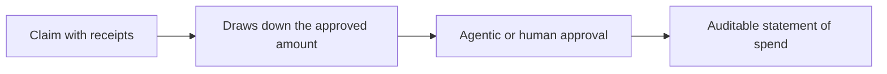
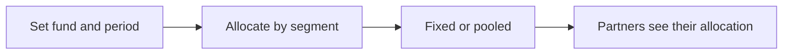
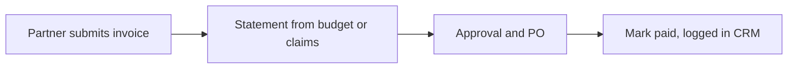
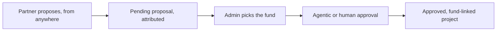
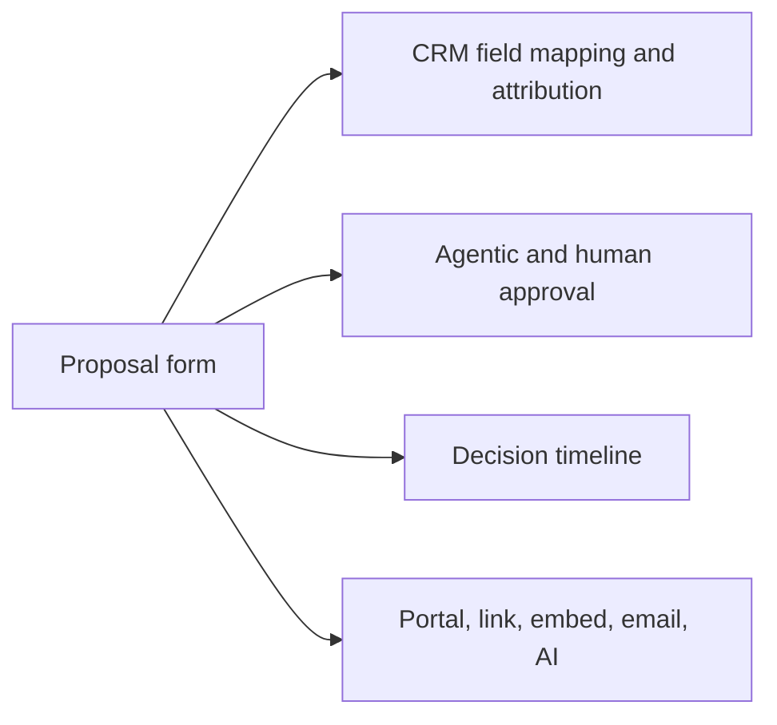
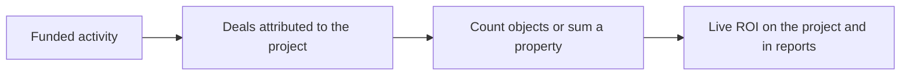

# Introw docs (docs.introw.io): features-mdf

Verbatim from docs.introw.io/llms-full.txt, fetched 2026-09-29. 23 pages.

# Market Development Funds
Source: https://docs.introw.io/features/mdf/index

Run MDF end to end on your CRM: allocate budgets, collect proposals, approve, gather proof of spend, prove ROI, and reimburse with partner attribution.

> Market Development Funds is how you put co-marketing money to work and prove it paid off. Allocate budgets to partners, let them propose projects, collect proof of spend, track ROI against real pipeline, and reimburse - every step a no-code form with its own approval flow, wired to your CRM, and workable from anywhere. Most MDF programs die in spreadsheets and email threads; this one is a governed, auditable, collaborative lifecycle.

## The problem it solves

<Pains>
  | Without Introw                  | With Introw                                 |
  | ------------------------------- | ------------------------------------------- |
  | Requests arrive by email        | A form with an owner and a deadline         |
  | Approvals depend on who replies | Approvers in order, AI clears the easy ones |
  | You chase receipts for weeks    | A deadline both sides can see               |
  | Nobody knows what it returned   | Results land next to the spend              |
</Pains>

## Impact

A partner asked to co-fund marketing is weighing your program against every other vendor's. Being the one that answers on a deadline, and where the money actually follows, is how you get their budget next quarter.

<Impact>
  for your business

  * **In your CRM**
    Requests, approvals, receipts and results all land on CRM records, so the spend and the pipeline it produced sit side by side
  * **Cost to run**
    The lifecycle runs itself: no spreadsheet to maintain, no chasing over email, no reconciliation at quarter end
  * **AI, not admin**
    AI reviews the routine submissions and clears them above a threshold you set, so your team only sees the ones that need judgement
  * **No new tool**
    Partners request, claim and report from wherever they already work, and never have to learn your budget structure

  for your partners

  * **Self-serve**
    One form to ask for funding, and they never need to know which of your budgets it should come out of
  * **Enabled**
    They can see where their request stands, what was approved and what is due next, without asking
  * **Efficient**
    Claims and invoices go in against a deadline that was stated up front, not a reminder email in week six

  [A day in the life of a co-sell partner](/days-in-the-life/co-sell-partner)
</Impact>

<Personas>
  * **Partner Marketing** - a budget they can spend and defend
  * **Partner Operations** - a lifecycle that runs itself
  * **Finance** - an approval trail behind every payment
  * **Partners** - one form, a clear answer, and money that arrives
</Personas>

## How this area works

A fund holds a budget for a period and decides which steps run. A partner proposes an activity, it is approved, they run it, they submit proof of what they spent and what it returned, and they are reimbursed. Every step is a form you build without code, so the whole chain lands in your CRM as it happens.

**Where this sits in a setup.** MDF is a later-stage motion for programs with joint marketing budget. The [co-sell](/tracks/co-sell) and [distributor](/tracks/distributor) tracks add it once partners are already producing.

<Rail>
  * 

    [**Funds Allocation**](./funds-allocation)

    Create funds and allocate budget to partners by segment.

    [How to · 1 guide](./funds-allocation/technical)

  * 

    [**Projects**](./projects)

    The request form, the approvers, and the shared workspace.

    [How to · 2 guides](./projects/technical)

  * 

    [**Claims**](./claims)

    Collect claims with receipts that draw down the budget.

    [How to · 1 guide](./claims/technical)

  * 

    [**ROI**](./roi)

    What it returned, on the same record as the spend.

    [How to · 1 guide](./roi/technical)

  * 

    [**Invoices**](./invoices)

    Generate reimbursement statements and mark projects paid.

    [How to · 1 guide](./invoices/technical)
</Rail>

MDF in Introw is a full lifecycle, and each stage is its own building block you enable, customize, and govern:

Every stage is a **no-code form** with its own CRM automations and approval, and every project is a **real-time collaborative workspace** the partner and your team share.

## Every step is a form, an approval, a project, and a timeline

Four things are true of every stage, which is what makes the program governable:

<CardGroup>
  <Card title="No-code forms with CRM automations" icon="table-list">
    Each step is a form you build without code, mapped to CRM objects and properties, so a submission lands as a clean, attributed record.
  </Card>

  <Card title="Agentic and human approval" icon="user-check">
    Every form can auto-approve with an AI review above a certainty threshold, and route the rest through multiple sequential human approval steps.
  </Card>

  <Card title="A real-time collaborative project" icon="comments">
    Every project is a shared workspace where partners and your team comment, share files, and resolve questions together, live.
  </Card>

  <Card title="A timeline on every project" icon="timeline">
    Each step carries a deadline (decision, claim, ROI, invoice), so everyone knows what is due and when, with overdue warnings.
  </Card>
</CardGroup>

## Enable only the stages you use

MDF is not all-or-nothing. Each stage after the proposal can be turned on or off per your policy: proof of expense, ROI, invoicing. A simple program is proposal-and-approve; a strict one runs the full proof-and-reimburse chain. You decide the shape.

## One generic intake, your team picks the fund

Bigger programs run several funds at once, but a partner shouldn't have to know which budget their idea belongs to. Introw separates **intake** from **funding**:

* **A single generic intake** - embed one "Request marketing funds" block (or share one link) that isn't tied to any fund. Partners describe the activity and the amount; they never choose a budget.
* **It's just a normal request** - the submission lands in the MDF requests inbox like any proposal. A room admin **picks the marketing fund from a dropdown** on the request. **Accept stays disabled until a fund is picked**; collaborate, return and decline still work. Accepting creates the approved, fund-linked project through the same automation as a fund-specific request.
* **Change it any time** - a room admin can change the fund from the request's **Edit** dialog, on the pending submission or the running MDF request. The change cascades to its claims, ROI and invoices. Room visitors can never change the fund.

Under the hood the generic intake is still an `MDF_REQUEST` form tagged **Generic**, so its submissions flow into the same MDF inbox and lifecycle as fund-specific proposals.

## Run it from your AI assistant

<Headless>
  * How much MDF budget does Acme still have available this quarter?
  * Submit an MDF proposal for Acme: \$5k for a regional field event.
  * Show every MDF proposal and claim still pending approval.
  * What ROI have partners reported against the Q2 fund?
</Headless>

---

# Configure the claim step
Source: https://docs.introw.io/features/mdf/claims/guides/configure-the-claim-form

Configure the MDF claim step: build the claim form with proof-of-spend upload, set CRM automations, approval gates, and the submission window.

> The claim step is where a partner proves what they spent. Configuring it decides what proof they attach, how the claim lands in your CRM, who approves it, and how long they have. This guide sets up the whole step from the fund's edit mode.

Proof of expense is what reimbursement rests on, so the claim step deserves a deliberate setup: a form that captures the amount and the receipts, a CRM automation that records the claim against the project, approval gates that clear the routine claims and route the rest, and a submission window that keeps claims timely. All of it is no-code, and the step can be switched off entirely if your program does not collect claims.

## What you'll achieve

A claim step where partners submit an amount with proof-of-spend attached, the claim lands as a CRM record drawing down the approved budget, an AI review plus your approvers decide it, and a claim window bounds when it can be submitted.

## Before you start

<Steps>
  <Step title="Have an approved project to claim against">
    Claims file against an approved proposal. See [Configure the proposal step](/features/mdf/projects/guides/configure-the-proposal-form).
  </Step>

  <Step title="Confirm your CRM is connected">
    The claim's CRM automation needs a connected CRM. See [CRM Automations](/features/forms/crm-automations).
  </Step>
</Steps>

## Watch it

<Tabs>
  <Tab title="Video">
    <video />
  </Tab>

  <Tab title="Click through">
    <iframe />
  </Tab>
</Tabs>

## Steps

### Open the claim step

<Steps>
  <Step title="Open the fund in edit mode">
    Go to [Marketing Funds](https://app.introw.io/marketing-funds), open the fund, and use **Configure**. Open the **Claims** step. A switch at the top of the step turns it off entirely if your program does not collect claims.

    <Frame>
      
    </Frame>
  </Step>
</Steps>

### Build the claim form

<Steps>
  <Step title="Confirm the intake form">
    The **Intake form** section shows the claim form bound to the step. Select **Go to form** to open it in the no-code builder.

    <Frame>
      
    </Frame>
  </Step>

  <Step title="Capture the amount and the proof">
    On the **Form builder** tab, keep the amount and date fields and the **upload** field partners use to attach receipts and invoices as proof of spend. Add any fields your finance team needs; everything is drag-in, no code.
  </Step>

  <Step title="Map the claim to the CRM">
    On the **Automation** tab, the claim automation maps each field to a CRM property and records the claim against the project, so approved claims draw down the approved budget. See [CRM Automations](/features/forms/crm-automations).

    <Frame>
      
    </Frame>
  </Step>
</Steps>

### Set the approval gates

<Steps>
  <Step title="Turn on the AI review">
    Enable the agentic review so straightforward claims auto-approve above a certainty threshold and the rest escalate - so a stack of small, well-documented claims does not sit in a queue.
  </Step>

  <Step title="Add sequential human acceptance steps">
    Under **Acceptance steps**, use **Manage acceptance steps** to set who signs off, in order. Each approver can be a person, a partner-team role, or anyone; each step must accept before the next. Only approved claims count against the budget.
  </Step>
</Steps>

### Set the claim window

<Steps>
  <Step title="Set the submission window">
    Set the **Claim submission window** - how long partners have to submit proof after the activity, measured relative to the activity date or as a fixed date - then **Save**.
  </Step>
</Steps>

## Verify it worked

Open the Claims step and confirm its form (with the proof upload), acceptance steps, and submission window are set. A test claim submitted against an approved project lands as a CRM record with its attachment, runs the AI review, and routes to your approvers; once approved it draws down the budget.

## Related

<CardGroup>
  <Card title="Proof of Expense" icon="receipt" href="/features/mdf/claims">
    Why claims are the auditable statement of reimbursable spend.
  </Card>

  <Card title="Run the MDF lifecycle" icon="book-open" href="/features/mdf/projects/guides/run-the-mdf-lifecycle">
    Operate the whole flow, from proposal through reimbursement.
  </Card>

  <Card title="CRM Automations" icon="arrows-rotate" href="/features/forms/crm-automations">
    How the claim form maps and records against the project.
  </Card>
</CardGroup>

---

# Submit a claim
Source: https://docs.introw.io/features/mdf/claims/guides/submit-a-claim

How partners file MDF proof of spend against an approved project - from the portal, a claim link, email, or an AI assistant - to draw down the budget.

> A claim is how a partner turns money they already spent into money you reimburse. After the activity runs, the partner submits proof of spend - receipts, invoices, creative - against their approved project. Every claim carries the project it belongs to, so it files against the right budget wherever the partner submits it, and only draws down the fund once it is approved.

Unlike a proposal, a claim is always tied to an **approved project**: the claim form carries that project, so the submission lands on it automatically and counts against its approved amount. Claims are accepted only while the fund's **claim window** is open.

## Before you start

<Steps>
  <Step title="Configure the claim step">
    The claim form, its proof-of-spend upload, approval, and the claim window are set up in [Configure the claim step](./configure-the-claim-form). The claim step must be enabled on the fund's timeline.
  </Step>

  <Step title="Have an approved project to claim against">
    A partner can only claim against a project that has been approved. See [Submit a proposal](/features/mdf/projects/guides/submit-a-proposal) and [Run the MDF lifecycle](/features/mdf/projects/guides/run-the-mdf-lifecycle).
  </Step>
</Steps>

## Ways to submit

The claim link carries the project it belongs to, so the claim files against the right project whichever way the partner sends it. Pick the channels your partners already use.

<Frame>
  
</Frame>

<AccordionGroup>
  <Accordion title="From the project in the portal" icon="folder-open">
    The partner opens their approved project and submits the claim form there - the most direct path when they are already working the project. They attach receipts and invoices in the proof-of-spend upload field and submit.
  </Accordion>

  <Accordion title="From a claim link" icon="link">
    Send the claim link - in a reminder, an email, or a portal message - and the partner fills it in from anywhere. The link carries the project, so the claim files against it and its budget without the partner hunting for the record.
  </Accordion>

  <Accordion title="By email" icon="envelope">
    The partner forwards the receipts and details to your partner support address, and the AI agent reads the message and files the claim against the project for them. The [AI agent](/features/ai/partner-support) must be enabled for your program.
  </Accordion>

  <Accordion title="With an AI assistant (MCP)" icon="robot">
    A partner working in an assistant connected to Introw over MCP can submit the claim from there, without switching tools. See [Connect an MCP client](/features/developer/mcp/guides/connect-an-mcp-client) and [Partner Connect](/features/partner-connect).
  </Accordion>
</AccordionGroup>

## Verify it worked

Submit a test claim against an approved project and confirm it appears in [Submissions](https://app.introw.io/submissions) on the right project with its proof uploads attached. Once approved (or auto-approved by AI review), confirm the project's available budget draws down by the claim amount.

## Related

<CardGroup>
  <Card title="Configure the claim step" icon="book-open" href="./configure-the-claim-form">
    Set up the claim form, proof uploads, approval, and the claim window.
  </Card>

  <Card title="Run the MDF lifecycle" icon="book-open" href="/features/mdf/projects/guides/run-the-mdf-lifecycle">
    Review claims and process the full request-to-payout flow.
  </Card>

  <Card title="Implementation reference" icon="screwdriver-wrench" href="../technical">
    Full claim and proof-of-spend configuration options.
  </Card>
</CardGroup>

---

# Proof of Expense
Source: https://docs.introw.io/features/mdf/claims/index

Partners submit MDF claims with receipts and invoices against an approved project - draws down the budget and builds an auditable, CRM-linked spend record.

> Once a partner runs the activity, they have to prove what they spent. Proof of expense is how they do it: claims with receipts and invoices attached, filed against the approved project, drawing down the budget, and reviewed the same way every other submission is - so reimbursement rests on evidence, not trust.

## The problem it solves

Reimbursing on receipts scattered across inboxes is slow and risky:

<Pains>
  | Without Introw              | With Introw                          |
  | --------------------------- | ------------------------------------ |
  | Receipts arrive by email    | Proof goes on a claim form           |
  | Spend is hard to match up   | Approved claims draw down the budget |
  | Every claim needs a look    | AI clears the easy ones              |
  | The paper trail is a folder | The claim is the record              |
</Pains>

## Impact

Nothing sours a co-marketing relationship faster than a partner carrying your spend for a quarter. A stated deadline and a fast clear is why they front the money for you next time.

<Impact>
  for your business

  * **In your CRM**
    The approved claim is the auditable record, linked to the activity it paid for and the partner who ran it
  * **AI, not admin**
    AI clears the routine claims against the rules you set, so your team reviews the exceptions and not the pile
  * **Cost to run**
    Approved claims draw down the fund automatically, so the remaining budget is never a manual calculation

  for your partners

  * **Self-serve**
    They submit their own evidence the moment the activity finishes, without waiting to be asked
  * **Enabled**
    The window and the evidence requirements are stated before they spend a euro
  * **Efficient**
    A clean claim clears without a chase, so the reimbursement actually moves

  [A day in the life of a co-sell partner](/days-in-the-life/co-sell-partner)
</Impact>

<Personas>
  * **Partner Operations** - claims on a deadline, not a chase list
  * **Finance** - proof behind every euro out
  * **Partner Marketing & Enablement** - claims reviewed against the proof attached
  * **Partners** - send it once, get paid
</Personas>

## See it work

<Tour>
  * 

    **The step**

    The Claims step: a form, approvers, and a deadline.

  * 

    **The form**

    What partners send you, and what they attach.

  * 

    **Approve**

    Approvers in order, so nothing clears on one opinion.

  * 

    **The deadline**

    A claim window both sides see, instead of a reminder email.
</Tour>

## How it works

A partner submits a **claim** against an approved project through the fund's claim form, attaching **proof of spend** - receipts, invoices, creative - as document uploads. Each claim is a CRM-linked record with an amount and date, and the sum of approved claims draws down the project's approved budget so you always know what is left.

Claims run through the standard review flow: **agentic approval** can clear straightforward claims automatically above a certainty threshold, and anything that needs a human routes through your approval steps. There is no separate "statements" screen - the approved claims against a project **are** the auditable statement of reimbursable spend your finance team reimburses against. Partners can submit claims from the portal or off it, and the whole thing is worked in the project's collaborative workspace with a claim-window deadline.

## Run it from your AI assistant

<Headless>
  * Submit an MDF claim for Acme's webinar: \$3.2k with the invoice attached.
  * Show all MDF claims pending approval this month.
  * How much of Acme's approved budget is left after claims?
</Headless>

## Going deeper

<CardGroup>
  <Card title="How to" icon="screwdriver-wrench" href="./technical">
    Configure the claim form, proof uploads, approval, and claim window.
  </Card>

  <Card title="API reference" icon="code" href="/general/introduction">
    Integration surface and code.
  </Card>
</CardGroup>

**Works with**

<CardGroup>
  <Card title="Projects" icon="sack-dollar" href="/features/mdf/projects">
    Claims file against an approved proposal.
  </Card>

  <Card title="Invoices" icon="sack-dollar" href="/features/mdf/invoices">
    Approved claims roll into a reimbursement statement.
  </Card>

  <Card title="Submissions & Approvals" icon="table-list" href="/features/forms/submissions-approvals">
    Claims are reviewed like any submission.
  </Card>
</CardGroup>

---

# Proof of Expense
Source: https://docs.introw.io/features/mdf/claims/technical/index

Configure MDF claims: build the claim form with proof-of-spend uploads, set CRM automations, approval gates, the claim window, and budget drawdown.

## Where it lives

Proof of Expense sits under **MDF**, at [Marketing Funds](https://app.introw.io/marketing-funds).

<Frame>
  
</Frame>

## Before you start

| You need                        | Why                                  | Fix it                                                                            |
| ------------------------------- | ------------------------------------ | --------------------------------------------------------------------------------- |
| A fund with an approved project | A claim is made against one          | [Set up a fund](/features/mdf/funds-allocation/guides/set-up-an-mdf-program)      |
| Write access to MDF and forms   | The claim step is a form             | [Internal roles](/features/access/team-management/guides/create-an-internal-role) |
| The claim step on the timeline  | Otherwise there is nothing to submit | [Set up a fund](/features/mdf/funds-allocation/guides/set-up-an-mdf-program)      |

## How it works

The fund binds a **claim form** where partners file proof of spend against an approved project. Each submission is a claim record with an amount, a date, and **document uploads** (receipts, invoices, creative). Approved claims draw down the project's approved amount, so available budget is always current, and the set of approved claims is the auditable statement of reimbursable spend - there is no separate statements screen.

## Settings & configuration

### The claim form and proof uploads

Edit the claim form no-code. Keep the amount and date fields, and the **upload** field partners use to attach receipts and invoices as proof of spend. Map each field to CRM properties on the form's automation; the claim links to its parent project automatically.

### Where claims are stored

Claims are an Introw `MDF_CLAIM` object by default.
You can back them with one of your own CRM objects instead, independently of what stores requests.
A CRM-backed claim object needs its own object linking and a field mapping for **Amount**, **Status**, and **Date**, or Introw counts every claim as 0 against the claimed total.
See [Store MDF requests and claims in your CRM](/features/mdf/funds-allocation/guides/store-mdf-requests-and-claims-in-your-crm).

### Approval

Claims run through the same approval as any submission: **agentic (AI) review** that auto-approves routine claims above a certainty threshold, plus **sequential human approval steps**. Only approved (and auto-approved) claims count against the budget.

### Claim window

Set the claim submission window on the fund's timeline (for example 30 days after the activity). The claim step can be **turned off** entirely if your program does not collect claims.

### Where partners claim

Claim links carry the project they belong to, so partners can submit from the portal, a link, or their own AI assistant, and the claim files against the right project.

## How-to guides

<Rail>
  * 

    [**Configure the claim step**](/features/mdf/claims/guides/configure-the-claim-form)

    Configure the MDF claim step: build the claim form with proof-of-spend upload, set CRM automations, approval gates, and the submission window.

  * [**Submit a claim**](/features/mdf/claims/guides/submit-a-claim)

    How partners file MDF proof of spend against an approved project - from the portal, a claim link, email, or an AI assistant - to draw down the budget.
</Rail>

## Troubleshooting

<Warning>
  Only claims within the fund's period qualify, and only approved and auto-approved claims count against the budget. The claim window can be disabled, so confirm it is enabled if you collect proof of spend. Claim approval uses the standard form approval steps.
</Warning>

<AccordionGroup>
  <Accordion title="A partner cannot submit a claim">
    The claim window is disabled or has closed.
  </Accordion>

  <Accordion title="The budget is not drawing down">
    The claim is still pending; only approved claims count.
  </Accordion>

  <Accordion title="Proof is missing">
    Confirm the upload field is present on the claim form.
  </Accordion>

  <Accordion title="Claims total 0 on a CRM-backed claim object">
    Its **Amount** property is not mapped on the CRM mapping screen.
  </Accordion>
</AccordionGroup>

---

# Set up an MDF program
Source: https://docs.introw.io/features/mdf/funds-allocation/guides/set-up-an-mdf-program

Stand up a marketing fund end to end: general details, budget allocation by segment, ROI tracking, lifecycle timelines, and a partner-facing overview.

Marketing development funds only work when the whole program is set up, not just a budget number. This guide takes you from creating a fund through allocating budget to partners, deciding how they draw on it, wiring ROI tracking and the request-to-invoice timelines, and finally surfacing the fund to partners in the portal so they can see their balance and request spend. Reach for it when you are launching a new co-marketing or MDF program and want it controlled, measurable, and self-serve from day one.

## What you'll achieve

A live marketing fund with budget allocated to the right partner segments, a clear allocation model, ROI measured from CRM data, deadlines on each lifecycle step, and a portal section where partners see their allocated, pending, approved, and available budget and can request funds without emailing you.

## Before you start

<Steps>
  <Step title="Confirm the MDF module is enabled">
    Marketing Funds appears in Introw only when the MDF module is on your plan. If the area is locked, MDF is not yet enabled.
  </Step>

  <Step title="Confirm write access to MDF">
    You need write access to MDF to create and configure a fund.
  </Step>

  <Step title="Have your segments ready">
    Budget is allocated to partners by segment, so create the segments you want to fund first (for example a tier or a region). See [Create a dynamic segment](/features/partners/segments/guides/create-a-dynamic-segment).
  </Step>
</Steps>

## Watch it

<Tabs>
  <Tab title="Video">
    <video />
  </Tab>

  <Tab title="Click through">
    <iframe />
  </Tab>
</Tabs>

## Steps

### Create the fund and set general details

<Steps>
  <Step title="Create a fund">
    Go to [Marketing Funds](https://app.introw.io/marketing-funds) and use **Create fund**. Introw provisions the request, claim, ROI, and invoice forms the program needs and opens the new fund in **Configure** (edit) mode, starting on the **General** tab. You finish setup before partners ever see it.

    <Frame>
      
    </Frame>
  </Step>

  <Step title="Fill in the General tab">
    Walk each field so the fund is named, dated, and denominated correctly:

    * **Name** - the fund's label, shown to your team and used to name the four lifecycle forms (for example "WebSummit 2026"). Make it specific so it is recognisable across the program and on the partner portal.
    * **Description** - optional context for your team on what the fund covers. It does not change behavior; use it to record the program's intent.
    * **Currency** - the currency every amount in this fund is denominated in. The picker is limited to currencies your organisation can convert, because fund totals roll up into your organisation-currency dashboards. It defaults to your organisation currency; change it only when the program runs in a different currency.
    * **Period** - the date range during which spend qualifies. Only payments dated within this window count, and the fund expires automatically once the period ends. It defaults to the current year; set a past start date to include historical spend, and extend the end date if the program runs longer.

    <Frame>
      
    </Frame>
  </Step>
</Steps>

### Allocate the budget

<Steps>
  <Step title="Open the Budget tab and choose the allocation model">
    Go to the **Budget** tab and pick how partners draw on the fund. This is the decision that shapes the program, so choose deliberately:

    * **Fixed allocation** - each partner in a segment gets the same set amount. The budget column reads **Budget per partner**, and the fund's total is that amount multiplied by the number of partners in the segment. Use this when every partner should get a guaranteed, equal budget.
    * **Pooled** - a segment shares one combined pool that partners draw down on a first-come basis. The budget column reads **Budget pool**, and the total is the pool you enter. Use this when you want to cap overall spend and let demand decide who uses it.

    <Frame>
      
    </Frame>
  </Step>

  <Step title="Add segment allocations">
    Add an allocation row for each segment that should receive budget:

    * **Segment** - the partner group the budget applies to. Only partners in this segment can draw on the fund, so the segments you add decide who is funded. Use **Add segment** to add more rows; each segment can appear once.
    * **Budget per partner / Budget pool** - the amount for the row, in the fund's currency. The label depends on the allocation model you chose: a per-partner amount under Fixed allocation, or a single shared pool under Pooled.

    The **Total budget** row updates as you go: under Fixed allocation it is the per-partner amount times the segment's partner count; under Pooled it is the sum of the pools. Confirm it matches the budget you intend to commit.
  </Step>
</Steps>

### Configure ROI and lifecycle timelines

<Steps>
  <Step title="Confirm each lifecycle form">
    Step through the **Request Fund**, **Claims**, **ROI**, and **Invoices** tabs. Each one has an **Intake form** section where the auto-provisioned form is already selected. Open **Go to form** to adjust fields, layout, or approval steps if the defaults do not fit; otherwise leave the provisioned form in place.

    <Frame>
      
    </Frame>
  </Step>

  <Step title="Review the acceptance steps">
    Each tab shows an **Acceptance steps** section summarising who must approve a submission before it moves on, in order. Approvals are configured on the form itself, so use **Manage acceptance steps** if you need to change approvers; the fund reflects whatever the form defines.
  </Step>

  <Step title="Set the timeline for each step">
    Every tab has a deadline you can enable so partners and your team know the expected timing. The Claims, ROI, and Invoices steps also have a switch at the top of the tab to turn the whole step off if your program does not use it.

    * **Request decision timeline** (Request Fund tab) - your team's SLA to decide on a request after it is submitted. It is measured from the submission date.
    * **Claim submission window** (Claims tab) - the last date partners can submit proof of spend, measured from the activity date.
    * **ROI reporting window** (ROI tab) - when partners must report outcomes for the funded activity, measured from the activity date.
    * **Invoice reimbursement deadline** (Invoices tab) - the final date to submit invoices needed for payout, measured from the activity date.

    For each, toggle the deadline on, then choose **Relative** (a number plus Days, Weeks, Months, or Years after submission or activity) or **Fixed date** (a specific calendar date). New funds ship with sensible relative defaults (roughly four weeks to decide a request, 30 days to claim, 90 days to report ROI, and 60 days to invoice); adjust them to your program.
  </Step>

  <Step title="Turn on real-time ROI tracking">
    On the **ROI** tab, use the **Real-time tracking** section to measure return from live CRM data, on top of what partners report through the ROI form:

    * **Object type** - the CRM record the fund's return is read from, such as the deal record. The selected record must be created by the ROI form's automation, or the fund flags a configuration error.
    * **Filters** - optional conditions that limit which records count toward ROI, for example only closed-won records. Use them to exclude records that should not be credited to the fund.
    * **Aggregation** - choose **Count** to count matching records, or **Sum of property** to total a numeric field on them. Count is the default and fits activities measured in number of deals or leads.
    * **Monetary amount per object** - shown when you choose Count: the value each counted record contributes, so a count becomes a monetary return.
    * **Field to sum** - shown when you choose Sum of property: the numeric or currency field to total, such as deal amount.

    <Frame>
      
    </Frame>
  </Step>
</Steps>

### Surface the fund to partners and save

<Steps>
  <Step title="Save the fund">
    Use **Save**. The fund is created with its allocation, ROI configuration, and timelines, and partners in the allocated segments can begin requesting against it.

    <Frame>
      
    </Frame>
  </Step>

  <Step title="Add an MDF overview to a portal experience">
    Go to [Experience builder](https://app.introw.io/templates) and open the experience your partners use. Open the section picker, choose the **Marketing Funds** section, and pick this fund. Introw inserts an MDF overview with a short request prompt partners can edit. The section shows each partner their allocated, pending, approved, and available budget and a way to request funds.
  </Step>

  <Step title="Publish the experience">
    Publish the experience so the overview reaches partners. Nothing is visible to partners until the experience is published. See [Build and publish a portal experience](/features/portal/experiences/guides/build-and-publish-a-portal-experience).
  </Step>
</Steps>

## Verify it worked

The fund appears on [Marketing Funds](https://app.introw.io/marketing-funds) with its period, currency, and an allocated budget that matches your segment rows. Open the published portal as a partner in an allocated segment: they see their allocated, pending, approved, and available budget and a request action. As requests and deals come in, the fund's ROI reflects both partner reports and the real-time CRM tracking you configured.

## Related

<CardGroup>
  <Card title="Run the MDF request-to-payout flow" icon="book-open" href="/features/mdf/projects/guides/run-the-mdf-lifecycle">
    Review requests, collect claims, and mark them paid.
  </Card>

  <Card title="Track ROI on a fund" icon="book-open" href="/features/mdf/roi/guides/track-roi-on-a-fund">
    Prove the program's return from reports and CRM data.
  </Card>

  <Card title="Create a dynamic segment" icon="book-open" href="/features/partners/segments/guides/create-a-dynamic-segment">
    Define the segments you allocate budget to.
  </Card>

  <Card title="Implementation reference" icon="screwdriver-wrench" href="../technical">
    Full funds and allocation configuration options.
  </Card>
</CardGroup>

---

# Store MDF requests and claims in your CRM
Source: https://docs.introw.io/features/mdf/funds-allocation/guides/store-mdf-requests-and-claims-in-your-crm

Back Introw's MDF request and claim objects with your own HubSpot or Salesforce objects, link them to partners for attribution, and map the fields Introw calculates budgets and ROI from.

By default, MDF requests and claims are Introw's own objects. If your finance or RevOps team already tracks marketing funding on a CRM object of their own, you can point Introw at that object instead, and the records partners submit land straight in your CRM.

Once an MDF object type is CRM-backed, your object owns it end to end: its schema, its properties, its record creation, and its label. Introw still runs the program on top, which is why a CRM-backed object needs two extra pieces of configuration: how its records link to partners, and which of its properties carry the amounts, status, and dates Introw calculates with.

## What you'll achieve

MDF requests, claims, or both stored on your own CRM object, attributed to the submitting partner, with fund budgets, the ROI and Claims progress bars, and the timeline deadlines all reading the right properties. Partners see no difference; your team works the records in the CRM they already use.

## Before you start

<Steps>
  <Step title="Connect a CRM">
    The mapping screen only appears once a CRM is connected. Until then, MDF requests and claims stay Introw-native. See [Connect HubSpot](/features/integrations/crm/guides/connect-hubspot) or [Connect Salesforce](/features/integrations/crm/guides/connect-salesforce).
  </Step>

  <Step title="Create the CRM object first">
    Introw does not create the object for you. Build (or pick) the standard or custom object in your CRM, with the properties you want to keep the amounts, status, and dates on, before you map it.
  </Step>

  <Step title="Check your access">
    You need permission to manage integrations in Introw. Without it you can read the mapping but not change it.
  </Step>
</Steps>

<Info>
  Decide this before partners start submitting. Switching an object type later does not move records that already exist: requests and claims created while it was Introw-native stay Introw-native.
</Info>

## Steps

<Steps>
  <Step title="Open the CRM mapping screen">
    Go to [Marketing Funds](https://app.introw.io/marketing-funds) and select **HubSpot mapping** (or **Salesforce mapping**, named after the CRM you connected) in the left navigation. It sits under the Funds, Requests, Claims, ROI, and Invoices tabs, and only shows once a CRM is connected.

    The screen has a tab per MDF object type: **Requests** and **Claims**. Each is configured independently, so you can back requests with your own object and leave claims with Introw, or the other way round.

    <Frame>
      
    </Frame>
  </Step>

  <Step title="Pick the CRM object that stores these records">
    On the **Requests** tab, answer **Where do you store MDF requests?** by picking one of your CRM objects from the dropdown. The placeholder reads **Introw (default)**, which is the state you are leaving.

    Any standard or custom object is eligible. Pick the one your team already treats as the funding record, because from here on that object's label is what Introw shows: an object called "Partner Fund Request" replaces "MDF Request" everywhere requests are picked.

    Repeat on the **Claims** tab for the object that stores claims made against a request.
  </Step>

  <Step title="Link the object to partners for attribution">
    Selecting an object reveals an **Object linking** card. This is the same partner attribution model as the CRM integration's Object Linking step, scoped to this one object, so you can wire it without leaving the MDF screen.

    Select **Add object linking** and choose how a record points at a partner: a **custom property**, an **association**, or a **relation table**, depending on your CRM. Until you do, the card warns that records on this object will not be attributed to partners, and an unattributed request never counts against a partner's allocation.
  </Step>

  <Step title="Map the fields Introw calculates with">
    The **Field mapping** card is the one that matters most. Introw's own property names mean nothing on your object, so every property you leave as **Not mapped** reads as empty or zero.

    On **Requests**, map:

    | Field                | What Introw uses it for                                                    |
    | -------------------- | -------------------------------------------------------------------------- |
    | Requested amount     | Shown as pending budget in the MDF Budget breakdown                        |
    | Approved amount      | Drives the ROI and Claims progress bars and the fund's spent budget        |
    | Total claimed amount | The rolled-up value of the claims made against the request                 |
    | Total ROI            | The rolled-up return attributed to the request                             |
    | Status               | Only approved requests count towards a fund's spent budget                 |
    | Activity date        | The reference date for the claim and ROI deadlines on the request timeline |

    On **Claims**, map **Amount** (summed into the claimed total), **Status** (pending versus approved), and **Date** (used for the claim deadline warning).

    Each row only offers properties of a sensible type: currency or number for the amounts, dropdown or text for status, date or datetime for the dates. If a property you expect is missing from a dropdown, its type in the CRM is the reason.
  </Step>

  <Step title="Clear the required-field warning">
    Every unmapped field costs you a detail, but one per object type zeroes out a whole bar, so Introw calls those out explicitly:

    * On a request, an unmapped **Approved amount** makes the fund budget and the ROI and Claims progress bars read 0.
    * On a claim, an unmapped **Amount** makes every claim count as 0 towards the claimed total.

    Map those two first. The warning on the card disappears once you do.
  </Step>
</Steps>

### Reverting to Introw

Select **Reset to Introw default** under the object picker, or clear the dropdown. The object type goes back to Introw-native and its configuration cards disappear. Records already created on your CRM object stay in your CRM, and Introw stops treating that object as the MDF object type.

## Verify it worked

Have a partner submit a request, then open the record in your CRM: it exists on your object, carries the properties the form mapped, and is linked to the submitting partner by whichever attribution method you configured. Back in Introw, the request appears under **Requests** with its label taken from your object, and after you approve it the fund's spent budget and the ROI and Claims bars move by the approved amount rather than staying at 0.

## Limits and gotchas

* **The backing object disappears from other pickers.** Once your object backs an MDF type, Introw hides the raw CRM object everywhere else, so you never see the same thing listed twice. The Introw MDF object stands in for it, under your object's label. The mapping screen re-adds it so you can still change or reset the selection.
* **A mapping is not a migration.** Switching object types affects new records only.
* **Introw never creates the object.** If the object or a property does not exist in the CRM, create it there first.
* **Attribution is per object.** Linking your deal object to partners does nothing for your MDF object; it needs its own object linking.

## Related

<CardGroup>
  <Card title="Set up an MDF program" icon="sack-dollar" href="./set-up-an-mdf-program">
    Create the fund, allocate budget by segment, and bind the lifecycle forms.
  </Card>

  <Card title="How partners are attributed" icon="diagram-project" href="/features/integrations/crm/attribution">
    The attribution methods the Object linking card offers, per CRM.
  </Card>

  <Card title="Configure the claim form" icon="receipt" href="/features/mdf/claims/guides/configure-the-claim-form">
    The claim step that writes to whichever object stores claims.
  </Card>

  <Card title="Implementation reference" icon="screwdriver-wrench" href="../technical">
    Full configuration options for funds and allocation.
  </Card>
</CardGroup>

---

# Funds & Allocation
Source: https://docs.introw.io/features/mdf/funds-allocation/index

Create MDF funds with a budget and period, then allocate them to partners by segment - fixed amounts per partner or drawn from a shared pool.

> Funds & Allocation is where your co-marketing budget becomes a real program: set up a fund with a budget and period, then allocate it to partners by segment, fixed or pooled, so everyone knows what they have to spend.

## The problem it solves

MDF budgets run in spreadsheets are opaque and hard to control:

<Pains>
  | Without Introw                      | With Introw                          |
  | ----------------------------------- | ------------------------------------ |
  | Budgets live in a spreadsheet       | One fund, one budget, one period     |
  | Splitting the budget is manual      | Split it by segment                  |
  | Every program splits it differently | A set amount each, or one shared pot |
  | Partners ask you what is left       | They can see their own balance       |
</Pains>

## Impact

A partner who can see their balance plans real marketing around it. One who has to email and wait plans around a different vendor.

<Impact>
  for your business

  * **Live in days**
    A fund with a budget, a period and its own lifecycle steps is set up in one sitting, with no implementation project
  * **In your CRM**
    Allocation and remaining balance sit against partner records, so nobody rebuilds the picture in a spreadsheet
  * **Cost to run**
    Split by segment once and it applies to every partner who joins, whatever the program grows into

  for your partners

  * **Self-serve**
    They can see what they have to spend without asking anyone whether there is budget left
  * **Enabled**
    Knowing the balance up front means they propose activities that actually fit it
  * **Efficient**
    No back-and-forth to establish whether the money exists before they start planning

  [A day in the life of a co-sell partner](/days-in-the-life/co-sell-partner)
</Impact>

<Personas>
  * **Partner Marketing** - a budget with a shape, not a spreadsheet
  * **Partner Operations** - allocation by segment, set once
  * **Finance** - a ceiling and a period on every fund
  * **Partners** - a balance they can plan against
</Personas>

## See it work

<Tour>
  * 

    **Create**

    Name the fund and pick who it is for.

  * 

    **Allocate**

    A set amount each or one shared pot, over a period you choose.

  * 

    **Choose steps**

    Switch on only the steps your policy needs.

  * 

    **Track returns**

    Turn on results tracking so spend and return sit together.
</Tour>

## How it works

A marketing fund holds a budget for a period and the rules for how partners can use it. You create
a fund, set its currency and period, and allocate budget to partners by segment. You decide
whether each partner in a segment gets a fixed amount or whether the segment draws from a shared
pool, so the same engine supports both per-partner entitlements and first-come pooled programs.

Because allocation is driven by segments, your existing partner segments determine who gets what,
and the budget updates as partners qualify. Partners see their allocation and remaining balance in
the portal, so the program is transparent from the start rather than a black box partners have to
email you about.

Funds & Allocation turns a budget into a transparent, segment-driven program. Set the fund and
period, allocate by segment, and pick fixed or pooled. Partners see what they have, and your team
controls the budget without a spreadsheet.

## Run it from your AI assistant

<Headless>
  * What's our total MDF budget, approved spend, and available balance across all funds?
  * Which partners still have unspent MDF allocation this quarter?
  * When does the Q3 marketing fund expire?
</Headless>

## Going deeper

<CardGroup>
  <Card title="How to" icon="screwdriver-wrench" href="./technical">
    Setup, configuration, and all how-to guides.
  </Card>

  <Card title="API reference" icon="code" href="/general/introduction">
    Integration surface and code.
  </Card>
</CardGroup>

**Works with**

<CardGroup>
  <Card title="Projects" icon="sack-dollar" href="/features/mdf/projects">
    Allocations back the proposals partners submit.
  </Card>

  <Card title="Tiers" icon="users" href="/features/partners/tiers">
    Budget MDF by tier.
  </Card>
</CardGroup>

---

# Funds & Allocation
Source: https://docs.introw.io/features/mdf/funds-allocation/technical/index

Create MDF marketing funds, allocate budget by partner segment, choose fixed or pooled allocations, and surface real-time balances to partners in Introw.

## Where it lives

Funds & Allocation sits under **MDF**, at [Marketing Funds](https://app.introw.io/marketing-funds).

<Frame>
  
</Frame>

## Before you start

| You need                       | Why                                | Fix it                                                                            |
| ------------------------------ | ---------------------------------- | --------------------------------------------------------------------------------- |
| The MDF module                 | The area is locked without it      | **Request access**                                                                |
| Write access to MDF            | To create a fund and allocate      | [Internal roles](/features/access/team-management/guides/create-an-internal-role) |
| Segments, to allocate by group | Budget is allocated to an audience | [Create a segment](/features/partners/segments/guides/create-a-dynamic-segment)   |

## How it works

Marketing funds live under **MDF**, shown as Marketing Funds. You create a fund, then configure it
in edit mode across a general tab and a budget tab. The general tab sets the name, currency, and
period; the budget tab allocates budget to partners by segment, choosing fixed-per-partner or
pooled allocation. When you create a fund, Introw provisions the request, claim, ROI, and invoice
forms it needs.

Allocation is segment-based, so the partners in each segment determine who can draw on the fund.
A fund has a status of active, expired, or archived, and funds expire automatically after their
period ends.

## Settings & configuration

Funds are managed at [Marketing Funds](https://app.introw.io/marketing-funds).

### Creating a fund

Use Create fund to make a new fund; it opens in edit mode. There is no separate new-fund page.

### General

On the general tab, set the fund name, an optional description, the currency, and the period.
Only spend within the period qualifies.

### Budget and allocation

On the budget tab, add allocation rows by segment. Choose fixed allocation to give each partner in
a segment a set amount, or pooled allocation to let a segment share a single pool. Total allocated
budget is computed from these rows.

### Lifecycle forms

Each fund binds a request, claim, ROI, and invoice form. These are provisioned from templates and
edited in the form editor; see Requests, Claims & ROI for the lifecycle.

### Where requests and claims are stored

MDF requests and claims are Introw's own objects by default.
Once a CRM is connected, a **HubSpot mapping** (or **Salesforce mapping**) item appears in the left navigation, where you can back either object type with one of your own CRM objects instead.
A CRM-backed object type then owns its own schema, properties, record creation, and label, and needs two extra pieces of configuration: object linking for partner attribution, and a field mapping so Introw knows which properties carry the amounts, status, and dates it calculates budgets and ROI from.
See [Store MDF requests and claims in your CRM](../guides/store-mdf-requests-and-claims-in-your-crm).

### Partner visibility

Add an MDF overview section to a portal experience so partners see their allocation, pending,
approved, and available budget.

## How-to guides

<Rail>
  * 

    [**Set up an MDF program**](/features/mdf/funds-allocation/guides/set-up-an-mdf-program)

    Stand up a marketing fund end to end: general details, budget allocation by segment, ROI tracking, lifecycle timelines, and a partner-facing overview.

  * [**Store MDF requests and claims in your CRM**](/features/mdf/funds-allocation/guides/store-mdf-requests-and-claims-in-your-crm)

    Back Introw's MDF request and claim objects with your own HubSpot or Salesforce objects, link them to partners for attribution, and map the fields Introw calculates budgets and ROI from.
</Rail>

## Troubleshooting

<Warning>
  MDF requires the module to be enabled on your plan. Allocation is based on segments, so partners must be in the right segments to receive budget. Funds expire automatically after their period ends, so extend the period if a program runs longer.
</Warning>

<AccordionGroup>
  <Accordion title="A partner has no budget">
    They are not in a segment with an allocation.
  </Accordion>

  <Accordion title="The fund shows expired">
    Its period has ended; update the period to reactivate the window.
  </Accordion>

  <Accordion title="The MDF area is locked">
    The MDF module is not enabled on your plan.
  </Accordion>

  <Accordion title="A fund's spent budget or ROI bar reads 0 on a CRM-backed object">
    The object's **Approved amount** is not mapped. Map it under **Field mapping** on the CRM mapping screen.
  </Accordion>

  <Accordion title="There is no CRM mapping item in the left navigation">
    No CRM is connected, so requests and claims stay Introw-native.
  </Accordion>
</AccordionGroup>

---

# Configure the invoice step
Source: https://docs.introw.io/features/mdf/invoices/guides/configure-the-invoice-form

Configure the MDF invoice step: build the invoice form, set automations, approval gates, the reimbursement deadline, and how it feeds the payout statement.

> The invoice step is the last one: how a partner bills for reimbursement, who approves it, and by when. Configuring it sets the invoice form, the approval gates, and the deadline, and it feeds the reimbursement statement your finance team pays against. This guide sets it up from the fund's edit mode.

The invoice step closes the lifecycle. A partner submits an invoice, it runs through approval, and the approved amounts roll into a reimbursement statement (with a PO number and PDF) that finance reimburses against, after which you mark the project paid. All of it is no-code, and the step can be switched off if your program reimburses another way.

## What you'll achieve

An invoice step where partners submit an invoice, an AI review plus your approvers accept it, a reimbursement deadline bounds it, and the approved amounts feed a statement you can reconcile and mark paid.

## Before you start

<Steps>
  <Step title="Have approved claims or budget to reimburse">
    The statement draws from approved budget or approved claims. See [Configure the claim step](/features/mdf/claims/guides/configure-the-claim-form).
  </Step>

  <Step title="Confirm write access to MDF and forms">
    You need write access to configure the step and its form.
  </Step>
</Steps>

## Watch it

<Tabs>
  <Tab title="Video">
    <video />
  </Tab>

  <Tab title="Click through">
    <iframe />
  </Tab>
</Tabs>

## Steps

### Open the invoice step

<Steps>
  <Step title="Open the fund in edit mode">
    Go to [Marketing Funds](https://app.introw.io/marketing-funds), open the fund, and use **Configure**. Open the **Invoices** step. A switch at the top turns it off if you reimburse another way.

    <Frame>
      
    </Frame>
  </Step>
</Steps>

### Build the invoice form

<Steps>
  <Step title="Confirm the intake form">
    The **Intake form** section shows the invoice form bound to the step. Select **Go to form** to open it in the no-code builder.

    <Frame>
      
    </Frame>
  </Step>

  <Step title="Capture the billing details">
    On the **Form builder** tab, shape the fields the invoice needs - billing details and any document upload your finance team requires. Fields are drag-in, no code, and its **Automation** tab is where you map anything that should write to the CRM.
  </Step>
</Steps>

### Set the approval gates

<Steps>
  <Step title="Turn on the AI review">
    Enable the agentic review so a clean invoice clears automatically above a certainty threshold, and the rest escalate.
  </Step>

  <Step title="Add sequential human acceptance steps">
    Under **Acceptance steps**, use **Manage acceptance steps** to set who signs off, in order - typically finance last. Each approver can be a person, a partner-team role, or anyone; each step must accept before the next.
  </Step>
</Steps>

### Set the reimbursement deadline

<Steps>
  <Step title="Set the deadline">
    Set the **Invoice reimbursement deadline** - the last date to submit an invoice for payout, relative to the activity date or as a fixed date - then **Save**.

    <Frame>
      
    </Frame>
  </Step>
</Steps>

### Reimburse against the statement

<Steps>
  <Step title="Generate the statement and mark paid">
    Approved amounts roll into a reimbursement statement, sourced from the approved budget or the sum of approved claims, with a PO number and a downloadable PDF. Once reimbursed, mark the project paid so its status syncs to the CRM. See [Invoices](/features/mdf/invoices) for the statement in depth.
  </Step>
</Steps>

## Verify it worked

Open the Invoices step and confirm its form, acceptance steps, and reimbursement deadline are set. A test invoice runs the AI review and routes to your approvers, and the approved amounts are available to build the reimbursement statement.

## Related

<CardGroup>
  <Card title="Invoices" icon="file-invoice-dollar" href="/features/mdf/invoices">
    The reimbursement statement, PO, and marking paid in depth.
  </Card>

  <Card title="Run the MDF lifecycle" icon="book-open" href="/features/mdf/projects/guides/run-the-mdf-lifecycle">
    Operate the whole flow, from proposal through reimbursement.
  </Card>

  <Card title="Configure the claim step" icon="receipt" href="/features/mdf/claims/guides/configure-the-claim-form">
    Approve the claims the statement reimburses.
  </Card>
</CardGroup>

---

# Submit an invoice
Source: https://docs.introw.io/features/mdf/invoices/guides/submit-an-invoice

How a partner submits an MDF invoice against an approved project - via the invoice form, email, or team request - within the reimbursement window.

> The invoice closes the loop: the partner submits it for reimbursement against their approved project, and Introw turns the approved amounts into a reimbursement statement you can approve and pay. The invoice files against the project, so what gets reimbursed always ties back to the budget and claims already approved.

An invoice is submitted against an **approved project**, within the fund's **reimbursement window**. From the approved amounts, Introw generates the reimbursement statement (line items from the approved budget or the sum of approved claims, a PO number, and a PDF) - see [Configure the invoice step](./configure-the-invoice-form).

## Before you start

<Steps>
  <Step title="Configure the invoice step">
    The invoice form, the reimbursement statement, and the reimbursement window are set up in [Configure the invoice step](./configure-the-invoice-form). The invoice step must be enabled on the fund's timeline.
  </Step>

  <Step title="Have an approved project (and approved claims, if you reimburse against claims)">
    Invoices reimburse an approved project; if your statement draws from claims, approve those first. See [Submit a claim](/features/mdf/claims/guides/submit-a-claim).
  </Step>
</Steps>

## Ways to submit

The invoice files against the project it belongs to, so reimbursement ties back to the right budget whichever way it arrives.

<Frame>
  
</Frame>

<AccordionGroup>
  <Accordion title="From the project in the portal" icon="folder-open">
    The partner opens their approved project and submits the invoice form there, so the invoice files against the project and feeds its reimbursement statement.
  </Accordion>

  <Accordion title="Forwarded by email" icon="envelope">
    The partner forwards their invoice to your partner support address and it is attached to the project for reimbursement, so a partner who invoices from their own finance tooling doesn't have to open a form.
  </Accordion>

  <Accordion title="Requested from the partner" icon="hand-point-right">
    When you are ready to reimburse, request the invoice from the partner directly, prompting them to submit it against the project so the statement can be finalized.
  </Accordion>
</AccordionGroup>

## Verify it worked

Submit a test invoice against an approved project and confirm it lands on the project. Then generate the reimbursement statement, confirm its line items match the approved budget or approved claims, run it through approval, and mark the project paid.

## Related

<CardGroup>
  <Card title="Configure the invoice step" icon="book-open" href="./configure-the-invoice-form">
    Set up the invoice form, reimbursement statement, and window.
  </Card>

  <Card title="Run the MDF lifecycle" icon="book-open" href="/features/mdf/projects/guides/run-the-mdf-lifecycle">
    Process the full request-to-payout flow and mark projects paid.
  </Card>

  <Card title="Implementation reference" icon="screwdriver-wrench" href="../technical">
    Full invoice and reimbursement configuration options.
  </Card>
</CardGroup>

---

# Invoices
Source: https://docs.introw.io/features/mdf/invoices/index

Close the MDF loop: partners submit an invoice, Introw generates a reimbursement statement with a PO and PDF, runs approval, and marks the project paid.

> The last step is getting the partner paid. Invoices turn approved spend into a reimbursement statement your finance team can act on - generated from the numbers already in Introw, run through approval, and closed out by marking the project paid - so nobody rebuilds the total in a spreadsheet.

## The problem it solves

Reimbursement is where MDF programs get stuck:

<Pains>
  | Without Introw                | With Introw                      |
  | ----------------------------- | -------------------------------- |
  | Totals are rebuilt by hand    | The statement writes itself      |
  | Finance has no clean document | A PO-numbered PDF                |
  | Approval is informal          | The same approvers as every step |
  | Nobody is sure it was paid    | Marking it paid updates the CRM  |
</Pains>

## Impact

Getting paid on time, with a document their own finance team accepts, is the part partners tell other partners about. It is the cheapest reputation you can buy.

<Impact>
  for your business

  * **In your CRM**
    Approved and paid both live on the CRM record, so nobody has to remember whether the money went out
  * **Cost to run**
    The statement is generated from the approved claim rather than rebuilt in a spreadsheet each time
  * **AI, not admin**
    The invoice runs the same AI review and approval chain as every other step, with no separate process

  for your partners

  * **Self-serve**
    They raise the invoice themselves against spend you have already approved
  * **Enabled**
    A PO-numbered statement and PDF their finance team will accept without a conversation
  * **Efficient**
    A payment deadline stated before they spend, so they can plan their own cash

  [A day in the life of a co-sell partner](/days-in-the-life/co-sell-partner)
</Impact>

<Personas>
  * **Partner Operations** - a last mile that does not need chasing
  * **Finance** - a PO-numbered statement and a clear paid state
  * **Partner Marketing & Enablement** - the invoice step done and projects marked paid
  * **Partners** - money that arrives when it was promised
</Personas>

## See it work

<Tour>
  * 

    **The step**

    The Invoices step, with the payment deadline set up front.

  * 

    **The form**

    The invoice form, built without code like the others.

  * 

    **Approve**

    Approvers in order before anything is paid.

  * 

    **Record it**

    The CRM record carries the outcome, so paid means paid.
</Tour>

## How it works

A partner submits an **invoice** through the fund's invoice form for reimbursement. From the approved amounts, Introw generates a **reimbursement statement**. It is a document whose line items are sourced from either the **approved budget** or the **sum of approved claims**, with a **PO number** and a downloadable **PDF**. It moves through its own stages: draft, pending approval, approved, paid. Once reimbursed, you **mark the project paid**, which updates its CRM status and logs the event, closing the loop.

Like every other step, the invoice form is no-code with its own approval flow, has its own reimbursement deadline on the timeline, and can be **turned off** if your program reimburses another way. Partners can submit and track invoices off-portal, and the statement, PO, and payment status live on the same CRM-linked project everyone already collaborates on.

## Run it from your AI assistant

<Headless>
  * Generate the reimbursement statement for Acme's approved claims.
  * Which MDF invoices are approved but not yet paid?
  * Mark Acme's Q2 project paid and notify them.
</Headless>

## Going deeper

<CardGroup>
  <Card title="How to" icon="screwdriver-wrench" href="./technical">
    Configure the invoice form, reimbursement statements, and marking paid.
  </Card>

  <Card title="API reference" icon="code" href="/general/introduction">
    Integration surface and code.
  </Card>
</CardGroup>

**Works with**

<CardGroup>
  <Card title="Proof of Expense" icon="sack-dollar" href="/features/mdf/claims">
    Invoices reimburse approved claims.
  </Card>

  <Card title="Projects" icon="sack-dollar" href="/features/mdf/projects">
    Invoices close out a funded project.
  </Card>

  <Card title="Form Builder" icon="table-list" href="/features/forms/form-builder">
    The invoice form is built and customized no-code.
  </Card>
</CardGroup>

---

# Invoices
Source: https://docs.introw.io/features/mdf/invoices/technical/index

Configure the MDF invoice form and reimbursement statement: line items from budget or claims, PO number and PDF, approval, and marking a project paid.

## Where it lives

Invoices sits under **MDF**, at [Marketing Funds](https://app.introw.io/marketing-funds).

<Frame>
  
</Frame>

## Before you start

| You need                         | Why                                  | Fix it                                                                            |
| -------------------------------- | ------------------------------------ | --------------------------------------------------------------------------------- |
| A fund with an approved project  | You reimburse against one            | [Set up a fund](/features/mdf/funds-allocation/guides/set-up-an-mdf-program)      |
| Write access to MDF and forms    | The invoice step is a form           | [Internal roles](/features/access/team-management/guides/create-an-internal-role) |
| The invoice step on the timeline | Otherwise there is nothing to submit | [Set up a fund](/features/mdf/funds-allocation/guides/set-up-an-mdf-program)      |

## How it works

The fund binds an **invoice form** partners submit for reimbursement. From the approved amounts, Introw generates a **reimbursement statement**: line items sourced from either the **approved budget** or the **sum of approved claims**, a **PO number**, and a downloadable **PDF**, moving through its own stages (draft, pending approval, approved, paid). When a project is reimbursed, you **mark it paid**, which sets its CRM status to paid and logs the event.

## Settings & configuration

### The invoice form

Edit the invoice form no-code and map its fields to the CRM. Invoices can also be forwarded by email or requested from a partner.

### Reimbursement statements

Generate a statement for a project with line items from the **approved budget** or the **approved claims sum**, add a PO number, and export the PDF. The statement runs its own approval stages before it is marked paid.

### Reimbursement window

Set the invoice reimbursement deadline on the fund's timeline. The invoice step can be **turned off** if your program reimburses another way.

### Marking paid

When a project is reimbursed, mark it paid to update the CRM status and log the payment, closing the lifecycle.

## How-to guides

<Rail>
  * 

    [**Configure the invoice step**](/features/mdf/invoices/guides/configure-the-invoice-form)

    Configure the MDF invoice step: build the invoice form, set automations, approval gates, the reimbursement deadline, and how it feeds the payout statement.

  * [**Submit an invoice**](/features/mdf/invoices/guides/submit-an-invoice)

    How a partner submits an MDF invoice against an approved project - via the invoice form, email, or team request - within the reimbursement window.
</Rail>

## Troubleshooting

<Warning>
  A project marks paid only once it is fully reviewed and reimbursed. The invoice step can be disabled, so confirm it is enabled if you reimburse through Introw. Statement line items come from approved budget or approved claims, so approve claims first if you reimburse against them.
</Warning>

<AccordionGroup>
  <Accordion title="A statement total looks wrong">
    Confirm whether it draws from approved budget or approved claims, and that claims are approved.
  </Accordion>

  <Accordion title="A project will not mark paid">
    Confirm it is fully reviewed and reimbursed first.
  </Accordion>
</AccordionGroup>

---

# Configure the proposal step
Source: https://docs.introw.io/features/mdf/projects/guides/configure-the-proposal-form

Configure the MDF proposal step: build the intake form, set CRM automations and partner attribution, approval gates, and the decision timeline.

> The proposal step is where a partner asks for budget - and how you configure it decides what they're asked, how it lands in your CRM, and who signs off. This guide sets up the whole step: the form, its CRM automation, the approval gates, and the deadline.

A proposal is the entry point of an MDF project. Configuring the step well means the request form captures the right plan, the submission lands as an attributed CRM record with no duplicates, the right people approve it (with AI clearing the routine ones), and nothing sits past its deadline. You do all of it no-code from the fund's edit mode.

## What you'll achieve

A proposal step where partners submit a branded intake form, the submission creates an attributed project record in your CRM, an AI review plus your named approvers decide it in sequence, and a decision deadline keeps it moving.

## Before you start

<Steps>
  <Step title="Have a fund with an allocation">
    Create the fund and allocate budget first. See [Set up an MDF program](/features/mdf/funds-allocation/guides/set-up-an-mdf-program).
  </Step>

  <Step title="Confirm your CRM is connected">
    Attribution and field mapping need a connected CRM. See [Attribute deals to partners](/features/integrations/crm/attribution) for the method the form reuses.
  </Step>
</Steps>

## Watch it

<Tabs>
  <Tab title="Video">
    <video />
  </Tab>

  <Tab title="Click through">
    <iframe />
  </Tab>
</Tabs>

## Steps

### Open the proposal step

<Steps>
  <Step title="Open the fund in edit mode">
    Go to [Marketing Funds](https://app.introw.io/marketing-funds), open the fund, and use **Configure**. In the left navigation, open the **Request Fund** step - the proposal step, where a partner asks for budget.

    <Frame>
      
    </Frame>
  </Step>
</Steps>

### Build the proposal form

<Steps>
  <Step title="Confirm the intake form">
    The **Intake form** section shows the form bound to this step, provisioned with the fund. Select **Go to form** to open it in the no-code builder, where you shape what partners fill in.

    <Frame>
      
    </Frame>
  </Step>

  <Step title="Shape the fields">
    On the **Form builder** tab, add and arrange the fields the proposal needs - activity type, requested amount, activity date, and expected outcomes are the essentials; add your own for anything your program tracks. Fields are drag-in, no code.
  </Step>

  <Step title="Map fields to the CRM and attribute the partner">
    On the **Automation** tab, the form's CRM automation maps each field to a CRM property, matches an existing record instead of duplicating it, and attributes the created project to the submitting partner using your defined method. This is the same engine every Introw form runs on. See [CRM Automations](/features/forms/crm-automations) for the full behavior.

    <Frame>
      
    </Frame>
  </Step>
</Steps>

### Set the approval gates

<Steps>
  <Step title="Turn on the AI review">
    In the form's automation, enable the agentic review so it can auto-approve straightforward proposals above a certainty threshold and escalate the rest. This clears the routine asks without a human waiting on them.
  </Step>

  <Step title="Add sequential human acceptance steps">
    Back on the step, under **Acceptance steps**, use **Manage acceptance steps** to set who signs off, in order - for example **Partner Manager**, then **Partner Marketing**. Each step must accept before the next, and an approver can be a specific person, a partner-team role, or anyone. Decline at any step stops the proposal.
  </Step>
</Steps>

### Set the decision timeline

<Steps>
  <Step title="Set the decision deadline">
    Set the **Request decision timeline** - your team's SLA to decide, measured from submission. Choose **Relative** (a number of days, weeks, or months) or a **Fixed date**, then **Save**. Overdue proposals are flagged so none sit unanswered.
  </Step>
</Steps>

## Verify it worked

Open the Request Fund step and confirm its intake form, acceptance steps, and decision timeline are set. Submit a test proposal through a partner link: it lands as an attributed CRM project record, the AI review runs, and it routes to your named approvers in order.

## Related

<CardGroup>
  <Card title="Run the MDF lifecycle" icon="book-open" href="./run-the-mdf-lifecycle">
    Operate the whole flow, from proposal through reimbursement.
  </Card>

  <Card title="CRM Automations" icon="arrows-rotate" href="/features/forms/crm-automations">
    How the form maps, attributes, dedupes, and enriches on submit.
  </Card>

  <Card title="Submit a proposal" icon="book-open" href="./submit-a-proposal">
    Every channel partners can propose from - link, embed, email, Slack, Teams, or AI.
  </Card>

  <Card title="Run a submission approval workflow" icon="clipboard-check" href="/features/forms/submissions-approvals/guides/run-a-submission-approval-workflow">
    The agentic and human approval mechanics in depth.
  </Card>
</CardGroup>

---

# Run the MDF lifecycle
Source: https://docs.introw.io/features/mdf/projects/guides/run-the-mdf-lifecycle

Operate the full MDF lifecycle: configure the proposal, claim, ROI, and invoice steps, then review proposals, collect proof of spend, and mark projects paid.

A funded activity is governed by a lifecycle: a partner requests budget, you approve it, they submit proof of spend, they report ROI, and you reimburse against an invoice. This guide configures those steps and their deadlines, then walks the operating flow: deciding a request, collecting and checking claims, and marking the request paid so it reconciles in your CRM. Reach for it once a fund exists and you want a controlled, auditable path from ask to payout.

## What you'll achieve

A fund whose request, claim, ROI, and invoice steps are configured with clear deadlines, plus a repeatable operating flow where every partner request is reviewed with a recorded decision, claims are checked against approved budget with proof attached, and reimbursed requests are marked paid so their status syncs to the CRM and the program stays auditable.

## Before you start

<Steps>
  <Step title="Have a fund in place">
    Create the fund first, including its budget and currency. See [Set up an MDF program](/features/mdf/funds-allocation/guides/set-up-an-mdf-program).
  </Step>

  <Step title="Confirm write access to MDF and forms">
    You need write access to MDF to configure the lifecycle and decide submissions, and to forms if you adjust the lifecycle forms.
  </Step>

  <Step title="Let partners reach the request form">
    Partners need a way to submit proposals, in the portal or off it. See [Submit a proposal](./submit-a-proposal).
  </Step>
</Steps>

## Watch it

<Tabs>
  <Tab title="Video">
    <video />
  </Tab>

  <Tab title="Click through">
    <iframe />
  </Tab>
</Tabs>

## Steps

### Configure the lifecycle steps

<Steps>
  <Step title="Open the fund in Configure mode">
    Go to [Marketing Funds](https://app.introw.io/marketing-funds), open the fund, and use **Configure** to enter edit mode. The left navigation lists the four lifecycle steps as tabs: **Request Fund**, **Claims**, **ROI**, and **Invoices**.

    <Frame>
      
    </Frame>
  </Step>

  <Step title="Confirm the form on each step">
    On each tab, the **Intake form** section shows the form partners complete for that step, already provisioned with the fund. Use **Go to form** if you need to change fields, layout, or who approves; otherwise leave the default in place. The request step captures the activity plan and budget ask, the claim step captures proof of spend, the ROI step captures outcomes, and the invoice step captures billing details for payout.

    <Frame>
      
    </Frame>
  </Step>

  <Step title="Enable only the steps you use">
    The **Claims**, **ROI**, and **Invoices** tabs each have a switch at the top to turn the step off. Disable any step your program does not need, so partners are never asked for something you will not act on. The request step is always part of the flow.
  </Step>

  <Step title="Set the deadline on each step">
    Each tab has a timeline you can enable so expectations are explicit:

    * **Request decision timeline** - your team's SLA to decide a request, measured from when it is submitted.
    * **Claim submission window** - how long partners have to submit proof of spend, measured from the activity date.
    * **ROI reporting window** - when partners must report outcomes, measured from the activity date.
    * **Invoice reimbursement deadline** - the last date to submit an invoice for payout, measured from the activity date.

    For each, choose **Relative** (a number of Days, Weeks, Months, or Years) or **Fixed date** (a specific date), then **Save**.

    <Frame>
      
    </Frame>
  </Step>
</Steps>

### Review and decide a request

<Steps>
  <Step title="Open incoming requests">
    On [Marketing Funds](https://app.introw.io/marketing-funds), open the **Requests** tab for every fund, or open the fund and use **Inbox** to see just its requests. The status sub-tabs (**All**, **Pending**, **Accepted**, **Declined**) let you focus on what still needs a decision. You can also work requests from the central [Submissions](https://app.introw.io/submissions) inbox.

    <Frame>
      
    </Frame>
  </Step>

  <Step title="Review the details">
    Open a pending request and check what you are funding: the requested amount against the fund's available budget, the planned activity, and the expected outcomes. This is where you decide whether the spend is worth the budget it draws down.

    <Frame>
      
    </Frame>
  </Step>

  <Step title="Accept, decline, or return it">
    Give the request a decision using the standard submission actions:

    * **Accept** - approve the request so the partner can proceed and later claim against it.
    * **Decline** - reject the request when it should not be funded.
    * **Return** - send it back for more information when the plan or amount is unclear, so the partner can revise and resubmit.

    Add a message with your decision so the partner understands why, then submit it. The partner is notified, and the request moves to the next step. See [Run a submission approval workflow](/features/forms/submissions-approvals/guides/run-a-submission-approval-workflow).
  </Step>
</Steps>

### Collect claims and proof

<Steps>
  <Step title="Make sure partners can claim">
    Once a request is approved, the partner submits the claim form to prove spend, in the portal or via a shared link. Claims are accepted only while the claim window is open, so confirm the window covers the activity.
  </Step>

  <Step title="Receive and open claims">
    Claims arrive on the fund's **Claims** tab and in the central Submissions inbox. Open each claim to see the amount claimed against the approved budget and the attached proof of spend.
  </Step>

  <Step title="Check the proof and decide">
    Verify the documentation supports the amount, then accept valid claims or return ones that need more evidence. Accepting records the claim against the request so reimbursement is based on real, documented spend rather than trust.
  </Step>
</Steps>

### Mark the request paid

<Steps>
  <Step title="Open the funded request's record">
    Once claims are approved and you have reimbursed the partner, open the request's record, from the fund's inbox or its CRM record.
  </Step>

  <Step title="Mark it as paid">
    Use the record's actions menu and choose **Mark as paid**, then confirm. This sets the request's status to Paid and logs the change as an activity, closing the loop on the funded activity.

    <Frame>
      
    </Frame>
  </Step>

  <Step title="Confirm the status synced">
    Check that the request shows Paid and that the status is reflected on its CRM record, so finance and ops have a complete, auditable trail.
  </Step>
</Steps>

## Verify it worked

Every request carries a clear decision, approved claims are recorded with their proof against the right request, and reimbursed requests show as Paid with the status synced to the CRM. The fund's lifecycle tabs show submissions moving from pending through accepted, and partners are notified at each decision so the program runs without manual chasing.

## Related

<CardGroup>
  <Card title="Set up an MDF program" icon="book-open" href="/features/mdf/funds-allocation/guides/set-up-an-mdf-program">
    Create the fund, budget, and timelines this flow runs on.
  </Card>

  <Card title="Track ROI on a fund" icon="book-open" href="/features/mdf/roi/guides/track-roi-on-a-fund">
    Measure the return from the spend you reimburse.
  </Card>

  <Card title="Submit a proposal" icon="book-open" href="./submit-a-proposal">
    Every channel partners can propose from - link, embed, email, Slack, Teams, or AI.
  </Card>

  <Card title="Implementation reference" icon="screwdriver-wrench" href="../technical">
    Full lifecycle and submission configuration options.
  </Card>
</CardGroup>

---

# Submit a proposal
Source: https://docs.introw.io/features/mdf/projects/guides/submit-a-proposal

Every way a partner can propose an MDF activity - link, embed, email, Slack, Teams, AI assistant, or the API - all feeding the same proposal form, attributed.

> Every step between a partner's idea for an activity and the proposal landing against the fund costs you participation. Configure the proposal form once, then let partners propose through whichever entry point fits how they work - a link, an embed, email, Slack, Teams, their AI assistant, or a call from their own systems. Every channel feeds the same form, so the request always lands attributed to the partner against the right fund.

You configure one proposal form - with its CRM automation, partner attribution, and approval - and then expose it through as many channels as you like. This guide covers each one. Pick the channels where your partners already are; you don't need all of them.

## Before you start

<Steps>
  <Step title="Configure the proposal step">
    A fund with its proposal form must exist, and every channel below feeds it. Set it up in [Configure the proposal step](./configure-the-proposal-form), which also covers attribution and approval.
  </Step>
</Steps>

## Choose a channel

<AccordionGroup>
  <Accordion title="Share a link" icon="link">
    The lowest-friction way for a partner to propose is a link they open and fill in anywhere. A **partner-specific link** attributes every submission to that partner automatically, so the request is tied to the right allocation from the start. Prefer the partner link over the general link whenever you send the form to a known partner.

    <Tabs>
      <Tab title="Video">
        <video />
      </Tab>

      <Tab title="Click through">
        <iframe />
      </Tab>
    </Tabs>

    <Steps>
      <Step title="Open the form's share dialog">
        In [Forms](https://app.introw.io/forms), open your  form and open its **Share form** dialog.
      </Step>

      <Step title="Copy the link">
        On the **Link** tab, copy the general link to share with anyone, or the partner link to attribute every submission to a specific partner.
      </Step>

      <Step title="Send it to partners">
        Drop the link into an email, a portal message, a Slack channel, or anywhere your partners already are. A partner link credits that partner every time they  a deal.
      </Step>
    </Steps>
  </Accordion>

  <Accordion title="Embed on your site" icon="window-maximize">
    Many partners arrive on pages you already own - a partner marketing page or portal. Embedding the proposal form there lets a partner propose in context, with your branding, without leaving the page. Where the page is partner-specific, use an attributed embed so each submission credits the right partner. Embedding requires a custom domain; without one, share the link instead.

    <Tabs>
      <Tab title="Video">
        <video />
      </Tab>

      <Tab title="Click through">
        <iframe />
      </Tab>
    </Tabs>

    <Steps>
      <Step title="Open the share dialog">
        In [Forms](https://app.introw.io/forms), open your  form and open its **Share form** dialog.
      </Step>

      <Step title="Switch to the Embed tab">
        On the **Embed** tab, copy the generated HTML snippet.
      </Step>

      <Step title="Paste it on your page">
        Add the snippet to the page where you want partners to , such as a partner landing page or a website footer.
        The snippet includes a hosted `form-embed.js` script that resizes the iframe as the form grows or shrinks, including after submit.
      </Step>

      <Step title="Retrofit an existing bare iframe">
        If you already pasted a bare `<iframe src="…/forms/…/embed">`, add one script tag for `https://app.introw.io/form-embed.js` (or the same origin as your form). Existing embeds start resizing without changing the iframe markup.
      </Step>

      <Step title="Attribute where possible">
        Where you know the partner, use an attributed embed so each submission credits the right partner instead of arriving anonymous.
      </Step>
    </Steps>
  </Accordion>

  <Accordion title="Propose by email" icon="envelope">
    A partner often thinks of an activity to fund mid email thread. Letting them email the details captures the moment: the AI agent reads the forwarded message and fills in the proposal form for them, so it still lands attributed and against the right fund. The [AI agent](/features/ai/partner-support) must be enabled for your program.

    <Steps>
      <Step title="Set up the partner support email">
        Confirm your partner support email address is active. Partners forward a lead to it, and the AI agent reads the email and submits the  for them.
      </Step>

      <Step title="Tell partners they can email">
        Share the address and a short note that they can forward a prospect with a sentence of context to  a deal, no portal needed.
      </Step>

      <Step title="Let the agent fill the form">
        The agent maps the email into your  form, so the deal still lands attributed and CRM-ready.
      </Step>
    </Steps>
  </Accordion>

  <Accordion title="Propose from Slack" icon="slack">
    If your partners live in Slack, bringing the Introw agent into the channel lets them propose in the same place they already talk to your team. Connect your workspace first - see [Connect Slack](/features/integrations/chat/guides/connect-slack).

    <Steps>
      <Step title="Connect Slack">
        Connect your Slack workspace so the Introw agent can take s from chat. See [Connect Slack](/features/integrations/chat/guides/connect-slack).
      </Step>

      <Step title="Bring the agent into a channel">
        Add the Introw agent to the partner channel where deals come up.
      </Step>

      <Step title="Let partners submit from a message">
        Partners give the agent the deal details in a message, and it submits the  through the same form flow so they can  without leaving Slack.
      </Step>
    </Steps>
  </Accordion>

  <Accordion title="Propose from Microsoft Teams" icon="microsoft">
    Same as Slack, for Teams-first channels. Connect your tenant first - see [Connect Microsoft Teams](/features/integrations/chat/guides/connect-microsoft-teams).

    <Steps>
      <Step title="Connect Microsoft Teams">
        Connect your Teams tenant so the Introw agent can take s from chat. See [Connect Microsoft Teams](/features/integrations/chat/guides/connect-microsoft-teams).
      </Step>

      <Step title="Bring the agent into a channel">
        Add the Introw agent to the partner channel where deals come up.
      </Step>

      <Step title="Let partners submit from a message">
        Partners give the agent the deal details in a message, and it submits the  through the same form flow so they can  without leaving Teams.
      </Step>
    </Steps>
  </Accordion>

  <Accordion title="Propose with an AI assistant (MCP)" icon="robot">
    When a partner already works in an AI assistant, the lowest-friction path is to just ask it. An assistant connected to Introw over MCP fills in the proposal form and submits it, attributed to the partner, without switching tools. See [Connect an MCP client](/features/developer/mcp/guides/connect-an-mcp-client) and, for partners running their own assistant, [Partner Connect](/features/partner-connect).

    <Steps>
      <Step title="Enable the AI agent">
        The AI agent powers assistant submissions. Confirm it is enabled for your program.
      </Step>

      <Step title="Connect an AI assistant">
        Where partners use an AI assistant connected to Introw through the [MCP server](/features/developer/mcp), they can ask it to  a deal in plain language.
      </Step>

      <Step title="Share an example prompt">
        Give partners a short example prompt so they know they can  a deal straight from their assistant, which calls the same  form flow.
      </Step>
    </Steps>
  </Accordion>

  <Accordion title="Propose over the API" icon="code">
    When a partner plans campaigns in their own marketing tooling, the proposal can start there instead of in a form. The API submits the same proposal form from anywhere, with no browser and no login, so their system, your tooling, or an agent files the request. It lands attributed to the partner you name, against the right fund, and follows the same approval flow. See [Submit a form via the API](/features/forms/sharing-submitting/guides/submit-a-form-via-the-api).

    <Steps>
      <Step title="Create an API key with Forms - Write">
        In [API keys](https://app.introw.io/settings/developers/api-keys), create a key with the **Forms - Write** permission and copy the secret once. Add **Forms - Read** if your code should also fetch the form's field schema. See [Create and manage API keys](/features/developer/api/guides/create-and-manage-api-keys).
      </Step>

      <Step title="Copy the request from the API tab">
        In [Forms](https://app.introw.io/forms), open your  form, open **Share form**, and switch to the **API** tab. The cURL snippet there already carries this form's id and every field id, and the **Fields** table below it marks which ones are required.
      </Step>

      <Step title="Post it from your own system">
        Call the endpoint from your product, your internal tooling, a script, or an agent. Send `partnerId` so the  is attributed to the right partner, and Introw runs the same automation, checks, and approval flow as a partner filling in the form. See [Submit a form via the API](/features/forms/sharing-submitting/guides/submit-a-form-via-the-api).
      </Step>
    </Steps>
  </Accordion>
</AccordionGroup>

## Verify it worked

Use whichever channel you set up to submit a test proposal, then confirm it appears in [Submissions](https://app.introw.io/submissions) under **Form submissions**, attributed to the right partner, against the correct fund.

## Related

<CardGroup>
  <Card title="Configure the proposal step" icon="book-open" href="./configure-the-proposal-form">
    Build the form, attribution, and approval behind every channel.
  </Card>

  <Card title="Run the MDF lifecycle" icon="book-open" href="./run-the-mdf-lifecycle">
    Review and process the proposals that come in.
  </Card>

  <Card title="Connect an MCP client" icon="plug" href="/features/developer/mcp/guides/connect-an-mcp-client">
    Let assistants propose through Introw's MCP server.
  </Card>

  <Card title="Submit a form via the API" icon="code" href="/features/forms/sharing-submitting/guides/submit-a-form-via-the-api">
    Let a partner's own system, your tooling, or an agent propose headlessly.
  </Card>

  <Card title="Implementation reference" icon="screwdriver-wrench" href="../technical">
    Full proposal and submission configuration options.
  </Card>
</CardGroup>

---

# Projects
Source: https://docs.introw.io/features/mdf/projects/index

A co-marketing project a partner runs on your MDF funds - proposed, approved, worked, and reimbursed as a live CRM-linked record attributed to the partner.

> A project is a co-marketing activity a partner runs on your funds, and it starts with a proposal: what they want to run, how much they need, and what they expect it to produce. In Introw that project is a CRM-linked record, proposed through a form you control, approved the way you choose, and worked collaboratively from day one through claims, ROI, and reimbursement - not an email you chase down and re-key.

## The problem it solves

Proposals over email are slow, unattributed, and impossible to govern:

<Pains>
  | Without Introw                   | With Introw                      |
  | -------------------------------- | -------------------------------- |
  | Requests are email threads       | A form they send from anywhere   |
  | You retype it into the CRM       | It arrives as a CRM record       |
  | Partners must guess which budget | They just ask; you pick the fund |
  | Approvals happen ad hoc          | Approvers in order               |
  | Questions bounce over email      | One shared project               |
</Pains>

## Impact

Partners judge a marketing program by how long it takes to hear yes. A form they can send from anywhere and a decision on a stated deadline is what brings you their ideas first.

<Impact>
  for your business

  * **In your CRM**
    The proposal is born as an attributed CRM record, so nothing is retyped and every funded activity is reportable
  * **No new tool**
    Partners propose from the portal, an email link or a chat channel, and your team reviews it in one inbox
  * **AI, not admin**
    AI clears the straightforward proposals and routes the rest through the approvers you named, in order
  * **Cost to run**
    Scope questions get resolved in the shared project rather than in a thread nobody can find later

  for your partners

  * **Self-serve**
    One request form from anywhere, whatever your fund structure looks like behind it
  * **Enabled**
    A shared workspace where they can ask a question and get an answer against the actual request
  * **Efficient**
    A decision deadline they can plan around instead of an email thread that goes quiet

  [A day in the life of a co-sell partner](/days-in-the-life/co-sell-partner)
</Impact>

<Personas>
  * **Partner Marketing** - requests that arrive ready to decide
  * **Partner Operations** - one intake, whatever the fund structure
  * **Partners** - submit from anywhere, then work it in one place
</Personas>

## See it work

<Tour>
  * 

    **Ask**

    The form partners fill in, built without code.

  * 

    **Approve**

    Approvers in order, each one before the next.

  * 

    **Review**

    Incoming requests, where you pick which fund pays.

  * 

    **Run it**

    The approved project, where both sides work together.
</Tour>

## How it works

A partner proposes an activity - a webinar, a field event, a content campaign - through a **proposal form**. The submission creates a project record in your CRM (activity type, requested amount, activity date, expected outcomes) attributed to the submitting partner using the [attribution method](/features/integrations/crm/attribution) you already use. Your team reviews it, sets an approved amount, and the project moves forward.

Partners do not need the portal to propose. They can submit from a **shared link**, an **embed** on your site, straight from **email**, or through their **own AI assistant** over MCP. The proposal still lands as the same attributed CRM record. From the moment it exists, the proposal is a **real-time collaborative project**. The partner and your team comment, share context and refine scope together, with a deadline on the decision so nothing stalls.

With multiple funds, partners shouldn't have to know which budget their idea belongs to. Introw gives you **one generic intake** - a single "Request marketing funds" form that isn't tied to any fund. A partner just describes the activity and how much they need, and the request arrives in the **MDF requests inbox as a normal proposal**. Reviewing it, a room admin **picks the marketing fund from a dropdown**; only then can the proposal be accepted, and acceptance creates the approved, fund-linked project exactly like a fund-specific request. No fund selection is ever pushed onto the partner.

### Partners don't pick the fund - your team does

With multiple funds, partners shouldn't have to know which budget their idea belongs to. Introw gives you **one generic intake** - a single "Request marketing funds" form that isn't tied to any fund. A partner just describes the activity and how much they need, and the request arrives in the **MDF requests inbox as a normal proposal**. Reviewing it, a room admin **picks the marketing fund from a dropdown**; only then can the proposal be accepted, and acceptance creates the approved, fund-linked project exactly like a fund-specific request. No fund selection is ever pushed onto the partner.

* **Accept is gated on the fund** - before a fund is picked the request has no budget, so Accept is disabled. You can still collaborate, return, or decline it in the meantime.
* **Always changeable** - a room admin can change the marketing fund from the request's **Edit** dialog at any time, on the pending submission or the running MDF request. The change cascades to the request's claims, ROI, and invoices. Partners (room visitors) can never change the fund.

## Run it from your AI assistant

<Headless>
  * Submit an MDF proposal for Acme: \$5k for a co-hosted webinar next quarter.
  * Which MDF proposals are still waiting on approval?
  * What did Acme propose to spend their Q3 allocation on?
</Headless>

## Going deeper

<CardGroup>
  <Card title="How to" icon="screwdriver-wrench" href="./technical">
    Configure the proposal form, its automations, approval, and timeline.
  </Card>

  <Card title="API reference" icon="code" href="/general/introduction">
    Integration surface and code.
  </Card>
</CardGroup>

**Works with**

<CardGroup>
  <Card title="Funds & Allocation" icon="sack-dollar" href="/features/mdf/funds-allocation">
    Proposals draw down a partner's allocation.
  </Card>

  <Card title="Proof of Expense" icon="sack-dollar" href="/features/mdf/claims">
    Approved proposals are claimed against with proof.
  </Card>

  <Card title="Form Builder" icon="table-list" href="/features/forms/form-builder">
    The proposal form is built and customized no-code.
  </Card>
</CardGroup>

---

# Projects
Source: https://docs.introw.io/features/mdf/projects/technical/index

Configure the MDF proposal form: CRM automations, partner attribution, multi-step approval, decision timeline, and off-portal submission channels.

## Where it lives

Projects sits under **MDF**, at [Marketing Funds](https://app.introw.io/marketing-funds).

<Frame>
  
</Frame>

## Before you start

| You need                         | Why                             | Fix it                                                                                             |
| -------------------------------- | ------------------------------- | -------------------------------------------------------------------------------------------------- |
| A fund with an allocation        | A project spends against it     | [Set up a fund](/features/mdf/funds-allocation/guides/set-up-an-mdf-program)                       |
| Write access to MDF and forms    | The proposal is a form          | [Internal roles](/features/access/team-management/guides/create-an-internal-role)                  |
| Partner access to the experience | Partners submit from the portal | [Publish an experience](/features/portal/experiences/guides/build-and-publish-a-portal-experience) |

## How it works

A fund binds a **proposal form** (provisioned from a template, then yours to edit). When a partner submits it, Introw creates the project record - activity type, requested amount, activity date, expected outcomes - and attributes it to the submitting partner using your existing attribution method. The proposal opens as a collaborative project with a decision deadline, and once you set an approved amount it moves into the claim stage.

You can also run a **generic intake** that isn't bound to any fund. Such a proposal arrives in the MDF requests inbox with no fund; a room admin picks the marketing fund on it, which is what lets you accept it (acceptance then creates the approved, fund-linked project through the same automation). See [Generic intake and fund selection](#generic-intake-and-fund-selection) below.

You configure four things on the proposal form, all no-code:

## Settings & configuration

The proposal form is edited from the fund's lifecycle tabs (**Go to form** opens the form builder).

### The form and its fields

Add and arrange fields no-code. The template already captures the essentials (activity type, requested amount, activity date, expected outcomes); add your own for the data your program needs.

### CRM automations and attribution

On the form's automation, map each field to a CRM property (write a submitted value or a fixed value), and Introw attributes the created project to the partner using the method you configured on [Object Linking](/features/integrations/crm/attribution) - property, association, lookup, or relation table. No extra setup: the proposal is born attributed.

The project record itself is an Introw `MDF_REQUEST` object by default. If your team already tracks funding on a CRM object of its own, you can back `MDF_REQUEST` with that object so proposals land there instead - it then owns the schema, the properties, and the label Introw shows. See [Store MDF requests and claims in your CRM](/features/mdf/funds-allocation/guides/store-mdf-requests-and-claims-in-your-crm).

### Approval

Give the proposal its own approval flow: an **agentic (AI) review** that can auto-approve above a certainty threshold, and **sequential human approval steps** (each step a named approver, a partner-team role, or anyone) that must accept in order. Configure both on the form's approval settings.

### Decision timeline

Set the decision deadline on the fund's timeline (relative to the submission or activity date, or a fixed date), so a proposal never sits unanswered. Overdue proposals are flagged.

### Where partners propose

The proposal form is shareable by link, embeddable, submittable by email, and available to the partner's own AI assistant over MCP - each route lands the same attributed record.

### Generic intake and fund selection

When you have more than one fund, use a **generic intake** so partners never choose a budget:

* **The generic intake form** - enabling MDF provisions a fund-agnostic `MDF_REQUEST` form tagged **Generic**. It keeps type `MDF_REQUEST` (so submissions land in the MDF requests inbox and lifecycle) but is not any fund's proposal form, so its submissions carry no fund.
* **The experience-builder block** - in the portal/room editor's section picker, the **Marketing Funds** category offers a fund-agnostic **Request marketing funds** block alongside the per-fund blocks. It surfaces a Generic-tagged intake form and submits with no fund.
* **Pick the fund at review** - a generic request appears as a normal proposal in **Marketing Funds → Requests**. Opening it, a room admin picks the marketing fund from a dropdown. **Accept is disabled until a fund is picked** (Return, Decline, and collaboration stay available). Accepting then creates the approved, fund-linked project.
* **Change the fund from Edit** - a room admin can change the marketing fund from the request's **Edit** dialog, on the pending submission (updates the submission's fund) or on the accepted MDF request CRM object (cascades the new fund to its claims, ROI, and invoices). Room visitors never see this control.

## How-to guides

<Rail>
  * 

    [**Configure the proposal step**](/features/mdf/projects/guides/configure-the-proposal-form)

    Configure the MDF proposal step: build the intake form, set CRM automations and partner attribution, approval gates, and the decision timeline.

  * 

    [**Run the MDF lifecycle**](/features/mdf/projects/guides/run-the-mdf-lifecycle)

    Operate the full MDF lifecycle: configure the proposal, claim, ROI, and invoice steps, then review proposals, collect proof of spend, and mark projects paid.

  * [**Submit a proposal**](/features/mdf/projects/guides/submit-a-proposal)

    Every way a partner can propose an MDF activity - link, embed, email, Slack, Teams, AI assistant, or the API - all feeding the same proposal form, attributed.
</Rail>

## Troubleshooting

<Warning>
  Proposals use the standard form approval steps, configured in the form builder, not a separate MDF screen. Attribution follows your Object Linking configuration, so confirm that is set before you launch. The MDF module must be enabled on your plan.
</Warning>

<AccordionGroup>
  <Accordion title="A proposal is not attributed">
    Confirm the org's attribution method is configured on Object Linking.
  </Accordion>

  <Accordion title="A proposal will not move to claims">
    It needs an approved amount set first.
  </Accordion>

  <Accordion title="A partner cannot propose">
    Confirm their segment has an allocation and portal access.
  </Accordion>

  <Accordion title="Accept is disabled on a generic proposal">
    It has no fund yet. Pick a marketing fund on the request (the fund dropdown in the request view, or the Edit dialog) and Accept enables.
  </Accordion>

  <Accordion title="A generic request isn't in the requests inbox">
    Its form must be type `MDF_REQUEST`; that's what routes submissions into the MDF requests inbox.
  </Accordion>

  <Accordion title="The Request marketing funds block is empty">
    It needs a Generic-tagged `MDF_REQUEST` form. Enabling MDF provisions one automatically; you can tag another `MDF_REQUEST` form as Generic to offer more.
  </Accordion>

  <Accordion title="A room visitor can't change the fund">
    That's intentional. Only room admins can pick or change the marketing fund.
  </Accordion>
</AccordionGroup>

---

# Configure the ROI step
Source: https://docs.introw.io/features/mdf/roi/guides/configure-the-roi-form

Configure the MDF ROI step: build the ROI form, set CRM automations, approval gates, the reporting window, and enable or disable the step per project.

> The ROI step is where a partner reports what the activity produced. Configuring it decides what outcomes they submit, how they land in your CRM, who reviews them, and by when. This guide sets up the whole step from the fund's edit mode.

Partner-reported ROI complements the real-time ROI a fund tracks from CRM data. The ROI step captures the partner's own outcomes through a form, records them against the project, runs them through approval, and bounds them with a reporting window - all no-code, and switchable off if you only track ROI from CRM data.

## What you'll achieve

An ROI step where partners report outcomes through a form, the results land against the project in your CRM, an AI review plus your approvers accept them, and a reporting window keeps them timely.

## Before you start

<Steps>
  <Step title="Have a funded project">
    ROI is reported against an approved, funded project.
  </Step>

  <Step title="Decide your real-time ROI tracking too">
    Partner-reported ROI pairs with CRM-based tracking. See [Track ROI on a fund](./track-roi-on-a-fund).
  </Step>
</Steps>

## Watch it

<Tabs>
  <Tab title="Video">
    <video />
  </Tab>

  <Tab title="Click through">
    <iframe />
  </Tab>
</Tabs>

## Steps

### Open the ROI step

<Steps>
  <Step title="Open the fund in edit mode">
    Go to [Marketing Funds](https://app.introw.io/marketing-funds), open the fund, and use **Configure**. Open the **ROI** step. A switch at the top turns it off if you only track ROI from CRM data.

    <Frame>
      
    </Frame>
  </Step>
</Steps>

### Build the ROI form

<Steps>
  <Step title="Confirm the intake form">
    The **Intake form** section shows the ROI form bound to the step. Select **Go to form** to open it in the no-code builder.

    <Frame>
      
    </Frame>
  </Step>

  <Step title="Capture the outcomes">
    On the **Form builder** tab, shape the fields partners report against - results, metrics, and a summary of what the activity produced. Fields are drag-in, no code.
  </Step>

  <Step title="Map the results to the CRM">
    On the **Automation** tab, the form's automation maps each field to a CRM property and records the reported outcomes against the project. See [CRM Automations](/features/forms/crm-automations).
  </Step>
</Steps>

### Set the approval gates

<Steps>
  <Step title="Turn on the AI review">
    Enable the agentic review so complete, well-evidenced reports clear automatically above a certainty threshold, and the rest escalate.
  </Step>

  <Step title="Add sequential human acceptance steps">
    Under **Acceptance steps**, use **Manage acceptance steps** to set who reviews reported ROI, in order. Each approver can be a person, a partner-team role, or anyone; each step must accept before the next.
  </Step>
</Steps>

### Set the reporting window

<Steps>
  <Step title="Set the reporting window">
    Set the **ROI reporting window** - when partners must report outcomes, relative to the activity date or as a fixed date - then **Save**.

    <Frame>
      
    </Frame>
  </Step>
</Steps>

## Verify it worked

Open the ROI step and confirm its form, acceptance steps, and reporting window are set. A test ROI report against a funded project lands against the project, runs the AI review, and routes to your approvers.

## Related

<CardGroup>
  <Card title="Track ROI on a fund" icon="book-open" href="./track-roi-on-a-fund">
    Track real-time ROI from CRM data, alongside partner-reported outcomes.
  </Card>

  <Card title="Run the MDF lifecycle" icon="book-open" href="/features/mdf/projects/guides/run-the-mdf-lifecycle">
    Operate the whole flow, from proposal through reimbursement.
  </Card>

  <Card title="CRM Automations" icon="arrows-rotate" href="/features/forms/crm-automations">
    How the ROI form maps and records against the project.
  </Card>
</CardGroup>

---

# Submit ROI
Source: https://docs.introw.io/features/mdf/roi/guides/submit-roi

How a partner reports the outcomes of a funded MDF activity through the ROI form on their approved project - from the portal, a link, or an AI assistant.

> ROI is what lets you defend MDF to finance. Introw already tracks the real-time return from the CRM objects a project produced; the ROI form is where the partner adds the outcomes only they can report - leads captured at the event, meetings booked, qualitative results. The partner reports against their approved project, within the reporting window you set.

Real-time ROI from CRM data accrues automatically - see [Track ROI on a fund](./track-roi-on-a-fund). This guide is the **partner-reported** half: the outcomes a partner submits through the ROI form, tied to the project they ran.

## Before you start

<Steps>
  <Step title="Configure the ROI step">
    The ROI form, its CRM automation, and the reporting window are set up in [Configure the ROI step](./configure-the-roi-form). The ROI step must be enabled on the fund's timeline.
  </Step>

  <Step title="Have a project with a completed activity">
    ROI is reported against an approved project whose activity has run. See [Run the MDF lifecycle](/features/mdf/projects/guides/run-the-mdf-lifecycle).
  </Step>
</Steps>

## Ways to submit

The ROI form carries the project it belongs to, so outcomes land on the right project whichever way the partner reports them. They report within the fund's reporting window.

<Frame>
  
</Frame>

<AccordionGroup>
  <Accordion title="From the project in the portal" icon="folder-open">
    The partner opens their project and completes the ROI form there, entering the outcomes and any figures you ask for. The most direct path when they are already in the project.
  </Accordion>

  <Accordion title="From a link" icon="link">
    Send the ROI form link - often in the reporting-window reminder - and the partner reports from anywhere. The link carries the project, so the outcomes attach to it automatically.
  </Accordion>

  <Accordion title="With an AI assistant (MCP)" icon="robot">
    A partner working in an assistant connected to Introw over MCP can report ROI from there. See [Connect an MCP client](/features/developer/mcp/guides/connect-an-mcp-client) and [Partner Connect](/features/partner-connect).
  </Accordion>
</AccordionGroup>

## Verify it worked

Report test outcomes against a project and confirm they appear on the project and roll into the fund's ROI in [reports and dashboards](/features/reporting/report-builder), alongside the real-time figure tracked from CRM data.

## Related

<CardGroup>
  <Card title="Configure the ROI step" icon="book-open" href="./configure-the-roi-form">
    Set up the ROI form, real-time tracking, and the reporting window.
  </Card>

  <Card title="Track ROI on a fund" icon="book-open" href="./track-roi-on-a-fund">
    Measure return from partner-reported outcomes and real-time CRM data.
  </Card>

  <Card title="Implementation reference" icon="screwdriver-wrench" href="../technical">
    Full ROI configuration options.
  </Card>
</CardGroup>

---

# Track ROI on a fund
Source: https://docs.introw.io/features/mdf/roi/guides/track-roi-on-a-fund

Measure the return of an MDF marketing fund using partner-reported outcomes and real-time CRM data - attributed deals, revenue, and activity metrics.

A marketing fund only earns more budget if you can show what it returned. ROI on a fund comes from two places: what partners report through the ROI form, and a live figure Introw derives from your CRM by counting records or summing a property tied to the funded activity. This guide sets up both so you can tie spend to outcomes and justify the program to finance and leadership. Reach for it once a fund is running and you want measurable, defensible return.

## What you'll achieve

A fund that shows its return continuously: partners report outcomes within a defined window, and a real-time figure updates from CRM data as deals tied to the funded activity progress, so every fund has a number you can put in front of finance.

## Before you start

<Steps>
  <Step title="Have a fund in place">
    Create the fund first. See [Set up an MDF program](/features/mdf/funds-allocation/guides/set-up-an-mdf-program).
  </Step>

  <Step title="Confirm a CRM connection for real-time ROI">
    Real-time tracking reads from CRM records, so the object you measure must exist in your connected CRM and be created by the ROI form's automation.
  </Step>
</Steps>

## Watch it

<Tabs>
  <Tab title="Video">
    <video />
  </Tab>

  <Tab title="Click through">
    <iframe />
  </Tab>
</Tabs>

## Steps

<Steps>
  <Step title="Enable partner ROI reporting">
    Go to [Marketing Funds](https://app.introw.io/marketing-funds), open the fund, and use **Configure** to open the **ROI** tab. Make sure the step is switched on and the **ROI reporting window** is enabled so partners can submit the ROI form within the deadline you set. This is the qualitative side of ROI: partners report the outcomes they saw, measured from the activity date.

    <Frame>
      
    </Frame>
  </Step>

  <Step title="Configure real-time tracking">
    In the **Real-time tracking** section on the ROI tab, set how Introw derives ROI from CRM data automatically:

    * **Object type** - the CRM record the return is read from, such as the deal record. It must be a record the ROI form's automation creates, or the fund flags a configuration error and you can fix it from the form's automations.
    * **Filters** - optional conditions that limit which records count, for example only closed-won records or a specific pipeline, so only genuine results are credited to the fund.
    * **Aggregation** - choose **Count** to count matching records, or **Sum of property** to total a numeric field on them. Count is the default and suits activities measured in deals or leads generated.
    * **Monetary amount per object** - shown when you choose Count: the value each counted record contributes, turning a count into a monetary return.
    * **Field to sum** - shown when you choose Sum of property: the numeric or currency field to total, such as deal amount, for a revenue-based return.

    <Frame>
      
    </Frame>
  </Step>

  <Step title="Save and review ROI">
    Save the fund. Review the fund's ROI as it accrues: partner-reported entries from the ROI form alongside the real-time figure that updates from CRM data as matching records progress. Use it to compare return against the budget the fund committed.
  </Step>
</Steps>

## Verify it worked

The fund shows ROI from both sources: partner-submitted ROI entries within the reporting window, and a real-time value that moves as CRM records tied to the funded activity match your object type, filters, and aggregation. You can now state a fund's return without exporting data by hand.

## Related

<CardGroup>
  <Card title="Run the MDF request-to-payout flow" icon="book-open" href="/features/mdf/projects/guides/run-the-mdf-lifecycle">
    Review, claim, and reimburse the spend you measure here.
  </Card>

  <Card title="Build a report" icon="book-open" href="/features/reporting/report-builder/guides/build-a-report">
    Report on MDF results across funds.
  </Card>

  <Card title="Implementation reference" icon="screwdriver-wrench" href="../technical">
    Full ROI and lifecycle configuration options.
  </Card>
</CardGroup>

---

# ROI
Source: https://docs.introw.io/features/mdf/roi/index

Prove the return on co-marketing spend by attributing real CRM deals to the project and tracking partner-reported outcomes live - defend every MDF dollar.

> The question every MDF program eventually has to answer is "did it work?" ROI in Introw answers it with real pipeline, not a partner's word: the deals a funded activity created are attributed to the project, and the fund tracks its return live from CRM data.

## The problem it solves

MDF without proven ROI is the first budget cut:

<Pains>
  | Without Introw                    | With Introw                    |
  | --------------------------------- | ------------------------------ |
  | Returns are a year-end guess      | Tracked live from your CRM     |
  | Partners report their own numbers | The real deals it created      |
  | Spend and return live apart       | Both sit on the same record    |
  | Finance cannot see the return     | It reports like direct revenue |
</Pains>

## Impact

A partner who can show their marketing worked gets more budget from you next quarter, and knows it. That loop is why they bring you their best ideas rather than someone else's.

<Impact>
  for your business

  * **In your CRM**
    Return is read from real CRM deals rather than partner-reported numbers, on the same record as the spend
  * **Cost to run**
    Nothing is reconstructed at year end, because results are captured as the activity completes

  for your partners

  * **Self-serve**
    They report results on the same project they proposed, not in a separate template you send them
  * **Enabled**
    Seeing what their activity actually returned tells them what to propose next time
  * **Efficient**
    One form at the end of the activity, against a deadline set when it was approved

  [A day in the life of a co-sell partner](/days-in-the-life/co-sell-partner)
</Impact>

<Personas>
  * **Partner Marketing** - a budget they can defend with numbers
  * **Finance** - returns measured in the CRM, not on a slide
  * **Partners** - proof it worked, which earns the next round
</Personas>

## See it work

<Tour>
  * 

    **The step**

    Results land on the same record as the spend.

  * 

    **The form**

    What partners report back, on a form you shape.

  * 

    **Approve**

    The same approval chain as every other step.

  * 

    **The deadline**

    When results are due after the activity ends.
</Tour>

## How it works

ROI is measured two ways, and they reinforce each other. Partners **report outcomes** through the ROI form. The fund also tracks **real-time ROI from CRM data**. It attributes the objects a project produced, typically deals, to that project. From there it either **counts them**, times a value per unit, or **sums a property** like deal amount. Because the source is your CRM, the number updates as pipeline progresses instead of waiting for a manual year-end tally.

That ties MDF spend directly to the revenue it influenced, in the same defensible model RevOps uses for the rest of the pipeline. The ROI step has its own reporting window on the timeline, and the results surface to partners and your team on the project and in [reports and dashboards](/features/reporting/report-builder).

## Run it from your AI assistant

<Headless>
  * What ROI have partners reported against the Q2 fund?
  * Which MDF projects sourced the most pipeline this quarter?
  * Show the return on Acme's field-event project.
</Headless>

## Going deeper

<CardGroup>
  <Card title="How to" icon="screwdriver-wrench" href="./technical">
    Configure real-time ROI tracking and the ROI reporting window.
  </Card>

  <Card title="API reference" icon="code" href="/general/introduction">
    Integration surface and code.
  </Card>
</CardGroup>

**Works with**

<CardGroup>
  <Card title="Projects" icon="sack-dollar" href="/features/mdf/projects">
    ROI is measured on the proposal's activity.
  </Card>

  <Card title="Report Builder" icon="chart-line" href="/features/reporting/report-builder">
    Fund ROI feeds reports and dashboards.
  </Card>

  <Card title="CRM" icon="plug" href="/features/integrations/crm">
    ROI attributes real CRM deals to the project.
  </Card>
</CardGroup>

---

# ROI
Source: https://docs.introw.io/features/mdf/roi/technical/index

Configure MDF ROI: real-time tracking from CRM data (count objects or sum a property, with filters), the partner-facing ROI form, and the ROI reporting window.

## Where it lives

ROI sits under **MDF**, at [Marketing Funds](https://app.introw.io/marketing-funds).

<Frame>
  
</Frame>

## Before you start

| You need                         | Why                          | Fix it                                                                            |
| -------------------------------- | ---------------------------- | --------------------------------------------------------------------------------- |
| A fund with approved projects    | ROI is measured per project  | [Set up a fund](/features/mdf/funds-allocation/guides/set-up-an-mdf-program)      |
| The object you attribute, synced | Usually deals, from your CRM | [Connect a CRM](/features/integrations/crm/guides/connect-hubspot)                |
| Write access to MDF              | To configure the ROI step    | [Internal roles](/features/access/team-management/guides/create-an-internal-role) |

## How it works

ROI is tracked two ways on a fund. Partners **report outcomes** through the ROI form, and Introw tracks **real-time ROI from CRM data** by attributing the objects a project produced (typically deals) to that project and aggregating them. You choose the aggregation: **count of objects** times a value per unit, or **sum of a property** (like deal amount). Filters scope which records count. The result updates live and surfaces on the project and in [reports and dashboards](/features/reporting/report-builder).

## Settings & configuration

### Real-time ROI tracking

On the fund's ROI settings, choose the **object type** to attribute (for example deals), the **aggregation** (count of objects or sum of a property), the **value per unit** or the property to sum, and any **filters** that scope which records count toward the fund.

### The ROI form

Partners report qualitative and quantitative outcomes through the ROI form. Edit it no-code and map its fields to the CRM like any other step.

### ROI reporting window

Set the ROI reporting deadline on the fund's timeline so partners report within the window you expect. The ROI step can be turned off if you only track ROI from CRM data.

## How-to guides

<Rail>
  * 

    [**Configure the ROI step**](/features/mdf/roi/guides/configure-the-roi-form)

    Configure the MDF ROI step: build the ROI form, set CRM automations, approval gates, the reporting window, and enable or disable the step per project.

  * [**Submit ROI**](/features/mdf/roi/guides/submit-roi)

    How a partner reports the outcomes of a funded MDF activity through the ROI form on their approved project - from the portal, a link, or an AI assistant.

  * 

    [**Track ROI on a fund**](/features/mdf/roi/guides/track-roi-on-a-fund)

    Measure the return of an MDF marketing fund using partner-reported outcomes and real-time CRM data - attributed deals, revenue, and activity metrics.
</Rail>

## Troubleshooting

<Warning>
  Real-time ROI attributes CRM objects to the project, so the object type must be syncing and the filters must include the records you expect. The ROI reporting window can be disabled. Fund-level real-time totals are strongest with count-of-object aggregation; per-project totals support both count and sum.
</Warning>

<AccordionGroup>
  <Accordion title="ROI is not adding up">
    The object type or filters exclude the records; widen the filter.
  </Accordion>

  <Accordion title="A partner cannot report ROI">
    The ROI window is disabled or has closed.
  </Accordion>
</AccordionGroup>