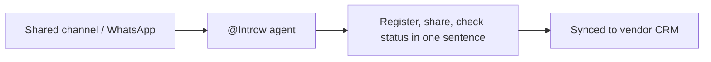
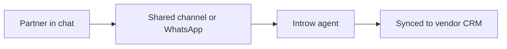
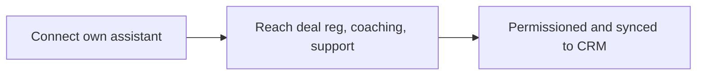
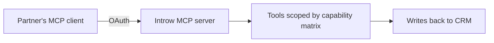
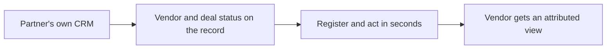
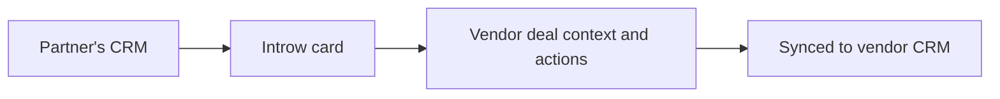

# Introw docs (docs.introw.io): features-partner-connect

Verbatim from docs.introw.io/llms-full.txt, fetched 2026-09-29. 19 pages.

# Register a deal from chat
Source: https://docs.introw.io/features/partner-connect/communication-tools/guides/register-a-deal-from-chat

How the Introw agent turns a Slack, Teams, or WhatsApp message into a validated deal registration using your own form, including missing-field prompts.

A partner rep types one sentence in your shared channel and a registered, attributed deal lands in your CRM. The part worth understanding before you tell partners to work this way is what happens in between, because the agent does not shortcut your qualification.

## What you'll achieve

Confidence that a deal registered from chat is the same quality as one registered through your portal form: same fields, same required values, same dropdown options, same validation, and the same downstream automations and approval gates.

## Before you start

<Steps>
  <Step title="Chat is connected and the channel is mapped to the partner">
    The agent works out which partner it is talking to from the channel it is in, so the shared channel has to be mapped to that partner on your side. Without the mapping there is no partner context and the agent cannot act. See [Configure Slack or Teams for partner activity](/features/integrations/chat/guides/configure-the-chat-integration).
  </Step>

  <Step title="The partner support agent is enabled">
    The in-channel agent is the same agent. See [Partner Support](/features/ai/partner-support).
  </Step>

  <Step title="A form exists for what you want partners to submit">
    The agent submits your forms, it does not invent a schema. Whatever you have attached to your portal is what it can offer: deal registration, lead sharing, MDF requests, onboarding, and anything else you have configured.
  </Step>
</Steps>

## What the rep does

In the shared channel, the rep mentions the agent and says what they want, in their own words and their own language:

```
@Introw share this $20k deal with Acme for me
```

That is the whole interface. There is no command syntax and no form to open.

<Frame>
  
</Frame>

## What the agent does with it

<Steps>
  <Step title="Picks the right form">
    The agent matches the request against the forms you have attached to that partner's portal, whether they are reachable through a CTA, a shared pipeline, or anywhere else in the experience. If you have several plausible forms, it resolves which one the request means rather than defaulting to the first.
  </Step>

  <Step title="Reads that form's real fields">
    It pulls the actual field definitions: labels, types, which are required, and the permitted dropdown options. Your qualification questions are its checklist.
  </Step>

  <Step title="Extracts what the rep already said">
    It maps the sentence onto those fields and normalizes the values: "\$20k" becomes 20000, "end of month" becomes a date, and a dropdown answer is matched to one of your real option labels. Partner fields are prefilled from the channel's partner context.
  </Step>

  <Step title="Asks for the rest, in the thread">
    Anything required and still missing, or provided in a form that fails validation, comes back as a follow-up question in the same thread. The rep answers in chat. Nothing is guessed and nothing is left blank.
  </Step>

  <Step title="Submits only when it validates">
    The data is validated against the same schema your portal form uses. Until it passes, the agent keeps asking. Once it passes, it submits.
  </Step>

  <Step title="Hands off to your rules">
    From there it is an ordinary submission: your conflict checks, duplicate handling, approval gates, notifications, and CRM automations all run exactly as they do for a portal submission. Registering from chat changes the entry point, not the process.
  </Step>
</Steps>

<Info>
  The rep always has an escape hatch. Every exchange includes a button to open the real form and finish it manually, so a rep who would rather click than type never gets trapped in a conversation.
</Info>

## What the agent cannot collect in chat

Four field types need the real form, and the agent will say so and hand over the link rather than attempt them:

| Field type        | Why                                           |
| ----------------- | --------------------------------------------- |
| File upload       | A file cannot be passed in a chat answer      |
| Batch upload      | Same, and it is a bulk flow by design         |
| CRM object picker | The rep needs to browse and select a record   |
| Quote selector    | The rep needs to pick from real quote records |

If a required field on your registration form is one of these, chat registration for that form will always end in a handoff to the form. Worth knowing before you tell a partner "just ask in Slack": if you want chat to complete end to end, keep those field types off the forms you expect partners to submit conversationally.

## The same thing on WhatsApp

WhatsApp behaves identically once it is set up, with one difference in how the agent knows who it is talking to: there is no channel to map, so the sender is matched on the phone number of their contact record in your CRM. A rep whose contact has no phone number, or a different one, will not be recognized. See [Set up WhatsApp](/features/integrations/chat/guides/set-up-whatsapp).

## Verify it worked

Ask the agent to register something from a mapped test channel, deliberately leaving out a required field. It should come back asking for exactly that field, by its label from your form, and refuse to submit until you answer. Then check the submission in Introw and confirm your normal approval and automation path ran.

## Troubleshooting

* **The agent does not respond** - the partner support agent is not enabled, or the channel is not mapped to a partner.
* **It offers the wrong form** - several similar forms are attached to that portal; make their names and purposes distinguishable.
* **It always ends with "open the form"** - a required field on that form is one of the four types above.
* **It says it cannot find a form** - nothing matching is attached to that partner's experience.
* **WhatsApp does not recognize a rep** - their CRM contact has no matching phone number.

## Related

<CardGroup>
  <Card title="Set up WhatsApp" icon="whatsapp" href="/features/integrations/chat/guides/set-up-whatsapp">
    Turn on the WhatsApp number partners text.
  </Card>

  <Card title="Ways to register a deal" icon="file-signature" href="/features/deal-registration/registration/guides/ways-to-register">
    Every entry point partners can register through.
  </Card>

  <Card title="Partner Support Agent" icon="robot" href="/features/ai/partner-support">
    The agent that answers and acts in the channel.
  </Card>

  <Card title="Slack & Teams" icon="plug" href="/features/integrations/chat">
    Connect the workspace and map channels.
  </Card>
</CardGroup>

---

# Communication Tools
Source: https://docs.introw.io/features/partner-connect/communication-tools/index

The Introw agent lives in your shared Slack, Teams, and WhatsApp channels so partners register deals, ask questions, and act where they already talk.

> Communication Tools brings the partnership into chat: a shared Slack or Microsoft Teams channel you run with the vendor's team - and WhatsApp for the partner who works from their phone - with the same Introw agent in it, so a partner makes fast commercial moves in one sentence, right where the conversation already happens.

## The problem it solves

<Pains>
  | Without Introw                      | With Introw                   |
  | ----------------------------------- | ----------------------------- |
  | Partners live in chat, not a portal | The agent is in the channel   |
  | Registering means opening a form    | One sentence in the thread    |
  | They cannot see where a deal is     | They ask, and get live status |
  | Support questions wait on you       | Answered in-channel, 24/7     |
</Pains>

## Impact

The deal comes up in chat, and chat is where it gets lost. Being the vendor a partner can register with in one sentence, in the thread, is worth more than any portal feature.

<Impact>
  for your business

  * **No new tool**
    The partnership arrives in the shared Slack or Teams channel you already have, and on WhatsApp for the rep on a phone
  * **AI, not admin**
    The agent fills in your own form from the conversation, asks for what is missing, and submits only once it validates

  for your partners

  * **Self-serve**
    This is the one surface needing no account of their own: chat recognises them from their contact record
  * **Enabled**
    Status, earnings and support answers come back in the same thread, in their own language
  * **Efficient**
    The commercial move happens the moment the conversation does, not after somebody logs in

  [A day in the life of your partners](/days-in-the-life)
</Impact>

<Personas>
  * **Partner sales teams** - register in one sentence
  * **Partner alliance managers** - the shared channel with you
  * **Your own reps** - co-selling without leaving chat
</Personas>

## How it works

<Info>
  <Frame>
    
  </Frame>

  Partners set up nothing on any of these channels. The vendor connects the workspace and invites the partner into a shared Slack or Teams channel. WhatsApp is the partner's own channel, and all it needs from them is a text. The vendor enables WhatsApp in one click and shares the number. Introw recognizes the partner from the phone number on their CRM contact record. See [Set up WhatsApp](/features/integrations/chat/guides/set-up-whatsapp).

  This is the one surface where the partner needs no account of their own. The other two are turned on by the partner at [partners.introw.io](https://partners.introw.io); chat identifies them from the contact record you already have, so there is nothing for them to create. That makes it the surface to reach for with a partner who will not sign up for anything.
</Info>

A partner rep spends their day in chat, not a portal. Communication Tools meets them there. You and the vendor share a Slack or Microsoft Teams channel. The partner is invited into a channel with the vendor's team, not asked to stand up a workspace of their own. And the same Introw agent that runs the rest of the program lives in it. WhatsApp is the exception: it is the partner's own channel, for the rep who works from their phone.

The channel is built for the fast commercial moves. Sharing a lead or registering a deal takes one sentence: *"@Introw, share this \$20k deal for me"*. It happens in the same thread where the deal came up, with the vendor's team watching it land. The partner checks where a deal stands, asks what it will earn, or gets a support answer without leaving the conversation. Every action is scoped to the partner and writes back to the vendor's CRM. The vendor keeps a clean, attributed record even when the partner never opens a portal.

One sentence is the interface, not the standard. The agent submits the vendor's own form. It reads that form's real fields, asks in the thread for anything required that is missing or invalid, and submits only once everything validates. Then the vendor's normal conflict checks, approval gates and automations run exactly as they would for a portal submission. Registering from chat changes the entry point, not the qualification. See [Register a deal from chat](./guides/register-a-deal-from-chat).

This is the partner-side framing of Introw's chat surface; the channels, the agent, and the notifications are configured once on the vendor side. [Slack & Teams](/features/integrations/chat) is the canonical setup - this page is about what it means for the partner.

Before, chat was where the deal came up and the portal was where it had to be registered - two places, and the second one rarely happened. Now the agent is in the channel, so the commercial move happens the moment the conversation does, attributed and synced to the vendor's CRM.

The channel does different work per [partner type](/partner-types):

* **Referral** - shares a lead the moment it comes up ("@Introw, refer Acme to the vendor") and asks what it will earn, without a login.
* **Co-sell** - the shared channel is where both teams keep one account moving, so status lands where they already talk.
* **Reseller** - registers from the channel to lock in margin early, and asks the agent about tier progress and pending commission instead of emailing their alliance manager.
* **Distributor** - runs a channel per relationship and moves deals and questions through it, without a portal seat for every rep.



## Run it from your AI assistant

<Headless>
  * @Introw, share this \$20k deal for me.
  * Register the deal we just discussed with the vendor.
  * What's the vendor-side status of our shared deal?
  * Ask the vendor's team to review my registration.
</Headless>

## Going deeper

<CardGroup>
  <Card title="How to" icon="screwdriver-wrench" href="./technical">
    Setup, configuration, and all how-to guides.
  </Card>

  <Card title="API reference" icon="code" href="/general/introduction">
    Integration surface and code.
  </Card>
</CardGroup>

**Works with**

<CardGroup>
  <Card title="Slack & Teams" icon="plug" href="/features/integrations/chat">
    Canonical setup for shared Slack and Teams channels and the agent.
  </Card>

  <Card title="Partner Support Agent" icon="robot" href="/features/ai/partner-support">
    The same agent answers and acts in these channels.
  </Card>

  <Card title="Deal Registration" icon="file-signature" href="/features/deal-registration/registration">
    Register a deal from chat in one sentence.
  </Card>

  <Card title="Lead Sharing" icon="share-from-square" href="/features/referrals/lead-sharing">
    Share a lead from chat in one sentence.
  </Card>
</CardGroup>

---

# Communication Tools
Source: https://docs.introw.io/features/partner-connect/communication-tools/technical/index

How the shared Slack or Teams channel with the vendor - and WhatsApp - bring the Introw agent to the partner, and where the canonical setup lives.

## Where it lives

Communication Tools sits under **Settings**, at [Integrations](https://app.introw.io/settings/integrations?category=communication).

<Frame>
  
</Frame>

## Before you start

| You need                           | Why                                | Fix it                                                                                                                                   |
| ---------------------------------- | ---------------------------------- | ---------------------------------------------------------------------------------------------------------------------------------------- |
| Slack or Teams, mapped per partner | The thread lives in that channel   | [Connect Slack](/features/integrations/chat/guides/connect-slack) or [Teams](/features/integrations/chat/guides/connect-microsoft-teams) |
| The partner support agent enabled  | The in-channel agent depends on it | [Launch the agent](/features/ai/partner-support/guides/launch-the-partner-support-agent)                                                 |
| The contact on your experience     | It scopes what the agent reaches   | [Publish an experience](/features/portal/experiences/guides/build-and-publish-a-portal-experience)                                       |

For a registration to complete in the thread, attach the form to the partner's experience and avoid field types that cannot be filled conversationally.

## How it works

Communication Tools is the partner-side experience of Introw's chat surface: the partner works from a shared channel with the vendor's team - Slack or Microsoft Teams - or from WhatsApp, and the same Introw agent that runs the program is in it. The partner connects nothing themselves: Slack and Teams channels are set up and managed by the vendor, who invites the partner in; WhatsApp is the only channel the partner owns. Everything is configured once on the vendor side and documented in its canonical home - this page ties it together for the partner and points to each guide.

* The vendor connects Slack or Teams and maps a shared channel per partner. See [Slack & Teams](/features/integrations/chat).
* The same agent answers and acts in the channel. See [Partner Support](/features/ai/partner-support).
* The partner registers deals and shares leads from the channel in one sentence, and the agent collects the vendor's required form fields in the thread before submitting. See [Register a deal from chat](../guides/register-a-deal-from-chat), [Ways to register a deal](/features/deal-registration/registration/guides/ways-to-register), and [Ways to refer a deal](/features/referrals/lead-sharing/guides/ways-to-refer).
* WhatsApp is the partner's own channel, for the rep who works from their phone. It is a one-click, paid add-on on the vendor side that provisions a number on Introw's managed messaging. See [Set up WhatsApp](/features/integrations/chat/guides/set-up-whatsapp).

### How the agent knows who it is talking to

This is the difference between the channels, and the cause of most "the agent does not know me" reports:

| Channel      | Partner resolved from                                          | Fails when                                          |
| ------------ | -------------------------------------------------------------- | --------------------------------------------------- |
| Slack, Teams | The channel's per-partner mapping on the vendor side           | The shared channel is not mapped to a partner       |
| WhatsApp     | The sender's phone number, matched to their synced CRM contact | The contact has no phone number, or a different one |

In both cases the individual sender is resolved separately, from their chat profile email or that contact record, which is what scopes the conversation to what that person may see.



## Settings & configuration

The channels, the agent, and which notifications post are configured once on the vendor side; the partner just works in the channel. Nothing is set up by the partner on any channel.

Chat setup lives on the vendor's [Integrations](https://app.introw.io/settings/integrations?category=communication) screen. Until a channel is mapped to the partner, there is no shared channel for the agent to work in. WhatsApp is enabled from the same screen, where its block also shows the number to share with partners.

## How-to guides

The channel setup guides live with the [Chat integration](/features/integrations/chat/technical); the how-to below is specific to the partner surface.

<Rail>
  * [**Register a deal from chat**](/features/partner-connect/communication-tools/guides/register-a-deal-from-chat)

    How the Introw agent turns a Slack, Teams, or WhatsApp message into a validated deal registration using your own form, including missing-field prompts.
</Rail>

## Troubleshooting

<Warning>
  Shared Slack and Teams channels are set up on the vendor side, one per partner; the partner is invited into the channel rather than creating their own workspace. WhatsApp is the partner's own channel. The in-channel agent depends on the partner support agent being enabled, and it is scoped to the partner's access.
</Warning>

<AccordionGroup>
  <Accordion title="No shared channel exists">
    The vendor has not mapped a channel to the partner. See [Slack & Teams](/features/integrations/chat).
  </Accordion>

  <Accordion title="The agent does not respond in the channel">
    The partner support agent is not enabled, or the partner contact lacks experience access.
  </Accordion>

  <Accordion title="A message went to the wrong channel">
    Check the per-partner channel mapping on the vendor side.
  </Accordion>

  <Accordion title="The agent replies but does not know which partner it is for">
    The channel is not mapped to a partner, so there is no partner context to act in.
  </Accordion>

  <Accordion title="A registration never completes in the thread">
    A required field on that form is a file upload, batch upload, CRM object picker, or quote selector, none of which can be filled conversationally. The agent hands over a link to the form instead.
  </Accordion>

  <Accordion title="WhatsApp does not recognize a sender">
    The phone number they messaged from is not on their synced CRM contact record.
  </Accordion>
</AccordionGroup>

---

# Partner Connect
Source: https://docs.introw.io/features/partner-connect/index

Partner Connect brings your whole partnership into the three places partners already work - their AI assistant, their chat tools, and their own CRM.

> Your portal is where partners spend most of their time with you, and it should never be the only way in. Partner Connect brings the same partnership, under the same rules your portal defines, to the three places partner teams also work - their AI assistant, their communication tools, and their own CRM. More adoption. More revenue. Zero friction.

## The problem it solves

<Pains>
  | Without Introw                        | With Introw                               |
  | ------------------------------------- | ----------------------------------------- |
  | A busy partner skips the portal login | The program also comes to where they work |
  | A busy rep will not hunt for a deal   | The deal is on their own record           |
  | Registering means stopping to log in  | One sentence in their assistant           |
  | You lose sight once it is theirs      | Both CRMs stay in sync                    |
</Pains>

## Impact

This is the whole argument. A partner who never has to leave their assistant, their channel or their CRM to work with you will work with you more than with the vendor who sends them a login.

<Impact>
  for your business

  * **No new tool**
    Partners act from their assistant, their shared Slack or Teams channel, and their own CRM, so a portal login is never the price of entry
  * **In your CRM**
    Both sides work their own system of record and the shared deal stays synced across the two, with no CRM seat for the partner
  * **AI, not admin**
    The partner brings their own LLM and reaches deal registration, coaching, enablement and support from inside it

  for your partners

  * **Self-serve**
    Registration, coaching, enablement and support all arrive on the surface they chose, with no login to remember
  * **Enabled**
    Deal coaching and vendor-grade guidance land on the record they already have open
  * **Efficient**
    One sentence in the thread where the deal came up, instead of a form in a second system

  [A day in the life of your partners](/days-in-the-life)
</Impact>

<Personas>
  * **Partner sales teams** - register from chat, co-sell from CRM
  * **Partner alliance managers** - tier and earnings from the assistant
  * **Partner technical teams** - answers 24/7, without waiting
  * **Your own reps** - co-selling from the CRM they use
</Personas>

## How this area works

Headless is how Introw works, not a single feature. The vendor already runs the whole program inside HubSpot or Salesforce with agents handling the mechanical work. Partner Connect closes the other half of the loop: it extends that headless, agentic, CRM-first model to the partner, so the partnership is two-way and AI-native for **both** sides, not just the vendor.

**Where this sits in a setup.** For partners who run their own CRM. The [co-sell](/tracks/co-sell) and [reseller](/tracks/reseller) tracks bring it in once your own side is live, since it is the partner's setup rather than yours.

<Frame>
  
</Frame>

<Rail>
  * 

    [**Partner AI**](./partner-ai)

    Their own Claude, GPT or Gemini, connected to your program.

    [How to · 3 guides](./partner-ai/technical)

  * 

    [**Communication Tools**](./communication-tools)

    A shared Slack or Teams channel, and WhatsApp.

    [How to · 1 guide](./communication-tools/technical)

  * 

    [**Partner CRM**](./partner-crm)

    An Introw card on the partner's own opportunity.

    [How to · 8 guides](./partner-crm/technical)
</Rail>

Partner portals have always had an adoption problem, and the reason is simple. They ask a busy partner rep to leave the tools they work in, remember another login, and go hunt for the right deal before they can do anything. Most never do. Partner Connect removes that friction by meeting partners on the three surfaces where they already spend their day:

1. **Their AI assistant** - Claude, ChatGPT, Gemini, or any MCP client. The partner asks, the program answers. Introw sits next to the partner's other connectors, so any system they have connected can exchange data with the portal, both directions. 2. **Their communication tools** - Slack, Microsoft Teams, and WhatsApp. The same agent in shared channels and messaging, built for the fast commercial moves: *"@Introw, share this \$20k deal for me."* 3. **Their own CRM** - an Introw card on the partner's own HubSpot record. One click from there opens the full co-sell view, deal coaching included, or the entire portal, signed in automatically.

The result is a single shared reality both organizations work from wherever they already are. Meeting partners where they work - instead of overloading them with one more portal - is what changes the partner experience, and with it the numbers: more adoption, more registered revenue, zero friction.

Three surfaces, one shared deal that stays synced with yours.

### Where partners start: partners.introw\.io

The three surfaces are where partners *work*. [partners.introw.io](https://partners.introw.io) is where they *set it up* - and the point most easily missed is that it is **theirs, not yours: one account per partner company, spanning every vendor they work with**. A partner who sells three products connects their CRM once and it serves all three. A vendor portal, by contrast, belongs to one vendor and holds that vendor's program.

There a partner signs up with Google, Microsoft, or a six-digit code sent to their email. No password, and no cost to them. They connect HubSpot once, at company level, and install the MCP connector per person. They invite their own colleagues and give each one access to specific vendor portals, without you provisioning anyone. And they open every vendor portal they can reach, signed in automatically. Everything that powers Partner Connect is turned on there.

Two consequences on your side. Portals appear for a partner automatically once you invite their address or allow their email domain, so there is no code to send and no access to request. And your nudge lands them at the point that matches their stage: signup, Integrations, or their home screen. The nudge email always labels that button **Set up Partner Connect**. The banner on the deal uses the stage's own wording - **Get started**, **Connect now**, or **Open Partner Connect**.

<Card title="Get started as a partner" icon="door-open" href="./partner-crm/guides/get-started-at-partners-introw-io">
  The partner front door end to end: create the account, connect the tools, reach every vendor portal. Written to the partner, so you can forward it as the first link.
</Card>

Two details are worth knowing about the surfaces themselves.

In the assistant, Introw is one connector **among the partner's others** - their CRM, inbox, docs, data warehouse. That makes the assistant the integration layer. A partner can pull the opportunities from their own systems that mention your product and register them in one prompt. Data moves between those systems and the portal with no integration project and no middleware.

In their own CRM, the Introw card opens the full co-sell view, or the entire portal, in one click and already signed in. Everything beyond the deal is one hop away. That is real estate inside your partner's CRM, in front of their sellers every time they open a record - not a portal they forgot the password to. The card works in the partner's own HubSpot and Salesforce alike.

### What it takes from your partners

The usual question is not what Partner Connect does, it is what it costs the partner. Nothing, and no seat in your CRM. Each surface is independent - a partner can take one, two or all three, and none is a prerequisite for another.

| Surface            | Partner effort                   | Who at the partner                                            |
| ------------------ | -------------------------------- | ------------------------------------------------------------- |
| Their AI assistant | About 2 minutes, once per person | Any of their users, no admin rights needed                    |
| Chat               | Nothing to set up                | Nobody                                                        |
| Their own CRM      | About 10 minutes, once           | A HubSpot admin who can also manage their Introw integrations |

Four pages carry this end to end, written to the partner so you can forward them:

<CardGroup>
  <Card title="Get started as a partner" icon="door-open" href="./partner-crm/guides/get-started-at-partners-introw-io">
    The front door: create the account, connect the tools, reach every vendor portal.
  </Card>

  <Card title="Introw for partners" icon="share-nodes" href="./partner-crm/guides/introw-for-partners">
    The forwardable page: permissions, what their sellers see, how to reverse it.
  </Card>

  <Card title="Roll out at scale" icon="users" href="./partner-crm/guides/roll-out-partner-connect-at-scale">
    Sequencing across hundreds of partners, by type and by stage.
  </Card>

  <Card title="Work deals from the card" icon="rectangle-list" href="./partner-crm/guides/work-deals-from-the-introw-card">
    What a partner rep actually does, day to day.
  </Card>
</CardGroup>

### What it unlocks, by partner type

The surfaces are the same for every partner; the move that matters differs by [partner type](/partner-types):

* **Referral** - lives in email and chat, not portals. Shares a lead in one sentence from Slack or WhatsApp, and asks their assistant what it will earn. The intro happens when it comes up, not after a login they will never do.
* **Co-sell** - both sales teams work one [linked deal](./partner-crm) from their own CRM. The partner's AE sees your side's status on their own record; your AE never chases for an update.
* **Reseller** - registers from their own CRM the moment an opportunity appears, locking in margin and conflict protection early. Their reps ask the assistant about tier progress, certification gaps and pending commission rather than emailing their alliance manager.
* **Distributor** - queries the network from the assistant (sub-partner status, sell-through, commission roll-ups) and uses its own connectors to move that data into the systems the distribution business already runs on.
* **Implementation** - consultants self-serve technical answers 24/7 and pull your solution docs into their own workspace, so delivery never blocks on the vendor.

## Run it from your AI assistant

Partner Connect is the partner-side half of [Introw's headless motion](/headless). The agentic use cases show it end to end:

<CardGroup>
  <Card title="Deal Registration" icon="file-signature" href="/headless/agentic-use-cases/deal-registration">
    Partners register conversationally in 90 seconds - from Claude, Slack, email, or CRM.
  </Card>

  <Card title="Deal Coaching" icon="chalkboard-user" href="/headless/agentic-use-cases/deal-coaching">
    Every partner deal gets segment-specific guidance, delivered in the partner's own workspace.
  </Card>

  <Card title="Enablement Support" icon="circle-question" href="/headless/agentic-use-cases/enablement-support">
    Partner questions answered 24/7 in every language, in chat or the assistant.
  </Card>

  <Card title="Commissions & Incentives" icon="coins" href="/headless/agentic-use-cases/commissions-and-incentives">
    Partners query commission status and tier progress in seconds - no portal, no finance ticket.
  </Card>
</CardGroup>

<Headless>
  * What do I still need to close to reach the next tier with this vendor?
  * @Introw, share this \$20k deal for me.
  * Register the opportunities from my own CRM that mention the vendor's product.
  * Check my pending commission and the vendor-side status of my deals.
</Headless>

---

# Connect an MCP client
Source: https://docs.introw.io/features/partner-connect/partner-ai/guides/connect-an-mcp-client

As a partner, connect a major MCP client - Cursor, Gemini, Windsurf, Notion AI, Zapier, and more - to your Introw partner data with the partner MCP connector.

Beyond Claude and ChatGPT, the major MCP clients connect to your Introw partner data with the partner MCP connector: Cursor, Gemini, Windsurf, Notion AI, Lovable, Langdock, and Zapier. This is the canonical guide for all of them - the setup is the same in Introw (copy one server URL), and the per-client section below covers where each tool adds a remote MCP server. The connection uses the same secure OAuth sign-in and acts only within your own partner access.

<Note>
  Only known AI clients can register with Introw: Claude, ChatGPT, Cursor, Windsurf, Notion AI, Lovable, Langdock, Gemini, Zapier, and desktop clients that sign in on a local address. A hosted client that is not on that list is refused at sign-in. If you need another client, ask your Introw contact.
</Note>

## What you'll achieve

Your MCP-capable client connected to your Introw partner data over OAuth, authenticated as you. The client can read live data scoped to your partner account and take the actions your permissions allow, and the connector page shows the connection as active.

## Before you start

<Steps>
  <Step title="Have a client that supports remote MCP servers">
    Use a client that can add a custom or remote MCP server over OAuth.
  </Step>

  <Step title="Have a partner account at partners.introw.io">
    The connector lives in your own Introw account at [partners.introw.io](https://partners.introw.io), not in your vendor's portal. If you do not have one yet, sign up there with Google, Microsoft, or an emailed verification code - it takes a minute and costs nothing. See [Get started as a partner](/features/partner-connect/partner-crm/guides/get-started-at-partners-introw-io).
  </Step>

  <Step title="Have partner portal access">
    The partner MCP connector is available by default - no vendor toggle is needed, and you do not need to be an admin on your side. Complete the OAuth step while signed in so the client connects as you, scoped to your partner account.
  </Step>
</Steps>

## Steps

<Steps>
  <Step title="Open the partner MCP connector">
    Sign in at [partners.introw.io](https://partners.introw.io) and go to **Settings**, then [Integrations](https://partners.introw.io/integrations), and open the **MCP** category. Select **Configure** on the **MCP** card, which is the generic connector for any client. It shows the connection status and quick-setup steps.

    One connection covers **all** the vendor portals your account can reach, not one vendor at a time.
  </Step>

  <Step title="Copy the MCP Server URL">
    Select **Copy MCP Server URL**. This single address is what every MCP client connects to; copy it from the page rather than typing it. Use the URL shown here, not one from anywhere else.
  </Step>

  <Step title="Add Introw as a remote MCP server in your client">
    In your client, add a remote (or custom) MCP server and paste the **MCP Server URL** you copied. The exact place this lives differs per client - see the per-client notes below. This points the client at your partner data.
  </Step>

  <Step title="Complete the OAuth sign-in">
    The client opens an Introw sign-in to authorize the connection. Complete it so the client connects as you, scoped to your partner account. There is no API key or secret to paste.
  </Step>
</Steps>

## Connect a specific client

The Introw side is identical for every client: copy the **MCP Server URL** from your partner connector. What differs is where each tool adds a remote MCP server. After adding the URL in any of these, complete the OAuth sign-in to finish.

### Cursor

Add Introw as a custom MCP server in Cursor's MCP settings, paste the **MCP Server URL**, then complete the OAuth sign-in.

### Gemini

In Gemini, add Introw as a remote MCP server using the **MCP Server URL**, then complete the OAuth sign-in.

### Windsurf

In Windsurf, add Introw as a remote MCP server using the **MCP Server URL**, then complete the OAuth sign-in.

### Notion AI

In Notion AI, add Introw as a remote MCP server using the **MCP Server URL**, then complete the OAuth sign-in.

### Lovable

In Lovable, add Introw as a remote MCP server using the **MCP Server URL**, then complete the OAuth sign-in.

### Langdock

In Langdock, add Introw as a remote MCP server using the **MCP Server URL**, then complete the OAuth sign-in.

### Zapier

In Zapier, add a connection for **MCP Client by Zapier**, paste the **MCP Server URL** as the server URL, answer **Yes** when Zapier asks whether the server requires OAuth, then complete the OAuth sign-in. Introw's tools are then available as Zap actions.

## Verify it worked

The connector page shows **Connection is active**, and your client can use Introw's tools - asking it about your program returns live data scoped to your account. To revoke access later, select **Disconnect** on the connector page; the client loses access immediately and must reconnect.

## Once connected, try

Put your assistant to work in a sentence:

* **Register or share a deal** - "Register this deal with the vendor and attach my notes," or "Share this lead with the vendor."
* **Check what you'll earn** - "What commission is pending for me?"
* **Track your standing** - "What do I still need to close to reach the next tier, and which certifications am I missing?"
* **Stay on top of work** - "What partner tasks are open for me?"
* **Pull enablement and get coached** - "Find the vendor's latest battle card," or "Coach me on this deal."
* **Self-serve support** - "How do I submit an MDF request?"

## Related

<CardGroup>
  <Card title="Connect Claude" icon="book-open" href="./connect-claude">
    Use the dedicated Claude flow.
  </Card>

  <Card title="Connect ChatGPT" icon="book-open" href="./connect-chatgpt">
    Use the dedicated ChatGPT flow.
  </Card>

  <Card title="Partner MCP use cases" icon="robot" href="/features/developer/mcp/guides/explore-partner-mcp-use-cases">
    What you can do from your assistant once connected.
  </Card>

  <Card title="Implementation reference" icon="screwdriver-wrench" href="../technical">
    Partner AI setup, scoping, and troubleshooting.
  </Card>
</CardGroup>

---

# Connect ChatGPT
Source: https://docs.introw.io/features/partner-connect/partner-ai/guides/connect-chatgpt

As a partner, connect ChatGPT to Introw over MCP so you can query and act on your own partner data - deals, commissions, tasks - from inside ChatGPT.

Connecting ChatGPT to Introw brings your own partner data into the assistant you already use, so you can ask about your deals and commissions and take quick actions without switching tools. The partner connector lives in your own portal with a one-time OAuth sign-in; once connected, ChatGPT reads live data scoped to your partner account and acts only within your own access, and you can disconnect at any time.

## What you'll achieve

ChatGPT connected to your Introw partner data over MCP, authenticated as you. ChatGPT can read your accessible portal data and take the actions your permissions allow, and the connector page shows the connection as active.

## Before you start

<Steps>
  <Step title="Have a ChatGPT plan that supports connectors">
    Use a ChatGPT client that supports adding a remote MCP connector.
  </Step>

  <Step title="Have a partner account at partners.introw.io">
    The connector lives in your own Introw account at [partners.introw.io](https://partners.introw.io), not in your vendor's portal. If you do not have one yet, sign up there with Google, Microsoft, or an emailed verification code - it takes a minute and costs nothing. See [Get started as a partner](/features/partner-connect/partner-crm/guides/get-started-at-partners-introw-io).
  </Step>

  <Step title="Have partner portal access">
    The partner connector is available by default - no vendor toggle is needed, and you do not need to be an admin on your side. Complete the OAuth step while signed in so ChatGPT connects as you, scoped to your partner account.
  </Step>
</Steps>

## Steps

<Steps>
  <Step title="Open the partner MCP connector">
    Sign in at [partners.introw.io](https://partners.introw.io) and go to **Settings**, then [Integrations](https://partners.introw.io/integrations), and open the **MCP** category. Find the **ChatGPT** card and select **Configure**. The page shows the connection status and the quick-setup steps.

    One connection covers **all** the vendor portals your account can reach, not one vendor at a time.
  </Step>

  <Step title="Copy the MCP Server URL">
    Select **Copy MCP Server URL**. This is the endpoint ChatGPT connects to; copy it from the page so you do not mistype it. Use the URL shown here, not one from anywhere else.
  </Step>

  <Step title="Add Introw in ChatGPT">
    In ChatGPT, add Introw as an MCP connector and paste the **MCP Server URL** when ChatGPT asks for the remote MCP server endpoint. This tells ChatGPT where to reach your partner data.
  </Step>

  <Step title="Complete the OAuth sign-in">
    ChatGPT opens an Introw sign-in to authorize the connection. Complete it so ChatGPT connects as you, scoped to your partner account. There is no API key or secret to paste.
  </Step>
</Steps>

## Verify it worked

The connector page shows **Connection is active**, and asking ChatGPT a question about your program returns live data scoped to your account. To revoke access later, select **Disconnect** on the connector page; ChatGPT loses access immediately and must reconnect.

## Once connected, try

Put ChatGPT to work in a sentence:

* **Register or share a deal** - "Register this deal with the vendor and attach my notes," or "Share this lead with the vendor."
* **Check what you'll earn** - "What commission is pending for me?"
* **Track your standing** - "What do I still need to close to reach the next tier, and which certifications am I missing?"
* **Stay on top of work** - "What partner tasks are open for me?"
* **Pull enablement and get coached** - "Find the vendor's latest battle card," or "Coach me on this deal."
* **Self-serve support** - "How do I submit an MDF request?"

## Related

<CardGroup>
  <Card title="Connect Claude" icon="book-open" href="./connect-claude">
    Do the same for Claude.
  </Card>

  <Card title="Connect an MCP client" icon="book-open" href="./connect-an-mcp-client">
    Connect Cursor, Gemini, and other clients.
  </Card>

  <Card title="Partner MCP use cases" icon="robot" href="/features/developer/mcp/guides/explore-partner-mcp-use-cases">
    What you can do from your assistant once connected.
  </Card>

  <Card title="Implementation reference" icon="screwdriver-wrench" href="../technical">
    Partner AI setup, scoping, and troubleshooting.
  </Card>
</CardGroup>

---

# Connect Claude
Source: https://docs.introw.io/features/partner-connect/partner-ai/guides/connect-claude

As a partner, connect Claude to Introw over MCP so you can query and act on your own partner data - deals, commissions, tasks - from inside Claude.

Connecting Claude to Introw lets you ask about your deals, commissions, and tasks and take quick actions right inside Claude, all scoped to what your partner account can see. Introw runs a dedicated partner Claude connector in your own portal with a one-time OAuth sign-in, so once it is set up your partner data becomes something you query conversationally instead of opening the portal. The connection acts only within your own access and can be disconnected at any time.

## What you'll achieve

Claude connected to your Introw partner data over MCP, authenticated as you. Claude can read your accessible portal data - deals, tasks, commissions, submissions - and take the actions your permissions allow, and the connector page shows the connection as active.

## Before you start

<Steps>
  <Step title="Have a Claude plan that supports connectors">
    Use a Claude client that supports custom MCP connectors.
  </Step>

  <Step title="Have a partner account at partners.introw.io">
    The connector lives in your own Introw account at [partners.introw.io](https://partners.introw.io), not in your vendor's portal. If you do not have one yet, sign up there with Google, Microsoft, or an emailed verification code - it takes a minute and costs nothing. See [Get started as a partner](/features/partner-connect/partner-crm/guides/get-started-at-partners-introw-io).
  </Step>

  <Step title="Have partner portal access">
    The partner Claude connector is available by default - no vendor toggle is needed, and you do not need to be an admin on your side. Complete the OAuth step while signed in so Claude connects as you, scoped to your partner account.
  </Step>
</Steps>

## Steps

<Steps>
  <Step title="Open the Claude connector">
    Sign in at [partners.introw.io](https://partners.introw.io) and go to **Settings**, then [Integrations](https://partners.introw.io/integrations), and open the **MCP** category. Find the **Claude** card and select **Configure** to open the connector. The page shows the connection status and the quick-setup steps.

    This partner connector is separate from the vendor's admin connector, and it covers **all** the vendor portals your account can reach - not one vendor at a time. Connect once and every vendor you work with is in scope.
  </Step>

  <Step title="Copy the MCP Server URL">
    Select **Copy MCP Server URL**. This is the address Claude connects to; copy it from the page rather than typing it, so you do not introduce a typo. Use the URL shown here, not one from anywhere else.
  </Step>

  <Step title="Add Introw in Claude">
    In Claude, open **Customize**, then **Connectors**, and add an **Introw** custom connector using the **MCP Server URL** you copied, then select **Connect**. Adding it here is what tells Claude where to reach your partner data.

    <Frame>
      
    </Frame>
  </Step>

  <Step title="Complete the OAuth sign-in">
    Claude opens an Introw sign-in to authorize the connection. Complete it so Claude connects as you, scoped to your partner account. This is the step that links your account - there is no API key or secret to paste.
  </Step>
</Steps>

## Verify it worked

The Claude connector page shows **Connection is active**, and asking Claude a question about your program (for example "What deals do I have open and what stage are they in?") returns live data scoped to your account. To revoke access later, select **Disconnect** on the connector page; Claude loses access immediately and must reconnect.

## Once connected, try

Put Claude to work in a sentence:

* **Register or share a deal** - "Register this deal with the vendor and attach my notes," or "Share this lead with the vendor."
* **Check what you'll earn** - "What commission is pending for me?"
* **Track your standing** - "What do I still need to close to reach the next tier, and which certifications am I missing?"
* **Stay on top of work** - "What partner tasks are open for me?"
* **Pull enablement and get coached** - "Find the vendor's latest battle card," or "Coach me on this deal."
* **Self-serve support** - "How do I submit an MDF request?"

## Related

<CardGroup>
  <Card title="Connect ChatGPT" icon="book-open" href="./connect-chatgpt">
    Do the same for ChatGPT.
  </Card>

  <Card title="Connect an MCP client" icon="book-open" href="./connect-an-mcp-client">
    Connect Cursor, Gemini, and other clients.
  </Card>

  <Card title="Partner MCP use cases" icon="robot" href="/features/developer/mcp/guides/explore-partner-mcp-use-cases">
    What you can do from your assistant once connected.
  </Card>

  <Card title="Implementation reference" icon="screwdriver-wrench" href="../technical">
    Partner AI setup, scoping, and troubleshooting.
  </Card>
</CardGroup>

---

# Partner AI
Source: https://docs.introw.io/features/partner-connect/partner-ai/index

Partners connect their own LLM - Claude, GPT, Gemini - to reach deal registration, coaching, enablement, and support without leaving their AI assistant.

> Partner AI makes the partnership AI-native on the partner's side: a partner connects their own assistant - Claude, GPT, Gemini, or any MCP client - and reaches everything you offer from it, from registering a deal to getting coached, enabled, trained, and supported.

## The problem it solves

<Pains>
  | Without Introw                       | With Introw                   |
  | ------------------------------------ | ----------------------------- |
  | Partners will not adopt another tool | They bring the one they have  |
  | Everything sits behind a login       | It answers in their assistant |
  | Answers wait on your team            | 24/7, in their own language   |
  | Their data is out of your reach      | The assistant bridges both    |
</Pains>

## Impact

Partners already brought AI to work. The vendor whose program answers inside it, next to their own CRM and inbox, is doing something none of their other vendors are.

<Impact>
  for your business

  * **AI, not admin**
    Deal registration, coaching, enablement, training and support are all reachable by asking, scoped to what you allow
  * **No new tool**
    The partner adopts nothing: they connect the assistant they already work in, once, for every vendor they partner with
  * **Fits together**
    Introw sits beside the partner's other connectors, so their assistant becomes the integration layer into your program

  for your partners

  * **Self-serve**
    They turn it on themselves at partners.introw\.io, with nothing for you to enable on your side
  * **Enabled**
    Coaching, enablement and training come to them on demand rather than being published at them
  * **Efficient**
    They pull opportunities from their own systems and register them with you in one prompt

  [A day in the life of your partners](/days-in-the-life)
</Impact>

<Personas>
  * **Partner sales teams** - register and get coached by asking
  * **Partner technical teams** - answers without waiting on you
  * **Partner alliance managers** - one connection, every vendor
</Personas>

## How it works

Introw is AI-native for the vendor. Partner AI extends that to the partner. Through MCP, a partner connects the LLM they already use and reaches your resources from inside it. They ask "what do I still need to close to reach the next tier?". They register a deal or share a lead in a sentence. They get deal coaching, pull up enablement and training, and get answers to support questions around the clock. All of it is scoped to what you allow, and none of it needs a portal.

<Frame>
  
</Frame>

What makes this bigger than a chat interface is composition. Introw is one connector **among the partner's others** - their own CRM, inbox, docs, data warehouse - inside the same assistant. That makes the assistant the integration layer between your program and the partner's whole stack. The partner pulls the opportunities from their own systems that mention your product and registers them with you in one prompt. Or syncs your latest enablement into their own wiki. Or reconciles their commission statement against their own books. Data flows from any connected system into the portal and back out - no integration project, no middleware.

The partner turns this on themselves, in their own Introw account at [partners.introw.io](https://partners.introw.io), under **Settings, Integrations, MCP**. Nothing is enabled on your side, and one connection there covers every vendor that partner works with, yours included. See [Get started as a partner](/features/partner-connect/partner-crm/guides/get-started-at-partners-introw-io).

This carries Introw's AI-native model all the way to the partner: the partner does not adopt your tool at all, they bring their own. Every action is permissioned and writes back to the CRM, so the vendor keeps a clean, attributed record even when the partner never touches a portal. Partners who live in an assistant get the full partnership there; partners who live in their CRM or chat get it there. Each partner chooses their surface and finds everything on it.

Before, "AI-native" stopped at the vendor's edge - the partner still had to log in and click. Now the partner brings their own assistant and reaches deal reg, coaching, enablement, training, and support from it, permissioned and synced to the CRM. Friction drops to near zero, partners engage where they already are, and the vendor gets more partner activity with full visibility - the level of adoption a portal never delivered.

The same connector, a different killer move per [partner type](/partner-types):

* **Referral** - "What's the status of the deals I referred, and what will they earn me?" The answer arrives without a login, which is why the next referral happens at all.
* **Reseller** - reps check tier progress, certification gaps and margin from the assistant; the alliance manager stops being the program's help desk.
* **Co-sell** - the partner's AE preps a joint call by pulling the shared deal, your battle card and their own account notes in one prompt.
* **Distributor** - rolls up sell-through and sub-partner status, then pushes it into the BI stack the distribution business already runs on.
* **Implementation** - consultants combine your solution docs with their own project tooling, so delivery questions get answered mid-task, not next sprint.



## Run it from your AI assistant

<Headless>
  * What do I still need to close to reach the next tier with this vendor?
  * Register the opportunities from my own CRM that mention the vendor's product.
  * Check my pending commission and reconcile it against my own books.
  * What training or certifications do I still need with this vendor?
</Headless>

## Going deeper

<CardGroup>
  <Card title="How to" icon="screwdriver-wrench" href="./technical">
    Setup, configuration, and all how-to guides.
  </Card>

  <Card title="Agentic use cases" icon="wand-magic-sparkles" href="/headless">
    The end-to-end motions this surface powers - deal reg, coaching, support, commissions.
  </Card>

  <Card title="API reference" icon="code" href="/general/introduction">
    Endpoints and code.
  </Card>
</CardGroup>

**Works with**

<CardGroup>
  <Card title="MCP" icon="code" href="/features/developer/mcp">
    Connect any MCP client - Claude, ChatGPT, Cursor - to Introw.
  </Card>

  <Card title="Partner Support Agent" icon="robot" href="/features/ai/partner-support">
    The partner's questions get answered by the support agent.
  </Card>

  <Card title="Partner CRM" icon="circle-nodes" href="/features/partner-connect/partner-crm">
    Pair the AI surface with the partner's own CRM.
  </Card>

  <Card title="Deal Registration" icon="file-signature" href="/features/deal-registration/registration">
    Register and protect deals from the assistant.
  </Card>
</CardGroup>

---

# Partner AI
Source: https://docs.introw.io/features/partner-connect/partner-ai/technical/index

How a partner connects their own LLM to Introw over MCP and reaches vendor deals, assets, and enablement from Claude, ChatGPT, or another AI assistant.

## Where it lives

This one lives on the partner's side, at [Integrations](https://partners.introw.io/integrations) in their own Partner Connect account, not in your Introw.

<Frame>
  
</Frame>

<Note>
  This is a partner-side screen, so it lives in the partner app at **partners.introw\.io**, not in your own Introw at app.introw\.io. The partner signs in to their own account there and connects the assistant from **Settings, Integrations, MCP**. See [Get started as a partner](/features/partner-connect/partner-crm/guides/get-started-at-partners-introw-io) for the whole front door.
</Note>

## Before you start

| You need                            | Why                                        | Fix it                                                                                             |
| ----------------------------------- | ------------------------------------------ | -------------------------------------------------------------------------------------------------- |
| An MCP-capable client, partner-side | Claude, ChatGPT, Cursor or similar         | [Connect an MCP client](/features/developer/mcp/guides/connect-an-mcp-client)                      |
| A partners.introw\.io account       | The connector page lives there             | Outside Introw                                                                                     |
| The contact on your experience      | It scopes everything the assistant reaches | [Publish an experience](/features/portal/experiences/guides/build-and-publish-a-portal-experience) |

A partner account is free and takes a minute with Google, Microsoft, or an emailed code.

That is the whole list. The partner connector needs no vendor toggle and no module on your plan, and it is not restricted to admins on the partner side, so any of a partner's users can connect. (The separate vendor-side MCP server, which your own team and agents use, is also included on every plan. Do not confuse the two: they expose different data.)

## How it works

Partner AI is the partner-side experience of Introw's MCP server. The partner connects their own MCP client - Claude, ChatGPT, Cursor, or another assistant - to Introw over OAuth, and from then on reaches the tools you expose (deal registration, coaching, enablement, support) from that assistant. Everything is scoped by the vendor-configured [capability matrix](/headless#governance-and-trust) and writes back to the CRM. The canonical MCP setup and tool reference live in the Developer domain; this page frames the partner-side path and links there.

* Connect an assistant: [Connect an MCP client](/features/developer/mcp/guides/connect-an-mcp-client), [Connect Claude](/features/developer/mcp/guides/connect-claude), [Connect ChatGPT](/features/developer/mcp/guides/connect-chatgpt).
* Give partners their own assistant: [Give partners their own AI assistant](/features/developer/mcp/guides/give-partners-their-own-ai-assistant).
* What the assistant can answer and do: [MCP](/features/developer/mcp) and [Partner Support](/features/ai/partner-support).



## Settings & configuration

The partner connects their assistant from **Settings, Integrations, MCP** in their own Introw account at [partners.introw.io](https://partners.introw.io). What the assistant can see and do is governed by the vendor's capability matrix and the partner's permissions, and is not configured on the partner side.

**MCP connection** lives on the partner's **Integrations** screen and is where the partner authorizes their assistant over OAuth. Access is scoped to the partner's permissions, so the assistant can only reach what the vendor exposes.

### Who connects, and with which account

The two questions partners ask most, answered:

* **Any of their users can connect, individually.** Connecting is per person, not per partner organization, so ten reps at one partner each hold their own connection and each reaches only what their own portal access allows.
* **The AI account does not matter.** Authorization is an Introw OAuth sign-in, not an API key from the assistant, so a personal Claude or ChatGPT account grants no more than a company-managed one. Access derives from the Introw identity that signed in, and is revoked the moment that contact is deactivated.
* **Every action is attributed.** Tool calls are recorded against the partner user who authorized the connection and run through the same permission rules as the portal, so registrations and updates made from an assistant carry a full audit trail rather than landing as anonymous automation.
* **What partners should decide internally:** whichever assistant account they authorize, the responses land in that account's history. That is a policy call for the partner, not something Introw enforces, and it is the one thing worth raising with a security-conscious partner.

## Once connected, try

With the assistant connected, everything the vendor exposes is one sentence away:

* **Register or share a deal** - "Register this deal with the vendor and attach my notes," or "Share this lead with the vendor."
* **Check what you'll earn** - "What commission is pending for me?"
* **Track your standing** - "What do I still need to close to reach the next tier?" or "Which certifications am I missing?"
* **Stay on top of work** - "What partner tasks are open for me?"
* **Pull enablement and get coached** - "Find the vendor's latest battle card," or "Coach me on this deal."
* **Self-serve support** - "How do I submit an MDF request?"

See [Partner MCP use cases](/features/developer/mcp/guides/explore-partner-mcp-use-cases) for the full range.

## How-to guides

<Rail>
  * [**Connect an MCP client**](/features/partner-connect/partner-ai/guides/connect-an-mcp-client)

    As a partner, connect a major MCP client - Cursor, Gemini, Windsurf, Notion AI, Zapier, and more - to your Introw partner data with the partner MCP connector.

  * [**Connect ChatGPT**](/features/partner-connect/partner-ai/guides/connect-chatgpt)

    As a partner, connect ChatGPT to Introw over MCP so you can query and act on your own partner data - deals, commissions, tasks - from inside ChatGPT.

  * [**Connect Claude**](/features/partner-connect/partner-ai/guides/connect-claude)

    As a partner, connect Claude to Introw over MCP so you can query and act on your own partner data - deals, commissions, tasks - from inside Claude.
</Rail>

## Troubleshooting

<Warning>
  What a partner's assistant can reach is scoped by the vendor's capability matrix and the partner's permissions, and it requires an active portal contact. Deactivating a contact kills their assistant connection immediately, which is the intended off switch for a rep who has left.
</Warning>

<AccordionGroup>
  <Accordion title="The assistant cannot connect">
    The OAuth authorization did not complete, or the client does not support remote MCP servers.
  </Accordion>

  <Accordion title="The assistant returns nothing for a partner">
    The partner contact is not an active contact on the experience, or the capability is not exposed to them.
  </Accordion>

  <Accordion title="One rep sees less than a colleague">
    Correct and expected: each connection is scoped to that person's own portal access.
  </Accordion>
</AccordionGroup>

---

# Connect HubSpot
Source: https://docs.introw.io/features/partner-connect/partner-crm/guides/connect-hubspot

As a partner, connect your own HubSpot, add the Introw card to your deals, and verify it so vendor context and actions appear on your own CRM records.

Connecting HubSpot is the partner-side setup for Partner CRM: once you connect your own HubSpot and install the Introw card, the vendor on your deal and their live status appear right on your HubSpot record, and you can register, link, and co-sell without leaving your CRM. You only do this once.

## What you'll achieve

Your own HubSpot connected to the vendor's Introw, with the Introw Partner Connect card installed and verified on your deals. From then on, vendor deal context and actions render on your HubSpot records, and you can link existing deals to the vendor's matching deal. The card also gives you one-click entry into the vendor's entire portal - signed in automatically, no separate login.

## Before you start

<Steps>
  <Step title="Have a partner account at partners.introw.io">
    The **Integrations** page and the HubSpot setup wizard live in your own Introw account at [partners.introw.io](https://partners.introw.io), not in your vendor's portal. Sign up there first if you have not already - Google, Microsoft, or an emailed verification code, a minute, no cost. See [Get started as a partner](./get-started-at-partners-introw-io).

    One account covers your whole company and every vendor you work with, so if a colleague already connected HubSpot for another vendor, you have nothing left to do here.
  </Step>

  <Step title="Have portal access to the vendor's experience">
    You need access to the vendor's partner experience, so their portal shows up on your home screen and there is something to link deals against.
  </Step>

  <Step title="Be able to manage integrations in your Introw team">
    Connecting a CRM is a permissioned action on your side too. If the HubSpot card is visible but you cannot start the connection, ask whoever set up your organization's Introw account to give you the integrations permission, or have them run this setup. Connecting an AI assistant has no such requirement, so that is always available to you.
  </Step>

  <Step title="Be a HubSpot admin">
    Connecting the account and adding a card to the default deal view requires HubSpot permissions to authorize an app and edit record customization. In most partner organizations this is the same person as the step above.
  </Step>

  <Step title="Run HubSpot or Salesforce as your CRM">
    This guide walks through HubSpot. If you run Salesforce, connection and deal linking work the same way: connect **Salesforce** under **CRM & Data** and add the Introw card.
  </Step>
</Steps>

<Info>
  Wondering what you are agreeing to before you start? [Introw for partners](./introw-for-partners) lists the exact HubSpot permissions the app requests and why, what your sellers will see, and how to reverse any of it. It is written to be forwarded to a CRM or security reviewer.
</Info>

## Steps

<Steps>
  <Step title="Open Integrations and connect HubSpot">
    Sign in at [partners.introw.io](https://partners.introw.io), go to **Settings**, then [Integrations](https://partners.introw.io/integrations), and open the **CRM & Data** category. Connect your **HubSpot** account there.

    This installs the **Introw Connect** app in your HubSpot at account level and is what every later step builds on, so it has to finish successfully before the Introw card will appear in HubSpot. HubSpot shows you the full permission list before you approve it. Salesforce is on the same screen if that is your CRM.
  </Step>

  <Step title="Add the Introw card to your deals">
    On the **Add the Introw card** step, open your [HubSpot deal record customization](https://app-eu1.hubspot.com) settings, then:

    * Go to **Settings → Objects → Deals** and click **Customize the default deal view**.
    * Click **+** to add a new card, switch to the **Card library** tab, and search **Introw**.
    * Drag the **Introw Partner Connect** card into your preferred position on the deal page.
    * Click **Save** in the top right.

    This puts the Introw panel inside every HubSpot deal, where you share deals with vendors and see their status. You only need to add it once. If the card is not in the library, the HubSpot connection in the previous step did not finish.

    Where you place it in the sidebar is entirely your call, and you can repeat the same steps under **Objects, Tickets** to get the card on ticket records too. Partners who resell or co-sell heavily usually put it near the top because their reps use it on every deal; if you mostly pass referrals, further down is fine.

    <Tabs>
      <Tab title="Click through">
        <iframe title="Set up the Introw Partner Connect card in HubSpot" />
      </Tab>
    </Tabs>
  </Step>

  <Step title="Verify the card is live">
    On the **Verify installation** step, open any deal in HubSpot and look for the **Introw card** on the deal page. Introw detects the card automatically and, once found, advances you to linking. If automatic detection is unavailable, confirm the card is visible on a deal and continue - a visible card means setup is fine.
  </Step>

  <Step title="Link your existing deals">
    Once the card is verified, you land on **Link existing deals**, where you match your HubSpot deals to the vendor's. For the full linking flow, see [Enable Partner Connect and link a deal](/features/partner-connect/partner-crm/guides/enable-partner-connect-and-link-a-deal).
  </Step>
</Steps>

## Verify it worked

Open a deal in your HubSpot and confirm the Introw card renders vendor context on the record. On the setup wizard, the **Verify installation** step shows **Introw card detected** and the HubSpot connection shows as active, so you are ready to link and co-sell from your own CRM.

## What you can do now

With the card live on your deals, everything the vendor exposes is on the record you already work:

* **See vendor context and live status** - the card shows which vendor is on the deal and where it stands on their side, so you never email for an update.
* **Link an existing deal, or register when there's nothing to link** - match your HubSpot deal to the vendor's, or register a new shared deal if there is no counterpart yet. See [Enable Partner Connect and link a deal](/features/partner-connect/partner-crm/guides/enable-partner-connect-and-link-a-deal) and [Register instead of link](/features/partner-connect/partner-crm/guides/register-instead-of-link).
* **Open the one-click co-sell view** - once a deal is linked, one click opens the shared timeline, next steps, comments, and [deal coaching](/features/ai/deal-coaching), right inside HubSpot.
* **Open the full portal in one click** - the same card lands you in the vendor's entire portal, signed in automatically - enablement, training, and commissions, no separate login.

## Related

<CardGroup>
  <Card title="Get started as a partner" icon="door-open" href="./get-started-at-partners-introw-io">
    The account this all runs on, and everything else you can set up there.
  </Card>

  <Card title="Introw for partners" icon="share-nodes" href="./introw-for-partners">
    What you are agreeing to, in full: permissions, sellers, and how to undo it.
  </Card>

  <Card title="Work deals from the Introw card" icon="rectangle-list" href="./work-deals-from-the-introw-card">
    What your reps do with the card day to day.
  </Card>

  <Card title="Enable Partner Connect and link a deal" icon="link" href="/features/partner-connect/partner-crm/guides/enable-partner-connect-and-link-a-deal">
    Link your HubSpot deals to the vendor's matching deal.
  </Card>

  <Card title="Register instead of link" icon="file-circle-plus" href="/features/partner-connect/partner-crm/guides/register-instead-of-link">
    Create a shared deal when there is nothing in the vendor's CRM to link to.
  </Card>
</CardGroup>

---

# Enable Partner Connect and link a deal
Source: https://docs.introw.io/features/partner-connect/partner-crm/guides/enable-partner-connect-and-link-a-deal

Turn on Partner Connect, have a partner connect their HubSpot, and link their deal to yours so both sides co-sell on one shared opportunity in the CRM.

## What you'll achieve

A partner who runs their own HubSpot can link their deal to the matching deal in your CRM. Once linked, the two records become one shared opportunity: both sides collaborate on it, and changes the partner makes on their linked deal sync across so neither team is guessing what the other sees.

## Before you start

<Steps>
  <Step title="Confirm Partner Connect is enabled">
    Partner Connect is enabled for your organization. If you do not see it, contact Introw to have it turned on.
  </Step>

  <Step title="Make sure there are deals to link to">
    Deal linking matches a partner deal to one of yours, so your deals must be attributed to the partner and surfaced in their experience first. See [Set up a shared pipeline](/features/co-selling/shared-pipelines/guides/set-up-a-shared-pipeline).
  </Step>

  <Step title="Give the partner portal access">
    The partner contact needs access to your partner experience, so they can reach Partner Connect and see the deals you expose for linking.
  </Step>

  <Step title="The partner runs HubSpot">
    Linking pulls deals from the partner's own CRM, which must be HubSpot or Salesforce. A partner on any other CRM registers the deal instead.
  </Step>
</Steps>

## Watch it

The partner's side of linking, from the deal the vendor already has to one shared opportunity:

<Tabs>
  <Tab title="Click through">
    <iframe title="Link a deal that is already registered with the vendor" />
  </Tab>
</Tabs>

## Steps

### Confirm the co-sell is ready on your side

<Steps>
  <Step title="Open Partners and check the relationship">
    Go to [Partners](https://app.introw.io/partners) and open the partner you are co-selling with. Confirm Partner Connect is enabled for your organization, that the deals you want to share are attributed to this partner, and that the partner contact who will do the linking has access to the experience. These three things are what make a deal available to link to on the partner's side.
  </Step>
</Steps>

### The partner connects HubSpot and installs the Introw card

<Steps>
  <Step title="The partner signs in to their own Introw account">
    All of this happens at [partners.introw.io](https://partners.introw.io), the partner's own Introw account, not inside your portal. If nobody from that partner has one yet, they sign up there first with Google, Microsoft, or an emailed verification code. Your portal shows up on their home screen automatically once you have granted their address access. See [Get started as a partner](./get-started-at-partners-introw-io).
  </Step>

  <Step title="Connect HubSpot">
    From **Settings, Integrations, CRM & Data**, the partner connects their **HubSpot** account (a Salesforce partner connects **Salesforce** the same way). This is the CRM their deals are pulled from, so it has to be connected before anything can be linked. Deal linking works on HubSpot and Salesforce, so a partner on a different CRM cannot complete this path. The connection is company-level on their side, so a partner who already connected for another vendor skips this step entirely.
  </Step>

  <Step title="Add the Introw card">
    On the **Add the Introw card** step, the partner installs the Introw card into HubSpot. The card is what renders the shared deal context on the HubSpot record and is required for linking to work end to end.
  </Step>

  <Step title="Verify installation">
    On the **Verify installation** step, Introw checks that the card loaded in the partner's HubSpot. Once it has been detected the partner advances automatically to linking; until then, this step holds them so a half-finished setup does not look ready.
  </Step>
</Steps>

### Link the deal

<Steps>
  <Step title="Open Link existing deals">
    The partner opens the **Link existing deals** step, which lists the deals you have exposed to them. Walk the controls they use here:

    * **Vendor selector** - when the partner co-sells with more than one vendor, this picks whose deals to link; it defaults to the first vendor they have access to.
    * **All / To do / Done tabs** - these split the list by link state so the partner can work through what is left. **To do** holds deals not yet linked, **Done** holds linked ones, and each tab shows a count.
    * **Search** - filters the exposed vendor deals by name when the list is long.
  </Step>

  <Step title="Match it to a deal in their CRM">
    The partner selects one of your deals, then in the side panel searches their own HubSpot deals for the matching opportunity. **Search your deals** narrows their HubSpot records; they pick the one that represents the same opportunity. Choosing the right counterpart matters because the link is what keeps the two records in sync afterward.
  </Step>

  <Step title="Link it">
    The partner chooses **Link deal**. The two records are joined into one shared opportunity, the deal moves to the **Done** tab, and both sides can now work it together. If they linked the wrong record, they can undo it - see [Unlink a deal](./unlink-a-deal). If there is no matching deal in your CRM to link to, they register the deal instead - see [Register instead of link](./register-instead-of-link).
  </Step>
</Steps>

## Verify it worked

The linked deal appears in the **Done** tab on the partner's side and shows your deal beside theirs as connected. From then on both teams work the same opportunity: the partner reads your live deal status from the Introw card on their own record, and pushes updates and comments back to it from there.

<Info>
  Set the expectation with your team correctly. A link makes your side of the deal readable on the partner's record and lets them update and comment on it from there. It is not a silent background mirror of their pipeline fields into your CRM, so partner-side changes reach you when the partner sends them, using **Edit deal** or a comment on the card. See [Work deals from the Introw card](./work-deals-from-the-introw-card).
</Info>

## Related

<CardGroup>
  <Card title="Work deals from the Introw card" icon="rectangle-list" href="./work-deals-from-the-introw-card">
    What the partner's reps do after linking.
  </Card>

  <Card title="Roll out at scale" icon="users" href="./roll-out-partner-connect-at-scale">
    Sequence this across hundreds of partners.
  </Card>

  <Card title="Register instead of link" icon="file-circle-plus" href="./register-instead-of-link">
    Create a shared deal when there is nothing in your CRM to link to.
  </Card>

  <Card title="Unlink a deal" icon="link-slash" href="./unlink-a-deal">
    Disconnect a linked deal that no longer applies.
  </Card>
</CardGroup>

---

# Get started at partners.introw.io
Source: https://docs.introw.io/features/partner-connect/partner-crm/guides/get-started-at-partners-introw-io

The partner front door: create your account at partners.introw.io, connect your CRM and AI assistant, invite your team, and open every vendor portal.

Partner Connect brings your vendors to the tools you already use, but there is still one address where you set it all up: **[partners.introw.io](https://partners.introw.io)**. That is your own Introw account, and it is where you sign up, log in, connect your CRM, connect your AI assistant, bring your colleagues in, and open the portal of every vendor you work with.

It is worth being precise about what this is, because "portal" gets used for two different things. A vendor portal belongs to one vendor and holds their content, their deals, and their program. partners.introw\.io belongs to **you**: one account for your company, spanning every vendor you partner with. Connect your CRM once there and it works for all of them.

## What you'll achieve

A partner account at partners.introw\.io with your colleagues in it, your CRM and AI assistant connected once for every vendor, and every vendor portal you have access to reachable from your home screen in one click, signed in automatically. From that point on you work from your own CRM, your assistant, or your shared chat channel, and you only come back here to change setup or add a colleague.

## Before you start

<Steps>
  <Step title="Use your work email">
    Sign up with your company email, not a personal one. Two things key off your email domain, and both skip free domains like `gmail.com` and `outlook.com`:

    * **Vendor portals that were granted to your whole domain** only show up for a company address. On a personal address you have to be invited one by one instead.
    * **Finding your colleagues' team** works the same way, so a personal address makes you a duplicate company rather than a teammate.
  </Step>

  <Step title="Nothing else, and no cost">
    There is no charge to partners for an account, a CRM connection, or an assistant connection, and you never need a seat in your vendor's CRM. See [Introw for partners](./introw-for-partners) for the full picture of what you are agreeing to.
  </Step>
</Steps>

## Steps

### Create your account

<Steps>
  <Step title="Go to partners.introw.io">
    Open [partners.introw.io](https://partners.introw.io) and select **Create partner account**, or **Log in** if a colleague already invited you. Sign in with **Google**, **Microsoft**, or **your email address**: choose email and Introw sends you a six-digit verification code to type on the next screen. Either way there is no password to set or remember.

    You may well arrive here without typing the address. A vendor can send you a nudge email, where the **Set up Partner Connect** button opens this app, or you can select the Partner Connect banner inside their portal, which reads **Get started**, **Connect now**, or **Open Partner Connect** depending on how far you have got. Both land you on signup, on Integrations, or on your home screen, whichever matches the step you have not done yet.
  </Step>

  <Step title="Complete your profile">
    Give your first and last name and accept the terms. **Job title** and **phone number** are optional, though both are worth filling in: your vendors see you as a person on their side rather than an email address. This is the identity every action you take carries, on both sides, so use your real name rather than a shared alias.
  </Step>

  <Step title="Create your company, or join it">
    If nobody from your company is on Introw yet, create your organization. Introw prefills **Name** and **Domain** from your email, so this is mostly a confirmation. Two more fields:

    * **Which CRM are you using?** - pick yours, or enter it if it is not listed. This is context about your stack, not a switch: it does not change what you can connect on the Integrations page later.
    * **How many vendors do you work with?** - a range, not a commitment. It exists because the number of vendor relationships you run is what decides how much this account saves you.

    If colleagues already created your organization, you get the option to **join** theirs instead. Take it. Joining puts you in the same team, sharing one CRM connection and one set of portal access, instead of standing up a duplicate company. Once anyone else on your team is fully set up, joining is a request rather than an instant add: Introw tells them you want in and holds you on a pending-approval screen until someone accepts, where you can also cancel the request.
  </Step>
</Steps>

### Set up the tools that power Partner Connect

Your home screen carries a **Getting started** checklist with the three things worth doing, in the order that pays off fastest. All three live under **Settings** in the sidebar, and all three apply to every vendor you work with, not one.

<Steps>
  <Step title="Connect your AI assistant">
    Go to [Integrations](https://partners.introw.io/integrations) and open the **MCP** category. There are cards for **Claude**, **ChatGPT**, and a generic **MCP** connector for everything else (Cursor, Gemini, Notion AI, and other MCP-capable clients). Select **Configure**, copy the MCP Server URL, add it in your assistant, and complete the Introw sign-in.

    This is the lowest-effort surface and the one to do first: about two minutes, any user on your team can do it without admin rights, and you authorize with an Introw sign-in rather than an AI key, so a personal assistant account reaches exactly what your own portal access allows and nothing more. Connecting is per person, so each colleague does their own.

    Step-by-step: [Connect Claude](/features/partner-connect/partner-ai/guides/connect-claude), [Connect ChatGPT](/features/partner-connect/partner-ai/guides/connect-chatgpt), [Connect an MCP client](/features/partner-connect/partner-ai/guides/connect-an-mcp-client).
  </Step>

  <Step title="Connect your CRM">
    On the same [Integrations](https://partners.introw.io/integrations) page, open **CRM & Data** and connect **HubSpot** or **Salesforce**. On HubSpot this installs the **Introw Connect** app at account level, after which you add the **Introw Partner Connect** card to your deal view, so vendor context and actions render on your own records. Salesforce works the same way.

    Two things to know before you start. This one is company-level and one-time: the connection belongs to your organization, so one person does it and the whole team gets the card. And it needs two permissions in one person, a CRM admin who can also manage integrations in your Introw team.

    Step-by-step, with HubSpot as the example: [Connect HubSpot](./connect-hubspot).
  </Step>

  <Step title="Invite your team">
    Go to [Team](https://partners.introw.io/team) and select **Invite colleagues**. For each person you pick a **role**, which controls whether they can manage integrations and team members, and you tick which of your **vendor portals** to grant them, out of the ones your own access lets you invite to.

    This is how a partner org self-serves seats: you decide which of your reps sees which vendor, without asking any vendor to provision anyone. A colleague invited without any portal ticked still joins your team, they just have no vendor access yet.

    Your vendors stay in the loop. For every vendor portal you tick, that vendor's partner manager is CC'd on the invite email and can reply to it. An invite with no portal ticked stays between you and your colleague.

    <Note>
      **Each vendor decides whether you can do this at all.** Inviting colleagues is a permission your vendor sets on their side, per partner. If every portal you belong to has it switched off, **Invite colleagues** is unavailable and explains why: "Your portal permissions do not allow inviting colleagues. Ask your partner manager to enable it." Ask the vendor's partner manager to turn it on. If some of your vendors allow it and others do not, you can still invite, and the portal list only offers the ones that allow it.
    </Note>
  </Step>
</Steps>

## Your vendors, on one home screen

The main thing on your home screen is one card per vendor portal you can reach, showing the vendor, your tier with them, the colleagues on that relationship, and the last thing that happened. Selecting a card opens that vendor's portal **already signed in**, so there is no separate password per vendor and nothing to keep in a password manager.

Portals show up on their own. You do not request them, and there is no code to enter:

* **A vendor invited you** as a contact on their partner experience. The card appears as soon as they do, even before they send you anything.
* **A vendor allowed your email domain** on their portal, and your work email matches it. This is the route that makes a personal email address a bad idea at signup.

If you see no cards at all, no vendor has given your address access yet. Ask your contact at the vendor to add you, and check that you signed up with the address they have on file for you.

## What lives where

The one distinction worth internalizing, because it explains every other page in these docs:

| Where                                 | What it is                                                                     | What you do there                                                                                                                                         |
| ------------------------------------- | ------------------------------------------------------------------------------ | --------------------------------------------------------------------------------------------------------------------------------------------------------- |
| **partners.introw\.io**               | Your own Introw account, one per company, across all vendors                   | Sign up and log in, connect your CRM and assistant, invite colleagues and grant portal access, open any vendor portal, ask the built-in agent             |
| **A vendor's portal**                 | That vendor's program: content, courses, deals, commissions, forms             | Everything the vendor publishes for you. Reached in one click from your home screen or from the Introw card in your CRM, always signed in                 |
| **Your own CRM**                      | HubSpot, with the Introw Partner Connect card on deals and tickets             | See vendor status, register, link, and co-sell from the record you already work. See [Work deals from the Introw card](./work-deals-from-the-introw-card) |
| **Your AI assistant and shared chat** | Claude, ChatGPT, or any MCP client; shared Slack, Teams, and WhatsApp channels | Ask and act in a sentence. Chat needs no setup from you at all, the vendor adds the agent to the channel                                                  |

There is also **Introw AI** in the sidebar of partners.introw\.io: the same agent, built in, working across every vendor portal you can reach. Use it if you want to ask about deals, tasks, forms, goals, or tiers without connecting anything first.

## Verify it worked

You are set up when your home screen lists a card per vendor you expect, selecting one lands you in that vendor's portal without a login prompt, and the **Getting started** checklist shows your assistant and CRM as connected. On the vendor's side, the same connections move you out of their "Not onboarded" and "Stalled" stages, which is the signal they use to know they can stop chasing you.

## Related

<CardGroup>
  <Card title="Introw for partners" icon="share-nodes" href="./introw-for-partners">
    What each surface asks of you, the exact CRM permissions, and how to reverse any of it. The page to forward to your CRM or security team.
  </Card>

  <Card title="Connect HubSpot" icon="plug" href="./connect-hubspot">
    The CRM connection and card install, start to finish.
  </Card>

  <Card title="Connect Claude" icon="robot" href="/features/partner-connect/partner-ai/guides/connect-claude">
    The two-minute assistant connection.
  </Card>

  <Card title="Work deals from the Introw card" icon="rectangle-list" href="./work-deals-from-the-introw-card">
    What you do day to day once your CRM is connected.
  </Card>
</CardGroup>

---

# Introw for partners
Source: https://docs.introw.io/features/partner-connect/partner-crm/guides/introw-for-partners

For partners: what Partner Connect asks of you, what Introw can see in your CRM, what your sellers experience, and how to switch any of it off.

Your vendor uses Introw to run their partner program, and they have asked you to connect. This page is written for you, the partner: what each option actually involves, how long it takes, what Introw can see in your systems, what your colleagues will notice, and how to reverse any of it.

Short version: you never need a login for your vendor's portal, you never need a seat in your vendor's CRM, and none of this costs you anything.

## Where you do all of this: partners.introw\.io

Everything below is set up in one place: **[partners.introw.io](https://partners.introw.io)**, your own Introw account. It is worth separating that from your vendor's portal, because the two get called the same thing:

* **Your vendor's portal** holds their program - content, courses, deals, commissions, forms. You reach it in one click and you are signed in automatically, so it never needs a password of its own.
* **partners.introw\.io is yours.** One account for your company, covering **every vendor you partner with**. This is where you sign up, connect your CRM, connect your AI assistant, invite colleagues and give them access to specific vendor portals, and open any vendor's portal. Inviting colleagues is the one thing a vendor can withhold: if every vendor you work with has that permission switched off, the invite action is unavailable and tells you to ask your partner manager.

The practical consequence: you set the tools up once, not once per vendor. If you already connected HubSpot for one vendor, a second vendor asking you to "connect Introw" needs nothing new from you. Sign up with your **work email**, because vendors can grant access to a whole company domain, and a personal address does not match one.

[Get started as a partner](./get-started-at-partners-introw-io) walks the account setup end to end. The rest of this page is about what each surface actually involves.

## Why your vendor asked

Partner portals fail for one reason: they ask you to leave your own tools, remember another password, and re-enter deals you already have. So most partner reps never log in, and both sides lose the deal.

Partner Connect flips that. Instead of pulling you into their portal, your vendor pushes their side of the partnership into the tools you already use. You work your deals where you always have. Their team sees status without emailing you for it.

## Pick the surfaces you want

These are independent. Turn on one, two, or all three. Nothing here is a prerequisite for anything else.

<CardGroup>
  <Card title="Your AI assistant" icon="robot">
    Any of your team, about 2 minutes each, no admin needed.
  </Card>

  <Card title="Chat" icon="comments">
    Nothing to set up on your side.
  </Card>

  <Card title="Your own CRM" icon="arrows-rotate">
    One-time setup by a HubSpot admin, about 10 minutes.
  </Card>
</CardGroup>

### Your AI assistant: the lowest-effort option

Anyone on your team can connect the assistant they already use (Claude, ChatGPT, Gemini, Cursor, or any MCP client) and then ask about your deals, commissions, tier progress, certifications, and open tasks, or register a deal in a sentence. You do it from **Settings, Integrations, MCP** at [partners.introw.io](https://partners.introw.io).

* **Who can do it:** any user in your Introw team. It is not admin-only.
* **Personal or company account:** either works. Introw does not care which AI account you use, because you authorize with an Introw sign-in, not an AI key. Your access comes from your Introw identity, so a personal Claude account still only reaches what you can already see.
* **What each person can reach:** exactly what their own portal access allows, nothing more. Two reps at your company can see different things.
* **Attribution:** every action the assistant takes is recorded against the person who authorized it, so both sides keep a clean audit trail and your vendor's permission rules still apply.
* **One thing to decide internally:** whatever assistant account you authorize, the answers land in that account's chat history. If your company has a policy about that, use company-managed assistant accounts.
* **How to stop:** select **Disconnect** on the connector page. Access ends immediately.

Start with [Connect Claude](/features/partner-connect/partner-ai/guides/connect-claude), [Connect ChatGPT](/features/partner-connect/partner-ai/guides/connect-chatgpt), or [Connect an MCP client](/features/partner-connect/partner-ai/guides/connect-an-mcp-client).

### Chat: nothing for you to set up

If your vendor works with you in a shared Slack or Microsoft Teams channel, they add the Introw agent to it. There is no app for you to install and no permission for you to grant. You just mention the agent in the thread.

WhatsApp works the same way from your side: your vendor shares a number, you text it, and Introw recognizes you from the phone number on your contact record in their CRM.

What you can do in a channel: share a lead, register a deal, check where a deal stands on the vendor's side, or ask a product question. When you register something, the agent asks you for whatever its form requires before it submits. See [Register a deal from chat](/features/partner-connect/communication-tools/guides/register-a-deal-from-chat).

### Your own CRM: the deepest option

This is the one your CRM team will want to review, so here it is in full.

Connecting your HubSpot puts an **Introw Partner Connect** card in the sidebar of your deal and ticket records. On a deal you share with a vendor, that card shows who the vendor is, where the deal stands on their side, their notes and next steps, and deal coaching. From it you register a deal, link an existing one, comment, or open the vendor's portal already signed in.

<Info>
  Deal linking from your own CRM works on HubSpot and Salesforce. If you run another CRM, you can still use the AI and chat surfaces, and you register deals rather than linking them.
</Info>

**What it takes**

<Steps>
  <Step title="Someone with the right permissions, about 10 minutes">
    You need a person who is both a HubSpot admin (to authorize an app and edit the default deal view) and has permission to manage integrations in your Introw team. In most partner organizations that is the same person who set up your Introw account.
  </Step>

  <Step title="Authorize the app once">
    At [partners.introw.io](https://partners.introw.io), go to **Settings, Integrations, CRM & Data** and connect HubSpot. This installs the **Introw Connect** app in your HubSpot account. The connection belongs to your organization, so one person does it and your whole team gets the card.
  </Step>

  <Step title="Add the card to the deal view once">
    In HubSpot, go to **Settings, Objects, Deals, Customize the default deal view**, add a card from the **Card library**, search for Introw, and place the **Introw Partner Connect** card where you want it. See [Connect HubSpot](/features/partner-connect/partner-crm/guides/connect-hubspot) for the click-through.
  </Step>

  <Step title="Link the deals you want shared">
    Nothing is shared until you link a deal to the vendor's matching deal, or register one with them. Both are per deal and both are your choice.
  </Step>
</Steps>

**Where you place the card is your call.** Partners who resell or who co-sell heavily usually pin it near the top, because their reps use it on every deal. If you mostly pass referrals, further down the sidebar is fine. It changes nothing about how it works.

## What Introw can access in your HubSpot

The app is **Introw Connect**, published by Introw, installed at account level. HubSpot shows you the full permission list at authorization; this is what it covers and why.

| Access                          | Covers                                                       | Why it is needed                                                                                                         |
| ------------------------------- | ------------------------------------------------------------ | ------------------------------------------------------------------------------------------------------------------------ |
| Deals, read and write           | Deal records, their schemas and pipelines                    | Read the deal you link or register, and let your reps update the shared deal from the card instead of it being read-only |
| Companies, read and write       | Company records and schemas                                  | Match the account on the deal, and create or update it when you register a new opportunity                               |
| Line items and quotes           | Line items (read and write), quotes and their schemas (read) | Send deal value and product detail with a registration                                                                   |
| Tickets                         | Ticket records                                               | Render the same card on ticket records                                                                                   |
| Owners and currencies, read     | Owner names, currency settings                               | Show the right rep names and format amounts correctly                                                                    |
| Contacts, custom objects, files | Requested conditionally, only where your program uses them   | Support registration forms and custom objects your vendor has configured                                                 |
| Leads                           | Optional, you can decline it                                 | Lead objects, where your vendor's program uses them                                                                      |

Four things worth telling your CRM team explicitly, because they narrow the picture a lot:

* **Only deals you link or register are in play.** OAuth scopes describe what the app is permitted to call, not what Introw looks at. Nothing about a deal reaches your vendor until you link it to their deal or register it with them, one deal at a time, by choice. The rest of your pipeline is not part of the partnership.
* **On a linked deal it is a short list of standard fields.** Deal name, stage, amount, and close date are what Introw tracks on a linked deal. It reads them when you link the deal and when someone acts from the card, not by continuously crawling your CRM in the background.
* **Linking and registering differ on company data.** Linking only couples two existing deals; the account behind your deal is not sent anywhere. Registering submits your vendor's form, and a field on that form can be prefilled from the company associated with your deal, so whatever you leave in those fields is what you submit. What your vendor then does with it is their form's configuration: it may match the company to one they already have, create one, or do neither. There is no separate company-share flow, and companies with no deal you registered or linked stay in your CRM.
* **You can revoke everything from HubSpot itself.** Uninstalling Introw Connect in HubSpot cuts all access, independently of anything in Introw.

## What your colleagues will experience

**Each seller sees only their own vendors.** The card shows one tile per vendor portal that seller personally has access to. A seller who works with three of your vendors sees three tiles. A seller with no vendor access sees a small "No partner portals, contact your partnership manager" tile and nothing else. Sellers never see each other's vendor relationships through the card.

**New sellers do not need an invite.** The first time someone in your HubSpot opens a record with the card, Introw creates a portal user for them automatically, with no permissions beyond viewing what their vendor access allows. This is what keeps the card usable across a large sales team without your admin provisioning every rep by hand. If you would rather not have that happen, do not add the card to a view those sellers use.

**Nobody needs a seat in your vendor's CRM,** and nobody needs a password for the vendor's portal. Opening the portal from the card signs you in automatically.

## What it costs you

Nothing. There is no charge to partners for connecting a CRM, an assistant, or a chat channel, no seat in the vendor's CRM, and no HubSpot cost beyond the app install.

## How to undo any of it

| To reverse                     | Do this                                                                                                                                                             |
| ------------------------------ | ------------------------------------------------------------------------------------------------------------------------------------------------------------------- |
| One AI assistant               | **Disconnect** on that connector page at partners.introw\.io                                                                                                        |
| One deal's link                | Unlink it from the card or the portal. Nothing is deleted, and it can be re-linked. See [Unlink a deal](/features/partner-connect/partner-crm/guides/unlink-a-deal) |
| Sharing, without disconnecting | Unlink the deals you no longer want shared. The connection stays, the sharing stops                                                                                 |
| The card, for everyone         | Remove it from the deal view in HubSpot                                                                                                                             |
| All CRM access                 | Disconnect HubSpot at partners.introw\.io, or uninstall Introw Connect in HubSpot                                                                                   |
| One person's access entirely   | Your vendor deactivates their portal access, which also kills their assistant connection                                                                            |

## Questions your team may raise

* **"We have never heard of this app."** Introw is the partner platform your vendor runs their program on; its main HubSpot app is a HubSpot certified app. The app you install is a second, partner-side app called Introw Connect, published by the same vendor, with support at [support@introw.io](mailto:support@introw.io). Ask your vendor contact to introduce Introw directly if that helps.
* **"Why does it need write access?"** Because the card is meant to act, not just display: registering a deal creates and updates records, and a linked deal is meant to be updatable from either side. What actually leaves your CRM is still limited to the deals you link or register: a short list of standard fields on a linked deal, and on a registration whatever you submit on the vendor's form.
* **"Can the vendor see our whole pipeline?"** No. Only deals you link or register.
* **"Do our company records go across?"** Not as a feed. Linking a deal sends nothing about the account behind it. Registering can prefill fields on the vendor's form from the company associated with the deal you are registering, and you see those values before you submit, so you can clear or change any of them. Companies you never registered or linked a deal for are never involved.
* **"What if a rep leaves?"** Their portal access is removed and any assistant connection they made stops working.

## Related

<CardGroup>
  <Card title="Get started as a partner" icon="door-open" href="./get-started-at-partners-introw-io">
    Create your account at partners.introw\.io and set up all three surfaces from one place.
  </Card>

  <Card title="Connect HubSpot" icon="plug" href="./connect-hubspot">
    The click-through setup, start to finish.
  </Card>

  <Card title="Work deals from the Introw card" icon="rectangle-list" href="./work-deals-from-the-introw-card">
    What your reps do day to day.
  </Card>

  <Card title="Unlink a deal" icon="link-slash" href="./unlink-a-deal">
    Stop sharing a deal without disconnecting anything.
  </Card>

  <Card title="Connect an MCP client" icon="robot" href="/features/partner-connect/partner-ai/guides/connect-an-mcp-client">
    Connect the assistant you already use.
  </Card>
</CardGroup>

---

# Register instead of link
Source: https://docs.introw.io/features/partner-connect/partner-crm/guides/register-instead-of-link

When a partner has an opportunity that does not yet exist in your CRM, register it as a new shared deal instead of linking, so co-selling can still start.

## What you'll achieve

A partner opportunity that has no match in your CRM becomes a registered deal on your side, attributed to the partner, so both teams collaborate on one shared record from the start instead of waiting for a deal to exist before they can co-sell.

## Before you start

<Steps>
  <Step title="Confirm there is nothing to link">
    This is the path to take when the partner's deal has no matching deal in your CRM. If a match exists, link it instead - see [Enable Partner Connect and link a deal](./enable-partner-connect-and-link-a-deal).
  </Step>

  <Step title="The partner has portal access">
    The partner contact needs access to your partner experience, where the registration form lives.
  </Step>

  <Step title="A registration form is available">
    Registering creates a deal through a form that maps to your CRM. Make sure your experience exposes a deal registration form for partners to submit.
  </Step>
</Steps>

## Steps

<Steps>
  <Step title="Decide between linking and registering">
    Go to [Partners](https://app.introw.io/partners) and open the co-sell relationship. If the partner's opportunity already exists in your CRM, the partner links it. If it does not - it only lives in the partner's CRM - registering is the way to bring it in.
  </Step>

  <Step title="Open the registration form">
    From the partner experience, the partner opens the deal registration form you expose. This is the same registration mechanic used across your program, framed here as the way to start a co-sell deal that does not exist on your side yet.
  </Step>

  <Step title="Provide the deal details">
    The partner fills in the deal details the form asks for - the account, the opportunity, and any fields you require to create the record correctly. Capture enough for your team to recognize and work the deal, since these values map straight onto the new CRM record.
  </Step>

  <Step title="Submit to create the shared deal">
    On submit, the registration runs through your conflict and approval rules, then creates the deal in your CRM attributed to the partner. From that point both sides collaborate on the one shared record.
  </Step>
</Steps>

## Verify it worked

The registered deal appears in your CRM attributed to the partner and shows up as a shared opportunity for both sides, exactly as a linked deal would. The partner can follow its status from the experience.

## Related

<CardGroup>
  <Card title="Enable Partner Connect and link a deal" icon="link" href="./enable-partner-connect-and-link-a-deal">
    Link when a matching deal already exists in your CRM.
  </Card>

  <Card title="Deal Registration" icon="file-signature" href="/features/deal-registration/registration">
    The full register-and-protect motion these forms come from.
  </Card>

  <Card title="Implementation reference" icon="screwdriver-wrench" href="../technical">
    Full configuration options.
  </Card>
</CardGroup>

---

# Roll out Partner Connect at scale
Source: https://docs.introw.io/features/partner-connect/partner-crm/guides/roll-out-partner-connect-at-scale

Sequence a Partner Connect rollout across hundreds of partners: read the adoption funnel, target nudges by segment, and pick the right surface per partner type.

Partner Connect adoption is not a broadcast. With a large partner base, the thing that decides whether it lands is sequencing: which partners you ask, in what order, for which surface, and at what moment. This guide is the playbook.

One thing to have straight before you start asking, because it is the question every partner comes back with: **everything you are asking them to do happens at [partners.introw.io](https://partners.introw.io)**, their own Introw account, not inside your portal. It is free, it takes a minute to create, and it covers every vendor they work with - so a partner already connected to another vendor is most of the way done with you. [Get started as a partner](./get-started-at-partners-introw-io) is the link to put in your own words when you ask.

## What you'll achieve

A rollout you can run from the partner list instead of an inbox: partners sorted by exactly where they are stuck, nudges targeted by segment, and the ask matched to each partner type, so you spend your time on the partners where a connected CRM changes revenue.

## Before you start

<Steps>
  <Step title="Partner Connect is enabled">
    Partner Connect is a module on your plan. If you do not see the Partner Connect column in your partner list, contact Introw to have it turned on.
  </Step>

  <Step title="Deals are attributed to partners">
    A partner can only link to deals you have attributed and exposed to them. Without that there is nothing on the other side to connect to. See [Set up a shared pipeline](/features/co-selling/shared-pipelines/guides/set-up-a-shared-pipeline).
  </Step>

  <Step title="The right contacts have portal access">
    Nudges only reach active portal contacts. A partner with no active contact cannot be nudged, and will be reported back to you as skipped.
  </Step>
</Steps>

## Read the funnel before you send anything

Introw scores every partner into one of four stages, shown as a **Partner Connect** column in [Partners](https://app.introw.io/partners) and on each partner's detail page. Sort by it and your rollout list writes itself.

| Stage       | Shown as          | What it means                                                          | The ask                                            | Where the nudge lands them             |
| ----------- | ----------------- | ---------------------------------------------------------------------- | -------------------------------------------------- | -------------------------------------- |
| Onboard     | **Not onboarded** | Nobody from this partner has an Introw account yet                     | Get one person signed up                           | The signup page at partners.introw\.io |
| Connect     | **Stalled**       | They have an account but have connected neither a CRM nor an assistant | Connect one surface, whichever is easiest for them | Their Integrations page                |
| Attach deal | **Connected**     | Their tools are connected, but this specific deal is not linked        | Link this deal                                     | Their Partner Connect home             |
| Done        | **Connected**     | Connected and this deal is linked                                      | Nothing, leave them alone                          | n/a                                    |

Two things to notice, because they change how you work the list:

* **The Connect stage counts either surface.** A partner who connected only an AI assistant already counts as connected. That matters: for many partners the assistant is the realistic first step, and it moves the funnel on its own.
* **Attach deal is deal-scoped.** The same partner can be Done on one deal and Attach deal on another, so this stage is a per-deal to-do list, not a partner property.

## Sequence it: three waves, not one campaign

Resist the mass email. A partner who has no live deal with you has no reason to install anything today, and a nudge they ignore is harder to repeat.

<Steps>
  <Step title="Wave 1: partners with live co-sell pipeline">
    Filter to partners who currently have attributed open deals, and start with them. The conversation is concrete ("this deal, on your own record, no more status emails") and the payoff is immediate on both sides. This wave produces your reference stories.
  </Step>

  <Step title="Wave 2: the rest of your active partners, assistant first">
    Ask for the lowest-effort surface, not the deepest. Connecting an assistant takes any rep about two minutes and needs no admin, so it converts far better than a CRM install as an opening ask. It also moves them to Connected, which means the next nudge they get is the deal-linking one.
  </Step>

  <Step title="Wave 3: deal-triggered, forever">
    Stop campaigning and let the co-sell moment do the work. When you are working a deal with an unconnected partner, the nudge is right there on the deal. This is the highest-intent moment you will ever get, because the partner gains something today, and it scales without you running anything.
  </Step>
</Steps>

## Target the nudge

The nudge is a stage-aware email with a **Set up Partner Connect** button that drops the partner on the exact page at partners.introw\.io they need next: signup, Integrations, or their home screen, depending on their stage. You never have to explain which step they are on, and they never have to find the address themselves.

Targeting controls, in the order you will reach for them:

* **Segment** picks which partners are in scope, and it respects the contact-level filters inside that segment. So you can nudge, for example, only the primary partner contacts of tier-1 resellers in EMEA, rather than everyone attached to those accounts. This is the control to use when you want granularity over who hears about Partner Connect. See [Segments](/features/partners/segments).
* **Partner Connect filter** hides partners who are already done, so you are only ever looking at partners worth asking. Its options carry the same stage names as the table column: **Not onboarded**, **Stalled**, **Connected**.
* **Contact selection** is per (contact, partner) pair, so you choose the individual people, not just the company.
* **Personal message** is prefilled and editable. Replace the default with one line about the specific deal or relationship; it is the difference between a product announcement and a request from a person.

<Info>
  Sending is deliberately partial-success. Partners who are already connected, or who have no active portal contact, are skipped and reported back with the reason ("Already connected", "No portal contact to nudge") rather than silently dropped. Treat the skipped list as your data-hygiene queue: a partner with no portal contact is a partner you cannot reach through any surface.
</Info>

## Match the ask to the partner type

The surfaces are identical for every partner. What differs is which one to ask for first, and how hard to push.

| Partner type       | Ask for first                   | Notes                                                                                                                                                                                                           |
| ------------------ | ------------------------------- | --------------------------------------------------------------------------------------------------------------------------------------------------------------------------------------------------------------- |
| **Reseller**       | Their CRM                       | The strongest fit. Resellers running real sales ops want registration and margin protection from their own record, and typically pin the card near the top of the deal view. Expect enthusiasm, not resistance. |
| **Co-sell**        | Their CRM, on a live deal       | Lead with the specific shared deal. Both AEs stop chasing status, which is an easy yes when there is pipeline on the table.                                                                                     |
| **Referral**       | Chat or assistant, CRM optional | The win is sharing a lead from their own CRM the moment it comes up. They are usually happy to connect, and they do not need the card high in the sidebar. Do not open with a CRM-install ask.                  |
| **Distributor**    | Assistant                       | Roll-ups of sub-partner status and sell-through from their own stack are the draw. Pair with a channel per relationship rather than a portal seat per rep.                                                      |
| **Implementation** | Assistant                       | Technical self-serve, 24/7, in their own workspace. A CRM connection is rarely the point.                                                                                                                       |

<Warning>
  Deal linking from the partner's own CRM works on HubSpot and Salesforce. For partners on any other CRM, do not include the CRM ask in your sequence. Point them at the assistant and chat surfaces, and have them register deals instead of linking. See [Register instead of link](./register-instead-of-link).
</Warning>

## Give partners something to forward

The person you nudge is usually not the person who has to approve the CRM install. Assume your message gets forwarded to a CRM ops or security reviewer who has never heard of Introw, and give them a link that answers them without you in the loop.

Send [Introw for partners](./introw-for-partners). It covers what each surface takes, the exact HubSpot permissions and why they are requested, the fact that nothing about a deal reaches you until the partner links or registers it, what their sellers will see, and how to reverse everything. Pair it with the click-throughs in [Connect HubSpot](./connect-hubspot) so their admin can see the whole install before agreeing to it, and with [Get started as a partner](./get-started-at-partners-introw-io) for whoever actually has to create the account and find the screens.

Two objections worth pre-empting rather than waiting for:

* **"An unknown app in our CRM."** Name it up front: the app is Introw Connect, it is installed at account level, and support is [support@introw.io](mailto:support@introw.io). Offer to put your Introw contact on a call with their CRM team. Partners who have to discover the app name themselves get more suspicious, not less.
* **"It will clutter our sellers' view."** True and controllable: the card is a sidebar card, its position is entirely the partner's choice, and sellers with no vendor access see a single small tile. Say so before they raise it.

## Measure it

* **Funnel movement** in the partner list is the primary metric. Count partners in each stage weekly and watch Stalled shrink.
* **Linked deals** are the outcome metric. A connected partner who never links a deal has not changed anything about how you work together.
* **Per-partner status** on the partner detail page tells you whether a specific relationship is actually live, so you know before promising a colleague that they can read the partner's side off the record.

Expect a long tail. A large partner base will not converge, and it does not need to: the partners who matter are the ones with pipeline, and Wave 3 keeps catching the rest as deals appear.

## Related

<CardGroup>
  <Card title="Get started as a partner" icon="door-open" href="./get-started-at-partners-introw-io">
    The front door at partners.introw\.io. Forward it to whoever has to do the setup.
  </Card>

  <Card title="Introw for partners" icon="share-nodes" href="./introw-for-partners">
    The page to forward to a partner's CRM or security team.
  </Card>

  <Card title="Enable Partner Connect and link a deal" icon="link" href="./enable-partner-connect-and-link-a-deal">
    The end-to-end flow across both sides.
  </Card>

  <Card title="Segments" icon="filter" href="/features/partners/segments">
    Build the audiences you target nudges with.
  </Card>

  <Card title="Set up a shared pipeline" icon="diagram-project" href="/features/co-selling/shared-pipelines/guides/set-up-a-shared-pipeline">
    Attribute and expose the deals partners link to.
  </Card>
</CardGroup>

---

# Unlink a deal
Source: https://docs.introw.io/features/partner-connect/partner-crm/guides/unlink-a-deal

Disconnect a linked partner deal from the matching deal in your CRM when the link was wrong or the opportunity is no longer joint.

## What you'll achieve

A previously linked deal is disconnected from its counterpart, so updates stop flowing across the two CRMs and each side keeps its own record cleanly. The deals themselves stay intact and can be re-linked later if the co-sell resumes.

## Before you start

<Steps>
  <Step title="The deal is currently linked">
    Unlinking only applies to a deal that is already linked through Partner Connect, so it appears in the partner's **Done** tab.
  </Step>

  <Step title="Know which record to keep working">
    After unlinking, neither side sees the other's updates on this deal. Make sure both teams know which record each will manage so the opportunity does not go quiet.
  </Step>
</Steps>

## Steps

<Steps>
  <Step title="Find the linked deal">
    Go to [Partners](https://app.introw.io/partners) and open the co-sell relationship. The partner opens the **Done** tab in their **Link existing deals** view, which lists the deals currently linked to yours, then selects the one to disconnect.
  </Step>

  <Step title="Choose Unlink">
    From the linked deal's actions - either the row menu or the **Unlink** button on the deal panel - the partner chooses to unlink. A confirmation explains that the vendor deal will no longer be connected to their HubSpot deal and that the easy cross-CRM collaboration on this pair will end.
  </Step>

  <Step title="Confirm">
    The partner confirms with **Unlink deal**. The two records are separated immediately, the deal moves back out of **Done**, and updates stop syncing across. Nothing is deleted, so the same deals can be linked again later if needed.
  </Step>
</Steps>

## Verify it worked

The deal no longer shows a connected counterpart and returns to an unlinked state in the partner's list. Changes on either record stop appearing on the other, confirming the shared connection across the two CRMs is gone.

## Related

<CardGroup>
  <Card title="Enable Partner Connect and link a deal" icon="link" href="./enable-partner-connect-and-link-a-deal">
    Re-link to the correct deal, or link a new one.
  </Card>

  <Card title="Register instead of link" icon="file-circle-plus" href="./register-instead-of-link">
    Start a shared deal when there is nothing to link to.
  </Card>

  <Card title="Implementation reference" icon="screwdriver-wrench" href="../technical">
    Full configuration options.
  </Card>
</CardGroup>

---

# Work deals from the Introw card
Source: https://docs.introw.io/features/partner-connect/partner-crm/guides/work-deals-from-the-introw-card

What a partner rep does day to day from the Introw card in HubSpot: register a deal, link an existing one, edit it, and collaborate on the record.

Setup is a one-time job. This is what a partner rep does with the card afterwards, on the deals they already work. Everything here happens in the HubSpot record sidebar, and the portal views open in a modal inside HubSpot, so the rep never changes tabs or signs in again.

## What you'll achieve

A partner rep who registers deals, links them to the vendor's matching deal, keeps them updated, and collaborates with the vendor's team without opening a portal, a form, or an email.

## Before you start

<Steps>
  <Step title="The card is installed and verified">
    The partner has connected HubSpot and added the **Introw Partner Connect** card to their deal view. See [Connect HubSpot](./connect-hubspot).
  </Step>

  <Step title="The rep has access to at least one vendor portal">
    The card shows one tile per vendor portal that rep can reach. With none, they see a single "No partner portals" tile.
  </Step>
</Steps>

## What the card looks like on a deal

The card is a sidebar card on **deals and tickets**, and it renders one tile per vendor. Which tile state a rep sees depends only on how far that deal has progressed with that vendor.

| State                           | What the rep sees                                                                         | What they do next                                          |
| ------------------------------- | ----------------------------------------------------------------------------------------- | ---------------------------------------------------------- |
| **Nothing shared yet**          | The vendor, a short description of who they are, and **Collaborate** plus **View portal** | Register the deal, or start a conversation                 |
| **Registered, not yet linked**  | A preview of the submission and the latest comment on it                                  | Follow it up, or wait for the vendor to accept             |
| **Linked to the vendor's deal** | The vendor-side deal properties the vendor exposes, formatted and live                    | **Edit deal**, **Add comment**, **View portal**, or unlink |
| **No vendor access**            | One small tile: "No partner portals, contact your partnership manager"                    | Ask their partner manager for portal access                |
| **Connection lapsed**           | A **Reconnect** prompt                                                                    | Re-authorize HubSpot from the portal                       |

## Register a deal from HubSpot

The most common daily action. The rep has an opportunity in their own CRM and wants it registered with the vendor.

<Steps>
  <Step title="Open the deal and select Collaborate">
    On the vendor's tile, **Collaborate** opens the vendor's portal in a modal inside HubSpot, already signed in, on the right record.
  </Step>

  <Step title="Submit the registration">
    The rep completes the vendor's registration form. It is the vendor's real form, so whatever fields, required values, and dropdowns the vendor configured apply here exactly as they do in the portal.
  </Step>

  <Step title="Watch it come back to the card">
    Once submitted, the tile switches to the submission state and shows the submission plus its latest comment, so the rep tracks the outcome from the same record. On the vendor's side the registration runs through their normal conflict checks, approval gates, and automations. Nothing about registering from HubSpot bypasses those.
  </Step>
</Steps>

<Tabs>
  <Tab title="Click through">
    <iframe title="Register a deal with a vendor from HubSpot" />
  </Tab>
</Tabs>

## Link a deal the vendor already has

When the vendor already has the deal, whether the partner registered it earlier or the vendor created it, linking joins the two records into one shared opportunity instead of creating a duplicate.

<Steps>
  <Step title="Find the vendor deal to match">
    From the card, or from **Link existing deals** in the partner's portal, the rep picks the vendor deal that represents the same opportunity. See [Enable Partner Connect and link a deal](./enable-partner-connect-and-link-a-deal) for the full flow and the To do / Done tabs.
  </Step>

  <Step title="Link it">
    The two records become one shared deal. From then on the card reads the vendor's side of it live, so the rep sees the vendor's current stage and next steps on their own record without asking.
  </Step>
</Steps>

<Tabs>
  <Tab title="Click through">
    <iframe title="Link a deal that is already registered with the vendor" />
  </Tab>
</Tabs>

## Keep a linked deal moving

Once linked, the tile becomes the rep's working surface for that vendor.

<Info>
  Worth setting expectations on: the card is a **live read** of the vendor's deal plus partner-initiated writes back to it. The rep always sees the vendor's current state, and their edits and comments land on the vendor's record immediately. It is not a background field-by-field mirror of the partner's own pipeline into the vendor's CRM, so tell reps to use **Edit deal** and **Add comment** when they want the vendor to know something, rather than assuming a silent sync carried it.
</Info>

* **Read the vendor's side.** The properties on the tile are the vendor's deal fields, exactly the ones that vendor chose to expose, with live values. No status email required.
* **Edit deal** appears when the vendor has marked any of those properties editable, letting the rep update the vendor's record from their own CRM.
* **Add comment** opens the shared conversation on that record, so the vendor's team is answering in the same thread the deal lives in.
* **View portal** opens the whole portal in the modal, still inside HubSpot and still signed in, for everything beyond the deal: enablement, training, commissions, and the shared timeline and deal coaching for this opportunity.
* **Unlink** (the icon in the tile header) disconnects the two records if the match was wrong. Nothing is deleted, and they can be re-linked. See [Unlink a deal](./unlink-a-deal).

## Working with more than one vendor

A rep who co-sells with several vendors gets one tile per vendor on the same deal, each with its own state. They register with one vendor and not another, and each vendor only ever sees their own tile's activity. Nothing is shared across vendors.

## Verify it worked

Open a HubSpot deal as a rep with vendor access: the card lists the vendor, and after registering, the tile shows the submission. After linking, it shows the vendor's live deal properties. If the tile stays on "No partner portals", that rep has no access to a vendor portal yet, which is a vendor-side permission, not a setup problem.

## Related

<CardGroup>
  <Card title="Connect HubSpot" icon="plug" href="./connect-hubspot">
    The one-time setup that puts the card on the record.
  </Card>

  <Card title="Introw for partners" icon="share-nodes" href="./introw-for-partners">
    The partner-facing overview to forward.
  </Card>

  <Card title="Roll out at scale" icon="users" href="./roll-out-partner-connect-at-scale">
    Sequence this across a large partner base.
  </Card>

  <Card title="Deal Coaching" icon="robot" href="/features/ai/deal-coaching">
    The coaching a rep gets in the portal view.
  </Card>
</CardGroup>

---

# Partner CRM
Source: https://docs.introw.io/features/partner-connect/partner-crm/index

Partners see live vendor deal status on their own CRM opportunity, and register, co-sell, and reach the right rep from inside HubSpot or Salesforce.

> Partner CRM brings the vendor to the partner's own record: on their open opportunity in HubSpot or Salesforce, a partner sees which vendor is involved, where the deal stands on the vendor side, and can register, co-sell, get coaching, and reach the right rep - without leaving their CRM.

## The problem it solves

<Pains>
  | Without Introw                    | With Introw                      |
  | --------------------------------- | -------------------------------- |
  | They cannot see your side of it   | Live status on their own record  |
  | Registering means leaving the CRM | They register from the record    |
  | Reaching the right rep is slow    | They message the seller directly |
  | You lose sight once it is theirs  | Two-way sync keeps you current   |
</Pains>

## Impact

This is real estate inside your partner's CRM: your brand and your actions in front of their sellers every time they open a deal. No portal ever bought that.

<Impact>
  for your business

  * **No new tool**
    The vendor appears on the partner's own opportunity, and one click opens the whole portal already signed in
  * **In your CRM**
    The partner links their opportunity to yours, record to record, so both pipelines move as one without reconciliation
  * **AI, not admin**
    Deal coaching surfaces on the record they already have open, so a partner rep is guided without any training

  for your partners

  * **Self-serve**
    One person connects HubSpot and their whole sales team gets the card, for every vendor they work with
  * **Enabled**
    Vendor-grade selling guidance and the shared timeline, on the record, with no new tool to learn
  * **Efficient**
    No portal to check for status, and no email chain to reach the right seller

  [A day in the life of your partners](/days-in-the-life)
</Impact>

<Personas>
  * **Partner sales teams** - register and co-sell from their CRM
  * **Partner alliance managers** - shared deals kept aligned
  * **Your own reps** - the shared record, in your CRM
</Personas>

## How it works

A partner rep lives in their own CRM. Partner CRM meets them there. An Introw card on their opportunity shows the vendor on the deal and the live status from the vendor's side, so the partner always knows where things stand without asking. From that same card they register the deal or share a lead, and message the right seller on the vendor's team directly - no portal, no hunting for the deal, no email chain.

<Frame>
  
</Frame>

Once the deal is [linked](/features/partner-connect/partner-crm/guides/enable-partner-connect-and-link-a-deal), the card becomes a door: one click opens the full co-sell view - shared timeline, next steps, comments, and [deal coaching](/features/ai/deal-coaching) - right inside the CRM. A partner rep gets vendor-grade selling guidance on the record they already have open, without training on a new tool.

Linking is co-selling at its deepest: the partner connects their own opportunity to yours, record to record, so both pipelines move as one. When the partner has a deal that does not exist on your side yet, they [register it](/features/partner-connect/partner-crm/guides/register-instead-of-link) instead of linking - the same shared opportunity, created rather than matched. Either way, updates stay in sync across the two CRMs, so neither side reconciles by hand. This is built for partners with mature sales operations who run a real CRM and want to co-sell on equal footing, not look at your deal through a portal.

The partner sets this up once, themselves, in their own Introw account at [partners.introw.io](https://partners.introw.io). It is company-level on their side, so one person connects HubSpot and the whole sales team gets the card. And it serves every vendor they partner with, not one relationship at a time. See [Get started as a partner](./guides/get-started-at-partners-introw-io).

The co-sell view is not the only door. The card also opens the entire portal in one click. The partner lands signed in - no password, no separate login. So everything that lives beyond the deal is one click from the record too: enablement content, training, commission statements, forms. The portal stays fully available; it just stops being a login the partner has to remember.

<Frame>
  
</Frame>

For you as the vendor, this is real estate inside your partner's CRM - your brand and your actions in front of partner sellers every time they open a deal. Because everything writes back to both systems of record, the partner and the vendor work one shared reality: the partner never logs in to check status, and you never chase for an update. This changes the entire partner experience, and the numbers follow - more adoption, more registered revenue, zero friction.

Before, a partner rep had to leave their CRM, log in to a portal, find the deal, and still email the vendor for status. Now the deal, the status, the actions, and the right rep all live on the record they already work. The partner acts in seconds where they already are, and the vendor gets a real-time, attributed view of every partner-attached deal - more joint pipeline, less friction, and no forced portal.



## Run it from your AI assistant

<Headless>
  * Show the vendor's live status on my open opportunity.
  * Register this deal with the vendor without leaving my CRM.
  * What next steps did the vendor's rep leave on our deal?
</Headless>

## Going deeper

<CardGroup>
  <Card title="How to" icon="screwdriver-wrench" href="./technical">
    Setup, configuration, and all how-to guides.
  </Card>

  <Card title="API reference" icon="code" href="/general/introduction">
    Endpoints and code.
  </Card>
</CardGroup>

**Works with**

<CardGroup>
  <Card title="Shared Pipelines" icon="handshake" href="/features/co-selling/shared-pipelines">
    Linked and registered deals join the shared pipeline.
  </Card>

  <Card title="CRM" icon="plug" href="/features/integrations/crm">
    The Introw card renders vendor context on the partner's CRM record.
  </Card>

  <Card title="Deal Coaching" icon="robot" href="/features/ai/deal-coaching">
    Coach the deal in context on the record.
  </Card>

  <Card title="Deal Registration" icon="file-signature" href="/features/deal-registration/registration">
    Register and protect the deal from the CRM.
  </Card>
</CardGroup>

---

# Partner CRM
Source: https://docs.introw.io/features/partner-connect/partner-crm/technical/index

How a partner connects their own CRM to Introw and works vendor deals - registration, co-selling, and rep contact - from a HubSpot or Salesforce record.

## Where it lives

This one lives on the partner's side, at [Integrations](https://partners.introw.io/integrations) in their own Partner Connect account. Your side of it is the Partner Connect column on the partners list.

<Frame>
  
</Frame>

<Note>
  This is a partner-side screen, so it lives in the partner app at **partners.introw\.io**, not in your own Introw at app.introw\.io. The partner signs in to their own account there and connects their CRM from **Settings, Integrations, CRM & Data**. See [Get started as a partner](../guides/get-started-at-partners-introw-io) for the whole front door.
</Note>

## Before you start

| You need                      | Why                                  | Fix it                                                                                           |
| ----------------------------- | ------------------------------------ | ------------------------------------------------------------------------------------------------ |
| Partner Connect on your plan  | Everything here is hidden without it | **Request access**                                                                               |
| The partner runs HubSpot      | Deal linking is HubSpot today        | Outside Introw                                                                                   |
| A partners.introw\.io account | The setup wizard lives there         | Outside Introw                                                                                   |
| Deal attribution configured   | There have to be deals to link       | [Configure attribution](/features/co-selling/shared-pipelines/guides/configure-deal-attribution) |

One partner account covers their whole company and every vendor, so a partner who connected for another vendor has nothing left to do. On their side, the person setting it up manages integrations and is a HubSpot admin.

## How it works

Partner CRM is the partner-side experience: the partner connects their own CRM, installs the Introw card, and from then on the vendor's deal context and actions appear on their own records. The pieces that power it are documented in their canonical homes - this page ties them together for the partner-side setup and points to each guide.

* The partner connects their CRM and installs the Introw card - the same embed that renders vendor deal context on the record. See [CRM embed](/features/integrations/crm).
* The partner registers deals and shares leads from the record. See [Register a deal from HubSpot](/features/integrations/crm/guides/register-a-deal-from-hubspot) and [Deal Registration](/features/deal-registration/registration).
* The partner collaborates and reaches the right rep from the record. See [Collaborate from HubSpot deals and tickets](/features/integrations/crm/guides/collaborate-from-hubspot-deals-and-tickets).
* Deal coaching surfaces in context. See [Deal Coaching](/features/ai/deal-coaching).



## Settings & configuration

The partner completes connection and card installation from **Settings, Integrations, CRM & Data** in their own Introw account at [partners.introw.io](https://partners.introw.io), then works vendor deals from their CRM record. Vendor-side configuration (attribution, what partners see and edit) lives with the vendor.

**HubSpot connection** lives on the partner's **Integrations** screen and is where the partner authorizes their CRM and installs the Introw card. Until the card is verified, the record actions are not available. The connection is **company-level on the partner's side**: it belongs to their organization, so one person connects and every colleague in their team gets the card, and it serves every vendor portal any of them can reach.

### What the partner installs, and who can see it

Worth knowing before a partner's CRM team asks, because these are the questions that stall a rollout:

* **The app is Introw Connect**, a second app distinct from the Introw app in your own HubSpot, installed at account level in the partner's portal, requesting read and write on deals, companies, line items and quotes, plus tickets, owners and currency reads. [Introw for partners](../guides/introw-for-partners) is the forwardable page that lists this and why.
* **The card is `Introw Partner Connect`**, a record sidebar card available on **deals and tickets**. The partner chooses where it sits, and can add it to one object type or both.
* **It is scoped per seller.** The card renders one tile per vendor portal that individual user can reach, so sellers never see each other's vendor relationships. A seller with no vendor access sees a single "No partner portals" tile.
* **Sellers are provisioned on first load.** The first time a HubSpot user opens a record with the card, Introw creates a portal user for them with no permissions, so a large sales team does not need to be invited one by one. Raise this proactively with security-conscious partners rather than letting them discover it.

### What actually moves between the two CRMs

Be precise here with your team, because "two-way sync" gets over-read:

* **Vendor to partner** is a live read. The card reads your deal and renders the properties you expose, at their current values, every time a rep opens the record.
* **Partner to vendor** is action-driven. Linking, registering, **Edit deal**, and comments all push from the partner's side when a person acts. Background field-level polling of the partner's own pipeline is not part of the flow today, so do not promise that a partner's stage change will appear on your record on its own.

## Linking or registering deals

Partner CRM links a deal in the partner's own CRM to the matching deal in yours, so two separate opportunities become one shared deal that both teams work and that stays in sync. When there is no deal to match, the partner registers a new shared deal instead. On your side this shows up as a Partner Connect nudge on a deal you are co-selling, walking the partner through inviting, connecting, and linking. This is the deepest form of co-selling - two real CRMs joined on one opportunity - and it is built for partners with mature sales operations.

* **Link** - the partner matches their existing HubSpot deal to one of yours. Partner Connect groups the deals into **To do** and **Done** so they can work through them. See [Enable Partner Connect and link a deal](/features/partner-connect/partner-crm/guides/enable-partner-connect-and-link-a-deal).
* **Register** - when only the partner has the deal today, or the partner runs a CRM other than HubSpot or Salesforce, they register it as a new shared deal on your side. See [Register instead of link](/features/partner-connect/partner-crm/guides/register-instead-of-link).
* **Unlink** - a link can be removed if it was wrong or the opportunity is no longer joint; nothing is deleted, so the deals can be re-linked later. See [Unlink a deal](/features/partner-connect/partner-crm/guides/unlink-a-deal).

Once linked, both sides work the shared opportunity: the partner reads your live status from the card and pushes updates and comments back to it.

<Steps>
  <Step title="Confirm Partner Connect is enabled">
    Make sure Partner Connect is turned on for your organization.
  </Step>

  <Step title="Invite the partner">
    From a deal you are co-selling, or from the partner list, use the Partner Connect nudge. It is stage-aware, targetable by segment, and reportable, which is what makes it usable across a large partner base. See [Roll out at scale](../guides/roll-out-partner-connect-at-scale).
  </Step>

  <Step title="Have the partner connect their CRM">
    The partner connects their CRM, adds the Introw card, and verifies it.
  </Step>

  <Step title="Link or register the deal">
    The partner links their existing deals to yours, or registers a new shared deal when there is nothing to link.
  </Step>

  <Step title="Collaborate">
    Work the linked opportunity together from the record. See [Work deals from the Introw card](../guides/work-deals-from-the-introw-card).
  </Step>
</Steps>

## Tracking adoption

Partner Connect scores every partner into one of four stages and surfaces it as a **Partner Connect** column in the partner list and on each partner's detail page: **Not onboarded** (nobody has an account), **Stalled** (an account but no CRM and no assistant connected), and **Connected**, which splits per deal into whether that deal is linked yet.

Two properties of the scoring change how you use it: a connected AI assistant counts as connected just as much as a CRM does, and the linked-or-not part is per deal rather than per partner. Sort by the column to get your work queue, and see [Roll out at scale](../guides/roll-out-partner-connect-at-scale) for sequencing.

## How-to guides

<Rail>
  * [**Connect HubSpot**](/features/partner-connect/partner-crm/guides/connect-hubspot)

    As a partner, connect your own HubSpot, add the Introw card to your deals, and verify it so vendor context and actions appear on your own CRM records.

  * [**Enable Partner Connect and link a deal**](/features/partner-connect/partner-crm/guides/enable-partner-connect-and-link-a-deal)

    Turn on Partner Connect, have a partner connect their HubSpot, and link their deal to yours so both sides co-sell on one shared opportunity in the CRM.

  * [**Get started at partners.introw.io**](/features/partner-connect/partner-crm/guides/get-started-at-partners-introw-io)

    The partner front door: create your account at partners.introw\.io, connect your CRM and AI assistant, invite your team, and open every vendor portal.

  * [**Introw for partners**](/features/partner-connect/partner-crm/guides/introw-for-partners)

    For partners: what Partner Connect asks of you, what Introw can see in your CRM, what your sellers experience, and how to switch any of it off.

  * [**Register instead of link**](/features/partner-connect/partner-crm/guides/register-instead-of-link)

    When a partner has an opportunity that does not yet exist in your CRM, register it as a new shared deal instead of linking, so co-selling can still start.

  * [**Roll out Partner Connect at scale**](/features/partner-connect/partner-crm/guides/roll-out-partner-connect-at-scale)

    Sequence a Partner Connect rollout across hundreds of partners: read the adoption funnel, target nudges by segment, and pick the right surface per partner type.

  * [**Unlink a deal**](/features/partner-connect/partner-crm/guides/unlink-a-deal)

    Disconnect a linked partner deal from the matching deal in your CRM when the link was wrong or the opportunity is no longer joint.

  * [**Work deals from the Introw card**](/features/partner-connect/partner-crm/guides/work-deals-from-the-introw-card)

    What a partner rep does day to day from the Introw card in HubSpot: register a deal, link an existing one, edit it, and collaborate on the record.
</Rail>

## Troubleshooting

<Warning>
  Deal linking from the partner's own CRM works on HubSpot and Salesforce; partners on any other CRM register the deal instead, and should not be sent the CRM-connection ask at all. The Introw card must be installed and verified before record actions are available. Partner-side field polling into your CRM is not active, so treat partner-to-vendor updates as action-driven.
</Warning>

<AccordionGroup>
  <Accordion title="The partner cannot find the Integrations screen">
    They are almost certainly looking inside your portal. Integrations is in their own account at [partners.introw.io](https://partners.introw.io), under **Settings**. Send them [Get started as a partner](../guides/get-started-at-partners-introw-io).
  </Accordion>

  <Accordion title="The partner signed up but sees no vendor portals">
    Their signup address is not the one you granted access to, or they used a personal email domain, which does not match a domain grant. Invite the exact address they signed up with.
  </Accordion>

  <Accordion title="The Introw card is not showing on the record">
    The card is not installed or not yet verified in the partner's CRM.
  </Accordion>

  <Accordion title="The card shows 'No partner portals' for one seller">
    That seller has no access to any vendor portal. This is a vendor-side access question, not a setup fault.
  </Accordion>

  <Accordion title="No vendor deals appear to link">
    The vendor has not attributed deals to this partner, or the partner contact lacks experience access.
  </Accordion>

  <Accordion title="The partner cannot start the HubSpot connection">
    The person trying lacks the integrations permission in their own Introw team, or is not a HubSpot admin.
  </Accordion>

  <Accordion title="A nudge reports partners as skipped">
    They are either already connected, or have no active portal contact to nudge. The second case is a data-hygiene fix, not a nudge failure.
  </Accordion>
</AccordionGroup>