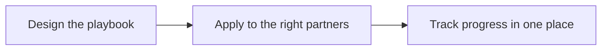
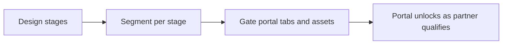
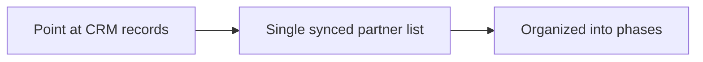
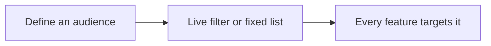
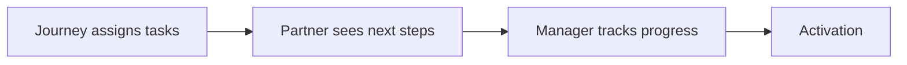
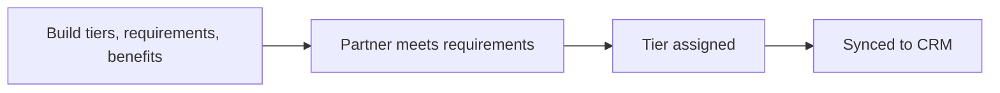

# Introw docs (docs.introw.io): features-partners

Verbatim from docs.introw.io/llms-full.txt, fetched 2026-09-29. 34 pages.

# Partners
Source: https://docs.introw.io/features/partners/index

Auto-detect, organize, and progress partners with your CRM as the single source of truth - management, journeys, tiers, and segments in one place.

> Partners is where your program lives: every partner is detected from your CRM, organized into phases, tiers, and segments, and moved through onboarding and activation, all without a second source of truth.

## The problem it solves

<Pains>
  | Without Introw                     | With Introw                     |
  | ---------------------------------- | ------------------------------- |
  | The partner list drifts to a sheet | One list, owned by the CRM      |
  | Onboarding lives in someone's head | A journey every partner runs    |
  | Quiet partners surface at review   | Stalls are visible early        |
  | Tiers are a slide, not a ladder    | Requirements and benefits, live |
</Pains>

## Impact

Partners invest where they can see the ladder. A visible stage, a named owner and a next step is most of what separates a program they grow in from a logo they signed with.

<Impact>
  for your business

  * **In your CRM**
    Partners are detected and synced from HubSpot or Salesforce, so there is one partner list and it is the CRM's
  * **Cost to run**
    Phases, tiers, journeys and segments are all configured by partner ops, with no engineering
  * **Live in days**
    The structure of a real program, phases, tiers and onboarding journeys, stands up in an afternoon

  for your partners

  * **Self-serve**
    The portal opens up as they qualify, so nobody grants them access step by step
  * **Enabled**
    A journey gives them the next step, and a tier tells them what the step after that unlocks
  * **Efficient**
    One named owner, one clear stage, and a checklist instead of a monthly catch-up call

  [A day in the life of a reseller](/days-in-the-life/reseller)
</Impact>

<Personas>
  * **Partner Managers** - the relationship, without leaving
  * **Partner Operations** - phases, tiers, journeys, segments
  * **VP Partnerships** - activation as a leading indicator
  * **Partners** - a visible ladder and next step
</Personas>

## How this area works

A partner program falls apart when partner data lives in a spreadsheet that drifts from the CRM. Partners keeps your CRM as the system of record and builds the program on top of it. Partners are auto-detected from the companies or records you already manage in HubSpot or Salesforce, and kept in sync both ways. They are organized with the structure a real program needs: lifecycle phases, tiers and targeting segments.

**Where this sits in a setup.** Immediately after the CRM. Every [setup track](/tracks) gets partners and their contacts in before building anything they will see.

<Rail>
  * 

    [**Partner Management**](./partner-management)

    Detect partners from the CRM, and phase them.

    [How to · 5 guides](./partner-management/technical)

  * 

    [**Journeys**](./journeys)

    Onboarding and activation as a repeatable playbook.

    [How to · 4 guides](./journeys/technical)

  * 

    [**Tiers**](./tiers)

    Requirements and benefits, synced to the CRM.

    [How to · 2 guides](./tiers/technical)

  * 

    [**Segments**](./segments)

    Group partners into dynamic or static segments that target content, notifications, and more.

    [How to · 4 guides](./segments/technical)

  * 

    [**Partner Onboarding**](./onboarding)

    Onboard partners progressively, unlocking tabs, assets, and abilities as they qualify.

    [How to · 1 guide](./onboarding/technical)

  * 

    [**Partner Team**](./team)

    Assign your team to each partner and let that ownership drive the program.

    [How to · 1 guide](./team/technical)

  * 

    [**Tasks**](./tasks)

    Clear next steps, shown in the portal.

    [How to · 1 guide](./tasks/technical)
</Rail>

From there, you progress partners deliberately. Onboarding and activation are run as repeatable journeys instead of one-off reminders, so a new partner reaches first deal faster and a quiet partner gets caught before the next review, not after. Tiers set the benefits and requirements that motivate partners to grow, and segments decide who sees what across the rest of the product.

Because everything sits on the CRM, the program stays clean: no rogue objects, no duplicate partner lists, and every status change reconciled to the record your revenue team already trusts.

## The spine the rest of the program hangs off

Partner management is not one stage of the relationship, it is the record every other stage reads from.
Partners arrive through CRM detection or an [intake form](/features/forms) you publish. [Journeys](./journeys)
run onboarding and activation. [Tiers](./tiers) and [goals](/features/reporting/goals) define what growth
looks like and what it earns. [Deal registration](/features/deal-registration) and
[visibility and collaboration](/features/co-selling) carry the business itself.
[Reporting](/features/reporting) and business reviews close the loop and set the next plan. Every one of
those reads the partner's phase, tier, and segments from here, which is why a change made once shows up
everywhere.

## The partner lifecycle, stage by stage

| Stage            | What happens                                              | The feature                                                                                                                                                                                                                                                                                   | What runs without a person                                                          |
| ---------------- | --------------------------------------------------------- | --------------------------------------------------------------------------------------------------------------------------------------------------------------------------------------------------------------------------------------------------------------------------------------------- | ----------------------------------------------------------------------------------- |
| Recruit          | New partners apply or get found                           | [Partner application form](/features/forms/form-builder/guides/set-up-a-partner-application-form), [Partner Directory](/features/portal/partner-directory), [Crossbeam](/features/integrations/crossbeam), [scouting from your AI assistant](/headless/agentic-use-cases/partner-acquisition) | A submitted application creates the partner, links it in the CRM, and invites them  |
| Onboard          | The partner gets set up and signs the paperwork           | [Journeys](./journeys), [Partner Onboarding](./onboarding), [agreements](./onboarding/guides/get-partner-agreements-signed)                                                                                                                                                                   | Tabs, assets, and abilities open up as the partner qualifies                        |
| Activate         | The partner learns the product and takes first steps      | [Tasks](./tasks), [Courses](/features/courses), [Content](/features/content), [Engagement](/features/engagement)                                                                                                                                                                              | Courses assign by segment, and announcements and notifications go out on their own  |
| Grow and co-sell | The partner brings and works deals                        | [Deal registration](/features/deal-registration), [Shared Pipelines](/features/co-selling/shared-pipelines), [Referrals](/features/referrals)                                                                                                                                                 | Conflict checks run on submission, and deal updates reach the partner automatically |
| Review           | You and the partner look at results and set the next plan | [Reporting](/features/reporting), [Goals](/features/reporting/goals), QBR prep from the [AI copilot](/features/ai/copilot) or [your AI assistant](/headless/agentic-use-cases/qbrs-meeting-prep)                                                                                              | Goal progress and pace status update from the CRM                                   |
| Reward           | The partner earns for what they did                       | [Tiers](./tiers), [Commissions](/features/commissions), [Introw Pay](/features/commissions/introw-pay), [MDF](/features/mdf)                                                                                                                                                                  | Commission lines book from CRM data, and a workflow updates the tier                |

The long tail runs on the same rails. In one [workflow](/features/automation/workflows), a partner
completes a course, a [certificate](/features/courses/certificates) is issued, a one-off commission is
added for the partner, and their tier property is updated. Nobody on your team touches it, and every
step lands in the CRM.

## Every partner gets the attention of a strategic one

Most programs can only give real attention to their top ten partners. Everyone else gets a quarterly email
and a portal they rarely open, and that lack of hours, not lack of intent, is why long-tail partners
underperform. Here, progression is structural rather than remembered: phases and tiers update from the CRM
and from [workflows](/features/automation/workflows), journeys hand each partner their next step, segments
unlock the program as they qualify, and goals say who is off pace this week. The same attention then runs
across the whole base without more headcount. From the partner's side, being one of two hundred is
indistinguishable from being one of ten.

## Run it from your AI assistant

<Headless>
  * Which Gold partners haven't registered a deal this quarter?
  * Move Acme up to the Gold tier.
  * Prepare a QBR for my top partner.
</Headless>

---

# Assign a journey and track progress
Source: https://docs.introw.io/features/partners/journeys/guides/assign-a-journey-and-track-progress

Apply a journey to the right partners, then follow each one through to do, in progress, and done so you can step in before anyone stalls.

## What you'll achieve

A journey applied to a selected set of partners, each with their own task progress, and a live read on where every partner sits so you can act on the ones who are stuck. Onboarding or activation actually completes, rather than quietly stalling.

## Before you start

<Steps>
  <Step title="Confirm setup">
    The journey and its tasks should be ready, and the partners you want to apply it to should exist in Introw.
  </Step>
</Steps>

## Watch it

<Tabs>
  <Tab title="Video">
    <video />
  </Tab>

  <Tab title="Click through">
    <iframe />
  </Tab>
</Tabs>

## Steps

### Apply the journey

<Steps>
  <Step title="Open the journey">
    On [Journeys](https://app.introw.io/tasks), open the journey you want to apply.

    <Frame>
      
    </Frame>
  </Step>

  <Step title="Start applying">
    Choose **Assign to partners** to open the partner picker.

    <Frame>
      
    </Frame>
  </Step>

  <Step title="Select the partners">
    Pick the partners who should run this journey, for example a new cohort or a group that has gone quiet. You can apply to many partners at once.

    <Frame>
      
    </Frame>
  </Step>

  <Step title="Confirm">
    Confirm to publish. Introw copies the journey's tasks onto each selected partner so they each get their own progress.

    <Warning>
      Applying a journey copies its tasks onto each partner at that moment. Editing the journey afterward does not rewrite tasks already applied, so a partner keeps the version they were given. Re-apply, or edit their tasks directly, when a later change needs to reach partners already on the journey.
    </Warning>
  </Step>
</Steps>

### Track progress

<Steps>
  <Step title="Read the progress tabs">
    Back on the journey, use the tabs to see partners grouped by **to do**, **in progress**, and **done**. The to do and in progress groups are where your attention is needed, since those partners have not finished.

    <Frame>
      
    </Frame>
  </Step>

  <Step title="Drill into a partner">
    Open a partner to see their specific tasks and how far they have gotten, so you know exactly what is blocking them. For a sequential journey, an unfinished early task blocks the rest, so look for the task they are stuck on.
  </Step>

  <Step title="Follow up">
    Reach out to partners who have stalled, or complete a task on their behalf when that is appropriate, to keep the journey moving. Partners shift between the groups as they complete tasks, giving you a live view of journey health.
  </Step>
</Steps>

## Verify it worked

The journey's progress tabs list the partners you applied it to, starting in **to do**, and each partner sees the tasks on their own task list. As partners work through the journey, they move across **to do**, **in progress**, and **done**, so the tabs always show current journey health.

## Related

<CardGroup>
  <Card title="Build a journey from scratch" icon="book-open" href="./build-a-journey-from-scratch">
    Define the tasks and order first.
  </Card>

  <Card title="Auto-apply a journey from the experience" icon="book-open" href="./auto-apply-a-journey-from-the-experience">
    Enroll partners automatically from the portal instead.
  </Card>

  <Card title="Organize the partners list" icon="book-open" href="/features/partners/partner-management/guides/organize-the-partners-list">
    Reflect lifecycle stage on the partners list.
  </Card>

  <Card title="Implementation reference" icon="screwdriver-wrench" href="../technical">
    Full configuration options for journeys.
  </Card>
</CardGroup>

---

# Auto-apply a journey from the experience
Source: https://docs.introw.io/features/partners/journeys/guides/auto-apply-a-journey-from-the-experience

Use the tasks section in the Introw experience builder to auto-assign an onboarding or activation journey to every partner who gets that experience.

Applying a journey from the [Journeys](https://app.introw.io/tasks) page is a deliberate,
one-time push to a chosen set of partners. The tasks section in the experience builder does
the opposite: it ties a journey to an experience, so every partner who receives that
experience is enrolled automatically. Use it when onboarding should begin on its own as soon
as a partner gets the portal, instead of someone remembering to apply the journey.

## What you'll build

A tasks section in a portal experience that includes one or more journeys and auto-assigns
their tasks to each partner who gets the experience.

## Before you start

<Steps>
  <Step title="Confirm setup">
    The [journey](/features/partners/journeys/guides/build-a-journey-from-scratch) and its
    tasks should be ready, and you should have a portal experience you can edit.
  </Step>
</Steps>

## Watch it

<Tabs>
  <Tab title="Video">
    <video />
  </Tab>

  <Tab title="Click through">
    <iframe />
  </Tab>
</Tabs>

## Steps

<Steps>
  <Step title="Open the experience builder">
    Go to [Portal](https://app.introw.io/templates) and edit the experience that partners
    receive.

    <Frame>
      
    </Frame>
  </Step>

  <Step title="Add a tasks section">
    Add the **Tasks** block to a section of the experience.

    <Frame>
      
    </Frame>
  </Step>

  <Step title="Open the tasks configuration">
    Open the block's settings to reach the **Configure Tasks** panel.

    <Frame>
      
    </Frame>
  </Step>

  <Step title="Choose which journeys to include">
    Under **Journey**, search for and select each journey you want shown here. Turning on
    **Include tasks in this widget** adds that journey's tasks to the section. Pick
    **Standalone tasks** if you also want ad-hoc tasks to appear.

    <Frame>
      
    </Frame>
  </Step>

  <Step title="Decide whether to auto-assign">
    For each included journey, set **Auto-create tasks for partners when publishing**:

    * **On** - every partner who gets this experience is automatically enrolled in the
      journey and receives its tasks. This is the auto-apply behavior. On a tab restricted to
      segments, only partners in those segments are enrolled, and a partner who joins one of
      those segments later is enrolled the moment they do.
    * **Off** - the section only displays journey tasks a partner already has; it does not
      enroll anyone.

    <Frame>
      
    </Frame>
  </Step>

  <Step title="Save and publish">
    Save the configuration, then publish the experience so the rule takes effect for
    partners who receive it.

    <Frame>
      
    </Frame>
  </Step>
</Steps>

## Verify it worked

A partner who receives the experience automatically has the included journey's tasks on
their task list, without anyone applying the journey by hand.

## Limits & gotchas

<Warning>
  Auto-assignment runs when the experience is published to a partner, and, on a
  segment-restricted tab, when a partner enters one of the tab's segments. A contact-level
  segment does not enrol a partner, and leaving a segment hides the tab but keeps the tasks
  already created. Editing the journey afterward does not rewrite tasks already created for
  partners who were enrolled earlier. Auto-create is per journey; **Standalone tasks** cannot
  be auto-created.
</Warning>

## Related

<CardGroup>
  <Card title="Assign a journey and track progress" icon="book-open" href="./assign-a-journey-and-track-progress">
    Push a journey to a chosen set of partners manually and follow their progress.
  </Card>

  <Card title="Create and show partner tasks" icon="book-open" href="/features/partners/tasks/guides/create-and-show-partner-tasks">
    Show partners their tasks inside the portal.
  </Card>
</CardGroup>

---

# Build a journey from scratch
Source: https://docs.introw.io/features/partners/journeys/guides/build-a-journey-from-scratch

Define your own ordered or flexible set of partner tasks, with each task's assignee, due date, visibility, and auto-complete action set.

## What you'll achieve

A reusable journey whose tasks, order behavior, assignees, due dates, visibility, and auto-complete actions all match how you actually onboard or activate partners. Once built, you apply it to a cohort and each partner gets their own copy of the tasks to work through.

## Before you start

<Steps>
  <Step title="Confirm access">
    You need write access to Journeys.
  </Step>

  <Step title="Know the steps">
    Have the list of tasks a partner should complete in mind, and whether any task must be finished before the next can start.
  </Step>
</Steps>

## Watch it

<Tabs>
  <Tab title="Video">
    <video />
  </Tab>

  <Tab title="Click through">
    <iframe />
  </Tab>
</Tabs>

## Steps

### Create the journey

<Steps>
  <Step title="Create the journey">
    On [Journeys](https://app.introw.io/tasks), choose **Add**, then **Journey**, and pick create from scratch. Give it a **Name** that says what stage it covers, like onboarding or activation, since that name identifies it to your team and in the list.

    <Frame>
      
    </Frame>
  </Step>

  <Step title="Choose the task execution order">
    Set how partners move through the tasks:

    * **Flexible** - partners can complete tasks in any order. Use it when the steps are independent.
    * **Sequential** - a task only unlocks once the previous one is done. Use it when later steps genuinely depend on earlier ones, such as signing an agreement before accessing deal registration.

    <Frame>
      
    </Frame>
  </Step>
</Steps>

### Build the tasks

<Steps>
  <Step title="Add a task">
    Add a task and give it a clear name. Open the task to set its details. Every task you add walks the same set of inputs below.
  </Step>

  <Step title="Set the task details">
    For each task, set:

    * **Due date** - on a journey task this is an offset, a number of days after the journey is applied to the partner, rather than a fixed date. Set it so each step has a realistic deadline relative to when onboarding starts; leave it empty for no due date.
    * **Assignee** - who is responsible for completing the task. Choose **your team** (anyone on your side), **Partner** (anyone on the partner's team), **Role** (anyone on the partner's team with a specific role), or **Individual** (a named person; you can dynamically assign it to the partner's assigned partner manager). Pick the level of accountability the step needs.
    * **Visibility** - who can see the task: **Public** (your team and the partner), **Internal** (your team only), or **Assignee** (your team plus the assignee). A task assigned to a partner must stay visible to them, so it cannot be Internal.
    * **Description** - the instructions the partner reads. Write enough that they know exactly what to do without asking.
    * **Attachment** - an optional file to attach to the task for reference.
  </Step>

  <Step title="Add an auto-complete action">
    To let a task complete itself when the partner does something in the portal, use **Add action** on the task and pick the **Action type**:

    * **Watch asset** - completes when the partner views a chosen asset. Select the asset.
    * **Upload** - completes when the partner uploads a file.
    * **Submit form** - completes when the partner submits a chosen form. Select the form.
    * **Go to link** - completes when the partner opens a link. Enter the URL.
    * **Complete course** - completes when the partner finishes a chosen course. Select the course.
    * **Obtain certificate** - completes when the partner earns a chosen certificate. Select the certificate.

    Set the **Button label** the partner sees on the task, then save the action. Auto-complete actions remove manual check-off and give you a clean signal that the partner actually did the step. **Complete course** and **Obtain certificate** finish automatically when the partner completes the course or is issued the certificate, which makes them a natural fit for certification and training journeys.
  </Step>

  <Step title="Order the tasks">
    Drag the tasks into the sequence partners should follow. Order matters most for a sequential journey, since it sets the unlock path; for a flexible journey it sets the order partners see.
  </Step>
</Steps>

## Verify it worked

The journey appears on [Journeys](https://app.introw.io/tasks) with your tasks, the order behavior you chose, and each task's assignee, due-date offset, visibility, and any action. It is ready to apply to partners.

## Related

<CardGroup>
  <Card title="Create a journey from a template" icon="book-open" href="./create-a-journey-from-a-template">
    Start from a built-in playbook instead.
  </Card>

  <Card title="Assign a journey and track progress" icon="book-open" href="./assign-a-journey-and-track-progress">
    Apply the journey and follow partners through it.
  </Card>

  <Card title="Auto-apply a journey from the experience" icon="book-open" href="./auto-apply-a-journey-from-the-experience">
    Enroll partners automatically from the portal.
  </Card>

  <Card title="Implementation reference" icon="screwdriver-wrench" href="../technical">
    Full configuration options for journeys.
  </Card>
</CardGroup>

---

# Create a journey from a template
Source: https://docs.introw.io/features/partners/journeys/guides/create-a-journey-from-a-template

Start from a built-in onboarding, activation, or certification journey, then tailor the tasks, order, assignees, and auto-complete actions to your program.

## What you'll achieve

A new journey seeded from a built-in template and tailored to your program: the right tasks, execution order, per-task assignees and due dates, visibility, and auto-complete actions, ready to apply to a cohort.

## Before you start

<Steps>
  <Step title="Confirm access">
    You need write access to Journeys.
  </Step>
</Steps>

## Watch it

<Tabs>
  <Tab title="Video">
    <video />
  </Tab>

  <Tab title="Click through">
    <iframe />
  </Tab>
</Tabs>

## Steps

<Steps>
  <Step title="Open the add chooser">
    On [Journeys](https://app.introw.io/tasks), choose **Add**, then **Journey**.

    <Frame>
      
    </Frame>
  </Step>

  <Step title="Pick a template">
    Choose the playbook that fits the moment:

    * **Partner onboarding** - the steps a brand-new partner works through to get set up.
    * **Partner activation** - the steps that push a signed partner toward their first win.
    * **Certification journey** - the steps that drive a partner through training and certification.

    <Frame>
      
    </Frame>
  </Step>

  <Step title="Review the seeded tasks">
    The journey opens with a starting set of tasks. Read through them and keep the ones that fit your program.
  </Step>

  <Step title="Set the execution order">
    Confirm the **task execution order**: **Flexible** lets partners complete tasks in any order, while **Sequential** unlocks each task only after the previous one is done. Switch it if the template's default does not match how dependent your steps are.
  </Step>

  <Step title="Tailor each task">
    For each task you keep, open it and adjust the same inputs you would set when building from scratch:

    * **Due date** - the offset in days after the journey is applied, so each step has a deadline relative to onboarding start.
    * **Assignee** - your team, the **Partner**, a specific **Role** on the partner's team, or a named **Individual** (which can dynamically resolve to the partner's assigned partner manager).
    * **Visibility** - **Public**, **Internal**, or **Assignee** (a partner-assigned task cannot be Internal).
    * **Description** - reword the instructions to match your program's voice and specifics.
    * **Action** - add or change an auto-complete action (**Watch asset**, **Upload**, **Submit form**, **Go to link**, **Complete course**, or **Obtain certificate**) so the task completes itself when the partner acts, with the **Button label** they see. **Complete course** and **Obtain certificate** are especially useful in a certification journey, since they close the task the moment the partner finishes the course or earns the certificate.

    Add steps unique to your program and remove any that do not apply.
  </Step>
</Steps>

## Verify it worked

The new journey appears on [Journeys](https://app.introw.io/tasks) with its tailored tasks and order, ready to apply to partners.

## Related

<CardGroup>
  <Card title="Build a journey from scratch" icon="book-open" href="./build-a-journey-from-scratch">
    Start with a blank journey instead.
  </Card>

  <Card title="Assign a journey and track progress" icon="book-open" href="./assign-a-journey-and-track-progress">
    Apply the journey and follow partners through it.
  </Card>

  <Card title="Implementation reference" icon="screwdriver-wrench" href="../technical">
    Full configuration options for journeys.
  </Card>
</CardGroup>

---

# Journeys
Source: https://docs.introw.io/features/partners/journeys/index

Run partner onboarding and activation as repeatable task journeys - so new partners reach their first deal faster and quiet ones get caught early.

> Journeys turn onboarding and activation from a memory exercise into a repeatable playbook: a defined set of tasks, applied to the right partners, tracked to completion.

## The problem it solves

Onboarding and activation usually live in someone's head and a pile of reminders:

<Pains>
  | Without Introw                    | With Introw                  |
  | --------------------------------- | ---------------------------- |
  | First deal takes too long         | One guided path for everyone |
  | Quiet partners surface at review  | Stalls are visible early     |
  | It depends on someone remembering | The journey is the process   |
  | No view of who is stuck           | To do, in progress, done     |
</Pains>

## Impact

The first ninety days decide whether a partner ever sells anything. A repeatable path through them is the least glamorous and most reliable advantage you can have.

<Impact>
  for your business

  * **Live in days**
    Start from the onboarding, activation or certification template and adapt it, rather than designing from nothing
  * **Cost to run**
    Partner ops builds and changes journeys with no code, so the playbook improves without a release
  * **No new tool**
    Task reminders reach partners in their inbox and chat, so the playbook runs without portal logins

  for your partners

  * **Self-serve**
    A checklist that tells them what is next, in order or in any order you allow
  * **Enabled**
    Every new partner gets the same guided path, so nothing depends on who onboarded them
  * **Efficient**
    They are nudged before they stall, rather than chased after they already have

  [A day in the life of a reseller](/days-in-the-life/reseller)
</Impact>

<Personas>
  * **Partner Managers** - who is stalling, early
  * **Partner Operations** - the playbook every partner runs
  * **Partners** - a clear path to productive
</Personas>

## See it work

<Tour>
  * 

    **Start from a template**

    Partner onboarding, activation, or certification.

  * 

    **Set the order**

    Strictly sequential, or any order they like.

  * 

    **Apply it**

    To the partners who need it, in one pass.

  * 

    **Watch it move**

    To do, in progress and done, per partner.
</Tour>

## How it works

A journey is a reusable set of tasks you apply to partners, the playbook for a stage
of the relationship. Introw ships with starting points for the moments that matter
most: partner onboarding, partner activation, and certification. You can use one as
is, adapt it, or build your own from scratch, choosing whether tasks must be done in
order or can be completed in any sequence.

Once a journey exists, you apply it to the partners who need it and watch them move
through it. Each partner's progress is visible across to do, in progress, and done,
so a partner manager can see who is stalling and step in before a new partner goes
cold or an existing one quietly disengages. Because reminders and updates reach
partners where they already work, the playbook keeps running even when no one is
logged into a portal.

Journeys make the partner lifecycle a process you run, not a set of tasks you
remember. Partner ops designs the playbook once, partner managers apply it to the
right partners, and everyone sees progress in one place. New partners get to first
deal on a shorter, more consistent path, and the partners who stall surface early
enough to do something about it.

## Run it from your AI assistant

<Headless>
  * For the three partners who signed this week, create their onboarding tasks and assign the first to each.
  * Which partners are stalled midway through onboarding with no task completed in 14 days?
  * Draft a nudge comment for every partner behind on their activation steps.
  * Show each new partner's onboarding progress - to do, in progress, and done.
  * Advance Acme's lifecycle phase to active now that their onboarding tasks are complete.
</Headless>

## Going deeper

<CardGroup>
  <Card title="How to" icon="screwdriver-wrench" href="./technical">
    Setup, configuration, and all how-to guides.
  </Card>

  <Card title="API reference" icon="code" href="/general/introduction">
    Integration surface and code.
  </Card>
</CardGroup>

**Works with**

<CardGroup>
  <Card title="Tasks" icon="users" href="/features/partners/tasks">
    Journeys are built from tasks.
  </Card>

  <Card title="Partner Onboarding" icon="users" href="/features/partners/onboarding">
    Drive progressive onboarding.
  </Card>

  <Card title="Enrollments" icon="graduation-cap" href="/features/courses/enrollments">
    Make a course a journey step.
  </Card>

  <Card title="Workflows" icon="bolt" href="/features/automation/workflows">
    Enroll a partner in a journey automatically, and reward them when they finish it.
  </Card>
</CardGroup>

---

# Journeys
Source: https://docs.introw.io/features/partners/journeys/technical/index

Create partner onboarding and activation journeys, apply them to segments or individual partners, and track task completion and progress in Introw.

## Where it lives

Journeys lives at [Journeys](https://app.introw.io/tasks).

<Frame>
  
</Frame>

## Before you start

| You need                 | Why                         | Fix it                                                                                        |
| ------------------------ | --------------------------- | --------------------------------------------------------------------------------------------- |
| Write access to Journeys | To create and apply them    | [Internal roles](/features/access/team-management/guides/create-an-internal-role)             |
| Partners in Introw       | A journey is applied to one | [Detect partners](/features/partners/partner-management/guides/detect-partners-from-your-crm) |

## How it works

A journey is a reusable set of tasks. You build a journey once, then apply it to the
partners who should run it. Applying a journey copies its tasks onto each selected
partner, so every partner gets their own progress while the journey itself stays the
journey definition.

You choose how a journey's tasks behave. With a **flexible** order, partners can
complete tasks in any sequence. With a **sequential** order, a task only unlocks
after the previous one is done, which is useful when steps build on each other.
Introw provides starting templates for onboarding, activation, and certification so
you do not begin from a blank page, and you can also create a journey from scratch.

Progress is tracked per partner across **to do**, **in progress**, and **done**, and
you can view all the partners on a journey from the journey's own tabs.

### Activation best practices

Signing a partner is not the same as activating one. A few patterns, drawn from what
works across programs, turn new partners into productive ones:

* **Make the lifecycle explicit.** Put partners on a journey so the path to first value
  (first deal, first certification) is a clear checklist rather than something a partner
  manager carries in their head.
* **Give every step an owner and a deadline.** Use per-task assignees and due-date offsets
  so each step has accountability and a realistic timeframe relative to when onboarding
  starts.
* **Train early.** Pair the journey with onboarding courses so partners can sell and deliver,
  not just complete admin steps.
* **Nudge and recap.** Use partner notifications to keep deals moving and to recap progress,
  so a stalled partner gets a prompt instead of going quiet.

The aim is a repeatable activation motion: new partners reach their first win faster and
stall less often.

## Settings & configuration

Journeys are managed from the [Journeys](https://app.introw.io/tasks) page. Each
journey has its own configuration and progress views.

### Creating a journey

**Add** opens a chooser with built-in journeys (onboarding, activation, and
certification) and a **create from scratch** option. Picking a template seeds the
journey with a sensible set of starting tasks you can edit.

**Name** identifies the journey in the list and to your team. Give it a name that
says what stage it covers, like onboarding or activation.

**Task execution order** is the key behavior setting. **Flexible** lets partners
complete tasks in any order; **sequential** requires each task to be finished before
the next opens. Choose sequential when later steps genuinely depend on earlier ones.

### Tasks within a journey

On a journey's configuration view you add, edit, reorder, and remove the tasks
partners will complete. Order matters most when the journey is sequential, since it
sets the unlock sequence. On each task, **Add action** configures how the task
completes automatically when a partner watches an asset, submits a form, uploads a
file, opens a link, completes a course, or obtains a certificate. The course and
certificate actions pair naturally with a certification journey, closing the task the
moment the partner finishes the course or is issued the certificate.

### Applying and tracking

**Apply** publishes the journey to a chosen set of partners, copying its tasks to
each of them. The journey's progress tabs then show partners grouped by where they
are: to do, in progress, and done. You can also see and complete a partner's tasks
from that partner's own task list.

### Automate it with a workflow

A journey both starts automation and is started by it. **Enrolled in journey** and **Journey completed** are [workflow](/features/automation/workflows/technical) triggers, and **Enroll in a journey** is a workflow action, the same operation as **Apply** on the partner page, so a partner already on the journey keeps their progress.

That closes the loop at both ends: put every new partner on the onboarding journey the moment they appear, and pay the bonus, award the certificate and unlock the next stage the moment they finish it. See [Onboard a new partner automatically](/features/automation/workflows/guides/onboard-a-new-partner-automatically) and [Reward a finished journey](/features/automation/workflows/guides/reward-a-finished-journey).

A mid-flow fork can read **Journey progress right now**, which after a wait is a different answer to the one the trigger recorded, so a chase can stop as soon as the partner gets going.

## How-to guides

<Rail>
  * 

    [**Assign a journey and track progress**](/features/partners/journeys/guides/assign-a-journey-and-track-progress)

    Apply a journey to the right partners, then follow each one through to do, in progress, and done so you can step in before anyone stalls.

  * 

    [**Auto-apply a journey from the experience**](/features/partners/journeys/guides/auto-apply-a-journey-from-the-experience)

    Use the tasks section in the Introw experience builder to auto-assign an onboarding or activation journey to every partner who gets that experience.

  * 

    [**Build a journey from scratch**](/features/partners/journeys/guides/build-a-journey-from-scratch)

    Define your own ordered or flexible set of partner tasks, with each task's assignee, due date, visibility, and auto-complete action set.

  * 

    [**Create a journey from a template**](/features/partners/journeys/guides/create-a-journey-from-a-template)

    Start from a built-in onboarding, activation, or certification journey, then tailor the tasks, order, assignees, and auto-complete actions to your program.
</Rail>

## Troubleshooting

<Warning>
  Applying a journey copies its tasks onto each partner at that moment; editing the journey afterward does not rewrite tasks already applied. A sequential journey only opens the next task once the current one is done, so an unfinished early task blocks the rest for that partner.
</Warning>

<AccordionGroup>
  <Accordion title="A partner cannot start a later task">
    The journey is sequential and an earlier task is not done yet.
  </Accordion>

  <Accordion title="Edits to a journey did not reach a partner">
    The partner was applied before the edit; re-apply or update their tasks directly.
  </Accordion>

  <Accordion title="A journey shows no partners">
    It has not been applied yet; use **Apply** to publish it.
  </Accordion>
</AccordionGroup>

---

# Build a progressive onboarding path
Source: https://docs.introw.io/features/partners/onboarding/guides/build-a-progressive-onboarding-path

Plan onboarding stages, build a segment per stage, gate portal tabs and abilities by segment, and use journeys to unlock the portal as partners qualify.

## What you'll achieve

A portal that unlocks stage by stage on its own: a dynamic segment per onboarding stage, tabs, sections, and abilities gated to those segments, and a journey driving partners forward. Partners graduate automatically as they qualify, with no manual access grants.

## Before you start

<Steps>
  <Step title="Confirm access and setup">
    You need permission to create segments and edit experiences, a published portal experience partners can reach, and a connected CRM so dynamic segments can filter on live partner data.
  </Step>

  <Step title="Know your milestones">
    Identify the signal that promotes a partner into each stage, such as a completed journey, a certificate, a tier, or a CRM property value.
  </Step>
</Steps>

## Watch it

<Tabs>
  <Tab title="Video">
    <video />
  </Tab>

  <Tab title="Click through">
    <iframe />
  </Tab>
</Tabs>

## Steps

### Plan the stages

<Steps>
  <Step title="List the stages">
    Decide the stages a partner passes through, for example Welcome, Trained, Selling, and Established. Keep them few enough that each one is a meaningful step up.
  </Step>

  <Step title="Decide what each stage unlocks">
    For each stage, list the tabs, asset sections, and abilities (forms, deal registration, courses) that should become available. This is the reward a partner earns by reaching the stage.
  </Step>

  <Step title="Pick the promotion milestone">
    For each stage, choose the single measurable condition that promotes a partner into it, so it can become a dynamic segment filter. One clear condition per stage keeps advancement predictable.
  </Step>
</Steps>

### Create a segment per stage

<Steps>
  <Step title="Open Segments">
    Go to [Segments](https://app.introw.io/settings/segments) and create a **dynamic** segment for each stage. A dynamic segment recomputes its membership from filters, which is what makes graduation automatic.

    <Frame>
      
    </Frame>
  </Step>

  <Step title="Set the qualifying filter">
    On the segment's **Audience** tab, add the filter that defines the stage, such as a tier reached, a certificate earned, an onboarding journey complete, or a CRM property value. Membership then tracks that milestone, so partners enter the segment the moment they qualify. Every stage segment needs at least one condition anyway, since a segment with none matches everyone and is not allowed to override your default. Stage filters do not need to exclude earlier stages: a partner in a later stage usually still matches the earlier segments, and that is safe, because when overrides overlap the most permissive one wins and every stage they have earned keeps adding up.

    <Frame>
      
    </Frame>
  </Step>

  <Step title="Check the audience preview">
    Use the audience preview to confirm the partners who currently match are the ones you expect, before any gating depends on the segment.

    <Frame>
      
    </Frame>
  </Step>
</Steps>

### Gate the experience

<Steps>
  <Step title="Open the experience">
    Go to [Experiences](https://app.introw.io/templates) and open the experience partners use.
  </Step>

  <Step title="Restrict tabs to stage segments">
    On a stage's tab, restrict it to the segment for that stage so only partners who have reached it see the tab. A tab restricted to a segment is invisible to everyone else, which is the core of progressive unlocking.
  </Step>

  <Step title="Gate sections and abilities">
    Within a visible tab, restrict individual sections to a segment when only later-stage partners should see them. Do the same for ability-bearing sections such as asset libraries, forms, and deal registration, so later stages unlock real capability, not just more pages.
  </Step>

  <Step title="Tune stage permissions">
    On each stage segment, open **Permissions**, switch on **Override the default for this segment**, and set only what that stage unlocks, such as **Invite colleagues**. See [Create a dynamic segment](/features/partners/segments/guides/create-a-dynamic-segment) for the permission options. Leave the override off on any stage that changes nothing, and it inherits your baseline. Because overlapping overrides merge most-permissive, a stage can never take back what an earlier one gave. Set your baseline on the organisation-wide **All partners · Default**.

    **See all shared records** works the same way: leave it off on the default and turn it on in the stages that earn it. Because overrides merge most-permissive, a stage cannot hold a group back from something another of their segments grants, so grant narrowly rather than broadly. See [Layer segments to progressively unlock capabilities](/features/partners/segments/guides/layer-segments-to-progressively-unlock).
  </Step>
</Steps>

### Drive partners forward and publish

<Steps>
  <Step title="Apply an onboarding journey">
    Give partners an onboarding journey so they always have a concrete next step. As they complete it and hit the milestones your segments key on, they roll into the next stage's segment and the matching tabs unlock. See [Build a journey from scratch](/features/partners/journeys/guides/build-a-journey-from-scratch).
  </Step>

  <Step title="Preview by stage">
    Preview the experience as partners in different stages to confirm each sees only their unlocked tabs, sections, and abilities. Catching an over-broad segment here avoids exposing content to the wrong partners.
  </Step>

  <Step title="Publish">
    Publish the experience to push the gating to linked partner portals. From here, unlocking happens on its own as segment membership updates.
  </Step>
</Steps>

## Verify it worked

A partner in an early stage sees only their tabs, sections, and abilities. When a test partner meets a stage's milestone, they join that stage's segment and the matching content unlocks for them with no manual step.

## Related

<CardGroup>
  <Card title="Create a dynamic segment" icon="book-open" href="/features/partners/segments/guides/create-a-dynamic-segment">
    Build the auto-updating audience and set its permissions.
  </Card>

  <Card title="Layer segments to progressively unlock capabilities" icon="book-open" href="/features/partners/segments/guides/layer-segments-to-progressively-unlock">
    How overlapping segments resolve, and why stages only ever add.
  </Card>

  <Card title="Build a journey from scratch" icon="book-open" href="/features/partners/journeys/guides/build-a-journey-from-scratch">
    Give partners the checklist that moves them forward.
  </Card>

  <Card title="Assign a journey and track progress" icon="book-open" href="/features/partners/journeys/guides/assign-a-journey-and-track-progress">
    Apply the journey and watch partners advance.
  </Card>

  <Card title="Implementation reference" icon="screwdriver-wrench" href="../technical">
    Full configuration options for progressive onboarding.
  </Card>
</CardGroup>

---

# Get partner agreements signed
Source: https://docs.introw.io/features/partners/onboarding/guides/get-partner-agreements-signed

Take a partner from accepting your terms at intake to signing your NDA and partner agreement in DocuSign, and keep every signed document in their own portal.

Paperwork is where partner onboarding stalls. The terms sit on a web page, the NDA and the partner agreement sit in DocuSign, the signed copies end up in somebody's inbox, and the partner is chased by email for all three. This guide puts that whole sequence inside the partner's own portal: a click-through acceptance during intake that lands in your CRM, a signing step for the heavier agreements where the partner already works, and every signed document back in their portal afterwards.

## What you'll achieve

A partner who accepts your terms while applying, with the acceptance written to their record in your CRM. The agreements that need a real signature reach them as a step in their onboarding rather than an email thread. The signed documents live in their portal, visible to them and to nobody else. And what an unsigned partner can do is gated automatically, instead of being tracked by hand.

## Who does what

| Step                                                 | Where it runs                                                                             |
| ---------------------------------------------------- | ----------------------------------------------------------------------------------------- |
| Accept your terms, click-through                     | Introw. A checkbox on the form, mapped to a property in your CRM                          |
| Prepare, send, countersign and hold the legal record | Your e-signature tool. Introw does not create envelopes and does not hold the audit trail |
| Put the signing step in front of the partner         | Introw. The link lives in their portal as a section, an asset, or a journey task          |
| Chase it, gate on it, report on it                   | Introw. Journeys, segments and portal experiences, keyed on CRM data                      |
| Give the signed document back to the partner         | Introw. A partner-specific asset in their portal                                          |

<Note>
  There is no DocuSign app to install. Introw does not generate envelopes, and your e-signature tool does not notify Introw when one is signed. Everything below works the same with DocuSign, PandaDoc, Adobe Acrobat Sign, or any tool that gives you a signing URL.
</Note>

## Before you start

<Steps>
  <Step title="Connect your CRM">
    Acceptance and signature milestones are written to CRM properties, and segments read them live. See [Connect HubSpot](/features/integrations/crm/guides/connect-hubspot).
  </Step>

  <Step title="Have your terms page and your signing links">
    The public URL of your terms and conditions, and from your e-signature tool either a reusable signing link for a document every partner signs, or a per-partner envelope link.
  </Step>

  <Step title="Decide what each agreement unlocks">
    Write down which agreement gates which part of the program, for example that deal registration opens only after the partner agreement is signed. That decision drives the segments later in this guide.
  </Step>
</Steps>

## Steps

### Accept your terms at intake

<Steps>
  <Step title="Open your intake form">
    Go to [Forms](https://app.introw.io/forms) and open the form partners apply through. A partner application form already carries a terms and conditions checkbox, so there is nothing to add. On any other form, add a **Checkbox** field from the **Add to form** menu. See [Set up a partner application form](/features/forms/form-builder/guides/set-up-a-partner-application-form).
  </Step>

  <Step title="Point the label at your terms">
    In the field label, replace the placeholder URL with the link to your own terms and conditions, so an applicant can read them before agreeing. Keep the label to one sentence: this step should cost the partner one click.
  </Step>

  <Step title="Record the acceptance in your CRM">
    A ticked box is only useful if it leaves a record. In the field's settings, map it to a CRM object and property, then open the form's **Automation** tab and set how the submission writes:

    * **A boolean property** - who accepted. Map the checkbox to it on the partner's company record, so the fact sits on the account and not only on a form submission.
    * **A date or date-time property** - when they accepted. Set it from the automation as the compliance record of the moment.
    * **Write behavior** - **Fill in if not known** is the default and never overwrites what a rep set. Choose **Overwrite** when you want a later re-acceptance, after a terms update, to replace the earlier date.

    Attribution to the partner is automatic, using the method you defined on Object Linking, so there is nothing to wire per form. See [Map form fields to your CRM](/features/forms/crm-automations/technical).
  </Step>
</Steps>

<Tip>
  For many referral and affiliate programs, this checkbox is the entire agreement. Ask for a countersigned pack only from partners who have shown they will transact. Four documents in front of a partner who has not done anything yet is where onboarding dies.
</Tip>

### Put the signing step inside the portal

<Steps>
  <Step title="Generate the signing link">
    In your e-signature tool, produce the link that opens the document. It comes in two shapes, and they are placed differently in Introw:

    * **One document, every partner** - a reusable signing link, such as a DocuSign PowerForm. The signer identifies themselves on the signing page.
    * **One document, one partner** - an envelope prepared for a named signer, with a link that belongs to that partner alone.
  </Step>

  <Step title="Place the reusable link on the experience">
    In the experience builder, open the onboarding stage and add an **Embed anything** section with the signing URL, so the document renders inside the portal. Some signing pages refuse to be displayed inside another page; when that happens use a **Call to action button** section instead, which opens the signing page in a new tab and keeps the portal as the single starting point. See [Embed external content](/features/portal/experiences/guides/embed-external-content).
  </Step>

  <Step title="Place a per-partner link on the partner">
    Open the partner, go to their **Assets** tab, and add the envelope link with **Web page URL**, set to **Partner Specific**. Surface it through a **Partner Specific Asset Hub** section so each partner sees only their own documents. The same hub will later hold the signed copy, which means one place in the portal covers the agreement before and after it is signed. See [Share an asset with one partner only](/features/content/asset-library/guides/share-an-asset-with-one-partner).
  </Step>

  <Step title="Make it a step in their journey">
    A link nobody is asked to click gets ignored. On the onboarding journey, add a task for the agreement and use **Add action** to close it automatically:

    * **Opens a link** - the task completes when the partner opens the signing link. Use it for the light documents, where reaching the page is enough of a signal to stop chasing.
    * **Uploads a file** - the task completes when the partner returns the executed copy, which then sits on their record. Use it when you need proof rather than intent.

    Set the journey to **sequential** when the NDA has to be signed before anything else opens, give each task a due-date offset, and let partner notifications do the chasing. See [Journeys](/features/partners/journeys/technical).
  </Step>
</Steps>

<Note>
  Introw is not told by your e-signature tool when a document is signed, so **Opens a link** records that the partner reached the signing page, not that they finished. When "signed" has to be a fact, get it from one of two places: the partner uploads the executed copy on the task, or your e-signature tool's own CRM integration writes a property on the partner's CRM record, such as DocuSign writing back to Salesforce, which Introw then reads like any other CRM field. Use the second one whenever the signature gates something.
</Note>

### Gate what a signature unlocks

<Steps>
  <Step title="Build the segment">
    Create a dynamic segment filtered on the property that carries the acceptance or the signature. Dynamic segments re-evaluate as CRM data changes, so a partner joins the moment the property flips. See [Segments](/features/partners/segments/technical).
  </Step>

  <Step title="Restrict the stage to it">
    In the experience, restrict the stage, tab, or section that the agreement unlocks to that segment: deal registration, pricing, marketing funds. An unsigned partner never sees it, and nobody grants access by hand. See [Build a progressive onboarding path](./build-a-progressive-onboarding-path).
  </Step>

  <Step title="Automate the ends">
    Enroll every new partner in the agreements journey with a workflow when they are created, and trigger the next step on **Journey completed**, so the tier, the certificate, or the welcome email follow the signature without anyone watching for it. See [Workflows](/features/automation/workflows/technical).
  </Step>
</Steps>

### Give the signed documents back

<Steps>
  <Step title="Upload the executed copy">
    On the partner's **Assets** tab, add the countersigned PDF as a **Partner Specific** asset and name it for the partner, for example "Reseller agreement 2026" rather than a file name from your drive.
  </Step>

  <Step title="Place it in their hub">
    Point the asset at the Partner Specific Asset Hub section, ideally on a Contracts or Legal stage, so a partner who needs their paperwork a year later finds it themselves instead of emailing their partner manager.
  </Step>
</Steps>

Where your team keeps the legal record does not change. If your e-signature tool files the executed copy into your CRM, it stays there for your team, and the copy in the portal is the partner's own.

## Verify it worked

Submit a test application with the box ticked, then open the partner's record in your CRM: the acceptance property is set and the date property carries the moment. Open the portal as that partner: the agreement step is on their journey and the link opens the right document. Complete the step, and check that the task closes, the segment picks the partner up, and the gated tab appears for them. Finally, upload a signed copy as a partner-specific asset and open the portal as a different partner on the same experience: the hub is there, their own documents are in it, and the first partner's file is nowhere.

## Related

<CardGroup>
  <Card title="Build a progressive onboarding path" icon="book-open" href="./build-a-progressive-onboarding-path">
    Unlock the rest of the portal as partners qualify.
  </Card>

  <Card title="Share an asset with one partner only" icon="book-open" href="/features/content/asset-library/guides/share-an-asset-with-one-partner">
    The mechanics behind partner-owned documents.
  </Card>

  <Card title="Set up a partner application form" icon="book-open" href="/features/forms/form-builder/guides/set-up-a-partner-application-form">
    The intake form the terms checkbox lives on.
  </Card>

  <Card title="Implementation reference" icon="screwdriver-wrench" href="../technical">
    Full onboarding configuration options.
  </Card>
</CardGroup>

---

# Partner Onboarding
Source: https://docs.introw.io/features/partners/onboarding/index

Onboard partners progressively - start small, then unlock portal tabs, assets, and abilities as partners complete steps and qualify for the next stage.

> A partner who lands in a portal full of everything on day one is overwhelmed and does nothing. Progressive onboarding starts them with the essentials and unlocks more, tabs, assets, and abilities, as they complete steps and qualify, so the portal grows with them.

## The problem it solves

<Pains>
  | Without Introw                 | With Introw                     |
  | ------------------------------ | ------------------------------- |
  | A full portal overwhelms them  | Start with the essentials       |
  | Access is granted by hand      | Segments unlock as they qualify |
  | Partners plateau with no pull  | Each unlock is a reward         |
  | There is no path to productive | A designed progression          |
</Pains>

## Impact

A partner who lands in a portal full of everything does nothing. Revealing it as they earn it is the difference between an overwhelmed signup and an activated partner.

<Impact>
  for your business

  * **Live in days**
    The path is designed once and every partner walks it, so nothing is staged per partner by hand
  * **Cost to run**
    It is built from the segments and experiences you already have, so there is nothing new to maintain

  for your partners

  * **Self-serve**
    They unlock the program themselves by qualifying, with nothing to request from anyone
  * **Enabled**
    A focused first stage means they are never lost, and always have one clear next step
  * **Efficient**
    What they earned stays earned: the most permissive stage they match is the one that applies

  [A day in the life of a reseller](/days-in-the-life/reseller)
</Impact>

<Personas>
  * **Partner Managers** - productive without hand-holding
  * **Partner Marketing** - the staged content and unlocks
  * **Partners** - one next step, then the next
</Personas>

## See it work

<Tour>
  * 

    **Decide the unlocks**

    What each stage earns the partner.

  * 

    **Pick the milestone**

    A finished task, a certification, a tier, a CRM field.

  * 

    **Make it a segment**

    A dynamic filter decides who has reached the stage.

  * 

    **Gate the portal**

    Tabs and sections restricted to the stage that earned them.
</Tour>

## How it works

Partner Onboarding is a way of designing the partner experience so it reveals itself over time. You do not expose the full portal to a brand-new partner. You start them with a focused first stage - the few things they need to get going - and let the rest unlock as they earn it. Finish onboarding tasks, pass a certification, reach a tier, or hit a CRM milestone, and new tabs, content, and abilities appear.

This is built by combining what is already in Partners and the Portal. Dynamic segments decide who has reached each stage and update themselves as partner data changes. Portal experiences restrict tabs and sections to those segments, so a partner only sees what they have unlocked. Journeys give them the checklist that drives them forward, and tiers and certificates provide the milestones that flip the switch. The result is a partner who is never lost, always has a clear next step, and feels the program open up as they grow.

Because everything keys off live segment membership, the unlocking is automatic. You design the path once; partners move through it on their own, and you spend your time on the ones who stall, not on manually granting access. Set your baseline once on your organisation default, then give each stage segment only what that stage earns. When a partner matches several stages, the most permissive one wins. Nothing they unlocked is taken away because they still match an earlier stage.

Design the stages of your onboarding, define a dynamic segment for each, and gate the matching portal tabs, assets, and abilities to those segments. Partners start small, complete the steps in front of them, and watch the portal expand as they qualify, turning onboarding into a guided climb instead of a cliff.

## Run it from your AI assistant

<Headless>
  * Which partners signed in the last 30 days but haven't finished onboarding?
  * Create Acme's next onboarding task, assign it to them, and set it due Friday.
  * Show partners who completed onboarding but haven't registered a deal yet.
  * Mark Acme's onboarding tasks complete and move their lifecycle phase to active.
</Headless>

## Going deeper

<CardGroup>
  <Card title="How to" icon="screwdriver-wrench" href="./technical">
    Setup, configuration, and all how-to guides.
  </Card>

  <Card title="API reference" icon="code" href="/general/introduction">
    Endpoints and code.
  </Card>
</CardGroup>

**Works with**

<CardGroup>
  <Card title="Segments" icon="users" href="/features/partners/segments">
    Unlock stages with dynamic segments.
  </Card>

  <Card title="Journeys" icon="users" href="/features/partners/journeys">
    Give partners the onboarding checklist.
  </Card>

  <Card title="Experiences" icon="browser" href="/features/portal/experiences">
    Reveal portal tabs as partners qualify.
  </Card>
</CardGroup>

---

# Partner Onboarding
Source: https://docs.introw.io/features/partners/onboarding/technical/index

Build progressive partner onboarding with journeys, dynamic segments, and segment-gated portal tabs so partners unlock content as they qualify.

## Where it lives

Partner Onboarding sits under **Portal**, at [Experiences](https://app.introw.io/templates).

<Frame>
  
</Frame>

## Before you start

| You need                                | Why                                   | Fix it                                                                                             |
| --------------------------------------- | ------------------------------------- | -------------------------------------------------------------------------------------------------- |
| A published experience                  | Onboarding is what partners land in   | [Publish an experience](/features/portal/experiences/guides/build-and-publish-a-portal-experience) |
| Permission for segments and experiences | Progressive access is built from both | [Internal roles](/features/access/team-management/guides/create-an-internal-role)                  |
| A connected CRM                         | Dynamic segments filter live data     | [Connect a CRM](/features/integrations/crm/guides/connect-hubspot)                                 |
| The milestones you gate on              | A journey, certificate or tier        | [Build a journey](/features/partners/journeys/guides/build-a-journey-from-scratch)                 |

## How it works

Progressive onboarding is not a single setting; it is a pattern you assemble from pieces that already
exist. Three of them do the work together:

* **Journeys** give a partner the ordered checklist that drives them forward, from first login to first
  deal. See [Journeys](/features/partners/journeys).
* **Dynamic segments** decide which stage a partner has reached. A dynamic segment's membership updates
  automatically from its filters, so as a partner completes a journey, earns a certificate, reaches a
  tier, or a CRM property flips, they move into the next segment without anyone touching it. See
  [Segments](/features/partners/segments).
* **Portal experiences** restrict tabs and sections to segments. A tab or section gated to a segment is
  only visible to partners in it, so the portal reveals more as a partner qualifies. See
  [Experiences](/features/portal/experiences).

Put together: define a segment per onboarding stage, gate the matching tabs, asset sections, and
ability-bearing blocks (forms, deal registration, courses) to those segments, and let journeys push
partners forward. A partner sees only their current stage, and the next one appears the moment they
qualify.

## Settings & configuration

You assemble onboarding across [Segments](https://app.introw.io/settings/segments) and the
[Experience builder](https://app.introw.io/templates).

### Define a segment per stage

Create a **dynamic** segment for each onboarding stage and set its audience filters to the condition
that defines that stage, for example onboarding journey complete, a certification earned, or a tier
reached. Membership recomputes as partner data changes, so partners enter the segment automatically when
they qualify. Use the audience preview to sanity-check who currently matches.

Every stage segment needs at least one condition, which it has by definition, and which an overriding
segment requires anyway. Stage filters do not need to exclude earlier stages. A partner in a later stage
usually still matches the earlier segments, and that overlap is safe: when overriding segments overlap,
the most permissive one wins, so each stage a partner earns only ever adds capabilities. See
[Layer segments to progressively unlock capabilities](/features/partners/segments/guides/layer-segments-to-progressively-unlock).

### Gate tabs and sections

In the experience, **restrict a tab to specific segments** so only partners in a stage see it, and do the
same for sections within a stage. Gate the asset sections, forms, and other ability-bearing blocks that
should unlock at each stage. Partners not yet in the segment simply do not see the gated content.

### Drive partners forward

Apply an onboarding **journey** so partners have a concrete checklist. As they complete it (and the other
milestones your segments key on), they roll into the next stage's segment and the matching tabs unlock.

### Tune what each stage can do

Segment **permissions** control abilities like inviting colleagues or how much of their company's shared
data a contact sees, so a stage can unlock not just content but what a partner is allowed to do. Set your
baseline on the organisation-wide **All partners · Default**, then on each stage segment switch on
**Override the default for this segment** and set only what that stage grants. A stage that changes
nothing leaves its override off and inherits the baseline. When a partner matches several override
segments, the most permissive one wins.

**See all shared records** works exactly like invites: withhold it on the default and turn it on in the
stages that earn it. Because overrides merge most-permissive, a partner who still matches earlier stages
keeps everything a later one granted. The flip side is that a stage cannot hold a group back from
something another of their segments grants, so grant narrowly rather than broadly. See
[Layer segments to progressively unlock capabilities](/features/partners/segments/guides/layer-segments-to-progressively-unlock)
and [Create a dynamic segment](/features/partners/segments/guides/create-a-dynamic-segment).

## How-to guides

<Rail>
  * 

    [**Build a progressive onboarding path**](/features/partners/onboarding/guides/build-a-progressive-onboarding-path)

    Plan onboarding stages, build a segment per stage, gate portal tabs and abilities by segment, and use journeys to unlock the portal as partners qualify.

  * [**Get partner agreements signed**](/features/partners/onboarding/guides/get-partner-agreements-signed)

    Take a partner from accepting your terms at intake to signing your NDA and partner agreement in DocuSign, and keep every signed document in their own portal.
</Rail>

## Troubleshooting

<Warning>
  Unlocking is only as accurate as the segment filters, so a partner who does not match a stage's filters will not see its tabs, test the qualifying conditions before launch. Dynamic segment membership cannot be edited partner by partner; change the filters to change who qualifies. Publishing pushes experience changes to linked rooms, so preview each stage first. A partner with no experience assigned cannot be invited at all.
</Warning>

<AccordionGroup>
  <Accordion title="A qualified partner is not seeing a new tab">
    Confirm they match the stage segment's filters and the tab is restricted to that segment.
  </Accordion>

  <Accordion title="Everyone sees everything">
    The tabs are not restricted to segments, or the segments are too broad.
  </Accordion>

  <Accordion title="A partner never advances">
    The milestone the segment keys on is not being met or recorded; check the journey, certificate, or CRM property.
  </Accordion>

  <Accordion title="A stage's content changed for the wrong partners">
    A gated section used a segment broader than intended.
  </Accordion>

  <Accordion title="A stage's restriction is not applying">
    Either the stage segment's override switch is off, so it inherits the default, or the contact matches another override segment that grants more and the most permissive one wins. For invites and notifications, put the baseline on the organisation default rather than on a stage.
  </Accordion>

  <Accordion title="A stage sees more than it should">
    Another segment the partner matches grants it, and overrides merge most-permissive. Withhold the capability on the default and grant it only on the stages that earn it.
  </Accordion>
</AccordionGroup>

---

# Bulk update partners
Source: https://docs.introw.io/features/partners/partner-management/guides/bulk-update-partners

Bulk edit tier, commission plan, currency, team roles, or the published portal experience for many partners at once, without updating them one by one.

## What you'll achieve

A whole cohort of partners updated in one pass: their tier, commission plan, currency, or a team role changed through the bulk edit dialog, or their published experience created or swapped through the bulk actions bar. What would have been dozens of identical edits becomes a single action.

## Before you start

<Steps>
  <Step title="Confirm access">
    You need write access to Partners. Tiers, commission plans, team roles, and experiences must already exist for the values you want to apply.
  </Step>
</Steps>

## Watch it

<Tabs>
  <Tab title="Video">
    <video />
  </Tab>

  <Tab title="Click through">
    <iframe />
  </Tab>
</Tabs>

## Steps

<Steps>
  <Step title="Select partners">
    On [Partners](https://app.introw.io/partners), use the row checkboxes to select every partner you want to change. The header shows how many are selected and opens the bulk actions bar. Filter the list first so you select exactly the cohort you mean.

    <Frame>
      
    </Frame>
  </Step>

  <Step title="Open bulk edit">
    Click **Edit** in the bulk actions bar to open the bulk edit dialog for your selection.

    <Frame>
      
    </Frame>
  </Step>

  <Step title="Choose the property to update">
    Under **Property to update**, pick what you are changing. One bulk edit changes one property across the whole selection:

    * **Tier** - move every selected partner to the chosen tier. Use it after a tier review to promote or demote a cohort at once.
    * **Commission Plan** - set the commission plan(s) for the selection, so their conversions calculate against the right plan.
    * **Currency** - set the currency the selected partners transact in. Available when multi-currency is enabled.
    * **A team role** (listed by its name, such as **Partner manager**) - assign a team member to that role across the selection. The dialog then asks for the **User** to assign.

    <Frame>
      
    </Frame>
  </Step>

  <Step title="Set the new value">
    Choose the tier, commission plan, currency, or team member that should apply to all selected partners. When assigning a team role to partners that already have someone in that role, Introw asks whether to replace the existing assignment.
  </Step>

  <Step title="Apply the update">
    Click **Update** to save. Introw updates every selected partner and clears the selection when it finishes.

    <Frame>
      
    </Frame>
  </Step>

  <Step title="Roll out an experience in bulk (optional)">
    To change which experience a cohort is published with, keep the partners selected and use the bulk actions bar instead of the Edit dialog:

    * **Apply experience** - publish the selected partners with an experience, creating their partner portals in one pass. Use it to launch portals for a new cohort.
    * **Update experience** - swap the experience the selected partners already use, updating their existing portals. Use it to move a cohort onto a refreshed or rebranded experience.
  </Step>

  <Step title="Delete partners in bulk (optional)">
    To remove a cohort, keep them selected and click **Delete** in the bulk actions bar. Because this is permanent, Introw asks you to type **delete** in the confirmation box before **Yes, Delete** turns on, so a bulk delete is always deliberate. Deleting a single partner from its row menu works the same way, except you confirm by typing that partner's name.
  </Step>
</Steps>

## Verify it worked

The partners you selected show the new value in the list, and the bulk actions bar is gone because the selection cleared. If you applied an experience, the selected partners now have portals on that experience.

## Related

<CardGroup>
  <Card title="Organize the partners list" icon="book-open" href="./organize-the-partners-list">
    Filter and view the list before you select a cohort.
  </Card>

  <Card title="Wire partner ownership" icon="book-open" href="/features/partners/team/guides/wire-partner-ownership">
    Define team roles and assign owners on a single partner.
  </Card>

  <Card title="Implementation reference" icon="screwdriver-wrench" href="../technical">
    Full configuration options for the partners list.
  </Card>
</CardGroup>

---

# Create a partner manually
Source: https://docs.introw.io/features/partners/partner-management/guides/create-a-partner-manually

Add a single partner by hand and link it to its CRM company before automatic sync detects it, so you can start onboarding right away.

## What you'll achieve

A single partner added directly, linked to its CRM company where one exists, sitting on the partners list with a detail page ready for you to set their phase, tier, experience, and other fields. The new partner behaves exactly like a detected one, just created on demand.

## Before you start

<Steps>
  <Step title="Confirm access">
    You need write access to Partners. Connecting your CRM first lets Introw prefill company data and link the new partner back to its record, but you can also create one with no CRM connected.
  </Step>
</Steps>

## Watch it

<Tabs>
  <Tab title="Video">
    <video />
  </Tab>

  <Tab title="Click through">
    <iframe />
  </Tab>
</Tabs>

## Steps

<Steps>
  <Step title="Open the create dialog">
    On [Partners](https://app.introw.io/partners), choose **Create partner** to open the dialog.

    <Frame>
      
    </Frame>
  </Step>

  <Step title="Pick or enter the company">
    Identify the partner organization. The fields you see depend on whether a CRM is connected:

    * **Company (CRM connected)** - search for and pick the partner's company so the new partner links back to that CRM record. If your CRM uses a custom partner object, you can also pick the **Partner** record directly. Linking is what makes the partner's deals and people attribute automatically.
    * **Company domain and Company name (no CRM, or filling in by hand)** - enter the domain and name directly. Typing a domain prefills a suggested company name, which you can edit.

    <Frame>
      
    </Frame>
  </Step>

  <Step title="Set attribution if prompted">
    If your setup maps partner attribution properties, the dialog asks you to fill them in. Set them so the partner's deals and people attribute correctly from the moment they are created, rather than waiting for a later edit. Skip this step if no attribution properties are mapped.
  </Step>

  <Step title="Create the partner">
    Confirm to create the partner. Introw opens the new partner's detail page.

    <Frame>
      
    </Frame>
  </Step>

  <Step title="Set the new partner's fields">
    On the detail page, set the fields that decide how the partner is treated: **Phase**, **Tier**, **Champion**, **Language**, **Currency**, **Categories**, **Experience**, and **Commission Plan**. See [Work a partner record](./work-a-partner-record) for what each field controls. Setting them now means the partner is fully onboarded, not just created.

    <Frame>
      
    </Frame>
  </Step>
</Steps>

## Verify it worked

The new partner appears in [Partners](https://app.introw.io/partners) and on its detail page, linked to the CRM record when one was selected, with the fields you set ready to drive their experience.

## Related

<CardGroup>
  <Card title="Work a partner record" icon="book-open" href="./work-a-partner-record">
    Set every field, manage people, and add notes.
  </Card>

  <Card title="Detect partners from your CRM" icon="book-open" href="./detect-partners-from-your-crm">
    Let detection add partners automatically.
  </Card>

  <Card title="Implementation reference" icon="screwdriver-wrench" href="../technical">
    Full configuration options for partner records.
  </Card>
</CardGroup>

---

# Detect partners from your CRM
Source: https://docs.introw.io/features/partners/partner-management/guides/detect-partners-from-your-crm

Understand how Introw builds and syncs your partner list from CRM records, and where to run the connect-and-detect setup to keep it current.

## What you'll achieve

A clear picture of how partner detection works: which CRM object Introw treats as a partner, which records actually count, and how new matches keep flowing in without manual imports. With detection set up, your partners list stays current as a by-product of your CRM, not a chore.

## Before you start

<Steps>
  <Step title="Confirm access">
    You need access to integration settings, and a CRM (HubSpot or Salesforce) you can authorize.
  </Step>
</Steps>

## Watch it

<Tabs>
  <Tab title="Video">
    <video />
  </Tab>

  <Tab title="Click through">
    <iframe />
  </Tab>
</Tabs>

## How detection works

Introw builds your partner list by answering three questions during CRM setup:

* **How partners are stored** - the CRM object that represents a partner, such as Company, Account, or a custom Partner object. This tells Introw where to look.
* **Which records count** - the filters (CRM properties plus manual selection) that narrow that object down to the records that are really partners. Only matching records become partners in Introw.
* **What attributes to them** - the linked objects (such as deals or contacts) that should appear on each partner record, so their pipeline and people show up automatically.

Once detection covers your full set of partners, you can turn on automatic sync so any new CRM record that matches your filters becomes a partner in Introw on its own. From then on the list stays current without anyone re-running an import.

Detection brings the people too, not just the account. Each partner's CRM account owner is suggested as a team member you accept with one click and set as the partner's manager (shown as **Requested** under **Settings, Team**), and the contacts associated with the partner's company are imported under the partner's **People**, ready to be given portal access. All of this runs from the CRM sync, with no SSO required. For the full picture of how people and access flow from the CRM, see [Provisioning](/features/access/provisioning).

## Run the setup

The connect-and-detect setup is the same three-step wizard used to connect your CRM, so it lives with the CRM integration rather than being duplicated here. Open [Settings, then Integrations](https://app.introw.io/settings/integrations) and follow the connect guide for your CRM, then choose how partners are stored and which records sync.

## Verify it worked

Open [Partners](https://app.introw.io/partners). Your detected partners appear in the list, each linked to its CRM record, with linked deals visible on the partner detail page. A newly qualifying CRM record appears without you importing it once automatic sync is on.

## Related

<CardGroup>
  <Card title="Choose how partners are stored" icon="book-open" href="/features/integrations/crm/guides/connect-hubspot">
    The canonical setup: pick the CRM partner object.
  </Card>

  <Card title="Filter which partners sync" icon="book-open" href="/features/integrations/crm/guides/connect-hubspot">
    Narrow detection and turn on automatic sync.
  </Card>

  <Card title="Create a partner manually" icon="book-open" href="./create-a-partner-manually">
    Add a partner before sync detects them.
  </Card>

  <Card title="Provision people and access" icon="user-plus" href="/features/access/provisioning">
    How owners and contacts arrive with each partner, and how access is governed.
  </Card>

  <Card title="Implementation reference" icon="screwdriver-wrench" href="../technical">
    Full configuration options for the partners list.
  </Card>
</CardGroup>

---

# Organize the partners list
Source: https://docs.introw.io/features/partners/partner-management/guides/organize-the-partners-list

Build views, columns, filters, and lifecycle phases so each team reads the partners list the way they need to, then act on partners in bulk.

## What you'll achieve

A partners list that answers the right question for each team: saved views (shared or private) with the columns and filters they care about, lifecycle phases that show where every partner sits as a pipeline board, and bulk actions that update a whole cohort without opening each record. Partner managers see at a glance who needs a push, and leadership can read program health from the board.

## Before you start

<Steps>
  <Step title="Confirm access">
    You need write access to Partners to configure views, phases, and run bulk actions. A connected CRM is not required to organize the list, but CRM-backed properties only appear as columns when a CRM is connected.
  </Step>

  <Step title="Know your lifecycle">
    Decide the stages a partner moves through (for example potential, onboarding, active, churned) so the phases you create match how your program actually works.
  </Step>
</Steps>

## Watch it

<Tabs>
  <Tab title="Video">
    <video />
  </Tab>

  <Tab title="Click through">
    <iframe />
  </Tab>
</Tabs>

## Steps

### Build a view

<Steps>
  <Step title="Open the configure panel">
    Go to [Partners](https://app.introw.io/partners) and open the configure panel for the current view. This is where you choose the columns, filters, and sharing that define how this view of the list looks.

    <Frame>
      
    </Frame>
  </Step>

  <Step title="Choose the columns">
    Decide which partner properties show as columns, then use **Add property** to add more.

    * **Built-in properties** - fields Introw tracks directly, such as phase, tier, champion, and language. Add the ones the team scans on every partner. **People with access** is on by default and counts the partner's contacts who can sign in to the portal, including the ones who have not logged in yet; remove it and it stays removed. **Experience** names the experience the partner is on.
    * **A HubSpot custom partner object's stage** - when your partners live on a HubSpot custom object with a pipeline, its stage shows as the stage name, and you can filter on it and edit it from the list and the partner's profile.
    * **CRM-backed properties** - fields that live in your CRM. Add these when a team needs to filter or sort on data you maintain in HubSpot or Salesforce. They appear only when a CRM is connected.

    Keep a view to the handful of columns that team actually reads; extra columns make the list harder to scan, not easier.

    <Frame>
      
    </Frame>
  </Step>

  <Step title="Add filters">
    Narrow the view to the partners it is about - for example a single phase, a tier, or a segment. A filtered view stays focused on one question (such as "who is mid-onboarding") instead of showing every partner at once.
  </Step>

  <Step title="Set sharing">
    Choose who sees the view.

    * **Private** - the view stays visible only to you. Use it for a personal working slice.
    * **Shared with team** - colleagues see the same columns, filters, and layout. Use it for the views a whole team relies on, so everyone reads partners the same way.
  </Step>

  <Step title="Save the view">
    Save the view to keep it. It appears as a tab on the partners list for quick switching, and teammates see it too when it is shared. Create as many views as you have distinct questions to answer.

    <Frame>
      
    </Frame>
  </Step>
</Steps>

### Organize partners into phases

<Steps>
  <Step title="Open the phases section">
    In the configure panel for the list, find the phases section. A default set of phases already exists, running from a potential partner through to won and lost, so you can adapt rather than start from nothing.
  </Step>

  <Step title="Add and name phases">
    Add a phase and give it a clear name that matches your program, such as a stage between first contact and signed. Each phase becomes a column in grid view, so name them the way you would describe the pipeline out loud. Repeat for every stage you track.
  </Step>

  <Step title="Order the phases">
    Drag phases into the sequence partners move through, so the board reads left to right like your real lifecycle. Order is what makes the grid tell a pipeline story.
  </Step>

  <Step title="Switch to grid view and place partners">
    Use **Grid view** to see one column per phase, then drag partners into the right column. You can also set the **Phase** field on a partner's detail page. Changes save immediately, and the choice between **List view** and **Grid view** is remembered for you.

    <Frame>
      
    </Frame>
  </Step>

  <Step title="Remove a phase if needed">
    To delete a phase, first choose another phase to move its partners into, then remove it. Introw requires the migration so no partner is ever left without a phase.
  </Step>
</Steps>

### Act on a cohort in bulk

<Steps>
  <Step title="Select the partners">
    Filter the list to the cohort you want (a view or a quick filter helps), then use the row checkboxes to select partners. The header shows how many are selected and reveals the bulk actions bar.
  </Step>

  <Step title="Choose a bulk action">
    The bulk actions bar acts on every selected partner at once.

    * **Update experience** - swap which experience the selected partners are published with, updating their existing portals.
    * **Apply experience** - publish the selected partners with an experience, creating their partner portals in one pass.
    * **Comment** - post an internal comment across the selected partners to flag follow-up for your team.
    * **Edit** - open the bulk edit dialog to change a property (tier, commission plan, currency, or a team role) for the whole selection. See [Bulk update partners](./bulk-update-partners) for the full walkthrough.
  </Step>

  <Step title="Confirm the action">
    Run the action. Introw applies it to every selected partner and clears the selection when it finishes, so the bulk actions bar disappears.
  </Step>
</Steps>

## Verify it worked

Your saved view appears as a tab on [Partners](https://app.introw.io/partners), and teammates see it too when it is shared. **Grid view** shows one column per phase with partners in the stages you assigned. After a bulk action, the selected partners show the new state in the list and the selection clears.

## Related

<CardGroup>
  <Card title="Bulk update partners" icon="book-open" href="./bulk-update-partners">
    Change tier, commission plan, currency, or team roles for a whole cohort.
  </Card>

  <Card title="Work a partner record" icon="book-open" href="./work-a-partner-record">
    Set phase, tier, and the other fields on a single partner.
  </Card>

  <Card title="Create a dynamic segment" icon="book-open" href="/features/partners/segments/guides/create-a-dynamic-segment">
    Turn a filter into a reusable audience.
  </Card>

  <Card title="Show & rename CRM fields" icon="table-columns" href="/features/integrations/crm/guides/show-and-rename-crm-fields">
    Add any CRM field as a column here, on object overviews, and on partner-facing views - renamed for partners.
  </Card>

  <Card title="Implementation reference" icon="screwdriver-wrench" href="../technical">
    Full configuration options for the partners list.
  </Card>
</CardGroup>

---

# Work a partner record
Source: https://docs.introw.io/features/partners/partner-management/guides/work-a-partner-record

Open a partner, set every field that drives their experience, keep their contacts current, and capture the context your team needs.

## What you'll achieve

A partner record that is fully set up and current: the right tier, phase, champion, language, currency, and categories so their experience and commissions behave correctly; the CRM fields your team tracks, editable in place; an accurate set of contacts with the right portal access; and a running history of notes your whole team can see. Everything you set here drives what the partner experiences in their portal and how Introw attributes their deals.

## Before you start

<Steps>
  <Step title="Open the partner">
    Know which partner organization you are working. You need write access to Partners.
  </Step>

  <Step title="Confirm the building blocks exist">
    Tiers, commission plans, and experiences must already exist for the values you want to apply. Currency only appears when multi-currency is enabled for your organization, and language options come from the languages your organization has turned on.
  </Step>
</Steps>

## Watch it

<Tabs>
  <Tab title="Video">
    <video />
  </Tab>

  <Tab title="Click through">
    <iframe />
  </Tab>
</Tabs>

## Steps

### Set the partner's core fields

<Steps>
  <Step title="Open the partner">
    Go to [Partners](https://app.introw.io/partners) and open the partner.     The detail page opens on the **Partner Details** card, where the fields that drive their relationship live.

    Introw shows a logo next to the partner name, found automatically from their domain. To replace it, hover the logo in the header and upload your own: it sits in a small square frame and is cropped to fill, so use a square image around **200×200**, PNG or JPG. The same logo shows up in the partner's own portal.

    <Frame>
      
    </Frame>
  </Step>

  <Step title="Set the relationship fields">
    On the **Partner Details** card, set the fields that decide how this partner is treated:

    * **Tier** - the partner's program tier. It governs the benefits, requirements, and badge they get, and other features read it. Pick the tier that matches their current standing.
    * **Phase** - the lifecycle stage they sit in (the column they appear in on the grid view). Set it so the pipeline board reflects reality.
    * **Champion** - the main contact at the partner organization. Choose from the people associated with the partner; this is who your team treats as the relationship owner on the partner side.
    * **Currency** - the currency their commissions and revenue are shown in. It appears only when multi-currency is enabled. Leave it unset to use the organization default, or set it for partners who transact in another currency.
    * **Language** - the language their portal and communications render in. Choose from your enabled languages; leave it on the default to inherit the organization language.

    <Frame>
      
    </Frame>
  </Step>

  <Step title="Add categories">
    Open the **Partner Info** section and set **Categories** to tag the partner (for example by region, industry, or partner type). Categories help you slice the list and target segments, so apply the tags your program filters by.

    <Frame>
      
    </Frame>
  </Step>

  <Step title="Work the CRM fields on the same card">
    The **Partner Info** section also carries the CRM fields you configured as columns on the partner list - account owner, region, health score, renewal date, any custom property. They are the live CRM values, and the editable ones can be changed right here: the write goes straight to your CRM, so you never open HubSpot or Salesforce to correct a field while working the partner.

    Read-only properties, owner lookups, and picklists with no synced options show as values rather than inputs, and you need write access to Partners. Which fields appear is set on the partner list's configure panel, so the record shows exactly what your team decided to track. See [Show and rename CRM fields](/features/integrations/crm/guides/show-and-rename-crm-fields).
  </Step>

  <Step title="Set the portal fields">
    Open the **Portal Info** section to control what the partner gets:

    * **Experience** - the experience the partner's portal is published with. Choosing one creates or updates their portal. Pick the branded experience that fits their partner type.
    * **Commission Plan** - the commission plan(s) that apply to this partner. Set it so their conversions and payouts calculate against the right plan.

    To change the linked company or CRM record, use the edit control on the **Partner Details** card to pick a different company or partner object, or to enter a company name and domain directly.

    <Frame>
      
    </Frame>
  </Step>
</Steps>

### Manage the partner's people

<Steps>
  <Step title="Open the People tab">
    Open the partner's **People** tab to see everyone associated with the partner organization. This is the list of contacts who can be given portal access and notifications.

    <Frame>
      
    </Frame>
  </Step>

  <Step title="Add a contact">
    Use the add control to add a person to the partner. Enter their work email, and optionally their first and last name, so they appear on the partner and can be invited; left blank, the name comes from the matched CRM contact. Their role is read from your CRM contact mapping when one is configured, so the role shown reflects what the CRM holds.

    <Frame>
      
    </Frame>
  </Step>

  <Step title="Give portal access and notifications">
    For a contact who should use the partner portal, grant access (the invite action) so they receive an invitation. Once a contact has access, you can toggle whether they receive notifications. Contacts without access do not get portal notifications.

    <Frame>
      
    </Frame>

    Removing a person from the partner works whether or not the partner has an experience yet, and a CRM contact you removed stays removed on the next sync.

    <Frame>
      
    </Frame>
  </Step>

  <Step title="Work a contact's CRM fields">
    Open a person to see their detail, where a&#x20;**&#x20;fields** section carries the Contact properties you configured as columns on the **People** list - job title, seniority, country, or any custom field. The editable ones can be changed inline and write straight back to the contact in your CRM, and a link takes you to the contact record itself when you need the full picture. Correcting a job title or a phone number is a two-second edit on the partner, not a trip into HubSpot or Salesforce.

    Their role is read from your CRM contact mapping when one is configured, so the role shown reflects what the CRM holds. Only CRM-backed contacts can be edited this way; a person who exists only in Introw has no CRM record to write to.
  </Step>
</Steps>

### Capture context with notes

<Steps>
  <Step title="Open notes">
    Open the partner's **Notes** area (also reachable from the **Note** action on the **Partner Details** card). Notes capture what a structured field cannot: what was agreed, what to follow up on, and the history of the relationship.

    <Frame>
      
    </Frame>
  </Step>

  <Step title="Add a note">
    Write the note. It is saved to the partner and visible to your team, so anyone can pick up the relationship with full context. Use the **Message** action on the same card when you want to post an internal comment instead of a lasting note.

    <Frame>
      
    </Frame>
  </Step>
</Steps>

## Verify it worked

The **Partner Details** card shows the tier, phase, champion, currency, and language you set, and the **Portal Info** section shows the chosen experience and commission plan. Any CRM field you edited on the **Partner Info** card or on a person's detail shows the new value, and the same value is on the record in your CRM. The **People** tab lists the contacts with their access state, invited contacts receive their invitation, and your notes appear on the partner for the whole team to see. The partner now experiences the portal, language, and commissions you configured.

## Related

<CardGroup>
  <Card title="Organize the partners list" icon="book-open" href="./organize-the-partners-list">
    Shape the list with views, columns, and phases.
  </Card>

  <Card title="Create a partner manually" icon="book-open" href="./create-a-partner-manually">
    Add a partner that sync has not detected yet.
  </Card>

  <Card title="Invite partners to the portal" icon="book-open" href="/features/portal/portal-access/guides/invite-partners-and-their-teams">
    Give a contact portal access.
  </Card>

  <Card title="Show & rename CRM fields" icon="table-columns" href="/features/integrations/crm/guides/show-and-rename-crm-fields">
    Choose which CRM fields appear on the record, and edit them from Introw.
  </Card>

  <Card title="Implementation reference" icon="screwdriver-wrench" href="../technical">
    Full configuration options for partner records.
  </Card>
</CardGroup>

---

# Partner Management
Source: https://docs.introw.io/features/partners/partner-management/index

Auto-detect partners from your CRM, keep them in sync both ways, and organize them into lifecycle phases - one partner list, always the CRM's.

> Partner Management turns the partners you already track in your CRM into a live, organized program, with no second list to maintain and nothing that drifts out of sync.

## The problem it solves

Most programs run on a partner list that started in the CRM and quietly diverged into spreadsheets:

<Pains>
  | Without Introw                 | With Introw                  |
  | ------------------------------ | ---------------------------- |
  | Recruiting is guesswork        | Detect them from the CRM     |
  | The list drifts from the CRM   | Two-way sync, one record     |
  | No view of where each stands   | Lifecycle phases at a glance |
  | Adding a partner is data entry | Matching records sync in     |
</Pains>

## Impact

A partner can tell when a vendor has to look them up. Working from one live record, with their stage and their people on it, is what makes every conversation feel like a continuation.

<Impact>
  for your business

  * **In your CRM**
    One partner list, owned by the CRM and synced both ways, so there is no second source of truth to keep
  * **Live in days**
    Detection builds the list the moment you connect, so the program starts populated instead of empty
  * **Cost to run**
    Partner ops configures detection, phases and views without involving engineering

  for your partners

  * **Self-serve**
    Their people, deals, tasks, assets and goals are all on one record, so context is never rebuilt
  * **Enabled**
    Their stage is explicit, so a conversation starts from where they actually are
  * **Efficient**
    Nothing re-entered: their company data comes from the CRM record you already had

  [A day in the life of a reseller](/days-in-the-life/reseller)
</Impact>

<Personas>
  * **Partner Managers** - the relationship in one place
  * **Partner Operations** - detection, phases and views
  * **CRM Administrators** - no rogue partner objects
</Personas>

## See it work

<Tour>
  * 

    **Shape the list**

    Show the built-in and CRM-backed properties your team works on.

  * 

    **Work the record**

    Tier, phase, champion, currency and language, in one place.

  * 

    **See their people**

    Every contact on the account, with portal access per person.

  * 

    **Change many at once**

    Tier, plan, currency, a team role, or the partner manager.
</Tour>

## How it works

Partner Management detects your partners directly from the companies or records you keep in HubSpot or Salesforce. You tell Introw how partners are stored, which records count as partners, and what to link to them, and it builds your partner list from there. New partners that match your criteria can flow in automatically, and changes sync both ways so the CRM stays the source of truth.

Once partners are in, you organize them. A visual list shows the properties that matter to your team, and lifecycle phases (from first contact to signed and active) let you see at a glance where every partner sits. Each partner has a detail view with their people, deals, tasks, assets and goals in one place. A partner manager never has to leave Introw to understand a relationship, or jump into the CRM to keep it current.

Partner Management makes the CRM do the heavy lifting. Instead of maintaining a partner database, you point Introw at your existing records and it keeps a single, synced partner list organized into the phases your program runs on. Partner ops gets clean data without reconciliation, and partner managers get one place to see and move every relationship.

## Run it from your AI assistant

<Headless>
  * Show partners in EMEA with no activity in the last 60 days.
  * Change Acme's partner manager to me.
  * Update Globex's lifecycle phase to active.
</Headless>

## Going deeper

<CardGroup>
  <Card title="How to" icon="screwdriver-wrench" href="./technical">
    Setup, configuration, and all how-to guides.
  </Card>

  <Card title="API reference" icon="code" href="/general/introduction">
    Integration surface and code.
  </Card>
</CardGroup>

**Works with**

<CardGroup>
  <Card title="CRM" icon="plug" href="/features/integrations/crm">
    Partners are detected from your CRM.
  </Card>

  <Card title="Partner Team" icon="users" href="/features/partners/team">
    Assign an owner to each partner.
  </Card>

  <Card title="Tiers" icon="users" href="/features/partners/tiers">
    Organize partners into tiers.
  </Card>

  <Card title="Workflows" icon="bolt" href="/features/automation/workflows">
    Trigger on a partner appearing or changing, and write fields back.
  </Card>
</CardGroup>

---

# Partner Management
Source: https://docs.introw.io/features/partners/partner-management/technical/index

Detect partners from your CRM, enable automatic sync, and organize the partners list into onboarding phases and lifecycle stages in Introw.

## Where it lives

Partner Management sits under **Partners**, at [Partners](https://app.introw.io/partners).

<Frame>
  
</Frame>

## Before you start

| You need                    | Why                                      | Fix it                                                                            |
| --------------------------- | ---------------------------------------- | --------------------------------------------------------------------------------- |
| A connected CRM             | Partners are detected and synced from it | [Connect a CRM](/features/integrations/crm/guides/connect-hubspot)                |
| Write access to Partners    | To create and edit them                  | [Internal roles](/features/access/team-management/guides/create-an-internal-role) |
| Integration settings access | Detection and sync are configured there  | [Internal roles](/features/access/team-management/guides/create-an-internal-role) |

## How it works

Introw builds your partner list from your CRM. During CRM setup you answer three
questions: how partners are stored in your CRM, which records actually count as
partners, and which objects (like deals) to link to them. From your answers,
Introw imports matching records as partners, links each one back to its CRM record,
and can keep importing new matches on its own.

Every partner lands in a **phase**, the lifecycle stage shown as a column in the
grid view of the partners list. You manage the list itself with **views**:
saved combinations of filters, columns, and sharing that let different teams look
at partners the way they need to. Open any partner to see their people, deals,
tasks, notes, assets, and goals, and to set per-partner fields like phase, tier,
champion, and language.

## Settings & configuration

Partner detection and sync are configured in the CRM setup flow, reached from
[Settings, then Integrations](https://app.introw.io/settings/integrations). The
list itself is configured directly on the Partners page.

### CRM detection and sync

**How partners are stored** is the first setup step. You pick the CRM object that
represents a partner, such as Company, Account, or a custom Partner object, and
confirm it. This tells Introw where to look.

**Partner filters** narrow that object down to the records that are really
partners, using CRM properties plus manual selection. Only records that match
become partners in Introw.

**Automatically sync new partners** is the toggle that keeps detection ongoing.
When it is on, any new CRM record that matches your filters becomes a partner in
Introw without manual work. It becomes available once your filter selection covers
all partners, so Introw knows the full set it should watch.

**Linked objects** decide what gets attributed to each partner, such as the deals
or contacts associated with them. You define one or more named links so partner
deals and people show up on the partner record.

### The partners list

**View** switches between **List view**, a table of partners, and **Grid view**,
a board with one column per phase. The choice is remembered for you.

**Phases** are the lifecycle stages partners move through. They are managed from
the list's configure panel, where you can add a phase, rename it, reorder phases,
and remove one (migrating its partners to another phase first). A fresh workspace
starts with a default set from potential partner through to won and lost.

**Views** are saved looks at the list. Each view has its own filters, visible
properties, and a sharing setting of **Private** or **Shared with team**. Use the
configure panel to choose which partner properties appear as columns and to add
new ones.

**Bulk edit** appears when you select one or more partners with the row
checkboxes. From the bulk actions bar you can update **Tier**, **Commission
Plan**, **Currency**, or a partner team role for every selected partner at once,
or run other actions such as applying an experience or adding a comment.

### Per-partner fields

On a partner's detail page you can set fields such as **Phase**, **Tier**,
**Champion**, **Language**, and (when enabled) **Currency**, and you can update the
partner's company or its link to the CRM record. Segment membership is shown here
too, but it is driven by your segments, not edited on the partner.

### CRM fields on the record

The **Partner Info** card also carries the CRM fields you configured as columns on the
partner list, showing live CRM values. Editable ones can be changed inline and write
straight back to your CRM; read-only properties, owner lookups, and picklists with no
synced options render as values instead. The same applies one level down: open a person
on the **People** tab and their&#x20;**&#x20;fields** section shows the Contact properties
configured on the People list, editable in place, with a link through to the contact in
your CRM. Both views read their list's configuration, so you choose the fields once. See
[Show and rename CRM fields](/features/integrations/crm/guides/show-and-rename-crm-fields).

### Automate it with a workflow

The partner record is where most [workflows](/features/automation/workflows/technical) begin and end. **Partner created** runs when a new partner appears, whether someone added them or CRM detection brought them in, which is the hook for onboarding every partner identically. **Partner updated** runs when one of their fields changes, in Introw or in your CRM, narrowed by **Which changes count**: the Introw partner fields plus every partner-level CRM property on the company or your custom partner object.

The matching action is **Update partner properties**, which writes tier, phase, categories, owner, the partner's portal experience, and any writable CRM property, each row with its own **Write mode**. **Overwrite** always replaces what is there; **Fill in if not known** leaves a value a partner manager set by hand alone. Changes a workflow makes itself never re-trigger it, so writing a field the same workflow triggers on does not loop.

See [React to a CRM change on a partner](/features/automation/workflows/guides/react-to-a-crm-change-on-a-partner) and [Onboard a new partner automatically](/features/automation/workflows/guides/onboard-a-new-partner-automatically).

## How-to guides

<Rail>
  * 

    [**Bulk update partners**](/features/partners/partner-management/guides/bulk-update-partners)

    Bulk edit tier, commission plan, currency, team roles, or the published portal experience for many partners at once, without updating them one by one.

  * 

    [**Create a partner manually**](/features/partners/partner-management/guides/create-a-partner-manually)

    Add a single partner by hand and link it to its CRM company before automatic sync detects it, so you can start onboarding right away.

  * [**Detect partners from your CRM**](/features/partners/partner-management/guides/detect-partners-from-your-crm)

    Understand how Introw builds and syncs your partner list from CRM records, and where to run the connect-and-detect setup to keep it current.

  * 

    [**Organize the partners list**](/features/partners/partner-management/guides/organize-the-partners-list)

    Build views, columns, filters, and lifecycle phases so each team reads the partners list the way they need to, then act on partners in bulk.

  * 

    [**Work a partner record**](/features/partners/partner-management/guides/work-a-partner-record)

    Open a partner, set every field that drives their experience, keep their contacts current, and capture the context your team needs.
</Rail>

## Troubleshooting

<Warning>
  Automatic sync only becomes available once your filter selection covers all partners, so Introw knows the full set to watch. Removing a phase requires moving its partners to another phase first. Partner detection depends on a connected CRM; without one you can still create partners manually, but there is nothing to sync against.
</Warning>

<AccordionGroup>
  <Accordion title="A partner is missing from the list">
    Check that the record matches your partner filters, or create it manually from its CRM company.
  </Accordion>

  <Accordion title="New partners are not appearing">
    Automatic sync is likely off, or your filter selection does not yet cover all partners; revisit the find step.
  </Accordion>

  <Accordion title="A teammate cannot see your view">
    The view is set to Private; switch it to Shared with team.
  </Accordion>
</AccordionGroup>

## FAQ

<AccordionGroup>
  <Accordion title="One partner has several legal entities or regions. Do we model them as one partner or many?" icon="sitemap">
    Many, one per entity you need to treat separately, because a partner is the unit that carries a portal, contacts, attribution, tiers, commissions and reporting. If the regions have different contacts, different owners, or their own numbers, they are separate partners. Group them back together with a [segment](/features/partners/segments) or a shared CRM property, and report on the group rather than the parent. There is no parent-and-child partner relationship, so a grouping property is the thing to keep clean.
  </Accordion>

  <Accordion title="Do partners have to exist in our CRM first?" icon="database">
    No. Detection finds the ones already there, and you can [create a partner by hand](../guides/create-a-partner-manually) at any time, including with no CRM connected at all. A [partner application form](/features/forms/form-builder/guides/set-up-a-partner-application-form) creates them from a submission, and because a form's automation runs once per row, adding a [batch upload field](/features/forms/sharing-submitting/guides/bulk-upload-multiple-records) to that form turns a spreadsheet of partners into one pass. The [API](/features/developer/api) does the same from wherever your list lives today. A partner created in Introw can be linked to a CRM record later.
  </Accordion>

  <Accordion title="How do we keep a company out of Introw that our filter would otherwise pull in?" icon="filter">
    Tighten the filter on the partner object rather than deleting records: the filter is the boundary, and anything outside it never syncs. A dedicated CRM property that your filter tests on is the version of this that survives a program change, because it makes the decision explicit on the record instead of implicit in a list.
  </Accordion>

  <Accordion title="What happens if the same company is attributed twice, or two partners claim one deal?" icon="code-branch">
    A deal can legitimately carry more than one partner: that is how [two-tier attribution](/features/deal-registration/multi-tier) credits a reseller and its distributor on one record, and each sees it in their own pipeline. What you do not want is an accidental double claim, which is what the conflict check on a [registration form](/features/deal-registration/registration) is for. If a duplicate has already landed, fix it on the CRM record, since attribution lives there.
  </Accordion>
</AccordionGroup>

---

# Create a dynamic segment
Source: https://docs.introw.io/features/partners/segments/guides/create-a-dynamic-segment

Build an audience that updates itself from filters, then set its permissions and notifications so the whole segment behaves the way you want.

## What you'll achieve

A dynamic segment whose membership follows your conditions automatically, with collaboration permissions and notification behavior set for that audience. Point any feature (a portal experience, a course, a campaign) at the segment and it stays targeted at the right partners, who collaborate and get notified exactly as you intend.

## Before you start

<Steps>
  <Step title="Confirm access">
    You need access to segment settings. A connected CRM lets a dynamic segment filter on live partner data.
  </Step>

  <Step title="Know the audience">
    Decide what makes a partner belong (for example tier, region, or lifecycle phase) so your conditions capture fit and behavior, not just one label.
  </Step>
</Steps>

## Watch it

<Tabs>
  <Tab title="Video">
    <video />
  </Tab>

  <Tab title="Click through">
    <iframe />
  </Tab>
</Tabs>

## Steps

<Steps>
  <Step title="Start a new segment">
    Go to [Segments](https://app.introw.io/settings/segments) and create a new segment. The segment editor opens on the **General** tab.

    <Frame>
      
    </Frame>
  </Step>

  <Step title="Name the segment">
    On the **General** tab, fill in the basics:

    * **Segment name** - how the segment appears everywhere you use it (for example "Enterprise partners"). Required, and worth making self-explanatory since teammates pick it from lists.
    * **Description** - an optional note for your team about who this segment is for. It does not affect membership.

    <Frame>
      
    </Frame>
  </Step>

  <Step title="Choose dynamic enrollment">
    On the **Audience** tab, set **Enrollment type** to **Dynamic**. Dynamic means membership auto-updates from conditions: partners entering or leaving the criteria are added or removed in real time as CRM properties change. (Choose **Static** instead only when you need a fixed, hand-picked list - see [Create a static segment](./create-a-static-segment).)

    <Frame>
      
    </Frame>
  </Step>

  <Step title="Define the audience with conditions">
    Still on the **Audience** tab, build the rules that decide who belongs:

    * **Partner conditions** - rules on partner-level fields (such as tier, phase, country, or a CRM property). Use these to target by organization-level fit.
    * **Contact conditions** - rules on the people at those partners, when you want to narrow to contacts who match (such as a role or activity signal).

    Combine conditions to target by fit and behavior together, not just one label. Contact conditions cover Introw's own signals too, so a completed course or an earned certificate can define the audience. The live audience panel is open beside the builder as you work; the header control collapses it (**Hide audience**) and brings it back (**Show audience**).

    <Frame>
      
    </Frame>
  </Step>

  <Step title="Check the preview">
    Review the audience preview of who currently matches, with its partner and contact counts, to confirm the segment captures the right people before you rely on it.

    <Frame>
      
    </Frame>
  </Step>

  <Step title="Set permissions">
    On the **Permissions** tab, switch on **Override the default for this segment** first. Until you do, the segment follows your organisation default and the panel is read-only, showing you what its members currently get.

    Both are phrased as grants, so more permission always reads as on.

    * **Invite colleagues** - lets partners in this segment invite their own coworkers into the portal, and invited colleagues inherit the organisation default. The partner manager assigned to that partner is CC'd on every invite they send.
    * **See all shared records** - when on, a contact sees everything shared with their company. Turn it off and they see only the records they are assigned as a collaborator on, with notifications following that access.

    Each card shows a live preview of the partner-side result, and any setting that differs from your default is marked with an **Override** pill. For contacts in several override segments that disagree, the most permissive one wins. See [Layer segments to progressively unlock capabilities](./layer-segments-to-progressively-unlock).

    <Note>
      Each card says which side of your default it is on, and moving it back is how the segment goes back to following the default. Across overlapping segments both resolve the same way, most-permissive: an invite grant in any of them wins, and **See all shared records** switched on in any of them wins.
    </Note>

    <Frame>
      
    </Frame>
  </Step>

  <Step title="Tune notifications">
    On the **Notifications** tab, switch on **Override the default for this segment**, then set the recipients per event (announcements, comments, new records, task nudges, object updates, sleeping-deal nudges, submission outcomes, course and certificate events):

    * **All partners** - everyone in the segment the event applies to.
    * **Collaborating only** - just the contacts assigned as collaborators on the record. Offered only for events attached to a CRM record.
    * **Disabled** - the event does not send to this segment.

    Change only the events where this segment should differ from your default; the rest inherit it. Every event you change is marked with an **Override** pill, and the switch reports how many differ. For contacts in several override segments, the most allowing opinion wins: an event turned on in any of them reaches the contact, even if another turns it off.

    This tab is **email only**. Which events reach a partner's Slack, Teams, or WhatsApp channel is set per platform on that chat integration, not per segment. See [Channels](/features/engagement/channels).

    <Frame>
      
    </Frame>
  </Step>

  <Step title="Save the segment">
    Save to create the segment. Membership now updates on its own as partner data changes, and the permissions and notification settings apply to everyone the conditions capture.

    <Frame>
      
    </Frame>
  </Step>
</Steps>

## Verify it worked

The segment shows its current members on [Segments](https://app.introw.io/settings/segments), and the count shifts as matching partner data changes. The segment also shows where it is used across the product, so before you later edit or delete it you can see its reach.

## Related

<CardGroup>
  <Card title="Create a static segment" icon="book-open" href="./create-a-static-segment">
    Hand-pick a fixed audience instead.
  </Card>

  <Card title="Restrict a tab to segments" icon="book-open" href="/features/portal/portal-access/guides/restrict-a-tab-to-segments">
    Use the segment to gate portal content.
  </Card>

  <Card title="Layer segments to progressively unlock capabilities" icon="book-open" href="./layer-segments-to-progressively-unlock">
    How overlapping segments resolve, and how to design around it.
  </Card>

  <Card title="Implementation reference" icon="screwdriver-wrench" href="../technical">
    Full configuration options for segments.
  </Card>
</CardGroup>

---

# Create a static segment
Source: https://docs.introw.io/features/partners/segments/guides/create-a-static-segment

Hand-pick a fixed list of partners and contacts, then set its permissions and notifications so the exact group behaves the way you want.

## What you'll achieve

A static segment containing exactly the partners and contacts you chose, with collaboration permissions and notification behavior set for that group. The list stays fixed until you change it, and every feature pointed at the segment treats precisely that group the way you intend.

## Before you start

<Steps>
  <Step title="Confirm access">
    You need access to segment settings.
  </Step>

  <Step title="Know the members">
    Have the partners (and the specific contacts) you want in mind, since a static segment is the exact list you pick.
  </Step>
</Steps>

## Watch it

<Tabs>
  <Tab title="Video">
    <video />
  </Tab>

  <Tab title="Click through">
    <iframe />
  </Tab>
</Tabs>

## Steps

<Steps>
  <Step title="Start a new segment">
    Go to [Segments](https://app.introw.io/settings/segments) and create a new segment. The segment editor opens on the **General** tab.

    <Frame>
      
    </Frame>
  </Step>

  <Step title="Name the segment">
    On the **General** tab, fill in the basics:

    * **Segment name** - how the segment appears everywhere you use it. Required.
    * **Description** - an optional note for your team about who this group is for.

    <Frame>
      
    </Frame>
  </Step>

  <Step title="Choose static enrollment">
    On the **Audience** tab, set **Enrollment type** to **Static**. Static means you hand-pick the members and the list stays exactly as you set it until you edit it, rather than following conditions.

    <Frame>
      
    </Frame>
  </Step>

  <Step title="Select partners">
    On the **Audience** tab, check the partner organizations you want in the segment. The audience panel shows the running count of who will be enrolled, so you can confirm the group as you build it.

    <Frame>
      
    </Frame>
  </Step>

  <Step title="Refine the contacts">
    Switch the audience view to contacts to refine who is included from those partners. By default the contacts at the partners you picked are enrolled; check or uncheck specific people when you need a tighter set than "everyone at these partners".

    <Frame>
      
    </Frame>
  </Step>

  <Step title="Set permissions">
    On the **Permissions** tab, switch on **Override the default for this segment** first. Until you do, the group follows your organisation default and the panel is read-only, showing you what its members currently get.

    Both are phrased as grants, so more permission always reads as on.

    * **Invite colleagues** - lets these partners invite their own coworkers into the portal, and invited colleagues inherit the organisation default. The partner manager assigned to that partner is CC'd on every invite they send.
    * **See all shared records** - when on, a contact sees everything shared with their company. Turn it off and they see only the records they are assigned as a collaborator on, with notifications following that access.

    Each card shows a live preview of the partner-side result, and any setting that differs from your default is marked with an **Override** pill. For contacts in several override segments that disagree, the most permissive one wins. See [Layer segments to progressively unlock capabilities](./layer-segments-to-progressively-unlock).

    <Note>
      Each card says which side of your default it is on, and moving it back is how the segment goes back to following the default. Across overlapping segments both resolve the same way, most-permissive: an invite grant in any of them wins, and **See all shared records** switched on in any of them wins.
    </Note>

    <Frame>
      
    </Frame>
  </Step>

  <Step title="Tune notifications">
    On the **Notifications** tab, switch on **Override the default for this segment**, then set the recipients per event (announcements, comments, new records, task nudges, object updates, sleeping-deal nudges, submission outcomes, course and certificate events): **All partners**, **Collaborating only** for events attached to a CRM record, or **Disabled**. Change only the events that should differ from your default; the rest inherit it. For contacts in several override segments, the most allowing opinion wins: an event turned on in any of them reaches the contact, even if another turns it off. This tab is email only, since chat is set per platform on the chat integration. See [Channels](/features/engagement/channels).

    <Frame>
      
    </Frame>
  </Step>

  <Step title="Save the segment">
    Save to create the segment. The list stays exactly as you set it, with the permissions and notification settings applied to that group.

    <Frame>
      
    </Frame>
  </Step>

  <Step title="Update when the group changes">
    Come back and add or remove members whenever the group changes; static segments do not update on their own.

    <Frame>
      
    </Frame>
  </Step>
</Steps>

## Verify it worked

The segment on [Segments](https://app.introw.io/settings/segments) contains exactly the partners and contacts you selected, and shows where it is used across the product so you can check its reach before editing or deleting it.

## Related

<CardGroup>
  <Card title="Create a dynamic segment" icon="book-open" href="./create-a-dynamic-segment">
    Let conditions define the audience instead.
  </Card>

  <Card title="Restrict a tab to segments" icon="book-open" href="/features/portal/portal-access/guides/restrict-a-tab-to-segments">
    Use the segment to gate portal content.
  </Card>

  <Card title="Layer segments to progressively unlock capabilities" icon="book-open" href="./layer-segments-to-progressively-unlock">
    How overlapping segments resolve, and how to design around it.
  </Card>

  <Card title="Implementation reference" icon="screwdriver-wrench" href="../technical">
    Full configuration options for segments.
  </Card>
</CardGroup>

---

# Layer segments to progressively unlock capabilities
Source: https://docs.introw.io/features/partners/segments/guides/layer-segments-to-progressively-unlock

Set your organisation default, then let more specific segments override it to grant access as partners qualify, and know exactly how overlapping overrides resolve.

Partner contacts rarely sit in exactly one segment: a certified reseller in the Benelux can match your reseller segment and your certified segment at the same time. Introw resolves that in one cascade: your organisation-wide **All partners · Default** is the floor, segments that opted in to overriding it change it for their members, and the contact's own opt-outs come last. That makes segments safe to layer: set your baseline once on the default, and let each more specific segment change only what that stage earns. This is the mechanic underneath [progressive onboarding](/features/partners/onboarding), where journeys move partners toward milestones and each milestone unlocks the next layer. This guide sets up the layers, spells out exactly how overlapping settings resolve, and pairs the layers with a journey so partners keep moving up.

## What you'll achieve

A layered setup where every partner starts on your organisation default and unlocks more permissions, notifications, and portal content as they qualify for more specific segments, with a journey giving them the concrete path to the next layer, and no risk that an overlap accidentally locks a partner out of something they earned.

## How the default and overlapping segments resolve

Every permission and every partner email notification resolves the same way, per setting:

1. Start from **All partners · Default**, your organisation-wide baseline.
2. Apply the segments the contact matches **that opted in to overriding**. A segment with its override switch off contributes nothing, whatever its stored settings say.
3. Apply the contact's own opt-outs, which can only ever switch something off.

Two rules govern step 2:

* **An override replaces the default, in both directions.** Where an override segment states a setting, that value wins over the baseline, so a segment can hold a group back as well as open it up. A segment states a setting by moving it away from the default; anything it leaves alone falls through untouched, which is why a segment that only grants invites cannot accidentally change record visibility.
* **Overlapping overrides merge most-permissive.** When a contact matches several override segments that disagree on the same setting, whichever of them grants the most decides. Qualifying for more groups never takes a capability away:
  * **Invite colleagues** - on if any of their override segments has it on.
  * **See all shared records** - on if any of their override segments has it on. One is enough; the others do not have to agree.
  * **Notification recipients** - the wider audience wins, so all partners beats collaborating only, and either beats disabled.

So if your default withholds full record visibility, a **Sales manager** segment grants it, and a **Gold partner** segment withholds it, a contact who matches both sees all shared records. They are a sales manager, and matching Gold as well does not cancel that.

Two things sit outside this cascade:

* **The contact's own opt-outs can only opt out.** A contact can turn off any event the layers above leave available, but cannot re-enable an event the default or a matched segment locked to off. Open their **Notifications** tab to read the full cascade, with each row badged by the layer that decided it and a link to change it at the right level.
* **Segment-gated surfaces are a union.** A tab, asset, form, course, or report restricted to segments is visible to a contact in any of those segments. Membership in another, more restricted segment never hides it, and this is unaffected by override switches.

<Note>
  The practical rule: your restrictions belong on the **default**, not spread across every segment. You no longer have to mirror a restriction into each segment to make it hold, a stage segment can lift one for the partners who earned it, and creating a segment for targeting no longer changes anyone's permissions or notifications.
</Note>

## Before you start

<Steps>
  <Step title="Confirm access">
    You need access to segment settings, and write access to the experiences you plan to gate.
  </Step>

  <Step title="Map the progression">
    Decide the stages a partner moves through (for example: everyone, onboarded, certified, co-sell) and what each stage should unlock: which tabs, which permissions, which notifications.
  </Step>
</Steps>

## Watch it

<Tabs>
  <Tab title="Video">
    <video />
  </Tab>

  <Tab title="Click through">
    <iframe />
  </Tab>
</Tabs>

## Steps

<Steps>
  <Step title="Set your restricted baseline on the default">
    Go to [Segments](https://app.introw.io/settings/segments). **All partners** is pinned as the first row of the table, tagged **Default**; open it to reach **Default settings**. This applies to every partner and contact, including everyone who joins later, and it is the one place your most restricted settings belong.

    * On the **Permissions** tab, set the tightest posture you want new partners to have: turn **Invite colleagues** off if new partners should not bring in coworkers yet, and turn **See all shared records** off if they should only see records they actively collaborate on.
    * On the **Notifications** tab, keep only the essentials on (for example announcements), and set the events a brand-new partner should not receive yet, such as object updates, to **Disabled**.

    You do not create a segment for this. The default is a layer of its own, and a dynamic segment with no conditions is not allowed to override anyway.

    <Frame>
      
    </Frame>
  </Step>

  <Step title="Create the segments that grant more">
    Create one dynamic segment per stage of your progression, each with the condition that marks the stage's milestone: an onboarding journey completed, a certificate earned, a tier reached, a lifecycle phase, or a CRM property value. Every stage segment needs at least one condition, which an override segment requires anyway.

    On each, switch on **Override the default for this segment** on the tab you want to change, then configure only what the stage **earns**:

    * **Permissions** - turn **Invite colleagues** on for stages trusted to grow their own team; turn **See all shared records** on so the stage sees everything shared with their company.
    * **Notifications** - widen the recipients on the events the stage should now receive, for example object updates from **Disabled** to **Collaborating only** or **All partners**.

    Stage filters do not need to exclude earlier stages: a partner who qualifies for a later stage usually still matches the earlier segments, and because overrides merge most-permissive, that overlap is exactly what you want. Leave a tab's override switch off wherever the stage changes nothing, and the segment simply inherits the default there.

    The flip side is that a segment cannot hold a group back from something another of their segments grants. To keep a capability away from a group, withhold it on the default and grant it only on the segments that should have it, rather than granting it broadly and trying to claw it back.

    See [Create a dynamic segment](./create-a-dynamic-segment) for the full walkthrough of the editor.

    <Frame>
      
    </Frame>
  </Step>

  <Step title="Gate portal content to the granting segments">
    Point the surfaces each stage unlocks at its segment: restrict tabs and sections of an experience, target assets, courses, and forms. A partner in any of the chosen segments sees the surface, so gating to a stage segment shows it the moment a partner qualifies. See [Restrict a tab to segments](/features/portal/portal-access/guides/restrict-a-tab-to-segments).

    <Frame>
      
    </Frame>
  </Step>

  <Step title="Give partners the path to the next layer">
    Layers only unlock if partners hit the milestones your segments key on, so pair the setup with a **journey**: the ordered checklist that walks a partner toward the next stage, for example complete the onboarding tasks, finish the certification course, register a first deal. As they complete it, the milestone lands in their partner data, the next stage's dynamic segment picks them up, and the layer unlocks on its own. See [Build a journey from scratch](/features/partners/journeys/guides/build-a-journey-from-scratch) and [Assign a journey and track progress](/features/partners/journeys/guides/assign-a-journey-and-track-progress); for the full assembled pattern, tabs and sections included, see [Build a progressive onboarding path](/features/partners/onboarding/guides/build-a-progressive-onboarding-path).
  </Step>

  <Step title="Verify the resolution with a test partner">
    Pick a partner contact who matches at least one granting segment and confirm they get the granted behavior, not the baseline: they see the unlocked tabs, they can invite, and they receive the events that stage earns. Open their **Notifications** tab and check the cascade names the stage segment rather than the default. Then check a partner who matches no stage segment still gets the restricted floor.
  </Step>
</Steps>

## Verify it worked

A partner who qualifies for a stage segment gains its capabilities, and a partner who matches none of them stays on your default. On [Segments](https://app.introw.io/settings/segments), the **Permissions** and **Notifications** columns show at a glance which stages change what and which follow the baseline. As partner data changes in your CRM, dynamic segment membership shifts and the portal opens up on its own, with no per-partner access management.

## Related

<CardGroup>
  <Card title="Create a dynamic segment" icon="book-open" href="./create-a-dynamic-segment">
    Build the segments each stage keys off.
  </Card>

  <Card title="Build a progressive onboarding path" icon="book-open" href="/features/partners/onboarding/guides/build-a-progressive-onboarding-path">
    The full assembled pattern: stages, gated tabs, and journeys.
  </Card>

  <Card title="Build a journey from scratch" icon="book-open" href="/features/partners/journeys/guides/build-a-journey-from-scratch">
    Give partners the checklist that moves them to the next layer.
  </Card>

  <Card title="Implementation reference" icon="screwdriver-wrench" href="../technical">
    Full configuration options for segments.
  </Card>
</CardGroup>

---

# Spot and re-activate inactive partners
Source: https://docs.introw.io/features/partners/segments/guides/re-activate-inactive-partners

Build rolling segments of inactive and engaged partners, then route each into tailored follow-up to re-activate them the moment their activity drops.

Partner managers usually notice a partner has gone quiet only when a renewal wobbles or a number slips, and by then the momentum is already lost. A dynamic segment built on last activity turns that reactive scramble into a standing list: group the partners who have gone silent, group the ones still engaged, and point each at the right follow-up. Because a dynamic segment re-evaluates itself against live data, a partner who re-engages drops off the inactive list on their own, and whatever you wire to each segment keeps running without anyone maintaining a spreadsheet.

## What you'll achieve

Two rolling segments, one for partners who have gone quiet and one for partners who are actively engaged, that keep themselves current from live activity. Point re-engagement follow-up (an announcement, a task, a journey) at the inactive segment and deeper enablement at the engaged one, and each partner moves between the two automatically as their activity changes, with no list to maintain.

## How last activity is measured

Segments can filter on two separate activity signals, and they mean different things:

* **Partner last activity** - the last time anything happened on the partner, from either side. A portal or room visit, an asset view, a comment, a task update, a deal or object update, a form submission, or an announcement all refresh it. Because it counts your team's activity too, read it as "has this account gone dark", not "has the partner taken an action".
* **Contact last activity** - the last time that specific contact did something themselves. Only the contact's own actions refresh it; activity your team logs on their behalf does not. Use this when you want to catch a single champion going quiet rather than the whole account.
* **Contact last nudged** - the last time you successfully sent that contact an outbound email from Introw (announcements, journey steps, notifications, and other automated sends). It refreshes only when the send left without a delivery error, per recipient address within your organisation. It deliberately does not count opens, clicks, bounces, or failed sends, so it measures your own outbound reach, not the contact's engagement. Use it to find contacts you haven't touched recently, for example "everyone we haven't emailed in the last 60 days", so a re-engagement send doesn't pile on top of one you already sent.

Choose the level that matches what you're asking. Partner and contact last activity answer "who has gone quiet on us?"; contact last nudged answers "who have we gone quiet on?". They compose well - combine "Contact last nudged is before 60 days ago" with "Contact last activity is before 30 days ago" to catch contacts who are inactive *and* haven't heard from you in a while.

<Note>
  A partner or contact who has never been active has no last-activity date at all. A "before" comparison never matches an empty date, so an inactive segment that should also include partners who never engaged has to say so explicitly (see the third step below).
</Note>

## Watch it

<Tabs>
  <Tab title="Video">
    <video />
  </Tab>

  <Tab title="Click through">
    <iframe />
  </Tab>
</Tabs>

## Before you start

<Steps>
  <Step title="Confirm access">
    You need access to segment settings, and a connected CRM so a dynamic segment can filter on live partner activity.
  </Step>

  <Step title="Pick your thresholds">
    Decide what "engaged" and "inactive" mean for your program, for example active within the last 7 days, and silent for 30 days or more. Pick the windows that match your sales motion.
  </Step>
</Steps>

## Steps

### Build the inactive segment

<Steps>
  <Step title="Create a dynamic segment">
    Go to [Segments](https://app.introw.io/settings/segments), create a new segment, and set **Enrollment type** to **Dynamic** on the **Audience** tab. Only a dynamic segment re-evaluates its members as activity changes; a static list would freeze the moment you saved it. Give it a name the whole team recognises, such as "Inactive partners (30+ days)". See [Create a dynamic segment](./create-a-dynamic-segment) for the full editor walkthrough.

    <Frame>
      
    </Frame>
  </Step>

  <Step title="Add the inactivity condition">
    Under **When a partner matches**, add a condition on **Partner last activity**. Set the operator to **`<`** (before) and the value to a **Relative** preset, picking **30 days ago** or typing your own window. This captures every partner whose last activity is older than your threshold. To key off a specific champion instead of the account, add the same condition under **When a contact matches** on **Contact last activity**.

    <Frame>
      
    </Frame>
  </Step>

  <Step title="Include partners who never engaged">
    A partner who has never done anything has no last-activity date, and the **`<`** comparison skips them. To pull them in, add a second condition on **Partner last activity** with the operator **is not known**; the builder joins it to the first with **Or**, so a partner counts as inactive when their last activity is old *or* absent. Leave this out only if you deliberately want to exclude partners who never engaged.

    <Frame>
      
    </Frame>
  </Step>

  <Step title="Check the preview">
    Use the audience preview to confirm the segment is catching the partners you expect, and not, say, everyone. Adjust the window until the list looks right, then save.

    <Frame>
      
    </Frame>
  </Step>
</Steps>

### Build the engaged segment

<Steps>
  <Step title="Create a second dynamic segment">
    Create another dynamic segment the same way, for example "Engaged partners". This is the positive mirror of the inactive one.

    <Frame>
      
    </Frame>
  </Step>

  <Step title="Add the engagement condition">
    Under **When a partner matches**, add a condition on **Partner last activity** with the operator **`≥`** (on or after) and a **Relative** value of **7 days ago**, so the segment holds the partners who have done something recently. Check the preview and save.

    <Frame>
      
    </Frame>
  </Step>
</Steps>

### Route each segment to follow-up

<Steps>
  <Step title="Wire re-engagement to the inactive segment">
    Point your win-back motion at the inactive segment: target a re-engagement [announcement](/features/engagement/announcements) at it, assign a [journey](/features/partners/journeys) that walks the partner back to a clear next step, or create a [task](/features/partners/tasks) so a partner manager reaches out. Because the segment is the audience, everyone currently quiet is included, and no one else.

    <Frame>
      
    </Frame>
  </Step>

  <Step title="Reward the engaged segment">
    Point deeper enablement at the engaged segment: advanced content, a co-sell announcement, or the next tier's requirements, so momentum compounds where it already exists.
  </Step>
</Steps>

## Verify it worked

Open each segment on [Segments](https://app.introw.io/settings/segments) and confirm the member counts and names match what you expect. Then watch the mechanic work: when a quiet partner logs back in, views an asset, or registers a deal, their **Partner last activity** refreshes, they fall outside the "before 30 days ago" window, and they drop off the inactive segment (and into the engaged one) on their own. Anything you wired to the segments follows automatically, with no list to prune.

<Frame>
  
</Frame>

## Related

<CardGroup>
  <Card title="Create a dynamic segment" icon="book-open" href="./create-a-dynamic-segment">
    Build the audience that updates itself from conditions.
  </Card>

  <Card title="Announcements" icon="bell" href="/features/engagement/announcements">
    Target a re-engagement message at the inactive segment.
  </Card>

  <Card title="Layer segments to progressively unlock capabilities" icon="book-open" href="./layer-segments-to-progressively-unlock">
    Combine engagement segments with stage-based unlocking.
  </Card>

  <Card title="Implementation reference" icon="screwdriver-wrench" href="../technical">
    Full configuration options for segments.
  </Card>
</CardGroup>

---

# Segments
Source: https://docs.introw.io/features/partners/segments/index

Group partners into dynamic or static segments that target content, notifications, permissions, and more - audiences that keep themselves current.

> Segments are how you target the right partners: build an audience from live filters or a hand-picked list, then use it across the product so the right partners get the right experience.

## The problem it solves

Targeting partners usually means maintaining lists that are out of date the moment you
save them:

<Pains>
  | Without Introw                       | With Introw                  |
  | ------------------------------------ | ---------------------------- |
  | Targeting lists go stale at once     | Dynamic filters stay current |
  | One message misses everybody         | Tailor it to who it fits     |
  | A tier is too blunt to target        | Group on real attributes     |
  | Reusing an audience means rebuilding | Defined once, used widely    |
</Pains>

## Impact

Partners disengage from programs that treat them like everybody else. Targeting on live CRM attributes rather than a single tier label is how the experience starts to fit them.

<Impact>
  for your business

  * **Cost to run**
    One audience defined once and pointed at portal, notifications, courses and content, with no list upkeep
  * **In your CRM**
    Dynamic segments combine live CRM attributes and behaviour, so targeting stays accurate at any scale

  for your partners

  * **Self-serve**
    The portal opens up as they qualify, because the most permissive overlapping segment wins
  * **Enabled**
    What reaches them fits them, rather than being everything sent to everyone
  * **Efficient**
    Nothing is taken away by still matching an earlier stage, so progress only goes forward

  [A day in the life of a reseller](/days-in-the-life/reseller)
</Impact>

<Personas>
  * **Partner Operations** - the audiences everything targets
  * **Partner Marketing** - content aimed at who it fits
  * **Partners** - an experience that fits them
</Personas>

## See it work

<Tour>
  * 

    **Dynamic or static**

    A live filter, or a hand-picked list.

  * 

    **Define the audience**

    Conditions on the partner, and on their contacts.

  * 

    **Check who matches**

    A preview, before anything is targeted at them.

  * 

    **Override deliberately**

    Permissions change only where you switch on an override.
</Tour>

## How it works

A segment is a named group of partners and contacts you can reuse everywhere. You can
build a **dynamic** segment from filters, so membership updates itself as partner data
changes in your CRM, or a **static** segment by hand-picking exactly who belongs. Either
way, the segment becomes a single audience you point other features at.

Segments do more than tag partners. One segment can drive everything a partner
experiences: which portal experiences appear, which notifications go out, what permissions
apply, and who gets targeted by courses, content, and campaigns. You define an audience
once and reuse it across the whole product, instead of setting up targeting feature by
feature. And because dynamic segments combine many live CRM attributes and behavior and
update themselves as that data changes, your targeting stays accurate at any scale without
anyone maintaining lists. That is what lets you move beyond static tiers toward audiences
defined by real fit and behavior.

Segments are also safe to layer. Permissions and notifications start from one
organisation-wide default, and a segment changes it only when you deliberately switch on
an override, so creating a segment to target an announcement never has side effects.
Where a segment does override, it can open something up or hold it back, and when several
overrides overlap the most permissive one wins, so nothing a partner earned is taken away
by still matching an earlier stage. That is what powers progressive unlocking: set your
baseline once, and let the portal open up as partners qualify for more.

Segments give your program a reusable targeting layer. Partner ops defines an audience
once, as a live filter or a fixed list, and every other feature can target it. Dynamic
segments keep themselves accurate from CRM data, so partner marketing reaches the right
partners with the right experience instead of curating lists by hand.

## Run it from your AI assistant

<Headless>
  * List partners in the healthcare vertical with over \$100k in sourced pipeline.
  * Which partners match our top-performer profile?
  * Show partners grouped by tier and country.
</Headless>

## Going deeper

<CardGroup>
  <Card title="How to" icon="screwdriver-wrench" href="./technical">
    Setup, configuration, and all how-to guides.
  </Card>

  <Card title="API reference" icon="code" href="/general/introduction">
    Integration surface and code.
  </Card>
</CardGroup>

**Works with**

<CardGroup>
  <Card title="Experiences" icon="browser" href="/features/portal/experiences">
    Gate portal tabs and sections.
  </Card>

  <Card title="Partner Onboarding" icon="users" href="/features/partners/onboarding">
    Power progressive unlocking.
  </Card>

  <Card title="Asset Library" icon="folder-open" href="/features/content/asset-library">
    Control which assets and folders partners see.
  </Card>

  <Card title="Announcements" icon="bell" href="/features/engagement/announcements">
    Target an announcement at the right partners.
  </Card>

  <Card title="Enrollments" icon="graduation-cap" href="/features/courses/enrollments">
    Auto-enroll a segment in a course.
  </Card>

  <Card title="Certificates" icon="graduation-cap" href="/features/courses/certificates">
    Issue a certificate to a segment.
  </Card>

  <Card title="Form Builder" icon="table-list" href="/features/forms/form-builder">
    Show a form only to selected partners.
  </Card>

  <Card title="Product Catalog" icon="file-invoice-dollar" href="/features/cpq/product-catalog">
    Restrict products to a segment.
  </Card>

  <Card title="Goals & KPIs" icon="chart-line" href="/features/reporting/goals">
    Set goal targets for a segment.
  </Card>

  <Card title="Report Builder" icon="chart-line" href="/features/reporting/report-builder">
    Control who can see a report or dashboard.
  </Card>

  <Card title="Deal Coaching" icon="robot" href="/features/ai/deal-coaching">
    Scope a deal coach to a segment.
  </Card>

  <Card title="Tiers" icon="users" href="/features/partners/tiers">
    Target tier benefits and assignments.
  </Card>

  <Card title="Workflows" icon="bolt" href="/features/automation/workflows">
    Trigger on a partner entering a segment, and enroll them in one.
  </Card>
</CardGroup>

---

# Set up dynamic and static partner segments in Introw
Source: https://docs.introw.io/features/partners/segments/technical/index

Create dynamic or static partner segments, define their audience criteria, and configure permissions and notifications for each segment in Introw.

## Where it lives

Segments sit under **Settings**, at [Segments](https://app.introw.io/settings/segments). The list groups them by type, and pins the org-wide default as its first row.

<Frame>
  
</Frame>

## Before you start

| You need                   | Why                                  | Fix it                                                                            |
| -------------------------- | ------------------------------------ | --------------------------------------------------------------------------------- |
| Access to segment settings | To create and edit segments          | [Internal roles](/features/access/team-management/guides/create-an-internal-role) |
| A connected CRM            | Dynamic segments filter on live data | [Connect HubSpot](/features/integrations/crm/guides/connect-hubspot)              |

Static segments need no CRM: their members are an explicit list.

## How it works

A segment is a reusable audience of partners and contacts. It is one of two types.
A **dynamic** segment selects its members automatically from the filters you define,
so membership updates as partner data changes. A **static** segment is a list you
hand-pick and update manually. You choose the type when you create the segment.

A segment is edited across a few tabs: its general settings, its **audience** (the
filters or hand-picked members), its **permissions**, and its **notifications**. Once
saved, a segment can be used across the product, from portal experiences to courses
and campaigns, and Introw shows where each segment is used so you can see its reach
before changing or deleting it.

Permissions and notifications resolve through one cascade: the organisation-wide
**All partners · Default**, then any segments that opted in to overriding it, then the
contact's own opt-outs. A segment changes nothing until you switch its override on, and
where it states a setting that value **replaces** the default for its members, in either
direction. Settings it leaves alone fall through untouched. When a contact matches several
override segments that disagree, each setting has its own tie-break: a grant resolves
most-permissive too: one segment that grants a capability decides it. See
[Layer segments to progressively unlock capabilities](/features/partners/segments/guides/layer-segments-to-progressively-unlock).

## Settings & configuration

Segments are managed under
[Settings, then Segments](https://app.introw.io/settings/segments). The list groups
segments by type, and each segment opens a full editor.

### The default every partner starts from

**All partners** is pinned as the first row of the table, tagged **Default** and compared
in the same **Permissions** and **Notifications** columns as your segments. It appears on
the unfiltered **All** tab only, since it is not a segment and cannot match a filter.

Opening it takes you to **Default settings**, with three tabs: **General**, which
summarises the default and how many segments override each half of it, plus the same
**Permissions** and **Notifications** panels a segment has, without an audience. It
applies to everyone, so there is nothing to target. This is a layer of its own, not a
segment, so it has no membership, no usage links, and cannot be archived.

The **General** tab is where you read the override relationship before changing the
baseline: each half carries a count, either **No overrides** or **N segments override
this**, so you know how many groups will not follow a change you are about to make. The
segments list itself names them, one row per segment.

### Overriding the default for one segment

Each segment's **Permissions** and **Notifications** tabs open with one switch,
**Override the default for this segment**. While it is off the panel shows your
organisation defaults read-only, so you can see what the segment's members actually get.
Switch it on and the panel becomes editable, a count pill reports how many settings now
differ from the default, and every setting that diverges is marked with an **Override**
pill.

Creating a segment therefore has no permission or notification side effects, which is
what makes a segment safe to create purely for targeting an announcement.

<Warning>
  An override segment has to target a subset. A dynamic segment with no conditions
  matches every partner, so it cannot override the default: it would be a second
  baseline competing with the first. Add at least one condition, or keep the segment for
  targeting only. Static segments are never blocked, because their members are an
  explicit list rather than a matched audience.
</Warning>

The segments list carries a **Permissions** column and a **Notifications** column, each a
live diff against your current default. A segment that changes nothing reads **Default**;
one that does shows what it resolves to, or **N overrides** with a tooltip listing each
difference. Because the columns compare against the live default, editing the default
updates every row.

### Choosing the type

**Dynamic** means the audience auto-updates from filters as CRM properties change.
**Static** means you hand-pick the members and the list stays fixed until you change
it. Pick dynamic when membership should follow the data, and static when you need an
exact, fixed group.

### Audience

The **audience** tab is where you define who is in the segment. For a dynamic segment,
set the filters and conditions on partners, contacts, and deals; for a static segment,
hand-pick the partners and contacts. A preview shows who currently matches so you can
sanity-check before saving.

#### Conditions and operators

Conditions are not limited to a flat list of ANDs. Group them with **and** / **or**, and nest the
groups, so "(EMEA and Gold) or strategic" is one segment rather than three.

Every property type offers **Is known** and **Is not known** - the operator to reach for when you want
partners with a value missing, or partners who have never done something. Text properties add contains
and does not contain; dropdowns add **Is any of** and **Is none of**; dates add rolling ranges as well as
fixed dates.

Alongside your CRM properties, Introw contributes its own filterable fields: partner name, phase, tier,
assigned experience, categories, created-in-Introw, partner team, **partner last activity**, and at
contact level **completed course**, **earned certificate**, **contact last activity**, and **contact last
nudged**. Combined with **Is not known**, those are what build "never opened the portal", "certified but
inactive for 90 days", or "nudged last week and still silent".

### Permissions

The **permissions** tab controls how the segment's partners can act. Each permission is a
card that states the rule, lists what it means in practice, and shows a live miniature of
the partner portal that reacts as you toggle it, so you can see the partner-side result
without publishing and impersonating a partner.

Both are phrased as grants, so more permission always reads as on.

**Invite colleagues** lets partner contacts invite coworkers into the portal, and invited
colleagues inherit the organisation default. It governs every route a partner has to add
someone, including their own team page at partners.introw\.io: with it off, the invite
action there is unavailable and points them back at their partner manager. With it on, every
invite a partner sends is CC'd to the partner manager assigned to that partner, so self-serve
never means out of sight. **See all shared records** lets a contact see
everything shared with their company; turn it off and they see only the records they are
assigned as a collaborator on. Notifications follow access either way, so a partner is
never notified about a record they cannot see.

Both replace the default in either direction. They differ only in how several segments
meeting on one contact combine:

| Setting                    | Overlapping segments merge to                 | Against the default              |
| -------------------------- | --------------------------------------------- | -------------------------------- |
| **Invite colleagues**      | On if any of them has it on (most-permissive) | Replaces it, in either direction |
| **See all shared records** | On if any of them has it on (most-permissive) | Replaces it, in either direction |

Anything no override segment states falls through to the default. A segment states a
setting by moving it off the default value, so a segment that only grants invites leaves
record visibility alone rather than silently restating it.

<Note>
  **Restrictions are stickier than grants across overlapping segments.** A contact in one
  segment that turns **See all shared records** off and another that leaves it on stays
  restricted. So a restriction you intend to lift later belongs on the default, where a
  stage segment can turn it back on, rather than in a segment the partner keeps matching.
</Note>

<Note>
  **Invite** no longer behaves as an allowlist. Granting it to one segment used to
  implicitly revoke it for everyone else. It now follows the cascade, so to limit invites
  to one audience, switch **Invite colleagues** off on the default and on in that segment.
</Note>

### Notifications

The **notifications** tab tunes which updates this segment's members receive. Switch on
**Override the default for this segment** and you set the recipients per event: **All
partners**, **Collaborating only** (offered only for events attached to a CRM record), or
**Disabled**. Every row that diverges from the organisation default is marked with an
**Override** pill, and the switch reports the live count of overridden events so you can
see the segment's impact without comparing to another screen.

For a contact in several override segments, the most allowing opinion wins per event: if
any of them turns a notification on, they receive it, even when another turns it off, and
the wider audience (all partners over only collaborating contacts) applies. When no
override segment states an event, the organisation default applies.

A segment's notification override is **email only**. Which partner events reach a
partner's Slack, Teams, or WhatsApp channel is set per platform on that chat integration,
on its **Partner channels** tab, because a channel belongs to a whole partner rather than
to a person. Chat cannot be targeted per segment. See
[Channels](/features/engagement/channels).

### How segment overrides show up on a contact

A partner contact's **Notifications** tab renders the full cascade so it is obvious
which layer owns each event:

1. **All partners · Default** - the organisation default, with a link to
   [Default settings](https://app.introw.io/settings/segments/default) to edit it.
2. **Matched override segments** - each segment the contact belongs to that overrides
   at least one event is listed by name, linked to its editor, with the number of
   events it decides.
3. **This contact** - the events the contact has opted out of themselves.

Each event row on the tab is badged with the layer that decided it, so an admin can see
whether a value comes from the default, a specific segment override, or the contact's
own opt-out, and follow the link to change it.

Contact-level toggles are **opt-out only**. They can turn an available event off, but
they cannot re-enable an event that the organisation default or a matched segment has
locked to off. The rule is enforced when the change is saved rather than only hidden in
the interface, so an opt-out recorded against a locked event is stripped before it is
stored and no screen can claim an opinion a higher layer owns.

### Seeing where a segment is used

Each segment shows a count of where it is used across the product. Check it before you
edit or delete a segment so you understand the impact.

### Automate it with a workflow

Segments are how a [workflow](/features/automation/workflows/technical) answers "which partners", and a segment is the only trigger that can catch something no single event names. **Segment membership** runs when a partner enters or leaves a segment, so "quiet for 30 days", "crossed a revenue threshold" and "certified but not transacting" are the same trigger pointed at a different dynamic segment. See [Re-engage quiet partners](/features/automation/workflows/guides/re-engage-quiet-partners).

Every trigger and every condition fork also carries an **Only for partners in** block, so any segment you maintain here doubles as a workflow audience, checked before a run exists. A fork's segment block is re-read when that step runs, which is what lets a workflow ask "are they still quiet?" a week later.

In the other direction, the **Add to a segment** action enrolls a partner in a **static** segment, which is how a workflow unlocks everything else that keys off segments at once: portal tab visibility, content and asset visibility, course auto-enrollment, discounts, and notification recipients. Dynamic segments are not offered, because their membership is decided by their own audience and an enrollment there would be undone at the next evaluation. Segments a workflow adds partners to never re-trigger it.

## How-to guides

<Rail>
  * 

    [**Create a dynamic segment**](/features/partners/segments/guides/create-a-dynamic-segment)

    Build an audience that updates itself from filters, then set its permissions and notifications so the whole segment behaves the way you want.

  * 

    [**Create a static segment**](/features/partners/segments/guides/create-a-static-segment)

    Hand-pick a fixed list of partners and contacts, then set its permissions and notifications so the exact group behaves the way you want.

  * 

    [**Layer segments to progressively unlock capabilities**](/features/partners/segments/guides/layer-segments-to-progressively-unlock)

    Set your organisation default, then let more specific segments override it to grant access as partners qualify, and know exactly how overlapping overrides resolve.

  * 

    [**Spot and re-activate inactive partners**](/features/partners/segments/guides/re-activate-inactive-partners)

    Build rolling segments of inactive and engaged partners, then route each into tailored follow-up to re-activate them the moment their activity drops.
</Rail>

## Troubleshooting

<Warning>
  A dynamic segment's membership is computed from its filters and cannot be edited partner by partner; change the filters to change who is in it. Before deleting a segment, check where it is used, since other features may depend on it. Set your baseline on the **All partners · Default** layer rather than spreading it across segments, and remember that a segment needs at least one condition before it can override anything. Overrides merge most-permissive, so a segment cannot hold a group back from something another of their segments grants: withhold a capability on the default and grant it only where it belongs. Archiving a segment stops it applying straight away, both its grants and its restrictions, so the **All partners · Default** layer decides for its members again; restoring it brings its policy and targeting back.
</Warning>

<AccordionGroup>
  <Accordion title="A partner is not in a dynamic segment">
    They do not match its filters; adjust the filters or use a static segment.
  </Accordion>

  <Accordion title="A segment's settings are having no effect">
    Its **Override the default for this segment** switch is off, so it inherits the default. The segments list shows **Default** in that column.
  </Accordion>

  <Accordion title="A contact ignores a segment's invite denial or notification narrowing">
    They match another override segment that grants more, and the most permissive one wins; tighten that segment or narrow its audience.
  </Accordion>

  <Accordion title="A partner sees more than one of their segments allows">
    Another override segment they match grants it, and overrides merge most-permissive. Narrow that segment's audience, or withhold the capability on the default and grant it only where it belongs.
  </Accordion>

  <Accordion title="The override switch will not turn on">
    The segment is dynamic with no conditions, so it matches everyone and cannot override. Add a condition.
  </Accordion>

  <Accordion title="Members are not updating">
    Confirm the segment is dynamic; static segments only change when you edit the list.
  </Accordion>

  <Accordion title="Deleting a segment changed other features">
    The segment was in use elsewhere; check the usage count before deleting.
  </Accordion>
</AccordionGroup>

---

# Create and show partner tasks
Source: https://docs.introw.io/features/partners/tasks/guides/create-and-show-partner-tasks

Create a one-off task on a partner with the right owner, due date, visibility, and auto-complete action, then surface it in the partner portal.

## What you'll achieve

A task assigned to the right person with a due date and visibility set, optionally completing itself when the partner takes an action, and showing up in the partner portal so the partner sees exactly what to do and can check it off without leaving the portal.

## Before you start

<Steps>
  <Step title="Pick the partner">
    Know which partner the task is for. You need permission to manage partners and tasks.
  </Step>

  <Step title="Have an experience to show it in">
    To surface tasks in the portal, you need a published experience the partner can access.
  </Step>
</Steps>

## Watch it

<Tabs>
  <Tab title="Video">
    <video />
  </Tab>

  <Tab title="Click through">
    <iframe />
  </Tab>
</Tabs>

## Steps

### Create the task

<Steps>
  <Step title="Open the partner's tasks">
    Go to [Partners](https://app.introw.io/partners), open the partner, and go to their **Tasks** tab. Add a task and give it a clear name that states the action.

    <Frame>
      
    </Frame>
  </Step>

  <Step title="Set the task details">
    Fill in the task so it lands on the right person with a clear deadline:

    * **Due date** - the date the task is due. Set it so the partner knows the deadline; leave it empty for no due date.
    * **Assignee** - who is responsible, picked from five groups: **Teams** (your company or the partner as a whole), **Partner segments**, **Internal partner teams** (a role on your side, such as the partner's assigned partner manager), **Your team** (a named colleague), or **Partner contacts** (a named person at the partner). Choose the level of accountability the step needs.
    * **Visibility** - who can see the task: **Public** (your team and the partner), **Internal** (your team only), or **Assignee** (your team plus the assignee). A task assigned to the partner must stay visible to them, so it cannot be Internal.
    * **Status** - **To do**, **In progress**, or **Done**. New tasks start in To do.
    * **Description** - the instructions the partner reads. Be specific so they can act without asking.
    * **Attachment** - an optional file to attach for reference.

    <Frame>
      
    </Frame>
  </Step>
</Steps>

### Automate completion (optional)

<Steps>
  <Step title="Add an action">
    To let the task complete itself when the partner does something in the portal, use **Add action** and pick the **Action type**:

    * **Watch asset** - completes when the partner views a chosen asset. Select the asset.
    * **Upload** - completes when the partner uploads a file.
    * **Submit form** - completes when the partner submits a chosen form. Select the form.
    * **Go to link** - completes when the partner opens a link. Enter the URL.
    * **Complete course** - completes when the partner finishes a chosen course. Select the course.
    * **Obtain certificate** - completes when the partner earns a chosen certificate. Select the certificate.

    Set the **Button label** the partner sees on the task, then save. The task moves to **Done** on its own once the partner completes the action, giving you a clean signal they did the step. **Complete course** and **Obtain certificate** finish automatically the moment the partner completes the course or is issued the certificate, so there is no button to click for those.

    <Frame>
      
    </Frame>
  </Step>
</Steps>

### Show the tasks in the portal

<Steps>
  <Step title="Open the experience builder">
    Go to [Portal](https://app.introw.io/templates) and edit the experience the partner receives. If tasks don't have an obvious home, add a dedicated **Tasks** tab so partners find them instantly.

    <Frame>
      
    </Frame>
  </Step>

  <Step title="Add a Tasks block">
    Add the **Tasks** block to a section of the experience, then open its settings to reach the **Configure Tasks** panel.

    <Frame>
      
    </Frame>
  </Step>

  <Step title="Choose what the block shows">
    In the panel, decide which tasks appear:

    * **Layout** - show tasks as a **list** or a **grid**.
    * **Standalone tasks** - turn this on to show the ad-hoc tasks you create directly on a partner (the ones from this guide), not just journey tasks.
    * **Journey** - additionally include a journey's tasks in the same block by selecting it and turning on **Include tasks in this widget**.
    * **Properties** - drag to control which task properties partners see, and in what order.
    * **Collaboration** - optionally let partners add their own tasks, and hide completed tasks after a set number of days.

    This lets one block show both one-off tasks and journey steps together.

    <Frame>
      
    </Frame>
  </Step>

  <Step title="Save and publish">
    Save the configuration and publish the experience to the partner so their live portal updates and they see their tasks.

    <Frame>
      
    </Frame>
  </Step>
</Steps>

## Verify it worked

The task appears on the partner's **Tasks** tab with the owner, due date, and visibility you set. A logged-in partner sees their assigned tasks in the experience and can complete them there, and an automated task moves to **Done** on its own once the partner takes the action.

<Frame>
  
</Frame>

## Related

<CardGroup>
  <Card title="Build a journey from scratch" icon="book-open" href="/features/partners/journeys/guides/build-a-journey-from-scratch">
    Reuse a checklist across many partners instead of a one-off task.
  </Card>

  <Card title="Auto-apply a journey from the experience" icon="book-open" href="/features/partners/journeys/guides/auto-apply-a-journey-from-the-experience">
    Enroll partners in a journey from the portal automatically.
  </Card>

  <Card title="Implementation reference" icon="screwdriver-wrench" href="../technical">
    Full configuration options for tasks.
  </Card>
</CardGroup>

---

# Tasks
Source: https://docs.introw.io/features/partners/tasks/index

Assign, automate, and display the tasks that move partners through onboarding, activation, and ongoing engagement inside the partner portal.

> Onboarding and activation only happen when someone owns the next step. Tasks give every partner a clear checklist, assigned and tracked, so nothing stalls.

## The problem it solves

<Pains>
  | Without Introw                   | With Introw                    |
  | -------------------------------- | ------------------------------ |
  | Partners stall with no next step | An assigned, visible list      |
  | Onboarding is rebuilt each time  | A journey applies the playbook |
  | Managers chase over email        | Status is tracked in one place |
  | Partners do not know what to do  | Their tasks are in the portal  |
</Pains>

## Impact

Nothing stalls a partner faster than not knowing what they are supposed to do next. A short list with their name on it is a smaller feature than it sounds and a larger effect.

<Impact>
  for your business

  * **Cost to run**
    Partner managers create and assign tasks with no code, and automation puts the right ones there
  * **Fits together**
    A task can carry an action: watch an asset, submit a form, complete a course, obtain a certificate

  for your partners

  * **Self-serve**
    They see and complete their own tasks in the portal, and check them off themselves
  * **Enabled**
    The task carries the thing it needs, so there is no hunt for the form or the course
  * **Efficient**
    One list of what is theirs, with due dates, instead of an email thread to reconstruct

  [A day in the life of a reseller](/days-in-the-life/reseller)
</Impact>

<Personas>
  * **Partner Managers** - tasks assigned and tracked
  * **Partner Operations** - the onboarding playbook
  * **Partners** - what is theirs to do next
</Personas>

## See it work

<Tour>
  * 

    **Set the details**

    Due date, assignee, and whether the partner sees it.

  * 

    **Attach the action**

    An asset to watch, a form to submit, a course to finish.

  * 

    **Put it in the portal**

    A Tasks block on the experience they land on.

  * 

    **Choose what shows**

    Standalone tasks, journey tasks, or both.
</Tour>

## How it works

Tasks are the concrete to-dos that drive a partner forward: complete onboarding steps, finish training, submit a document, book a kickoff. You assign tasks to partners or your own team, apply **journeys** so the same playbook reaches every new partner, and automate task creation so the right tasks appear at the right moment. Partners see their tasks in the portal and check them off, and you track completion across the program.

Where Journeys describe the phases a partner moves through, Tasks are the individual actions that get them there, and both work together.

Instead of an onboarding plan that lives in a spreadsheet and depends on manual chasing, tasks are assigned and automated through journeys. A new partner sees exactly what to do, the manager sees who is behind, and activation becomes a repeatable motion rather than a series of reminders.

## Run it from your AI assistant

<Headless>
  * Create an onboarding checklist for Acme - NDA, kickoff call, portal setup - each due next week.
  * Show every overdue partner task across the program, grouped by partner.
  * Mark Acme's certification task done and post a comment congratulating them.
  * Create a task on the Globex deal to send the security questionnaire, assigned to the partner.
  * Which partners have open onboarding tasks with nothing completed in two weeks? Draft a nudge for each.
</Headless>

## Going deeper

<CardGroup>
  <Card title="How to" icon="screwdriver-wrench" href="./technical">
    Setup, configuration, and all how-to guides.
  </Card>

  <Card title="API reference" icon="code" href="/general/introduction">
    Endpoints and code.
  </Card>
</CardGroup>

**Works with**

<CardGroup>
  <Card title="Journeys" icon="users" href="/features/partners/journeys">
    Tasks make up a journey.
  </Card>

  <Card title="Tasks" icon="handshake" href="/features/co-selling/tasks">
    Same task model on shared deals.
  </Card>

  <Card title="Experiences" icon="browser" href="/features/portal/experiences">
    Show partners their tasks in the portal.
  </Card>

  <Card title="Workflows" icon="bolt" href="/features/automation/workflows">
    Chase a task to its due date, and create one from any other event.
  </Card>
</CardGroup>

---

# Tasks
Source: https://docs.introw.io/features/partners/tasks/technical/index

Assign and automate the tasks that move partners through onboarding and activation, and show them to partners right in the portal.

## Where it lives

Tasks sits under **Partners**, at [Partners](https://app.introw.io/partners).

<Frame>
  
</Frame>

## Before you start

| You need                    | Why                              | Fix it                                                                                             |
| --------------------------- | -------------------------------- | -------------------------------------------------------------------------------------------------- |
| Partners synced into Introw | A task belongs to a partner      | [Sync partners](/features/integrations/crm/guides/sync-partners-and-contacts)                      |
| Permission to manage tasks  | To create and assign them        | [Internal roles](/features/access/team-management/guides/create-an-internal-role)                  |
| A published experience      | Only to show tasks in the portal | [Publish an experience](/features/portal/experiences/guides/build-and-publish-a-portal-experience) |

## How it works

A **task** is a single to-do assigned to a partner or to your own team, with an
owner, a due date, and a status. You create tasks directly on a partner, or they
appear when you **Apply** a [journey](/features/partners/journeys), a reusable
checklist built under **Journeys**. Partners see their tasks in the portal and
complete them there.

**Journeys** own the repeatable playbook (onboarding, activation, certification).
**Tasks** are the individual steps inside it. See
[Journeys](/features/partners/journeys) to build and apply a journey; use this
feature for one-off tasks, automation, and showing tasks in the portal.

## Settings & configuration

Tasks are managed from the partner area and the experience builder.

**Tasks** are created with an owner, due date, and description, and assigned to a
partner or a team member from the partner's **Tasks** tab.

**Portal display** shows a partner their tasks inside an experience by adding a
tasks block.

### Automate it with a workflow

A task is both something a [workflow](/features/automation/workflows/technical) can start from and something a workflow can create. **Task assigned** runs when a partner acquires a task, **Task completed** when it is marked done, so "when this task is finished, move the partner's phase and book the bonus" becomes a rule rather than a habit.

**Task assigned** is also the only trigger that offers a wait anchored to the task's own due date, which is what makes a reminder chain expressible at all: nudge three days before it is due, nudge again two days after it slips, then escalate to the partner manager on day five. Each fork can re-read **Task status right now**, the current status rather than the one the trigger recorded, so nobody is chased about work they have since done. See [Chase a task to its due date and escalate](/features/automation/workflows/guides/chase-a-task-to-its-due-date).

The other direction is the **Give a task** action: any other event can create a task, for the partner or for one of your own team, with **Visibility** set to **Internal** when the partner should not see it. That is how an escalation lands on a person's list instead of in an inbox.

## How-to guides

<Rail>
  * 

    [**Create and show partner tasks**](/features/partners/tasks/guides/create-and-show-partner-tasks)

    Create a one-off task on a partner with the right owner, due date, visibility, and auto-complete action, then surface it in the partner portal.
</Rail>

## Troubleshooting

<Warning>
  Applying a journey creates its full set of tasks for each partner, so review the journey before broad use. Tasks only appear to a partner in the portal if you add a tasks block to an experience they can see.
</Warning>

<AccordionGroup>
  <Accordion title="A partner sees no tasks in the portal">
    Confirm tasks are assigned and a tasks block is on a published experience they can access.
  </Accordion>

  <Accordion title="An automated task did not appear">
    Check the automation trigger fired.
  </Accordion>
</AccordionGroup>

---

# Partner Team
Source: https://docs.introw.io/features/partners/team/index

Assign your team to each partner with clear roles, then let ownership drive portal contacts, communication senders, certificates, and approvals.

> A partner relationship needs an owner. Assigning your team to each partner makes ownership explicit, and that one decision drives the experience: who the partner sees as their contact, who signs their communications, who approves their requests, and who issues their certificates.

## The problem it solves

<Pains>
  | Without Introw                  | With Introw                 |
  | ------------------------------- | --------------------------- |
  | Partners do not know who to ask | Their contacts are shown    |
  | Mail comes from nobody          | It comes from their manager |
  | Approvals name someone who left | They route to the role      |
  | Ownership drifts from the CRM   | Roles map to a CRM property |
</Pains>

## Impact

Partners judge a program by whether someone knows them. Making ownership explicit, and letting it drive who signs, approves and answers, is how a program stops feeling anonymous.

<Impact>
  for your business

  * **Cost to run**
    Partner ops assigns teams and roles, and every downstream surface follows without more setup
  * **In your CRM**
    Partner team roles map to a CRM property, keeping ownership in sync with your source of truth

  for your partners

  * **Self-serve**
    The portal shows their points of contact, kept current as assignments change
  * **Enabled**
    Announcements and emails come from the person who knows them, and replies reach that person
  * **Efficient**
    Their approval goes to the current manager, not a hard-coded name who has moved on

  [A day in the life of a reseller](/days-in-the-life/reseller)
</Impact>

<Personas>
  * **Partner Managers** - the partners that are theirs
  * **Partner Operations** - ownership clean and CRM-synced
  * **Partners** - a real person to reply to
</Personas>

## See it work

<Tour>
  * 

    **Open the Team card**

    Ownership lives on the partner record.

  * 

    **Add someone**

    Pick which of your people owns the partner.

  * 

    **Assign a role**

    Lead manager, co-owner, technical contact.

  * 

    **Ownership resolves from it**

    Notifications, tasks and senders follow the role.
</Tour>

## How it works

Partner Team is where you put the right people from your side on each partner. You assign team members to a partner and give them a role, such as the lead partner manager, a co-owner, or a technical contact. That assignment is not just a label: it cascades through the rest of the program so partner-facing surfaces reflect the real human relationship.

Once a partner has an assigned team, Introw uses it everywhere it matters. The portal can show the partner their points of contact, kept current automatically as assignments change. Partner-facing announcements and emails can be sent from and replied to the assigned manager instead of a generic address. When a partner contact invites a colleague into the portal, the assigned manager is CC'd on that invite. Certificates can carry the assigned manager as their issuer. Form approval workflows can route to the partnership manager rather than a hard-coded name. And because partner team roles can map to a CRM property, ownership stays reflected in your system of record.

The mechanics of building roles and scoping access live in [Team Management](/features/access/team-management). Partner Team is the partners-domain view of the same idea: who owns this partner, and what that ownership unlocks.

Assign each partner a team once, with roles that mean something. From that point the relationship is wired through the product. The partner sees a face, hears from a person, gets approvals from the right desk, and earns certificates with a real signatory. You never re-enter names on each surface.

## Run it from your AI assistant

<Headless>
  * Who is the champion contact at Acme?
  * Show the partner managers and owners across our partners.
</Headless>

## Going deeper

<CardGroup>
  <Card title="How to" icon="screwdriver-wrench" href="./technical">
    Setup, configuration, and all how-to guides.
  </Card>

  <Card title="API reference" icon="code" href="/general/introduction">
    Endpoints and code.
  </Card>
</CardGroup>

**Works with**

<CardGroup>
  <Card title="Team Management" icon="shield-halved" href="/features/access/team-management">
    Roles are defined in team management.
  </Card>

  <Card title="Experiences" icon="browser" href="/features/portal/experiences">
    Show points of contact in the portal.
  </Card>

  <Card title="Submissions & Approvals" icon="table-list" href="/features/forms/submissions-approvals">
    Route approvals to the assigned manager.
  </Card>

  <Card title="Certificates" icon="graduation-cap" href="/features/courses/certificates">
    Issue certificates as the assigned manager.
  </Card>
</CardGroup>

---

# Partner Team
Source: https://docs.introw.io/features/partners/team/technical/index

Assign team members and roles to a partner, then configure how ownership drives portal contacts, email senders, certificate issuers, and approvals.

## Where it lives

Partner Team sits under **Partners**, at [Partners](https://app.introw.io/partners).

<Frame>
  
</Frame>

## Before you start

| You need                     | Why                           | Fix it                                                                            |
| ---------------------------- | ----------------------------- | --------------------------------------------------------------------------------- |
| Partner team roles defined   | Ownership is assigned by role | [Internal roles](/features/access/team-management/guides/create-an-internal-role) |
| Permission to edit a partner | To manage its team            | [Internal roles](/features/access/team-management/guides/create-an-internal-role) |
| A mapped CRM property        | Only for CRM-synced ownership | [Connect a CRM](/features/integrations/crm/guides/connect-hubspot)                |

## How it works

Every partner has a **Team** card on its detail view. That card lists the people from your side
who own the relationship, each holding a **partner team role**, the role someone holds on a
specific partner (for example lead partner manager, co-owner, or technical contact). You define
the available roles once under team settings, then assign members to them on each partner.

Assignment is the input; the rest of the program reads from it. When a partner has an assigned
team, that ownership becomes available to other surfaces: the portal experience can render the
partner's points of contact, partner-facing communications can use the assigned manager as their
sender and reply-to, invites a partner sends to their own colleagues CC the assigned manager,
certificates can name the assigned manager as the issuer, and form approval
gates can route to the partnership manager rather than a fixed user. Because partner team roles
can map to a CRM property, the owner you set here can stay reflected on the CRM record.

Defining and scoping the roles themselves (permission categories, single-member roles, limiting a
user to their assigned partners) is covered in
[Team Management](/features/access/team-management). This page focuses on assigning the team on a
partner and wiring the downstream impact.

## Settings & configuration

Assignment happens on a partner's **Team** card at [Partners](https://app.introw.io/partners); the
roles it draws from are defined under [Team](https://app.introw.io/settings/team).

### Assigning the team

On a partner's **Team** card, add a member and pick the partner team role they hold. Some roles
allow only a single member (for example a single lead manager); adding another prompts you to
replace the current one. Remove or change a member from the same card. The assigned team is what
every downstream surface reads.

### Points of contact in the portal

A portal experience can show the partner their assigned team as **points of contact**. Add a
partner profile or team section to the experience so the logged-in partner sees who owns their
relationship; the names update automatically as you change the assignment, with no per-partner
editing. See [Experiences](/features/portal/experiences).

### Communication sender and reply-to

Partner-facing communications such as announcements and emails can be sent from the partner's
assigned manager, so replies go to a real person rather than a generic inbox. Set the sender at the
communication level and it resolves to the assigned manager per partner. See
[Announcements](/features/engagement/announcements) and
[Partner notifications](/features/engagement/notifications).

### Certificate issuer

A certificate's **Issued by** field is the team member shown as the issuer on the credential. Set it
to the partner's assigned manager so certificates are signed by the right person. See
[Certificates](/features/courses/certificates).

### Approval routing

A form's approval gate can add the **partnership manager** as an approver step, which resolves to
the partner's assigned manager at submission time. This routes a partner's requests to whoever owns
them instead of a hard-coded name. See
[Submissions & Approvals](/features/forms/submissions-approvals).

## How-to guides

<Rail>
  * 

    [**Wire partner ownership**](/features/partners/team/guides/wire-partner-ownership)

    Assign your team to a partner with the right roles, then wire ownership through portal contacts, senders, certificate issuers, and form approvals.
</Rail>

## Troubleshooting

<Warning>
  Downstream surfaces resolve to the partner's assigned manager, so a partner with no team assigned falls back to defaults: the portal shows no contacts, communications use the org default sender, and the partnership-manager approver step has no one to route to. Single-member roles replace the existing member when you add another. Limiting a user to their assigned partners depends on those partners actually being assigned to them.
</Warning>

<AccordionGroup>
  <Accordion title="The portal shows no points of contact">
    The partner has no team assigned, or the experience has no profile/team section.
  </Accordion>

  <Accordion title="An email came from a generic address">
    The partner has no assigned manager, so it fell back to the org default sender.
  </Accordion>

  <Accordion title="An approval is not routing to the manager">
    The gate uses a fixed user instead of the partnership manager step, or no manager is assigned.
  </Accordion>

  <Accordion title="A certificate names the wrong issuer">
    Update the certificate's Issued by field to the assigned manager.
  </Accordion>
</AccordionGroup>

---

# Wire partner ownership
Source: https://docs.introw.io/features/partners/team/guides/wire-partner-ownership

Assign your team to a partner with the right roles, then wire ownership through portal contacts, senders, certificate issuers, and form approvals.

## What you'll achieve

Each partner has a clear owner, and that ownership flows automatically into the portal points of contact, the sender and reply-to on partner communications, the issuer on certificates, and form approval routing. Change the assignment and every downstream surface follows, with no per-partner editing.

## Before you start

<Steps>
  <Step title="Confirm access">
    You need permission to edit a partner and manage its team.
  </Step>

  <Step title="Have partner team roles defined">
    The partner team roles you assign (for example lead partner manager, technical contact) should already exist. See [Team Management](/features/access/team-management/guides/set-up-partner-team-roles).
  </Step>
</Steps>

## Watch it

<Tabs>
  <Tab title="Video">
    <video />
  </Tab>

  <Tab title="Click through">
    <iframe />
  </Tab>
</Tabs>

## Steps

### Assign the team

<Steps>
  <Step title="Open the partner's Team card">
    Go to [Partners](https://app.introw.io/partners), open the partner, and find its **Team** card. This card lists the people from your side who own the relationship.

    <Frame>
      
    </Frame>
  </Step>

  <Step title="Add a member and role">
    Add a team member and choose the **partner team role** they hold, such as lead partner manager or technical contact. The role is what downstream surfaces key on (the partnership manager step, for example, resolves to whoever holds the lead role).

    <Frame>
      
    </Frame>
  </Step>

  <Step title="Handle single-member roles">
    Some roles allow only one member, such as a single lead manager. Adding another prompts you to replace the current one. Set the lead deliberately, since the sender, issuer, and approver routing all resolve to the assigned manager.
  </Step>
</Steps>

### Wire the downstream surfaces

<Steps>
  <Step title="Show points of contact in the portal">
    In [Experiences](https://app.introw.io/templates), add a partner profile or team section to the experience so the logged-in partner sees their assigned team. The names update automatically as you change the assignment, so you build it once. Preview as a partner, then publish.
  </Step>

  <Step title="Set the communication sender">
    On a partner-facing communication, set the sender to the partner's assigned manager rather than a fixed address, so it resolves per partner and replies reach the owner. Set it on [Announcements](https://app.introw.io/announcements) and on partner notifications. Reply-to follows the same assigned manager.
  </Step>

  <Step title="Name the certificate issuer">
    On a certificate, set the **Issued by** field to the team member who should appear as the issuer, such as the partner's assigned manager, so credentials are signed by the right person. Open the certificate in [Certificates](https://app.introw.io/certificates) and save so new awards carry it.
  </Step>

  <Step title="Route form approvals to the manager">
    On a form's automation, enable the approval gate and add an approver step set to the **partnership manager**, which resolves to the partner's assigned manager at submission time. Open the form in [Forms](https://app.introw.io/forms), add the step, and save so new submissions route to whoever owns the partner.
  </Step>
</Steps>

## Verify it worked

The partner's **Team** card lists the assigned members with their roles. The portal shows those people as points of contact, a delivered communication shows the assigned manager as sender and reply-to, a new certificate names them as issuer, and a test submission routes its approval to the partner's manager. A partner with no team assigned falls back to org defaults instead.

## Related

<CardGroup>
  <Card title="Create a partner team role" icon="book-open" href="/features/access/team-management/guides/set-up-partner-team-roles">
    Define the roles you assign here.
  </Card>

  <Card title="Configure partner notifications by email" icon="book-open" href="/features/engagement/channels/guides/configure-partner-notifications-by-email">
    Use the assigned manager as the email sender.
  </Card>

  <Card title="Work a partner record" icon="book-open" href="/features/partners/partner-management/guides/work-a-partner-record">
    Manage the rest of the partner's fields.
  </Card>

  <Card title="Implementation reference" icon="screwdriver-wrench" href="../technical">
    Full configuration options for partner team ownership.
  </Card>
</CardGroup>

---

# Assign a partner's tier
Source: https://docs.introw.io/features/partners/tiers/guides/assign-a-partner-tier

Set a partner's tier on their detail page, or update a whole cohort at once with bulk edit, and have it flow to your CRM when tier sync is on.

## What you'll achieve

Partners assigned to the right tier, individually or in bulk, so the correct benefits apply and, when tier CRM sync is configured, the status is written to your CRM.

## Before you start

<Steps>
  <Step title="Confirm setup">
    Your tier program and its tiers should already exist, and you need write access to partners.
  </Step>
</Steps>

## Watch it

<Tabs>
  <Tab title="Video">
    <video />
  </Tab>

  <Tab title="Click through">
    <iframe />
  </Tab>
</Tabs>

## Steps

<Steps>
  <Step title="Assign one partner">
    Open the partner on [Partners](https://app.introw.io/partners) and set the **Tier** field on their detail page. The tier options come from the program, and each partner holds one tier per program. Use this for a single new partner or a one-off change.

    <Frame>
      
    </Frame>
  </Step>

  <Step title="Assign many at once">
    On the partners list, select the partners you want to update, choose the bulk **Edit** action, pick **Tier** as the property, and set the tier for the whole selection together. Use this after a tier review to move a cohort in one pass instead of opening each record.
  </Step>

  <Step title="Confirm the change">
    Save. If tier CRM sync is configured, the assignment is written to the CRM as well, so the tier stays aligned across both systems.
  </Step>
</Steps>

## Verify it worked

Each partner shows the assigned tier on [Partners](https://app.introw.io/partners), and on their CRM record when sync is configured.

## Related

<CardGroup>
  <Card title="Build a tier program" icon="book-open" href="./build-a-tier-program">
    Create the program and its tiers first.
  </Card>

  <Card title="Map tiers to a CRM property" icon="book-open" href="/features/integrations/crm/guides/map-tiers-to-a-crm-property">
    Push tier status to the CRM and keep it in sync.
  </Card>

  <Card title="Bulk update partners" icon="book-open" href="/features/partners/partner-management/guides/bulk-update-partners">
    Change tier and other properties across a cohort.
  </Card>

  <Card title="Implementation reference" icon="screwdriver-wrench" href="../technical">
    Full configuration options for tiers.
  </Card>
</CardGroup>

---

# Build a tier program
Source: https://docs.introw.io/features/partners/tiers/guides/build-a-tier-program

Create a tier program with ordered tiers, badges, and colors, then fill each tier's requirements and benefits with text, checkbox, and goal items.

## What you'll achieve

A complete tier program: ordered tiers each with a visual identity (name, color, badge, description), and requirements and benefits filled in so partners know what it takes to climb and what they unlock, including measurable goals that show live progress.

## Before you start

<Steps>
  <Step title="Confirm access">
    You need access to tier settings to create programs and tiers.
  </Step>

  <Step title="Have badge artwork ready">
    Have one badge image per tier ready to upload. Badges are shown small and fitted, never cropped, and partners download them at full size to put on their own site, so a **square PNG with a transparent background at around 512×512** works best. Up to 20 MB per file.
  </Step>
</Steps>

## Watch it

<Tabs>
  <Tab title="Video">
    <video />
  </Tab>

  <Tab title="Click through">
    <iframe />
  </Tab>
</Tabs>

## Steps

### Create the program and tiers

<Steps>
  <Step title="Create the program">
    On [Tiers](https://app.introw.io/settings/tiers), choose **Create Program** and name it for the partner type or motion it covers. Each program is independent, so you can run different ladders side by side for different partner types.

    <Frame>
      
    </Frame>
  </Step>

  <Step title="Add your tiers">
    In the program editor, choose **Create tier** for each level, such as Bronze, Silver, and Gold. A partner holds exactly one tier per program.
  </Step>

  <Step title="Order the tiers">
    Drag the tiers into sequence from entry level to top. This order is the ladder partners see, so keep it lowest to highest.
  </Step>
</Steps>

### Brand each tier

<Steps>
  <Step title="Set the identity">
    Open a tier and set what partners see:

    * **Name** - the label for the level, such as Gold. Keep it consistent with how you talk about the program.
    * **Color** - a color that distinguishes this tier from the others on the ladder at a glance.
    * **Badge** - the artwork for the tier. Partners assigned to it can download the badge to display on their site or signature, which markets your program for you. Use a square, transparent PNG around 512×512: in the portal it renders fitted at roughly 32px next to the tier name, and partners get the original file when they download it. The upload box in this editor is wide, so ignore how the preview frames it.
    * **Description** - a rich description of what the tier represents, reinforcing its value.
  </Step>
</Steps>

### Define requirements and benefits

<Steps>
  <Step title="Add requirements">
    In the tier's **requirements** group, add items that explain how to reach the tier. Each item can be:

    * **Text** - a plain statement of what is expected.
    * **Checkbox** - a yes/no item partners can see as a checklist.
    * **Goal** - a measurable target that progress tracks against.

    <Frame>
      
    </Frame>
  </Step>

  <Step title="Add benefits">
    In the **benefits** group, add the perks the tier unlocks using the same text, checkbox, or goal item types, so the value of leveling up is obvious.
  </Step>

  <Step title="Set goal targets">
    For any goal item, set its target so a partner's progress shows against it. A goal with no target shows no progress, so this is what turns a static requirement into a live one.
  </Step>
</Steps>

## Verify it worked

The program appears on [Tiers](https://app.introw.io/settings/tiers) with your tiers in order, each showing its color and badge, and every tier shows its requirements and benefits. Goal items display progress toward their target. The program is ready to assign partners to.

## Related

<CardGroup>
  <Card title="Assign a partner's tier" icon="book-open" href="./assign-a-partner-tier">
    Place partners on the ladder, individually or in bulk.
  </Card>

  <Card title="Map tiers to a CRM property" icon="book-open" href="/features/integrations/crm/guides/map-tiers-to-a-crm-property">
    Keep tier status aligned with your CRM.
  </Card>

  <Card title="Implementation reference" icon="screwdriver-wrench" href="../technical">
    Full configuration options for tiers.
  </Card>
</CardGroup>

---

# Tiers
Source: https://docs.introw.io/features/partners/tiers/index

Build tier programs with clear requirements and benefits, show partners how to level up, and keep every partner's tier synced to your CRM.

> Tiers give your program a ladder: every partner can see what their tier unlocks and what it takes to reach the next one, and their status stays in sync with your CRM.

## The problem it solves

Tiering often exists on a slide but not in a way partners can act on:

<Pains>
  | Without Introw                      | With Introw                   |
  | ----------------------------------- | ----------------------------- |
  | Partners cannot see how to level up | Requirements are published    |
  | Tier status is invisible elsewhere  | It syncs to a CRM property    |
  | A tier is a label, not a motivator  | Goal-based requirements       |
  | Maintaining tiers is manual         | No-code programs, bulk assign |
</Pains>

## Impact

A tier only motivates when a partner can see the rung above and what is on it. Publishing the requirements is what turns a label into something they will work for.

<Impact>
  for your business

  * **Cost to run**
    Partner ops builds programs, tiers, requirements and benefits with no code, and assigns in bulk
  * **In your CRM**
    Each partner's tier syncs to a CRM property, so sales and ops can act on it without asking

  for your partners

  * **Self-serve**
    They can read what their tier unlocks and exactly what the next one requires
  * **Enabled**
    A named colour and a downloadable badge they can put in front of their own customers
  * **Efficient**
    Goal-based requirements track their real progress, so nothing has to be claimed by email

  [A day in the life of a reseller](/days-in-the-life/reseller)
</Impact>

<Personas>
  * **Partner Operations** - programs and CRM sync
  * **Partner Marketing** - a ladder that drives behaviour
  * **Partner alliance managers** - what the next tier takes
</Personas>

## See it work

<Tour>
  * 

    **The partner sees the ladder**

    Where they stand, and exactly what the next tier asks for.

  * 

    **Add the tiers**

    As many levels as your program actually has.

  * 

    **Give each an identity**

    A name, a colour, a badge and a description.

  * 

    **Publish the requirements**

    Text, a checklist, or a goal tied to real progress.

  * 

    **Assign in bulk**

    One partner, or a whole selection at once.
</Tour>

## How it works

Tiers let you build one or more tier programs, each a set of levels like Gold,
Silver, and Bronze. For every tier you spell out two things partners care about most:
the **requirements** to reach it and the **benefits** it unlocks. Requirements can be
simple statements, checklist items, or goals tied to real progress, and benefits make
the value of leveling up concrete.

Each tier gets its own identity, with a name, color, and downloadable badge a partner
can show off. Partners are assigned to a tier individually or in bulk, and because
Introw sits on your CRM, a partner's tier syncs to a CRM property, so the rest of your
go-to-market motion can see and act on it. The result is a transparent ladder that
motivates partners to invest more in the relationship.

Tiers turn a tiering policy into a working program. Partner ops builds the levels and
their requirements and benefits once, partners see a clear ladder to climb, and every
partner's tier flows back to the CRM so the whole revenue team works from the same
status. The program motivates partners instead of just labeling them.

## Run it from your AI assistant

<Headless>
  * List every tier in order with its requirements and benefits.
  * How close is Acme to the next tier based on their goal progress?
  * Which Silver partners now meet the Gold requirements and should be promoted?
  * Promote Acme to Gold and sync the new tier to our CRM.
  * Show all partners grouped by tier and country.
</Headless>

## Going deeper

<CardGroup>
  <Card title="How to" icon="screwdriver-wrench" href="./technical">
    Setup, configuration, and all how-to guides.
  </Card>

  <Card title="API reference" icon="code" href="/general/introduction">
    Integration surface and code.
  </Card>
</CardGroup>

**Works with**

<CardGroup>
  <Card title="Pricing & Discounts" icon="file-invoice-dollar" href="/features/cpq/discounts">
    Set discounts by tier.
  </Card>

  <Card title="Partner Management" icon="users" href="/features/partners/partner-management">
    Tiers organize the partner list.
  </Card>

  <Card title="CRM" icon="plug" href="/features/integrations/crm">
    Sync tier to a CRM property.
  </Card>

  <Card title="Workflows" icon="bolt" href="/features/automation/workflows">
    Move a partner up a tier the moment they earn it.
  </Card>
</CardGroup>

---

# Tiers
Source: https://docs.introw.io/features/partners/tiers/technical/index

Create tier programs, define requirements and benefits, assign partners to tiers, and sync tier data back to your CRM automatically in Introw.

## Where it lives

Tiers sits under **Settings**, at [Tiers](https://app.introw.io/settings/tiers).

<Frame>
  
</Frame>

## Before you start

| You need                    | Why                                  | Fix it                                                                            |
| --------------------------- | ------------------------------------ | --------------------------------------------------------------------------------- |
| Access to tier settings     | Programs and tiers are created there | [Internal roles](/features/access/team-management/guides/create-an-internal-role) |
| Integration settings access | Only to map tiers to a property      | [Internal roles](/features/access/team-management/guides/create-an-internal-role) |
| A connected CRM             | Only if assignments should sync      | [Connect a CRM](/features/integrations/crm/guides/connect-hubspot)                |

## How it works

A **tier program** is a container for a set of tiers, and you can run more than one
program for different partner types. Inside a program you create tiers (for example
Gold, Silver, and Bronze) and order them from lowest to highest. Each tier has its own
name, color, and optional badge image, plus two groups partners care about:
**requirements** (what it takes to reach the tier) and **benefits** (what the tier
unlocks).

The items inside those groups can be plain text, checklist items, or goals that track
real progress against a target. A partner is assigned to exactly one tier within a
program, on their own detail page or in bulk from the partners list. When you map a
tier to a CRM property, assignments sync to the CRM, and a tier set in the CRM can flow
back into Introw.

## Settings & configuration

Tier programs are managed under
[Settings, then Tiers](https://app.introw.io/settings/tiers). Each program opens its
own editor.

### Tier programs

**Create tier program** starts a new program with a name (for example a name for a
specific partner type). Each program is independent, so you can run different ladders
side by side. From the program list you can also rename, duplicate, or delete a
program.

### Tiers within a program

**Create tier** adds a level to the open program. A tier has a **name**, a **color**,
an optional **badge**, and a rich **description**. Drag tiers to order them from
entry level to top, since that order is the ladder partners see.

The badge is stored and served as uploaded - no ratio is enforced and no crop step
runs - and every partner-facing surface fits it inside its box rather than cropping:
roughly 32px next to the tier name in the portal, 40px in the tiers list, and full
size in the download dialog, where partners can also copy an `` snippet that
links back to your site. So upload a square, transparent PNG at around 512×512, up to
20 MB. The upload frame in the tier editor is 16:9 and previews with a fill crop,
which is cosmetic: it does not affect the stored file.

**Requirements** and **benefits** are the two groups shown for each tier. Add items to
them as **text** for a plain statement, a **checkbox** for a yes/no item, or a **goal**
that links to a measurable target so progress shows against it. Use requirements to
explain how to reach the tier and benefits to make its value concrete.

#### What a tier states

A tier holds named groups of items - "Requirements", "Benefits", whatever you call them - and each item
is a yes/no, a free-text value, or **a goal**. A goal-backed item is the one that makes the ladder
honest: the tier states the requirement and the partner sees their live progress against it in the same
place, so "what do I need to do to reach Gold" is answered by the portal rather than by an email.

### Assigning partners

A partner's **tier** is set on their detail page or, for many partners at once,
through the bulk edit action on the partners list. Each partner holds one tier per
program.

### CRM sync

**Sync** maps your tiers to a CRM property so a partner's tier is written to the CRM,
and a tier already set in the CRM can be pulled into Introw. Set this up once and tier
status stays aligned across both systems.

### Automate it with a workflow

Tiers sync from your CRM on their own, and a [workflow](/features/automation/workflows/technical) covers the moves your CRM does not decide. **Update partner properties** with **Partner tier** writes the tier from any trigger, so "move them up the moment their contact certifies" or "promote on finishing onboarding" is a rule rather than a quarterly clean-up.

The **Write mode** on that row is the setting to think about: **Overwrite** is right for a promotion, because the point is to move a partner who already has a tier, while **Fill in if not known** is right when your team also sets tiers by hand and should not be overridden. A tier condition on a fork reads the tier the partner has when that step runs, so a chain can check a promotion actually landed.

See [Build your first workflow](/features/automation/workflows/guides/build-your-first-workflow), which is this exact rule end to end.

## How-to guides

<Rail>
  * 

    [**Assign a partner's tier**](/features/partners/tiers/guides/assign-a-partner-tier)

    Set a partner's tier on their detail page, or update a whole cohort at once with bulk edit, and have it flow to your CRM when tier sync is on.

  * 

    [**Build a tier program**](/features/partners/tiers/guides/build-a-tier-program)

    Create a tier program with ordered tiers, badges, and colors, then fill each tier's requirements and benefits with text, checkbox, and goal items.
</Rail>

## Troubleshooting

<Warning>
  A partner holds one tier per program. Tier order is the ladder partners see, so keep it lowest to highest. CRM sync needs both tier access and integration access; if the mapping is incomplete, the sync control flags it until every tier is mapped.
</Warning>

<AccordionGroup>
  <Accordion title="A partner's tier did not reach the CRM">
    The tier mapping is incomplete; finish mapping every tier and run **Sync**.
  </Accordion>

  <Accordion title="Tiers show in the wrong order">
    Drag them into sequence; the order on screen is the order partners see.
  </Accordion>

  <Accordion title="A goal requirement shows no progress">
    The goal is not linked to a measurable target yet; set its target so progress can be tracked.
  </Accordion>
</AccordionGroup>