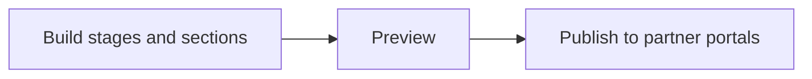
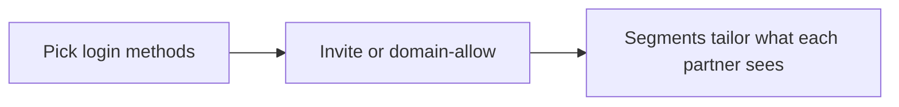

# Introw docs (docs.introw.io): features-portal

Verbatim from docs.introw.io/llms-full.txt, fetched 2026-09-29. 39 pages.

# Brand email notifications
Source: https://docs.introw.io/features/portal/branding/guides/brand-email-notifications

Add your logo and brand colors to partner email notifications so off-portal messages stay on-brand and look like they came from your product.

A lot of partner engagement happens off-portal, in email. Announcements, invites, and notifications all arrive as emails, and when those carry your logo and colors they reinforce that the program is yours. This guide sets the email branding so every outbound message matches the portal partners already know.

## What you'll achieve

Partner emails that render with your square logo and brand colors on the header, buttons, and background, consistent with the portal. Every announcement, invite, and notification looks like it came from your product.

## Before you start

<Steps>
  <Step title="Know which branding controls are gated">
    Removing Introw branding and using your own font are plan features; the rest of the branding controls are available on every plan. Check what yours includes at [introw.io/pricing](https://introw.io/pricing).
  </Step>

  <Step title="Confirm admin access">
    You need admin access to portal settings to set email branding.
  </Step>

  <Step title="Set your core brand assets first">
    Emails reuse the logo and colors from your brand setup, so set those first. See [Brand the partner portal](./brand-the-partner-portal).
  </Step>
</Steps>

## Watch it

<Tabs>
  <Tab title="Video">
    <video />
  </Tab>

  <Tab title="Click through">
    <iframe />
  </Tab>
</Tabs>

## Steps

<Steps>
  <Step title="Open the Email branding tab">
    Go to [Portal settings](https://app.introw.io/settings/portal) and switch to the **Email** branding tab. A preview of a sample partner email updates as you change each value.

    <Frame>
      
    </Frame>
  </Step>

  <Step title="Set the email colors">
    Set the colors that style the email template, each chosen with a color picker or a hex code:

    * **Button color** - the fill of action buttons inside emails, such as the link to open an announcement. Use your primary brand color so the call to action stands out in the inbox.
    * **Button text color** - the label color on those buttons; pick a value with strong contrast so it stays readable.
    * **Background color** - the background of the email body. Keep it light so the logo and text remain legible across email clients.

    <Frame>
      
    </Frame>
  </Step>

  <Step title="Send yourself a test message">
    Trigger or preview a partner email, such as an announcement, and open it in a real inbox. Email clients render differently from the in-app preview, so confirm the logo, colors, and buttons look right where partners actually read them.
  </Step>
</Steps>

## Verify it worked

A partner email opens with your square logo in the header, your colors on the header and buttons, and a background consistent with the portal. The message reads as coming from your brand rather than a generic system notification.

The header image is the **square logo** from [Company settings](https://app.introw.io/settings/company), so if it looks cropped or off-center in the inbox, fix it there: a square file at 512×512 with the mark centered. Email branding itself has no image upload, only colors.

## Related

<CardGroup>
  <Card title="Brand the partner portal" icon="book-open" href="./brand-the-partner-portal">
    Set the logo and colors emails inherit.
  </Card>

  <Card title="Send an announcement" icon="book-open" href="/features/engagement/announcements/guides/send-an-announcement">
    Send a branded update partners receive by email.
  </Card>

  <Card title="Send from your own domain" icon="book-open" href="/features/portal/email-domain/guides/send-notifications-from-your-own-domain">
    Authenticate a sending domain so branded emails come from your address.
  </Card>

  <Card title="Implementation reference" icon="screwdriver-wrench" href="../technical">
    Full branding configuration options.
  </Card>
</CardGroup>

---

# Brand the partner portal
Source: https://docs.introw.io/features/portal/branding/guides/brand-the-partner-portal

Apply your logos, colors, fonts, and login copy so the partner portal, login screen, and portal experiences all look fully like your own product.

Branding is what turns a generic portal into your product. This guide covers the whole job end to end: the logos partners see everywhere, the colors that theme the login screen and the experiences inside, the typeface that carries your brand voice, and the words on the login screen. Set it once and it propagates to every partner-facing surface, so the first sign-in and every visit after feel unmistakably yours.

## What you'll achieve

A partner portal styled top to bottom in your brand: your logos in headers and icons, your colors on buttons, tabs, and backgrounds across both the login screen and the experiences, your font rendering portal text, and login copy written in your voice. Partners experience a branded product from the login page onward.

## Before you start

<Steps>
  <Step title="Know which branding controls are gated">
    Removing Introw branding and using your own font are plan features; the rest of the branding controls are available on every plan. Check what yours includes at [introw.io/pricing](https://introw.io/pricing).
  </Step>

  <Step title="Confirm admin access">
    You need admin access to company and portal settings to change branding.
  </Step>

  <Step title="Gather your brand assets">
    Have your logo files (a square version and a horizontal version), your brand color values, a font file if you use a custom typeface, and optionally a portal image for the login screen. Sizes:

    | Asset           | Shape                                        | Recommended | Format     |
    | --------------- | -------------------------------------------- | ----------- | ---------- |
    | Square logo     | 1:1                                          | 512×512     | PNG or JPG |
    | Horizontal logo | Wide, roughly 4:1                            | 800×200     | PNG or JPG |
    | Portal image    | Roughly square, it fills a full-height panel | 1600×1600   | JPG or PNG |
  </Step>
</Steps>

## Watch it

<Tabs>
  <Tab title="Video">
    <video />
  </Tab>

  <Tab title="Click through">
    <iframe />
  </Tab>
</Tabs>

## Steps

### Add your logos

<Steps>
  <Step title="Open company settings">
    Go to [Company settings](https://app.introw.io/settings/company). Logos are set here because they identify your organisation across every surface, not just one portal.

    <Frame>
      
    </Frame>
  </Step>

  <Step title="Upload both logo formats">
    Add each logo so Introw can pick the right one for each context:

    * **Square logo** - the one partners see most: the portal header, the login screen, the header image on every notification email, and next to your name on announcement cards. It is always drawn in a square frame between 16px and 64px and **cropped to fill**, so upload a genuinely square file - 512×512 is plenty - with the mark centered and a little breathing room around it. A wide logo here loses its sides.
    * **Horizontal logo** - used where there is room for a full lockup: the top of certificates (drawn at 320×72) and the generated cards Introw makes for assets that have no preview. It is fitted, never cropped, so any wide shape works. Roughly 4:1 at 800×200 is a safe upload.

    Both accept PNG and JPG. Neither is used for the favicon: Introw takes that from your company domain.

    <Frame>
      
    </Frame>
  </Step>
</Steps>

### Set the portal and login colors

<Steps>
  <Step title="Open portal settings">
    Go to [Portal settings](https://app.introw.io/settings/portal). The first tab controls the login screen and the portal shell partners sign in to. A live preview updates as you change each value.

    <Frame>
      
    </Frame>
  </Step>

  <Step title="Set the portal colors">
    Each color is chosen with a color picker; pick the brand value or paste a hex code:

    * **Button color** - the fill of primary buttons on the login and portal. Use your primary brand color so the main action stands out.
    * **Button text color** - the label color on those buttons. Choose a value with enough contrast against the button color so text stays readable.
    * **Background color** - the page background behind the login and portal shell. A dark brand color works too: the **Don't have a partner account?** prompt and its **Sign up** link under the login card, which sit on two lines, switch to a readable color, and the experience builder, the settings preview and the activity and AI panels use the same background, so what you see while building is what partners get.

    <Frame>
      
    </Frame>

    <Frame>
      
    </Frame>
  </Step>

  <Step title="Add a portal image">
    Under **Portal image**, select **Upload Image** to put your own artwork on the login screen. The image fills a full-height panel next to the sign-in card on desktop, and is hidden on mobile.

    That panel is about 60% of the window's width and its full height, so it is close to square and it crops to fill. Upload roughly square artwork - 1600×1600 works well, and anything under about 1200px per side looks soft on large screens - and keep the focal point centered, because the edges are what get trimmed as the window changes shape. A wide banner is the one thing to avoid here. Introw stores this image as a JPG, so transparency is flattened: use a photo or a solid-background graphic. To remove it later, select the **X** next to **Portal image uploaded**.
  </Step>

  <Step title="Upload a custom font">
    Upload your brand font file so portal text renders in your typeface instead of a generic system font. Use a supported web font format; if no custom font is uploaded, the portal falls back to its default font.

    <Frame>
      
    </Frame>
  </Step>
</Steps>

### Theme the experience chrome

<Steps>
  <Step title="Open the Experience branding tab">
    Still in [Portal settings](https://app.introw.io/settings/portal), switch to the **Experience** branding tab. These colors theme the experiences partners see after they log in, which have more surfaces than the login screen.

    * **Header color** - the background of the experience header bar. Default is white; set it to a brand tone if you want a colored header.
    * **Background color** - the page background behind experience content.
    * **Button color** and **Button text color** - the fill and label of buttons inside experiences, matching the login styling.
    * **Active tab color** - the highlight on the currently selected stage tab, so partners can see where they are. Use an accent color that reads clearly against the header.

    <Frame>
      
    </Frame>
  </Step>
</Steps>

### Customize the login copy

<Steps>
  <Step title="Edit the login screen text">
    On the login branding tab, override the default wording so the sign-in page speaks in your voice. Each step of the login flow has editable copy:

    * **Enter email step** - the **Title**, **Subtext**, email field **Placeholder**, and **Button text** partners see when they first arrive. There is also an **SSO button text** shown when single sign-on is offered. Leave any field blank to keep the default wording.
    * **Verification step** - the **Title** and **Subtext** shown while a partner confirms the link sent to their email.
    * **No access step** - the message shown when someone without access tries to sign in, so they know how to request it.
  </Step>

  <Step title="Save and preview">
    Settings save as you edit; use the live preview to confirm the login screen and experiences reflect your brand before partners see them.
  </Step>
</Steps>

## Verify it worked

Open the portal login screen: it shows your square logo, your colors on the button and background, your font, your custom copy, and your portal image filling the panel beside the sign-in card. Sign in and open an experience: the header, tabs, and buttons reflect the experience colors, and your logo sits in the header. The brand now applies everywhere partners look.

## Related

<CardGroup>
  <Card title="Brand email notifications" icon="book-open" href="./brand-email-notifications">
    Carry the brand into the emails partners receive.
  </Card>

  <Card title="Build and publish a portal experience" icon="book-open" href="/features/portal/experiences/guides/build-and-publish-a-portal-experience">
    Build the experiences your branding themes.
  </Card>

  <Card title="Connect a custom domain" icon="book-open" href="/features/portal/custom-domains/guides/connect-a-custom-domain">
    Serve the branded portal on your own hostname.
  </Card>

  <Card title="Implementation reference" icon="screwdriver-wrench" href="../technical">
    Full branding configuration options.
  </Card>
</CardGroup>

---

# Branding & White-label
Source: https://docs.introw.io/features/portal/branding/index

White-label the partner portal with your colors, fonts, logos, and login screen, across the portal itself, email notifications, and partner reports.

> Branding makes the partner experience unmistakably yours: your colors, fonts, and logos across the portal, partner emails, and reports - no one else's name in sight.

## The problem it solves

A generic-looking portal undercuts a serious partner program:

<Pains>
  | Without Introw                      | With Introw                    |
  | ----------------------------------- | ------------------------------ |
  | The portal looks like a third party | Your colours, fonts and logos  |
  | Partners see a generic login        | The login screen is yours too  |
  | Emails do not match the brand       | Notifications carry your style |
  | The experience feels stitched       | One brand from login onwards   |
</Pains>

## Impact

Partners work with a dozen vendors and remember the ones that felt like a real program. Removing every visual seam is a small effort that changes how seriously yours is taken.

<Impact>
  for your business

  * **Cost to run**
    Partner marketing controls the whole brand, across portal, login, emails and reports, with no code
  * **No new tool**
    The brand carries into the emails partners receive, so it holds up off-portal as well as on it

  for your partners

  * **Self-serve**
    The login screen text is yours, so the first thing they read already sounds like you
  * **Enabled**
    A portal that looks like your product reads as part of the relationship, not a vendor tool
  * **Efficient**
    One consistent look from sign-in to notification, so nothing reads like a phishing attempt

  [A day in the life of your partners](/days-in-the-life)
</Impact>

<Personas>
  * **Partner Marketing** - the brand partners experience
  * **VP Partnerships** - a credible branded program
  * **Partners** - a portal that looks like you
</Personas>

## See it work

<Tour>
  * 

    **Upload the logos**

    A square and a horizontal mark, for every surface.

  * 

    **Set the colours**

    Buttons, text and background, across the portal.

  * 

    **Brand the experience**

    Header, background, buttons and the active tab.

  * 

    **Write the login**

    The first words a partner reads are yours too.
</Tour>

## How it works

Branding applies your visual identity everywhere partners see Introw. You set brand colors,
upload your logos, and choose your typeface, and those apply across the portal experience, the
login screen partners sign in through, the email notifications they receive, and the reports
you share. Partners experience a portal that feels like a natural extension of your product,
not a third-party tool they merely tolerate.

Because the goal is a credible, professional partner program, white-labeling removes the visual
seams. The login screen, the portal chrome, and outbound communications all carry your brand,
so the experience is consistent from the first sign-in to every notification that follows.

Branding turns Introw into your portal. Set your colors, logos, and font once and they apply
across the partner experience, login, emails, and reports, giving partners a consistent,
credible experience that reinforces your brand at every touch.

## Going deeper

<CardGroup>
  <Card title="How to" icon="screwdriver-wrench" href="./technical">
    Setup, configuration, and all how-to guides.
  </Card>

  <Card title="API reference" icon="code" href="/general/introduction">
    Integration surface and code.
  </Card>
</CardGroup>

**Works with**

<CardGroup>
  <Card title="Custom Domains" icon="browser" href="/features/portal/custom-domains">
    Brand the portal on your domain.
  </Card>

  <Card title="Experiences" icon="browser" href="/features/portal/experiences">
    Branding applies across experiences.
  </Card>

  <Card title="Co-branded Assets" icon="folder-open" href="/features/content/co-branded-assets">
    Extend branding to partner assets.
  </Card>
</CardGroup>

---

# Branding & White-label
Source: https://docs.introw.io/features/portal/branding/technical/index

Configure colors, fonts, logos, and the login screen so the partner portal, emails, and reports fully match your brand and white-label style in Introw.

## Where it lives

Branding & White-label sits under **Settings**, at [Portal settings](https://app.introw.io/settings/portal).

<Frame>
  
</Frame>

## Before you start

| You need                        | Why                            | Fix it                                                                            |
| ------------------------------- | ------------------------------ | --------------------------------------------------------------------------------- |
| Admin access to portal settings | Branding is an org setting     | [Internal roles](/features/access/team-management/guides/create-an-internal-role) |
| Your logos, colours and font    | Introw applies what you supply | Outside Introw                                                                    |

## How it works

Branding holds your visual identity: logos, brand colors, font, and login copy. Logos are set
once in company settings because they identify your organisation everywhere, and the colors,
font, and login copy live in portal settings, split across branding tabs for the login screen,
the experiences inside, emails, and assets. Configure them once and they propagate to every
partner-facing surface.

The login screen has its own colors and editable copy so the first thing a partner sees is
on-brand, and email notifications carry the same brand so messages partners receive look like
they came from you.

Introw fills most of this in for you when you set your company domain: it reads your website and
brand data for your logos, a portal image, your favicon, and your accent colors, so the portal is
already recognisable before you change anything. Everything below is the override.

Images are not only a branding-settings concern - thumbnails, banners, and badges live across
courses, content, announcements, and tiers. [Image sizes](#image-sizes-every-image-in-introw)
below lists every image you can upload in Introw, with the ratio and size for each.

## Settings & configuration

Logos are managed at [Company settings](https://app.introw.io/settings/company); colors, font,
and login copy are managed on the branding tabs of [Portal settings](https://app.introw.io/settings/portal).

### Logos

Upload a square logo and a horizontal logo in company settings.

The **square logo** is the one that carries your brand: the portal header, the login screen, the
header image on notification emails, the org avatar on announcement cards, the fallback avatar
for the partner support agent, and the certificate seal when no horizontal logo is set (drawn
124×124). It renders in square avatar frames from 16px to 64px and is **cropped to fill**, so a
wide file loses its sides - upload a square one.

The **horizontal logo** is used where a full lockup fits: the top of certificates (320×72) and
the generated cards Introw renders for assets with no previewable file (up to 280×64). Both fit
it inside the box rather than cropping.

Neither logo drives the favicon: Introw uses the favicon published on your company domain.

**Removing the Introw mark.** The white-label add-on drops the "Powered by Introw" mark from the
partner-facing surfaces that carry it - the portal, forms, the asset library, and generated
certificates - so what partners see is your brand only.

### Portal image

**Portal image**, on the login branding tab of portal settings, is optional artwork for the login
screen. It fills the panel beside the sign-in card on desktop - roughly 60% of the window's width
at full height, so close to square - and is hidden on mobile. It crops to fill, so upload roughly
square artwork with a centered focal point rather than a wide banner, and expect the edges to move
as the window changes shape. Introw stores it as a JPG, so transparency is flattened.

### Image sizes: every image in Introw

This is the full list, brand assets and everything else, so you can prepare artwork in one pass.
Each feature's own How to page repeats the rows that belong to it.

Three behaviours decide what to upload, and each row says which one applies:

* **Cropped on upload** - the upload opens a crop-and-zoom step and saves at exactly that ratio,
  so anything off-ratio loses its edges permanently. Upload at the ratio to keep control.
* **Cropped to fill** - stored as uploaded but always displayed filling a square frame, so a wide
  file loses its sides on every surface.
* **Fitted** or **as uploaded** - never cropped. Ratio is up to you; the recommendation is only
  about resolution.

#### Brand assets

| Image           | Where                                                               | Ratio       | Recommended | Behaviour                      |
| --------------- | ------------------------------------------------------------------- | ----------- | ----------- | ------------------------------ |
| Square logo     | [Company settings](https://app.introw.io/settings/company)          | 1:1         | 512×512     | Cropped to fill. PNG or JPG    |
| Horizontal logo | [Company settings](https://app.introw.io/settings/company)          | Roughly 4:1 | 800×200     | Fitted                         |
| Portal image    | [Portal settings](https://app.introw.io/settings/portal), login tab | Roughly 1:1 | 1600×1600   | Cropped to fill, stored as JPG |
| Favicon         | Not uploadable                                                      | -           | -           | Detected from your website     |
| Custom font     | [Portal settings](https://app.introw.io/settings/portal), login tab | -           | -           | Web font file, not an image    |

#### Content and courses

| Image                                                                   | Where                                                            | Ratio                           | Recommended           | Behaviour                                        |
| ----------------------------------------------------------------------- | ---------------------------------------------------------------- | ------------------------------- | --------------------- | ------------------------------------------------ |
| [Asset thumbnail](/features/content/asset-library/technical)            | Asset detail panel, hover the thumbnail                          | 16:9                            | 1200×675              | Cropped on upload, max 20 MB. AI can generate it |
| [Language variant thumbnail](/features/content/asset-library/technical) | Asset detail panel, **Languages** tab                            | 16:9                            | 1200×675              | Cropped on upload, max 20 MB                     |
| [Folder thumbnail](/features/content/asset-library/technical)           | Folder detail panel, or **Set folder thumbnail** in the row menu | 16:9                            | 1200×675              | Cropped on upload, max 20 MB. AI can generate it |
| [Course thumbnail banner](/features/courses/authoring/technical)        | Course → **Configure** → **Basic**                               | 3:1                             | 1200×400              | Cropped on upload. AI can generate it            |
| [Course chapter image](/features/courses/authoring/technical)           | Course content editor                                            | 3:1 full width, 1:1 beside text | 1536×512 or 1024×1024 | As uploaded. AI can generate it                  |
| [Certificate background](/features/courses/certificates/technical)      | Certificate detail page                                          | 16:9                            | 1920×1080             | Cropped on upload, max 20 MB. AI can generate it |

#### Partners, portal and people

| Image                                                                              | Where                                                              | Ratio                           | Recommended             | Behaviour                             |
| ---------------------------------------------------------------------------------- | ------------------------------------------------------------------ | ------------------------------- | ----------------------- | ------------------------------------- |
| [Announcement thumbnail](/features/engagement/announcements/technical)             | Announcement editor, **Portal configuration**                      | 16:9                            | 1200×675                | Cropped on upload. AI can generate it |
| [Tier badge](/features/partners/tiers/technical)                                   | Tier editor                                                        | Any, square reads best          | 512×512 transparent PNG | Fitted, max 20 MB                     |
| [Partner logo](/features/partners/partner-management/guides/work-a-partner-record) | Partner header, or **Partner info** on the Partner profile section | 1:1                             | 200×200                 | Cropped to fill                       |
| [Person photo](/features/portal/experiences/technical)                             | Introduction and Team sections                                     | 1:1                             | 400×400                 | Cropped to fill. PNG or JPG           |
| [Inline content image](/features/portal/experiences/technical)                     | Experience and course editors                                      | 3:1 full width, 1:1 beside text | 1536×512 or 1024×1024   | As uploaded                           |
| [Team member photo](/features/access/team-management/guides/invite-a-team-member)  | Team settings, open a person                                       | 1:1                             | 400×400                 | Cropped to fill. PNG or JPG           |
| [Partner support agent logo](/features/ai/partner-support/technical)               | Agent configuration                                                | 1:1                             | 200×200                 | Cropped to fill, max 5 MB             |

Three things that apply everywhere. Thumbnails are served downscaled to 1080px wide, so uploading
more than about 1920×1080 buys nothing. Where no cap is listed, the generic 2 GB upload limit
applies, which is far more than any image needs - a heavy file only slows the portal down. And
every slot marked "AI can generate it" carries a **Generate with AI** button that reads the
content behind the image (the asset, the folder and its contents, the announcement's text, the
course and its modules) plus your brand colors, then produces artwork at exactly the size in this
table. Generated images are always text-free, since image models render text unreliably.

### Brand colors

Set button, button text, background, header, and active tab colors on the portal branding tabs.
These theme the login screen, the experiences partners see, and emails, keeping everything
consistent with your identity.

### Fonts

Use the default font or upload a custom font file in portal settings to match your brand
typography across the portal.

### Login screen

Brand the login screen with your colors, logo, and editable copy for each step of sign-in, so
the first sign-in feels like your product rather than a generic page.

### Email notifications

Partner email notifications inherit your brand colors and logo so outbound communications stay
consistent with the portal.

## How-to guides

<Rail>
  * 

    [**Brand email notifications**](/features/portal/branding/guides/brand-email-notifications)

    Add your logo and brand colors to partner email notifications so off-portal messages stay on-brand and look like they came from your product.

  * 

    [**Brand the partner portal**](/features/portal/branding/guides/brand-the-partner-portal)

    Apply your logos, colors, fonts, and login copy so the partner portal, login screen, and portal experiences all look fully like your own product.
</Rail>

## Troubleshooting

<Warning>
  Use high-resolution logos so they stay crisp across the portal, emails, and small icons. The portal image is cropped to fill a near-square, full-height panel, so anything wide or with an off-center focal point loses its edges. A custom font file must be in a supported format to render in the portal. Brand changes apply broadly, so review the portal and a test email after changing colors or logos.
</Warning>

<AccordionGroup>
  <Accordion title="A logo looks blurry">
    Upload a higher-resolution asset for that slot (512×512 square, 800×200 horizontal).
  </Accordion>

  <Accordion title="The portal image looks cut off">
    It is cropped to fill a near-square, full-height panel; re-upload roughly square artwork with the focal point centered.
  </Accordion>

  <Accordion title="The font did not change">
    The uploaded file is not in a supported format.
  </Accordion>

  <Accordion title="Emails are not branded">
    Confirm the brand assets are set in branding settings.
  </Accordion>
</AccordionGroup>

---

# Connect a custom domain
Source: https://docs.introw.io/features/portal/custom-domains/guides/connect-a-custom-domain

Add your hostname, create the generated DNS records, and verify the domain so the partner portal serves securely on your own custom URL.

A custom domain makes the portal's URL yours, which builds partner trust and reinforces your brand. This guide takes the whole job end to end: add your hostname, create the DNS records Introw generates at your provider, and verify so Introw issues a secure certificate and the portal serves on your domain. Until you finish, the portal stays on its default subdomain, so partners are never locked out.

## What you'll achieve

A verified custom domain serving the partner portal securely on your own hostname, with a certificate issued automatically, so partners reach the portal at an address that looks like yours.

## Before you start

<Steps>
  <Step title="Confirm the plan and access">
    Custom domains are a plan feature; if your plan does not include them you will be prompted to upgrade. You also need admin access to portal settings. Check what your plan includes at [introw.io/pricing](https://introw.io/pricing).
  </Step>

  <Step title="Have a hostname and DNS access">
    Choose a hostname you control, such as partners.yourcompany.com, and make sure you can add records at your DNS provider.
  </Step>
</Steps>

## Steps

<Steps>
  <Step title="Open domain settings">
    Go to [Portal settings](https://app.introw.io/settings/portal) and open the custom domain configuration. If your plan does not include custom domains, you will be prompted to upgrade here.
  </Step>

  <Step title="Enter your hostname">
    Add the domain you want the portal served on, such as partners.yourcompany.com. Use a subdomain you control and are not already using elsewhere, so it can point cleanly at the portal.
  </Step>

  <Step title="Create the CNAME record at your provider">
    There is exactly one record to add, and Introw shows both halves of it with a copy button:

    * **CNAME name** - the hostname you entered, for example `partners.yourcompany.com`.
    * **CNAME value** - your organisation's target on `cname.introw.io`.

    Because it is a CNAME, the hostname has to be a subdomain: a root domain like
    `yourcompany.com` cannot take one. There is no TXT record to add and no token to keep in
    sync - ownership is proven over HTTP once the CNAME resolves, which is why nothing here
    expires while you wait for your provider.
  </Step>

  <Step title="Wait for propagation, then sync the status">
    DNS changes take time to propagate, sometimes minutes, sometimes longer depending on your
    provider. Use **Sync status** in the dialog to re-check: it tells you which half of the job
    is outstanding - `CNAME not detected` means the record has not resolved yet, while an SSL
    state means the record is right and the certificate is still being issued. The certificate
    is issued automatically, at TLS 1.3, and renews itself.
  </Step>

  <Step title="Confirm the portal loads">
    Visit your hostname and confirm the portal serves over a secure connection on your domain.
  </Step>
</Steps>

## Keep an eye on the certificate after go-live

Once the domain is live, Introw re-checks its certificate every hour, and the badge next to the domain tells you what it found.

* **Verified** - the domain is live and its certificate is healthy.
* **Renewing certificate** - the domain is live and the certificate is being renewed. Nothing to do.
* **Certificate expiring** - the certificate expires within 14 days and renewal has not completed yet. Contact support if it does not clear.
* **Certificate issue** - the certificate has expired, could not be renewed, or the domain is no longer registered for one, so visitors may see a browser warning. Contact support.

## Verify it worked

The domain shows as verified in settings, the portal loads on your hostname with a secure certificate, and the default subdomain no longer needs to be shared with partners. If it stays pending, re-run **Sync status**: `CNAME not detected` points at the DNS record, anything else points at certificate issuance.

## Related

<CardGroup>
  <Card title="Remove a custom domain" icon="book-open" href="./remove-a-custom-domain">
    Disconnect a domain you no longer use.
  </Card>

  <Card title="Brand the partner portal" icon="book-open" href="/features/portal/branding/guides/brand-the-partner-portal">
    Match the brand to your new domain.
  </Card>

  <Card title="Implementation reference" icon="screwdriver-wrench" href="../technical">
    Full custom domain configuration options.
  </Card>
</CardGroup>

---

# Redirect links from your old portal
Source: https://docs.introw.io/features/portal/custom-domains/guides/redirect-links-from-your-old-portal

Point the domain of the partner portal you are leaving at Introw, so links your partners already shared keep working instead of dead-ending after the move.

When you move off a previous partner portal, its links do not move with you.
They sit in partner emails, in co-marketing pages, in sales decks and in browser bookmarks, and they point at a domain you are about to switch off.
This guide keeps them working: you add one redirect rule at your old domain, and Introw catches every incoming link on your new portal domain and sends the visitor to your portal.

## What you'll achieve

Every link minted by your old portal lands on your Introw portal home instead of a dead page, with its campaign parameters kept.

## Before you start

<Steps>
  <Step title="Have your Introw custom domain live first">
    The redirect lands on your Introw portal domain, so [connect a custom domain](./connect-a-custom-domain) and confirm it serves before you change anything at the old domain.
    Cutting over in the other order leaves the redirect with nowhere to go.
  </Step>

  <Step title="Keep control of the old domain">
    You need to be able to add a redirect rule at the old hostname, at your CDN or DNS provider.
    The old portal itself does not need to stay running.
  </Step>
</Steps>

## Steps

<Steps>
  <Step title="Redirect the old domain to /legacy">
    Add one wildcard rule at your old portal domain that forwards every path, preserving the path and the query string, to `/legacy` on your Introw domain:

    ```
    https://old.yourcompany.com/*  ->  https://partners.yourcompany.com/legacy/$1
    ```

    One rule covers the whole domain.
    There is nothing per-partner and nothing per-link to maintain at your end, and no API key or token to rotate.
  </Step>

  <Step title="Check that a link lands">
    Open one of the old links in a browser.
    It should end up on your Introw portal rather than an error page.
    Introw recognises which portal the link belongs to from the domain it arrived on, so there is nothing to set up in Introw.
  </Step>
</Steps>

## Verify it worked

Follow a real old link end to end, not a hand-typed one.
It opens your Introw portal home on your own domain, behind the portal sign-in when the visitor is not signed in yet.
Campaign parameters such as `utm_source` survive the redirect, so reporting on links already in the wild stays intact.

## Good to know

Every old link lands on the portal home, whatever path it had.
A link that used to open a form does not open the matching Introw form, and a partner identifier in the old link is not applied, so share your Introw form links directly where attribution matters.

Redirects are not cached, so a partner always follows the current rule rather than a copy a browser or CDN kept.

## Related

<CardGroup>
  <Card title="Connect a custom domain" icon="book-open" href="./connect-a-custom-domain">
    Get your Introw domain live before you cut the old one over.
  </Card>

  <Card title="Share a form" icon="book-open" href="/features/forms/sharing-submitting">
    How Introw form links are built and shared.
  </Card>

  <Card title="Implementation reference" icon="screwdriver-wrench" href="../technical">
    Full custom domain configuration options.
  </Card>
</CardGroup>

---

# Remove a custom domain
Source: https://docs.introw.io/features/portal/custom-domains/guides/remove-a-custom-domain

Disconnect a custom domain from the partner portal so it safely falls back to its default Introw address without locking existing partners out.

When you rebrand or move to a new hostname, you remove the old domain so the portal stops serving there. After removal the portal falls back to the default subdomain, so partners are never locked out entirely, just moved. This guide removes the domain and confirms the fallback.

## What you'll achieve

A removed custom domain, with the portal back on its default address (or a new domain you set up), and a plan to point partners at the new location.

## Before you start

<Steps>
  <Step title="Confirm the plan and access">
    Custom domains are a plan feature; if yours does not include them you will be prompted to upgrade. Check what your plan includes at [introw.io/pricing](https://introw.io/pricing).
  </Step>

  <Step title="Plan the communication">
    Partners using the old domain will need the new address, so plan to tell them before or right after you remove it.
  </Step>

  <Step title="Confirm admin access">
    You need admin access to portal settings to remove a domain.
  </Step>
</Steps>

## Steps

<Steps>
  <Step title="Open domain settings">
    Go to [Portal settings](https://app.introw.io/settings/portal) and open the custom domain configuration.
  </Step>

  <Step title="Remove the domain">
    Remove the custom domain you no longer want to serve. The portal stops responding on that hostname and falls back to the default subdomain, so it stays reachable.
  </Step>

  <Step title="Confirm the fallback">
    Confirm the portal loads on the default subdomain, or on a new custom domain if you set one up, and clean up the old DNS records at your provider once nothing depends on them.
  </Step>
</Steps>

## Verify it worked

The removed domain no longer serves the portal, and the portal loads on its fallback address so partners can still get in.

## Related

<CardGroup>
  <Card title="Connect a custom domain" icon="book-open" href="./connect-a-custom-domain">
    Set up a replacement domain.
  </Card>

  <Card title="Brand the partner portal" icon="book-open" href="/features/portal/branding/guides/brand-the-partner-portal">
    Update branding for a new domain.
  </Card>

  <Card title="Implementation reference" icon="screwdriver-wrench" href="../technical">
    Full custom domain configuration options.
  </Card>
</CardGroup>

---

# Custom Domains
Source: https://docs.introw.io/features/portal/custom-domains/index

Serve the partner portal on your own custom domain so partners reach it at your branded URL and hostname instead of a generic Introw address.

> Custom Domains put the partner portal on your own web address, so partners reach a portal that is unmistakably yours from the URL onward.

## The problem it solves

A shared portal URL undercuts an otherwise polished program:

<Pains>
  | Without Introw                 | With Introw                     |
  | ------------------------------ | ------------------------------- |
  | The portal is on a generic URL | Your own hostname               |
  | The address is off-brand       | partners.yourcompany.com        |
  | Setup feels like engineering   | Add the DNS records provided    |
  | Security has to be obvious     | A certificate is issued for you |
</Pains>

## Impact

The URL is the first thing a partner sees and the thing they paste to a colleague. Making it yours removes the last visible seam between your product and your program.

<Impact>
  for your business

  * **Cost to run**
    Ops points a domain at Introw and adds the records; there is no engineering project in it
  * **Live in days**
    The portal goes live on your domain as soon as DNS verifies, with a certificate issued automatically

  for your partners

  * **Self-serve**
    They bookmark an address they recognise, which is most of whether they come back
  * **Enabled**
    A URL that matches your brand is one less thing to explain to their own security team
  * **Efficient**
    No unfamiliar hostname to check before signing in with their work account

  [A day in the life of your partners](/days-in-the-life)
</Impact>

<Personas>
  * **Partner Operations** - the domain and its DNS
  * **VP Partnerships** - branded down to the URL
</Personas>

## How it works

A custom domain serves your partner portal at your own hostname, such as

<Frame>
  
</Frame>

partners.yourcompany.com, instead of a shared address. You point a domain at Introw, add the
DNS records Introw provides, and once they verify, the portal goes live on your domain with a
secure certificate. Partners bookmark and visit your address, reinforcing that the portal is
part of your brand.

This completes the white-label story. Branding makes the portal look like you; a custom domain
makes the URL itself yours, removing the last visible seam between your product and your partner
program.

Custom Domains make the portal's address yours. Point a domain at Introw, add the provided DNS
records, and once verified the portal serves securely on your hostname. Partners get a portal
that is yours from the URL down.

## Going deeper

<CardGroup>
  <Card title="How to" icon="screwdriver-wrench" href="./technical">
    Setup, configuration, and all how-to guides.
  </Card>

  <Card title="API reference" icon="code" href="/general/introduction">
    Integration surface and code.
  </Card>
</CardGroup>

**Works with**

<CardGroup>
  <Card title="Branding & White-label" icon="browser" href="/features/portal/branding">
    Your domain, your brand.
  </Card>

  <Card title="Portal Access" icon="browser" href="/features/portal/portal-access">
    Partners reach the portal on your domain.
  </Card>

  <Card title="Single Sign-On" icon="shield-halved" href="/features/access/sso">
    Run SSO on the custom domain.
  </Card>
</CardGroup>

---

# Custom Domains
Source: https://docs.introw.io/features/portal/custom-domains/technical/index

Connect a custom domain, add the required DNS records, and serve the partner portal on your own hostname with automatic SSL in Introw.

## Where it lives

Custom Domains sits under **Settings**, at [Portal settings](https://app.introw.io/settings/portal).

<Frame>
  
</Frame>

## Before you start

| You need                           | Why                                  | Fix it                                                                            |
| ---------------------------------- | ------------------------------------ | --------------------------------------------------------------------------------- |
| Custom domains on your plan        | It is a paid add-on                  | **Request access**                                                                |
| Admin access to portal settings    | The domain is added there            | [Internal roles](/features/access/team-management/guides/create-an-internal-role) |
| DNS access, and a hostname you own | You add the records Introw generates | Outside Introw                                                                    |

## How it works

You add the hostname you want the portal served on, and Introw gives you the DNS records to
add at your domain provider. Once those records propagate and verify, Introw issues a secure
certificate and the portal becomes reachable on your domain. Until a domain is verified, the
portal is served on a default subdomain.

A domain must be unlocked for partners to access the portal: that means either using the
default subdomain or completing custom domain verification. Custom domains are a plan feature,
so an org on a plan without them is prompted to upgrade when adding one.

## Settings & configuration

Custom domains are configured from [Portal settings](https://app.introw.io/settings/portal).

### Adding a domain

Enter the hostname you want to use for the portal. Introw generates the DNS records you need
to add to make the domain point at the portal and prove you own it.

### DNS records

Add the records Introw shows to your DNS provider. These typically include records that point
the hostname to Introw and records that verify ownership. DNS changes can take time to
propagate before verification succeeds.

### Verification and certificate

Once the records resolve, Introw verifies the domain and issues a secure certificate
automatically. The portal then serves on your domain.

### Removing a domain

You can remove a custom domain to stop serving the portal there; the portal falls back to the
default subdomain.

## How-to guides

<Rail>
  * [**Connect a custom domain**](/features/portal/custom-domains/guides/connect-a-custom-domain)

    Add your hostname, create the generated DNS records, and verify the domain so the partner portal serves securely on your own custom URL.

  * [**Redirect links from your old portal**](/features/portal/custom-domains/guides/redirect-links-from-your-old-portal)

    Point the domain of the partner portal you are leaving at Introw, so links your partners already shared keep working instead of dead-ending after the move.

  * [**Remove a custom domain**](/features/portal/custom-domains/guides/remove-a-custom-domain)

    Disconnect a custom domain from the partner portal so it safely falls back to its default Introw address without locking existing partners out.
</Rail>

## Troubleshooting

<Warning>
  DNS changes can take time to propagate, so verification may not succeed immediately. The portal only serves on a custom domain after verification; until then it stays on the default subdomain. Removing a domain takes the portal off that hostname.
</Warning>

<AccordionGroup>
  <Accordion title="Verification keeps failing">
    The DNS records have not propagated yet or were entered incorrectly.
  </Accordion>

  <Accordion title="The portal is still on the subdomain">
    The custom domain is not verified yet.
  </Accordion>

  <Accordion title="The certificate is not secure">
    Verification has not completed, so no certificate has been issued.
  </Accordion>
</AccordionGroup>

---

# Send notifications from your own domain
Source: https://docs.introw.io/features/portal/email-domain/guides/send-notifications-from-your-own-domain

Set your sender, add the DNS records Introw generates, and verify so partner notifications send from your own authenticated domain, not the default.

## What you'll achieve

A verified sending domain so every partner notification, portal invites, announcements, comments, and deal and CRM updates, sends from your own address, such as [partners@mail.yourcompany.com](mailto:partners@mail.yourcompany.com). Mail is authenticated, so it reaches the inbox, and partners see a sender they trust.

## Before you start

<Steps>
  <Step title="Confirm the plan and access">
    The email domain is a plan feature; if your plan does not include it you will be prompted to upgrade. You also need admin access to portal settings.
  </Step>

  <Step title="Pick a sending domain and line up DNS access">
    Choose a domain you control, such as mail.yourcompany.com. Adding the DNS records may need your IT team or whoever manages the domain, so plan a few minutes with them.
  </Step>

  <Step title="Know that nothing else changes">
    Verifying a domain only changes the address mail comes from. Your notification types, channels, segments, and reply-by-email settings stay exactly as they are, so there is nothing to reconfigure.
  </Step>
</Steps>

## Steps

<Steps>
  <Step title="Open the email domain configuration">
    Go to [Portal settings](https://app.introw.io/settings/portal) and open the email domain configuration, next to the portal custom domain. If your plan does not include it, you will be prompted to upgrade here.
  </Step>

  <Step title="Set your sender">
    Enter the address partners will see mail come from:

    * **Sender display name** - the friendly name in the inbox, such as Acme Partners. Use the name partners recognize.
    * **Sender address** - the local part and domain, such as [partners@mail.acme.com](mailto:partners@mail.acme.com). The local part is the part before the @ (for example, partners or notifications); the domain is the one you will authenticate next.

    You can change the display name or the local part later from this same screen without re-verifying, as long as you keep the verified domain.
  </Step>

  <Step title="Add the DNS records at your provider">
    Introw generates the records that authenticate your domain. Add each one exactly as shown at your DNS provider:

    * **DKIM record** - a TXT record that signs your mail so mailbox providers can confirm it is really from you.
    * **Return-path record** - a CNAME that routes bounce handling and aligns the sending domain.

    There is no separate SPF record to add; the verified return-path handles alignment. For why that is, and how SPF, DKIM, and DMARC work together, see [Email authentication and SPF](/features/portal/email-domain/technical#email-authentication-and-spf).
  </Step>

  <Step title="Wait for propagation, then verify">
    DNS changes take time to propagate, sometimes minutes, sometimes longer depending on your provider. Once they resolve, verify the domain in Introw. While you wait, notifications keep sending from the default Introw address, so partners are never blocked.
  </Step>

  <Step title="Confirm the new sender">
    Once verified, trigger a partner email, such as an announcement, and confirm it arrives from your address in a real inbox.
  </Step>
</Steps>

## Verify it worked

The domain shows as verified in settings, and a partner notification arrives from your sender address (for example, Acme Partners \<[partners@mail.acme.com](mailto:partners@mail.acme.com)>) instead of the default Introw address, landing in the inbox rather than spam.

## Related

<CardGroup>
  <Card title="Connect a custom domain" icon="book-open" href="/features/portal/custom-domains/guides/connect-a-custom-domain">
    Put the portal on your URL to complete the white-label.
  </Card>

  <Card title="Brand email notifications" icon="book-open" href="/features/portal/branding/guides/brand-email-notifications">
    Match the email's logo and colors to your sender.
  </Card>

  <Card title="Implementation reference" icon="screwdriver-wrench" href="../technical">
    Full email domain configuration options.
  </Card>
</CardGroup>

---

# Email Domain
Source: https://docs.introw.io/features/portal/email-domain/index

Send partner notifications from your own authenticated email domain so messages are trusted, land in the inbox, and look like they come from you.

> An email domain sends every partner notification from your own authenticated address, like [partners@yourcompany.com](mailto:partners@yourcompany.com), instead of a generic third-party one, so messages are trusted, reach the inbox, and look like they came from you.

## The problem it solves

<Pains>
  | Without Introw                | With Introw                   |
  | ----------------------------- | ----------------------------- |
  | Partners never got the invite | An authenticated domain lands |
  | The sender is unrecognised    | It comes from your own domain |
  | Low open rates drag adoption  | A known sender gets opened    |
  | Branded mail, generic sender  | The address matches the brand |
</Pains>

## Impact

A partner who never received the invite has no opinion about your portal. Sending from a domain their mail server trusts is the least glamorous adoption lever there is.

<Impact>
  for your business

  * **No new tool**
    Partners are reached and trusted in the inbox, which is the channel most of them actually live in
  * **Cost to run**
    Ops adds the DNS records and verifies; there is no engineering project behind it
  * **Live in days**
    The new sender is live as soon as DNS verifies, which is usually minutes

  for your partners

  * **Self-serve**
    The invite actually arrives, so getting in does not start with a support request
  * **Enabled**
    Announcements and nudges reach them, which is what makes the portal worth opening
  * **Efficient**
    No hunting in spam for the notification you told them to expect

  [A day in the life of your partners](/days-in-the-life)
</Impact>

<Personas>
  * **Partner Operations** - the domain and its DNS
  * **Partner Marketing** - email that gets opened
  * **Partners** - mail from a sender they know
</Personas>

## How it works

Partner notifications, portal invites, announcements, comments, and deal and CRM updates, normally send from a shared Introw address. An email domain sends them from your own domain instead, so a partner sees [partners@yourcompany.com](mailto:partners@yourcompany.com) rather than an address they do not recognize.

<Frame>
  
</Frame>

Your domain is authenticated with the DNS records Introw provides, so mailbox providers trust the mail and far fewer messages land in spam. Paired with a custom portal domain, it completes the white-label: the portal lives on your URL and the emails come from your domain, with no third-party name anywhere a partner looks.

Instead of partner managers chasing partners who never saw an email, notifications send from an address partners trust and recognize. Setup is a few minutes of DNS records, not an engineering project, and there is no migration: existing notification settings stay exactly as they are, so nothing has to be reconfigured. The result is mail that reaches the inbox, gets opened, and keeps partners engaged with the program.

## Going deeper

<CardGroup>
  <Card title="How to" icon="screwdriver-wrench" href="./technical">
    Setup, configuration, and all how-to guides.
  </Card>

  <Card title="API reference" icon="code" href="/general/introduction">
    Endpoints and code.
  </Card>
</CardGroup>

**Works with**

<CardGroup>
  <Card title="Custom Domains" icon="browser" href="/features/portal/custom-domains">
    Portal on your URL, emails from your domain: the full white-label.
  </Card>

  <Card title="Notifications" icon="bell" href="/features/engagement/notifications">
    The same partner notifications, now sent from your domain.
  </Card>

  <Card title="Branding & White-label" icon="browser" href="/features/portal/branding">
    Branded emails from a sender partners recognize.
  </Card>
</CardGroup>

---

# Email Domain
Source: https://docs.introw.io/features/portal/email-domain/technical/index

Set up a custom sending domain, add the required DNS records, and verify SPF and DKIM so partner notifications send from your own address in Introw.

## Where it lives

Email Domain sits under **Settings**, at [Portal settings](https://app.introw.io/settings/portal).

<Frame>
  
</Frame>

## Before you start

| You need                         | Why                                     | Fix it                                                                            |
| -------------------------------- | --------------------------------------- | --------------------------------------------------------------------------------- |
| The email domain add-on          | Orgs without it are prompted to upgrade | **Request access**                                                                |
| Admin access to portal settings  | The domain is added there               | [Internal roles](/features/access/team-management/guides/create-an-internal-role) |
| DNS access, and a sending domain | You add the records Introw generates    | Outside Introw                                                                    |

Adding DNS records may need your IT team or whoever manages the domain, so loop them in early.

## How it works

You choose a sender, a display name and a local part, on a domain you control, such as Acme Partners \<[partners@mail.acme.com](mailto:partners@mail.acme.com)>. Introw generates the DNS records that authenticate the domain, and you add them at your DNS provider. Once those records verify, Introw sends every partner notification from your address instead of the default Introw sender.

The authentication is **DKIM** (a TXT record that signs your mail) and a **return-path** (a CNAME that routes bounces and aligns the domain). Mailbox providers trust authenticated mail, which is what keeps it out of spam. There is no separate SPF record to add; the verified return-path handles alignment.

Two behaviors matter in practice:

* **Verification is the switch.** Until a domain is verified, notifications keep sending from the default Introw address, so partners are never blocked while DNS propagates. The moment verification completes, sends move to your address.
* **Nothing else changes.** Verifying a domain only changes the From address. Every existing notification, channel, segment, and reply-by-email setting stays exactly as configured, so there is nothing to migrate or reconfigure.

Replies still route the way each notification is configured; where a notification has no specific sender to reply to, replies fall back to the default Introw address.

## Email authentication and SPF

Three standards decide whether mailbox providers trust your mail: **SPF**, **DKIM**, and **DMARC**. Introw sets all three up through the two DNS records above, which is why **you never add an SPF record yourself**. This is by design, not a gap - here is how each one is handled.

* **SPF is checked against the return-path, not the From address.** Mailbox providers validate SPF against the return-path domain (the address that collects bounces), not the address partners see. The return-path CNAME you add points at Introw's sending infrastructure, which already publishes the SPF record that authorizes the servers your mail is sent from. So SPF passes automatically, with no record for you to maintain.
* **The return-path aligns SPF with your domain for DMARC.** Because the return-path lives on your own sending domain (a subdomain of, for example, mail.yourcompany.com), it shares an organizational domain with the From address. That shared domain is exactly what DMARC's SPF alignment check looks for, so DMARC-aligned SPF passes as well.
* **DKIM is aligned too, as a second layer.** The DKIM record signs your mail on your own domain. DMARC only requires SPF **or** DKIM to align, so notifications still pass DMARC in the forwarding cases where SPF can break.

<Note>
  You never add an SPF record for Introw, and there are two places people are tempted to add one - neither works:

  * **On the return-path subdomain** - you can't. A DNS host that holds a CNAME cannot also hold a TXT record, and the return-path is already a CNAME. That CNAME is what carries SPF, so no TXT belongs there.
  * **On your root domain** - it has no effect. SPF is checked against the return-path, not your root domain, so an `include` for Introw there does nothing for this mail - and it still counts against SPF's ten-lookup limit, which can break SPF for the rest of your mail.

  The return-path CNAME is the only record needed for SPF.
</Note>

## Settings & configuration

Email domain is configured from [Portal settings](https://app.introw.io/settings/portal), next to the portal custom domain.

### Sender

**Sender display name** is the friendly name partners see in their inbox, such as Acme Partners. Set it to the name partners recognize.

**Sender address** is the local part and domain the mail sends from, such as [partners@mail.acme.com](mailto:partners@mail.acme.com). The local part is the bit before the @ (for example, partners or notifications); the domain is the one you will authenticate.

You can update the display name and sender address later without re-verifying the domain.

### DNS records

Introw generates the records to add at your DNS provider:

* **DKIM record** - a TXT record that signs your outbound mail so mailbox providers can confirm it is really from you.
* **Return-path record** - a CNAME that routes bounce handling and aligns the sending domain.

Add each record exactly as shown. DNS changes can take time to propagate before verification succeeds.

### Verification

Once the records resolve, verify the domain in Introw. When both the DKIM and return-path records check out, the domain is marked verified and partner notifications start sending from your address.

### Removing the domain

Remove the email domain to stop sending from it; notifications fall back to the default Introw sender.

## How-to guides

<Rail>
  * [**Send notifications from your own domain**](/features/portal/email-domain/guides/send-notifications-from-your-own-domain)

    Set your sender, add the DNS records Introw generates, and verify so partner notifications send from your own authenticated domain, not the default.
</Rail>

## Troubleshooting

<Warning>
  DNS changes can take time to propagate, so verification may not succeed immediately. Notifications only send from your domain after verification; until then they use the default Introw sender, so partners keep receiving mail. Verifying changes only the From address: existing notification settings are untouched.
</Warning>

<AccordionGroup>
  <Accordion title="Verification keeps failing">
    The DNS records have not propagated yet or were entered incorrectly. Confirm the DKIM and return-path records match exactly, then verify again.
  </Accordion>

  <Accordion title="Emails still come from the Introw address">
    The domain is not verified yet, so sends use the default sender until verification completes.
  </Accordion>

  <Accordion title="Replies are not going where expected">
    Replies route per notification; where none is set, they fall back to the default Introw address. See [Configure partner notifications by email](/features/engagement/channels/guides/configure-partner-notifications-by-email).
  </Accordion>

  <Accordion title="A DMARC report shows SPF as failing or unaligned">
    Your domain's DMARC policy is likely set to strict SPF alignment. The return-path is on a subdomain, so it aligns under relaxed alignment (the DMARC default) but not strict. Aligned DKIM keeps DMARC passing either way. See the FAQ below.
  </Accordion>
</AccordionGroup>

## Frequently asked questions

<AccordionGroup>
  <Accordion title="Do I need to add an SPF record for Introw?">
    No. SPF is validated against the return-path domain, and the return-path record you add already resolves to Introw's SPF-authorized infrastructure. The DKIM and return-path records are the complete setup.
  </Accordion>

  <Accordion title="A DMARC report shows SPF failing or misaligned. Is something broken?">
    Usually not. If your DMARC policy uses strict SPF alignment (`aspf=s`), it flags the return-path as misaligned because it sits on a subdomain rather than the exact From domain. This does not affect delivery: aligned DKIM keeps DMARC passing. For SPF to align as well, use relaxed alignment (`aspf=r`), which is the DMARC default.
  </Accordion>

  <Accordion title="Can I add Introw to our existing SPF record instead of the return-path record?">
    No. An SPF include on your root domain applies to a domain that is not used as the return-path, so it has no effect on mail sent through Introw, and it consumes one of SPF's ten allowed DNS lookups. Add the return-path CNAME exactly as shown instead.
  </Accordion>

  <Accordion title="Will this change SPF for our normal company email (Google Workspace, Microsoft 365)?">
    No. Your mailbox provider sends from your root domain and still needs its own SPF record - keep it exactly as it is. Introw only adds a DKIM TXT record and a return-path CNAME on a dedicated sending subdomain, so it never touches the SPF record your mailbox relies on.
  </Accordion>

  <Accordion title="What DMARC policy should we use?">
    Any policy works, including `p=reject`, as long as SPF alignment is relaxed (`aspf=r`, the default). Because Introw sets up aligned DKIM, partner notifications pass DMARC even under an enforcing policy.
  </Accordion>
</AccordionGroup>

---

# Add a partner profile section
Source: https://docs.introw.io/features/portal/experiences/guides/add-a-partner-profile-section

Show each logged-in partner their own profile details, current tier, and key account information inside a partner portal experience section.

A generic portal feels like a brochure; a personal one feels like a relationship. The partner profile section is a smart block that shows the logged-in partner their own details, such as tier and key information, so the portal reflects who they are and where they stand. This guide adds it to an experience.

## What you'll achieve

A profile section in the experience that renders the current partner's own details when they log in, so every partner sees a portal personalized to them rather than the same static page.

## Before you start

<Steps>
  <Step title="Confirm write access">
    You need write access to experiences to edit a stage.
  </Step>

  <Step title="Populate partner data">
    The section shows what is on the partner record, so make sure the details you want to surface, such as tier, are populated for your partners.
  </Step>
</Steps>

## Watch it

<Tabs>
  <Tab title="Video">
    <video />
  </Tab>

  <Tab title="Click through">
    <iframe />
  </Tab>
</Tabs>

## Steps

<Steps>
  <Step title="Open the experience builder">
    Go to [Experiences](https://app.introw.io/templates) and open the experience you want to personalize.

    <Frame>
      
    </Frame>
  </Step>

  <Step title="Add the Partner profile section">
    On the stage where you want it, add a section from the picker and choose **Partner profile** from the smart sections. Because it is a smart section, it renders each viewer's own data automatically rather than a fixed value. Place it near the top of the home tab so partners see their status first.

    <Frame>
      
    </Frame>
  </Step>

  <Step title="Choose what it surfaces">
    The section reflects the partner record, so confirm the details you want partners to see, such as their tier, are present on their records. Pair it with a Tiers section if you want their tier status shown prominently.

    The section also carries the **Partner logo**. When the logo is editable, open **Partner info** and select **Upload new logo**: it is shown in a square frame and cropped to fill, so use a square image - **200×200, PNG or JPG**, as the field states. Leave it empty and Introw falls back to the logo it finds for the partner's domain.

    <Frame>
      
    </Frame>
  </Step>

  <Step title="Publish the experience">
    Preview to confirm the section reads correctly, then publish the experience so linked partners see their profile.

    <Frame>
      
    </Frame>
  </Step>
</Steps>

## Verify it worked

A logged-in partner sees their own profile details in the experience, and a different partner sees theirs, confirming the section is personalized per viewer rather than showing one fixed record.

<Frame>
  
</Frame>

## Related

<CardGroup>
  <Card title="Build and publish a portal experience" icon="book-open" href="./build-and-publish-a-portal-experience">
    Assemble the full experience around the profile.
  </Card>

  <Card title="Tiers" icon="book-open" href="/features/partners/tiers">
    Show tier status alongside the profile.
  </Card>

  <Card title="Implementation reference" icon="screwdriver-wrench" href="../technical">
    Full experience configuration options.
  </Card>
</CardGroup>

---

# Build and publish a portal experience
Source: https://docs.introw.io/features/portal/experiences/guides/build-and-publish-a-portal-experience

Create an experience, structure it into stages, fill it with sections and calls to action, then assign it to partners and publish.

An experience is the master layout your partner portals are built from. This guide takes the whole job end to end: create the experience, structure it into the tabs partners navigate, fill those tabs with the right content blocks and a clear call to action, preview it, then assign it to partners and publish so it goes live. Build it once and every partner you assign it to gets a portal based on it, and every later edit ships to them when you publish.

## What you'll achieve

A published portal experience with the tabs and content you designed, assigned to the right partners, and live in their portals. Partners log in to a structured, on-brand portal that leads with the action you want them to take.

## Before you start

<Steps>
  <Step title="Confirm write access">
    You need write access to experiences to build, assign, and publish them.
  </Step>

  <Step title="Unlock the portal">
    Partners can only reach the portal once it is unlocked with a subdomain or a verified custom domain. See [Connect a custom domain](/features/portal/custom-domains/guides/connect-a-custom-domain).
  </Step>

  <Step title="Define segments if you will tailor tabs">
    If you plan to restrict tabs to certain partner types, create those segments first so they are ready to apply.
  </Step>
</Steps>

## Watch it

<Tabs>
  <Tab title="Video">
    <video />
  </Tab>

  <Tab title="Click through">
    <iframe />
  </Tab>
</Tabs>

## Steps

### Create the experience

<Steps>
  <Step title="Open Experiences">
    Go to [Experiences](https://app.introw.io/templates). This lists your experiences with their status, when each was last published, and how many partners are linked to it.

    <Frame>
      
    </Frame>
  </Step>

  <Step title="Create and name it">
    Create a new experience and give it a **Name**. Name it for the audience or purpose it serves, for example "Reseller portal" or "Onboarding", so it is easy to find and assign later. The new experience opens in the builder as a draft.
  </Step>
</Steps>

### Structure it into stages

<Steps>
  <Step title="Add the tabs partners navigate">
    Stages are the tabs across the top of the portal. Add a stage for each major area, for example Home, Deals, Content, and Training. Keep the set small and ordered so partners find things fast; drag tabs to reorder them.

    <Frame>
      
    </Frame>
  </Step>

  <Step title="Configure each stage">
    Open a stage's menu to set how it behaves. Walk these options:

    * **Rename** - set the tab label partners see. Use plain words partners recognise.
    * **Layout** - how content is arranged on the tab. Choose **Centered** for a focused single column, **Grow right** for a main column with a side area, or **Full** to use the full width. Pick based on how much content the tab holds.
    * **Visibility** - hide a stage from the shared view while you are still building it, so partners do not see an unfinished tab.
    * **Manage access** - keep the tab open to **Anyone** with portal access, or set it to **Restricted** and choose the segments that may see it. Use this to show a tab only to the partner types it is meant for.
    * **Duplicate** or **Remove** - copy a stage as a starting point for another, or delete one you no longer need.

    <Frame>
      
    </Frame>
  </Step>
</Steps>

### Fill stages with sections

<Steps>
  <Step title="Add sections from the picker">
    Within a stage, add sections from the section picker. It groups blocks by type so you can pick what fits:

    * **Smart sections** - dynamic blocks tied to Introw data, such as Tasks, Goals, Announcements, Tiers, Asset hub, Commission, Courses, Certificates, and Partner profile. These render each partner's own data automatically.
    * **Basic sections** - layout and content blocks like Introduction, Hero section, Text, Columns, Collapsible content, Banner, Team, and Product overview. Use these to frame and explain.
    * **Documents and videos** - embed Google Slides, Sheets, and Docs, or Loom, Vimeo, YouTube, and Vidyard, inline.
    * **Meeting links** - embed a HubSpot, Calendly, or Cal.com scheduler so partners can book time without leaving the portal.
    * **CRM sections** - surface CRM records such as Deals, Contacts, Companies, and Tickets relevant to the partner.

    Two kinds of image live inside these sections, and they behave differently. **People photos** in the Introduction and Team sections sit in a square frame and are cropped to fill, so upload square headshots (around 400×400) or they lose their sides. **Images you insert into content** keep the ratio you upload and are scaled by the width handle, so match the slot: wide, around 3:1, for a full-width image, and square for one sharing a columns row with text.

    <Frame>
      
    </Frame>
  </Step>

  <Step title="Lead with the next action">
    Add a **Call to action button** section near the top of the most important tab and point it at the action you want partners to take, such as registering a deal or finishing onboarding. Set the button label so the action is unmistakable. A clear lead action is the single biggest driver of partner engagement.

    <Frame>
      
    </Frame>
  </Step>

  <Step title="Arrange the content">
    Reorder sections so the page reads top to bottom in priority order, and keep each tab focused on one job rather than crowding everything onto one page.
  </Step>
</Steps>

### Preview, assign, and publish

<Steps>
  <Step title="Preview the experience">
    Preview the experience to see exactly what a partner will see. Previewing before you publish prevents partners from seeing in-progress edits.

    <Frame>
      
    </Frame>
  </Step>

  <Step title="Publish to partners">
    Publish the experience and choose the partners to link it to. You then decide how it goes out:

    * **Publish without notifying** - push the experience to the linked partner portals silently. Use this for edits to a portal partners already have.
    * **Publish and notify** - push the experience and send the linked partners an email invite. You can review the email and add a **Personal message** before it sends, so the first touch feels human.

    Each linked partner counts toward your plan's portal usage, shown in the publish dialog.

    <Frame>
      
    </Frame>
  </Step>

  <Step title="Spot-check a partner portal">
    After publishing, open one linked partner's portal to confirm the tabs, sections, and access all landed as you designed them.

    <Frame>
      
    </Frame>
  </Step>
</Steps>

## Verify it worked

The experience shows as published on the Experiences list with its linked partner count. A partner you assigned can log in and see the tabs you built, the sections render their own data, restricted tabs appear only for the right segments, and the lead call to action is front and center. Later edits reach them the next time you publish.

## Related

<CardGroup>
  <Card title="Add a partner profile section" icon="book-open" href="./add-a-partner-profile-section">
    Personalize the experience with each partner's own details.
  </Card>

  <Card title="Embed external content" icon="book-open" href="./embed-external-content">
    Bring documents, videos, and schedulers into a stage.
  </Card>

  <Card title="Restrict a tab to segments" icon="book-open" href="/features/portal/portal-access/guides/restrict-a-tab-to-segments">
    Tailor which partners see each tab.
  </Card>

  <Card title="Implementation reference" icon="screwdriver-wrench" href="../technical">
    Full experience configuration options.
  </Card>
</CardGroup>

---

# Design the portal's tabs and navigation
Source: https://docs.introw.io/features/portal/experiences/guides/design-tabs-and-navigation

Decide how many tabs a partner portal needs, group related tabs under one dropdown, add URL tabs that open a link, and hide, restrict, reorder and deep-link them.

> For anyone deciding what the portal's navigation should be before filling it with content.

Tabs are the only navigation a partner portal has, so they are the whole information architecture.
Get them right and a partner finds what they came for without reading.
Get them wrong and you end up with a home tab that is a wall, or nine tabs a partner scans every visit because none of them is obviously the one.
This guide covers the structure decision, the three kinds of item you can put in the navigation (a tab, a tab group and a URL), and every control they carry.

## What you'll achieve

A navigation a partner can use on their first visit: a small set of tabs named for what a partner wants rather than how your program is organised, related pages folded under one tab group, outside links in the navigation where partners expect them, each item with the right visibility, and a home tab that leads with the next action.

## Before you start

<Steps>
  <Step title="Open an experience">
    Go to [Experience builder](https://app.introw.io/templates) and open one.
    Tabs run across the top of the builder, followed by **Add**.
    Hover a tab to reveal its drag handle and its **...** menu.
  </Step>

  <Step title="Know your sections">
    Structure is easier once you know what can go on a page.
    See [Every section you can add to a portal](./every-portal-section).
  </Step>

  <Step title="Have segments defined, if you plan to restrict tabs">
    Restricting a tab needs an audience to restrict it to.
    See [Create a dynamic segment](/features/partners/segments/guides/create-a-dynamic-segment).
  </Step>
</Steps>

## Watch it

<Tabs>
  <Tab title="Video">
    <video />
  </Tab>

  <Tab title="Click through">
    <iframe />
  </Tab>
</Tabs>

## Steps

### Decide the structure

<Steps>
  <Step title="Start from four or five tabs, not nine">
    A partner visits with one of a handful of jobs: register something, find content, check what they have earned, learn something, see where a deal stands.
    Most programs land on **Home**, **Deals**, **Content**, **Training** and **Rewards** or their equivalents, and that is enough.
    Add the sixth tab only when a real job has nowhere to live.

    Tabs cost more than sections do.
    A crowded section is skimmed; a wrong tab is a dead end a partner has to back out of.
  </Step>

  <Step title="Name tabs for the partner's job">
    Name them for what a partner is trying to do, not for the Introw feature behind them or your internal team structure.
    **Register a deal** beats **Forms**. **Get paid** beats **Commissions**. **Sell with us** beats **Enablement**.
    A partner has never read your org chart and will not guess which internal word maps to their task.
  </Step>

  <Step title="Make the home tab answer 'what now'">
    The home tab is the only page you can be sure a partner sees.
    Lead with the single next action for the partner in front of you, then their status, then everything else.
    In practice that means a hero or a call to action at the top, their tasks and goals under it, and announcements below that.
    Everything else earns its way onto another tab.
  </Step>

  <Step title="Use one portal with restricted tabs before you build two portals">
    Two partner types rarely need two portals.
    They usually need the same portal with one or two tabs each cannot see, which is one experience to maintain rather than two that drift.
    Build a second experience only when the difference is most of the portal.
    See [Restrict a tab to segments](/features/portal/portal-access/guides/restrict-a-tab-to-segments).
  </Step>
</Steps>

### Add tabs, tab groups and URL tabs

**Add**, at the end of the tab bar, opens one dialog with a **Type** picker.
Pick what you are adding, fill in what that type needs, and confirm.

<Steps>
  <Step title="Pick the type">
    **Type** offers three options.

    * **Tab** is a page you fill with sections. This is the default, and every portal needs at least one.
    * **Tab group** is a dropdown in the portal navigation that holds other tabs. It has no page of its own.
    * **URL** is a navigation item that opens a link instead of a page.

    A tab group is always top level, so a group cannot sit inside another group.

    <Frame>
      
    </Frame>
  </Step>

  <Step title="Add a tab or a tab group">
    Both need a **Name**, and **Add tab** or **Add group** stays greyed out until you type one.

    A new tab opens straight away so you can start adding sections.
    A new group stays where you are, and it is empty until you add tabs to it.

    <Frame>
      
    </Frame>
  </Step>

  <Step title="Add a URL tab">
    Choose **URL** and the dialog asks for the link instead of a name.

    * **Link** is where the tab goes, like `https://community.yourcompany.com`. A bare domain works: Introw adds `https://` for you. A path that starts with `/` stays inside your portal. Introw checks the link when you leave the field, shows **Enter a valid link, like [https://example.com](https://example.com)** if it cannot open it, and keeps **Add URL** greyed out until the link is valid.
    * **Query Parameters** adds values to the end of the link. Choose **Add Parameter**, type a key, and either type a fixed value or switch to a dynamic variable (**Partner ID**, **Partner CRM ID**, **Partner Name** or **Contact Email**) so each partner lands on their own page in the other tool.
    * **Button Text** is the label partners see in the navigation. Always set it: a URL tab without one reads **Untitled**.
    * **Open in** is **Open in new tab** (the default) or **Open in same tab**. Keep the default for anything outside your portal, so partners do not lose their place. A portal embedded in your CRM always opens links in a new tab.
    * **Pass current portal query string** appears only for a link inside your own portal. Switch it on to carry the partner's current portal parameters over to the target page.

    A URL tab never becomes the active tab: clicking it opens the link and the partner stays on the page they were on.
    To change the link later, open the URL tab's **...** menu and choose **Edit link**. The same check runs before **Save**.

    <Frame>
      
    </Frame>
  </Step>

  <Step title="Put tabs in a group">
    Click a group to open its dropdown in the builder.
    It lists **Add** first, then the tabs inside it. **Add** here opens the same dialog, titled **Add tab to** the group's name, and offers **Tab** or **URL**.

    To move a tab you already have, open its **...** menu, choose **Move to group** and pick the group, or drag the tab onto the group.
    **No group (move to root)** in the same menu takes it back out onto the bar.
    Inside the dropdown, drag tabs to reorder them.

    <Frame>
      
    </Frame>
  </Step>

  <Step title="Know how a group reads for partners">
    In the portal a group is one item in the navigation with a dropdown arrow.
    Partners click it to open the list of tabs inside, and a URL tab in that list carries an external-link icon.
    While a partner is on one of those tabs, the group reads **Group / Tab**, for example **Sales kit / Battlecards**, so they always know where they are.

    Partners never see an empty group: a group only shows when at least one tab inside it is visible to that partner.

    <Frame>
      
    </Frame>
  </Step>

  <Step title="Ungroup, or remove a group">
    The group's **...** menu leads with **Add**, then carries **Rename**, **Hide in shared view**, **Manage access**, **Duplicate**, **Ungroup** and **Remove**.

    * **Ungroup** takes every tab out of the group, puts them on the bar where the group was, in the same order, and deletes the group. Nothing inside it is lost. It is greyed out on an empty group.
    * **Duplicate** copies the group with every tab inside it.
    * **Remove** deletes the group and every tab inside it, and it cannot be undone. Ungroup first if you want to keep the tabs.

    <Frame>
      
    </Frame>
  </Step>
</Steps>

### Work the controls on a tab

<Steps>
  <Step title="Reorder by dragging">
    Drag a tab, a group or a URL tab along the bar to move it.
    Order is the strongest signal in the whole portal, because partners read left to right and stop early, so put the tab you want used second from the left rather than last.
    A group counts as one position, which is the main reason to use one: five related pages behind one dropdown leave the bar short enough to scan.
  </Step>

  <Step title="Rename, duplicate and remove">
    The tab's **...** menu carries **Rename**, **Duplicate** and **Remove**, and **Move to group** once the experience has a group.

    **Duplicate** is the fast way to build a variant: copy the tab, then restrict each copy to a different segment.
    **Remove** is greyed out on the last remaining tab, since an experience needs one.
    At least one tab has to stay visible to everyone with portal access, so Introw also blocks hiding or moving the last one with **Can't hide the last public tab**.

    Treat **Remove** carefully.
    On the next publish, a removed tab disappears from every partner's portal along with the documents on it.
    See [Draft, published and preview](./draft-publish-and-preview).
  </Step>

  <Step title="Choose between hiding and restricting">
    Both take a tab away from partners, and they are for different things.

    * **Hide in shared view** hides it from every partner, while your team still sees it flagged in the builder. This is the one for a tab you are still building, or one you keep for internal reference.
    * **Manage access** sets the tab's access policy to **Anyone** or **Restricted**, and a restricted tab needs one or more **Required segments**. This is the one for a tab only some partners should see.

    A partner in any of the chosen segments sees the tab, and belonging to a narrower segment as well never takes it away: visibility resolves to the most permissive segment a partner is in.
    That is what makes layered segments work rather than fight each other.

    Groups and URL tabs take both controls too.
    Hiding or restricting a group applies to everything inside it: a partner who cannot see the group sees none of its tabs.
    Tabs inside a group can carry their own restriction on top, so one group can show a different set of tabs to each segment.
  </Step>

  <Step title="Set the layout to match the content">
    **Page layout** offers three widths, and the right one follows what is on the page. It is on content tabs only, since a group or a URL tab has no page.

    * **Centered** for reading. Text, announcements, an introduction.
    * **Expanded** for a mix of copy and data.
    * **Full width** for tables and dashboards, where a centred column wastes half the screen. A pipeline or an embedded dashboard almost always wants this.

    **Background color** sets a colour behind the tab, with a clear option to return to the default.
    Use it sparingly: one tinted tab reads as deliberate, five read as a theme nobody chose.
  </Step>

  <Step title="Link straight to a tab">
    A portal URL takes a tab in a `stage` query parameter, so `https://your-portal-domain/?stage={tabId}` opens the portal on that tab.
    Use it from a marketing email or an intranet page.
    Tabs inside a group link the same way. A link to a group opens its first tab, and a link to a URL tab opens the portal's default tab rather than the link.
    Inside the portal, a call-to-action button does the same with **Go to tab**, and can also open a form or an asset directly, which is how the home tab hands a partner off without them hunting for the right tab.
  </Step>
</Steps>

## Verify it worked

Publish, then preview the experience as a real partner and check the navigation alone, before the content: are the tabs in the order you meant, does each group open to the tabs you put in it, does each URL tab open its link, does a restricted tab appear only for a partner in that segment, and is the tab you most want used within the first two positions.

If a tab shows a broken-restriction warning, the segment it pointed at was deleted.
Pick a live segment or set the tab back to **Anyone**, because a restriction pointing at nothing is not a safe default to leave in place.

## Related

<CardGroup>
  <Card title="Every section you can add to a portal" icon="table-cells" href="./every-portal-section">
    What goes on each tab.
  </Card>

  <Card title="Restrict a tab to segments" icon="lock" href="/features/portal/portal-access/guides/restrict-a-tab-to-segments">
    Segment-gated navigation in detail.
  </Card>

  <Card title="Layer segments to progressively unlock" icon="layer-group" href="/features/partners/segments/guides/layer-segments-to-progressively-unlock">
    How overlapping segments resolve.
  </Card>

  <Card title="Implementation reference" icon="screwdriver-wrench" href="../technical">
    Full configuration options.
  </Card>
</CardGroup>

---

# Draft, published and preview: what partners see right now
Source: https://docs.introw.io/features/portal/experiences/guides/draft-publish-and-preview

Understand the three states of a portal experience, what publishing actually changes in every partner's portal, and how to check before partners see it.

> For anyone editing a live portal who needs to know what partners can see at this moment.

An experience has a state, and almost every surprise in the builder comes from not knowing which one you are in.
Edits save themselves as you type, so there is no moment where you decide to commit.
Partners are looking at the last thing you published, which may be days behind what is on your screen.
And publishing does more than push text: it rewrites tabs in portals partners already have.
This guide is the state model, so nothing you do in the builder reaches a partner before you meant it to.

## What you'll achieve

Confidence about three questions at any point: is what I am looking at live, what exactly will publishing change for the partners who already have this portal, and how do I see it the way a partner will before I commit.

## Before you start

<Steps>
  <Step title="Open an experience">
    Go to [Experience builder](https://app.introw.io/templates) and open one.
    The state indicator sits in the header, to the left of the **Preview** and **Publish** buttons.
  </Step>

  <Step title="Know that the portal has to be unlocked">
    Partners cannot reach any of this until the portal has a subdomain or a verified custom domain, whatever you publish.
    See [Connect a custom domain](/features/portal/custom-domains/guides/connect-a-custom-domain).
  </Step>
</Steps>

## Steps

### Read the state in the header

<Steps>
  <Step title="Check the dot and the label">
    The header carries a coloured dot with one of two words under it, plus when the experience was last saved.

    * **Published**, green. Everything you have edited has been pushed to partner portals. What you see is what they see.
    * **Draft**, orange. There are edits newer than your last publish. Partners are still on the previous version.

    The word to be careful with is **Draft**.
    It does not mean the experience has never gone live.
    A portal that a hundred partners use every day reads **Draft** the moment you change one heading, and it keeps reading **Draft** until you publish again.
  </Step>

  <Step title="Stop looking for a save button">
    There is not one.
    **Last saved** under the state label is the editor telling you your work is safe, not that partners have it.
    Saving and publishing are separate ideas in this builder: saving is automatic and continuous, publishing is deliberate and explicit.
  </Step>
</Steps>

### Understand what publishing actually does

<Steps>
  <Step title="Open Publish and read the selection">
    **Publish** opens **Apply your experience to your partners** with a partner picker.
    Every partner already on this experience is preselected and cannot be deselected, so the selection is not a choice about who gets the update.
    It is a choice about who gets **added**.

    That is the single most important thing to know about publishing.
    Every partner already using this experience is re-synced every time, so there is no way to publish for one partner and hold the rest back.
    Use a separate experience when two audiences genuinely need to move at different times.
  </Step>

  <Step title="Know what gets overwritten">
    Publishing copies the experience's tabs into every linked partner's portal, replacing what was there. For each tab it writes the content, the name, the layout, the background colour, the segment restrictions, whether it is hidden, and its position.

    Two consequences worth planning around:

    * **A tab you removed from the experience is removed from every partner's portal**, along with the documents on it. Removing a tab is not a layout tidy-up, it is a deletion with a delay.
    * **Anything edited directly on a single partner's portal is overwritten.** If you have been tuning one partner's portal by hand, the next publish of its experience puts it back to the shared version. Use a partner-specific asset or a segment-restricted tab for genuinely per-partner content instead. See [Restrict a tab to segments](/features/portal/portal-access/guides/restrict-a-tab-to-segments).
  </Step>

  <Step title="Know what else it sets running">
    Publishing is not only content.
    It creates a portal for any selected partner who does not have one yet, applies the journeys and goals attached to the experience's tabs, and generates affiliate links for any campaign block on it.
    That is why publishing to a new cohort is a real launch action rather than a save.
  </Step>

  <Step title="Choose whether partners are told">
    There are two ways out of the dialog, and they are not the same.

    * **Publish without email** applies everything silently. This is what you want for an edit to a live portal: partners get the new content next time they visit, with no message.
    * **Next**, then a **Personal message** you write and preview, then **Publish and notify**. This is a launch: the selected partners get an email pointing them at their portal.

    Publishing an edit with a notification is the mistake that gets noticed.
    Reserve the email for the partners who are new to the experience.
  </Step>

  <Step title="Expect the portal limit to bite here">
    The check counts only the partners you are adding, against the portals left on your plan.
    Over it, publishing is blocked with **Select fewer new partners or upgrade your plan to add more portals**.
    Existing partners never count, so an edit to a live experience is never blocked.
    See what your plan includes at [introw.io/pricing](https://introw.io/pricing).
  </Step>
</Steps>

### Check it before partners do

<Steps>
  <Step title="Preview as a specific partner">
    **Preview** lists the partners on this experience and opens the one you pick in a new tab.
    That is deliberately not a generic preview: it renders their portal with their pipeline, their tasks, their tier and their assets, which is the only way to catch a smart section that is empty for a real partner.

    Two things to know.
    Only partners who already have a portal appear, so a brand-new experience with nobody on it shows **No Partners Found** and there is nothing to preview yet.
    And preview shows their portal as it stands, which is your last publish, not the draft on your screen.
  </Step>

  <Step title="Publish to one partner first, then widen">
    Because preview reflects the published state, the honest way to check a change end to end is to make one partner your test: put a single internal or friendly partner on a copy of the experience, publish there, look at it, then publish the real one.
    See [Reuse an experience across partner types](./reuse-an-experience).
  </Step>

  <Step title="Roll back rather than repair">
    Every publish stores a snapshot of the whole experience, and **Version History** in the header's **...** menu lists them with who published each one.
    Restoring is a single click and does not need the partner list rebuilt.
    Reach for it before hand-editing your way back out of a bad publish.
    See [Restore a previous experience version](./restore-a-previous-experience-version).
  </Step>
</Steps>

## Verify it worked

The header reads **Published** in green, and previewing a real partner shows the change you made.
If the header says **Published** but a partner reports the old content, they are almost certainly on a different experience: check which one is assigned on their partner record rather than republishing.

One lag is expected and harmless.
The AI agent and portal search re-index a published tab in the background, so an answer sourced from brand-new tab content can trail the publish by a few minutes.

## Related

<CardGroup>
  <Card title="Build and publish a portal experience" icon="pen-ruler" href="./build-and-publish-a-portal-experience">
    The build itself, end to end.
  </Card>

  <Card title="Restore a previous experience version" icon="clock-rotate-left" href="./restore-a-previous-experience-version">
    Roll back a publish you regret.
  </Card>

  <Card title="Launch the portal and the first two weeks" icon="rocket" href="/features/portal/portal-access/guides/launch-and-the-first-weeks">
    Going from published to partners actually using it.
  </Card>

  <Card title="Implementation reference" icon="screwdriver-wrench" href="../technical">
    Full configuration options.
  </Card>
</CardGroup>

---

# Embed external content
Source: https://docs.introw.io/features/portal/experiences/guides/embed-external-content

Embed documents, videos, and meeting schedulers from supported providers directly inside a partner portal experience without leaving the page.

Partners disengage when the portal sends them off to scattered links. Embedding content instead keeps decks, videos, and scheduling inside the experience, so a partner reads, watches, or books a meeting without leaving. This guide adds an embedded section using the providers Introw recognises and renders inline.

## What you'll achieve

A portal section that displays embedded external content, a slide deck, a video, or a meeting scheduler, rendered inline in the experience so partners interact with it without leaving the portal.

## Before you start

<Steps>
  <Step title="Confirm write access">
    You need write access to experiences to edit a stage.
  </Step>

  <Step title="Have the source link ready">
    Copy the share link for the content you want to embed from a supported provider, and make sure the content is shared so partners are allowed to view it.
  </Step>
</Steps>

## Watch it

<Tabs>
  <Tab title="Video">
    <video />
  </Tab>

  <Tab title="Click through">
    <iframe />
  </Tab>
</Tabs>

## Steps

<Steps>
  <Step title="Open the experience builder">
    Go to [Experiences](https://app.introw.io/templates) and open the experience you want to add content to.

    <Frame>
      
    </Frame>
  </Step>

  <Step title="Add an embed section">
    On the stage you want, add a section from the picker and choose the block that matches your source. Introw embeds these providers inline rather than linking out:

    * **Documents** - Google Slides, Google Sheets, and Google Docs. Use these for decks, plans, and living documents.
    * **Videos** - Loom, Vimeo, YouTube, and Vidyard. Use these for recorded walkthroughs and training.
    * **Meeting links** - HubSpot, Calendly, and Cal.com schedulers. Use these so partners can book time with your team in-portal.

    <Frame>
      
    </Frame>
  </Step>

  <Step title="Paste the share link">
    Paste the share link from that provider into the section. Introw recognises the provider and renders the content inline. Use a link that is shared appropriately, since partners can only see content the source allows them to view.

    <Frame>
      
    </Frame>
  </Step>

  <Step title="Publish the experience">
    Preview the stage to confirm the content renders, then publish the experience so partners see the embedded section.

    <Frame>
      
    </Frame>
  </Step>
</Steps>

## Verify it worked

The embedded deck, video, or scheduler renders inside the experience for a logged-in partner, and they can interact with it, scroll the deck, play the video, or book a slot, without leaving the portal.

<Frame>
  
</Frame>

## Related

<CardGroup>
  <Card title="Build and publish a portal experience" icon="book-open" href="./build-and-publish-a-portal-experience">
    Build the layout around an embed.
  </Card>

  <Card title="Add a partner profile section" icon="book-open" href="./add-a-partner-profile-section">
    Personalize the experience with partner details.
  </Card>

  <Card title="Implementation reference" icon="screwdriver-wrench" href="../technical">
    Full experience configuration options.
  </Card>
</CardGroup>

---

# Every section you can add to a portal
Source: https://docs.introw.io/features/portal/experiences/guides/every-portal-section

The complete catalogue of portal sections: what each group in the section picker holds, what it shows partners, and which ones depend on your CRM or plan.

> For anyone facing an empty experience and wondering what can go in it.

The experience builder is an open canvas, which is its strength and the reason a first build takes longer than any other setup step.
You cannot design a portal around blocks you do not know exist, and the picker groups them by where they come from rather than by what they are for.
This is the full list, with what each one shows a partner and when to reach for it.

## What you'll achieve

A working mental model of the section picker: sixteen groups, what each holds, which ones are populated automatically from partner data, and which ones only appear for your CRM or your plan. Enough to design a tab on purpose instead of by exploration.

## Before you start

<Steps>
  <Step title="Open an experience">
    Go to [Experience builder](https://app.introw.io/templates) and open one.
    Sections are added inside a stage (a tab), so pick the tab you are building first.
    See [Build and publish a portal experience](./build-and-publish-a-portal-experience).
  </Step>

  <Step title="Know that not every group appears for everyone">
    Three things change what you see: which CRM you connected, which modules are on your plan, and whether you have saved any synced sections yet.
    Each is called out below.
  </Step>
</Steps>

## The catalogue

### Where the picker starts

The picker opens on **Overview**, which is not a section type.
It shows a handful of suggested blocks for the fastest possible start, then the full group grid underneath.

With a CRM connected, the suggestions are your deal pipeline, your contact list, **Tasks & Journeys**, **Announcements**, **Asset hub** and **Forms**.
Without one, they are **Tasks & Journeys**, **Announcements**, **Asset hub**, **Forms**, **Introduction** and **Product overview**, so a portal is still buildable before the CRM is wired.
Search from here reaches every block in every group, which is faster than hunting through the grid once you know a name.

### Smart sections

Curated blocks that populate themselves from that partner's own data. These are what make one experience read as if it were built for each partner.

| Section                | What the partner sees                                                              |
| ---------------------- | ---------------------------------------------------------------------------------- |
| **Tasks & Journeys**   | Their open tasks and their position in any journey they are on                     |
| **Goals**              | Their targets and live progress against them                                       |
| **Announcements**      | Your published announcements, newest first, all of them or the categories you pick |
| **Tiers**              | Their current tier and the ladder above it                                         |
| **Asset hub**          | A browsable, searchable library of the content they are entitled to                |
| **Commission**         | Their commission lines and payouts                                                 |
| **Courses**            | The courses they are enrolled in, with progress                                    |
| **Certificates**       | The credentials they have earned                                                   |
| **Partner Profile**    | A chosen set of fields from their partner record, optionally editable by them      |
| **Power BI Dashboard** | A Power BI report scoped to their data                                             |

Reach for these first.
A portal built from smart sections stays current with no editing, because the content is the partner's data rather than copy you maintain.

### Rich sections

Layout and copy blocks. These are what you write, rather than what Introw fills in.

| Section                   | Use it for                                                                                             |
| ------------------------- | ------------------------------------------------------------------------------------------------------ |
| **Introduction**          | A named person with a photo, which is what makes a portal feel staffed rather than generated           |
| **Hero Section**          | The top of a tab: a headline, a line of context and a call to action                                   |
| **Team**                  | The people behind the partnership, with photos                                                         |
| **Product overview**      | What you sell, for a partner who has to explain it to a customer                                       |
| **Banner**                | A single strip of emphasis, for a deadline or a change                                                 |
| **Collapsible content**   | An accordion. Each item holds any block, an embedded form included, so it is the right home for an FAQ |
| **Columns**               | Two to five columns per row with draggable widths. Any block goes in a column                          |
| **Text**                  | Headings, lists, tables, dividers and images                                                           |
| **Call to action button** | Sends a partner to a tab, to a section of a tab, to a form or to an asset, in its own color            |

### CRM

Live views of your CRM, scoped to that partner. Every one of these carries your own object labels, so a portal reads in your team's vocabulary rather than ours.

| Section            | Availability |
| ------------------ | ------------ |
| Deal pipeline      | Every CRM    |
| Contact list       | Every CRM    |
| Company list       | Every CRM    |
| Ticket pipeline    | Every CRM    |
| Lead list          | Every CRM    |
| Custom object list | Every CRM    |
| Order pipeline     | HubSpot only |

Anything else your CRM holds is one search away: the group also lists every other object Introw can
embed for your org, your own custom objects first, then the standard ones that do not have a tile of
their own. If you can link an object to a partner, you can put a list of it in a portal.

Sharing CRM data with partners is scoped rather than open: you choose the records and the fields.
See [Set up a shared pipeline](/features/co-selling/shared-pipelines/guides/set-up-a-shared-pipeline) and [Show and rename CRM fields](/features/integrations/crm/guides/show-and-rename-crm-fields).

### Forms

Your own forms, in two shapes:

* **A form**, embedded so a partner submits without leaving the page. This is where deal registration, referrals, applications and requests belong.
* **Form submissions**, a list of that partner's own submissions with a **Status** column. This is the block that stops partners emailing to ask where their registration got to.

See [Ways to submit a form](/features/forms/sharing-submitting/guides/ways-to-submit-a-form).

### Content and embeds

Five groups that all put existing material on the page.

| Group               | What it holds                                                                      |
| ------------------- | ---------------------------------------------------------------------------------- |
| **Asset library**   | Your folders and assets, placed directly in the tab                                |
| **Synced sections** | Sections you saved for reuse. Maintain once, and every experience using it updates |
| **Documents**       | Google Slides, Google Sheets and Google Docs                                       |
| **Videos**          | Loom, Vimeo, YouTube and Vidyard                                                   |
| **Embed anything**  | Any other URL                                                                      |

**Meeting** is the same idea for booking links: HubSpot meeting links, Calendly and Cal.com, so a partner books time without an email round trip.

Synced sections are the answer to the same legal notice or program rules living in nine experiences.
See [Reuse content with synced sections](/features/content/synced-sections/guides/reuse-content-with-synced-sections).

### Reporting

**Dashboard embed** puts a whole dashboard in the portal, **Report embed** puts a single chart in, and **Power BI** surfaces a Power BI report.
These three are not on the group grid, so search for them by name.

See [Embed a dashboard in the portal](/features/reporting/dashboards/guides/embed-a-dashboard-in-the-portal) and [Show a partner dashboard in the portal](/features/reporting/partner-analytics/guides/show-a-partner-dashboard-in-the-portal).

### Groups that depend on your plan

**Marketing Funds** and **Affiliate Campaigns** only appear when those modules are on your plan.
Marketing Funds shows a partner their fund balance and their requests; Affiliate Campaigns shows their tracked links with clicks and conversions.
If either group is missing from the grid, that is why.
Check what your plan includes at [introw.io/pricing](https://introw.io/pricing).

## Two things that are not sections

**Dynamic variables** are not blocks. Type `{` anywhere you write and insert a value that resolves per partner, so one paragraph greets every partner by name and names their own manager. Anything you would have built a section for just to personalise it is usually a variable instead.

**Quizzes and video lessons** belong to courses, not portals. They appear in the course builder rather than here. See [Build a course manually](/features/courses/authoring/guides/build-a-course-manually).

## Verify it worked

Preview the tab as a real partner and check two things: every smart section resolved to their data rather than sitting empty, and nothing on the page is a block you would have to remember to update by hand.
An empty smart section usually means the underlying thing does not exist yet for that partner, not that the section is broken.
See [Draft, published and preview](./draft-publish-and-preview).

## Related

<CardGroup>
  <Card title="Build and publish a portal experience" icon="pen-ruler" href="./build-and-publish-a-portal-experience">
    Put these sections into a working portal.
  </Card>

  <Card title="Design tabs and navigation" icon="folder-tree" href="./design-tabs-and-navigation">
    Decide which tab each section belongs on.
  </Card>

  <Card title="Add a partner profile section" icon="id-card" href="./add-a-partner-profile-section">
    The most personal of the smart sections, in detail.
  </Card>

  <Card title="Implementation reference" icon="screwdriver-wrench" href="../technical">
    Full configuration options.
  </Card>
</CardGroup>

---

# Restore a previous experience version
Source: https://docs.introw.io/features/portal/experiences/guides/restore-a-previous-experience-version

Use experience history to review every change made to a partner portal experience and roll back to a previous published version in a single click.

A partner portal experience is a living layout that you edit as your program changes, which means a mid-quarter edit can unintentionally remove a tab, break a section, or change what partners see. Introw logs every change to an experience automatically and lets you roll back to a previous version in one click. This guide shows how to read an experience's history and restore an earlier version so you can experiment and fix mistakes without losing work.

## What you'll achieve

The ability to review the full change history of a partner portal experience and restore any earlier version instantly, with the restore logged so your audit trail stays intact and you can roll forward again if needed.

## Before you start

<Steps>
  <Step title="Have an experience with history">
    History accrues as you edit an experience. See [Build and publish a portal experience](./build-and-publish-a-portal-experience) if you are still building.
  </Step>

  <Step title="Understand what restoring changes">
    Restoring reverts the experience's tabs and sections to the selected version. Republish afterward so the restored layout reaches the partners the experience is assigned to.
  </Step>
</Steps>

## Steps

<Steps>
  <Step title="Open the experience">
    Go to [Experiences](https://app.introw.io/templates) and open the experience you want to review in the builder.
  </Step>

  <Step title="Open Version History">
    Open the **...** menu in the experience header and choose **Version History**. The panel
    opens beside the builder with a chronological log of every change made to the experience
    since it was created, so you can find the version you want to return to.

    <Frame>
      
    </Frame>
  </Step>

  <Step title="Restore a previous version">
    Find the entry you want and select **Restore** next to it. The experience reverts to that version immediately, and the restore is recorded as a new history entry, so earlier and later entries are preserved and you can roll forward again.
  </Step>

  <Step title="Publish the restored version">
    Publish the experience so the restored layout reaches every partner it is assigned to. Until you publish, partners keep seeing the version last published to them.
  </Step>
</Steps>

## Verify it worked

The builder shows the restored tabs and sections, the **History** tab includes a new entry for the restore with all earlier entries intact, and after publishing, an assigned partner's live portal reflects the restored layout.

## Related

<CardGroup>
  <Card title="Track and restore asset versions" icon="clock-rotate-left" href="/features/content/asset-library/guides/track-and-restore-asset-versions">
    The same one-click rollback for library assets.
  </Card>

  <Card title="Build and publish a portal experience" icon="table-columns" href="./build-and-publish-a-portal-experience">
    Build the experience that versioning protects.
  </Card>

  <Card title="Implementation reference" icon="screwdriver-wrench" href="../technical">
    Full configuration options.
  </Card>
</CardGroup>

---

# Reuse an experience across partner types and regions
Source: https://docs.introw.io/features/portal/experiences/guides/reuse-an-experience

Duplicate an experience, keep shared content in one place with synced sections, and move a cohort of partners onto a new experience without rebuilding anything.

> For anyone who has one portal working and now needs a second, a third and a regional variant.

The first experience is the expensive one.
Every one after it should be a copy plus a difference, and the shared parts should stay shared rather than being pasted into each.
The trap is the opposite: four experiences that started identical, drifted for six months, and now nobody can say which one is right.
This guide covers the three tools that prevent it, and when each is the correct one.

## What you'll achieve

A second and third experience that cost a fraction of the first, with the content that must stay identical maintained in exactly one place, and a way to move a whole cohort onto a new experience without touching partners one at a time.

## Before you start

<Steps>
  <Step title="Have one experience you are happy with">
    Reuse works from a good original.
    If the first one is still in flux, settle it before you copy it, because a copy inherits the parts you have not fixed yet.
    See [Build and publish a portal experience](./build-and-publish-a-portal-experience).
  </Step>

  <Step title="Know how many portals your plan allows">
    Publishing a new experience to partners who have no portal yet consumes portals.
    Reusing content is free; giving more partners a portal is not.
    Check what your plan includes at [introw.io/pricing](https://introw.io/pricing).
  </Step>
</Steps>

## Steps

### Choose the right tool

<Steps>
  <Step title="Decide before you copy anything">
    Three different problems get solved three different ways, and picking the wrong one is what creates drift.

    | What you actually want                                            | Use                                     |
    | ----------------------------------------------------------------- | --------------------------------------- |
    | A second portal that starts from this one and then diverges       | **Duplicate the experience**            |
    | The same block of content in several experiences, maintained once | **A synced section**                    |
    | Two audiences on the same portal, seeing slightly different tabs  | **One experience with restricted tabs** |
    | A cohort moved from one experience to another                     | **A bulk experience update**            |

    The most common mistake is duplicating an experience when the difference is one tab.
    That buys you a second thing to maintain forever in exchange for a tab you could have restricted to a segment.
    Duplicate when most of the portal differs, not when a corner of it does.
  </Step>
</Steps>

### Duplicate an experience

<Steps>
  <Step title="Copy it from the list">
    Go to [Experience builder](https://app.introw.io/templates), find the experience in the list and use its copy action.
    You get a new experience named after the original with **(copy)** appended, carrying every tab in the same order with all of its content.
  </Step>

  <Step title="Know what the copy shares and what it does not">
    The copy is independent where it matters and still linked where you want it to be.

    * **CRM views and asset hub blocks are re-created for the copy**, so changing which fields a pipeline shows in one experience does not change the other. The two portals can genuinely diverge.
    * **Synced sections stay linked to the same saved section.** A duplicated synced section is still the same block, so editing it in either place updates both. That is deliberate and it is the mechanism that keeps two portals consistent.
    * **No partners come with the copy.** It starts unpublished with nobody on it, so nothing reaches a partner until you publish it.
  </Step>

  <Step title="Make the difference, then publish">
    Rename it for what it is, make the changes that justified the copy, then publish it to its partners.
    Publishing a copy to partners who already have a portal on the original moves them; publishing to partners with no portal creates one.
    See [Draft, published and preview](./draft-publish-and-preview).
  </Step>
</Steps>

### Keep the shared parts shared

<Steps>
  <Step title="Save anything that must stay identical as a synced section">
    Program rules, the legal notice, the support block, the "how deal registration works" explainer: these are the blocks where two versions is a compliance problem rather than an inconvenience.
    Save the section once and insert it into every experience that needs it.
    Editing it updates every experience it appears in, which is the whole point.
    See [Reuse content with synced sections](/features/content/synced-sections/guides/reuse-content-with-synced-sections).
  </Step>

  <Step title="Let dynamic variables absorb the per-partner differences">
    A large share of what looks like a reason to build another experience is really one line of copy that needs a different name in it.
    Type `{` while writing and insert a value that resolves to each partner's own data, so one paragraph greets every partner correctly and names their own manager.
    One experience with variables beats four experiences with hardcoded names.
  </Step>

  <Step title="Use restricted tabs for the differences that remain">
    Where two audiences need different content but the same portal, duplicate the tab inside one experience and restrict each copy to its segment.
    One experience, two audiences, one thing to maintain.
    See [Design the portal's tabs and navigation](./design-tabs-and-navigation).
  </Step>
</Steps>

### Move a cohort onto another experience

<Steps>
  <Step title="Do it in bulk from the partners list">
    Go to [Partners](https://app.introw.io/partners), select the cohort, and use the bulk actions bar.

    * **Apply experience** publishes the selected partners with an experience and creates their portals. This is the launch action for a new cohort.
    * **Update experience** swaps the experience partners already use and updates their existing portals. This is the migration action.

    See [Bulk update partners](/features/partners/partner-management/guides/bulk-update-partners).
  </Step>

  <Step title="Automate the move where your CRM already knows">
    When the thing that decides a partner's experience is a field your CRM owns, such as a tier or a program type, let a workflow do the move so the portal follows the CRM without a second data-entry step.
    **Update partner properties** with the partner's **Experience** publishes that experience to the partner, creating their portal if they have none and moving them if they are on another one.
    See [React to a CRM change on a partner](/features/automation/workflows/guides/react-to-a-crm-change-on-a-partner).
  </Step>
</Steps>

## Verify it worked

Open the copy and one original side by side and confirm the divergence is the divergence you intended: the parts you meant to share are synced sections, and a change to one CRM view has not moved the other.
Then check a moved partner's record shows the new experience and preview their portal to confirm the tabs changed.

The number to watch afterwards is how many experiences you have.
If it grows every quarter and none is ever retired, the differences between them are probably segment restrictions waiting to be collapsed back into one.

## Related

<CardGroup>
  <Card title="Reuse content with synced sections" icon="link" href="/features/content/synced-sections/guides/reuse-content-with-synced-sections">
    Maintain a block once, use it everywhere.
  </Card>

  <Card title="Design tabs and navigation" icon="folder-tree" href="./design-tabs-and-navigation">
    Restricted tabs instead of a second portal.
  </Card>

  <Card title="Bulk update partners" icon="users-gear" href="/features/partners/partner-management/guides/bulk-update-partners">
    Move a cohort in one pass.
  </Card>

  <Card title="Implementation reference" icon="screwdriver-wrench" href="../technical">
    Full configuration options.
  </Card>
</CardGroup>

---

# Experiences
Source: https://docs.introw.io/features/portal/experiences/index

Build the partner portal no-code from stages, sections, and blocks - author one experience and publish it to every linked partner portal at once.

> Experiences are the no-code builder behind your partner portal: design once from stages and sections, then publish the same polished experience to every partner.

## The problem it solves

A partner portal that needs engineering to change is a portal that never changes:

<Pains>
  | Without Introw                      | With Introw                    |
  | ----------------------------------- | ------------------------------ |
  | Building a portal needs engineering | Assemble it from sections      |
  | One portal has to fit everyone      | One per motion, personalized   |
  | Updating it is slow and risky       | Edit, preview, then publish    |
  | The same content lives in many      | Synced sections keep it in one |
</Pains>

## Impact

Partner portals decay because changing them is expensive. Owning the builder is why yours still reflects this quarter's program rather than the one you launched with.

<Impact>
  for your business

  * **Cost to run**
    Stages, sections and blocks are assembled visually, so no ticket stands between an idea and the portal
  * **Live in days**
    A full experience comes together in an afternoon, and a change is previewed and published in minutes

  for your partners

  * **Self-serve**
    Their portal is built from the same experience as everyone's, so nothing is half-configured
  * **Enabled**
    A call-to-action leads with the next thing they should do, rather than a wall of tabs
  * **Efficient**
    Stage visibility means they see the tabs that apply to them, and not the rest

  [A day in the life of your partners](/days-in-the-life)
</Impact>

<Personas>
  * **Partner Marketing** - the portal designed and shipped
  * **Partner Operations** - experiences kept consistent
  * **Partners** - a portal that leads with what is next
</Personas>

## See it work

<Tour>
  * 

    **What you are building**

    The stage a partner opens into, and everything on it.

  * 

    **Add the tabs**

    Stages are what a partner navigates between.

  * 

    **Fill them**

    Smart sections, documents, meeting links, CRM views.

  * 

    **Lead with the action**

    A call-to-action button ahead of the content.

  * 

    **Publish it**

    Out to every linked portal, with or without a notification.
</Tour>

## How it works

An experience is a portal layout you build from stages (the tabs partners navigate) and
sections (the content blocks inside them). You assemble it visually, dropping in rich text,
documents, CRM views, forms, and more, without writing code or filing an engineering ticket.
Assign an experience to your partners and each gets their own partner portal based on it, so you design
the portal once and deliver it consistently to everyone.

You are not limited to one experience. Most programs run one per motion, because what a reseller needs on
day one has almost nothing in common with what a referral or an implementation partner needs. Which
experience a partner gets is set on their partner record, and a [workflow](/features/automation/workflows)
can move them onto a different one when their program field changes in the CRM. Inside an experience,
[segments](/features/partners/segments) narrow it further: stages and sections can be restricted to a
segment, and because a segment can filter on the contact as well as the partner, the technical contact and
the commercial lead at the same reseller open the same portal and see different things.

When you improve an experience, you publish the change out to the partner portals linked to it,
and you can preview exactly what partners will see before you do. Reusable synced sections let
you maintain shared content in one place and drop it into many experiences. The result is a
partner portal your team owns and evolves on its own.

Experiences put the portal in your team's hands. You build stages and sections visually,
preview the result, and publish to every linked partner portal from one place. The portal becomes
something partner marketing ships and iterates on, not a project that waits on engineering.



## Going deeper

<CardGroup>
  <Card title="How to" icon="screwdriver-wrench" href="./technical">
    Setup, configuration, and all how-to guides.
  </Card>

  <Card title="API reference" icon="code" href="/general/introduction">
    Integration surface and code.
  </Card>
</CardGroup>

**Works with**

<CardGroup>
  <Card title="Segments" icon="users" href="/features/partners/segments">
    Gate tabs and sections to segments.
  </Card>

  <Card title="Asset Library" icon="folder-open" href="/features/content/asset-library">
    Add library assets to a stage.
  </Card>

  <Card title="Form Builder" icon="table-list" href="/features/forms/form-builder">
    Embed forms in a stage.
  </Card>

  <Card title="Workflows" icon="bolt" href="/features/automation/workflows">
    Publish a different experience to a partner automatically.
  </Card>
</CardGroup>

---

# Experiences
Source: https://docs.introw.io/features/portal/experiences/technical/index

Build partner portal experiences from stages and sections, reuse synced sections across portals, and publish updates to partners in Introw.

## Where it lives

Experiences sit under **Portal**, at [Experience builder](https://app.introw.io/templates). Each one is a set of tabs you compose from sections, then publish to the partners it is for.

<Frame>
  
</Frame>

## Before you start

| You need                    | Why                                | Fix it                                                                                            |
| --------------------------- | ---------------------------------- | ------------------------------------------------------------------------------------------------- |
| Write access to experiences | To build and publish them          | [Internal roles](/features/access/team-management/guides/create-an-internal-role)                 |
| An unlocked portal          | Partners cannot reach it otherwise | A subdomain, or a [Custom domain](/features/portal/custom-domains/guides/connect-a-custom-domain) |

## How it works

An experience is built from **stages** and **sections**. Stages are the tabs partners see
across the top of the portal, and sections are the content blocks within a stage. You add
sections from a picker that includes rich text, documents, CRM views, forms, and other blocks,
and arrange them visually. The experience is the master layout; when you assign it to a
partner, they get a partner portal based on it.

You can save a section as a **synced section** to reuse it across experiences, keeping shared
content in one place. When you change an experience, you **publish** it to push the update to
the partner portals linked to it, and you can preview the experience to see exactly what partners
will see first.

### Designing experiences partners actually use

A published portal only drives the program if partners return and act. A few principles help:

* **Lead with the next action.** Put the most important action, like registering a deal or finishing onboarding, at the top of the home tab with a clear call to action.
* **Keep each tab focused.** Show only what a partner needs and tailor tabs by segment rather than crowding one page.
* **Make it personal.** Add a partner profile section and tier status so the portal reflects the individual partner.
* **Keep it fresh.** Use announcements so there is a reason to come back.

## Settings & configuration

Experiences are built in the experience builder at
[Experiences](https://app.introw.io/templates); reusable sections live under synced sections.

### Stages (tabs)

Stages are the portal's tabs, and they are the portal's whole navigation. **Add**, at the end of the tab
bar, opens one dialog with a **Type** picker:

| Type          | What partners see                                                             | What you fill in                                                         |
| ------------- | ----------------------------------------------------------------------------- | ------------------------------------------------------------------------ |
| **Tab**       | A page built from sections                                                    | **Name**                                                                 |
| **Tab group** | One navigation item that opens a dropdown of the tabs inside it               | **Name**                                                                 |
| **URL**       | A navigation item that opens a link, in a new tab unless you choose otherwise | **Link**, optional **Query Parameters**, **Button Text** and **Open in** |

A group is always top level and holds tabs and URL tabs, never another group. Add to a group from its
dropdown or its **...** menu, or move an existing tab in with **Move to group** or by dragging it onto
the group. While a partner is on a tab inside a group, the group reads **Group / Tab**. Partners never
see a group with nothing visible in it. A URL tab's link is checked before it can be added or saved; a
bare domain gets `https://`, and a path starting with `/` stays inside your portal.

Drag an item along the bar to reorder it; its **...** menu carries the rest.

| Control                 | On        | What it does                                                                                                                                                     |
| ----------------------- | --------- | ---------------------------------------------------------------------------------------------------------------------------------------------------------------- |
| **Add**                 | Tab group | Adds a tab or a URL tab inside the group                                                                                                                         |
| **Edit link**           | URL       | Changes the link, parameters, button text and where it opens                                                                                                     |
| **Rename**              | All       | Renames it                                                                                                                                                       |
| **Hide in shared view** | All       | Hides it from every partner while your team still sees it flagged. On a group it hides every tab inside                                                          |
| **Manage access**       | All       | Sets the access policy to **Anyone** or **Restricted**, and a restricted item takes one or more **Required segments**. On a group it applies to every tab inside |
| **Page layout**         | Tab       | **Centered** for reading, **Expanded** for a mix, **Full width** for tables and dashboards                                                                       |
| **Background color**    | Tab       | A colour behind the tab, with a clear option                                                                                                                     |
| **Move to group**       | Tab, URL  | Moves it into a group, or back to the bar with **No group (move to root)**                                                                                       |
| **Duplicate**           | All       | Copies it. On a group it copies every tab inside                                                                                                                 |
| **Ungroup**             | Tab group | Puts the tabs back on the bar where the group was, in the same order, and deletes the group                                                                      |
| **Remove**              | All       | Deletes it. On a group it also deletes every tab inside. Greyed out on the last remaining tab                                                                    |

At least one tab must stay visible to everyone with portal access, so Introw blocks hiding, restricting or
moving the last one. Hiding and restricting are different tools: hiding takes a tab from everyone,
restricting takes it from everyone outside the chosen segments. See
[Design the portal's tabs and navigation](/features/portal/experiences/guides/design-tabs-and-navigation).

### Sections and blocks

Sections hold the content within a stage. Add them from the section picker and drag to reorder. The
picker opens on **Overview**, which shows a few suggested blocks and then the group grid; search from
there reaches every block in every group.

| Group                                               | What it holds                                                                                                                                                                              |
| --------------------------------------------------- | ------------------------------------------------------------------------------------------------------------------------------------------------------------------------------------------ |
| **Smart sections**                                  | Blocks that populate themselves from that partner's data: Tasks & Journeys, Goals, Announcements, Tiers, Asset hub, Commission, Courses, Certificates, Partner Profile, Power BI Dashboard |
| **Rich sections**                                   | Blocks you write: Introduction, Hero Section, Team, Product overview, Banner, Collapsible content, Columns, Text, Call to action button                                                    |
| **CRM**                                             | Live, scoped views of your CRM, carrying your own object labels                                                                                                                            |
| **Forms**                                           | Your forms, plus a **Form submissions** list of that partner's own submissions with a status                                                                                               |
| **Asset library**                                   | Your folders and assets, placed directly in the tab                                                                                                                                        |
| **Synced sections**                                 | Sections you saved for reuse, maintained in one place                                                                                                                                      |
| **Documents**                                       | Google Slides, Sheets and Docs                                                                                                                                                             |
| **Videos**                                          | Loom, Vimeo, YouTube, Vidyard                                                                                                                                                              |
| **Meeting**                                         | HubSpot meeting links, Calendly, Cal.com                                                                                                                                                   |
| **Embed anything**                                  | Any other URL                                                                                                                                                                              |
| **Dashboard embed**, **Report embed**, **Power BI** | Reporting, reachable by search rather than from the grid                                                                                                                                   |
| **Marketing Funds**, **Affiliate Campaigns**        | Only when those modules are on your plan                                                                                                                                                   |

Which CRM blocks appear depends on your CRM: order pipelines are HubSpot only. Reach for smart sections
first, because
a portal built from them stays current with no editing. See
[Every section you can add to a portal](/features/portal/experiences/guides/every-portal-section) for
what each block shows a partner.

### Dynamic variables

Type `{` anywhere you write content and Introw inserts a **dynamic variable**: a placeholder that
resolves to that partner's own data when the page renders. One experience therefore reads as if it
were written for each partner, with no per-partner copy.

The `{` menu offers:

| Group              | What it contains                                                                                                                                                                                                              |
| ------------------ | ----------------------------------------------------------------------------------------------------------------------------------------------------------------------------------------------------------------------------- |
| Partner            | Every property of your partner object in the CRM - the HubSpot or Salesforce company, or the custom object you mapped as the partner object - so any field your team already maintains is insertable, custom fields included. |
| Partner (Introw)   | Tier, partner champion, and partner manager, resolved from Introw rather than the CRM.                                                                                                                                        |
| Partner team roles | The people holding each partner team role you have defined, so "your technical contact" resolves per partner.                                                                                                                 |
| Contact            | First name, last name, email, and company name of the person reading the page.                                                                                                                                                |

CRM-sourced entries carry your CRM's logo in the menu and Introw-sourced entries carry Introw's, so you
can see where a value comes from before you insert it. Values resolve per partner at render time and
follow the CRM record, so updating the field in HubSpot or Salesforce updates every page it appears on.

Variables work in the same way in the **experience builder**, in **announcements**, in **form** content
and the **post-submission screen**, and in **course** content - one syntax across every surface where
you write.

Two related surfaces do the same job without a variable: the **Partner profile** section renders a
chosen set of partner-record properties as a block (with per-property label overrides and optional
inline editing by the partner), and the **Tiers** block renders the partner's tier and the ladder above
it.

<Note>
  Variables resolve values, not links. A variable placed inside link text renders that partner's value;
  a link's target URL is static.
</Note>

### Layout blocks

Beyond plain sections, the builder ships layout primitives:

* **Columns** - two, three, or up to five columns per row, with draggable dividers to set the widths. A
  column takes any block, so a goals tile and a tasks tile sit side by side, or an image sits next to
  text.
* **Collapsible content** - a group of collapsible items. Items drag to reorder inside the group, and
  each item holds any block, an embedded form included.
* **Tables**, headings, lists, dividers, images, and call-to-action buttons.

### Linking to a tab

A portal URL carries the open tab in a `stage` query parameter, so a link of the form
`https://your-portal-domain/?stage={tabId}` opens the portal on that tab. Use it when an external tool -
a marketing email, an intranet page - has to land partners on a specific tab. A tab inside a group links
the same way; a link to a group opens its first tab, and a link to a URL tab opens the default tab. Inside an experience, a
call-to-action button does the same with **Go to tab**, and can also open a form or an asset directly.

### The call-to-action button

A **Call to action button** does one of four things: **Go to tab**, open a link, open a form, or play an
asset. On **Go to tab**, **Select section** lists the sections of the tab you picked, so the button can
land a partner on the training block rather than at the top of a long page; leave it on **Top of the
tab** for the old behavior. Changing the tab clears the section, because a section belongs to the tab
it lives on.

The rest of the block is how it looks: the **Label**, the style (a solid button, an outlined one, or a
plain link), the width, the alignment, and a **Button color**. The color is the portal's button color
until you set one, and setting one repaints only this button, with the label's own color worked out
from it so it stays readable on a dark shade. That is what lets one page carry a primary action and a
quieter secondary one without touching your branding.

### Images inside sections

| Image                             | Ratio | Recommended                               | How it renders                                   |
| --------------------------------- | ----- | ----------------------------------------- | ------------------------------------------------ |
| Person photo (Introduction, Team) | 1:1   | 400×400                                   | Cropped to fill a square frame, up to 112px      |
| Inline content image              | Any   | 1536×512 wide, 1024×1024 in a columns row | Rendered as uploaded, scaled by the width handle |
| Partner logo (Partner profile)    | 1:1   | 200×200                                   | Cropped to fill a square frame                   |

Person photos and the partner logo run through the same square avatar treatment as the company
logo, so anything wide loses its sides. Inline images keep their ratio, which is why the two
sizes above match the slots the editor and AI generation produce.

### Synced sections

A synced section is a saved, reusable section. Maintain it once and insert it into any
experience; updates to the synced section flow to where it is used. Synced sections are
documented in full under [Synced sections](/features/content/synced-sections).

### Assigning and publishing

Assign an experience to a partner so they get a partner portal based on it. **Publish** pushes changes
from the experience to the linked partner portals.

**Edits save themselves; publishing is separate.** The header carries a state pill: green **Published**
when everything is pushed, orange **Draft** when there are edits newer than the last publish, with
**Last saved** under it. **Draft** does not mean "never live" - a portal a hundred partners use reads
**Draft** the moment you change a heading.

**Publishing re-syncs every partner already on the experience.** The publish dialog preselects them and
does not let you deselect them, so the selection only decides who is *added*. For each tab it overwrites
the content, name, type, link, group, layout, background colour, segment restrictions, hidden flag and
position in every linked partner's portal. Two consequences: a tab removed from the experience is removed from every
partner's portal along with its documents, and anything edited directly on one partner's portal is
overwritten on the next publish. Publishing also creates portals for selected partners who have none,
applies the journeys and goals attached to its tabs, and generates affiliate links for any campaign
block.

**Two ways out of the dialog.** **Publish without email** applies everything silently, which is what an
edit to a live portal wants. Writing a **Personal message** and choosing **Publish and notify** emails
the selected partners, which is a launch rather than a save. The portal-limit check counts only the
partners being added, so an edit to a live experience is never blocked.

**Preview is per partner and shows the published state.** The **Preview** button lists the partners on
this experience that already have a portal and opens the one you pick, rendered with their own data. A
brand-new experience with nobody on it shows **No Partners Found**. Because it renders their portal, it
reflects your last publish rather than the draft on screen. See
[Draft, published and preview](/features/portal/experiences/guides/draft-publish-and-preview).

### Automate it with a workflow

A [workflow](/features/automation/workflows/technical) can move a partner between experiences. **Update partner properties** with the partner's **Experience** does not patch a field: it publishes that experience to the partner, creating their portal if they have none and applying its content, journeys, and goals. A partner already in another experience is moved to this one, so it is a genuine move rather than an addition.

Because it can create a portal, that row is subject to your plan's portal limit, and it has no write mode for the same reason: partners who already have a portal still move, and partners without one are skipped until you free up or add portals.

The usual trigger is a classification change your CRM owns, so the portal follows the CRM without a second data-entry step. See [React to a CRM change on a partner](/features/automation/workflows/guides/react-to-a-crm-change-on-a-partner).

## How-to guides

<Rail>
  * 

    [**Add a partner profile section**](/features/portal/experiences/guides/add-a-partner-profile-section)

    Show each logged-in partner their own profile details, current tier, and key account information inside a partner portal experience section.

  * 

    [**Build and publish a portal experience**](/features/portal/experiences/guides/build-and-publish-a-portal-experience)

    Create an experience, structure it into stages, fill it with sections and calls to action, then assign it to partners and publish.

  * 

    [**Design the portal's tabs and navigation**](/features/portal/experiences/guides/design-tabs-and-navigation)

    Decide how many tabs a partner portal needs, group related tabs under one dropdown, add URL tabs that open a link, and hide, restrict, reorder and deep-link them.

  * [**Draft, published and preview: what partners see right now**](/features/portal/experiences/guides/draft-publish-and-preview)

    Understand the three states of a portal experience, what publishing actually changes in every partner's portal, and how to check before partners see it.

  * 

    [**Embed external content**](/features/portal/experiences/guides/embed-external-content)

    Embed documents, videos, and meeting schedulers from supported providers directly inside a partner portal experience without leaving the page.

  * [**Every section you can add to a portal**](/features/portal/experiences/guides/every-portal-section)

    The complete catalogue of portal sections: what each group in the section picker holds, what it shows partners, and which ones depend on your CRM or plan.

  * [**Restore a previous experience version**](/features/portal/experiences/guides/restore-a-previous-experience-version)

    Use experience history to review every change made to a partner portal experience and roll back to a previous published version in a single click.

  * [**Reuse an experience across partner types and regions**](/features/portal/experiences/guides/reuse-an-experience)

    Duplicate an experience, keep shared content in one place with synced sections, and move a cohort of partners onto a new experience without rebuilding anything.
</Rail>

## Troubleshooting

<Warning>
  Partners can only reach the portal once it is unlocked with a subdomain or a verified custom domain. A partner must have an experience assigned before they can be invited. Publishing pushes changes to linked partner portals, so preview first to avoid surprising partners with in-progress edits.
</Warning>

<AccordionGroup>
  <Accordion title="A partner cannot be invited">
    They do not have an experience assigned yet.
  </Accordion>

  <Accordion title="A change did not reach partners">
    The experience was edited but not published.
  </Accordion>

  <Accordion title="A tab is missing for some partners">
    It is hidden in the shared view or restricted to segments they are not in, or it sits in a group that is.
  </Accordion>

  <Accordion title="A tab group does not show in the portal">
    Partners only see a group when at least one tab inside it is visible to them. Add a tab to it, or check the restrictions on the tabs inside.
  </Accordion>

  <Accordion title="Add URL stays greyed out">
    The link is not one Introw can open, such as a domain with a space in it or with no dot. Enter a full link, like [https://example.com](https://example.com).
  </Accordion>
</AccordionGroup>

---

# Partner Portal & Branding
Source: https://docs.introw.io/features/portal/index

Launch a personalized, white-labeled partner portal on your own domain - built no-code, branded as yours, and personalized for every partner.

> Partner Portal & Branding is how you give partners a home that looks like you: a no-code portal experience, branded end to end, served on your own domain.

## The problem it solves

<Pains>
  | Without Introw                     | With Introw                    |
  | ---------------------------------- | ------------------------------ |
  | The portal looks like someone else | Your brand, down to the URL    |
  | Changing it needs engineering      | Partner marketing builds it    |
  | Partners will not live in a portal | It reaches them off-portal too |
  | Getting people in is manual        | Invite, or a trusted domain    |
</Pains>

## Impact

A portal carrying someone else's name tells a partner how much the program matters to you. Yours, on your domain, from the login screen onwards, is the cheapest credibility available.

<Impact>
  for your business

  * **Cost to run**
    Partner marketing and ops build and brand the whole portal with no code, and never wait on engineering
  * **Live in days**
    A branded portal on your own domain goes live in minutes rather than after a multi-month implementation
  * **No new tool**
    The portal is the polished home base, but updates still reach partners in their inbox and chat

  for your partners

  * **Self-serve**
    They sign in the way they already do, and see only the tabs their segment has earned
  * **Enabled**
    One home that looks like your product, so it reads as part of the relationship rather than a tool
  * **Efficient**
    It works on a phone and installs to the home screen, so a deal can be registered at an event

  [A day in the life of your partners](/days-in-the-life)
</Impact>

<Personas>
  * **Partner Marketing** - the portal they own and evolve
  * **Partner Operations** - access, domains and login
  * **VP Partnerships** - a credible portal, live fast
  * **Partners** - a home that looks like you
</Personas>

## How this area works

A partner portal should feel like an extension of your brand, not a generic tool partners tolerate. This area lets your team build that portal without engineering. You design experiences from sections and stages, brand every surface with your colors, fonts, and logos, and serve the whole thing on your own custom domain so partners never see someone else's name. Set your company domain and Introw reads your website for your logos, accent colors, and favicon ([Branding](./branding)), so the portal looks like your marketing site, not your back office, before you change anything.

A branded portal goes from build to live partners on your own domain.

**Where this sits in a setup.** The portal is the step that takes longest in every [setup track](/tracks), and the one worth starting from a minimum viable version: a pipeline, one form, one asset folder, then widen.

<Rail>
  * 

    [**Experiences**](./experiences)

    Stages, sections and blocks, with no code.

    [How to · 4 guides](./experiences/technical)

  * 

    [**Branding & White-label**](./branding)

    Apply your colors, fonts, and logos across the portal, emails, and reports.

    [How to · 2 guides](./branding/technical)

  * 

    [**Custom Domains**](./custom-domains)

    The portal on your own hostname.

    [How to · 2 guides](./custom-domains/technical)

  * 

    [**Email Domain**](./email-domain)

    Notifications from your own authenticated domain.

    [How to · 1 guide](./email-domain/technical)

  * 

    [**Portal Access**](./portal-access)

    How partners log in, and what they see.

    [How to · 4 guides](./portal-access/technical)

  * 

    [**Partner Directory**](./partner-directory)

    Publish a searchable directory of your partners, composed from partner data, forms, and the API.

    [How to · 1 guide](./partner-directory/technical)

  * 

    [**Mobile**](./mobile)

    Let partners install and use the portal as an app on their phone.

    [How to · 2 guides](./mobile/technical)
</Rail>

Getting partners in is part of the same story. You decide how partners log in and who can see what, and invite the right people. Because Introw is built to meet partners off-portal too, the portal is the polished home base while updates still reach partners where they already work.

## One portal per motion, personalized per person

A reseller, a referral partner, and an implementation partner do not need the same portal, and at the same reseller, the technical contact does not need the same portal as the commercial lead. Introw builds each motion as its own experience and then personalizes inside it. [Segments](/features/partners/segments) decide which tabs, assets, courses, and forms a partner or a contact reaches, [tiers](/features/partners/tiers) decide what they have earned, and [progressive onboarding](/features/partners/onboarding) reveals the rest as they qualify. Two people at the same partner can sign in to genuinely different portals, one leading with spec sheets and technical courses, the other with deal registration and case studies, without you running two programs.

## The rules you set here apply everywhere

The portal is also where the partner experience is defined for every other surface. What a partner may see, submit, and act on is set once, and the shared Slack or Teams channel, the deal registration link, and the partner's own AI assistant all work from that same definition. Widening what a segment reaches opens it everywhere at once, and nothing a partner meets off-portal was permissioned somewhere separate.

## From website form to full portal

A new partner can go from your website to the full program without anyone on your team setting them up by hand:

1. **They apply.** A partner fills in an application form on your website. See [Set up a partner application form](/features/forms/form-builder/guides/set-up-a-partner-application-form).
2. **The partner is created.** The submission creates the partner in Introw, links the company and contact in your CRM, and sets their starting tier, phase, and experience. You can add a review step first.
3. **They are invited.** The applicant gets a portal invitation automatically.
4. **They land on a welcome experience.** A small first experience with a checklist of onboarding tasks. See [Build a progressive onboarding path](/features/partners/onboarding/guides/build-a-progressive-onboarding-path) and [Journeys](/features/partners/journeys).
5. **They sign the agreements.** Your NDA and partner agreement, in DocuSign or another signing tool, arrive as a step in onboarding. See [Get partner agreements signed](/features/partners/onboarding/guides/get-partner-agreements-signed).
6. **They move to the full experience.** Deal registration, co-selling, commissions, and MDF open up, either through a [segment](/features/partners/segments) that updates as they qualify or a [workflow](/features/automation/workflows) that switches their experience.

## Run it from your AI assistant

<Headless>
  * Show recent partner portal activity - visits, comments, and asset views - this week.
  * Which partners have been most active in the portal this month?
  * List partners in the directory by category and country.
</Headless>

---

# Install Introw on mobile
Source: https://docs.introw.io/features/portal/mobile/guides/install-introw-on-mobile

Install the Introw partner portal as a mobile app by adding it to your phone home screen on iOS and Android for one-tap access on the go.

Installing the portal to the home screen lets a partner open it full-screen, like an app, with no app store download. It is the fastest way to keep the program one tap away on mobile.

## What you'll build

The partner portal installed as a home-screen icon on a phone.

## Before you start

<Steps>
  <Step title="Have portal access">
    Make sure you can log in to the portal on your phone.
  </Step>
</Steps>

## Steps

The portal ships a web app manifest, so both mobile browsers can install it. There is no app
store listing and nothing to download - the steps differ only by browser.

<Steps>
  <Step title="Open the portal on your phone">
    Open your portal URL in the phone's browser and log in. If your vendor uses a custom
    domain, use that address; otherwise it is the link in your invitation email.
  </Step>

  <Step title="Add it to the home screen">
    <Tabs>
      <Tab title="iPhone / iPad (Safari)">
        Tap the **Share** button in the browser bar, scroll down the share sheet, and choose
        **Add to Home Screen**.
      </Tab>

      <Tab title="Android (Chrome)">
        Tap the **⋮** menu in the browser bar and choose **Add to Home screen** (Chrome may
        offer it as **Install app**).
      </Tab>
    </Tabs>
  </Step>

  <Step title="Confirm the name">
    The icon is suggested as **Partner Connect**. Rename it if you prefer, then confirm.
  </Step>
</Steps>

## Verify it worked

Tapping the icon opens the portal standalone - no browser address bar or tabs, so it behaves
like an app. You stay signed in between launches, and the icon survives closing the browser.

## Related

<CardGroup>
  <Card title="Navigate the mobile portal" icon="book-open" href="./navigate-the-mobile-portal">
    Find your way around on a phone.
  </Card>

  <Card title="Portal access" icon="book-open" href="/features/portal/portal-access">
    Logging in to the portal.
  </Card>
</CardGroup>

---

# Navigate the mobile portal
Source: https://docs.introw.io/features/portal/mobile/guides/navigate-the-mobile-portal

Navigate the Introw partner portal on mobile to find deals, content, commissions, and tasks from your phone with the same features as desktop.

The mobile portal has the same areas as desktop, arranged for a narrow screen. Knowing where the menu and key actions are makes it quick to register a deal or check earnings on the go.

## What you'll build

Confidence navigating the portal's main areas on mobile.

## Before you start

<Steps>
  <Step title="Open the portal">
    Log in on your phone, or open the home-screen icon if you [installed it](./install-introw-on-mobile).
  </Step>
</Steps>

## Steps

Which tabs you see is set by the vendor on the experience assigned to you, so your portal may
carry more or fewer than another partner's. What is the same everywhere is the layout: the
desktop columns reflow into one, and the tab bar becomes the menu.

<Steps>
  <Step title="Use the menu">
    Open the navigation menu to move between the tabs the vendor published - a home tab, and
    whichever of deals, content, courses, funds and commissions your program includes.

    <Frame>
      
    </Frame>
  </Step>

  <Step title="Work a deal">
    If your program shares a pipeline, the deals tab lists the deals you are on; opening one
    gives you the same properties, comments and tasks as on desktop, stacked vertically.
  </Step>

  <Step title="Act on what is waiting">
    Tasks and announcements surface on the home tab, so the things needing you are reachable
    without hunting through the menu.
  </Step>
</Steps>

## Verify it worked

You can reach every tab the vendor published and complete an action - leaving a comment,
closing a task, or submitting a form - without switching to a desktop.

## Related

<CardGroup>
  <Card title="Install on mobile" icon="book-open" href="./install-introw-on-mobile">
    Add the portal to your home screen.
  </Card>

  <Card title="Experiences" icon="book-open" href="/features/portal/experiences">
    How portal content is organized.
  </Card>
</CardGroup>

---

# Mobile Experience
Source: https://docs.introw.io/features/portal/mobile/index

Give partners a mobile-ready portal they can install on their home screen, so they can register deals, check commissions, and stay engaged on the go.

> Partners are not always at their desk. The Introw portal works on mobile and installs to the home screen, so partners can register a deal or check earnings from their phone.

## The problem it solves

<Pains>
  | Without Introw                  | With Introw                    |
  | ------------------------------- | ------------------------------ |
  | Partners miss things off-desk   | They act from their phone      |
  | A mobile app is a heavy ask     | It installs to the home screen |
  | Engagement drops between visits | They check in on the go        |
  | Field reps work mobile first    | The portal meets them there    |
</Pains>

## Impact

Field reps live on their phone, and a deal registered at the event is worth more than one remembered on Monday. Being usable there is not a nice-to-have for a channel.

<Impact>
  for your business

  * **No new tool**
    No app store download: the portal installs to the home screen and opens like an app
  * **Cost to run**
    There is nothing extra to build; the portal you already configured works on a phone

  for your partners

  * **Self-serve**
    They register a deal at an event and check a commission on the road, without a laptop
  * **Enabled**
    Announcements and deals are readable between meetings, which is when partners actually read
  * **Efficient**
    One icon on the home screen instead of a bookmark they have to go and find

  [A day in the life of your partners](/days-in-the-life)
</Impact>

<Personas>
  * **Partner sales teams** - registering from an event
  * **Partner alliance managers** - the relationship on the go
</Personas>

## How it works

The partner portal is mobile-ready: the experiences, deals, content, and commissions partners see on desktop adapt to a phone screen. Partners can add the portal to their home screen so it opens like an app, with quick access and no app store download. That means a partner can register a deal at an event, check a commission on the road, or read an announcement between meetings.

<Frame>
  
</Frame>

There is nothing extra to build; the same portal you configure works on mobile and installs to the home screen for partners who want it.

A partner no longer has to wait until they are back at a laptop to register a deal or check a payout. The portal they already use works on their phone and lives on their home screen, so the program stays in reach wherever they are. That keeps deals moving and partners engaged.

## Going deeper

<CardGroup>
  <Card title="How to" icon="screwdriver-wrench" href="./technical">
    Setup, configuration, and all how-to guides.
  </Card>

  <Card title="API reference" icon="code" href="/general/introduction">
    Endpoints and code.
  </Card>
</CardGroup>

**Works with**

<CardGroup>
  <Card title="Experiences" icon="browser" href="/features/portal/experiences">
    Experiences adapt to mobile.
  </Card>

  <Card title="Portal Access" icon="browser" href="/features/portal/portal-access">
    Partners install after they get access.
  </Card>
</CardGroup>

---

# Mobile Experience
Source: https://docs.introw.io/features/portal/mobile/technical/index

How the Introw partner portal works on mobile devices, and how partners install it as an app to their home screen on iOS and Android for quick access.

## Where it lives

Mobile Experience lives at [Portal settings](https://app.introw.io/settings/portal).

<Frame>
  
</Frame>

## Before you start

| You need                    | Why                                | Fix it                                                                                             |
| --------------------------- | ---------------------------------- | -------------------------------------------------------------------------------------------------- |
| A published experience      | The app renders your portal        | [Publish an experience](/features/portal/experiences/guides/build-and-publish-a-portal-experience) |
| Partners with portal access | They sign in with the same account | [Publish an experience](/features/portal/experiences/guides/build-and-publish-a-portal-experience) |

## How it works

The partner portal is responsive, so the experiences you build adapt to a phone screen with no separate configuration. Partners can install the portal to their home screen from their mobile browser, after which it opens full-screen like an app. The same login, branding, and content apply; only the layout adapts.

There is no separate mobile build to maintain. When you publish or update an experience, the change reaches mobile automatically.

## Settings & configuration

There is no separate mobile setting to enable; the portal is mobile-ready by default. To make the mobile experience strong:

**Experience layout** - keep sections and blocks simple so they stack cleanly on a narrow screen. Preview an experience at a small width before publishing.

**Branding** - the logo, colors, and custom domain you set apply on mobile too, so the home-screen install carries your brand.

**Content** - large embeds and wide tables are harder to use on a phone; favor concise sections for partners who are mobile-first.

## How-to guides

<Rail>
  * [**Install Introw on mobile**](/features/portal/mobile/guides/install-introw-on-mobile)

    Install the Introw partner portal as a mobile app by adding it to your phone home screen on iOS and Android for one-tap access on the go.

  * [**Navigate the mobile portal**](/features/portal/mobile/guides/navigate-the-mobile-portal)

    Navigate the Introw partner portal on mobile to find deals, content, commissions, and tasks from your phone with the same features as desktop.
</Rail>

## Troubleshooting

<Warning>
  The mobile experience uses the same content as desktop, so very wide tables, large embeds, or dense sections can be hard to use on a phone. Installing to the home screen is done by the partner in their mobile browser; the exact step differs slightly between iOS and Android.
</Warning>

<AccordionGroup>
  <Accordion title="A section looks cramped on mobile">
    Simplify the layout and preview at a narrow width.
  </Accordion>

  <Accordion title="A partner cannot install to the home screen">
    Confirm they are using a supported mobile browser and following the browser's add-to-home-screen step.
  </Accordion>
</AccordionGroup>

---

# Build a partner directory
Source: https://docs.introw.io/features/portal/partner-directory/guides/build-a-partner-directory

Assemble a partner directory using partner-maintained profiles, an in-portal profile section, the public partners API, and a buyer intake form.

## What you'll achieve

A partner directory that lists the partners you choose with the fields and categories buyers filter by, stays current because partners maintain their own listings (optionally behind approval), and turns visits into attributed leads: a buyer's request on the directory is routed to the right partner and kicks off your Introw automations, with no separate site to hand-maintain.

## Before you start

<Steps>
  <Step title="Sync partners, categories, and details">
    The directory reads from partner records, so the partners, their **categories**, tier, and display fields (logo, description, location, specialization) must be in [Partners](https://app.introw.io/partners). See [Sync partners and contacts](/features/integrations/crm/guides/sync-partners-and-contacts).
  </Step>

  <Step title="Decide who appears">
    Choose the [segment](/features/partners/segments/guides/create-a-dynamic-segment) or tier that scopes which partners are listed, so only the partners you want to promote show up.
  </Step>
</Steps>

## Steps

### Let partners maintain their own listing

<Steps>
  <Step title="Build a profile form mapped to partner fields">
    Create a [form](/features/forms/form-builder/guides/build-and-publish-a-form) whose fields map to the partner record fields the directory displays (description, specialization, location, logo, categories). Because it writes to the partner record, partners update their own listing instead of emailing you changes.
  </Step>

  <Step title="Gate changes with approval if needed">
    If listings should be reviewed before they go live, add an [approval workflow](/features/forms/submissions-approvals/guides/run-a-submission-approval-workflow) - a human approval step, or an agentic review - so partner edits publish only once approved. Skip this if you trust partners to self-publish.
  </Step>
</Steps>

### Show each partner their profile in the portal

<Steps>
  <Step title="Add the Partner profile section">
    In a partner experience, add the [Partner profile section](/features/portal/experiences/guides/add-a-partner-profile-section) so each logged-in partner sees their own listing and how it appears. Place the profile form next to it so they can edit and immediately see the result.

    <Frame>
      
    </Frame>
  </Step>
</Steps>

### Publish a searchable public directory

<Steps>
  <Step title="List partners and categories from the API">
    Render a branded directory on your own website using the partners API (`GET /api/v1/partners`), which returns each partner and their **categories**. Use categories as the search facets buyers filter by (specialization, region, industry). Create the key under [API keys](/features/developer/api/guides/create-and-manage-api-keys) with `partners:read`, and keep it server-side. Only the partners your key is scoped to are returned, so the public listing never exposes more than you intend.
  </Step>
</Steps>

### Capture and route buyer demand

<Steps>
  <Step title="Add a take-in form that auto-attributes the lead">
    Put a [dynamic form](/features/forms/crm-automations/guides/connect-a-form-to-your-crm) on the directory (or on each listing) so a prospect can request an intro. Map the form so the submission **auto-attributes** to the partner the buyer picked, then let it kick off your Introw automations - routing, notifications, CRM sync, and deal or lead registration - so the right partner is engaged automatically.
  </Step>
</Steps>

## Verify it worked

A partner opens the portal, sees their own profile, edits it through the form, and (after approval, if enabled) the change appears in their listing. On your public directory, the partners API returns the scoped partners with their categories, and buyers can filter by category. Submit a test request on the take-in form and confirm it attributes to the chosen partner and triggers the automation you configured (the partner is notified and the lead lands in your CRM).

## Related

<CardGroup>
  <Card title="Add a partner profile section" icon="id-badge" href="/features/portal/experiences/guides/add-a-partner-profile-section">
    Show each partner their own listing in the portal.
  </Card>

  <Card title="Build and publish a form" icon="book-open" href="/features/forms/form-builder/guides/build-and-publish-a-form">
    Let partners maintain their listing and buyers request an intro.
  </Card>

  <Card title="Connect a form to your CRM" icon="plug" href="/features/forms/crm-automations/guides/connect-a-form-to-your-crm">
    Auto-attribute take-in submissions and trigger automations.
  </Card>

  <Card title="Create and manage API keys" icon="key" href="/features/developer/api/guides/create-and-manage-api-keys">
    Scope a key to list partners and categories for a public directory.
  </Card>
</CardGroup>

---

# Partner Directory
Source: https://docs.introw.io/features/portal/partner-directory/index

Publish a searchable directory of your partners so prospects and customers can find the right one, powered by the partner data already in Introw.

> Turn your partner base into a lead engine. A partner directory lets prospects and customers discover the right partner, built from the data you already keep in Introw.

## The problem it solves

<Pains>
  | Without Introw                    | With Introw                   |
  | --------------------------------- | ----------------------------- |
  | Prospects cannot find a partner   | A searchable directory routes |
  | A partner page is manual web work | Generated from partner data   |
  | Top partners want more leads      | A listing becomes a channel   |
  | Listings drift out of date        | Record changes flow through   |
</Pains>

## Impact

The strongest partners ask what the relationship brings them. A directory that sends them customers is the clearest answer, and it costs you a page.

<Impact>
  for your business

  * **Cost to run**
    Marketing curates the listing from records already in Introw, with no separate site to maintain
  * **Live in days**
    A public partner page goes live without web development or a design cycle

  for your partners

  * **Self-serve**
    Their listing follows their own record, so keeping it current is not a separate chore
  * **Enabled**
    A public listing turns the relationship into a source of demand rather than only a cost
  * **Efficient**
    One profile, maintained once, reaching prospects who are already looking

  [A day in the life of your partners](/days-in-the-life)
</Impact>

<Personas>
  * **Partner Marketing** - the directory curated
  * **VP Partnerships** - the ecosystem as demand
  * **Partners** - leads from the relationship
</Personas>

## How it works

The partner directory is a branded, searchable page that lists your partners with the details you choose: name, logo, description, location, specialization, and tier. Visitors filter and search to find a partner that fits their need, then reach out. Because it is built from the partner records already in Introw, the listing stays current as your program changes, with no separate site to maintain.

<Frame>
  
</Frame>

You control which partners appear and what each listing shows, so the directory reflects only the partners you want to promote.

Instead of a static webpage that someone has to update by hand, the directory is a live view of your partner program. Marketing curates who appears and what shows, and prospects find and contact partners directly. The result is a low-maintenance discovery channel that sends demand to partners and strengthens the relationship.

## Run it from your AI assistant

<Headless>
  * List partners in the directory by category and country.
  * Which partners are in the healthcare vertical?
</Headless>

## Going deeper

<CardGroup>
  <Card title="How to" icon="screwdriver-wrench" href="./technical">
    Setup, configuration, and all how-to guides.
  </Card>

  <Card title="API reference" icon="code" href="/general/introduction">
    Endpoints and code.
  </Card>
</CardGroup>

**Works with**

<CardGroup>
  <Card title="Partner Management" icon="users" href="/features/partners/partner-management">
    Built from your partner list and categories.
  </Card>

  <Card title="Segments" icon="users" href="/features/partners/segments">
    Choose who appears by segment.
  </Card>

  <Card title="Form Builder" icon="table-list" href="/features/forms/form-builder">
    Partners maintain their own listing; buyers submit interest.
  </Card>

  <Card title="API Keys & REST API" icon="code" href="/features/developer/api">
    List partners and categories for a public directory.
  </Card>
</CardGroup>

---

# Partner Directory
Source: https://docs.introw.io/features/portal/partner-directory/technical/index

Build a branded, searchable partner directory page, control which partners appear, and configure what details show for each listing in Introw.

## Where it lives

Partner Directory sits under **Partners**, at [Partners](https://app.introw.io/partners).

<Frame>
  
</Frame>

## Before you start

| You need                                   | Why                               | Fix it                                                                            |
| ------------------------------------------ | --------------------------------- | --------------------------------------------------------------------------------- |
| Partners synced, with categories and tier  | The directory lists what it reads | [Sync partners](/features/integrations/crm/guides/sync-partners-and-contacts)     |
| Permission to manage experiences and forms | The directory is built from both  | [Internal roles](/features/access/team-management/guides/create-an-internal-role) |
| An API key, partners:read                  | Only for a public directory       | [API keys](/features/developer/api/guides/create-and-manage-api-keys)             |

## How it works

A partner directory in Introw is not a single button - it is **composed from building blocks you already have**, so it stays as flexible as your program. The partner data lives in Introw (name, logo, description, location, specialization, tier, and **categories**), and you assemble a directory from it in whichever shape fits your audience. There are two common shapes, and you can run both:

* **In-portal directory (partner-maintained).** A **Partner profile** smart section shows each logged-in partner their own listing, and a **form** lets them keep that data current themselves - optionally behind an **approval gate** or **agentic review** before changes publish. This keeps listings accurate without your team editing records by hand.
* **Public / external directory (buyer-facing).** The **partners API** (`GET /api/v1/partners`) returns your partners and their **categories**, so you render a branded, searchable directory on your own website or marketing site. A **dynamic form** on that page captures a prospect's request, **auto-attributes** the lead to the chosen partner, and **kicks off the full suite of Introw automations** (routing, notifications, CRM sync, deal or lead registration) behind the submission.

Because both shapes read from live partner records, listings stay current as tiers, segments, categories, and details change - no separate site to hand-maintain.

## Settings & configuration

**Who appears** - scope listings with [segments](/features/partners/segments) or tiers so only the partners you want to promote show up, and use partner **categories** as the facets buyers filter by.

**Partner-maintained data** - a [form](/features/forms/form-builder/guides/build-and-publish-a-form) mapped to partner fields lets partners submit and update their own listing; add an [approval workflow](/features/forms/submissions-approvals/guides/run-a-submission-approval-workflow) (human or agentic) so changes are reviewed before they go live.

**In-portal display** - the [Partner profile section](/features/portal/experiences/guides/add-a-partner-profile-section) renders each partner's own details inside an experience.

**Public directory + take-in** - the [partners API](/features/developer/api/guides/create-and-manage-api-keys) lists partners and categories for your own site, and a [dynamic form](/features/forms/crm-automations/guides/connect-a-form-to-your-crm) captures buyer interest and auto-attributes it to the partner, triggering your automations.

## How-to guides

<Rail>
  * [**Build a partner directory**](/features/portal/partner-directory/guides/build-a-partner-directory)

    Assemble a partner directory using partner-maintained profiles, an in-portal profile section, the public partners API, and a buyer intake form.
</Rail>

## Troubleshooting

<Warning>
  A public directory built on the partners API shows only the fields your integration renders, and the API returns only the partners your key is scoped to - sensitive partner data is never exposed unless you choose to surface it. For partner-maintained listings, gate the form with approval if you do not want partner edits to publish immediately.
</Warning>

<AccordionGroup>
  <Accordion title="A partner is missing">
    Check they match your segment/tier scope and have the display fields (and categories) filled in.
  </Accordion>

  <Accordion title="A listing looks empty">
    Confirm the displayed fields are populated on the partner record, or that the partner submitted the profile form.
  </Accordion>

  <Accordion title="Filters return nothing">
    Confirm the partner **categories** (or other filterable fields) you filter on are set on partner records.
  </Accordion>

  <Accordion title="A buyer request did not reach the partner">
    Confirm the take-in form's attribution mapping and that the triggered automation is enabled.
  </Accordion>
</AccordionGroup>

---

# Allow Microsoft sign-in for a partner's organization
Source: https://docs.introw.io/features/portal/portal-access/guides/allow-microsoft-sign-in-for-a-partner

What a partner's IT admin grants in Microsoft Entra ID before their people can sign in to your portal with Microsoft, and how to fix the "Need admin approval" screen.

> For partner ops whose partner cannot sign in with Microsoft, and for the IT admin at that partner who has to fix it.

Microsoft sign-in works for most partners on the first try.
At some partners, nobody gets in at first: everyone sees a Microsoft screen asking for admin approval, or lands back on the login page with "Sign-in was canceled".
That is not a problem with your portal or with their account.
Their IT team has turned off the right of regular users to approve new apps, so an admin has to approve Introw once for the whole organization.
Send this page to that admin.

## What you'll achieve

Everyone at the partner's organization can sign in to your portal with their Microsoft work account.
The admin approves once, and nobody at that partner has to ask again.

## Why it happens

Your portal uses Microsoft sign-in through Introw's app in Microsoft Entra ID, the identity service behind Microsoft 365.
The first time someone from a company signs in, Microsoft checks whether that person may approve the app themselves.
Many organizations only let admins approve apps, which is a normal security setting.
In those organizations, the first sign-in stops at a consent step until an admin grants approval for everyone.

The approval covers Introw's app, not one vendor's portal.
Once a partner's admin has approved it, their people can sign in with Microsoft to every portal that runs on Introw, and to [partners.introw.io](https://partners.introw.io).

## What Introw asks for

Introw only asks Microsoft to sign the person in and share their basic profile.
It does not read mail, files, calendars, contacts, or anything else in the partner's Microsoft 365.

| Permission | What Microsoft shows    | What Introw uses it for                     |
| ---------- | ----------------------- | ------------------------------------------- |
| `openid`   | Sign you in             | Confirm the person signed in with Microsoft |
| `email`    | View your email address | Match the person to their portal access     |
| `profile`  | View your basic profile | Show their name in the portal               |

These are delegated permissions: they only apply while the person is signed in, and only to that person's own profile.

## Steps for the partner's IT admin

<Steps>
  <Step title="Sign in with an admin role">
    Use an account that holds **Global Administrator**, **Cloud Application Administrator**, or **Application Administrator** in Microsoft Entra ID.
  </Step>

  <Step title="Grant consent for the organization">
    Open the vendor's partner portal and choose **Sign in with Microsoft**.
    On the Microsoft consent screen, tick **Consent on behalf of your organization**, then select **Accept**.
    Microsoft only shows this checkbox to admin roles.
    If your organization uses admin consent requests, you can instead approve the pending request under **Enterprise applications** > **Admin consent requests** in the [Microsoft Entra admin center](https://entra.microsoft.com).
  </Step>

  <Step title="Check the app is open to your users">
    In the Microsoft Entra admin center, go to **Enterprise applications** and
    open the app named on the consent screen. Under **Properties**, make sure
    **Enabled for users to sign in?** is set to **Yes**. If **Assignment
    required?** is set to **Yes**, only assigned people can sign in, so assign the
    users or groups who need the portal under **Users and groups**, or set it to
    **No**.
  </Step>

  <Step title="Check Conditional Access">
    If a Conditional Access policy applies to all cloud apps, confirm it does not block this app for the people who need the portal.
    A policy that requires multifactor authentication or a compliant device still works: people sign in the same way they sign in to Microsoft 365.
  </Step>
</Steps>

## Verify it worked

Ask one person at the partner who was blocked before to open the portal and choose **Sign in with Microsoft**.
They go straight through without a consent screen and land in the portal.

If they now reach the portal but see that they have no access, sign-in works and the remaining step is on your side.
See [How a contact actually gets in](/features/portal/portal-access/technical#how-a-contact-actually-gets-in).

## Microsoft error codes

Microsoft shows an `AADSTS` code on its error screen, and it tells the admin which step to look at.

| Code           | What it means                                               | Fix                                                                         |
| -------------- | ----------------------------------------------------------- | --------------------------------------------------------------------------- |
| `AADSTS65001`  | Nobody has approved the app for this organization yet       | Grant consent for the organization                                          |
| `AADSTS90094`  | Approving this app needs an admin                           | Grant consent for the organization                                          |
| `AADSTS65004`  | The person declined the consent screen                      | Sign in again and accept, or have an admin grant consent for everyone       |
| `AADSTS50105`  | The app requires assignment and this person is not assigned | Assign the person or their group, or set **Assignment required?** to **No** |
| `AADSTS53003`  | A Conditional Access policy blocked the sign-in             | Adjust the policy for this app                                              |
| `AADSTS650051` | A temporary Microsoft issue during the first approval       | Try again. It clears on retry                                               |

## While the partner's IT team works on it

If the portal also offers **Email** as a login method, people at that partner can sign in with a one-time code sent to their work email in the meantime.
Their access is the same either way, and they can switch to Microsoft sign-in once their admin has approved it.
Login methods are set in [Set up portal access](/features/portal/portal-access/guides/set-up-portal-access).

---

# Give a partner access to multiple portals
Source: https://docs.introw.io/features/portal/portal-access/guides/give-access-to-multiple-portals

Let one partner contact reach more than one partner portal with a single login and account across a multi-portal, multi-region program setup.

When you run separate portals, some partners or internal users need to reach more than one. Granting a contact access to each portal they are entitled to lets them move between them with one login, instead of juggling separate accounts. This guide grants that multi-portal access.

## What you'll achieve

A partner contact who signs in once and can reach every portal you granted them, switching between them without separate logins.

## Before you start

<Steps>
  <Step title="Confirm the portals exist">
    The portals the contact needs should already be set up and unlocked.
  </Step>

  <Step title="Confirm the contact has an experience in each">
    Each portal needs an experience assigned to the partner for the access to be usable.
  </Step>
</Steps>

## Steps

<Steps>
  <Step title="Open the partner contact">
    Go to [Partners](https://app.introw.io/partners) and open the contact who needs multi-portal access.

    <Frame>
      
    </Frame>
  </Step>

  <Step title="Grant access to each portal">
    Add the contact to every portal they should reach. Granting access per portal keeps entitlements explicit, so a contact only sees the portals they were deliberately added to.
  </Step>

  <Step title="Confirm they can switch">
    Have the contact sign in and confirm they can move between the portals they are entitled to from a single session.
  </Step>
</Steps>

## Verify it worked

The contact logs in once and can open each portal they were granted, with no separate credentials per portal.

## Related

<CardGroup>
  <Card title="Invite partners and their teams" icon="book-open" href="./invite-partners-and-their-teams">
    Get partners into a portal in the first place.
  </Card>

  <Card title="Set up portal access" icon="book-open" href="./set-up-portal-access">
    Choose login methods and the access model.
  </Card>

  <Card title="Implementation reference" icon="screwdriver-wrench" href="../technical">
    Full portal access configuration options.
  </Card>
</CardGroup>

---

# Invite partners and their teams
Source: https://docs.introw.io/features/portal/portal-access/guides/invite-partners-and-their-teams

Invite specific partner contacts into a portal, then let trusted partners self-serve and bring in their own teammates and colleagues as users.

A portal only delivers value once partners are actually in it. This guide covers getting them there end to end: invite the specific contacts you want, with a personal note so the first touch feels human, then let trusted partners invite their own teammates so you are not the bottleneck as their team grows. You stay in the loop either way: the partner manager assigned to that partner is CC'd on every invite a partner sends.

## What you'll achieve

The partner contacts you want are invited and can sign in, and the partners you trust can add their own colleagues, so portal membership grows without you sending every invite. Your partner manager still sees each one, because they are CC'd on every invite a partner sends.

## Before you start

<Steps>
  <Step title="Assign an experience to the partner">
    A partner needs an experience assigned before an invite gives them a usable portal. See [Build and publish a portal experience](/features/portal/experiences/guides/build-and-publish-a-portal-experience).
  </Step>

  <Step title="Confirm the portal is unlocked">
    Partners can only sign in once the portal is on a subdomain or a verified custom domain.
  </Step>
</Steps>

## Watch it

<Tabs>
  <Tab title="Video">
    <video />
  </Tab>

  <Tab title="Click through">
    <iframe />
  </Tab>
</Tabs>

## Steps

### Invite partner contacts

<Steps>
  <Step title="Open the partner">
    Go to [Partners](https://app.introw.io/partners) and open the partner whose contacts you want to invite. The partner's people are listed with their current portal access status.

    <Frame>
      
    </Frame>
  </Step>

  <Step title="Add the people to invite">
    From the partner's related people, select the contacts who should get access, or add a new person by their email, with an optional first and last name, if they are not listed yet. Choosing the right people here keeps access scoped to who actually needs it.

    <Frame>
      
    </Frame>
  </Step>

  <Step title="Send the invite">
    Send the invite and fill in the message:

    * **First name** and **Last name** - optional. Fill them for someone your CRM does not know yet, so the invite and their CRM contact carry the right name. Left blank, the name comes from the matched CRM contact or from enrichment.
    * **Work email** - the address the invite is sent to. It must be a work email; if this partner's access is restricted to specific domains, the address has to match an allowed domain or the invite is blocked.
    * **Personal message** - the note included in the invite email. A default message explaining the portal is prefilled; personalise it so the first touch feels human rather than automated.

    <Frame>
      
    </Frame>
  </Step>
</Steps>

### Let partners manage their own team

<Steps>
  <Step title="Turn on Invite colleagues">
    Whether a partner may bring in coworkers is the **Invite colleagues** permission on their segment. Go to [Segments](https://app.introw.io/settings/segments), open **All partners** (tagged **Default**), and switch it on under **Permissions** to allow every partner, or leave the default off and turn it on only in the segments you trust. Invited colleagues inherit your organisation default. See [Layer segments to progressively unlock](/features/partners/segments/guides/layer-segments-to-progressively-unlock).
  </Step>

  <Step title="Know who is kept in the loop">
    A partner contact with the permission invites a colleague from inside the portal, or from their **Team** page at partners.introw\.io. You do not approve each invite, but you are never out of the loop: the partner manager assigned to that partner on its **Team** card is CC'd on every invite email a partner sends, and replies go to both the inviter and the partner manager. Assign a partner manager before you open self-serve invites, otherwise nobody on your side is copied. See [Partner team](/features/partners/team).
  </Step>
</Steps>

## Verify it worked

Invited contacts receive the email, verify their address, and land in the portal on their assigned experience. A partner contact with **Invite colleagues** on can invite a colleague from inside the portal. That colleague appears in the partner's people with access, and the partner manager has the invite email in their inbox as a CC.

## Related

<CardGroup>
  <Card title="Set up portal access" icon="book-open" href="./set-up-portal-access">
    Choose login methods and the access model first.
  </Card>

  <Card title="Give a partner access to multiple portals" icon="book-open" href="./give-access-to-multiple-portals">
    Let one contact work across more than one portal.
  </Card>

  <Card title="Segments" icon="book-open" href="/features/partners/segments">
    Turn Invite colleagues on by default or per segment.
  </Card>

  <Card title="Implementation reference" icon="screwdriver-wrench" href="../technical">
    Full portal access configuration options.
  </Card>
</CardGroup>

---

# Launch the portal and run the first two weeks
Source: https://docs.introw.io/features/portal/portal-access/guides/launch-and-the-first-weeks

Take a portal from published to partners actually using it: check readiness, launch to a pilot, chase the partners who never opened it, then widen.

> For the person who built the program and now has to get partners into it.

Publishing is not launching, and launching is not adoption.
Roughly half of a program's partners do something in the month their portal opens, and about half of those stop within three months.
That drop is not a portal problem.
It happens because launch is usually one email and then silence, so the partners who did not open it the first time never hear again.
This guide is the two weeks that fix it: a readiness check, a pilot rather than a full send, and a specific action on days 1, 3, 7 and 14.

## What you'll achieve

A launch you can measure: every invited partner reachable, a pilot that proves the portal before the whole list sees it, a named follow-up for the partners who never opened it, and two standing segments that keep catching the quiet ones after you stop paying attention.

## Before you start

<Steps>
  <Step title="Publish the experience">
    A partner cannot be invited without an experience assigned.
    See [Build and publish a portal experience](/features/portal/experiences/guides/build-and-publish-a-portal-experience) and [Draft, published and preview](/features/portal/experiences/guides/draft-publish-and-preview).
  </Step>

  <Step title="Unlock the portal">
    Partners cannot reach it until it has a subdomain or a verified custom domain.
    Do this before the invitations go out, not after.
    See [Connect a custom domain](/features/portal/custom-domains/guides/connect-a-custom-domain).
  </Step>

  <Step title="Decide who the pilot is">
    Three to five partners you have a real relationship with, of one partner type.
    Not your largest partner, and not a random sample.
    You want partners who will tell you the portal is confusing rather than quietly ignoring it.
  </Step>
</Steps>

## Steps

### Day 0: check readiness before you send anything

<Steps>
  <Step title="Open the launch flow and read the flags">
    On [Home](https://app.introw.io/home), open **Launch your portal**.
    Every partner is listed, and two warnings can appear against a partner:

    * **No experience** - they have no portal to be invited to. The invitation would land them nowhere.
    * **No contacts enabled** - there is nobody to email. The launch will report success and reach no human.

    Both are warnings rather than blocks, so a launch can be sent straight past them.
    Treat either flag as a stop: fix it, then launch.
    A partner invited to nothing is a partner who has now learned the portal does not work.
  </Step>

  <Step title="Make sure every partner has a contact who can get in">
    Walk the pilot partners and confirm each has at least one contact with access.
    A partner record with no enabled contact is the single most common reason a launch reaches nobody.
    See [Invite partners and their teams](./invite-partners-and-their-teams) and [Map contact portal access](/features/integrations/crm/guides/map-contact-portal-access).
  </Step>

  <Step title="Send it to yourself first">
    Invite yourself, or an internal address, as a contact on a test partner and go through the whole thing as a partner would: the email, the sign-in, the landing tab.
    You are checking three things.
    Does the email look like it comes from you, does sign-in work on the method partners will actually use, and is the first thing on the page an action rather than a wall of text.
    See [Brand email notifications](/features/portal/branding/guides/brand-email-notifications) and [Set up portal access](./set-up-portal-access).
  </Step>

  <Step title="Write the message as a person">
    The **Personal message** is the whole email as far as a partner is concerned.
    Say what the portal is for them, name the one thing you want them to do first, and sign it from the person who owns the relationship.
    A generic launch announcement gets the open rate of a generic launch announcement.
  </Step>
</Steps>

### Day 0: launch to the pilot only

<Steps>
  <Step title="Send to three to five partners">
    Launch to the pilot, not the list.
    Two reasons, and the second is the one people underestimate.

    A pilot contains the damage from anything you got wrong, and it keeps your portal count low while you are still changing things, since giving a partner a portal is what consumes your plan's allowance rather than editing one.
    See what your plan includes at [introw.io/pricing](https://introw.io/pricing).
  </Step>

  <Step title="Tell your own team it is live">
    A partner who replies to the launch email with a question and waits two days has learned something about the program.
    Make sure the people who own these partners know the portal went out and are watching for replies.
    Routing partner activity into a channel your team already reads is the reliable version of this.
    See [Configure the chat integration](/features/integrations/chat/guides/configure-the-chat-integration).
  </Step>
</Steps>

### Days 1 to 14: work the launch

<Steps>
  <Step title="Day 1: confirm it was delivered, not just sent">
    Sent and received are different facts.
    Check the delivery report for the invitation, where **Sent**, **Opened**, **Clicked** and **Bounced** are counted per partner, and treat a bounce as an address to fix today rather than a statistic.
    See [Troubleshoot partner email delivery](/features/engagement/channels/guides/troubleshoot-partner-email-delivery).
  </Step>

  <Step title="Day 3: chase the partners who never opened it">
    This is the highest-value action in the whole launch, and it is the one that is usually skipped.
    A partner who has not opened the invitation has not rejected the portal, they have not seen it.
    Resend with a nudge, from the partner manager rather than from the program, and say the one thing you want them to do.
  </Step>

  <Step title="Day 7: check the invitation, not the portal">
    When a partner has still done nothing after a week, the problem is usually access rather than interest: the invitation went to the wrong person, or to somebody who forwarded it nowhere.
    Confirm the contact you invited is the person who would actually use it, and invite the right one.
    Letting a trusted partner add their own colleagues is the version of this that scales, because they know who should be in it and you do not.
    Their partner manager is CC'd on every invite they send, so you still see who joins.
    See [Invite partners and their teams](./invite-partners-and-their-teams).
  </Step>

  <Step title="Day 14: widen only once the pilot is active">
    The gate for the next cohort is behaviour, not time.
    When about half the pilot has done something in the portal, publish to the next group.
    If the pilot is quiet after two weeks, adding forty more partners will not fix it, and it will consume portals proving the same thing again.
    See [Reuse an experience across partner types](/features/portal/experiences/guides/reuse-an-experience) for rolling out to the next type.
  </Step>
</Steps>

### Make the follow-up standing, not remembered

<Steps>
  <Step title="Build the two segments that watch for you">
    Attention fades in about three weeks, which is roughly when the activity decline starts.
    Two dynamic segments turn that into a standing list rather than something you have to remember: one holding the partners who have gone quiet, one holding the partners still engaged.
    Because they re-evaluate themselves, a partner who comes back leaves the quiet list without anyone maintaining it.
    See [Re-activate inactive partners](/features/partners/segments/guides/re-activate-inactive-partners).
  </Step>

  <Step title="Wire a re-engagement sequence to the quiet segment">
    Point a workflow at the quiet segment so the nudge goes out when a partner goes silent rather than when someone notices a quarter later.
    See [Re-engage quiet partners](/features/automation/workflows/guides/re-engage-quiet-partners).
  </Step>

  <Step title="Give partners a reason to come back">
    A portal with no new content has nothing to return for.
    An announcement cadence and a journey that reveals the next step are what make a second visit happen.
    See [Send an announcement](/features/engagement/announcements/guides/send-an-announcement) and [Build a progressive onboarding path](/features/partners/onboarding/guides/build-a-progressive-onboarding-path).
  </Step>
</Steps>

## Verify it worked

The number that matters is not portals created, it is partners who did something.
Two weeks in, about half the pilot should have visited, and at least one should have registered a deal, opened an asset or completed a task.

Read it per partner rather than in aggregate.
Open a pilot partner's record and check their activity, since one enthusiastic partner can carry a program average while four are untouched.
See [Read a partner's analytics](/features/reporting/partner-analytics/guides/read-a-partners-analytics) and [Organize the partners list](/features/partners/partner-management/guides/organize-the-partners-list) to keep last activity as a column you scan.

If the pilot is silent, the cause is almost always one of three things, in this order: the invitation reached the wrong person, the portal opens on something that is not an action, or there is nothing in it a partner needs this week.
None of them is fixed by inviting more partners.

## Related

<CardGroup>
  <Card title="Invite partners and their teams" icon="user-plus" href="./invite-partners-and-their-teams">
    Getting the right people in.
  </Card>

  <Card title="Re-activate inactive partners" icon="rotate-right" href="/features/partners/segments/guides/re-activate-inactive-partners">
    The standing lists that catch the quiet ones.
  </Card>

  <Card title="Draft, published and preview" icon="eye" href="/features/portal/experiences/guides/draft-publish-and-preview">
    What partners can see before you launch.
  </Card>

  <Card title="Implementation reference" icon="screwdriver-wrench" href="../technical">
    Full configuration options.
  </Card>
</CardGroup>

---

# Restrict a tab to segments
Source: https://docs.introw.io/features/portal/portal-access/guides/restrict-a-tab-to-segments

Restrict a partner portal tab to specific segments so one portal can serve different partner types with tailored, segment-gated navigation and content.

Not every partner needs every tab. Restricting a tab to specific segments keeps the portal focused for each partner type, so a reseller and a referral partner can see different content in the same portal without you building two of them. This guide restricts a tab to the segments you choose.

## What you'll achieve

A portal tab that appears only for partners in the segments you select, so a single experience serves multiple partner types and each sees only what applies to them.

## Before you start

<Steps>
  <Step title="Confirm segments exist">
    Restriction is by segment, so create the segments you want to target first. See [Create a dynamic segment](/features/partners/segments/guides/create-a-dynamic-segment).
  </Step>

  <Step title="Confirm write access">
    You need write access to the experience that contains the tab.
  </Step>
</Steps>

## Watch it

<Tabs>
  <Tab title="Video">
    <video />
  </Tab>

  <Tab title="Click through">
    <iframe />
  </Tab>
</Tabs>

## Steps

<Steps>
  <Step title="Open the experience">
    Go to [Experiences](https://app.introw.io/templates) and open the experience containing the tab.

    <Frame>
      
    </Frame>
  </Step>

  <Step title="Open the tab's access menu">
    Open the stage menu for the tab and go to its access settings, which control who can see the tab.

    <Frame>
      
    </Frame>
  </Step>

  <Step title="Restrict it to segments">
    Switch the access policy from **Anyone with portal access** to **Only specific segments**, then choose the segments that should see it. A live data preview beside the picker lists the partners and people the restriction lets in, so you can check the reach before saving. Partners in any of the chosen segments see the tab; everyone else gets a portal without it. Membership in another, more restricted segment never hides a tab a partner has unlocked: access resolves to the most permissive of a partner's segments. Choose every segment that legitimately needs the tab so you do not accidentally hide it from a partner type that needs it.

    A tab group and a URL tab take the same access policy. Restricting a group restricts every tab inside it, and a tab inside a group can carry its own restriction on top. A partner who can see none of the tabs in a group does not see the group at all.

    <Frame>
      
    </Frame>
  </Step>

  <Step title="Verify with a test partner">
    A tab's access travels with the experience, so publish it to the partner first. Then open their portal from the partner's **View portal** link: a gated tab is marked with a lock there. To confirm what a partner outside the segments sees, sign in as one, and the tab is absent entirely.

    <Frame>
      
    </Frame>
  </Step>
</Steps>

## Verify it worked

The tab appears only for partners in the chosen segments, and a partner outside them sees a portal without that tab.

## Related

<CardGroup>
  <Card title="Create a dynamic segment" icon="book-open" href="/features/partners/segments/guides/create-a-dynamic-segment">
    Define the segments you restrict to.
  </Card>

  <Card title="Build and publish a portal experience" icon="book-open" href="/features/portal/experiences/guides/build-and-publish-a-portal-experience">
    Build the tabs you restrict.
  </Card>

  <Card title="Implementation reference" icon="screwdriver-wrench" href="../technical">
    Full portal access configuration options.
  </Card>
</CardGroup>

---

# Set up portal access
Source: https://docs.introw.io/features/portal/portal-access/guides/set-up-portal-access

Choose how partners sign in to the portal, decide whether access is by invite or email domain, and configure email verification and SSO options.

Portal access has two halves: how partners sign in, and who is allowed in. This guide sets both, choosing the login methods partners use, then deciding whether each partner's access is granted person by person or opened to their whole email domain, and covers how email verification keeps sign-in secure. Get this right once and partners reach the portal smoothly without you opening it too wide.

## What you'll achieve

A portal where partners sign in with the methods you chose, and where access is granted the way you want, to specific invited people, or automatically to anyone from a trusted partner's email domain. Sign-in is verified, so only the right people get in.

## Before you start

<Steps>
  <Step title="Confirm admin access">
    You need admin access to portal settings to change login methods, and access to a partner record to set how that partner's team joins.
  </Step>

  <Step title="Unlock the portal">
    Partners can only sign in once the portal is unlocked with a subdomain or a verified custom domain. See [Connect a custom domain](/features/portal/custom-domains/guides/connect-a-custom-domain).
  </Step>
</Steps>

## Watch it

<Tabs>
  <Tab title="Video">
    <video />
  </Tab>

  <Tab title="Click through">
    <iframe />
  </Tab>
</Tabs>

## Steps

### Choose login methods

<Steps>
  <Step title="Open portal access settings">
    Go to [Portal settings](https://app.introw.io/settings/portal) and find the access settings. These apply to the whole portal and decide which sign-in options appear on the login screen.

    <Frame>
      
    </Frame>
  </Step>

  <Step title="Enable the sign-in methods partners should use">
    Turn on the methods that match how your partners prefer to log in:

    * **Email** - a one-time 6-digit code sent to the partner's email, with no password to set or reset. This is the lowest-friction option and works for any partner without setup.
    * **Google** - sign-in with a Google account, for partners who use Google Workspace.
    * **Microsoft** - sign-in with a Microsoft account, for partners on Microsoft 365. Some partners' IT teams have to approve it once first. See [Allow Microsoft sign-in for a partner's organization](/features/portal/portal-access/guides/allow-microsoft-sign-in-for-a-partner).
    * **Your SSO** - sign-in through your own single sign-on. This is a paid add-on and, when enabled, becomes the only login method so access is fully governed by your identity provider. Configure the connection under [SSO](/features/access/sso).

    <Frame>
      
    </Frame>
  </Step>
</Steps>

### Decide who is allowed in

<Steps>
  <Step title="Open a partner's portal access">
    Go to [Partners](https://app.introw.io/partners) and open a partner. Their portal access controls who from that partner organisation can get in.

    <Frame>
      
    </Frame>
  </Step>

  <Step title="Choose an access model">
    Pick how this partner's people gain access:

    * **Email** - only the specific people you invite can access the portal. Use this for tight control, such as a small partner team or sensitive programs.
    * **Email domain** - anyone with an email address on a domain you allow can join automatically, so large partner organisations self-serve without you inviting each person. Add the partner's company domain (public providers such as gmail.com are rejected). Use this only for trusted partner domains.

    <Frame>
      
    </Frame>
  </Step>
</Steps>

### Handle email verification

<Steps>
  <Step title="Understand how verification works">
    With email and email-domain access, a partner proves ownership of their address by entering the one-time code sent to it, so verification is automatic, there is no separate toggle. This is what stops someone using an address that is not theirs.
  </Step>

  <Step title="Help a partner who cannot verify">
    If a partner does not receive the code, have them check spam, confirm their address matches an invite or an allowed domain, and request a new code. A code is valid for 15 minutes and works once, and a new one can be requested every 60 seconds.
  </Step>
</Steps>

## Verify it worked

The login screen offers exactly the methods you enabled. A partner invited under the Email model can sign in after verifying their address, and anyone on an allowed domain can join without an individual invite. People outside the allowed people or domains cannot get in.

## Related

<CardGroup>
  <Card title="Invite partners and their teams" icon="book-open" href="./invite-partners-and-their-teams">
    Bring specific partner contacts into the portal.
  </Card>

  <Card title="Configure SSO" icon="book-open" href="/features/access/sso">
    Set up single sign-on with your identity provider.
  </Card>

  <Card title="Restrict a tab to segments" icon="book-open" href="./restrict-a-tab-to-segments">
    Control what partners see once they are in.
  </Card>

  <Card title="Implementation reference" icon="screwdriver-wrench" href="../technical">
    Full portal access configuration options.
  </Card>
</CardGroup>

---

# What your partners can see, and what they cannot
Source: https://docs.introw.io/features/portal/portal-access/guides/what-partners-can-see

The rules behind a partner's view: what is isolated by default, what one contact sees of their colleagues' records, what they can edit, and what decides all of it.

> For anyone who has been asked "what will our partners actually see?" and wants the rules, not a screenshot.

Everything else in these docs is written from your side of the program.
This page is the other side: what a partner lands on, what is hidden from them without you configuring anything, what one of their colleagues sees of their work, and which setting decides each of those.
It is the question that comes up in every demo and every security review, and the answer is a model with only a few moving parts.

## What you'll achieve

A precise mental model of the partner's view: the three boundaries that are always enforced, the one visibility choice you actually make, and where each decision lives.
Enough to answer a partner's IT team, or your own, without guessing.

## What a partner needs on their side

Nothing you have to buy, install, or migrate for them.

| They do **not** need      | Why not                                                                                                                                                                                              |
| ------------------------- | ---------------------------------------------------------------------------------------------------------------------------------------------------------------------------------------------------- |
| A seat in your CRM        | Partners are portal users, never CRM users. See [Provisioning](/features/access/provisioning)                                                                                                        |
| A CRM of their own        | The portal works standalone. A partner who has HubSpot or Salesforce can connect it, but it is optional. See [Introw for partners](/features/partner-connect/partner-crm/guides/introw-for-partners) |
| Their own Introw contract | There is no charge to the partner for a portal, a chat channel, or an assistant                                                                                                                      |
| Software to install       | The portal runs in a browser, and installs as a mobile app only if they want one. See [Install Introw on mobile](/features/portal/mobile/guides/install-introw-on-mobile)                            |
| A password to remember    | Sign-in is a one time password by default, or your own identity provider. See [Portal SSO](/features/access/sso)                                                                                     |

What they do need is a work email address that you have given access to, which is the whole onboarding step.
See [Invite partners and their teams](./invite-partners-and-their-teams).

## The three boundaries that are always up

These are not settings. They hold before you configure anything, and there is no switch that opens them.

1. **One partner never sees another partner.**
   Partner-level isolation is enforced on every partner-facing read, independently of segments, experiences, and permissions.
   Two resellers on the same experience, looking at the same tab, see their own pipeline and nothing of each other's.
2. **A record that is not shared with them does not exist for them.**
   Partners see the CRM records attributed to them, plus what you deliberately share on a record.
   Your direct pipeline is not filtered out of their view, it is never in it.
3. **Only the fields you open are visible, and fewer are editable.**
   A field must be made visible on the embed before it can be made editable, and anything you have not opened stays hidden or read-only.
   See [Set up a reseller pipeline](/features/deal-registration/shared-pipeline/guides/set-up-a-reseller-pipeline).

Free email domains are also refused where access is granted by domain, so a `gmail.com` address can never inherit a partner's access.

## Inside one partner: who sees whose records

This is the one visibility question that is genuinely yours to decide, and it is the one most programs get asked about first.
When several people at the same partner have portal access, either they all see everything shared with their company, or each sees only what they are a collaborator on.

| Setting                        | What that contact sees                                       | Use it when                                                        |
| ------------------------------ | ------------------------------------------------------------ | ------------------------------------------------------------------ |
| **See all shared records** on  | Every record shared with their company, whoever it came from | The partner works as a team, and a manager needs the whole picture |
| **See all shared records** off | Only the records they are a collaborator on                  | Reps at the same partner should not see each other's registrations |

Notifications follow the same line, so a contact is never emailed about a record they cannot open.

You set the baseline organisation-wide and override it per segment.
Where a contact matches several overriding segments, the most permissive one wins: one segment granting **See all shared records** is enough, and the others do not have to agree.
See [Create a dynamic segment](/features/partners/segments/guides/create-a-dynamic-segment) and [Layer segments to progressively unlock](/features/partners/segments/guides/layer-segments-to-progressively-unlock).

The same cascade carries **Invite colleagues**, which decides whether a partner can bring their own coworkers in rather than asking you.
When they do, the partner manager assigned to that partner is CC'd on the invite email, so nobody joins a portal without your side seeing it.

## What decides everything else

Six controls, each in one place.

| The partner's question                                        | What decides it                                                | Where you set it                                                                                         |
| ------------------------------------------------------------- | -------------------------------------------------------------- | -------------------------------------------------------------------------------------------------------- |
| "Which tabs and sections do I get?"                           | The experience they are on                                     | [Experience builder](/features/portal/experiences)                                                       |
| "Why can my colleague at another partner see a tab I cannot?" | A tab restricted to a segment                                  | [Restrict a tab to segments](./restrict-a-tab-to-segments)                                               |
| "Which deals are mine?"                                       | Attribution in your CRM                                        | [Attribution](/features/integrations/crm/attribution)                                                    |
| "Which fields can I change?"                                  | Visible and editable properties on the embed                   | [Shared pipelines](/features/deal-registration/shared-pipeline)                                          |
| "Can I get in at all?"                                        | Portal access on the contact, or a CRM property that drives it | [Drive contact portal access from your CRM](/features/integrations/crm/guides/map-contact-portal-access) |
| "Who is my contact, and who signs my emails?"                 | Your team's roles on that partner                              | [Partner team](/features/partners/team)                                                                  |

Tiers change what a partner is entitled to rather than what they can technically reach, so use a segment, not a tier, when the intent is to hide something.
See [Tiers](/features/partners/tiers).

## Introw does not inherit your CRM's sharing model

Worth being explicit, because it is assumed in most security reviews.
Salesforce sharing rules, HubSpot teams, and record-level CRM permissions govern who inside *your* company sees a record in *your* CRM.
They do not carry over to partner-facing reads, because a partner is not a CRM user and no CRM licence is involved.

Partner visibility is decided entirely by the model above: attribution, what you shared, the experience, segment permissions, and the fields you opened.

<Warning>
  A field your team edits in the CRM is visible to a partner within about a minute where that field is visible on a shared record.
  There is no quiet window, so treat every visible field as partner-facing the moment you open it.
  See [How the sync behaves](/features/integrations/crm/technical).
</Warning>

## What they see when they never open the portal

Partner adoption does not depend on the portal being opened, so plan for the partner who lives in their inbox.

* **Email** carries deal movement, tasks, approvals, announcements, and course reminders, and a reply lands back on the record for everyone on it. See [Every notification Introw sends](/features/engagement/notifications/guides/every-notification-introw-sends).
* **Slack and Teams** carry the same signals into a shared channel, where a partner can register a deal without opening anything. See [Channels](/features/engagement/channels).
* **Their own CRM card and assistant** put your shared deals inside their stack, for the partners who want that. See [Partner Connect](/features/partner-connect).

## Whose brand they see

Yours, on every surface a partner touches.
The portal takes your logo, colours, and fonts; the address can be a domain of your own; and notification email can be sent from your own domain.
One honest caveat: partner-facing surfaces carry a small "Powered by Introw" mark unless you have the white-label add-on, which removes it from the portal, forms, the asset library, and generated certificates.
See [Branding](/features/portal/branding), [Custom domains](/features/portal/custom-domains), and [Email domain](/features/portal/email-domain).

## Check it yourself

The honest test is to look at a real partner's portal rather than an editor preview.

<Steps>
  <Step title="Preview as a specific partner">
    In the experience builder, **Preview** lists the partners on that experience and opens the one you pick in a new tab, rendered with their pipeline, tasks, tier, and assets.
    It shows the published state, not your unsaved draft.
    See [Draft, publish and preview](/features/portal/experiences/guides/draft-publish-and-preview).
  </Step>

  <Step title="Keep one partner as your test partner">
    Give an internal address portal access on a copy of the experience and use it as the account you sign in as.
    It is the only way to see the login, the emails, and a collaborator-only view exactly as a partner does.
  </Step>

  <Step title="Confirm the two answers you will be asked for">
    Open a deal as that partner and confirm only the fields you opened are editable.
    Then check a second contact at the same partner sees what your **See all shared records** decision says they should.
  </Step>
</Steps>

## Troubleshooting

<AccordionGroup>
  <Accordion title="A partner says they cannot see a deal that is theirs">
    Check attribution on the record first: an unattributed deal is invisible to them by design.
    If attribution is right, check whether their contact is collaboration-restricted and simply is not a collaborator on that record.
  </Accordion>

  <Accordion title="A partner sees a tab that is empty">
    The tab is on their experience but the section behind it has nothing for them, which is what previewing as that specific partner is for.
    See [Every portal section](/features/portal/experiences/guides/every-portal-section).
  </Accordion>

  <Accordion title="One contact at a partner sees more than another">
    They match different segments, and the permission cascade resolves most-permissive.
    See [Layer segments to progressively unlock](/features/partners/segments/guides/layer-segments-to-progressively-unlock).
  </Accordion>

  <Accordion title="A partner contact cannot sign in at all">
    Portal access is off on the contact, or the CRM property that drives access does not have the value you mapped.
    See [Set up portal access](./set-up-portal-access).
  </Accordion>
</AccordionGroup>

---

# Portal Access
Source: https://docs.introw.io/features/portal/portal-access/index

Control how partners sign in to the portal and what they see - login methods, SSO, invite-based access, and segment-based tab and content visibility.

> Portal Access decides who gets into your partner portal and what they see once inside - flexible sign-in, invites, and segment-based visibility, all without engineering.

## The problem it solves

Access that is either too open or too manual slows partner programs down:

<Pains>
  | Without Introw                    | With Introw                      |
  | --------------------------------- | -------------------------------- |
  | Provisioning each partner is slow | A trusted domain joins itself    |
  | Partners want their own login     | SSO with their own provider      |
  | Everyone sees everything          | Restrict tabs to segments        |
  | Onboarding has too much friction  | A one-time code, and they are in |
</Pains>

## Impact

Access is where most partner programs lose people. Letting a partner's own team in, with the login they already have, is the difference between a portal with users and one with accounts.

<Impact>
  for your business

  * **Cost to run**
    Ops configures sign-in, invites and tab visibility with no engineering anywhere in it
  * **No new tool**
    SSO, Google or Microsoft sign-in means partners use the identity they already have

  for your partners

  * **Self-serve**
    Anyone from a trusted email domain can join, so a large partner adds its own people
  * **Enabled**
    A role can let their manager grant access to colleagues, without asking you first
  * **Efficient**
    One sign-in they already use, and only the tabs that apply to them

  [A day in the life of your partners](/days-in-the-life)
</Impact>

<Personas>
  * **Partner Operations** - login, invites and visibility
  * **VP Partnerships** - secure, low-friction access
  * **Partners** - their own login, their own team
</Personas>

## See it work

<Tour>
  * 

    **Pick the sign-ins**

    Email, Google, Microsoft, or your own SSO.

  * 

    **Choose the model**

    Named people, or anyone from a trusted email domain.

  * 

    **Invite the team**

    The people who should be in, with a personal message.

  * 

    **Gate the tabs**

    Anyone with access, or only specific segments.
</Tour>

## How it works

Portal Access controls the front door to your partner program. You choose how partners log in,
whether that is a one-time 6-digit code sent by email (no passwords to set or reset), social
sign-in, or their own identity provider through SSO, and you decide who can get in: invite specific people, or let anyone from a trusted
partner's email domain join automatically. Once partners are in, segment-based visibility lets
you show or hide portal tabs so each partner sees only what is relevant to them.

This keeps onboarding low-friction for partners while giving your team control. The right
people get access quickly, sensitive areas stay restricted, and large partner organizations can
self-serve access without you provisioning every user by hand.

Portal Access balances ease and control. Pick the login methods that suit partners, invite or
domain-allow the right people, and use segments to tailor what each partner sees. Partners get
in fast; your team keeps the program secure and relevant.



## Going deeper

<CardGroup>
  <Card title="How to" icon="screwdriver-wrench" href="./technical">
    Setup, configuration, and all how-to guides.
  </Card>

  <Card title="API reference" icon="code" href="/general/introduction">
    Integration surface and code.
  </Card>
</CardGroup>

**Works with**

<CardGroup>
  <Card title="Single Sign-On" icon="shield-halved" href="/features/access/sso">
    Single sign-on for partners.
  </Card>

  <Card title="Custom Domains" icon="browser" href="/features/portal/custom-domains">
    Access on your branded domain.
  </Card>

  <Card title="Workflows" icon="bolt" href="/features/automation/workflows">
    Trigger on a contact arriving or their access changing.
  </Card>
</CardGroup>

---

# Portal Access
Source: https://docs.introw.io/features/portal/portal-access/technical/index

Configure partner login methods, enable SSO, invite partners into a portal, and control tab visibility by segment for the partner portal in Introw.

## Where it lives

Portal Access sits under **Settings**, at [Portal access settings](https://app.introw.io/settings/portal).

<Frame>
  
</Frame>

## Before you start

| You need                        | Why                              | Fix it                                                                            |
| ------------------------------- | -------------------------------- | --------------------------------------------------------------------------------- |
| Admin access to portal settings | Access rules live there          | [Internal roles](/features/access/team-management/guides/create-an-internal-role) |
| An unlocked portal              | A subdomain or a verified domain | [Custom domain](/features/portal/custom-domains/guides/connect-a-custom-domain)   |
| Segments, to restrict tabs      | Only if some tabs are gated      | [Create a segment](/features/partners/segments/guides/create-a-dynamic-segment)   |

## How it works

Portal access combines three controls: how partners log in, who is allowed in, and what they
see. Login methods are set at the portal level and can include a one-time 6-digit code by
email (no passwords), social sign-in, and SSO. Access can be granted by inviting specific people or by allowing any user
from a partner's email domain. Visibility is controlled per tab by restricting it to segments.

Partners can only reach the portal once it is unlocked with a subdomain or a verified custom
domain, so access settings work alongside your domain setup.

## Settings & configuration

Access is configured in portal settings and on individual experiences.

### Login methods

Choose how partners sign in: an emailed verification code for low-friction access, Google or
Microsoft social sign-in, or your own SSO. You can offer more than one, except that enabling
your SSO makes it the only method so access is fully governed by your identity provider. SSO is
a paid add-on, configured under [SSO](/features/access/sso).

Microsoft sign-in can need one approval from the partner's IT admin before anyone at that partner gets in.
See [Allow Microsoft sign-in for a partner's organization](/features/portal/portal-access/guides/allow-microsoft-sign-in-for-a-partner).

### How a contact actually gets in

The most common access question is not which login method to use, it is why a specific person cannot get
in. Four things have to be true, in order, and each one is a separate place to look.

1. **The partner has a portal.** A partner with no experience assigned has no portal, and the access
   control against their contacts reads **No portal yet**. Publish an experience to them first.
2. **The person exists as a contact on that partner.** Contacts arrive with the partner from your CRM and
   are kept current, or you add them by hand. A person who is not a contact cannot be given anything.
3. **They have access.** Access is per contact, granted with **Grant access** (and taken back with
   **Revoke access**) from the partner's **People** dialog. A CRM property can decide this instead, so
   your CRM stays the source of truth. See
   [Map contact portal access](/features/integrations/crm/guides/map-contact-portal-access).
4. **They have been told.** This is the step that gets missed, because granting access and sending an
   invitation are separate actions. Access can be given silently, so a contact can be perfectly able to
   sign in and have no idea the portal exists.

Each contact carries an access state, and knowing which one you are looking at usually ends the
investigation:

| State                | What it means                                     | What to do                                                                                           |
| -------------------- | ------------------------------------------------- | ---------------------------------------------------------------------------------------------------- |
| **Active access**    | They have access and can sign in                  | Nothing. If they have not used it, they were never told, or the invitation did not arrive            |
| **Pending access**   | They were invited, but you have not accepted them | Turn their **Portal access** switch on to accept them                                                |
| **Requested access** | They asked to be let in                           | Turn the switch on to accept, or decline deliberately. A request left sitting is a partner who tried |
| **Revoked access**   | Access was taken away                             | Grant it again if that was wrong                                                                     |

A contact in **Pending access** or **Requested access** shows the switch off, in the People table and in the contact's drawer.
Turning it on opens the grant dialog, the same one **Grant access** opens.

### Invites

Invite specific partner users to a portal. An invited user receives access to the partner portal
based on their assigned experience. Inviting is deliberately separate from granting access: the invite
dialog lets you pick which contacts to include, and sending the email is a choice rather than the
default, so you can stage a rollout by granting access first and inviting when you are ready.

Partners can invite too. With **Invite colleagues** on for their segment, a partner contact invites a
coworker from inside the portal or from their **Team** page at partners.introw\.io, and the coworker
receives the same invite email. Every invite a partner sends is CC'd to the partner manager assigned to
that partner on its **Team** card, and replies go to both the inviter and the partner manager. A partner
with no team member assigned gets no CC, so assign the manager before you open self-serve invites. See
[Segments](/features/partners/segments/technical) for the permission and
[Partner team](/features/partners/team) for the assignment.

For the rollout itself, see
[Launch the portal and run the first two weeks](/features/portal/portal-access/guides/launch-and-the-first-weeks).

### Email-domain access

Allow anyone from a trusted partner's email domain to join automatically, which lets large
partner organizations self-serve access without you inviting each person.

A sign-in that matches no portal adds nobody.
Introw does not create a contact or open a request off a guess at the partner from the email domain: the person is refused, and your team is notified of the attempt, so you can invite them if they belong.
The same holds for a form submitted outside the portal: its submitter is added to the partner only when the form's partner automation has **Auto-invite submitter** on.

### Tab visibility by segment

On an experience, restrict a tab to one or more segments so only partners in those segments see
it. A partner in any of the chosen segments sees the tab, and belonging to another, more
restricted segment never hides it: visibility resolves to the most permissive of a partner's
segments. Use this to tailor the portal to different partner types.

## Session and code lifetimes

These values are fixed and identical for every login method.

| What                                        | Lifetime   |
| ------------------------------------------- | ---------- |
| Partner portal session                      | 30 days    |
| Email verification code (one-time password) | 15 minutes |

A signed-in partner keeps their session for **30 days**. The session lives in an `httpOnly`,
`Secure` cookie and the token inside it carries the same 30-day expiry, so the session really
does end after 30 days rather than the cookie outliving its token. The cookie is `SameSite=Lax`,
and switches to `SameSite=None` only when you embed the portal in an allowed iframe, such as a
HubSpot card. After 30 days the partner signs in again.

The emailed verification code is a 6-digit number, valid for **15 minutes** and usable once. It
is deleted the moment it works. A partner gets 3 attempts per code: on the third failure the
code is discarded and they need a new one. A new code can be requested once every 60 seconds per
email address, which keeps the sign-in screen from being used to flood someone's inbox.

### Automate it with a workflow

Contacts arriving and changing are [workflow](/features/automation/workflows/technical) triggers. **Partner contact added** runs when a contact appears on a partner's portal, narrowed by the access state they arrive in: invited, has access, asked for access, or access removed. **Partner contact updated** runs when an existing contact's access moves or one of their fields changes, narrowed by both the access state and **Which changes count**.

Both are contact-scoped, so the steps after them can address that person directly rather than the whole partner. One caveat worth knowing: a CRM sync cannot say which property moved, so a sync only runs workflows that have no field picked.

A workflow email is not an invitation, and should not be used as one. Access is granted through your access setup or by inviting the contact. See [Invite partners and their teams](/features/portal/portal-access/guides/invite-partners-and-their-teams).

## How-to guides

<Rail>
  * [**Allow Microsoft sign-in for a partner's organization**](/features/portal/portal-access/guides/allow-microsoft-sign-in-for-a-partner)

    What a partner's IT admin grants in Microsoft Entra ID before their people can sign in to your portal with Microsoft, and how to fix the "Need admin approval" screen.

  * [**Give a partner access to multiple portals**](/features/portal/portal-access/guides/give-access-to-multiple-portals)

    Let one partner contact reach more than one partner portal with a single login and account across a multi-portal, multi-region program setup.

  * 

    [**Invite partners and their teams**](/features/portal/portal-access/guides/invite-partners-and-their-teams)

    Invite specific partner contacts into a portal, then let trusted partners self-serve and bring in their own teammates and colleagues as users.

  * [**Launch the portal and run the first two weeks**](/features/portal/portal-access/guides/launch-and-the-first-weeks)

    Take a portal from published to partners actually using it: check readiness, launch to a pilot, chase the partners who never opened it, then widen.

  * 

    [**Restrict a tab to segments**](/features/portal/portal-access/guides/restrict-a-tab-to-segments)

    Restrict a partner portal tab to specific segments so one portal can serve different partner types with tailored, segment-gated navigation and content.

  * 

    [**Set up portal access**](/features/portal/portal-access/guides/set-up-portal-access)

    Choose how partners sign in to the portal, decide whether access is by invite or email domain, and configure email verification and SSO options.

  * [**What your partners can see, and what they cannot**](/features/portal/portal-access/guides/what-partners-can-see)

    The rules behind a partner's view: what is isolated by default, what one contact sees of their colleagues' records, what they can edit, and what decides all of it.
</Rail>

## Troubleshooting

<Warning>
  Partners can only sign in once the portal is unlocked with a subdomain or verified custom domain. A partner must have an experience assigned before an invite gives them a usable partner portal. Email-domain access grants entry to anyone with a matching address, so use it only for trusted partner domains.
</Warning>

<AccordionGroup>
  <Accordion title="An invited partner cannot get in">
    The portal is not unlocked, or they have no experience assigned.
  </Accordion>

  <Accordion title="A partner's verification code is rejected">
    It is older than 15 minutes, was already used, or three wrong attempts invalidated it. Request a new code.
  </Accordion>

  <Accordion title="A partner is asked to sign in again">
    Their session passed its 30-day lifetime, or they cleared cookies.
  </Accordion>

  <Accordion title="A partner sees a tab they should not">
    The tab is not restricted to the right segments.
  </Accordion>

  <Accordion title="Nobody at a partner can sign in with Microsoft">
    Their organization only lets admins approve new apps, so an admin has to grant consent once. Send them [Allow Microsoft sign-in for a partner's organization](/features/portal/portal-access/guides/allow-microsoft-sign-in-for-a-partner).
  </Accordion>

  <Accordion title="Nobody at a partner can sign in with Google">
    Rare, because Google sign-in only asks for basic profile access. It happens when the partner's Google Workspace admin blocks third-party apps they have not approved. Their admin marks the app as trusted under **App access control** in the Google Admin console.
  </Accordion>

  <Accordion title="SSO is not offered at login">
    It has not been enabled and configured for the portal.
  </Accordion>
</AccordionGroup>