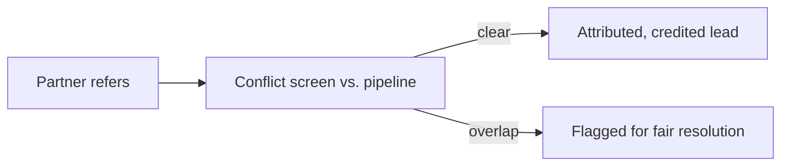
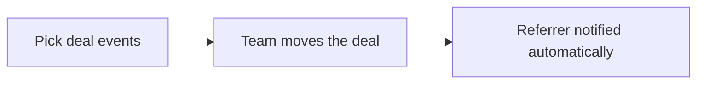
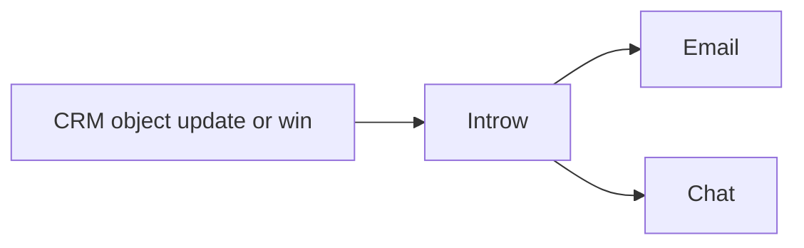
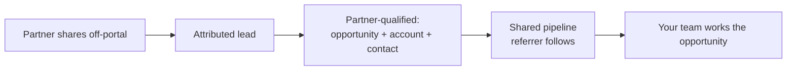
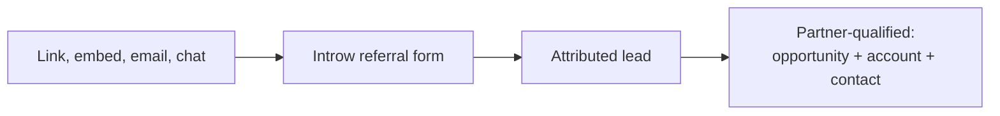
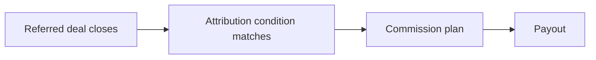

# Introw docs (docs.introw.io): features-referrals

Verbatim from docs.introw.io/llms-full.txt, fetched 2026-09-29. 12 pages.

# Channel Conflict
Source: https://docs.introw.io/features/referrals/channel-conflict/index

Channel conflict screening checks every referred lead against your direct and partner pipeline before crediting, so referrers never lose deals to overlap.

> Nothing kills a referral program faster than a partner referring a deal your direct team already has. Channel conflict screening checks every referral against your pipeline before it credits, so the referrer knows their intro will be recognized and never quietly duplicated.

## The problem it solves

A referral program leaks trust at the point of overlap:

<Pains>
  | Without Introw                   | With Introw                     |
  | -------------------------------- | ------------------------------- |
  | A partner refers a deal you have | Overlap is caught before credit |
  | Two partners refer one account   | The earlier claim is surfaced   |
  | Duplicates pile up quietly       | Matched against pipeline first  |
  | Disputed credit stops referrals  | Handled on facts, up front      |
</Pains>

## Impact

A referral is a promise about credit. Screening every intro against your own pipeline before it counts is how you keep that promise, and keeping it is why a referrer sends the second one.

<Impact>
  for your business

  * **Trustworthy**
    Overlaps are caught and resolved on facts, so a referrer's intro is honoured rather than quietly duplicated
  * **In your CRM**
    Screening runs against the deals already in HubSpot or Salesforce, not a separate referral database

  for your partners

  * **Self-serve**
    They learn where they stand at submission, instead of finding out at payout time
  * **Enabled**
    Knowing an intro will be screened fairly is what makes referring worth the effort
  * **Efficient**
    One check up front, rather than an argument about credit months later

  [A day in the life of a referral partner](/days-in-the-life/referral-partner)
</Impact>

<Personas>
  * **Partner Managers** - clean credit without policing
  * **Chief Revenue Officer** - direct and referral kept aligned
  * **Referral partners** - an intro that will be honoured
</Personas>

## See it work

<Tour>
  * 

    **Turn on the screen**

    Pick the object to check against, and narrow it with filters.

  * 

    **On the referral form**

    The same screen runs on the form partners refer through.
</Tour>

## How it works

When a partner refers a lead, Introw cross-references your CRM for an existing opportunity on the same account. That covers both cases: the direct team already has it, or another partner referred it first. The check runs before the referral creates records or credits anyone. Overlaps are flagged with the context: who's involved and which claim came first. A clean referral flows through and lands attributed; an overlapping one is surfaced so credit is decided fairly instead of the same deal being double-counted.

This is the same [AI channel-conflict engine](/features/ai/channel-conflict) that runs across every submission motion, applied to the referral flow. What's specific to referrals is what's protected - the referrer's trust that a warm intro will be honored, which is the whole basis of a program that keeps producing.

Screening makes a referral a promise you can keep. The partner refers, Introw checks the lead against your pipeline, and only a conflict-free (or fairly resolved) referral becomes attributed pipeline the referrer will be rewarded for.

## Run it from your AI assistant

<Headless>
  * Does this referral overlap a deal our direct team already has?
  * Has anyone else referred this account before?
  * Which shared leads conflict with existing pipeline?
</Headless>

## Going deeper

<CardGroup>
  <Card title="Set up conflict screening" icon="robot" href="/features/ai/channel-conflict">
    Configure detection and resolution on the AI channel-conflict page.
  </Card>

  <Card title="Catch and resolve channel conflict" icon="book-open" href="/features/ai/channel-conflict/guides/catch-and-resolve-channel-conflict">
    Turn on screening for a referral form and work conflicts from the inbox.
  </Card>
</CardGroup>

**Works with**

<CardGroup>
  <Card title="Channel Conflict Resolution" icon="robot" href="/features/ai/channel-conflict">
    The AI engine that detects and resolves conflict.
  </Card>

  <Card title="Lead Sharing" icon="share-from-square" href="/features/referrals/lead-sharing">
    Every referral is screened before it credits.
  </Card>

  <Card title="Referral Rewards" icon="share-from-square" href="/features/referrals/rewards">
    Clean attribution protects the reward that pays out.
  </Card>
</CardGroup>

---

# Keep referrers updated
Source: https://docs.introw.io/features/referrals/deal-updates/guides/keep-referrers-updated

Set up automated notifications that keep referrers in the loop as their referred deals progress, win, or close - delivered by email and chat.

Referrers stay engaged when they can see their introduction paying off. This guide sets up the full update loop: progress notifications as a referred deal advances, a celebration when it is won, and delivery by email and chat so the news reaches referrers where they work. Progress and wins are two notification types on the same partner-notification machinery, so you configure them together once and they run automatically.

## What you'll achieve

Referrers who automatically hear about their referred deals: a notification when the deal advances through meaningful stages, a closed-won notification when it lands, delivered by email and, where connected, Slack or Teams. No manual status updates, and the program feels alive between referral and reward.

## Before you start

<Steps>
  <Step title="Confirm attribution">
    Updates only reach a referrer when the referred deal is attributed to that partner in your CRM. See [Build and share a referral form](/features/referrals/lead-sharing/guides/build-and-share-a-referral-form).
  </Step>

  <Step title="Connect chat (optional)">
    Delivering updates to chat requires a connected Slack or Teams workspace. See [Slack and Teams](/features/integrations/chat).
  </Step>
</Steps>

## Watch it

<Tabs>
  <Tab title="Video">
    <video />
  </Tab>

  <Tab title="Click through">
    <iframe />
  </Tab>
</Tabs>

## Steps

### Turn on the update events

<Steps>
  <Step title="Open the notification defaults">
    Go to [Default settings](https://app.introw.io/settings/segments/default) and open the **Notifications** tab. These are the org-wide defaults for which events notify partners, and every segment inherits them until it overrides one. The deal-progress machinery is the same partner-notification system covered in [Partner notifications](/features/engagement/notifications); this guide tunes it for referrers.

    <Frame>
      
    </Frame>
  </Step>

  <Step title="Enable progress and win notifications">
    For the partner audience, turn on the two events that keep referrers informed:

    * **Object updates** - notifies the partner when a related object changes in your CRM. This is the workhorse for progress: a stage change on a referred deal counts as an update, so referrers hear about advancement.
    * **Deal closed won** - notifies the partner when a related deal is won. This is the single most motivating message in a referral program and the natural lead-in to the reward conversation. It is on by default for partners.

    <Frame>
      
    </Frame>
  </Step>
</Steps>

### Tune what counts as progress

<Steps>
  <Step title="Watch the right properties">
    A raw object update can fire on any field change, which is noisy. On the deal pipeline embed in the **Experience builder**, open the **Deal updated** notification and configure which properties count: mark the fields that represent real progress (stage, amount, close date) to notify partners and silence fields referrers do not care about. If stage is not watched, advancement will not notify.
  </Step>

  <Step title="Confirm the winning stages">
    On the same embed, open the **Deal won** notification to confirm which closed stages count as won, so the closed-won message fires at the right moment rather than on every closed stage.
  </Step>
</Steps>

### Choose how updates reach referrers

<Steps>
  <Step title="Pick delivery channels">
    Each event can be delivered by email and, where connected, by Slack or Teams. Choose the mix that fits how your referrers prefer to hear from you: email for a durable record, chat for referrers who rarely open their inbox and respond fastest in the moment. Per-channel setup lives in [Partner notifications](/features/engagement/notifications).
  </Step>

  <Step title="Override per embed where needed">
    The org defaults apply everywhere, but a specific pipeline embed can override which events notify and which properties are watched. Use this when one referral pipeline needs a different update cadence than the rest.
  </Step>
</Steps>

## Verify it worked

Move a test referred deal to a new stage and confirm the attributed partner receives a progress update by your chosen channels. Then move it to a winning stage and confirm they receive the closed-won notification. If chat is connected, confirm the message also lands in Slack or Teams.

## What your partners experience

With updates configured, the referrer hears about their deal where they already work: a notification when it moves stage or closes, by email, Slack, or Teams, plus the status in their portal. That is the payoff of this setup on the partner side - a referrer who made a warm intro sees it is being worked and knows what they will earn, without chasing your team for a status.

## Related

<CardGroup>
  <Card title="Build and share a referral form" icon="pen-ruler" href="/features/referrals/lead-sharing/guides/build-and-share-a-referral-form">
    Attribute referred deals so updates reach the right referrer.
  </Card>

  <Card title="Set up referral rewards" icon="money-bill" href="/features/referrals/rewards/guides/set-up-referral-rewards">
    Reward referrers after the win.
  </Card>

  <Card title="Partner notifications" icon="bell" href="/features/engagement/notifications">
    The canonical notification machinery and per-channel setup.
  </Card>

  <Card title="Implementation reference" icon="screwdriver-wrench" href="../technical">
    Full configuration options.
  </Card>
</CardGroup>

---

# Deal Progress Updates
Source: https://docs.introw.io/features/referrals/deal-updates/index

Keep referrers in the loop automatically - when your direct team moves a referred deal forward, the referrer is notified without chasing you for status.

> The fastest way to kill a referral program is silence after the intro. Deal progress updates close that gap: as your team works the referred deal, the referrer is kept informed automatically, so they stay confident and keep sending you deals.

## The problem it solves

The handoff after a referral is where trust erodes:

<Pains>
  | Without Introw                    | With Introw                    |
  | --------------------------------- | ------------------------------ |
  | Referrers go dark after the intro | They are notified as it moves  |
  | Chasing status eats your time     | Updates fire on CRM events     |
  | Ignored partners stop referring   | Timely updates keep them warm  |
  | You over- or under-notify         | You pick the events that count |
</Pains>

## Impact

Silence after the intro is what kills a referral program. A partner who hears the deal moved, without asking, is a partner who sends the next one.

<Impact>
  for your business

  * **No new tool**
    The update reaches the referrer by email and chat, so nothing depends on them opening a portal
  * **Trustworthy**
    The notification fires off the CRM event itself, so what the referrer hears is what actually happened

  for your partners

  * **Self-serve**
    They never have to email for status, because the status comes to them
  * **Enabled**
    They can answer their own prospect about progress, which is what protects their relationship
  * **Efficient**
    One notification when something real changes, not a weekly report to read

  [A day in the life of a referral partner](/days-in-the-life/referral-partner)
</Impact>

<Personas>
  * **Partner Managers** - warm referrers, no status emails
  * **Referral partners** - progress, in real time
</Personas>

## See it work

<Tour>
  * 

    **Open the settings**

    Updates are configured per embed, alongside the pipeline.

  * 

    **Pick the events**

    Object updates and closed-won, or just the ones you choose.
</Tour>

## How it works

Once a partner refers a lead and, once it's qualified, your direct team takes over the sale, the
referrer naturally wants to know what happened. Deal progress updates send that status automatically. When a
deal related to a partner is updated or won in your CRM, Introw notifies the partner by email
and chat, based on the events and properties you choose to watch.

The referrer never has to email you for an update, and your team never has to remember to send
one. The result is a referral motion that feels alive to the partner, even though the vendor
is running the actual sale.

Pick the deal events that matter, and Introw keeps referrers informed as your team runs the
sale. Referrers stay confident, your team stays heads-down, and the program keeps producing.

## Run it from your AI assistant

<Headless>
  * What's the latest status on the deal I referred into Acme?
  * Post a comment on my referred deal asking the rep for next steps.
  * Show updates on all the deals I've referred.
</Headless>

## Going deeper

<CardGroup>
  <Card title="How to" icon="screwdriver-wrench" href="./technical">
    Setup, configuration, and all how-to guides.
  </Card>

  <Card title="API reference" icon="code" href="/general/introduction">
    Integration surface and code.
  </Card>
</CardGroup>

**Works with**

<CardGroup>
  <Card title="Lead Sharing" icon="share-from-square" href="/features/referrals/lead-sharing">
    Update partners on leads they shared.
  </Card>

  <Card title="Notifications" icon="bell" href="/features/engagement/notifications">
    Send status updates off-portal.
  </Card>
</CardGroup>

---

# Deal Progress Updates
Source: https://docs.introw.io/features/referrals/deal-updates/technical/index

Configure the notifications that keep referrers updated as their referred deals move through your CRM, by email and chat, in Introw.

## Where it lives

Deal Progress Updates is the partner-notification layer, so it lives in two places under **Settings**: [Default settings](https://app.introw.io/settings/segments/default), on its **Notifications** tab, is where you choose which deal events reach referrers, and [Notification settings](https://app.introw.io/settings/notifications) reports what actually went out.

<Frame>
  
</Frame>

## Before you start

| You need                         | Why                              | Fix it                                                                                                                                   |
| -------------------------------- | -------------------------------- | ---------------------------------------------------------------------------------------------------------------------------------------- |
| A connected CRM with attribution | Updates reach the right referrer | [Configure attribution](/features/co-selling/shared-pipelines/guides/configure-deal-attribution)                                         |
| Slack or Teams, for chat updates | Only for the chat channel        | [Connect Slack](/features/integrations/chat/guides/connect-slack) or [Teams](/features/integrations/chat/guides/connect-microsoft-teams) |

## How it works

Referrer updates are partner notifications driven by your CRM. When an object related to a
partner is updated or reaches a winning stage, Introw can send that partner an email and a
chat message. You set the defaults for which events notify partners org-wide, and you can
override them per pipeline embed and per segment.

There is no separate "referral autopilot" to configure. Instead you decide which CRM events
count as progress worth telling a referrer about, and which properties to watch for changes,
and Introw handles the delivery.

## Settings & configuration

Org defaults live on the **Notifications** tab of [Default settings](https://app.introw.io/settings/segments/default), and any audience can
override them on its own segment; per-deal behavior is set on the CRM embed in the **Experience
builder**. Each event takes one recipients value - **All partners**, **Collaborating only**, or
**Disabled** - rather than an on/off switch.

### Object updates

**Object updates** notifies a partner when an object related to them is updated in your CRM.
This is the workhorse for progress: a stage change on a referred deal counts as an update, so
referrers hear about advancement. Keep it on for the partner audience to drive ongoing
updates.

### Deal closed won

**Deal closed won** notifies a partner when a related deal is won. Use it to celebrate the
outcome with the referrer and reinforce that referring pays off. It is on by default for the
partner audience.

### Watched properties

On a deal pipeline embed, the **Notifications** section controls which changes notify partners
and lets you mark individual properties with **Notify change to partners** or **Don't notify
change to partners**. Use this to watch the fields that represent real progress, like stage,
and to silence noisy fields referrers do not care about.

### Delivery channels

Each notification can be delivered by email and, where connected, by Slack or Teams. Choose
the channel mix that fits how your referrers prefer to hear from you.

## How-to guides

<Rail>
  * 

    [**Keep referrers updated**](/features/referrals/deal-updates/guides/keep-referrers-updated)

    Set up automated notifications that keep referrers in the loop as their referred deals progress, win, or close - delivered by email and chat.
</Rail>

## Troubleshooting

<Warning>
  Updates only reach a referrer when the referred deal is attributed to that partner in your CRM. Stage changes are delivered through object-update notifications on watched properties, so if stage is not watched, advancement will not notify. Chat delivery requires a connected Slack or Teams workspace.
</Warning>

<AccordionGroup>
  <Accordion title="A referrer gets no updates">
    Confirm the deal is attributed to that partner and that partner notifications are on.
  </Accordion>

  <Accordion title="Stage changes do not notify">
    Add the stage field to the embed's watched properties.
  </Accordion>

  <Accordion title="Chat messages do not arrive">
    Check that Slack or Teams is connected and selected as a channel.
  </Accordion>
</AccordionGroup>

---

# Referrals
Source: https://docs.introw.io/features/referrals/index

Turn partner introductions into tracked CRM pipeline with off-portal referrals, first-touch attribution, auto status updates, and automated referral fees.

> A referral program lives or dies on friction and trust. Introw lets partners refer a named deal from wherever they already work, keeps them updated automatically as your team runs the sale, and pays referral fees and revenue share without a spreadsheet, so referrers keep referring.

## The problem it solves

<Pains>
  | Without Introw                 | With Introw                      |
  | ------------------------------ | -------------------------------- |
  | Referring means logging in     | A link, an email, an assistant   |
  | It goes silent after the intro | Updates arrive as it moves       |
  | Credit gets disputed           | Attribution is set at the source |
  | Fees are worked out by hand    | Calculated from the closed deal  |
</Pains>

## Impact

A referral partner has one question: will my intro be honoured. Answering it with automatic updates and a payout they can trace is what turns one referral into a habit.

<Impact>
  for your business

  * **In your CRM**
    A referral lands as an attributed lead, and once partner-qualified it becomes the opportunity, account and contact your team works
  * **No new tool**
    Partners refer from a link, your site, their inbox, or an AI assistant, never from a forced portal
  * **Trustworthy**
    Conflict screening runs before anything credits, and payouts reconcile to the CRM deal that earned them

  for your partners

  * **Self-serve**
    They refer, follow the deal on a shared pipeline and see what they earned, without emailing anyone
  * **Enabled**
    Automatic progress updates mean they can answer their own prospect about where things stand
  * **Efficient**
    A few details at the moment they think of it, rather than a form after a login

  [A day in the life of a referral partner](/days-in-the-life/referral-partner)
</Impact>

<Personas>
  * **Partner Managers** - referrers who stay warm
  * **Your own reps** - clean pipeline to work
  * **Referral partners** - status and earnings, unasked
</Personas>

## How this area works

Referrals is the motion where a partner makes a warm introduction and your team closes the deal. A referral usually enters as a **lead**: a warm intro to a named prospect. The partner submits it off-portal through a link, an embedded form, an email, or an AI assistant - no login, only a few details. It is attributed to the referring partner from the first touch.

A warm intro becomes tracked pipeline and an automatic reward.

**Where this sits in a setup.** The [referral track](/tracks/referral) is this area end to end, and the [affiliate track](/tracks/affiliate) is the same motion when the reward is per click rather than per introduction.

<Rail>
  * 

    [**Lead Sharing**](./lead-sharing)

    Refer from a link, a site, an inbox or an assistant.

    [How to · 2 guides](./lead-sharing/technical)

  * 

    [**Channel Conflict**](./channel-conflict)

    Screened against your pipeline before it credits.

    [Read more](./channel-conflict)

  * 

    [**Shared Pipeline**](/features/co-selling/shared-pipelines)

    A live view of the deals they sourced.

    [How to · 7 guides](/features/co-selling/shared-pipelines/technical)

  * 

    [**Deal Progress Updates**](./deal-updates)

    The referrer hears as your team moves it.

    [How to · 1 guide](./deal-updates/technical)

  * 

    [**Referral Rewards**](./rewards)

    A fee or revenue share, paid on the closed deal.

    [How to · 1 guide](./rewards/technical)
</Rail>

Then the referral is treated as **partner-qualified**: the partner marks it qualified, or your team accepts it. Introw goes further and creates the full deal context - the opportunity, its account and the contact. Now it's real, worked pipeline, still attributed. As your direct team moves the opportunity forward, update notifications keep the referrer in the loop, so they never chase you for status. When it closes, referral fees and revenue share are calculated and paid through commission plans tied to partner attribution.

The mechanics build on Introw's forms, notifications, and commissions, framed for the referral motion: low-friction sourcing, automatic follow-through, and trustworthy payout.

## Run it from your AI assistant

<Headless>
  * Share a lead for Acme: contact [john@acme.com](mailto:john@acme.com), interested in the enterprise plan.
  * Show all shared leads still pending review.
  * What reward is owed on the referral that just closed?
</Headless>

---

# Build and share a referral form
Source: https://docs.introw.io/features/referrals/lead-sharing/guides/build-and-share-a-referral-form

Build a referral form that captures attributed leads, credits the referring partner, and share it as a link, an embed, or an API call from their systems.

A referral program only works once partners have a clean way to hand you a lead and trust that they will get the credit. This guide builds that capture form end to end: the fields partners complete, the automation that turns a submission into an attributed lead - and, when the referral is partner-qualified, the opportunity, its account, and the contact - the partner attribution that ties it to the referrer, the conflict and duplicate checks that protect credit, and the link or embed you hand out. Set it up once and every channel guide (link, email, embed, Slack, Teams, AI, API) plugs into it.

## What you'll achieve

A live referral form that a partner can open from anywhere, fill in with prospect details, and submit. Each submission creates an attributed lead in your CRM, credited to the referring partner from the first touch; once the referral is partner-qualified, that lead becomes the opportunity, its account, and the contact - still attributed. Every submission is checked for conflicts and duplicates before it is accepted. You leave with a shareable link, an embed snippet, and an API request ready to distribute.

## Before you start

<Steps>
  <Step title="Connect your CRM">
    A connected CRM is required so the form can create the lead - and, when qualified, the opportunity, account, and contact - and read your pipeline and properties.
  </Step>

  <Step title="Confirm partner attribution">
    Partner attribution should be configured on your CRM connection so every created record can be credited to the referring partner.
  </Step>

  <Step title="Check custom domain (for embedding)">
    Embedding the form on your own website requires a custom domain on your plan. A shareable link works without one.
  </Step>
</Steps>

## Watch it

<Tabs>
  <Tab title="Video">
    <video />
  </Tab>

  <Tab title="Click through">
    <iframe />
  </Tab>
</Tabs>

## Steps

### Build the form

<Steps>
  <Step title="Create the form">
    Go to [Forms](https://app.introw.io/forms) and select **Create form**. Give it a clear name like "Refer a deal" so partners and your team recognize it, then open the **Form builder**.

    <Frame>
      
    </Frame>
  </Step>

  <Step title="Add the fields partners fill in">
    On the **Form builder** tab, use **Add field** to build the questions a partner answers about the prospect. For each field, set:

    * **Field type** - what kind of input it is. Use **Input field** for short answers (company name, contact email), **Text area** for context like deal notes, **CRM Object** to let a partner pick an existing record, and **File upload** for attachments. Most referral forms need a handful of input fields plus a notes area.
    * **Label** - the question text the partner reads. Keep it plain ("Prospect company", "Contact email") so partners do not hesitate.
    * **Placeholder** - example text inside the field that hints at the expected answer.
    * **Make this field required** - turn this on for the details you must have to create a usable deal (company, contact, email). Leave optional anything that is nice to have.
    * **CRM Mapping** - optionally link the field to a CRM property here so its value flows straight into the record. You can also map fields later in the automation; mapping here seeds that step.

    <Frame>
      
    </Frame>
  </Step>
</Steps>

### Turn submissions into CRM records

<Steps>
  <Step title="Create the lead by default">
    Open the **Automation** tab and select **Add automation**. A referral should enter as a **lead** - the lowest-friction way for a partner to hand you a warm intro, attributed from the first touch. Add a **Lead automation** and, in **Enrich or create**, turn on **Create a new lead when one is selected** so a fresh, attributed lead is created from each referral.

    When the referral is **partner-qualified** - the partner marks it qualified, or your team accepts it - you want the full deal context, not just a lead. Add **Company**, **Contact**, and **Deal automations** as well, so a qualified referral creates the opportunity, its account, and the contact as real, worked pipeline. Introw matches existing records first (see the deduplication step below), so this enriches what you already have instead of duplicating it.
  </Step>

  <Step title="Map form fields to CRM properties">
    In the **Form fields** section, connect each answer to the right CRM property so the lead - and the opportunity, account, and contact it becomes once qualified - is populated correctly. For each mapping set:

    * **CRM Property** - the field on the CRM record that receives the value (for example the deal name or amount).
    * **Form Field** - the answer from the form that fills it.
    * **Write Mode** - how the value is written. **Fill in if not known** (the default) only sets the property when it is empty, which is safest for enrichment; **Overwrite** always replaces the current value. Use **Add field mapping** for each property you want to set.

    Use **Default values** to set properties every referral should carry (a source label, a default pipeline or stage) without asking the partner.

    <Frame>
      
    </Frame>
  </Step>

  <Step title="Attribute the referral to the partner">
    Turn on **Auto-link your partners** so the created records are tied to the referrer, then set the **Submitting Partner** attribution method that records who sent the referral. This is what makes credit automatic: every downstream update notification and reward depends on the referral being attributed here.

    <Frame>
      
    </Frame>
  </Step>
</Steps>

### Protect referral credit

<Steps>
  <Step title="Turn on Channel Conflict Analysis">
    Select **Channel Conflict Analysis** in the automation list and enable it. Before a referral creates CRM records, Introw cross-references your CRM for an existing overlapping deal so the same opportunity is not double-credited or claimed twice. Configure:

    * **Object** - the record type to check conflicts against, typically the deal pipeline the referral lands in.
    * **Filters** - limit the check to deals that match conditions you set, so only relevant pipeline counts as a conflict.
    * **Additional context** - a short description of your process that helps the analysis judge borderline cases.

    Leave it on for referral forms: a disputed deal is the fastest way to lose a referrer.
  </Step>

  <Step title="Set deduplication fields">
    On company and contact automations, open **Enrich or create** and review **Deduplication fields**. Introw matches incoming submissions against existing company or contact records on these fields to prevent duplicates and detect conflicts. Keep the suggested defaults (name, email, domain) or pick the fields that best identify a unique account in your CRM.
  </Step>
</Steps>

### Set the partner experience and share

<Steps>
  <Step title="Customize the confirmation and review">
    Configure **Submission confirmation** to control what a partner sees after submitting: choose an **End screen** with a thank-you message, or **Redirect to URL** to send them to a page you choose. Then decide review with **Approval Gate**: leave it off (the default) to accept referrals automatically, or enable it when a person should approve submissions before they create CRM records.

    <Frame>
      
    </Frame>
  </Step>

  <Step title="Share the form">
    Select **Share form** to open the share dialog. On the **Link** tab you get two options:

    * **General link** - shareable with anyone; Introw makes a best effort to relate the submission to a partner, but attribution is not guaranteed. Use it for open or web traffic.
    * **Partner link** - pick a partner and copy their link; every submission through it is attributed to that partner automatically. Use this whenever you send the form to a known referrer so credit is never in question.

    On the **Embed** tab, copy the HTML snippet to place the form on a page you control. Embedding requires a custom domain; without one, share the link instead.

    <Frame>
      
    </Frame>
  </Step>

  <Step title="Let a partner's systems refer over the API">
    On the **API** tab, copy the cURL snippet. It already carries this form's id and every field id, and the **Fields** table below marks which ones are required. A partner's own portal, your internal tooling, a backfill script, or an agent can then refer from anywhere, with the referral attributed to the partner you name and running the same conflict checks and automation. Full setup is in [Submit a form via the API](/features/forms/sharing-submitting/guides/submit-a-form-via-the-api).

    <Frame>
      
    </Frame>
  </Step>
</Steps>

## Verify it worked

Open a partner link yourself and submit a test referral. Confirm it appears in [Submissions](https://app.introw.io/submissions) under **Form submissions**, attributed to the right partner, and that an attributed lead was created in your CRM with the mapped properties filled in. Mark it partner-qualified (or accept it) and confirm the opportunity, its account, and the contact are created and still attributed. To check the safeguards, submit a referral that overlaps an existing deal and confirm it is flagged as a conflict rather than silently creating a duplicate.

## Related

<CardGroup>
  <Card title="Ways to refer" icon="share-from-square" href="./ways-to-refer">
    Every channel a partner can refer from - link, embed, email, Slack, Teams, AI, or the API.
  </Card>

  <Card title="Keep referrers updated" icon="bell" href="/features/referrals/deal-updates/guides/keep-referrers-updated">
    Notify referrers as their deals progress.
  </Card>

  <Card title="Set up referral rewards" icon="money-bill" href="/features/referrals/rewards/guides/set-up-referral-rewards">
    Pay referrers for the deals they source.
  </Card>

  <Card title="Detect channel conflict with AI" icon="robot" href="/features/ai/channel-conflict/guides/catch-and-resolve-channel-conflict">
    The full conflict-detection setup.
  </Card>

  <Card title="Implementation reference" icon="screwdriver-wrench" href="../technical">
    Full configuration options.
  </Card>
</CardGroup>

---

# Ways to refer a deal
Source: https://docs.introw.io/features/referrals/lead-sharing/guides/ways-to-refer

Every way partners can refer a deal - link, embed, email, Slack, Teams, AI assistant, or the API - all feeding one attributed referral form.

> Every step between a partner's intent to refer and the lead landing in your CRM costs you referrals. Build the referral form once, then let partners refer through whichever entry point fits how they work - a link, an embed, email, Slack, Teams, their AI assistant, or a call from their own systems. Every channel feeds the same form, so the lead always lands attributed to the referrer.

You build one referral form - with its CRM automation, partner attribution, and conflict and duplicate checks - and then expose it through as many channels as you like. This guide covers each one. Pick the channels where your partners already are; you don't need all of them.

## Before you start

<Steps>
  <Step title="Build the referral form">
    A referral form that captures an attributed lead - and, when partner-qualified, creates the opportunity, account, and contact - should already exist, and every channel below feeds it. Build it in [Build and share a referral form](./build-and-share-a-referral-form), which also sets up attribution and channel-conflict checks.
  </Step>
</Steps>

## Choose a channel

<AccordionGroup>
  <Accordion title="Share a link" icon="link">
    The lowest-friction way for a partner to refer is a link they open and fill in anywhere. A **partner-specific link** attributes every submission to that referrer automatically, so credit is never in question. Prefer the partner link over the general link whenever you send the form to a known referrer.

    <Tabs>
      <Tab title="Video">
        <video />
      </Tab>

      <Tab title="Click through">
        <iframe />
      </Tab>
    </Tabs>

    <Steps>
      <Step title="Open the form's share dialog">
        In [Forms](https://app.introw.io/forms), open your  form and open its **Share form** dialog.
      </Step>

      <Step title="Copy the link">
        On the **Link** tab, copy the general link to share with anyone, or the partner link to attribute every submission to a specific partner.
      </Step>

      <Step title="Send it to partners">
        Drop the link into an email, a portal message, a Slack channel, or anywhere your partners already are. A partner link credits that partner every time they  a deal.
      </Step>
    </Steps>
  </Accordion>

  <Accordion title="Embed on your site" icon="window-maximize">
    Some partners and prospects arrive on your own pages. Embedding the referral form there captures referrals in context, with your branding. Where the page is partner-specific, use an attributed embed so each submission credits the right partner instead of arriving anonymous. Embedding requires a custom domain; without one, share the link instead.

    <Tabs>
      <Tab title="Video">
        <video />
      </Tab>

      <Tab title="Click through">
        <iframe />
      </Tab>
    </Tabs>

    <Steps>
      <Step title="Open the share dialog">
        In [Forms](https://app.introw.io/forms), open your  form and open its **Share form** dialog.
      </Step>

      <Step title="Switch to the Embed tab">
        On the **Embed** tab, copy the generated HTML snippet.
      </Step>

      <Step title="Paste it on your page">
        Add the snippet to the page where you want partners to , such as a partner landing page or a website footer.
        The snippet includes a hosted `form-embed.js` script that resizes the iframe as the form grows or shrinks, including after submit.
      </Step>

      <Step title="Retrofit an existing bare iframe">
        If you already pasted a bare `<iframe src="…/forms/…/embed">`, add one script tag for `https://app.introw.io/form-embed.js` (or the same origin as your form). Existing embeds start resizing without changing the iframe markup.
      </Step>

      <Step title="Attribute where possible">
        Where you know the partner, use an attributed embed so each submission credits the right partner instead of arriving anonymous.
      </Step>
    </Steps>
  </Accordion>

  <Accordion title="Refer by email" icon="envelope">
    A partner often spots an opportunity mid email thread. Letting them forward that email captures the lead, with the AI agent filling in the referral form so it still lands attributed and CRM-ready. The [AI agent](/features/ai/partner-support) must be enabled for your program.

    <Steps>
      <Step title="Set up the partner support email">
        Confirm your partner support email address is active. Partners forward a lead to it, and the AI agent reads the email and submits the  for them.
      </Step>

      <Step title="Tell partners they can email">
        Share the address and a short note that they can forward a prospect with a sentence of context to  a deal, no portal needed.
      </Step>

      <Step title="Let the agent fill the form">
        The agent maps the email into your  form, so the deal still lands attributed and CRM-ready.
      </Step>
    </Steps>
  </Accordion>

  <Accordion title="Refer from Slack" icon="slack">
    If your partners live in Slack, bringing the Introw agent into the channel lets them refer in the same place they already talk to your team. Connect your workspace first - see [Connect Slack](/features/integrations/chat/guides/connect-slack).

    <Steps>
      <Step title="Connect Slack">
        Connect your Slack workspace so the Introw agent can take s from chat. See [Connect Slack](/features/integrations/chat/guides/connect-slack).
      </Step>

      <Step title="Bring the agent into a channel">
        Add the Introw agent to the partner channel where deals come up.
      </Step>

      <Step title="Let partners submit from a message">
        Partners give the agent the deal details in a message, and it submits the  through the same form flow so they can  without leaving Slack.
      </Step>
    </Steps>
  </Accordion>

  <Accordion title="Refer from Microsoft Teams" icon="microsoft">
    Same as Slack, for Teams-first channels. Connect your tenant first - see [Connect Microsoft Teams](/features/integrations/chat/guides/connect-microsoft-teams).

    <Steps>
      <Step title="Connect Microsoft Teams">
        Connect your Teams tenant so the Introw agent can take s from chat. See [Connect Microsoft Teams](/features/integrations/chat/guides/connect-microsoft-teams).
      </Step>

      <Step title="Bring the agent into a channel">
        Add the Introw agent to the partner channel where deals come up.
      </Step>

      <Step title="Let partners submit from a message">
        Partners give the agent the deal details in a message, and it submits the  through the same form flow so they can  without leaving Teams.
      </Step>
    </Steps>
  </Accordion>

  <Accordion title="Refer with an AI assistant (MCP)" icon="robot">
    When a partner already works in an AI assistant, the lowest-friction path is to just ask it. An assistant connected to Introw over MCP fills in the referral form and submits it, attributed to the partner, without switching tools. See [Connect an MCP client](/features/developer/mcp/guides/connect-an-mcp-client) and, for partners running their own assistant, [Partner Connect](/features/partner-connect).

    <Steps>
      <Step title="Enable the AI agent">
        The AI agent powers assistant submissions. Confirm it is enabled for your program.
      </Step>

      <Step title="Connect an AI assistant">
        Where partners use an AI assistant connected to Introw through the [MCP server](/features/developer/mcp), they can ask it to  a deal in plain language.
      </Step>

      <Step title="Share an example prompt">
        Give partners a short example prompt so they know they can  a deal straight from their assistant, which calls the same  form flow.
      </Step>
    </Steps>
  </Accordion>

  <Accordion title="Refer over the API" icon="code">
    Your largest partners often want referrals to flow system to system rather than person to form. Their portal, your internal tooling, a backfill script, or an agent posts the same referral form over the API, from anywhere, with no browser and no login. The referral is attributed to the partner you name and runs the same automation, conflict checks, and approval as a form a partner filled in by hand. See [Submit a form via the API](/features/forms/sharing-submitting/guides/submit-a-form-via-the-api).

    <Steps>
      <Step title="Create an API key with Forms - Write">
        In [API keys](https://app.introw.io/settings/developers/api-keys), create a key with the **Forms - Write** permission and copy the secret once. Add **Forms - Read** if your code should also fetch the form's field schema. See [Create and manage API keys](/features/developer/api/guides/create-and-manage-api-keys).
      </Step>

      <Step title="Copy the request from the API tab">
        In [Forms](https://app.introw.io/forms), open your  form, open **Share form**, and switch to the **API** tab. The cURL snippet there already carries this form's id and every field id, and the **Fields** table below it marks which ones are required.
      </Step>

      <Step title="Post it from your own system">
        Call the endpoint from your product, your internal tooling, a script, or an agent. Send `partnerId` so the  is attributed to the right partner, and Introw runs the same automation, checks, and approval flow as a partner filling in the form. See [Submit a form via the API](/features/forms/sharing-submitting/guides/submit-a-form-via-the-api).
      </Step>
    </Steps>
  </Accordion>
</AccordionGroup>

## Verify it worked

Use whichever channel you set up to submit a test referral, then confirm it appears in [Submissions](https://app.introw.io/submissions) under **Form submissions**, attributed to the right partner, with a matching lead created in your CRM.

## Related

<CardGroup>
  <Card title="Build and share a referral form" icon="book-open" href="./build-and-share-a-referral-form">
    Build the form, attribution, and conflict checks behind every channel.
  </Card>

  <Card title="Channel Conflict" icon="shield-halved" href="/features/referrals/channel-conflict">
    How each referral is screened for overlap before it credits.
  </Card>

  <Card title="Keep referrers updated" icon="bell" href="/features/referrals/deal-updates/guides/keep-referrers-updated">
    Notify referrers as their deals progress.
  </Card>

  <Card title="Connect an MCP client" icon="plug" href="/features/developer/mcp/guides/connect-an-mcp-client">
    Let assistants submit through Introw's MCP server.
  </Card>

  <Card title="Submit a form via the API" icon="code" href="/features/forms/sharing-submitting/guides/submit-a-form-via-the-api">
    Let a partner's own system, your tooling, or an agent refer headlessly.
  </Card>
</CardGroup>

---

# Lead Sharing
Source: https://docs.introw.io/features/referrals/lead-sharing/index

Let partners refer named deals from share links, embedded forms, email, or AI assistants with no portal login and clean referrer attribution in your CRM.

> Every step between a partner's intent to refer and the lead landing in your CRM costs you referrals. Lead sharing removes those steps: a partner refers from a link, your website, their inbox, or an AI assistant, and the deal arrives attributed to them.

## The problem it solves

Friction at the moment of intent is where referral programs leak:

<Pains>
  | Without Introw                    | With Introw                    |
  | --------------------------------- | ------------------------------ |
  | Partners will not log in to refer | A link, an email, an assistant |
  | Referrals arrive without an owner | Attributed to the referrer     |
  | The details captured vary         | One form decides what is asked |
  | The lead is re-keyed by hand      | It writes straight to the CRM  |
</Pains>

## Impact

Every step between a partner thinking of a referral and it reaching you costs you referrals. Removing the login is the single highest-return thing you can do to a referral program.

<Impact>
  for your business

  * **In your CRM**
    The referral lands as an attributed lead, and once partner-qualified becomes the opportunity, account and contact
  * **No new tool**
    A share link, an embed on your own site, an email, or an AI assistant: whichever they already use

  for your partners

  * **Self-serve**
    They refer in the moment they think of it, with no login and only a few details to give
  * **Enabled**
    The lead and the deal it becomes appear on a shared pipeline they can follow
  * **Efficient**
    One submission, and their own systems can refer over the API if they would rather

  [A day in the life of a referral partner](/days-in-the-life/referral-partner)
</Impact>

<Personas>
  * **Referral partners** - referring with almost no friction
  * **Partner Managers** - clean, attributed referrals
</Personas>

## See it work

<Tour>
  * 

    **Ask for the few details**

    A referral form is short on purpose.

  * 

    **Attribute it**

    The submitting partner is linked to the record automatically.

  * 

    **Screen for conflict**

    Check it against your pipeline before anything credits.

  * 

    **Get it to partners**

    A general link, a per-partner link, or an embed on your site.
</Tour>

## How it works

Lead sharing lets partners submit a referral without logging into a portal. You give them a share link
or an embedded form, and they can also refer by email or through an AI assistant. Each submission lands
in your CRM as an attributed **lead** - a warm intro to a named prospect that asks for only a few
details - credited to the referring partner from the first touch. When the referral is treated as
partner-qualified, Introw creates the full deal context: the opportunity, its account, and the contact.

Because the entry points meet partners where they already work, referrals happen in the moment a partner
thinks of one, instead of being lost to a clunky login. Behind the scenes it uses Introw forms, so you
control the fields captured and how they map to the CRM.

Sharing isn't a one-way drop. Each referred lead - and the deal it becomes - appears on a **shared pipeline**
the referring partner can follow, with automatic nudges as your team moves it. That transparency into their
own lead pipeline is often what keeps referral partners referring. See [Shared pipelines](/features/co-selling/shared-pipelines)
and [Keep referrers updated](/features/referrals/deal-updates).

Build a referral form once, then share it as a link, embed it on your site, or let partners refer by
email or AI. Every referral lands attributed and CRM-ready, so partners refer more and your team works
clean pipeline.

## Run it from your AI assistant

<Headless>
  * Share a new lead for Acme with contact [john@acme.com](mailto:john@acme.com).
  * Show the leads I've shared this month and their status.
  * Which of my shared leads have been accepted?
</Headless>

## Going deeper

<CardGroup>
  <Card title="How to" icon="screwdriver-wrench" href="./technical">
    Setup, configuration, and all how-to guides.
  </Card>

  <Card title="API reference" icon="code" href="/general/introduction">
    The form submission endpoint and code.
  </Card>
</CardGroup>

**Works with**

<CardGroup>
  <Card title="Deal Progress Updates" icon="share-from-square" href="/features/referrals/deal-updates">
    Referrers get automatic status updates.
  </Card>

  <Card title="Referral Rewards" icon="share-from-square" href="/features/referrals/rewards">
    Closed referrals pay out.
  </Card>

  <Card title="Form Builder" icon="table-list" href="/features/forms/form-builder">
    Capture referrals with a form.
  </Card>
</CardGroup>

---

# Lead Sharing
Source: https://docs.introw.io/features/referrals/lead-sharing/technical/index

Build a referral form, share it as a link or embed, and let partners refer by email or AI - all attributed to the referring partner in Introw.

## Where it lives

Lead Sharing sits under **Portal**, at [Forms](https://app.introw.io/forms).

<Frame>
  
</Frame>

## Before you start

| You need                    | Why                             | Fix it                                                                          |
| --------------------------- | ------------------------------- | ------------------------------------------------------------------------------- |
| A form that captures a lead | The referral arrives as one     | [Build a form](/features/forms/form-builder/guides/build-and-publish-a-form)    |
| A custom domain, to embed   | Only for embedding on your site | [Custom domain](/features/portal/custom-domains/guides/connect-a-custom-domain) |

## How it works

A referral form is a regular Introw form. By default it captures a referral as an attributed **lead** -
a low-friction warm intro that asks for only a few details. When the referral is treated as
**partner-qualified** (the partner marks it qualified, or your team accepts it), the same form's CRM
automations create the full deal context: the opportunity, its account, and the contact. From the form's
share dialog you get a link partners can use, an embed snippet for your own site, and the option to add a
partner-specific link that pre-attributes submissions to that partner. Partners can also refer by
emailing your partner support address or by asking an AI assistant to submit on their behalf.

Whichever entry point a partner uses, the submission is captured by the same form pipeline, attributed
to the referring partner, and written to your CRM. You manage the form fields and CRM mapping in the
form builder; this page covers getting referrals in from off-portal surfaces.

### Protecting referral credit

A referral program runs on trust: if a partner refers a deal and later finds it was already in your
pipeline, or that someone else got the credit, they stop referring. Introw protects credit in three
layers. **Attribution** ties each submission to the referrer, automatically when you use a partner
link or an attributed channel, so credit is recorded the moment the referral arrives. **Channel
Conflict Analysis** cross-references each referral against your existing CRM before it creates records,
so an overlapping deal is flagged instead of silently double-credited. **Deduplication** matches
incoming companies and contacts against existing records so the same account is not created twice. You
configure all three on the referral form; see [Build and share a referral
form](/features/referrals/lead-sharing/guides/build-and-share-a-referral-form).

## Settings & configuration

Referral forms are managed from [Forms](https://app.introw.io/forms); submissions land in
[Submissions](https://app.introw.io/submissions).

### Share link

The form's **Share form** dialog provides a **Link** tab with a general link anyone can use and a
partner link that attributes submissions to a specific partner. Use the partner link when you send it to
a known referrer so credit is automatic.

### Embed

The **Embed** tab gives an HTML snippet to place referral capture on your own website. Embedding on your
domain requires a custom domain; without one, share the link instead.

### Refer by email

Partners can forward a lead to your partner support email address, where the AI agent reads it and
submits the referral form for them. This lets partners refer straight from their inbox.

### Refer by AI assistant

With the AI agent and MCP connectors available, partners can ask their assistant to submit a referral,
which calls the same submission flow. This is handy for partners who live in chat or their CRM.

## How-to guides

<Rail>
  * 

    [**Build and share a referral form**](/features/referrals/lead-sharing/guides/build-and-share-a-referral-form)

    Build a referral form that captures attributed leads, credits the referring partner, and share it as a link, an embed, or an API call from their systems.

  * [**Ways to refer a deal**](/features/referrals/lead-sharing/guides/ways-to-refer)

    Every way partners can refer a deal - link, embed, email, Slack, Teams, AI assistant, or the API - all feeding one attributed referral form.
</Rail>

## Troubleshooting

<Warning>
  Embedding a form on your own website requires a custom domain on your plan; otherwise use the share link. A general link does not attribute to a specific partner, so use a partner link or an attributed channel when you need clean credit. Email and AI referral depend on the AI agent being enabled.
</Warning>

<AccordionGroup>
  <Accordion title="A referral is not attributed to the partner">
    Use the partner-specific link or an attributed channel rather than the general link.
  </Accordion>

  <Accordion title="The embed will not load on your site">
    Confirm a custom domain is configured.
  </Accordion>

  <Accordion title="Email referrals are not coming through">
    Check that the AI agent and partner support email are set up.
  </Accordion>
</AccordionGroup>

---

# Set up referral rewards
Source: https://docs.introw.io/features/referrals/rewards/guides/set-up-referral-rewards

Reward referrers end to end: pick a plan template, target referred deals with an attribution condition, enroll partners, review lines, and pay out.

A referral reward is a commission plan with one referral-specific twist: it only pays on deals the referrer actually sourced. This guide takes you through the whole reward, end to end, but stays focused on the two things that make it a referral reward, the attribution eligibility condition and enrolling referrers, and links out to the commissions guides for the shared plan and payout mechanics rather than repeating them.

## What you'll achieve

A live referral reward that watches your CRM, generates a commission line whenever an enrolled referrer's sourced deal closes, and rolls approved lines into a payout, so referrers are paid accurately and finance has a clean record to reconcile.

## Before you start

<Steps>
  <Step title="Confirm the commissions module">
    Referral rewards use Introw's commission engine, which must be on your plan.
  </Step>

  <Step title="Confirm partner attribution">
    Referred deals must be attributed to the referrer in your CRM so the plan can target them. See [Build and share a referral form](/features/referrals/lead-sharing/guides/build-and-share-a-referral-form).
  </Step>
</Steps>

## Watch it

<Tabs>
  <Tab title="Video">
    <video />
  </Tab>

  <Tab title="Click through">
    <iframe />
  </Tab>
</Tabs>

## Steps

### Create the plan

<Steps>
  <Step title="Pick a reward template">
    Go to [Commission plans](https://app.introw.io/commission?section=plans), create a plan, and choose the template that matches what your program promises referrers:

    * **Revenue Share** - a one-time percentage of the closed deal value (defaults to 15%). Best when the reward should scale with deal size; the most common referral reward.
    * **Fixed Fee** - a one-time set amount per qualified referral (defaults to 500). Best for high-volume programs or where deal values are similar and you want a predictable, flat reward.
    * **Tiered** - a recurring yearly percentage that can change over time (for example 15% in year one, 10% in year two). Best for referrals on recurring revenue.

    Set the percentage or amount, and point the plan at the CRM property that holds deal value so the reward is calculated from the right number. The full reward, tier, and data-source options are covered in [Build and launch a commission plan](/features/commissions/commission-plans/guides/build-and-launch-a-commission-plan).

    <Frame>
      
    </Frame>
  </Step>
</Steps>

### Target referred deals

<Steps>
  <Step title="Add a partner attribution eligibility condition">
    This is the step that turns a generic commission plan into a referral reward. In the plan's eligibility, add a condition that filters on partner attribution so only deals the referrer actually sourced earn the reward. Without it, the plan would pay on every deal an enrolled partner touched, including ones they only influenced or were never part of. Layer any other qualifiers you need (a minimum amount, a specific pipeline) on top of the attribution condition. The general eligibility mechanics live in [Set eligibility conditions](/features/commissions/commission-plans/guides/set-eligibility-conditions).
  </Step>
</Steps>

### Enroll referrers

<Steps>
  <Step title="Enroll the partners this reward applies to">
    A plan does nothing until partners are enrolled in it. Enroll the referrers this reward covers, so their sourced deals start generating lines from enrollment forward. Enrolling later does not retroactively reward deals that closed before, so enroll a referrer when they join the program. The full enrollment options are in [Build and launch a commission plan](/features/commissions/commission-plans/guides/build-and-launch-a-commission-plan).

    <Frame>
      
    </Frame>
  </Step>
</Steps>

### Review and pay out

<Steps>
  <Step title="Review generated lines">
    When an enrolled referrer's attributed deal closes, Introw generates a commission line for the reward amount. Review the lines and approve the ones ready to pay; this is your human checkpoint before money moves. See [Review and adjust commission lines](/features/commissions/commission-lines/guides/review-and-adjust-commission-lines).
  </Step>

  <Step title="Roll approved lines into a payout">
    In [Payouts](https://app.introw.io/commission?section=payouts), roll approved lines into a payout for each referrer on your schedule, then mark it paid once payment is sent so the record stays accurate. See [Run a payout cycle](/features/commissions/payouts/guides/run-a-payout-cycle).
  </Step>
</Steps>

## Verify it worked

Close a test deal attributed to an enrolled referrer and confirm a commission line is generated for the expected amount and only for the sourced deal. Approve the line, roll it into a payout, and confirm the referrer's earnings show as paid once you mark the payout complete.

## Related

<CardGroup>
  <Card title="Create a commission plan" icon="file-invoice-dollar" href="/features/commissions/commission-plans/guides/build-and-launch-a-commission-plan">
    The full plan-creation mechanics.
  </Card>

  <Card title="Create a payout" icon="money-bill" href="/features/commissions/payouts/guides/run-a-payout-cycle">
    The full payout workflow.
  </Card>

  <Card title="Keep referrers updated" icon="bell" href="/features/referrals/deal-updates/guides/keep-referrers-updated">
    Notify referrers on the win that triggers the reward.
  </Card>

  <Card title="Implementation reference" icon="screwdriver-wrench" href="../technical">
    Full configuration options.
  </Card>
</CardGroup>

---

# Referral Rewards
Source: https://docs.introw.io/features/referrals/rewards/index

Pay referral fees and revenue share automatically - tie rewards to partner-sourced deals, calculate from your CRM, and pay out without spreadsheets.

> Referrers refer again when they trust the payout. Referral rewards make that trust automatic: a fee or revenue share tied to the deals a partner sourced, calculated from your CRM, and paid out on schedule, with no manual crediting.

## The problem it solves

Payout friction and disputes quietly kill referral programs:

<Pains>
  | Without Introw                    | With Introw                   |
  | --------------------------------- | ----------------------------- |
  | Crediting by hand is error-prone  | Calculated from attribution   |
  | Referrers doubt they will be paid | Earnings tied to closed deals |
  | Fees and revenue share differ     | Fixed, share and tiered plans |
  | Finance cannot reconcile it       | Every line traces to a deal   |
</Pains>

## Impact

Referrers refer again when they trust the payout. A number that traces back to a closed deal, arriving on a schedule they know, is the whole of that trust.

<Impact>
  for your business

  * **Trustworthy**
    The reward is computed from CRM deal values and attribution, so there is nothing to dispute after the fact
  * **In your CRM**
    Lines and payouts trace back to the CRM deals that earned them, which is what lets finance sign off
  * **Cost to run**
    A partner manager configures fixed-fee, revenue-share or tiered models without engineering

  for your partners

  * **Self-serve**
    They see what a referred deal will earn and when it pays, without asking anybody
  * **Enabled**
    A tiered recurring rate makes it worth bringing the next deal, not just the first
  * **Efficient**
    No invoice to raise for a fee that was already calculated from the deal

  [A day in the life of a referral partner](/days-in-the-life/referral-partner)
</Impact>

<Personas>
  * **Partner Managers** - the reward tied to sourced deals
  * **Finance** - referral earnings that reconcile
  * **Referral partners** - paid accurately, on time
</Personas>

## See it work

<Tour>
  * 

    **Pick the model**

    Revenue share, a fixed fee, or a tiered recurring rate.

  * 

    **Tie it to attribution**

    A condition on partner attribution is what makes a deal count.

  * 

    **Review the lines**

    Each earned line is checked before it becomes money.

  * 

    **Roll into a payout**

    Approved lines become one payout the partner can track.
</Tour>

## How it works

Referral rewards pay partners for the deals they bring in. You build a commission plan, choose
how the reward works, a fixed fee per referred deal, a percentage revenue share, or a tiered
recurring rate, and tie it to partner-attached deals through attribution. As referred deals
close in your CRM, commission lines are generated, reviewed, and rolled into payouts.

Because the reward is calculated from CRM deal values and attribution, there is no spreadsheet
to maintain and no debate over who earned what. Referrers see what they will earn and get paid
on the schedule you set.

Set up a referral plan once, attribute referred deals, and let Introw generate the lines and
payouts. Referrers get paid accurately and on time, and your team stops running referral math
by hand.

## Run it from your AI assistant

<Headless>
  * What referral reward is owed on Acme's closed deal?
  * How much have I earned in referral rewards this quarter?
  * When is my next referral payout due?
</Headless>

## Going deeper

<CardGroup>
  <Card title="How to" icon="screwdriver-wrench" href="./technical">
    Setup, configuration, and all how-to guides.
  </Card>

  <Card title="API reference" icon="code" href="/general/introduction">
    Integration surface and code.
  </Card>
</CardGroup>

**Works with**

<CardGroup>
  <Card title="Lead Sharing" icon="share-from-square" href="/features/referrals/lead-sharing">
    Reward referrals that close.
  </Card>

  <Card title="Commission Plans" icon="hand-holding-dollar" href="/features/commissions/commission-plans">
    Rewards run on commission plans.
  </Card>

  <Card title="Payouts" icon="hand-holding-dollar" href="/features/commissions/payouts">
    Referral fees pay out in batches.
  </Card>
</CardGroup>

---

# Referral Rewards
Source: https://docs.introw.io/features/referrals/rewards/technical/index

Set up referral fees and revenue share with commission plans tied to partner-attached deals, then review lines and pay out, in Introw.

## Where it lives

Referral Rewards sits under **Commission**, at [Commission plans](https://app.introw.io/commission?section=plans).

<Frame>
  
</Frame>

## Before you start

| You need                       | Why                                | Fix it                                                                                           |
| ------------------------------ | ---------------------------------- | ------------------------------------------------------------------------------------------------ |
| The commissions module         | Rewards are commission plans       | **Request access**                                                                               |
| Partner attribution configured | Referred deals tie to the referrer | [Configure attribution](/features/co-selling/shared-pipelines/guides/configure-deal-attribution) |

## How it works

Referral rewards reuse Introw's commission engine, framed for referred deals. You create a
commission plan, choose a reward template, and tie the plan to the deals a partner sourced by
filtering on partner attribution. When a qualifying deal closes in your CRM, Introw generates
a commission line, which you review and then roll into a payout.

The reward math comes from your CRM deal values and attribution, so it stays accurate as deals
change. This page covers the referral-specific setup; the full commission, payout, and
settings mechanics live in the Commissions area.

## Settings & configuration

Plans are built from [Commission plans](https://app.introw.io/commission?section=plans); payouts are
managed from [Payouts](https://app.introw.io/commission?section=payouts).

### Reward template

When you create a plan, you pick a template. **Revenue Share** pays a one-time percentage of a
closed deal's value, which fits most referral fees. **Fixed Fee** pays a one-time set amount per
qualified referral. **Tiered** pays a recurring percentage that can change by year, for
referrals on recurring revenue. Choose the model your program promises referrers.

### Deal value source

The plan reads the deal amount from a CRM property you select. Point it at the property your
team uses for deal value so the reward is calculated from the right number.

### Partner attribution filter

To target referred deals, the plan's eligibility uses a partner attribution filter so only
deals sourced by the referrer earn the reward. Set this so influenced-only or unrelated deals
do not generate referral payouts.

### Review and payout

Generated commission lines are reviewed before payout, and approved lines roll into payouts on
the schedule you configure in commission settings. Use this to keep a human check on referral
earnings before money moves.

## How-to guides

<Rail>
  * 

    [**Set up referral rewards**](/features/referrals/rewards/guides/set-up-referral-rewards)

    Reward referrers end to end: pick a plan template, target referred deals with an attribution condition, enroll partners, review lines, and pay out.
</Rail>

## Troubleshooting

<Warning>
  Rewards only generate for deals attributed to the referrer, so partner attribution must be configured on the CRM connection. The reward is calculated from the CRM deal-value property you choose; if that property is empty or wrong, the line will be too. Commission lines are reviewed before they roll into payouts.
</Warning>

<AccordionGroup>
  <Accordion title="No commission lines generate for a referred deal">
    Confirm the deal is attributed to the partner and matches the plan's eligibility filter.
  </Accordion>

  <Accordion title="The reward amount looks wrong">
    Check the deal-value property the plan reads from.
  </Accordion>

  <Accordion title="A referrer is not enrolled">
    Confirm the partner is enrolled in the referral plan.
  </Accordion>
</AccordionGroup>