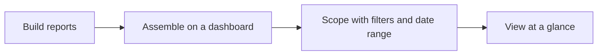
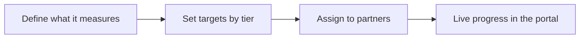
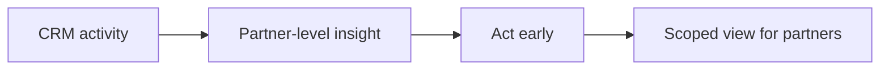
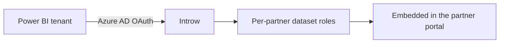
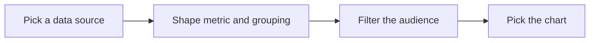

# Introw docs (docs.introw.io): features-reporting

Verbatim from docs.introw.io/llms-full.txt, fetched 2026-09-29. 23 pages.

# Build a dashboard
Source: https://docs.introw.io/features/reporting/dashboards/guides/build-a-dashboard

Assemble saved reports into a single dashboard: create it, add and arrange reports on the grid, and scope it with audience filters and a date range.

> For partner ops who want a single, shareable view of program performance.

A dashboard turns a handful of related reports into one view your team returns to, instead of hunting through individual charts. Reports are the building blocks, so you create them first in the [report builder](/features/reporting/report-builder/guides/build-a-report), then assemble them here. Building one - and filling it with the right reports in a readable layout - gives everyone a shared, focused picture, like a partner-attached pipeline dashboard scoped to a tier and a quarter. This guide takes you from an empty dashboard to a populated, filtered view.

## What you'll achieve

A saved dashboard that holds your chosen reports in the layout you arranged, scoped by audience filters and a date range, ready to share with your team or embed in a partner portal.

## Before you start

<Steps>
  <Step title="Confirm reporting is on your plan">
    Reporting is a plan feature, and plans cap how many saved reports and dashboards you get. If you hit the cap or see an upgrade prompt, check what your plan includes at [introw.io/pricing](https://introw.io/pricing).
  </Step>

  <Step title="Save the reports first">
    A dashboard is built from saved reports, so create the reports you want to include before you start. See [Build a report](/features/reporting/report-builder/guides/build-a-report) in the report builder.
  </Step>

  <Step title="Confirm reports access">
    You need reports write access to create and edit dashboards.
  </Step>
</Steps>

## Watch it

<Tabs>
  <Tab title="Video">
    <video />
  </Tab>

  <Tab title="Click through">
    <iframe />
  </Tab>
</Tabs>

## Steps

### Create the dashboard

<Steps>
  <Step title="Open Dashboards">
    Go to [Dashboards](https://app.introw.io/dashboards). Each dashboard appears as its own tab, so you can keep several views side by side.

    <Frame>
      
    </Frame>
  </Step>

  <Step title="Add a dashboard and name it">
    Create a new dashboard tab and give it a clear name, for example "Partner pipeline". The name labels the tab and identifies the dashboard when you embed it in a portal.

    <Frame>
      
    </Frame>
  </Step>
</Steps>

### Add and arrange reports

<Steps>
  <Step title="Open the report sidebar">
    With the dashboard open, edit its layout. The sidebar lists your saved reports; search it to find the one you want.
  </Step>

  <Step title="Add reports to the grid">
    Drag a saved report from the sidebar onto the grid. Repeat for each report you want on this dashboard. Only saved reports you have access to appear in the list.
  </Step>

  <Step title="Arrange the layout">
    Resize and reposition each report on the grid so the most important charts read first. The grid keeps the arrangement you set.
  </Step>
</Steps>

### Scope and save

<Steps>
  <Step title="Set audience filters and a date range">
    Apply the dashboard-wide controls that flow into every report on it.

    * **Audience filters** - scope the whole dashboard to a set of partners (for example a tier or segment), so every report reflects the same audience.
    * **Date range** - choose a preset that frames the period all reports cover, so the dashboard tells one consistent time story.
  </Step>

  <Step title="Save the dashboard">
    Save the layout. The dashboard is now available as a tab and can be embedded in a partner portal.

    <Frame>
      
    </Frame>
  </Step>
</Steps>

## Verify it worked

The dashboard appears as a tab on [Dashboards](https://app.introw.io/dashboards) and shows your reports in the layout you arranged, with the audience filters and date range applied across every report.

## Related

<CardGroup>
  <Card title="Embed a dashboard in the portal" icon="book-open" href="./embed-a-dashboard-in-the-portal">
    Share it with partners.
  </Card>

  <Card title="Build a report" icon="book-open" href="/features/reporting/report-builder/guides/build-a-report">
    Make more reports to add.
  </Card>

  <Card title="Implementation reference" icon="screwdriver-wrench" href="../technical">
    Full configuration options.
  </Card>
</CardGroup>

---

# Embed a dashboard in the portal
Source: https://docs.introw.io/features/reporting/dashboards/guides/embed-a-dashboard-in-the-portal

Embed a dashboard in the partner portal to give partners a curated, self-scoped view of their own metrics without pulling numbers manually.

Partners stay engaged when they can see how they are doing. Embedding a dashboard in a portal
experience gives them a curated view scoped to their own data, so they get insight without you
pulling numbers for them.

## What you'll build

A portal experience that shows partners a dashboard.

## Before you start

<Steps>
  <Step title="Confirm reporting is on your plan">
    Reporting is a plan feature, and plans cap how many saved reports and dashboards you get. If you hit the cap or see an upgrade prompt, check what your plan includes at [introw.io/pricing](https://introw.io/pricing).
  </Step>

  <Step title="Build the dashboard">
    Create the dashboard you want to share first.
  </Step>
</Steps>

## Watch it

<Tabs>
  <Tab title="Video">
    <video />
  </Tab>

  <Tab title="Click through">
    <iframe />
  </Tab>
</Tabs>

## Steps

<Steps>
  <Step title="Open the experience">
    Go to the [Experience builder](https://app.introw.io/templates) and open the portal experience you want partners to see.

    <Frame>
      
    </Frame>
  </Step>

  <Step title="Add a Dashboard embed section">
    Add a **Dashboard embed** section to a stage. This is the section type that surfaces an Introw dashboard, scoped to the viewing partner.

    <Frame>
      
    </Frame>
  </Step>

  <Step title="Pick the dashboard">
    Select the dashboard to surface. Only saved dashboards are available.

    <Frame>
      
    </Frame>
  </Step>

  <Step title="Publish">
    Publish the experience so partners see the dashboard.
  </Step>
</Steps>

## Verify it worked

Open the portal as a partner and confirm the dashboard shows their scoped data.

## Related

<CardGroup>
  <Card title="Build a dashboard" icon="book-open" href="./build-a-dashboard">
    Create the dashboard.
  </Card>

  <Card title="Show a partner dashboard in the portal" icon="book-open" href="/features/reporting/partner-analytics/guides/show-a-partner-dashboard-in-the-portal">
    Use partner-scoped analytics.
  </Card>

  <Card title="Implementation reference" icon="screwdriver-wrench" href="../technical">
    Full configuration options.
  </Card>
</CardGroup>

---

# Set a custom fiscal year
Source: https://docs.introw.io/features/reporting/dashboards/guides/set-a-custom-fiscal-year

Define your fiscal year start date so Introw dashboards, partner analytics, and time ranges align with your company's internal reporting periods.

Not every company runs its financial reporting on a January to December calendar. If yours doesn't, Introw's time ranges like "This fiscal year" and "This fiscal quarter" need to know when your fiscal year begins. This guide sets your fiscal year start date once, so dashboards and analytics line up with your internal reporting periods and period-over-period comparisons are accurate.

## What you'll achieve

A fiscal year start date configured for your organisation, so Introw adds fiscal time ranges to its selectors and aligns dashboards and analytics with how your business actually reports, making pipeline, revenue, and partner performance comparable period over period.

## Before you start

<Steps>
  <Step title="Confirm reporting is on your plan">
    Reporting is a plan feature, and plans cap how many saved reports and dashboards you get. If you hit the cap or see an upgrade prompt, check what your plan includes at [introw.io/pricing](https://introw.io/pricing).
  </Step>

  <Step title="Know your fiscal year start">
    Have the month your fiscal year begins ready (for example April 1, July 1, or October 1).
  </Step>

  <Step title="Have access to company settings">
    Setting the fiscal year is an organisation-wide setting, so you need access to company settings.
  </Step>
</Steps>

## Watch it

<Tabs>
  <Tab title="Video">
    <video />
  </Tab>

  <Tab title="Click through">
    <iframe />
  </Tab>
</Tabs>

## Steps

<Steps>
  <Step title="Open company settings">
    Go to [Company settings](https://app.introw.io/settings/company) in Introw. This is where organisation-wide preferences, including the fiscal year, live.

    <Frame>
      
    </Frame>
  </Step>

  <Step title="Set the fiscal year start date">
    Find **Fiscal year start date** and select the date your fiscal year begins. This is the anchor Introw uses to calculate every fiscal time range, so pick the first day of your fiscal year (for example April 1).

    <Frame>
      
    </Frame>

    <Frame>
      
    </Frame>
  </Step>

  <Step title="Save your changes">
    Save. Introw immediately adds fiscal options to the time range selectors: **This fiscal year**, **This fiscal quarter**, **Next fiscal year**, and **Next fiscal quarter**. Changes apply going forward and update all fiscal-based views automatically.

    <Frame>
      
    </Frame>

    <Frame>
      
    </Frame>
  </Step>
</Steps>

## Verify it worked

Open a dashboard or an analytics page and open the time range selector: the fiscal options (This fiscal year, This fiscal quarter, and the next-period equivalents) now appear and span your configured fiscal year rather than the calendar year. Selecting one scopes the data to your internal reporting period.

## Related

<CardGroup>
  <Card title="Build a dashboard" icon="chart-column" href="./build-a-dashboard">
    Build the dashboards these fiscal ranges apply to.
  </Card>

  <Card title="Set the home pipeline and date range" icon="house" href="./set-the-home-pipeline-and-date-range">
    Control the default view on your home dashboard.
  </Card>

  <Card title="Implementation reference" icon="screwdriver-wrench" href="../technical">
    Full configuration options.
  </Card>
</CardGroup>

---

# Set the home pipeline and date range
Source: https://docs.introw.io/features/reporting/dashboards/guides/set-the-home-pipeline-and-date-range

Choose the deal pipeline and date range for the Introw home page program overview so widgets like top partners and closed-won deals match your program.

The home page is the first thing you see, so it should reflect the program you actually run. Choosing
the deal pipeline for the program overview and a date range tailors the widgets, like top revenue
partners and closed-won deals, to the numbers you care about.

## What you'll build

A home page program overview tuned to your pipeline and timeframe.

## Before you start

<Steps>
  <Step title="Confirm reporting is on your plan">
    Reporting is a plan feature, and plans cap how many saved reports and dashboards you get. If you hit the cap or see an upgrade prompt, check what your plan includes at [introw.io/pricing](https://introw.io/pricing).
  </Step>

  <Step title="Confirm CRM connection">
    Revenue and pipeline widgets need a connected CRM.
  </Step>
</Steps>

## Watch it

<Tabs>
  <Tab title="Video">
    <video />
  </Tab>

  <Tab title="Click through">
    <iframe />
  </Tab>
</Tabs>

## Steps

<Steps>
  <Step title="Open Home">
    Go to [Home](https://app.introw.io/).

    <Frame>
      
    </Frame>
  </Step>

  <Step title="Pick the pipeline">
    In the program overview, select the deal pipeline to base metrics on.

    <Frame>
      
    </Frame>
  </Step>

  <Step title="Set the date range">
    Choose the date range for the overview.

    <Frame>
      
    </Frame>
  </Step>
</Steps>

## Verify it worked

The program overview reflects the selected pipeline, and your pipeline choice persists next time.

## Related

<CardGroup>
  <Card title="Build a dashboard" icon="book-open" href="./build-a-dashboard">
    Create deeper custom views.
  </Card>

  <Card title="Read a partner's analytics" icon="book-open" href="/features/reporting/partner-analytics/guides/read-a-partners-analytics">
    Drill into one partner.
  </Card>

  <Card title="Implementation reference" icon="screwdriver-wrench" href="../technical">
    Full configuration options.
  </Card>
</CardGroup>

---

# Dashboards
Source: https://docs.introw.io/features/reporting/dashboards/index

Assemble your saved reports into dashboards, see your whole program at a glance on the home page, and share dashboards with partners in their portal.

> Reports answer one question; dashboards answer many at once. Drag your saved reports into a dashboard, and get a program-wide overview the moment you log in to the home page.

## The problem it solves

Scattered reports do not give you the full picture:

<Pains>
  | Without Introw            | With Introw                |
  | ------------------------- | -------------------------- |
  | Reports live in isolation | Grouped into one view      |
  | There is no landing view  | The home page shows it all |
  | Partners lack visibility  | Embed a dashboard for them |
  | Filters reset every time  | Audience and dates stick   |
</Pains>

## Impact

Partners rarely ask for a report; they ask how they are doing. A dashboard already in their portal answers that before they have to ask you.

<Impact>
  for your business

  * **In your CRM**
    Dashboards are built from saved CRM reports, so updating a report updates it everywhere it appears
  * **Live in days**
    Live CRM data from day one, with no data warehouse and no BI project ahead of it
  * **Cost to run**
    Partner ops assembles a dashboard on a drag-and-drop grid, with nothing to build

  for your partners

  * **Self-serve**
    A curated dashboard in their portal, so their performance is one click and not a request
  * **Enabled**
    Deal metrics like revenue, count, average size and sales cycle, in a view built for them
  * **Efficient**
    One view rather than a set of exports, and the filters stay where they left them

  [A day in the life of your partners](/days-in-the-life)
</Impact>

<Personas>
  * **Partner Operations** - dashboards built and shared
  * **RevOps** - the program overview curated
  * **Partners** - their performance at a glance
</Personas>

## See it work

<Tour>
  * 

    **Where it ends up**

    The same reports, scoped to that partner, in their portal.

  * 

    **Add a dashboard**

    As many as you need, each one a tab.

  * 

    **Drop in reports**

    Saved reports become the tiles.

  * 

    **Arrange it**

    Drag the grid until it reads the way you think.

  * 

    **Give it to partners**

    A dashboard embed section, in their own portal.
</Tour>

## How it works

Dashboards are collections of your saved reports, arranged on a drag-and-drop grid. You can create
multiple dashboards as tabs, set audience filters and a date-range preset that apply across the
whole dashboard, and control who can see each one. Because dashboards reuse saved reports, updating
a report updates it everywhere it appears.

The home page gives you a program overview automatically: new partners, portal visits, top assets,
top revenue partners, and highlights like deals to act on and form submissions, scoped to a pipeline
and date range you choose. And any dashboard can be embedded in a partner portal, so partners see a
curated view of their own performance.

Dashboards bring your reporting together. Assemble reports into focused views, rely on the home page
for the daily overview, and share curated dashboards with partners, all from the same building blocks.

## Run it from your AI assistant

<Headless>
  * Which partners drove the most sourced pipeline this quarter?
  * Show partner-attached revenue broken down by tier.
  * How many deals did partners register this month?
</Headless>

## Going deeper

<CardGroup>
  <Card title="How to" icon="screwdriver-wrench" href="./technical">
    Setup, configuration, and all how-to guides.
  </Card>

  <Card title="API reference" icon="code" href="/general/introduction">
    Integration surface and code.
  </Card>
</CardGroup>

**Works with**

<CardGroup>
  <Card title="Report Builder" icon="chart-line" href="/features/reporting/report-builder">
    Dashboards show the reports you build.
  </Card>

  <Card title="Goals & KPIs" icon="chart-line" href="/features/reporting/goals">
    Track goal progress on dashboards.
  </Card>

  <Card title="Partner Analytics" icon="chart-line" href="/features/reporting/partner-analytics">
    Surface partner performance.
  </Card>
</CardGroup>

---

# Dashboards
Source: https://docs.introw.io/features/reporting/dashboards/technical/index

Build partner program dashboards from saved reports, tune the home overview pipeline and date range, and embed dashboards in the partner portal.

## Where it lives

Dashboards sits under **Track**, at [Dashboards](https://app.introw.io/dashboards).

<Frame>
  
</Frame>

## Before you start

| You need             | Why                                  | Fix it                                                                            |
| -------------------- | ------------------------------------ | --------------------------------------------------------------------------------- |
| Saved reports        | A dashboard is built from them       | [Build a report](/features/reporting/report-builder/guides/build-a-report)        |
| Reports write access | To build and save a dashboard        | [Internal roles](/features/access/team-management/guides/create-an-internal-role) |
| A connected CRM      | Revenue and pipeline widgets read it | [Connect a CRM](/features/integrations/crm/guides/connect-hubspot)                |

## How it works

Dashboards live under Track on the Dashboards page. A dashboard is a grid of saved reports you
arrange by drag and drop, with multiple dashboards available as tabs. Each dashboard has audience
filters and a date-range preset that apply across all its reports.

The home page is separate: it shows a program overview built from a pipeline you select and a
session date range, with widgets for new partners, portal visits, top assets, top revenue partners,
and highlights. Any dashboard can be embedded in a partner portal through the **Experience builder**.

## Settings & configuration

Dashboards are managed at [Dashboards](https://app.introw.io/dashboards).

### Dashboard tabs

Create multiple dashboards as tabs to organize different views.

### Report grid

Drag saved reports onto the grid and arrange their size and position.

### Audience and dates

Set audience filters and a date-range preset that apply to the whole dashboard.

### Manage dashboards

Rename, duplicate, or delete dashboards from their tabs as your views evolve.

### Home pipeline

On the home page, choose the deal pipeline used for the program overview; the choice persists. The
date range is session-local.

### Portal embed

Use the **Experience builder**'s Dashboard embed to surface a dashboard to partners.

## How-to guides

<Rail>
  * 

    [**Build a dashboard**](/features/reporting/dashboards/guides/build-a-dashboard)

    Assemble saved reports into a single dashboard: create it, add and arrange reports on the grid, and scope it with audience filters and a date range.

  * 

    [**Embed a dashboard in the portal**](/features/reporting/dashboards/guides/embed-a-dashboard-in-the-portal)

    Embed a dashboard in the partner portal to give partners a curated, self-scoped view of their own metrics without pulling numbers manually.

  * 

    [**Set a custom fiscal year**](/features/reporting/dashboards/guides/set-a-custom-fiscal-year)

    Define your fiscal year start date so Introw dashboards, partner analytics, and time ranges align with your company's internal reporting periods.

  * 

    [**Set the home pipeline and date range**](/features/reporting/dashboards/guides/set-the-home-pipeline-and-date-range)

    Choose the deal pipeline and date range for the Introw home page program overview so widgets like top partners and closed-won deals match your program.
</Rail>

## Troubleshooting

<Warning>
  A dashboard is built from saved reports, so create the reports first. The home page program overview is not the same as a custom dashboard; it has its own pipeline and date settings. A dashboard embedded in a portal respects partner access, so partners only see data scoped to them.
</Warning>

<AccordionGroup>
  <Accordion title="A report will not add">
    Confirm the report is saved and you have access to it.
  </Accordion>

  <Accordion title="The home overview is empty">
    Select a pipeline and confirm the CRM is connected.
  </Accordion>

  <Accordion title="A partner sees nothing in an embed">
    The dashboard's data is scoped away by partner access.
  </Accordion>
</AccordionGroup>

---

# Launch a partner goal
Source: https://docs.introw.io/features/reporting/goals/guides/launch-a-partner-goal

Set a goal end to end: define what it measures, set targets by tier, assign it to partners, and surface live progress in the partner portal.

> For partner managers who want partners aligned on a clear, measurable target.

A goal gives partners something concrete to work toward, like closing ten deals this quarter, and shows them live progress against it. Launching one is a full job: you define what it measures, set the targets, assign it to partners, and surface it in their portal so they can track themselves without you sending updates. This guide walks the whole arc so a partner ends up seeing their own goal progress in the portal.

## What you'll achieve

A published goal assigned to your partners, with each partner seeing their own live progress toward their target inside the partner portal.

## Before you start

<Steps>
  <Step title="Connect your CRM">
    Goal progress is computed from CRM object lists (for example deals) and from Introw certifications, so the relevant objects must be mapped. Partner attribution must be configured for the object so progress can be credited to each partner.
  </Step>

  <Step title="Confirm goals access and quota">
    You need goals write access, and your plan must have goal quota available.
  </Step>

  <Step title="Set up tiers or segments (optional)">
    If you plan to set targets by tier or segment, define those first so partners fall into the right group.
  </Step>

  <Step title="Set your fiscal year start (optional)">
    If your reporting periods do not follow the calendar year, set your fiscal year start in Company settings so quarter and year periods line up with your fiscal calendar. See the [implementation reference](../technical).
  </Step>
</Steps>

## Watch it

<Tabs>
  <Tab title="Video">
    <video />
  </Tab>

  <Tab title="Click through">
    <iframe />
  </Tab>
</Tabs>

## Steps

### Create the goal

<Steps>
  <Step title="Open Goals and start a new goal">
    Go to [Goals](https://app.introw.io/settings/goals) and start a new goal. On the create screen, choose **create from scratch** to open the goal builder, which has a **Configure** tab and a **Values** tab with a live preview on the right.

    <Frame>
      
    </Frame>
  </Step>
</Steps>

### Configure what the goal measures

On the **Configure** tab, define the metric. The preview updates as you go.

<Steps>
  <Step title="Name and describe the goal">
    * **Name** - what partners see, for example "Closed-won deals". Make it specific.
    * **Description** - a short line of context, for example "Close 10 deals this quarter", so the intent is clear in the portal.

    <Frame>
      
    </Frame>
  </Step>

  <Step title="Choose the data source">
    * **Data source** - the object the goal counts. Pick a CRM object that has partner attribution (such as deals) or **Introw certificates** to track certifications. This drives the rest of the form, so set it first.
    * **Attribution** - shown only when the object has more than one partner attribution method. Choose which attribution counts toward the goal, or leave it on all methods.
  </Step>

  <Step title="Set the aggregation">
    * **Aggregation** - **Count** to count records (for example number of deals), or **Sum of property** to total a numeric value.
    * **Aggregation property** - shown only for **Sum of property**: the numeric or currency property to sum, for example deal amount. Certificate goals are always a count.
  </Step>

  <Step title="Choose the date property and filters">
    * **Date property** - for recurring goals on a CRM object, the date field used to place each record into a period (for example created date or close date). Required for monthly, quarterly, and yearly goals; not used for one-time goals or certificate goals.
    * **Filters** - narrow which records count, for example only deals in a closed-won stage, so the goal measures exactly what you intend.
  </Step>

  <Step title="Set the frequency and date range">
    * **Frequency** - **One Time**, **Monthly**, **Quarterly**, or **Yearly**. This sets whether partners have a single target or a recurring target each period.
    * **Start date** and **End date** - the window the goal runs over. Together with the frequency, these define the periods partners are measured against.

    <Frame>
      
    </Frame>
  </Step>
</Steps>

### Set the targets

Switch to the **Values** tab to decide who is measured and against what numbers.

<Steps>
  <Step title="Choose the target type">
    * **Target Type** - how targets are assigned:
      * **Tier based** - one target per tier, so all partners in a tier share the same goal. This is the most common setup for a structured program.
      * **Partner based** - a target per partner, for individual goals you can fine-tune later.
      * **Segment based** - one target for a segment of partners.
    * **Tier plan** (tier based) or **Segment** (segment based) - the tier plan or segment whose groups receive targets.
  </Step>

  <Step title="Enter the target values">
    A table appears with a column per period and a row per tier, partner, or segment. Enter the target value each group should reach in each period, for example 10 closed-won deals per quarter. These numbers are what progress is measured against.
  </Step>

  <Step title="Save the goal">
    Save. The goal is created and Introw opens its detail page, where you assign it to partners next.

    <Frame>
      
    </Frame>
  </Step>
</Steps>

### Assign the goal to partners

A goal only reaches partners once it is assigned to them. Assigning is what makes a partner's progress appear in their portal.

<Steps>
  <Step title="Open Assign to partners">
    On the goal's detail page, select **Assign to partners**. (It also opens automatically right after you save a new goal.)
  </Step>

  <Step title="Select the partners">
    In the **Assign your goal to your partners** dialog, filter by tier, experience, or owner if needed, then select the partners who should receive the goal. Partners who already have it stay selected.
  </Step>

  <Step title="Assign the goal">
    Choose **Assign Goal**. Each selected partner now has the goal and a target, and Introw starts tracking their progress from the CRM and certification data.

    <Frame>
      
    </Frame>
  </Step>
</Steps>

### Show the goal in the portal

To let partners see their own progress, add a Goals section to a portal experience.

<Steps>
  <Step title="Open the experience">
    Go to the [Experience builder](https://app.introw.io/templates) and open the portal experience your partners see.
  </Step>

  <Step title="Add the Goals section">
    Add a **Goals** section to a stage. This is the block that renders partner goal progress.
  </Step>

  <Step title="Choose which goals to show">
    Open **Goals settings** and, under **Configure goals**, toggle on the goals you want to surface. Only goals that are assigned to a partner appear for them, so each partner sees just their own goals and targets. Optionally adjust which object properties show for each goal, then choose **Save**.
  </Step>

  <Step title="Publish the experience">
    Publish the experience so the Goals section goes live for partners.
  </Step>
</Steps>

## Verify it worked

Open the portal as an assigned partner and confirm the Goals section shows their goal with a live progress bar against their target. Back on the goal's detail page, partners are grouped by status (achieved, on track, behind, critical), and you can select partners and use **Nudge** to prompt anyone falling behind.

## Related

<CardGroup>
  <Card title="Read a partner's analytics" icon="book-open" href="/features/reporting/partner-analytics/guides/read-a-partners-analytics">
    See goal progress alongside revenue.
  </Card>

  <Card title="Add a collaboration dashboard section" icon="book-open" href="/features/reporting/partner-analytics/guides/add-a-collaboration-dashboard-section">
    Add deal metrics next to goals.
  </Card>

  <Card title="Implementation reference" icon="screwdriver-wrench" href="../technical">
    Full configuration options.
  </Card>
</CardGroup>

---

# Goals & KPIs
Source: https://docs.introw.io/features/reporting/goals/index

Set targets by tier, partner, or segment, track progress automatically from CRM data, and show partners exactly where they stand against their goals.

> Partners perform to clear targets. Goals let you set what good looks like, by tier, partner, or segment, track it automatically from CRM data, and show partners their progress so they always know where they stand.

## The problem it solves

Targets that live in a spreadsheet do not drive behavior:

<Pains>
  | Without Introw                 | With Introw                        |
  | ------------------------------ | ---------------------------------- |
  | Targets sit in a spreadsheet   | Progress tracks itself             |
  | One target fits nobody         | Set it by tier, partner or segment |
  | Partners do not know the bar   | Published goals show progress      |
  | A miss shows up at quarter end | Behind shows up in week two        |
</Pains>

## Impact

Partners perform to a number they can see. Publishing the target and their progress against it is the cheapest performance lever in a partner program.

<Impact>
  for your business

  * **Cost to run**
    Partner ops defines a goal, assigns it and publishes it, with nothing to maintain afterwards
  * **In your CRM**
    Progress is computed from live CRM and certification data, so a target is never restated by hand

  for your partners

  * **Self-serve**
    They see their own progress against the target in the portal, updated as it happens
  * **Enabled**
    A clear bar is what makes the next tier or the next reward something to work towards
  * **Efficient**
    Behind shows in their status weeks before the quarterly review, while there is still time to act

  [A day in the life of your partners](/days-in-the-life)
</Impact>

<Personas>
  * **Partner Operations** - goals defined and assigned
  * **Partner Marketing** - publishing and nudging
  * **Partners** - knowing where they stand
</Personas>

## See it work

<Tour>
  * 

    **The partner sees the number**

    Progress against each goal, on track or achieved, in their portal.

  * 

    **Start a goal**

    From scratch, or from a configured template.

  * 

    **Say what it is**

    A name and description partners will actually read.

  * 

    **Define the measure**

    Source, aggregation, date property and frequency.
</Tour>

## How it works

Goals turn intent into measurable targets. You define a goal by what it counts, a count of CRM
objects or a sum of a property, set a frequency from one-time to yearly, and choose how targets are
assigned: the same target per tier, a custom target per partner, or per segment. Goals can also
track certifications, not just CRM objects.

Progress is calculated automatically from your CRM and certification data. You assign goals to
partners, publish them so partners see their own progress in the portal, and nudge the partners who
are falling behind, all keeping targets and results tied to the CRM.

### Status is pace, not a raw number

Halfway through a quarterly goal, 40% of the target is not 40% done, it is behind. Introw scores every
partner on progress against how much of the period has elapsed: **Achieved** at 100% of target, **On
track** within 5% of that pace, **Behind** from 5% off it, and **Critical** past 50% off it. A partner
who is going to miss surfaces in week two rather than at the quarterly review, which is the only point
at which a nudge still changes the outcome.

### Goals are what make engagement specific

Without a target, the most a program can ask a partner is how it is going. With one, the pace status
tells you what to say: a partner who is **Behind** or **Critical** needs a chase, and a partner who is
**On track** or **Achieved** deserves recognition. You nudge partners straight from the goal's page.
To automate the chase, build a [dynamic segment](/features/partners/segments) on the same CRM data the
goal counts and trigger a [workflow](/features/automation/workflows) from it. The
[AI copilot](/features/ai/copilot) or your own AI assistant can also reason over goals on request, for
example to list which partners need attention this week and why.

### The growth path: goal, tier, reward

A goal is also the first step on a partner's growth path. Add a goal as a requirement on a
[tier](/features/partners/tiers), and partners see live progress toward the next tier in the portal.
Each tier carries its benefits, and the rewards follow the tier: [commission rates](/features/commissions/commission-plans)
can target a tier or a segment, and [tier discounts](/features/cpq/discounts) set the price partners quote
in CPQ. Meeting a goal does not promote a partner on its own. The promotion runs through a
[workflow](/features/automation/workflows) that updates the partner's tier, or through a manual or bulk
tier change on the partners list.

### What good looks like depends on the motion

Revenue is the wrong measure for most partner types, so a goal counts or sums whatever the CRM already
holds: closed revenue or open pipeline for a reseller, qualified leads shared for a referral partner,
tickets resolved for an implementation partner, and certified people through certification goals.
Targets are then set per tier, per partner, or per segment, so APAC and EMEA resellers can carry
different numbers on the same goal, and an affiliate is never held to a number that only means
something for a systems integrator.

Goals make targets live. Define them once, let progress update from the CRM, and give partners and
your team a shared, current view of who is on track and who needs a nudge.

## Run it from your AI assistant

<Headless>
  * How is Acme tracking against its KPIs this quarter?
  * Which partners are behind on their goals?
  * Show goal progress for my top five partners.
</Headless>

## Going deeper

<CardGroup>
  <Card title="How to" icon="screwdriver-wrench" href="./technical">
    Setup, configuration, and all how-to guides.
  </Card>

  <Card title="API reference" icon="code" href="/general/introduction">
    Integration surface and code.
  </Card>
</CardGroup>

**Works with**

<CardGroup>
  <Card title="Dashboards" icon="chart-line" href="/features/reporting/dashboards">
    Goal progress shows on dashboards.
  </Card>

  <Card title="Partner Analytics" icon="chart-line" href="/features/reporting/partner-analytics">
    Measure progress against goals.
  </Card>

  <Card title="Tiers" icon="users" href="/features/partners/tiers">
    Tie goals to tier requirements.
  </Card>
</CardGroup>

---

# Goals & KPIs
Source: https://docs.introw.io/features/reporting/goals/technical/index

Create goals, set targets by tier, partner, or segment, assign them to partners, surface progress in the portal, and nudge partners in Introw.

## Where it lives

Goals & KPIs sits under **Settings**, at [Goals](https://app.introw.io/settings/goals).

<Frame>
  
</Frame>

## Before you start

| You need                         | Why                                 | Fix it                                                                                           |
| -------------------------------- | ----------------------------------- | ------------------------------------------------------------------------------------------------ |
| A connected CRM with attribution | Progress is credited per partner    | [Configure attribution](/features/co-selling/shared-pipelines/guides/configure-deal-attribution) |
| Goals write access               | To create and assign targets        | [Internal roles](/features/access/team-management/guides/create-an-internal-role)                |
| Goal quota on your plan          | It caps how many you run            | **Request access**                                                                               |
| Tiers or segments                | Only if you assign targets that way | [Build a tier program](/features/partners/tiers/guides/build-a-tier-program)                     |

Set your fiscal year start in Company settings if your reporting periods do not follow the calendar year.

## How it works

Goals live under the Portal group at Settings, Goals. You create a goal, define what it measures, a
count of objects or a sum of a property, and set a frequency: one-time, monthly, quarterly, or
yearly. The object can be a CRM object or certifications. Targets are assigned tier based, partner
based, or segment based, and you set the per-partner target values.

Progress is computed automatically from CRM object lists and certification records. Goal detail views
group partners by status, and status is pace based: progress is compared with how much of the period
has elapsed. **Achieved** is 100% of target, **On track** is within 5% of pace, **Behind** is 5% or more
off it, and **Critical** is 50% or more off it. Partners also show as **Not started** and **Ended**
outside an active period. You assign a goal to partners, surface it through a Goals section in a portal
experience so assigned partners see their own progress, and nudge partners who are behind.

## Settings & configuration

Goals are managed at [Goals](https://app.introw.io/settings/goals).

### Definition

Set the name, description, aggregation (count of object or sum of property), and frequency.

### Object type

Choose a CRM object or certifications as the thing being measured.

Certifications are a source in their own right, not only CRM objects: a goal can count the certificates
a partner's people earned, which is how a certified-headcount requirement becomes a tracked, partner-
visible number rather than a spreadsheet.

### Target type

Assign targets tier based, partner based, or segment based, then set the target values.

### Fiscal year start

Quarterly and yearly goals bucket progress into periods. If your fiscal year does not start in
January, set the fiscal year start date under [Company settings](https://app.introw.io/settings/company)
("Fiscal year start date") so goal quarters and years align with your fiscal calendar and the fiscal
presets appear in date pickers. This is an organisation-wide setting that also applies to reports.

### Assignment

Assign the goal to partners from its detail page. A goal becomes visible to a partner once it is
assigned to them and surfaced through a Goals section in a portal experience.

### Portal display

Add a Goals section to a portal experience and choose which goals to show; only goals assigned to a
partner appear for them.

### Nudging

Select partners on the goal's detail page and use the nudge action to prompt anyone behind. Because
status is pace based, the same action reads differently at different points in the period, so nudging
mid-period is the point rather than nudging at the end.

Workflows have no goal-status trigger. To automate the chase, build a [dynamic segment](/features/partners/segments)
on the same CRM data the goal counts, for example "no closed revenue in 30 days", and trigger a
[workflow](/features/automation/workflows) on partners entering it.

## How-to guides

<Rail>
  * 

    [**Launch a partner goal**](/features/reporting/goals/guides/launch-a-partner-goal)

    Set a goal end to end: define what it measures, set targets by tier, assign it to partners, and surface live progress in the partner portal.
</Rail>

## Troubleshooting

<Warning>
  Your plan sets how many goals you can create. A goal only shows to a partner once it is assigned to them and surfaced through a Goals section in a portal experience. Tier and segment targets require partners to be assigned to a tier or segment. Progress reflects the CRM objects or certifications the goal counts.
</Warning>

<AccordionGroup>
  <Accordion title="You cannot create a goal">
    You have reached your plan's goal limit.
  </Accordion>

  <Accordion title="A partner has no target">
    They are not in the tier or segment the target applies to.
  </Accordion>

  <Accordion title="A partner cannot see a goal">
    It is not assigned to them, or no Goals section surfaces it in their portal experience.
  </Accordion>
</AccordionGroup>

---

# Reporting & Dashboards
Source: https://docs.introw.io/features/reporting/index

See your partner program in the numbers that matter - build CRM-sourced reports, assemble dashboards, track goals, and give partners their own view.

> Reporting in Introw turns partner activity into answers. Build custom reports from your CRM data, assemble them into dashboards, track goals against targets, and surface the right view to partners in their portal - no separate BI project required.

## The problem it solves

<Pains>
  | Without Introw                    | With Introw                      |
  | --------------------------------- | -------------------------------- |
  | Every question is a RevOps ticket | Build the report yourself        |
  | Partner numbers live apart        | The same model as direct revenue |
  | A BI project comes first          | It reads live CRM data now       |
  | Partners cannot see their own     | A scoped view in their portal    |
</Pains>

## Impact

Every partner suspects the vendor's numbers differ from theirs. Showing them their own performance out of the same source you report on is a surprisingly rare thing to be able to do.

<Impact>
  for your business

  * **In your CRM**
    Reports and goals compute from live CRM data, so partner-sourced revenue sits in the model RevOps already defends
  * **Live in days**
    No warehouse to build and no ETL to schedule: the metrics are visible as soon as the CRM is connected
  * **Cost to run**
    Partner teams build reports, dashboards and goals themselves, so a new question is not a ticket

  for your partners

  * **Self-serve**
    A dashboard, their goals, or an embedded Power BI report, scoped to only their own numbers
  * **Enabled**
    They can see what good looks like against a target, not just what they happened to do
  * **Efficient**
    No review spent agreeing on numbers, because both sides are reading the same ones

  [A day in the life of your partners](/days-in-the-life)
</Impact>

<Personas>
  * **Partner Operations** - reports without a ticket
  * **RevOps** - one defensible set of numbers
  * **Partner Marketing** - analytics surfaced to partners
  * **Partners** - their own performance, scoped
</Personas>

## How this area works

Reporting starts with the report builder, where you pick a data source, from CRM objects like deals
to Introw-native sources like engagement, assets, commissions, and certifications, then choose a
visualization and grouping. Reports become building blocks you arrange into dashboards, and the home
page gives you a program-wide overview the moment you log in.

**Where this sits in a setup.** Reporting proves the program rather than starting it. Every [setup track](/tracks) leaves it until partners are producing data worth reading.

<Rail>
  * 

    [**Report Builder**](./report-builder)

    Any CRM or Introw source, charted your way.

    [How to · 3 guides](./report-builder/technical)

  * 

    [**Dashboards**](./dashboards)

    Saved reports on a drag-and-drop grid.

    [How to · 4 guides](./dashboards/technical)

  * 

    [**Partner Analytics**](./partner-analytics)

    Each partner's revenue and engagement.

    [How to · 3 guides](./partner-analytics/technical)

  * 

    [**Goals & KPIs**](./goals)

    Targets by tier, partner or segment, tracked live.

    [How to · 1 guide](./goals/technical)

  * 

    [**Power BI**](./power-bi)

    Your existing reports, with per-partner security.

    [How to · 1 guide](./power-bi/technical)
</Rail>

Goals let you set targets by tier, partner, or segment and track progress automatically. Partner
analytics shows each partner's revenue and engagement, and you can surface a partner's own dashboard,
goals, or an embedded Power BI report in their portal. Everything is sourced from your CRM and
respects partner access, so the numbers are trustworthy and scoped correctly.

## Run it from your AI assistant

<Headless>
  * Which Gold partners are at risk?
  * How is Acme tracking against its goals this quarter?
  * Prepare a QBR for Acme with pipeline, goals, activity, and commissions.
</Headless>

---

# Add a collaboration dashboard section
Source: https://docs.introw.io/features/reporting/partner-analytics/guides/add-a-collaboration-dashboard-section

Add a collaboration dashboard section to give partners ready-made deal metrics scoped to their own data, and choose which deal properties they see.

> For partner marketing giving partners built-in deal metrics with no report building.

You do not always need to build a custom dashboard to give partners meaningful numbers. The Dashboard section (the collaboration dashboard) shows ready-made deal metrics, total revenue, deal count, average deal size, sales cycle, and revenue over time, scoped automatically to the viewing partner. This guide adds that section to a portal experience and tunes which deal properties partners see, so each partner gets a useful, self-serve view in a few clicks.

## What you'll achieve

A portal section that shows each partner their own built-in deal metrics, with a deal table whose columns you have chosen and labelled, live in the partner portal.

## Before you start

<Steps>
  <Step title="Confirm deal data and attribution">
    Partners need attributed deals for the metrics to populate. Confirm your CRM is connected, deals are mapped, and partner attribution is configured.
  </Step>

  <Step title="Have a portal experience ready">
    You add the section to an existing portal experience, so have the experience you want partners to see ready to edit.
  </Step>
</Steps>

## Watch it

<Tabs>
  <Tab title="Video">
    <video />
  </Tab>

  <Tab title="Click through">
    <iframe />
  </Tab>
</Tabs>

## Steps

<Steps>
  <Step title="Open the experience">
    Go to the [Experience builder](https://app.introw.io/templates) and open the portal experience your partners see.

    <Frame>
      
    </Frame>
  </Step>

  <Step title="Add the Dashboard section">
    Add the **Dashboard** section to a stage. It renders the built-in deal metrics, total revenue, deal count, average deal size, sales cycle, and a revenue-over-time chart, scoped to the viewing partner.

    <Frame>
      
    </Frame>
  </Step>

  <Step title="Choose which deal properties partners see">
    In the section's **Configure properties** settings, decide which deal properties appear in the deal table beneath the metrics.

    * **Add property** - pick the deal properties to show, for example stage, amount, or close date, plus Introw-native fields like Account, Attribution, and Commission. Add only what is useful to a partner.
    * **Rename** - edit any property's displayed label so it reads in partner-friendly language without changing the underlying field.
    * **Reorder** - drag properties into the order partners should read them, most important first.

    <Frame>
      
    </Frame>
  </Step>

  <Step title="Position the section">
    Place the section on the stage where partners will see it, near other performance content.
  </Step>

  <Step title="Publish">
    Publish the experience so the section goes live for partners.

    <Frame>
      
    </Frame>
  </Step>
</Steps>

## Verify it worked

Open the portal as a partner and confirm the deal metrics render for their data, with the deal table showing the properties you chose in the order and labels you set. Each partner sees only their own deals.

<Frame>
  
</Frame>

## Related

<CardGroup>
  <Card title="Show a partner dashboard in the portal" icon="book-open" href="./show-a-partner-dashboard-in-the-portal">
    Add a custom dashboard too.
  </Card>

  <Card title="Launch a partner goal" icon="book-open" href="/features/reporting/goals/guides/launch-a-partner-goal">
    Add targets alongside metrics.
  </Card>

  <Card title="Implementation reference" icon="screwdriver-wrench" href="../technical">
    Full configuration options.
  </Card>
</CardGroup>

---

# Read a partner's analytics
Source: https://docs.introw.io/features/reporting/partner-analytics/guides/read-a-partners-analytics

Read a partner's analytics - revenue, engagement, top deals, and goal progress - in one view so you can prep for QBRs and spot partners going quiet.

Before a check-in or a QBR, you want the full picture of how a partner is doing. Reading their
analytics, revenue, engagement, top deals, and goal progress, gives you that in one place, so you
walk into the conversation prepared and can spot anyone going quiet.

## What you'll build

A clear read on a single partner's performance.

## Before you start

<Steps>
  <Step title="Confirm CRM and pipeline">
    Deal metrics need a connected CRM and a selected pipeline.
  </Step>
</Steps>

## Watch it

<Tabs>
  <Tab title="Video">
    <video />
  </Tab>

  <Tab title="Click through">
    <iframe />
  </Tab>
</Tabs>

## Steps

<Steps>
  <Step title="Open the partner">
    Go to [Partners](https://app.introw.io/partners) and open the partner.

    <Frame>
      
    </Frame>
  </Step>

  <Step title="Review the Overview">
    Read revenue, engagement, top deals, and goals on the Overview tab.

    <Frame>
      
    </Frame>
  </Step>

  <Step title="Open the Analytics tab">
    Switch to the Analytics tab for the partner-scoped dashboard.

    <Frame>
      
    </Frame>
  </Step>
</Steps>

## Verify it worked

You can see the partner's revenue, engagement, and goal progress.

## Related

<CardGroup>
  <Card title="Show a partner dashboard in the portal" icon="book-open" href="./show-a-partner-dashboard-in-the-portal">
    Give the partner the same view.
  </Card>

  <Card title="Launch a partner goal" icon="book-open" href="/features/reporting/goals/guides/launch-a-partner-goal">
    Set targets to track.
  </Card>

  <Card title="Implementation reference" icon="screwdriver-wrench" href="../technical">
    Full configuration options.
  </Card>
</CardGroup>

---

# Show a partner dashboard in the portal
Source: https://docs.introw.io/features/reporting/partner-analytics/guides/show-a-partner-dashboard-in-the-portal

Surface a self-serve dashboard in the partner portal, scoped to each partner's own data, so they get ongoing visibility without asking your team.

Partners ask "how am I doing?" far less when they can see for themselves. Surfacing a dashboard in
their portal, scoped to their own data, gives them ongoing visibility and frees your team from
pulling numbers on request.

## What you'll build

A portal experience showing each partner their own dashboard.

## Before you start

<Steps>
  <Step title="Prepare a dashboard or report">
    Have the dashboard or report you want to surface ready.
  </Step>
</Steps>

## Watch it

<Tabs>
  <Tab title="Video">
    <video />
  </Tab>

  <Tab title="Click through">
    <iframe />
  </Tab>
</Tabs>

## Steps

<Steps>
  <Step title="Open the experience">
    Go to the [Experience builder](https://app.introw.io/templates) and open the portal experience.

    <Frame>
      
    </Frame>
  </Step>

  <Step title="Add an embed">
    Add a **Dashboard embed** or **Report embed** section. Both render scoped to the viewing partner.

    <Frame>
      
    </Frame>
  </Step>

  <Step title="Pick the view">
    Select the dashboard or report to show.

    <Frame>
      
    </Frame>
  </Step>

  <Step title="Publish">
    Publish the experience.
  </Step>
</Steps>

## Verify it worked

Open the portal as a partner and confirm the dashboard shows only their data.

## Related

<CardGroup>
  <Card title="Add a collaboration dashboard section" icon="book-open" href="./add-a-collaboration-dashboard-section">
    Show built-in deal metrics.
  </Card>

  <Card title="Embed a dashboard in the portal" icon="book-open" href="/features/reporting/dashboards/guides/embed-a-dashboard-in-the-portal">
    Embed an org dashboard.
  </Card>

  <Card title="Implementation reference" icon="screwdriver-wrench" href="../technical">
    Full configuration options.
  </Card>
</CardGroup>

---

# Partner Analytics
Source: https://docs.introw.io/features/reporting/partner-analytics/index

Understand each partner's revenue and engagement, spot who needs attention, and give partners their own performance view in the portal.

> Healthy programs catch silent failure early. Partner analytics shows you each partner's revenue and engagement so you can see who is thriving, who is going quiet, and act before it shows up in a QBR.

## The problem it solves

Without per-partner visibility, problems surface too late:

<Pains>
  | Without Introw                   | With Introw                     |
  | -------------------------------- | ------------------------------- |
  | Silent failure is invisible      | Engagement flags who went quiet |
  | Performance is buried in the CRM | One per-partner view            |
  | Partners have no self-serve view | A scoped portal dashboard       |
  | Reviews start from scratch       | The picture is already there    |
</Pains>

## Impact

Partners go quiet before they leave, and a quiet partner is recoverable. Being the vendor who noticed and called is the difference between a churned partner and a re-engaged one.

<Impact>
  for your business

  * **In your CRM**
    Revenue, engagement, top deals and goal progress computed from CRM activity, locked to that partner
  * **No new tool**
    The same numbers appear in their portal, so a review is a conversation rather than a reconciliation

  for your partners

  * **Self-serve**
    Their own revenue, deal count, average size and sales cycle, without asking for a report
  * **Enabled**
    Seeing where they stand is what makes a goal or a tier worth pushing for
  * **Efficient**
    Each partner only ever sees their own numbers, so nothing needs redacting first

  [A day in the life of your partners](/days-in-the-life)
</Impact>

<Personas>
  * **Partner Managers** - who is thriving, who is quiet
  * **Partner Marketing** - analytics surfaced to partners
  * **Partner Operations** - partner health and performance, monitored in one place
  * **Partners** - their own numbers, self-serve
</Personas>

## See it work

<Tour>
  * 

    **Read the overview**

    Revenue, engagement, top deals and goal progress.

  * 

    **Go deeper**

    A whole dashboard scoped to that one partner.

  * 

    **Give them a view**

    A dashboard section in their own portal experience.

  * 

    **Choose the fields**

    Which deal properties they see, renamed and ordered.
</Tour>

## How it works

Partner analytics gives you a per-partner view of performance. On a partner's overview you see their
revenue, engagement, top deals, and goal progress; the analytics tab shows a dashboard scoped to just
that partner. Engagement metrics highlight who is active and who is going quiet, so you can intervene
before a partner stalls.

Partners get their own view too. In their portal you can surface a partner-scoped dashboard, a
collaboration dashboard with deal metrics like total revenue, deal count, average deal size, and
sales cycle, plus goals and embeds. All of it is sourced from your CRM and locked to the partner, so
each partner only ever sees their own numbers.

Partner analytics turns raw CRM activity into partner-level insight. See who needs attention, act
early, and give partners a scoped view of their own performance, all from trustworthy CRM data.

## Run it from your AI assistant

<Headless>
  * Which partners have the highest engagement this month?
  * Show partners whose activity has dropped off recently.
  * What's Acme's recent portal and deal activity?
</Headless>

## Going deeper

<CardGroup>
  <Card title="How to" icon="screwdriver-wrench" href="./technical">
    Setup, configuration, and all how-to guides.
  </Card>

  <Card title="API reference" icon="code" href="/general/introduction">
    Integration surface and code.
  </Card>
</CardGroup>

**Works with**

<CardGroup>
  <Card title="Shared Pipelines" icon="handshake" href="/features/co-selling/shared-pipelines">
    Analyze partner-attached pipeline.
  </Card>

  <Card title="Commission Lines" icon="hand-holding-dollar" href="/features/commissions/commission-lines">
    Report earned commissions.
  </Card>

  <Card title="Dashboards" icon="chart-line" href="/features/reporting/dashboards">
    Feed the home dashboard.
  </Card>
</CardGroup>

---

# Partner Analytics
Source: https://docs.introw.io/features/reporting/partner-analytics/technical/index

Read per-partner analytics like revenue and engagement, surface a partner dashboard in the portal, and add a collaboration dashboard section in Introw.

## Where it lives

Partner Analytics sits under **Partners**, at [Partners](https://app.introw.io/partners).

<Frame>
  
</Frame>

## Before you start

| You need                                    | Why                             | Fix it                                                                                             |
| ------------------------------------------- | ------------------------------- | -------------------------------------------------------------------------------------------------- |
| A connected CRM with deals mapped           | Metrics are computed from them  | [Connect a CRM](/features/integrations/crm/guides/connect-hubspot)                                 |
| A pipeline selected                         | Metrics are scoped to one       | [Configure attribution](/features/co-selling/shared-pipelines/guides/configure-deal-attribution)   |
| An experience, for partner-facing analytics | Only to show partners their own | [Publish an experience](/features/portal/experiences/guides/build-and-publish-a-portal-experience) |

## How it works

Partner analytics appears in two places. On a partner's detail page, the Overview tab shows revenue,
engagement, top deals, and goals, and the Analytics tab embeds a dashboard scoped to that partner.
Deal metrics are filtered by pipeline and attribution and locked to the partner.

In the portal, you surface partner-facing analytics through portal sections: a Dashboard section
(the collaboration dashboard) shows total revenue, deal count, average deal size, sales cycle, and a
revenue-over-time chart; you can also add a Dashboard embed, a Report embed, or Goals. All
partner-facing views are scoped to the viewing partner.

## Settings & configuration

Operator analytics are on the partner detail page from [Partners](https://app.introw.io/partners).

### Partner overview

Open a partner to see revenue, engagement, top deals, and goal progress on the Overview tab.

### Partner analytics tab

The Analytics tab shows a dashboard scoped to the partner.

### Collaboration dashboard section

In the **Experience builder**, add a Dashboard section to an experience to show deal metrics for the partner.

### Dashboard and report embeds

Add a Dashboard embed or Report embed to a portal experience to surface org-built views, scoped to
the partner.

## How-to guides

<Rail>
  * 

    [**Add a collaboration dashboard section**](/features/reporting/partner-analytics/guides/add-a-collaboration-dashboard-section)

    Add a collaboration dashboard section to give partners ready-made deal metrics scoped to their own data, and choose which deal properties they see.

  * 

    [**Read a partner's analytics**](/features/reporting/partner-analytics/guides/read-a-partners-analytics)

    Read a partner's analytics - revenue, engagement, top deals, and goal progress - in one view so you can prep for QBRs and spot partners going quiet.

  * 

    [**Show a partner dashboard in the portal**](/features/reporting/partner-analytics/guides/show-a-partner-dashboard-in-the-portal)

    Surface a self-serve dashboard in the partner portal, scoped to each partner's own data, so they get ongoing visibility without asking your team.
</Rail>

## Troubleshooting

<Warning>
  Partner-facing analytics are always scoped to the viewing partner, so a partner only sees their own data. Deal metrics depend on the pipeline and attribution configuration, so confirm those are set. Engagement metrics reflect activity recorded in Introw and the CRM.
</Warning>

<AccordionGroup>
  <Accordion title="A partner's revenue is missing">
    Confirm deals are attributed and the pipeline is selected.
  </Accordion>

  <Accordion title="Engagement looks empty">
    The partner may have no recorded activity in the period.
  </Accordion>

  <Accordion title="A portal section shows nothing">
    The partner has no data in scope for that view.
  </Accordion>
</AccordionGroup>

---

# Surface Power BI in the portal
Source: https://docs.introw.io/features/reporting/power-bi/guides/surface-power-bi-in-the-portal

Connect your Power BI tenant, register a report, scope it per partner with row-level security, and embed it in the partner portal.

> For RevOps who want to reuse existing Power BI analytics inside the partner portal.

The point of connecting Power BI is to put polished, familiar analytics in front of partners, scoped so each one sees only their own data. This is a full job: connect your tenant, register the report you want, map row-level security roles per partner, then embed it in a portal experience. This guide walks the whole arc so a partner ends up viewing a Power BI report of their own performance in the portal.

## What you'll achieve

A registered Power BI report embedded in a partner portal experience, scoped per partner through row-level security, so each partner sees a Power BI view of only their own data.

## Before you start

<Steps>
  <Step title="Enable the Power BI module">
    Power BI is a paid module and must be enabled on your plan. If the Power BI card shows an upgrade prompt, it is not enabled.
  </Step>

  <Step title="Prepare your Power BI tenant">
    You need an Azure AD service principal with access to the workspace, and its tenant ID, client ID, and client secret. To scope data per partner, your Power BI dataset must already have row-level security roles defined.
  </Step>
</Steps>

## Steps

### Connect your tenant

<Steps>
  <Step title="Open the Power BI integration">
    Go to [Integrations](https://app.introw.io/settings/integrations) and open the Power BI card.

    <Frame>
      
    </Frame>
  </Step>

  <Step title="Enter your credentials">
    In the **Power BI Integration** dialog, under **Credentials**, fill in the service principal details.

    * **Tenant ID** - your Azure tenant ID.
    * **Client ID** - the application (service principal) client ID.
    * **Client Secret** - the application client secret.
  </Step>

  <Step title="Save the configuration">
    Choose **Save Configuration**. Introw tests the connection as it saves, confirming it can list workspaces and access your reports and dashboards. If the test fails, recheck the credentials and the service principal's workspace access.
  </Step>
</Steps>

### Register a report

<Steps>
  <Step title="Add a Power BI report">
    On the Power BI integration page, choose **Add Power BI Report**.
  </Step>

  <Step title="Paste the embed URL">
    Enter the **Power BI Embed URL** of the report or dashboard you want to use, then add it. It now appears in your list of Power BI embeds, available to place in portals.
  </Step>
</Steps>

### Scope it per partner

<Steps>
  <Step title="Open the registered embed">
    Select the registered report or dashboard to open its configuration, where you link each partner to a Power BI role.
  </Step>

  <Step title="Assign a role per partner">
    For each partner, choose the dataset role that scopes the data to them. For a dashboard, you assign a role per dataset, since a dashboard can draw on several datasets. Selections save as you make them. If no roles are listed, define row-level security roles in Power BI first, then return here.
  </Step>
</Steps>

### Embed it in the portal

<Steps>
  <Step title="Open the experience">
    Go to the [Experience builder](https://app.introw.io/templates) and open the portal experience your partners see.
  </Step>

  <Step title="Add the Power BI Dashboard section">
    Add a **Power BI Dashboard** section to a stage and select the registered report or dashboard to show.
  </Step>

  <Step title="Publish">
    Publish the experience so the embed goes live for partners.
  </Step>
</Steps>

## Verify it worked

Open the portal as different partners and confirm the Power BI report renders, and that each partner sees only their own rows according to the row-level security role you assigned.

## Related

<CardGroup>
  <Card title="Embed a dashboard in the portal" icon="book-open" href="/features/reporting/dashboards/guides/embed-a-dashboard-in-the-portal">
    Use Introw dashboards too.
  </Card>

  <Card title="Implementation reference" icon="screwdriver-wrench" href="../technical">
    Full configuration options.
  </Card>
</CardGroup>

---

# Power BI
Source: https://docs.introw.io/features/reporting/power-bi/index

Bring your existing Power BI reports into Introw and partner portals, with per-partner row-level security so each partner sees only their own data.

> If your analytics already live in Power BI, you should not have to rebuild them. Connect your tenant and embed your existing reports in Introw and partner portals, with row-level security that scopes data per partner.

## The problem it solves

Reusing existing BI in a partner context is usually risky or impossible:

<Pains>
  | Without Introw                  | With Introw                    |
  | ------------------------------- | ------------------------------ |
  | Analytics get rebuilt twice     | Embed what you already have    |
  | Sharing BI exposes everyone     | Row-level security per partner |
  | Partners want richer analytics  | Full Power BI in their portal  |
  | Embedding is a security project | Tokens and roles are handled   |
</Pains>

## Impact

Sharing real analytics with partners is usually blocked by the fear of showing them each other's data. Row-level security is what turns that from a project into a setting.

<Impact>
  for your business

  * **Fits together**
    Your existing Power BI reports sit inside Introw and the partner portal, rather than being rebuilt
  * **In your CRM**
    Power BI embeds sit next to CRM-sourced Introw analytics, so one portal carries both

  for your partners

  * **Self-serve**
    Polished analytics they already recognise, in their own portal, scoped to their own rows
  * **Enabled**
    Deeper analysis than a standard dashboard, without you exporting anything to them
  * **Efficient**
    Row-level security means no sanitised copy has to be produced for each partner

  [A day in the life of your partners](/days-in-the-life)
</Impact>

<Personas>
  * **RevOps** - existing BI, reused safely
  * **Partner Operations** - Power BI in the portal
  * **Partners** - analytics they recognise
</Personas>

## See it work

<Tour>
  * 

    **Connect the tenant**

    One connection, then register the reports you want to embed.
</Tour>

## How it works

Power BI integration lets you embed your existing Power BI reports and dashboards inside Introw and
your partner portals. You connect your tenant once, register the reports or dashboards you want to
embed, and place them in portal experiences. Partners see polished, familiar analytics without you
recreating anything.

Crucially, you can apply per-partner row-level security so each partner only sees their own slice of
the data. Embeds are rendered with secure tokens and your configured dataset roles, so sensitive
analytics stay scoped correctly even when shared in a partner-facing portal.

Power BI integration brings your established analytics into the partner experience safely. Connect
once, embed your reports, and let row-level security ensure every partner sees only what they should.

## Run it from your AI assistant

<Headless>
  * Which Gold partners are at risk?
  * Show partner-attached pipeline broken down by tier this quarter.
  * Which partners' activity has dropped off this month?
</Headless>

## Going deeper

<CardGroup>
  <Card title="How to" icon="screwdriver-wrench" href="./technical">
    Setup, configuration, and all how-to guides.
  </Card>

  <Card title="API reference" icon="code" href="/general/introduction">
    Integration surface and code.
  </Card>
</CardGroup>

**Works with**

<CardGroup>
  <Card title="Report Builder" icon="chart-line" href="/features/reporting/report-builder">
    Extend reports into Power BI.
  </Card>

  <Card title="Partner Analytics" icon="chart-line" href="/features/reporting/partner-analytics">
    Pipe partner metrics to BI.
  </Card>
</CardGroup>

---

# Power BI
Source: https://docs.introw.io/features/reporting/power-bi/technical/index

Connect Power BI via Azure AD, register report and dashboard embeds, configure per-partner row-level security, and surface embeds in the partner portal.

## Where it lives

Power BI sits under **Settings**, at [Integrations](https://app.introw.io/settings/integrations).

<Frame>
  
</Frame>

## Before you start

| You need                                | Why                            | Fix it             |
| --------------------------------------- | ------------------------------ | ------------------ |
| The Power BI module                     | The embed is locked without it | **Request access** |
| A Power BI tenant and service principal | Introw embeds against it       | Outside Introw     |
| Reports in Power BI                     | Introw embeds what exists      | Outside Introw     |

Add row-level security roles in Power BI if you need per-partner scoping.

## How it works

Power BI is set up from the Integrations settings, where the Power BI card connects your tenant via
an Azure AD service principal and OAuth. Once connected, you manage the integration on its own page,
registering the reports and dashboards you want to embed and configuring per-partner dataset roles
for row-level security.

In the **Experience builder**, a Power BI embed section surfaces a registered report or dashboard. Embeds are
rendered with secure embed tokens, and the configured roles ensure each partner sees only their own
data. Power BI is a paid module, so it must be enabled on your plan.

## Settings & configuration

Power BI is configured from [Integrations](https://app.introw.io/settings/integrations).

### Connect the tenant

Use the Power BI card to connect via OAuth and the Azure AD service principal.

### Manage embeds

On the integration page, register the reports and dashboards you want to embed.

### Row-level security

Configure per-partner dataset roles so each partner's embed is scoped to their own rows.

### Test the connection

Use the connection test to confirm credentials work before embedding.

### Portal embed

In the **Experience builder**, add a Power BI embed section and select a registered report or dashboard.

## How-to guides

<Rail>
  * 

    [**Surface Power BI in the portal**](/features/reporting/power-bi/guides/surface-power-bi-in-the-portal)

    Connect your Power BI tenant, register a report, scope it per partner with row-level security, and embed it in the partner portal.
</Rail>

## Troubleshooting

<Warning>
  Power BI is a paid module and must be enabled on your plan. Per-partner scoping depends on row-level security roles configured in your Power BI dataset; without them, an embed is not partner-scoped. Embedding requires a valid Azure AD service principal with access to the workspace.
</Warning>

<AccordionGroup>
  <Accordion title="The Power BI card shows an upgrade prompt">
    The module is not enabled on your plan.
  </Accordion>

  <Accordion title="The connection test fails">
    Check the service principal credentials and workspace access.
  </Accordion>

  <Accordion title="A partner sees all the data">
    Row-level security roles are not configured for the embed.
  </Accordion>
</AccordionGroup>

---

# Build a report
Source: https://docs.introw.io/features/reporting/report-builder/guides/build-a-report

Create a custom report end to end: choose a data source, shape the metric and grouping, filter the audience, and pick the right chart.

> For partner ops and RevOps who need a custom view of partner-attached performance.

A report turns raw CRM and partner activity into a chart your team can act on, like partner-attached revenue over time or deals by tier. Building one from scratch lets you measure exactly what your program cares about and then reuse it on dashboards and in partner portals, so you stop pulling the same numbers by hand. This guide takes you from an empty report all the way to a saved, reusable chart.

## What you'll achieve

A saved report that visualizes the data you chose, shaped by the metric, grouping, and filters you set, ready to add to a dashboard or embed in a partner portal.

## Before you start

<Steps>
  <Step title="Connect your CRM">
    CRM-based reports need a connected CRM with the relevant objects mapped. Introw-native sources (partners, engagement, assets, certifications, commissions, emails, and marketing funds) work without extra setup.
  </Step>

  <Step title="Confirm reports access and quota">
    You need reports write access, and your plan must have report quota available. Unlimited plans have no cap.
  </Step>
</Steps>

## Watch it

<Tabs>
  <Tab title="Video">
    <video />
  </Tab>

  <Tab title="Click through">
    <iframe />
  </Tab>
</Tabs>

## Steps

### Start the report

<Steps>
  <Step title="Open Reports and create a report">
    Go to [Reports](https://app.introw.io/reports) and create a new report. The builder opens with a configuration panel on the left and a live preview on the right that updates as you go.

    <Frame>
      
    </Frame>
  </Step>

  <Step title="Name the report">
    The report opens as **Untitled report**. Select the title to rename it to something your team will recognize, for example "Partner-attached revenue by quarter". The name is how the report appears in lists, on dashboards, and in portal embeds.

    <Frame>
      
    </Frame>
  </Step>
</Steps>

### Configure the report

The **Configure** tab holds the core setup as a stack of sections. Work top to bottom; the preview re-renders after each change.

<Steps>
  <Step title="Choose the data source">
    Open the **Data source** section and pick what the report measures.

    * **Data source** - the object the report counts and groups. Choose a CRM-mapped object such as deals, contacts, or companies, or an Introw-native source: partners, engagement, assets, certifications, commissions, emails, or marketing funds. This choice drives every other option, so set it first. Changing it later resets the grouping, metric, and filters.

    <Frame>
      
    </Frame>
  </Step>

  <Step title="Pick the visualization">
    Open the **Visualization** section and choose how the data is drawn.

    * **Bar chart** - compares a value across categories or over time. The default and the best all-rounder.
    * **Line chart** - shows a trend over time; it groups by time only.
    * **Number** - a single headline figure, with optional period comparison.
    * **Pie chart** - shows how a total splits across categories; it cannot group by time.

    The available grouping options adjust to the chart you pick, so choose this before shaping the axes.

    <Frame>
      
    </Frame>
  </Step>

  <Step title="Set the X-axis (grouping)">
    For a bar, line, or pie chart, open the axis section (labelled **X-axis**, or **Breakdown** for pie) to decide how data is grouped.

    * **Grouping** - the dimension along the axis. Pick **Time** to trend over periods, or a partner dimension (partner, attribution, tier, phase, experience, or a partner team role) or a CRM property of the data source (such as deal stage, or a region field on the partner account). Pie and number views group by a category rather than time.
    * **Time interval** - when grouping by **Time**, choose the bucket: day, week, month, quarter, or year. Month is the default.
    * **Date property** - for CRM object sources, the date field used to place each record into a period (for example created date or close date). Set this to match the question you are answering.
    * **Included values** - optionally limit the axis to specific values (for example only certain tiers or stages) so the chart stays focused.
  </Step>

  <Step title="Define the metric">
    Open the **Metric** section (shown as **Y-axis** on bar and line charts) to set what is measured.

    * **Aggregation** - how values are rolled up: **Count** of records, or **Sum** or **Average** of a property. Count answers "how many"; the others answer "how much".
    * **Of (property)** - when the aggregation is not a count, the numeric or currency property to aggregate, for example deal amount, commission amount, or a number rolled up onto the partner account such as total ARR. See [Report on partner account fields](./report-on-partner-account-fields).
    * **Compounded** - when grouping by time, turn this on to show a running cumulative total across periods instead of each period on its own. Use it for "revenue to date" style views.
  </Step>

  <Step title="Add a breakdown">
    For bar and line charts, open the **Breakdown** section to split each bar or line by a second dimension.

    * **Breakdown** - the secondary grouping, for example split partner-attached deals by tier within each month. Leave it empty for a single series.
    * **Stack on top of each other** - when a breakdown is set, stack the series into one bar per period rather than placing them side by side. Stacking reads best for part-of-whole comparisons.
  </Step>

  <Step title="Compare periods (Number only)">
    For a number visualization, open the **Period** section to add a period comparison, so the figure shows movement against the previous period instead of a static total.
  </Step>
</Steps>

### Filter and refine

<Steps>
  <Step title="Filter the data">
    Switch to the **Data** tab. Beyond showing the underlying rows, it holds the report's filters.

    * **Data filters** - narrow the records the report counts by properties of the data source, for example only closed-won deals or deals above a value.
    * **Audience filters** - scope the report to a set of partners or partner contacts (for example a tier or segment), so the chart reflects only the relationships you care about. Audience filters are also what keep a shared report safe: a partner viewing it sees only data they are allowed to see.
  </Step>

  <Step title="Refine the layout">
    Switch to the **Layout** tab to fine-tune how the chart reads. The options shown depend on the visualization, and typically include legend and data labels, compact number formatting, currency formatting, bar orientation, sorting by value, and a top-N limit to show only the largest categories. These are presentation choices and do not change the underlying numbers.

    <Frame>
      
    </Frame>
  </Step>
</Steps>

### Save and reuse

<Steps>
  <Step title="Save the report">
    Save the report. It now appears on the **Reports** page and is available to add to dashboards and to embed in partner portals. New reports are private to you until you add them to a shared surface.

    <Frame>
      
    </Frame>
  </Step>
</Steps>

## Verify it worked

The live preview matches the chart you intended, and after saving, the report appears on the [Reports](https://app.introw.io/reports) page with your name, metric, and grouping. Open the **Data** tab to confirm the underlying rows are the records you expect.

## Related

<CardGroup>
  <Card title="Export report data to CSV" icon="book-open" href="./export-report-data-to-csv">
    Get the underlying rows out.
  </Card>

  <Card title="Report on partner account fields" icon="book-open" href="./report-on-partner-account-fields">
    Aggregate a number that lives on the partner account.
  </Card>

  <Card title="Build a dashboard" icon="book-open" href="/features/reporting/dashboards/guides/build-a-dashboard">
    Bring saved reports together.
  </Card>

  <Card title="Implementation reference" icon="screwdriver-wrench" href="../technical">
    Full configuration options.
  </Card>
</CardGroup>

---

# Export report data to CSV
Source: https://docs.introw.io/features/reporting/report-builder/guides/export-report-data-to-csv

Export a report's underlying rows to CSV from the Data tab so you can drop the numbers into a spreadsheet, board deck, or finance workflow.

Sometimes a chart is not enough and you need the underlying rows, for a board deck, a finance check,
or a deeper slice. The Data tab shows the data behind a report and lets you export it to CSV, so
you can take it wherever you need.

## What you'll build

A CSV export of a report's underlying data.

## Before you start

<Steps>
  <Step title="Confirm reporting is on your plan">
    Reporting is a plan feature, and plans cap how many saved reports and dashboards you get. If you hit the cap or see an upgrade prompt, check what your plan includes at [introw.io/pricing](https://introw.io/pricing).
  </Step>

  <Step title="Build the report">
    The report should already be configured with the data you want.
  </Step>
</Steps>

## Watch it

<Tabs>
  <Tab title="Video">
    <video />
  </Tab>

  <Tab title="Click through">
    <iframe />
  </Tab>
</Tabs>

## Steps

<Steps>
  <Step title="Open the report">
    Open the report from [Reports](https://app.introw.io/reports).

    <Frame>
      
    </Frame>
  </Step>

  <Step title="Open the Data tab">
    Switch to the **Data** tab.

    <Frame>
      
    </Frame>
  </Step>

  <Step title="Export">
    Use the export action to download a CSV.

    <Frame>
      
    </Frame>
  </Step>
</Steps>

## Verify it worked

A CSV file downloads with the report's underlying rows.

## Related

<CardGroup>
  <Card title="Build a report" icon="book-open" href="./build-a-report">
    Build the report first.
  </Card>

  <Card title="Implementation reference" icon="screwdriver-wrench" href="../technical">
    Full configuration options.
  </Card>
</CardGroup>

---

# Report on partner account fields
Source: https://docs.introw.io/features/reporting/report-builder/guides/report-on-partner-account-fields

Report on any field you roll up onto the partner account - ARR, headcount, a custom score - across your whole ecosystem, broken down by region, tier, or partner manager.

> For partner ops and RevOps who keep a number on the partner account and want it reported across the whole ecosystem.

Most programs already roll a number up onto the partner account in the CRM: total ARR, sourced revenue, headcount, certified engineers, a health or capacity score. Until now the **Partners** data source could only count partners, so that number was readable one record at a time and never as a total. Now you can aggregate it: sum or average any numeric or currency field on the partner's own CRM record, split it by region, tier, phase, experience, or partner manager, and put the result on a dashboard or in the partner portal.

## What you'll achieve

A saved report whose metric is a field on the partner account, aggregated across every partner you have access to and broken down by the dimension you care about, ready for a dashboard or a portal embed.

## Before you start

<Steps>
  <Step title="Confirm reporting is on your plan">
    Reporting is a plan feature, and plans cap how many saved reports and dashboards you get. If you hit the cap or see an upgrade prompt, check what your plan includes at [introw.io/pricing](https://introw.io/pricing).
  </Step>

  <Step title="Put the number on the partner account">
    The metric has to exist as a numeric or currency property on the CRM object your partners are mapped to (the company, account, or your custom partner object). Roll it up there however you already do it, with a CRM calculated property, a rollup, a workflow, or an Introw [workflow](/features/automation/workflows) writing back.
  </Step>

  <Step title="Confirm the partner mapping">
    Partners must be mapped to that CRM object, so Introw reads the field off the right record. See [Sync partners and contacts](/features/integrations/crm/guides/sync-partners-and-contacts).
  </Step>

  <Step title="Check the breakdown field is usable">
    Grouping by region, segment, or industry uses a property on the same partner record. Introw dimensions such as tier, phase, experience, and partner team roles need no CRM property at all.
  </Step>
</Steps>

## Steps

<Steps>
  <Step title="Create a report on the Partners source">
    Go to [Reports](https://app.introw.io/reports), create a report, and set the **Data source** to **Partners**. The report now has one row per partner rather than one per deal, which is what makes an account-level field aggregate cleanly.
  </Step>

  <Step title="Set the metric to the account field">
    Open the **Metric** section (**Y-axis** on a bar or line chart) and choose **Sum** or **Average**, then pick the field in **Of**. The picker lists the numeric and currency properties of the partner's CRM record, so "Total ARR" or "Certified engineers" appears next to your CRM's logo.

    Leave the aggregation on **Count** if you want a partner count instead. Count ignores the metric field entirely.

    <Frame>
      
    </Frame>
  </Step>

  <Step title="Break it down">
    Set the **X-axis** (or **Breakdown** on a pie chart) to the dimension you want to compare across:

    * **Tier**, **Phase**, or **Experience** - Introw's own partner dimensions.
    * **Partner team role** - one option per role, so you get ARR per partner manager, per solution architect, or per whichever role owns the number.
    * **Any CRM property on the partner record** - region, country, segment, industry, partner type.
    * **Time** - to trend the total by the period partners were created in.

    Add a **Breakdown** on a bar or line chart to cross two dimensions at once, for example ARR by region split by tier.
  </Step>

  <Step title="Filter to the partners that should count">
    On the **Data** tab, use **Audience filters** to limit the report to a set of partners, and **Data filters** to narrow on partner properties. A scoped role only ever sees its own partners, with no per-report filter to maintain.
  </Step>

  <Step title="Save it, then put it where people look">
    Save the report, then add it to a [dashboard](/features/reporting/dashboards/guides/build-a-dashboard) for your team, or [embed it in the partner portal](/features/reporting/dashboards/guides/embed-a-dashboard-in-the-portal) so partners see their own figure. Audience filters keep a partner's view to their own data.
  </Step>
</Steps>

## Verify it worked

The preview shows one bar, slice, or line per group with a currency or number format that matches the field, and a **Number** visualization of the same report equals the total you get by summing the property in your CRM. Switch the aggregation to **Count** and the chart should fall back to partner counts, which is a quick way to confirm you picked the field you meant.

## Limits & gotchas

<Warning>
  The metric must be a **numeric or currency property of the partner's own CRM record**. A number that lives on the partner's deals is a deal report, not a partner report. Empty values behave the way they do everywhere else in the builder: a **Sum** treats a blank as 0, while an **Average** skips the partner entirely rather than diluting the result, so an average over a half-populated field is an average of the partners that have it. Min and max are not offered as aggregations.
</Warning>

## Related

<CardGroup>
  <Card title="Build a report" icon="book-open" href="./build-a-report">
    The full builder, end to end.
  </Card>

  <Card title="Embed a dashboard in the portal" icon="book-open" href="/features/reporting/dashboards/guides/embed-a-dashboard-in-the-portal">
    Show the figure to partners.
  </Card>

  <Card title="Partner analytics" icon="chart-line" href="/features/reporting/partner-analytics">
    The per-partner view of the same data.
  </Card>

  <Card title="Implementation reference" icon="screwdriver-wrench" href="../technical">
    Full configuration options.
  </Card>
</CardGroup>

---

# Report Builder
Source: https://docs.introw.io/features/reporting/report-builder/index

Answer any question about your partner program by building custom reports from CRM and Introw data - no SQL, no BI project, no engineering.

> When someone asks "how much pipeline did partners source last quarter?", you should be able to answer in minutes, not wait on RevOps. The report builder lets you build that report yourself from live CRM and Introw data.

## The problem it solves

Partner reporting usually means waiting on someone else or wrestling with a BI tool:

<Pains>
  | Without Introw                    | With Introw                   |
  | --------------------------------- | ----------------------------- |
  | Every question is a RevOps ticket | Build it yourself in minutes  |
  | The data lives in two systems     | Report on both together       |
  | BI tools need specialists         | A guided builder, no code     |
  | The numbers are hard to trust     | Access, currency, fiscal year |
</Pains>

## Impact

When a partner asks how they are doing, the answer should take a minute. Being able to build and show that figure yourself keeps the conversation about growth rather than data.

<Impact>
  for your business

  * **Cost to run**
    The person who runs the program builds the report, so nobody waits on a specialist or a ticket
  * **In your CRM**
    Deals, contacts and companies alongside engagement, assets, certifications, commissions and MDF

  for your partners

  * **Self-serve**
    A saved report can be embedded in their portal, so they read the same figure you do
  * **Enabled**
    Rolled-up fields like ARR or sourced revenue, split by region, tier or manager, and shown to them
  * **Efficient**
    Their numbers respect their currency and your fiscal year, so nothing needs restating

  [A day in the life of your partners](/days-in-the-life)
</Impact>

<Personas>
  * **Partner Operations** - answers without a ticket
  * **RevOps** - metrics and data sources
</Personas>

## See it work

<Tour>
  * 

    **Start a report**

    Reports are the building block for everything else here.

  * 

    **Pick the source**

    CRM objects, or Introw's own engagement and commission data.

  * 

    **Shape the answer**

    Chart, axis, metric, and a breakdown if you need one.

  * 

    **Take the data**

    Export the rows behind the chart when someone asks.
</Tour>

## How it works

The report builder lets you create custom reports without code. You pick a data source, from CRM
objects like deals, contacts, and companies, to Introw-native sources like partner engagement,
assets, certifications, commissions, and MDF, then choose how to aggregate and group it. You select a
visualization, a bar chart, line chart, pie chart, or single number, and apply filters, date
properties, and grouping to shape the answer.

Any field you roll up onto the partner account counts as a metric too. Sum or average total ARR,
sourced revenue, headcount, or a custom score across your entire ecosystem, split it by region, tier,
phase, or partner manager, and show the result to partners in their own portal.

Reports respect partner access, multi-currency, and your fiscal year, so the numbers are correct and
scoped. You can save reports, control who can view or edit them, export the raw data to CSV, and use
saved reports as the building blocks for dashboards and portal embeds.

The report builder puts answers in the hands of the people who run the program. Pick a source,
shape it, visualize it, and you have a trustworthy report ready to share or drop into a dashboard.

## Run it from your AI assistant

<Headless>
  * List partners active in the last 30 days with open deals.
  * Build a view of registrations by partner and status.
  * Total the ARR on our partner accounts, broken down by region and tier.
</Headless>

## Going deeper

<CardGroup>
  <Card title="How to" icon="screwdriver-wrench" href="./technical">
    Setup, configuration, and all how-to guides.
  </Card>

  <Card title="API reference" icon="code" href="/general/introduction">
    Integration surface and code.
  </Card>
</CardGroup>

**Works with**

<CardGroup>
  <Card title="Dashboards" icon="chart-line" href="/features/reporting/dashboards">
    Reports power dashboards.
  </Card>

  <Card title="Power BI" icon="chart-line" href="/features/reporting/power-bi">
    Export to Power BI.
  </Card>
</CardGroup>

---

# Report Builder
Source: https://docs.introw.io/features/reporting/report-builder/technical/index

Create custom partner reports in Introw - choose CRM data sources and visualizations, shape metrics and grouping, filter, and export rows to CSV.

## Where it lives

Report Builder sits under **Track**, at [Reports](https://app.introw.io/reports).

<Frame>
  
</Frame>

## Before you start

| You need                  | Why                        | Fix it                                                                            |
| ------------------------- | -------------------------- | --------------------------------------------------------------------------------- |
| Reports write access      | To build and save one      | [Internal roles](/features/access/team-management/guides/create-an-internal-role) |
| A connected CRM           | Only for CRM-based reports | [Connect a CRM](/features/integrations/crm/guides/connect-hubspot)                |
| Report quota on your plan | It caps how many you save  | **Request access**                                                                |

## How it works

Reports live under Track on the Reports page. Creating a report opens a builder where you choose a
data source, then configure aggregation, grouping, filters, and a date property, and pick a
visualization. The preview updates as you go. You save the report with a name, and a Data tab lets
you inspect and export the underlying rows. New reports are private to their creator and become
visible to others once added to a shared dashboard or embedded in a partner portal.

Data sources include CRM-mapped objects like deals, contacts, and companies, plus Introw-native
sources: partners, engagement, assets, certifications, commissions, emails, and MDF. Saved reports
can be added to dashboards and embedded in partner portals.

## Settings & configuration

Reports are managed at [Reports](https://app.introw.io/reports).

### Data source

Choose what the report runs on. Two families are available:

| Family   | Sources                                                                                  |
| -------- | ---------------------------------------------------------------------------------------- |
| Your CRM | Deals, contacts, companies, leads, tickets - and their properties                        |
| Introw   | Partners, engagement (timeline events), certifications, emails, assets, MDF, commissions |

The Introw sources are what let you report on activity that has no CRM record: which assets partners
opened or downloaded, who earned which certification, which emails went out, how funds moved. MDF as a
source requires the MDF module.

### Aggregation and grouping

Pick an aggregation, then a primary and an optional secondary grouping.

| Aggregation                 | Use it for                                                                                    |
| --------------------------- | --------------------------------------------------------------------------------------------- |
| Count of records            | How many deals, submissions, certifications                                                   |
| Count distinct              | How many distinct partners, accounts, contacts                                                |
| Sum / average of a property | Revenue, deal size, days in stage, a number on the partner account                            |
| Ratio                       | One filtered set over another on the same source - win rate, conversion rate, acceptance rate |

**Ratio** is the one worth knowing about: you set the report's filters as the denominator and a second
filter set as the numerator, both on the same data source. Deals closed-won over all closed deals gives a
win rate; registrations accepted over all registrations gives an acceptance rate. Turn on **Show as
percentage** and it renders as one.

**Partner account fields** are aggregated the same way. The **Partners** source is not count-only: choose
Sum or Average and the metric picker offers the numeric and currency properties of the partner's own CRM
record, which is where programs roll up numbers like total ARR, sourced revenue, headcount, or certified
engineers. So a field maintained on the partner account reports across the whole ecosystem, broken down by
region, tier, phase, experience, partner team role, or any other property on that record, and the same
report can be embedded in a partner portal. A blank value sums as 0 and is skipped by an average. See
[Report on partner account fields](/features/reporting/report-builder/guides/report-on-partner-account-fields).

Groupings cover time (week, month, quarter, fiscal quarter, year, fiscal year), any CRM property, and
the Introw dimensions: partner, partner tier, phase, experience, attribution, partner contact, partner
team role (one option per role), timeline event type, certificate, email template, MDF fund, asset, asset
viewer, asset mime type, asset category, and whether an asset was downloaded. Crossing **asset** with **asset viewer** and **downloaded** is how you get per-person
download reporting rather than views alone.

### Visualization

Choose a bar chart, line chart, pie chart, single number, or **table**. A table report renders the
records themselves with the columns you pick on the Data tab, which is also what makes a data-table
widget on a dashboard.

Display options cover axis labels and titles, legend and gridlines, data labels, compact and currency
formatting, **show as percentage**, sort and top-N, zero and unknown handling, period comparison
(against last week, month, quarter, fiscal quarter, year, fiscal year, or a rolling year), and a fixed
colour per breakdown value so a series keeps the same colour every time the report is opened.

### Filters and dates

Apply filters and choose the CRM date property the report ranges over. Every property type offers **Is
known** and **Is not known**; text adds contains and does not contain; dropdowns add **Is any of** and
**Is none of**; dates add a rolling range as well as fixed dates.

If a role is scoped to its own partners, reports, dashboards, and partner analytics all narrow to that
user's partners automatically - no per-report filter to maintain.

### Drilldown

Charts are not dead ends. Click a point on a **line chart** - including multi-line and stacked-area
charts - or a bar on a single-series **bar chart**, and the drilldown opens scoped to what you clicked.
How the click is interpreted depends on the axis: a **time** axis narrows the date range to that
bucket, and a CRM or other property axis adds an equality filter on that value.

So a spike in a monthly trend is one click from the records behind it, with no rebuilding of the report
and no manual filter. Drilldown scopes on the x-axis value only, not per series, so on a multi-line
chart clicking a point narrows to that point's bucket across the whole chart rather than to one line.

### Sharing

A report is **private** to its creator by default. Change its visibility to let the rest of your team
**view** it or **view and edit** it, at any point after it was created. A report also becomes visible
when it is added to a shared dashboard or embedded in a partner portal, where audience filters scope
what each viewer sees.

### Raw data export

Use the Data tab to view the underlying rows and export them to CSV.

## How-to guides

<Rail>
  * 

    [**Build a report**](/features/reporting/report-builder/guides/build-a-report)

    Create a custom report end to end: choose a data source, shape the metric and grouping, filter the audience, and pick the right chart.

  * 

    [**Export report data to CSV**](/features/reporting/report-builder/guides/export-report-data-to-csv)

    Export a report's underlying rows to CSV from the Data tab so you can drop the numbers into a spreadsheet, board deck, or finance workflow.

  * [**Report on partner account fields**](/features/reporting/report-builder/guides/report-on-partner-account-fields)

    Report on any field you roll up onto the partner account - ARR, headcount, a custom score - across your whole ecosystem, broken down by region, tier, or partner manager.
</Rail>

## Troubleshooting

<Warning>
  Your plan sets how many reports you can create; unlimited plans have no cap. Reports respect partner access and audience filters, so a report shared to a partner only shows data they are allowed to see. CRM-based reports depend on the CRM being connected and mapped.
</Warning>

<AccordionGroup>
  <Accordion title="You cannot create a report">
    You have hit your plan's report limit.
  </Accordion>

  <Accordion title="A data source is missing">
    The CRM object is not mapped, or the module (such as MDF) is off.
  </Accordion>

  <Accordion title="Numbers look off">
    Check the date property, filters, and currency formatting.
  </Accordion>
</AccordionGroup>