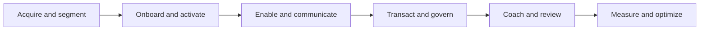

# Introw docs (docs.introw.io): headless

Verbatim from docs.introw.io/llms-full.txt, fetched 2026-09-29. 53 pages.

# Activation
Source: https://docs.introw.io/headless/agentic-use-cases/activation

Lift partner activation rate from 30% to 50% with AI-driven early-warning detection. Catch silent failure 60-90 days before it surfaces in QBRs.

<Tldr>Activation rates baseline at 30-50% (under 20% unmanaged), and silent failure typically goes undetected until quarterly reporting. A continuous-monitoring agent detects engagement decay 60-90 days early, then routes the right intervention, CAM call, warm lead, micro-course, MDF offer. Lifting activation 30% → 50% on the same intake yields 67% more productive partners and \~€10M incremental sourced ARR per 100-partner cohort.</Tldr>

## How it works

<UseCaseFlow />

## What is partner activation rate?

**Partner activation rate is the percentage of newly recruited channel partners who progress from a signed agreement to actively generating pipeline within a defined time window, typically measured by first deal registration or first closed-won opportunity within 90 days.** It sits between partner onboarding (where agreements are signed and portal access is granted) and sustained partner engagement (where the partner is producing revenue consistently). Activation rate is one of the most important leading indicators of channel program ROI because it determines how much of the recruitment budget actually produces pipeline.

## The activation gap nobody is watching

Onboarding completion is not activation. A partner can finish every training module, attend every kickoff call, get every certification, and then never register a deal. This is the silent failure mode of every channel program, and it's far more common than it should be.

The numbers are sobering. According to Unifyr's 2026 Channel Atlas, **typical activation rates for newly recruited partners range from 30-50%, and programs that don't actively manage activation see rates below 20%.** Half, sometimes more, of every recruitment dollar produces no pipeline. And because failure is silent (no event fires when a partner *doesn't* register a deal), nobody notices until quarterly reporting.

By then it's too late. Partners who drift through months of inactivity after onboarding are far more likely to disengage entirely. The first-deal window is short, and once it closes, the partner's enthusiasm for the relationship has typically evaporated. Reactivation campaigns help, re-engagement flows that add 2+ touchpoints can lift partner share activity from roughly 4% to 12% (ReferralCandy data): but reactivation is dramatically more expensive than preventing the drop-off in the first place.

## How does an AI agent catch silent partner failure early?

Introw's activation agent runs continuously in the background, watching for the absence of expected behavior. It detects partners who:

* Completed onboarding but haven't registered a deal in 30, 60, or 90 days
* Haven't logged into the portal or interacted with content
* Skipped the most recent training drop or campaign
* Are slipping below their cohort's median engagement
* Have open opportunities in your CRM that they haven't touched in 14 days

Crucially, the agent doesn't just produce a list, it **routes the right intervention**. Some partners need a CAM call. Some just need a relevant lead handed to them. Some need a one-page micro-course on a specific objection. Some need a fresh MDF opportunity. The agent's job is to surface the situation early enough, with enough context, that the right intervention is obvious.

A partner manager opens Slack and sees: *"Three of your partners completed onboarding 45+ days ago and have zero deal activity. Two have downloaded the security battle card but haven't followed up. One just logged in for the first time in three weeks and viewed two case studies. Suggested next actions: route a warm lead to Partner A, send the SI competency micro-course to Partner B, book a check-in with Partner C this week."*

That's not a dashboard. That's an action queue.

## Who wins, and how

**Partner Development Managers (PDMs)** stop discovering disengagement at the QBR. The agent surfaces silent failure 60-90 days earlier than it would otherwise be visible. Earlier detection means cheaper, more effective intervention, a 30-minute coaching call lands very differently when the partner is "stalled" than when they've decided you don't matter to their business.

**RevOps** gets a partner-health score that's actually predictive, not lagging. Industry benchmarks (Unifyr) show declining portal logins, reduced deal registrations, and lapsed certifications are leading indicators of churn, exactly the signals the activation agent is trained to catch and escalate.

**Channel Leadership** stops staring at the 80/20 dynamic and accepting it as inevitable. The honest math on most programs is that the bottom 60% of partners are quietly inactive. Recovering even a fraction of that population through early intervention has outsized economics, because the recruitment cost is already sunk.

**Partners themselves** get help before they decide you're not worth their time. Most disengaging partners aren't strategically choosing to walk away, they're getting busy with another vendor's program because that vendor's CAM noticed first and stayed in touch. The agentic model means your CAM notices first.

## Key statistics: activation impact

* **Activation rate baseline**: 30-50% for managed programs; below 20% for unmanaged (Unifyr Channel Atlas, 2026)
* **First-deal compounding**: partners reaching first deal within 90 days are **3-4× more likely** to stay active at one year (Unifyr)
* **Activation lift impact**: 30% → 50% activation = **67% more productive partners** per cohort
* **Per-cohort ARR uplift**: \~€10M of incremental sourced ARR per 100-partner cohort at €500K average sourced ARR per active partner
* **Reactivation lift potential**: 2+ touchpoint re-engagement flows can lift partner activity from 4% → 12% (ReferralCandy, 2025)
* **Detection lead time**: silent failure typically discovered at next QBR (90+ days late); agentic detection compresses to days

## Activation is goal-driven, not generic

Not every disengaging partner needs the same nudge. A partner pacing toward a tier-promotion threshold responds to a different message than one with bandwidth but no leads, and the difference between those two messages is the difference between an activation lift and a deletion in the inbox. The leverage move isn't “we miss you” copy; it's mapping each partner's diagnosed blocker (capability gap, lead drought, stuck pipeline, stakeholder turnover, channel-preference miss) to the specific intervention that unblocks it, framed against their actual goals from the program. Goal visibility plus next-best-action prescription beats generic re-engagement by a margin that compounds across the long tail.

## The deeper shift

Most partner programs treat activation as a metric to report, not a state to manage. Quarterly, someone calculates the activation rate, mentions it on a slide, and moves on. The day-to-day reality of disengagement plays out invisibly between reporting cycles.

The agentic model makes activation **operational**: a continuously monitored state with named owners, clear triggers, and routed interventions. It's the difference between checking the smoke alarm at the end of the year and having one that goes off the moment something starts smoking.

The compound effect is that programs stop running on the 80/20 default. When silent failure is caught early and intervened on consistently, the long tail of partners moves up the engagement distribution. The bottom 60% doesn't stay dormant, it produces. And that's where the next 10-20 points of partner-attached revenue actually live. For a complementary view on the inputs to activation, see [partner onboarding](/headless/agentic-use-cases/onboarding) and [partner segmentation](/headless/agentic-use-cases/partner-segmentation).

## Key takeaways

<Card title="Key takeaways" icon="list-check">
  * **Definition**: Partner activation rate is the percentage of newly recruited partners who reach the first revenue-generating action (typically a deal registration or first closed deal). Industry baseline sits at **30-50%**, with unmanaged programs below 20%.
  * **The cost of silent failure**: half or more of every recruitment dollar produces zero pipeline because partners drift through onboarding without registering deals, and nobody notices until quarterly reporting.
  * **Introw's approach**: a continuous-monitoring agent detects partners who completed onboarding but show declining engagement, then routes the right intervention (CAM call, warm lead, micro-course, MDF offer).
  * **Headline outcome**: lifting activation from 30% to 50% on the same intake yields **67% more productive partners** and roughly €10M of incremental sourced ARR per 100-partner cohort.
  * **Stakeholders**: PDMs, RevOps, channel leadership, partners themselves.
</Card>

## Frequently asked questions

<AccordionGroup>
  <Accordion title="What is partner activation rate?">
    Partner activation rate is the percentage of newly recruited partners who progress from a signed agreement to actively generating pipeline, typically measured by first deal registration or first closed deal within a defined window (often 90 days). It is calculated as (active partners) / (total recruited partners) × 100 and is one of the most important leading indicators of channel program health.
  </Accordion>

  <Accordion title="What is a good partner activation rate?">
    According to Unifyr's 2026 Channel Atlas, **typical activation rates for newly recruited partners range from 30-50%**, with poorly managed programs below 20% and best-in-class programs reaching 60% or higher. The realistic ceiling depends on partner mix (referral partners activate faster than enterprise SIs) and how aggressively the program manages the post-onboarding transition.
  </Accordion>

  <Accordion title="Why do channel partners go inactive after onboarding?">
    Partners go inactive primarily because the post-onboarding period lacks structure: no clear "what's next" guidance, no relevant leads, no proactive nudging from the vendor. PartnerStack research describes this as partners being "ghosted" by vendors after onboarding completion. The agentic model addresses it by catching the engagement decline within days instead of months.
  </Accordion>

  <Accordion title="What is the difference between partner activation and partner engagement?">
    Partner activation is a one-time transition: a partner moves from inactive to active by completing their first revenue-generating action. Partner engagement is ongoing and measures whether an already-active partner continues to invest effort. A partner can be activated (closed a deal six months ago) but disengaged (no activity since): the metrics answer different questions.
  </Accordion>

  <Accordion title="How does Introw detect silent partner failure?">
    Introw's activation agent monitors leading indicators continuously: deal registration cadence vs. expected, portal login frequency, content interaction, training and campaign engagement, and stalled CRM opportunities. When signals deviate from cohort norms, the agent surfaces the partner with context (which signals slipped, what their history looks like) and a recommended intervention.
  </Accordion>

  <Accordion title="What's the cost of one inactive channel partner?">
    At an effective cost-per-acquired-partner of \~€15K (recruiting time, onboarding hours, portal provisioning, training development), every inactive partner is sunk recruitment investment. For a program with 100 new partners per year and 50% activation, that's **€750K of wasted spend annually**: a number that compounds across the lifetime of the program if activation isn't actively managed.
  </Accordion>

  <Accordion title="Can dormant partners be reactivated?">
    Yes, reactivation works, but is more expensive than prevention. Re-engagement flows with 2+ touchpoints can lift dormant partner activity from roughly 4% to 12% according to ReferralCandy data. Reactivation typically requires fresh incentives (extra commission, bonus tiers, new MDF allocations) that prevention doesn't, so catching disengagement at week 6 saves the cost of bribing the partner back at month 12.
  </Accordion>
</AccordionGroup>

## Run it in Claude Code

Each workflow ships as a Claude Code skill, a `SKILL.md` file you drop into `.claude/skills/<skill-name>/SKILL.md`. Claude triggers it on the prompts in the skill's description. See the [full skill library](/headless/skills) for the complete files.

<CardGroup>
  <Card title="Activate the Network with Personalized Campaigns" icon="wrench" href="/headless/skills/vendor/activate-network-with-personalized-campaigns">
    Audits the entire partner network, leverages Introw goals to identify who needs activation, and generates per-partner personalized activation campaigns whose messaging maps to each partner's specific goals and diagnosed blocker.
  </Card>

  <Card title="Renewal & Expansion Coordinator" icon="wrench" href="/headless/skills/partner/renewal-and-expansion-coordinator">
    Partner-side: unified renewal calendar + expansion plays across every vendor's installed customer base. Catches renewal slippage early; surfaces multi-vendor coordinated expansion conversations.
  </Card>
</CardGroup>

---

# Approval Workflows
Source: https://docs.introw.io/headless/agentic-use-cases/approval-workflows

AI-driven partner approval workflows auto-approve routine deal, MDF, and form submissions in seconds and route the rest, cutting SLA from days to seconds.

<Tldr>About 70% of distributors prefer vendors providing instant digital feedback, but most approvals queue for days because the 80% of routine submissions wait behind the 20% that need real judgment. Agentic approval workflows read every incoming submission, apply the vendor's custom rules, auto-approve straight-through cases in seconds, and route exceptions to the right human reviewer with full context. SLA on routine submissions collapses from days to seconds and channel ops capacity recovers 70-80%.</Tldr>

## How it works

<UseCaseFlow />

## What are agentic partner approval workflows?

**Agentic partner approval workflows are AI-driven approval systems that automate decisions on incoming partner submissions, deal registrations, MDF project proposals, partner applications, co-marketing requests, and MAP milestones, by applying vendor-defined rules at machine speed and routing exceptions to the right human with full context.** The model handles the 80% of submissions that should be straight-through-processed in seconds, while elevating the 20% of edge cases that genuinely require human judgment with all relevant data already assembled.

## The approval queue that never empties

Every partner-facing form ends up in someone's queue. Usually a partner ops person. Often, in a tab that's been open for three days. The bottleneck is so pervasive that **partners experience "Portal Fatigue" while waiting for status, and \~70% of distributors prefer vendors who provide instant, digital feedback over those relying on manual correspondence** (Computer Market Research).

The math is straightforward: if 80% of submissions are routine and should be straight-through-processed, but every single one waits in a human queue, you're paying the cost of human review on every transaction whether it needs it or not. Channel ops teams burn hours each week on submissions that meet every approval criterion. Meanwhile the *non-routine* 20%, the cases that genuinely need judgment, sit in the same queue, often behind a stack of trivial approvals.

The result: SLA on routine cases is days when it should be seconds. SLA on complex cases is also days, when it should be hours. Everyone is unhappy.

## How does AI approval automation work?

Introw's approval agent reads every incoming submission and applies the vendor's custom rules. *"Auto-approve under €50K if all required fields present, partner tier ≥ Gold, no overlap with direct sales pipeline; otherwise route to Maria."* The same pattern applies to:

* **Deal registrations**: approved or routed in seconds
* **Partner applications**: auto-approve qualified applicants by ICP fit; route exceptions
* **MDF project proposals**: approve standard activities under threshold; route strategic spend
* **Co-marketing requests**: approve template-compliant requests; flag custom asks
* **MAP (mutual action plan) milestones**: auto-acknowledge complete milestones; surface stalled ones

The 80% that should be straight-through are processed in seconds. The 20% that need judgment land cleanly on the right person's desk with full context, the rule that matched, the exception that triggered, the partner's history, the relevant CRM data, so the human reviewer makes a decision in minutes instead of doing 15 minutes of context-assembly first.

Every decision is logged. Every override is auditable. The compliance team gets a complete trail for every routing and approval decision the agent made.

## Who wins, and how

**Partners** stop waiting. Routine deal registrations come back approved in seconds. Routine MDF requests come back approved the same day. The friction that drives partners to disengage from formal registration processes, "it takes too long to be worth doing", disappears for the cases where the program rules already say yes. (See [the deal registration deep-dive](/headless/agentic-use-cases/deal-registration) for the upstream submission experience.)

**RevOps and Channel Ops** stop being a queue-clearing function. The 80% disappears. The 20% remaining is the work that actually requires judgment, which is the work the team should have been doing all along. **One channel ops person can handle the exception load that previously required a team of three**: because the team's previous workload was mostly mechanical rule-application.

**Compliance and Governance** get an auditable trail that's actually complete. Every approval decision, automatic or manual, is logged with the rule that triggered it, the data that informed it, and the decision that was made. Override patterns become visible. Rule effectiveness becomes measurable.

**Channel Leadership** sees SLA metrics that are actually achievable. "Approve under 24 hours" used to be aspirational; now it's the floor, and most submissions clear in seconds. Industry benchmarks: programs that institute fast-approval workflows typically see partner-led revenue lift in the **15-35% range** because partners actually trust and use the registration process.

**The Direct Sales Team** stops getting blindsided. With auto-approval running rules that explicitly check for overlap with direct pipeline, channel conflict is prevented at the moment of approval, not discovered three weeks later when both teams are already six emails deep in negotiating. (See [the channel conflict deep-dive](/headless/agentic-use-cases/channel-conflict).)

## Key statistics: agentic approval workflow impact

* **Distributor preference for instant feedback**: \~70% prefer vendors providing instant digital response (Computer Market Research)
* **Straight-through processing potential**: \~80% of submissions should be auto-approved when rules are clear
* **SLA collapse**: routine approvals from days to seconds; complex cases from days to hours
* **Channel ops capacity recovery**: 70-80% of mechanical rule-application work eliminated
* **Partner-led revenue lift**: **15-35%** when approval workflows are streamlined and trusted (industry benchmarks)
* **Audit trail completeness**: 100%, every decision, every override, every rule version traceable

## The deeper shift

Approval workflows have historically been the place where partner program intentions go to die. Fast-approval is a written commitment in every partner agreement. The actual experience is queue limbo. The disconnect erodes trust over years.

The agentic model makes the SLA real. Auto-approval handles the 80%. Intelligent routing puts the 20% in front of the right human with full context. Compliance gets a complete trail. Channel ops gets their week back. Partners get the responsiveness they were promised.

Underneath that, the bigger shift is the role of human judgment in the channel ops function. When the agent handles mechanical rule-application, the humans who used to do that work are freed for the strategic work, exception design, rule evolution, partner-specific decisions, escalation handling, that channel programs have always needed and never had time for. That's the operating model upgrade. Not faster humans clicking approve. A function where humans only handle the cases that require humans, and where the system handles everything else, at machine speed, with machine consistency, and with full auditability.

## Key takeaways

<Card title="Key takeaways" icon="list-check">
  * **Definition**: Agentic partner approval workflows are AI-driven systems that read every incoming partner submission (deal registration, MDF request, partner application, co-marketing proposal), apply the vendor's custom rules, auto-approve straight-through cases, and route exceptions to the right human reviewer with full context.
  * **The cost of the queue**: \~70% of distributors prefer vendors providing instant digital feedback over manual correspondence; 80% of submissions are routine and should be straight-through-processed but typically wait days in human queues.
  * **Introw's approach**: a rule-based agent applies vendor-defined criteria ("auto-approve under €50K if Gold tier, no direct overlap; else route to Maria"), with every decision logged and every override auditable.
  * **Headline outcome**: SLA on routine submissions collapses from days to seconds; channel ops capacity recovers 70-80% as the routine workload disappears.
  * **Stakeholders**: Partners, RevOps/Channel Ops, Compliance/Governance, Channel Leadership, Direct Sales.
</Card>

## Frequently asked questions

<AccordionGroup>
  <Accordion title="What are partner approval workflows?">
    Partner approval workflows are the structured processes vendors use to review and approve channel partner submissions, deal registrations, MDF project proposals, partner applications, co-marketing requests, and MAP milestones. Modern agentic approval workflows automate the 80% of routine cases with rule-based auto-approval and intelligently route the remaining 20% to human reviewers with full context.
  </Accordion>

  <Accordion title="What is straight-through processing in deal approval?">
    Straight-through processing (STP) is the automated approval of submissions that meet all program criteria without human review. For partner programs, this typically applies to \~80% of incoming submissions: deal registrations under a value threshold, MDF requests for standard activity types, partner applications matching the ICP, and similar low-risk cases. STP collapses approval SLA from days to seconds.
  </Accordion>

  <Accordion title="How does AI prevent channel conflict during approval?">
    The approval agent runs cross-checks at intake against the live CRM, looking for existing direct sales opportunities on the same account, prior partner registrations, and recent contact activity. Conflicts surface in seconds, not weeks, with a recommended resolution (split, override, partner-of-record reassignment) based on the vendor's rules of engagement.
  </Accordion>

  <Accordion title="What approval criteria can be automated?">
    Common auto-approval rules include: deal value below threshold, partner tier above threshold, all required fields present, partner certification status, no overlap with direct pipeline, account ownership rules, vertical eligibility, and territory assignment. Rules can be combined ("auto-approve under €50K if Gold tier and no direct overlap") to handle the majority of routine cases.
  </Accordion>

  <Accordion title="How are exceptions routed in agentic approval workflows?">
    Exceptions, cases that don't match auto-approval criteria, are routed to the right human reviewer based on the vendor's routing logic (territory, partner tier, deal size, type of submission). The agent assembles full context for the reviewer (rule that matched/missed, partner history, CRM data, relevant rules of engagement) so the human decision takes minutes rather than the typical 15+ minutes of context-assembly.
  </Accordion>

  <Accordion title="Are AI approval workflows compliant for regulated industries?">
    Yes, every decision is logged, every override is auditable, and every rule is version-controlled. Introw operates under SOC 2 Type 2, ISO 27001, and GDPR compliance. The audit trail provides complete defensibility for compliance review, internal audit, and external scrutiny, typically more complete than legacy human-driven approval logging.
  </Accordion>

  <Accordion title="Can AI approval workflows handle MDF and co-marketing requests?">
    Yes. MDF project proposals, co-marketing requests, partner applications, and MAP milestones can all be processed through the same approval agent with form-specific rules. Straightforward MDF requests for template-compliant activities under a threshold can be auto-approved; strategic, custom, or high-value requests are routed to the right approver with full context.
  </Accordion>
</AccordionGroup>

---

# Campaigns & Announcements
Source: https://docs.introw.io/headless/agentic-use-cases/campaigns-and-announcements

AI partner marketing automation generates segmented campaigns from LinkedIn posts, blogs, and Loom recordings, scaling partner-facing output without hiring.

<Tldr>Most partner marketing managers ship one generic newsletter a month, and pay the cost in cadence, relevance, or both. AI-driven partner marketing automation converts any source content (LinkedIn posts, blogs, product launches, Loom recordings) into segmented partner-facing campaigns customized per tier, region, vertical, and partner type. Output multiplies 10-20× without hiring; segmentation lifts engagement 2-4× over generic blasts.</Tldr>

## How it works

<UseCaseFlow />

## What is partner marketing automation?

**Partner marketing automation is the use of AI agents to generate, segment, and distribute partner-facing campaigns from any source content, including executive LinkedIn posts, product launches, press releases, blog posts, and Loom recordings, with each variant tailored per tier, region, vertical, partner type, and language.** It replaces the manual partner-newsletter model with a continuous, segmented stream of relevant communications that scales without expanding the partner marketing headcount.

## The partner marketing impossible triangle

Every partner marketing manager knows the constraint set:

* **Cadence**: partners need a continuous stream of relevant content to stay engaged
* **Relevance**: generic blasts get ignored
* **Headcount**: nobody has the budget to hire 10 partner marketing managers

You can have any two. You can never have all three. Most programs end up with low cadence (one newsletter a month), low relevance (the same content for every segment), or both, which is why partner email open rates and content download rates are widely treated as "engagement theater" by the people producing them.

The cost isn't just unread newsletters. **96% of B2B marketers expect to increase revenue attributable to channel partners** (Demand Gen Report / Channel Marketing Benchmark), but most can't, because their partners aren't sufficiently informed or motivated to sell. Communication is the carrier wave for everything else, campaigns, announcements, product launches, competitive responses. Get the carrier wave wrong and the rest doesn't matter.

## How does AI campaign generation work for channel marketing?

Introw's campaign system rebuilds the workflow around continuous, segmented, agent-assisted output.

A **background agent scans the vendor's LinkedIn weekly** and converts relevant posts into partner-segmented outreach the partner marketing manager can publish with one click. Every published post becomes the seed for a partner-relevant variation: an email to enterprise SIs, a Slack drop to high-velocity resellers, a portal announcement for the regional partners who serve healthcare. The marketing team doesn't have to lift the post into a campaign; the campaign is generated from the post.

The on-page **AI Assistant** lets the partner marketing manager edit announcements in natural language. *"Make this more technical for our SI segment."* *"Shorten this and add a CTA to the new MDF-eligible co-marketing program."* *"Translate this into German and adapt for our DACH resellers, who care more about compliance than the use case."* What used to require a copywriter and a half-day of revisions is now an inline agent prompt.

Campaigns can also be generated **from scratch** off any source material, a blog post, a product launch announcement, a press release, even a Loom recording the CEO sent on Slack. The agent extracts the core message, generates audience-segmented versions, and queues them for review.

Segmentation rules live in Introw, by tier, region, partner type, vertical, so every recipient gets a relevant version. No spray-and-pray. The agent does the audience-specific rewriting that human marketers don't have time to do. (For deeper detail on how segmentation works, see [the partner segmentation deep-dive](/headless/agentic-use-cases/partner-segmentation).)

## Who wins, and how

**Partner Marketing Managers** see their output multiply by **10-20×** without hiring. The same person who used to ship one newsletter a month is now shipping segmented updates after every product launch, every executive LinkedIn post, every competitive shift. The bottleneck stops being content production and starts being content strategy, which is the work the role should have been doing all along.

**Partner Sellers** start receiving communications that actually relate to their business. The healthcare-focused SI gets healthcare positioning. The high-velocity SMB reseller gets transactional offers. Industry research consistently shows that relevance is the single biggest driver of partner content engagement, a generic blast to a tier produces a fraction of the response of a tailored message to a specific segment.

**Vendor Marketing Teams** stop watching their best work die in the partner channel. The CEO's banger LinkedIn post used to be invisible to the partner ecosystem until someone got around to repackaging it. Now the agent ships partner-segmented versions of it within hours.

**Partners' end customers** see consistent, current messaging from every partner in the ecosystem. The competitive battle card that the vendor updated yesterday is in the field today, in every language, in every region.

## Key statistics: partner marketing automation impact

* **B2B marketer expectations**: 96% expect to increase channel partner revenue (Channel/Partner Marketing Benchmark Survey)
* **Output multiplier**: partner marketing managers move from \~4 partner-facing communications/month to **40-80** with agent assistance, a 10-20× lift
* **Engagement lift from segmentation**: comparable B2B benchmarks show segmented content drives **2-4× the open and click rates** of generic blasts
* **Time-to-market for announcements**: from days/weeks to hours; product launches reach every partner segment within 4 hours of public release
* **Localization economics**: agent-assisted translation collapses the cost of running region-specific campaigns to near zero
* **Partner-facing content velocity**: competitive responses (e.g., a new competitor entering the market) ship to all enabled partners within an hour, not weeks

## Release notes are the highest-leverage source

Partner-marketing radars usually focus on LinkedIn and blog posts. The source most often missed, and the highest-leverage, is the vendor's own release-notes feed. Every shipped feature is something partners need to position with prospects this week, but most release notes never reach partner-facing comms in time. The agent reads each release entry, filters out internal-only churn, and converts the rest into three derivatives per partner segment: a one-line “what's new” alert, talking points for partner sellers in active deals where the feature matters, and a customer-ready outreach template the partner can forward into their pipeline. There's also the partner-side mirror: a unified calendar of every vendor's upcoming launches, MDF cycles, webinars, and tier windows so the partner can plan customer outreach *around* vendor activity, not after it.

## The deeper shift

Partner marketing has been stuck in a 1995 newsletter model for far too long. Templates, blasts, lowest-common-denominator copy, manual segmentation when there's time. Most program-level data shows partners increasingly tune out vendor communications, not because they don't want to hear from the vendor, but because the cost of parsing irrelevant content has finally exceeded the value of finding the relevant bits.

The agentic model rebuilds the relationship around relevance. Every partner gets a feed that actually applies to them. The vendor's best content, the executive LinkedIn posts, the product launches, the competitive intelligence, the customer wins, flows continuously into the partner ecosystem in the right shape, in the right language, to the right segment.

Partner marketing stops being a content factory and starts being an editorial operation. The output goes up by an order of magnitude, the relevance goes up at the same time, and the headcount stays flat. That's the ratio that finally cracks the partner marketing impossible triangle. For complementary capabilities, see [AI partner training](/headless/agentic-use-cases/training) (which uses the same content sources for course generation) and [partner segmentation](/headless/agentic-use-cases/partner-segmentation) (which feeds the segmentation rules).

## Key takeaways

<Card title="Key takeaways" icon="list-check">
  * **Definition**: AI-driven partner marketing automation uses background agents to convert any source content (LinkedIn posts, product launches, blogs, Loom recordings) into segmented partner-facing campaigns customized per tier, region, vertical, and partner type.
  * **The cost of generic blasts**: 96% of B2B marketers expect channel revenue to grow, but most struggle to scale partner-facing communications because manual production caps cadence and relevance.
  * **Introw's approach**: a background agent scans the vendor's LinkedIn weekly and converts posts into segmented outreach; an inline AI Assistant edits announcements in natural language; segmentation rules ensure every recipient gets a relevant version.
  * **Headline outcome**: partner marketing managers ship **10-20× more partner-facing content** with the same headcount, and segmentation typically lifts engagement 2-4× over generic blasts.
  * **Stakeholders**: Partner Marketing Managers, Partner Sellers, Vendor Marketing, partners' end customers.
</Card>

## Frequently asked questions

<AccordionGroup>
  <Accordion title="What is partner marketing automation?">
    Partner marketing automation is the use of AI agents to generate, segment, and distribute partner-facing campaigns at scale, from any source content (LinkedIn posts, blogs, product launches, Loom recordings) and customized per tier, region, vertical, partner type, and language. It replaces manual newsletter production with a continuous, segmented content stream.
  </Accordion>

  <Accordion title="How does AI generate partner-facing campaigns?">
    An AI agent scans source content (executive LinkedIn posts, blog publications, product launches, internal Loom recordings) and converts each into multiple partner-segmented versions. Each version is tailored to a specific audience, enterprise SIs, high-velocity resellers, regional MSPs, vertical specialists, using segmentation rules defined in the PRM. The partner marketing manager reviews and publishes with one click.
  </Accordion>

  <Accordion title="How much can partner marketing output increase with AI?">
    Partner marketing managers using AI campaign generation typically ship **10-20× more partner-facing communications** with the same headcount. Where the manual model produces \~4 newsletters per month, the agentic model produces 40-80 segmented campaigns covering every product launch, executive post, and competitive shift.
  </Accordion>

  <Accordion title="What is partner content segmentation?">
    Partner content segmentation is the practice of customizing communications per partner tier, region, vertical, partner type (reseller, SI, referral), and language. Effective segmentation typically drives **2-4× the engagement** of generic blasts, because partners invest attention in content that's relevant to their actual business motion.
  </Accordion>

  <Accordion title="Can AI translate partner communications into multiple languages?">
    Yes, Introw's campaign generation includes natural-language translation and localization, allowing a single source post to be adapted for partners in DACH, LATAM, APAC, and other regions. The agent doesn't just translate; it adapts tone and emphasis (e.g., compliance-forward for DACH, use-case-forward for the US) per regional preferences.
  </Accordion>

  <Accordion title="How does AI partner marketing integrate with existing tools?">
    Introw connects to source content systems (LinkedIn, blog CMS, asset libraries, Notion, Slack, Loom) via MCP, and to delivery systems (email platforms, Slack workspaces, partner portals, Microsoft Teams). The agent orchestrates the workflow without requiring a rip-and-replace of the existing marketing stack.
  </Accordion>

  <Accordion title="What's the difference between to-partner and through-partner marketing?">
    **To-partner marketing** is the vendor's communications *to* their partners, newsletters, announcements, product updates, competitive intelligence. **Through-partner marketing** is the marketing assets the vendor provides for partners to use *with their end customers*, campaigns, social posts, email templates, landing pages. AI partner marketing automation accelerates both, generating segmented to-partner messaging and customizable through-partner assets from the same source content.
  </Accordion>
</AccordionGroup>

## Run it in Claude Code

Each workflow ships as a Claude Code skill, a `SKILL.md` file you drop into `.claude/skills/<skill-name>/SKILL.md`. Claude triggers it on the prompts in the skill's description. See the [full skill library](/headless/skills) for the complete files.

<CardGroup>
  <Card title="Content Radar & Distribution" icon="wrench" href="/headless/skills/vendor/content-radar">
    Continuously scans the vendor's LinkedIn, blogs, industry publications, and competitor news; filters to partner-relevant content; transforms into partner-ready language per segment; distributes and tracks via Introw.
  </Card>

  <Card title="Cross-Vendor Content & Activity Calendar" icon="wrench" href="/headless/skills/partner/cross-vendor-content-calendar">
    Partner-side: unified calendar of every vendor's upcoming launches, webinars, MDF programs, and tier windows, ranked by relevance to the partner's actual customer base. Plan outreach around vendor activity, not after it.
  </Card>
</CardGroup>

---

# Channel Conflict
Source: https://docs.introw.io/headless/agentic-use-cases/channel-conflict

AI channel conflict detection cross-checks every partner deal submission against direct and indirect pipeline in real time to protect win rates and margin.

<Tldr>Organizations with poorly managed partner ecosystems have 23% lower win rates, and channel conflict drives 20-40% margin erosion in price-competitive categories. Agentic conflict detection cross-checks every partner submission against live CRM and partner pipeline data, partner-vs-partner, partner-vs-direct, marketplace-vs-reseller, at intake, applies rules of engagement consistently, and recommends resolutions auditably. Conflict surfaces before escalation, not after.</Tldr>

## How it works

<UseCaseFlow />

## What is channel conflict?

**Channel conflict is the situation where two or more sales channels, including different partners, the vendor's direct sales team, or marketplaces, compete against each other for the same customer, deal, or territory.** It is one of the most damaging dynamics in any indirect sales motion because it erodes margins through pricing wars, damages partner trust, creates confusing customer experiences, and ultimately costs vendors revenue and partners. The three primary types are **horizontal conflict** (two partners at the same level competing), **vertical conflict** (vendor direct vs. partner, typically the most damaging to trust), and **multi-channel conflict** (different channel types clashing, e.g., marketplace pricing vs. reseller pricing).

## The most expensive trust problem in B2B

The numbers make the case impossible to ignore. **CompTIA research found 60% of IT industry respondents reported increased instances of channel conflict, with 36% assessing such conflict significantly eroded their business performance.** Organizations with well-managed partner ecosystems achieve **win rates 23% higher** (CSO Insights) than those with poorly managed ones, the conflict tax sits at the very top of the win-rate stack.

And industry analyses estimate moderate channel conflict at brand level can erode **20-40% of margin in categories with active price competition among partners** (i2o Retail) and cost a $50M brand $3-7M annually in compounded leakage.

The deeper problem isn't even the lost deals. It's the trust damage. **A single high-profile conflict, a vendor swooping in on a partner's deal, for example, can permanently damage a partnership that took years to build** (Unifyr Channel Atlas). News travels fast in partner communities. A vendor known for channel conflict struggles to recruit the next generation of partners, especially the experienced ones who've been burned before.

So channel conflict has compounding economics: it costs you the deal, then it costs you the partner, then it costs you the next partner you tried to recruit. There is no cheaper problem to solve.

## How does AI detect and resolve channel conflict?

Introw's channel conflict agent runs continuously against your CRM. After every form intake, every deal registration, every MDF request, every partner application, the agent cross-checks for:

* Existing direct sales opportunities on the same account or domain
* Existing partner registrations from other partners
* Recent contact activity from any source on the same prospect
* Territory and tier-based ownership rules
* Pre-defined exclusions (named accounts, strategic verticals)

Conflicts surface **at the moment of submission**, not three weeks later when escalation hits the channel chief's inbox. The agent doesn't just flag the problem, it **recommends a resolution**: split commission, override based on tier rules, partner-of-record reassignment, or first-to-register protection.

The system aligns with the vendor's documented rules of engagement: first-to-register policies, deal-protection windows, tier-based override rights. The agent is the rules-of-engagement enforcement engine. Same rules every time, every partner, every deal, which is exactly the consistency that makes partners trust the system.

A specific example: a Gold-tier partner registers a deal with Globex. The agent detects an open opportunity in Salesforce that the direct AE created two weeks ago. Instead of two days of email negotiation, the agent surfaces the conflict immediately, applies the rule (Gold-tier partners with documented prior engagement get priority on enterprise accounts under €500K), and routes a notification to both the direct AE and the partner with the resolution. Decision time: minutes. Trust impact: protected.

## Who wins, and how

**Partner Sellers** stop being blindsided. The single most damaging partner experience, discovering you've been competing against the vendor's direct team for three months, becomes structurally impossible because the conflict was caught at the moment of submission and resolved by clear, applied rules.

**Direct Sales Teams** also win. The "we worked this account for six months and now you're telling us a partner is on it" experience cuts both ways. Real-time pipeline visibility across direct and indirect motions means both sides know who has what, when. Competing against your own partner is unproductive at best and embarrassing at worst.

**Channel Leadership** finally has defensible enforcement. Rules of engagement are only as strong as their enforcement. Documents that aren't applied consistently aren't rules, they're suggestions. The agent applies them every time, with full audit trail, which is what gives the rules teeth.

**Compliance and Legal** get visibility into conflict patterns. If certain regions or product lines are producing disproportionate conflict events, the data is right there. Rule design becomes evidence-based instead of reactive.

**The customer**, downstream, stops getting two competing quotes from the same vendor. The customer experience problem of "we got three different prices from three different reps for the same product", which is one of the most credibility-destroying B2B experiences possible, is structurally prevented by upstream conflict detection.

## Key statistics: channel conflict economics

* **Win-rate uplift for managed ecosystems**: **+23%** vs. poorly managed (CSO Insights)
* **CompTIA channel conflict prevalence**: 60% of IT respondents report increased conflict; 36% say it significantly erodes business performance
* **Margin erosion from price competition between partners**: **20-40%** in active categories (i2o Retail)
* **Brand-level revenue leakage example**: a $50M brand experiencing moderate channel conflict typically loses **$3-7M annually\*\* through compounded margin compression
* **Partner attrition**: partners who repeatedly lose deals to direct or other partners stop investing effort, a measurable churn driver in industry surveys
* **Resolution velocity**: from days/weeks of email negotiation to **minutes** of rule-based resolution

## The deeper shift

Channel conflict has historically been managed reactively. A conflict happens, channel ops mediates, the loser walks away frustrated, and the program writes a slightly stricter rule that nobody enforces consistently. Repeat for years.

The agentic model flips it to proactive. Every submission is checked at intake. Every conflict surfaces in seconds. Every resolution applies the same rules with full transparency. The vendor's rules of engagement stop being a document and start being an active system.

Zero channel conflict isn't the goal, some overlap is inevitable in any healthy hybrid model. The goal is **predictable resolution**: partners who know exactly what happens when conflict arises and trust the process to be fair. That's what protects long-term trust, and that's what unlocks the 23% win-rate compounding benefit that ecosystem leaders have access to. For the upstream submission flow that feeds conflict detection, see [conversational deal registration](/headless/agentic-use-cases/deal-registration), and for the approval workflow that runs alongside, see [agentic approval workflows](/headless/agentic-use-cases/approval-workflows).

## Key takeaways

<Card title="Key takeaways" icon="list-check">
  * **Definition**: Channel conflict occurs when two or more sales channels, partner-vs-partner, partner-vs-direct, or marketplace-vs-reseller, compete for the same customer or deal. AI-driven channel conflict detection cross-checks every submission against live CRM and partner pipeline data to surface conflicts at intake instead of after escalation.
  * **The cost of unmanaged conflict**: organizations with poorly managed partner ecosystems have **23% lower win rates** (CSO Insights), and channel conflict causes **20-40% margin erosion** in categories with active price competition (i2o Retail).
  * **The CompTIA finding**: 60% of IT industry respondents reported increased instances of channel conflict; 36% said it significantly eroded business performance.
  * **Introw's approach**: a real-time conflict detection agent runs against the CRM at every intake, applies the vendor's rules of engagement, and recommends resolutions consistently and auditably.
  * **Stakeholders**: Partner Sellers, Direct Sales, Channel Leadership, Compliance, Customers.
</Card>

## Frequently asked questions

<AccordionGroup>
  <Accordion title="What is channel conflict?">
    Channel conflict is the situation where two or more sales channels within the same vendor ecosystem compete for the same customer, deal, or territory. The three primary types are horizontal conflict (two partners at the same level competing), vertical conflict (vendor direct vs. partner), and multi-channel conflict (different channel types like marketplaces vs. resellers clashing). All three erode margin, damage partner trust, and confuse customers.
  </Accordion>

  <Accordion title="What is the most damaging type of channel conflict?">
    **Vertical conflict, where the vendor's own direct sales team competes against its channel partners, is the most damaging** because it strikes at the foundation of vendor-partner trust. A single high-profile vertical conflict (a vendor swooping in on a partner's deal) can permanently damage a partnership built over years and create a recruiting headwind that affects the entire program for the long term.
  </Accordion>

  <Accordion title="How much revenue is lost to channel conflict?">
    Industry analysis from i2o Retail estimates that moderate channel conflict erodes **20-40% of margin in categories with active price competition** between partners. A $50M brand typically loses **$3-7M annually\*\* through compounded margin leakage. CompTIA research adds that 36% of IT companies say channel conflict has significantly eroded their business performance.
  </Accordion>

  <Accordion title="How does AI detect channel conflict?">
    An AI conflict detection agent cross-checks every incoming partner submission (deal registration, MDF request, partner application) against the vendor's live CRM data, looking for existing direct opportunities, prior partner registrations, recent contact activity, and territory assignments. Conflicts surface in seconds, with a recommended resolution based on the vendor's rules of engagement.
  </Accordion>

  <Accordion title="What are rules of engagement in a channel program?">
    Rules of engagement are the documented policies that define which sales channel has priority in specific scenarios, named accounts reserved for direct sales, territory assignments for partners, deal protection windows for registered deals, tier-based override rights, and escalation procedures. Rules are only as strong as their enforcement; agentic enforcement applies them consistently across every transaction.
  </Accordion>

  <Accordion title="How long should deal protection windows be?">
    Deal protection windows typically range from **30 to 180 days** depending on sales cycle length, deal complexity, and partner tier. Higher-tier partners often receive longer windows. The right duration is one that gives the partner enough time to close the deal without locking opportunities indefinitely if the partner stalls.
  </Accordion>

  <Accordion title="Can channel conflict ever be eliminated entirely?">
    No, some overlap is inevitable in any healthy hybrid (direct + indirect) model. The goal is not zero conflict but **predictable, consistent resolution**: partners who trust the process to be fair, applied the same way to every deal. Predictable resolution is what protects partner trust over the long term, and it requires the kind of rule-based, audit-logged enforcement that agentic systems make possible at scale.
  </Accordion>
</AccordionGroup>

---

# Commissions & Incentives
Source: https://docs.introw.io/headless/agentic-use-cases/commissions-and-incentives

Conversational AI for partner commission tracking - partners and CAMs query commission status, tier progress, and payout projections without a portal login.

<Tldr>Routine commission queries consume 20-40% of channel finance team time and erode partner trust faster than almost any other operational issue. Conversational commission tracking lets partners and CAMs query status, tier progress, payment timing, and projections in natural language, through Slack, Claude, or their own CRM, answered instantly from connected ERP, finance, and CRM systems with permission scoping. Query response collapses from hours/days to seconds; transparency stops being a quarterly favor.</Tldr>

## How it works

<UseCaseFlow />

## What is conversational partner commission tracking?

**Conversational partner commission tracking is a model where channel partners and partner managers ask questions about commission status, tier progress, payment timing, and incentive goal projections in natural language, through Slack, Microsoft Teams, Claude, ChatGPT, or the partner's CRM, and receive instant, scoped answers from a partner-side AI agent connected to the vendor's finance and CRM systems.** It replaces the support-ticket-and-wait model that has historically slowed every commission inquiry to days.

## The transparency tax that compounds against you

Commission opacity is one of the most underrated trust killers in channel programs. Partners frequently don't know:

* Whether their last deal commission has been processed
* How close they are to the next tier's threshold
* Which specific deals contributed to their current quarter's MBO progress
* When the next payment will land
* What their projected commission is on a deal currently in stage 4

So they ask. And the question, which should take seconds to answer, instead enters a queue. They Slack their CAM, who pings finance, who checks the system, who replies the next day, who clarifies a follow-up question, who replies the day after.

The aggregate cost is significant on both sides. **Routine commission queries consume an estimated 20-40% of channel finance team capacity** in mid-to-large programs, with partner managers spending another large chunk of their time as middlemen. And every day a partner waits for a commission answer is a day they're slightly less inclined to invest pursuit effort in your deals, because opacity reads as disrespect, even when nobody intends it.

## How does conversational commission tracking work?

Introw's commission agent is a partner-side MCP server connected to the vendor's ERP, finance system, and CRM. Partners and partner managers ask questions in natural language and get scoped, instant answers:

* *"What's my current quarter commission progress?"*
* *"Which of my deals are still pending payment, and what's the expected timing?"*
* *"How far am I from the next tier?"*
* *"What's my projected commission on the Globex deal if it closes next week?"*
* *"Show me my commission trend over the last four quarters."*

The agent reads from the source-of-truth systems and answers from real data. **Permission scoping ensures partners only see their own commission data**: never another partner's, and partner managers see only the partners in their book.

For channel finance teams, the agent answers vendor-side queries too: *"How much have we paid out to APAC partners this quarter, and which partners are within 10% of tier promotion?"*

## Who wins, and how

**Partners** get same-second answers to the questions they used to wait days for. The trust impact compounds, a partner who can self-serve commission data trusts the program in a way that a partner who has to file a ticket cannot. And trust is the carrier wave for every other partner behavior: deal registration cadence, certification investment, joint marketing engagement, MBO commitment.

**Partner Managers** stop being commission-status middlemen. The hours per week historically spent fielding "where's my commission?" Slack messages get reclaimed for the strategic work that actually grows the partner book. (For complementary impact on QBR prep load, see [partner QBR automation](/headless/agentic-use-cases/qbrs-meeting-prep).)

**Channel Finance Teams** see their query queue collapse. The 20-40% of capacity that went to routine status inquiries gets redirected to what finance teams should actually be doing, modeling incentive structures, optimizing payment workflows, ensuring compliance, identifying anomalies. The agent doesn't replace the finance team; it offloads the mechanical reporting that wasn't a good use of finance talent in the first place.

**Channel Leadership** gets behavior change. When commission data is transparent and instant, partners self-monitor against tier thresholds, MBO progress, and incentive triggers. They invest pursuit effort precisely where they can see the math working in their favor, which is exactly the behavior the incentive structure was designed to motivate.

**Vendor Finance and Operations** get an audit trail and consistency that manual query handling can't provide. Every commission query, every answer, every escalation is logged. Discrepancy patterns become visible. Disputes resolve faster because both sides are looking at the same data, retrieved the same way, with the same scoping rules.

## Key statistics: conversational commission tracking impact

* **Channel finance time consumed by routine queries**: 20-40% in mid-to-large programs (industry estimate)
* **Query response time**: from hours/days to **seconds**
* **Partner manager middleman load**: significant percentage of weekly time recovered as queries self-serve
* **Trust impact**: transparency is consistently identified in channel surveys as a top driver of partner satisfaction
* **Behavior change**: visible tier-progress data drives focused pursuit effort on deals that move partners toward incentive triggers
* **Audit completeness**: every query, response, and escalation logged with full traceability

## Transparency × prescription

Commission visibility is necessary but not sufficient. A partner with live commission visibility doesn't just trust the vendor more, they make different decisions, but only when the data comes paired with prescription. *“Close deal X by Friday adds €18K and crosses you into Gold-tier eligibility next quarter”* is a fundamentally different message than *“your commission dashboard is here.”* The same agent that surfaces transparency can do the math the partner would do if they had time: where's the closest threshold, which deals already in pipeline move the needle most, which active SPIF or accelerator is leverageable in the time remaining. Vendors who pair visibility with action-prescription see partners optimize toward the outcomes the vendor *designed* the incentives to drive, which is the whole point of designing them in the first place.

## The deeper shift

Commission visibility has always been the operational concession partner programs make to finance system complexity. The data exists, but the access model is "file a ticket." Partners adapt by either pestering their CAM or, more often, disengaging from active monitoring of their own incentive math entirely. Both outcomes are bad.

The agentic model rebuilds the access pattern. Commission data becomes queryable on demand by the people who own it (the partner) and the people who manage it (the partner manager and finance teams): without anyone losing audit trail, scoping, or compliance. The information that was already in your systems is finally accessible at the speed it needs to be accessible.

That's not a finance system upgrade. It's a trust infrastructure upgrade. And trust, in channel programs, is the multiplier on every other investment, better activation, better win rates, better tier progression, better long-term partner retention. Make commissions transparent and the rest of the program runs at a different temperature. For complementary capabilities, see [ecosystem performance](/headless/agentic-use-cases/ecosystem-performance) for natural-language analytics across the broader program, and [partner QBR automation](/headless/agentic-use-cases/qbrs-meeting-prep) for QBR generation that includes commission status as a data layer.

## Key takeaways

<Card title="Key takeaways" icon="list-check">
  * **Definition**: Conversational commission tracking lets channel partners and partner managers query commission status, tier progress, payment timing, and goal projections in natural language, through Slack, Claude, ChatGPT, or the partner's CRM, instead of opening tickets or chasing finance.
  * **The cost of opacity**: routine commission queries consume **20-40% of channel finance team time** and erode partner trust faster than almost any other operational issue.
  * **Introw's approach**: a partner-side MCP agent answers commission questions instantly from connected ERP, finance, and CRM systems, with permission scoping so partners only see their own data.
  * **Headline outcome**: query response time collapses from hours/days to seconds; finance team capacity recovers significantly; partner trust compounds because transparency is no longer a quarterly favor.
  * **Stakeholders**: Partners, partner finance teams, CAMs, channel leadership, vendor finance/ops.
</Card>

## Frequently asked questions

<AccordionGroup>
  <Accordion title="What is partner commission tracking?">
    Partner commission tracking is the process of recording, calculating, and reporting commission payments owed to channel partners for revenue they generate. Modern conversational tracking lets partners and managers query commission status, tier progress, and projections in natural language, replacing the ticket-and-wait support model that has historically slowed every commission inquiry to days.
  </Accordion>

  <Accordion title="How can AI improve commission visibility for channel partners?">
    An AI agent connected via MCP to the vendor's finance system and CRM can answer commission questions in natural language: current status, pending payments, tier progress, deal-level projections, historical trends. Partners get instant scoped answers; partner managers stop fielding "where's my commission?" Slack messages; finance teams reclaim the 20-40% of capacity that went to routine status inquiries.
  </Accordion>

  <Accordion title="Can partners only see their own commission data?">
    Yes, the AI agent enforces strict permission scoping. Partners only see their own commission data. Partner managers see only the partners in their assigned book. Channel finance and leadership see what their roles permit. Permission boundaries are enforced at the data layer, not the UI layer, so the agent cannot return information the user wouldn't already be authorized to see.
  </Accordion>

  <Accordion title="What commission questions can the AI agent answer?">
    Common queries include: current quarter commission progress, deals pending payment with expected timing, distance to the next tier threshold, projected commission on in-flight deals, historical trends, MBO progress, incentive trigger eligibility, and tax/payment-method status. The agent answers from the same source-of-truth data that finance reports run on.
  </Accordion>

  <Accordion title="Does conversational commission tracking integrate with existing finance systems?">
    Yes, Introw connects via MCP to standard finance and ERP systems (NetSuite, SAP, etc.) as well as to the CRM that drives commission calculation. The agent reads from the systems of record without requiring a finance system migration or a new commission engine.
  </Accordion>

  <Accordion title="How does commission transparency change partner behavior?">
    When partners can see their commission math in real time, they self-monitor and self-direct. Tier progress visibility encourages them to invest pursuit effort in deals that move them toward thresholds. MBO transparency drives focused activity on the goals the incentive structure was designed to encourage. Transparency, in effect, makes the incentive structure actually do its job.
  </Accordion>

  <Accordion title="What's the impact on channel finance team capacity?">
    Channel finance teams typically spend **20-40% of their capacity** fielding routine commission status queries, work that's mechanical, repetitive, and not a good use of finance talent. Conversational tracking redirects that capacity to higher-value work: incentive structure design, payment workflow optimization, anomaly detection, and compliance.
  </Accordion>
</AccordionGroup>

## Run it in Claude Code

Each workflow ships as a Claude Code skill, a `SKILL.md` file you drop into `.claude/skills/<skill-name>/SKILL.md`. Claude triggers it on the prompts in the skill's description. See the [full skill library](/headless/skills) for the complete files.

<CardGroup>
  <Card title="Incentive Maximizer" icon="wrench" href="/headless/skills/partner/incentive-maximizer">
    Partner-side: pulls live goals, commissions, and pacing data, then prescribes the highest-leverage actions to maximize earnings before period end, with concrete impact estimates per move.
  </Card>
</CardGroup>

---

# Deal Coaching
Source: https://docs.introw.io/headless/agentic-use-cases/deal-coaching

AI deal coaching for channel partners delivers segment-specific guidance inside CRM, Slack, Teams, or email to lift partner-attached win rates without new PDMs.

<Tldr>Direct sales reps get coached weekly; partner sellers get a portal full of PDFs, and the win-rate gap shows it. AI deal coaching runs in every partner deal, embedded in the partner's own CRM, Slack, Teams, or email, with persona-specific guidance per partner type (SI, reseller, referral). Comparable AI coaching delivers 32-34% win-rate lift within six months while PDMs reclaim most of the \~13 hours/week they currently spend on routine in-deal advice.</Tldr>

## How it works

<UseCaseFlow />

## What is AI deal coaching for channel partners?

**AI deal coaching for channel partners is an in-deal advisory model where an AI agent provides real-time, contextual sales coaching inside the partner's own workspace, pulling live deal context (stage, last activity, recent objections, competitive mentions) and delivering segment-specific guidance for SIs, resellers, referral partners, and other partner types.** It scales the coaching that direct sales teams have always received to the partner sales motion, where it has historically been impossible to deliver because of the math of human-driven coaching at scale.

## The historical weak spot of every channel motion

Every channel chief knows the pattern. Direct sales reps get coached intensively. Their pipeline is reviewed in 1:1s, their calls are listened to, their objections are role-played in weekly enablement. Partner sellers, who are often selling the same product to similar prospects, get a portal full of PDFs.

The economics are obvious. A vendor can afford to coach 200 internal reps. They can't afford to manually coach 5,000 partner sellers across 200 partner companies. So the partner motion has historically been the un-coached side of the revenue stack, and it shows up directly in the win-rate gap.

The data on coaching impact leaves no ambiguity. Sales teams using AI-powered coaching tools improve win rates by **34% within six months** (Whatfix research). Structured coaching delivers **32% higher win rates and 28% higher quota attainment** (Korn Ferry, 5th Annual Sales Enablement Study). **84% of sales reps reach quota when their organization deploys a best-in-class enablement strategy**: far above the industry average. None of this has been accessible to partner sellers at scale, because the coaching delivery model couldn't scale.

## How does AI deal coaching work in a partner program?

Introw's deal coaching agent runs in **every partner deal**. Not as a separate tool the partner has to log into, but as a coach embedded in the partner's actual workspace, their CRM (HubSpot/Salesforce), their Slack, their MS Teams, their email. Wherever the partner is working the deal, the coach is one prompt away.

The coaching is **dynamic**: it pulls live deal context: stage, last activity, sleeping flag, recent objections logged in comments, competitive mentions, stakeholder map. So advice is never generic. *"This deal has been at Stage 3 for 17 days. The last note says the prospect raised concerns about implementation timeline. Here's how we typically position our 6-week implementation against the prospect's stated risk concerns, plus three customer references in their vertical that closed similar timeline objections."*

Critically, **different coach personas are generated per partner segment**:

* **System Integrators (SIs)** get technical-fit coaching, integration architecture guidance, and stakeholder mapping for complex enterprise deals
* **Referral partners** get discovery-call talk-tracks and warm-introduction frameworks
* **Resellers** get pricing/objection guidance, competitive battle cards, and high-velocity closing tactics

The same product, different motions, different coaching, generated and maintained by the agent automatically.

## Who wins, and how

**Partner Sellers** stop selling solo. The biggest morale and retention factor in partner programs is whether the seller feels supported by the vendor. With a coach in every deal, every partner seller has access to the same quality of in-deal advice that an internal rep gets from their manager, without the partner having to flag a CAM or wait for a callback.

**Channel Account Managers and PDMs** stop being the bottleneck on coaching. The agent handles routine deal coaching at scale. PDMs reclaim time for the strategic deals where human judgment really matters, the complex enterprise pursuit, the strategic-account expansion, the executive-level relationship work. Highspot's 2025 State of Sales Enablement found **sales managers spend an average of 13 hours per week coaching reps**, of which a meaningful chunk is repetitive in-deal advice; agentic coaching takes most of that off the human's plate.

**Channel Enablement** sees their content actually used. The battle card that has historically gathered dust is surfaced by the coach at the moment of competitive objection. The case study sits dormant in a portal until the agent retrieves it for a deal that matches the customer profile. Content investment finally produces engagement, because the retrieval problem is solved.

**Channel Leadership** sees the win-rate gap close. Comparable structured coaching programs have produced **32-34% win-rate improvements within six months**, with some platforms reporting 50-200% lifts when AI coaching is operationalized into the daily workflow (SalesHood research). Applied to partner-attached deals, historically the lower-win-rate side of the revenue stack, that's transformative.

**End Customers** get partner sellers who actually know what they're talking about. Coached reps successfully navigate objections **61% more effectively** and adapt to buyer preferences **56% more effectively** (Careertrainer.ai). The customer's experience of the partner's competence is, downstream, the customer's experience of the vendor's competence.

## Key statistics: AI deal coaching for channel partners

* **Win-rate lift on partner-attached deals**: **34% within six months** with AI coaching (Whatfix)
* **Structured coaching impact**: **32% higher win rates, 28% higher quota attainment** (Korn Ferry)
* **Skill improvement**: **38% skill improvement, 40% faster time to readiness** (SalesHood, 34,000+ AI coaching session study)
* **Coaching frequency**: traditional models deliver \~4 touchpoints/year; agentic coaching delivers continuous in-deal touchpoints
* **PDM time recovery**: managers historically spending 13 hours/week on coaching reclaim most of the routine load
* **Pipeline conversion**: companies effectively using AI-driven coaching achieve **2× higher pipeline conversion rates** (Careertrainer.ai)
* **Objection handling**: coached reps navigate objections **61% more effectively** (Careertrainer.ai)

## Coaching that's grounded in your wins

The defining property of useful deal coaching isn't generic playbook quotes, it's evidence from *this vendor's actual past wins*. For every active partner deal, the agent finds the most analogous closed-won deals (same vertical, deal size, product mix, partner type), extracts what worked at each stage, and prescribes how the partner can replicate the pattern. Customer-specific objection handling, which assets and case studies were used, how long each stage took, who the champion was, all surfaced as evidence the partner can act on. There's a partner-side mirror, too: instead of waiting for the next QBR, the partner pulls up their own war room with vendor playbook plus similar past wins plus drafted next message in seconds, in the workspace they already work the deal in (CRM, Slack, Teams, email). The compound effect is partner-attached deals that no longer close at lower rates than direct.

## The deeper shift

Sales coaching has always been the differentiator between average sellers and great ones. Every revenue org knows this; every revenue org also knows that coaching at scale is impossible with humans alone, there aren't enough good coaches in the world to give every seller the touchpoints they actually need.

The agentic model breaks the constraint. A coach in every deal, deployed in the partner's actual workspace, with live deal context and segment-appropriate persona, is the operational unlock channel programs have been waiting for. It's the moment the partner sales motion stops being the under-coached side of the revenue stack.

The compound effect is that the historically weak win-rate of partner-attached deals starts to converge with, or exceed, direct. That's the architectural goal of every channel program: a partner motion that's not just additive in volume but competitive in quality. Agentic coaching is the mechanism that makes it possible without hiring an army of PDMs. For the underlying training that feeds coaching, see [AI partner training](/headless/agentic-use-cases/training), and for how 24/7 enablement complements deal coaching, see [enablement support](/headless/agentic-use-cases/enablement-support).

## Key takeaways

<Card title="Key takeaways" icon="list-check">
  * **Definition**: AI deal coaching is an in-deal advisory model where an AI agent, segment-specific by partner type and pulling live deal context, provides stage guidance, objection handling, competitive positioning, and closing tactics inside the partner's own workspace (CRM, Slack, Teams, email).
  * **The cost of un-coached partner sellers**: partner-attached deals historically close at lower rates than direct deals because partner sellers haven't had access to the structured coaching their direct counterparts get weekly.
  * **The data**: AI coaching tools improve win rates by **34% within six months** (Whatfix), and structured coaching delivers **32% higher win rates and 28% higher quota attainment** (Korn Ferry).
  * **Introw's approach**: a coach in every partner deal, with persona-specific guidance per partner type (SI, reseller, referral), embedded in the partner's actual workspace.
  * **Stakeholders**: Partner Sellers, Channel Account Managers/PDMs, Channel Enablement, Channel Leadership, end customers.
</Card>

## Frequently asked questions

<AccordionGroup>
  <Accordion title="What is AI deal coaching?">
    AI deal coaching is a sales coaching model where an AI agent, pulling live deal context from the CRM (stage, activity history, recent objections, competitive mentions): provides contextual, real-time advice on stage progression, objection handling, competitive positioning, and closing tactics. For channel programs, the coach runs in every partner deal and is segment-specific by partner type (SI, reseller, referral).
  </Accordion>

  <Accordion title="How does AI deal coaching improve channel partner win rates?">
    Industry research (Whatfix, Korn Ferry, SalesHood) shows AI-driven coaching produces win-rate lifts of **32-34% within six months** when properly operationalized. For partner-attached deals, historically the lower-win-rate side of the revenue stack because partner sellers received minimal coaching, the impact is especially pronounced because the baseline was so low.
  </Accordion>

  <Accordion title="What is the difference between deal coaching and sales training?">
    **Sales training** is the upfront learning of products, methodology, and competitive positioning, typically delivered via courses, certifications, and onboarding. **Deal coaching** is in-the-moment guidance applied to a specific deal in flight, what to say next, how to handle a particular objection, which case study to reference. Both matter; agentic models scale both, but deal coaching delivers the larger short-term win-rate impact.
  </Accordion>

  <Accordion title="Can AI coaching work for different types of channel partners?">
    Yes, Introw's deal coaching agent generates segment-specific personas. System integrators (SIs) receive technical-fit coaching and stakeholder mapping; resellers get pricing/objection guidance and high-velocity closing tactics; referral partners get discovery talk-tracks and warm-introduction frameworks. Each partner type sells the same product but with a different motion, and the coaching adapts.
  </Accordion>

  <Accordion title="Where does AI deal coaching live for channel partners?">
    The coach is embedded in the partner's actual workspace: their CRM (Salesforce, HubSpot), Slack, Microsoft Teams, email, or a conversational interface like Claude or ChatGPT. Partners don't have to log into a separate tool, the coach is one prompt away wherever they're already working the deal.
  </Accordion>

  <Accordion title="How does AI deal coaching impact PDM workload?">
    PDMs typically spend **\~13 hours per week on coaching** (Highspot State of Sales Enablement, 2025), much of which is repetitive in-deal advice. AI deal coaching offloads the routine load, freeing PDMs for strategic deals, complex enterprise pursuits, and exception handling, the work where human judgment delivers disproportionate value.
  </Accordion>

  <Accordion title="Does AI deal coaching require call recordings to work?">
    No, Introw's deal coaching draws context from CRM data (deal stage, activity history, notes, contacts, competitive mentions). Call recording integration enhances coaching where it's available, but the core coach functions on text-based deal context that exists in every modern CRM.
  </Accordion>
</AccordionGroup>

## Run it in Claude Code

Each workflow ships as a Claude Code skill, a `SKILL.md` file you drop into `.claude/skills/<skill-name>/SKILL.md`. Claude triggers it on the prompts in the skill's description. See the [full skill library](/headless/skills) for the complete files.

<CardGroup>
  <Card title="Deal Coach from Similar Wins" icon="wrench" href="/headless/skills/vendor/deal-coach-from-similar-wins">
    Profiles the active partner deal, finds the most analogous past won deals, extracts the success pattern at every stage, and prescribes replication coaching grounded in evidence, not a generic playbook.
  </Card>

  <Card title="Deal War Room" icon="wrench" href="/headless/skills/partner/deal-war-room">
    Partner-side: in-deal coaching packet pulled live, vendor playbook, similar past wins, competitive battle cards, reference customers, drafted next message. The partner's seat at the coaching table.
  </Card>
</CardGroup>

---

# Headless Agentic Deal Registration
Source: https://docs.introw.io/headless/agentic-use-cases/deal-registration

Conversational deal registration lets channel partners register deals from Claude, Slack, email, or CRM in 90 seconds with clean CRM writeback.

<Tldr>Forms with 7+ fields drop completion 34%; portal adoption falls below 30% when submission takes more than 2 minutes. Conversational deal registration lets partners submit through natural language in Claude, ChatGPT, Slack, email, or their own CRM, with an AI agent asking follow-up questions for missing fields and writing back to Salesforce or HubSpot. Submission collapses from 8-15 minutes to under 90 seconds, and every captured registration carries 10-15 points of additional margin via deal protection.</Tldr>

## How it works

<UseCaseFlow />

## What is conversational deal registration?

**Conversational deal registration is a deal registration model in which a channel partner submits a deal by typing a natural-language description of the opportunity into Claude, ChatGPT, Slack, email, or their own CRM, and an AI agent asks follow-up questions for missing required fields, validates types, runs duplicate detection, and writes the registration back to the vendor's CRM (Salesforce or HubSpot) with correct partner attribution.** It replaces the 14-field portal form that has historically been the primary friction point in channel programs.

## The deal registration friction tax

Deal registration is the single most important transaction in any channel program, and it's also the one with the worst user experience in B2B software. Every channel leader has watched the same scene play out: a partner has a real opportunity, opens the portal, hits a 14-field form, can't remember which dropdown maps to which Salesforce field, abandons the submission, and emails their AE friend instead. Half the time the registration just never happens.

The data is unforgiving. **Forms with more than 7 fields see a 34% drop in completion rates** (Computer Market Research). Most deal registration forms have 12-20 fields. Partners adopt portals when submission takes under 2 minutes; if the interface is clunky or approval exceeds 24 hours, **adoption rates plummet below 30%.** And every off-portal email-to-AE submission produces duplicate data, unclear ownership, and the exact channel conflict the registration process was supposed to prevent.

So you end up paying friction tax twice: once in lost registrations, and once again in cleanup costs when the registrations that did happen turn into Salesforce data hygiene projects.

## How does conversational deal registration work?

Introw lets partners register deals **conversationally**: via Claude, ChatGPT, Slack, email, their own CRM, or the portal. The form is no longer a wall the partner has to climb. It's a conversation the agent runs.

A reseller types into Claude: *"Register a new deal with Globex: €120K ARR, closing end of Q3, contact is [jane@globex.com](mailto:jane@globex.com)."* The agent **proactively asks follow-up questions** for missing required fields, in natural language. *"What's the partner contact at Globex? Is this a new logo or expansion? Which product line is this for?"* No one has to know which dropdown maps to which Salesforce field, because the agent does that translation.

Submission writes back to the vendor's HubSpot or Salesforce with **attribution to the right partner automatically**. Required fields are enforced before submission. Field types are validated. Duplicate detection runs against existing CRM accounts and partner registrations. The CRM ends up cleaner than it would with portal submissions, not messier.

The same flow works for "become a partner" applications, MDF project proposals, support tickets, co-marketing requests, *any* form Introw is configured to accept. One conversational interface, one set of validation rules, one clean writeback to the system of record.

## Who wins, and how

**Partner Sellers** register deals in the moment they have the conversation, not three days later when they finally find time to log into a portal. **The submission process takes under 2 minutes, and from anywhere.** A reseller leaving a customer meeting can register the deal from their phone before they even get back to the office, locking in the protection window before a competitor partner files first.

**Channel Operations** stop being the cleanup crew. Cleaner submissions = less back-and-forth = faster approval cycles. A 25% reduction in admin overhead just from clean submissions is realistic, since approximately a quarter of channel manager time historically goes to portal-status follow-up emails alone (Computer Market Research data).

**RevOps and Sales Ops** finally get partner-attached pipeline that's first-class data. Attribution is correct from the moment of submission, types are validated, and the CRM doesn't need a quarterly cleaning project to fix the registration garbage. Pipeline forecasting against partner-attached opportunities improves dramatically when the underlying data is structured properly.

**Channel Leadership** sees deal registration adoption climb past the 30% adoption ceiling that clunky portals impose. The data shows that **automated notifications and conversational interfaces lift partner-led revenue by \~35% on average** (Computer Market Research): largely because more deals get registered, more deals are protected, and more deals get the deal-protection benefits that motivate the partner to invest effort in closing.

**The partner program's reputation** improves. Friction is the leading cause of partners disengaging from a registration process, and disengagement is the leading cause of channel conflict, because partners who can't register deals revert to emailing AEs and creating exactly the duplicate-pursuit problems registration is supposed to prevent. (See [the channel conflict deep-dive](/headless/agentic-use-cases/channel-conflict) for that full picture.)

## Key statistics: conversational deal registration impact

* **Form abandonment threshold**: forms with 7+ fields see a **34% drop in completion** (Computer Market Research)
* **Portal adoption ceiling**: below 30% when submission takes >2 minutes or approval exceeds 24 hours
* **Submission time**: from 8-15 minutes (typical portal flow) to **under 90 seconds** for conversational submission
* **Margin uplift from registered deals**: **10-15 additional points of margin** through deal protection (Fullcast)
* **Partner-led revenue lift**: \~35% with automated notifications and conversational interfaces
* **Channel manager admin overhead**: \~25% of channel manager time goes to portal-status inquiries today; conversational interfaces eliminate most of that

## The partner's side: which vendor first?

A reseller with 5-20 vendors faces a question every deal-reg article ignores: when a new prospect surfaces, *which* vendor do I register with first, and how do I sequence the others? Splintering attribution by registering everywhere at once dilutes the partner's claim with each vendor and fragments the prospect conversation. The partner-side decision-support flow scores fit per vendor (vertical match, segment fit, partner's own track record with each), recommends sequencing (lead / attach / hold / skip), and pre-stages the registration payloads so the partner can act in seconds.

There's a second multi-vendor question that compounds with scale: across all my vendors, what registrations are pending approval, in conflict, or about to lose their protection window? A partner with 30+ live registrations across vendors needs a single status queue or those protection windows quietly expire on deals in flight, a margin loss the partner often discovers only after the deal closes.

## The deeper shift

Deal registration is the foundational transaction of every channel program. Get it wrong and everything downstream, channel conflict, attribution, margin protection, partner trust, degrades. Get it right and the partner program has the cleanest pipeline data in the entire revenue stack.

The agentic model gets it right by removing the portal as the gating interface. The portal stops being the place partners *have to go* to register deals. It becomes one of many places they *can*. The actual submission experience is conversational, validated, and attributed automatically, wherever the partner happens to be working at the moment they have the opportunity.

That's the architectural shift. Not "a better portal." A protocol-level integration of deal registration into the partner's actual workflow. The form isn't the product. The conversation is. And the result is a deal registration process that partners actually use, which is the only kind that protects margin, prevents channel conflict, and earns trust. For the approval workflow that runs after submission, see [agentic approval workflows](/headless/agentic-use-cases/approval-workflows).

## Key takeaways

<Card title="Key takeaways" icon="list-check">
  * **Definition**: Conversational deal registration is a channel partner workflow where partners submit deals through natural language (in Claude, ChatGPT, Slack, email, or their own CRM) instead of completing a long portal form, with an AI agent asking follow-up questions for missing fields and writing back to Salesforce or HubSpot automatically.
  * **The cost of portal friction**: forms with **7+ fields see a 34% drop in completion rates**, and partner portal adoption falls below 30% when submission takes more than 2 minutes or approval exceeds 24 hours.
  * **Introw's approach**: deals can be registered from any conversational interface; the agent enforces required fields, validates types, runs duplicate detection against the CRM, and attributes correctly to the right partner, all in under 90 seconds.
  * **Headline outcome**: registered deals carry **10-15 points of additional margin** through deal protection, plus access to MDF and pre-sales support, every additional registration captured represents real margin reclaimed.
  * **Stakeholders**: Partner Sellers, Channel Operations, RevOps/Sales Ops, channel leadership, end customers.
</Card>

## Frequently asked questions

<AccordionGroup>
  <Accordion title="What is deal registration?">
    Deal registration is a formal process where a channel partner notifies a vendor that they are actively pursuing a specific sales opportunity. Once approved, the partner receives a window of exclusivity (typically 30-90 days) during which other partners and the vendor's direct sales team cannot compete on that deal. Registered deals also typically carry 10-15 points of additional margin and access to MDF and pre-sales resources.
  </Accordion>

  <Accordion title="What is conversational deal registration?">
    Conversational deal registration is a model where partners submit deal information through natural language (typed into Claude, ChatGPT, Slack, email, or their CRM) and an AI agent asks follow-up questions for missing fields, validates types, and writes back to the vendor's CRM. It replaces the traditional 14-field portal form with a 90-second conversation.
  </Accordion>

  <Accordion title="Why do partners abandon deal registration forms?">
    Industry research from Computer Market Research shows forms with **more than 7 fields see a 34% drop in completion rates**. Most deal registration forms have 12-20 fields, multi-step workflows, and unclear field-to-CRM mappings. Partners abandon submission and either email an AE (creating duplicate pipeline data) or skip registration entirely (losing deal protection).
  </Accordion>

  <Accordion title="How long should deal registration take?">
    Best-in-class channel programs target deal registration submission in **under 2 minutes** and approval within **24 hours**. Computer Market Research data shows partner adoption falls below 30% when submission exceeds 2 minutes or approval exceeds 24 hours. Conversational deal registration typically completes in **under 90 seconds**.
  </Accordion>

  <Accordion title="How does conversational deal registration integrate with Salesforce and HubSpot?">
    Introw writes registered deals back to Salesforce or HubSpot with correct partner attribution, required fields enforced, types validated, and duplicate detection complete. The CRM record is created cleaner than a portal submission would be, with no quarterly data hygiene cycle needed.
  </Accordion>

  <Accordion title="What is deal protection in a partner program?">
    Deal protection is the period (typically 30-90 days) during which an approved registered deal is reserved for the partner who registered it, preventing competition from other partners or the vendor's direct sales team. Deal protection is what gives partners confidence to invest pursuit effort in opportunities, and is one of the primary economic incentives that drive partners to register deals.
  </Accordion>

  <Accordion title="Can conversational submission work for forms beyond deal registration?">
    Yes, the same conversational interface handles partner applications, MDF project proposals, co-marketing requests, support tickets, and any other Introw form. Each form has its own required fields, validation rules, and writeback destination, but partners interact with all of them through the same natural-language conversation.
  </Accordion>
</AccordionGroup>

## Run it in Claude Code

Each workflow ships as a Claude Code skill, a `SKILL.md` file you drop into `.claude/skills/<skill-name>/SKILL.md`. Claude triggers it on the prompts in the skill's description. See the [full skill library](/headless/skills) for the complete files.

<CardGroup>
  <Card title="Email Deal Registration Watcher" icon="wrench" href="/headless/skills/vendor/email-deal-registration-watcher">
    Scans the vendor's Gmail or Outlook inbox for partner emails containing deal or lead registrations, extracts fields, deduplicates, conflict-checks, and processes through Introw, capturing off-portal submissions cleanly.
  </Card>

  <Card title="Pipeline Partner-Influence Scout" icon="wrench" href="/headless/skills/vendor/pipeline-partner-influence-scout">
    Scans the vendor's CRM or Excel pipeline to identify deals that would benefit most from partner influence, picks the right partner with evidence-grounded reasoning, handles registration and posts a context-rich comment on the deal.
  </Card>

  <Card title="Pipeline Partner-Influence Companion" icon="wrench" href="/headless/skills/partner/pipeline-influence-companion">
    Partner-side counterpart: surface accessible vendor accounts where the partner has unique influence (existing customer, vertical fit, prior similar wins) and act on them.
  </Card>

  <Card title="Prospect-to-Vendor Fit Finder" icon="wrench" href="/headless/skills/partner/prospect-to-vendor-fit-finder">
    Partner-side: given a new prospect, scores each of the partner's vendors for fit and recommends sequencing, which vendor to lead with, which to attach, which to skip. Pre-stages the deal-reg payloads.
  </Card>

  <Card title="Cross-Vendor Registration Status Tracker" icon="wrench" href="/headless/skills/partner/registration-status-tracker">
    Partner-side: every registration across every vendor in one queue, pending, approved, in conflict, approaching protection-window expiry. Sorted by urgency with drafted actions per item.
  </Card>
</CardGroup>

---

# Ecosystem Performance
Source: https://docs.introw.io/headless/agentic-use-cases/ecosystem-performance

Conversational partner ecosystem analytics - ask questions like 'which Gold partners are at risk?' and get pipeline, tier, and revenue answers in seconds.

<Tldr>Ad-hoc analytics requests consume 30-50% of channel RevOps team capacity, with most strategic questions answered days after they were asked. Conversational ecosystem analytics let channel teams query partner data, pipeline coverage, activation, win rates, tier movement, engagement, ROI by segment, in plain language and get answers in seconds with full data lineage. Channel teams shift from reactive firefighting to proactive operations because every “what's happening with X” question is answerable in real time.</Tldr>

## How it works

<UseCaseFlow />

## What are partner ecosystem analytics?

**Partner ecosystem analytics are the metrics, queries, and analytical workflows that measure the health and performance of a channel program, covering pipeline coverage by partner, activation and engagement rates, win rates and deal velocity by segment, tier movement and certification progress, and ROI by partner type and region.** Modern ecosystem analytics platforms add a conversational layer: channel teams ask questions in natural language and the system returns answers from live data, eliminating the historical dependency on RevOps for every ad-hoc analysis.

## The data exists. The access doesn't.

Every channel program already has the data, buried in Salesforce reports, HubSpot dashboards, partner portal logs, finance systems, training platforms, content engagement tools. The structural problem isn't capture. It's retrieval. When a channel chief asks "which Gold partners in EMEA have pipeline but low engagement scores?", the answer requires a RevOps analyst, half a day of spreadsheet work, and three rounds of clarification on what "low engagement" means.

Industry benchmarks suggest **ad-hoc analytics requests consume 30-50% of channel RevOps team time** in mid-to-large programs. The RevOps team becomes a query-answering function, and channel leadership operates on intuition between reports because the data is theoretically available but practically inaccessible.

The compounding cost: most strategic questions get answered days after they were asked, by which point the moment for action has passed. A channel chief who asks on Monday "are we tracking against quarterly targets?" and gets the answer on Thursday loses three days of intervention time. Multiply that latency across every strategic question a channel leader needs to ask, and the program runs in a permanent reactive mode.

## How does conversational ecosystem analytics work?

Introw's analytics agent runs queries against live partner data via MCP. Channel teams ask in natural language, through Slack, Claude, ChatGPT, or the Introw interface, and get answers from the source-of-truth systems in seconds:

* *"Which Gold partners haven't registered a deal in the last 60 days?"*
* *"What's our pipeline coverage by partner tier vs. quarterly target?"*
* *"Which partners crossed certification thresholds this month and might be ready for tier promotion?"*
* *"Show me partner-attached ARR by region with quarter-over-quarter trend."*
* *"Which partners have pipeline but low engagement scores, and what's the engagement signal that's missing?"*
* *"What's our average time-to-first-deal trend over the last four cohorts?"*

The agent assembles the answer from connected systems, CRM, PRM, engagement logs, finance, training, and returns it with **full data lineage** so the user can trace exactly which sources contributed to which numbers. (For the same data layer applied to QBR generation, see [partner QBR automation](/headless/agentic-use-cases/qbrs-meeting-prep).)

## Who wins, and how

**Channel Leadership** stops operating between reports. Strategic questions get answered in the meeting they were asked in, not by Friday. Decision velocity changes, interventions happen at the moment they would have the most impact, not three days late.

**Channel RevOps** stops being a query-answering function. The 30-50% of capacity that went to ad-hoc analytics requests gets redirected to the work RevOps should actually be doing, designing better incentive structures, building data models that improve forecasting, identifying systemic patterns that point to program-level changes. RevOps moves upstream from reactive to strategic.

**Partner Development Managers** get their book of business queryable. *"Which of my partners have a deal in stage 4 with no activity in 14 days?"*, answered in seconds. The PDM's day shifts from "where do I look first?" to "I already know where to look first." Combined with the QBR generation capabilities, the PDM role transforms from data-assembler to strategic advisor.

**Finance and the CFO** get partner-program ROI questions answered with the same depth as direct sales analytics. Cost-per-active-partner, partner-attached ARR per program dollar, payback period by partner type, all queryable in seconds, all backed by real data lineage. The case for partner program investment becomes defensible in CFO-grade terms.

**The Board** gets channel program reporting that's actually current. Quarterly board reviews stop being a frantic 10-day RevOps assembly project and start being a real-time data view that's always available.

## Key statistics: ecosystem analytics impact

* **Ad-hoc analytics requests**: 30-50% of channel RevOps team capacity historically (industry estimate)
* **Query response time**: from hours/days to **seconds** with conversational queries
* **Decision latency reduction**: strategic questions answered in the meeting they were asked in, not three days later
* **RevOps time recovered**: significant percentage redirected from query-answering to strategic data work
* **Data lineage transparency**: every answer traceable to source systems for full audit defensibility
* **Coverage of programmatic signals**: pipeline, engagement, tiering, certification, MBO progress, commission, and partner-attached ARR all queryable in one interface

## Continuous monitoring beats ad-hoc query

Conversational analytics is one mode of working with ecosystem data. The other, and the one most channel programs underuse, is continuous monitoring. Most material changes in a partner ecosystem are caught weeks late: partner X went dark in week 2, nobody noticed until the QBR in week 12. An ecosystem-wide anomaly scan running on cadence flags activity drops, dormant reactivations, register-and-stall sequences, deal-size outliers, and cohort-level shifts before they become quarterly surprises. Pair that with an automated weekly digest posted directly to the channel-team's Slack, wins, at-risk partners, pending approvals, KPI deltas, action items, and the program operates on a current heartbeat instead of a quarterly autopsy. The team stops asking *“what happened?”* and starts asking *“what did we do about it?”*

## The deeper shift

Channel programs have run on quarterly reporting for 30 years. RevOps assembles the deck, leadership reviews it, decisions get made, the cycle repeats. Between cycles, the program runs on intuition.

Conversational ecosystem analytics ends that cadence. Strategic questions are answerable continuously, in natural language, with full data lineage. The program operates in real time, with intervention happening at the moment of signal rather than at the next reporting cycle. Channel chiefs stop asking RevOps "can you pull this for me?" and start asking the data directly.

Underneath that, the bigger shift is the operating model of the channel function itself. When data access is no longer the rate-limiter, the channel team stops being structurally reactive. Problems are caught the day they emerge, not the quarter they emerge. Opportunities are recognized the day they materialize, not the QBR after. Channel programs stop being managed-on-paper and start being managed-in-real-time, which is the architectural change that turns the partner ecosystem from a reporting line into a competitive advantage.

For the complete picture of how this works alongside the rest of the agentic PRM stack, see [partner segmentation](/headless/agentic-use-cases/partner-segmentation), [partner activation](/headless/agentic-use-cases/activation), and [partner QBR automation](/headless/agentic-use-cases/qbrs-meeting-prep). The same data layer powers all of them.

## Key takeaways

<Card title="Key takeaways" icon="list-check">
  * **Definition**: Partner ecosystem analytics are the metrics, dashboards, and analytical workflows used to measure channel program health, including pipeline coverage, partner activation, win rates, tier movement, deal velocity, engagement scores, and ROI by partner segment. Modern conversational analytics let channel teams query this data in natural language.
  * **The cost of waiting on RevOps**: ad-hoc analytics requests consume **30-50% of channel RevOps team capacity**, with most strategic questions answered days after they were asked.
  * **Introw's approach**: a natural-language analytics agent runs queries against live partner data, pipeline, engagement, tiering, performance, and returns answers in seconds, with full data lineage.
  * **Headline outcome**: query response time collapses from hours/days to seconds; channel teams shift from reactive firefighting to proactive operations because every "what's happening with X" question is answerable in real time.
  * **Stakeholders**: Channel leadership, RevOps, PDMs/CAMs, finance/CFO, board.
</Card>

## Frequently asked questions

<AccordionGroup>
  <Accordion title="What are partner ecosystem analytics?">
    Partner ecosystem analytics are the metrics, dashboards, and analytical workflows that measure channel program health: pipeline coverage by partner, activation and engagement rates, win rates and deal velocity by segment, tier movement, certification progress, and ROI by partner type. Modern ecosystem analytics platforms add a conversational layer for natural-language queries against live data.
  </Accordion>

  <Accordion title="What channel program metrics matter most?">
    Core metrics include partner activation rate (% of recruited partners reaching first deal), partner-attached revenue contribution (% of total ARR from partner channel), pipeline coverage by tier vs. target, time-to-first-deal, partner engagement score, certification attainment rate, deal velocity by partner segment, and cost-per-active-partner. The right primary metric depends on program maturity and category, see [partner segmentation](/headless/agentic-use-cases/partner-segmentation) for benchmarks by category.
  </Accordion>

  <Accordion title="How does natural-language analytics differ from traditional dashboards?">
    Traditional dashboards present pre-built views of the data, every novel question requires a new dashboard or a RevOps query. Natural-language analytics let users ask any question in plain English and get an answer assembled from live data in seconds. The dashboard model fits a stable analytical world; conversational analytics fits the reality that strategic questions are open-ended and continuously evolving.
  </Accordion>

  <Accordion title="What is partner-attached revenue and how is it benchmarked?">
    Partner-attached revenue is the percentage of total ARR generated by deals sourced through channel partners. Crossbeam ELG benchmarks show wide variation by category: **24% in horizontal SaaS, 41% in hardware, 47% in cybersecurity, 58% in services-led businesses, and 19% in fintech**. The benchmark for a specific program depends on category, GTM model, and program maturity.
  </Accordion>

  <Accordion title="How does conversational analytics handle data security and access controls?">
    Introw's analytics agent runs scoped to the user's existing permissions in connected systems, the agent cannot return data the user is not already authorized to see. Every query, response, and underlying data access is logged for audit. SOC 2 Type 2, ISO 27001, and GDPR compliance are built into the architecture, not bolted on.
  </Accordion>

  <Accordion title="Can conversational analytics replace traditional BI tools?">
    For channel program use cases, conversational analytics handle the majority of queries that previously required BI tools or RevOps assistance. Many programs use both, Introw's natural-language layer for ad-hoc strategic questions, traditional BI for highly stable, recurring reports, but the dependency on RevOps for ad-hoc analysis is what conversational analytics primarily replaces.
  </Accordion>

  <Accordion title="How fast can teams adopt conversational ecosystem analytics?">
    Adoption is typically rapid because the interface is natural language, there's no learning curve for SQL, dashboard configuration, or BI tool training. Channel leaders, PDMs, RevOps, and finance can all start asking questions on day one. The deeper benefits (decision velocity changes, RevOps capacity redirection, real-time strategic posture) compound over weeks as the team internalizes that strategic questions can be answered in the moment.
  </Accordion>
</AccordionGroup>

## Run it in Claude Code

Each workflow ships as a Claude Code skill, a `SKILL.md` file you drop into `.claude/skills/<skill-name>/SKILL.md`. Claude triggers it on the prompts in the skill's description. See the [full skill library](/headless/skills) for the complete files.

<CardGroup>
  <Card title="Weekly Channel Slack Digest" icon="wrench" href="/headless/skills/vendor/slack-weekly-channel-digest">
    Combines Introw + Slack to auto-generate the weekly partner-team digest, wins, registrations, at-risk partners, pending approvals, KPI deltas, and post it directly to the channel-team Slack channel.
  </Card>

  <Card title="Ecosystem Anomaly Detector" icon="wrench" href="/headless/skills/vendor/anomaly-detector">
    Continuous-monitoring scan across the partner ecosystem that surfaces unusual behaviors (sudden activity drops/spikes, register-and-stall, deal-size outliers, cohort-level shifts) before they become quarterly surprises.
  </Card>
</CardGroup>

---

# Enablement Support
Source: https://docs.introw.io/headless/agentic-use-cases/enablement-support

AI-powered partner support deflects 40-60% of routine tickets, cuts response time from 15 minutes to 23 seconds, and works 24/7 in every language.

<Tldr>Traditional partner support runs on 15-minute-to-multi-hour first-response times, often 36 hours from question to answer. AI partner support is a 24/7 multilingual agent on the vendor's content library, battle cards, and pricing rules, with a capability matrix governing what executes autonomously vs. requires human approval. Routine ticket deflection hits 40-60% (best-in-class 70-80%) and first response collapses from 15 minutes to 23 seconds, a 97% reduction.</Tldr>

## How it works

<UseCaseFlow />

## What is AI partner support?

**AI partner support is a 24/7 multilingual AI agent embedded in a channel partner's flow of work, accessible from Slack, Microsoft Teams, the partner portal, the partner's CRM, Claude, or ChatGPT, that answers product, pricing, configuration, and competitive questions instantly and can execute scoped commands like provisioning sandboxes or pulling account status via MCP.** Unlike legacy partner chatbots, AI partner support is grounded in the vendor's actual knowledge base and runs under a configurable capability matrix that defines exactly which actions the agent can take without human approval.

## The hidden cost of every unanswered question

Every channel program runs on the same broken loop. A partner has a question, about pricing, configuration, a compliance requirement, a competitive objection. They Slack their CAM. The CAM is in another meeting. By the time the answer comes back, it's the next day. The deal is colder, the prospect has had time to talk to a competitor, and the partner has lost momentum.

The numbers underscore the cost. Industry research from Pylon shows AI-powered support implementations have driven first-response times from **15 minutes to 23 seconds, a 97% reduction**: and have collapsed resolution times from over 32 hours to 32 minutes. The traditional human-driven channel support motion can't compete with that, but it's still the dominant model in most partner programs.

It's not just speed. It's languages. It's time zones. It's the fact that 24/7 partner support staffed by humans is economically impossible for most vendors, but partner programs increasingly span time zones and languages where the question-and-answer cycle is the bottleneck.

## How does AI partner support work in practice?

Introw's enablement support is a 24/7 AI Agent in **every language**, trained on the vendor's content library, gated assets, deal playbooks, competitor battle cards, and pricing rules. It runs in the partner's flow of work, in the portal, in Slack, in MS Teams, in their CRM, in Claude, in ChatGPT, wherever the partner already works.

Critically, it's connected via MCP to internal knowledge bases and tooling. So it doesn't just answer questions; it can **execute scoped commands** the partner is permissioned for: request a sandbox, generate a quote, pull an account status, check certification eligibility for an MDF claim. The agent stops being a chatbot and starts being a teammate.

A reseller asks: *"My customer is asking about your data residency in EMEA, what's our official answer, and can you pull the latest regional compliance one-pager?"* The agent gives the answer in seconds, attaches the right asset, and logs the question against the deal in the CRM. No CAM ping. No 36-hour wait.

## How is partner data protected with AI agents?

This is where Introw's [capability matrix](/headless#governance-and-trust) matters. **Each MCP action is set to *Read-only*, *Write/Delete*, *Allowed*, *Approval Required*, or *Blocked*.** The vendor controls exactly which actions the agent can perform automatically and which require a human in the loop. Every agent action runs scoped to the partner's Introw permissions, the agent can never see anything the human partner couldn't already see. Every write is logged. Every action is auditable.

For enterprise partner programs, this is non-negotiable. SOC 2 Type 2, ISO 27001, GDPR compliance is built into the architecture. The "always-on AI agent" pitch has been around for a while; the difference here is that it's actually deployable in regulated environments because the governance is in the protocol, not bolted on after.

## Who wins, and how

**Partner Sellers** finally get the kind of immediate access to expertise their direct counterparts have. The 36-hour wait dies. They close the gap between "I have a question" and "I can keep selling", which is the moment most channel deals are won or lost.

**Channel Account Managers** stop being human help desks. Industry deflection benchmarks (Gartner, Pylon, Freshworks) suggest AI-driven enablement deflects **40-60% of routine partner support tickets**, with best-in-class implementations reaching 70-80%. That's the difference between a CAM spending half their week on FAQ duty and spending it on the strategic work that grows the partnership.

**Partner Enablement Teams** see their content actually used. Battle cards that have been gathering dust because nobody knew which one to pull are surfaced by the agent at the moment of question. The investment in content production starts producing measurable engagement, because the retrieval problem, historically the killer of partner content, is solved.

**Vendor IT and Security** get a deployment they can sign off on, because the capability matrix and permission scoping are first-class concerns, not afterthoughts.

**The customer**, downstream, gets faster, more accurate answers from the partner. The partner who can answer "yes, we're SOC 2, here's the report" in real time wins the deal that the partner who has to "circle back tomorrow" loses.

## Key statistics: AI partner support impact

* **First-response time**: from 15+ minutes (typical CAM Slack reply) to **23 seconds, 97% reduction** (Pylon / AssemblyAI case study)
* **Resolution time**: from 32+ hours to 32 minutes in documented implementations (Pylon)
* **Ticket deflection**: technology industry average **23%**; AI-enabled implementations **40-60%**, best-in-class **70-85%** (Gartner / Pylon)
* **Multilingual coverage**: a single agent serves every market the program operates in
* **CSAT impact**: AI-first support deployments have raised CSAT from 89% to 99% (Freshworks)
* **Compliance posture**: SOC 2 Type 2, ISO 27001, GDPR, agents scoped to the user's existing permissions, every action logged

## The deflection-rate ceiling is a content problem

AI deflects 40-60% of routine partner support tickets, but the gap between current and best-in-class (70-80%) is almost always the same shape: partners are asking specific questions the knowledge base doesn't have a clean answer to. The agent improvises (risky) or routes to humans (slow); either way, the deflection rate stalls. The unlock is inverting the analysis: instead of *“what content do we have?”*, ask **“what are partners actually asking that we don't answer well?”** Cluster the recurring questions, score the gaps, prescribe the next 3-5 content investments. The output is a content roadmap grounded in actual demand, not assumptions, and the deflection rate climbs because the support agent finally has the answers it needed.

## The deeper shift

Partner support has always been a function with two bad options: invest heavily in human coverage (expensive and slow to scale) or accept the latency cost (which silently bleeds win rate). Neither has been particularly attractive.

Agentic support breaks the trade-off. A 24/7 multilingual expert with command-execution capability and proper governance isn't theoretical anymore, it's deployable, auditable, and scoped. Partners get the speed and accuracy they need; vendors keep the control they require; CAMs get to stop being help desks and start being strategic partners.

The result is the closing of the 36-hour gap that has structurally drained channel win rates for as long as channel programs have existed. For the in-deal extension of this, where the same agent provides coaching during open opportunities, see [deal coaching](/headless/agentic-use-cases/deal-coaching). For how this connects to training delivery, see [AI partner training](/headless/agentic-use-cases/training).

## Key takeaways

<Card title="Key takeaways" icon="list-check">
  * **Definition**: AI partner support is a 24/7 multilingual AI agent, trained on the vendor's content library, battle cards, and pricing rules, that answers partner questions and executes scoped commands (sandbox provisioning, quote generation, account lookup) via MCP-connected systems.
  * **The cost of slow answers**: traditional partner support runs on 15-minute-to-multi-hour first-response times; AI-powered implementations cut this to **23 seconds (97% reduction)** according to Pylon case studies.
  * **Introw's approach**: a 24/7 multilingual support agent in every language, with a capability matrix that scopes which actions the agent can execute automatically vs. require approval, SOC 2 Type 2, ISO 27001, GDPR compliant.
  * **Headline outcome**: AI deflects **40-60% of routine partner support tickets** (Gartner / Pylon benchmarks), with best-in-class implementations reaching 70-80%.
  * **Stakeholders**: Partner Sellers, CAMs, Partner Enablement Teams, Vendor IT/Security, end customers.
</Card>

## Frequently asked questions

<AccordionGroup>
  <Accordion title="What is AI partner support?">
    AI partner support is a 24/7 AI agent that answers channel partner questions about products, pricing, compliance, and competitive positioning, in any language, and can execute scoped commands like sandbox provisioning, quote generation, or account lookup via MCP-connected systems. It runs inside the partner's existing tools (Slack, Teams, CRM, portal, Claude, ChatGPT) rather than requiring a separate interface.
  </Accordion>

  <Accordion title="How much can AI deflect channel partner support tickets?">
    Industry research (Gartner, Pylon, Freshworks) shows AI-enabled partner support typically deflects **40-60% of routine tickets**, with best-in-class implementations reaching 70-85%. The technology-industry average for non-AI deflection sits at just 23%, meaning AI roughly doubles or triples deflection rates while improving response time.
  </Accordion>

  <Accordion title="How fast does AI partner support respond compared to human-driven support?">
    Documented Pylon case studies show AI-powered support cuts first-response time from 15+ minutes to **23 seconds, a 97% reduction**. Resolution times have collapsed from 32+ hours to 32 minutes in similar implementations, fundamentally changing the partner experience around question-and-answer cycles.
  </Accordion>

  <Accordion title="Is AI partner support secure for enterprise channel programs?">
    Yes, Introw's AI partner support runs under a configurable capability matrix that defines exactly which actions the agent can perform (Read-only, Write/Delete, Allowed, Approval Required, Blocked). Every agent action is scoped to the user's existing Introw permissions, every action is logged, and the system holds **SOC 2 Type 2, ISO 27001, and GDPR compliance**.
  </Accordion>

  <Accordion title="What is the Model Context Protocol (MCP)?">
    The Model Context Protocol (MCP) is an open standard that lets AI agents securely connect to and act on external systems, CRMs, knowledge bases, ticketing tools, code repositories, and more. For partner support, MCP enables an agent to read from and write to Salesforce, HubSpot, Slack, Notion, and other tools without custom integrations or credential sharing.
  </Accordion>

  <Accordion title="Can AI partner support handle multiple languages?">
    Yes, a single AI partner support agent operates in every language a channel program needs. This replaces the historically uneconomic model of staffing native-language CAMs in every market and ensures partners in APAC, EMEA, LATAM, and other regions get the same response quality and speed as partners in headquarters' time zone.
  </Accordion>

  <Accordion title="Does AI partner support replace Channel Account Managers?">
    No, it offloads the 40-80% of partner queries that are routine and FAQ-like, freeing CAMs for strategic relationship work, exception handling, and high-stakes deal coaching. The agentic model is best understood as a force multiplier for CAMs, not a replacement, because the work that requires human judgment is exactly the work CAMs are best at and historically didn't have time for.
  </Accordion>
</AccordionGroup>

## Run it in Claude Code

Each workflow ships as a Claude Code skill, a `SKILL.md` file you drop into `.claude/skills/<skill-name>/SKILL.md`. Claude triggers it on the prompts in the skill's description. See the [full skill library](/headless/skills) for the complete files.

<CardGroup>
  <Card title="Support Content Gap Detector" icon="wrench" href="/headless/skills/vendor/support-content-gap-detector">
    Cluster recurring partner support questions, cross-check against the existing knowledge base, and produce a ranked content roadmap (battle cards, FAQs, micro-courses) to close the next deflection gap.
  </Card>

  <Card title="Agentic Asset Publisher" icon="wrench" href="/headless/skills/vendor/asset-publisher">
    Write the missing one-pager, battlecard, or FAQ from your own knowledge sources and publish it straight into the asset library over MCP, filed and categorised, where the AI agent and the partner portal both read from.
  </Card>

  <Card title="Partner Helpdesk" icon="wrench" href="/headless/skills/partner/helpdesk">
    Partner-side: ask any product / pricing / battle-card / configuration question to a specific vendor in natural language. Single-vendor scope per invocation, with cited answers and a clear handoff path for out-of-capability requests.
  </Card>
</CardGroup>

---

# HubSpot Agent Hub
Source: https://docs.introw.io/headless/agentic-use-cases/hubspot-agent-hub

Introw ships an MCP server for HubSpot Agent Hub, so custom agents and agentic workflows can run partner plays on direct-side CRM data.

<Tldr>HubSpot Agent Hub gives you custom agents and agentic workflows inside your own CRM. The Introw HubSpot app ships an MCP server for it, so a HubSpot agent can read the direct-side data no PRM ever sees - closed-won history, call transcripts, playbook logs, buyer intent, rep capacity, quote engagement - and write the result straight into the partner's world as a portal update, a task, a comment, or a form submission. Fifteen plays below, from partner recommendation on a direct deal to the full QBR lifecycle.</Tldr>

## How it works

<UseCaseFlow />

## What is HubSpot Agent Hub?

**HubSpot Agent Hub is HubSpot's platform for AI agents: pre-built agents, custom agents you build yourself, and agentic workflows, managed in one place across the customer journey.** It sits inside the CRM your team already runs on, which is what makes it interesting for a partner program: the agent starts from live CRM data rather than from an export.

Three pieces matter for partner plays:

* **Pre-built agents** cover the direct motion out of the box: AEO, Data Agent, Prospecting Agent, Deal Progression, and Customer Agent.
* **Custom agents** are built in the agent builder from four ingredients: **instructions** (the agent's role, goal, and output), **actions** (what it is allowed to do), **knowledge** (brand, documents, knowledge vaults, CRM context), and **inputs** (the per-run data such as a deal name or close date).
* **Agentic workflows** put an agent inside HubSpot automation. You configure triggers and actions the way you already do, and add an agent as a step, so a play runs on a CRM event or a schedule instead of when someone remembers.

Agent Hub is in beta on Professional and Enterprise tiers, and agent runs consume HubSpot Credits. Check [HubSpot's Agent Hub documentation](https://knowledge.hubspot.com/ai/understand-agent-hub) for the current requirements.

## Where Introw fits: the MCP server inside the app

An agent's **actions** decide what it can actually do. HubSpot supports three sources: HubSpot's own actions, defaults like reading CRM records or browsing the web, and **MCP connectors**, which link an agent to an external system over the Model Context Protocol.

The Introw HubSpot app ships an MCP server as part of the app. Install or update the app, and **Introw MCP** appears in the **Connectors** tab when you add an action to an agent. **Introw makes its partner data and actions available to Agent Hub this way**, so partner plays stop being something you bolt on next to HubSpot and become something HubSpot agents run natively.

That single connection is what closes the loop:

* **HubSpot reads its own data natively.** The agent runs inside HubSpot, under the permissions of the person running it, so nothing about this widens Introw's OAuth scopes.
* **Introw is where the agent acts.** Through the MCP server the agent can search partners, tiers, goals, commissions and marketing funds, look up partner tasks and timeline activity, read and process form submissions such as deal registrations and shared leads, post partner-facing comments, create and update tasks, update partner fields and CRM object properties, submit any partner form, and pull the right enablement content.
* **The CRM stays the system of record.** Every write lands back where your reporting already looks.

See the [MCP overview](/features/developer/mcp) for the server itself, and [Connect HubSpot](/features/integrations/crm/guides/connect-hubspot) for the app install.

## The leverage: what only lives on the direct side

A partner platform can only act on what partners give it. The reason Agent Hub is worth building on is the data sitting on the other side of the business, which the agent reads natively:

| What the agent reads              | Why a partner play needs it                                                                |
| --------------------------------- | ------------------------------------------------------------------------------------------ |
| Closed-won history                | Which plays won, at which stage, against which competitor, on what line items and discount |
| Playbooks and playbook logs       | The qualification and discovery scripts your reps run, and their filled-in answers         |
| Call and meeting transcripts      | What the customer actually said on the rep's demo, and the recap of it                     |
| Buyer intent signals              | Funding, M\&A, exec moves, expansion, hiring, tech investment, visitor intent, job changes |
| Rep capacity and territory        | Live owner load, win rate by segment, who can genuinely take a lead today                  |
| Quote engagement                  | Whether the buyer opened the quote, downloaded it, came back to it, or let it expire       |
| Products, subscriptions, invoices | What was sold, at what price, renewing when, delivered how                                 |
| Deal and lead scoring             | Your own model of what a real opportunity looks like                                       |

## The plays

Fifteen workflows worth building, grouped by where they sit in the partner motion. Each one names its HubSpot trigger, what it reads on the direct side, and what it writes back through Introw.

### Bringing partners into the motion

Three plays that get a partner and an opportunity onto each other, in both directions: a rep who needs a partner, a partner who needs a rep, and an account signal that should wake a partner up.

<AccordionGroup>
  <Accordion title="1. Partner recommendation on a direct deal">
    **Trigger:** a direct deal is created or reaches qualification, or the rep asks.

    **Reads:** products and amount on the deal, account industry, size and geography, what the rep heard the customer needs, competitor in play.

    The agent scores every partner against this specific deal: who holds a live certification on the products on it, who has closed deals like it in this segment and size band, who covers the geography, who works this vertical, who is trending up rather than coasting on old numbers, and who has room this quarter. It returns a ranked shortlist of two or three with the evidence behind each, writes it onto the deal record, and drafts the introduction.

    Recency is weighted over volume, so a partner who won three deals like this in the last two quarters outranks one who won twelve of them three years ago. In a young program with thin attribution history, certification, geography and category carry the ranking until there are enough wins to read a pattern from.

    **Why it matters:** this is the only play whose main user is the direct rep. Co-sell attach is a push metric today, with the partner team chasing sellers to involve partners, and this makes it a pull. It also spreads opportunity on evidence rather than on whichever partner the rep happens to remember, which is the quiet mechanism behind partner concentration.
  </Accordion>

  <Accordion title="2. Shared-lead routing on live capacity">
    **Trigger:** a partner shares a lead.

    **Reads:** owner territory and current load, win rate by segment and rep, open pipeline per AE.

    The agent qualifies the lead, then picks the AE who is genuinely right for it on territory, segment win rate, and who has room this week. It creates the task and tells the partner who owns it and by when they will hear back.

    The commitment back to the partner is the point. A named owner and a stated response time turn a lead submission from a hopeful gesture into a transaction with terms, and the agent chases the rep if the terms slip.

    **Why it matters:** a shared lead that sits unworked for a week teaches the partner not to share the next one. Rep capacity exists only in the CRM, which makes this the one routing decision a partner platform cannot make on its own.
  </Accordion>

  <Accordion title="3. Intent signal to partner play">
    **Trigger:** a buyer intent signal fires on an account a partner owns or overlaps.

    **Reads:** funding, M\&A, exec change, expansion, hiring and tech investment, visitor intent on your site.

    The partner's account just raised a round, moved a CRO, or started hiring against the problem you solve. The agent tells the partner what happened, why it matters for them specifically, which play to run, attaches the asset, and creates the task.

    It only fires where the partner has standing: an existing customer, an open registration, or a mapped overlap. A partner who gets alerted about an account they have no relationship with learns to ignore the next one, so the bar for firing is deliberately high.

    **Why it matters:** partners get the same intent-driven prompts the direct team gets. Nothing in the partner stack has this data, and it is the cheapest source of net-new partner pipeline you can put in their hands.
  </Accordion>
</AccordionGroup>

### On the live deal

Five plays for the window where the deal is in flight and both sides need to stay sharp: the partner coached off real wins, the rep fed the partner's questions, and neither of them guessing what the other just did.

<AccordionGroup>
  <Accordion title="4. Stalled-deal coach, trained on real wins">
    **Trigger:** the stage sits unchanged, or the close date passes, on a partner deal.

    **Reads:** closed-won deals in the same segment, competitor and loss reasons, winning line items and discount, the playbook that rep ran.

    The agent finds the deals your direct team already won that look like this one, extracts what moved them at this exact stage, and hands the partner two or three specific next moves plus a drafted message to the buyer. Not generic stage advice: the move that worked on the last four deals like theirs.

    The same pass reads the losses. If deals in this segment reliably die on a security review or a procurement step, the coach raises it before the partner walks into it, with the asset that cleared it last time.

    **Why it matters:** direct reps get coached weekly off real win data. Partner sellers get a portal full of PDFs, and the win-rate gap shows it. This is the difference between advice and evidence, delivered on the deal rather than buried in a training module nobody opens. See [deal coaching](/headless/agentic-use-cases/deal-coaching) for the wider pattern.
  </Accordion>

  <Accordion title="5. Demo transcript to portal update">
    **Trigger:** a direct rep's call or meeting ends on a partner-sourced deal.

    **Reads:** call transcript and recap, deal stage and next step, the rep's notes.

    The agent reads what the customer actually said on the demo, writes a partner-safe summary, and pushes it to the partner's portal timeline with a task for anything the partner needs to do. The rep writes nothing and changes none of their habits.

    The filter matters as much as the summary. Internal pricing debate, forecast commentary and competitive positioning stay out. What the customer asked for, what worried them, and the one thing the partner is best placed to influence go in.

    **Why it matters:** the partner learns within the hour that the demo happened, how it went, and what is needed from them. Silence after handoff is the single biggest reason referrers and co-sell partners stop bringing deals, and this ends it without adding a step to anyone's day.
  </Accordion>

  <Accordion title="6. Comment triage into the seller's queue">
    **Trigger:** a partner comments on a live deal.

    **Reads:** deal owner and stage, the rep's open tasks and load, recent activity on the account.

    Introw's [partner support agent](/features/ai/partner-support) already answers the routine questions. This play handles what it should not: a live deal question the AE has to own. It classifies the comment, attaches the deal context, assigns it to the right rep with a drafted reply, and puts an SLA on it.

    Where the rep does not respond it escalates on the timer, to the partner manager first and the sales manager second, so a partner is never left waiting on someone who is on holiday.

    **Why it matters:** partner questions enter the direct team's actual work queue instead of dying in a portal thread nobody owns. Response time on deal-blocking questions is what partners judge a vendor on hardest, and it is usually invisible to the people being judged.
  </Accordion>

  <Accordion title="7. Quote engagement nudge">
    **Trigger:** the buyer opens, downloads, returns to, or lets a quote expire on a partner deal.

    **Reads:** quote view and download events, quote status and expiry, line items and discount applied.

    The buyer just opened the quote the partner sent. The agent nudges the partner within the hour with the right follow-up, while the interest is live. If the quote goes untouched, or the expiry approaches, it switches to a different message and pulls the rep in.

    Reading the line items lets it be specific rather than generic. A buyer who keeps returning to a quote without signing is usually stuck on scope or price, so the partner gets their tier's discount authority alongside the nudge and knows what they can move without asking.

    **Why it matters:** quote engagement is one of the strongest buying signals in the CRM, and partners currently have no way to see it. Acting on it in the hour rather than the week is straightforward pipeline velocity, on deals that are already late-stage.
  </Accordion>

  <Accordion title="8. Referrer status update">
    **Trigger:** a stage change on a referral-sourced deal.

    **Reads:** the rep's notes on why it moved, the next step on the deal.

    Introw already notifies on stage change. The Agent Hub version adds the part that builds trust: why it moved, what happens next, and what, if anything, the referrer could help with. Written so it protects credit without dragging them into the sales cycle.

    Tone is calibrated to the audience. A referrer is not a seller, so the update reads like a note from a colleague rather than a pipeline report, and it never asks them to do work they did not sign up for.

    **Why it matters:** referrers do not want a status field, they want to know their introduction is being treated well. That feeling decides whether a second introduction ever arrives, and it is almost entirely a communication problem rather than a product one. See [deal updates](/features/referrals/deal-updates) for the built-in version.
  </Accordion>
</AccordionGroup>

### After the win

Four plays for the moment a partner is most willing to commit to the next thing, and most likely to be dropped instead.

<AccordionGroup>
  <Accordion title="9. Closed-won next play">
    **Trigger:** a partner-sourced deal closes won.

    **Reads:** what the direct team expands into next, line items sold, segment expansion patterns.

    The agent congratulates with the real commission figure and tier movement, then reads what your direct team typically sells into this segment next and hands the partner the specific follow-on account or product, with the evidence behind the suggestion.

    It also names the pattern in the partner's own book. If their last four wins were all mid-market manufacturers, that is the shape to chase again, and the agent lists which of their existing accounts match it.

    **Why it matters:** it turns the celebration into the next registration instead of a full stop. The window right after a win is when a partner is most willing to commit to the next one, and almost no program uses it for anything but a congratulations email.
  </Accordion>

  <Accordion title="10. Next-referral post-mortem">
    **Trigger:** a referral closes won.

    **Reads:** why the deal actually closed, call transcripts and decision moments, competitor displaced.

    A short, genuinely celebratory note back to the referrer that does one useful thing: it explains why this one won. Not the amount, the reason. What the customer's trigger was, which objection nearly stopped it, and what finally clinched it.

    Then it names the shape to look for next: the company profile, the buying trigger and the persona that made this work, described concretely enough that the referrer recognises it in their own network the same day they read it.

    **Why it matters:** referrers guess at what a good introduction looks like, and mostly guess wrong. Telling them exactly why the last one worked is the highest-yield thing a referral program can do, and the moment right after a payout is when they are most receptive to hearing it.
  </Accordion>

  <Accordion title="11. Implementation handoff">
    **Trigger:** a deal closes won with an implementation partner attached.

    **Reads:** line items actually sold, sales call transcripts and promises, the rep's notes and scope.

    The agent builds the go-live plan on the deal record, scoped from what was genuinely sold and what the rep promised on the calls, checks the assigned consultants hold the right certifications, and creates the scoped tasks on both sides.

    The promises are the valuable part. Commitments made verbally on a sales call are the usual cause of a delivery blow-up, and they sit in a transcript nobody reads once the deal is closed.

    **Why it matters:** implementation partners inherit a forwarded email and a guess. Handing them the sale's actual content is the difference between a clean go-live and a rescue, and go-live rate is what drives renewal, expansion and the stickiness a deep implementation creates.
  </Accordion>

  <Accordion title="12. Renewal and expansion brief">
    **Trigger:** a renewal date approaching on a partner-sourced customer.

    **Reads:** subscription and invoice state, CSM notes and health, support ticket history.

    The agent briefs the partner on where the account stands, what the CSM is worried about, and what the expansion case looks like, then creates the joint tasks on both sides ahead of the conversation.

    Where the partner did the implementation it flags the delivery history too, because an unresolved go-live issue is usually the thing standing between a renewal and an expansion, and the partner is the only one who can clear it.

    **Why it matters:** partners who sourced a customer usually hear about a renewal risk after it churns. Inverting that turns the partner into a retention asset instead of a party with no visibility and no role at exactly the moment they are most useful.
  </Accordion>
</AccordionGroup>

### The operating rhythm

Three plays for the partner manager, each one dependent on live amounts, live scoring or live owners to be worth running at all.

<AccordionGroup>
  <Accordion title="13. QBR lifecycle: booked, prepped, closed out">
    **Trigger:** three chained agentic workflows on meeting booked, meeting completed, and thirty days after.

    **Reads:** live pipeline and amounts, the QBR recording and transcript, the direct team's view of those accounts.

    Seven days out, the pack builds itself from pipeline, goals, commissions and what the direct team sees on the same accounts, with the risks surfaced at the top rather than buried on slide nine. Prep tasks land on the owner's list at the same time.

    When the meeting is marked complete, the agent reads the recording and turns it into partner tasks, a portal comment and a follow-up email the same day. Thirty days later the third workflow checks what actually moved against what was agreed and reopens anything that slipped.

    **Why it matters:** two to four hours of assembly per QBR becomes fifteen minutes of editing, which is what makes full partner coverage feasible instead of the usual twenty to thirty percent. The thirty-day check is the step nobody does manually, and it is the one that makes the next QBR a review rather than a reset. See [QBRs and meeting prep](/headless/agentic-use-cases/qbrs-meeting-prep).
  </Accordion>

  <Accordion title="14. Tier-threshold nudge">
    **Trigger:** a deal closes won, or a monthly schedule.

    **Reads:** deal score and health, comparable wins from the direct team, ICP fit on the partner's open accounts.

    The agent computes the gap to the next tier, then does the part that makes it actionable: it ranks the partner's open deals by how likely they are to land in time, using your own deal scoring and how comparable deals actually went for the direct team.

    Where the open pipeline does not cover the gap it looks the other way, and names accounts in the partner's book that fit the ICP but have no deal on them yet. The nudge arrives with a route rather than just a number.

    **Why it matters:** a tier threshold only motivates when the partner can see which two deals get them there and believes they can win them. Live amounts, deal scoring and comparable outcomes all sit in the CRM, which is exactly why this play belongs on the direct side rather than in a portal widget.
  </Accordion>

  <Accordion title="15. Owner rebalancing">
    **Trigger:** a HubSpot owner is deactivated.

    **Reads:** live owner records and teams, book size and revenue per manager, territory coverage.

    The moment a partner manager is deactivated, their book is redistributed by size, territory and current load rather than dumped on whoever sits nearest, and the new manager is introduced on each partner timeline.

    It carries the context forward too. Open tasks, in-flight registrations and anything promised at the last QBR move with the partner, so the new manager starts informed instead of cold and the partner never has to explain their own history back.

    **Why it matters:** partners going quiet after their manager leaves is one of the most predictable and least-managed causes of channel churn. Handling it on the trigger, within the hour, removes the gap entirely rather than shortening it.
  </Accordion>
</AccordionGroup>

## Build the first one

<Steps>
  <Step title="Install or update the Introw HubSpot app">
    The MCP server ships with the app, so HubSpot only offers it once the app is installed and authorized with current scopes. See [Connect HubSpot](/features/integrations/crm/guides/connect-hubspot), and re-authorize through **Install update** if the connector does not appear.
  </Step>

  <Step title="Create the agent in Agent Hub">
    In HubSpot, go to **Agents > Agent Hub > Agents** and create an agent, or clone a pre-built one. Write the instructions as the play: the trigger you expect, what to read, what to write back, and what to leave alone.
  </Step>

  <Step title="Add Introw as an action">
    In the agent's **Actions** section, click **Add action**, open the **Connectors** tab, hover **Introw MCP** and choose **Connect and add**, then complete the authorization. Add only the tools the play needs; a narrow action list keeps the agent predictable.
  </Step>

  <Step title="Give it knowledge">
    Point the agent at the context it should not have to be told twice: rules of engagement, tier and discount authority, partner-safe language. Introw's [knowledge base](/features/ai/knowledge-base) holds the partner-facing version of the same material.
  </Step>

  <Step title="Put it on a trigger">
    Move the play from on-demand to automatic with an agentic workflow: configure the HubSpot trigger, add the agent as a step, and let it run on deal stage, quote engagement, owner deactivation, or a schedule.
  </Step>

  <Step title="Cost-model before it goes always on">
    Agent runs consume HubSpot Credits. Run the play manually on a handful of records first, check what one run costs, and only then enroll the whole pipeline.
  </Step>
</Steps>

## Governance

The safeguards are the same ones every Introw agent runs under, and they hold when the caller is a HubSpot agent rather than a person in a chat window.

* **The agent inherits a person's access.** The HubSpot side runs under the permissions of the user running it, and the Introw side runs under the OAuth connection's partner scope. Neither widens.
* **Sensitive actions still wait for a human.** Introw's capability matrix marks each action Read-only, Allowed, Approval required, Write/Delete, or Blocked, so an agent that drafts freely can still be blocked from approving an MDF request. See [governance and trust](/headless#governance-and-trust).
* **Everything is auditable.** Writes land on the CRM timeline and the partner timeline, which is where your reporting already looks.
* **Partner-facing output is filtered on purpose.** Plays that read internal material, transcripts especially, publish a partner-safe summary rather than the source.

## Key takeaways

<Card title="Key takeaways" icon="list-check">
  * **Agent Hub** is HubSpot's home for pre-built agents, custom agents, and agentic workflows, built from instructions, actions, knowledge, and inputs.
  * **Introw ships an MCP server for Agent Hub**, so a HubSpot agent can act on your partner program through the app you already installed.
  * **The leverage is direct-side data**: closed-won history, transcripts, playbook logs, buyer intent, rep capacity, quote engagement, subscriptions, and deal scoring, none of which a portal-first PRM can see.
  * **Fifteen plays**, across bringing partners into the motion, the live deal, after the win, and the operating rhythm.
  * **Cost and control**: runs consume HubSpot Credits, and every Introw action stays inside the capability matrix and the signed-in user's scope.
</Card>

## Frequently asked questions

<AccordionGroup>
  <Accordion title="What is HubSpot Agent Hub?">
    Agent Hub is HubSpot's platform for AI agents. It brings pre-built agents (AEO, Data Agent, Prospecting Agent, Deal Progression, Customer Agent), custom agents you build in the agent builder, and agentic workflows into one place, organized along the customer journey so you can see where AI is active and what it produced. It is in beta on Professional and Enterprise tiers and consumes HubSpot Credits.
  </Accordion>

  <Accordion title="How does Introw connect to a HubSpot agent?">
    Through MCP. The Introw HubSpot app ships an MCP server, so once the app is installed, **Introw MCP** shows up in the **Connectors** tab when you add an action to an agent. You connect it once, authorize it, and the agent can then use Introw's tools as actions.
  </Accordion>

  <Accordion title="What can a HubSpot agent do inside Introw?">
    Read partners, tiers, goals, commissions, marketing funds, partner tasks, and timeline activity; read and process form submissions such as deal registrations and shared leads; post partner-facing comments; create and update tasks; update partner fields and CRM object properties; submit any partner form; and retrieve enablement content. Every one of those runs through the capability matrix, so you decide which execute on their own and which route to a human.
  </Accordion>

  <Accordion title="Do I need Agent Hub to run agentic partner plays?">
    No. Introw's own [AI agents](/features/ai) and the [MCP server](/features/developer/mcp) run these motions from Claude, ChatGPT, Slack, Teams, or the portal without Agent Hub. Agent Hub adds one thing the others cannot: native access to direct-side CRM data such as call transcripts, playbook logs, quote engagement, and rep capacity, without anyone widening an integration's scopes.
  </Accordion>

  <Accordion title="Does this give HubSpot agents more access to partner data than a person has?">
    No. The Introw connection authenticates as a user over OAuth and inherits that user's partner scope, exactly like connecting Claude or ChatGPT. Actions that change data are governed by the same capability matrix, and sensitive ones can be set to require approval or be blocked outright.
  </Accordion>

  <Accordion title="Can partners use these agents too?">
    Partners do not touch your Agent Hub. They get the mirror image through [Partner Connect](/features/partner-connect): their own assistant, their own chat tools, and their own CRM, scoped to their own data. Several plays here are designed to land in exactly that surface, which is why the partner sees a portal update or a task rather than a HubSpot notification.
  </Accordion>

  <Accordion title="Which plays should I build first?">
    Start with one that has a clean trigger and an obvious owner. Partner recommendation on a direct deal proves the value to the sales team, demo transcript to portal update proves it to partners, and shared-lead routing on live capacity fixes the response-time problem partners complain about most. Leave the scheduled plays until you have cost-modelled a run.
  </Accordion>
</AccordionGroup>

## Going deeper

<CardGroup>
  <Card title="HubSpot integration" icon="arrows-rotate" href="/features/integrations/crm">
    Two-way sync, cards, workflow actions, and everything else Introw runs inside HubSpot.
  </Card>

  <Card title="MCP overview" icon="plug" href="/features/developer/mcp">
    The OAuth-protected server the connector talks to, and its full tool surface.
  </Card>

  <Card title="HubSpot workflow actions" icon="diagram-project" href="/features/integrations/crm/guides/use-introw-workflow-actions-in-hubspot">
    The classic-workflow counterpart: Introw actions you drop into a HubSpot workflow.
  </Card>

  <Card title="Skill library" icon="wand-magic-sparkles" href="/headless/skills">
    The same plays as named skills you can run from Claude Code today.
  </Card>
</CardGroup>

---

# Onboarding
Source: https://docs.introw.io/headless/agentic-use-cases/onboarding

Agentic partner onboarding cuts time-to-first-deal from 6-12 months to 60-90 days using AI chasing agents and conversational channel onboarding journeys.

<Tldr>Without structured onboarding, channel partners take 6-12 months to become productive, and partners who miss their first deal in 90 days are 3-4× less likely to ever activate. Agentic onboarding personalizes a journey per partner, runs a background agent that chases progress in the partner's preferred channel, and lets partners ask “what's next?” conversationally. Time-to-first-deal compresses to 60-90 days and CAMs reclaim \~300-400 hours per year from reminder-bot duty.</Tldr>

## How it works

<UseCaseFlow />

## What is agentic partner onboarding?

**Agentic partner onboarding is a structured channel partner onboarding model in which an AI agent personalizes onboarding journeys per partner, monitors progress in real time, and proactively chases partners across their preferred communication channels, without requiring constant intervention from a Channel Account Manager.** The partner can also ask the agent conversationally ("what's next for me?") and receive contextual answers from a partner-side MCP server. The result is dramatically compressed time-to-first-deal compared with traditional portal-and-PDF onboarding.

## The economics of slow onboarding

Every day a new partner spends in onboarding is a day they're not generating pipeline, and a day closer to disengaging. The data is brutal: without structured onboarding, **the average channel partner takes 6-12 months to become fully productive** (Magentrix, 2026). With a well-designed program, that timeline compresses to **60-90 days**. Every month saved is a month of revenue brought forward.

And the activation cliff is steep. Partners who close their first deal within 90 days are **3-4× more likely to remain active at the one-year mark** than partners who don't, according to Unifyr's Channel Atlas. The first-deal moment is the single most important inflection point in the entire partner lifecycle, and bad onboarding is the leading cause of missing it.

So why is partner onboarding still mostly a PDF, a portal login, and a "good luck" email? Because at scale, anything more than that has historically required a Channel Account Manager (CAM) to chase the partner across email, Slack, and phone calls. CAMs don't scale. The math runs out by partner number 30.

## How does agentic onboarding work?

Introw's onboarding flips the model. Each new partner gets a personalized journey, tasks, due dates, owners, milestones, CRM-specific requirements, generated for their partner type, region, and competency focus. The journey isn't a static checklist. It's a live state, with a background agent monitoring progress and a partner-facing agent answering questions.

The agent **chases the partner in their channel of choice**: email, Slack, MS Teams, the portal. Reminders are written in the partner's tone, contextualized to where they are in the journey, not as templated nags. ("Hey Maya, you finished the product overview last week, the next 30 minutes that opens up, the security positioning module is what unlocks your first MDF eligibility. Here's the link.") Status writes back to Introw automatically; the CAM doesn't have to ask anyone for anything.

And the partner can ask back. *"What do I still need to do to be activated?"*, typed into Claude, ChatGPT, or Slack, gets a real, contextual answer from the partner-facing MCP: open tasks, due dates, the next milestone, what unlocks at completion. No portal login. No email tag. No 36-hour delay.

## Who wins, and how

**Channel Account Managers** stop being human reminder bots. CAMs spend a disproportionate amount of their week on chasing, checking who's done what, sending nudges, escalating to managers when partners stall. The agent absorbs that load entirely. CAMs reclaim that time for the high-value work, the strategic conversations and exception-handling that actually move partner-attached revenue.

**New partners** get a journey that respects their time. Industry guidance from HP and others consistently emphasizes the principle: "if you're trying to build this, onboard yourself to your own organization." Most partner managers who try this experiment find their own onboarding embarrassing. Agent-driven onboarding fixes it, the partner sees exactly what's expected, when, and why, with answers to "what's next" available 24/7 in their own language and tone.

**RevOps and Channel Ops** get a real-time onboarding completion dashboard that updates without manual data entry. Cohort analysis ("which onboarding cohort had the highest 90-day deal registration rate, and what differed in their journey?") becomes a one-question agent query, not a quarterly RevOps project. (See [the ecosystem performance deep-dive](/headless/agentic-use-cases/ecosystem-performance) for more on natural-language analytics.)

**Channel Leadership** finally gets predictability. Time-to-first-deal stops being an aspirational metric and starts being an SLA. Programs that institute structured journeys with proactive nudging consistently report compressing time-to-revenue from 6-12 months down to 60-90 days, sometimes faster for transactional partner types.

## Key statistics: agentic onboarding impact

* **Time-to-productivity baseline**: 6-12 months without structured onboarding (Magentrix, 2026)
* **Compressed timeline with structured programs**: 60-90 days target
* **First-deal retention compounding**: partners who reach first deal within 90 days are **3-4× more likely** to remain active at one year (Unifyr Channel Atlas)
* **CAM time recovered**: \~6-8 hours/week of onboarding chasing per CAM = **300-400 hours/year** redirected from reminders to relationship-building
* **AI support deflection**: comparable AI support implementations deflect **40-60% of routine queries** ("what's next?" questions), with best-in-class reaching 70-80% (Pylon / Freshworks data)
* **Onboarding completion lift**: structured journey programs typically lift completion rates by **15-30 percentage points** vs. portal-only programs

## The partner's view: many vendors at once

Most onboarding articles assume one vendor onboarding one partner. The honest reality on the partner side is messier: a typical reseller / SI / MSP is being onboarded by 3-10 vendors at any given moment, each with its own portal, its own checklist, and its own “what's next” framing. The natural result is that the most economically valuable onboarding stalls, not because the partner doesn't care, but because attention is finite and nobody told them which onboarding to advance today. A partner-side aggregator that shows every open onboarding across every vendor in one view, ranked by return-on-next-action, is becoming a basic expectation for partners who take their multi-vendor portfolio seriously. The vendors who recognize that, and surface their part of the journey in formats that aggregate cleanly with peers, get the partner's attention first.

## The deeper shift

Onboarding has always been treated as a one-time event with a finish line. Sign the agreement, deliver the welcome kit, hand off to the CAM. The agentic model treats it as the **first phase of a continuous, agent-supported relationship**: where the partner is being chased, supported, and unblocked the entire time, and where every status update is observable in real time without anyone having to ask for it.

The shift matters because the partner's perception of "what working with this vendor feels like" is set in those first 90 days. If the experience is friction, paperwork, and chase emails, the partner enters the relationship believing this is what working with you costs. If the experience is responsive, contextual, and respectful of their time, they enter believing the partnership is worth the investment.

That belief, set in the first 90 days, determines whether they're in the 80% who quietly disengage or the 20% who drive your channel. For what to do when partners *do* start to disengage, see [the activation deep-dive](/headless/agentic-use-cases/activation).

## Key takeaways

<Card title="Key takeaways" icon="list-check">
  * **Definition**: Agentic partner onboarding is a structured, AI-driven onboarding model that personalizes journeys per partner, chases progress automatically across channels (email, Slack, Teams, portal), and answers partner questions conversationally, replacing static portal-and-PDF onboarding.
  * **The cost of slow onboarding**: without structured onboarding, the average channel partner takes **6-12 months** to become fully productive. Industry research (Magentrix) shows structured programs compress this to **60-90 days**.
  * **The activation cliff**: partners who close their first deal within 90 days are **3-4× more likely** to remain active at one year (Unifyr Channel Atlas).
  * **Introw's approach**: a personalized journey per partner, a background chasing agent that nudges in the partner's preferred channel and tone, and conversational status checks via Claude, ChatGPT, or Slack.
  * **Stakeholders**: CAMs, new partners, RevOps/Channel Ops, channel leadership.
</Card>

## Frequently asked questions

<AccordionGroup>
  <Accordion title="What is partner onboarding?">
    Partner onboarding is the structured process of integrating new channel partners into a vendor's program and equipping them to sell, support, and represent the product effectively. It typically covers the first 30-90 days of the partnership and includes program orientation, product training, sales enablement, tool access, and first-deal support.
  </Accordion>

  <Accordion title="How long does channel partner onboarding usually take?">
    Industry research from Magentrix shows that without structured onboarding, the average channel partner takes **6-12 months** to become fully productive. With a well-designed onboarding program, that timeline compresses to **60-90 days**, with the first deal registration typically targeted within 30 days. The exact timeline depends on partner type and product complexity.
  </Accordion>

  <Accordion title="What is 'time to first deal' and why does it matter?">
    Time to first deal is the number of days between contract signature and a partner's first registered or closed opportunity, the single most important leading indicator of partner success. Unifyr Channel Atlas research shows partners who close their first deal within 90 days are **3-4× more likely** to remain active at the one-year mark, making onboarding velocity directly tied to long-term partner retention.
  </Accordion>

  <Accordion title="How does AI accelerate partner onboarding?">
    AI accelerates partner onboarding in three ways: (1) personalized journey generation per partner type, region, and competency, (2) proactive multi-channel chasing (email, Slack, Teams, portal) that replaces manual CAM reminders, and (3) conversational self-service so partners can ask "what's next?" and get contextual answers without waiting for a CAM response.
  </Accordion>

  <Accordion title="What is conversational partner onboarding?">
    Conversational partner onboarding lets partners ask about their onboarding status, next tasks, and milestones in natural language, typically through Claude, ChatGPT, Slack, or Microsoft Teams, instead of logging into a portal. Behind the scenes, a partner-side MCP server returns the partner's open tasks, due dates, and next milestones with full personalization.
  </Accordion>

  <Accordion title="How many CAM hours can be saved by automating onboarding?">
    A CAM responsible for 30 partners typically spends 6-8 hours per week on routine onboarding chasing, sending reminders, checking status, escalating stalled partners. Agentic chasing recovers most of that load, freeing roughly **300-400 hours per CAM per year** for higher-leverage strategic work like top-tier partner relationship management.
  </Accordion>

  <Accordion title="Does agentic onboarding work for all partner types?">
    Yes. Onboarding journeys can be personalized for resellers, system integrators (SIs), referral partners, MSPs, and ISVs, each with different milestones, content, and certification requirements. The agent applies the right journey based on the partner's profile, then adapts as the partner's competencies and engagement signals evolve.
  </Accordion>
</AccordionGroup>

## Run it in Claude Code

Each workflow ships as a Claude Code skill, a `SKILL.md` file you drop into `.claude/skills/<skill-name>/SKILL.md`. Claude triggers it on the prompts in the skill's description. See the [full skill library](/headless/skills) for the complete files.

<CardGroup>
  <Card title="Personalized Onboarding Orchestrator from Transcripts" icon="wrench" href="/headless/skills/vendor/personalized-onboarding-from-transcripts">
    Mines kickoff-call transcripts plus partner context, generates a personalized 90-day journey, assigns every task with owner and due date in Introw, and runs the project headlessly.
  </Card>

  <Card title="Cross-Vendor Onboarding Tracker" icon="wrench" href="/headless/skills/partner/cross-vendor-onboarding-tracker">
    Partner-side: aggregated view of every open onboarding across every vendor portal, open tasks, milestones, time-to-first-deal, what's blocked. One screen for partners juggling 5+ vendors.
  </Card>

  <Card title="Onboarding Prioritizer" icon="wrench" href="/headless/skills/partner/onboarding-prioritizer">
    Partner-side decision support: across multiple in-flight onboardings, ranks each by ROI of next action so the partner knows which one to advance today.
  </Card>
</CardGroup>

---

# Partner Acquisition
Source: https://docs.introw.io/headless/agentic-use-cases/partner-acquisition

Agentic partner acquisition uses AI lookalike modeling on your top performers to replace recruitment guesswork. Lift activation from 30% to 50%, see how.

<Tldr>Partner recruitment has historically run on intuition and inbound applications, leaving up to half of every recruitment euro producing zero pipeline. Agentic acquisition flips the model: an AI agent reads CRM, engagement, and revenue data; extracts the patterns that correlate with top performers; and fires signal-based outbound through Clay and ABM platforms. Lifting activation from 30% to 50% on the same intake yields 67% more productive partners, roughly €10M of incremental sourced ARR per 100-partner cohort.</Tldr>

## How it works

<UseCaseFlow />

## What is agentic partner acquisition?

**Agentic partner acquisition is a recruitment model in which an AI agent, connected to a vendor's CRM, partner engagement data, and revenue records, identifies the patterns that correlate with high-performing partners and uses those patterns to source, qualify, and engage lookalike candidates automatically.** Unlike traditional partner recruitment, which relies on inbound applications, competitor lists, and the intuition of a channel manager, agentic acquisition is grounded in live data and executes through MCP-connected tools the team already uses.

## The recruitment problem nobody talks about

Channel leaders have a dirty secret: most partner recruitment is theatre. A new logo gets signed, a slide deck gets updated, a celebratory Slack message goes out, and then nothing happens. Industry data confirms it. Across mature programs, **only 20% of authorized partners typically generate 80% of the revenue**, and activation rates for newly recruited partners sit between **30% and 50%** according to Unifyr's 2026 Channel Atlas, with poorly managed programs falling below 20%.

Translate that into spend. If your CAC for a new partner is €15K (recruiting time, onboarding hours, portal provisioning, training development) and half never close a deal, you're effectively burning half your recruitment budget. For a program signing 100 new partners a year, that's **€750K of effectively wasted spend**: money that funded relationships that will never produce pipeline.

The root cause isn't bad partners. It's bad targeting. Most programs recruit based on the loudest inbound applications, the partners a competitor used, or the ones a sales leader "has a feeling about." None of that is evidence.

## How does AI improve channel partner recruitment?

Introw's agentic acquisition flips the model. Instead of guessing, **an AI agent inspects your existing partner base, connected to live CRM, engagement, and revenue data, and identifies the patterns that actually correlate with high performance**. Geography. Vertical focus. Tech stack. Service mix. Headcount band. Sales cycle compatibility. Customer ICP overlap.

The agent then takes those patterns and fires signal-based outbound through MCP-connected tools your team already uses, Clay for enrichment and ABM platforms for execution. Outreach goes to partner prospects who match the profile of partners *who already work*, not partners who looked good on a list.

Concretely: a partner manager opens Claude or ChatGPT and types *"Show me the top 5 patterns across our top 10 performing partners by sourced ARR last year, then find me 100 lookalike partner candidates in DACH and trigger an outbound sequence."* The agent returns the patterns, suggests the lookalikes, and triggers the sequence. End-to-end, in minutes.

<Tip>
  Use Introw's advanced reporting to compare your addressed market with your actual partner ecosystem before you recruit. If Germany already produces 3x the revenue but has only 50% of the partner bandwidth, or no partner in-region at all, the agent can turn that coverage gap into a prioritized acquisition brief instead of another generic prospecting list.
</Tip>

## Who wins, and how

**Channel Chiefs and VPs of Partnerships** stop defending their recruitment budget with anecdotes. They get an evidence-based partner ICP they can present to the CFO, with traceable lineage from "what worked" to "who we're recruiting next." According to CSO Insights research, organizations with the most effective enablement programs outperform peers on win rates by up to 17.9 percentage points, putting the right partners into that program is the leverage point.

**Partner Recruiters** stop spending 60-70% of their week on cold outreach. The agent handles sourcing, enrichment, and the first-touch sequence. Recruiters move upstream into qualifying high-intent replies and structuring partnership conversations, the highest-leverage work in the funnel.

**RevOps and Finance** finally see partner CAC stabilize. Cost-per-active-partner, the metric that actually matters, improves because activation rates climb when you start with better-fit partners. Moving from a 30% to 50% activation rate yields **67% more productive partners** from the same recruitment volume.

**The existing partner base** wins too. Better-fit new partners means less channel conflict downstream (see [the channel conflict deep-dive](/headless/agentic-use-cases/channel-conflict)), more credible joint-marketing partners, and a healthier ecosystem reputation that makes top partners want to stay.

## Key statistics: the economics of agentic partner acquisition

* **Activation rate baseline**: 30-50% for managed programs; below 20% for unmanaged (Unifyr Channel Atlas, 2026)
* **Pareto reality**: top 20% of partners drive 80% of revenue in most programs (industry consensus)
* **Activation lift impact**: moving from 30% → 50% = 67% more productive partners per cohort
* **Per-cohort revenue impact**: \~€10M incremental sourced ARR per 100-partner cohort at €500K average sourced ARR per active partner
* **Win-rate edge for managed programs**: +17.9 percentage points (CSO Insights, 5th Annual Sales Enablement Study)
* **Recruiter productivity**: agent-driven sourcing compresses prospecting time **70-80%**
* **Partner-attached revenue benchmarks**: 24% in horizontal SaaS, 47% in cybersecurity, 58% in services-led businesses (Crossbeam ELG / Partnership Leaders 2026)

## Top performers, redefined

Revenue alone misses the point. A partner with €100K of sourced ARR and 200 customers in your ICP is dramatically *under-leveraged*, not low-performing, and they're often the most informative lookalike template you have. When ecosystem data (Crossbeam) is in the loop, the agent reads partners along two dimensions: realized revenue, and **ecosystem reach**: total customer overlap, customers in your ICP, and customers sitting in your open pipeline today. That last one is the warmest signal channel programs can act on: a partner whose existing customer is your active opportunity converts a cold direct pursuit into a warm-introduction motion overnight. The natural by-product is a separate “high overlap, low realized revenue” bucket, partners who simultaneously serve as recruitment lookalike templates for net-new sourcing and as the highest-priority activation candidates inside the existing base.

## The deeper shift

Partner acquisition has historically been the least instrumented part of the channel motion. Onboarding has dashboards. Pipeline has forecasting. Even MDF has ROI scorecards. But recruitment has been a black box where someone scrolled LinkedIn and sent some emails.

Agentic acquisition changes the operating model. **Recruitment becomes a continuous background workflow**: agents are always scanning, always proposing lookalikes, always running outbound sequences against signal, instead of a quarterly campaign. The partner program stops being shaped by who happened to apply and starts being shaped by who the data says will succeed.

That's the difference between hoping your channel grows and engineering it. For what happens *after* you recruit the right partners, see the [agentic onboarding deep-dive](/headless/agentic-use-cases/onboarding) and the [partner segmentation playbook](/headless/agentic-use-cases/partner-segmentation).

## Key takeaways

<Card title="Key takeaways" icon="list-check">
  * **Definition**: Agentic partner acquisition uses AI agents connected to live CRM, engagement, and revenue data to identify lookalike partner profiles and trigger signal-based outbound, replacing intuition-driven recruitment.
  * **The cost of gut-feel recruitment**: typical channel partner activation rates sit at **30-50%**, and unmanaged programs fall **below 20%**: meaning up to half of every recruitment dollar produces zero pipeline.
  * **Introw's approach**: an MCP-connected agent analyzes top performers, surfaces lookalike candidates, and fires outbound through Clay and ABM platforms from a single Claude or ChatGPT prompt.
  * **Headline outcome**: lifting activation from 30% to 50% on the same intake yields **67% more productive partners**: roughly €10M of incremental sourced ARR per 100-partner cohort.
  * **Stakeholders**: Channel Chiefs, Partner Recruiters, RevOps, Finance, and the existing high-performing partner base.
</Card>

## Frequently asked questions

<AccordionGroup>
  <Accordion title="What is a lookalike partner profile?">
    A lookalike partner profile is a data-derived pattern that describes the attributes shared by a vendor's highest-performing partners, including geography, vertical focus, technology stack, headcount band, sales cycle compatibility, and customer ICP overlap. Channel teams use lookalike profiles to recruit new partners who resemble existing top performers, replacing intuition-driven targeting with evidence-based selection.
  </Accordion>

  <Accordion title="What is the average activation rate for newly recruited channel partners?">
    Industry research from Unifyr's 2026 Channel Atlas shows that **typical activation rates for newly recruited partners range from 30% to 50%**, with programs that don't actively manage activation falling below 20%. This means up to half of a typical recruitment budget produces no pipeline, making activation rate one of the most underrated levers in channel ROI.
  </Accordion>

  <Accordion title="How does MCP improve partner recruitment workflows?">
    The Model Context Protocol (MCP) lets AI agents securely connect to tools like Clay, ABM platforms, HubSpot, and Salesforce, then orchestrate workflows across them from a single conversational interface. For partner recruitment, a channel manager can prompt an agent in Claude or ChatGPT to identify lookalike candidates, enrich them, and trigger outbound, without manually exporting lists between tools.
  </Accordion>

  <Accordion title="How much does poor partner recruitment cost a channel program?">
    At an industry-typical effective cost-per-acquired-partner of €15K (recruiting time, onboarding, portal provisioning, training development), a program signing 100 new partners annually with a 50% activation rate effectively wastes **€750K per year** on partners who never produce pipeline. Improving targeting to lift activation by even 10-20 percentage points reclaims a significant fraction of that spend.
  </Accordion>

  <Accordion title="What is the difference between partner activation and partner engagement?">
    Partner activation is a one-time transition: the partner moves from inactive to active by completing their first revenue-generating action (typically a deal registration or first closed deal). Partner engagement is ongoing and measures whether an already-active partner continues to invest effort in the relationship over time. A partner can be activated but disengaged; both metrics matter, but they answer different questions.
  </Accordion>

  <Accordion title="Can AI partner recruitment work without replacing existing channel tools?">
    Yes, agentic recruitment is designed to layer on top of existing CRM (Salesforce, HubSpot), enrichment (Clay), and outbound tools rather than replace them. The agent operates as an orchestration layer over the partner manager's existing stack, meaning the recruitment process improves without forcing a rip-and-replace migration of the underlying tooling.
  </Accordion>

  <Accordion title="What channel tools does Introw integrate with for partner acquisition?">
    Introw connects via the Model Context Protocol (MCP) to standard channel and revenue tools including Salesforce, HubSpot, Clay, Slack, Microsoft Teams, and major ABM platforms. The agent reads from and writes to these tools so partner managers can run the entire recruitment workflow from inside Claude, ChatGPT, Slack, or their CRM of choice.
  </Accordion>
</AccordionGroup>

## Run it in Claude Code

Each workflow ships as a Claude Code skill, a `SKILL.md` file you drop into `.claude/skills/<skill-name>/SKILL.md`. Claude triggers it on the prompts in the skill's description. See the [full skill library](/headless/skills) for the complete files.

<CardGroup>
  <Card title="Strategic Partner Acquisition: ABM Orchestrator" icon="wrench" href="/headless/skills/vendor/acquisition-abm-orchestrator">
    End-to-end agentic acquisition: top-performer pattern extraction, ecosystem-gap mapping against strategic goals, lookalike sourcing, stakeholder identification, joint-value ABM messaging, and Introw Partner Portal pre-configuration.
  </Card>
</CardGroup>

---

# Partner Segmentation
Source: https://docs.introw.io/headless/agentic-use-cases/partner-segmentation

Replace static Gold/Silver/Bronze tiers with AI-powered multi-axis partner segmentation to lift campaign relevance, PDM efficiency, and tier promotion fairness.

<Tldr>Static Gold/Silver/Bronze tiers produce generic programs that disengage 80% of the partner base. Live multi-axis segmentation, readiness, risk, region, competency, vertical, pulls from current CRM, engagement, and certification data and updates campaign and motion targeting in real time. Campaign relevance, PDM prioritization, and tier-promotion fairness all improve once segmentation stops being an annual exercise.</Tldr>

## How it works

<UseCaseFlow />

## What is live partner segmentation?

**Live partner segmentation is a dynamic grouping system for channel partners that updates in real time based on live CRM, engagement, certification, and revenue data, replacing the static tier structures (typically Gold, Silver, Bronze) that have historically defined partner programs.** Instead of segmenting by a single revenue threshold reviewed annually, live segmentation lets channel teams group partners across many axes simultaneously: tier, region, vertical competency, certification status, deal-stage activity, training completion, and risk signal.

## Why "Gold, Silver, Bronze" doesn't tell you anything useful

Most partner programs still segment on one axis: revenue. Hit the threshold, get the tier badge. The problem is that revenue is a lagging indicator of everything that actually matters, readiness, vertical fit, technical capability, regional opportunity, motivation. Two "Gold" partners can have nothing in common except a number on a dashboard.

The cost of this is invisible but enormous. Generic tiers produce generic programs, generic programs produce generic engagement, and generic engagement is exactly what fuels the **80/20 dynamic** every channel leader complains about: the top 20% of partners drive 80% of the revenue, while the rest sit in tiered limbo as "partners-in-name-only," registering deals only when they accidentally trip over them.

If you can't tell a SOC 2-certified healthcare-focused MSP apart from a generic reseller in your tier structure, you can't run a relevant program for either of them.

## How does AI-driven partner segmentation work?

Introw's agent reads from the live data that already exists, CRM, engagement logs, certification records, deal history, regional revenue, content consumption, training completion, and groups partners across whatever axes the moment requires. Not just tier, but readiness, risk, region, competency, vertical, and stage of the partner lifecycle.

The shift is from *static tier* to *dynamic segment*. Static tiers update once a year. Dynamic segments update the moment something changes. A partner who completed a healthcare module last week is automatically in the "healthcare-ready" segment today, and the next campaign for healthcare prospects routes to them, without a partner manager rebuilding a list.

A channel manager can sit in Slack and ask: *"Which Gold partners in EMEA have completed our cybersecurity competency, have at least one open opportunity, but haven't engaged with the new threat-detection campaign?"* The agent answers in seconds. That answer would have taken a RevOps analyst half a day in spreadsheets, and by the time the spreadsheet was ready, half the data would already be stale.

## The competency-driven motion (and why "no-tier" is having a moment)

Modern channel programs are increasingly moving away from rigid tiers toward **competency-driven** or even **no-tier** motions. The logic is simple: a partner who's certified on your security suite and has three closed-won enterprise deals in financial services is the right partner to send a financial-services security lead to, regardless of their "tier."

That motion is impossible without live segmentation. You cannot route opportunities by competency if your competency data lives in a spreadsheet someone updates quarterly. You can if your competency data is queryable in natural language, in real time, by an agent that already has every signal connected.

## Who wins, and how

**Channel and Partner Marketing Managers** stop wasting campaign spend on partners who can't act on the offer. Generic blasts ("here's our new product launch, sell it!") get replaced with targeted plays ("here are the 23 partners certified on this product, in your priority verticals, with engaged contacts at five or more open accounts"). Industry research consistently shows that **partner-attached revenue contribution varies from 24% in horizontal SaaS to 47% in cybersecurity to 58% in services-led businesses**: meaning generic segmentation is leaving real money on the table by treating very different partner types the same way.

**Partner Development Managers (PDMs)** stop running quarterly business reviews on intuition. Their book of business is segmented for them, partners at-risk, partners trending up, partners with pipeline-but-low-engagement, partners ready for tier promotion, so every PDM conversation starts with the right priority list, not the loudest partner. (For more on QBR automation, see [the QBR deep-dive](/headless/agentic-use-cases/qbrs-meeting-prep).)

**RevOps** gets a segmentation layer that updates in real time and is queryable from natural language. They stop being the bottleneck for every "can you pull a list of partners who…" request, because the agent answers it directly.

**Partners themselves** get programs that actually fit them. The healthcare-focused SI gets healthcare campaigns, not generic enterprise content. The high-velocity SMB reseller gets transactional enablement, not 30-page enterprise battle cards. Relevance drives engagement, and engagement drives revenue.

## Key statistics: live segmentation impact

* **80/20 Pareto reality**: top 20% of partners drive 80% of revenue in typical programs (Successful Channels analysis)
* **Partner-attached revenue benchmarks by category**: 24% horizontal SaaS, 41% hardware, 47% cybersecurity, 58% services-led, 19% fintech (Crossbeam ELG / Partnership Leaders 2026)
* **First-deal retention compounding**: partners who close their first deal within 90 days are **3-4× more likely** to remain active at the one-year mark (Unifyr Channel Atlas)
* **Segmented vs. generic engagement**: B2B benchmarks consistently show segmented content drives **2-4× the engagement** of generic blasts
* **PDM capacity recovery**: a properly segmented book lets PDMs prioritize the 6-8 conversations per week that actually matter

## Ecosystem overlap as a segmentation axis

Tier and engagement aren't the only signals worth segmenting on. Once partner-overlap data (Crossbeam) is connected, the agent can slice the partner base by *which partners overlap with which target accounts*, a segment that doesn't exist in any portal but answers the most valuable operational question of the week: who do we bring into this deal, this account list, this expansion play? The static-tier view can't see it; the dynamic one can. Pair that with a rigorous quarterly tier-promotion review, sustained-quarter performance bars, configured demotion runways, drafted partner-facing comms, and the program shifts from arbitrary annual classifications into a live operational instrument.

## The deeper shift

Partner segmentation has always been treated as a static org-chart exercise. You write the tier definitions in a doc, you assign partners to tiers, you review it once a year. Everything in between happens off-segmentation, with partner managers running on memory and gut feel.

Agentic segmentation makes the dimension itself fluid. Today's segment is healthcare-ready partners with active EMEA pipeline. Tomorrow's segment is partners who've gone 30 days without a deal-stage update. Next week's segment is partners whose certifications are about to expire. The segmentation isn't a structure, it's a continuously evolving lens you can apply to your ecosystem to see exactly what you need to see, when you need to see it.

That's how a 200-partner program starts to feel like 200 individually managed relationships, instead of three tiers and a lot of guesswork. For how the same data layer enables real-time ecosystem queries, see [the ecosystem performance deep-dive](/headless/agentic-use-cases/ecosystem-performance).

## Key takeaways

<Card title="Key takeaways" icon="list-check">
  * **Definition**: Live partner segmentation is the practice of grouping channel partners across multiple dynamic axes, readiness, risk, region, competency, vertical, using live CRM, engagement, and certification data, rather than a single revenue-based tier.
  * **The cost of static tiers**: in most programs, the **top 20% of partners drive 80% of the revenue**, and "Gold/Silver/Bronze" segmentation produces generic programs that fail to engage the rest.
  * **Introw's approach**: an AI agent reads live data, CRM, engagement logs, certification records, deal history, and generates dynamic segments on demand from natural-language queries.
  * **Headline outcome**: campaign relevance, PDM prioritization, and tier-promotion fairness all improve once segmentation updates in real time instead of annually.
  * **Stakeholders**: Partner Marketing Managers, PDMs, RevOps, partners themselves.
</Card>

## Frequently asked questions

<AccordionGroup>
  <Accordion title="What is partner segmentation?">
    Partner segmentation is the practice of grouping channel partners into categories based on shared attributes, historically by revenue tier (Gold, Silver, Bronze), but increasingly by competency, vertical, region, readiness, or risk profile. Modern PRM platforms enable dynamic segmentation that updates in real time based on live CRM, engagement, and certification data.
  </Accordion>

  <Accordion title="How is dynamic segmentation different from traditional partner tiering?">
    Traditional partner tiering is static and revenue-based: partners hit a threshold, get assigned to a tier, and stay there until the next annual review. Dynamic segmentation is multi-axis and live: partners are simultaneously grouped by tier, region, certification status, vertical competency, deal activity, and engagement signals, all updating the moment underlying data changes.
  </Accordion>

  <Accordion title="What is a competency-driven partner motion?">
    A competency-driven partner motion routes opportunities, content, and incentives based on a partner's demonstrated capabilities (certifications, closed-won deals in a vertical, technical specializations) rather than their revenue tier. This approach is increasingly favored over rigid tier structures because it produces better customer outcomes and more accurate lead-to-partner matching.
  </Accordion>

  <Accordion title="What is 'no-tier' partner program design?">
    "No-tier" partner program design eliminates rigid tier hierarchies (Gold/Silver/Bronze) in favor of dynamic, competency-based segmentation. Partners qualify for opportunities, MDF, and incentives based on their current capabilities and engagement, not on a once-a-year tier assignment. This model has become more practical with AI-driven PRM platforms that can manage segmentation complexity in real time.
  </Accordion>

  <Accordion title="Why do most partner programs follow the 80/20 rule?">
    Most programs see top 20% of partners generating 80% of revenue because static segmentation produces generic programs, generic programs produce uneven engagement, and uneven engagement produces a long tail of disengaged partners. Live segmentation breaks this pattern by enabling targeted interventions for the disengaged 80% before they become permanently dormant, see [the partner activation deep-dive](/headless/agentic-use-cases/activation).
  </Accordion>

  <Accordion title="How does Introw's segmentation integrate with Salesforce and HubSpot?">
    Introw reads partner attributes, deal records, and engagement signals directly from Salesforce, HubSpot, and connected systems via MCP. Segments are computed on live data, no nightly batch jobs, no spreadsheet exports, and any segment can be referenced in campaigns, approval rules, and PDM workflows from inside the partner manager's existing CRM interface.
  </Accordion>
</AccordionGroup>

## Run it in Claude Code

Each workflow ships as a Claude Code skill, a `SKILL.md` file you drop into `.claude/skills/<skill-name>/SKILL.md`. Claude triggers it on the prompts in the skill's description. See the [full skill library](/headless/skills) for the complete files.

<CardGroup>
  <Card title="Tier Promotion Batch Review" icon="wrench" href="/headless/skills/vendor/tier-promotion-batch-review">
    Quarterly tier review across the entire partner base, combines revenue, certifications, engagement, and goal attainment to recommend promote/hold/demote and drafts the partner-facing comms for each move.
  </Card>

  <Card title="Crossbeam Co-Sell Partner Finder" icon="wrench" href="/headless/skills/vendor/crossbeam-cosell-finder">
    Combines Introw + Crossbeam to find the best partner per target account, overlap-driven, fit-scored, and conflict-checked. Drafts the partner intro request.
  </Card>
</CardGroup>

---

# QBRs / Meeting Prep
Source: https://docs.introw.io/headless/agentic-use-cases/qbrs-meeting-prep

Partner QBR automation collapses 2-4 hours of prep into 10 seconds + 15 minutes editing. Make 100% QBR coverage feasible across your entire partner program.

<Tldr>PDMs spend 2-4 hours per QBR on data assembly, 240-500 hours/year for a 30-partner book, which is why most programs only achieve 20-30% real QBR coverage. Agentic generation pulls pipeline, goals, activity, engagement, commissions, MAP status, and a recommended agenda from connected systems in \~10 seconds. PDMs spend 15 minutes editing instead of 4 hours assembling, finally making 100% partner coverage feasible.</Tldr>

## How it works

<UseCaseFlow />

## What is partner QBR automation?

**Partner QBR automation is the AI-driven generation of Quarterly Business Reviews, including pipeline analysis, goal progress, activity summaries, engagement scoring, commission status, mutual action plan tracking, and agenda recommendations, assembled instantly from connected CRM (Salesforce, HubSpot), PRM, and partner engagement systems.** It replaces the 2-4 hours of manual data assembly per QBR that has historically capped how many partners a PDM can actually review in depth.

## The QBR coverage gap nobody admits to

Channel teams say they review every partner quarterly. The honest reality is that most programs achieve **20-30% real QBR coverage** on the partner base, Gold-tier partners get full reviews, mid-tier get a half-baked version, and the long tail gets a check-in email and a "we'll catch up next quarter."

The cause is math. A PDM with 30 partners and 4 quarterly reviews per year would need to do 120 QBRs annually. At 2-4 hours of prep each, that's **240-480 hours just on prep**: before the actual meeting time, before the follow-up, before the expansion conversations the QBR is supposed to enable. The economics are impossible, so coverage gets cut.

The cost of incomplete coverage is a long tail of partners drifting without strategic check-in, and silent failure (see [the activation deep-dive](/headless/agentic-use-cases/activation)) often takes root precisely in the quarters where a partner gets a "we'll catch up next quarter" instead of a real review.

## How does AI generate a full partner QBR?

Introw's QBR agent pulls from every connected system in real time and assembles a complete review in roughly 10 seconds:

* **Pipeline status**: open opportunities, stage distribution, deal velocity vs. cohort
* **Goal tracking**: progress against MBOs, certification targets, quarterly commitments
* **Activity summary**: meetings, emails, training completion, content engagement
* **Partner engagement score**: composite signal vs. cohort benchmarks
* **Commission status**: paid, pending, projected
* **Mutual action plan progress**: milestones complete, blocked, due
* **Recommended agenda**: three to five priority topics surfaced from the data, with talking points

The PDM gets a fully drafted QBR. They spend **\~15 minutes editing**: adding strategic context the data doesn't capture, adjusting tone, sharpening recommendations, instead of 4 hours assembling.

## Who wins, and how

**Partner Development Managers** reclaim their week. A 30-partner book × 4 QBRs/year × 2-4 hours of prep saved per QBR equals **250-500 hours per year per PDM**. That's not a marginal improvement; that's a structurally different job. The work shifts from spreadsheet wrangling to strategic conversation, which is where PDMs add disproportionate value and what most PDMs joined the function to do.

**Partners** experience reviews that are actually data-driven instead of impressionistic. Most partners can tell when a QBR was assembled in the last hour and when it's the product of real analysis. Agent-generated reviews include the data depth that used to be reserved for top-tier partners, which means the mid-tier and long-tail get the same caliber of review every quarter, not a downgraded version.

**Channel Leadership** finally gets QBR coverage that matches the org chart. Coverage rates climb from the typical 20-30% of meaningfully reviewed partners to **near 100%** because the prep cost is no longer the binding constraint. That changes the strategic posture of the entire program, every partner gets visibility, every partner gets a feedback loop, every partner is being managed instead of managed-on-paper.

**RevOps** gets QBR-ready data on demand. The same data layer that powers QBR generation is queryable in natural language for ad-hoc analysis. (See [ecosystem performance](/headless/agentic-use-cases/ecosystem-performance) for that complementary capability.)

**Partner Teams** at the partner organization see a vendor that takes them seriously. The downstream effect on partner mindshare is significant, a partner that gets four genuine, data-rich quarterly reviews from a vendor invests differently than one that gets two real reviews and two perfunctory ones.

## Key statistics: agentic QBR impact

* **Manual prep time per QBR**: 2-4 hours of data assembly
* **PDM annual prep load**: 240-480 hours/year for a 30-partner book at quarterly cadence
* **Generation time with agent**: \~10 seconds for full draft
* **Editing time**: \~15 minutes per QBR for PDM strategic refinement
* **Time recovered per PDM**: **250-500 hours/year** redirected from prep to strategic conversation
* **QBR coverage uplift**: from 20-30% real coverage to **near 100%** feasible coverage
* **Quality consistency**: every partner, Gold to long-tail, receives the same data depth in their review

## Closing the loop after the meeting

The half of the QBR motion most articles ignore is what happens *after* the meeting. Decisions made in the room age into ambiguity unless someone captures them; commitments slip; the next QBR rehashes the same ground. The post-meeting agent, fed the recording or transcript, extracts decisions and action items, creates the tasks in the portal, drafts the follow-up email to attendees, and closes the loop the same day. Pair that with a partner-side prep skill (the partner walks in with their own data view plus a scorecard of how the vendor has been performing for them *as a partner*), and the QBR stops being a vendor-led report-out and becomes a real two-way operating ritual, with the data trail to prove it.

## The deeper shift

QBRs have historically been a binary in channel programs: either you do them well for your top 20% (and inadequately for the rest) or you cut corners across the board. The trade-off has been imposed by economics, not by intent. Every PDM wants to give every partner a real review. The hours don't exist.

Agentic generation removes the trade-off. The prep cost collapses. The coverage gap closes. The partner program becomes the first kind that can credibly say it's reviewing every partner with rigor every quarter, and produce the data trail to prove it.

The bigger architectural shift is that "doing the work of preparing for the meeting" stops being where PDM value is concentrated. The value moves to the conversation, the recommendation, the decision. The drudgery moves to the agent. That's the right division of labor, and it's the operating model that makes a 30-partner book actually feel like 30 individually managed relationships instead of 6 well-managed ones and 24 form-letter check-ins. For complementary insights, see [partner segmentation](/headless/agentic-use-cases/partner-segmentation) and [ecosystem performance](/headless/agentic-use-cases/ecosystem-performance).

## Key takeaways

<Card title="Key takeaways" icon="list-check">
  * **Definition**: Partner QBR automation uses AI agents to instantly generate complete Quarterly Business Reviews, pulling pipeline, goals progress, activity, engagement, commissions, MAP status, and recommended agenda, directly from connected CRM, PRM, and engagement systems.
  * **The cost of manual QBR prep**: PDMs spend **2-4 hours per QBR** on data assembly. For a 30-partner book with quarterly reviews, that's **240-500 hours per PDM per year**: most of which is mechanical work nobody enjoys.
  * **The coverage gap**: most programs achieve only 20-30% real QBR coverage on their partner base because the prep cost makes 100% coverage economically impossible. Agentic generation makes 100% coverage feasible.
  * **Introw's approach**: an AI agent generates the full QBR from connected systems in \~10 seconds. PDMs spend **15 minutes editing** the generated draft instead of 4 hours assembling one.
  * **Stakeholders**: PDMs/CAMs, partners, channel leadership, RevOps, partner teams.
</Card>

## Frequently asked questions

<AccordionGroup>
  <Accordion title="What is a partner QBR?">
    A partner QBR (Quarterly Business Review) is a structured quarterly meeting between a vendor's partner team (typically the PDM or CAM) and a channel partner to review pipeline, goals, performance against commitments, blockers, and strategic priorities for the next quarter. Effective QBRs anchor the partner relationship, surface risks early, and align both parties on the actions that drive partner-attached revenue.
  </Accordion>

  <Accordion title="How long does manual QBR preparation usually take?">
    Industry-typical manual QBR prep runs **2-4 hours per partner** for data assembly: pulling pipeline from the CRM, goal progress from spreadsheets, activity from email and meeting tools, commission status from finance systems. For a PDM with 30 partners and quarterly reviews, that's **240-480 hours of prep per year**: most of which is mechanical, repeatable work.
  </Accordion>

  <Accordion title="What goes into an automated partner QBR?">
    A complete agent-generated QBR includes pipeline analysis (open opportunities, stage distribution, velocity), goal tracking (progress against MBOs and certifications), activity summary (meetings, training, content engagement), partner engagement score, commission status, mutual action plan progress, and a recommended agenda with priority topics surfaced from the data.
  </Accordion>

  <Accordion title="How accurate is AI-generated QBR content?">
    Accuracy depends on the data quality of the connected systems, the agent reflects what's in the CRM, PRM, and engagement systems. With clean source data, generated QBRs are typically more comprehensive and consistent than manually assembled ones because the agent doesn't skip sections or miss data the way a time-pressed human does. PDMs review and edit before delivery, catching anything the data doesn't fully capture.
  </Accordion>

  <Accordion title="Why do most channel programs only achieve 20-30% QBR coverage?">
    The economics of manual prep make full coverage impossible. A PDM with 30 partners doing 4 hours of prep per QBR, four times a year, would need 480 hours just for prep, more than 12 weeks of full-time work. Programs ration coverage by tier: Gold partners get real reviews, mid-tier get partial, and long-tail get a check-in email. Agentic generation removes the prep constraint and makes 100% coverage feasible.
  </Accordion>

  <Accordion title="Can AI QBRs integrate with Salesforce, HubSpot, and other CRMs?">
    Yes, Introw connects via MCP to standard CRM (Salesforce, HubSpot), PRM, finance, and engagement systems and pulls the data directly. No manual export, no spreadsheet copy-paste, no quarterly RevOps assembly project. The agent reads from systems of record and produces the QBR in their native data model.
  </Accordion>

  <Accordion title="Does QBR automation replace the human PDM in the meeting?">
    No, automation replaces the *prep*, not the conversation. The PDM still runs the QBR, makes strategic recommendations, builds the partner relationship, and adjusts strategy. The agent handles the data assembly that nobody enjoys, freeing the PDM to spend the saved hours on the strategic and relational work that humans uniquely do well.
  </Accordion>
</AccordionGroup>

## Run it in Claude Code

Each workflow ships as a Claude Code skill, a `SKILL.md` file you drop into `.claude/skills/<skill-name>/SKILL.md`. Claude triggers it on the prompts in the skill's description. See the [full skill library](/headless/skills) for the complete files.

<CardGroup>
  <Card title="QBR Preparation: Single-Partner & Book-Wide Coverage" icon="wrench" href="/headless/skills/vendor/qbr-prep">
    Single-partner QBR prep and book-wide coverage sweep, assembles pipeline, goals, activity, engagement, commissions, MAP status, and recommended agenda. Makes 100% partner coverage feasible.
  </Card>

  <Card title="QBR Recording → Portal Updates + Follow-Up" icon="wrench" href="/headless/skills/vendor/qbr-recording-to-portal-followup">
    Closes the post-meeting loop: turns the QBR recording or transcript into structured portal updates (tasks, comments, CRM updates) and a polished follow-up email to attendees, same day, no PDM tax.
  </Card>

  <Card title="Pre-QBR Self-Prep" icon="wrench" href="/headless/skills/partner/pre-qbr-self-prep">
    Partner-side: before the QBR, the partner gets their own data view + drafted talking points + a partner-side scorecard of how the vendor has been performing as a partner. Walk in with their own narrative, not just the vendor's slides.
  </Card>
</CardGroup>

---

# Through-Channel Marketing
Source: https://docs.introw.io/headless/agentic-use-cases/through-channel-marketing

Agentic through-channel marketing (TCMA) delivers co-branded, AI-ready assets so partners run campaigns in their own tools with clean attribution back.

<Tldr>Partners that drive revenue already own marketing automation tooling, forcing them into a PRM to launch a campaign is friction that kills adoption. Through-channel marketing automation (TCMA) flips the model: the vendor distributes discoverable, AI-ready assets, email templates, messaging, narratives, positioning, and fully co-branded collateral, and partners (or their AI agents) turn them into campaigns in Mailchimp, HubSpot, or whatever they already run. Affiliate links and end-user forms attribute every click, lead, and conversion back to the partner, so partner marketing becomes measurable revenue you can reward with dedicated commission plans and announcements.</Tldr>

Stop building campaigns for partners. Arm them with AI-ready assets, then attribute every click and conversion back to the partner who drove it.

## How it works

<UseCaseFlow />

## What is through-channel marketing automation?

**Through-channel marketing automation (TCMA) is the software and program layer through which a vendor equips indirect partners to run co-branded, locally-relevant demand-generation campaigns at scale, while the vendor keeps brand governance and gains attribution.** Unlike direct marketing automation (HubSpot, Marketo) built for a vendor's own database, TCMA operates through a two-tier model: the vendor creates and governs the assets, and partners personalize and deploy them to their own audiences under their own brand.

The distinction from co-op/MDF matters. Co-op and MDF address the *financial* barrier to partner marketing, they fund the spend. TCMA addresses the *capability* barrier, it makes the funded activity actually executable by partners whose teams lack marketing designers, copywriters, and media planners. The most effective channel programs solve both at once.

## Why forcing partners into a PRM fails

Most partner-marketing tooling assumes the partner will come into the vendor's portal to build and launch a campaign. Revenue-driving partners won't. They already have marketing automation tooling, a domain, a list, and a cadence, and asking them to rebuild all of that inside a PRM is friction that guarantees low adoption. Industry benchmarks bear this out: adoption of through-channel programs exceeds 60% only when the partner can launch in minutes, in the tools they already use.

So the job is not to be the partner's campaign tool. The job is to be the source of the assets, messaging, narrative, positioning, and co-branding, that make the partner's existing tool productive, and to instrument those assets so the vendor still sees the results.

## How does agentic TCMA work?

Introw treats every campaign asset as something both a human and an AI agent can consume.

A vendor **campaign kit** bundles the narrative, positioning points, email templates, and co-branded collateral for a campaign into one governed, discoverable package. Partners find it in the portal, or their **AI agent pulls it over Introw's MCP server** and assembles a ready-to-send drip campaign in the partner's own tool, scheduling included.

**Co-branding is first-class.** Not a logo stitched onto a deck, partners generate fully co-branded documents in any format (PDF, DOCX, JPEG) from templates the vendor controls, so the collateral is on-brand for both sides without a single design request.

**Attribution closes the loop.** The kit ships with affiliate links and end-user forms that carry the partner's identity. Every click, lead, and conversion the partner's campaign drives is attributed back to that partner automatically and lands in the vendor's CRM, feeding reporting on live revenue upside from partner marketing.

**Activation is built in.** A campaign can be tied to a dedicated commission plan and an announcement, so partners are incentivized and notified exactly when it pays off to act. And because the vendor owns the CRM source of truth, they can even share attributed lead lists back to partners to fuel the next campaign.

## Who wins, and how

**Partner Marketing Managers** stop producing one-off campaigns partner by partner. They publish a kit once, and the whole eligible partner base, and their AI agents, can launch from it. Output scales without headcount, and every launch is attributable.

**Partners' marketers and sellers** get exactly what they lack: on-message, co-branded, ready-to-run material they can push through their own tooling in minutes, and they get credited (and paid) for the demand they drive.

**Vendor RevOps and VP Partnerships** finally see partner marketing as a measured channel, not a black box. Clicks and conversions reconcile to the CRM, so partner-attached pipeline and revenue are as legible as direct.

**Partners' end customers** see consistent, on-brand messaging from a local partner they trust, delivered in the partner's own voice rather than a generic vendor blast.

## Key statistics: TCMA impact

* **Adoption**: through-channel programs exceed **60% partner adoption** when partners can launch in minutes in their own tools, and stall when forced into a separate portal.
* **Engagement**: co-branded, syndicated campaigns drive **2-4x the engagement** of manual PDF-and-email distribution.
* **Reach**: TCMA lets a vendor scale marketing through **hundreds or thousands of partners** simultaneously, versus a direct MAP that markets only to the vendor's own list.
* **The capability gap**: most channel partners have **zero dedicated marketing staff**, which is exactly why funded MDF so often goes unused without TCMA to make it executable.
* **Attribution**: closed-loop tracking replaces the **40% lead leakage** typical of manual channel handoffs.

## The deeper shift

Channel marketing has spent years trying to pull partners into vendor tools, and losing, because the partners who matter most already have their own. The agentic model inverts it: the vendor becomes the supplier of AI-ready assets and co-branding, the partner keeps their own tooling and audience, and attribution flows back so the vendor still measures and rewards the outcome. Partner marketing stops being a portal partners avoid and becomes a stream of ready-to-launch, attributable campaigns. For adjacent motions, see [Campaigns & Announcements](/headless/agentic-use-cases/campaigns-and-announcements) (the to-partner communication engine) and the [Through-Channel Marketing feature](/features/content/tcma) (the product mechanics).

## Key takeaways

<Card title="Key takeaways" icon="list-check">
  * **Definition**: TCMA equips indirect partners to run co-branded, attributable demand-gen campaigns at scale, in their own tooling, while the vendor keeps brand governance and gains attribution.
  * **The anti-pattern**: forcing revenue-driving partners into a PRM to build campaigns kills adoption; they already own marketing automation tooling.
  * **Introw's approach**: distribute AI-ready assets and messaging, offer full co-branding in any format (PDF, DOCX, JPEG), and instrument every campaign with affiliate links and forms so clicks and conversions attribute back to the partner in the CRM.
  * **Activation**: tie campaigns to dedicated commission plans and announcements, and share attributed lead lists to fuel the next campaign.
  * **Headline outcome**: partner marketing becomes a measured, rewardable revenue channel, with 60%+ adoption and 2-4x engagement when friction is removed.
  * **Stakeholders**: Partner Marketing Managers, partner marketers and sellers, Vendor RevOps, VP Partnerships, partners' end customers.
</Card>

## Frequently asked questions

<AccordionGroup>
  <Accordion title="What is through-channel marketing automation (TCMA)?">
    TCMA is the technology and program layer through which a vendor enables channel partners to execute co-branded, locally-relevant demand-generation campaigns at scale. The vendor creates and governs the assets; partners personalize and deploy them to their own audiences under their own brand, while the vendor retains brand control and gains attribution.
  </Accordion>

  <Accordion title="How is TCMA different from traditional marketing automation?">
    Traditional marketing automation (HubSpot, Marketo) is built for direct marketing to a vendor's own database. TCMA is built for indirect channels: it operates through a two-tier model where partners customize and run vendor campaigns under their own brand, to their own customers, with results attributed back to the vendor.
  </Accordion>

  <Accordion title="Why not just have partners build campaigns in the PRM?">
    Revenue-driving partners already have their own marketing automation tooling, domain, list, and cadence. Rebuilding all of that inside a PRM is friction that suppresses adoption. TCMA instead supplies the assets and co-branding that make the partner's existing tool productive, and instruments them so the vendor still sees results.
  </Accordion>

  <Accordion title="How do partner AI agents use the assets?">
    Assets are published as structured, discoverable content the partner's AI assistant can pull over Introw's MCP server. The agent reads the campaign kit, narrative, positioning, and email templates, and assembles a ready-to-send drip campaign in the partner's own tool, including scheduling.
  </Accordion>

  <Accordion title="What does co-branding actually produce?">
    Fully co-branded documents in any format, PDF, DOCX, JPEG, generated from templates the vendor controls. It is not a logo stitched onto a deck; the partner's and vendor's branding merge into on-brand collateral the partner generates themselves.
  </Accordion>

  <Accordion title="How does attribution from partner campaigns work?">
    Campaign kits ship with affiliate links and end-user forms that carry each partner's identity. Clicks, form submissions, and conversions map back to the partner automatically and land in the vendor's CRM, feeding reporting on partner-attached pipeline and revenue. Every interaction the partner drives is attributed to them.
  </Accordion>

  <Accordion title="Can I incentivize specific campaigns?">
    Yes. Tie a campaign to a dedicated commission plan and send an announcement, so partners are both rewarded and notified exactly when it pays off to act. Vendors can also share attributed lead lists from the CRM to fuel the next campaign.
  </Accordion>
</AccordionGroup>

## Run it in Claude Code

Each workflow ships as a Claude Code skill, a `SKILL.md` file you drop into `.claude/skills/<skill-name>/SKILL.md`. Claude triggers it on the prompts in the skill's description. See the [full skill library](/headless/skills) for the complete files.

<CardGroup>
  <Card title="Co-branded Collateral Generator" icon="wrench" href="/headless/skills/vendor/cobranded-collateral-generator">
    Vendor: build co-branded templates and generate per-partner versions in PDF, DOCX, or JPEG, then publish them to the portal and asset hub.
  </Card>

  <Card title="Co-brand My Collateral" icon="wrench" href="/headless/skills/partner/cobrand-my-collateral">
    Partner: self-serve fully co-branded assets across every vendor portal, with your branding applied in the format you need.
  </Card>

  <Card title="Campaign Kit Builder" icon="wrench" href="/headless/skills/vendor/campaign-kit-builder">
    Vendor: package positioning, narrative, and email templates into a ready-to-syndicate kit partner AI agents can consume, tied to a commission plan and announcement.
  </Card>

  <Card title="Drip Campaign from Assets" icon="wrench" href="/headless/skills/partner/drip-campaign-from-assets">
    Partner: turn vendor enablement assets into a scheduled drip campaign in Mailchimp or HubSpot, with attribution links applied automatically.
  </Card>
</CardGroup>

---

# Training
Source: https://docs.introw.io/headless/agentic-use-cases/training

AI partner training auto-generates courses from your knowledge base, grades open-question assessments, and ships micro-courses in an hour without new hires.

<Tldr>Up to 70% of training content is forgotten within 24 hours, multiple-choice quizzes get gamed, and partner enablement teams ship courses too late to matter. AI partner training generates courses from your existing knowledge base over MCP, runs inline tutoring during the course, grades open-question assessments at scale, and pushes ad-hoc micro-courses to all enabled resellers in under an hour. Comparable AI coaching delivers up to 38% skill improvement, 40% faster readiness, and 32% win-rate lift within six months.</Tldr>

## How it works

<UseCaseFlow />

## What is AI partner training?

**AI partner training is a channel enablement model in which AI agents generate courses, certifications, and skill assessments directly from a vendor's existing knowledge base, and provide inline tutoring, on-demand micro-courses, and rubric-based grading at scale.** Unlike traditional partner LMS platforms that depend on instructional designers manually building modules, AI partner training pulls content from Notion, Confluence, product docs, asset libraries, and recorded calls via MCP, then assembles, delivers, and assesses it automatically.

## The training paradox

Channel programs spend enormous resources on training. LMSs, video studios, instructional designers, certification programs, annual partner kickoffs. And then research shows up to **70% of training content is forgotten within 24 hours and 87% within a week** without reinforcement. Static PDFs don't reinforce. Multiple-choice quizzes don't measure understanding, they measure pattern recognition, which is what gets gamed.

Meanwhile, the demand for training is exploding. Every product launch, every competitive shift, every new vertical needs a course. Most enablement teams are staffed for a fraction of that work and end up either delivering courses too late to matter or skipping them entirely.

Industry data underscores the cost: only **84% of sales reps reach quota** even when their organization deploys a best-in-class enablement strategy, and most channel partners are working with substantially worse than best-in-class. Korn Ferry research shows consistent, well-reinforced training drives **32% higher win rates and 28% higher quota attainment**, but consistency is exactly what static training programs can't deliver.

## How does AI partner training work?

Introw's training stack rebuilds partner education around AI primitives.

**AI course creation** pulls from your existing knowledge base, Notion, Confluence, asset library, blog, product docs, over MCP and generates structured courses automatically. The same documentation your internal team already maintains becomes the source of truth for partner training, with no instructional designer in the middle. New product launches don't wait six weeks for course development; the course is ready the day the docs are.

**AI tutoring** runs inline during the course. The partner asks follow-ups in natural language ("What does our SOC 2 status actually mean for healthcare prospects who are asking about HIPAA?") and the agent answers from the same knowledge base, in context. This is the "sparring partner" pattern that current research identifies as the differentiator, practice and reinforcement embedded in the workflow, not a 90-minute event four times a year.

**AI skill assessments with open questions** replace multiple choice. Instead of testing whether a partner can pattern-match a definition, the assessment asks them to handle a real scenario in their own words, and an agent grades the response against a rubric. This is the only way to scale meaningful skill measurement to thousands of monthly learners without manual grading.

**Ad-hoc micro-courses** are generated on demand. A vendor losing deals to a new competitor doesn't wait for the next training cycle, they generate a 15-minute course on the competitor and push it to all enabled resellers within an hour. That's a fundamentally different speed of enablement than the industry has ever had.

## Build anywhere, deliver through Introw

The agentic model doesn't force you to author inside Introw either. Build the course wherever your team (or your agent) works best (Claude, Lovable, or any tool that can produce a SCORM package) and hand Introw the finished artifact over MCP: upload the zip straight into Introw's storage (`create_scorm_upload` returns a presigned upload URL) or point at a hosted URL. One `upsert_course` call takes the zip plus the settings that matter (name, description, a 3:1 thumbnail, due date, minimum passing score, a certificate to award, auto-enrollment on/off) and creates the course. With auto-enrollment on, the course appears in every partner's hub as soon as the package is live, and Introw holds it back until it's actually launchable, so partners never click into a half-imported course.

Iteration works the same way. Update the content in your AI tool, reorder modules, fix a chapter, re-export, and call `upsert_course` again with the `courseId`: Introw swaps the package **in place**. Same course, same link, same enrollments: completions (and issued certificates) stand, learners who were mid-course simply restart on the new version, and the old package keeps serving until the new one is fully live. Two read-only companions, `list_courses` and `list_certificates`, give the agent everything it needs to find the right course, link the right certificate, and confirm an import or replacement went live. Ask who completed a course or holds a certificate with `list_course_enrollments` and `list_issued_certificates`; the list tools also return partner and learner counts so you can answer "how many are certified, and for which courses?" without a roster.

The split of responsibilities is the point. Your AI tools own content generation: ultra flexible, fast, disposable. Introw owns everything that must stay centralized: partners access the training from the partner hub they already use (no re-auth, no separate LMS login), enrollment and scoring are tracked per learner, certificates are issued automatically on passing (including for SCORM courses), and completion syncs into your CRM so sales, channel, and ops all see who's trained. Content can live anywhere; the system of record stays in one place.

## Who wins, and how

**Partner Enablement Teams** stop being the bottleneck. The same team that was previously building 4-6 courses per quarter can now ship updates the day product changes ship. Their job shifts from content production to curriculum design, rubric authoring, and quality control, higher-leverage work.

**Partner Sellers** stop hating training. Open-question assessments reward genuine understanding. Inline tutoring means a confused moment in a course becomes a learning moment, not a dead end. Micro-courses on real, current situations (the new competitor, the new objection, the new compliance requirement) feel relevant, because they are. SalesHood research shows role-specific, reinforced AI coaching delivers up to **38% skill improvement and 40% faster time to readiness**.

**Channel Leadership** finally has a measurable, defensible link from training investment to commercial outcome. When certification attainment is connected to deal registration frequency, win rate, and average deal size, instead of just "completion rate", training stops being a cost line and starts being a measurable revenue lever.

**The customer**, downstream, gets a better experience. Untrained partners deliver bad implementations under your brand. Properly trained partners deliver good ones. The training problem is a customer-experience problem with a delay built in.

## Key statistics: AI partner training impact

* **Forgetting curve**: up to **70% of training content forgotten within 24 hours**, 87% within a week without reinforcement (Ebbinghaus / industry consensus)
* **Quota attainment with structured coaching**: **32% higher win rates, 28% higher quota attainment** (Korn Ferry)
* **AI coaching skill improvement**: **38% skill improvement, 40% faster readiness** (SalesHood, 34,000+ session study)
* **AI sales coaching win-rate lift**: **32% within six months** (Whatfix research); 50-200% in some operationalized implementations
* **Course production speed**: weeks-per-course (instructional design + video + LMS authoring) → same-day for AI-generated courses sourced from existing docs
* **Micro-course delivery time**: from "next training cycle" (weeks) to under one hour for ad-hoc competitor or compliance modules

## Certifications are economic gates, not learning rewards

The vendor-side framing of training is enablement; the partner-side framing is economics. A typical reseller carries 20-50 active certifications across their vendor portfolio, table-stakes ones, expiring ones, optional-but-margin-unlocking ones, and the ones that gate the next tier promotion with a specific vendor. Each vendor sends its own renewal nudges; nobody sends a unified view. Silent expirations strip the partner of deal-protection eligibility on the next big deal, discovered exactly when it matters most. Vendors who treat certifications as economic gates (and surface that framing transparently to the partner) get cleaner cert-completion behavior than vendors who treat them as completion-rate metrics.

## The deeper shift

Partner training has historically been a content-production problem. The agentic model makes it a curation problem instead. Your knowledge base, the docs, the blog posts, the recorded calls, the battle cards, is already most of what a course should contain. The agent's job is to assemble it into the right shape for the right partner at the right moment, then verify they understood it.

This is a fundamentally different operating model. Enablement teams stop being the assembly line for content and start being the editors of a continuously updating curriculum. Partners stop being students who sit through scheduled events and start being practitioners who get the right reinforcement when they need it.

That collapse is what makes channel education actually scalable, and it's what lets a channel program move from "we trained the partners" to "our partners are competent." For how this connects to in-deal coaching, see [the deal coaching deep-dive](/headless/agentic-use-cases/deal-coaching), and for how 24/7 enablement fits in, see [enablement support](/headless/agentic-use-cases/enablement-support).

## Key takeaways

<Card title="Key takeaways" icon="list-check">
  * **Definition**: AI partner training generates structured courses, certifications, and assessments directly from the vendor's existing knowledge base, with inline AI tutoring during the course and open-question assessments graded against a rubric.
  * **The cost of static training**: research shows up to **70% of training content is forgotten within 24 hours** and 87% within a week without reinforcement; multiple-choice quizzes that get gamed don't fix it.
  * **Introw's approach**: courses generated from Notion/Confluence/docs over MCP, inline tutoring, open-question grading at scale, and ad-hoc micro-courses pushed to all enabled resellers in under an hour.
  * **Headline outcome**: comparable structured AI coaching programs deliver up to **38% skill improvement, 40% faster time to readiness, and 32% win-rate lifts** within six months (SalesHood / Whatfix research).
  * **Stakeholders**: Partner Enablement Teams, Partner Sellers, Channel Leadership, end customers.
</Card>

## Frequently asked questions

<AccordionGroup>
  <Accordion title="What is AI partner training?">
    AI partner training is a channel enablement model that uses AI agents to generate courses, certifications, and skill assessments from a vendor's existing knowledge base. Unlike traditional LMS-based training, which requires instructional designers to build each module, AI partner training pulls from documentation, product docs, recorded calls, and asset libraries via MCP and assembles enablement content automatically.
  </Accordion>

  <Accordion title="How does AI generate channel partner courses automatically?">
    Introw's course generation agent connects to a vendor's documentation sources (Notion, Confluence, product docs, blog, asset library) over MCP, identifies the topics relevant to partner enablement, and produces structured courses with lessons, examples, and assessments. The agent maintains source-of-truth alignment so when documentation changes, the course can be regenerated automatically.
  </Accordion>

  <Accordion title="What is open-question skill assessment?">
    Open-question skill assessment is a partner certification method where the learner answers free-text questions about real scenarios (e.g., "How would you respond to a healthcare prospect concerned about HIPAA?") instead of selecting from multiple-choice answers. An AI grader scores the response against a rubric, allowing meaningful skill evaluation at the scale of thousands of learners, impossible with manual grading.
  </Accordion>

  <Accordion title="How fast can AI generate a channel partner micro-course?">
    Introw can generate and push a 15-minute micro-course (e.g., on a new competitor or compliance requirement) to all enabled resellers in **under one hour**: versus the typical multi-week instructional design cycle. This is what allows channel programs to respond to competitive shifts at speed.
  </Accordion>

  <Accordion title="What is the impact of AI coaching on win rates?">
    Industry research shows structured AI coaching programs improve win rates by **32% within six months** (Whatfix), with comparable platforms reporting 50-200% lifts when AI coaching is fully operationalized into the daily sales workflow (SalesHood research on 34,000+ AI coaching sessions).
  </Accordion>

  <Accordion title="Can I build courses in Claude or Lovable and deliver them through Introw?">
    Yes. Build and iterate on the course in any AI tool that can export a SCORM package, hand Introw the zip over MCP (upload it directly with `create_scorm_upload`, where agents PUT it and chat users get a drag-and-drop upload link, or host it anywhere and pass the URL), then create the course with a single `upsert_course` call, including its thumbnail, due date, passing score, certificate, and auto-enrollment. To update it later, re-export and call the same tool with the `courseId`: Introw replaces the package in place, keeping the course link, enrollments, completions, and issued certificates intact. Introw remains the delivery and tracking layer: partners take the course from their partner hub, and completion and certification sync to your CRM.
  </Accordion>

  <Accordion title="Can AI partner training integrate with existing LMS platforms?">
    Yes, Introw's training stack can complement or replace existing LMS infrastructure. Many programs use Introw for ad-hoc micro-courses, AI tutoring, and open-question assessments while keeping their existing LMS for foundational certification programs. The MCP architecture allows interoperability across enablement systems.
  </Accordion>

  <Accordion title="How does inline AI tutoring improve partner learning?">
    Inline AI tutoring lets a partner ask follow-up questions during a course in natural language, getting contextual answers from the vendor's knowledge base without leaving the lesson. This addresses the "forgetting curve", research showing up to 70% of training content is forgotten within 24 hours without reinforcement, by embedding reinforcement directly in the moment of learning.
  </Accordion>
</AccordionGroup>

## Run it in Claude Code

Each workflow ships as a Claude Code skill, a `SKILL.md` file you drop into `.claude/skills/<skill-name>/SKILL.md`. Claude triggers it on the prompts in the skill's description. See the [full skill library](/headless/skills) for the complete files.

<CardGroup>
  <Card title="Micro-Courses from Closed-Lost Patterns" icon="wrench" href="/headless/skills/vendor/microcourse-from-closed-lost">
    Detects patterns in closed-lost deals, clusters by failure mode, and generates targeted micro-courses with open-question assessments and asset bundles, deployable in under an hour.
  </Card>

  <Card title="Agentic SCORM Course Builder" icon="wrench" href="/headless/skills/vendor/scorm-course-builder">
    Builds a branded, visual course from your own knowledge sources, packages it as SCORM, and publishes it to Introw with `upsert_course` - certificate, passing score, and auto-enrollment included - then replaces the package in place as content evolves.
  </Card>

  <Card title="Cross-Vendor Certification Tracker" icon="wrench" href="/headless/skills/partner/cross-vendor-cert-tracker">
    Partner-side: every required, optional, and expiring certification across every vendor. Ranked by economic stakes, what gates the next tier, what blocks an active deal, what unlocks higher margins.
  </Card>
</CardGroup>

---

# Headless
Source: https://docs.introw.io/headless/index

Introw is the AI-native, headless PRM on your CRM - run your whole partner program in plain language from Claude, ChatGPT, Slack, or your CRM.

> Introw is the AI-native PRM on top of your CRM. The next generation of partner programs is **headless**: your branded portal defines the partner experience and the rules, and the program also runs on the three surfaces where work already happens - the AI assistant, the chat tools, and the CRM - each enforcing those same rules. Agents do the mechanical work across the entire lifecycle, humans stay in the loop where judgment matters, and the portal is never the only way in, for your team or your partners. More adoption. More revenue. Zero friction.

## The headless motion

A portal is one surface among many. The [Introw vision](/introduction) is a world where agents do the mechanical work across the entire partner lifecycle and humans stay in the loop where judgment matters. A deal registers itself from a Slack message in under two minutes. Every strategic partner gets a QBR generated in seconds. Every deal gets a coach. Every partner question gets a 24/7 answer in their own language. RevOps stops being the bottleneck for "can you pull a list of...".

This works because of the bets that make Introw different from a legacy PRM:

<CardGroup>
  <Card title="CRM is the source of truth" icon="arrows-rotate">
    Every agent reads and writes through your CRM. Nothing to migrate, nothing to reconcile - attribution and reporting stay real-time and trustworthy.
  </Card>

  <Card title="Work where you already are" icon="share-nodes">
    Partners and internal teams act in the tools they already use - CRM, Slack, Teams, email, and AI surfaces like Claude and ChatGPT. Nobody has to adopt a new tool, and the portal is never the only way in.
  </Card>

  <Card title="Low total cost of ownership" icon="wand-magic-sparkles">
    No consultants, no dev tickets. The partnerships team configures forms, portals, content, and automations - and now the agents - itself, so the program stays cheap to run.
  </Card>

  <Card title="Composable building blocks" icon="puzzle-piece">
    API, embed, sync, and MCP are pieces you combine and embed into your own stack, not a monolith you accept whole.
  </Card>
</CardGroup>

## The three surfaces

"Where work already happens" is not an abstraction - it is three specific places, and Introw plugs into each one natively so nobody has to visit the portal to get something done:

1. **The AI assistant** - Claude, ChatGPT, Gemini, or any MCP client. Introw runs a secure [MCP server](/features/developer/mcp), so the whole program is conversational - search partners, register deals, prep QBRs, check commissions - in plain language.
2. **The communication tools** - Slack, Microsoft Teams, and email, plus WhatsApp on the partner side. The same agent sits in [shared channels and chat](/features/integrations/chat), built for the fast commercial moves: *"@Introw, share this \$20k deal for me."*
3. **The CRM** - your team runs the whole program inside HubSpot or Salesforce with [two-way sync](/features/integrations/crm), and partner reps get an Introw card on their own CRM record: live vendor status, one-click co-selling, one-click entry into the entire portal.

The same three surfaces run on both sides of the partnership: your team works them through Introw on top of your CRM, and [Partner Connect](/features/partner-connect) mirrors them for the partner. That is the whole point of headless: everybody stays where work already happens, and nobody - on either side - adds or logs into another tool. More adoption. More revenue. Zero friction.

## Built for both sides

The same headless motion serves everyone in the partnership - each person connects the AI assistant they already use and works with the data they're allowed to see.

<CardGroup>
  <Card title="For the channel team" icon="chess-king" href="/features/developer/mcp">
    Vendors run recruitment, segmentation, enablement, deal ops, coaching, QBRs, and ecosystem monitoring across the whole partner base - from Claude, Slack, or the CRM, without leaving their workflow.
  </Card>

  <Card title="For partners: Partner Connect" icon="handshake" href="/features/partner-connect">
    Partner Connect brings the same three surfaces to the partner: their assistant, their chat tools, their own CRM. A cross-vendor cockpit for onboarding, certifications, pipeline, registrations, and incentives - no portal logins to juggle.
  </Card>
</CardGroup>

## The shift: from portal-era to agentic

Every traditional channel motion has the same shape - a portal at the center, partners forced to log in, CAMs as human help desks, RevOps as the bottleneck for every question. The agentic model rebuilds the stack around agents that work in your existing tools, with humans where the judgment lives.

**Portal-era PRM**

* Partners log into a separate portal to do anything.
* Deal registration is a 14-field form. Most are abandoned.
* CAMs spend their week chasing partners and answering FAQs.
* QBR prep eats 2-4 hours per partner. Most partners don't get one.
* Strategic questions wait days for a RevOps analytics cycle.
* Channel conflict is discovered three weeks after it happened.

**Agentic PRM with humans in the loop**

* Agents work inside Claude, Slack, and the CRM - wherever the partner already is.
* Conversational submission, under 90 seconds, from anywhere.
* CAMs stop being help desks and handle strategic conversations only.
* QBRs generate in seconds; a manager edits and ships - every partner, every quarter.
* Live, plain-language queries answered in seconds, not days.
* Real-time conflict detection at the moment of submission.

### The portal does not disappear, it changes job

Headless is not a portal-free program. Most partner activity still happens in the portal, and a branded portal on your own domain is still what a partner signs up to. What changes is its job. The portal is where the partner experience is **defined**: which deals and records a partner sees, which assets and courses they reach, which forms they may submit, what their tier and segment unlock. The agentic surfaces read from that same definition instead of holding rules of their own, so a partner asking Claude a question, a partner reading a Slack message, and a partner logged into the portal all meet exactly the same program. You govern once, in one place, and it holds everywhere.

## Run it from the AI you already use

The fastest interface to your partner program is the AI assistant you already work in. Introw runs a secure [MCP server](/features/developer/mcp) - the Model Context Protocol is how AI clients connect to tools - that exposes your partner program to Claude, ChatGPT, Cursor, and any other MCP client. Once connected, an assistant can search partners, look up commissions and goals, review submissions, prepare a business review, and take scoped actions like updating a partner or registering a deal, all in plain language. The same protocol powers the partner side through [Partner Connect](/features/partner-connect), so each partner connects their own assistant and works with their own data, scoped to exactly what they're allowed to see.

<CardGroup>
  <Card title="Prompt library" icon="sparkles" href="/headless/prompts">
    Every prompt across the product, grouped by area and ready to copy into your assistant.
  </Card>

  <Card title="MCP overview" icon="plug" href="/features/developer/mcp">
    How the OAuth-protected MCP server exposes your partner program to AI clients.
  </Card>

  <Card title="Connect Claude" icon="robot" href="/features/developer/mcp/guides/connect-claude">
    Point Claude at your Introw MCP server and start working conversationally.
  </Card>

  <Card title="Connect ChatGPT" icon="comments" href="/features/developer/mcp/guides/connect-chatgpt">
    Bring your partner program into ChatGPT through the same secure server.
  </Card>

  <Card title="Partner AI assistant" icon="handshake" href="/features/developer/mcp/guides/give-partners-their-own-ai-assistant">
    Give every partner their own MCP-connected assistant, scoped to their data.
  </Card>

  <Card title="AI agents" icon="microchip" href="/features/ai">
    The assistants and agents Introw runs for partners and sellers.
  </Card>

  <Card title="Developer platform" icon="code" href="/features/developer">
    The API, embed, sync, and MCP surfaces the agents build on.
  </Card>
</CardGroup>

Every agent runs on top of the systems your channel program already uses - Claude and ChatGPT, Salesforce and HubSpot, Slack, Teams and Gmail, Notion and Confluence, and many more via MCP - scoped to each user's permissions and writing back cleanly to the CRM as the system of record.

## Governance and trust

The "always-on AI agent" pitch has been around a while. The difference with Introw is that this one is genuinely deployable - because the safeguards are part of how the agent works, not bolted on afterward. An agent that can read your CRM and act on behalf of partners is only deployable if you can answer three questions with confidence: what can it see, what can it do on its own, and what happened after the fact. Introw answers all three.

* **Each person connects with their own login.** Every assistant connects over the same secure sign-in your team and partners already use - no shared keys, no back doors.
* **Agents are scoped by your roles and permissions.** Data access follows your existing RBAC: a partner's assistant reaches only that partner's data, and an agent's access follows the signed-in user's partner scope rather than widening it.
* **You decide what runs automatically and what waits for a human.** A vendor-owned capability matrix keeps sensitive actions behind approval, so routine work flows straight through while anything that needs judgment waits for a person.
* **Actions are recorded back to the CRM.** Agent actions and approvals are written to the CRM timeline, right where your reporting already looks.

<CardGroup>
  <Card title="Read-only" icon="eye">
    Look up data the user can already see - partner tier, commission status, pipeline. Never writes.
  </Card>

  <Card title="Allowed" icon="circle-check">
    Execute a write on its own - for example, submit a deal registration to the CRM.
  </Card>

  <Card title="Approval required" icon="user-check">
    Route to a human with full context first - for example, an MDF request above a threshold, or a channel-conflict override.
  </Card>

  <Card title="Blocked" icon="ban">
    Never available to the agent - for example, touching another partner's records.
  </Card>
</CardGroup>

<Note>
  This is the same capability matrix referenced throughout the use cases - for example, the [approval-workflow split](/headless/agentic-use-cases/approval-workflows) that auto-approves the straightforward 80% and routes the 20% that needs judgment, and the [enablement-support agent](/headless/agentic-use-cases/enablement-support) that answers freely but requires approval to provision or spend.
</Note>

For enterprise programs this is non-negotiable, so compliance is built into the architecture rather than promised on top of it: SOC 2 Type 2, ISO 27001, GDPR-ready, and MCP-native. Vendor IT and Security get a deployment they can sign off on. Go deeper in the [MCP overview](/features/developer/mcp) and [Access & Security](/features/access).

## Who wins

Agentic PRM doesn't replace people. It moves their work upstream - to the strategic, judgment-required part of every role - while agents absorb the mechanical work. The same headless motion lands differently for each role in the channel program.

<CardGroup>
  <Card title="Channel chiefs" icon="chess-king">
    **Proactive, not reactive.** Live ecosystem visibility - ask any question, get an answer in seconds. A defensible recruitment ICP grounded in data, and win-rate compounding from prevented conflict.
  </Card>

  <Card title="Partner Development Managers (PDM)" icon="chalkboard-user">
    **Strategic time, not slideware.** QBR coverage hits 100% of strategic partners, coaching scales to every deal, and an action queue replaces dashboards - roughly 250-500 hours per year recovered.
  </Card>

  <Card title="Channel Account Managers (CAM)" icon="headset">
    **Relationships, not chasing.** Stop being a human help desk and reminder bot: the agent handles 40-60% of routine support and chases onboarding progress in the partner's channel.
  </Card>

  <Card title="Partner Marketing" icon="bullhorn">
    **Editorial, not assembly line.** 10-20x content output without hiring, with every partner segment getting a relevant variant. The bottleneck moves from production to strategy.
  </Card>

  <Card title="RevOps & Channel Ops" icon="gears">
    **Infrastructure, not lookups.** No longer the bottleneck for every "can you pull a list of partners who..." request. Routine approvals auto-resolve, freeing capacity for real data work.
  </Card>

  <Card title="Partners themselves" icon="handshake">
    **Partnership that respects their time.** Register a deal in 90 seconds from anywhere, see commission in real time, get a coach in every deal, and get 24/7 answers in their own language.
  </Card>
</CardGroup>

## The partner lifecycle

Fifteen deep dives - from recruitment to QBRs - on what changes when an MCP-connected agent runs alongside the channel team. Each use case maps to a phase of the partner lifecycle, carries the evidence and economics behind it, and ships with [Claude Code skills](/headless/skills) you can drop into your own terminal.

<Note>
  Every use case is the native equivalent of the deep-dive article: the problem, how the agent solves it, who wins, the key statistics, an FAQ, and the matching skills. Open any card below to read the full rundown.
</Note>



### Phase 01 - Acquire & segment

Replace recruitment guesswork with evidence. Replace static tiers with live, multi-axis segments.

<CardGroup>
  <Card title="Partner acquisition" icon="user-plus" href="/headless/agentic-use-cases/partner-acquisition">
    AI lookalike modeling on your top performers replaces recruitment guesswork - lifting activation from 30% to 50%.
  </Card>

  <Card title="Partner segmentation" icon="layer-group" href="/headless/agentic-use-cases/partner-segmentation">
    Replace static Gold/Silver/Bronze tiers with live, multi-axis segmentation for campaign relevance and fair promotion.
  </Card>
</CardGroup>

### Phase 02 - Onboard & activate

Compress time-to-first-deal. Catch silent failure 60-90 days before the next QBR would.

<CardGroup>
  <Card title="Onboarding" icon="person-walking-luggage" href="/headless/agentic-use-cases/onboarding">
    Cut time-to-first-deal from 6-12 months to 60-90 days with AI chasing agents and conversational journeys.
  </Card>

  <Card title="Activation" icon="bolt" href="/headless/agentic-use-cases/activation">
    Lift activation rate from 30% to 50% with AI-driven early-warning detection of silent failure.
  </Card>
</CardGroup>

### Phase 03 - Enable & communicate

Stop being a content factory. Generate from your knowledge base; ship in hours, not weeks.

<CardGroup>
  <Card title="Training" icon="graduation-cap" href="/headless/agentic-use-cases/training">
    Auto-generate courses from your knowledge base, grade open-question assessments, and ship micro-courses in an hour.
  </Card>

  <Card title="Enablement support" icon="headset" href="/headless/agentic-use-cases/enablement-support">
    Deflect 40-60% of routine tickets and cut response time from 15 minutes to 23 seconds, 24/7, in every language.
  </Card>

  <Card title="Campaigns & announcements" icon="bullhorn" href="/headless/agentic-use-cases/campaigns-and-announcements">
    Generate segmented campaigns from any source - LinkedIn posts, blogs, Loom recordings - multiplying output 10-20x.
  </Card>

  <Card title="Through-channel marketing" icon="megaphone" href="/headless/agentic-use-cases/through-channel-marketing">
    Arm partners with co-branded assets they launch in their own tooling, every click and conversion attributed back.
  </Card>
</CardGroup>

### Phase 04 - Transact & govern

Conversational deal reg, rule-based auto-approval, real-time conflict detection. SLA in seconds, not days.

<CardGroup>
  <Card title="Deal registration" icon="file-signature" href="/headless/agentic-use-cases/deal-registration">
    Register deals conversationally in 90 seconds, from Claude, Slack, email, or CRM.
  </Card>

  <Card title="Approval workflows" icon="circle-check" href="/headless/agentic-use-cases/approval-workflows">
    Auto-approve the 80% of routine submissions and route the rest, fully audit-logged.
  </Card>

  <Card title="Channel conflict" icon="shield-halved" href="/headless/agentic-use-cases/channel-conflict">
    Cross-check every submission against direct and indirect pipeline, in real time.
  </Card>
</CardGroup>

### Phase 05 - Coach & review

A coach in every deal. A QBR generated in seconds. Strategic time finally goes to strategic work.

<CardGroup>
  <Card title="Deal coaching" icon="chalkboard-user" href="/headless/agentic-use-cases/deal-coaching">
    Segment-specific guidance in every deal - lifting partner-attached win rates 32% within six months.
  </Card>

  <Card title="QBRs / meeting prep" icon="presentation-screen" href="/headless/agentic-use-cases/qbrs-meeting-prep">
    Collapse 2-4 hours of QBR prep into 10 seconds plus 15 minutes of editing - making 100% coverage feasible.
  </Card>
</CardGroup>

### Phase 06 - Measure & optimize

Conversational visibility into commissions and ecosystem health. End "let me get back to you on that."

<CardGroup>
  <Card title="Commissions & incentives" icon="hand-holding-dollar" href="/headless/agentic-use-cases/commissions-and-incentives">
    Partners and CAMs query commission status, tier progress, and projections in seconds - no portal, no finance ticket.
  </Card>

  <Card title="Ecosystem performance" icon="chart-line" href="/headless/agentic-use-cases/ecosystem-performance">
    Ask your data "which Gold partners are at risk?" in plain language and get answers in seconds.
  </Card>
</CardGroup>

## The Claude Code skill library

Every use case ships as one or more drop-in Claude Code skills - a `SKILL.md` file with structured trigger phrases, MCP tool calls, and PRM guardrails. Drop one into `.claude/skills/<name>/SKILL.md` and Claude triggers the right one when a prompt matches. There are skills for both sides: vendor skills for the channel team, and partner skills that give partners a cross-vendor view.

<Card title="Browse the skill library" icon="wrench" href="/headless/skills">
  All 32 skills, grouped by use case, with full SKILL.md files ready to copy into your repo.
</Card>

---

# Prompt library
Source: https://docs.introw.io/headless/prompts

Every prompt you can run against Introw - from Introw AI in the product, or from Claude, ChatGPT, Slack, Teams, or your CRM - grouped by product area and ready to copy.

> Every prompt below runs against your live partner data through one secure toolset.
> Run it in **Introw AI**, the assistant built into Introw, or from your own assistant over [Introw's MCP server](/features/developer/mcp) - Claude, ChatGPT, Gemini, Cursor.
> The surface changes, the prompt does not: the same tools, your own permissions, and every write landing in your CRM.

## Where to run them

<Tour>
  * 

    **Introw AI**

    Built into Introw. Nothing to connect: open it and ask.

  * 

    **Claude**

    A one-click connector, then an OAuth sign-in.

  * 

    **ChatGPT**

    The same server, installed as a ChatGPT connector.

  * 

    **Any MCP client**

    One server URL for Gemini, Cursor and the rest.
</Tour>

[Introw AI](/features/ai/copilot) runs the same toolset the [MCP server](/features/developer/mcp) exposes, so a prompt written for Claude works unchanged inside Introw, and the other way round.
Partners get the same choice: their own assistant through [Partner AI](/features/partner-connect/partner-ai), or the [support agent](/features/ai/partner-support) that answers them in the portal, Slack, Teams, email and WhatsApp.

## How to use this page

<Steps>
  <Step title="Pick your surface">
    Introw AI is already there: open it from the top of Introw and ask. To use your own assistant, connect it once over MCP - see [Connect Claude](/features/developer/mcp/guides/connect-claude), [Connect ChatGPT](/features/developer/mcp/guides/connect-chatgpt), or [Connect an MCP client](/features/developer/mcp/guides/connect-an-mcp-client) for Gemini, Cursor and the rest.
  </Step>

  <Step title="Copy a prompt and edit the specifics">
    Hover a prompt and use the copy button. Swap the partner names, tiers, and time ranges for your own; the phrasing does not have to be exact, the assistant matches on intent.
  </Step>

  <Step title="Approve anything that writes">
    Reads run straight away. Actions that change data follow your capability matrix, so they either execute, wait for approval, or stay blocked. See [Governance and trust](/headless#governance-and-trust).
  </Step>
</Steps>

<Note>
  Prompts are grouped by the product area they act on, and each block links to the page that documents the capability behind it. If a prompt returns nothing, the usual cause is that the feature is not configured yet or your role cannot see the data, not that the assistant misunderstood.
</Note>

## Partners

<PromptList href="/features/partners">
  * Which Gold partners haven't registered a deal this quarter?
  * Move Acme up to the Gold tier.
  * Prepare a QBR for my top partner.
</PromptList>

<PromptList href="/features/partners/journeys">
  * For the three partners who signed this week, create their onboarding tasks and assign the first to each.
  * Which partners are stalled midway through onboarding with no task completed in 14 days?
  * Draft a nudge comment for every partner behind on their activation steps.
  * Show each new partner's onboarding progress - to do, in progress, and done.
  * Advance Acme's lifecycle phase to active now that their onboarding tasks are complete.
</PromptList>

<PromptList href="/features/partners/partner-management">
  * Show partners in EMEA with no activity in the last 60 days.
  * Change Acme's partner manager to me.
  * Update Globex's lifecycle phase to active.
</PromptList>

<PromptList href="/features/partners/onboarding">
  * Which partners signed in the last 30 days but haven't finished onboarding?
  * Create Acme's next onboarding task, assign it to them, and set it due Friday.
  * Show partners who completed onboarding but haven't registered a deal yet.
  * Mark Acme's onboarding tasks complete and move their lifecycle phase to active.
</PromptList>

<PromptList href="/features/partners/team">
  * Who is the champion contact at Acme?
  * Show the partner managers and owners across our partners.
</PromptList>

<PromptList href="/features/partners/segments">
  * List partners in the healthcare vertical with over \$100k in sourced pipeline.
  * Which partners match our top-performer profile?
  * Show partners grouped by tier and country.
</PromptList>

<PromptList href="/features/partners/tasks">
  * Create an onboarding checklist for Acme - NDA, kickoff call, portal setup - each due next week.
  * Show every overdue partner task across the program, grouped by partner.
  * Mark Acme's certification task done and post a comment congratulating them.
  * Create a task on the Globex deal to send the security questionnaire, assigned to the partner.
  * Which partners have open onboarding tasks with nothing completed in two weeks? Draft a nudge for each.
</PromptList>

<PromptList href="/features/partners/tiers">
  * List every tier in order with its requirements and benefits.
  * How close is Acme to the next tier based on their goal progress?
  * Which Silver partners now meet the Gold requirements and should be promoted?
  * Promote Acme to Gold and sync the new tier to our CRM.
  * Show all partners grouped by tier and country.
</PromptList>

## Visibility & collaboration

<PromptList href="/features/co-selling">
  * Which shared deals are closing this quarter and what stage are they in?
  * Add a comment on the Globex deal asking the rep for next steps.
  * Create a task on the Acme deal to send the security questionnaire.
</PromptList>

<PromptList href="/features/co-selling/deal-lead-registration">
  * Register a deal or share a lead for Acme without leaving your assistant.
  * Show my pending deal and lead submissions and their status.
</PromptList>

<PromptList href="/features/co-selling/shared-pipelines">
  * Show all partner-attributed deals and their current stage.
  * Which shared deals have stalled with no activity in two weeks?
  * Update the amount on the Globex deal to \$95k.
</PromptList>

<PromptList href="/features/co-selling/tasks">
  * Create a task on the Acme deal to send pricing by Friday, assigned to me.
  * Show open tasks across my shared deals, oldest first.
  * Mark the 'send NDA' task on the Globex deal as done and comment that it's with legal.
  * Reassign the follow-up task on the Globex deal to the partner and set it due Friday.
</PromptList>

## Partner Connect

<PromptList href="/features/partner-connect">
  * What do I still need to close to reach the next tier with this vendor?
  * @Introw, share this \$20k deal for me.
  * Register the opportunities from my own CRM that mention the vendor's product.
  * Check my pending commission and the vendor-side status of my deals.
</PromptList>

<PromptList href="/features/partner-connect/communication-tools">
  * @Introw, share this \$20k deal for me.
  * Register the deal we just discussed with the vendor.
  * What's the vendor-side status of our shared deal?
  * Ask the vendor's team to review my registration.
</PromptList>

<PromptList href="/features/partner-connect/partner-ai">
  * What do I still need to close to reach the next tier with this vendor?
  * Register the opportunities from my own CRM that mention the vendor's product.
  * Check my pending commission and reconcile it against my own books.
  * What training or certifications do I still need with this vendor?
</PromptList>

<PromptList href="/features/partner-connect/partner-crm">
  * Show the vendor's live status on my open opportunity.
  * Register this deal with the vendor without leaving my CRM.
  * What next steps did the vendor's rep leave on our deal?
</PromptList>

## Referrals

<PromptList href="/features/referrals">
  * Share a lead for Acme: contact [john@acme.com](mailto:john@acme.com), interested in the enterprise plan.
  * Show all shared leads still pending review.
  * What reward is owed on the referral that just closed?
</PromptList>

<PromptList href="/features/referrals/channel-conflict">
  * Does this referral overlap a deal our direct team already has?
  * Has anyone else referred this account before?
  * Which shared leads conflict with existing pipeline?
</PromptList>

<PromptList href="/features/referrals/deal-updates">
  * What's the latest status on the deal I referred into Acme?
  * Post a comment on my referred deal asking the rep for next steps.
  * Show updates on all the deals I've referred.
</PromptList>

<PromptList href="/features/referrals/lead-sharing">
  * Share a new lead for Acme with contact [john@acme.com](mailto:john@acme.com).
  * Show the leads I've shared this month and their status.
  * Which of my shared leads have been accepted?
</PromptList>

<PromptList href="/features/referrals/rewards">
  * What referral reward is owed on Acme's closed deal?
  * How much have I earned in referral rewards this quarter?
  * When is my next referral payout due?
</PromptList>

## Deal Registration

<PromptList href="/features/deal-registration">
  * Register a deal for Acme: \$120k ARR, closing end of Q3, contact [jane@acme.com](mailto:jane@acme.com).
  * Show every deal registration pending approval or in channel conflict.
  * Approve the registration from Globex and link it to the existing CRM deal.
</PromptList>

<PromptList href="/features/deal-registration/channel-conflict">
  * Does this registration conflict with any direct or partner pipeline?
  * Which registrations overlap an existing opportunity?
  * Is Globex already being worked by our direct team?
</PromptList>

<PromptList href="/features/deal-registration/registration">
  * Register a new deal with Globex worth €80k, closing next month.
  * Which registrations are pending, and which overlap our direct pipeline?
  * Accept Acme's registration and link it to the existing HubSpot deal.
</PromptList>

<PromptList href="/features/deal-registration/multi-tier">
  * Register a deal on behalf of our distributor's sub-reseller.
  * Show registrations submitted through second-tier partners.
  * Which multi-tier registrations are waiting on approval?
</PromptList>

<PromptList href="/features/deal-registration/shared-pipeline">
  * Show the partner-attributed deals closing this quarter and their stage.
  * Which registered deals haven't been updated in 30 days?
  * Update the close date on the Globex deal to end of Q3.
</PromptList>

## Engagement

<PromptList href="/features/engagement">
  * What have we announced to partners this quarter?
  * Which partners engaged with our most recent announcement?
  * Find what we have already told partners about our pricing change.
</PromptList>

<PromptList href="/features/engagement/announcements">
  * Which announcements have partners seen recently?
  * Show partner engagement with our latest announcement.
</PromptList>

<PromptList href="/features/engagement/notifications">
  * Show recent partner portal activity - comments, visits, and task updates - this week.
  * Which partners have been active in the last 7 days?
</PromptList>

## Partner Portal & Branding

<PromptList href="/features/portal">
  * Show recent partner portal activity - visits, comments, and asset views - this week.
  * Which partners have been most active in the portal this month?
  * List partners in the directory by category and country.
</PromptList>

<PromptList href="/features/portal/partner-directory">
  * List partners in the directory by category and country.
  * Which partners are in the healthcare vertical?
</PromptList>

## Content & Enablement

<PromptList href="/features/content">
  * Which assets are partners viewing most this month?
  * Has Acme opened the latest pricing deck?
</PromptList>

<PromptList href="/features/content/asset-hub">
  * What content has Acme viewed recently?
  * Which assets are getting the most partner engagement?
</PromptList>

<PromptList href="/features/content/asset-library">
  * Which assets are partners viewing most?
  * Has Acme downloaded the security whitepaper?
  * Upload these partner one-pagers to the Sales folder.
</PromptList>

<PromptList href="/features/content/co-branded-assets">
  * Generate a co-branded version of the launch one-pager with our branding
  * Which co-branded assets can I personalize?
</PromptList>

<PromptList href="/features/content/tcma">
  * What campaign assets can partners launch, and which folders are they in?
  * Find our positioning and messaging material so I can build a partner campaign.
  * Add this co-branded one-pager to the partner library under Campaigns.
</PromptList>

## Courses & Training

<PromptList href="/features/courses">
  * List our courses with their settings and whether the SCORM package imported cleanly.
  * Create a course from this SCORM zip and link the partner certification certificate to it.
  * Which certificates do we issue, and which course awards each one?
  * Show course activity for Acme over the last quarter.
  * Enroll Acme's technical contact in the onboarding course and create a task to finish it by Friday.
</PromptList>

<PromptList href="/features/courses/certificates">
  * Attach our reseller certificate to the sales onboarding course.
  * Which of our courses do not award a certificate yet?
</PromptList>

<PromptList href="/features/courses/authoring">
  * Create a course from this SCORM zip and give it a 30-day due date.
  * Replace the SCORM package on our reseller onboarding course.
  * Set the passing score on our certification course to 80.
</PromptList>

<PromptList href="/features/courses/enrollments">
  * Which courses auto-enroll partners, and which are marked required?
  * What is the due date on each of our required courses?
</PromptList>

## Forms

<PromptList href="/features/forms">
  * Submit a co-marketing request form for Acme.
  * Show all pending form submissions across every form.
  * Approve Globex's submission and notify them.
</PromptList>

<PromptList href="/features/forms/crm-automations">
  * When Acme submits a lead, does it update the existing company or create a new one?
  * Which fields does the deal-registration form write back to the CRM?
</PromptList>

<PromptList href="/features/forms/form-builder">
  * Which forms can I submit for Acme?
  * Start a project submission form for Acme and tell me which fields are required.
</PromptList>

<PromptList href="/features/forms/sharing-submitting">
  * Which forms can I submit for Acme, and what are the ways to submit them?
  * Share the deal registration form with Globex as a partner-specific link.
  * Submit a batch of leads for Acme from a CSV.
</PromptList>

<PromptList href="/features/forms/submissions-approvals">
  * Show all pending submissions across every form.
  * Approve Acme's submission and notify them.
  * Return Globex's registration for missing fields.
</PromptList>

## Commissions & SPIFFs

<PromptList href="/features/commissions">
  * What's our total earned-but-unpaid commission, and what's due to be paid next month?
  * How much commission has Acme earned this quarter, and on which deals?
  * Explain how Acme's commission plan pays out - rates, tiers, and installments.
  * Show the most recent payouts across all partners and their stage.
  * Which partners have the most pipeline commission at stake this quarter?
</PromptList>

<PromptList href="/features/commissions/commission-lines">
  * Show the commission lines generated for Acme this quarter and the deals behind them.
  * What's earned-but-unpaid for Acme right now?
  * Which deals drove the most commission this month across all partners?
  * Break down this quarter's commission by partner.
</PromptList>

<PromptList href="/features/commissions/commission-plans">
  * Explain how Acme's commission plan pays out, including rate tiers and installments.
  * Which commission plans are active, and what source object does each read from?
  * What rate applies to a new-business resale deal versus a renewal?
  * Which partners are on the referral plan versus the reseller plan?
</PromptList>

<PromptList href="/features/commissions/introw-pay">
  * What was paid out to partners last quarter, and to whom?
  * How much commission is on upcoming payouts right now?
  * Show Acme's most recent payouts and where each one stands.
  * Which payouts are still waiting on payment?
</PromptList>

<PromptList href="/features/commissions/payouts">
  * Show my most recent payouts and their stage.
  * What commission is due to be paid out next month, and to whom?
  * How much has been paid to Acme year to date?
  * Which payouts are still in review?
</PromptList>

<PromptList href="/features/commissions/settings">
  * How is commission calculated for referrals versus resale?
  * What currency are our commissions reported in?
  * What rate tiers and installments does each active plan use?
</PromptList>

## Market Development Funds

<PromptList href="/features/mdf">
  * How much MDF budget does Acme still have available this quarter?
  * Submit an MDF proposal for Acme: \$5k for a regional field event.
  * Show every MDF proposal and claim still pending approval.
  * What ROI have partners reported against the Q2 fund?
</PromptList>

<PromptList href="/features/mdf/funds-allocation">
  * What's our total MDF budget, approved spend, and available balance across all funds?
  * Which partners still have unspent MDF allocation this quarter?
  * When does the Q3 marketing fund expire?
</PromptList>

<PromptList href="/features/mdf/invoices">
  * Generate the reimbursement statement for Acme's approved claims.
  * Which MDF invoices are approved but not yet paid?
  * Mark Acme's Q2 project paid and notify them.
</PromptList>

<PromptList href="/features/mdf/projects">
  * Submit an MDF proposal for Acme: \$5k for a co-hosted webinar next quarter.
  * Which MDF proposals are still waiting on approval?
  * What did Acme propose to spend their Q3 allocation on?
</PromptList>

<PromptList href="/features/mdf/claims">
  * Submit an MDF claim for Acme's webinar: \$3.2k with the invoice attached.
  * Show all MDF claims pending approval this month.
  * How much of Acme's approved budget is left after claims?
</PromptList>

<PromptList href="/features/mdf/roi">
  * What ROI have partners reported against the Q2 fund?
  * Which MDF projects sourced the most pipeline this quarter?
  * Show the return on Acme's field-event project.
</PromptList>

## Affiliate

<PromptList href="/features/affiliate">
  * Which affiliate partners drove conversions this quarter, and how much did each bring in?
  * Show the deals attributed to our affiliate partners and their current stage.
  * What commission is earned but unpaid across our affiliate partners?
  * Which affiliate partners have had no attributed activity in the last 60 days?
</PromptList>

<PromptList href="/features/affiliate/campaigns">
  * Show the affiliate conversions still waiting on review.
  * Which conversions were accepted last month, and which partner submitted each one?
  * What commission plan applies to our affiliate partners, and at what rate?
</PromptList>

<PromptList href="/features/affiliate/conversion-tracking">
  * List the affiliate conversions recorded this month.
  * Which partner submitted each of last week's conversions?
  * Have any conversions come in from Acme since we installed tracking?
</PromptList>

<PromptList href="/features/affiliate/fraud-protection">
  * Show the affiliate conversions that were declined, and who submitted them.
  * Are any pending conversions flagged as a potential channel conflict?
  * Decline this conversion and leave the partner a comment explaining why.
</PromptList>

## Reporting & Dashboards

<PromptList href="/features/reporting">
  * Which Gold partners are at risk?
  * How is Acme tracking against its goals this quarter?
  * Prepare a QBR for Acme with pipeline, goals, activity, and commissions.
</PromptList>

<PromptList href="/features/reporting/dashboards">
  * Which partners drove the most sourced pipeline this quarter?
  * Show partner-attached revenue broken down by tier.
  * How many deals did partners register this month?
</PromptList>

<PromptList href="/features/reporting/goals">
  * How is Acme tracking against its KPIs this quarter?
  * Which partners are behind on their goals?
  * Show goal progress for my top five partners.
</PromptList>

<PromptList href="/features/reporting/partner-analytics">
  * Which partners have the highest engagement this month?
  * Show partners whose activity has dropped off recently.
  * What's Acme's recent portal and deal activity?
</PromptList>

<PromptList href="/features/reporting/power-bi">
  * Which Gold partners are at risk?
  * Show partner-attached pipeline broken down by tier this quarter.
  * Which partners' activity has dropped off this month?
</PromptList>

<PromptList href="/features/reporting/report-builder">
  * List partners active in the last 30 days with open deals.
  * Build a view of registrations by partner and status.
  * Total the ARR on our partner accounts, broken down by region and tier.
</PromptList>

## AI Agents

<PromptList href="/features/ai">
  * Answer a partner's question about our MDF claim process.
  * Prep a QBR for Acme from live CRM data.
  * Review this MDF claim against our proof-of-spend rules.
</PromptList>

<PromptList href="/features/ai/announcements">
  * Draft a partner announcement from this release-notes URL.
  * Write a webinar invite for next month's partner enablement session.
  * What should I announce to partners based on our recent updates?
</PromptList>

<PromptList href="/features/ai/approvals">
  * Review this MDF claim against our proof-of-spend rules.
  * Is this deal registration complete enough to approve?
  * Return the submissions that are missing required documents.
</PromptList>

<PromptList href="/features/ai/copilot">
  * Prep a QBR for Acme - pipeline, commissions, and open tasks.
  * Which partners have had no activity in the last 30 days?
  * Who's closest to hitting the next tier, and what do they still need?
</PromptList>

<PromptList href="/features/ai/training">
  * Create a partner onboarding course from our product one-pager.
  * Add a short quiz to the end of module 2.
  * Draft a certificate for the sales-fundamentals course.
</PromptList>

<PromptList href="/features/ai/channel-conflict">
  * Does this new registration conflict with any direct or partner pipeline?
  * Flag registrations that overlap existing opportunities.
  * Is Globex already being worked by our direct team?
</PromptList>

<PromptList href="/features/ai/deal-coaching">
  * Coach me on the Acme deal: what are the risks and next steps?
  * Which of my deals need attention this week?
  * What should I do to move the Globex deal forward?
</PromptList>

<PromptList href="/features/ai/knowledge-base">
  * What does our partner agreement say about renewals?
  * Summarize the latest product release notes for partners.
  * Which onboarding docs cover certification?
</PromptList>

<PromptList href="/features/ai/partner-support">
  * What's our deal registration process?
  * How do partners request MDF?
  * Where do I find the latest sales deck?
</PromptList>

## Integrations

<PromptList href="/features/integrations">
  * Show Acme's open deals synced from HubSpot.
  * Update a deal property and sync it back to Salesforce.
  * Register a deal for Acme from Slack or your CRM.
</PromptList>

<PromptList href="/features/integrations/crm">
  * Show Acme's open deals from HubSpot with their stage and amount.
  * Update the close date on the Globex deal and sync it to Salesforce.
  * Which CRM deals are linked to partners but have no recent activity?
</PromptList>

<PromptList href="/features/integrations/chat">
  * Register a deal for Acme from Slack.
  * Ask from Teams which partners haven't registered a deal this quarter.
  * Share a lead with the vendor straight from Slack.
</PromptList>

## Localization

<PromptList href="/features/localization">
  * Set Acme's language to French and currency to EUR.
  * Answer this partner's question in Spanish.
</PromptList>

<PromptList href="/features/localization/multi-currency">
  * Set Acme's currency to EUR.
  * Show Acme's commissions in their local currency.
</PromptList>

<PromptList href="/features/localization/multilingual">
  * Answer this partner's question in Spanish.
  * Set Acme's portal language to German.
</PromptList>

## Access & Security

<PromptList href="/features/access">
  * Reassign Acme's partner manager to another team member.
  * Who owns each of our partners?
</PromptList>

<PromptList href="/features/access/provisioning">
  * Who owns each of our partners?
  * Reassign Acme's partner manager to another team member.
</PromptList>

<PromptList href="/features/access/team-management">
  * Reassign Acme's partner manager to another team member.
</PromptList>

## Developer Platform

<PromptList href="/features/developer">
  * Connect an assistant over MCP and ask which partners are at risk.
  * Register a deal or prepare a QBR from Claude.
  * Give partners their own scoped AI assistant.
</PromptList>

<PromptList href="/features/developer/mcp">
  * Which Gold partners haven't registered a deal this quarter?
  * Show partners in EMEA with no activity in the last 60 days.
  * Prepare a QBR for Acme with pipeline, goals, and commission status.
  * What commission is pending for Acme, and when is the next payout?
  * Register a deal for Acme: contact [john@acme.com](mailto:john@acme.com), \$40k, closing next quarter.
  * Approve the deal registration Globex submitted yesterday.
  * Create a task for Acme to complete their security review, due Friday.
  * Move Acme up to the Gold tier and sync it to our CRM.
</PromptList>

## Beyond single prompts

A prompt is one question or one action. When a motion repeats every week, turn it into a skill: a named play with its own trigger phrases and tool calls that your assistant runs end to end. See the [skill library](/headless/skills) for vendor and partner skills, and the [agentic use cases](/headless/agentic-use-cases/partner-acquisition) for how these motions play out across the partner lifecycle.

---

# Skill library
Source: https://docs.introw.io/headless/skills/index

What agentic skills are, why they matter for partner teams, and how to run them across the partner lifecycle, from acquisition to ecosystem performance.

> Skills turn the repetitive, cross-system work of running a partner program into a single prompt. Each one is a reusable play your AI assistant already knows how to run against your live CRM and partner data, so a partner manager, an ops lead, or a partner can go from question to executed action without touching five tools.

## What a skill is

A skill is a `SKILL.md` file: a named play with trigger phrases, the exact Introw (and Crossbeam, CRM, email, or Slack) tool calls it should make, and partner-program guardrails baked in. When your prompt matches a skill's description, the assistant runs that play end to end and writes the result back to your CRM.

You don't have to be technical to use one. Drop it into Claude Code, or run the same play in plain language from Claude, ChatGPT, Slack, Teams, or your CRM through [Introw's MCP server](/features/developer/mcp).

## Why skills matter for your team

Most channel work is mechanical: pulling the same reports, chasing the same updates, prepping the same reviews. Skills move that work off your plate and keep it grounded in real data.

<CardGroup>
  <Card title="Partner & channel managers" icon="user-tie">
    Recruiting lookalike partners, prepping a QBR, coaching a live deal, catching a partner going quiet, each becomes one prompt instead of an afternoon across dashboards.
  </Card>

  <Card title="Partner & RevOps" icon="gears">
    Batch motions, tier reviews, deal registration from the inbox, the weekly channel digest, anomaly detection, run on demand, with every write logged back to the CRM.
  </Card>

  <Card title="Partners themselves" icon="handshake">
    A cross-vendor cockpit for onboarding, certifications, pipeline, registrations, and incentives, without logging into each vendor portal separately.
  </Card>
</CardGroup>

Every recommendation traces back to a real tool call, and sensitive writes stay human-in-the-loop, so you get speed without losing control of your CRM.

## How to use a skill

<Steps>
  <Step title="Pick the skill for your motion">
    Browse the library below, grouped by the partner-lifecycle use case it serves.
  </Step>

  <Step title="Install or connect it">
    Drop the `SKILL.md` into `.claude/skills/<name>/SKILL.md`, or simply run the play in plain language through [Introw's MCP server](/features/developer/mcp) from the tool you already work in.
  </Step>

  <Step title="Trigger it in plain language">
    Describe what you want, "prep my QBR for BrightPath", "find partners we should recruit in DACH", and the matching skill fires and calls live data.
  </Step>

  <Step title="Review and approve">
    The skill assembles the analysis and drafts the writes; you approve anything that touches the CRM.
  </Step>
</Steps>

## Vendor and partner skills

<CardGroup>
  <Card title="Vendor skills" icon="building">
    Run by the channel team, recruitment, segmentation, enablement, deal ops, coaching, QBRs, and ecosystem monitoring across the whole partner base.
  </Card>

  <Card title="Partner skills" icon="handshake">
    Run by partners themselves, a cross-vendor view of onboarding, certifications, pipeline, registrations, QBR prep, and incentive maximization.
  </Card>

  <Card title="MCP-connected" icon="plug">
    Skills call live data through the Model Context Protocol, Introw plus Crossbeam, CRM, email, and Slack, so every recommendation traces back to a real tool call.
  </Card>

  <Card title="Guardrailed" icon="shield-check">
    Each skill ships with PRM best-practice guardrails: human-in-the-loop on writes, territory checks, data-sharing scope, and clean cross-skill handoffs.
  </Card>
</CardGroup>

## The library

Read the matching use-case deep dive for the economics and playbook behind each group, then open any skill for its full `SKILL.md`.

### Partner Acquisition

Deep dive: [Partner Acquisition](/headless/agentic-use-cases/partner-acquisition)

<CardGroup>
  <Card title="Strategic Partner Acquisition: ABM Orchestrator" href="/headless/skills/vendor/acquisition-abm-orchestrator">
    **Vendor skill** · End-to-end agentic partner acquisition. Use when a Channel Chief, VP Partnerships, Partner Recruiter, or RevOps user wants to (a) identify top-performing partners (combining revenue with…

    **Built for:** Partner Program Manager · VP Partnerships · Partner Recruiter
  </Card>
</CardGroup>

### Partner Segmentation

Deep dive: [Partner Segmentation](/headless/agentic-use-cases/partner-segmentation)

<CardGroup>
  <Card title="Tier Promotion Batch Review" href="/headless/skills/vendor/tier-promotion-batch-review">
    **Vendor skill** · Use quarterly (or on demand) when a Channel Chief, RevOps, or PDM wants to audit the entire partner base for tier promotion or demotion eligibility, combining revenue, certifications,…

    **Built for:** Partner Program Manager · Channel RevOps · Partner Development Manager
  </Card>

  <Card title="Crossbeam Co-Sell Partner Finder" href="/headless/skills/vendor/crossbeam-cosell-finder">
    **Vendor skill** · Use when a Channel Chief, RevOps, AE-aligned Channel Manager, or PDM wants to find the best partner(s) to bring into a target account list, by combining Crossbeam overlap data with…

    **Built for:** Alliance Manager · Channel RevOps · Partner Development Manager
  </Card>
</CardGroup>

### Onboarding

Deep dive: [Onboarding](/headless/agentic-use-cases/onboarding)

<CardGroup>
  <Card title="Personalized Onboarding Orchestrator from Transcripts" href="/headless/skills/vendor/personalized-onboarding-from-transcripts">
    **Vendor skill** · Use when a CAM, PDM, or Channel Ops user wants to spin up a personalized onboarding plan for a new partner, using meeting transcripts (kickoff calls, intro meetings, partnership-fit…

    **Built for:** Channel Account Manager · Partner Development Manager · Channel Ops Manager
  </Card>

  <Card title="Cross-Vendor Onboarding Tracker" href="/headless/skills/partner/cross-vendor-onboarding-tracker">
    **Partner skill** · Use when a partner user is being onboarded by multiple vendors and wants a single aggregated view of progress, open tasks, milestones, and time-to-first-deal across every vendor portal…

    **Built for:** Partnerships Lead · Partner Operations · Partner Seller
  </Card>

  <Card title="Onboarding Prioritizer" href="/headless/skills/partner/onboarding-prioritizer">
    **Partner skill** · Use when a partner is being onboarded by multiple vendors and wants a focused decision on *which onboarding to advance today / this week*, based on commitment dates, economic upside,…

    **Built for:** Partnerships Lead · Partner Operations
  </Card>
</CardGroup>

### Activation

Deep dive: [Activation](/headless/agentic-use-cases/activation)

<CardGroup>
  <Card title="Activate the Network with Personalized Campaigns" href="/headless/skills/vendor/activate-network-with-personalized-campaigns">
    **Vendor skill** · Use when a Channel Chief, PDM, RevOps, or Channel Ops user wants to run a full activation sweep across the entire partner network, auditing every partner against their goals,…

    **Built for:** Partner Program Manager · Partner Development Manager · Channel RevOps
  </Card>

  <Card title="Renewal & Expansion Coordinator" href="/headless/skills/partner/renewal-and-expansion-coordinator">
    **Partner skill** · Use when a partner who resells / co-sells ongoing services wants a unified view of customer renewal dates, expansion windows, and at-risk accounts across every vendor they work with, so…

    **Built for:** Partnerships Lead · Partner Seller · Customer Success Manager
  </Card>
</CardGroup>

### Training

Deep dive: [Training](/headless/agentic-use-cases/training)

<CardGroup>
  <Card title="Micro-Courses from Closed-Lost Patterns" href="/headless/skills/vendor/microcourse-from-closed-lost">
    **Vendor skill** · Use when a Partner Enablement lead, Channel Chief, or RevOps user wants to detect patterns in closed-lost partner deals, clustering by lost-reason and customer context, and generate /…

    **Built for:** Partner Enablement Manager · Partner Program Manager · Channel RevOps
  </Card>

  <Card title="Agentic SCORM Course Builder" href="/headless/skills/vendor/scorm-course-builder">
    **Vendor skill** · Use when a Partner Enablement lead, Partner Manager, or Channel Ops user wants to build a partner training course end to end with AI: author from the vendor's own knowledge sources, apply the vendor's branding, package as SCORM, and publish to Introw over MCP /…

    **Built for:** Partner Enablement Manager · Partner Program Manager · Channel Ops
  </Card>

  <Card title="Cross-Vendor Certification Tracker" href="/headless/skills/partner/cross-vendor-cert-tracker">
    **Partner skill** · Use when a partner user wants to see all required, optional, and expiring certifications across every vendor they work with, flagging what's table-stakes, what gates higher-margin SKUs,…

    **Built for:** Partner Enablement · Partner Operations · Partner Seller
  </Card>
</CardGroup>

### Enablement Support

Deep dive: [Enablement Support](/headless/agentic-use-cases/enablement-support)

<CardGroup>
  <Card title="Support Content Gap Detector" href="/headless/skills/vendor/support-content-gap-detector">
    **Vendor skill** · Use when a Partner Enablement lead, Channel Ops, or Vendor IT user wants to analyze recurring partner support questions over a window, clustering by intent and cross-checking against…

    **Built for:** Partner Enablement Manager · Channel Ops Manager · Vendor IT
  </Card>

  <Card title="Agentic Asset Publisher" href="/headless/skills/vendor/asset-publisher">
    **Vendor skill** · Use when a Partner Enablement lead, Partner Marketing Manager, or Channel Ops user wants to produce a partner-facing document (one-pager, battlecard, FAQ) from the vendor's own knowledge sources and publish it into the Introw asset library over MCP /…

    **Built for:** Partner Enablement Manager · Partner Marketing Manager · Channel Ops
  </Card>

  <Card title="Partner Helpdesk" href="/headless/skills/partner/helpdesk">
    **Partner skill** · Use when a partner user needs to ask a product, pricing, configuration, enablement, or compliance question to a specific vendor, or wants to execute a scoped self-service action…

    **Built for:** Partner Seller · Partner Operations
  </Card>
</CardGroup>

### Campaigns & Announcements

Deep dive: [Campaigns & Announcements](/headless/agentic-use-cases/campaigns-and-announcements)

<CardGroup>
  <Card title="Content Radar & Distribution" href="/headless/skills/vendor/content-radar">
    **Vendor skill** · Use when a Partner Marketing Manager wants a continuous-running content radar, scanning the vendor's release notes, LinkedIn, blogs, industry publications, and competitor news for…

    **Built for:** Partner Marketing Manager · Vendor Marketing
  </Card>

  <Card title="Cross-Vendor Content & Activity Calendar" href="/headless/skills/partner/cross-vendor-content-calendar">
    **Partner skill** · Use when a partner wants a unified calendar of upcoming product launches, webinars, MDF programs, campaigns, and tier-promotion windows across all the vendors they work with, so they…

    **Built for:** Partner Marketing · Partnerships Lead
  </Card>
</CardGroup>

### Through-Channel Marketing (TCMA)

Deep dive: [Through-Channel Marketing](/headless/agentic-use-cases/through-channel-marketing)

<CardGroup>
  <Card title="Co-branded Collateral Generator" href="/headless/skills/vendor/cobranded-collateral-generator">
    **Vendor skill** · Use when a Partner Marketing Manager wants to turn a vendor template into fully co-branded collateral for every partner, generating per-partner PDF, DOCX, or JPEG versions and publishing them to the portal…

    **Built for:** Partner Marketing Manager · Vendor Marketing
  </Card>

  <Card title="Co-brand My Collateral" href="/headless/skills/partner/cobrand-my-collateral">
    **Partner skill** · Use when a partner wants to self-serve fully co-branded collateral from any vendor they work with, applying their own branding to vendor templates and downloading it in the format they need…

    **Built for:** Partner - Sales & Marketing · Partner Operations
  </Card>

  <Card title="Campaign Kit Builder" href="/headless/skills/vendor/campaign-kit-builder">
    **Vendor skill** · Use when a Partner Marketing Manager wants to package positioning, narrative, messaging, and email templates into a ready-to-syndicate campaign kit that partners and their AI agents can launch, tied to a…

    **Built for:** Partner Marketing Manager · Vendor Marketing
  </Card>

  <Card title="Drip Campaign from Assets" href="/headless/skills/partner/drip-campaign-from-assets">
    **Partner skill** · Use when a partner wants to turn a vendor's campaign kit into a scheduled drip campaign in their own email tool (Mailchimp, HubSpot, etc.), with co-branding and partner-attribution links applied…

    **Built for:** Partner - Sales & Marketing · Partner Operations
  </Card>
</CardGroup>

### Deal Registration

Deep dive: [Deal Registration](/headless/agentic-use-cases/deal-registration)

<CardGroup>
  <Card title="Email Deal Registration Watcher" href="/headless/skills/vendor/email-deal-registration-watcher">
    **Vendor skill** · Use when a Channel Ops, RevOps, or PDM user wants to scan the vendor's Gmail or Outlook inbox for partner emails containing deal or lead registrations, auto-extract fields, validate,…

    **Built for:** Channel Ops Manager · Channel RevOps · Partner Development Manager
  </Card>

  <Card title="Pipeline Partner-Influence Scout" href="/headless/skills/vendor/pipeline-partner-influence-scout">
    **Vendor skill** · Use when a Channel Chief, RevOps, PDM, or AE wants to scan the vendor's CRM (or Excel pipeline) to identify open deals or direct-sales accounts that would benefit most from partner…

    **Built for:** Partner Program Manager · Channel RevOps · Account Executive
  </Card>

  <Card title="Pipeline Partner-Influence Companion" href="/headless/skills/partner/pipeline-influence-companion">
    **Partner skill** · Use when a partner user wants to scan accessible vendor pipeline / shared accounts to identify deals where they have unique influence (existing customer relationship, vertical fit,…

    **Built for:** Partner Seller · Partnerships Lead
  </Card>

  <Card title="Prospect-to-Vendor Fit Finder" href="/headless/skills/partner/prospect-to-vendor-fit-finder">
    **Partner skill** · Use when a partner has a new prospect and wants to know which of their vendors fit best, in what order, and how to position each, based on the prospect's stack, segment, vertical, and…

    **Built for:** Partner Seller · Partnerships Lead
  </Card>

  <Card title="Cross-Vendor Registration Status Tracker" href="/headless/skills/partner/registration-status-tracker">
    **Partner skill** · Use when a partner wants a single view of every deal/lead registration they have outstanding across all vendors, pending approval, approved, in conflict, approaching protection-window…

    **Built for:** Partner Operations · Partnerships Lead
  </Card>
</CardGroup>

### Deal Coaching

Deep dive: [Deal Coaching](/headless/agentic-use-cases/deal-coaching)

<CardGroup>
  <Card title="Deal Coach from Similar Wins" href="/headless/skills/vendor/deal-coach-from-similar-wins">
    **Vendor skill** · Use when a CAM, PDM, or Channel Account Manager wants to coach a specific partner deal by first finding similar past won deals (same vertical, deal size, product mix, partner type),…

    **Built for:** Channel Account Manager · Partner Development Manager
  </Card>

  <Card title="Deal War Room" href="/headless/skills/partner/deal-war-room">
    **Partner skill** · Use when a partner seller is working a specific deal and wants a comprehensive coaching packet, vendor playbook for the stage, similar past wins, competitive battle cards, reference…

    **Built for:** Partner Seller
  </Card>
</CardGroup>

### QBRs / Meeting Prep

Deep dive: [QBRs / Meeting Prep](/headless/agentic-use-cases/qbrs-meeting-prep)

<CardGroup>
  <Card title="QBR Preparation: Single-Partner & Book-Wide Coverage" href="/headless/skills/vendor/qbr-prep">
    **Vendor skill** · Use when a PDM, CAM, or Channel Chief wants to prepare a Quarterly Business Review (or MBR / WBR): instantly assembling pipeline, goals, activity, engagement, commissions, MAP status,…

    **Built for:** Partner Development Manager · Channel Account Manager · Partner Program Manager
  </Card>

  <Card title="QBR Recording → Portal Updates + Follow-Up" href="/headless/skills/vendor/qbr-recording-to-portal-followup">
    **Vendor skill** · Use after a QBR / MBR / partner business review meeting when a PDM, CAM, or Channel Chief wants to turn the meeting recording or transcript into structured portal updates (tasks created,…

    **Built for:** Partner Development Manager · Channel Account Manager · Channel Ops Manager
  </Card>

  <Card title="Pre-QBR Self-Prep" href="/headless/skills/partner/pre-qbr-self-prep">
    **Partner skill** · Use before a partner heads into a QBR / MBR with a vendor, generates the partner's *own* data view (deals sourced, engagement, training, goals progress, asks to bring up, the partner's…

    **Built for:** Partnerships Lead · Partner Operations
  </Card>
</CardGroup>

### Commissions & Incentives

Deep dive: [Commissions & Incentives](/headless/agentic-use-cases/commissions-and-incentives)

<CardGroup>
  <Card title="Incentive Maximizer" href="/headless/skills/partner/incentive-maximizer">
    **Partner skill** · Use when a partner user wants to know exactly which actions to take this quarter to maximize commission earnings, hit the next bonus tier, or unlock the next accelerator. Pulls live…

    **Built for:** Partner Seller · Partner Finance
  </Card>
</CardGroup>

### Ecosystem Performance

Deep dive: [Ecosystem Performance](/headless/agentic-use-cases/ecosystem-performance)

<CardGroup>
  <Card title="Weekly Channel Slack Digest" href="/headless/skills/vendor/slack-weekly-channel-digest">
    **Vendor skill** · Use when a Channel Chief, Channel Ops, or RevOps user wants to generate the weekly partner-team Slack digest, wins, registrations, at-risk partners, pending approvals, KPI deltas,…

    **Built for:** Partner Program Manager · Channel Ops Manager · Channel RevOps
  </Card>

  <Card title="Ecosystem Anomaly Detector" href="/headless/skills/vendor/anomaly-detector">
    **Vendor skill** · Use when a Channel Chief, RevOps, or PDM wants a continuous-monitoring scan across the partner ecosystem to surface unusual behaviors, sudden activity drops or spikes, atypical deal…

    **Built for:** Partner Program Manager · Channel RevOps · Partner Development Manager
  </Card>
</CardGroup>

---

# Co-brand My Collateral
Source: https://docs.introw.io/headless/skills/partner/cobrand-my-collateral

Partner skill to self-serve co-branded collateral from any vendor by applying their own branding to templates and downloading as PDF, DOCX, or JPEG.

*Partner skill for [Through-Channel Marketing](/headless/agentic-use-cases/through-channel-marketing).*

**Skill ID:** `partner-cobrand-my-collateral`

Use when a partner wants to self-serve fully co-branded collateral from any vendor they work with, applying their own branding to vendor templates and downloading it in the format they need (PDF, DOCX, JPEG). Trigger phrases include "co-brand this vendor asset", "put my branding on this", "get a branded version of the deck", "co-brand across my vendors", "download a branded one-pager", "make this my own".

**Built for:** Partner - Sales & Marketing · Partner Operations

**Workflow:** Enumerate vendor portals → Find co-brandable templates → Apply my branding → Download in the right format

```md SKILL.md theme={"theme":{"light":"github-light","dark":"github-dark"}}
---
name: partner-cobrand-my-collateral
description: Use when a partner wants to self-serve fully co-branded collateral from any vendor they work with, applying their own branding to vendor templates and downloading it in the format they need (PDF, DOCX, JPEG). Trigger phrases include "co-brand this vendor asset", "put my branding on this", "get a branded version of the deck", "co-brand across my vendors", "download a branded one-pager", "make this my own".
---

# Co-brand My Collateral (Partner)

**Audience**: Partner user, uses **claude.ai Introw Connect Staging** MCP across **all portals** the partner has access to.
**Use case**: Through-Channel Marketing (TCMA), partner-side, multi-vendor.

## When to use this skill

Use when a partner wants ready-to-use, fully co-branded collateral from their vendors, carrying both the vendor's and the partner's branding, without waiting on the vendor's design team or logging into each portal separately.

**Sample prompts that fire this skill:**
- "co-brand this vendor asset"
- "put my branding on this"
- "get a branded version of the deck"
- "co-brand across my vendors"
- "download a branded one-pager for the campaign"
- "make this my own"

## Why this matters
Partners rarely have design staff, so vendor collateral that needs branding work usually never gets used. Self-serving fully co-branded assets, in the format the partner needs, means the partner can put on-brand, dual-branded material in front of their customers in minutes, across every vendor they represent, from one assistant.

## Process

### Step 1: Enumerate vendor portals
- `Introw_Connect_Staging:partners`: get all portals the partner has access to.

### Step 2: Find co-brandable templates
For each `roomId`:
- Search the vendor's content / asset hub for templates marked co-brandable (those with partner-branding placeholders).
- Filter to what the partner actually needs (a specific campaign, product, or vertical).

### Step 3: Confirm the partner's branding
- Confirm the partner's own logo and details are on file with each vendor so the merge produces a fully branded result. Flag any vendor where branding is missing.

### Step 4: Generate and download
- Generate the co-branded copy per requested format (PDF, DOCX, JPEG).
- Confirm the vendor's locked branding is intact and the partner's branding merged correctly, then provide the download.

## Output format
- **Available co-brandable assets** across vendors: vendor, asset, formats offered.
- **Generated copies**: vendor, asset, format, download reference.
- **Fix list**: vendors where the partner's branding is missing and needs to be captured first.

## Guardrails & PRM best practice
- **Strictly scoped per portal.** Each vendor's assets are only fetched with its own `roomId`. No cross-portal leakage.
- **Respect locked areas.** Only the partner-branding fields change; never alter the vendor's locked branding or claims.
- **No fabricated branding.** If the partner's branding isn't captured with a vendor, capture it first; don't invent it.
- **Use current versions.** Always co-brand the latest template version the vendor published; don't reuse a stale local copy.
- **Cross-skill handoff.** Turn co-branded collateral into a live campaign via `partner-drip-campaign-from-assets`; plan which campaigns to run via `partner-cross-vendor-content-calendar`.
```

<Note>
  Drop this file into `.claude/skills/partner-cobrand-my-collateral/SKILL.md` in your repo and Claude Code triggers it on the prompts in its `description`. Or run the same play in plain language from Claude, ChatGPT, Slack, Teams, or your CRM through [Introw's MCP server](/features/developer/mcp): every action writes back to your CRM source of truth.
</Note>

---

# Cross-Vendor Certification Tracker
Source: https://docs.introw.io/headless/skills/partner/cross-vendor-cert-tracker

Partner skill to track required, optional, and expiring certifications across every vendor, flagging what gates higher-margin SKUs and next-tier promotions.

*Partner skill for [Use case 05: Training](/headless/agentic-use-cases/training).*

**Skill ID:** `partner-cross-vendor-cert-tracker`

Use when a partner user wants to see all required, optional, and expiring certifications across every vendor they work with, flagging what's table-stakes, what gates higher-margin SKUs, and what unlocks the next tier per vendor. Trigger phrases include "all my certifications", "what's expiring", "certs across vendors", "unified cert calendar", "what training is overdue", "cert obligations", "what unlocks higher margins".

**Built for:** Partner Enablement · Partner Operations · Partner Seller

**Workflow:** Enumerate vendor portals → Held · expiring · gating SKUs · tier-promo → Cost of expiry × tier leverage × renewal effort → Action queue · skip list · tier bridges

```md SKILL.md theme={"theme":{"light":"github-light","dark":"github-dark"}}
---
name: partner-cross-vendor-cert-tracker
description: Use when a partner user wants to see all required, optional, and expiring certifications across every vendor they work with, flagging what's table-stakes, what gates higher-margin SKUs, and what unlocks the next tier per vendor. Trigger phrases include "all my certifications", "what's expiring", "certs across vendors", "unified cert calendar", "what training is overdue", "cert obligations", "what unlocks higher margins".
---

# Cross-Vendor Certification Tracker (Partner)

**Audience**: Partner user, uses **claude.ai Introw Connect Staging** MCP across **all portals** the partner has access to.
**Use case**: 05, Training (partner-side, multi-vendor).

## When to use this skill

Use when a partner user wants to see all required, optional, and expiring certifications across every vendor they work with, flagging what's table-stakes, what gates higher-margin SKUs, and what unlocks the next tier per vendor.

**Sample prompts that fire this skill:**
- "all my certifications"
- "what's expiring"
- "certs across vendors"
- "unified cert calendar"
- "what training is overdue"
- "cert obligations"
- "what unlocks higher margins"

## Why this matters
Partners working with 5-10 vendors are juggling 20-50 active certifications: table-stakes ones, expiring ones, optional-but-margin-unlocking ones, and the ones that gate the next tier promotion. Each vendor sends its own renewal nudges; nobody sends a unified view. The result is silent expirations that strip the partner of deal-protection eligibility on the next big deal, discovered exactly when it matters most.

This skill closes the gap: one calendar across every vendor, ranked by economic stakes (margin lost on expiry > tier promotion blocker > nice-to-have), with renewal effort estimates so the partner can plan.

## Process

### Step 1: Enumerate vendor portals
- `Introw_Connect_Staging:partners`: get all portals the partner has access to.

### Step 2: Pull cert state per portal
For each `roomId`:
- `Introw_Connect_Staging:get_tier_information`: what certifications each tier requires (held / required / optional).
- `Introw_Connect_Staging:search_partner_engagement`: completed training events, cert achievement records.
- `Introw_Connect_Staging:search_tasks`: any open cert-related tasks.
- `Introw_Connect_Staging:get_goals`: cert-related goals.

### Step 3: Classify per certification
For each cert across all vendors, capture:
- **Status**: held (current), held (expiring soon), expired, in progress, not yet started.
- **Required vs. optional** at the partner's current tier.
- **What it unlocks**: tier-promotion gate, higher-margin SKU access, deal-protection eligibility on specific products, MDF eligibility.
- **Expiration date** if applicable.
- **Renewal effort** (typical hours / re-test / refresher course).
- **Vendor** + portal + relative tier.

### Step 4: Score economic stakes per cert
Rank what's at stake for each cert by:
- **Cost of expiry**: revenue loss if it expires (deal protection lost on in-flight deals, SKU access removed, tier demotion risk).
- **Tier-promotion leverage**: does completing this cert close the gap to the next tier with a vendor where promotion is otherwise close?
- **Renewal urgency**: days to expiry × renewal effort, prioritize close-to-expiry-and-cheap-to-renew over far-off-and-effortful.
- **Strategic vendor weight**: certs with vendors who represent a larger share of partner revenue rank higher.

### Step 5: Generate the calendar
- **This week / month**: certs to act on now (expiring, blocking active deals, near tier promotion).
- **Next 90 days**: scheduled renewals + new certs to start.
- **Strategic (no urgency, high upside)**: certs that would unlock notably higher margins.
- **Optional (skip-eligible)**: certs the vendor surfaces but with low ROI for this partner's motion.

### Step 6: Recommend a study plan
For top-priority certs:
- Estimated time investment.
- Suggested order (renew expiring before starting new).
- Whether the cert can be earned async (course + assessment) or requires a scheduled event.
- Link to start in the relevant vendor portal.

## Output format
- **Cross-vendor cert calendar**: table with vendor, cert name, status, expiration, what-it-unlocks, urgency.
- **Action queue**: top 3-5 certs to tackle this month.
- **Tier-promotion bridges**: certs that would close a tier gap with a specific vendor.
- **Expiring-and-at-risk**: certs expiring in < 30 days with their economic exposure.
- **Skip list**: certs flagged as low-ROI for this partner's actual motion.

## Guardrails & PRM best practice
- **Strictly scoped per portal.** Each vendor's cert data only fetched with that vendor's `roomId`. No cross-portal data leakage.
- **Time-bound everything.** "Expiring soon" without a window is meaningless, always state the date.
- **Don't compare vendors competitively.** It's the partner's view; rank for the partner's attention. But don't frame as "Vendor X has worse training than Vendor Y" in any output that could leak vendor-side.
- **Renewal effort honesty.** If a vendor's renewal is a 3-hour deep cert vs. a 15-min refresher, surface the difference. Partners optimize on time-per-margin-unlocked.
- **Strategic priority over completeness.** Don't push the partner to chase every optional cert; surface the ones with real economic stakes for *their* motion. Cert completion isn't the goal, margin and deal eligibility are.
- **Pair with deal context.** A cert that's "optional" abstractly may be critical if the partner has an in-flight deal that needs it. Cross-check `search_crm_objects` to flag this.
- **Don't auto-enroll.** Recommend, don't enroll. The partner schedules learning around their own bandwidth.
- **Capture intent.** When the partner commits to a cert path, use `add_task` on the relevant vendor portal, feeds the vendor's tier-promotion-batch-review next cycle.
- **Cross-skill handoff.** Cert that gates a tier promotion → flag for `partner-onboarding-prioritizer` (if onboarding) or watch for vendor-side tier review. Cert blocking an in-flight deal → urgent intervention via `partner-helpdesk` or CAM ping.
```

<Note>
  Drop this file into `.claude/skills/partner-cross-vendor-cert-tracker/SKILL.md` in your repo and Claude Code triggers it on the prompts in its `description`. Or run the same play in plain language from Claude, ChatGPT, Slack, Teams, or your CRM through [Introw's MCP server](/features/developer/mcp): every action writes back to your CRM source of truth.
</Note>

---

# Cross-Vendor Content & Activity Calendar
Source: https://docs.introw.io/headless/skills/partner/cross-vendor-content-calendar

Partner skill for a unified calendar of vendor product launches, webinars, MDF programs, campaigns, and tier-promotion windows across every vendor.

*Partner skill for [Use case 07: Campaigns & Announcements](/headless/agentic-use-cases/campaigns-and-announcements).*

**Skill ID:** `partner-cross-vendor-content-calendar`

Use when a partner wants a unified calendar of upcoming product launches, webinars, MDF programs, campaigns, and tier-promotion windows across all the vendors they work with, so they can plan their own outreach, sales motions, and customer communications around vendor activity. Trigger phrases include "what's coming up", "vendor calendar across all my vendors", "upcoming launches", "MDF windows", "what should I plan around", "vendor activity calendar".

**Built for:** Partner Marketing · Partnerships Lead

**Workflow:** Enumerate vendor portals → Launches · MDF windows · webinars · tier reviews → Customer-base fit × motion fit × leverage → Weekly action queue + drafted outreach

```md SKILL.md theme={"theme":{"light":"github-light","dark":"github-dark"}}
---
name: partner-cross-vendor-content-calendar
description: Use when a partner wants a unified calendar of upcoming product launches, webinars, MDF programs, campaigns, and tier-promotion windows across all the vendors they work with, so they can plan their own outreach, sales motions, and customer communications around vendor activity. Trigger phrases include "what's coming up", "vendor calendar across all my vendors", "upcoming launches", "MDF windows", "what should I plan around", "vendor activity calendar".
---

# Cross-Vendor Content & Activity Calendar (Partner)

**Audience**: Partner user, uses **claude.ai Introw Connect Staging** MCP across **all portals** the partner has access to.
**Use case**: 07, Campaigns & Announcements (partner-side, multi-vendor).

## When to use this skill

Use when a partner wants a unified calendar of upcoming product launches, webinars, MDF programs, campaigns, and tier-promotion windows across all the vendors they work with, so they can plan their own outreach, sales motions, and customer communications around vendor activity.

**Sample prompts that fire this skill:**
- "what's coming up"
- "vendor calendar across all my vendors"
- "upcoming launches"
- "MDF windows"
- "what should I plan around"
- "vendor activity calendar"

## Why this matters
Every vendor runs its own roadmap of launches, campaigns, MDF cycles, webinars, and incentive programs, and announces them in its own portal, on its own cadence. The partner who could capitalize on a Vendor X launch with their installed base often misses it because they didn't see the announcement until two weeks later. Multiplied across 5-10 vendors, the partner is constantly playing catch-up on vendor activity.

This skill aggregates: every vendor's announced upcoming activity, in one calendar, ranked by what's most leverageable for the partner's actual customer base. Plan outreach around launches; pre-stage campaigns; book SE time before the wave hits.

## Process

### Step 1: Enumerate vendor portals
- `Introw_Connect_Staging:partners`: get all portals.

### Step 2: Pull upcoming activity per portal
For each `roomId`:
- `Introw_Connect_Staging:search_partner_engagement`: recent and upcoming campaign / announcement events the partner has been invited to.
- `Introw_Connect_Staging:search_form_submissions`: open MDF program windows, co-marketing proposals, partner application deadlines.
- `Introw_Connect_Staging:search_tasks`: vendor-assigned tasks with due dates that hint at upcoming activity.
- Knowledge-base content where launch / event metadata is published.

### Step 3: Classify each event
For each upcoming activity across vendors, capture:
- **Type**: product launch, feature release, webinar, certification cohort, MDF window, campaign template release, tier-review window, executive event, training drop.
- **Date / window**.
- **Audience** (which segments / verticals / regions does this apply to).
- **Partner action required** (read-only, register to attend, opt-in, MDF apply, campaign deploy).
- **Economic stake** (related to a SKU the partner sells, a vertical the partner serves, a tier the partner is approaching).
- **Vendor + portal**.

### Step 4: Score relevance to this partner
Rank each event by:
- **Customer-base fit**: does the partner have prospects/customers in segments where this matters?
- **Partner motion fit**: does it apply to what the partner actually sells (avoid noise from products outside the partner's portfolio)?
- **Effort vs. impact**: a MDF window with 1-week deadline + low fit ranks lower than a launch in the partner's strongest vertical.
- **Vendor-relationship leverage**: high-value when it's a vendor where the partner is pacing for a tier promotion or activation.

### Step 5: Build the unified calendar
- **This week**: items that need action now (deadlines, registrations, opt-ins).
- **Next 30 days**: items to plan around, pre-stage outreach, book SE time, queue campaigns.
- **Strategic 30-90 days**: bigger windows worth shaping the partner's quarter around.
- **FYI**: vendor activity not directly leverageable but worth knowing.

### Step 6: Recommend partner moves per high-relevance item
For top-scored events:
- **Outreach plan**: which customers / prospects to contact when, framed around the launch.
- **Campaign queueing**: which assets to use, what segment to send to.
- **MDF application**: drafted proposal aligned to the program.
- **Pre-event prep**: certifications to complete before a launch hits, demos to schedule with vendor SE.

## Output format
- **Calendar across vendors**: table by date with vendor, event, type, action required, fit score.
- **This-week action queue**: anything time-sensitive.
- **30-day plan**: moves the partner should pre-stage now.
- **Strategic windows**: bigger opportunities worth shaping the quarter around.
- **Drafted outreach / MDF apps**: copy-pasteable per top-relevance item.

## Guardrails & PRM best practice
- **Strictly scoped per portal.** Each vendor's calendar data is only fetched with its own `roomId`. No cross-portal leakage in any partner-facing or vendor-facing output.
- **Vendor-confidential roadmap data stays internal.** Some vendor announcements are partner-confidential (e.g., advance notice on a launch). Don't surface those to customer-facing outreach or campaigns until embargo lifts.
- **Don't pre-announce.** If a vendor has shared advance launch info under embargo, the calendar can show it to the partner, but the partner's drafted customer outreach must respect the embargo date.
- **Relevance discipline.** Surface 5-10 high-fit events per cycle, not 50 generic vendor events. Generic feeds train the partner to ignore the calendar.
- **Honor capacity.** A partner can't action 12 launches in 2 weeks. Recommend a focused 3-5 priority moves; the rest is FYI.
- **Match to actual customer base.** If the partner's customer base skews mid-market services, an enterprise launch is FYI not action. Use deal/customer signals (`search_crm_objects`) to ground relevance.
- **Don't auto-deploy campaigns.** Campaign queueing means drafted + ready-for-review, not pushed to customers automatically.
- **Capture commitments.** When the partner commits to apply for MDF or attend an event, log via `add_task` on the relevant vendor portal.
- **Run on cadence.** Weekly default. Daily during heavy launch periods.
- **Cross-skill handoff.** Outreach plan → individual customer-level coaching via `partner-deal-war-room`. Cert pre-reqs for upcoming launches → `partner-cross-vendor-cert-tracker`. MDF program windows → drafted apps stay with this skill until applied.
```

<Note>
  Drop this file into `.claude/skills/partner-cross-vendor-content-calendar/SKILL.md` in your repo and Claude Code triggers it on the prompts in its `description`. Or run the same play in plain language from Claude, ChatGPT, Slack, Teams, or your CRM through [Introw's MCP server](/features/developer/mcp): every action writes back to your CRM source of truth.
</Note>

---

# Cross-Vendor Onboarding Tracker
Source: https://docs.introw.io/headless/skills/partner/cross-vendor-onboarding-tracker

Partner skill giving a single aggregated view of onboarding progress, open tasks, milestones, and time-to-first-deal across every vendor portal at once.

*Partner skill for [Use case 03: Onboarding](/headless/agentic-use-cases/onboarding).*

**Skill ID:** `partner-cross-vendor-onboarding-tracker`

Use when a partner user is being onboarded by multiple vendors and wants a single aggregated view of progress, open tasks, milestones, and time-to-first-deal across every vendor portal they have access to. Trigger phrases include "onboarding status across vendors", "where am I with each vendor", "all my onboardings", "cross-vendor onboarding progress", "what do I owe each vendor", "vendor onboarding scoreboard".

**Built for:** Partnerships Lead · Partner Operations · Partner Seller

**Workflow:** Enumerate vendor portals → Tasks · goals · engagement · first-deal status → % complete · 90-day cliff · risk · unlocks → Cross-vendor view + next-move recos

```md SKILL.md theme={"theme":{"light":"github-light","dark":"github-dark"}}
---
name: partner-cross-vendor-onboarding-tracker
description: Use when a partner user is being onboarded by multiple vendors and wants a single aggregated view of progress, open tasks, milestones, and time-to-first-deal across every vendor portal they have access to. Trigger phrases include "onboarding status across vendors", "where am I with each vendor", "all my onboardings", "cross-vendor onboarding progress", "what do I owe each vendor", "vendor onboarding scoreboard".
---

# Cross-Vendor Onboarding Tracker (Partner)

**Audience**: Partner user, uses **claude.ai Introw Connect Staging** MCP across **all portals** the user has access to.
**Use case**: 03, Onboarding (partner-side, multi-vendor aggregation).

## When to use this skill

Use when a partner user is being onboarded by multiple vendors and wants a single aggregated view of progress, open tasks, milestones, and time-to-first-deal across every vendor portal they have access to.

**Sample prompts that fire this skill:**
- "onboarding status across vendors"
- "where am I with each vendor"
- "all my onboardings"
- "cross-vendor onboarding progress"
- "what do I owe each vendor"
- "vendor onboarding scoreboard"

## Why this matters
A typical reseller / SI / MSP is being onboarded by 3-10 vendors at any given time. Each vendor has its own portal, its own checklist, its own CAM, its own "what's next" framing. The partner has zero unified view, and the natural result is that *some* of those onboardings stall (often the most economically valuable one), because the partner just runs out of attention. This skill solves that by aggregating across portals: one screen, all open onboardings, ranked by what to do next.

Partners who close their first deal within 90 days are **3-4× more likely** to remain active (Unifyr Channel Atlas): applying that benchmark across multiple vendors compounds the cost of attention drift.

## Process

### Step 1: Enumerate portals
- Call `Introw_Connect_Staging:partners` to get the full list of portals this user has access to. Capture `roomId`, vendor name, partner record ID per portal.
- If the user is in just one portal, this skill still works, but the value is highest with 2+.

### Step 2: Pull onboarding state per portal
For each `roomId`, in parallel where possible:
- `Introw_Connect_Staging:search_tasks` (with that `roomId`): open and recently completed onboarding tasks.
- `Introw_Connect_Staging:get_goals`: onboarding-stage goals and progress.
- `Introw_Connect_Staging:search_partner_engagement`: recent activity + the cadence vs. the partner's baseline with that vendor.
- `Introw_Connect_Staging:search_form_submissions`: first-deal registration if any.
- `Introw_Connect_Staging:search_crm_objects`: first deal in pipeline if any.
- `Introw_Connect_Staging:get_tier_information`: what onboarding completion unlocks for this vendor.

### Step 3: Compute per-vendor onboarding state
For each vendor:
- **% complete** (tasks done / tasks total).
- **Days since onboarding start.**
- **Days to 90-day cliff** (the activation window).
- **First deal status**: not yet, in pipeline, registered, closed.
- **Top blockers**: tasks overdue, missing certifications, missing assets/contacts.
- **What unlocks next**: deal protection, MDF eligibility, tier benefits, dedicated PDM access.
- **Risk flag**: stalled (engagement decay + missed milestones), at-risk (slipping), on track, near activation.

### Step 4: Rank for partner attention
Surface vendors in priority order based on:
- **Urgency**: closeness to the 90-day cliff (first-deal window).
- **Economic upside**: tier benefits at completion (margin uplift, MDF access).
- **Sunk effort**: how far in already (don't waste 60% complete onboardings).
- **Effort to next unlock**: a vendor 1 task from a tier promotion is high-ROI vs. one with 8 tasks remaining.

The partner sees a clear "do this next, then this, then this" recommendation across the whole onboarding portfolio.

## Output format
- **Cross-vendor onboarding scoreboard**: table with vendor, % complete, days-in, first-deal status, top blocker, next unlock, risk flag.
- **Today's recommended actions**: top 3 highest-ROI moves, each tagged with which vendor and which `roomId`.
- **At-risk callouts**: any vendor onboarding where the 90-day cliff is approaching without first-deal traction.
- **Stalled escalation suggestions**: where to ping the CAM (with drafted message) to unstick.

## Guardrails & PRM best practice
- **Strictly scoped per portal.** Each portal's data is fetched only with that portal's `roomId`: no cross-portal data leakage.
- **Don't compare vendors competitively to each other in the output.** It's the partner's view; it's fine to rank for attention. But framing like "Vendor X is treating you better than Vendor Y" is messy and risks leaking into vendor-facing comms.
- **Time-bound every signal.** "Stalled" without a window is meaningless; always state the days since last activity.
- **Honor stated constraints.** If the partner has already told a specific vendor they're slow this quarter, don't re-flag the same delay as "at risk", capture context once via `add_comment` to that portal.
- **Action over commentary.** Every flag carries a next-best move. Don't list problems without prescriptions.
- **First-deal gravity.** Across all vendors, prioritize first-deal motion in vendors past day 60, that's where the economics flip.
- **Capture the loop.** When the partner takes a recommended action, log via `Introw_Connect_Staging:add_comment` on the relevant portal so the next run sees the progression.
- **Cross-skill handoff.** Decision-style "where do I focus today?" → `partner-onboarding-prioritizer`. Stuck onboarding → `partner-helpdesk` to find the answer or escalate. First-deal motion → `partner-register-deal` (if installed) or `partner-deal-war-room`.
```

<Note>
  Drop this file into `.claude/skills/partner-cross-vendor-onboarding-tracker/SKILL.md` in your repo and Claude Code triggers it on the prompts in its `description`. Or run the same play in plain language from Claude, ChatGPT, Slack, Teams, or your CRM through [Introw's MCP server](/features/developer/mcp): every action writes back to your CRM source of truth.
</Note>

---

# Deal War Room
Source: https://docs.introw.io/headless/skills/partner/deal-war-room

Partner skill delivering a deal-specific coaching packet with vendor playbooks, past wins, competitive battle cards, and next moves pulled live from the CRM.

*Partner skill for [Use case 11: Deal Coaching](/headless/agentic-use-cases/deal-coaching).*

**Skill ID:** `partner-deal-war-room`

Use when a partner seller is working a specific deal and wants a comprehensive coaching packet, vendor playbook for the stage, similar past wins, competitive battle cards, reference customers, objection handling, suggested next moves, pulled live from the relevant vendor portal(s). The partner-side counterpart to the vendor's deal-coaching skills. Trigger phrases include "war room for this deal", "coach me on \[deal]", "what do I do next on \[account]", "how have we won deals like this", "objection handling for \[deal]", "competitive position on \[deal]", "draft the next message".

**Built for:** Partner Seller

**Workflow:** The partner's deal in flight → Vendor playbook · battle cards · similar wins · calls → Top 3 moves · objection lines · drafted message → Captured to deal + tracked

```md SKILL.md theme={"theme":{"light":"github-light","dark":"github-dark"}}
---
name: partner-deal-war-room
description: Use when a partner seller is working a specific deal and wants a comprehensive coaching packet, vendor playbook for the stage, similar past wins, competitive battle cards, reference customers, objection handling, suggested next moves, pulled live from the relevant vendor portal(s). The partner-side counterpart to the vendor's deal-coaching skills. Trigger phrases include "war room for this deal", "coach me on [deal]", "what do I do next on [account]", "how have we won deals like this", "objection handling for [deal]", "competitive position on [deal]", "draft the next message".
---

# Deal War Room (Partner)

**Audience**: Partner seller, uses **claude.ai Introw Connect Staging** MCP. Operates per-portal (one vendor at a time, or across both vendors in a multi-vendor deal).
**Use case**: 11, Deal Coaching (partner-side; companion to vendor `vendor-deal-coach-from-similar-wins`).

## When to use this skill

Use when a partner seller is working a specific deal and wants a comprehensive coaching packet, vendor playbook for the stage, similar past wins, competitive battle cards, reference customers, objection handling, suggested next moves, pulled live from the relevant vendor portal(s). The partner-side counterpart to the vendor's deal-coaching skills.

**Sample prompts that fire this skill:**
- "war room for this deal"
- "coach me on [deal]"
- "what do I do next on [account]"
- "how have we won deals like this"
- "objection handling for [deal]"
- "competitive position on [deal]"
- "draft the next message"

## Why this matters
Direct sales reps get coaching weekly; partner sellers usually get a portal full of PDFs and a quarterly QBR. AI deal coaching closes that gap, but only if the coaching is **immediate, specific, and grounded in the partner's own deal context**, not generic playbook quotes.

This skill is the partner's in-deal war room: the seller pulls up the deal, asks "what's the move?", and gets stage-aware guidance, similar wins to model on, the right battle card, the right reference customer, and a drafted next-message, all in seconds. Industry research: AI coaching produces **34% win-rate lift within six months** (Whatfix); coached reps navigate objections **61% more effectively** (Careertrainer.ai). Extending that to partner sellers is the unlock the channel motion has been missing.

## Process

### Step 1: Resolve the portal(s)
- `Introw_Connect_Staging:partners`: confirm which vendor portal(s) the deal involves. Most deals are single-vendor; some (multi-product / SI motions) span 2+.
- If multi-vendor, run the war room independently per portal and synthesize.

### Step 2: Pull the active deal context
- `Introw_Connect_Staging:search_crm_objects`: full deal record: stage, value, products, contacts, last activity, close date, competitor mentions, recent comments, stalled flag.
- `Introw_Connect_Staging:search_partner_engagement`: partner's own activity on this deal.
- `Introw_Connect_Staging:search_tasks`: open tasks tied to the deal.

### Step 3: Use the dedicated coaching tool first
`Introw_Connect_Staging:deal_coaching` is purpose-built, pass the deal context. It returns persona-aware guidance grounded in the vendor's playbook. Treat its output as the foundation; the rest of this skill enriches it.

### Step 4: Find similar past wins (partner's own)
- `Introw_Connect_Staging:search_crm_objects`: partner's own closed-won deals in the trailing 12 months, filter to similar vertical / deal size / product / customer segment.
- Aim for 3-7 high-similarity wins. If thin, surface the caveat, fabricated patterns are worse than honest absence.
- For each: how long in stage, what worked, what objections came up, which assets / case studies / reference customers were used.

### Step 5: Pull the right vendor assets
For the deal's product / vertical / competitive context, identify (from the vendor's connected knowledge base):
- **Battle cards** for any competitor named.
- **Case studies** in the prospect's vertical / segment.
- **Reference customers** the partner can name-drop or arrange a call with.
- **Pricing / packaging guidance**: including deal-protection eligibility (10-15 pts margin reminder).
- **Compliance attestations** (SOC 2, HIPAA, GDPR) if vertical-relevant.

### Step 6: Surface stage-aware next moves
Based on stage, deal age, and similar-win patterns, prescribe:
- **Top 3 next actions**: concrete moves with rationale, ranked by impact.
- **Champion / power assessment**: is there an executive sponsor? If not, the gap.
- **Drafted message** for the most important next outreach (email / Slack / LinkedIn): copy-pasteable.
- **Risk flags**: patterns from comparable lost-or-stalled deals to actively avoid.
- **Realistic close timeline**: based on comparables, not stated.

### Step 7: Capture and queue
- `Introw_Connect_Staging:add_comment` on the deal, log the war-room session so the vendor's PDM can see the coaching trail at next QBR.
- `Introw_Connect_Staging:add_task`: convert top 3 next actions into trackable tasks with due dates.
- For stuck deals where the partner needs vendor help (technical Q, exec sponsorship, pricing exception): draft the CAM/PDM ask.

## Output format
- **Deal snapshot** (2 lines).
- **Vendor's coaching baseline** (from `deal_coaching` tool).
- **Similar past wins**: 3-7 with similarity rationale + what worked.
- **Vendor assets to use**: battle cards, case studies, reference customers (named + linked).
- **Top 3 next actions** with ETA + rationale.
- **Drafted next message**: copy-pasteable, persona-tuned.
- **Risk flags**: what to avoid based on comparable losses.
- **Logged artifacts**: comment ID + task IDs created.

## Guardrails & PRM best practice
- **Partner-side scope.** Only the partner's own deals + vendor-shared content. Never reference other partners' deals.
- **Don't push off-strategy.** Stay aligned to the vendor's playbook (pricing, ICP, positioning). Coaching that contradicts the vendor's strategy damages the co-sell motion.
- **Persona match is non-negotiable.** Coaching an SI motion like a transactional reseller motion breaks both the deal and the relationship. The `deal_coaching` tool handles this, reinforce it, don't override it.
- **Honest signal density.** If similar wins are thin (< 3), say so. Don't extrapolate from 1 comparable as if it were a pattern.
- **Don't draft customer-facing content the seller hasn't seen.** Drafts are starting points; the seller tailors before sending.
- **Reference customers require permission.** Don't recommend name-dropping a reference customer without checking the vendor has cleared them for partner use in this segment.
- **Capture the coaching.** Every war-room session logs to the deal via `add_comment` so the trail survives.
- **Margin discipline.** When suggesting concession paths, surface the deal-protection margin (10-15 pts) the partner already earns by registering, concessions come out of *that* envelope, not on top of it.
- **Multi-vendor deals.** If two vendors are involved, run the war room per portal and surface both views. Don't blend; let the seller see each vendor's playbook.
- **Cross-skill handoff.** Net-new prospect not yet registered → `partner-register-deal` (if installed). Stuck on champion / power gap and need vendor exec engagement → draft the CAM ask. Multi-vendor opportunity → check `partner-prospect-to-vendor-fit-finder` for sequencing.
```

<Note>
  Drop this file into `.claude/skills/partner-deal-war-room/SKILL.md` in your repo and Claude Code triggers it on the prompts in its `description`. Or run the same play in plain language from Claude, ChatGPT, Slack, Teams, or your CRM through [Introw's MCP server](/features/developer/mcp): every action writes back to your CRM source of truth.
</Note>

---

# Drip Campaign from Assets
Source: https://docs.introw.io/headless/skills/partner/drip-campaign-from-assets

Partner skill turning a vendor campaign kit into a scheduled drip in Mailchimp or HubSpot, with co-branding and partner-attribution links applied automatically.

*Partner skill for [Through-Channel Marketing](/headless/agentic-use-cases/through-channel-marketing).*

**Skill ID:** `partner-drip-campaign-from-assets`

Use when a partner wants to turn a vendor's campaign kit into a scheduled drip campaign in their own email tool (Mailchimp, HubSpot, etc.), with co-branding and partner-attribution links applied automatically. Trigger phrases include "build a drip campaign", "schedule this in Mailchimp", "turn this kit into emails", "set up a nurture sequence", "launch this campaign in HubSpot", "automate this campaign".

**Built for:** Partner - Sales & Marketing · Partner Operations

**Workflow:** Pull vendor kit → Co-brand + insert attribution links → Build sequence → Schedule in the partner's own tool

```md SKILL.md theme={"theme":{"light":"github-light","dark":"github-dark"}}
---
name: partner-drip-campaign-from-assets
description: Use when a partner wants to turn a vendor's campaign kit into a scheduled drip campaign in their own email tool (Mailchimp, HubSpot, etc.), with co-branding and partner-attribution links applied automatically. Trigger phrases include "build a drip campaign", "schedule this in Mailchimp", "turn this kit into emails", "set up a nurture sequence", "launch this campaign in HubSpot", "automate this campaign".
---

# Drip Campaign from Assets (Partner)

**Audience**: Partner user, uses **claude.ai Introw Connect Staging** MCP (+ the partner's own email-tool MCP: Mailchimp, HubSpot, etc.).
**Use case**: Through-Channel Marketing (TCMA), partner-side.

## When to use this skill

Use when a partner wants to launch a vendor campaign in the marketing tool they already run, turning a vendor campaign kit into a scheduled, co-branded, attributed drip sequence, without rebuilding anything in a vendor portal.

**Sample prompts that fire this skill:**
- "build a drip campaign from this kit"
- "schedule this in Mailchimp"
- "turn this kit into emails"
- "set up a nurture sequence for this vendor's campaign"
- "launch this campaign in HubSpot"
- "automate this campaign to my list"

## Why this matters
The partner already has the audience, the domain, and the sending tool. What they lack is the on-message content and the time to assemble it. Pulling a vendor's ready-made kit and assembling it into a scheduled drip in the partner's own tool means the partner launches in minutes, in their own voice, while the vendor still gets full attribution on every click and conversion. This is exactly the friction removal that lifts through-channel adoption past **60%**.

## Prerequisites
- The partner has an email / marketing tool with an MCP or API the assistant can reach (Mailchimp, HubSpot, etc.).
- The partner's audience / list exists in that tool.
- The partner's branding is captured with the vendor (for co-branded assets).

## Process

### Step 1: Pull the vendor campaign kit
- `Introw_Connect_Staging:partners`: identify the vendor portal.
- Fetch the campaign kit for that `roomId`: email templates, narrative, positioning, co-branded collateral, and the campaign's attribution links / form.

### Step 2: Co-brand and insert attribution
- Ensure the co-branded collateral carries the partner's branding (hand off to `partner-cobrand-my-collateral` if needed).
- Insert the **partner-attributed affiliate links and form** into every email so all resulting clicks and conversions attribute back to the partner. Never strip or replace the attribution links; that breaks the vendor's tracking and the partner's credit.

### Step 3: Build the sequence
- Map the kit's email templates into a drip sequence: order, send delays, and audience segment.
- Adapt tone to the partner's voice while preserving the vendor's approved claims and positioning.

### Step 4: Schedule in the partner's own tool
- Create the campaign / sequence in the partner's email tool via its MCP (Mailchimp, HubSpot, etc.): create the emails, set the schedule, and assign the target list/segment.
- Leave the campaign in **draft / scheduled-pending-review** state, and do not auto-send.

### Step 5: Confirm and log
- Summarize the scheduled sequence for the partner to review and activate.
- `Introw_Connect_Staging:add_task` on the vendor portal to log that the campaign was launched, so the activity is visible to the vendor.

## Output format
- **Sequence plan**: each email, send delay, and target segment.
- **Attribution check**: confirmation that partner-attributed links / form are in every email.
- **Tool setup**: what was created in the partner's email tool and its current state (draft / scheduled).
- **Review checklist**: what the partner should confirm before activating.

## Guardrails & PRM best practice
- **Never send automatically.** The skill ends at a scheduled/draft campaign the partner reviews and activates.
- **Preserve attribution.** Attribution links and forms must be present in every email; this is how the partner gets credited and paid.
- **Respect the vendor's claims.** Adapt voice, not substance; don't alter approved product claims, pricing, or compliance language.
- **Strictly scoped per portal.** Kit data is fetched only with the owning vendor's `roomId`. No cross-portal leakage.
- **Consent and compliance.** Only send to lists the partner is permitted to email; honor opt-out and regional consent (GDPR/CAN-SPAM) rules.
- **Use current assets.** Pull the latest kit version; don't reuse stale local copies.
- **Cross-skill handoff.** Co-brand collateral via `partner-cobrand-my-collateral`; plan which campaigns to run and when via `partner-cross-vendor-content-calendar`.
```

<Note>
  Drop this file into `.claude/skills/partner-drip-campaign-from-assets/SKILL.md` in your repo and Claude Code triggers it on the prompts in its `description`. Or run the same play in plain language from Claude, ChatGPT, Slack, Teams, or your CRM through [Introw's MCP server](/features/developer/mcp): every action writes back to your CRM source of truth.
</Note>

---

# Partner Helpdesk
Source: https://docs.introw.io/headless/skills/partner/helpdesk

Partner helpdesk skill for asking a vendor product, pricing, configuration, or compliance question, or running scoped self-service actions without the portal.

*Partner skill for [Use case 06: Enablement Support](/headless/agentic-use-cases/enablement-support).*

**Skill ID:** `partner-helpdesk`

Use when a partner user needs to ask a product, pricing, configuration, enablement, or compliance question to a specific vendor, or wants to execute a scoped self-service action (sandbox provisioning, account lookup, quote draft): without opening the vendor's portal. Single-vendor scope per invocation. Trigger phrases include "ask vendor X about Y", "what's the price for…", "where's the battle card for…", "spin up a sandbox", "look up account…", general partner-side product Q\&A.

**Built for:** Partner Seller · Partner Operations

**Workflow:** Partner asks in their flow → Knowledge · lookup · scoped action → KB · CRM · capability matrix → Cited answer · scoped action · audit log

```md SKILL.md theme={"theme":{"light":"github-light","dark":"github-dark"}}
---
name: partner-helpdesk
description: Use when a partner user needs to ask a product, pricing, configuration, enablement, or compliance question to a specific vendor, or wants to execute a scoped self-service action (sandbox provisioning, account lookup, quote draft): without opening the vendor's portal. Single-vendor scope per invocation. Trigger phrases include "ask vendor X about Y", "what's the price for…", "where's the battle card for…", "spin up a sandbox", "look up account…", general partner-side product Q&A.
---

# Partner Helpdesk (Partner)

**Audience**: Partner user, uses **claude.ai Introw Connect Staging** MCP. Operates on a **single vendor portal at a time** (the partner picks or the agent confirms).
**Use case**: 06, Enablement Support.

## When to use this skill

Use when a partner user needs to ask a product, pricing, configuration, enablement, or compliance question to a specific vendor, or wants to execute a scoped self-service action (sandbox provisioning, account lookup, quote draft): without opening the vendor's portal. Single-vendor scope per invocation.

**Sample prompts that fire this skill:**
- "ask vendor X about Y"
- "what's the price for…"
- "where's the battle card for…"
- "spin up a sandbox"
- "look up account…"

## Why this matters
Traditional partner-vendor support runs on 15-minute-to-multi-hour first-response times, often **36 hours from question to answer** when escalations are involved. AI partner helpdesks deflect **40-60% of routine queries** (Gartner / Pylon benchmarks), with first response collapsing to **23 seconds, a 97% reduction**. For partner sellers who are mid-deal and need an answer right now, this is the difference between closing the deal and losing momentum.

This skill is the partner's in-flow helpdesk: ask anything in natural language, get the answer from the vendor's connected content base, with proper citation and a clear handoff path when the question is out of scope.

## Process

### Step 1: Resolve the vendor portal
- If the partner has access to multiple vendor portals, call `Introw_Connect_Staging:partners` and confirm which vendor this question is about. **One vendor per invocation**: don't blend answers across vendors.
- If only one portal, proceed.

### Step 2: Triage the query type
Classify the question:
- **Knowledge** (product, pricing, how-to, battle card, enablement, compliance) → answer from connected knowledge sources, with citation.
- **Account / deal lookup** → use `Introw_Connect_Staging:search_crm_objects` (scoped to partner's data).
- **Task / commitment** → use `Introw_Connect_Staging:search_tasks`.
- **Commission / payment status** → out of scope for this skill; suggest `partner-my-commissions` (if installed) or escalate to CAM.
- **Action request** (sandbox, quote, registration) → use the appropriate write tool **only if scoped under the vendor's capability matrix**; otherwise route for human approval.

### Step 3: Answer or act
- For **knowledge questions**: pull from the vendor's connected knowledge base (Notion, Confluence, asset library, product docs). Cite which doc / battle card / pricing rule the answer came from. If the answer is partial or stale, say so honestly.
- For **lookups**: query Introw Connect (CRM objects, tasks, form submissions). Return the data scoped to the partner's permissions.
- For **scoped actions**:
  - In-scope auto-actions (per the vendor's capability matrix): account lookup, quote draft, sandbox request submission, deal registration via `share_lead_or_register_deal`. Echo the captured fields back for confirmation before executing any write.
  - Approval-gated actions (pricing exception, MDF release, contract change, partner-tier change): do NOT execute. Draft the request and route via `add_task` to the right CAM / approver.
- For **out-of-capability requests**: say so plainly. Don't improvise outside the matrix.

### Step 4: Always offer a follow-up path
- "If this doesn't fully answer, I can route this to your CAM", and if accepted, use `Introw_Connect_Staging:add_task` or `add_comment` to log the request with the vendor.
- If the answer was knowledge-based, surface where the partner can find it next time (the actual portal location).

## Output format
- **Direct answer** in the partner's preferred language, with source citation when knowledge-backed.
- **Action confirmation** (with reference ID) when an action was executed.
- **Clear handoff message** when the query is approval-gated and routed to a human.
- **Follow-up suggestion**: "want me to set a task for your CAM to follow up?"

## Guardrails & PRM best practice
- **Single-vendor scope per invocation.** This skill never aggregates answers across vendors. Each session targets one portal, confirmed at the start. Multi-vendor questions go to a different skill (or a CAM).
- **Strict data scoping.** Show only the data the partner is entitled to see in their portal. Never expose other partners' deals, vendor-internal pricing rules, or cross-customer data.
- **Capability matrix is the contract.** Anything outside the matrix is routed, not improvised. "Outside the matrix" answers should always include the alternate path (CAM, approval form, etc.).
- **Compliance.** Customer PII, pricing exceptions, and contract terms stay human-approved unless explicitly scoped under SOC 2 / ISO 27001 / GDPR controls.
- **Multilingual.** Answer in the partner's language even if source content is in English. If translation introduces ambiguity, link to the source.
- **Cite sources.** Knowledge answers always reference which battle card / doc / pricing page they came from. Opacity erodes trust faster than not knowing.
- **Honest about gaps.** If the answer isn't in the connected knowledge base, say so, don't fabricate. Surface as a content gap (feeds `vendor-support-content-gap-detector` next cycle).
- **Don't write without confirmation.** Any write action (registration, sandbox request, etc.) echoes the captured fields back for confirmation before calling the write tool.
- **Log for the loop.** Use `add_comment` on the relevant record to capture the question and resolution. Feeds the vendor's deflection audit and improves the knowledge base over time.
- **Cross-skill handoff.** Deal-related coaching question → `partner-deal-war-room`. Cert / training question → `partner-cross-vendor-cert-tracker`. Commission-status → out-of-scope, refer to commission-specific skill or finance contact.
```

<Note>
  Drop this file into `.claude/skills/partner-helpdesk/SKILL.md` in your repo and Claude Code triggers it on the prompts in its `description`. Or run the same play in plain language from Claude, ChatGPT, Slack, Teams, or your CRM through [Introw's MCP server](/features/developer/mcp): every action writes back to your CRM source of truth.
</Note>

---

# Incentive Maximizer
Source: https://docs.introw.io/headless/skills/partner/incentive-maximizer

Partner skill showing exactly which actions to take this quarter to maximize commission earnings, hit the next bonus tier, and unlock accelerators.

*Partner skill for [Use case 13: Commissions & Incentives](/headless/agentic-use-cases/commissions-and-incentives).*

**Skill ID:** `partner-incentive-maximizer`

Use when a partner user wants to know exactly which actions to take this quarter to maximize commission earnings, hit the next bonus tier, or unlock the next accelerator. Pulls live goals, commissions, and pacing data, then prescribes specific high-leverage moves. Trigger phrases include "how do I maximize my earnings", "what should I focus on this quarter", "how close to the bonus", "next tier unlock", "incentive plan for me", "where's the easiest commission left".

**Built for:** Partner Seller · Partner Finance

**Workflow:** Goals · commissions · pacing · open deals → Per plausible action · in € or % → Impact × probability ÷ effort → Concrete actions · drafted asks · unblocks

```md SKILL.md theme={"theme":{"light":"github-light","dark":"github-dark"}}
---
name: partner-incentive-maximizer
description: Use when a partner user wants to know exactly which actions to take this quarter to maximize commission earnings, hit the next bonus tier, or unlock the next accelerator. Pulls live goals, commissions, and pacing data, then prescribes specific high-leverage moves. Trigger phrases include "how do I maximize my earnings", "what should I focus on this quarter", "how close to the bonus", "next tier unlock", "incentive plan for me", "where's the easiest commission left".
---

# Incentive Maximizer (Partner)

**Audience**: Partner user, uses **claude.ai Introw Connect Staging** MCP.
**Use case**: 13, Commissions & Incentives.

## When to use this skill

Use when a partner user wants to know exactly which actions to take this quarter to maximize commission earnings, hit the next bonus tier, or unlock the next accelerator. Pulls live goals, commissions, and pacing data, then prescribes specific high-leverage moves.

**Sample prompts that fire this skill:**
- "how do I maximize my earnings"
- "what should I focus on this quarter"
- "how close to the bonus"
- "next tier unlock"
- "incentive plan for me"
- "where's the easiest commission left"

## Why this matters
Most partner programs publish their commission and tier rules and assume partners optimize behavior accordingly. They don't, partners are running their own businesses, juggling multiple vendors, and often don't have time to model "what would maximize my earnings with Vendor X this quarter." The result: partners leave money on the table, and the vendor's incentive design under-performs.

This skill closes the gap by doing the math the partner would do if they had time: where's the closest threshold, what activity moves the needle, and what specific deals or plays would unlock the next chunk of earnings. **Transparency multiplied by prescription**: the partner-side companion to the vendor's commission analytics.

## Process

### Step 1: Resolve the portal
If the partner has access to multiple vendor portals, call `Introw_Connect_Staging:partners` first to get available portals. Confirm which `roomId` to use.

### Step 2: Pull the partner's full incentive context
- `Introw_Connect_Staging:get_tier_information`: current tier, all tier definitions, what each unlocks (margin %, MDF, deal protection, accelerator multipliers).
- `Introw_Connect_Staging:get_goals`: committed goals, targets, progress, time remaining in the period.
- `Introw_Connect_Staging:search_commissions`: paid, accrued, pending; commission rate currently in effect.
- `Introw_Connect_Staging:search_crm_objects`: open deals (stage, value, close date, products): these are the candidates for moving the needle.
- `Introw_Connect_Staging:search_form_submissions`: recent registration cadence.

### Step 3: Compute earnings-impact per next-step action
For each plausible action the partner could take, estimate the marginal earnings impact:

- **Close deal X already in pipeline**: value × commission rate × tier multiplier. Sort open deals by EV (probability × value × marginal commission impact).
- **Register N more deals before period end**: for partners with a registration-volume bonus.
- **Hit the next tier threshold**: gap to next tier × what the next tier unlocks (if Gold gives 5 pts more margin on all subsequent business, that's a multi-quarter unlock, not just this quarter).
- **Hit a goal threshold**: for partners pacing close to a goal that triggers a bonus.
- **Activate a SPIF / accelerator**: currently active SPIFs and what they require (e.g., "+10% on healthcare deals over €50K closed before quarter-end").
- **Complete a certification that gates a higher-margin product**: for partners blocked from a higher-margin SKU by a missing cert.

### Step 4: Identify the highest-leverage moves
Rank the actions by:
- **Earnings impact**: actual € or % uplift.
- **Probability**: how achievable in the time remaining? (A deal at Stage 4 with 30 days left is high; a deal at Stage 1 is wishful.)
- **Effort**: relative effort vs. the partner's normal motion. (Closing a deal already in late stages is low-effort; recruiting a new logo from scratch is high.)

Score each action: impact × probability ÷ effort. Top 3-5 surface as the recommendation.

### Step 5: Frame for action
Each recommendation includes:
- **The action** in concrete terms ("Close deal Globex by 30 March, currently at Stage 4, est. €120K").
- **The earnings impact** ("Adds €18K to your Q3 commission at your current rate; pushes you across the €500K threshold for Gold-tier eligibility next review").
- **Why it's leverageable** ("This deal is in the segment where your historical win rate is 65%; same partner closed a similar one last quarter").
- **What you need to unblock it** (link to deal-coaching skill if stuck, link to register-deal skill if not yet registered, link to CAM if executive engagement needed).

### Step 6: Surface the dashboard view
Provide a single-glance summary:
- **Current period earnings**: paid / accrued / projected.
- **Distance to next tier**: revenue gap, certs gap, time remaining.
- **Distance to next bonus / accelerator threshold**.
- **Active SPIFs you're eligible for**: list with requirements.
- **Top 3 next moves** ranked.

## Output format
- **Earnings dashboard** (current + projected + thresholds).
- **Top 3 recommendations** with concrete actions, impact, and unblock paths.
- **Active SPIFs / accelerators** the partner is eligible for, with requirements.
- **Certification gaps** that gate higher-margin products.
- **Direct links** to the relevant follow-up actions (deal coaching, registration, CAM call).

## Guardrails & PRM best practice
- **Strict scope.** Only this partner's data, never reference other partners' commissions, deals, or rates.
- **Don't promise outcomes.** Projections are estimates based on current pacing and stated probabilities. Always frame as "if you close deal X by date Y, this is the impact", not "you will earn €Z."
- **Vendor rules are vendor rules.** Don't speculate about commission rate changes or tier eligibility being lowered. Refer rate questions to the partner's CAM.
- **Surface, don't pressure.** The skill prescribes; the partner decides their priorities. Vendor-side incentives shouldn't override the partner's strategic considerations.
- **Be honest about probability.** Suggesting a partner can close 5 stage-1 deals in 14 days to hit a threshold isn't realistic, flag low-probability paths as low-probability.
- **Multi-vendor reality.** The partner has other vendors competing for their attention. Recommendations should be honest about effort, high-effort recommendations need real impact to be worth it.
- **No self-dealing.** Don't recommend actions that benefit only the vendor (e.g., "register deals you're not really pursuing to hit volume thresholds"). Recommendations should be in the partner's actual interest.
- **Capture the conversation.** If the partner takes one of the recommended actions (close X, register Y), use `Introw_Connect_Staging:add_comment` on the relevant record to log the connection, gives the vendor's team context for the next QBR.
- **Refresh frequency.** Quarterly is too slow, monthly check-ins are more useful in the back half of a quarter when small moves still matter. Weekly in the final 30 days of a quarter for partners close to a threshold.
- **Cross-skill handoff.** Stuck deals → `partner-coach-my-deal`. Net-new registrations → `partner-register-deal`. Tier/goal status check-in → `partner-my-tier-and-goals` (if installed). Commission status → `partner-my-commissions` (if installed).
```

<Note>
  Drop this file into `.claude/skills/partner-incentive-maximizer/SKILL.md` in your repo and Claude Code triggers it on the prompts in its `description`. Or run the same play in plain language from Claude, ChatGPT, Slack, Teams, or your CRM through [Introw's MCP server](/features/developer/mcp): every action writes back to your CRM source of truth.
</Note>

---

# Onboarding Prioritizer
Source: https://docs.introw.io/headless/skills/partner/onboarding-prioritizer

Partner skill deciding which vendor onboarding to advance today or this week based on commitment dates, economic upside, sunk effort, and current bottlenecks.

*Partner skill for [Use case 03: Onboarding](/headless/agentic-use-cases/onboarding).*

**Skill ID:** `partner-onboarding-prioritizer`

Use when a partner is being onboarded by multiple vendors and wants a focused decision on *which onboarding to advance today / this week*, based on commitment dates, economic upside, sunk effort, and current bottleneck. Companion to the cross-vendor onboarding tracker, this one is decision-mode, not status-mode. Trigger phrases include "which onboarding should I focus on", "where should I spend my time", "prioritize my onboardings", "what's highest ROI today", "next move across all my onboardings".

**Built for:** Partnerships Lead · Partner Operations

**Workflow:** Filter to in-flight only → Urgency × upside × sunk effort × momentum → Marginal value per hour spent → Top 1-3 moves with effort + payoff

```md SKILL.md theme={"theme":{"light":"github-light","dark":"github-dark"}}
---
name: partner-onboarding-prioritizer
description: Use when a partner is being onboarded by multiple vendors and wants a focused decision on *which onboarding to advance today / this week*, based on commitment dates, economic upside, sunk effort, and current bottleneck. Companion to the cross-vendor onboarding tracker, this one is decision-mode, not status-mode. Trigger phrases include "which onboarding should I focus on", "where should I spend my time", "prioritize my onboardings", "what's highest ROI today", "next move across all my onboardings".
---

# Onboarding Prioritizer (Partner)

**Audience**: Partner user, uses **claude.ai Introw Connect Staging** MCP across **all portals** with active onboardings.
**Use case**: 03, Onboarding (partner-side, multi-vendor decision support).

## When to use this skill

Use when a partner is being onboarded by multiple vendors and wants a focused decision on *which onboarding to advance today / this week*, based on commitment dates, economic upside, sunk effort, and current bottleneck. Companion to the cross-vendor onboarding tracker, this one is decision-mode, not status-mode.

**Sample prompts that fire this skill:**
- "which onboarding should I focus on"
- "where should I spend my time"
- "prioritize my onboardings"
- "what's highest ROI today"
- "next move across all my onboardings"

## Why this matters
The cross-vendor onboarding tracker (`partner-cross-vendor-onboarding-tracker`) gives the *status*, what's where with each vendor. This skill answers the harder question: **given that I have 90 minutes today and three open onboardings, which one do I touch first?** Most partners answer by gut. The wrong choice silently kills the most valuable onboarding.

The cost of attention drift on the highest-economic-upside onboarding is non-recoverable: the 90-day first-deal window closes, the partner-side enthusiasm wears off, the relationship drifts into the dormant 80%. This skill prevents that by ranking onboardings by **return-on-next-action**, not by completion percentage.

## Process

### Step 1: Enumerate active onboardings
- `Introw_Connect_Staging:partners`: get all portals.
- For each portal, determine if onboarding is active (lifecycle stage = onboarding, or first-deal not yet registered, or onboarding tasks still open).
- Filter to onboardings actively in flight; skip ones already activated or aged out.

### Step 2: Pull decision inputs per portal
Per active onboarding:
- `Introw_Connect_Staging:search_tasks`: open tasks + their due dates + the next milestone.
- `Introw_Connect_Staging:get_goals`: any onboarding-stage goals + pacing.
- `Introw_Connect_Staging:search_partner_engagement`: recent activity (signal of momentum vs. drift).
- `Introw_Connect_Staging:get_tier_information`: what completing onboarding unlocks (margin, MDF, deal protection, dedicated PDM).
- `Introw_Connect_Staging:search_crm_objects`: first deal status (in pipeline / not yet).

### Step 3: Score each onboarding on the prioritization axes

- **Urgency**: days remaining to the 90-day cliff. Closer = higher priority.
- **Economic upside at activation**: tier benefits unlock value (margin uplift × expected pipeline volume in this vendor's segment for the partner).
- **Sunk effort**: how far in already (don't waste 60% complete onboardings, but don't keep pushing dead ones).
- **Effort to next unlock**: an onboarding 1 task from a tier benefit is high-ROI vs. 8 tasks from anything.
- **Momentum**: recent engagement vs. drift. Onboardings that have stalled need a momentum-restart move (a CAM ping, a first registration), not more tasks.
- **Relationship strategic weight**: vendors more central to the partner's portfolio (more pipeline / more existing customers) earn higher weighting.

### Step 4: Compute Return-on-Next-Action
For each onboarding, the question is: *if I spend 1 hour on this today, what's the marginal value?* That's:
- **(Economic upside at activation × probability the action moves activation forward) ÷ (effort of the action)**

Rank by ROI of next action. Top 1-3 are the focus list.

### Step 5: Recommend the specific next action per top-ranked onboarding
For each:
- **The action** in concrete terms ("Register your first deal, Account X is closest in your pipeline. Vendor Y's first-deal protection unlocks ~€8K margin").
- **The unblock**: if the action is gated by a missing task / cert / asset, surface that.
- **Effort estimate** (10 min / 1 hr / 1 day).
- **What it unlocks immediately**.

### Step 6: Surface stall-recovery moves
Some onboardings are stalled, engagement decay, no recent activity. For those:
- Recommend a momentum-restart move (CAM ping with drafted message; small first deal to unlock first-deal status).
- Or recommend honest abandonment if the math doesn't justify continuing (some vendor relationships aren't going to be productive, surface that conclusion).

## Output format
- **Today's focus list**: top 1-3 onboardings, each with the specific next action + effort + payoff.
- **Stall-recovery moves**: onboardings that need a momentum reset.
- **Honest skip list**: onboardings where ROI doesn't justify continuing (with rationale).
- **Aggregate context**: total onboardings active, total ARR potential at full activation, weeks of attention "owed" given current pacing.

## Guardrails & PRM best practice
- **Strictly scoped per portal.** Each onboarding's data is fetched with its own `roomId`. No cross-portal data leakage.
- **Don't shame.** If the partner has 5 stalled onboardings, the framing isn't "you've been failing at this." It's "here's the highest-ROI single move you could make today." Action-bias, not judgment.
- **Honest about diminishing returns.** Some onboardings should be deprioritized, and saying that explicitly is more useful than implying it. If the math says "skip Vendor Z this quarter," surface it cleanly.
- **Effort honesty.** A 10-minute action ranks higher than a 4-hour action with similar payoff. Surface effort estimates honestly.
- **Don't ignore strategic weight.** A vendor with smaller per-deal margin but huge customer-base overlap may rank higher than a high-margin vendor with no customer fit.
- **Capture the decision.** When the partner picks a focus, log via `add_comment` so future runs see the trail.
- **Update on cadence.** This skill is meant to run weekly (or daily during high-onboarding load). Once-a-quarter usage misses the point.
- **Cross-skill handoff.** Once the partner commits to a focus and starts the action: status-mode → `partner-cross-vendor-onboarding-tracker`. Stuck-in-cert-gating → `partner-cross-vendor-cert-tracker`. First-deal motion → `partner-deal-war-room` to coach the deal forward.
```

<Note>
  Drop this file into `.claude/skills/partner-onboarding-prioritizer/SKILL.md` in your repo and Claude Code triggers it on the prompts in its `description`. Or run the same play in plain language from Claude, ChatGPT, Slack, Teams, or your CRM through [Introw's MCP server](/features/developer/mcp): every action writes back to your CRM source of truth.
</Note>

---

# Pipeline Partner-Influence Companion
Source: https://docs.introw.io/headless/skills/partner/pipeline-influence-companion

Partner skill scanning shared vendor pipeline and accounts to surface deals where the partner has unique influence via existing relationships or vertical fit.

*Partner skill for [Use case 08: Deal Registration](/headless/agentic-use-cases/deal-registration).*

**Skill ID:** `partner-pipeline-influence-companion`

Use when a partner user wants to scan accessible vendor pipeline / shared accounts to identify deals where they have unique influence (existing customer relationship, vertical fit, geographic proximity, prior similar wins): then surface those deals as candidates to register, share context on, or request to be placed on. Trigger phrases include "where can I add value", "which vendor deals fit me", "find deals I should be on", "my partner-influence opportunities", "register the deals I can influence".

**Built for:** Partner Seller · Partnerships Lead

**Workflow:** Vendor accounts visible to partner → Existing customer · vertical · geo · prior wins → Why-you-fit + what registration unlocks → Register · place-me-on · context comment

```md SKILL.md theme={"theme":{"light":"github-light","dark":"github-dark"}}
---
name: partner-pipeline-influence-companion
description: Use when a partner user wants to scan accessible vendor pipeline / shared accounts to identify deals where they have unique influence (existing customer relationship, vertical fit, geographic proximity, prior similar wins): then surface those deals as candidates to register, share context on, or request to be placed on. Trigger phrases include "where can I add value", "which vendor deals fit me", "find deals I should be on", "my partner-influence opportunities", "register the deals I can influence".
---

# Pipeline Partner-Influence Companion (Partner)

**Audience**: Partner user, **claude.ai Introw Connect Staging** MCP.
**Use case**: 08, Deal Registration (partner-side companion to `vendor-pipeline-partner-influence-scout`).

## When to use this skill

Use when a partner user wants to scan accessible vendor pipeline / shared accounts to identify deals where they have unique influence (existing customer relationship, vertical fit, geographic proximity, prior similar wins): then surface those deals as candidates to register, share context on, or request to be placed on.

**Sample prompts that fire this skill:**
- "where can I add value"
- "which vendor deals fit me"
- "find deals I should be on"
- "my partner-influence opportunities"
- "register the deals I can influence"

## Why this matters
Partners typically only register deals they sourced themselves, but a meaningful chunk of vendor-direct or co-sell-eligible pipeline is on accounts where the partner already has earned influence: existing customer relationships, vertical specialization, geographic proximity, prior similar wins. Surfacing those opportunities to the partner self-service multiplies the partner-led-revenue lift (~35%, Computer Market Research) without requiring a vendor-side PDM to spot every opportunity manually.

## Process

### Step 1: Resolve the portal
If the user has access to multiple partner portals, call `Introw_Connect_Staging:partners` first and confirm which `roomId` to use.

### Step 2: Pull what the partner can see
Strictly scoped to the partner's accessible data:
- `Introw_Connect_Staging:search_crm_objects`: vendor accounts/deals visible to this partner (per their portal permissions).
- `Introw_Connect_Staging:search_partner_engagement`: their own engagement / asset views.
- `Introw_Connect_Staging:search_form_submissions`: their existing registrations.
- `Introw_Connect_Staging:get_goals`: partner's own goals (pacing context).
- `Introw_Connect_Staging:get_tier_information`: tier eligibility for any product/segment.

### Step 3: Identify partner-influence candidates
For each accessible vendor account/deal, score the partner's natural fit:
- **Existing customer**: partner already serves this customer in another capacity.
- **Vertical specialization**: partner's vertical focus matches the customer's industry.
- **Geographic proximity**: partner's region matches the customer's region.
- **Prior similar wins**: partner has closed similar deals (vertical × deal size × product).
- **Tech-stack match**: partner builds integrations the deal would benefit from.
- **Service attach**: deal would benefit from implementation services the partner offers.

Score each candidate. Surface the top N with the strongest case.

### Step 4: Frame the value to the partner
For each candidate, articulate:
- **Why you fit** (the strongest one or two signals).
- **What registering / placing yourself on this would unlock** (deal-protection 10-15 pts margin, MDF eligibility, pre-sales support, tier progression).
- **What the partner would need to do** (intro call, share customer reference, attend joint pitch).

### Step 5: Take the action the partner chooses
- **Register the deal**: hand off to the `partner-register-deal` flow, pre-filled with the captured fields.
- **Submit a "place me on this" request**: use `Introw_Connect_Staging:share_lead_or_register_deal` with the appropriate form type and a comment explaining the influence rationale.
- **Add context to the deal**: `Introw_Connect_Staging:add_comment` to share what the partner knows about the customer (existing relationships, prior conversations, vertical-specific risks).
- **Add a follow-up task**: `Introw_Connect_Staging:add_task` for the partner to track outreach.

## Output format
- **Top-N candidate list** with: account, deal-context-as-visible, why-you-fit, suggested action.
- **Action confirmations** for any submission / comment / task created.
- **Suggested follow-ups**: e.g., when to check back on response.

## Guardrails & PRM best practice
- **Strictly scoped to partner's permissions.** This skill never surfaces vendor-direct or other-partner data the portal doesn't expose to this partner. If the data isn't visible in the partner's portal scope, it doesn't appear here.
- **Influence claim must be evidenced.** Every "why you fit" needs a concrete signal (existing relationship, prior win, vertical match): speculative claims undermine the partner's standing with the vendor.
- **Don't over-register.** If a partner registers everything they "could" influence, the vendor's review queue clogs and trust degrades. Prioritize aggressively, top 3-5 candidates, not 50.
- **Conflict awareness.** If the account is already covered by another partner per visible portal data, don't surface it as a registration candidate, surface as a co-sell or referral opportunity instead, or skip.
- **Echo before submit.** For any registration/share, echo the captured fields back for confirmation before calling the write tool.
- **Capture context in the comment.** When the partner has unique knowledge about the customer (decision-maker dynamics, prior product use, regional considerations), capture via `add_comment`: that context is the partner's strongest contribution.
- **Goal-aware suggestions.** Prefer candidates that move the partner toward their `get_goals` targets, pacing matters.
- **Don't promise vendor outcomes.** This skill submits requests; vendor review and conflict logic determine acceptance. Frame next steps as "submitted, in review per SLA," not approval.
- **Cross-skill handoff.** Confirmed registrations → `partner-register-deal` flow. Coaching needs after placement → `partner-coach-my-deal`.
```

<Note>
  Drop this file into `.claude/skills/partner-pipeline-influence-companion/SKILL.md` in your repo and Claude Code triggers it on the prompts in its `description`. Or run the same play in plain language from Claude, ChatGPT, Slack, Teams, or your CRM through [Introw's MCP server](/features/developer/mcp): every action writes back to your CRM source of truth.
</Note>

---

# Pre-QBR Self-Prep
Source: https://docs.introw.io/headless/skills/partner/pre-qbr-self-prep

Partner skill for pre-QBR prep - generates the partner's own view of deals sourced, engagement, training, goal progress, and asks to bring into a vendor QBR.

*Partner skill for [Use case 12: QBRs / Meeting Prep](/headless/agentic-use-cases/qbrs-meeting-prep).*

**Skill ID:** `partner-pre-qbr-self-prep`

Use before a partner heads into a QBR / MBR with a vendor, generates the partner's *own* data view (deals sourced, engagement, training, goals progress, asks to bring up, the partner's own scorecard of how the vendor has been performing as a partner) so the partner walks in with their own narrative, not just the vendor's slides. Trigger phrases include "prep my QBR", "I have a QBR with \[vendor]", "what should I bring up in the QBR", "my QBR data", "pre-meeting prep with vendor", "partner-side QBR prep".

**Built for:** Partnerships Lead · Partner Operations

**Workflow:** Sourced · closed · engagement · commissions → Performance + vendor-as-partner scorecard → Tier · MDF · deal protection · field support → Narrative + agenda + watch-outs

```md SKILL.md theme={"theme":{"light":"github-light","dark":"github-dark"}}
---
name: partner-pre-qbr-self-prep
description: Use before a partner heads into a QBR / MBR with a vendor, generates the partner's *own* data view (deals sourced, engagement, training, goals progress, asks to bring up, the partner's own scorecard of how the vendor has been performing as a partner) so the partner walks in with their own narrative, not just the vendor's slides. Trigger phrases include "prep my QBR", "I have a QBR with [vendor]", "what should I bring up in the QBR", "my QBR data", "pre-meeting prep with vendor", "partner-side QBR prep".
---

# Pre-QBR Self-Prep (Partner)

**Audience**: Partner user, uses **claude.ai Introw Connect Staging** MCP. Single-vendor scope per invocation (the QBR is with one vendor).
**Use case**: 12, QBRs / Meeting Prep.

## When to use this skill

Use before a partner heads into a QBR / MBR with a vendor, generates the partner's *own* data view (deals sourced, engagement, training, goals progress, asks to bring up, the partner's own scorecard of how the vendor has been performing as a partner) so the partner walks in with their own narrative, not just the vendor's slides.

**Sample prompts that fire this skill:**
- "prep my QBR"
- "I have a QBR with [vendor]"
- "what should I bring up in the QBR"
- "my QBR data"
- "pre-meeting prep with vendor"
- "partner-side QBR prep"

## Why this matters
QBRs are usually run *to* the partner, not *with* them. The vendor's PDM walks in with prepared slides, owns the agenda, and frames the conversation. The partner shows up reactively, answering questions about pipeline, hearing concerns, taking notes. The result is QBRs that miss the partner's perspective entirely: their constraints, their wins with this vendor's product they want to celebrate, their asks (more MDF, deal-protection extension, tier promotion, lead share, regional support), and their honest read on how the vendor is treating them as a partner.

This skill flips that. Before the QBR, the partner gets their own data view + drafted talking points. They walk in with their own narrative and asks. The QBR becomes a real two-way review instead of a vendor-led report-out.

## Process

### Step 1: Resolve the portal
- If the partner has access to multiple vendor portals, call `Introw_Connect_Staging:partners` and confirm which vendor's QBR this is for. **Single vendor per invocation.**

### Step 2: Pull the partner's own performance with this vendor
- `Introw_Connect_Staging:search_crm_objects`: partner-attached deals (closed-won, in-flight, slipped, stalled) over the review period.
- `Introw_Connect_Staging:search_form_submissions`: registrations submitted, with status (approved, pending, rejected, conflict).
- `Introw_Connect_Staging:search_partner_engagement`: engagement intensity over the period.
- `Introw_Connect_Staging:search_tasks`: open + completed tasks (training, MAP commitments).
- `Introw_Connect_Staging:get_goals`: committed goals + progress.
- `Introw_Connect_Staging:search_commissions`: commissions earned, paid, accrued, pending, and any disputes.
- `Introw_Connect_Staging:get_tier_information`: current tier + distance to next tier.

### Step 3: Compute partner's-eye-view metrics
Build the partner's narrative:

- **What we sourced this quarter**: count, ARR, breakdown by product / vertical / region.
- **What we closed**: wins, with the case studies behind them (so the partner can name-drop in the QBR).
- **What stalled / lost**: and a partner-side read on why (vendor's pricing? competitor? lack of vendor support?).
- **Our pipeline trajectory**: what's coming, when, deal-protection coverage, support needs.
- **Our investment in the vendor**: training completed, certs earned, events attended.
- **Goal pacing**: on track / behind / ahead of committed goals.
- **Our financial picture with this vendor**: commissions earned, payment timeliness, disputes.

### Step 4: Compute the partner's "vendor scorecard"
The honest part, how is this vendor performing as a *partner* to me? Score:

- **Approval responsiveness**: avg days to deal-reg approval, MDF approval, conflict resolution.
- **Lead share generosity**: leads passed to me + their conversion rate.
- **Pricing flexibility**: deal exceptions granted vs. requested.
- **Field support quality**: SE / pre-sales availability when I asked.
- **Payment timeliness**: on-time vs. aged payable.
- **Communication quality**: PDM responsiveness, info flow on launches.

This isn't to attack the vendor, it's to give the partner data to bring up specific friction with concrete asks ("approvals took avg 5 days this quarter, would help to get under 2 days").

### Step 5: Surface the asks
Based on the data, identify what the partner should bring up:

- **Tier promotion ask**: if pacing strong but tier not yet moved.
- **Deal protection extensions**: for slipping deals where the protection window is closing.
- **MDF asks**: campaigns the partner wants to fund.
- **Lead share asks**: segments where the partner has capacity.
- **Pricing flexibility**: for specific in-flight deals where pricing is the blocker.
- **Field support**: vendor SE engagement on strategic deals.
- **Process improvements**: based on the scorecard's pain points.
- **New product / vertical interest**: if the partner sees an opportunity to expand the partnership.

### Step 6: Draft the partner's narrative
Generate a 3-5 minute opening the partner can use in the QBR (or just structure their notes):

- **What worked** (1-2 wins to celebrate, named).
- **Our investment** (concrete numbers, registrations, certs, events).
- **What stalled and why** (honest, blame-shared where appropriate).
- **What we're asking for** (the specific list, in priority order).
- **What's coming** (pipeline framing, with numbers).

Tone: collaborative, data-grounded, asks specific things. Not a complaint list, not a victory lap.

## Output format
- **Partner performance dashboard**: sourced/closed/in-flight, cert/training, engagement, goal pacing.
- **Partner's vendor scorecard**: how the vendor performed for this partner this quarter.
- **Asks list**: prioritized, with data backing each.
- **Drafted QBR opening**: copy-pasteable, 3-5 minutes spoken.
- **Talking points for the agenda**: bullet-pointed, in case the vendor leads with their slides.
- **Watch-outs**: anything the partner should be ready to be asked about that the vendor will likely raise.

## Guardrails & PRM best practice
- **Single-vendor scope.** The QBR is with one vendor; the data view is scoped to that portal. Don't blend in other vendors' data.
- **Honest, not adversarial.** The vendor scorecard is for the partner's planning. Bring up specific friction with specific data, but frame asks as *partnership investments*, not complaints.
- **Don't surface other partners' data.** Even when the partner can see vendor-aggregate stats, don't quote other partners' numbers in the QBR, destroys the vendor's trust.
- **Strategic > comprehensive.** Pick 2-3 asks, not 12. A QBR isn't a wishlist; it's a focused conversation.
- **Pre-empt vendor concerns honestly.** If you have stalled deals the vendor will flag, address them in your own opening, don't make the vendor raise it first.
- **Tier-trajectory transparency.** If the partner is far from a tier promotion, don't manufacture a request that won't land. Use the data.
- **Capture commitments made.** After the QBR, the vendor may run `vendor-qbr-recording-to-portal-followup` (if installed). The partner should also log their own takeaways via `Introw_Connect_Staging:add_comment`: gives the partner-side audit trail.
- **Don't draft the vendor's responses.** The partner's prep is the partner's prep. Speculating on what the vendor will say is unhelpful.
- **Cross-skill handoff.** Stalled deals identified during prep → `partner-deal-war-room`. Cert-ask asks → cross-check via `partner-cross-vendor-cert-tracker`. Renewal/expansion deals to surface → `partner-renewal-and-expansion-coordinator` (if installed).
```

<Note>
  Drop this file into `.claude/skills/partner-pre-qbr-self-prep/SKILL.md` in your repo and Claude Code triggers it on the prompts in its `description`. Or run the same play in plain language from Claude, ChatGPT, Slack, Teams, or your CRM through [Introw's MCP server](/features/developer/mcp): every action writes back to your CRM source of truth.
</Note>

---

# Prospect-to-Vendor Fit Finder
Source: https://docs.introw.io/headless/skills/partner/prospect-to-vendor-fit-finder

Rank which of a partner's vendors best fit a new prospect and how to position each, based on the prospect's stack, segment, vertical, and pain points.

*Partner skill for [Use case 08: Deal Registration](/headless/agentic-use-cases/deal-registration).*

**Skill ID:** `partner-prospect-to-vendor-fit-finder`

Use when a partner has a new prospect and wants to know which of their vendors fit best, in what order, and how to position each, based on the prospect's stack, segment, vertical, and pain points. Pre-stages the deal-registration payloads. Trigger phrases include "which vendor for this prospect", "best vendor fit for \[account]", "what should I lead with", "vendor sequencing for this deal", "match prospect to my vendors", "where do I register this".

**Built for:** Partner Seller · Partnerships Lead

**Workflow:** Stack · segment · vertical · pain → Vertical · segment · stack · track record · tier → Lead · Attach · Hold · Skip → Registration payloads ready to file

```md SKILL.md theme={"theme":{"light":"github-light","dark":"github-dark"}}
---
name: partner-prospect-to-vendor-fit-finder
description: Use when a partner has a new prospect and wants to know which of their vendors fit best, in what order, and how to position each, based on the prospect's stack, segment, vertical, and pain points. Pre-stages the deal-registration payloads. Trigger phrases include "which vendor for this prospect", "best vendor fit for [account]", "what should I lead with", "vendor sequencing for this deal", "match prospect to my vendors", "where do I register this".
---

# Prospect-to-Vendor Fit Finder (Partner)

**Audience**: Partner user, uses **claude.ai Introw Connect Staging** MCP across **all portals** the partner has access to.
**Use case**: 08, Deal Registration (partner-side, multi-vendor).

## When to use this skill

Use when a partner has a new prospect and wants to know which of their vendors fit best, in what order, and how to position each, based on the prospect's stack, segment, vertical, and pain points. Pre-stages the deal-registration payloads.

**Sample prompts that fire this skill:**
- "which vendor for this prospect"
- "best vendor fit for [account]"
- "what should I lead with"
- "vendor sequencing for this deal"
- "match prospect to my vendors"
- "where do I register this"

## Why this matters
A good reseller / SI often has 5-20 vendors in their portfolio, and every new prospect surfaces the same questions: *which vendor fits best? what's the right opening move? in what order do I bring each vendor in? where do I register first?* Most partners answer these on instinct, and lose deals by leading with the wrong product, registering with the wrong vendor first, or splintering attribution by registering everywhere at once.

This skill turns those decisions into structured analysis grounded in the partner's actual vendor portfolio + each vendor's actual sweet spot. Then it pre-stages the registration payloads so the partner can act in seconds.

## Inputs to gather first
- **Prospect context**: company name, domain, segment / size, vertical, current tech stack (if known), stated pain points or initiative.
- **Sales motion intent**: solo deal, multi-vendor co-sell, services-led implementation, transactional resell.
- **Time horizon**: imminent (closing this quarter), exploratory (educating the buyer).

## Process

### Step 1: Enumerate vendor portals
- `Introw_Connect_Staging:partners`: get all portals the partner has access to. Capture vendor name, partner record, tier per vendor.

### Step 2: Pull each vendor's sweet spot signals
For each `roomId`, in parallel:
- `Introw_Connect_Staging:get_tier_information`: what the partner's tier unlocks (margin, MDF, deal protection, certifications held).
- `Introw_Connect_Staging:search_crm_objects`: partner's own closed-won deals with this vendor (vertical, deal size, products): the partner's *track record* with each vendor.
- `Introw_Connect_Staging:search_partner_engagement`: engagement intensity (signal of relationship health).
- Whatever vendor case-studies / battle cards are accessible in each portal (the vendor's official sweet spot).

### Step 3: Score vendor-prospect fit per vendor
For each vendor, score along:
- **Vertical fit**: does the vendor have customer wins / case studies in the prospect's vertical?
- **Segment fit**: vendor's typical deal size matches the prospect's profile? (Don't pitch enterprise tooling to a 50-person company.)
- **Stack fit**: does the vendor integrate with the prospect's current tech stack? Are there displacement plays or extension plays?
- **Partner's track record with this vendor**: has the partner closed similar deals before? Win rate, sales cycle.
- **Tier/cert eligibility**: is the partner certified to sell the relevant SKU?
- **Deal-protection eligibility**: can the partner register this with deal protection?
- **Relationship health**: is this vendor relationship active, dormant, strained?

### Step 4: Recommend sequencing
For multi-vendor opportunities (most common in SI motions), recommend the order:
- **Lead with**: the vendor whose product solves the prospect's *primary* pain, with strongest fit + partner's best track record.
- **Attach**: vendors whose products extend the lead solution naturally (e.g., security ↔ observability, CRM ↔ data tools).
- **Hold for later**: vendors whose products are speculative for this prospect, bring in only after the lead motion is closing.
- **Skip**: vendors with poor fit (don't dilute the conversation).

For each recommended vendor, articulate:
- **Why it fits** (one sentence).
- **Opening positioning**: the framing to use ("Vendor X for healthcare-grade security on top of your existing stack").
- **Asset to send first**: case study or battle card from that vendor.
- **Estimated deal size and cycle** based on partner's track record with that vendor.

### Step 5: Pre-stage registration payloads
For each vendor in the recommended sequence:
- Pre-fill the deal-registration form with what's known (account, vertical, est. size, products).
- Surface for the partner to confirm and submit via `Introw_Connect_Staging:share_lead_or_register_deal`.
- Mark which registration to file first (sequence matters for deal-protection windows).
- Pre-flight check: any conflict with partner's existing registrations on this account?

### Step 6: Capture the analysis
- `Introw_Connect_Staging:add_comment` on each relevant vendor portal, log that this prospect was evaluated, the framing decision, and the registration plan.

## Output format
- **Vendor fit matrix**: vendors × fit dimensions × scores.
- **Recommended sequence**: Lead / Attach / Hold / Skip, each with one-line rationale.
- **Per-vendor opening framing + asset**: copy-pasteable.
- **Registration sequence + payloads**: ready for confirmation/submission.
- **Conflict pre-flight**: flags if anything risks channel conflict.

## Guardrails & PRM best practice
- **Don't register with everyone "just in case".** Splintering attribution dilutes the partner's claim with each vendor and fragments the prospect conversation. Pick a sequence and execute it.
- **Lead with fit, not commission.** Recommending the highest-margin vendor regardless of prospect fit erodes the partner's reputation. Fit first, commission optimization second (and only as a tiebreaker between equally-good fits).
- **Honest about gaps.** If no vendor in the partner's portfolio is a strong fit for this prospect, say so, don't force-fit. The partner's reputation depends on bringing the right tool, not the available one.
- **Track-record honesty.** If the partner has zero closed-won deals with a vendor, the "track record" score is empty, flag it. Don't pretend an untested vendor relationship is a strength.
- **Tier eligibility hard-gates.** If the partner's tier or certifications don't authorize selling a vendor's relevant SKU, that vendor drops out, even with otherwise great fit.
- **Pre-flight conflict checks.** Before recommending a registration, scan partner's existing registrations on the same account. Re-registering an already-claimed account creates conflict, not value.
- **Sequencing matters for deal protection.** Most vendors offer deal protection on first-mover registrations within their window. Recommend the registration order that maximizes protection coverage.
- **Don't leak vendor-confidential data.** Each vendor's data stays scoped to its portal. The cross-vendor analysis happens locally; vendor-confidential framings (specific pricing, internal sales motion details) never get echoed into another vendor's portal or the partner's prospect outreach.
- **Capture the rationale.** When the partner picks a sequence, log it via `add_comment` so future analyses (and CAM conversations) have the trail.
- **Cross-skill handoff.** Once registered → `partner-deal-war-room` for stage-aware coaching. Multi-vendor co-sell coordination needed → flag for human handoff (CAMs from both vendors, not the agent).
```

<Note>
  Drop this file into `.claude/skills/partner-prospect-to-vendor-fit-finder/SKILL.md` in your repo and Claude Code triggers it on the prompts in its `description`. Or run the same play in plain language from Claude, ChatGPT, Slack, Teams, or your CRM through [Introw's MCP server](/features/developer/mcp): every action writes back to your CRM source of truth.
</Note>

---

# Cross-Vendor Registration Status Tracker
Source: https://docs.introw.io/headless/skills/partner/registration-status-tracker

One view of every deal and lead registration a partner has across all vendors: pending, approved, in conflict, or nearing protection-window expiry.

*Partner skill for [Use case 08: Deal Registration](/headless/agentic-use-cases/deal-registration).*

**Skill ID:** `partner-registration-status-tracker`

Use when a partner wants a single view of every deal/lead registration they have outstanding across all vendors, pending approval, approved, in conflict, approaching protection-window expiry, sorted by urgency and recommended action. Trigger phrases include "all my registrations", "what's pending approval", "deal regs across vendors", "protection windows expiring", "registrations in conflict", "registration status".

**Built for:** Partner Operations · Partnerships Lead

**Workflow:** Enumerate vendor portals → Pending · approved · conflict · expiring → Red · yellow · green → Drafted CAM pings · conflict responses

```md SKILL.md theme={"theme":{"light":"github-light","dark":"github-dark"}}
---
name: partner-registration-status-tracker
description: Use when a partner wants a single view of every deal/lead registration they have outstanding across all vendors, pending approval, approved, in conflict, approaching protection-window expiry, sorted by urgency and recommended action. Trigger phrases include "all my registrations", "what's pending approval", "deal regs across vendors", "protection windows expiring", "registrations in conflict", "registration status".
---

# Cross-Vendor Registration Status Tracker (Partner)

**Audience**: Partner user, uses **claude.ai Introw Connect Staging** MCP across **all portals** the partner has access to.
**Use case**: 08, Deal Registration (partner-side, multi-vendor).

## When to use this skill

Use when a partner wants a single view of every deal/lead registration they have outstanding across all vendors, pending approval, approved, in conflict, approaching protection-window expiry, sorted by urgency and recommended action.

**Sample prompts that fire this skill:**
- "all my registrations"
- "what's pending approval"
- "deal regs across vendors"
- "protection windows expiring"
- "registrations in conflict"
- "registration status"

## Why this matters
Partners with active pipelines across 5+ vendors often have 20-50 registrations in flight at any given moment, pending approvals, approved-but-aging, in-conflict, sitting on the edge of protection-window expiry. Each vendor's portal shows you *its* slice. Nobody shows you the unified view.

The cost of missing one is significant: a protection window expiring on a deal-in-flight strips 10-15 points of margin off the eventual close. A conflict left unresolved for two weeks degrades vendor trust on every future registration. This skill makes the whole queue visible in one place, sorted by urgency, with recommended action per item.

## Process

### Step 1: Enumerate vendor portals
- `Introw_Connect_Staging:partners`: get all portals.

### Step 2: Pull registration state per portal
For each `roomId`:
- `Introw_Connect_Staging:search_form_submissions`: all registrations in trailing 6-12 months, with status.
- `Introw_Connect_Staging:search_crm_objects`: corresponding deal records (stage, value, last-activity, close-date).
- `Introw_Connect_Staging:get_tier_information`: protection-window length per tier (typically 30/60/90 days).

### Step 3: Classify each registration
Bucket each registration:

- **Pending approval** (and aging): submitted, vendor SLA running. Flag if past stated SLA.
- **Approved & in protection window**: clean, on track. Show days remaining in window.
- **Approved & nearing window expiry**: < 30 days left in protection. The most urgent class.
- **Approved & expired**: protection window closed; deal still open. Flag for re-registration request or extension ask.
- **In conflict**: vendor flagged as conflicting with another partner or direct sales. Action: respond to vendor with evidence, or accept resolution.
- **Rejected**: partner needs to either appeal, register correctly, or move on.
- **Closed-won**: confirm commission attribution is correct (cross-check `search_commissions`).
- **Closed-lost**: opportunity to log lessons; close cleanly.

### Step 4: Surface urgency
Sort across all portals by urgency:
- **Red**: protection expiring < 7 days on an active deal; in-conflict registrations sitting > 48 hours; pending approvals past SLA.
- **Yellow**: protection expiring 7-30 days; approvals approaching SLA; aging post-approval with no deal activity.
- **Green**: clean, on track.

### Step 5: Recommend action per item
For each non-green item:

- **Pending past SLA** → CAM ping, drafted message included.
- **Protection expiring soon, deal still open** → choose: (a) register protection extension, (b) accelerate close, (c) accept loss of protection. Surface the trade-off.
- **In conflict** → review the conflict, gather evidence (existing customer relationship, prior similar wins), draft response.
- **Rejected, recoverable** → draft the corrected resubmission.
- **Closed-won with attribution issues** → flag for finance/CAM follow-up.

### Step 6: Surface aggregate insight
- **Approval velocity by vendor**: which vendors are slow vs. fast (informs future routing).
- **Conflict frequency by vendor**: which vendors have RoE issues.
- **Win rate by vendor**: which registrations actually close.

These are partner-internal insights, not for the QBR adversarially, just for the partner's own routing decisions.

## Output format
- **Status dashboard across vendors**: table with vendor, account, value, status, urgency, action.
- **Action queue**: sorted red → yellow, with recommended next move per item.
- **Drafted CAM pings** for SLA-breached approvals, copy-pasteable per vendor.
- **Drafted conflict responses** with evidence outline.
- **Aggregate insight**: vendor-by-vendor approval velocity, conflict rate, win rate.

## Guardrails & PRM best practice
- **Strictly scoped per portal.** Each registration's data is fetched only with that vendor's `roomId`. No cross-portal data leakage in the responses sent back to vendors.
- **Don't submit vendor-confidential data into another vendor's portal.** Cross-vendor analysis happens locally; the partner's CAM pings to Vendor X never reference Vendor Y's data.
- **Conflict responses must be evidence-grounded.** Don't draft a conflict appeal that overclaims partner equity in an account. Surface the evidence honestly; let the partner decide what to argue.
- **Protection-window honesty.** Some vendors don't extend protection windows beyond the original term. Surface the policy if known; don't promise an extension that isn't policy.
- **Re-registration is rare.** If a deal already had protection that expired, re-registering is generally not allowed. Surface the right ask, extension, exception, or accept loss of protection.
- **Closed-won attribution.** When attribution looks off, draft the inquiry to vendor finance/CAM with the specifics (deal ID, expected commission, actual commission). Don't escalate before checking the data.
- **Don't auto-act.** Surface action; partner submits.
- **Capture every CAM ping** via `Introw_Connect_Staging:add_comment` on the relevant registration record so the trail exists for future audits.
- **Run on cadence.** Weekly default; daily during heavy-pipeline quarters. Daily-discovered issues are 10× cheaper to resolve than QBR-discovered ones.
- **Cross-skill handoff.** Stalled approved registrations → `partner-deal-war-room` to coach the deal forward. Conflicts that can't be resolved → escalate to vendor channel ops via `partner-helpdesk` or direct CAM.
```

<Note>
  Drop this file into `.claude/skills/partner-registration-status-tracker/SKILL.md` in your repo and Claude Code triggers it on the prompts in its `description`. Or run the same play in plain language from Claude, ChatGPT, Slack, Teams, or your CRM through [Introw's MCP server](/features/developer/mcp): every action writes back to your CRM source of truth.
</Note>

---

# Renewal & Expansion Coordinator
Source: https://docs.introw.io/headless/skills/partner/renewal-and-expansion-coordinator

Unified view of customer renewal dates, expansion windows, and at-risk accounts across every vendor a reseller or co-sell partner works with.

*Partner skill for [Use case 04: Activation](/headless/agentic-use-cases/activation).*

**Skill ID:** `partner-renewal-and-expansion-coordinator`

Use when a partner who resells / co-sells ongoing services wants a unified view of customer renewal dates, expansion windows, and at-risk accounts across every vendor they work with, so they can coordinate proactive outreach before renewals lapse and surface expansion plays at the right moment. Trigger phrases include "upcoming renewals", "expansion windows across vendors", "customer renewal calendar", "what's renewing in 90 days", "at-risk customer accounts", "expansion opportunities", "customer base review across vendors".

**Built for:** Partnerships Lead · Partner Seller · Customer Success Manager

**Workflow:** Enumerate vendor portals → Renewal dates + expansion signals → Health × adjacent fit × multi-vendor coordination → Drafted customer + CAM pings

```md SKILL.md theme={"theme":{"light":"github-light","dark":"github-dark"}}
---
name: partner-renewal-and-expansion-coordinator
description: Use when a partner who resells / co-sells ongoing services wants a unified view of customer renewal dates, expansion windows, and at-risk accounts across every vendor they work with, so they can coordinate proactive outreach before renewals lapse and surface expansion plays at the right moment. Trigger phrases include "upcoming renewals", "expansion windows across vendors", "customer renewal calendar", "what's renewing in 90 days", "at-risk customer accounts", "expansion opportunities", "customer base review across vendors".
---

# Renewal & Expansion Coordinator (Partner)

**Audience**: Partner user, uses **claude.ai Introw Connect Staging** MCP across **all portals** the partner has access to.
**Use case**: 04, Activation (partner-side, multi-vendor, applies to ongoing customer-relationship motions: SaaS resell, MSP, services-led).

## When to use this skill

Use when a partner who resells / co-sells ongoing services wants a unified view of customer renewal dates, expansion windows, and at-risk accounts across every vendor they work with, so they can coordinate proactive outreach before renewals lapse and surface expansion plays at the right moment.

**Sample prompts that fire this skill:**
- "upcoming renewals"
- "expansion windows across vendors"
- "customer renewal calendar"
- "what's renewing in 90 days"
- "at-risk customer accounts"
- "expansion opportunities"
- "customer base review across vendors"

## Why this matters
Renewal and expansion revenue is where partner P&L compounds, a partner who actively manages renewals + expansions across their installed base earns 2-3× more lifetime customer value than one who sells, ships, and forgets. But for partners with customers across 5+ vendors, the calendar is impossible: each vendor's contract renewals are tracked in that vendor's portal (or worse, in the partner's spreadsheet), and the expansion windows aren't always known until the vendor announces a feature push.

This skill aggregates: every customer × every vendor × every renewal/expansion window in one view, sorted by what to act on now. Renewal slippage is the silent killer of partner P&L; this skill makes it visible early.

## Process

### Step 1: Enumerate vendor portals
- `Introw_Connect_Staging:partners`: get all portals.

### Step 2: Pull customer + contract state per portal
For each `roomId`:
- `Introw_Connect_Staging:search_crm_objects`: closed-won deals (the partner's installed base with this vendor); contract end dates if encoded; renewal-stage records.
- `Introw_Connect_Staging:search_partner_engagement`: recent activity on those accounts.
- `Introw_Connect_Staging:search_form_submissions`: any expansion/upsell registrations already in flight.
- `Introw_Connect_Staging:search_tasks`: vendor-assigned tasks tied to renewal/expansion motions.
- `Introw_Connect_Staging:search_commissions`: commission history per account (renewal-cycle commissions vs. one-time).

### Step 3: Classify each customer × vendor relationship
For each customer-vendor pair:
- **Status**: active subscription / approaching renewal / in renewal / lapsed / expansion-eligible.
- **Renewal date** (if known) and **days remaining**.
- **Annual contract value** (if visible) and **expected renewal value** at current usage.
- **Expansion signals**: has the vendor launched a relevant new SKU? Has the customer's usage grown? Is there an adjacent product the partner could attach?
- **Health signals**: usage trending up vs. down (where vendor data exposes this); recent customer service tickets; CSM red-flags.
- **Partner action history**: when did the partner last touch the customer about this vendor's product?

### Step 4: Build the unified calendar
- **In renewal now / past due**: drop everything. Highest urgency.
- **Renewing in 30 days**: action queue this week.
- **Renewing 30-90 days**: pre-renewal motion, confirmation outreach, expansion conversations.
- **Renewing 90-180 days**: strategic, early expansion plays, multi-product attach.
- **Expansion-eligible (off-cycle)**: customers where a vendor has launched something attachable.

### Step 5: Score expansion-play priority
For expansion-eligible customers, rank by:
- **Customer health** (don't push expansion to an at-risk account).
- **Adjacent-product fit** (vendor's new SKU matches customer's stated needs).
- **Multi-product attach motion** (expansion across vendors, e.g., customer renews Vendor X security, partner pitches Vendor Y observability layered on top).
- **Effort vs. revenue impact**.

### Step 6: Recommend per-customer next move
For top-priority renewals + expansion plays:
- **Outreach plan**: who at the customer to contact, when, what to lead with.
- **Coordinated multi-vendor pitch** if the customer is renewing one vendor and expansion-eligible on another, frame as a strategic conversation rather than disjoint pitches.
- **Drafted message** to the customer, copy-pasteable.
- **Drafted CAM ping** to the relevant vendor if the partner needs vendor SE / pricing engagement to close.
- **Pre-stage registration**: if expansion is likely to land, pre-fill the deal-reg payload via `share_lead_or_register_deal`.

## Output format
- **Renewal calendar across vendors**: table with customer, vendor, contract end, current ACV, days remaining, status, urgency.
- **Action queue this week**: top 5-10 by urgency.
- **Expansion plays**: customers with expansion-eligible signals, ranked.
- **Coordinated multi-vendor pitches**: accounts where 2+ vendors line up for a single conversation.
- **Drafted outreach + CAM pings** per priority item.
- **At-risk callouts**: customers showing churn signals, surfaced for vendor partnership.

## Guardrails & PRM best practice
- **Strictly scoped per portal.** Each customer-vendor relationship is fetched with that vendor's `roomId`. The aggregated view is the partner's local synthesis.
- **Customer-confidential data stays scoped.** If the partner can see the customer's usage / renewal numbers in a vendor's portal, that data doesn't get echoed into another vendor's portal or any third-party communication.
- **Don't push expansion to at-risk customers.** A churn-flagged customer needs retention motion, not an upsell pitch. Surface health signals clearly; the partner picks the play.
- **Renewals are not assumptions.** Just because a contract is approaching renewal doesn't mean the customer renews. Don't pre-stage commissions; surface as opportunity.
- **Multi-vendor coordination respects the customer's reality.** A customer doesn't want 6 separate sales pitches in a quarter, the partner's value is in coordinating into one strategic conversation. Recommend that, not splintered outreach.
- **Don't surface vendor-confidential roadmap to customers.** Some vendors share advance feature info with partners under embargo. Expansion plays grounded in those features must respect the embargo date.
- **Capture customer-side commitments separately.** When the customer commits to a renewal or expansion, log the partner's-eye-view via `add_comment` on the relevant vendor portal. Don't auto-create the registration, let the partner confirm the deal first.
- **Don't auto-pitch at customer.** Drafts are starting points; the partner edits + sends with relationship voice.
- **Run on cadence.** Monthly default; weekly during heavy renewal quarters.
- **Cross-skill handoff.** Pre-staged registrations → `partner-register-deal` flow. In-flight expansion deals → `partner-deal-war-room` for coaching. Customer at risk → escalate to vendor CSM via `partner-helpdesk` or direct CAM.
```

<Note>
  Drop this file into `.claude/skills/partner-renewal-and-expansion-coordinator/SKILL.md` in your repo and Claude Code triggers it on the prompts in its `description`. Or run the same play in plain language from Claude, ChatGPT, Slack, Teams, or your CRM through [Introw's MCP server](/features/developer/mcp): every action writes back to your CRM source of truth.
</Note>

---

# Strategic Partner Acquisition: ABM Orchestrator
Source: https://docs.introw.io/headless/skills/vendor/acquisition-abm-orchestrator

End-to-end agentic partner acquisition: identify top-performing partner targets using revenue plus Crossbeam ecosystem overlap, then orchestrate ABM outreach.

*Vendor skill for [Use case 01: Partner Acquisition](/headless/agentic-use-cases/partner-acquisition).*

**Skill ID:** `vendor-acquisition-abm-orchestrator`

End-to-end agentic partner acquisition. Use when a Channel Chief, VP Partnerships, Partner Recruiter, or RevOps user wants to (a) identify top-performing partners (combining revenue with Crossbeam-based ecosystem-reach signals, overlapping customers, customers in the vendor's ICP, customers in the vendor's pipeline), (b) surface ecosystem coverage gaps against strategic goals, (c) build a lookalike profile, (d) find key stakeholders at target partner accounts, and (e) launch a relevance-tight ABM campaign with joint-value messaging, while pre-configuring the Introw Partner Portal experience for incoming targets. Trigger phrases include "agentic partner acquisition", "build a partner ABM campaign", "find me partners we should recruit", "ecosystem coverage gap", "joint-value outreach", "lookalike + outbound", "ICP-overlap-driven partner recruitment", "find under-leveraged partners by Crossbeam overlap", "ecosystem-reach lookalikes", "high-overlap low-revenue partners".

**Built for:** Partner Program Manager · VP Partnerships · Partner Recruiter

**Workflow:** Top performers + strategic goals + ICP playbook → Pattern + ecosystem reach → Net-new lookalike targets → ABM outreach + portal pre-config

```md SKILL.md theme={"theme":{"light":"github-light","dark":"github-dark"}}
---
name: vendor-acquisition-abm-orchestrator
description: End-to-end agentic partner acquisition. Use when a Channel Chief, VP Partnerships, Partner Recruiter, or RevOps user wants to (a) identify top-performing partners (combining revenue with Crossbeam-based ecosystem-reach signals, overlapping customers, customers in the vendor's ICP, customers in the vendor's pipeline), (b) surface ecosystem coverage gaps against strategic goals, (c) build a lookalike profile, (d) find key stakeholders at target partner accounts, and (e) launch a relevance-tight ABM campaign with joint-value messaging, while pre-configuring the Introw Partner Portal experience for incoming targets. Trigger phrases include "agentic partner acquisition", "build a partner ABM campaign", "find me partners we should recruit", "ecosystem coverage gap", "joint-value outreach", "lookalike + outbound", "ICP-overlap-driven partner recruitment", "find under-leveraged partners by Crossbeam overlap", "ecosystem-reach lookalikes", "high-overlap low-revenue partners".
---

# Strategic Partner Acquisition: ABM Orchestrator (Vendor)

**Audience**: Vendor, **claude.ai Introw** MCP + **optional claude.ai Crossbeam** MCP (+ optional Clay / ABM-platform MCPs if installed).
**Use case**: 01, Partner Acquisition.

## When to use this skill

End-to-end agentic partner acquisition. Use when a Channel Chief, VP Partnerships, Partner Recruiter, or RevOps user wants to (a) identify top-performing partners, combining revenue with Crossbeam-based ecosystem reach (overlapping customers, customers at the partner that match the vendor's ICP, customers at the partner that are in the vendor's open pipeline), (b) surface ecosystem coverage gaps against strategic goals, (c) build a lookalike profile, (d) find key stakeholders at target partner accounts, and (e) launch a relevance-tight ABM campaign with joint-value messaging, while pre-configuring the Introw Partner Portal experience for incoming targets.

**Sample prompts that fire this skill:**
- "agentic partner acquisition"
- "build a partner ABM campaign"
- "find me partners we should recruit"
- "ecosystem coverage gap"
- "joint-value outreach"
- "lookalike + outbound"
- "ICP-overlap-driven partner recruitment"
- "find under-leveraged partners by Crossbeam overlap"
- "ecosystem-reach lookalikes"
- "high-overlap low-revenue partners"

## Why this matters
Channel partner activation baseline sits at **30-50%**, with unmanaged programs **below 20%** (Unifyr Channel Atlas). At ~€15K effective cost-per-acquired-partner, a 100-partner-per-year intake at 50% activation **wastes €750K/year** on partners who never produce pipeline. Lifting activation 30% → 50% on the same intake = **67% more productive partners** ≈ **€10M incremental sourced ARR per 100-partner cohort**. Partner recruitment has been the least-instrumented part of the channel motion; this skill instruments it end-to-end.

**Ecosystem reach is a top-performer signal that revenue alone misses.** A partner with €100K in sourced revenue but 200 customers overlapping the vendor's ICP (per Crossbeam) is *not* a low performer, they're a massively *under-leveraged* one. The lookalike profile built from such a partner unlocks net-new recruitment that revenue-only ranking would never surface. When Crossbeam is connected, this skill weighs **revenue × ecosystem reach** rather than revenue alone, and explicitly surfaces high-overlap-low-revenue partners as both (a) lookalike templates for net-new recruitment and (b) activation candidates inside the existing base.

## What this skill orchestrates
1. **Top-performer pattern extraction**: what makes our best partners actually best, combining revenue and (when Crossbeam is connected) ecosystem reach into our ICP and pipeline.
2. **Under-leveraged-partner detection**: partners with high Crossbeam overlap but low realized revenue, who are both (a) the strongest lookalike templates and (b) activation candidates inside the existing base.
3. **Strategic-goal-aligned gap analysis**: where the ecosystem is short relative to revenue ambition.
4. **Lookalike candidate sourcing**: net-new targets matching the pattern.
5. **Stakeholder identification**: *which humans* inside those targets to engage.
6. **Joint-value ABM campaign generation**: relevance-tight messaging per target.
7. **Portal experience pre-configuration**: so when a prospect engages, they land in a fine-tuned Introw experience, not a generic application form.

## Inputs to gather first
- **Reference cohort scope**: top performers by what (sourced ARR, win rate, expansion ARR, certification depth)? Default: top 10-20 by trailing-4-quarter sourced ARR.
- **Strategic goals**: Net-new region coverage? Vertical penetration? Product-line attach? Pull from `Introw:get_goals` if encoded; else ask.
- **Geo / vertical / segment / partner-type constraints.**
- **Volume + cadence**: how many targets, what outbound cadence.
- **CTA**: deal-reg-eligible co-sell, joint webinar, pilot offer, lead share?

## Process

### Step 1: Build the reference cohort
**Revenue dimension** (always available):
- `Introw:search_crm_objects`: closed-won deals (trailing 4 quarters), grouped by sourcing partner.
- `Introw:search_partners`: enrich with tier, lifecycle, categories, contact info.
- `Introw:search_partner_engagement`: engagement intensity (comments, deal updates, asset views, form submits).
- `Introw:search_commissions`: commissions earned as a sustained-performance proxy.
- `Introw:get_tier_information`: tier rules if scoping to a specific tier.

**Ecosystem-reach dimension** (when Crossbeam MCP is connected, heavily recommended for this skill):
- `Crossbeam:*`: for each existing partner, pull customer overlap counts:
  - **Total overlap**: how many customers they have that exist in the vendor's CRM in any form.
  - **ICP overlap**: how many of their customers match the vendor's defined ICP (segment / vertical / size).
  - **Pipeline overlap**: how many of their customers are currently *open opportunities* in the vendor's pipeline (these are the highest-value overlap, they're warm-introduction opportunities sitting on the table).
  - **Closed-won overlap**: customers the vendor has already won where the partner is also present (validates partner-vendor compatibility).
  - **Lapsed-customer overlap**: vendor's churned customers the partner still serves (reactivation opportunity).
- Weight overlap *type* (pipeline > ICP > total > lapsed) and *recency* (last 90 days > older).

Build a unified score per existing partner: `(realized revenue) × (sustained-quarter weight) + (ecosystem-reach weight × overlap_score)`. Partners with strong ecosystem reach but weak revenue surface as a separate "under-leveraged" bucket, they're the highest-value lookalike templates.

### Step 2: Extract the lookalike signature
Across the reference cohort (now including the under-leveraged-but-high-overlap bucket), summarize:
- Vertical / segment / geography
- Partner type (SI, reseller, referral, MSP, marketplace)
- Tech-stack signals from CRM custom fields
- Headcount band
- Avg deal size, sales cycle, win rate
- Onboarding → first-deal lag
- Engagement intensity (activities per active week)
- **Customer-base composition** (Crossbeam): what segments / verticals dominate the partner's customer book? What % of their customers fall in our ICP? What's the typical *overlap-to-revenue ratio* (a partner with high ratio is converting overlap to revenue efficiently; low ratio is the activation gap).
- **Pipeline overlap density** (Crossbeam): partners whose existing customer base correlates with our open-pipeline accounts are the strongest co-sell-fit profile.

### Step 3: Map ecosystem coverage gaps to strategic goals
Cross-check the lookalike signature and current footprint against goals:
- `Introw:get_goals`: strategic goals (regions, verticals, products to grow).
- Compute coverage: do we have enough lookalike-pattern partners in each goal area?
- Surface gaps: e.g., "Germany generates 3× the revenue but has 50% of the partner bandwidth, or no partner at all in healthcare."
- **Crossbeam-driven gap**: cross-check the vendor's open pipeline + ICP target accounts against the existing partner base, are there segments / verticals where the vendor has heavy pipeline but no partner with overlap into it? Those are the highest-priority recruitment targets.
- The output of this step is a **ranked acquisition brief**, not a generic prospecting list.

### Step 4: Source net-new targets
- If a Clay / ABM-platform MCP is installed, use it to source firmographically-matched candidates against the lookalike signature + gap brief.
- If not, output a **directly-pasteable acquisition brief** (firmographic filters + intent signals) for the recruiter to feed into their tool of choice.

### Step 5: Identify key stakeholders at target accounts
For each target partner account:
- Look for the channel/alliances/business-development decision-maker.
- Look for sales leaders who'd benefit from the joint motion.
- Look for technical leads if the relationship requires integration.
- Use Clay/LinkedIn enrichment if available; otherwise output a stakeholder-role checklist for human enrichment.

### Step 6: Generate joint-value ABM messaging per target
The defining quality of this skill: messaging is **relevance-tight, not template-tight**. For each target:
- Open with a specific reason this partnership creates joint value (not "we'd love to partner").
- Reference the target's actual customer ICP overlap with our top performers.
- Quantify the joint outcome (typical sourced ARR per top performer of this profile).
- Tier-aware CTA, pilot, co-sell, lead share, joint webinar.
- Localize tone (DACH = compliance-forward, US = use-case-forward).
- Drafts should pass the "would I respond?" test before being sent.

### Step 7: Pre-configure the Introw Partner Portal experience
A target who engages should not land in a generic "fill out this 14-field form" experience. For each target, prepare:
- A **personalized landing brief**: why we reached out, the specific joint-value framing, the relevant case studies for their vertical/geo.
- Pre-filled application fields where data is already known.
- Recommended first-90-days journey aligned to their partner type (this hands off cleanly to `vendor-personalized-onboarding-orchestrator`).
- Use `Introw:add_comment` on the prospect record to capture the personalized framing so the CAM has full context when the target engages.
- If using `Introw:share_lead_or_register_deal` to nominate the target for outreach, attach the personalization payload in the comment.

### Step 8: Hand off to outbound execution
- If outbound execution MCPs are available, fire the sequences with the per-target messaging.
- Otherwise, package into an outbound brief the recruiter can run.
- Set follow-up tasks via `Introw:add_task` so engagement signals get captured back.

## Output format
- **Reference cohort summary**: top performers + revenue + engagement metrics + (Crossbeam) total / ICP / pipeline overlap counts.
- **Under-leveraged-partner list**: high-overlap, low-revenue partners surfaced separately as both lookalike templates AND activation candidates.
- **Lookalike signature**: 5-8 firmographic + behavioral + ecosystem-reach bullets.
- **Ecosystem coverage gap map**: gaps ranked by strategic-goal alignment + revenue impact + pipeline-overlap absence.
- **Target list**: accounts × stakeholders × match score × joint-value framing.
- **ABM message variants per target**: drafted, not sent.
- **Portal experience brief per target**: personalization payload ready for activation.
- **Suggested next actions** with owners + ETA.

## Guardrails & PRM best practice
- **Evidence-based, not vibes-based.** Every recommendation traces back to a tool call. CSO Insights: top-quartile programs outperform peers on win rate by **+17.9 pts**: this only holds if you recruit the right partners, not the loudest applicants.
- **Revenue ≠ performance when ecosystem reach exists.** A partner with €100K revenue and 200 ICP-matched customers is under-leveraged, not low-performing. Don't filter them out of top-performer ranking based on revenue alone, they're often the most informative lookalike template AND a high-priority activation candidate.
- **Crossbeam data has lag.** Overlap data refreshes typically run nightly or weekly; flag stale data and avoid acting on overlaps > 30 days old without confirmation.
- **Crossbeam respects data-sharing scope.** Only surface overlaps within authorized population groups / partner-data-sharing agreements. Never surface partner customer names outside the vendor-internal scope.
- **Territory check before outbound.** `Introw:search_partners` for existing coverage in the geo/vertical to avoid flooding territory and seeding channel conflict.
- **Don't auto-create partner records.** End at the brief + outbound. Partner record creation is a deliberate human action.
- **Joint value, not vendor benefit.** Messaging must articulate what the *partner* gets, framed in their economics, not what we get.
- **No spray-and-pray.** If the target list exceeds the lookalike pattern's natural population, segment harder; don't dilute relevance to hit volume.
- **Lookalike ≠ filter.** The signature frames the search; let the recruiter override on judgment.
- **Frame outcomes in expected ARR uplift.** A 1pt activation lift on a 100-partner cohort beats hiring 30 mediocre partners, keep the user honest about the math.
- **Capture decisions** via `Introw:add_comment` on the partner/prospect record so the audit trail survives reorgs.
- **Hand off cleanly**: when a target converts, the personalization payload feeds the onboarding orchestrator. No "what was that conversation about" gaps.
- **Cross-skill handoff.**
  - Under-leveraged partners (high overlap, low revenue) found in Step 1 → feed `vendor-activate-network-with-personalized-campaigns` to wake them up before recruiting their lookalikes.
  - Pipeline-overlap signals on existing partners → `vendor-pipeline-partner-influence-scout` to convert overlap into deal-registration opportunities now (don't wait for the recruitment cycle).
  - Target-account list with overlap signals on prospective partners → `vendor-crossbeam-cosell-finder` (proactive co-sell variant).
  - Once a target converts → `vendor-personalized-onboarding-from-transcripts` to pick up cleanly.
```

<Note>
  Drop this file into `.claude/skills/vendor-acquisition-abm-orchestrator/SKILL.md` in your repo and Claude Code triggers it on the prompts in its `description`. Or run the same play in plain language from Claude, ChatGPT, Slack, Teams, or your CRM through [Introw's MCP server](/features/developer/mcp): every action writes back to your CRM source of truth.
</Note>

---

# Activate the Network with Personalized Campaigns
Source: https://docs.introw.io/headless/skills/vendor/activate-network-with-personalized-campaigns

Run a full activation sweep across the partner network: audit every partner against goals and generate personalized per-partner activation campaigns.

*Vendor skill for [Use case 04: Activation](/headless/agentic-use-cases/activation).*

**Skill ID:** `vendor-activate-network-with-personalized-campaigns`

Use when a Channel Chief, PDM, RevOps, or Channel Ops user wants to run a full activation sweep across the entire partner network, auditing every partner against their goals, identifying who needs activation, and generating per-partner personalized activation campaigns whose messaging maps to each partner's specific goals and gap. Trigger phrases include "activate the network", "who needs activation", "personalized activation campaigns", "audit and activate", "partner activation sweep", "fix the long tail".

**Built for:** Partner Program Manager · Partner Development Manager · Channel RevOps

**Workflow:** Goals · engagement · pipeline · tasks → Per-partner blocker → Mapped to goal + blocker (templates from playbook) → Right channel · re-audit at 14 days

```md SKILL.md theme={"theme":{"light":"github-light","dark":"github-dark"}}
---
name: vendor-activate-network-with-personalized-campaigns
description: Use when a Channel Chief, PDM, RevOps, or Channel Ops user wants to run a full activation sweep across the entire partner network, auditing every partner against their goals, identifying who needs activation, and generating per-partner personalized activation campaigns whose messaging maps to each partner's specific goals and gap. Trigger phrases include "activate the network", "who needs activation", "personalized activation campaigns", "audit and activate", "partner activation sweep", "fix the long tail".
---

# Activate the Network with Personalized Campaigns (Vendor)

**Audience**: Vendor, **claude.ai Introw** MCP.
**Use case**: 04, Activation.

## When to use this skill

Use when a Channel Chief, PDM, RevOps, or Channel Ops user wants to run a full activation sweep across the entire partner network, auditing every partner against their goals, identifying who needs activation, and generating per-partner personalized activation campaigns whose messaging maps to each partner's specific goals and gap.

**Sample prompts that fire this skill:**
- "activate the network"
- "who needs activation"
- "personalized activation campaigns"
- "audit and activate"
- "partner activation sweep"
- "fix the long tail"

## Why this matters
Industry baseline activation: **30-50%** for managed programs, **below 20%** unmanaged. Half or more of every recruitment dollar produces zero pipeline because partners drift through onboarding without registering deals, and nobody notices until quarterly reporting. Lifting activation 30% → 50% on the same intake = **67% more productive partners** ≈ **€10M incremental sourced ARR per 100-partner cohort**. Reactivation after disengagement is dramatically more expensive than catching the drop-off early, re-engagement flows can lift dormant activity from ~4% to 12% (ReferralCandy), but prevention beats reactivation by an order of magnitude.

This skill is a **workflow**, not a query. It audits the entire network, scores activation state per partner, and generates campaigns where each partner gets messaging tied to their *specific goals*, not a generic "we miss you" blast.

## Process

### Step 1: Define the audit scope
Default: every active partner, including freshly onboarded. Confirm with the user. Optional scoping: tier, region, partner type, time-since-onboarding.

### Step 2: Pull network-wide signals
- `Introw:search_partners`: full partner list with tier, region, lifecycle stage.
- `Introw:get_goals`: committed goals per partner (KEY: this skill's personalization hinges on goal data).
- `Introw:search_crm_objects`: pipeline state and recent registrations per partner.
- `Introw:search_form_submissions`: last registration / lead share timestamp.
- `Introw:search_partner_engagement`: engagement intensity over 30/60/90-day windows.
- `Introw:search_tasks`: overdue / aging tasks per partner.
- `Introw:get_tier_information`: what each partner's current tier expects of them.
- `Introw:search_commissions`: earned vs. expected as a performance proxy.

### Step 3: Score every partner
Apply a multi-signal score per partner:
- **Activated**: first deal registered or closed within 90 days of onboarding.
- **Pacing**: on track for committed goals (`get_goals` progress vs. target run-rate).
- **Stalled**: completed onboarding, zero deal activity in 30/60/90 days.
- **Dormant**: was active, dropped off (declining engagement, no recent registrations).
- **At risk**: engagement decay + missed milestone but recoverable.

### Step 4: Diagnose *why* per partner
Don't just bucket, identify the specific blocker for each non-activated partner:
- **Capability gap**: never completed key training/cert.
- **Lead drought**: no inbound or warm leads to act on.
- **Stuck pipeline**: has open opportunities not advancing in 14+ days.
- **Goal mismatch**: partner's stated goals don't match what the program is enabling them on.
- **Stakeholder gap**: primary contact left; relationship orphaned.
- **Channel preference miss**: vendor pushed via email; partner lives in Slack.
- **Margin / incentive friction**: recent commission dispute or rate-perception issue.

### Step 5: Generate per-partner personalized activation campaigns
For each non-activated partner, build a campaign whose messaging maps to **their specific goals** and **their specific blocker**:

- **Subject / hook**: references the partner's stated goal (from `get_goals`) and their tier or vertical.
- **Joint-value framing**: concretely articulates what activating produces for *them*: deal-protection margin (10-15 pts), MDF access, pre-sales support, tier-progression unlocks.
- **Asset / next step**: directly tied to the diagnosed blocker:
  - Capability gap → micro-course nudge.
  - Lead drought → warm lead share via `Introw:share_lead_or_register_deal`.
  - Stuck pipeline → deal coaching invite (hand off to `vendor-deal-coach-from-similar-wins` or `vendor-coach-partner-deal`).
  - Stakeholder gap → CAM intro to a new contact.
  - Channel preference miss → re-deliver via the partner's preferred channel.
  - Margin friction → CAM call to address.
- **CTA**: one specific action, with the next-step link or task.
- **Tone**: partner-type-aware (transactional for SMB resellers, strategic for enterprise SIs, educational for new partners).

### Step 6: Distribute and track
- Push messages via the partner's preferred channel (email / Slack / Teams / portal).
- Use `Introw:add_task` to create CAM follow-ups for high-touch partners (top tier, strategic).
- Use `Introw:add_comment` on the partner record to capture the activation attempt for the audit trail.
- Schedule a re-audit window (default 14 days) to measure campaign-driven activation lift via `Introw:search_partner_engagement` and `search_form_submissions`.

## Output format
- **Network audit summary**: counts by bucket (Activated / Pacing / Stalled / Dormant / At risk).
- **Stalled & dormant table**: partner, tier, days since last engagement, diagnosed blocker, recommended intervention.
- **Per-partner campaign drafts**: hook, body, CTA, channel, copy-pasteable.
- **Distribution plan**: who gets what, when, via which channel, with which CAM owner.
- **Re-audit schedule**: when to measure activation lift.

## Guardrails & PRM best practice
- **Goal-driven, not generic.** If you can't tie a campaign's framing to a partner's specific goal from `get_goals`, the campaign isn't personalized, it's a blast in disguise. Push back rather than ship a generic version.
- **Diagnose before prescribing.** A campaign that nudges a "training-completed-no-leads" partner to do more training will accelerate disengagement, not fix it. Match the intervention to the diagnosed blocker.
- **Don't blast the whole network at once.** Partners talk; if the activation cadence reads as automated, trust collapses. Stagger campaigns and respect engagement saturation.
- **Tier-fairness with effort-tiering.** Top-tier strategic partners get a CAM call recommendation, not a templated email, even when the message would otherwise be the same.
- **Action over commentary.** Every flag carries a next-best action. A list without prescriptions creates fatalism.
- **Capture the loop.** Every campaign send + every response routes through `Introw:add_comment` on the partner record so the next quarter's QBR has the trail.
- **Channel preference is sacred.** Pushing in the wrong channel reads as "doesn't know me", exactly the message activation should *not* send.
- **Don't down-tier or deactivate from this skill.** Activation surfaces and prescribes; tier moves and program decisions go through governance.
- **Pair with other skills.** Hand off cleanly: blocked-on-coaching → `vendor-deal-coach-from-similar-wins`; blocked-on-training → `vendor-microcourse-from-closed-lost` or `vendor-training-gap-analysis`; blocked-on-onboarding → `vendor-onboarding-progress-audit`.
```

<Note>
  Drop this file into `.claude/skills/vendor-activate-network-with-personalized-campaigns/SKILL.md` in your repo and Claude Code triggers it on the prompts in its `description`. Or run the same play in plain language from Claude, ChatGPT, Slack, Teams, or your CRM through [Introw's MCP server](/features/developer/mcp): every action writes back to your CRM source of truth.
</Note>

---

# Ecosystem Anomaly Detector
Source: https://docs.introw.io/headless/skills/vendor/anomaly-detector

Continuous scan of the partner ecosystem to surface unusual behavior: activity spikes or drops, atypical deal patterns, and dormant partner reactivations.

*Vendor skill for [Use case 14: Ecosystem Performance](/headless/agentic-use-cases/ecosystem-performance).*

**Skill ID:** `vendor-anomaly-detector`

Use when a Channel Chief, RevOps, or PDM wants a continuous-monitoring scan across the partner ecosystem to surface unusual behaviors, sudden activity drops or spikes, atypical deal patterns, dormant-partner reactivations, register-then-stall sequences, abnormal goal pacing, before they show up as quarterly surprises. Trigger phrases include "anomaly check", "what's unusual this week", "weird partner behavior", "spot the outliers", "ecosystem anomalies", "what changed materially".

**Built for:** Partner Program Manager · Channel RevOps · Partner Development Manager

**Workflow:** Engagement · deals · goals · commissions → vs. trailing-90-day baseline · per partner → Suppress noise · multi-signal first → Recommended next skill per item

```md SKILL.md theme={"theme":{"light":"github-light","dark":"github-dark"}}
---
name: vendor-anomaly-detector
description: Use when a Channel Chief, RevOps, or PDM wants a continuous-monitoring scan across the partner ecosystem to surface unusual behaviors, sudden activity drops or spikes, atypical deal patterns, dormant-partner reactivations, register-then-stall sequences, abnormal goal pacing, before they show up as quarterly surprises. Trigger phrases include "anomaly check", "what's unusual this week", "weird partner behavior", "spot the outliers", "ecosystem anomalies", "what changed materially".
---

# Ecosystem Anomaly Detector (Vendor)

**Audience**: Vendor, uses **claude.ai Introw** MCP.
**Use case**: 14, Ecosystem Performance.

## When to use this skill

Use when a Channel Chief, RevOps, or PDM wants a continuous-monitoring scan across the partner ecosystem to surface unusual behaviors, sudden activity drops or spikes, atypical deal patterns, dormant-partner reactivations, register-then-stall sequences, abnormal goal pacing, before they show up as quarterly surprises.

**Sample prompts that fire this skill:**
- "anomaly check"
- "what's unusual this week"
- "weird partner behavior"
- "spot the outliers"
- "ecosystem anomalies"
- "what changed materially"

## Why this matters
Ad-hoc analytics requests consume **30-50% of channel RevOps team capacity**. Most channel programs catch material changes weeks late, partner X went dark in week 2, nobody noticed until the QBR in week 12. Continuous anomaly detection makes the program **operationally responsive** instead of retrospective: when something unusual happens, somebody knows within days, not quarters.

The companion to `vendor-detect-at-risk-partners` (which scores per-partner risk): anomaly detection works **ecosystem-wide**, finding patterns the per-partner view misses (cohort-level shifts, segment-wide engagement drops, unusual deal-size spikes).

## Anomaly classes to detect

1. **Activity drop**: partner whose 30-day engagement is below their trailing 90-day baseline by > 50%.
2. **Activity spike**: partner whose engagement is suddenly > 2× their baseline (worth understanding, opportunity or noise).
3. **Dormant reactivation**: partner who was inactive 60+ days and just registered a deal or logged in.
4. **Register-and-stall**: partner who registered a deal but no follow-up activity in 14+ days.
5. **Deal-size outlier**: registration with deal value > 3× the partner's historical average (legitimate big deal or data error).
6. **Stage-velocity anomaly**: deals stuck in stage > 2× the cohort median for that stage.
7. **Tier-pace divergence**: partner pacing materially above or below their tier's median run-rate.
8. **Goal-pace cliff**: partner who was on track for a goal and suddenly fell off-pace this week.
9. **Cohort-level shifts**: a whole segment (region, tier, partner type) showing aggregate unusual movement (e.g., DACH SI registrations halved this week).
10. **Concentration risk**: an unusual fraction of new pipeline coming from a single partner, celebrate but flag.

## Process

### Step 1: Define the scope
- Default: full active partner base, trailing 7-day window vs. trailing 90-day baseline.
- Optional: scope to tier, region, partner type, or a specific cohort.
- Sensitivity setting: aggressive (flag > 1σ deviations) vs. conservative (> 2σ). Default conservative, false-positive fatigue is the enemy.

### Step 2: Pull baseline + current state
- `Introw:search_partners`: base set with tier, lifecycle stage, region.
- `Introw:search_partner_engagement`: engagement over current window AND baseline window.
- `Introw:search_crm_objects`: deal stage / value / velocity over both windows.
- `Introw:search_form_submissions`: registration cadence.
- `Introw:get_goals`: goal pacing vs. expected run-rate.
- `Introw:search_commissions`: commission events as a performance proxy.

### Step 3: Compute deviations per partner per signal
For each partner × signal:
- Compute current-window value.
- Compute trailing baseline (90-day median).
- Flag deviations beyond the configured sensitivity threshold.
- Annotate each flag with: signal name, current value, baseline, % deviation, plausible explanations.

### Step 4: Cluster and classify
- **Per-partner**: how many signals are flagged for the same partner? Multi-signal flags (engagement drop + goal-pace cliff + register-and-stall) score higher than single-signal flags.
- **Per-cohort**: aggregate flags by tier / region / partner type to spot ecosystem-level shifts.
- **Per-class**: which anomaly classes are firing most this week?

### Step 5: Filter for signal quality
- Suppress known-explainable: holidays, vendor-side outages, expected seasonality.
- Suppress noisy: very small partners where 1-2 events shift percentages dramatically.
- Suppress already-flagged: don't re-surface anomalies escalated last week unless they got worse.

### Step 6: Surface for action
- **High-priority anomalies**: top 5-10, ranked by severity × revenue exposure.
- **Watch list**: 10-20 secondary flags worth knowing.
- **Cohort-level findings**: anything ecosystem-wide.
- **Recommended action** per high-priority item: who should look at it, what skill to run next (`vendor-detect-at-risk-partners`, `vendor-coach-partner-deal`, `vendor-activate-network-with-personalized-campaigns`, etc.).

## Output format
- **Top anomalies** table: partner, anomaly class, severity, revenue exposure, recommended next action, owner.
- **Watch list** (less urgent).
- **Cohort findings** (ecosystem-wide patterns).
- **Suppression log**: what was filtered out and why (transparency for trust calibration).
- **Comparison to last run**: what's new vs. what's been on the list.

## Guardrails & PRM best practice
- **Anomaly ≠ problem.** Some anomalies are good news (a dormant partner just registered a $500K deal). The skill flags unusual; the human decides if it's celebrate, intervene, or ignore.
- **Conservative defaults.** False positives erode trust faster than false negatives. Better 5 high-quality flags than 50 noisy ones.
- **Always state the window.** Anomalies are window-relative; without explicit windows, comparisons are meaningless.
- **Suppress small-N noise.** A partner with 3 lifetime registrations doesn't have a stable baseline; flag thresholds need minimum-sample-size guards.
- **Pair with explanation.** Don't surface a flag without context. "Engagement dropped 60%" is not actionable; "Engagement dropped 60%, last activity was 12 days ago, prior cadence was every 3 days, no recent CRM updates either" is.
- **Don't auto-act.** Surface, don't act. Anomaly-driven auto-actions risk over-correcting on noise.
- **Run on cadence.** Daily for active programs, weekly for smaller. Anomalies discovered three weeks late aren't anomalies anymore, they're confirmed problems.
- **Feed the digest.** This skill's output is the natural input for `vendor-slack-weekly-channel-digest`'s "Anomalies" section.
- **Capture decisions.** When an anomaly is investigated and resolved (or dismissed), log via `Introw:add_comment` on the relevant partner so the next run has context for suppression.
- **Cross-skill handoff.** Per-partner anomalies → `vendor-detect-at-risk-partners` for full risk-scoring; segment-wide drops → `vendor-activate-network-with-personalized-campaigns` for cohort intervention; deal-velocity issues → `vendor-coach-partner-deal` or `vendor-deal-coach-from-similar-wins`.
```

<Note>
  Drop this file into `.claude/skills/vendor-anomaly-detector/SKILL.md` in your repo and Claude Code triggers it on the prompts in its `description`. Or run the same play in plain language from Claude, ChatGPT, Slack, Teams, or your CRM through [Introw's MCP server](/features/developer/mcp): every action writes back to your CRM source of truth.
</Note>

---

# Agentic Asset Publisher
Source: https://docs.introw.io/headless/skills/vendor/asset-publisher

Draft partner one-pagers, battlecards, and FAQs from your own sources, then publish them and manage asset library folders in Introw over MCP.

*Vendor skill for [Enablement Support](/headless/agentic-use-cases/enablement-support).*

**Skill ID:** `vendor-asset-publisher`

Use when a Partner Enablement lead, Partner Marketing Manager, or Channel Ops user wants to produce a partner-facing document (one-pager, battlecard, FAQ, pricing summary, integration guide) from the vendor's own knowledge sources and publish it into the Introw asset library over MCP, link an existing page or video as a URL asset, refresh an asset that already exists, or organise the library itself (create, rename, move, or archive folders). Trigger phrases include "write a one-pager for our partners", "create a battlecard on \<competitor>", "publish this PDF to the asset library", "add this deck to the partner portal", "add this YouTube video as an asset", "update the pricing one-pager", "replace that file with the new version", "create a folder for X", "reorganise the asset library", "archive that folder".

**Built for:** Partner Enablement Manager · Partner Marketing Manager · Channel Ops

**Workflow:** Brief + the vendor's own knowledge sources → check what exists with `list_assets` + `list_asset_folders` → author the document → export as PDF → open one upload slot for the whole batch via `create_asset_upload` → `upsert_asset` over MCP with folder, categories, and audience → keep the tree tidy with `upsert_asset_folder` → iterate by replacing the file in place

```md SKILL.md theme={"theme":{"light":"github-light","dark":"github-dark"}}
---
name: vendor-asset-publisher
description: Use when a Partner Enablement lead, Partner Marketing Manager, or Channel Ops user wants to produce a partner-facing document (one-pager, battlecard, FAQ, pricing summary, integration guide) from the vendor's own knowledge sources and publish it into the Introw asset library over MCP, link an existing page or video as a URL asset, refresh an asset that already exists, or organise the library itself (create, rename, move, or archive folders). Trigger phrases include "write a one-pager for our partners", "create a battlecard on <competitor>", "publish this PDF to the asset library", "add this deck to the partner portal", "add this YouTube video as an asset", "update the pricing one-pager", "replace that file with the new version", "create a folder for X", "reorganise the asset library", "archive that folder".
---

# Agentic Asset Publisher (Vendor)

**Audience**: Vendor, **claude.ai Introw** MCP.
**Use case**: Enablement Support.

## When to use this skill

Use when the user wants partner-facing content to exist in Introw without authoring it inside Introw: write the document here (from their knowledge sources, in their voice), then create or update the asset over MCP so it lives in the asset library, is searchable by the partner-facing AI agent, and can be surfaced in partner experiences.

**Sample prompts that fire this skill:**
- "write a one-pager our resellers can send to prospects"
- "create a battlecard against Competitor X for our partners"
- "turn our pricing page into a partner FAQ and publish it"
- "publish this PDF to the asset library under Sales"
- "add this Loom walkthrough as an asset for Acme only"
- "the pricing changed, update the one-pager"

## Why this matters

Partner content dies in two places: never written, or written and never filed. Partners then ask a CAM for a battlecard that exists in someone's Drive. Authoring here and publishing over MCP closes both gaps in one motion: the document is grounded in the vendor's real docs and data, and it lands in the library the partner portal and the AI partner-support agent both read from, with a category, a folder, and an owner. Iteration is cheap: replace the file in place and the asset keeps its id, link, view history, and version history.

## The five MCP tools

| Tool | Kind | What it does |
| --- | --- | --- |
| `Introw:list_assets` | read-only | Lists assets (assetId, name, description, fileName, mimetype, `type: FILE` or `URL`, folder, categories, isPublic, viewCount, timestamps) and the library's folders. Source of `assetId` for updates and `folderId` for filing. Filter with `query`, `folder`, `partnerId`. |
| `Introw:list_asset_folders` | read-only | The folder tree: folderId, `name`, `path` (readable location such as "Sales/Battlecards"), parentFolderId, partnerId, categories, `assetCount` (assets directly inside), `subfolderCount`, and `archived` + `archiveReason` with `includeArchived`. Filter with `query`, `parentFolder` (that folder's subtree), `partnerId`. |
| `Introw:create_asset_upload` | mutation | Pass `fileNames`, **every file of the job in one call** (up to 15), each **including its extension** (the extension decides the content type). Returns `uploadPageUrl` (one drag-and-drop page covering the whole batch, 30-minute expiry) and `files[]`, each entry carrying that file's `uploadKey`, its own presigned `uploadUrl`, and the `contentType` a PUT must send. Neither delivery path needs any network, firewall, or allowlist change. Nothing appears in the library until `upsert_asset` is called with the key. |
| `Introw:upsert_asset` | mutation | Omit `assetId` = create (requires `name` + exactly one source). Provide `assetId` = update; only the fields you pass change. Sources: `uploadKey` (from `create_asset_upload`), `fileUrl` (public https file, copied into Introw's storage), or `url` (a URL asset: page, video, or hosted doc that stays where it is). Settings: `description`, `folder`, `categories`, `partnerId`, `isPublic`. On update, passing any source REPLACES the file. |
| `Introw:upsert_asset_folder` | mutation | Omit `folderId` = create (requires `name`; `parentFolder` nests it, `partnerId` puts it in a partner's library). Provide `folderId` = update: `name` renames, `parentFolder` MOVES the folder with everything inside it, `categories` replaces its tags, `archived: true`/`false` archives or restores the folder **and its entire contents**. |

Two neighbouring tools are worth knowing: `Introw:find_relevant_content` searches what is already in the knowledge base (use it before writing something that exists), and `Introw:search_partners` resolves a `partnerId` when the asset is for one partner only.

## Process

### Step 1: Scope the asset
Confirm before writing:
- **Audience**: which partner type and role (a reseller's seller and an SI's consultant need different documents). One partner only, or the whole network?
- **Format and length**: one-pager, battlecard, FAQ, guide. Default to one page unless the user asks for more.
- **Sources**: which connected knowledge to draw from, such as docs sites, Notion, Confluence, Drive, the product docs, the website. Never fabricate; every claim traces to a source.
- **Filing**: which folder and categories, and whether it should be publicly shareable.

### Step 2: Check what already exists
Run `Introw:list_assets` with a `query` on the topic, and `Introw:find_relevant_content` for the same question. If a close match exists, propose updating it (Step 8) instead of adding a near-duplicate.

Then run `Introw:list_asset_folders` to see how the library is organised and where this belongs. Reuse the folder and category names already in use; a library with "Battlecards", "battle cards", and "Competitive" is a library nobody browses. `assetCount` and `subfolderCount` show you which folders are actually used and which are empty shells.

### Step 3: Write the document
- **Partner-facing voice**: written for someone selling or delivering the vendor's product to their own customer, not for internal staff.
- **Grounded**: real product names, real pricing, real integration steps, from the sources. Cite where each section came from in your summary to the user.
- **Skimmable**: short sections, a clear headline, tables over paragraphs for comparisons, an explicit "what to do next".
- **On-brand**: pull logo, colors, and typography from the vendor's site or brand assets if the format supports it.
- **No internal-only content**: partners download this. No unreleased roadmap, no internal margins, no customer names without permission.

### Step 4: Export as a PDF (or the format the user asked for)
PDF is the default: it previews inline in the portal and its text is indexed for the AI agent. Office files (DOCX, PPTX, XLSX) also work and get a converted PDF preview. Images and video are fine too. Keep it under 2 GB.

### Step 5: Hand Introw the files
Call `Introw:create_asset_upload` **once for the whole job**, passing every file in `fileNames` (up to 15), each including its extension, for example `['acme-partner-one-pager.pdf', 'acme-q3-deck.pptx']`. One call means one upload page, so the user uploads once instead of once per file. If a batch comes back asking you to split it, split it and call again.

Then pick a delivery path on **your own** capability. **Never ask anyone to change network, firewall, or allowlist settings: neither path needs one.**

1. **You cannot run shell commands or send an HTTP request with a file body** (every chat assistant, and any case where the files are on the user's machine and not yours): give the user `uploadPageUrl`, and only that. It is one drag-and-drop page taking the whole batch in a single visit, and it requires them to be signed in to Introw in this organisation (they are redirected to log in if needed). The page skips a file it already received and any file that is not part of this upload, and says so, and if some files fail it asks for just those again, so a second drop never duplicates what landed. Ask them to tell you when it is done.
2. **You can**: for each entry of `files[]`, HTTP PUT that file's raw bytes to its own `uploadUrl` with its `contentType` as the `Content-Type` header, for example `curl --fail -T one-pager.pdf -H "Content-Type: application/pdf" "<uploadUrl>"`. The header must match exactly or the signature is rejected.

Either way, finish with one `upsert_asset` call per file, passing that file's `uploadKey`. Links expire after 30 minutes; if they lapse, request a new slot. If `upsert_asset` reports that no file has landed yet, wait and retry.

Two shortcuts skip the upload entirely:
- **`fileUrl`**: a publicly downloadable https file. Introw copies it into its own storage, so the source only needs to live until the call.
- **`url`**: a page, video, or hosted doc that should stay at its own location (YouTube, Loom, Vimeo, Vidyard, Google Docs / Slides / Sheets, Calendly, or any https page). Introw stores the link and embeds it, and nothing is copied, so that URL must stay live and publicly reachable.

Never pass local file paths or base64 to `upsert_asset`.

### Step 6: Publish it
1. Recap every setting (name, description, folder, categories, partner scope, public link) and get explicit approval. This is a write.
2. `Introw:upsert_asset` with no `assetId`, passing the source and settings:
   - **`folder`**: a `folderId` from `list_assets`, or a path such as `Sales/Battlecards` (missing folders are created, existing ones reused). `/` means the library root. The response lists any folders it created, so you can report them.
   - **`partnerId`**: only when the asset is for one partner's private library. Omit it for the shared library every partner can see.
   - **`categories`**: reuse the org's existing category names.
   - **`isPublic`**: only when the user explicitly wants a link that works without signing in. Default off.
3. Report the `assetId` and the `assetUrl` from the response so the user can open it in Introw. `status: "created"` means it is live in the library; previews and AI-search indexing finish in the background, so a preview can take a moment.

If the response comes back `status: "already_exists"`, that exact file or link is already an asset. Do not retry with a new upload; use the returned `assetId` to update it instead. For a URL asset this is checked per folder, so filing the same link in a second folder on purpose still works: pass the other `folder`.

### Step 7: Keep the library organised
Folder work is a first-class part of publishing, not an afterthought. `Introw:upsert_asset_folder` covers it:
- **New section**: create a folder, optionally nested (`parentFolder` takes a folderId or a path such as `Sales/Battlecards`, creating missing levels). A folder that already exists in that place is reused, not duplicated.
- **Rename or re-tag**: `folderId` + `name` or `categories`.
- **Reorganise**: `folderId` + `parentFolder` moves the folder **with every subfolder and asset inside it**. Pass `/` to move it to the top level. A folder adopts its new parent's library, so moving between the shared library and a partner's changes who can see the content. Say that out loud before doing it.
- **Retire a section**: `archived: true` archives the folder and everything inside (with an optional `archiveReason`). Partners lose access immediately and the AI agent stops answering from those documents. `archived: false` restores it; if the name was taken again in the meantime, Introw suffixes the restored folder and tells you.

Confirm any move or archive with the user first and report the counts the tool returns (`archivedAssetCount`, `archivedFolderCount`), so they know how much content it touched. Prefer archiving over asking someone to delete: it is reversible.

### Step 8: Iterate, update settings or replace the file
- **Settings-only change** (rename, description, categories, folder, public link): `upsert_asset` with `assetId` and just those fields. The response lists what actually changed, and returns `status: "unchanged"` when nothing differed.
- **Content change**: upload the new file (`create_asset_upload` → deliver it by the path Step 5 picks → new `uploadKey`), then `upsert_asset` with `assetId` + that `uploadKey`. This replaces the file **in place**: same asset, same link, view history kept, and the previous version stays in the asset's version history so it can be restored in Introw. In-portal previews and AI-search content regenerate in the background. **Always confirm with the user before replacing**, since every partner sees the new file immediately.
- **Swapping types is allowed**: passing `url` to an asset that was a file turns it into a URL asset, and vice versa.
- Omitting `folder` or `partnerId` on an update leaves the asset where it is. Moving an asset out of a partner's library back into the shared one is done in Introw.

## Output format
- **Brief recap** (pre-write, for sign-off): audience, format, sources, filing plan.
- **The document itself** plus a short content summary and where each section came from.
- **Publish receipt**: `assetId`, `assetUrl`, folder (and any folders created), categories, audience (shared library or which partner), public link on or off.
- **Reorganisation receipt** (when folders changed): what moved or was archived, and how many assets and subfolders it affected.
- **Distribution note**: what still has to happen for partners to see it in the portal (see the guardrail below), and the phrasing to use to update it later.

## Guardrails & PRM best practice
- **Knowledge-sourced, never fabricated.** Every claim traces to the vendor's real docs or data; cite the source. Partner-facing collateral is one forward away from being customer-facing.
- **Confirm before every write.** Settings recap before creating; explicit confirmation before replacing a file, because partners see the new version immediately.
- **The library is not the portal.** Publishing puts the asset in the asset library and makes it searchable for the AI partner-support agent, but it does not add it to a specific portal tab or partner experience. Placing it in an asset hub component, or linking a partner-specific asset into a partner experience, is done in Introw. Say so in the receipt rather than implying partners will see it in their portal navigation right away.
- **Check for duplicates first.** `list_assets` plus `find_relevant_content` before writing. Updating the asset partners already bookmarked beats publishing a second one.
- **Reuse the existing taxonomy.** Existing folder names and categories over new ones, checked with `list_asset_folders`. Do not invent a parallel structure, and do not create a folder per asset.
- **Moving and archiving folders is bulk work.** Both act on everything inside the folder: a move relocates every asset in it (and can switch which library, so which partners, they belong to), and archiving hides them all and removes them from the AI agent's knowledge base. Confirm first, then report the counts the tool returns.
- **Archive, never ask for deletion.** Archiving is reversible (`archived: false`) and keeps the audit trail; there is no delete in this skill by design.
- **`isPublic` is a real decision.** It creates a link that works without signing in. Default off; only enable when the user asks, and never for pricing or anything partner-confidential.
- **Partner-specific means partner-specific.** With `partnerId` set, only that partner sees it. Use it for negotiated pricing or one partner's plan, not as a filing shortcut.
- **URL assets depend on the source staying up.** A link that dies is a broken asset. Prefer uploading a file for anything the vendor controls and wants to keep.
- **Permissions.** Anything that touches the shared library requires the connected Introw user's `assets_write` permission: publishing there, and also editing or moving an asset or folder that lives there, even when the call names a partner. If the tool reports it is missing, surface that plainly (an admin grants it) instead of retrying, or scope the work to a partner's own library if that is what the user actually wanted.
- **Cross-skill handoff.** What to write should come from real gaps: `vendor-support-content-gap-detector` (recurring partner questions) or `vendor-content-radar` (market and release signals). Per-partner branded variants of a published asset: `vendor-cobranded-collateral-generator`. If the content is training rather than reference, build a course instead with `vendor-scorm-course-builder`. To nudge partners toward the new asset, use `Introw:create_partner_task` or an announcement.
```

<Note>
  Drop this file into `.claude/skills/vendor-asset-publisher/SKILL.md` in your repo and Claude Code triggers it on the prompts in its `description`. Or run the same play in plain language from Claude, ChatGPT, Slack, Teams, or your CRM through [Introw's MCP server](/features/developer/mcp): every action writes back to your CRM source of truth.
</Note>

---

# Campaign Kit Builder
Source: https://docs.introw.io/headless/skills/vendor/campaign-kit-builder

Package positioning, messaging, and email templates into a syndicated campaign kit that partners and their AI agents can launch through-channel.

*Vendor skill for [Through-Channel Marketing](/headless/agentic-use-cases/through-channel-marketing).*

**Skill ID:** `vendor-campaign-kit-builder`

Use when a Partner Marketing Manager wants to package positioning, narrative, messaging, and email templates into a ready-to-syndicate campaign kit that partners and their AI agents can launch in their own tooling, tied to a dedicated commission plan and an announcement. Trigger phrases include "build a campaign kit", "package this campaign for partners", "make a syndicatable campaign", "assemble the launch kit", "create a partner campaign bundle", "ship this campaign to partners".

**Built for:** Partner Marketing Manager · Vendor Marketing

**Workflow:** Gather assets + attribution → Assemble discoverable kit → Tie to commission plan → Announce + track

```md SKILL.md theme={"theme":{"light":"github-light","dark":"github-dark"}}
---
name: vendor-campaign-kit-builder
description: Use when a Partner Marketing Manager wants to package positioning, narrative, messaging, and email templates into a ready-to-syndicate campaign kit that partners and their AI agents can launch in their own tooling, tied to a dedicated commission plan and an announcement. Trigger phrases include "build a campaign kit", "package this campaign for partners", "make a syndicatable campaign", "assemble the launch kit", "create a partner campaign bundle", "ship this campaign to partners".
---

# Campaign Kit Builder (Vendor)

**Audience**: Vendor (**claude.ai Introw** MCP).
**Use case**: Through-Channel Marketing (TCMA).

## When to use this skill

Use when a Partner Marketing Manager wants to turn a campaign into a self-contained, discoverable kit that packages narrative, positioning, messaging, email templates, co-branded collateral, and attribution links, so partners (or their AI agents) can pull it and launch in their own marketing tooling, with incentives and an announcement wired in.

**Sample prompts that fire this skill:**
- "build a campaign kit"
- "package this campaign for partners"
- "make a syndicatable campaign"
- "assemble the launch kit for the Q3 promo"
- "create a partner campaign bundle"
- "ship this campaign to partners"

## Why this matters
Revenue-driving partners already have their own marketing tooling, and forcing them into a PRM to build a campaign kills adoption, which clears **60%** only when partners can launch in minutes in the tools they already use. The vendor's job isn't to be the partner's campaign tool; it's to supply an AI-ready, attributable kit that makes the partner's own tool productive. A well-formed kit is also machine-readable, so a partner's AI agent can assemble a ready-to-send campaign from it directly.

## Inputs to gather
- **Campaign brief**: the offer, target audience, key message, and CTA.
- **Source material**: narrative, positioning points, existing email copy, blog / launch content to derive from.
- **Co-branded collateral**: templates partners will personalize (see `vendor-cobranded-collateral-generator`).
- **Attribution**: the affiliate link scheme and end-user form for this campaign.
- **Incentive**: the commission plan to tie the campaign to, if any.

## Process

### Step 1: Assemble the kit contents
- Draft or collect the kit components: campaign narrative, positioning, 2-4 email templates (sequence-ready for a drip), social copy, and links to the co-branded collateral. Write everything partner-ready and format it so an AI agent can parse each component (clear headings, one asset per purpose).

### Step 2: Wire attribution into the kit
- Include the campaign's affiliate link and end-user form so every partner launch is attributable back to the partner. The kit should never ship without attribution; that's what closes the loop.

### Step 3: Resolve the audience and publish
- `Introw:search_partners`: determine the eligible segment (tier / region / vertical).
- `Introw:get_tier_information`: confirm tier entitlements that affect eligibility or messaging.
- Publish the kit as a governed, discoverable bundle in the content library / asset hub, visible to the target segment, so both partners and their AI agents can find it.

### Step 4: Tie to an incentive
- Enroll participating partners in the dedicated commission plan for the campaign, so they earn on the demand it drives. Confirm the plan is live before announcing.

### Step 5: Announce and track
- Draft the launch announcement (do not auto-broadcast; human approval before send) so partners know the kit is live and incentivized.
- `Introw:search_partner_engagement` at 7 / 14 / 30 days to measure kit adoption and campaign engagement.
- `Introw:add_comment` on the campaign record to log the kit contents, audience, and incentive tie-in.

## Output format
- **Kit manifest**: every component (narrative, positioning, email sequence, social copy, co-branded collateral, attribution assets) with its purpose.
- **Audience**: segment definition and recipient count.
- **Attribution plan**: affiliate link scheme + form wired into the kit.
- **Incentive**: commission plan tied to the campaign.
- **Announcement draft**: ready for review.
- **Tracking plan**: when and how adoption / engagement is measured.

## Guardrails & PRM best practice
- **Attribution is non-negotiable.** Never publish a kit without affiliate links / forms; an unattributable campaign defeats the purpose.
- **Don't auto-broadcast.** The skill ends at a drafted announcement + eligible list; a human approves the send.
- **Segment, don't blast.** If the eligible segment is > 50% of all partners, push back and segment harder.
- **AI-readable structure.** Keep each component discrete and clearly labeled so a partner's agent can consume the kit reliably.
- **Confirm the incentive is live** before announcing. Announcing an incentive that isn't active erodes trust.
- **Localization is not translation.** If the kit targets multiple regions, adapt tone and emphasis, don't just translate.
- **Cross-skill handoff.**
  - Generate the co-branded collateral via `vendor-cobranded-collateral-generator`.
  - Partners launch the kit via `partner-drip-campaign-from-assets`.
  - For continuous to-partner communication off source content, see `vendor-content-radar`.
```

<Note>
  Drop this file into `.claude/skills/vendor-campaign-kit-builder/SKILL.md` in your repo and Claude Code triggers it on the prompts in its `description`. Or run the same play in plain language from Claude, ChatGPT, Slack, Teams, or your CRM through [Introw's MCP server](/features/developer/mcp): every action writes back to your CRM source of truth.
</Note>

---

# Co-branded Collateral Generator
Source: https://docs.introw.io/headless/skills/vendor/cobranded-collateral-generator

Turn a vendor template into fully co-branded PDF, DOCX, or JPEG collateral for every partner and publish it to the portal and asset hub.

*Vendor skill for [Through-Channel Marketing](/headless/agentic-use-cases/through-channel-marketing).*

**Skill ID:** `vendor-cobranded-collateral-generator`

Use when a Partner Marketing Manager wants to turn a vendor template into fully co-branded collateral for every partner, generating per-partner PDF, DOCX, or JPEG versions and publishing them to the portal and asset hub. Trigger phrases include "co-brand this for our partners", "generate co-branded collateral", "make a partner-branded version", "co-brand the campaign one-pager", "roll out co-branded assets", "generate branded PDFs for all partners".

**Built for:** Partner Marketing Manager · Vendor Marketing

**Workflow:** Pick template + audience → Merge partner branding per format → Generate PDF/DOCX/JPEG per partner → Publish to portal + log

```md SKILL.md theme={"theme":{"light":"github-light","dark":"github-dark"}}
---
name: vendor-cobranded-collateral-generator
description: Use when a Partner Marketing Manager wants to turn a vendor template into fully co-branded collateral for every partner, generating per-partner PDF, DOCX, or JPEG versions and publishing them to the portal and asset hub. Trigger phrases include "co-brand this for our partners", "generate co-branded collateral", "make a partner-branded version", "co-brand the campaign one-pager", "roll out co-branded assets", "generate branded PDFs for all partners".
---

# Co-branded Collateral Generator (Vendor)

**Audience**: Vendor (**claude.ai Introw** MCP).
**Use case**: Through-Channel Marketing (TCMA).

## When to use this skill

Use when a Partner Marketing Manager wants to produce fully co-branded collateral (not a logo stitched onto a deck, but on-brand documents carrying both the vendor's and the partner's branding) for one partner, a segment, or the whole partner base, and publish them where partners can self-serve.

**Sample prompts that fire this skill:**
- "co-brand this for our partners"
- "generate co-branded collateral"
- "make a partner-branded version of the campaign one-pager"
- "roll out co-branded assets to Gold partners"
- "generate branded PDFs for all partners"

## Why this matters
Co-marketing stalls when every co-branded asset is a one-off design request. Most channel partners have **zero dedicated marketing or design staff**, so collateral that isn't ready-to-use simply never ships. Generating fully co-branded assets from a governed template, in whatever format the partner needs (PDF, DOCX, JPEG), removes the design bottleneck and lets co-marketing scale to hundreds of partners while staying on-brand for both sides.

## Inputs to gather
- **Source template**: the base asset with vendor branding and placeholders for partner name / logo / details (a PDF with named form fields, or an equivalent template).
- **Target audience**: all partners, a segment (tier / region / vertical), or a named list.
- **Output format(s)**: PDF, DOCX, JPEG, or several.
- **Distribution target**: which portal experience / asset hub the copies should surface in.

## Process

### Step 1: Confirm the template and its editable areas
- Confirm which parts of the template are locked (stay as vendor branding) and which are co-branding fields (partner name, logo, contact details). Locked areas protect brand consistency; only the co-branding fields change per partner.

### Step 2: Resolve the audience
- `Introw:search_partners`: pull the target roster with tier / region / vertical.
- Confirm each partner has branding captured (logo + details). Flag partners missing a logo: they will get a copy generated **without** their brand unless fixed first.

### Step 3: Generate per-partner, per-format
- For each partner, merge their branding into the template and generate the requested format(s). Produce one co-branded copy per partner, saved as a partner-specific asset that belongs to that partner only.
- Report any partner whose copy could not be produced (missing branding, template error) so the source can be fixed and re-run.

### Step 4: Publish and surface
- Surface each partner's copy through a partner-specific asset hub in a portal experience, so each partner finds only their own co-branded version.

### Step 5: Log
- `Introw:add_comment` on the relevant partner or campaign record to log which collateral was generated and distributed, for audit trail.

## Output format
- **Generation summary**: template used, audience size, formats produced.
- **Per-partner result**: partner, formats generated, distribution target, status (done / skipped-missing-branding / error).
- **Fix list**: partners missing branding that need attention before a re-run.
- **Distribution note**: where each partner will find their copy.

## Guardrails & PRM best practice
- **Lock the brand.** Anything that must stay on-brand is locked in the template, not left editable.
- **No brand, no fake brand.** A partner missing a logo gets a vendor-only copy or is skipped; never fabricate partner branding.
- **Partner-scoped assets.** Each generated copy belongs to one partner; never expose one partner's co-branded asset to another.
- **Format fidelity.** Confirm the output format renders correctly (fonts, image resolution for JPEG) before broad rollout: generate one sample and review.
- **Human review on new templates.** For a template's first run, review one generated copy before generating for the whole base.
- **Cross-skill handoff.**
  - Bundle the generated collateral into a campaign via `vendor-campaign-kit-builder`.
  - Partners can self-generate their own versions via `partner-cobrand-my-collateral`.
```

<Note>
  Drop this file into `.claude/skills/vendor-cobranded-collateral-generator/SKILL.md` in your repo and Claude Code triggers it on the prompts in its `description`. Or run the same play in plain language from Claude, ChatGPT, Slack, Teams, or your CRM through [Introw's MCP server](/features/developer/mcp): every action writes back to your CRM source of truth.
</Note>

---

# Content Radar & Distribution
Source: https://docs.introw.io/headless/skills/vendor/content-radar

Continuous content radar scanning release notes, LinkedIn, blogs, and competitor news, then distributing partner-ready messaging per segment through Introw.

*Vendor skill for [Use case 07: Campaigns & Announcements](/headless/agentic-use-cases/campaigns-and-announcements).*

**Skill ID:** `vendor-content-radar`

Use when a Partner Marketing Manager wants a continuous-running content radar, scanning the vendor's release notes, LinkedIn, blogs, industry publications, and competitor news for partner-relevant content, transforming relevant items into partner-ready messaging per segment, and distributing + tracking through Introw. Auto-updates partners on new product releases. Trigger phrases include "scan release notes", "update partners on new releases", "convert release notes to partner outreach", "scan LinkedIn for partner content", "content radar", "what's new for partners this week", "convert blog posts to partner outreach", "weekly partner content sweep", "competitive content distribution".

**Built for:** Partner Marketing Manager · Vendor Marketing

**Workflow:** Release notes · LinkedIn · blog · Loom → Relevance · 3 derivatives per item → Tier · region · vertical · type → Right channel · engagement-tracked

```md SKILL.md theme={"theme":{"light":"github-light","dark":"github-dark"}}
---
name: vendor-content-radar
description: Use when a Partner Marketing Manager wants a continuous-running content radar, scanning the vendor's release notes, LinkedIn, blogs, industry publications, and competitor news for partner-relevant content, transforming relevant items into partner-ready messaging per segment, and distributing + tracking through Introw. Auto-updates partners on new product releases. Trigger phrases include "scan release notes", "update partners on new releases", "convert release notes to partner outreach", "scan LinkedIn for partner content", "content radar", "what's new for partners this week", "convert blog posts to partner outreach", "weekly partner content sweep", "competitive content distribution".
---

# Content Radar & Distribution (Vendor)

**Audience**: Vendor, **claude.ai Introw** MCP (+ WebFetch / WebSearch, and any installed LinkedIn / RSS / blog MCPs).
**Use case**: 07, Campaigns & Announcements.

## When to use this skill

Use when a Partner Marketing Manager wants a continuous-running content radar, scanning the vendor's release notes, LinkedIn, blogs, industry publications, and competitor news for partner-relevant content, transforming relevant items into partner-ready messaging per segment, and distributing + tracking through Introw. Auto-updates partners on new product releases.

**Sample prompts that fire this skill:**
- "scan release notes"
- "update partners on new releases"
- "convert release notes to partner outreach"
- "scan LinkedIn for partner content"
- "content radar"
- "what's new for partners this week"
- "convert blog posts to partner outreach"
- "weekly partner content sweep"
- "competitive content distribution"

## Why this matters
**96% of B2B marketers expect to grow channel revenue** (Demand Gen Report): but most can't, because their partners aren't sufficiently informed. Communication is the carrier wave for everything else: campaigns, launches, competitive responses, customer wins. Manual production caps the partner marketing manager at ~4 partner-facing communications/month; agentic radar+segment+distribute lifts that to **40-80 (10-20×)** without hiring, with **2-4× engagement** vs. generic blasts. Competitive responses ship in **under one hour** instead of weeks.

This skill is a **continuously-running radar**, not a one-shot generator. It scans, filters, transforms, distributes, and tracks, and is meant to run on a cadence (weekly default) so partner-facing content velocity is sustained.

## Sources to monitor
1. **Release notes / changelog feeds / product update pages**: the **highest-leverage source** for partners. Every shipped feature is something partners need to position with prospects, but most release notes never reach partner-facing comms in time. Sources include Notion / Confluence release pages, public changelog URLs, and vendor docs sites.
2. **Vendor's own LinkedIn**: exec posts, brand posts, employee thought leadership. (Vendor's best content historically dies in the partner channel.)
3. **Vendor blog / press / launch feeds.**
4. **Industry publications**: partner-relevant analyst notes, trend pieces, customer-vertical news.
5. **Competitor moves**: public announcements, pricing changes, leadership changes that change the partner's competitive context.
6. **Customer wins / case studies** as they're published.
7. **Loom / video drops** the executive team shares, extract transcript, treat as a content source.

The user should configure source URLs / handles up front; the skill scans them.

## Process

### Step 1: Scan
- **Release notes**: use installed knowledge-base MCPs (Notion, Confluence, Box, Google Drive) when the changelog lives there; otherwise WebFetch on the public changelog URL or RSS feed. Capture each release entry with version, date, title, body, and any tagging the vendor applies (feature / fix / breaking change / pricing / packaging).
- **LinkedIn**: use installed LinkedIn MCP if available; otherwise WebFetch on profile/company pages or rely on a saved RSS-style feed.
- **Blogs / publications**: WebFetch on the source, or RSS MCP if installed.
- **Competitor news**: WebSearch with site filters.
- Tag each item with source + publish-date + raw text.

### Step 2: Filter to partner-relevant content
For each candidate item, score relevance:
- **Product / feature update** that partners need to know to sell.
- **Competitive response** material, how to position vs. a competitor's move.
- **Customer win**: case study a partner can use in their own outreach.
- **Industry / vertical signal**: context for partners selling into that vertical.
- **Executive thought leadership** that the partner can reshare or quote.
- **Compliance / regulatory** signal that affects partner motion.

Drop low-relevance items (internal HR posts, generic "we're hiring" content, anniversary celebrations): relevance discipline is the whole point.

**Release-notes-specific filtering** (release notes need their own classifier, most release entries are ignorable to partners):
- **Customer-facing feature** (visible to end users / changes the demo / unlocks new use cases) → **push** (high priority).
- **Competitive implications** (closes a gap vs. a named competitor / answers a recurring objection) → **push + flag for battle-card update**.
- **Pricing / packaging change** (new SKU, price move, billing change, tier-eligibility change) → **push urgent** + escalate to channel leadership before broadcast.
- **Integration / API change** that affects partners building on the platform → **push to SI / ISV partners specifically**.
- **Compliance / security attestation update** (new SOC 2, ISO, FedRAMP, regional certs) → **push to vertical-specialist partners** (healthcare, financial services, public sector).
- **Bug fix / internal-only change** → **skip** (no partner value; clutters the channel).
- **Breaking change / deprecation** → **push urgent** with migration guidance, partners with affected customers need lead time.

### Step 3: Segment + transform per audience
For each high-relevance item, generate partner-ready variants segmented by:
- **Tier** (Gold gets co-sell language; Bronze gets enablement-led).
- **Region / language** (DACH = compliance-forward; LATAM = use-case-forward).
- **Partner type** (SI = technical depth; reseller = transactional CTA; referral = warm-intro framing).
- **Vertical specialty** (healthcare partners get HIPAA-flavored framing).

Each variant should:
- Open with relevance to the partner ("As a healthcare-focused SI, here's what changed this week…").
- State the takeaway in 1-2 sentences (partners don't read filler).
- Provide the asset / next step (link, asset ID, deal-reg deep link).
- Carry a clear CTA (use the new battle card, register a deal, attend the webinar, share with prospects).

**Release-notes-specific transforms**: for each pushed release item, generate three derivatives, not just one:
- (a) **One-line "what's new" alert** per partner segment, a Slack-or-email-friendly headline that says what shipped, who it benefits, and the link to learn more.
- (b) **Talking points for partner sellers in active deals where the feature matters**: cross-check open deals via `Introw:search_crm_objects` and surface the partners with relevant pipeline; their version of the alert includes named deals and the specific positioning angle.
- (c) **Customer-ready outreach template**: a forward-able message the partner can lightly edit and send to prospects/customers in their pipeline. Frames the new capability as a reason to (re-)engage.

### Step 4: Build segmentation context from Introw
- `Introw:search_partners`: current partner roster with tier/region/categories.
- `Introw:get_tier_information`: tier-specific entitlements that affect message framing.
- `Introw:search_partner_engagement`: last-touch saturation: skip recipients who got 2+ touches in the last 14 days.

### Step 5: Distribute
For each variant × segment:
- Push via the partner's preferred channel (email, Slack, Teams, portal announcement).
- For high-priority items (product launch, competitive response), include a `share_lead_or_register_deal` deep link to convert reading into action.
- Use `Introw:add_comment` on the relevant partner records or campaign record for audit trail.

### Step 6: Track engagement
- Use `Introw:search_partner_engagement` 7 / 14 / 30 days post-send to measure response (asset views, comments, registrations attributable to the campaign).
- Surface engagement asymmetry, if Variant A landed in DACH but Variant B died in NA, feed that back into the next radar cycle.
- Use `Introw:add_comment` to log the campaign performance summary on each campaign event.

## Output format
- **Radar digest**: scanned items with relevance score and disposition (publish / skip / route).
- **Release notes this cycle**: dedicated section listing every release item scanned + its disposition (push / skip / route) + variant set if pushed (alert, seller talking points, customer-ready template). Embargo flags called out.
- **Per-published-item**: segment list × variants drafted, with channel and send window.
- **Recipient counts** per variant.
- **Suppression list** for engagement-saturated partners.
- **Tracking plan**: when and how engagement gets measured.
- **Next-cycle improvements**: what worked, what to drop.

## Guardrails & PRM best practice
- **Relevance discipline.** A radar that publishes generic content trains partners to ignore the channel. Be aggressive about filtering, better 3 high-relevance items per week than 30 mediocre ones.
- **Segment, don't blast.** If a variant's recipient count is > 50% of total partners, the segment is too broad, push back and segment harder.
- **Source attribution.** When sharing competitor or industry content, link the source, partners trust attribution.
- **Localization is not translation.** Adapt tone and emphasis per region, don't just google-translate.
- **Don't auto-send launches or pricing comms.** Skill ends at draft + recipient list for those, human approval before broadcast.
- **Tier-fairness.** Don't strip the long tail; give them a tier-appropriate variant. Exclusion erodes trust.
- **Compliance scope.** Region-specific disclaimers, opt-out language, GDPR consent checks before sends to EU partners.
- **Track to revenue, not opens.** Tie campaigns to deal-registration uplift in targeted segments via `Introw:search_form_submissions` over the trailing 30 days.
- **Run on cadence.** Radar value compounds with frequency. Weekly default; daily for active competitive periods or product launches.
- **Don't pre-announce embargoed releases.** Some release entries are partner-NDA-only until GA, respect embargo and disclosure dates strictly. If the source includes embargo metadata, treat it as authoritative; if not, default to "internal partner-team only" until you confirm GA status.
- **Don't auto-push breaking changes / deprecations** without a coordinated migration plan, partners with affected customers need vendor-side support engagement, not just a notification.
- **Cross-skill handoff.**
  - Recurring objection-related features (a release that addresses a known closed-lost reason) → `vendor-microcourse-from-closed-lost` to author a targeted micro-course.
  - Release alerts feed the partner-side `partner-cross-vendor-content-calendar` view so partners see vendor activity on their own calendar.
  - Strategic content (major launches, exec posts) → `vendor-generate-segmented-campaign` for higher-effort treatment.
```

<Note>
  Drop this file into `.claude/skills/vendor-content-radar/SKILL.md` in your repo and Claude Code triggers it on the prompts in its `description`. Or run the same play in plain language from Claude, ChatGPT, Slack, Teams, or your CRM through [Introw's MCP server](/features/developer/mcp): every action writes back to your CRM source of truth.
</Note>

---

# Crossbeam Co-Sell Partner Finder
Source: https://docs.introw.io/headless/skills/vendor/crossbeam-cosell-finder

Find the best co-sell partners for a target account list by combining Crossbeam overlap data with Introw partner performance signals.

*Vendor skill for [Use case 02: Partner Segmentation](/headless/agentic-use-cases/partner-segmentation).*

**Skill ID:** `vendor-crossbeam-cosell-finder`

Use when a Channel Chief, RevOps, AE-aligned Channel Manager, or PDM wants to find the best partner(s) to bring into a target account list, by combining Crossbeam overlap data with Introw partner performance signals. Trigger phrases include "find partners that overlap with these accounts", "Crossbeam co-sell", "ELG partner match", "who already has the customer", "ecosystem-led match", "best partner for this target list", "warmest overlap on Account X".

**Built for:** Alliance Manager · Channel RevOps · Partner Development Manager

**Workflow:** Open opps · ABM · expansion candidates → Customer · opp · champion · lapsed → Overlap × engagement × prior wins → Drafted intro · pre-filled registration

```md SKILL.md theme={"theme":{"light":"github-light","dark":"github-dark"}}
---
name: vendor-crossbeam-cosell-finder
description: Use when a Channel Chief, RevOps, AE-aligned Channel Manager, or PDM wants to find the best partner(s) to bring into a target account list, by combining Crossbeam overlap data with Introw partner performance signals. Trigger phrases include "find partners that overlap with these accounts", "Crossbeam co-sell", "ELG partner match", "who already has the customer", "ecosystem-led match", "best partner for this target list", "warmest overlap on Account X".
---

# Crossbeam Co-Sell Partner Finder (Vendor)

**Audience**: Vendor, uses **claude.ai Introw** MCP + **claude.ai Crossbeam** MCP.
**Use case**: 02, Partner Segmentation (with strong cross-cut to 08 Deal Registration / 11 Coaching).

## When to use this skill

Use when a Channel Chief, RevOps, AE-aligned Channel Manager, or PDM wants to find the best partner(s) to bring into a target account list, by combining Crossbeam overlap data with Introw partner performance signals.

**Sample prompts that fire this skill:**
- "find partners that overlap with these accounts"
- "Crossbeam co-sell"
- "ELG partner match"
- "who already has the customer"
- "ecosystem-led match"
- "best partner for this target list"
- "warmest overlap on Account X"

## Why this matters
Ecosystem-Led Growth (ELG) only works when the ecosystem data is operationalized. Most channel teams have Crossbeam producing overlap data weekly, and most of that data dies in a spreadsheet because no one has time to translate "Partner X has a customer relationship with Account Y" into a concrete co-sell motion. This skill closes that gap: it cross-checks a target account list against partner overlap data, scores partner-account fit using Introw performance signals (engagement, prior similar wins, certifications), and drafts the partner intro request.

For partners involved in deals: industry research consistently shows partner-influenced deals close at materially higher win rates and larger ACVs than vendor-direct equivalents in the same segment, but only when the *right* partner is matched to the *right* deal.

## Inputs to gather first
- **Target account list**: open opportunities, ABM target accounts, expansion candidates, churned-customer reactivation list, or a stage-filter on the CRM.
- **Motion intent**: warm intro from partner / co-sell / channel-led full ownership / referral / customer reference.
- **Partner constraints**: tier eligibility, region, vertical, partner type (SI, reseller, referral, MSP).

## Process

### Step 1: Pull the target account list
- `Introw:search_crm_objects`: open deals in scope, or filter by stage / segment / region.
- Or accept the account list pasted in by the user.
- Capture each target's domain, segment, vertical, deal value, stage.

### Step 2: Pull overlap data from Crossbeam
- `Crossbeam:*`: for each target account, identify which partners have a customer relationship, opp, or evaluation in flight on that account.
- Capture overlap *type* (customer / opp / champion / lapsed): not just presence. A partner whose customer is your target is much warmer than a partner whose lapsed prospect is your target.
- Capture overlap *recency*, fresh overlaps beat stale ones.

### Step 3: Enrich with Introw partner performance
For each candidate partner-account match:
- `Introw:search_partners`: partner record (tier, region, vertical specialization, partner type).
- `Introw:search_crm_objects`: has this partner closed similar deals before (vertical × deal size × product)?
- `Introw:search_partner_engagement`: recent engagement intensity. A partner with the right overlap who's been silent for 90 days is a different play than one who's actively engaged.
- `Introw:get_tier_information`: tier eligibility for the product/segment.

### Step 4: Score partner-account fit
For each candidate match, combine:
- **Overlap strength** (customer > opp > champion > lapsed)
- **Overlap recency** (last 90 days > older)
- **Partner-deal historical fit** (vertical × deal size × product match)
- **Current engagement** (active vs. dormant)
- **Tier / certification eligibility** (hard pass if not eligible)
- **Channel-conflict cleanliness**: cross-check existing registrations to avoid placing partners on contested accounts.

### Step 5: Match the right partner per account
For each target account, select 1-3 partner candidates with the strongest case. For each, articulate the *why* in one sentence:
- "Partner A, has a 3-year customer relationship at Globex; recent engagement; closed 5 similar healthcare deals; Gold-tier and certified on relevant product."

### Step 6: Draft the motion
- For warm intro: draft a partner-facing message with the specific account, why we're asking, what's in it for them (margin, MDF eligibility, deal protection).
- For co-sell registration: pre-fill `share_lead_or_register_deal` payload and surface for vendor approval.
- For full handoff: draft the AE-to-partner handoff email with prospect context.

### Step 7: Capture and queue
- `Introw:add_comment` on the deal record with the matched partner + rationale.
- `Introw:add_task` for the AE or PDM to make the intro by a target date.
- If auto-action is enabled and conflict is clean: submit the registration via `share_lead_or_register_deal` with the captured context.

## Output format
- **Account-by-account match table**: account, value, stage, top-1/top-3 partner candidates, overlap type, overlap recency, fit score, why.
- **Drafted partner-facing messages** per match, copy-pasteable.
- **Registration payloads** for clean matches, ready for approval.
- **Conflict flags**: accounts with existing registrations or direct claims, surfaced not auto-actioned.
- **Aggregate insight**: which partners had the most matchable overlaps (informs future ABM/recruitment targeting).

## Guardrails & PRM best practice
- **Overlap data has lag.** Crossbeam refreshes typically run nightly or weekly; flag stale data and avoid acting on overlaps > 30 days old without confirmation.
- **Privacy & data sharing rules.** Crossbeam-shared data is scoped to your population groups; only surface overlaps within authorized data-sharing agreements. Never surface partner customer names outside the vendor-internal scope.
- **Channel conflict before action.** Always run conflict detection (existing registrations, direct claim, named-account list) before recommending placement. Crossbeam overlap doesn't override rules of engagement.
- **Don't poach.** Overlap with another partner's customer doesn't mean the second partner gets the deal, surface the existing relationship as context, not as a takeover signal.
- **Why beats overlap.** A weak overlap with strong fit (vertical, prior wins) often beats a strong overlap with weak fit. Don't let raw overlap count dominate scoring.
- **Tier-aware match.** Strategic deals to top-tier partners with proven enterprise motion; transactional deals to volume partners. Mismatching destroys margin and partner energy.
- **No auto-execution on first run.** Surface matches and rationale; let the human approve the first batch. Once the user has validated the matching logic, auto-action mode (auto-registration on clean matches) can be enabled.
- **Capture decisions** via `Introw:add_comment` on each deal, the AE/CAM picking it up next week needs to see why this partner was placed.
- **Respect dormant partners' state.** A perfect-overlap partner who's silent for 90+ days needs an activation play (`vendor-activate-network-with-personalized-campaigns`) before placement, not a deal handoff cold.
- **Cross-skill handoff.** Clean placements that need coaching → `vendor-deal-coach-from-similar-wins`. Conflicts → conflict-resolution flow. Coverage gaps revealed by the analysis → `vendor-acquisition-abm-orchestrator` (we should be recruiting partners for these segments).
```

<Note>
  Drop this file into `.claude/skills/vendor-crossbeam-cosell-finder/SKILL.md` in your repo and Claude Code triggers it on the prompts in its `description`. Or run the same play in plain language from Claude, ChatGPT, Slack, Teams, or your CRM through [Introw's MCP server](/features/developer/mcp): every action writes back to your CRM source of truth.
</Note>

---

# Deal Coach from Similar Wins
Source: https://docs.introw.io/headless/skills/vendor/deal-coach-from-similar-wins

Coach a live partner deal by finding similar past wins (same vertical, deal size, product mix, partner type) and replicating the success patterns.

*Vendor skill for [Use case 11: Deal Coaching](/headless/agentic-use-cases/deal-coaching).*

**Skill ID:** `vendor-deal-coach-from-similar-wins`

Use when a CAM, PDM, or Channel Account Manager wants to coach a specific partner deal by first finding similar past won deals (same vertical, deal size, product mix, partner type), extracting the success patterns from those wins, and producing replication coaching for the live deal. Trigger phrases include "coach this deal from similar wins", "what worked on similar deals", "replicate past success", "find comparable wins for this deal", "how did we close deals like this before".

**Built for:** Channel Account Manager · Partner Development Manager

**Workflow:** The active partner deal in flight → Similar vertical · size · product · partner type → What worked · per stage · objection lines · assets → Persona-aware · in workspace · captured to deal

```md SKILL.md theme={"theme":{"light":"github-light","dark":"github-dark"}}
---
name: vendor-deal-coach-from-similar-wins
description: Use when a CAM, PDM, or Channel Account Manager wants to coach a specific partner deal by first finding similar past won deals (same vertical, deal size, product mix, partner type), extracting the success patterns from those wins, and producing replication coaching for the live deal. Trigger phrases include "coach this deal from similar wins", "what worked on similar deals", "replicate past success", "find comparable wins for this deal", "how did we close deals like this before".
---

# Deal Coach from Similar Wins (Vendor)

**Audience**: Vendor, **claude.ai Introw** MCP.
**Use case**: 11, Deal Coaching.

## When to use this skill

Use when a CAM, PDM, or Channel Account Manager wants to coach a specific partner deal by first finding similar past won deals (same vertical, deal size, product mix, partner type), extracting the success patterns from those wins, and producing replication coaching for the live deal.

**Sample prompts that fire this skill:**
- "coach this deal from similar wins"
- "what worked on similar deals"
- "replicate past success"
- "find comparable wins for this deal"
- "how did we close deals like this before"

## Why this matters
AI coaching tools improve win rates by **34% within six months** (Whatfix); structured coaching delivers **32% higher win rates and 28% higher quota attainment** (Korn Ferry); coached reps navigate objections **61% more effectively** (Careertrainer.ai). Partner-attached deals historically close at lower rates than direct because partner sellers haven't received the structured coaching their direct counterparts get weekly.

This skill's defining property: **coaching is grounded in this vendor's actual past wins, not generic playbook**. For every active partner deal, it finds the most analogous closed-won deals, extracts what worked at each stage, and prescribes how the partner can replicate that pattern. The customer-specific context, the objection-handling patterns, the asset usage, the time-to-close, all surfaced as evidence the partner can act on.

## Inputs to gather first
- **The active deal** (ID or named).
- **Specific concern** if any (objection, stalled stage, competitive pressure, close motion). If unspecified, run a full review.
- **Comparable scope**: trailing 12 months default; expand if signal is thin.

## Process

### Step 1: Pull the active deal context
- `Introw:search_crm_objects`: full deal record: stage, value, products, key contacts, last activity, close date, competitor mentions, recent comments.
- `Introw:search_partners`: submitting partner: tier, type (SI / reseller / referral / MSP), certifications, historical win rate.
- `Introw:search_partner_engagement`: recent activity on this deal (comments, asset views, registrations).
- `Introw:search_tasks`: open tasks tied to the deal.

Profile the active deal across the matching dimensions:
- Vertical / industry
- Deal size band
- Product mix
- Customer segment / size
- Geographic region
- Partner type
- Stage and stage-age
- Competitor named (if any)
- Stakeholder roles known

### Step 2: Find the comparable past wins
- `Introw:search_crm_objects`: closed-won deals in the trailing 12 months, filter to similar vertical / deal size / product / customer segment / region.
- Rank by similarity, the closer the customer profile and product mix, the higher the signal.
- Aim for 3-7 high-similarity wins; if fewer exist, expand the window or surface the thin-signal caveat.

If no similar wins exist (e.g., new vertical, new product), say so plainly, fabricated patterns are worse than honest absence.

### Step 3: Extract the success pattern across the wins
For each comparable win, mine the record:
- **Stage progression cadence**: how long in each stage; what signaled readiness to advance.
- **Champion / power dynamics**: who became the champion; how was economic buyer engaged.
- **Objections raised + how handled**: pull from `add_comment` history on those deals.
- **Asset usage**: which battle cards, case studies, ROI calculators were referenced.
- **Pricing motion**: how was deal protection / discounting handled.
- **Close motion**: what was the actual close-step sequence.
- **Time-to-close** distribution.

Synthesize across the wins: what's the *shared* pattern? Which patterns are vertical-specific vs. universal? Which partner-type-specific vs. transferable?

### Step 4: Map pattern to active deal
For the active deal, prescribe:
- **Stage-specific next moves**: what the comparable wins did at this stage age.
- **Champion-development play**: if the analogous wins had executive sponsor at this stage, surface that as a gap-or-confirmed.
- **Objection prep**: recurring objections from the comparables, with the actual handling lines that worked.
- **Asset suggestions**: the specific assets used in comparables, retrievable from the partner's enablement library.
- **Reference customers**: name the comparable closed-won customers (where appropriate to share) as reference candidates.
- **Risk flags**: patterns from comparable lost-or-stalled deals to actively avoid.
- **Close timeline**: realistic close estimate based on comparable cycle length.

### Step 5: Persona-aware delivery
Tailor the coaching by partner type:
- **SI**: emphasize multi-product attach, services revenue, deployment roadmap, executive stakeholder mapping.
- **Reseller**: emphasize margin protection, deal-protection registration, fast quote, transactional close.
- **Referral**: emphasize warm-intro quality, handoff cleanliness, attribution.
- **MSP**: emphasize recurring-revenue framing, multi-tenant fit.
- **Marketplace**: emphasize procurement velocity, billing motion.

### Step 6: Capture and hand off
- `Introw:add_comment` on the active deal, log the comparable wins referenced and the coaching delivered. The next CAM picking up this deal sees the coaching trail.
- `Introw:add_task` for the partner, convert the top 3 next actions into trackable tasks with due dates.
- If the partner is on the `partner-coach-my-deal` flow, this coaching is visible to them via the comment.

## Output format
- **Active deal snapshot**: 2 lines.
- **Comparable wins**: 3-7 most similar closed-won deals with similarity rationale.
- **Extracted pattern**: what worked at each stage, with evidence references.
- **Prescription for this deal**: top 3 next actions, objection-handling lines, assets to use, reference customers, risk flags, close estimate.
- **Logged artifacts**: comment IDs and task IDs created.

## Guardrails & PRM best practice
- **Evidence over generic.** Every coaching point traces to a specific past won deal or pattern across them. "Generic playbook" coaching loses to evidence-grounded coaching every time.
- **Honest signal density.** If comparable wins are thin (< 3), say so. Don't extrapolate from one comparable as if it were a pattern.
- **Persona match is non-negotiable.** Coaching an SI like a transactional reseller breaks both the deal and the relationship.
- **Don't share confidential customer data inappropriately.** Reference customers by name only where the partner is authorized to discuss them; otherwise share the pattern without disclosing the comparable customer's identity.
- **Surface, don't seize.** PDM coaches the partner; the partner runs the deal. Never propose direct outreach from the vendor that bypasses the partner's relationship.
- **Capture the coaching.** `Introw:add_comment` on the deal so the QBR has the trail and the partner can see what was discussed.
- **Time-to-close honesty.** If the comparables suggest a longer cycle than the partner's stated close date, surface the gap, false hope on close dates corrupts the forecast.
- **Risk flags, not just success patterns.** Comparable *lost* deals carry as much signal as comparable wins, surface the avoidance patterns explicitly.
- **Cross-skill handoff.** Coaching reveals a training gap → `vendor-microcourse-from-closed-lost` or `vendor-training-gap-analysis`. Coaching reveals a partner-fit issue → `vendor-pipeline-partner-influence-scout` to consider re-placement.
- **Don't over-coach.** A partner who gets 8 coaching nudges per deal will tune them all out. Top 3 next actions; if the partner needs more, schedule a CAM call.
```

<Note>
  Drop this file into `.claude/skills/vendor-deal-coach-from-similar-wins/SKILL.md` in your repo and Claude Code triggers it on the prompts in its `description`. Or run the same play in plain language from Claude, ChatGPT, Slack, Teams, or your CRM through [Introw's MCP server](/features/developer/mcp): every action writes back to your CRM source of truth.
</Note>

---

# Email Deal Registration Watcher
Source: https://docs.introw.io/headless/skills/vendor/email-deal-registration-watcher

Scan Gmail or Outlook for partner deal and lead registration emails, then auto-extract fields, validate, dedupe against CRM, and process through Introw.

*Vendor skill for [Use case 08: Deal Registration](/headless/agentic-use-cases/deal-registration).*

**Skill ID:** `vendor-email-deal-registration-watcher`

Use when a Channel Ops, RevOps, or PDM user wants to scan the vendor's Gmail or Outlook inbox for partner emails containing deal or lead registrations, auto-extract fields, validate, deduplicate against the CRM, and process the registration through Introw. Trigger phrases include "scan inbox for deal regs", "process partner emails", "watch inbox for registrations", "auto-process deal regs from email", "find off-portal deal regs", "convert email registrations".

**Built for:** Channel Ops Manager · Channel RevOps · Partner Development Manager

**Workflow:** Vendor mailbox sweep → Detect intent · pull fields · attribute → Duplicate · conflict · eligibility → Clean submission · partner notified

```md SKILL.md theme={"theme":{"light":"github-light","dark":"github-dark"}}
---
name: vendor-email-deal-registration-watcher
description: Use when a Channel Ops, RevOps, or PDM user wants to scan the vendor's Gmail or Outlook inbox for partner emails containing deal or lead registrations, auto-extract fields, validate, deduplicate against the CRM, and process the registration through Introw. Trigger phrases include "scan inbox for deal regs", "process partner emails", "watch inbox for registrations", "auto-process deal regs from email", "find off-portal deal regs", "convert email registrations".
---

# Email Deal Registration Watcher (Vendor)

**Audience**: Vendor, **claude.ai Introw** MCP + Gmail / Outlook MCP (whichever is installed for the vendor's mailbox).
**Use case**: 08, Deal Registration.

## When to use this skill

Use when a Channel Ops, RevOps, or PDM user wants to scan the vendor's Gmail or Outlook inbox for partner emails containing deal or lead registrations, auto-extract fields, validate, deduplicate against the CRM, and process the registration through Introw.

**Sample prompts that fire this skill:**
- "scan inbox for deal regs"
- "process partner emails"
- "watch inbox for registrations"
- "auto-process deal regs from email"
- "find off-portal deal regs"
- "convert email registrations"

## Why this matters
Deal registration is the foundational transaction of every channel program, but **forms with 7+ fields drop completion 34%** (Computer Market Research), and partner portal adoption falls below 30% when submission takes >2 minutes or approval exceeds 24h. The result: partners email AEs and channel ops directly with deal registrations, creating off-portal submissions that become Salesforce data hygiene projects, attribution gaps, and channel conflict. This skill flips that pattern, instead of forcing partners back into a portal, it **harvests the email submissions they already send** and processes them cleanly through Introw with proper attribution.

Every captured registration carries **10-15 points of additional margin** through deal protection plus access to MDF and pre-sales support.

## Process

### Step 1: Scope the inbox scan
Confirm with the user:
- Which mailbox(es)? Channel-ops shared inbox, AE inboxes, dedicated dealreg@ alias?
- Which time window? Default trailing 7 days, configurable.
- Which sender filters? E.g., only partners (skip internal threads, customer-direct).

### Step 2: Pull candidate emails
Via Gmail / Outlook MCP:
- Search trailing window with intent keywords (deal reg, register, opportunity, lead, prospect, account, lead share, please register, can you flag) plus partner-domain filters.
- Pull email bodies + threads + attachments.
- Skip auto-replies, internal forwards (unless they wrap a partner submission).

### Step 3: Classify per email
For each candidate:
- **Is this a deal/lead registration?** Yes / No / Maybe.
- If Yes: **what fields are present?** (account, contact, value, close date, product, qualification context).
- If Maybe: flag for human review with rationale.
- If No: skip.

### Step 4: Identify the partner
- Match sender domain against `Introw:search_partners` to identify the partner record.
- If domain isn't recognized, surface for human review, don't attribute to "unknown partner".
- Identify the specific contact at the partner (sender name + email).

### Step 5: Extract structured fields
Pull from the email body:
- **Account** (company name, domain).
- **Primary customer contact** (name, role, email, phone).
- **Estimated deal value** + currency.
- **Estimated close date**.
- **Product / segment**.
- **Use case / pain** (1-2 lines from email body).
- **Stage / signal** (just identified, in conversations, evaluating, ready to buy).
- Any vendor-specific custom fields configured in the form schema.

### Step 6: Pre-flight checks
- **Required-field completeness.** If a required field is missing, draft a follow-up reply to the partner asking for it (don't submit incomplete).
- **Duplicate detection.** `Introw:search_form_submissions` and `Introw:search_crm_objects` against account name + domain. If already registered (same partner) → reply with the existing reference rather than creating a duplicate.
- **Channel conflict check.** Cross-check the account against direct pipeline + other partner registrations. If conflict, flag for human review with conflict context (don't auto-submit a contested registration).
- **Tier / eligibility.** Confirm submitting partner's tier/cert covers the product/segment per vendor rules; if not, route for human review.

### Step 7: Submit
For clean, complete, conflict-free, eligible submissions:
- `Introw:share_lead_or_register_deal`: submit with all extracted fields and partner attribution.
- `Introw:add_comment` on the resulting deal record, capture the email source (subject, sender, timestamp) and the qualifying language from the email body so reviewers have full context.

### Step 8: Notify the partner
- Auto-reply (or draft for human send) to the partner email confirming:
  - "Received and processed. Reference: #XYZ. Vendor SLA: 24h."
  - Deal-protection benefit reminder (10-15 pts margin).
  - Link to track status in their portal.
- For incomplete submissions, draft the targeted follow-up question.

### Step 9: Audit trail
- `Introw:add_comment` on the partner record summarizing the processed registration.
- Mark the email read / labeled "processed" so the next sweep doesn't reprocess.
- Track exceptions (incomplete, duplicate, conflict, ineligible) in a digest for the user.

## Output format
- **Inbox sweep summary**: emails scanned, classified counts, processed counts, exceptions.
- **Per-processed**: email source, partner, account, value, submission ID, comment ID.
- **Exceptions list**: incomplete (with drafted follow-up), duplicates (with existing ref), conflicts (with context), ineligibles (with reason).
- **Suggested next actions**: e.g., human review queue.

## Guardrails & PRM best practice
- **Never silent-submit.** Echo the captured fields back in the partner-facing confirmation reply so they can correct mistakes immediately.
- **Confirm the partner identity** by domain match, never guess attribution. "Unknown partner" goes to human review.
- **Channel conflict at intake is non-negotiable.** Don't auto-submit contested registrations, that's exactly the trust-eroding miss the registration process is supposed to prevent.
- **Don't auto-approve.** This skill submits; vendor rules and `vendor-process-approval-queue` decide approval. Frame partner-facing confirmation as "received, in review per SLA," not "approved."
- **Capture the source.** Every submission's audit trail includes the email subject, sender, and timestamp via `add_comment`: auditors will ask.
- **No silent rejections.** If a submission can't be processed (duplicate, ineligible), reply to the partner with reason, silence destroys trust faster than rejection.
- **Don't reply with sensitive context.** Auto-replies confirm receipt; they don't disclose other partners' or vendor-internal data.
- **Idempotency.** Mark processed emails so a second sweep doesn't double-submit. If the inbox lacks labeling, maintain an internal seen-list.
- **Cross-skill handoff.** Conflicts feed `vendor-detect-channel-conflict`; clean submissions feed `vendor-review-deal-registrations` and `vendor-process-approval-queue`.
- **Privacy.** Customer PII in emails is processed for registration only; don't surface it in summaries that travel outside the channel ops scope.
- **Margin reminder in the confirmation reply.** Partners forget what registration earns them; the 10-15 pts deal-protection margin is the lever that drives them to register again next time.
```

<Note>
  Drop this file into `.claude/skills/vendor-email-deal-registration-watcher/SKILL.md` in your repo and Claude Code triggers it on the prompts in its `description`. Or run the same play in plain language from Claude, ChatGPT, Slack, Teams, or your CRM through [Introw's MCP server](/features/developer/mcp): every action writes back to your CRM source of truth.
</Note>

---

# Micro-Courses from Closed-Lost Patterns
Source: https://docs.introw.io/headless/skills/vendor/microcourse-from-closed-lost

Detect patterns in closed-lost partner deals by lost-reason and context, then generate targeted micro-courses that address the gaps behind the losses.

*Vendor skill for [Use case 05: Training](/headless/agentic-use-cases/training).*

**Skill ID:** `vendor-microcourse-from-closed-lost`

Use when a Partner Enablement lead, Channel Chief, or RevOps user wants to detect patterns in closed-lost partner deals, clustering by lost-reason and customer context, and generate / suggest targeted micro-courses that address the specific gaps the losses reveal. Trigger phrases include "what are we losing on", "closed-lost patterns", "training from losses", "micro-courses from lost deals", "what should we train on next", "closed-lost driven enablement".

**Built for:** Partner Enablement Manager · Partner Program Manager · Channel RevOps

**Workflow:** Closed-lost partner deals + lost-reasons → Failure patterns → underlying gap (when loss-driven) → Outline · worked example · open-question rubric → Targeted to partners working similar pipeline

```md SKILL.md theme={"theme":{"light":"github-light","dark":"github-dark"}}
---
name: vendor-microcourse-from-closed-lost
description: Use when a Partner Enablement lead, Channel Chief, or RevOps user wants to detect patterns in closed-lost partner deals, clustering by lost-reason and customer context, and generate / suggest targeted micro-courses that address the specific gaps the losses reveal. Trigger phrases include "what are we losing on", "closed-lost patterns", "training from losses", "micro-courses from lost deals", "what should we train on next", "closed-lost driven enablement".
---

# Micro-Courses from Closed-Lost Patterns (Vendor)

**Audience**: Vendor, **claude.ai Introw** MCP.
**Use case**: 05, Training.

## When to use this skill

Use when a Partner Enablement lead, Channel Chief, or RevOps user wants to detect patterns in closed-lost partner deals, clustering by lost-reason and customer context, and generate / suggest targeted micro-courses that address the specific gaps the losses reveal.

**Sample prompts that fire this skill:**
- "what are we losing on"
- "closed-lost patterns"
- "training from losses"
- "micro-courses from lost deals"
- "what should we train on next"
- "closed-lost driven enablement"

## Why this matters
Up to **70% of training content is forgotten within 24 hours, 87% within a week** without reinforcement (Ebbinghaus / industry consensus). Static training catalogs accumulate content nobody uses while real, current losses go un-addressed. The signal that matters most: **partners losing deals tells you exactly what they need to learn**.

Introw can generate and push a 15-minute micro-course to all enabled resellers in **under one hour**: vs. the typical multi-week instructional design cycle. SalesHood / Whatfix research shows AI-coaching delivers **38% skill improvement, 40% faster time to readiness, and 32% win-rate lift** within six months. The leverage move: drive the next micro-course from the gap a closed-lost cluster just exposed.

## Process

### Step 1: Define the loss cohort
Default: closed-lost partner-attached deals over the trailing 90 days. Confirm with the user. Optional scoping: by partner type, region, product, or specific competitor.

### Step 2: Pull the data
- `Introw:search_crm_objects`: closed-lost deals in scope, with full record (vertical, deal size, products, stage at loss, lost-reason, competitor, key contacts, last activity).
- `Introw:search_partner_engagement`: engagement on those deals (was the partner active or absent in the late stages?).
- `Introw:search_partners`: partner profile for each lost deal (tier, certifications held).
- `Introw:search_tasks`: task history (was anything stuck or skipped?).
- Comment history on each deal via `Introw:search_crm_objects` notes for objection / blocker context.

### Step 3: Cluster by failure pattern
Group losses into patterns rather than treating each as one-off. Common clusters:
- **Pricing / packaging objection**: partner couldn't defend price or pitched wrong SKU.
- **Competitor positioning**: partner lost head-to-head against a specific competitor.
- **Technical-fit / capability**: buyer concluded the product didn't fit; partner couldn't address technical objection.
- **Implementation / timeline**: buyer concerned about deployment risk; partner lacked services answer.
- **Champion loss / power gap**: internal champion left or never emerged.
- **No decision**: buyer stalled; partner couldn't drive urgency.
- **Compliance / security**: buyer concern partner couldn't address (HIPAA, SOC 2, GDPR).
- **Late-stage discovery gap**: discovery wasn't deep enough early on.

For each cluster, capture:
- **Volume** (how many deals).
- **Aggregate value lost.**
- **Affected partners** (which partners lost most often in this pattern; which partner types).
- **Affected verticals / regions / products.**
- **Sample evidence**: 2-3 representative deals with quotes from the lost-reason notes.

### Step 4: Diagnose the underlying gap per cluster
What knowledge / skill / asset / motion would have changed the outcome? Examples:
- Pricing objection cluster → partner needs ROI-calculator competency + pricing-defense talk-track.
- Competitor cluster → partner needs current battle card + 2-3 fresh competitive case studies.
- Technical-fit cluster → partner needs deeper product-architecture training for that vertical.
- Implementation cluster → partner needs deployment-services-positioning training.
- Champion-loss cluster → partner needs MEDDIC-style champion-development coaching.
- Compliance cluster → partner needs vertical-specific compliance positioning.

### Step 5: Generate the micro-course outline per gap
For each high-priority cluster, draft a micro-course that meets Introw's training model:
- **Length**: 15-30 min, deployable in under 1 hour.
- **Pulls from**: vendor's existing knowledge base (Notion, Confluence, product docs, asset library): don't fabricate content.
- **Structure**:
  - 2-min framing: the pattern that's costing us deals.
  - 5-min content: the gap and how to close it.
  - 5-min worked example: walk through a real (or anonymized) lost deal and the alternate path.
  - **Open-question assessment** (not multiple choice): partner answers a real scenario in their own words; rubric grades response.
  - Inline AI tutoring hook, partner can ask follow-ups during the course.
- **Asset bundle**: battle card / ROI calculator / case study / objection-handling cheat sheet attached.

### Step 6: Target the right partners
Per cluster, identify which partners benefit most:
- Partners with high concentration of losses in this pattern.
- Partners working pipeline that fits this profile (use `search_crm_objects` to find current active deals in the same vertical/competitive context).
- Partner-type-aware tailoring (the SI version vs. the reseller version).
- Tier-aware delivery (top tier may get a live walkthrough; long tail gets the async micro-course).

### Step 7: Distribute and track
- Push the course assignment via `Introw:add_task` per partner, with due-date.
- `Introw:add_comment` on each partner record explaining why this course was sent (refers to the loss cluster).
- Establish measurement: re-pull win-rate on similar deals 60 / 90 days post-deployment to validate impact (target: 32%+ win-rate lift on the addressed pattern, per Whatfix benchmarks).

## Output format
- **Loss cohort summary**: total deals, aggregate value, period.
- **Cluster table**: pattern, volume, value, affected partners/verticals, diagnosed gap.
- **Micro-course outlines** per priority cluster, title, learning objective, content sections, assessment scenario, asset bundle.
- **Distribution plan**: partner targets, channel, due-dates.
- **Measurement plan**: what to track, when, with what comparison.

## Guardrails & PRM best practice
- **Evidence-grounded.** Every micro-course traces to a specific cluster with sample lost-deal evidence. Generic "let's train on objection handling" without evidence misallocates effort.
- **Don't over-fragment.** If there's a dominant cluster (>40% of losses), focus there before fragmenting into 6 minor courses. Triage matters.
- **Open-question assessments only.** Multiple-choice quizzes get gamed (industry consensus); rubric-graded open-question assessments measure actual understanding.
- **Knowledge-base sourced.** Course content draws from existing vendor docs over MCP, not fabricated. Cite the source for every section.
- **Don't blame partners for ambiguous losses.** Some losses (no-decision, competitor pre-empted, customer reorg) aren't training gaps. Filter cleanly before clustering.
- **Tier and persona awareness.** A reseller and an SI losing the same way may need different versions of the course, generate variants.
- **Compliance-cluster sensitivity.** Compliance losses (HIPAA, SOC 2, GDPR) may need legal-team review of the course content before distribution, flag it.
- **Don't auto-distribute without human sign-off on first cycle.** Surface the courses + targets; get user approval before pushing tasks.
- **Measure impact.** Pair every course deployment with a post-period win-rate measurement on the addressed pattern. If the pattern's win-rate doesn't improve, the diagnosis or course was wrong, surface that loop.
- **Cross-skill handoff.** Pattern reveals a coaching gap on live deals → `vendor-deal-coach-from-similar-wins`. Pattern reveals a partner-fit issue → `vendor-training-gap-analysis` for tier-coverage view.
```

<Note>
  Drop this file into `.claude/skills/vendor-microcourse-from-closed-lost/SKILL.md` in your repo and Claude Code triggers it on the prompts in its `description`. Or run the same play in plain language from Claude, ChatGPT, Slack, Teams, or your CRM through [Introw's MCP server](/features/developer/mcp): every action writes back to your CRM source of truth.
</Note>

---

# Personalized Onboarding Orchestrator from Transcripts
Source: https://docs.introw.io/headless/skills/vendor/personalized-onboarding-from-transcripts

Spin up a personalized onboarding plan for a new partner from meeting transcripts (kickoff, intro, fit calls), with tasks, owners, and due dates in Introw.

*Vendor skill for [Use case 03: Onboarding](/headless/agentic-use-cases/onboarding).*

**Skill ID:** `vendor-personalized-onboarding-from-transcripts`

Use when a CAM, PDM, or Channel Ops user wants to spin up a personalized onboarding plan for a new partner, using meeting transcripts (kickoff calls, intro meetings, partnership-fit conversations) plus existing partner context, then assigning every task with owner + due date in Introw and managing the project headlessly. Trigger phrases include "set up onboarding for \[partner]", "personalized onboarding plan", "build onboarding from this transcript", "onboard \[partner] based on our kickoff call", "headless onboarding project".

**Built for:** Channel Account Manager · Partner Development Manager · Channel Ops Manager

**Workflow:** Transcript + existing partner data → Commitments · capabilities · constraints (templates from playbook) → Owners · due dates · why-notes → Multi-channel chase + checkpoints

```md SKILL.md theme={"theme":{"light":"github-light","dark":"github-dark"}}
---
name: vendor-personalized-onboarding-from-transcripts
description: Use when a CAM, PDM, or Channel Ops user wants to spin up a personalized onboarding plan for a new partner, using meeting transcripts (kickoff calls, intro meetings, partnership-fit conversations) plus existing partner context, then assigning every task with owner + due date in Introw and managing the project headlessly. Trigger phrases include "set up onboarding for [partner]", "personalized onboarding plan", "build onboarding from this transcript", "onboard [partner] based on our kickoff call", "headless onboarding project".
---

# Personalized Onboarding Orchestrator from Transcripts (Vendor)

**Audience**: Vendor, **claude.ai Introw** MCP (+ optional transcript MCP: Otter, Fathom, Gong, Read.ai, Granola, or transcript pasted into the conversation).
**Use case**: 03, Onboarding.

## When to use this skill

Use when a CAM, PDM, or Channel Ops user wants to spin up a personalized onboarding plan for a new partner, using meeting transcripts (kickoff calls, intro meetings, partnership-fit conversations) plus existing partner context, then assigning every task with owner + due date in Introw and managing the project headlessly.

**Sample prompts that fire this skill:**
- "set up onboarding for [partner]"
- "personalized onboarding plan"
- "build onboarding from this transcript"
- "onboard [partner] based on our kickoff call"
- "headless onboarding project"

## Why this matters
Without structured onboarding, average channel partner time-to-productivity is **6-12 months** (Magentrix); structured programs compress this to **60-90 days**. Partners who close their first deal within 90 days are **3-4× more likely** to remain active at one year (Unifyr Channel Atlas). The first 90 days set the partner's belief about what working with this vendor *feels like*. A CAM responsible for 30 partners typically spends **6-8 hours/week** on routine onboarding chasing, **300-400 hours/year** that should be redirected to relationship work, not reminder-bot duty.

The differentiator of this skill: most onboarding plans are template-driven and ignore what the partner actually said in the kickoff call. This one starts from the transcript and personalizes the journey to the partner's stated commitments, capabilities, target verticals, tech stack, and constraints.

## Inputs to gather first
- **Partner identity** + portal/CRM record.
- **Source transcripts**: kickoff call, partnership-fit conversation, technical scoping call. Pasted text or transcript-MCP reference.
- **Partner type**: reseller, SI, referral, MSP, ISV, marketplace, drives default journey shape.
- **Target time-to-first-deal**: default 60-90 days.
- **Owner assignment defaults**: who's the CAM, who's the technical lead, who's the marketing buddy.

## Process

### Step 1: Pull partner context
- `Introw:search_partners`: partner record (tier, categories, region, lifecycle stage).
- `Introw:search_crm_objects`: any pre-existing deals or pipeline.
- `Introw:get_tier_information`: what tier eligibility looks like; what onboarding completion unlocks.
- `Introw:get_goals`: any pre-set goals for this partner / cohort.

### Step 2: Mine the transcripts
Extract structured signal from the meeting transcripts:
- **Stated commitments**: what the partner promised (cert by X date, first deal in Y verticals, attend Z webinar).
- **Capabilities**: current product knowledge, sales motion, tooling, certifications already held.
- **Target customer profile**: verticals, segments, regions they sell into.
- **Tech stack**: what they integrate, what they resell, what they avoid.
- **Constraints**: bandwidth, competing priorities, holiday windows, hiring plans.
- **Stakeholders**: who attends QBRs, who runs marketing, who closes deals.
- **Risks raised**: anything the partner flagged as friction-likely.

If transcripts are absent, surface that and ask the user for the most recent meeting notes, *don't fabricate context*.

### Step 3: Generate the personalized onboarding plan
Build a journey with milestones, not just a task checklist:
- **Day 0-7**: orientation + portal access + first-90-days-orientation call.
- **Day 7-30**: product certification path (tailored to partner's stated capability gaps from transcripts).
- **Day 30-60**: enablement + first co-sell motion + first deal registration target.
- **Day 60-90**: first-deal close + first QBR rhythm established.

For each milestone, generate concrete tasks with:
- **Title** (specific to this partner, not "complete training", but "complete the security competency module, required for the healthcare deals you mentioned").
- **Owner** (vendor-side CAM/technical/marketing OR partner-side stakeholder named in the transcript).
- **Due date** (relative to onboarding start, with respect for stated constraints, don't due-date through Q4 freeze if the partner mentioned it).
- **Why-it-matters note** linking back to the partner's stated commitment from the transcript.
- **Unlock**: what completing it enables (deal protection, MDF eligibility, tier eligibility).

### Step 4: Push tasks into Introw
For every task in the plan:
- `Introw:add_task`: create the task with owner, due date, partner association, description (including the why-it-matters note).
- `Introw:update_crm_object`: update the partner record with onboarding-start date, target time-to-first-deal, stage = onboarding.
- `Introw:add_comment`: log the personalization rationale on the partner record so future CAMs can see *why* the journey was shaped this way.

### Step 5: Set up headless project management
The skill manages this onboarding project headlessly going forward:
- Define **status checkpoints** at day 14, 30, 45, 60, 75, 90, these become standing prompts for the user / agent to re-run a progress audit (`vendor-onboarding-progress-audit`).
- Define **escalation triggers**: task > 7 days overdue → ping CAM; engagement decay → flip to at-risk; day 75 with no first deal → activate the activation campaign skill.
- Capture all of this as comments on the partner record so the project state is queryable later.

### Step 6: Surface the plan to the partner
- Generate a partner-facing summary of the journey (what they'll experience, what unlocks at each milestone).
- This feeds the conversational `partner-my-onboarding-progress` skill on the partner side, when the partner asks "what's next?", they get the same plan.

## Output format
- **Personalization summary**: what was extracted from transcripts and how it shaped the plan.
- **The plan**: milestone-by-milestone, with all tasks, owners, due dates, and unlock notes.
- **Confirmations**: every Introw write recorded (task IDs, comment IDs).
- **Headless management config**: checkpoint dates and escalation triggers.
- **Partner-facing journey summary**: copy-pasteable for the welcome email or portal.

## Guardrails & PRM best practice
- **Personalization > template fidelity.** A 60-task generic plan ignored is worse than a 20-task plan the partner committed to. Cut tasks the transcripts suggest are noise for this partner type.
- **Respect stated constraints.** If the partner said Q4 is a freeze for them, don't due-date critical milestones into it.
- **Don't auto-execute irreversible actions.** Confirm with the user before pushing 20+ tasks to the partner, once tasks are visible to the partner, the relationship reads them as commitments.
- **Capture the "why" trail.** Every task should be traceable back to either a transcript quote or a program-rule rationale. If you can't articulate why this task exists for this partner, drop it.
- **Single source of truth.** The plan lives in Introw, not in a separate doc. All status, progress, and changes route through Introw tools so the partner-facing agent can answer "what's next?" with current state.
- **Owner clarity is non-negotiable.** Every task has a named owner, either vendor-side or partner-side. "TBD" owners create dropped balls. If you don't know, ask.
- **Channel preference.** If the transcripts surfaced a preference (Slack > email, weekly check-in > daily), encode it as the chasing-cadence default.
- **First-deal gravity.** Every plan must include a credible path to first deal by day 75-90. Onboarding without first-deal gravity is just enrollment.
```

<Note>
  Drop this file into `.claude/skills/vendor-personalized-onboarding-from-transcripts/SKILL.md` in your repo and Claude Code triggers it on the prompts in its `description`. Or run the same play in plain language from Claude, ChatGPT, Slack, Teams, or your CRM through [Introw's MCP server](/features/developer/mcp): every action writes back to your CRM source of truth.
</Note>

---

# Pipeline Partner-Influence Scout
Source: https://docs.introw.io/headless/skills/vendor/pipeline-partner-influence-scout

Scan the CRM or Excel pipeline to find open deals and direct-sales accounts that would benefit most from partner influence, including Crossbeam rescue plays.

*Vendor skill for [Use case 08: Deal Registration](/headless/agentic-use-cases/deal-registration).*

**Skill ID:** `vendor-pipeline-partner-influence-scout`

Use when a Channel Chief, RevOps, PDM, or AE wants to scan the vendor's CRM (or Excel pipeline) to identify open deals or direct-sales accounts that would benefit most from partner influence, including direct-deal rescue scenarios where Crossbeam shows a partner already has the customer relationship, then handle the registration / co-sell flagging and post a context-rich comment on the deal. Trigger phrases include "which deals need a partner", "find partner-influence opportunities", "who should we bring into deal X", "scout partner co-sell", "match partners to pipeline", "Excel pipeline + partner match", "Crossbeam direct-deal rescue", "partner has the customer at this account", "use Crossbeam overlap to rescue deals", "find partners that already serve customers in our pipeline".

**Built for:** Partner Program Manager · Channel RevOps · Account Executive

**Workflow:** Direct-sales deals + accounts → Vertical · geo · services · stalled · stack → Existing customer (Crossbeam) + prior wins → Registration · context-rich comment · AE task

```md SKILL.md theme={"theme":{"light":"github-light","dark":"github-dark"}}
---
name: vendor-pipeline-partner-influence-scout
description: Use when a Channel Chief, RevOps, PDM, or AE wants to scan the vendor's CRM (or Excel pipeline) to identify open deals or direct-sales accounts that would benefit most from partner influence, including direct-deal rescue scenarios where Crossbeam shows a partner already has the customer relationship, then handle the registration / co-sell flagging and post a context-rich comment on the deal. Trigger phrases include "which deals need a partner", "find partner-influence opportunities", "who should we bring into deal X", "scout partner co-sell", "match partners to pipeline", "Excel pipeline + partner match", "Crossbeam direct-deal rescue", "partner has the customer at this account", "use Crossbeam overlap to rescue deals", "find partners that already serve customers in our pipeline".
---

# Pipeline Partner-Influence Scout (Vendor)

**Audience**: Vendor, **claude.ai Introw** MCP + **optional claude.ai Crossbeam** MCP (+ optional Read for Excel exports if pipeline lives in spreadsheets, optional Salesforce/HubSpot MCPs).
**Use case**: 08, Deal Registration (proactive vendor-driven side; complementary to `partner-register-deal` and `vendor-email-deal-registration-watcher`).

## When to use this skill

Use when a Channel Chief, RevOps, PDM, or AE wants to scan the vendor's CRM (or Excel pipeline) to identify open deals or direct-sales accounts that would benefit most from partner influence, including direct-deal rescue scenarios where Crossbeam shows a partner already has the customer relationship, then handle the registration / co-sell flagging and post a context-rich comment on the deal.

**Sample prompts that fire this skill:**
- "which deals need a partner"
- "find partner-influence opportunities"
- "who should we bring into deal X"
- "scout partner co-sell"
- "match partners to pipeline"
- "Excel pipeline + partner match"
- "Crossbeam direct-deal rescue"
- "partner has the customer at this account"
- "use Crossbeam overlap to rescue deals"
- "find partners that already serve customers in our pipeline"

## Why this matters
Most channel programs are reactive on registration, they wait for partners to submit. But ~35% partner-led revenue uplift (Computer Market Research) compounds further when the vendor proactively *places* partners on deals where partner influence improves the outcome: complex implementations, vertical-specific motions, geographic proximity, services attach, existing-customer relationships. This skill scans the pipeline, identifies high-leverage partner-influence opportunities, and handles the registration mechanics, including a context-rich comment that explains *why this partner on this deal*.

**The direct-deal rescue scenario** is the highest-ROI version of this workflow and the primary reason channel teams care about Ecosystem-Led Growth: when a deal is sitting in *direct sales* and Crossbeam shows that one of the vendor's partners already has an active customer relationship at the prospect, registering with that partner converts a cold direct pursuit into a warm-introduction-led motion, typically compressing sales cycle and lifting close rate. Without Crossbeam, this signal is invisible; with it, it becomes the dominant scoring factor for partner placement on direct-sales pipeline.

The complementary partner-side skill is `partner-pipeline-influence-companion`, which lets a partner see the same view from their side. The proactive (target-list-first) variant, given an external account list rather than open pipeline, is `vendor-crossbeam-cosell-finder`.

## Inputs to gather first
- **Pipeline source**: Introw / connected CRM (`search_crm_objects`), or an Excel/CSV the user provides (then Read it).
- **Filter scope**: open deals only? specific stage range? specific products? specific regions?
- **Partner-influence definition for this vendor**: services-led? vertical-led? geography-led? existing-customer-led? Confirm if not on file.
- **Action mode**: surface only, or auto-register / flag co-sell where match is clean?

## Process

### Step 1: Pull the pipeline
- Primary: `Introw:search_crm_objects` for open deals (filter to stages where partner influence has leverage, usually mid-funnel onward, post-discovery).
- If user provides Excel/CSV: Read the file and treat each row as a deal record; map columns to the standard schema (account, value, stage, close-date, product, owner, region, vertical).

### Step 2: Score each deal for partner-influence leverage
Score per deal across multiple dimensions:
- **Vertical specialization**: is this a healthcare deal where a healthcare-specialist partner would close better?
- **Geographic proximity**: is the customer in a region where a local partner has presence?
- **Services / implementation complexity**: is this a deal where SI delivery would derisk close?
- **Existing-customer relationship**: does any partner already serve this customer in another product line?
- **Stalled / needs-momentum**: has the deal been in-stage > X days without a partner?
- **Tech-stack match**: does the deal involve integrations a specific partner already builds for?
- **Margin / packaging**: would partner-led pricing/packaging unlock the deal?

Output a priority score per deal: how much would partner influence improve the close probability, expected value, or close velocity?

### Step 3: Match each high-leverage deal to a specific partner
For each prioritized deal, evaluate signals in this priority order:

1. **Existing customer relationship at the prospect** (Crossbeam, when MCP connected): **the strongest possible signal.** A partner with an active customer relationship at the prospect's account beats every other signal: warmer than vertical fit, warmer than prior similar wins, dramatically warmer than territory match. Use `Crossbeam:*` to find overlaps; weight overlap *type* (active customer > active opportunity > champion > lapsed prospect) and *recency* (last 90 days > older). Without Crossbeam, this signal isn't directly observable, fall back to the other signals below.
2. `Introw:search_crm_objects`: partners with **prior wins on similar customers** (vertical, deal size, products): strongest CRM-only signal.
3. `Introw:search_partners`: filter by region, vertical, partner type, certifications relevant to the deal.
4. `Introw:search_partner_engagement`: partners actively engaged this quarter (avoid putting deals on dormant partners).
5. `Introw:get_tier_information`: tier requirements affecting eligibility.
6. `Introw:get_goals`: partners pacing on goals where this deal would help.

For each candidate match, articulate the **why** in one sentence:
- "Partner X, Crossbeam shows active customer relationship at Globex (3-year, expansion-eligible); located in same region; certified on the relevant product. Direct-deal rescue candidate."
- "Partner Y, has 3 recent closed-won deals in healthcare AI at similar deal sizes; located in same region as customer; certified on the relevant product."
- "Partner Z, already serves this customer in a different product line; cross-sell motion is the natural play."

### Step 4: Conflict check
Before flagging or registering:
- Cross-check existing registrations on the account (`Introw:search_form_submissions`).
- Cross-check direct sales claim (account in named-account list?).
- Cross-check other partners with open registrations.
- If conflict, surface, don't auto-resolve. Hand off to `vendor-detect-channel-conflict`.

### Step 5: Handle the registration / co-sell flag
For clean matches with no conflict:
- Auto-register the partner (or surface for human approval based on confirmed mode):
  - `Introw:share_lead_or_register_deal` with the partner's ID and the deal context.
- Post a context-rich comment on the deal:
  - `Introw:add_comment` on the CRM object with the **why this partner**, the prior-win evidence, the suggested co-sell motion, and the recommended next step (intro call, joint pitch, technical deep-dive).
- Notify both the AE and the partner:
  - `Introw:add_task` for the AE to make the intro.
  - `Introw:add_task` or comment for the partner to confirm engagement.

For conflicted or judgment-call matches:
- Surface to a human reviewer with full context.

### Step 6: Track the placement
- `Introw:search_partner_engagement` and `search_crm_objects` over the next 14/30/60 days to measure whether the placement actually moved the deal.
- Capture outcome via `add_comment` so the next pipeline-scout cycle has training data.

## Output format
- **Pipeline scan summary**: deals scored, distribution by leverage tier.
- **High-leverage match table**: deal, value, stage, recommended partner, why, conflict status, action taken.
- **Confirmed actions**: registrations created, comments posted, tasks assigned.
- **Surfaced for review**: conflict, ambiguous match, or judgment-call cases with full context.
- **Tracking checkpoints**: when to measure placement effectiveness.

## Guardrails & PRM best practice
- **Why beats who.** Every match needs a one-sentence "why this partner" that traces to evidence (prior wins, vertical match, customer relationship). If you can't articulate the why, the match is wrong.
- **Channel conflict before action.** Always run the conflict check before flagging, proactive partner placement that creates conflict is worse than no placement at all.
- **Don't displace working AEs.** When a deal is healthy and progressing, a partner overlay can disrupt, match leverage to deal-state, don't impose partners on deals that don't need them.
- **Tier-aware placement.** Strategic deals to top-tier partners; transactional deals to volume-oriented partners. Mismatching destroys margin and partner energy.
- **No auto-action without confirmation on first run.** First-time use of this skill: surface, don't act. Once the user has validated the matching logic against their judgment, auto-action mode can be enabled.
- **Capture the rationale on the deal record.** The AE who picks up the deal next week needs to see why a partner was placed, don't make them archaeology the comment thread.
- **Goal-relevance.** When two partners are equally well-matched, prefer the one whose `get_goals` shows they're pacing toward a target this deal would help, placement is also an activation lever.
- **Don't poach.** If another partner already has a registration on the account, don't override, that's the conflict path, not the placement path.
- **Excel mode is provisional.** Excel pipelines lack the live attribution Introw has; Excel-based matches surface for human review by default rather than auto-action.
- **Crossbeam data has lag.** Overlap data refreshes typically run nightly or weekly; flag Crossbeam-driven matches where overlap data is > 30 days old and confirm currency before recommending placement.
- **Crossbeam respects data-sharing scope.** Only surface overlaps within authorized population groups / partner-data-sharing agreements. Never surface a partner customer's name outside the vendor-internal scope.
- **Cross-skill handoff.**
  - **Proactive variant** (given an external target account list rather than open pipeline) → `vendor-crossbeam-cosell-finder` (UC02). This skill is the *reactive* version (scan pipeline → match partner); cosell-finder is the *proactive* version (given a list → find partners).
  - Channel conflict detected → `vendor-detect-channel-conflict`.
  - Clean placements that need coaching → `vendor-deal-coach-from-similar-wins`.
  - Dormant partner who'd be a great match but is silent → activation lever via `vendor-activate-network-with-personalized-campaigns` before placing the deal.
```

<Note>
  Drop this file into `.claude/skills/vendor-pipeline-partner-influence-scout/SKILL.md` in your repo and Claude Code triggers it on the prompts in its `description`. Or run the same play in plain language from Claude, ChatGPT, Slack, Teams, or your CRM through [Introw's MCP server](/features/developer/mcp): every action writes back to your CRM source of truth.
</Note>

---

# QBR Preparation: Single-Partner & Book-Wide Coverage
Source: https://docs.introw.io/headless/skills/vendor/qbr-prep

Prep a QBR, MBR, or WBR by assembling pipeline, goals, activity, engagement, commissions, MAP status, and agenda for one partner or the full book.

*Vendor skill for [Use case 12: QBRs / Meeting Prep](/headless/agentic-use-cases/qbrs-meeting-prep).*

**Skill ID:** `vendor-qbr-prep`

Use when a PDM, CAM, or Channel Chief wants to prepare a Quarterly Business Review (or MBR / WBR): instantly assembling pipeline, goals, activity, engagement, commissions, MAP status, and a recommended agenda for one partner OR running a 100% coverage sweep across the entire partner book. Trigger phrases include "prep QBR for \[partner]", "generate this quarter's QBRs", "QBR sweep across the book", "MBR / WBR prep", "100% QBR coverage", "ready every partner review", "quarterly business review preparation".

**Built for:** Partner Development Manager · Channel Account Manager · Partner Program Manager

**Workflow:** Pipeline · goals · engagement · commissions → Full draft · risks at top · agenda (template from playbook) → Single partner OR book-wide → Strategic refinement · ship

```md SKILL.md theme={"theme":{"light":"github-light","dark":"github-dark"}}
---
name: vendor-qbr-prep
description: Use when a PDM, CAM, or Channel Chief wants to prepare a Quarterly Business Review (or MBR / WBR): instantly assembling pipeline, goals, activity, engagement, commissions, MAP status, and a recommended agenda for one partner OR running a 100% coverage sweep across the entire partner book. Trigger phrases include "prep QBR for [partner]", "generate this quarter's QBRs", "QBR sweep across the book", "MBR / WBR prep", "100% QBR coverage", "ready every partner review", "quarterly business review preparation".
---

# QBR Preparation: Single-Partner & Book-Wide Coverage (Vendor)

**Audience**: Vendor, **claude.ai Introw** MCP.
**Use case**: 12, QBRs / Meeting Prep.

## When to use this skill

Use when a PDM, CAM, or Channel Chief wants to prepare a Quarterly Business Review (or MBR / WBR): instantly assembling pipeline, goals, activity, engagement, commissions, MAP status, and a recommended agenda for one partner OR running a 100% coverage sweep across the entire partner book.

**Sample prompts that fire this skill:**
- "prep QBR for [partner]"
- "generate this quarter's QBRs"
- "QBR sweep across the book"
- "MBR / WBR prep"
- "100% QBR coverage"
- "ready every partner review"
- "quarterly business review preparation"

## Why this matters
PDMs spend **2-4 hours per QBR** on manual data assembly. A 30-partner book × 4 quarterly reviews = **240-480 hours/year per PDM** of mechanical prep, before the actual meeting, follow-up, or strategic conversation. The honest reality: most programs only achieve **20-30% real QBR coverage** because the prep math makes 100% impossible. Top-tier partners get full reviews, mid-tier get half-baked versions, and the long tail gets a check-in email.

Agentic generation collapses prep to **~10 seconds** for the full draft + **~15 minutes** of PDM editing for strategic refinement. The math reverses: **100% coverage** becomes feasible. Time recovered per PDM: **250-500 hours/year** redirected from spreadsheet wrangling to the strategic conversation, recommendation, and decision work that humans uniquely do well.

This skill operates in two modes, single-partner prep, or a book-wide coverage sweep.

## Modes

### Mode A: Single-partner QBR prep
Generate a complete QBR draft for one named partner.

### Mode B: Book-wide coverage sweep
Generate QBR drafts for every partner in the user's book (or a defined cohort), one per partner, ready for 15 minutes of editing each. The defining outcome: every partner gets the same data depth, Gold to long-tail, and coverage hits 100%.

## Inputs to gather
- **Mode** (A or B).
- **Partner** (Mode A) or **cohort scope** (Mode B, book, tier, region).
- **Review type**: QBR (default), MBR, WBR.
- **Time window**: trailing quarter (default), trailing month, custom.
- **Audience**: PDM-internal review or joint partner-facing review (changes tone).

## Process

### Step 1: Try the dedicated tool first
`Introw:generate_business_review` is purpose-built, call it with the partner ID and review type. For Mode B, iterate across the cohort.

### Step 2: Enrich with current state
For each QBR, pull current state from connected systems:
- `Introw:search_crm_objects`: open pipeline, recent closed-won, slipped/lost deals, deal velocity vs. cohort.
- `Introw:get_goals`: goal targets and progress (MBOs, certification targets, quarterly commitments).
- `Introw:search_partner_engagement`: engagement intensity over the period (meetings, training, content engagement, asset views).
- `Introw:search_commissions`: paid, accrued, projected.
- `Introw:get_tier_information`: current tier, distance to next tier, tier benefits.
- `Introw:search_tasks`: open, completed, overdue.
- `Introw:search_form_submissions`: registration cadence, MDF requests.

### Step 3: Assemble the standard QBR sections
Every QBR includes:

1. **Executive summary (3 bullets)**: state of the partnership, biggest win, biggest risk.
2. **Pipeline & revenue**: quarter actuals vs. plan, top deals, expansion opportunities, slipped deals with reasons.
3. **Goals & MAP**: progress on committed goals, MAP / joint-plan milestones (complete / blocked / due), quarterly commitments status.
4. **Activity & engagement**: registrations submitted, training completed, events attended, content engaged, partner engagement score vs. cohort benchmark.
5. **Tier trajectory**: current tier, run-rate to next tier, gap analysis, what unlocks at promotion.
6. **Commissions**: paid, accrued, projected, any aging payables flagged.
7. **Action items**: top 3-5 for next quarter with owners and dates.
8. **Recommended agenda**: 3-5 priority topics surfaced from the data, with talking points the PDM can carry into the live meeting.

### Step 4: Surface risks and opportunities at the top, not buried
Auto-flag (in the executive summary):
- Aging commissions or payable disputes.
- Goal pacing behind run-rate.
- Engagement decay over the period.
- Stuck pipeline / aging deals.
- MAP commitments slipping.
- Tier trajectory at risk of demotion.

### Step 5: Mode B specifics: coverage sweep mechanics
For book-wide:
- Iterate the partner cohort (default: every active partner the user manages).
- Generate one QBR draft per partner.
- Bundle the drafts in a clean order: high-touch (top tier / strategic) first, transactional last.
- Surface a coverage scorecard: how many drafts, average data quality, partners with thin data (where the QBR may be light).
- Flag any partners where data quality is too low to ship a meaningful QBR, those need PDM input before generation runs.

### Step 6: Capture & hand off
- `Introw:add_comment` on each partner record, note that the QBR was generated and which sections required strategic editing.
- For action items in each QBR, optionally `Introw:add_task` to create trackable follow-ups with owners and dates.
- The QBR draft is ready for the PDM's 15-minute strategic edit pass.

## Output format
- **Mode A**: one complete QBR markdown draft, sectioned, copy-pasteable into slides / docs.
- **Mode B**: one draft per partner + a coverage scorecard showing book-wide coverage status.
- **Risk flags** highlighted at top, not buried.
- **Comparison to last QBR** if data available.
- **Action item list** separate from the QBR body, ready for tasking.

## Guardrails & PRM best practice
- **The 15-minute edit is the value.** PDMs personalize before delivery, the agent generates the scaffold; humans add the relationship intelligence. Don't ship un-edited.
- **One source of truth.** Every number in the QBR traces to a specific tool call. Don't paraphrase metrics; if the data isn't there, flag it as such rather than fabricating.
- **MAP honesty.** If MAP commitments are slipping, surface them, soft-pedaling the joint plan in QBRs is the #1 reason joint plans fail to deliver.
- **No surprises.** Risks in the QBR should have been raised in the trailing month via comments, use `Introw:add_comment` to log risks as they emerge, not just at quarter-end.
- **Tier-trajectory transparency.** Show the partner the path to the next tier even if they're far. Opacity here is a top trust eroder.
- **Coverage discipline.** Encourage Mode B for full books, agentic prep makes 100% feasible; lower-tier partners often deliver the biggest delta from a QBR they wouldn't otherwise receive. The economics of partial coverage are a self-inflicted constraint.
- **Quality consistency.** Every partner, Gold to long-tail, gets the same data depth in their review. Tier should affect strategic emphasis, not data thoroughness.
- **Tone awareness.** Internal-PDM-prep mode and joint-partner-facing mode are different documents. Ask which one is being generated; default to internal prep if unclear.
- **Don't replace the human in the meeting.** Automation replaces the *prep*, not the conversation. Frame outputs as PDM-ready drafts.
- **Pair with adjacent skills.** Coverage sweep that surfaces an at-risk partner → `vendor-detect-at-risk-partners` and `vendor-activate-network-with-personalized-campaigns`. QBR finds a coaching gap → `vendor-deal-coach-from-similar-wins`. QBR shows training gap → `vendor-microcourse-from-closed-lost`.
- **Do the work the PDM would want done, not just possible.** Surface the strategic question hiding in the data, not just the data.
```

<Note>
  Drop this file into `.claude/skills/vendor-qbr-prep/SKILL.md` in your repo and Claude Code triggers it on the prompts in its `description`. Or run the same play in plain language from Claude, ChatGPT, Slack, Teams, or your CRM through [Introw's MCP server](/features/developer/mcp): every action writes back to your CRM source of truth.
</Note>

---

# QBR Recording → Portal Updates + Follow-Up
Source: https://docs.introw.io/headless/skills/vendor/qbr-recording-to-portal-followup

Turn a QBR, MBR, or partner business review recording or transcript into structured portal updates: tasks, comments, CRM edits, and a polished follow-up email.

*Vendor skill for [Use case 12: QBRs / Meeting Prep](/headless/agentic-use-cases/qbrs-meeting-prep).*

**Skill ID:** `vendor-qbr-recording-to-portal-followup`

Use after a QBR / MBR / partner business review meeting when a PDM, CAM, or Channel Chief wants to turn the meeting recording or transcript into structured portal updates (tasks created, comments added, CRM objects updated, goals adjusted) and a polished follow-up email to attendees. Trigger phrases include "process this QBR transcript", "follow up from the partner meeting", "QBR portal update", "convert this transcript to tasks", "post-QBR action items", "send the QBR recap", "update Introw from the meeting".

**Built for:** Partner Development Manager · Channel Account Manager · Channel Ops Manager

**Workflow:** QBR transcript / recording → Decisions · commitments · risks · next-touch → Tasks · comments · CRM updates · goal flags → Approved writes + drafted attendee email

```md SKILL.md theme={"theme":{"light":"github-light","dark":"github-dark"}}
---
name: vendor-qbr-recording-to-portal-followup
description: Use after a QBR / MBR / partner business review meeting when a PDM, CAM, or Channel Chief wants to turn the meeting recording or transcript into structured portal updates (tasks created, comments added, CRM objects updated, goals adjusted) and a polished follow-up email to attendees. Trigger phrases include "process this QBR transcript", "follow up from the partner meeting", "QBR portal update", "convert this transcript to tasks", "post-QBR action items", "send the QBR recap", "update Introw from the meeting".
---

# QBR Recording → Portal Updates + Follow-Up (Vendor)

**Audience**: Vendor, uses **claude.ai Introw** MCP + transcript MCP (Otter, Fathom, Gong, Read.ai, Granola, or a transcript pasted into the conversation).
**Use case**: 12, QBRs / Meeting Prep (post-meeting companion to `vendor-qbr-prep`).

## When to use this skill

Use after a QBR / MBR / partner business review meeting when a PDM, CAM, or Channel Chief wants to turn the meeting recording or transcript into structured portal updates (tasks created, comments added, CRM objects updated, goals adjusted) and a polished follow-up email to attendees.

**Sample prompts that fire this skill:**
- "process this QBR transcript"
- "follow up from the partner meeting"
- "QBR portal update"
- "convert this transcript to tasks"
- "post-QBR action items"
- "send the QBR recap"
- "update Introw from the meeting"

## Why this matters
Most QBRs end with good intentions and zero follow-through. The PDM types up notes (sometimes), promises to update the portal "later," drafts an email (eventually), and three weeks later the partner is asking what was decided. The decisions made in the meeting age into ambiguity; commitments slip; the next QBR rehashes the same ground.

This skill closes the loop: meeting transcript → structured portal updates → attendee email, same day, automatically, with no PDM tax. It's the post-meeting half of the QBR motion that `vendor-qbr-prep` started. Pair the two and the QBR becomes an actual operating ritual instead of a slide deck.

## Inputs to gather first
- **Source**: meeting transcript (pasted text, transcript MCP reference, or a recording the user has already transcribed elsewhere).
- **Partner identity** + portal/CRM record.
- **Attendees** (pulled from transcript or supplied): needed for the follow-up email.
- **Meeting type**: QBR (default), MBR, WBR, ad-hoc strategic review.
- **Action authorization**: write to portal directly, or surface drafts for PDM approval first?

## Process

### Step 1: Extract structured signal from the transcript
Mine the transcript for:

- **Decisions made**: specific yes/no calls. ("We agreed to expand into healthcare in Q3.")
- **Commitments**: who promised what by when. Vendor commitments AND partner commitments.
- **Action items**: concrete tasks with owners.
- **Blockers / risks raised**: partner flagged something that needs attention.
- **Goal updates**: any commitments to revise or set new goals.
- **Pipeline changes**: deals discussed (new, in-flight, slipped, killed).
- **Tier / program asks**: partner asking for tier promotion, MDF, certification support.
- **Sentiment signals**: any major positive (advocacy moment) or negative (frustration, churn risk).
- **Next QBR / next-touch date.**

For each extraction, capture the source quote (with timestamp if available): the audit trail.

### Step 2: Pull current state for context
Before writing anything, pull current state to avoid duplicating or contradicting existing data:
- `Introw:search_partners`: partner record.
- `Introw:search_tasks`: open tasks already assigned (don't double-create).
- `Introw:search_crm_objects`: open deals that may need updating.
- `Introw:get_goals`: current goals before any revisions.

### Step 3: Stage the writes (preview, don't execute yet)
Build a write plan, not a write. For each extracted item, prepare the corresponding portal action:

| Extracted | Portal action |
|---|---|
| Action item with owner + due date | `Introw:add_task` (with title, owner, due date, partner association, why-note linked to transcript timestamp) |
| Commitment, decision, or sentiment-worthy moment | `Introw:add_comment` on the partner record |
| Deal stage change / value update / new deal mentioned | `Introw:update_crm_object` (or `Introw:share_lead_or_register_deal` if new) |
| Goal revised or new goal committed | Comment + flag for human update (goal write-back may need approval) |
| Tier / MDF ask raised | Comment + task to relevant approver |
| Risk / churn signal | Comment with flag + task to PDM for follow-up |
| Next QBR date | Calendar task with the date |

### Step 4: Surface the write plan
Show the user:
- **Tasks to create**: title, owner, due date, why.
- **Comments to add**: content + which record.
- **CRM updates**: what's changing, before/after.
- **Goals affected**: flagged for separate confirmation (goals carry economic weight).
- **Risks flagged**: anything that warrants escalation.

User approves, edits, or rejects per item. **Default mode: surface; auto-execute only when explicitly authorized.**

### Step 5: Execute approved writes
- `Introw:add_task` for each approved task.
- `Introw:add_comment` for each comment, including the QBR summary as a comprehensive comment on the partner record (so the next QBR has the full thread).
- `Introw:update_crm_object` for each approved CRM update.
- For goal changes: capture as a comment + create a task for the goals-owner to confirm and apply (don't auto-write goal targets).

### Step 6: Draft the follow-up email
Generate an email to the meeting attendees with this structure:

- **Subject**: "Recap & next steps, [Partner] x [Vendor] [QBR / MBR / Review], [Date]"
- **Opening**: thank-you + 1-line meeting purpose recap.
- **What we agreed** (decisions, bulleted, concrete).
- **What we'll do** (vendor-side action items with owners + dates).
- **What you'll do** (partner-side action items with owners + dates).
- **What's next** (next-touch date, what'll be reviewed).
- **Attachments / links**: portal task IDs created, any decks shared, the recording (if attendee policy allows).

Tone: warm but specific. No hedging. The email should be the source of truth the partner can forward to their team. If something was discussed but not decided, say "to revisit next [touchpoint]", don't fudge.

### Step 7: Send (or stage for send)
- **Default**: surface the drafted email for PDM review and send via the PDM's regular email tool.
- If a Gmail/Outlook MCP is connected and the user authorizes auto-send: send directly.
- Capture the sent email body via `Introw:add_comment` on the partner record so the email is part of the audit trail.

## Output format
- **Extraction summary**: what was identified in the transcript, with source quotes.
- **Portal write plan**: tasks, comments, CRM updates, goal flags, risk flags. Each approved/rejected by the user.
- **Confirmation log**: for each executed write, the IDs created/updated.
- **Follow-up email draft**: copy-pasteable or sendable.
- **Open items requiring human follow-through**: anything ambiguous or sensitive flagged for the PDM.

## Guardrails & PRM best practice
- **Don't fabricate.** If the transcript is ambiguous on owner or date, ask the PDM rather than guess. Wrong owners and dates create more friction than no tasks.
- **Preserve nuance.** Some QBR moments aren't decisions, they're explorations. Don't capture an exploratory mention as a commitment. The bar: was there explicit agreement?
- **Sensitive content stays out of broad audiences.** If the meeting included confidential pricing discussion, churn-risk admissions, or competitor intel, scrub those from the follow-up email, capture in vendor-internal comments only.
- **Owners must be named.** "TBD" owners create dropped balls. Every task needs a name.
- **Don't update goals without authorization.** Goal targets carry economic weight (commission impact, tier eligibility). Goal changes get flagged for explicit confirmation, never auto-written.
- **Source quotes on every extraction.** The audit trail is the source quote + timestamp. When the partner disputes an action item six weeks later ("we never agreed to that"), the timestamp resolves it.
- **Don't auto-execute on first run.** First time the user runs this skill: preview everything. After the user has trusted the extraction quality on 2-3 meetings, auto-execution mode can be enabled for low-risk writes (tasks, comments): never goal writes or tier moves.
- **Email tone is editable.** The drafted email is a starting point. The PDM's relationship voice matters; encourage edits. If the partner has a long history of formal English, don't ship a casual draft.
- **Privacy of recordings.** Some partners don't consent to recording, and some jurisdictions have specific rules. Confirm consent context before processing.
- **Escalate risks immediately.** Churn signals, legal flags, security issues, surface to channel leadership the same day, don't bury them in the digest.
- **Cross-skill handoff.** New deals identified → `partner-register-deal` flow or `vendor-pipeline-partner-influence-scout`. Coaching needs surfaced → `vendor-deal-coach-from-similar-wins`. Goal revisions → vendor goals-owner. Tier asks → `vendor-tier-promotion-batch-review` for next cycle. Pairs naturally with `vendor-qbr-prep`: prep generates the meeting, this skill closes the loop after.
```

<Note>
  Drop this file into `.claude/skills/vendor-qbr-recording-to-portal-followup/SKILL.md` in your repo and Claude Code triggers it on the prompts in its `description`. Or run the same play in plain language from Claude, ChatGPT, Slack, Teams, or your CRM through [Introw's MCP server](/features/developer/mcp): every action writes back to your CRM source of truth.
</Note>

---

# Agentic SCORM Course Builder
Source: https://docs.introw.io/headless/skills/vendor/scorm-course-builder

Build a partner training course end to end with AI: author from vendor knowledge sources, apply branding, package as SCORM, and publish to Introw.

*Vendor skill for [Use case 05: Training](/headless/agentic-use-cases/training).*

**Skill ID:** `vendor-scorm-course-builder`

Use when a Partner Enablement lead, Partner Manager, or Channel Ops user wants to build a partner training course end to end with AI: author the content from the vendor's own knowledge sources (docs, Notion, Confluence, Drive, website), apply the vendor's branding, package it as SCORM, and publish it to Introw over MCP - with a certificate, due date, passing score, and auto-enrollment - or update an existing course's settings or replace its package in place. Trigger phrases include "build a course for our partners", "create a partner training course", "make a SCORM course", "turn these docs into a course", "publish this course to Introw", "update the course content", "replace the SCORM package".

**Built for:** Partner Enablement Manager · Partner Program Manager · Channel Ops

**Workflow:** Topic + the vendor's own knowledge sources → outline (confirmed) → branded, visual, self-contained HTML course → SCORM 1.2 zip → upload via `create_scorm_upload` (or a hosted https URL) → `upsert_course` over MCP → verify live with `list_courses` → iterate with in-place package replacement

````md SKILL.md theme={"theme":{"light":"github-light","dark":"github-dark"}}
---
name: vendor-scorm-course-builder
description: Use when a Partner Enablement lead, Partner Manager, or Channel Ops user wants to build a partner training course end to end with AI - author the content from the vendor's own knowledge sources (docs, Notion, Confluence, Drive, website), apply the vendor's branding, package it as SCORM, and publish it to Introw over MCP for partners to take, with a certificate, due date, passing score, and auto-enrollment - or update an existing course's settings or replace its package in place. Trigger phrases include "build a course for our partners", "create a partner training course", "make a SCORM course", "turn these docs into a course", "publish this course to Introw", "update the course content", "replace the SCORM package".
---

# Agentic SCORM Course Builder (Vendor)

**Audience**: Vendor, **claude.ai Introw** MCP.
**Use case**: 05, Training.

## When to use this skill

Use when the user wants to create partner training in Introw without authoring inside Introw: build the course content here (from their knowledge sources, in their branding), produce a SCORM package, and create or update the course in Introw over MCP so partners take it from their partner hub - enrollment, scoring, certificates, and CRM sync handled by Introw.

**Sample prompts that fire this skill:**
- "help me build a course for our b2b partners"
- "turn our onboarding docs into a partner course"
- "make a SCORM course on our new pricing and publish it to Introw"
- "create a certification course for resellers"
- "update the course - I fixed chapter 3"
- "replace the SCORM package on the enablement course"

## Why this matters

The split of responsibilities is the point: the AI tool owns content generation (fast, flexible, disposable), Introw owns what must stay centralized - partners take the course from the hub they already use with no separate LMS login, enrollment and scoring are tracked per learner, certificates are issued automatically on passing, and completion syncs to the CRM. One `upsert_course` call bridges the two. Iteration is cheap: re-export and replace the package in place - same course, same link, enrollments and completions intact.

## MCP tools

| Tool | Kind | What it does |
| --- | --- | --- |
| `Introw:list_courses` | read-only | List courses with settings, SCORM import status, and enrollment/completion counts (learners and distinct partners). Source of `courseId`. `scormStatus` is "processing" until the package is live, then "ready". `scormPackageVersion` changes on every successful import/replacement - watch it to confirm a replacement went live. |
| `Introw:list_certificates` | read-only | List the org's certificates (id, name, validity, active partner/learner counts, linked courses) - pick a `certificateId` to link. Certificates are designed in the Introw UI; this skill only links them. |
| `Introw:list_course_enrollments` | read-only | Roster of who is enrolled, in progress, or has completed a course. Filter by `courseId`, `partnerId`, `status`, or a name/email query. |
| `Introw:list_issued_certificates` | read-only | Roster of who currently holds a certificate. Filter by `certificateId`, the `courseId` that grants it, `partnerId`, or a name/email query. Expired awards are omitted unless `includeExpired` is true. |
| `Introw:create_scorm_upload` | mutation | Returns a presigned `uploadUrl` (30-minute expiry, writes exactly one org-scoped object), an `uploadPageUrl` (drag-and-drop page for the same slot, for environments that cannot PUT a file), and the `scormFileKey` to pass to `upsert_course`. Nothing imports until `upsert_course` is called with the key. |
| `Introw:upsert_course` | mutation | Omit `courseId` = create (requires `name` + the zip as `scormFileKey` or `scormFileUrl`). Provide `courseId` = update; only the fields you pass change. Fields: `name`, `description`, `thumbnailUrl` (3:1 banner, any hosted https image URL, stored as-is), `dueDate` (`{isRelative: true, amount, unit}` or `{isRelative: false, date}`), `minimumPassingScore` (0-100), `autoEnrollmentEnabled`, `certificateId` (null unlinks), `lmsMode` (create-only; `SCORM_RUNTIME` default runs the package as-is, `NATIVE` converts it into editable Introw modules), `scormFileKey` (from `create_scorm_upload`) or `scormFileUrl` (publicly downloadable https URL) - on update either one REPLACES the package. |

## Process

### Step 1: Scope the course
Confirm with the user before building:
- **Audience**: which partner type / persona (a reseller's seller vs. an SI's consultant need different courses).
- **Topic and depth**: entry-level overview vs. certification-grade. If the user has no topic, propose 2-3 grounded in their knowledge sources and current gaps.
- **Sources**: which connected knowledge to draw from - docs sites, Notion, Confluence, Drive, the vendor's website, product docs over MCP. Never fabricate content; every module traces to a source.
- **Settings**: certificate? passing score? due date? auto-enroll?

Present a module-by-module outline (2-6 modules, 10-30 min total, one learning objective each) and get sign-off before authoring.

### Step 2: Gather branding
Pull logo, colors, and typography from the vendor's website or brand assets; ask if unavailable. The course must look like the vendor, not like an AI tool. Reuse their real product screenshots, diagrams, and terminology from the sources.

### Step 3: Author the course as a self-contained HTML app
One `index.html` (plus bundled assets) that works offline:
- **Visual and interactive**: styled sections or slides, progress indicator, inline SVG diagrams, expandable examples, knowledge checks between modules. No walls of text - show, then check.
- **Self-contained**: bundle every image, font, and script in the zip. No CDN links, no external requests, no trackers.
- **Assessment**: if the course has a passing score, end with a scored assessment (prefer scenario questions over trivia). No assessment → the course reports completion only.
- **Accessible**: semantic headings, alt text, keyboard-navigable, readable contrast.

### Step 4: Wire the SCORM runtime calls
Introw runs the package in its SCORM runtime player; the SCORM API is exposed by the parent frame. Author against **SCORM 1.2** (default; Introw also detects SCORM 2004 from the manifest). The package MUST report status - a beautiful course that never calls the API shows every partner as never finishing.

```js
function findAPI(win) {
  let tries = 0;
  while (win && !win.API && tries < 10) {
    win = win.parent && win.parent !== win ? win.parent : win.opener;
    tries++;
  }
  return win && win.API ? win.API : null;
}
const api = findAPI(window);
api?.LMSInitialize("");

// After each completed module (so progress survives an early exit):
api?.LMSCommit("");

// No assessment - on the final module:
api?.LMSSetValue("cmi.core.lesson_status", "completed");

// With an assessment - on submit (score 0-100):
api?.LMSSetValue("cmi.core.score.raw", String(score));
api?.LMSSetValue("cmi.core.lesson_status", score >= PASS_SCORE ? "passed" : "failed");

api?.LMSCommit("");
// On unload:
api?.LMSFinish("");
```

Introw evaluates the pass from the reported score against the course's `minimumPassingScore` (or an explicit "passed" status) and issues the linked certificate automatically. Keep `PASS_SCORE` in the package equal to the `minimumPassingScore` you set on the course.

### Step 5: Package as a SCORM zip
- `imsmanifest.xml` at the **zip root** - not inside a subfolder (the #1 import failure).
- The `<resource href>` launch file must exist in the zip.
- List every file in the manifest's `<resource>`; keep the zip under 2 GB.

Minimal SCORM 1.2 manifest:

```xml
<?xml version="1.0" encoding="UTF-8"?>
<manifest identifier="com.vendor.course-slug" version="1.0"
  xmlns="http://www.imsproject.org/xsd/imscp_rootv1p1p2"
  xmlns:adlcp="http://www.adlnet.org/xsd/adlcp_rootv1p2">
  <metadata><schema>ADL SCORM</schema><schemaversion>1.2</schemaversion></metadata>
  <organizations default="org">
    <organization identifier="org">
      <title>Course title</title>
      <item identifier="item1" identifierref="res1"><title>Course title</title></item>
    </organization>
  </organizations>
  <resources>
    <resource identifier="res1" type="webcontent" adlcp:scormtype="sco" href="index.html">
      <file href="index.html"/>
      <file href="assets/styles.css"/>
      <!-- every bundled asset -->
    </resource>
  </resources>
</manifest>
```

Zip from inside the course folder (`zip -X -r ../course.zip .`) so the manifest lands at the archive root. Verify before shipping: list the zip contents, confirm `imsmanifest.xml` is at the root and the launch href exists.

### Step 6: Hand Introw the zip
Preferred - upload it directly, no hosting needed:
1. `Introw:create_scorm_upload` (pass the zip's `fileName`) → returns `uploadUrl` + `scormFileKey`.
2. HTTP PUT the raw zip bytes to `uploadUrl` with header `Content-Type: application/zip` (e.g. `curl --fail -T course.zip -H "Content-Type: application/zip" "<uploadUrl>"`). The URL expires after 30 minutes - if it lapses, just request a new one.
3. Pass `scormFileKey` to `upsert_course` in the next step.

Fallback - if this environment cannot make HTTP requests with a file body (chat assistants): the same tool response includes `uploadPageUrl`. Give the user that link with the downloadable zip - it is a drag-and-drop page that uploads into the same slot, and requires them to be signed in to Introw in this organisation (they will be redirected to log in if needed). Ask them to say "done", then continue with `scormFileKey`; if `upsert_course` reports no file yet, wait and retry. As a last resort, a publicly downloadable https URL of the zip works as `scormFileUrl` (Introw copies it server-side, so it only needs to live until the call). Never pass local paths or base64. The 3:1 thumbnail is always a hosted https URL (stored as-is, so that one must stay live).

### Step 7: Create the course
1. If a certificate is wanted: `Introw:list_certificates`, confirm the pick with the user (certificate design/branding itself lives in the Introw UI).
2. Recap every setting (name, description, thumbnail, due date, passing score, certificate, auto-enroll, mode) and get explicit approval - this is a write.
3. `Introw:upsert_course` with no `courseId`, passing the zip as `scormFileKey` (or `scormFileUrl`). Default `lmsMode: SCORM_RUNTIME`; use `NATIVE` only if the user wants to continue editing inside Introw afterwards.
4. Import runs in the background: poll `Introw:list_courses` (name filter) until `scormStatus` is "ready", then report the `courseId`. With auto-enroll on, Introw holds the course back from partners until it is actually launchable - safe to enable at create.

### Step 8: Iterate - update settings or replace the package
- **Settings-only change** (due date, certificate, thumbnail, description...): `upsert_course` with `courseId` + just those fields. `null` clears a field.
- **Content change**: re-export, upload again (`create_scorm_upload` → PUT → new `scormFileKey`), then `upsert_course` with `courseId` + the new `scormFileKey` (or a `scormFileUrl`). This replaces the package **in place**: same course, same link, enrollments kept, completions and issued certificates stand - but in-progress learners restart on the new version. **Always confirm with the user before replacing.** The old package keeps serving until the new one is live; confirm the swap by watching `scormPackageVersion` change in `list_courses` (`scormStatus` stays "ready" throughout).

## Output format
- **Course outline** (pre-build, for sign-off): modules, objectives, sources per module, assessment plan.
- **The SCORM zip** + a one-paragraph content summary and where each module's content came from.
- **Publish receipt**: `courseId`, settings applied, import status, certificate linked, what partners will see and when.
- **Iteration note**: what to say to update or replace it later ("replace the package on course X with this new zip").

## Guardrails & PRM best practice
- **Knowledge-sourced, never fabricated.** Every module traces to the vendor's real docs/data over MCP; cite the source. No invented features, pricing, or claims - partner-facing training is customer-facing content.
- **Confirm before every write.** Outline before authoring; full settings recap before `upsert_course`; explicit confirmation before any package replacement (it resets in-progress learners - the tool's own warning says so; relay it).
- **The API wiring is non-negotiable.** Ship no package that doesn't report `lesson_status` (and `score.raw` when a passing score is set). Test the completion path mentally: which user action triggers "completed"/"passed"?
- **Score consistency.** The in-package pass threshold and the course's `minimumPassingScore` must match. Don't set a passing score on a course with no assessment.
- **Self-contained packages.** No external requests, no trackers, no secrets or internal-only data in the zip - partners download and run this content.
- **Audience segments live in the Introw UI.** `autoEnrollmentEnabled` only toggles auto-enrollment; remind the user to review the audience segments in Introw if targeting matters.
- **Plan limits.** Creating a course counts against the org's course limit; if the tool returns a limit error, surface it plainly rather than retrying.
- **Partner-type awareness.** Offer variants when the audience spans partner types (reseller vs. SI vs. referral) rather than one generic course.
- **Cross-skill handoff.** Topic should come from real gaps → `vendor-microcourse-from-closed-lost` (closed-lost patterns) or `vendor-support-content-gap-detector` (support questions). Distribution nudges per partner → `Introw:add_task`.
````

<Note>
  Drop this file into `.claude/skills/vendor-scorm-course-builder/SKILL.md` in your repo and Claude Code triggers it on the prompts in its `description`. Or run the same play in plain language from Claude, ChatGPT, Slack, Teams, or your CRM through [Introw's MCP server](/features/developer/mcp): every action writes back to your CRM source of truth.
</Note>

---

# Weekly Channel Slack Digest
Source: https://docs.introw.io/headless/skills/vendor/slack-weekly-channel-digest

Generate the weekly partner-team Slack digest: wins, registrations, at-risk partners, pending approvals, KPI deltas, and action items, posted to Slack.

*Vendor skill for [Use case 14: Ecosystem Performance](/headless/agentic-use-cases/ecosystem-performance).*

**Skill ID:** `vendor-slack-weekly-channel-digest`

Use when a Channel Chief, Channel Ops, or RevOps user wants to generate the weekly partner-team Slack digest, wins, registrations, at-risk partners, pending approvals, KPI deltas, action items, and post it directly to the channel-team Slack channel. Trigger phrases include "weekly channel digest", "Monday partner update", "post the partner digest", "weekly Slack update", "channel team digest", "what happened with partners this week".

**Built for:** Partner Program Manager · Channel Ops Manager · Channel RevOps

**Workflow:** Trailing 7 days across systems → Wins · regs · at-risk · queue · KPI deltas · anomalies → First run preview · then auto-post → Channel-team Slack · message link logged

```md SKILL.md theme={"theme":{"light":"github-light","dark":"github-dark"}}
---
name: vendor-slack-weekly-channel-digest
description: Use when a Channel Chief, Channel Ops, or RevOps user wants to generate the weekly partner-team Slack digest, wins, registrations, at-risk partners, pending approvals, KPI deltas, action items, and post it directly to the channel-team Slack channel. Trigger phrases include "weekly channel digest", "Monday partner update", "post the partner digest", "weekly Slack update", "channel team digest", "what happened with partners this week".
---

# Weekly Channel Slack Digest (Vendor)

**Audience**: Vendor, uses **claude.ai Introw** MCP + **claude.ai Slack** MCP.
**Use case**: 14, Ecosystem Performance.

## When to use this skill

Use when a Channel Chief, Channel Ops, or RevOps user wants to generate the weekly partner-team Slack digest, wins, registrations, at-risk partners, pending approvals, KPI deltas, action items, and post it directly to the channel-team Slack channel.

**Sample prompts that fire this skill:**
- "weekly channel digest"
- "Monday partner update"
- "post the partner digest"
- "weekly Slack update"
- "channel team digest"
- "what happened with partners this week"

## Why this matters
Most channel teams write their Monday digest by hand: someone opens 5 tabs (CRM, PRM, finance, Slack threads, Linear), copies numbers, paragraphs them up, posts to `#channel-team`. It takes 60-90 minutes and gets skipped half the time. The information ages by Tuesday.

Agentic generation collapses prep to seconds. The digest stops being a chore (and stops getting skipped). The leadership team gets a consistent, current weekly heartbeat. Pair it with `vendor-anomaly-detector` to make the digest predictive, not just retrospective.

## What the digest contains (default sections)

1. **Wins**: closed-won partner-attached deals this week, with partner attribution.
2. **New registrations**: count, total ARR value, top deals.
3. **Movers**: partners pacing up or down notably vs. prior week (engagement, registration cadence, deal velocity).
4. **At risk**: partners who slipped this week (engagement decay, missed milestones, dormant). Top 3 with suggested intervention.
5. **In the queue**: pending approvals, MDF requests, deal-reg conflicts awaiting resolution. Aging items flagged.
6. **KPI snapshot**: activation rate, partner-attached pipeline, tier movement, week-over-week deltas.
7. **Anomalies**: anything unusual surfaced by `vendor-anomaly-detector` worth a human eye.
8. **Action items**: top 3-5 things the team should focus on this week, with owners.

User can configure which sections appear, the time window (default trailing 7 days), and which Slack channel to post to.

## Process

### Step 1: Resolve config
- Default time window: trailing 7 days, ending at run time.
- Default Slack channel: ask the user the first time, then capture.
- Section toggles: ask for any sections to skip (e.g., user only wants Wins + At risk).

### Step 2: Pull data
- `Introw:search_crm_objects`: closed-won deals + new opps in window (partner-attached).
- `Introw:search_form_submissions`: new registrations in window.
- `Introw:search_partner_engagement`: engagement deltas vs. prior period.
- `Introw:search_partners`: partner roster + lifecycle states.
- `Introw:search_tasks`: overdue / aging tasks across the team.
- `Introw:search_commissions`: commission events for context.
- `Introw:get_goals`: pacing vs. quarterly goals.
- Optionally: re-use output from `vendor-anomaly-detector` if it ran.

### Step 3: Compose the digest
Build a Slack-friendly message using Slack's block kit (or simple markdown if user prefers):
- Header block with brand + week-of date range.
- Section blocks for each enabled section.
- Use bullet lists with bold labels.
- Include partner names with hyperlinks back to the partner record in Introw where possible.
- Keep total length under ~3,000 characters, Slack truncates long messages.
- For long sections, summarize in the post + link to a full report.

### Step 4: Post (or surface for approval)
- **First run**: surface the drafted digest to the user for review. Confirm channel + tone. Don't auto-post.
- **After approval**: post via `Slack:*` to the configured channel.
- For recurring runs (e.g., weekly cron), the user can enable auto-post once the format is dialed in.
- Capture the posted message URL via `Introw:add_comment` on a designated "weekly digest log" record (or a custom CRM object) so the audit trail exists.

## Output format
- **The digest itself**: Slack-formatted message (block kit JSON or markdown).
- **Confirmation**: posted-to channel, message link, timestamp.
- **Variants** for different audiences if requested (e.g., a shorter exec version for CRO Slack).

## Guardrails & PRM best practice
- **Don't auto-post on first run.** Always preview + approve. Tone calibration matters, a digest that misreads sentiment ("celebrating" a partner who just churned) burns trust faster than no digest.
- **Be honest about losses.** If the week was bad, the digest should say so. Sugarcoated digests train the team to ignore them.
- **Names matter.** Cite partners and team members by name (with proper Slack mentions where relevant): generic "the team" digests get skimmed.
- **Action items must have owners.** "Need to follow up on X" with no name attached doesn't drive action; either assign or remove.
- **Aging is the alarm bell.** Items aging past SLA (approvals > 24h, conflicts unresolved > 48h) get flagged in red, this is the single most useful section for ops.
- **Respect channel volume.** If the channel is high-traffic, default to a shorter format and link out for detail. If it's quiet, the digest is the headline.
- **No partner-confidential data in public channels.** Commission specifics, strategic-account discussions, tier moves, none of those go in `#channel-team` if it's broadly accessible. Use a private channel for those if needed.
- **Don't post during incidents.** If the team is mid-fire (outage, major customer escalation), defer the digest. The skill should ask before posting if the user wants to skip this week.
- **Cross-skill handoff.** Anomaly section feeds from `vendor-anomaly-detector`; KPI snapshot is essentially the standing health check from `vendor-ecosystem-health-check` if installed; at-risk section can hand off to `vendor-activate-network-with-personalized-campaigns` for follow-up.
- **Iterate the format.** After 4 weeks, ask the team what they actually read. Cut the sections that don't get traction. The best digest is the one people open.
```

<Note>
  Drop this file into `.claude/skills/vendor-slack-weekly-channel-digest/SKILL.md` in your repo and Claude Code triggers it on the prompts in its `description`. Or run the same play in plain language from Claude, ChatGPT, Slack, Teams, or your CRM through [Introw's MCP server](/features/developer/mcp): every action writes back to your CRM source of truth.
</Note>

---

# Support Content Gap Detector
Source: https://docs.introw.io/headless/skills/vendor/support-content-gap-detector

Analyze recurring partner support questions, cluster by intent, and cross-check the knowledge base to find enablement content gaps partners keep hitting.

*Vendor skill for [Use case 06: Enablement Support](/headless/agentic-use-cases/enablement-support).*

**Skill ID:** `vendor-support-content-gap-detector`

Use when a Partner Enablement lead, Channel Ops, or Vendor IT user wants to analyze recurring partner support questions over a window, clustering by intent and cross-checking against the existing knowledge base, to identify the gaps where partners repeatedly ask but no clean answer exists. Outputs ranked content recommendations (battle cards, FAQs, micro-courses) with scope and target partners. Trigger phrases include "support content gaps", "what should we write next", "knowledge base gaps", "partners keep asking the same thing", "where's the content missing", "support deflection roadmap".

**Built for:** Partner Enablement Manager · Channel Ops Manager · Vendor IT

**Workflow:** Tickets · comments · form intake → Pricing · how-to · battle card · compliance · … → Strong / partial / weak / missing per cluster → Top 3-5 content investments ranked by ROI

```md SKILL.md theme={"theme":{"light":"github-light","dark":"github-dark"}}
---
name: vendor-support-content-gap-detector
description: Use when a Partner Enablement lead, Channel Ops, or Vendor IT user wants to analyze recurring partner support questions over a window, clustering by intent and cross-checking against the existing knowledge base, to identify the gaps where partners repeatedly ask but no clean answer exists. Outputs ranked content recommendations (battle cards, FAQs, micro-courses) with scope and target partners. Trigger phrases include "support content gaps", "what should we write next", "knowledge base gaps", "partners keep asking the same thing", "where's the content missing", "support deflection roadmap".
---

# Support Content Gap Detector (Vendor)

**Audience**: Vendor, uses **claude.ai Introw** MCP.
**Use case**: 06, Enablement Support.

## When to use this skill

Use when a Partner Enablement lead, Channel Ops, or Vendor IT user wants to analyze recurring partner support questions over a window, clustering by intent and cross-checking against the existing knowledge base, to identify the gaps where partners repeatedly ask but no clean answer exists. Outputs ranked content recommendations (battle cards, FAQs, micro-courses) with scope and target partners.

**Sample prompts that fire this skill:**
- "support content gaps"
- "what should we write next"
- "knowledge base gaps"
- "partners keep asking the same thing"
- "where's the content missing"
- "support deflection roadmap"

## Why this matters
AI deflects **40-60% of routine partner support tickets** (Gartner / Pylon benchmarks); best-in-class hits 70-80%. The gap between current and best-in-class is almost always the same shape: **partners are asking specific questions the knowledge base doesn't have a clean answer to.** The agent then either improvises (risky) or routes to humans (slow). Either way, the deflection rate stalls.

This skill closes that gap by inverting the analysis: instead of asking "what content do we have?", it asks "**what are partners actually asking that we don't answer well?**", then prescribes the next 3-5 content investments. The output is a content roadmap that's grounded in actual demand, not assumptions.

## Process

### Step 1: Define the analysis window
- Default: trailing 90 days. Long enough for pattern detection, recent enough for relevance.
- Optional scoping: by partner type, region, product line, or tier (Bronze partners often have different questions than Gold).

### Step 2: Pull partner support events
- `Introw:search_crm_objects` (object type = ticket): formal support tickets in window, with category, status, resolution time.
- `Introw:search_partner_engagement`: comments and conversational support events on partner records.
- `Introw:search_tasks`: task-style support items if program uses them.
- `Introw:search_form_submissions`: questions raised through forms (e.g., "ask my CAM" intake).
- Capture: question text (anonymized), product/category, resolver, time-to-resolve, partner tier, partner type.

### Step 3: Cluster by intent
Group questions into intent clusters. Common partner-support clusters:

- **Pricing / quoting / config** ("what's the price for 50 seats with annual billing?")
- **Product / feature how-to** ("how do I set up SSO with Okta?")
- **Provisioning / sandbox** ("can I get a 14-day demo tenant?")
- **Account / license lookup** ("is account X already a customer?")
- **Deal status / commission** (often deflectable to `partner-my-commissions`)
- **Marketing assets** ("where's the latest healthcare battle card?")
- **Compliance** ("are we SOC 2 / HIPAA / GDPR compliant for prospect X?")
- **Integration / API** ("does the API support batch operations?")
- **Competitive positioning** ("how do I respond when prospect mentions Competitor Y?")
- **Bug / outage / escalation** (rarely deflectable; route to engineering).

For each cluster: count, top sample questions, partners affected, average time-to-resolve, top resolvers.

### Step 4: Cross-check against existing knowledge base
For each cluster, score knowledge-base coverage:
- **Strong**: clean, current, easily findable answer exists.
- **Partial**: answer exists but is buried, outdated, or too generic.
- **Weak**: only fragments exist; the support agent is improvising.
- **Missing**: no usable content at all.

Score requires connecting to the vendor's content systems. Use whatever knowledge MCP is installed (Notion, Confluence, Google Drive, Box, etc.). If no knowledge MCP is connected, fall back to user input on coverage estimate per cluster.

### Step 5: Score gap priority
For each cluster:
- **Volume**: how many tickets/comments?
- **MTTR**: how long does resolution take currently?
- **Resolver cost**: who's resolving (CAM time? Engineering? Legal review?)
- **Coverage gap** (Step 4 score)
- **Compliance sensitivity**: does the cluster touch SOC 2 / GDPR / pricing exceptions? (Higher sensitivity = more careful content authoring required.)

Priority score = (volume × MTTR × resolver-cost) ÷ compliance-risk × coverage-gap-severity.

### Step 6: Recommend content per top cluster
For each top-priority cluster, prescribe a specific content asset:
- **Battle card** for competitive / pricing-objection clusters.
- **Step-by-step how-to doc** for product/feature/integration clusters.
- **FAQ entry** for short, repeated questions.
- **Micro-course** for clusters that involve a workflow with multiple steps (hand-off to `vendor-microcourse-from-closed-lost`).
- **Asset library entry** for marketing / collateral clusters.
- **Self-service portal action** for clusters that should be a button rather than a question (e.g., sandbox provisioning).

Each recommendation includes:
- Asset type and rough scope.
- Target audience (which partner types/tiers benefit most).
- Estimated deflection impact (volume reclaimed × time saved).
- Source material the agent can use to draft a first version (existing fragments, similar past tickets, internal docs).

### Step 7: Output the roadmap
- Top 3-5 content recommendations, ranked by priority score.
- Aggregate summary: how much support load could be deflected if all top recommendations shipped.
- "Quick wins" (high volume × low authoring effort) called out separately.

## Output format
- **Cluster table**: cluster name, volume, MTTR, current coverage, gap severity, priority score, sample questions.
- **Top content recommendations**: type, scope, target audience, est. deflection impact, source material.
- **Quick wins** flagged.
- **Compliance flags** for clusters needing legal/security review.
- **Capability-matrix recommendation**: which clusters should the support agent execute autonomously vs. route for approval (compliance-sensitive clusters stay human-approved).

## Guardrails & PRM best practice
- **Demand-driven, not catalog-driven.** Don't recommend content because there's a gap *in theory*; recommend because partners are *actually asking*. The volume column is the discipline.
- **Authoring cost matters.** A high-priority cluster that requires legal review on every word is not a quick win. Surface effort estimates honestly.
- **Anonymize before clustering.** Sample questions surfaced in the output should not contain partner-confidential data (account names, deal sizes). Replace specifics with placeholders.
- **Compliance-sensitive content** (SOC 2 attestations, pricing exceptions, contract terms) requires legal/security review before shipping. Flag, don't draft.
- **Don't deflect what should be human.** Some clusters (escalations, dispute handling, strategic-account discussions) shouldn't be deflected, humans handle them by design. Don't recommend content for those.
- **Pair with measurement.** When a content asset ships, measure the cluster's volume + MTTR over the following 60 days. If the asset doesn't move the metric, it's wrong content (not a deflection failure). Iterate.
- **Tier-aware content.** Bronze partners often ask different questions than Gold (Bronze: how to use the product; Gold: how to position against Competitor Z). Tier the content recommendations.
- **Multilingual scope.** If partners span regions, the content needs language coverage. Flag clusters where the volume is concentrated in non-English markets, translation needs to be in scope.
- **Cross-skill handoff.** Workflow-style clusters → `vendor-microcourse-from-closed-lost` to author. Compliance clusters → flag for legal. Sales-positioning clusters → battle card authoring (often handed off to product marketing). Once content ships, `vendor-support-deflection-audit` (if installed) measures the impact.
```

<Note>
  Drop this file into `.claude/skills/vendor-support-content-gap-detector/SKILL.md` in your repo and Claude Code triggers it on the prompts in its `description`. Or run the same play in plain language from Claude, ChatGPT, Slack, Teams, or your CRM through [Introw's MCP server](/features/developer/mcp): every action writes back to your CRM source of truth.
</Note>

---

# Tier Promotion Batch Review
Source: https://docs.introw.io/headless/skills/vendor/tier-promotion-batch-review

Audit the partner base for tier promotion or demotion eligibility using revenue, certifications, engagement, and goal attainment, then draft partner comms.

*Vendor skill for [Use case 02: Partner Segmentation](/headless/agentic-use-cases/partner-segmentation).*

**Skill ID:** `vendor-tier-promotion-batch-review`

Use quarterly (or on demand) when a Channel Chief, RevOps, or PDM wants to audit the entire partner base for tier promotion or demotion eligibility, combining revenue, certifications, engagement, and goal attainment, and draft the partner-facing comms for each move. Trigger phrases include "tier review", "who's ready for promotion", "tier promotion batch", "who should we demote", "annual tier audit", "Gold/Silver/Bronze review".

**Built for:** Partner Program Manager · Channel RevOps · Partner Development Manager

**Workflow:** Tier · revenue · certs · goals · engagement + tier rules → Eligibility per criterion · sustained-quarter bar → Promote · Hold · Demote · Watch → Drafted per-partner messages · tier writes

```md SKILL.md theme={"theme":{"light":"github-light","dark":"github-dark"}}
---
name: vendor-tier-promotion-batch-review
description: Use quarterly (or on demand) when a Channel Chief, RevOps, or PDM wants to audit the entire partner base for tier promotion or demotion eligibility, combining revenue, certifications, engagement, and goal attainment, and draft the partner-facing comms for each move. Trigger phrases include "tier review", "who's ready for promotion", "tier promotion batch", "who should we demote", "annual tier audit", "Gold/Silver/Bronze review".
---

# Tier Promotion Batch Review (Vendor)

**Audience**: Vendor, uses **claude.ai Introw** MCP.
**Use case**: 02, Partner Segmentation.

## When to use this skill

Use quarterly (or on demand) when a Channel Chief, RevOps, or PDM wants to audit the entire partner base for tier promotion or demotion eligibility, combining revenue, certifications, engagement, and goal attainment, and draft the partner-facing comms for each move.

**Sample prompts that fire this skill:**
- "tier review"
- "who's ready for promotion"
- "tier promotion batch"
- "who should we demote"
- "annual tier audit"
- "Gold/Silver/Bronze review"

## Why this matters
Tier reviews are the most economically consequential ritual in a partner program, they determine margin, MDF eligibility, deal protection priority, and PDM access, and they're also the most commonly **arbitrary or skipped** ritual. Most programs run them once a year, rush the analysis, promote a few favorites, and demote nobody (because nobody wants the conversation). The result: tier inflation that makes the whole tier system meaningless, and partners who *should* have been promoted feeling overlooked.

This skill makes tier reviews **rigorous, consistent, and complete**: every partner gets reviewed against the same criteria; promotions and demotions are evidence-grounded; the comms are drafted so the actual conversation gets had instead of deferred.

## Inputs to gather first
- **Tier definitions**: revenue thresholds, certification requirements, sustained-quarter requirements per tier. Pull from `Introw:get_tier_information` if encoded; else ask.
- **Review window**: trailing 4 quarters (default), trailing 2 quarters (more reactive), trailing year-to-date, custom.
- **Move policy**: do you allow demotion? Do you allow tier-jumps (Bronze → Gold) or only adjacent moves (Bronze → Silver)?
- **Notification policy**: how much advance notice do partners get on demotion (default 60-90 days)?

## Process

### Step 1: Pull the partner base
- `Introw:search_partners`: full active partner roster with tier, lifecycle stage, categories, region.
- `Introw:get_tier_information`: current tier rules and requirements.
- For each partner, capture current tier and tenure-in-tier.

### Step 2: Compute eligibility per partner per tier
For each partner, against each tier's requirements:
- **Revenue criteria**: closed-won partner-attached ARR over the review window. Use `Introw:search_crm_objects` filtered to closed-won and `Introw:search_commissions`.
- **Certification criteria**: required certs present? Use `Introw:search_partner_engagement` for completion records.
- **Engagement criteria**: minimum activity thresholds? Use `Introw:search_partner_engagement`.
- **Goal attainment**: pacing on committed goals? Use `Introw:get_goals`.
- **Sustained-quarter criteria**: were they at this performance level for ≥ N consecutive quarters? Critical to avoid promoting on a single mega-deal.

Score: meets / exceeds / approaches / below for each criterion.

### Step 3: Generate move recommendations
Bucket each partner:
- **Promote**: meets or exceeds all next-tier criteria, sustained.
- **Hold (target review next quarter)**: approaching next tier, but one criterion lagging.
- **Hold (stable)**: meets current tier squarely; nothing to change.
- **Demote**: falls below current tier criteria, sustained ≥ 2 quarters, not recoverable through near-term intervention.
- **Watch (demotion candidate)**: falls below current tier this quarter only; needs runway + intervention before demotion.

### Step 4: Apply tier-move guardrails
- No tier-jumps unless policy allows (most programs limit to adjacent moves).
- Demotions require ≥ 2 quarters of underperformance, single-bad-quarter demotions destroy partner trust.
- Notice period applied: demotions get the configured advance notice (e.g., effective in 90 days).
- Any partner with a major in-flight strategic deal gets flagged for human override consideration before demotion.

### Step 5: Draft per-partner comms
Three templates to generate:

**Promotion comms** (celebratory + concrete unlocks):
- Subject: "Welcome to [Tier], [Partner Name], and what unlocks for you"
- Lead with the celebration.
- Concretely list new benefits (margin uplift, deal protection upgrades, MDF access, dedicated PDM, etc.).
- Soft close with an invitation to a 30-min call to walk through what changes.

**Demotion comms** (empathetic + path-forward):
- Subject: "[Partner Name], a heads-up about your tier status and how we get back on track"
- Lead with appreciation for the partnership.
- State the move and the why (specific criteria not met, with numbers).
- Offer a clear path back (what would qualify them for promotion next review).
- Invitation to a CAM call to plan the recovery.
- Effective date with the configured runway.

**Hold-watch comms** (proactive heads-up):
- Subject: "[Partner Name], staying at [Tier], with one thing to watch"
- Where they stand, what's strong, what's at risk.
- What to focus on this quarter.
- This is the most-skipped category and the highest-leverage one.

### Step 6: Surface for executive review
- Bundle the recommendations into a reviewable packet:
  - Promotion list (count, ARR represented).
  - Demotion list (count, ARR at risk).
  - Hold-watch list.
  - Override candidates flagged.
- Channel Chief signs off.
- Once approved: schedule comms send (don't auto-send unless explicitly authorized).

### Step 7: Capture and execute
- For approved moves: `Introw:update_crm_object` to update tier on each partner record.
- `Introw:add_comment` on each partner with the rationale + the criteria scoring.
- `Introw:add_task` for the relevant CAM/PDM to follow up post-comms with a call.
- For any partner where the agent's recommendation was overridden by a human, log the override + reason, feeds rule evolution next cycle.

## Output format
- **Tier review summary**: bucket counts, ARR represented, comparison to last review.
- **Per-partner detail table**: name, current tier, recommended move, criteria scoring, evidence references, drafted comms.
- **Override candidates** with full context.
- **Comms drafts** ready for review.
- **Rule-tightness diagnostic**: criteria that almost nobody meets (probably set too high) or almost everybody meets (probably set too low).

## Guardrails & PRM best practice
- **Sustained performance, not single-quarter.** Promoting on a mega-deal sets the partner up to be demoted next quarter. Use ≥ 2-quarter sustained performance as the bar.
- **Demotions need runway.** Surprise demotions destroy partner trust. Configured notice period (default 60-90 days) with a clear path-back is non-negotiable.
- **No silent moves.** Every promotion and demotion is communicated to the partner with reasoning. Tier moves the partner discovers in the portal six months later are the #1 cause of churn for mid-tier partners.
- **Override transparency.** When channel leadership overrides the agent's recommendation, capture the rationale via `Introw:add_comment`. Pattern overrides should evolve the rules.
- **Tier rules audit.** If the criteria are so loose that 80% of partners are eligible for promotion, the criteria are wrong. If only 1 partner per cycle ever promotes, also wrong. Use this skill's output to surface that diagnostic.
- **No tier inflation.** Resist the temptation to promote across the board to avoid hard conversations. Inflation makes the entire tier system meaningless.
- **Strategic deal protection.** Partners with a major in-flight deal don't get demoted mid-cycle even if the criteria say so, surface for human override.
- **Don't auto-execute.** Surface recommendations + comms drafts; require executive sign-off before any tier change is written or any comms are sent.
- **Capture the audit trail.** Every move must have a comment trail showing the criteria evaluated and the decision rationale. Auditors and disputing partners will ask.
- **Cross-skill handoff.** Promotion candidates who look strong but lag on certifications → `vendor-microcourse-from-closed-lost` or `vendor-training-gap-analysis` to close the gap before next review. Demotion-candidates with recoverable engagement issues → `vendor-activate-network-with-personalized-campaigns` for intervention.
```

<Note>
  Drop this file into `.claude/skills/vendor-tier-promotion-batch-review/SKILL.md` in your repo and Claude Code triggers it on the prompts in its `description`. Or run the same play in plain language from Claude, ChatGPT, Slack, Teams, or your CRM through [Introw's MCP server](/features/developer/mcp): every action writes back to your CRM source of truth.
</Note>

---

# HubSpot Agent Hub
Source: https://docs.introw.io/headless/agentic-use-cases/hubspot-agent-hub

Introw ships an MCP server for HubSpot Agent Hub, so custom agents and agentic workflows can run partner plays on direct-side CRM data.

<Tldr>HubSpot Agent Hub gives you custom agents and agentic workflows inside your own CRM. The Introw HubSpot app ships an MCP server for it, so a HubSpot agent can read the direct-side data no PRM ever sees - closed-won history, call transcripts, playbook logs, buyer intent, rep capacity, quote engagement - and write the result straight into the partner's world as a portal update, a task, a comment, or a form submission. Fifteen plays below, from partner recommendation on a direct deal to the full QBR lifecycle.</Tldr>

## How it works

<UseCaseFlow />

## What is HubSpot Agent Hub?

**HubSpot Agent Hub is HubSpot's platform for AI agents: pre-built agents, custom agents you build yourself, and agentic workflows, managed in one place across the customer journey.** It sits inside the CRM your team already runs on, which is what makes it interesting for a partner program: the agent starts from live CRM data rather than from an export.

Three pieces matter for partner plays:

* **Pre-built agents** cover the direct motion out of the box: AEO, Data Agent, Prospecting Agent, Deal Progression, and Customer Agent.
* **Custom agents** are built in the agent builder from four ingredients: **instructions** (the agent's role, goal, and output), **actions** (what it is allowed to do), **knowledge** (brand, documents, knowledge vaults, CRM context), and **inputs** (the per-run data such as a deal name or close date).
* **Agentic workflows** put an agent inside HubSpot automation. You configure triggers and actions the way you already do, and add an agent as a step, so a play runs on a CRM event or a schedule instead of when someone remembers.

Agent Hub is in beta on Professional and Enterprise tiers, and agent runs consume HubSpot Credits. Check [HubSpot's Agent Hub documentation](https://knowledge.hubspot.com/ai/understand-agent-hub) for the current requirements.

## Where Introw fits: the MCP server inside the app

An agent's **actions** decide what it can actually do. HubSpot supports three sources: HubSpot's own actions, defaults like reading CRM records or browsing the web, and **MCP connectors**, which link an agent to an external system over the Model Context Protocol.

The Introw HubSpot app ships an MCP server as part of the app. Install or update the app, and **Introw MCP** appears in the **Connectors** tab when you add an action to an agent. **Introw makes its partner data and actions available to Agent Hub this way**, so partner plays stop being something you bolt on next to HubSpot and become something HubSpot agents run natively.

That single connection is what closes the loop:

* **HubSpot reads its own data natively.** The agent runs inside HubSpot, under the permissions of the person running it, so nothing about this widens Introw's OAuth scopes.
* **Introw is where the agent acts.** Through the MCP server the agent can search partners, tiers, goals, commissions and marketing funds, look up partner tasks and timeline activity, read and process form submissions such as deal registrations and shared leads, post partner-facing comments, create and update tasks, update partner fields and CRM object properties, submit any partner form, and pull the right enablement content.
* **The CRM stays the system of record.** Every write lands back where your reporting already looks.

See the [MCP overview](/features/developer/mcp) for the server itself, and [Connect HubSpot](/features/integrations/crm/guides/connect-hubspot) for the app install.

## The leverage: what only lives on the direct side

A partner platform can only act on what partners give it. The reason Agent Hub is worth building on is the data sitting on the other side of the business, which the agent reads natively:

| What the agent reads              | Why a partner play needs it                                                                |
| --------------------------------- | ------------------------------------------------------------------------------------------ |
| Closed-won history                | Which plays won, at which stage, against which competitor, on what line items and discount |
| Playbooks and playbook logs       | The qualification and discovery scripts your reps run, and their filled-in answers         |
| Call and meeting transcripts      | What the customer actually said on the rep's demo, and the recap of it                     |
| Buyer intent signals              | Funding, M\&A, exec moves, expansion, hiring, tech investment, visitor intent, job changes |
| Rep capacity and territory        | Live owner load, win rate by segment, who can genuinely take a lead today                  |
| Quote engagement                  | Whether the buyer opened the quote, downloaded it, came back to it, or let it expire       |
| Products, subscriptions, invoices | What was sold, at what price, renewing when, delivered how                                 |
| Deal and lead scoring             | Your own model of what a real opportunity looks like                                       |

## The plays

Fifteen workflows worth building, grouped by where they sit in the partner motion. Each one names its HubSpot trigger, what it reads on the direct side, and what it writes back through Introw.

### Bringing partners into the motion

Three plays that get a partner and an opportunity onto each other, in both directions: a rep who needs a partner, a partner who needs a rep, and an account signal that should wake a partner up.

<AccordionGroup>
  <Accordion title="1. Partner recommendation on a direct deal">
    **Trigger:** a direct deal is created or reaches qualification, or the rep asks.

    **Reads:** products and amount on the deal, account industry, size and geography, what the rep heard the customer needs, competitor in play.

    The agent scores every partner against this specific deal: who holds a live certification on the products on it, who has closed deals like it in this segment and size band, who covers the geography, who works this vertical, who is trending up rather than coasting on old numbers, and who has room this quarter. It returns a ranked shortlist of two or three with the evidence behind each, writes it onto the deal record, and drafts the introduction.

    Recency is weighted over volume, so a partner who won three deals like this in the last two quarters outranks one who won twelve of them three years ago. In a young program with thin attribution history, certification, geography and category carry the ranking until there are enough wins to read a pattern from.

    **Why it matters:** this is the only play whose main user is the direct rep. Co-sell attach is a push metric today, with the partner team chasing sellers to involve partners, and this makes it a pull. It also spreads opportunity on evidence rather than on whichever partner the rep happens to remember, which is the quiet mechanism behind partner concentration.
  </Accordion>

  <Accordion title="2. Shared-lead routing on live capacity">
    **Trigger:** a partner shares a lead.

    **Reads:** owner territory and current load, win rate by segment and rep, open pipeline per AE.

    The agent qualifies the lead, then picks the AE who is genuinely right for it on territory, segment win rate, and who has room this week. It creates the task and tells the partner who owns it and by when they will hear back.

    The commitment back to the partner is the point. A named owner and a stated response time turn a lead submission from a hopeful gesture into a transaction with terms, and the agent chases the rep if the terms slip.

    **Why it matters:** a shared lead that sits unworked for a week teaches the partner not to share the next one. Rep capacity exists only in the CRM, which makes this the one routing decision a partner platform cannot make on its own.
  </Accordion>

  <Accordion title="3. Intent signal to partner play">
    **Trigger:** a buyer intent signal fires on an account a partner owns or overlaps.

    **Reads:** funding, M\&A, exec change, expansion, hiring and tech investment, visitor intent on your site.

    The partner's account just raised a round, moved a CRO, or started hiring against the problem you solve. The agent tells the partner what happened, why it matters for them specifically, which play to run, attaches the asset, and creates the task.

    It only fires where the partner has standing: an existing customer, an open registration, or a mapped overlap. A partner who gets alerted about an account they have no relationship with learns to ignore the next one, so the bar for firing is deliberately high.

    **Why it matters:** partners get the same intent-driven prompts the direct team gets. Nothing in the partner stack has this data, and it is the cheapest source of net-new partner pipeline you can put in their hands.
  </Accordion>
</AccordionGroup>

### On the live deal

Five plays for the window where the deal is in flight and both sides need to stay sharp: the partner coached off real wins, the rep fed the partner's questions, and neither of them guessing what the other just did.

<AccordionGroup>
  <Accordion title="4. Stalled-deal coach, trained on real wins">
    **Trigger:** the stage sits unchanged, or the close date passes, on a partner deal.

    **Reads:** closed-won deals in the same segment, competitor and loss reasons, winning line items and discount, the playbook that rep ran.

    The agent finds the deals your direct team already won that look like this one, extracts what moved them at this exact stage, and hands the partner two or three specific next moves plus a drafted message to the buyer. Not generic stage advice: the move that worked on the last four deals like theirs.

    The same pass reads the losses. If deals in this segment reliably die on a security review or a procurement step, the coach raises it before the partner walks into it, with the asset that cleared it last time.

    **Why it matters:** direct reps get coached weekly off real win data. Partner sellers get a portal full of PDFs, and the win-rate gap shows it. This is the difference between advice and evidence, delivered on the deal rather than buried in a training module nobody opens. See [deal coaching](/headless/agentic-use-cases/deal-coaching) for the wider pattern.
  </Accordion>

  <Accordion title="5. Demo transcript to portal update">
    **Trigger:** a direct rep's call or meeting ends on a partner-sourced deal.

    **Reads:** call transcript and recap, deal stage and next step, the rep's notes.

    The agent reads what the customer actually said on the demo, writes a partner-safe summary, and pushes it to the partner's portal timeline with a task for anything the partner needs to do. The rep writes nothing and changes none of their habits.

    The filter matters as much as the summary. Internal pricing debate, forecast commentary and competitive positioning stay out. What the customer asked for, what worried them, and the one thing the partner is best placed to influence go in.

    **Why it matters:** the partner learns within the hour that the demo happened, how it went, and what is needed from them. Silence after handoff is the single biggest reason referrers and co-sell partners stop bringing deals, and this ends it without adding a step to anyone's day.
  </Accordion>

  <Accordion title="6. Comment triage into the seller's queue">
    **Trigger:** a partner comments on a live deal.

    **Reads:** deal owner and stage, the rep's open tasks and load, recent activity on the account.

    Introw's [partner support agent](/features/ai/partner-support) already answers the routine questions. This play handles what it should not: a live deal question the AE has to own. It classifies the comment, attaches the deal context, assigns it to the right rep with a drafted reply, and puts an SLA on it.

    Where the rep does not respond it escalates on the timer, to the partner manager first and the sales manager second, so a partner is never left waiting on someone who is on holiday.

    **Why it matters:** partner questions enter the direct team's actual work queue instead of dying in a portal thread nobody owns. Response time on deal-blocking questions is what partners judge a vendor on hardest, and it is usually invisible to the people being judged.
  </Accordion>

  <Accordion title="7. Quote engagement nudge">
    **Trigger:** the buyer opens, downloads, returns to, or lets a quote expire on a partner deal.

    **Reads:** quote view and download events, quote status and expiry, line items and discount applied.

    The buyer just opened the quote the partner sent. The agent nudges the partner within the hour with the right follow-up, while the interest is live. If the quote goes untouched, or the expiry approaches, it switches to a different message and pulls the rep in.

    Reading the line items lets it be specific rather than generic. A buyer who keeps returning to a quote without signing is usually stuck on scope or price, so the partner gets their tier's discount authority alongside the nudge and knows what they can move without asking.

    **Why it matters:** quote engagement is one of the strongest buying signals in the CRM, and partners currently have no way to see it. Acting on it in the hour rather than the week is straightforward pipeline velocity, on deals that are already late-stage.
  </Accordion>

  <Accordion title="8. Referrer status update">
    **Trigger:** a stage change on a referral-sourced deal.

    **Reads:** the rep's notes on why it moved, the next step on the deal.

    Introw already notifies on stage change. The Agent Hub version adds the part that builds trust: why it moved, what happens next, and what, if anything, the referrer could help with. Written so it protects credit without dragging them into the sales cycle.

    Tone is calibrated to the audience. A referrer is not a seller, so the update reads like a note from a colleague rather than a pipeline report, and it never asks them to do work they did not sign up for.

    **Why it matters:** referrers do not want a status field, they want to know their introduction is being treated well. That feeling decides whether a second introduction ever arrives, and it is almost entirely a communication problem rather than a product one. See [deal updates](/features/referrals/deal-updates) for the built-in version.
  </Accordion>
</AccordionGroup>

### After the win

Four plays for the moment a partner is most willing to commit to the next thing, and most likely to be dropped instead.

<AccordionGroup>
  <Accordion title="9. Closed-won next play">
    **Trigger:** a partner-sourced deal closes won.

    **Reads:** what the direct team expands into next, line items sold, segment expansion patterns.

    The agent congratulates with the real commission figure and tier movement, then reads what your direct team typically sells into this segment next and hands the partner the specific follow-on account or product, with the evidence behind the suggestion.

    It also names the pattern in the partner's own book. If their last four wins were all mid-market manufacturers, that is the shape to chase again, and the agent lists which of their existing accounts match it.

    **Why it matters:** it turns the celebration into the next registration instead of a full stop. The window right after a win is when a partner is most willing to commit to the next one, and almost no program uses it for anything but a congratulations email.
  </Accordion>

  <Accordion title="10. Next-referral post-mortem">
    **Trigger:** a referral closes won.

    **Reads:** why the deal actually closed, call transcripts and decision moments, competitor displaced.

    A short, genuinely celebratory note back to the referrer that does one useful thing: it explains why this one won. Not the amount, the reason. What the customer's trigger was, which objection nearly stopped it, and what finally clinched it.

    Then it names the shape to look for next: the company profile, the buying trigger and the persona that made this work, described concretely enough that the referrer recognises it in their own network the same day they read it.

    **Why it matters:** referrers guess at what a good introduction looks like, and mostly guess wrong. Telling them exactly why the last one worked is the highest-yield thing a referral program can do, and the moment right after a payout is when they are most receptive to hearing it.
  </Accordion>

  <Accordion title="11. Implementation handoff">
    **Trigger:** a deal closes won with an implementation partner attached.

    **Reads:** line items actually sold, sales call transcripts and promises, the rep's notes and scope.

    The agent builds the go-live plan on the deal record, scoped from what was genuinely sold and what the rep promised on the calls, checks the assigned consultants hold the right certifications, and creates the scoped tasks on both sides.

    The promises are the valuable part. Commitments made verbally on a sales call are the usual cause of a delivery blow-up, and they sit in a transcript nobody reads once the deal is closed.

    **Why it matters:** implementation partners inherit a forwarded email and a guess. Handing them the sale's actual content is the difference between a clean go-live and a rescue, and go-live rate is what drives renewal, expansion and the stickiness a deep implementation creates.
  </Accordion>

  <Accordion title="12. Renewal and expansion brief">
    **Trigger:** a renewal date approaching on a partner-sourced customer.

    **Reads:** subscription and invoice state, CSM notes and health, support ticket history.

    The agent briefs the partner on where the account stands, what the CSM is worried about, and what the expansion case looks like, then creates the joint tasks on both sides ahead of the conversation.

    Where the partner did the implementation it flags the delivery history too, because an unresolved go-live issue is usually the thing standing between a renewal and an expansion, and the partner is the only one who can clear it.

    **Why it matters:** partners who sourced a customer usually hear about a renewal risk after it churns. Inverting that turns the partner into a retention asset instead of a party with no visibility and no role at exactly the moment they are most useful.
  </Accordion>
</AccordionGroup>

### The operating rhythm

Three plays for the partner manager, each one dependent on live amounts, live scoring or live owners to be worth running at all.

<AccordionGroup>
  <Accordion title="13. QBR lifecycle: booked, prepped, closed out">
    **Trigger:** three chained agentic workflows on meeting booked, meeting completed, and thirty days after.

    **Reads:** live pipeline and amounts, the QBR recording and transcript, the direct team's view of those accounts.

    Seven days out, the pack builds itself from pipeline, goals, commissions and what the direct team sees on the same accounts, with the risks surfaced at the top rather than buried on slide nine. Prep tasks land on the owner's list at the same time.

    When the meeting is marked complete, the agent reads the recording and turns it into partner tasks, a portal comment and a follow-up email the same day. Thirty days later the third workflow checks what actually moved against what was agreed and reopens anything that slipped.

    **Why it matters:** two to four hours of assembly per QBR becomes fifteen minutes of editing, which is what makes full partner coverage feasible instead of the usual twenty to thirty percent. The thirty-day check is the step nobody does manually, and it is the one that makes the next QBR a review rather than a reset. See [QBRs and meeting prep](/headless/agentic-use-cases/qbrs-meeting-prep).
  </Accordion>

  <Accordion title="14. Tier-threshold nudge">
    **Trigger:** a deal closes won, or a monthly schedule.

    **Reads:** deal score and health, comparable wins from the direct team, ICP fit on the partner's open accounts.

    The agent computes the gap to the next tier, then does the part that makes it actionable: it ranks the partner's open deals by how likely they are to land in time, using your own deal scoring and how comparable deals actually went for the direct team.

    Where the open pipeline does not cover the gap it looks the other way, and names accounts in the partner's book that fit the ICP but have no deal on them yet. The nudge arrives with a route rather than just a number.

    **Why it matters:** a tier threshold only motivates when the partner can see which two deals get them there and believes they can win them. Live amounts, deal scoring and comparable outcomes all sit in the CRM, which is exactly why this play belongs on the direct side rather than in a portal widget.
  </Accordion>

  <Accordion title="15. Owner rebalancing">
    **Trigger:** a HubSpot owner is deactivated.

    **Reads:** live owner records and teams, book size and revenue per manager, territory coverage.

    The moment a partner manager is deactivated, their book is redistributed by size, territory and current load rather than dumped on whoever sits nearest, and the new manager is introduced on each partner timeline.

    It carries the context forward too. Open tasks, in-flight registrations and anything promised at the last QBR move with the partner, so the new manager starts informed instead of cold and the partner never has to explain their own history back.

    **Why it matters:** partners going quiet after their manager leaves is one of the most predictable and least-managed causes of channel churn. Handling it on the trigger, within the hour, removes the gap entirely rather than shortening it.
  </Accordion>
</AccordionGroup>

## Build the first one

<Steps>
  <Step title="Install or update the Introw HubSpot app">
    The MCP server ships with the app, so HubSpot only offers it once the app is installed and authorized with current scopes. See [Connect HubSpot](/features/integrations/crm/guides/connect-hubspot), and re-authorize through **Install update** if the connector does not appear.
  </Step>

  <Step title="Create the agent in Agent Hub">
    In HubSpot, go to **Agents > Agent Hub > Agents** and create an agent, or clone a pre-built one. Write the instructions as the play: the trigger you expect, what to read, what to write back, and what to leave alone.
  </Step>

  <Step title="Add Introw as an action">
    In the agent's **Actions** section, click **Add action**, open the **Connectors** tab, hover **Introw MCP** and choose **Connect and add**, then complete the authorization. Add only the tools the play needs; a narrow action list keeps the agent predictable.
  </Step>

  <Step title="Give it knowledge">
    Point the agent at the context it should not have to be told twice: rules of engagement, tier and discount authority, partner-safe language. Introw's [knowledge base](/features/ai/knowledge-base) holds the partner-facing version of the same material.
  </Step>

  <Step title="Put it on a trigger">
    Move the play from on-demand to automatic with an agentic workflow: configure the HubSpot trigger, add the agent as a step, and let it run on deal stage, quote engagement, owner deactivation, or a schedule.
  </Step>

  <Step title="Cost-model before it goes always on">
    Agent runs consume HubSpot Credits. Run the play manually on a handful of records first, check what one run costs, and only then enroll the whole pipeline.
  </Step>
</Steps>

## Governance

The safeguards are the same ones every Introw agent runs under, and they hold when the caller is a HubSpot agent rather than a person in a chat window.

* **The agent inherits a person's access.** The HubSpot side runs under the permissions of the user running it, and the Introw side runs under the OAuth connection's partner scope. Neither widens.
* **Sensitive actions still wait for a human.** Introw's capability matrix marks each action Read-only, Allowed, Approval required, Write/Delete, or Blocked, so an agent that drafts freely can still be blocked from approving an MDF request. See [governance and trust](/headless#governance-and-trust).
* **Everything is auditable.** Writes land on the CRM timeline and the partner timeline, which is where your reporting already looks.
* **Partner-facing output is filtered on purpose.** Plays that read internal material, transcripts especially, publish a partner-safe summary rather than the source.

## Key takeaways

<Card title="Key takeaways" icon="list-check">
  * **Agent Hub** is HubSpot's home for pre-built agents, custom agents, and agentic workflows, built from instructions, actions, knowledge, and inputs.
  * **Introw ships an MCP server for Agent Hub**, so a HubSpot agent can act on your partner program through the app you already installed.
  * **The leverage is direct-side data**: closed-won history, transcripts, playbook logs, buyer intent, rep capacity, quote engagement, subscriptions, and deal scoring, none of which a portal-first PRM can see.
  * **Fifteen plays**, across bringing partners into the motion, the live deal, after the win, and the operating rhythm.
  * **Cost and control**: runs consume HubSpot Credits, and every Introw action stays inside the capability matrix and the signed-in user's scope.
</Card>

## Frequently asked questions

<AccordionGroup>
  <Accordion title="What is HubSpot Agent Hub?">
    Agent Hub is HubSpot's platform for AI agents. It brings pre-built agents (AEO, Data Agent, Prospecting Agent, Deal Progression, Customer Agent), custom agents you build in the agent builder, and agentic workflows into one place, organized along the customer journey so you can see where AI is active and what it produced. It is in beta on Professional and Enterprise tiers and consumes HubSpot Credits.
  </Accordion>

  <Accordion title="How does Introw connect to a HubSpot agent?">
    Through MCP. The Introw HubSpot app ships an MCP server, so once the app is installed, **Introw MCP** shows up in the **Connectors** tab when you add an action to an agent. You connect it once, authorize it, and the agent can then use Introw's tools as actions.
  </Accordion>

  <Accordion title="What can a HubSpot agent do inside Introw?">
    Read partners, tiers, goals, commissions, marketing funds, partner tasks, and timeline activity; read and process form submissions such as deal registrations and shared leads; post partner-facing comments; create and update tasks; update partner fields and CRM object properties; submit any partner form; and retrieve enablement content. Every one of those runs through the capability matrix, so you decide which execute on their own and which route to a human.
  </Accordion>

  <Accordion title="Do I need Agent Hub to run agentic partner plays?">
    No. Introw's own [AI agents](/features/ai) and the [MCP server](/features/developer/mcp) run these motions from Claude, ChatGPT, Slack, Teams, or the portal without Agent Hub. Agent Hub adds one thing the others cannot: native access to direct-side CRM data such as call transcripts, playbook logs, quote engagement, and rep capacity, without anyone widening an integration's scopes.
  </Accordion>

  <Accordion title="Does this give HubSpot agents more access to partner data than a person has?">
    No. The Introw connection authenticates as a user over OAuth and inherits that user's partner scope, exactly like connecting Claude or ChatGPT. Actions that change data are governed by the same capability matrix, and sensitive ones can be set to require approval or be blocked outright.
  </Accordion>

  <Accordion title="Can partners use these agents too?">
    Partners do not touch your Agent Hub. They get the mirror image through [Partner Connect](/features/partner-connect): their own assistant, their own chat tools, and their own CRM, scoped to their own data. Several plays here are designed to land in exactly that surface, which is why the partner sees a portal update or a task rather than a HubSpot notification.
  </Accordion>

  <Accordion title="Which plays should I build first?">
    Start with one that has a clean trigger and an obvious owner. Partner recommendation on a direct deal proves the value to the sales team, demo transcript to portal update proves it to partners, and shared-lead routing on live capacity fixes the response-time problem partners complain about most. Leave the scheduled plays until you have cost-modelled a run.
  </Accordion>
</AccordionGroup>

## Going deeper

<CardGroup>
  <Card title="HubSpot integration" icon="arrows-rotate" href="/features/integrations/crm">
    Two-way sync, cards, workflow actions, and everything else Introw runs inside HubSpot.
  </Card>

  <Card title="MCP overview" icon="plug" href="/features/developer/mcp">
    The OAuth-protected server the connector talks to, and its full tool surface.
  </Card>

  <Card title="HubSpot workflow actions" icon="diagram-project" href="/features/integrations/crm/guides/use-introw-workflow-actions-in-hubspot">
    The classic-workflow counterpart: Introw actions you drop into a HubSpot workflow.
  </Card>

  <Card title="Skill library" icon="wand-magic-sparkles" href="/headless/skills">
    The same plays as named skills you can run from Claude Code today.
  </Card>
</CardGroup>